# 第 1 章

来源文件：历史地理复习资料（孙版）.docx、新建 DOCX 文档.docx、（自编）名词解释.docx、【历史】历史选考个人笔记和题目精华.pdf、历史地理笔记、框架和论述题答案.pdf

<!-- 历史地理复习资料（孙版）.docx p.1 -->
考纲：①中国历史气候变迁
考题：1、中国历史时期气候的变化情况（16年）
2、中国历史气候对各朝代发展的影响
3、有关历史气候方面的文献资料及其各自优劣（23年）
一、中国历史时期气候的变化状况
西周	气温转寒，犀牛、野象退出黄河流域，长江、汉水结冰，标志全新世中期温暖期结束
春秋	气候转暖。河流冰线北移，小麦收获提前
战国至西汉初	气候转寒。小麦收获推迟，二十四节气在此时确立，霜降提前
西汉中至东汉末	气候转暖。水稻播种提前，出现西汉渤海湾大海侵以及黄河泛滥等现象
魏晋南北朝	气候转寒。多次出现异常结冰现象，淮南及长江有浮冰
隋唐	气候转暖。或者有研究称无明显转暖，但总体较魏晋南北朝有所增加
中唐至五代初期	气候转寒。海州湾、莱州湾有海水冻冰的记载。苏北江海结冰现象
宋元	气候转暖。出现冬小麦。同时存在两次较大冷谷：①在10C中叶-11C前十年；②120，又称南宋寒冷期，元初有所回升。
明清	元末以来气候日益寒冷，明清时又被称为“小冰河期”。至19C末有所好转。
趋势：温暖期越来越短，温暖程度越来越低。总体上大陆性增强，气候日益干燥。
②降水变化：气候温暖与寒冷变化与干湿交替基本上一致。以1000年为界，前期旱少雨多，后期旱长雨少
二、中国历史气候对各朝代发展的影响
1、气候变化对夏商周文明演进的影响
1、中原周围地区新石器文化的衰落：一般认为大旱、大水、酷暑和严冬等极端情况所表现出的气候不稳定性在冷期较大，导致了新石器时代文化的衰弱，例如洪涝灾害导致了良渚、石家河和龙山文化的衰落。
2、大禹治水：大禹治水的时间大约是公元前2145年（龙山文化晚期），中国气候相对寒冷，夏季风减弱，黄淮地区降水较多，且集中在夏季。
3、夏朝建立：降温-季风减弱--黄淮地区雨涝增加，先民生存环境恶化，中原地区人地矛盾空前激化，从而引起部落间为拓展生存空间进行广泛而持续的战争，催生了国家的形成。
4、中商不稳定与殷人屡迁：降温--降水增加、洪涝灾害，黄河流域多雨--损害了商代政治和社会的稳定性；冷期-中国北方干旱加剧-游民民族南侵可能性增加，军事压力。
5、周克商及长江流域青铜文明（三星堆文明等）衰落：火山喷发（公元前1100年前后）沙尘-降温-中国季风雨带南移，北方多旱-游牧民族南侵；南方地区，洪涝导致了长江地区青铜文明的衰落。
6、西周灭亡：气候变冷，中原一带极端气候事件增加，农业减产，国力衰弱；气候灾害的增加加剧了王室内乱，进一步削弱了王室的权威（灾荒往往是宫廷政变的最好理由）。
注意：暖期时中国北方地区降水大多增加，南方地区相对减少，而冷期时则往往是北方地区降水减少、南方地区降水增加。
2、过去2000年气候变化对中国牡会发展的影响因素
（1）农业经济。①农牧交错带。气候变暖变湿，中国农区向北扩张；反之南缩（具体见农牧交错带变迁部分）②对作物兴废与耕作制度的影响。水稻；双季稻；柑橘。③农作物产量
（2）社会动乱（战事）(3）人口变化与迁移
（4）游牧民族的兴衰迁移。寒冷阶段，直接导致游牧民族生存危机，游牧民族扩张而农耕民族收缩。
（5）中原王朝的兴衰
3、中国历史气候对西汉以来各朝代发展的影响（摘录自葛全胜《中国历朝气候变化》）
朝代	秦至西汉初（冷）	西汉中至东汉末（暖）	魏晋南北朝（冷干）	隋唐（暖），唐末（寒）
水体与植被		①海平面上升，出现海侵现象②西汉时黄河支流水量明显增大，屡次决口、改道。且黄河输沙量增加。③长江荆江河段位置偏北-云梦泽衰亡④湖泊（洞庭湖）等扩张	①潮灾记录少②湖泊萎缩剧烈，甚至淤平（如云梦泽）③黄河及其支流来水量减少，变清没有大规模改道④长江来水量少；海平面下降，长河口段的河道平面位置南移明显⑤荆江段自两汉时的分汉型演变为单一型。	①海平面升高，潮灾频率及海塘修筑次数上升；②长江北岸坍塌，田地被淹，江汉平原洪水发生频繁；③黄河径流量增大，漫溢决口频繁；④黄淮海地区湖泊发育进入全盛阶段（洞庭湖、鄱阳湖）空前广阔，长三角地区湖泊亦然。
植被		①华北地区竹、桑等经济林木的栽培普遍②西北地区到西汉晚期，出现明显草原化，植被向荒漠型转变③长江中下游地区的植物多喜温湿④湖南地区森林广布，林木种类繁多，人类活动较少，故当时该地区多有犀、象。	森林覆盖率持续降低；华北地区天然森林大幅度缩小；河西地区天然林木逐渐减少，新疆地区比现代林线海拔下降；华中地区原始森林减少，天然次生林面积扩大，沿海地带苏北和江浙沿海的海岸线在南北朝时向东大幅度延伸。	唐前期：华北北部、西北地区然森林恢复和发展；唐末：毛乌素沙漠南侵，植被带界线南移，植被覆盖度遂降低减轻了南方瘴气，南方土地开发强度增加，植被覆盖率开始降低。
农业系统		①大规模修筑农田水利工程（六辅渠，白渠）②北方水稻种植不断扩大（扩展到关中地区、燕蓟地区、黄淮平原以及河内地区）③江淮流域耕地面积减少。（滩涂废弃）	①农牧交错带南移粮食②亩产下降，粮价升高③麦菽南移-江南地区农业从单一的水田结构向稻麦轮作、水陆兼营方向转变，④出现顺应气候变化，及时调整农业生产的时令。	①兴修水利，前期北多南少后期南多北少，对海、河、湖进行治理的大型水利工程日渐增多（捍海塘），以提高沿海、沿湖低洼地区抵御水早灾害的能力。②农牧交错带偏北-偏南③水稻种植界北移一下降（黄河流域）④麦作农业扩大。⑤粮食亩收上升-下降
人口			①人口大量减少②移民高潮（游牧民族南进，永嘉南渡）	隋增；唐初减后增；安史之乱后减-南方地区人口攀升，超过北方人口；经济重心南移
战争			战争持续时间长，波及范围广	相对安定；安史之乱后-干旱-民变；农业减产，内地边镇矛盾加剧；游牧民族南侵
其他			①寒食散服用兴盛；②北魏迁都洛阳③楼兰古国消失（土地沙漠化）	
朝代	北宋（暖干）	南宋、元（暖，进入小冰期）	明（小冰期初期）	清（小冰期，寒湿）
水体	②黄河迁徙，黄河决溢和迁徙均创史载之最（河决横陇埽，河决商胡埽）干扰华北平原河流、湖泊发育（海河水系河道严重淤积），河北平原水灾严重，社会经济衰退。		①海平面沉降-吴淞江口海口段淤塞；潮灾低发期；海塘兴筑频度降低；长江口、黄河口等滩涂发育迅速。②黄河及其支流的水沙输送量和径流量整体上偏低③江淮结冰。长江水患频发，丰、枯水年的径流量差异悬殊；河口段出现大幅度淤积现象。④湖泊由急剧扩张到迅速萎缩（如芍陂，洞庭湖）	①长江口南北两岸出现淤积和连岸的沙洲。且风暴潮增加-海滩坍没，海塘修筑活动增强。②黄河、长江等大河中下游河道均出现过摆动。③大量湖泊淤为平陆（如圃田泽、大陆泽、大野泽）；洞庭湖萎缩；华北地区湖泊萎缩。
植被	森林覆盖率减少，黄河流域竹林种植范围明显缩小，江南地区垦殖面积大幅度上升，西北林地大规模开采，部分地区沙漠化。		森林面积大幅度下降、植被显著退变；生态环境恶化，地力及农作物单产下降；黄河以北地区木炭需求量较明初温暖期增多；直接导致天然植被退化；关中经济竹林以及豫南竹、橘林分布面积
明显萎缩	18世纪以后，森林缩减呈现出自西向东、自北向南幅度不断增大的情形
农业系统	气候暖湿-粮食丰产；黄土高原地区的冬麦种植更加普遍，北界到达了临洮、固原北至延安以北一线；占城稻引进，占城稻在长江中下游地区有较大面积的推广；暑热、雨灾、大旱等-牛疫发生	①占城稻的推广和江南水利田（湖泊萎缩）开发；双季稻的大规模，稻麦两熟制的形成。大规模水利田（围田、圩田等）的开发，增加了水稻的种植面积。②稻麦二熟制的推广。［气候转暖可使供农作物生长的周期增长，熟制增加，复种指数增大，单位面积总产量增大］元代灾害严重；禁酒措施频繁（酿酒原料是粮食）	①对早晚稻的认识出现变化。北方水稻种植面积的盈缩。北方水稻种植总体上呈衰落态势。玉米等粮作物的引种。粮食亩产降低-关注耐旱耐寒的作物品种以提高粮食作物（如玉米、甘薯、马铃薯）②农牧交错带北界南退③亩产年代际变化剧烈。饥荒发生频繁。明中期收成较差④粮价攀升疫病频发--中医对疟疾的治疗具有较好效果	柑橘种植衰落；农业收成下降；粮价趋高
人口（经济）		经济重心南移；促进游牧民族经济增长-对宋构成威胁	①疫病（如瘴病、鼠疫）发生频度高②冷干-粮食歉收和灾害（饥荒）、战争-影响人口增长	
战争	农民起义繁多（饥荒和流民）；西夏灭亡（农牧业经济资源有限，社会经济发展对气候变化及其敏感）	蒙古西征：暖湿-物质基础
（补充：其他原因①文化适应②气候适应③军事地理）	战争最为频繁。如兀良哈被迫南移西走，与明政权发生冲突；辽东战事；税银难收	太平天国运动；捻军起义；义和团运动等。
三、有关历史气候方面的文献资料及其各自优劣（23年）
可分为四类：官私文献类、地方志类、档案类和日记类。
1、官私文献中的气候资料
①官私文献中气候资料的主要类型：可分为灾害记录和物候记录两大类（主要是水、旱灾害记录）
②正史中的气候资料：《五行志》，《本纪》（赈灾有关），《食货志》，《礼志》内。
③其他史类文献中的气候资料（如《册府元龟》、《续资治通鉴长编》、《玉海》等）
④私人笔记文集中的气候资料：史料价值甚高（原因：1、无粉饰，可靠性较高2、大部分为作者亲身经历，灾情记述甚为详细3、保留细微物候现象）
⑤官私文献中气候资料的问题
I种类繁杂，经过传抄，文字脱落和误写现象在所难免，归纳不当，历史气候事件失实：
II干支日期需逐个推，算才能发现是否正确，除时间记载上容易出现问题，地点记载错误也较为常见。III涉及的社会、制度、政区与今天也不尽相同，在使用中也难免被误解。
史料选取的基本原则：其一、原始优先。其二，校勘优先。其三，价值优先（作者融会贯通各种原始记载和审定资料的水平；作者收集资料的能力；作者的社会地位）。其四，互相参照。
2、日记中的气候资料：有大量的天气和气候资料（可研究高分辨率）。日记中天气记录的精度与档案中的晴雨录等资料相当，不过前者为个人观察，且记载地点随作者的游历而变化；而后者为官方的定点连续观察。
3、档案中的气候资料
①清代档案中的气候资料：［晴雨录］;［雨雪分寸］；各重要河段志桩的水位观察记录；奏折。
②民国档案中的气候史料：气象记录时断时续、残缺不全；中央政府各部门与地方政府的当年综合报告中，存有大量的气候、灾害及其影响内容记载。
4、地方志中的气候资料
①地方志中涉及气候的记载内容
特点：地方志灾异门主要记录在当地发生的灾害及其他异常事件，其中主要是气象水文灾害，如水、旱、霜、雪、冰、寒、风等，而且对一些大灾记述甚为详细。地方志中的灾异内容大都是对当时当地气候状况的直接反映，而地方志的普遍性，也为利用这些记录探讨气候事件（如旱涝）的空间分布特征提供了可能。地方志灾异资料具有易查、空间分布广等特性。早期《图经》体例开辟的“物产”栏目，不仅在后世的方志纂修中得到了传承，而且也是气候变化研究的另一项重要资料；地方志中记载的物产资料有很好的空间覆盖范围，搜寻同时期不同地点的物产资料，可以探索当时物产的分布状况。
②地方志中气候资料的问题
来源复杂，存在许多讹误，史料可靠性较差；绝大部分灾害记载无明确的资料出处，也给资料的溯源、可靠性评价与科学利用带来了一定困难，60~80年是地方志中灾害记录最可靠部分的上限；承袭前志时，缺乏足够的资料鉴别力（抄录不同政区前志的现象，省略灾害描述的做法）。
遵循原则：其一，尽量利用修志前60~80年以内的灾害记载，这个时间段里的资料最为可靠；其二，在前志已经亡佚的情况下，考虑到前志修纂的时间，并按这个时间估计此前60~80年的资料；其三，明前期以前的地方志灾害记载，除有可信的地方文献来源记录外，来源不明的记载尽量不再使用。
其他资料：从20世纪50年代开始，就有省区进行了自然灾害史料的编纂工作；中央气象局和各省市气象部门以地方志为主的历史文献汇编（《华东地区近五百年气候历史资料》）；复旦大学历史地理所承担了对明初以前历史文献资料的收集整理工作；目前已出版的重要整理工作是《中国三千年气象记录总集》（书吸取了前人总结的经验，共查阅历史文献8228种，实际采编7813种，包含有7713种地方志和纪传体史籍28种，共收集到相关记录22万多条，并详考其出处、时间和地点。同一史实仅取其最早的记录，并标注出了确切的出处。工程浩大，堪称是中国已经出版的气候资料中最系统、最完善的，为中国历史气候的研究奠定了坚实的基础）
（以上摘自两本综述）
考纲：②中国历史河流地貌变迁（含湖沼）
考题：1、论述历史时期黄河的变迁及其原因、影响
2、简述历史时期长江中下游水系（云梦泽、荆江、洞庭湖、彭蠡泽鄱阳湖、太湖水系）的变迁
3、简述历史时期海河水系的历史变迁
4、简述历史时期黄淮海平原湖沼的历史变迁
一、历史时期黄河的变迁及其原因、影响
1、黄河河道变迁
时期	黄河变迁状况
战国筑堤以前（公元前4世纪前）	大致自新石器时代开始，黄河下游流经河北平原入海。时两岸未筑堤，黄河下游泛滥无常，在河北平原中部形成无人区。当时以《山经》河、《禹贡》河、《汉志》河三条为主要入海水道，时常出现多股河道入海的局面。
战国中期筑堤以后至西汉末年（公元前4世纪至公元初年）	战国中期各国筑堤后，河道固定于《汉志》河，在黄骅入海，是为第一次重大改道。［黄河堤坝宽广，百姓在堤内淤地开垦土地、修筑民埝，使河床淤高迅速。且秦汉开发黄河中游地区，水土流失加剧。西汉因此黄河水患频发，决溢记载共有11次，以前132年瓠子决口最为严重。王莽时期元城决口，为患60余年］（影响）
东汉至唐末（公元1至10世纪）	王景治河，为第二次重大改道。［东汉大河从长寿津，以古漯水为河道，在今阳谷县西与古漯水分流，从利津入海，开始了长达800年的黄河安流期］
唐末至北宋末（公元10世纪至1127年）	［唐末泥沙淤积、水患频发，成为地上悬河，一度形成梁山泊。1028年河决澶（chan2）州王楚埽，1034年河决澶州横陇埽，形成一条横陇河。］1048年（庆历八年），河决澶州商胡埽，形成黄河北派（天津市区入海）。这是宋代黄河北流由渤海湾西岸入海的开始，为第三次黄河改道。1060年河决第六埽，在马颊河入海，是为东派，又称二股河。以后，黄河时而北流，时而东流，时而两派并流，或决入梁山泊分为南北清河入海。黄河进入紊乱时期。
南宋金元至明嘉靖年间（1128年至16世纪中叶）	1128年杜充决河。黄河汇泗入淮。以后以东南入淮为常，不再进入河北平原，是为第四次黄河改道。后决口不断西移，河流干道逐渐南摆，南摆至颍河入淮，至此在黄淮海平原扫射了一遍，1391年全河夺颍，后均夺涡入淮，是为第五次大改道。下游河道除干流外，还同时分出几条岔流，迭为主次，变迁无定。1351年，形成了一条由河南封丘东流至徐州夺泗入淮的黄河干道，史称“贾鲁河”。明中叶以后黄河逐渐固定为汴、涡、颍三条水道，以汴河为干流。
明中期至清咸丰四年（16世纪中叶至
1854年）	16世纪中叶黄河结束多股分流局面，经潘季驯“筑堤束水，以水攻沙”，下游固定为单一河道（废黄河）。
1855年（咸丰五年）至1949年	1855年兰阳铜瓦厢决口。经山东入大清河在利津入海（入渤海湾），为第六次改道。1876年全面筑堤，确定河道。至1938年，国民党炸开郑州北面的花园口堤，使黄河南下夺贾鲁河、颖、涡河入淮，形成大范围黄泛区。
2、黄河改道的原因（具体问题具体分析）
自然	自然地貌与土壤	黄河上游流经黄土高原，由于黄土土壤疏松、颗粒较大、孔隙多，易冲刷，容易形成泥流。
	自然气候	季风气候地区，降水年际与季节变化大，多集中于夏季，形成暴雨，冲刷泥土层，引发侵蚀。
	植被	黄土高原自然植被相对疏松，灌木丛为主，暴雨冲刷下不太容易保持水土。
	人类不合理的开发利用，采伐不节制，森林受到极大破坏，水土流失严重。
人文	战争与社会动乱频繁发生，严重破坏生产，耕地沙化；同时以水代兵，破坏堤坊设施。
	治河者局限于下游的河防，缺乏对黄河上中游的综合治理，成果收效甚微。
3、黄河改道对自然社会的影响（具体问题具体分析）
①黄河决口泛滥，洪水淹没大片土地，夺取人民的生命和财产；
②洪水过后，留下大片流沙，良田变成沙漠，洼地变成盐碱地。风力作用下形成断续沙丘、沙垄，吞噬农田、房屋与城市，阻塞交通道路，生产受到破坏，社会经济由此凋敝，加剧了黄河流域的社会矛盾。③黄河不断决口改道，直接改变了黄淮海平原水系面貌。鸿沟、通济渠、漕运四渠等人工运河在黄河南泛之下宣告淤废；其他天然河流，颍、涡、淮等在长期受到黄河侵夺和淤灌，大多淤浅，无通航之利。许多湖泊沼泽被泥沙淤浅，垦为农田，蓄水防洪能力锐减。
④地面淤高，淹没开封、巨鹿等城市，改变了部分地区的城市格局。
⑤黄淮地区的经济社会受到严重破坏，黄泛区成为经济不发达地区，并深刻塑造了黄淮地域文化，对当代中国产生重要影响
二、长江中下游水系的变迁（云梦和云梦泽，荆江河段，洞庭湖，彭蠡泽和鄱阳湖，太湖水系）
1、云梦泽的历史演变
①先秦时期，由于江汉泥沙填充，云梦泽演变为平原-湖沼地貌景观。两侧的荆州陆上三角洲而后长江西侧泛滥平原已经有聚落出现。
②秦汉时期，云梦泽汉江北岸部分成平陆，后不断东拓（接纳夏水和涌水带来的泥沙），与汉江三角洲合并，形成汉江陆上三角洲。云梦泽东、北部，为沼泽形态。
⑧魏晋南北朝时期，荆江三角洲扩大，形成“夏洲”，云梦泽主体向下游东部移动，在华容县东。6世纪《水经注》时代，云梦泽被沙洲分割成许多小湖，其名称渐消失。
④唐宋时期，已淤成平陆。
②秦汉时期语多单图
2、荆江河段的历史演变
（1）上荆江河床的演变
①秦汉时期，长江至枝江境内，形成南江、北沱分汊河道，中有百里洲，江沱于松滋市会合，东流经江陵南，接纳沮水。
②魏晋时期，江沱分流平衡，江称外江，沱称内江。以后内江流量增大，沮水折东一段，为江所夺。原江、沮之间滩地为水流冲断，形成了许多沙洲。
⑧明代时期，内江流量超过外江，于江口冲断百里洲，东南与外江会合，江沱会合点上移至松滋新闸。外江则水流淤塞，成为汊流，江沱易位。后内江故道逐渐湮废。明万历年间，沮水泛滥，袭夺内江故道，于江陵东南注入大江。至此，今江陵以西的荆江河道形成。［江沱易位］
②既革管时期耕立
［上荆江河段河床形成的三个阶段］：
①漫流时期，向东南汇聚，且有逐渐向南推移、汇聚的形式。（史前）
②分流阶段（见上）
③统一河床的塑造阶段。唐宋以后云梦泽消失，形成统一河床。
（2）下荆江统一河床的形成与演变
①魏晋时代：分汊型河床（有许多分汊穴口和沙洲）
②唐宋以后：下荆江统一河床塑造完成，河床淤高。宋元以后，筑堤围垦，两岸穴口汉流尽归淤塞。人工穴口代之而起。至明中叶，荆江大堤连成一线，唯调弦一口泄水于潜、沔，由原来的分汉型河床演变为单一型河床。
③由于下游壅水和洞庭湖的顶托，明中叶至清代，下荆江河床曲流活动全面发展，有自下游向上游推移的明显趋势。清代后期以来，由于松滋、藕池分流形成，河曲活动更趋频繁。以后基本处于稳定状态。
3、洞庭湖的历史演变
①新石器时代，洞庭湖呈现为河网密布的平原地貌景观。
②新石器时代以后至汉晋时期，洞庭湖地区有沉降趋势，出现局部性小湖泊，此时仍为河网切割的平原地貌景观。但受湖区盆地缓慢下沉影响，开始向沼泽化方向发展。［湘、资、沅、澧四水在洞庭湖平原上交汇，分别流入长江］
③4-19世纪中叶，洞庭湖扩展期。南朝时期，公安油口以下的荆江南岸出现景口和沦口两股长江分流而形成的强大沦水，将大量洪水排入洞庭湖平原，使之演变为大湖（青草、洞庭并称，主体在今东洞庭湖区，西、南洞庭湖区尚未包括）［湘、资、沅、澧四水入湖］。／唐宋时期，东洞庭湖主体西吞赤沙，南连青草，进一步扩大为“八百里洞庭”。／明中叶，荆江北岸穴口尽塞，南岸调弦、虎渡二口将大量泥沙排入洞庭湖区。洞庭湖底不断抬高，而来水有增无减，遂使湖面向四面扩展。／明清之际，湖区西北部由虎渡、调弦两口带入的泥沙组成的水下三角洲迅速发展，在枯水季节，湖区水面退缩，三角洲裸露，分洞庭湖为东西两大湖区。清道光年间，洞庭湖扩展到了顶点.
④19世纪中叶至20世纪中叶，洞庭湖区萎缩剧烈。荆江四口出现，荆江泥沙分流进入洞庭湖区。泥沙首先加积在湖区西北部，成为“南洲”。南洲自西北向东南延伸，西部湖区大半淤塞，东部湖区显著缩小，南部湖区则因北部水体浸润，诸小湖群合并为今南洞庭湖。
⑤20世纪以来，随着四口泥沙排入，加上围湖造田，洞庭湖区分为东、西、南三部分。现西洞庭湖区基本淤积成陆地，东洞庭湖区自然消亡明显，南洞庭湖因北水南浸，正在扩大，但仍然淤积严重。
4、彭蠡泽和鄱阳湖的历史演变
①更新世中期（形成原因）。长江出武穴后，主泓经太白湖、龙感湖、下仓浦至望江县，与从武穴南流入九江盆地南缘的长江汊道会合-《禹贡》彭蠡［水陆相间、水流纵横、草木丛生、候鸟栖居的河流洪泛盆地环境］
②更新世后期（九江分流区）。长江主泓南移，原河道倾掀下陷，扩展成湖。并与九江盆地南缘的宽阔长江水面相合并，即彭蠡泽。当时“九江”汇入彭蠡泽，可见其主体部分在江北，江南仅为今鄱阳湖的颈部。
③西汉后期。受赣江泥沙顶托，九江主主泓道和江北彭蠡泽被分割开来。此后，长江泥沙泛滥，彭蠡古泽缩小为几个小湖泊，江北彭蠡泽名称消失。而湖口断陷的古赣江区已扩展成为较大的水域，即今鄱阳北湖的前身。
④汉晋时期。新彭蠡泽湖区范围与今鄱阳北湖相当，较稳定。而鄱阳湖地区向沼泽化发展。
⑥唐末五代至北宋初年彭蠡泽迅速向东南方向扩展。宋初彭蠡湖区已超过了婴子口、松门山，迫近鄱阳（今县）县城，彭蠡湖开始有鄱阳湖之称。
⑥明清时期，汊湖的形成与扩展，特别是鄱阳湖南部地区，尤为显著。
⑦清后期，湖面开始萎缩。
5、太湖水系的演变
①新石器时代，为湖陆相问的低洼平原。后随着新构造运动（太湖周围地区不断下沉，沿海泥沙堆积），使大湖平原逐渐向碟形洼地发展，形成湖泊［震泽］。古时太湖由［禹贡三江］分泄入海，后东泄水道逐渐淤浅，加速了大湖平原的沼泽化，三江也逐渐淤浅。
②唐宋时期，娄、东二江淤废，吴淞江为主干，大湖三条水道入海的格局未变。吴淞江口有［青龙镇］，海面称作为华亭海。
⑧南宋中叶以后。受自然环境影响（气候转暖，气温升高，海平面上升，河流的侵蚀基准面抬高，造成河道比降减小，曲流发育，再加上东边沿海因泥沙的堆积和海塘的修筑等因素）。太湖三条排水格局发生变化，北、南二江淤塞，出水唯吴淞一江。南宋吴淞江的两个特征（江身多曲，水道迂回，泄水不畅，积沙难去；吴淞江下游东高西低，下游泄水不畅）--青龙镇衰落。吴淞江由北支走黄浦江吴淞口入海局面始定。
④元代，吴淞江下游水道泥沙大量淤积，改引太湖水从刘家港入海，浏河替代吴淞江成为太湖地区主要排水道。
⑤明初永乐年间，开浚黄浦，江、浦易位，黄浦江成为太湖地区主要泄水道。
⑥近百年来，东太湖地区大面积淤积成滩，围垦成陆。20世纪50年代，江苏在太湖东北岸开凿了一条望虞河，入长江，成为太湖水下泄的主道。太湖水以东泄转变为北流。
三、简述历史时期海河水系的历史变迁
（一）海河水系的形成与发展
①中全新世，《汉志》河（黄骅入海）形成。《汉志》河西北地区出现由大陆泽一宁晋泊、白洋淀一文安洼、七里海一黄庄洼三大相对集中、断续相连的湖沼带。／晚全新世早期，黄河下游北决，经湖沼带折至天津入海，《山经》河、《禹贡》河开始出现，两河之间出现《禹贡》九河分流区。
②公元前4世纪中叶，黄河下游筑堤，《山经》河和《禹贡》河断流，其下游接受其他地表径流形成独立地方水系-主要包括大清河、永定河、北运河三个水系。各支流于天津汇合入海，海河水系初步形成。
⑧西汉中期渤海湾发生大海侵，西岸海岸线大幅度内缩--海河水系瓦解，治、沽等水均独流入海。东汉中期后，海河水系恢复西汉初年的局面。后曹操开［白沟］、［平虏渠］、［泉州渠］、新河，清河、滹沱河、滱水、冶水、泒水、沽水等均会合于天津人海，海河水系基本完成。
③隋唐时期，隋炀帝开永济渠。沁水入白沟，由白沟循清河东北至天津，由天津经复通的笥沟，溯冶水而上，“北通涿郡”。［北界包括潮白河水系和永定河水系］
④后期阶段（唐至今）众多河流，汇入海河，夏秋汛期水患不止，因此，唐宋以来不断开凿［减河］，疏通河流，形成统一入海的海河水系与分流入海的分流水系并存在的水网格局。
（二）海河水系中主要河流的变迁
海河水水系形成以后，可以宋代［界河］为界分为南北两大支流水系，系包括清、漳、滹沱、滱、涞、易等水，北系包括澡、沽、鲍丘、潞、庚等。
潮白河：属海河流域，潮河古称鲍丘水，白河古称沽河，原非一水系。西汉中期海侵后，沽水、鲍丘水独流入海，以后海水东退，鲍丘水西南流至潞县，北与沽水会合，潮白河成一水系。以下大致走今北运河，至今天津会南来之水东入于海。辽金时两水会合点上移至顺义县南之牛栏山。明嘉靖时为密云漕运，人工筑堤，改两水会合于密云城西南，大致即今形势。
永定河：海河水系中最大的支流。古名澡水，亦称治水、卢沟水。其上源有两支：南支桑干河和北支洋河。史前时代，处于分流状态。西汉时期，经蓟城南，东南至泉州县入海。东汉以后，下游称清泉河，流蓟城南，又东至雍奴县与沽水会合，经筒沟与南来的清河在天津相会，成为海河水系北派的主要河流。《水经注》时代笥沟断流，漂水东流与沽河、鲍丘水会合，东循今蓟运河下游入海。隋时沽河又恢复了由笥沟与南来的清河会合的故道。
桑干河：为永定河的上游，是海河的重要支流。唐代桑乾河出石景山后，下游分为三股：一支经蓟城南，下游会潞河（即沽河），大致上即隋代故道；一股东南流经大兴、安次县南入潞河；一股南流经固安、永清
县北，南流至今霸州市境入拒马河。辽金以后，桑乾河含沙量渐高，“水性浑浊”，故有卢沟之称，后因筑堤，在元代又称作小黄河、浑河。明代桑干河下游数股并存，迭为主次，来回摆动，有“无定”之称，清康熙年间全面筑堤，称为“永定河”，自后下游以三角淀为尾间，不再入大清河。因沙多淤积，隔数年必改道一次。
大清河：在河北省中部。源出太行山与恒山南麓，由拒马河、唐河、潴龙河等水汇合而成。海河五大水系之一。东流经大片洼淀地区，泥沙沉淀，自洼淀东出，变为清流，因名。北宋时期，为了防御契丹，形成“塘泺”，北连界河。明中叶，界河被填平，水体南移至大清河。清康熙三十七年（1698年）修筑永定河大堤，下游入三角淀处与大清河分开，同时大清河两岸先后筑堤，南岸主要留有潴龙河独入大清河。今大清河水系基本形成。
滹沱河：是海河水系子牙河的上游支流之一。《禹贡》、《山经》时代原属于黄河水系，西汉时独流入海，三国以后，与拒马河会合，成为海河水系南派的一大支流。直至唐代仍然沿袭此道。宋代滹沱河北流注入塘泊，另有东、南流。金元时北流一支已不见记载，下游多走东、南二道。明时滹沱河主流巳脱离大清河，自藁城以下分为三股。明代后期，每逢洪水泛滥，以南流宁晋泊一股为常。北道渐微，河势趋南。晚清时引滹沱河入子牙河道，两岸修筑堤防，固定河道，今滹沱河、滏阳河会合同入子牙河的局面基本奠定。滹沱河南北摆动很大，宋以前北流为主，属大清河水系；元明以后，以南流为主，属滏阳河水系。晚清以后与滏阳河并为子牙河一大支流。
南运河：中国隋唐南北大运河和元代京杭大运河的重要组成部分，隋、唐称永济渠，宋、元称御河，明、清称卫河。游为漳、卫两大河流。卫河前身为白沟，以后开平虏渠，清河又北由平虏渠合源水，由派水下游至天津市区与沽水合流。隋开永济渠后，今德州以下走今南运河道，德州以上仍在今南运河之西。北宋中叶以后，永济渠时为黄河所夺。元明以后经多次演变始成今日卫河河道。
漳河：中国华北地区海河流域漳卫南运河水系支流。漳河，古称衡漳、衡水，意指古代漳河迁徙无常，西汉末年以前，漳河属于黄河水系，以后因黄河南徙，纳入海河水系。
（三）海河水系变迁特点
①下游河道往往从单股发展成多股，最后又逐渐演变为单股。［早期河道含沙量不高，经长期稳定后，泥沙增多，河道在扇形平原上分成多股，又因堤防不全，故变迁无定。明清以后全面修堤，河道方始固定，又渐为悬河］
②河道主流摆动总的趋势为永定河自东向南，明以后又东移；滹沱河和漳河则由北向南摆动。
四、简述历史时期黄淮海平原湖沼的历史变迁
先秦湖泊分布特点	河北平原中三个湖泊带：①太行山燕山冲积扇和《山经》大河西、北两侧的湖泊洼地。由太行山燕山各河流潴汇而成。②河北平原中部：封闭式堤间洼地潴聚沥水而成的湖泊。③渤海湾至莱州湾沿海地带，有海退后留下的滨海沼泽和瀉湖。
	黄淮平原中三个湖泊带：①豫西山地山前冲积扇和鸿沟运河西侧自然堤交界处，鸿沟西侧自然堤阻隔潴聚而成，也有众多人工改造的陂塘。②豫东、鲁西南平原有一条东西向排列的湖泊带。堤间洼地和河口洼地，及平原东缘与泰山山脉东麓之间的交接洼地。③淮北低洼平原区的汝、淮、颍、涡等水之间，支津众多，堤问洼地相问，排水不畅、壅塞成湖。
	原因：①黄河流域处于温暖湿润的气候环境下，降水丰富蒸发量少，保证湖泊拥有充足的水源；②先秦两汉时期，“天人合一”思想的影响。重视湖泊环境的保护，设有专门管理湖泊职司，以灌溉与开发水资源。③人口稀少，人地矛盾不突出，土地开垦仍然有较大空间。④太行山、燕山、豫西山地植被覆盖良好，水土流失并不严重。湖泊支流来沙明显较少。⑤王景治河后，黄河稳定，不会影响湖泊分布格局，存在大量分流分汊，可以分泄和落淤洪水时泥沙不至于大量决出堤外，填淤湖泊。⑥大修水利工程，人工陂塘，形成一大批人工湖泊。
宋金黄河	淤填消亡型：以豫东南地区的湖泊为代表。因黄河泥沙填淤由深变浅、由大变小，加上人工围垦，逐渐湮为平陆。
南泛后湖泊变化	移动消亡型：以巨野泽、北五湖为代表。先受黄河泥沙填充而淤高。但由于来沙条件未变，水体向下游相对低洼处移动，形成新湖泊，又由于泥沙淤填，来水减少而垦为耕地。
	潴水新生型。原低洼地后因来水灌注，下游排水不畅，皇塞成为新的湖沼。例如南四湖、微山湖、洪泽湖、东平湖等。
考纲：③中国干旱与半干旱地区的自然环境演变史
考题：1、历史时期沙漠的形成和变迁
一、历史时期沙漠的形成和变迁
（一）我国东部草原和荒漠草原地带沙漠的形成和变迁
1、科尔沁沙地：又称科尔沁草原，位于内蒙古东南部西拉木伦河和西辽河流域，年降水量为300-500毫米。今天除了大片草地外，还有零星的树种，自然条件比较优越。古代科尔沁地区沙丘较少，植被状况较好，森林茂密和物种丰富，是一片水草丰美的地方，很早就有了原始农业，公元10世纪前，长期为游牧民族活动的场所。11世纪时契丹在此处建州立县行屯垦，开辟农田，使这块草原成为农牧交错之地。蒙古统治时开垦较少，植被有所恢复。清代在此广设牧场，后期又招徕流民大力开垦，但因土地贫瘠，随即放弃，使地表裸露，风吹即起沙，成点带状的沙丘，以后连成一片，使草原退化为沙漠化土地。
2、乌兰布和沙漠北部：乌兰布和沙漠北部在今内蒙古河套西部。原是黄河冲积平原上的一片草原。自晚更新世以来，由于西面风沙的移动，黄河河道一再东移，在废弃的古河道和低洼地，积水成湖。秦汉时代，为了防御匈奴人侵，在此处置郡县、招徕农民屯田戍边。东汉以后，匈奴南进，边民内迁，垦区废弃，遂成流沙，并逐渐漫延，致使宋代该地“沙深三尺，马不能行”。晚清以来，由于滥行砍伐和过度放牧，导致这一地带流沙再起，终成现状，阻碍了南北交通交流，促使包兰铁路饶东而行。
3、甘肃民勤西沙窝沙地：甘肃河西石羊河下游民勤绿洲西部，有一条由北向南长约135公里，宽约20-30公里，面积约3000多平方公里的沙漠化地带，俗称西沙窝：西汉时为防御匈奴人侵，招徕农民在此地屯田戍边，并设置了郡县。唐代河西地区又掀起一次开发浪潮，使下游绿洲地区水源缺乏，耕地废弃，地表无植被保护，在强风力作用下，加速沙化。明清时期，又大规模开垦武威、民勤两地。引起周围地区迅速沙化致使“飞沙拥城”不得不“筑西关以堵飞沙”。到了清末民初，民勤县已是“五谷枯搞，岁不丰登”的贫困县了，土地沙漠化严重。
（二）第四纪以来形成的沙漠地区的变迁
1、毛乌素沙地：内蒙古鄂尔多斯高原南部和陕西北部，大约在第四纪以来已有小块沙地存在，但面积不大，其间尚分布有草原、沼泽和灌丛。今沙地内部就有汉唐时代的故城遗址，如汉代的奢延县、十六国时的统万城、唐宋时的夏州城。但从汉代以来沙地逐渐扩大，东汉时代的奢延泽，即因河道出水口被沙丘堵塞而形成。9世纪时唐人记载夏州周围“皆流沙”。宋太宗毁夏州城时“夏州深在沙漠”中，可见沙漠化如此严重。当时沙漠南界在今横山、白于山和鄂尔多斯高原交界处，恰为今毛乌素沙地的南缘。明代主要在长城边墙外数十里开垦，影响不大。清朝招民开垦，草地均遭破坏。毛乌素沙地周围进一步沙漠化。
2、塔克拉玛干沙漠：塔克拉玛干沙漠是我国最大的沙漠，位于南疆塔里木盆地的中央。面积约33.7万平方公里，是我国面积最大最干燥的沙漠，也是世界上最大沙漠之一。据研究，形成于地质时代，闭塞的内陆盆地气候干旱，在风力作用下形成广裹的沙漠。但其周边地区在历史上曾经是我国西北部农牧业发达的地区、绿洲广布。如丝绸之路以塔里木盆地分为南北两道，分布有发达的农业或畜牧业，古城分布如鄯善、楼兰、且末和精绝等城市较多。历史时期由于塔里木河等河流不断地摆动、改迁，再由于沙漠的侵袭，原沿塔里木河西行的交通要道遂为流沙所淹。从西汉至魏晋时期丝绸之路上的重要城市几近废弃。唐以后塔里木河改道，植物枯死，古河道河床中的风沙侵袭了这些古城，使之先后成为废墟。形成沙丘景观。
风力亦为沙漠地区沙丘扩展的重要因素，历史上的城市通道，由于开发不当，长期不合理灌溉。地下水位上升，土壤次生盐溃化而弃耕，耕地亦逐渐向洪积冲积扇中上部扩展成为沙漠地带。总之，塔克拉玛干沙漠在历史时期沿河绿洲和边缘地区，在河流改徙、风力作用以及人为破坏的影响下，土地沙漠化日益严重。
考纲：中国海岸线的演变
考题：1、简述我国各海岸线变迁的过程
一、辽东湾海岸
1、①辽东湾北部下辽河平原在第四纪冰后期海侵后，未被淹没的近海部分形成大片沼泽。当时海岸线确切位置已不可考。［通过微地貌分析，盖州市一大石桥一牛庄达沙岭一线应当是当时海岸线］
②10世纪契丹国迫使俘获而来的汉人和渤海人在西拉木伦和老哈河流域上游进行农业开垦，破坏植被致使辽河含沙量增加，海岸线向外延伸明显。
③明代辽河河口在梁房关（今营口附近），岸线由此向西，至吴家坟附近。
④明末清初，营口为辽河口外一沙岛，之后泥沙淤积，至19世纪二三十年代才与大陆相连，辽河口才延伸至营口之外。
2、辽东湾西部为大凌河三角洲，由于来沙较少，三角洲延伸缓慢，与辽河三角洲之间形成了北面至闾阳的浅海湾，现名盘锦湾。隋时大凌河口为望海顿（今锦州市东南右卫）。明后期三角洲岸线已至今锦州市南带。
3、大凌河三角洲和辽河三角洲之间的盘锦湾，随着两侧三角洲的发展而逐渐缩小。明代海岸线已推至杜家台附近，东与双台子、吴家坟岸线相接，一直保存到20世纪上半叶。清光绪年间为排泄辽河洪水，开挖了双台子河，促进了盘锦湾的淤积。1958年后，全辽之水均由双台子河人海，盘锦湾逐渐流干，成为农田和苇场。
二、渤海湾海岸
①距今8000-5000年的冰后期，海岸线约与今4米等高线相当。7000年前左右，气候转冷，海水消退，海岸线逐渐向东推进。
②天津市区附近渤海湾西岸有4条高出地面呈带状的古贝壳堤，自西向东
IV市区南部沈清庄一同居一翟庄一苗庄贝壳堤（新石器时代晚期）
III小王庄一巨葛庄一沙井子贝壳堤（殷商时期）
II岐口一上古林一泥沽一军粮城一白沙岭贝壳堤（北段战国，南段唐宋）
I马棚口一驴驹河一蛙头沽贝壳堤坝（宋代以后）
1、渤海湾海岸线的伸展与黄河入海地点变迁的关系：
IV,III条贝壳堤形成历史地理背景：
新石器时代，黄河从渤海湾入海，上游植被覆盖良好，黄河下游河道含沙量不高；战国中期全面筑堤以前，黄河分多股在河北平原上游荡，泥沙分散，输送至天津河口的泥沙不多。（宜于贝壳堤形成）
II条贝壳堤形成历史地理背景：
战国中期下游河道全面筑堤以后，其主流在黄骅一带人海。东汉以后，改由山东利津一带人海，天津附近来沙明显减少，海岸线由淤泥质海岸转变为沙质海岸。
I条贝壳堤形成历史地理背景：
黄河入海口的泥沙向北扩散，堤外形成滨海平原。1048年以后有80年时间在天津入海，大量泥沙排入还是红。后1128年改泗、淮入海，黄河下游脱离了河北平原，渤海湾来沙减少。
2、渤海湾南部的海岸线
①王景治河--黄河由今山东利津人海，三角洲推进迅速。
②12世纪黄河夺淮，三角洲海岸受侵蚀后退。
③1855年黄河又改从山东利津人海，新三角洲迅速向外扩展，贝壳堤外堆积了广阔的淤泥滩地。
3、滦河三角洲的发育-渤海湾北岸海岸线的变迁
①冰后期（公元前3500--前2000）海水消退后，海岸线大约在七里海附近。
②东汉以后，滦河三角洲不断向外延伸，6世纪《水经注》成书时海岸线在乐亭县一带
③清嘉庆年间滦河东迁，海岸线东移。清末滦河上游开禁，大批人口迁人滦河上游，森林草被破坏严重，水土流失加剧，海岸线延伸较快。
④1938年以来，每年以200米的速度向前推进。
三、苏北海岸
①冰后期海侵，海水深入苏北平原。沿范公堤两侧由几条沙堤或贝壳堤组成的带状岗地，著名的盐城境内的西冈、东冈及其间较短的中冈。（东西两条沙冈在新石器时代已经形成，东冈在战国秦汉时已经出水，海岸线相对稳定）
②唐时修捍海堰（常丰塘）。北宋范仲淹重修，即范公堤。
③1128年黄河南侵，以后700余年中，黄河均夺淮人海，使大量泥沙涌人淮河，但分流多，海岸延伸并不迅速。
④16世纪中叶以后，全河夺泗、淮入海。潘季驯治河后，大量泥沙固定在河口，海岸不断向外延伸。
⑤1855年黄河改道由山东入海，苏北海岸线开始内缩。废黄河口内缩，最初大约以每年1公里的速度向后内缩，进人20世纪后降至每年内缩400米以下。后修护岸工程，后退渐停，而连云港市以北海州湾仍在淤涨。
四、长江口海岸
1、长江口北岸的形成
①冰后期海侵，三角洲渐被海水侵没，海岸线大致相当于今海拔4-5米等高线位置。距今6000-5000年，三角洲大部分地区成为浅海、沼泽和滨海低地。长江口在镇扬以下呈喇叭状，后随泥沙堆积，形成三角湾。
②公元前1世纪，长江三角湾北侧的海岸线，大致在扬州、泰兴以南江岸，折东北至如皋、李堡一线，
沙嘴前缘在如皋东，古沙洲将长江分为南北二道，北岸淤积三角洲扩大。
③六朝时期北侧岸线大致在泰兴、如皋以南至白浦以南一线，沙洲的前端推至如东。南通尚在大海之中。岸外在今南通、海门间涨出胡逗洲。
④唐末胡逗洲并岸，又形成马蹄形海湾，岸外又涨出东洲和布洲，后合为东布洲。以后历代不同程度的延伸。南岸线大致在今泰兴、狼山、江家镇一带。
⑤14、15世纪，长江主流移向北泓，海门县土地坍塌；元至正中至清康熙十一年（1672年）海门县三次向内陆内移，并入通州。
⑥清雍正以后，又开始沉积，形成群沙。光绪年间，群沙并岸，今三角洲北岸基本形成。
2、崇明岛：位于长江入海口门江中，为江心洲。唐时长江口外涨出东西二沙，即今崇明岛的雏形。12世纪时演变为三沙，亦称崇明沙，五代为崇明镇。南宋时居民繁衍。元至元十四年（1277年）建为崇明州。明初降为崇明县。明代以来，因沙洲涨坍曾五迁其治。清乾隆时崇明沙洲与周围南沙、平洋沙合并为一沙洲，今崇明岛基本轮廓形成。
3、长江口南岸的形成
①第四纪最后一次冰期过后，海平面上升，古长江三角洲大片土地被海水所侵，成为湖泊、沼泽和滨海低地。后随海浪作用，形成冈身。
五、杭州湾海岸
1、杭州湾北岸是长江三角洲的南缘。古长江口南岸的沙嘴逐渐自西北向东伸展，在到达杭州湾后受强潮影响折向西南，与钱塘江沙嘴连成一片。
①公元4世纪以前，杭州湾北侧海岸线大致由大尖山向东，经澉浦至王盘山，折东北与拓林、奉贤一带冈身相连，东晋南北朝时海岸线相当稳定。随着长江口南岸沙嘴的延伸，杭州湾南岸加速淤积，改变了海水动力条件，引起杭州湾北侧岸的内塌，王盘山首先沦人海中。但就整个平原而言，侵蚀和堆积同时发生。
②唐前期的岸线西起澉浦，东北经望海镇、宁海镇至金山东南约5公里处，折东北与自奉贤、拓林南来的岸线相接。随后海岸线严重内坍。
③南宋初年开始，杭州湾北岸出现全线内坍的局面，东北部较西南部内坍更速，大约在12世纪50年代金山始沦入海中。元时宁海镇也被海水淹没，15世纪70年代以来多次修筑捍海塘，岸塌有所控制，塘外滩地渐有扩展，大致与今日相同。
2、杭州湾南岸的姚江平原成陆较晚，古时是一片湖泽分布的水乡泽国环境，成陆不久地势低洼。平原的北部成陆更晚。今临山一浒山一上林湖一线北侧的古海塘，始建于北宋庆历年间，其北的慈溪平原都是后来形成的。
①12世纪以后，海岸向外推进很多，涨到大古塘以北8公里处。
②13世纪之后开始发生内坍，14世纪以后又不断向外扩展，修筑了一系列海塘（从后塘至七塘），从中可以看出海岸线发展的大势。16-18世纪外涨极慢。
③19世纪又开始内坍。20世纪开始基本稳定，以后又外涨约6公里，20世纪50年代以来又修筑了八塘、九塘。
概言之。杭州湾北岸，在4世纪以前主要是向外淤涨。4世纪至14世纪一直是内坍。其沙嘴顶点不断向东北移动约40公里。杭州湾南岸海岸除13世纪及其前后发生较大规模的内坍外，其余时间基本属于外涨。
考纲：⑤中国历史植物地理、动物地理
考题：1、我国森林、草原和荒漠地带的地理分布
2、历史时期我国各自然地理区域植物变迁的过程。
3、历史时期野生动物的分布
一、主要森林地带，草原和荒漠地带的原始植被状况
主要森林地带：本地区大致古全国总面积的一半左右，约北起大兴安岭北段，东南沿着嫩江折向西南，经冀北、晋北、陕北、川北至西藏东南一线，此线以南为古代主要森林地带，可分为四个地区：
（一）大小兴安岭和长白山地寒温带、温带森林地区
（二）华北暖温带林地区。
（三）华中、西南的亚热带林地区。
（四）华南、滇南、藏南热带林地区。
中国森林覆盖率变化情况
分布变化情况：关中冲积平原及河流两侧（周代）--黄河中下游地区森林丰富、关中有竹分布（秦汉）--六盘山地区林木茂盛（东汉至南北朝）--关中地区没有森林，黄河中游森林较多（唐北宋）--华北平原森林严重破坏（唐宋时期）
森林覆盖率南方高于北方的原因：
（一）气候因素，南方温暖湿润，适宜树木生长，北方干燥多沙漠。
（二）南方开发迟，始于明清时期；北方开发早，破坏大。
（三）北方多平原，南方多丘陵、山地，北方不便于伐木。
草原分布情况：我国古代大兴安岭南段、呼伦贝尔草原、东北平原和内蒙古高原、黄土高原西北部及青藏高原中部和南部，是广大的草原地带，也有森林分布。
荒漠分布情况：内蒙古西部、宁夏、甘肃河西走廊、青海柴达木盆地和新疆等地。
二、历史时期天然植被的变迁与变化
主要表现：植被带的变化；区域天然植被在人类活动影响下的变化
（一）植被带及其界线的变化（主要与气候有关）
1、植被带的空间分布格局 我国从东部沿海到西北内陆，随着降水的递减，植被形成森林、草原和荒漠的空间分布格局。在全新世中期，据研究，荒漠与草原之间的界线（大致为200mm等雨量线）向西北推进到中蒙边界线中部-嘉峪关-柴达木盆地-青藏高原中北部一线。历史早期，我国西北地区存在广阔草原带。
2、植被带界线的变化（全新世中期以后，气候逐渐转冷，中纬度地区降水减少，植物带发生明显变化）
①草原与荒漠界限的变化：晚全新世，草原带的东界和西面荒漠带的界线都向东有较大距离的移动。
②历史时期草原带南界的变化：总趋势是向南和东南移动。
③若干喜暖植物分布北界的变化，如竹林（今分布北界在秦岭淮河一线）；楠树；棕榈。
（二）主要自然地理区域的天然植被特征（此部分见上）
（三）各自然地理区域植被历史变迁
主要趋势：天然植被地区逐渐缩减，栽培植被替代了天然植被。
金属工具出现之前，破坏甚微，缓慢；金属工具出现以后，破坏趋于迅速
1、华北平原
新石器时代：出现农耕农业，天然植被开始遭到破坏。
战国时代：部分地区为栽培植物所替代
十六国时期：长期战乱，人口流徙，水利失修，灌溉系统破坏，盐碱遍地，灾害连年，大片农田荒芜，转为次生草地和灌木丛
隋唐时期：大兴水利，发展农耕业，大片栽培植物替代了次生草地和灌木丛。但至辽金频繁战火破坏，猛安谋克怠农，人工栽培植被又为次生灌木丛及杂草所替代。
宋金以后：黄河泛滥沙地和盐碱化，已无良好的植被覆盖，天然植被完全破坏，更无森林可言明清以后：本区农业有所发展，大片栽培植物覆盖地面，以后又屡经荒芜和垦辟。
总之，本本区是我国历史时期森林和草原植被变迁最早、最大、最频繁的地区，也是人类活动对天然植被干扰最甚的地区。
2、黄河中游地区（陕西渭河平原，山西南部和河南西部的伊洛河流域）
①仰韶文化时期，进入农业社会，天然植被已开始遭到破坏，但是其他地区森林和草原分布还相当广泛。②秦汉建都关中，农业大力发展长安、官殿修筑伐木取材破坏严重。秦皇、汉武北逐匈奴，修长城，移民设郡县，辟农田在“新秦中”等地发展农业，破坏天然森林和草原。
③东汉末董卓迁汉献帝从洛阳趋长安，破坏陇东森林。
④东汉以后，虽因汉民的南迁和游牧民族的入居，农牧分界线南移，森林有所恢复，但因气候转寒变干，已不可能恢复到秦汉时期。
⑤北魏时在河套地区也进行过垦殖，农牧界线再度北移至阴山一线，植被破坏。
⑥唐在河套屯田，黄河中游植被又遭破坏。各朝宫殿修筑取材破坏严重。
⑦北宋初年营建开封宫室，伐木造舟，大肆开采伐木。且宋、金、西夏之间长期战争大肆砍伐森林。
⑧直至明代已均为童山秃秃，景观尽非了。
3、太行山区及晋北地区
从商代开始有很多政权建都于太行山东，北魏时“京洛材木，尽出西河”，隋唐都长安，北宋建开封，也采用山西树木至北宋时已半为童山。明代建都北京及战乱灾荒时，河北平原饥民多人山为生，乱砍滥伐。明代中期以后，玉米、甘薯等作物传入，林木被砍伐更甚。清代水土流失严重，环境破坏，反过来又影响次生植被的生长。
4、豫鄂川陕交界地区
古代原为一片亚热带森林。唐宋森林茂密，植被覆盖良好。元以前仍然人迹稀少。直至明清时的两次流民迁入浪潮，伐木造纸、烧炭，种植玉米、甘薯等高产耐旱作物，甚至开辟梯田，致使多年老林，尽遭砍伐。
主要影响的人类活动：开辟耕地，修筑公室，兴建寺院，频繁战争
总的来说，呈现天然植被-栽培植被-次生天然植被-栽培植被反复出现
三、历史时期野生动物的分布
亚洲象：黄河流域、长江流域、岭南地区，现在只有云南西南部唯一有残存。
黄河流域、渭水上游、山东南部、河北地区（商周时期）--黄河流域分布大量减少（秦汉以后）--长江中游地区分布广泛（东汉）--长江中游地区亚洲象灭绝（1050年前后）亚洲象南退原因：野生亚洲象生育能力差，对森林、食物、饮用水需求量大，一旦环境急剧变化，就难以生存；人类活动的滥捕滥猎对森林资源的破坏；生态环境，特别是气候的变化使亚洲象失去了生存的基本环境
大熊猫：繁盛是在更新世中期，在长江以南多有分布。历史时期多分布在黄河、长江、珠江、澜沧江、怒江等流域的20多个县内。唐宋时期，云贵川三省都有大熊猫生存。现在在四川的黄龙寺、九寨沟。卧龙，陕西佛坪、甘肃武都等地有集中分布。
犀牛：历史时期主要分布在黄河流域、长江流域（汉到北宋）、岭南地区（分布广延续时间长），云南是我国野生犀牛的最后灭绝地（20世纪中叶）。
中国野生犀牛灭绝的主要原因：(1）野生犀牛本身食量大而繁殖能力差，对环境的适应能力弱；(2）由于中国历史气候越来越趋于寒冷的演变趋势，中国中高纬度地区越来越不适应野生犀牛生存；(3）人类不合理的开发使野生犀牛失去了生存环境；(4）历史时期人类直接猎杀的野生犀牛不计其数，对野生犀牛的影响很大。
考纲：⑥中国历史上的自然灾害及其分布、影响
考题：1、我国历史时期的自然灾害极端事件有哪些，举例说明
一、我国历史时期的自然灾害极端事件有哪些，举例说明
极端气候事件
（一）干旱事件
1、明崇祯十年至清顺治三年（1637~1646年）大旱
除了九江和长沙两个地区外，持续性干旱主要发生在华北地区，该区域多数地区大致自1635年起出现严重干旱，以后几乎连年发生，直至1644年才结束。其中1640年和1641年的连续大旱几乎遍及全国。而受旱最重的黄淮海平原。
2、光绪初（1877年前后）的北方大旱
丁戊奇荒：19世纪70年代中后期，正当洋务派“自强”“求富”活动紧锣密鼓地进行之际，一场罕见的特大灾荒洗劫了中国大地，特别是中国北部。直隶、山东、河南、山西、陕西等省持续大面积干旱，这次大旱的特点是时间长、范围大、后果特别严重。从1876-1879年，大旱持续了整整四年。受灾地区有山西、河南、陕西、直隶（今河北）、山东北方五省，并波及苏北、皖北、陇东和川北等地区。大旱不仅使农作物绝收，田园荒芜，而且“饿殍载途，白骨盈野”，饿死的人竟达1300万以上，由于这次大旱以1877年、1878年为主，而这两年的阴历干支纪年属丁丑、戊寅，所以人们称之为“丁戊奇荒”；又因河南、山西旱情最重，史上又称“晋豫奇荒”“晋豫大饥”。
3、道光十五年（1835年）长江中下游地区大旱
道光十五年春、夏两季的干旱，几乎波及整个长江中下游地区。分布区域包括湖北、湖南全省，江西中北部，安徽南部，江苏南部和福建北部、浙江，浙江中南部区域出现了夏秋连旱，极端的情况连旱月数达10个月之久。
气候背景：梅雨带异常，季风雨带迟迟没有进入长江流域，且这一年的季风雨带北跳幅度很大，除完全略过赣北和浙中，直达了长江一线外，在长江一线也停留得很短，随即跃至淮河以北。（梅雨带三个特点：其一，直至6月下旬左右，雨带才到达长江一线，雨期较常年偏晚，之前长江中下游地区降水偏少，春旱已经较重。其二，雨带带来的降水较少，降水也未能普遍。其三，雨带在长江一线停留时间过短，致使长江中下游地区又受伏旱影响。）
（二）雨涝事件
我国旱涝灾害特点：“旱一片、涝一线”（干旱成片出现，雨涝则按流域呈带状分布）。自公元500年以来，我国东部地区波及范围较广，其中以黄、淮流域数量居多。这种分布格局，方面与黄河善淤、善决、善徙有关，另一方面，是因宋代以前我国政治、经济中心主要集中在北方而淮河以南记载较少。
1、顺治五年（1648年）黄淮海地区特大雨涝
清顺治五年是我国东部地区雨涝范围较大的年份之一。大雨涝区主要在黄河中下游及其两侧的海河和淮河流域；另外，江南也有一条“窄幅”雨涝带。这一年雨涝由局部大降水引起。皖北、河南、山东、河北及陕西等地都有连旬强降水，雨带在各地停留时间也较常年长，至少超过40天，与此同时，东南沿海也因屡受台风的影响，多次有局地大雨涝发生。
2、道光二十九年（1849年）中国东部特大雨涝
主涝区发生在淮河以南的广大地区，渭河流域及华北地区的部分地区雨涝现象也很明显。（梅雨持续时间长，台风影响；处于小冰期，北方的冷平流系统总体呈较强，冷暖空气不断地在这一地区相遇形成准静止锋，形成了连续不断的强降水）
影响：全国夏收均在8成以下，江淮之间的夏收在六成以下。
（三）寒冷事件
一年四季的冻害表现，冬季：风雪冰冻灾害，春秋两季：霜冻，夏季：夏。我国历史记载中，寒冬及春、秋异常霜冻记载较多，冷夏记载相对较少。
1、光绪十八年（1892年）寒冬
19世纪我国最寒冷的冬季，气候正值“小冰期”最后一个冷谷中。
气候背景：东亚大槽位置相对偏西，槽较深，中路、西路寒潮盛行，容易发生大范围的冷害。
东南沿海地区（浙江、福建）、广东地区发生了大范围的大雪与暴雪。且该年冰冻灾害也较为罕见（苏北沿海、太湖、黄浦江、钱塘江以及长江以南的许多河流，都出现了严重的封冻，且农作物及南亚热带果木等冻害也极为罕见）
2、嘉庆二十一年（1816年）的冷夏（无夏之年）
气候背景：受1815年印度尼西亚强火山喷发影响，火山灰传输到北半球中高纬度地区，致使全球夏季气温突降。尤其是1816年夏季，北半球大多数中高纬度地区降温均极为显著，因而该年也被称为“无夏之年”这次火山对我国气温的影响可能始于1815年初秋。表现：河北中部初霜日期提前1个月，云南在夏秋季出现显著降温，水稻严重失收，部分地区出现饥馑。而该年冬季，在我国的南亚热带地区也出现了少见的冰雪天气（台湾新竹，海南澄迈），我国严寒寒仅限低纬地区，而并无大范围的严重“寒冬”记载。1816年，河北、山西、山东、河南、江苏的许多地方都出现了较常年明显偏晚的霜冻与冰雪天气以及较严重的农业霜冻灾害。1816年冷夏虽然只在少数方志中记载，但从记载较详细的云南方志看，这一年的夏季低温极为严重，造成了大规模的粮食歉收，影响水稻生长，造成人们饥馑。
考纲：①历代疆域变迁与政区沿革
考题1、简述中国疆域变迁的历史过程
一、中国疆域变迁过程及规律
时期	疆域范围	
夏	夏朝的统治中心地区在豫西嵩山附近的颍河上游、伊洛河流域和河南黄河北
岸的古济水流域以及晋西南地区（黄河中游地区）。	总趋势：华夏地区由中原向南向北地区逐渐扩展；下游
向上游发展
（黄河中下游-渭河-洮河）
商	中心地区在今河北省西南部、河南省北、中部和山东省西部范围内。
迁都：毫一般，武丁后疆域有所扩大［东北到辽宁，南抵江淮，西北进入山西高原］周边部族（方国）：肃慎、孤竹、鬼方、土方、羌方、犬戎、熏育；巴、蜀；濮人、楚人，淮夷	
西周	豳-岐山周原-丰-镐，宗周（王畿）；成周；分封地区
东北方封国燕的疆土已到达了今辽宁喀左、朝阳一带，西面至今渭河上游，北方抵汾河流城和霍山一带，东面齐、鲁到了山东半岛，南至汉江中游，东南征淮夷而抵长江下游和太湖流城。	
春秋战 国	至战国末年，七雄势力范围东北到朝鲜北部，北面到河套地区、山西、河北北部和辽宁南部，西面抵甘肃洮河流城，南面已有浙江一半、江西北部、湖南全省及贵州、四川一部。
戎夷蛮狄部分和华夏族融合，为匈奴所并	
秦	我国历史上第一个统一的多民族中央集权王朝。疆城东到海滨，直达朝鲜半岛，西边到羌中，南达象郡，北边到阴山下九原郡，直达辽东，东南达到浙闽，西南到滇东北地区
东南：会稽郡；闽中郡
南：统一南越和西瓯地区，置桂林、南海、象三郡（前214年）
北：蒙恬取“河南地”（前215年）；九原郡（前214年）；秦长城
西南：五尺道（宜宾-曲靖）	秦汉时期，以汉族为中心的
中原王朝疆域规模基本莫
定。在中国历
史上具有开创性意义。
西汉	疆城最南一度到今天海南北部，最北在阴山一线，在西北方面取得了河西走廊，最西有西城都护府统治南北两道。
汉武帝时期北方：卫青击匈奴，收复河南地，置朔方、五原二郡-河套、阴山以北（前127)卫青、霍去病出击匈奴，至狼居胥山，从此“漠南无王庭”（前119）西北：［河西四郡］＋金城郡［河西五郡］（河西走廊第一次纳入中原王朝的疆域内）
南方：灭闽越，迁江淮（前110)，置冶、回浦二县，属会稽郡
平南越，置8郡（前111)；海南岛置二郡（前110）
西南：［西南七郡］（西南边界已到达今四川邛崃山和云南高黎贡山和哀牢山一线）
东北：［乐浪四郡］（前108)（东北疆界推移到朝鲜半岛北、中部，东至日本海，南抵汉城以北一带）［护乌桓校尉］
西部：［西域都护府］;［僮仆都尉］（匈奴）；张骞出使西域；典属国
汉武帝时期.汉朝疆域东抵日本海、黄海暨朝鲜半岛中北部，北逾阴山，西至中亚，西南至高黎贡山、哀牢山，南至越南中部和南海
汉朝后期疆域逐渐缩小（见概述）；民族分布（见谭图）	
19
魏晋南北朝	西南边境有所内缩，北部边境无大变化
东北：313年，中原王朝势力退出朝鲜半岛（高句丽占乐浪郡）;404年，高句丽占辽东地区（东北边境以辽河为界）
北方：敕勒、柔然；拓跋鲜卑（北疆有所拓展）
西北：戊已校尉；西域长史；高昌郡（前凉设，第一次设置与内地同样的地方行政制度）；高昌国（北凉）；柔然
西部：吐谷浑国
南部：宁州；各族林立；林邑国北拓	汉族统治中原
王朝疆土区域的内缩，边区
各族统治范围
扩展；第一次民族大融合
隋	北方：东突厥衰落，取河套地，置五原、榆林等郡。
西北：破吐谷浑，设［西北五郡］
西南：南宁州总管府，后废（西南边界在贵州安顺东部地带）南方：平林邑国（后复）；控制海南岛	隋和唐前期
（581年-755年）中原王朝
的拓展期
唐前期	北方：630年灭东突厥；646年灭薛延陀-［单于都护府］;［安北都护府］679年突厥叛唐，682年复国-唐朝势力退出漠北；744年回纥建国
西北：伊州｜西州｜庭州｜安西都护府｜安西四镇｜平西突厥（659年）｜昆陵、
濛池二都护府｜北庭都护府；怛罗斯之战-势力退至葱岭以东
东北：灭百济（660年）；灭高丽（668年）｜安东都护府（后不断西移）渤海国
西部和西南：吐蕃｜吐谷浑｜安南都护府	
唐后期至五
代（756-
960年）	北：回纥-西州回鹘｜甘州回鹘｜黑汉王朝（哈喇王朝）
东北：辽（契丹）｜割幽云十六州
西南：吐蕃尽河西走廊-归义军（张议潮）-吐蕃退出陇右、河西，分裂；南诏（六诏之一）-大理国；越南北部地区完全独立	唐后期至五代
为中原王朝疆
域收缩和边区民族政权疆土扩展期
宋辽金时期	疆域特征：版图狭小
北宋：其东以拒马河为界，其西以大茂山为界，与辽分境；对西夏保持守势西南为羁縻府州，疆土无大变化。
辽；西夏；［大理国］；吐蕃诸部；［西州回鹘］;［喀喇汗国］；金朝；［西辽］；黄头回鹘（以上具体见书）
南宋：与金以淮河为界	
元	版图扩展到最大，在北面岭北行省曾北达今北海，其东辽阳行省达朝鲜北部、黑龙江下游至库页岛，西面可达察合台后王封地咸海。
背景：［四大汗国］
北：［岭北行省］
东北：［辽阳行省］；征东元帅府；占有鸭绿江南岸部分地区
西：云南行省；至元末不断向外扩展，置［金齿宣抚司］［蒙庆宣抚司］
西南：统一吐蕃地区，置［朵思麻宣慰司］［朵甘思宣慰司］［乌斯藏宣慰司］海疆：［澎湖巡检司］
此时期，首次将蒙古高原和西藏高原纳入中原王朝的直属版图，为近代中国疆域的形成奠定了基础。	中国疆域史上的扩展时期；
边区少数民族
占有了全部汉
族地区，成为统一帝国。
（所叙为元朝
皇帝直接统治
的版图，非整个蒙古帝国）
明	在东北，设立奴儿干都司，拉制黑龙江下游入海处，包括库页岛。在北面的阴山一线与鞑靼、瓦刺交界。西面的控制范围到达今甘肃西界，西南地区的疆界与元代变化不大。
北部：［兀良哈三卫］；鞑靼、瓦刺、［五出三犁］；
永乐以后，兀良哈三卫南迁；鞑靼南进；设［九边］；明长城
到明代中后期，明朝北边为东起山海关、西迄嘉峪关的长城。
东北：设［辽东都司］；招抚女真诸部；［奴儿干都司］（永宁寺碑）；［辽东边墙］；建州三卫（设辽东都司，东征女真各部，势力到达黑龙
江口和库页岛。后建州女真崛起，1616年建金，势力不断壮大，渐攻破辽东边墙，占领辽东都司大部分土地。）
西北：明初西北边疆包有今青海全省至今新疆东部
15世纪中叶以后，明朝退守嘉峪关；别失八里｜吐鲁番｜叶尔羌
西部：乌斯藏都指挥使司；朵甘都指挥使司；俄力思军民元帅府｜政教合一西部疆域基本同元朝
西南：明一代西南边疆为云南省西部和南部边界。
洪武、永乐年间，设六宣慰司（边界南推至缅甸中部、老挝中部和泰国北部）；后各土司渐为洞吾王朝所并
16世纪下半叶，西南边界内缩至迈立开江、萨尔温江一线
南部：1406年，安南收入明朝版图，置安南布政使司，后1427年脱离
东南海疆：1624年荷兰人占台南，1626年西班牙人占台北，1642年荷兰人占据全岛，直到1661年郑成功收复台湾。1553年葡萄牙人取得澳门停泊船舶权，1557年取得正式居留权；沿海人民在南海地区活动频繁。	出现农耕区、游牧区、渔猎区相互分离的状态，阻碍了民族的团结和融合。
清	疆域：在东北地区东部达库页岛，北达外兴安岭。在中国北部，当时乌里雅苏台属于清政府管辖。在西北新疆行省，西北可至巴尔喀什湖，而达于葱岭，接中亚细亚。西南至喜马拉雅山脉，包括拉达克。在东南沿海，台湾、海南、南沙、东沙诸群岛属清政府。
①统一大漠南北蒙古诸部
入关之前：将漠南诸部收入版图；1688年喀尔喀蒙古投清1多伦诺尔会盟
中俄界线问题：《尼布楚条约》｜《布连斯奇条约》｜《恰克图条约》
②统一天山南北
平定准噶尔叛乱｜大小和卓叛乱
③青藏地区统治的巩固
青海地区：平定罗卜藏丹津叛乱｜在西宁设府县卫旗
西藏地区：驱准保藏｜封达赖喇嘛、班禅额尔德尼｜驻藏大臣
④东北边疆的变迁
雅克萨之战｜《尼布楚条约》
⑤西南边疆的变迁（清代西南疆即指的是云南东南、南、西南边疆）
⑥东南和南部海疆1684年台湾府｜控制南海诸岛	清代疆域由三大部分组成：狩猎区、畜牧区、农耕区
近代帝国主义侵华和中
国国土的沦丧	此时期，列强与清政府签订了一系列不平等条约，割去了中国大片领土。
东北疆界：《瑷珲条约》｜中俄《天津条约》《北京条约》｜《勘分东界约记》北部疆界：唐努乌梁海｜《恰克图协约》
西北疆界：《勘分西北界约记》｜《伊犁条约》
西南疆界：中印［麦克马洪线］；中缅［一九四一年线］；中越，中老
海疆变迁：同中国近代史	国土沦丧
考纲：②历代疆域变迁与政区沿革；中央与地方行政制度
考题：1、简述行政区划史的研究对象（基本要素、相关概念、学科背景）
2、简述行政区划变迁研究的学术史
3、简述中国历代行政区划的变迁过程
4、论述中国行政区划变迁过程的基本特点（规律）和启示（对今行政区划改革的借鉴意义）
①简述中国历代行政区划的层级变迁
②简述行政区域幅员变迁的特点
③简述行政区域划界的原则在实际过程中的应用和影响
5、特殊行政区划及其影响（结构图）
一、行政区划史的研究对象（基本要素、相关概念、学科背景）
1、行政区划的基本要素和相关概念
行政区划：行政区划是国家对于行政区域的划分。其划分过程是在既定的政治目的与行政管理需要的指导下，遵循相关的法律法规，建立在一定的自然与人文地理基础之上，并考虑历史渊源、人口密度、经济条件等各因素情况下进行的。其结果是在国土上建立起一个由若干层级不等幅员的行政区域所组成的体系。行政区划是中央与地方出现行政关系的产物。春秋中期之后，我国地方行政制度才开始出现。行政区划的划分和管理决定因素是政治，包括政权更迭、疆域伸缩、民族分布、中央与地方的关系等因素。历史上政区划分以政治为首要因素，兼及自然、经济。
（行政区划的充分必要条件：必要条件是一个行政区划必须有一定的地域范围，有一定数量人口，存在一个行政机构；充分条件是这个行政区划一般都处于一定的层级之中，有相对明确的边界，有一个行政中心，有时有等第之别，也有司法机构。）
行政区划有广义与狭义的区别：狭义的行政区划是指国家划定的正式的行政管理区域，广义的则指一切具有行政管理职能的区域，如准政区和虚拟政区。
准政区：准政区往往是正式政区的前身，在一定情况下会发展为正式政区［东汉末的州，土司，实土卫所］；有些准政区在经过辖区变迁和机构调整以后与原有政区融合［总督巡抚辖区］；有些则因为条件不成熟，始终处于非正式政区的状态。其非严密概念，可分为三类：一是因其他职能而介入行政的区划（未满足行政职能），如军事管制区、财政督理区、宗教事务区、边疆与少数民族等特殊治理区域、监察区域；二是作为行政区划的前身，如北宋的场、尉司辖区，民国设治局；三是因行政空间特殊而处于模糊状态的区划，如宋路和一些复式政区。
虚拟政区：有政区之名而无实际存在的统辖范围，其中又可分为两种，即虚幻空间型和借用空间型。所谓虚幻空间型，指既无行政组织，又无行政区划，因此也无下辖人口，而只有行政机关空名的特殊现象，如三国及南北朝的遥领、虚封制度；所谓借用空间型，指只有行政组织而无行政区划，行政组织所管辖的人户附着于其他政区内的情形，如侨置州郡。
行政区划四要素（层级｜幅员｜边界｜行政中心）
①层级（县级政区、统县政区与高层政区）：层级是历代行政区划的核心要素。中国行政区划的层级可分为三层：在基层的县级政区、统辖县级政区的统县政区以及在统县政区之上的高层政区。有些历史时期，只有两级政区，不存在高层政区。也存在虚一级［一是不被中央所认可，但实际上具有一级政区的功能：唐后期的方镇；政区形态的不完善：北宋的路；中央政府或某一级地方政府的派出机构形成的管辖区：民国专区］。一般而言，层级多，中央的政令则受到阻隔，不便于管理；层级少，中央则方便政令下达，加强地方的管控。中国政区沿革的核心是政区层次的调整变化，体现中央和地方权力消长演变过程。
②幅员：即政区面积范围。层级与幅员一起形成了行政区划的基本结构。在一定的疆域范围内，某一级政区幅员越大，该级政区的数量越少，管理幅度也越小。同时在层级与幅度之间又存在反比例关系，层级多，每级的管理幅度就小，层级少，管理幅度就大。中国历史上有所谓“百里之县”、“千里之郡”、“万里之州”的说法。中国行政区划变化中，县级政区稳定，统县政区、高层政区多变，体现了总体趋势逐渐减小并大致维持在一定面积。幅员变迁除政治以外，又受到自然地理、经济、人口、文化等诸要素影响。
③边界：边界指两个政区之间的界线。幅员与边界都是人为划定的，但需要在一定的政治原则和地理背景下进行。边界以［犬牙交错］与［山川形便］两原则为主，体现政区与自然区向背关系。边界划分对经济文化、政治发展具有重要影响，前期以山川形便为主，后期以犬牙交错为主，兼以山川形便，兼顾中央集权与地方发展。中国历史上政区边界的变化很大程度上是这两个原则的并存和交替的过程。
④行政中心：即政区治所。一个政区有一个或两个治所。这个行政中心的位置，主要是由地理环境决定的。当政治形势、政区幅员大小或自然环境发生变化时，政治中心也会发生变化。两个不同的层级中心可以重合，亦可分置，体现了平衡与巩固的关系。
其他要素：形状；地理区位（沿海或内陆）等
2、行政区划的学科背景
政治地理学：政治地理学是地理学的一个分支，研究的对象是各种具有基本空间要素的政治体制。这种研究有全球的、国家的与地区的（可以相应称其为宏观、中观与微观）三种尺度。
政区地理（行政地理）：意指与行政管理相关的地理现象，具体而言就是以行政区划为研究对象的历史地理学分支。这一研究主要着眼于复原行政区划变迁的过程，而不特别强调对出现这样变迁的原因的分析。
沿革地理：沿革地理是今天历史地理学的前身，其研究内容有两大部分；一是河流水道的变迁，一是疆城政区的变迁。20世纪30年代以来，沿革地理逐渐向现代学科转化，研究对象不断拓展，研究课题逐步深入，学科体系渐渐成型。
3、行政区划史的研究对象与相关概念
行政区划史的研究包括三方面内容：一是从制度上研究行政区划的起源与变迁；二是研究行政区划各要素的具体变迁，即要复原历史上行政区划各因素变迁的全过程（重点是层级、幅员、界址）；三是推究行政区划变迁的原因，探索变迁的规律性并进一步推测变迁的趋势或提出改革的措施。
相关概念：①政区的通名与专名；
②区域与区划
区域：区域是地理学的概念，是人们对其所居住的地球表面进行区划以后的产物。
区划：区划则是一种行为与过程，是人们将地球表面地理因素分划为不同区域的过程。是一种人们有意识的划分，是人们意识观念的产物。
（天然存在的地域差异是人们划分区域的基础，人们以一定的差异为标准，按照不同的目的，将地表划分成各种各样的区域，在自然地理方面，可有陆地、海洋之分；人文地理方面，有洲级政区的划分）
③行政关系与政治关系④政治区域和行政区域 政治区域：包括所有行政区划与准行政区划。
⑤郡县制与封建制	⑥城市型政区与地域型政区
城市型政区与地域型政区相比有如下的特点：一是地域范围小，相对于地域型政区面状的形态而言，城市型政区可以说是点状的政区；二是人口集中，虽然地域范围小，但人口密度大大超过地域型政区；三是工商业经济发达，与地域型政区以农业为主的面貌不同；四是有城市建成区，形成与地域型政区田野风光不同的城市景观。
二、行政区划变迁研究的学术史
1、行政区划研究史的三个阶段
①史料编纂阶段：如16部正史地理志，全国地理总志，地方志，部分政书。（评价：根本上说，这些记述所呈现的多是一代，有时只是一代中的某一时间断限，政区的罗列或某一政区在历代的置废变化，还远不是真正意义上的政区史研究。）
②各别的考证订讹阶段：清代乾嘉学派沿革地理之学，如钱大昕《廿二史考异》。（评价：研究大多是个案式，但为整体研究奠定了坚实的基础；同时考虑到清代学者在沿革地理考证方面成就不大，有些错误需要注意）
③整体复原研究阶段：历代大势的研究阶段（综合研究），如研究秦始皇三十六郡，补写三国疆域志，编成历代地理沿革表和历代舆地图（评价：都是以地理志为某一朝代的经制作为指导研究的基本思路，认为一个朝代只有一副政区面貌的认识与研究方式。局限性在于看不出政区变化和政治过程的相互影响）；断代研究阶段，以光绪吴增撰《三国郡县表》为断代研究开端标志，后有王国维《秦郡考》和《汉郡考》，谭编《中国历史地图集》（注意断限和增加总图），《西汉政区地理》等。
2、行政区划变迁史的撰写
整体性的政区变迁过程研究成果由历史地图、沿革表、正史地理志与地理总志、专门史。
（D疆域沿革史的著作形式：如重野安绎与河田罴又合著的《支那疆域沿革略说》，张相文《中国地理沿革史》，顾颉刚、史念海《中国疆域沿革史》［系统阐述了疆域变迁的原因、政区变迁与制度之间的关系，论述了民族变迁与人口迁徙情况，是该一阶段的代表性著作，也是1949年以前最重要的沿革地理著作］
②与地方行政制度相结合的著作形式：严耕望《中国地方行政制度史》（侧重于制度）
③专门的行政区划史著作：《中国行政区划通史》
三、中国历代行政区划的变迁过程
春
秋
战
国	郡县制萌芽（县起源三阶段：县鄙→县邑［春秋中后期，楚秦］→郡县［春秋后期］）
郡：初在边远荒僻之地（军事防守性质），战国时期普遍设置（唯齐国设［五都］）
-以郡统县［战国时期郡县制和采邑制并存］	
秦	郡县两级制（县下有乡里、亭，少数民族地区置道）	第一循环：秦
汉为郡县二
级制，东汉末
转变为州郡县三级制，魏晋南北朝为
州郡县三级
制
西汉	郡国并行制；县（道邑侯国）;14监察区（十三刺史部［十三州］＋司隶校尉）；
少数民族地区：西域都护府；初郡	
东汉	13监察区［13州］（朔方入并州）；东汉末改刺史为州牧，形成州郡县三级制少数民族地区：西域长史府；属国都尉	
魏
晋
南
北
朝	州郡县三级制（同东汉），虚拟政区（侨州郡县［后土断］，虚封、遥领），军管政区（都督行台，镇戍制），民族地区（庲降都督，左郡左县，俚郡僚郡，宁蛮府，南宁州都督府）
其他特殊政区：典农校尉／都尉；双头州郡   此时期州郡恶性膨胀	
隋	罢天下郡，实行州县两级制-改州为郡，郡县二级制（州、郡相同）	第二循环：隋
及唐前期为
州（郡）一县
二级制，唐后
期到宋辽金
为道（路）一州-县三级制
唐	前期：恢复州县两级制；贞观十道-开元十五道（虚一级）
后期：道（方镇）-州（府）-县（实三级制）；节度使
少数民族地区：都护府（6个）；羁縻府州	
宋	复式三级制（虚三级）：路-府（州军监）-县（监军，城镇堡寨）｜帅漕宪仓四监司｜元丰二十三路
民族地区：羁縻州县	
辽	南北面官制｜五京道，道（设总管府、处置使司、转运使司）-府州（军城）-县
特殊地方行政区划：头下军州｜斡鲁朵制｜边防城
游牧族地区：部族属国	
金	20路（1都，5京府，14总管府）-府州（节度、防御、刺史三级九等）军-县（赤、京、剧（次赤）、次剧、上、中、下七等）猛安谋克制；总管府	
西夏	州（郡府）县二级；12军区	
元	行省制（十省［行中书省］＋中书省）                                  州-县
多层复式行政：
边疆地区：宣政院，土司制度，澎
湖巡检司	第三循环：从多级制到二
统县政区：可称郡级政区，如秦汉的郡，隋唐五代宋辽金的州，元代的路、府、州，明清的府，民初的道。时期高层政区统县政区县级政区秦郡县、道汉郡、王国县、道、邑、侯国魏晋南北朝州郡、王国县、国隋、唐前期州（郡）县唐后期、五代道（方镇）州、府县辽道（府）府 节度州｜州县宋、金路府、州、军、监县、监元省路府州县明布政使司（省）府、直隶州｜州县清省府、直隶州、直隶厅县、州、厅民国初年省道县、设治局
明	两京十三省［15省］(13承宣布政使司＋南北直隶）｜都、布、按三司
都司卫所［行都司；留守司；奴儿干都司，乌斯藏、朵干二都司（羁縻性质）］总督、巡抚［钦差大臣］	级制的反循环。元代为多级复合制，明清及民国初年对政区层级进行简化
清	内地：十八省（清末22省）｜督抚制度（地方官）
省府厅州县
边疆：将军（东三省，乌里雅苏台，伊犁），都统
-副都统，参赞，办事大臣（西藏，西宁）；理
藩院（内蒙古盟旗地区）[8边区］；部分地区设置
府州厅县（口北三厅，归化七厅）；盟旗制度（八
旗）；回庄制度；城营（西藏）；札萨克制	
民国	废府州厅，省县两级制｜北洋：省道县三级制｜国民政府：省-专区-县虚三级制 设治局、市（城市型政区）	
四、中国行政区划变迁过程的基本特点（规律）和启示（对今行政区划改革的借鉴意义）结构：①行政区划的层级变迁（两千年三循环）
②行政区域幅员变迁的特点：县（稳定）、郡（缩小）、州（起伏变化）
③行政区域划界的原则（山川形便，犬牙交错）在实际过程中的应用和影响
1、两千年三循环-行政区划的层级变迁
层级是行政区划体系中最基本的关系，一般而言，层级越多，上下阻隔越甚，政令不易贯彻，下情不易上达，中央政府也就越难进行有效的行政管理。因此从中央集权的角度看来，应划分尽量少的层级，但由于管理幅度的限制，层级也不能随意减少。
按照层级变化，可将历代政区变迁分为三阶段：秦汉魏晋南北朝时期，是由两级制-三级制；隋唐五代辽宋金时期，由两级--三级的循环；元明清时期及民国前期，从多级制逐步简化到三级制，以至短时的二级制。（具体见第二部分表格）
行政区划层级变迁的规律
①层级变化过程的归纳（县级政区，统县政区与高层政区）
县级政区：也可称为基层政区，皇帝直接任命的地方官员到这一层为止，“县官”一语被用来作为皇帝或政府的代称。这是历史上最稳定的一级政区，在幅员、数目与名称方面变化起伏最小。
表1 历代行政区划层级变迁示意
高层政区：即不直接辖县的政区，亦即统县政区的上一级政区，在魏晋南北朝为州，在唐宋为道、路，在元明清与民国为省。
②层级变化的规律
一是由高降低；二是由虚入实
由高降低：所有高层政区都随着历史的发展而幅员渐次缩减，数目次第增多，级别逐层下降，最后归于消亡。［州最为明显］
作为统县政区的郡和府，与高层政区不同，虽然幅员也逐渐缩小，但级别并不
降低，而是直接归于消亡
由虚入实：历史上所有高层政区都是由非行政区，即监察区或军区演变而来，政区长官也由中央官员转变而来。
2、行政区域幅员变迁过程（略）及特点
政区幅员总趋势看是逐渐缩小的。“百里之县”幅员相对稳定：“千里之郡”统具政区幅员有缩小倾向：“万里之州”高层政区幅员起伏变化。
特点：①政区幅员的变化存在地域差异。由于经济开发程度的差异，不同地域的同级政区，其幅员有时相差很大。如秦代北方的郡只相当于今天一两个地区，河东郡就略似今山西的临汾、运城两地区；而南方的郡则如今天一省或更大，九江郡起初就相当于今安徽及江西的大部。后来随着南方经济的加速发展，政区的设置越来越多，幅员也越变越小。
②不同级政区幅员变化的程度有别。在高层政区、统县政区及县级政区中，以高层政区的幅员变化较大，统县政区次之，县级政区起伏最小。前两者的变化主要受政治因素的影响，后者则多数由于经济的发展而逐渐缩小其幅员。
③政区幅员的缩小有一定限度。统县政区和县级政区的幅员也逐渐缩减，但均有一定的限度。例如唐代有五千万人口，大县很多，但并未一再划小；同时，一些小县也未被合并，而是与大县并存。因此，对县的幅员来说有一个地域共同体的问题，这个共同体内的地理环境、经济发展和文化背景有一定的相似性，而相对于邻县则有较明显的差异性。统县政区也有一定限度，以浙江境内为例，其唐代所设十个半州幅员历时千年毫无变化，与其自然地理、方言方面有很大的一致性，在人文地理方面形成相似性很大的共同体。
3、行政区域划界的原则（山川形便，犬牙交错）在实际过程中的应用和影响（优弊）。
①山川形便原则的应用。
禹贡九州以高山大川作为分界标志；秦始皇三十六郡，以山川作为政区划界的原则；汉代郡幅员较秦为小，且因分割蚕食王国领域，使得部分郡与山川不合［例：西汉临淮郡跨淮水两岸，西河郡据黄河东西］，南方郡界也有与山川相合者［豫章郡与今江西一致］；两汉魏晋州界比郡国边界更符合山川界线，南北朝后州郡不断分割，划界无一定之规则；隋代省并州郡，郡界以山川形势而定［如河东诸郡、河南诸郡］；唐代正式提出山川形便的原则，贞观十道与自然地理区域相符合。
山川形便的弊病：虽有经济上的需要和文化上的益处，但对中央集权制而言，则有一个很大的弊病：即完全以山川作为边界的政区，如果幅员够大，长官有一定的权力，则可能凭险割据［例：东汉末各地州牧割据，三国鼎立，藩镇割据。四川盆地、山西高原、岭南地区］
②犬牙相入的原则与发展过程
例：南越与长沙国之间不全以南岭为界。秦代划分郡界的基本原则是山川形便，又在局部地区辅以犬牙相人的原则；汉代犬牙相入原则的实施［山地：从长沙国分置桂阳郡和零陵郡，并使这两郡的南界更远地伸入岭南地区；平原地带，郡与郡之间，国与国之间］；唐代道以山川为界，但中期有所调整［河东道领有黄河以南的虢州］，方镇，此时期犬牙相入原则还处于从属地位；宋代，犬牙相入原则更加普遍，州府跨山川的较多［河南府领黄河以北的河清县，泗州跨淮水南北，淮南东路有半路在淮河以北，唐江南西道一分为二，东北部归江南东路，其余与今湖南的东北角组成江南西路］；元代犬牙交错发展到了极端，集中体现在行省的划分［陕西行省越过秦岭而有汉中盆地；湖广行省以湖南、湖北为主体而又越过南岭有广西，江西行省也同样跨过南岭而有广东；河南江北行省则合淮水南北为一；中书省直辖地却跨太行山东西两侧，兼有山西高原、华北平原和山东丘陵三种不同的地理区域；至于江浙行省，乃从江南平原透迤直到福建山地。只有四川行省稍成四塞之国，但其北面屏障秦岭业已撤去，难以养成长期割据的气候。］
对元代行省犬牙交错的评价：各行省山川之险完全消融，缺乏实行割据的地理基础，不易产生分裂局面。元初七省的分划完全是南下军事征服行动的直接后果，后来的十一省则是根据行政管理的需要作进一步调整所形成的。这样分省只服从中央集权统治这个唯一目的外，还会伴生许多弊病：地方无险可守，于长治久安颇为有碍；将不同气候土壤的地理区域合而为一，对农业经济发展带来不利；行省地域过大，于和平时期的行政管理很不方便，省与路之间不得不再设道一级监察区域，增加了管理层次。
明代犬牙交错的表现：以金陵和凤阳为中心，划出了一个包括淮北、淮南和江南的大南京；后期将嘉兴、湖州分割给浙江，太湖流域分属于两个高层行政区划：河南省有黄河以北的属地；贵州省北面省界向内凹进一大截，四川省属地像一把尖刀插入贵州的心腹，此是为了控制新建省。清代省界沿袭明代，江南分为江苏、安徽二省考虑肥瘠搭配。
山川形便：划分行政区划的原则之一。指根据山脉、河流等自然地理特征划分行政区的办法。能够使行政区划与经济文化区划相一致，有利于经济和社会发展。但这些行政区划也可以利用山川险要，形成割据，不便于中央管理，如四川地区在历史上曾多次出现过割据现象。同时山川形便只是行政区划的原则之一，还要与犬牙交错原则综合使用。
犬牙相错：划分行政区划的原则之一。指为削弱地方政治经济力量和文化认同感，防止地方割据而有意打破山川地貌特征，划分行政区划的方法。这种区划多数导致相邻区域的边界犬牙交错、参差不齐，故名犬牙相错。利用犬牙相错划分的行政区划往往地跨多个自然区域，内部自然条件、经济特点和文化风俗差异很大，如陕西省地跨秦岭南北，安徽省地跨淮河、长江。此方法有利于加强中央集权，但不利用地区协调发展，故应与山川形便的原则结合使用。
五、特殊行政区划及其影响（军官型政区、少数民族地区的特殊行政制度、虚拟政区）
考纲：④中外交通路线与经济、贸易、文化关系
考题：1、论述陆上丝绸之路的发展变迁过程及其具体路线和影响。
2、论述海上丝绸之路的发展变迁过程及其具体路线和影响。
①简述唐宋以来海上丝绸之路港口变迁
②简述宋元时期海外贸易发达的原因
一、陆上丝绸之路的发展变迁过程及其具体路线和影响。
1、陆上丝绸之路的发展变迁过程及其路线
朝代	事件	路线
西汉	张骞通西域	长安（西北行）-河西走廊-白龙堆-楼兰（自此分成南北两道）
南道（沿南山北麓）-扜泥（西南沿车尔臣河）-且末-扜弥-于阗-皮山、莎车-疏勒
北道（沿孔雀河）-渠犁-乌垒-轮台-龟兹-姑墨--疏勒
两道会合后越越葱岭，至大宛、康居，再西至奄蔡；或西经大月氏、大夏、安息、条支，乃至犁靬。
东汉	北攻匈奴取伊吾	新北道：敦煌-伊吾、高昌壁-车师前部交河城-焉耆-龟兹（与原北道合）-疏勒
魏晋时期		南道：汉魏时南道
中道：东汉新北道
北道（新）：敦煌-伊吾、蒲类海（天山北麓行，经伊犁河、吹河）-拂林（东罗马）-西海（地中海）
［洛阳为丝路起点］
唐代		开辟碎叶路（庭州-碎叶）：
玉门关-伊吾、高昌、焉耆、龟兹、姑墨-凌山（别迭里山口）-热海（伊塞克湖）-碎叶城、怛逻斯城、白水城、石国-阿富汗、印度
其他域外交通线
川滇缅印道
（西南-印度）	早于西北丝绸之路开发
四川成都-川西平原-雅安、西昌（渡过金沙江）-云南大理、保安、腾
冲-缅甸伊洛瓦底江上游-阿萨姆-印度平原；或伊洛瓦底江出海至印度
青海道	青海西宁湟中地区-柴达木盆地南缘-阿尔金山脉-于阗（传统道路）
天竺道	西藏-尼泊尔-天竺
二、海上丝绸之路的发展变迁过程及其具体路线和影响。
时期	发展情况
两汉时期	北部（中、日、朝航线）：山东半岛-辽东半岛-朝鲜半岛西南海岸-对马海峡-日本。［朝鲜、日本较落后，使者来往，经济交流意义不大］
南部：最远到达孟加拉湾西岸
输出商品：黄金、丝绸；输入商品：琉璃、玛瑙、琥珀、药材和香料
魏晋南北朝时期	魏、吴注意发展域外海上交通：魏国遣使入日本（路线与两汉同）；吴国派朱应、康泰去林邑、扶南及南洋群岛的若干岛屿。
西晋：［耆域］；东晋：［法显］；南北朝：广州成为海外交通的第一大港
隋代	高丽航路：东莱-平壤
日本航路：东莱-百济-耽罗国（济州岛）-济州海峡、对马海峡-壹岐岛。［小野妹子访华］
	南方海上交通：［常骏出使赤土国］；与真腊、婆利、盘盘、丹丹有海上来往。
唐代	朝鲜航路：登州-大连湾-鸭绿江口（分成两路）
鸭绿江口-陆路至渤海国东京城（渤海道）
鸭绿江口-朝鲜半岛西海岸-唐恩浦口-陆行至新罗王城
日本航路：①传统航线②扬州-日本（横渡）
南海航线：见贾耽《皇华四达记》。
宋元时期	高丽、日本航线：登州、明州出发（以熙宁为界）-朝鲜济州岛西北大黑山岛一带岛屿-开城西礼成江
港口设置市舶司、场、务、管理对外贸易。宋代广州在各海外贸易港口中占居首位，元代泉州取代了广州。
明朝	明前期，海运发达，洪武时设市舶司于宁波、泉州、广州；［郑和下西洋］
明中叶后，实行海禁，海上贸易萎缩，海港城市衰落。
清朝	闭关自守政策。四口通商-一口通商；十三行，阻碍了海上贸易
近代	沿海港口被迫开放，域外海上航行事业完全衰弱
1、唐宋以来海上丝绸之路港口变迁
时期	港口
隋唐	北方：登州、莱州为主，面向朝鲜半岛和日本，进行东海贸易。
南方：扬州、广州、交州（越南河内）为主，扬州为运河与长江入海处不远，造船业发达。广州设置市舶司，交州以南洋贸易为主。
其他：楚州｜苏州华亭县｜明州｜温州｜福州｜泉州｜潮州
宋	港口设置市舶司、场、务，管理对外贸易。
北宋市舶司：广州｜泉州｜杭州｜明州｜密州（板桥镇）｜秀州（华亭县）
南宋新增市舶务：温州｜江阴军｜秀州海盐澉浦（市舶场）
其他：通州、楚州、海州、越州、台州、福州、漳州、潮州、雷州、琼州等港口
广州在各海外贸易港口中占居首位
元	泉州取代广州成为对外贸易第一大港。其他：明州｜华亭青龙镇｜秀州澉浦｜上海镇
明	洪武初设置宁波、泉州、广州三市舶司。明中期实行海禁，月港为走私贸易港口；澳门为葡萄牙所居。隆庆开关后，海岸港口有所复苏。
清	闭关锁国，迁海令；消灭明郑后，置江浙闽粤四海关；乾隆时以广州一口通商，十三行管理贸易。
2、宋元时期域外交通空前发展的原因
①全国的经济重心由北方转向物产丰富的东南地区，东南临海，便于商品出口。
②罗盘、指南针的发明，造船和航海技术的大大提高，促进了航海事业的发展。
③西夏、回纥政权在西北的割据，造成中原与西域间交通的阻隔，而东南沿海的城市则逐渐成为中国对外的重要门户。
④瓷器成为对外贸易的重要商品，瓷器宜水运不宜长途跋涉陆运。
考纲：⑥中国主要农业区的发展与变迁
考题：1、简述我国古代农牧界线变迁
2、简述我国古代主要农业区的历史变迁
3、简述我国主要粮食作物（农作物）分布及其变迁
4、简述历史时期我国各农耕区的地域扩展
5、简述我国古代农作物种植制度及其地域差异
6、简述我国各农业区的发展进程与农作物组合特征
7、历史时期农业开发进程中的环境问题
一、我国北部农牧分界线的变迁
战国农牧线→秦汉北移／内缩→魏晋南北朝隋唐农牧交错带与外拓→宋辽金元交错带北拓→明清长城［膏陕冀-柳条边，贺兰-阴山-大兴安岭］
朝代	原因	农牧分界线
战国时期	金属农具的普遍推广；各国竞相变法，大力发展农耕生产，扩大耕地面积，瓯脱地带得以开发，黄河流域农耕区连成一片；杂居在中原地区的戎、狄、夷被华夏族同化进入农业社会。［黄河流域农耕为主的生产方式确立：而北方草原民族仍以畜牧为主。农牧分界线形成。1	《史记》将全国分为四大区域，其中龙门-碣石以北是典型的畜牧区，大致为陕西、山西北部至燕长城一线。
自今青海东部河湟地区向东北经陕北，陇东泾、渭、北洛河上游，晋西北山陕峡谷流域南缘龙门山，又东北沿着吕梁山、恒山，接燕秦长城至今辽宁境内，存在着一条农牧的分界线。
秦汉时期	中原王朝势力扩展；汉族大量迁入边区。［农牧分界线北移动］	秦朝农耕区北界推移至阴山一线；秦汉之际，内缩至固原榆林；汉武帝时期，农耕分界线自河湟、河西。经贺兰山、阴山长城至辽东。
东汉魏晋隋唐时期	东汉大批游牧民族入居农耕区，汉人内迁［农牧界线内缩］后大量游牧部落入居中原，形成农牧交错带。北魏建立，齐、周，隋唐等政权兼重农牧，农牧转化特点：原居少数民族汉化，出现沙漠化，兼重农耕业和畜牧业。	东汉以来，农耕区的北界大约已内缩至渭河平原北缘、汾河中游和河北中北部一线。
魏晋隋唐时期农牧分界线大致在今窟野河和横山、白于山以南一线。此线以北至黄河河套，阴山一带，为当时农牧交错区
辽金元时期	农牧两大文明交流驱使建立政权发展生产；辽代移渤海、汉人于西拉木伦河和老哈河流域开垦农田建立州县；金代种植业发展到洮儿河流域，北拓到嫩江流域；元代在和林等地屯田；西夏着重银川平原的开发。	北部农牧分界线北延。北部农牧交错带大幅北移，农业区也出现部分畜牧带。
明清时期	明初在蒙古高原的南缘阴山、大青山以南的东胜、开平、全宁等地开置屯田，设卫所，形成明初北边的农牧分界线。后气候转寒，农牧分界线大致为长城一带。清代前期限制汉人蒙垦，不出边外50里地。张家口、独石口、多伦诺尔三厅以南为农田，以北为牧厂。柳条边限制东北开发。农牧分界线以长城-柳条边为限。随着人地矛盾突出，人口向边区迁徙，跑青雁行或偷渡柳条边，开发内蒙古、东北地区；晚清边疆危机下，开放蒙垦与东北禁令，形成两条分界线。	明代长城实际是当时的农牧分界线。
清代：陕西北界和山西、河北长城的的努鲁儿虎山一线以南为农耕区；贺兰山-阴山-大青山-大兴安岭南端部分为农牧交错带和分块农耕区。
二、我国古代主要农业区的历史变迁
1、黄河中下游农业区的历史变迁
金
朝代	黄河中下游
	关东地区	关西地区
	河北平原	黄淮平原	
新
石
器	农业逐步发展		仰韶文化时期，自然条件优越，当时农业已脱离原始阶段。
先秦	战国中期黄河筑堤，秦汉时期成为黄河流域经济最发达的地区。（安史之乱前，河北平原是全国最发达的农业地区）	夏文化中心大致在今河南颖河上游，农业生产起源很早	古公覃父利用关中优越自然条件开辟新田，农业生产技术和农田管理达到较高水平。铁制农具的普遍使用和秦国商鞍变法推行的奖励农垦的政策，以及如郑国渠水利的修建，提高了农业生产效益，扩大了耕地面积，增加了粮食生产，最早获得“天府”的誉称。
秦汉		人口密集，农业发达，汉武帝大兴水利，农业明显改观。西汉末年至东汉初年，黄河泛滥农业曾一度衰落，但经明帝时王景治河以及政府招抚流民，奖励开荒，农业再度恢复。黄淮平原成为人口密集地区。	汉武帝时大兴水利于关中如六辅渠、白渠、槽渠、成国渠、龙首渠等，使渭河两岸的上地都得到良好的灌溉，长安有“天下陆海”之称。西汉王莽之乱和东汉董卓之乱：关中地区成为战场，农业破坏严重。
魏
晋
南
北
朝		黄淮平原长期成为战场，遂使土地荒芜，农业凋敝，但当南北战争稍有停息时，只要政府予以关注，农业即可恢复。南北朝时期由于战争和水利设施的破坏，以及农田大量辟为牧场，黄淮平原农业明显衰落。	关中地区农田水利有所建树，但不如秦汉
隋唐	安史之乱后，战争频繁、环境恶化、水利破坏、漳水泛滥、土壤碱化，以及历代辽朝和金朝猛安、谋克制度破坏，原先农业发达的河北平原农业有所减退	唐代黄淮平原再度成为粮食产地。五代以来，农业、水利设施破坏严重，未能恢复旧时繁荣	关中农业生产受到格外重视，虽招徕流民、大兴水利，但其时东部黄河下游地区农业十分发达，故利用漕运之便趋食洛阳。关中地区由于人口暴增、环境恶化以及权贵士族的破坏未能再度振兴。
辽宋		金代以后，黄河夺淮入河，水利系统全遭破坏，农田灌溉受到严重影响，再者连年战乱，人口逃亡，地广人稀。	宋建都开封，对关中地区水利建设的重视不如唐代，以后也曾修复郑白等渠有所恢复，但当时关中地区位近宋夏边境，驻扎大量军队，粮食需要量很大，给关中农业增加很大的负担。金元：对关中地区的郑白渠都有过修复的举措，对关中的农业复苏和发展都起过一定的作用。但灌溉的作用已远不如前。
元	元代据有河北、山东，不少农耕地被辟为牧场。	元代大兴屯田、修水利有所发展	
明清	曾在京津地区开发过水田，但因水资源缺	明清时期黄淮平原因黄河的长期泛滥，土壤沙化严重，再	农田水利改进小型灌溉工程普遍开展，成为西北地区重要小麦产区，但
	乏和权贵们的阻挠，效益并不理想	兼水早不时，灾情频发，农业生产日趋衰落。	其在全国的地位已不能与汉唐时相比
2、长江流域和珠江三角洲的农业开发
朝代	长江流域	珠江三角洲
	成都平原	两湖流域	东南平原地区	
新石器时代		江汉平原为湖泊沼泽；洞庭湖区为河网切割的低洼平原。此时两湖地区人口稀少，农业开发不足，生产落后，人民生活处于贫困状态。宋以前荆湖区的粮食生产主要依靠洞庭湖平原南缘以及山间盆地，这时江汉平原大部分还处于湖泊、沼泽状态，由于劳动力缺乏，失于整治开发。	出现稻作文明；受自然条件限制，农业发展缓慢	有人类居住，以渔猎和采集经济为主，农业不占主要地位
先秦时期	西周至春秋中期，
成都平原开始进
入旱地农业阶段。
战国时期：发展水田。都江堰水利工
程。		春秋时期东南农业有显著发展。但仍人口稀少，饭稻羹鱼。	
秦汉	都江堰灌溉系统扩大，成都平原成为全国农业最发达的地
区		两汉之际，东南地区农业人口大幅度增加，铁具使用，促进农业经济发展。	大海湾，给农业发展带来障碍。西汉有水稻种植
魏晋南北朝	粮食富饶，商业繁荣。		北人南渡，劳动力增加，土地开发，兴办水利，技术进步，成为农业发达区	六朝时期，北人南渡，农业有较大发展。
隋唐	川西平原兴修水利；安史之乱后大批入蜀，畬田大规模出现。五代府库充实，粮价下降。		北人南渡，水利兴建，修筑圩田，成为全国经济重心。	牛耕技术推广，水稻、小麦并种，经济作物更为发展。
辽宋金	宋代在四川地区大修水利，且开始出现耕地不足矛盾	人口稀少，土地利用率低。北宋鼓励狭乡之民到荆湖垦荒，吴越、巴蜀人流入荆楚垦殖。南宋有大量北方人口入。	人口密集，耕地不足一围湖造田、垦殖海涂；占城稻、稻麦复种制传入，成为主要粮食供给地，“苏湖熟，天下足”	宋代显著发展［泥沙沉积；人口南迁］，围堤农业；广州成为大米集散地。
元	宋蒙战争，农业严重璀璨	人口明显增加，成为漕粮重要来源地	圩田发达，税粮为全国之首。	在宋代基础上继续加以巩固和扩大，修筑堤围捍田，较宋代有所进步
明清	元末明初“湖广填四川”，恢复；明末兵灾，人口大量死亡；	明至清前期，垸田全面发展。湖广渐成为粮食的	稻麦复种制、双季稻进一步普及，粮食产量提	明代：筑堤范围迅速向三角洲向上发展，海滨沙坦浮露极盛。沙田广布，但由于堤围系统混
	第二次“湖广填四川”。乾隆年间，川西盆地农业再度复兴。	主要输出省，出现“湖广熟，天下足”谚语	高；农业生产结构发生变化，棉花和蚕桑等经济作物占有很大比例，太湖平原转变为粮食输入地。	乱，影响出海水流畅通，致使水患日益严重；清代珠江三角洲面积迅速扩大，人口骤增，耕地扩大，产量明显提高，但经济作物几占耕地面积一半，成为广东地区的缺粮区。
三、我国主要粮食作物（农作物）分布及其变迁
朝代	粮食作物	分布
史前时期	粟、黍、稻	秦岭、淮河以北为粟、黍主要分布区；秦岭、淮河以南主要种植水稻；粟是黄河流域分布最广泛的粮食作物
商周春秋	黍、稷、稻、麦、麻	水稻种植在黄河流域较为普遍，关中平原是重要水稻产地；江淮以南粮食作物以水稻为主
战国秦汉	稷、黍、稻、麻、菽、麦以及大麦	稷仍是大田中主要粮食作物；小麦种植面积扩大，发展至仅次于稷；水稻种植较春秋广泛种植，种类增加；江淮以南以水稻种植为主
魏晋南北朝隋唐宋
元	①粮食作物分布变化：一是小麦种植面积的扩大（北方和江淮以南），南宋以后南方一年稻麦两熟制基本确立；二是水稻种植面积的扩大。
②新粮食品种的传入：高粱；荞麦；占城稻--大范围推广普及与种植
明清	沿袭宋元格局，引进玉米、甘薯、马铃薯。	北方：水稻种植面积减少；小麦在北方粮食作物中占主要地位；玉米、甘薯、马铃薯农作物引进，全面改变了原来的农作物种植结构与组合形式；稻麦地位提高
明清时期主要外来作物品种及其影响：
粮食作物	特征	影响
玉米	高产耐瘠耐旱涝，对环境的适应性强	迅速推动了山区的开发进程，丘陵冈阜以及沿海、沿江的边滩沙地也相继得到开发；平原地带也种植玉米，在旱地作物中渐取得历史优势；解决了人口压力和粮食问题，改变了传统农作物的组合形式与农业地理布局，玉米取代传统粮食作物成为粮食生产中的大宗。
甘薯	环境适应力强，田间管理简单	清朝初年各地种植量加大，成为重要的粮食作物；与玉米类同，推动了山区开发。
马铃薯	食用范围广	成为通行农作物
总影响：①缓解人地矛盾，提升了耕地的人口容纳空间；同时也刺激了人口增长，由明末2亿跃升至清中期4亿；②推动山区、边区的农业开发，推动落后地区经济文化发展；③改变了农业生产结构，农业地理发生重大变化。玉米逐渐取代粟黍在旱作农业作物的地位，成为大宗粮食；④外来早地高产作物的引入，使得粮食产量短期内迅速满足了民众需求，消除了人口压力下内涵式发展的创新机制。⑤亚热带地带生物多样性破坏，减少经济输出多样性，形成结构性贫困；⑥流民问题、社会政治问题，农民起义秘密结社。⑦生态环境破坏，植被水土流失严重。江河流域影响：湖泊淤积，长江口沙洲林立、水患频发。
四、历史时期我国农耕区的地域扩展
自然条件的差异，决定了农耕区的扩展只能在东部季风区为主的范围内进行。
扩展情况：黄河中下游（最早），以此为中心从北至南，从平原至山区，从中原腹地到周边地区，将农耕区扩展到长江流域、珠江流域乃至塞外草原。
1、黄河流域农耕区的扩展与兴衰（与上黄河中下游农业区的历史变迁进行对读）
朝代	分布情况
原始社会	沿河两岸，呈小片点状区域
夏商周	主要分布在汾河、伊、洛河、沁河下游一带，即三河地带；农耕区呈岛状分布。
春秋末、战国	岛状农耕区消失；形成区域性的经济中心
秦汉时期	铁制农具，耕作技术，水利事业--黄河中下游地区成为最发达的经济地区（关中）
东汉魏晋南北朝	土地荒芜，生产凋敝，黄河流域经济遭到致命打击
隋唐时期	有所恢复；安史之乱后遭到打击，经济重心南移（北宋末年完成）
2、长江流域的农业开发与经济重心南移 注意：各地开发进程不一致，详细见《概述》整理。
朝代	发展情况
汉以前	地广人稀，保持原始面貌，未得到一定开发
西汉末至三国	从以森林为主兼有粗耕农业的经济类型，向精耕农业转变。
三次人口南迁	经济重心转移到南方
3、珠江流域的农业开发（详见《概述》）
4、丘陵山区的农业开发（三阶段）
阶段	原因	分布
东晋南朝时期	人口南迁，开发耕地；封山固泽（政治）	东南丘陵山区，开发程度不大
隋唐两宋时期	人口南迁，人口压力	东南丘陵山区，全面开发时期（尤其是宋代）；梯田出现；北宋黄土丘陵地带进入较大规模的农业垦殖阶段
明清时期	人口压力，平原开发完毕	大部分山区得到开发
5、边疆的农业开发（主要集中在农牧分界地带）
①移民实边：以河套和河西农业区为例；②屯田戍边：清代“闯关东”“走西口”。
五、我国古代农作物种植制度及其地域差异
农作物种植制度：指一个地区或生产单位的作物构成、熟制和种植方式等。
种植制度	具体分类	分布时间和地域	概念
轮流耕作制（与地广人稀有关）	菑、新、畲	夏商周时期	农人从事耕作的土地面积较大，当年种植的仅是其中的一部分。土地种植一年后地力大减，进行撂荒休耕。
	田莱制	西周，春秋时期	皆为撂荒休耕制；与前不同在于辨识土壤肥瘠程度的能力有所提升。
	易田制		
土地连作制（轮作）	代田法	西汉中期开始出现两法	起垄作圳，庄称种在垄下的沟即圳中，第二年垄圳互易，地力得到局部的休整。
	区田法		施肥（具体见名词解释）
黄河流域两年三熟复种制	春秋末出现端倪，战国时期没有大规模流行；宋金时期华北地区较多，主要种植在今河南、河北、陕西和山西南部	冬小麦秋生夏收，与其他作物共同轮作，构成两年三熟制度；豆类和谷类合理轮作（作用：提高土地利用率，合理利用土壤肥力，提高产量）
长江流域和以南地区种植制度的历史发展与一	稻麦一年两熟制	南宋时期江南地区大范围推广	水稻改为秧播后，在大田的生长期为5~8月，小麦为8~5月．稻麦两种作物在时间与空间上，正好填补了彼此的空白，小麦向平原转移
年两熟制度	双季稻（可分为再生稻、问作稻、连作稻）	再生稻：战国时期即有记载，南方各地尤其是浙闽一带为突出问作稻：出现时间不详，明清时期在江浙、闽赣一带盛行连作稻：明清时期出现实质性意义的水稻连作区。且由广东、福建一带向长江流域推广。	再生稻：自然萌生，为一年生作物。问作稻：早稻插秧时，留宽行距，待句月之后，再将晚稻栽插其间，早稻收获后，晚稻继续生长。
连作稻（双季稻）：早稻收获后，经过耕翻整地，重新插秧，成熟收获的水稻。早晚稻的出现为水稻连作提供了前提。
六、各农业区的发展进程与农作物组合特征（区域特征）（此部分可与概述结合复习）
1、东北区的开发与区域特征
朝代	开发特征
辽代	①辽代的农业生产是建立在农业移民的基础上，移民的阶段性直接影响到农田开发的阶段性。（第一阶段：唐末至燕云十六州归入辽土，中原人口、渤海人主要迁入西拉木伦河流域；第二阶段：燕云十六州并入辽土以后至“澶渊之盟”［939~1004年］，中原人口的迁入地以燕云十六州为主，渤海人口没有大规模迁徙。“澶渊之盟”后大规模迁徙停止）②插花地是辽代西拉木伦河流域农田分布的基本形式，在各类插花地中州县城附近面积最大。（便于管理和统治迁入人口，在州城附近集中生产）
③辽本土的农业人口出现过明显的二次移民现象，进而导致农业开发中心从西拉木伦河流域移向老哈河一带。（上京临潢府--中京大定府，后者自然条件优越，政治迁移）
金代	①金代东北区的农业开发中心具有从西部向东部转移的趋势，即从西拉木伦河、老哈河流域转向松花江流域。（原因：政治中心的转移；傍海道的通行）
②金代东北区的农业随着人口的变动，在发展进程上经历了发展、滞缓的变化过程，这样的变化过程尤其在上京至辽东一线最明显。（天会十一年1133年的大规模移民活动，大量猛安谋克移入中原地区，使东北区农业生产丧失了许多劳动力，滞缓了土地开放进程）
清代	与禁弛政策直接相关，可分为四个阶段：清初顺治至康熙年间，放垦政策；康熙至道光年间，封禁时期；道光至咸丰年间，流民与边境危机下，松弛关禁；同治光绪年间，正式放垦，东北区进入全面开发阶段。
特点：①存在土地隶属关系由国有向私有的转变过程（官庄、旗地--典卖旗地）
②清代东北区基本遵循从南向北，从军事重镇向一般地区的农业开发进程。
③清前期围绕军镇进行的农业开发，取得了一定成绩。
2、西北区的农业开发进程与区域特征
历史农业地理的共同特征：①由于气候干旱，降雨稀少，发展农业生产必须依靠灌溉。西北区的农田依灌溉水源地点不同，而形成岛状农业分布。②西北区大部分位于农牧分界线畜牧业区内，农业生产结构中种植业所占比重都较低，畜牧业占有重要地位。③历史上西北区基本都属于边地，因此边地的政治、军事形势对农业开发形式与开发进程的影响很大。
①新疆、甘肃（同步发展）
时期	农业发展
汉以前	存在绿洲农业，建立城邦国家
汉代	设河西四郡，移民电垦；西域都护府，屯田集中在南疆地区（历代开发重点）
清初康熙年间	农业集中在南疆各地，耕作粗放，瓜果占一定比重；北疆出现一定规模农田
乾隆年间	“屯垦开发，以边养边”，集中恢复发展北疆经济（兵屯--民屯）
道光年间	南北兼顾，新疆南北两路进入全面开发阶段
②宁夏（银川平原，宁南山区，河东沙区）时期农业发展秦汉时期河套地区移民实边，垦荒范围向西、北扩展，河套与河西、中原农业区连为一片东汉以后基本属于非农业民族控制区，生产方式以游牧为主清代“走西口”，向半农半牧转化
银川平原：农业政策历代相沿不变，利用黄河水源，开渠引水，灌溉农田。
时期	农业发展
西夏	银川平原农业达到汉唐以来的最盛阶段；六盘山和横山两处农耕区开辟
明代	与军事形势直接相关，设有宁夏、固原二镇，军电、商电、民电规模大
③内蒙古（农耕区：黄河河套平原；畜牧区：鄂尔多斯高原，锡林郭勒草原）
3、黄河中下游区的农业生产与区域特征（河南、山东、山西全部和河北、山西一部分）
农业开发特点：①农业开发历史最悠久，自然条件优越（气候、土壤）。
②形成精耕细作的耕作方式（土壤辨识、农田水利、育秧选种、田间管理）
③存在由于非自然因素（战乱）的干扰。而导致农业生产周期性中断的现象。
④黄河中下游区中今河南、河北、山东均处下游地带，历史上黄河的频繁改道，直接影响了这些地区，间接地影响了毗邻地区的农业生产。（水患、盐碱、沙化）
⑤明清时期黄河中下游区在传统种植方式、作物结构，开垦区域的基础上，出现了新的变化［河谷平原和丘陵山区形成不同的种植制度、作物组合形式，自南向北、自东向西呈现两年三熟向一年一熟的变化趋势；商品性粮食作物（小麦、大豆、高粱）与经济作物（棉花、烟草等）的种植为地方商品经济发展提供了条件，农业商品化地理差异与种植制度基本一致；黄河中下游地区黄土高原为代表的丘陵山区（还有河南南部、山东半岛丘陵）得到较大规模的开发］
4、东南区的农业发展与区域特征（江苏、浙江、江西、福建、安徽）
北人南下为何与经济重心南移同步：①加强了岗阜地带的开发力度，主要作物仍为旱地种类，历史上几次人口南迁高潮期都伴随小麦等旱地作物的推广。②当北方人转为南方农民后，南方水田面临着充裕的劳动力资源与不断紧张的人地矛盾，这一切都促使原来的粗放经营必须向以提高单位面积产量为前提的精耕细作转化。（人口压力--南方生产技术的提高）
地区	表现
太湖平原	①水稻种植面积逐渐减少，桑、棉等经济作物的种植范围不断扩展，粮食供给关系由输出型转为输入型。［原因：农户的经济收益］②农业生产的精耕细作向提高集约程度方向发展（改善农田品质，提高耕地利用率）③农业生产向多样化发展
丘陵山区	开发主体：土著、畲族、棚民（主力，以经济作物为主的商品性生产）
开发程度最深的地区：赣南、赣北（闽粤移民，蓝靛、苎麻经济作物为主）
5、荆湖区的开发与粮食生产（湖南，湖北）（具体内容与《概述》同）
总特征：丘陵山区开发落后于平原地区（两湖平原）。两湖平原是荆湖区重要的粮食生产基地，其开发进程直接影响整个地区的农业生产。
“湖广熟，天下足”粮食输出的构成：漕粮本色；仓廪积贮；外省采买；客商贩运。物质基础：湖南输出的巨额稻米--湖南水田占全省耕地的93%（洞庭湖区水田相对比例低，种植小麦）乾隆初年开始，土地开垦转向丘陵山区。
6、西南区的农业生产与区域发展（四川、云南、贵州三省、重庆市全部和陕西省汉中地区）
农业发展主要依靠成都平原和汉中盆地
朝代	西南区北部（四川盆地和汉中盆地）	西南区南部
三次南渡	中原地区进入川蜀的移民对这里的农
业生产起了重要的推动作用--精耕细作	生产方式比较落后；云南境内开发程度最高，自东向西开发（滇池--洱海）；南诏时期形成一定规模［山地开发，稻麦一年两熟制］
宋代	农业开发集中在以成都平原为中心的川西地区	特征：云贵高原受战乱影响小，外界推动小，整体发展缓慢，保持稳定；平地坝子与山地
宋代以后	湖广填四川	生产方式、社会进步差异大
明清时期	农业开发重点由平原转向山区	
7、岭南区的农业开发与区域特征（广东、广西、海南）（与概述对读）
明清时期岭南区的农业发展特征：①清前期岭南许多地方开始出现人多地少，土地开垦进入极限的现象，这种人地矛盾在珠江三角洲表现的最为明显。由此，为了提高土地利用串，这里普遍采取了基塘制度。
②农作物种植制度复杂，实行一熟、两熟、三熟的地区都有。
③商品性农业高度发展（原因：海上交通；各类贸易）。商品化粮食以稻米为主，明代广东市珠江流域重要的商品粮输出地，清代商品性农产品取代粮食（甘蔗、南亚热带水果、花卉、塘鱼等）
④明清时期随着广东人口增加以及经济作物种植面积的扩大，两广之间粮食供求关系出现了变化。明代嘉靖年间广东为粮食输出省、广西、福建等为粮食输入省，最迟至万历年间这一粮食供需方向就发生了变化。后全都依靠洋米。
8、青藏区与台湾区的农业生产与主要农作物
①青藏区：在雅鲁藏布江以及湟水谷地等河川谷地发展了有限的农业，大部分地区以畜牧业为主。
②台湾区：明以前农耕业基本以高山人的经营为主，明以后闽、浙、粤等地的移民来到岛上耕种，岛上农业开垦范围不断扩大。粮食作物基本以水稻与粟为多，此外甘蔗具有一定优势。小麦、玉米种植较晚。
七、历史时期农业开发进程中的环境问题
①围湖造田-湖泊面积萎缩：
始于宋代，围湖造田的三种形式：圩田；涂田（滨海滩涂地）；沙田（江滨地）
优点：对于解决江南人多地少的矛盾，促进农业生产的发展起了巨大作用。
弊端：湖泊水面减少，影响农业灌溉，造成生态环境恶化，江河水量调蓄能力下降，间接影响到农业生产。
②山区开发与水土流失
宋代东南地区人口增加，山区开发程度较大和破坏较大者也集中于东南地区。明清时期，开发更甚，水土流失巨于前代。山区植被减少，拦蓄水源能力下降，造成生态环境恶化，且影响到依靠山间水源灌溉的平地农业。
③沿农牧交错带的垦殖与土壤沙化
最大障碍性因素是降雨量不足，气候干早，植被稀疏，土壤层一般较薄，一经开垦极易沙化。
考纲：⑦历史人口地理
考题：1、简述中国人口史的研究领域和具体内容
2、简述研究中国人口史的基本方法和资料
3、简述中国历史时期人口调查制度的演变
4、论述中国历史时期人口数量和空间分布的变迁及变化特点和原因
一、中国人口史的研究领域和具体内容
人口史：对某一特定的地域范围内在全部或较长的历史时期中人口的规模、构成、分布和迁徙等方面的变化过程的记述。
研究领域：空间断限上以谭“历史上的中国”为准；时间断限上起夏朝，下至1953年。
具体内容：①人口的数量变化；②人口的再生产过程（考虑要素：家庭规模；婚姻和生育状况；婴幼儿死亡率；疾病死亡率；战争死亡率；灾害死亡率；刑法导致的死亡率）；③人口的流动和迁移；④人口结构（自然、社会、地域结构）；⑤人口的分布；⑥人口理论、人口思想和人口政策。
二、研究中国人口史的基本方法和资料
基本方法：
1、历史学方法（最基本和最主要的手段）
①史料的收集和鉴别。对具体户口或人口数字应该尽可能详细、客观、完整的搜集。此外，还应注意收集间接记载和数据（与人口活动有较大关系的土地面积、农作物和工业品的产量、商业贸易量、赋税额度和实际征收数、城市或市场的规模，特定人口或阶层，人口赖以生存和繁殖的自然环境，与人口再生产有关的记载，有关的法律法规和习惯做法）。原始文献外，还需搜集前人和今人的研究成果。注意：切忌先入为主，对一些研究者推算、估计的数据保持慎重态度。
②与人口有关的制度、名词术语的复原。制度复原的注意点：与人口调查有关的制度和影响人口本身的制度（婚姻、家庭、赋税、刑罚等）。相关名词和术语会随制度变化而变化。
③数字的分析-综合考虑影响人口生存和发展的因素。注意数字的原始出处，进行必要的版本校勘，将数字放在当时的历史环境中考察。
2、人口学方法
运用人口学和人口统计学原理对史料作科学分析和判断；一些特殊人口现象应运用人口学的原理进行解释，用人口统计学方法加以估计；人口学的方法可以弥补一些史料的不足。如根据比较可靠的数据推算出来的出生率、死亡率、人口自然增长率有一定的适用范围，可以用来推算缺损的数据，或者确定一个数字的上限或下限，鉴别现有数字的可靠性；注意：尽可能多的收集各种数据，并尽可能缩短数据的时间间隔，增加空间密度。人口统计方法一般只能用于较大地域范围、较短年代估计。
3、社会学方法
社会史研究注重于被研究的人口现象对社会各方面的影响，而人口史研究则侧重于这些人口现象对人口本身的作用；可运用抽样调查，但需注意必须有一定随意性，一定样本数量、
4、历史地理学方法
①历史时期不同空间范围的界定。可直接利用谭图，有时需利用历史地理研究方法复原政区或特定区域的范围。
②行政区域与分布、人口结构。县分置、分等有利于判断人口变化的趋势；少数民族地区政区作为少数民族聚居区，对研究民族结构和分布有一定意义。
③地名考证与人口迁移、人口分布。［同移民方法］
④地理环境的复原。
⑤人类学方法
体质人类学的方法对于研究历史时期人口的体质状况及其发展过程、人口的种族特征和差异等方面都是非常有利的。局限性：历史人口的资料和数据太少，地下出土的古人遗骸不仅相当分散，而且数量也很有限，多数年代不明，进行系统研究存在困难。文化人类学的研究方法对考察人口的再生产过程如婚姻、家庭、生育等方面，微观的人口结构、人口分布、人口迁移等方面，以及与人口有关的其他方面如生活方式、聚落形态、民问信仰与崇拜、民俗等方面几乎完全能够重合，都可以借鉴和运用。局限性：文化人类学的研究更注重于个案的深入分析和过程的细致观察，对人口史研究而言，就必须确定这些个案在
一个人口整体中的代表性和百分比，而这往往是相当困难。
基本资料：1、户籍资料。注意：①历代户籍资料的时间与空间空白。部分历史时间和空间没有进行过户口登记或户口登记之后未能保存数字。少部分可以通过现代人口统计学方法进行复原，但得出结论一般也不精确。②户口数字本身的错漏。在登记、传递、汇总、抄录、计算、保存等各个环节都可能产生差错；户籍资
料卷帙浩繁，不易保管，平时又很少有人使用，失散或破坏不易被及时发现；数字较文字难以厘正。③户口数与实际人口数的差异。户口数是否接近实际人口与当时的户籍制度、行政效率和吏治有关，赋役征收有关的项目会成为户口调查的重点，而其他方面则往往被忽视删除。④书面制度与实际制度的差异。应该复原当时起实际作用的制度和措施。
2、人口调查资料。注意：清代，存在地方官员任意编造的情况，且并非采用符合人口统计的方法进行调查，只是根据历年申报登记的数字，且中间没有督促检查制度，不符合现代人口普查统计要求；清光绪三十四年至宣统三年（1908-1911年）进行的人口调查是中国历史上第一次现代意义上的人口普查，可基本持肯定态度；1910年前后若干年，部分接受西方方现代人口统计理论和实践的学者已经在局部地区按现代方法进行了人口调查，这些调查散见于地方志中；直到1953年后，中国才产生各种人口统计数据。之前的中国从未得到真正统一，全国总人口统计有较大误差，但区域性调查则较为精确可信，这些调查所占比例较低。部分数据资料散见于报刊或出版物，没有发表，待于调查和搜集。
3、地方志。几乎都为官修，全部采用官方户口数字，故地方志包含了官方户口数据的种种不足。但仍发挥不可替代的作用。①一般特点：数量多，年代多，可填补部分资料空白；有各级行政区的统计数，部分有县以下单位的统计数（最大优点）；含有各项分类统计数，如男、女、儿童、职业的分类统计数。②使用中应注意的问题：注意资料的原始性，对过去户口数字不可轻信，基本上都从正史或史书中抄出，且存在错抄和漏抄情况，此外修志者在传抄时会犯不问年代、张冠李戴、简单分割、盲目复原的错误；注意资料的特殊性，可能存在户口隐漏的情况；注意资料的真实性，需联系当地的户籍和赋役制度、经济、政治、文化、社会、民族等多方面的状况。
4、族谱资料（明清人口史的主要数据库）。①族（家）谱资料的独特作用。（登录了该家族全部成员的姓名，生卒年月日，婚姻状况（婚龄、配偶），子女（其中男性应有完整的记载，女性一般登记到出嫁时间及其配偶姓名或概况）等，因此可以据以整理出该家族人口的生命表，计算出这些人口的平均预期寿命、出生率、死亡率、性别比、有偶率、初婚年龄、生育率等现代人口统计学所必须的基本数据。）通常家谱资料会缺少一些项目，但族谱不会故意遗漏和虚报，比官方户口更为真实；族谱也是研究人口迁徙的重要依据（详见人口迁移部分）；族谱中还记载了经济方面、文化方面、制度方面的资料，为研究影响该家族人口增殖和发展的各种因素提供了可贵的资料。②族谱资料的局限性：存在时间、空间以及人口覆盖面上的空白。传世族谱大多为清代和民国时期所修，大多只能用于研究17世纪以后的人口史。族谱中名义上的始祖到实际上的始祖之间的世系和经历基本上是不可靠的；传世族谱在地域、民族上不平衡；族谱不能覆盖全部人口，只有一定数量、一定地位的家族才修族谱；有地域限制，不能代表很大的地域范围。
5、其他资料。①来源于官方户口统计数；②户籍系统以外的数据；③描述性的资料（文学性）三、中国
三、历史时期人口调查制度的演变
朝代	调查制度
战国、秦、汉	上计制度
唐代	户籍三年编造一次，基础是手实与记帐。同时进行貌定与定户。
宋代	多头统计：户籍、税帐、丁帐、保甲簿、拈基簿，“丁”和“口”只指男丁
金代	猛安谋克制，户籍登记严密
元代	复杂的户等分类，户籍混乱
明代	户帖与黄册制度。
清代	摊丁入亩、户口制度与赋税制度脱钩，向人口普查过渡。人口数字仍不可靠
民国时期	有名无实的人口调查
四、中国历史时期人口数量和空间分布的变迁及变化特点和原因
朝代	原因	数量	分布（南北）	南北人口变化	内地边区
分布
战国
时期	缺乏直接记载	2000万以上		西汉至唐天宝年间。总的说来，西汉以后北方人口在全国的比重呈现下降的趋势，但并不是直线下降，中间也有过上升，特别是在隋代和唐前期。因此，南方虽然在其中的一些时期曾占全国户口半数以上，却都未能确保这一地位、一且北方人口得到恢复和发展便降到半数以下。	
秦代	疆域扩大；民力损耗	2000万左右	徙关中、岭南，戍边。		
西汉	楚汉战争；休养生息，开疆拓土	西汉初期大约在1500-1800万；元始二年，人口总数增加到6000万	西汉初年，徙关东人口至关中；河西走廊、湟水流域皆有移民。黄河下游平原地区密度最高；南方人口集中在成都平原、南阳盆地、太湖流域和宁绍平原。以秦岭、淮河一线为南北分界，北方人口占4/5，南方占1/5		人口分布极不平衡，人口密集地区集中在北方黄河中下游，长江以南地区人口稀少。其余地区，如新疆、内蒙古一带尚无法统计估算。东汉以
东汉	王莽篡汉；自然灾害；战争。北方人口南迁，未开发地区得到进一步开发。	东汉初下降到3500万左右。此后开始增长，总数超过6000万	中原人民开始向长江流域迁徙，更远的还到了珠江流域。以秦岭淮河为界，北方人口占3/5，南方占2/5		后，边疆地区得到开发，黄河中下游无明显变化，长江流域人口密度明显拔高。
魏晋南北朝时期	三国分立，黄河流域人口严重耗减；八王之乱，游牧民族南下；永嘉南渡	吴、蜀、魏三国的范围内人口3000万以上。西晋到达3500万左右。北方人口损失严重，十六国时期大约只有五六百万人，北魏统一后有所恢复，到6世纪20年代人口超过3000万。南方人口发展曲折，东晋南朝人口大约在1500万左右。到6世纪20年代，南北总人口超过5000万。	秦岭、淮河以北诸州仍占大多数，并集中在黄河流域。永嘉南渡，北来侨民大多集中在南北交通要道上，如成都平原，江汉流域及江南等地。南迁的侨民以今江苏境内为最多，约26万，以侨置在今		
			镇江的南徐州最集中。		
隋唐五代时期	统一局面：隋末战争；贞观之治；安史之乱，二次南迁；藩镇割据；黄巢起义	隋人口高峰期为5600-5800万；隋唐之际黄河流域人口耗减，人口谷底为2500万左右。唐前期人口峰值在8000-9000万之间；唐后期，全国实际人口在6000万左右；五代时期，唐后期的疆域内仅有3000万人	唐前期，人口北方分布较多，主要分布在河南、河北道，尤以京畿道和都畿道为多。人口最少的是陇右道。南方以江南东道人口最多（太湖流域和宁绍平原），其次是剑南道（成都府），人口最少的为黔中道；唐后期，南方诸州人口增加，日益超过北方人口。	第二阶段是唐安史之乱以后至元代。经过唐后期五代的发展，在北宋初的著籍户口中南方已占60％上，此后仍在不断上升，而北方则持续下降，到元代终于出现全国户口分布南北比的最离点。	黄河流域仍然密度最高，但内地与边区差别不如汉晋这么大。
宋辽
金	靖康南渡；宋金战争；绍兴合议	12世纪初，北宋人口超过一亿；辽代人口最盛时达900万人，西夏约有300万人，中国全境大致有14000万人口。嘉靖南渡后，南方诸路人口普遍增加，后有耗减和增加。13世纪初期，南宋和金均进入人口峰值阶段、分别有人☐8500万和5600-5700万，如果加上西夏的约300万人，共有14400-14500万人	以秦岭淮河为界，元丰时北方有户530万，南方有户1100万，南方人口数字开始绝对超过北方，这是我国人口南北分布变化的转折时期。（开封府人口最集中，南方人口集中在东南地区的两浙、江南东、江南西和福建四路）。		内地和边格
区分布局未变，云面。
边疆地区人口没有明显增加的原因：环境恶劣，生
元	战争	1234年蒙古灭金，北方地区人口降至低谷，乙未籍户仅得110万余户；南宋境内人口损失主要发生在四川。元人口数仅有13世纪初宋、金、西夏三国合计数的一半左右。元末约有1700万户、8500万人左右。1370年，至元明之际的谷底，为6000万人左右	江浙、江西、湖广三行省占全国户口数的80％以上。		存环境差，少数民族死亡率很高；汉人除了流放，不愿意迁往边区，一有机会则返回原籍
明清	元明战	洪武二十六年（1393年）	明代：北五省	第三阶段是在明清	乾隆后期
时期	争；洪武初安抚政策；社会经济恢复，赋役改革，农作物的改良，农业、手工业生产技术的提高，边疆和山区的开发	全国人口总数大约为7270万；清代康熙年间全国人口已达16000万，乾隆已至31150万，嘉庆为38310万，至光绪六年全国人口为36450万，全国人口最密集的为太湖流域，长江沿线和大运河沿线地区。1910年43600万。	（北平、山西、山东、河南、陕西）占全国人口的27%，其中山东省人口最多；中五省（京师、浙江、江西、湖广、四川）占全国人口的52%，太湖流域人口最高；南五省（广东、广西、云南、贵州、福建）占全国16%。	时期，北方在全国著籍户口中所占的比重不断上升。尽管这样，在1820年（清嘉庆二十五年）仍只占全国户口的3/10不
到。	到太平天国爆发起义，奉天、云南人口密度提高较快。太平天国战争以后，东北、新疆、云南、贵州等地的人口数量都有较大增长，与内地人口密集省份差距缩小。
新中国		1953年第一次人口普查，数字为583603417人。			
人口数量变化特征：我国古代的全国人口总数，大体是在经历和平时期增长--战乱时期耗减这样一个曲折的过程而逐步分阶段增长的。就历代王朝顺盛时期的人口数量而言，自西汉末至隋代大致在6000万人上下波动，唐代开始摆脱这一阶段，至宋代达到1亿多人，至明末开始达到2亿人口，清代更达到4.3亿人的历代人口峰值。而历史上导致人口严重耗减的主要原因，是大规模战争，特别是改朝换代之际的长期战争，及其带来的瘟疫等灾害。当和平局面来临时，人口开始恢复，在王朝因长期和平发展而处于鼎盛时期时，其全国人口总数往往也达到峰值阶段。
人口空间分布变迁的特征：唐宋以前，人口密度较高的地区由北方向南方扩展；明代以后，汉族居住区向少数民族居住区扩展。
考纲：⑦中国移民史
考题：1、阐述“移民”概念和中国移民史研究内容
2、简述中国移民史的分期、历代移民的类型和特点
3、论述移民对中国的贡献（影响）
4、简述研究中国移民史的基本方法和手段
5、论述中国历史上三次人口南迁的背景、过程及其对政治、经济、文化的影响
6、简述我国几次周边少数民族内迁
7、简述中原汉族对边疆的迁移（以元明清时期为重点）
一、“移民”概念和中国移民史研究内容
移民：指具有一定数量、一定距离、在迁入地居住了一定时间的迁移人口。
中国移民史的研究内容：①移民的迁移过程，包括迁出地、迁出地状况、迁出地对移民的推力、始迁时间、迁出时的数量、迁移的方向和路线、迁移距离、迁入地的状况、迁入地的拉力、迁出地与迁入地以外的作用力、定居的过程和数量、移民后裔；②移民影响［人口数量、人口密度、人口分布状况，人口的籍贯比例、土客比例、民族比例，人力资源如劳动力、兵力、各类人才，耕地面积和人均耕地数，赋役负担的总数和人均数量，粮食、其他农作物（含新引进作物）产量，商业、手工业及其他产业（含富有地方特色的产业），反映文化水平的各种指标（如科举人数、书院及在学人数、记录及传世著作数、书籍出版数、方志或正史中的入传人数等），风俗习惯，方言，宗教信仰及民间崇拜］；③移民运动的规律
二、中国移民史的分期、历代移民的类型和特点
1、中国移民史的分期（四个阶段）
阶段	特点
第一阶段：先秦时期（公元前220年）	迁移距离不长，迁移速度缓慢；人口总量少，大部分居住在黄河流域；
第二阶段：秦朝至元末（公元前221-公元1368年）	①出现了集权统治下，用行政或军事手段强制实施的移民，迁入地往往是首都、边疆、军事要地等，数量一般很大，迁移时间集中
②移民主流是北方黄河流域向南迁往长江流域及更远的地区，以及蒙古高原、东北、西北的牧业或半牧业民族不断进入黄河流域。文化、经济重心南移，南方人口优势达到极点。
第三阶段：明初至太平天国起义爆发前（1368-1850年）	①明初移民更多是由政府倡导、组织或招募人口从相对稠密地区迁入稀疏地区和经济不发达地区，从此这类移民基本取代了强制性的迁移。
②中国人口突破1亿，明代后期增加到约2亿；明清之际虽有大幅度下降，但在18世纪就超过了明朝的纪录，达到新的高峰。由平原向山区的迁移成为移民主流。
第四阶段：太平天国起义至20世纪上半叶（1851-1950年）	①太平天国起义和清朝的镇压使中国人口至少减少了7000万左右，其中的大部分又发生在人口最稠密的长江中下游地区，却没有引起大规模的移民。此阶段移民为填补空白式；东北和台湾成为两个仅存移植区。②东北移民具有很大的自发性和盲目性。
③帝国主义国家设立通商口岸，上海、天津等沿海城市和新兴的工矿城市吸收了大批农村和小城镇人口，从而形成了一股新的移民浪潮；同时由于帝国主义国家对廉价劳动力的需求和东南沿海地区日益增加的人口压力，使向海外的移民出现新的高潮。
2、移民的基本类型-生存型和发展型
生存型和发展型移民的关系：汉移民以生存型为主；游牧民族经常迁移，其迁入地稍为有利例如中原地区即为发展型移民。在同一群移民中，两者往往同时并存，目的和后果并不一定统一。
3、移民的主要类型和特点、影响
分类标准：人数、持续时间、涉及范围、影响。归纳方法兼顾上述移民过程的诸要素。
类型	原因（特点）	影响
自北而南的生存型移民［三次汉人南迁］	原因：①地理环境方面，黄河流域条件优越，出现过剩人口，长江流域以南地区开发程度低，吸引农民南迁；②黄河流域发生自然灾害，其北方、西北和东北大多为游牧区，自然条件不理想，故主要流向南方；③黄河流域为政治中心所在地，战争动乱频繁；政治中心南迁，吸引南下；黄河流域贵族、官僚、地主集中，土地兼并严重，徭役负担沉重，南方则相对较轻④黄河流域植被破坏，水土流失严重，黄河决溢频繁，土壤肥力日趋贫瘠。⑤南方农业生产不断进步，占城稻，两熟制，扩大了耕地面积	到元代，南方方的户口数占全国总数的85％
以行政或军事手段推行的强制性移民	特点：可分为①政治性或控制性的；②掠夺性的；③惩罚性的，迁入新开发地区和边疆地区的不同程度上促进地区开发，巩固边防，迁往西南等生活条件的，对迁入地文化水平的提高有一定作用；④民族性的；⑤军事性的。	如与经济结合，则会产生积极后果；巩固政权、稳定政治中心、加强边防力量，恢复迁入地经济；消极：环境破坏，不满和反
抗
从平原到山区、
从内地到边疆的开放性移民	平原到山区原因：人口压力，外来作物的引进
内地到边疆原因：人口压力；也存在一个平原到山区的过程。呈现自流自发状态	巩固边防；环境破坏
北方牧业民族或非华夏族的内徙与西迁	原因：抵御自然环境的能力较弱；	
东南沿海地区对海外的移民	原因：地域和地形条件；农业生产力有限，人口压力；海洋资源丰富；海外贸易利润；西方殖民主义、帝国主义国家对廉价劳动力的需求和掠夺手段。特点：输出地区在不断扩大；主体以贫民为主，扩大到其他阶层	除了在集中输出的一些地区和年份对缓解人口压力有较大作用外，对全中国早已极其庞大的人口总量来说，影响是很有限的
三、移民对中国的贡献（中国疆域，中华民族，地区开发，文化，人口发展）
1、移民与中国疆域
①中原王朝的疆域与移民。举例：秦迁戍卒移岭南；汉中原移民成为河西走廊的基本居民；秦国移民到四川盆地；明初对云南的大规模移民；军事屯垦对其他移民的吸引-使汉族成为当地民族的主体。
②边区政权的扩张和内迁。举例：青藏高原，吐蕃疆域的形成对元及以后各朝疆域的形成和巩固起了决定作用，其在征服过程时，将本族或近支人口迁移至各部族的聚居区。一些边疆民族或游牧民族在建立自己的政权或向内地、农业区扩张时也同样重视运用移民这一手段。例：契丹建辽，其移民有两个方面：一是本族人移民新占领区；一是不断将新占领区或临时占领区的人口迁入腹地或缘边地区，汉族成为辽一般行政州县的主要成分。一些边疆民族入主中原以后，其中心统治区已经远离原来的基地，为了实施有效的统治，就必须作相应的迁移。例：前秦、北魏迁洛；元朝回回人广泛迁入汉族地区，扩大蒙古统治者在各地的社会资源。居于统治地位的民族要巩固本民族的统治一定要以本民族人口为基础，通过移民使本族人口的分布处于最有利的状态，以达到控制、镇压其他民族和守卫疆域的目的。
③中国疆域的定型与巩固。近代，中国没有及时移民、改变这些地区人口过于稀少的状况，是重要因素。例：沙俄对东北地区的侵占。清末开放东北、台湾岛建省，加速移民，使这些地区最终不为被列强所分割。
2、移民与中华民族
①华夏汉族的形成和壮大。汉族人口通过移民过程扩散到原来的非汉族地区，同时将迁入汉族地区的非汉族移民以及新移殖区的原有非汉族居民融合到汉族中去。-使汉族及其文化成为中华民族主体部分。
②少数民族的发展和变化。三种情况：最近几个世纪从境外迁入的［移民结果］；自古以来就在当地生存发展的［有过不同规模的迁移，吸收了其他民族的移民，如藏族，对汉族、蒙古移民的吸收］；居住区域有过较大变化或有过多次迁移的，如蒙古、回鹘、回族
⑨多民族共同体的形成。相互移民建立起精神和物质的联系
3、移民与地区开发
①移民与农业社会的地区开发。劳动力是地区开发的决定条件，促进土地开垦、精耕细作和多种经营方向发展，商业与手工业需要农业生产的剩余劳动力和消费人群。故经济较发达地区，往往是人口稠密的地区。作用：增加迁入地人口和劳动力，提高劳动力素质，有利于建造重大工程；缓解了迁出地的人口压力，有利于经济恢复
②移民与地区重新开发。凡是能在短时期内完成重新开发，经济文化得到迅速恢复的地区，无不得益于及时的大量的移民。例：洛阳、北京、湖广填四川。
③移民与近代城市的发展。近代口岸城市，移民迁入带来了劳动力、人才和资金，形成了工人阶级、民族资产阶级和现代管理人员等阶级和阶层。例：上海。
4、移民与文化（移民运动本质上是一种文化的迁移）
①学术文化。如果迁入地是新开发地区或者本土文化落后，移民知识分子则会起到启蒙和培植的作用。使迁入地逐渐产生知识分子和学术文化的基础，同时移民者的学术文化也会受到迁入地的影响［例：魏晋南北朝时期北人南迁发展出山水诗，镇江成为学术文化中心］。中原汉族向周边民族地区的移民或周边民族的内迁，往往造成中原文化向周边地区扩散或周边民族汉化的结果。［例：南匈奴上层人士与汉族士大夫交往，形成学习汉族学术文化的风气。刘渊；鲜卑］文化影响的传播总是双向的。
②制度文化。例：西汉以后随着疆域的扩展，对中央集权封建统治制度推行范围的扩展；改土归流；辽朝制度等。
③艺术。音乐舞蹈（西域音乐和乐器的传入；中原音乐如清商乐的南移；飞天形象的改变）；戏剧（元杂剧；弋阳腔与元初大移民；凤阳花鼓）。
④方言。现代方言区的形成与历史时期汉人的移民过程有着密切的关系。
方言区	形成过程
北方方言（官
话方言）区	①西晋以前，北方方言与南方方言的分野大致在秦岭淮河一线。
②永嘉南渡。北方方言在江淮间取得优势，在南京、镇江一带已与当地原有的吴方言相拮抗，奠定了今天江淮官话的最初基础。在湖北地区，北方方言也对楚语发生冲击，从而产生西南官话的雏形。
③安史之乱，北人南迁。加速了北方方言对湖北方言的同化作用，进一步确立了苏皖地区北方方言的地位，并奠定了长江中游西南官话的基础，形成与下游江淮官话不同的北方方言分支。
④靖康南渡。出现杭音与北音、苏音与北音对立并存的现象。杭州北音得到保留。北方方言没有取代吴语。
⑤滇（苏、皖屯垦）、黔（四川、湖南和江西）、川（湖北西南官话混合江西方言）三地的官话方言形成于明代初年。
⑥清代及民国对东北的移民，使东北成为北方方言区的一部分。
吴语区	①三国时期。江淮人口大量进入江南吴地，南方吴语受到北方话的侵蚀。
②永嘉南渡。建康至镇江一代的吴语消融于北方方言，吴语区注入了许多北方语音因素。徽州地区受到北方方言的冲击。唐代汉人从北方、浙江及江西三个方向进入徽州，现代徽州方言大抵于此时形成。
湘语区	最早源头是楚语。①南朝宋，迁河南、山西移民到常德地区，形成沅、澧下游的西南官话区。
②明清时期，湘、资流域以长沙为界，形成北片新湘语（受到江西中部移民影响，没有浊声母）和南片旧湘语
赣语区	①永嘉南渡到江西北部，为赣语源头。
②安史南渡到江西北部和中部，把吴语区和湘语区永久分隔，赣语形成，但与
	北方方言差别很小。
③元末明初。江西为主要人口迁出地，赣方言影响了湖南、湖北、安徽和西南地区的方言分布。湖北东南部、皖西南成为江西方言区，
客家方言区	①南宋时期，迁入赣南、闽西的移民数量多，居住集中。环境相对封闭，形成客家方言。赣南和汀州人口向粤东迁移，粤东客家方言形成。
②明清时期。客家方言四处扩散、相互融合。迁入台湾、四川、湘东、浙南、海南以及广西东部，形成众多方言岛。
闽语区	闽东片以福州为中心，表明中原汉人由海路抵闽，然后沿河流中上游逐渐扩大方言区；陆路而来的则形成闽北方言片，逐步推到闽中。；而后闽语随福建人外迁逐渐散布到广东沿海地带、温州、台湾等。
粤语区	秦始皇迁戍卒至岭南为粤语先声，外来移民多为粤语融化。
⑤宗教信仰。（道教、佛教、伊斯兰教和摩尼教，民间信仰）
⑥农作物及其栽培。适应当地条件的品种和栽培技术需要外地移民传入；移民的迁入既加快了开发速度，也增加了粮食供应的压力。都在客观上促进了新品种、新技术的推广。
5、移民与人口发展
①人口自然增长率的提高。一般来说，移民在迁入地的物质生活得到不同程度的提高和改善，人口增长率提高。
②人口的合理分布。只有通过移民，才能迅速调整人口分布，促进人口的有效增长，这是其他任何手段所无法替代的。
③人口素质的提高（身体素质和文化素质）。移民有利于避免近亲、同族间的通婚。提高身体素质，同时移民也是优胜劣汰的结果，每一次移民人口素质得到一定程度的提高。移民也可能传播疫病，同时也传播了抵抗疾病的因素和方法。经常迁移的人较少狭隘的地域观念、乡土观念和保守思想，容易接受新思想、新观念和新技术，多一些开拓意识和冒险精神。
四、研究中国移民史的基本方法和手段
1、文献资料：
①官方史籍的记载 评价：往往成为最重要的或唯一的文献依据。局限性：所记内容以对当时统治者的重要性及有利无害为取舍的标准，所载移民一般只包括官方强制执行的，不包括自发移民；史籍在流传过程中产生错漏脱讹在所难免，不能完全信从
②其他古籍中的记载
分为三类：第一类虽非官方史籍、却是以官方的文献资料为主要依据而编纂或撰写的，这类书的价值与官方史籍的价值相同；第二类是已经著录的出土文献，如古代的墓志铭、神道碑、碑刻、石刻、题记文字等，存在文字错误，可能个别伪作，绝大多数可作为第一手的史料；第三类是或多或少记载着与移民研究有关内容的各类古籍，如公私文件、日记、行记、游记、奏章、传记、神道碑、墓志铭、诗文、书信、序跋、题记、歌谣等
③家谱
评价：比较完整反映了家族迁移的历史，对于小规模自发的移民，家谱可能成为唯一的文字记载来源。局限性：存在将祖先附会历史上大移民的现象，具体迁移时间、地点和原因不一定正确
④地方志
在追述历史及引用其他史料时往往错误百出，但在记叙当地、当代事件与状况时大体可信。与家谱记载相比，方志史料一般更加集中、更加重要，大多是对该地方有相当影响的移民及有关情况。此外方志中还保存着一些有价值的原始资料，如有关的文书、告示、诗文、歌谣等等，以及反映移民背景的记载，如风俗、方言、物产、会馆、祠庙、氏族、户口、赋役、地名等等。
2、文献以外的研究方法：
①考古学的方法
通过考古发现或鉴定的遗址、遗物及其地理分布来证实、否定或补充文献资料的记载。可对较近的移民运动进行实地考察，可以搜集实物、口述史料、档案文书和照片。考古资料需要与文献资料研究结合起
来，注意将遗址和遗物区分开来。
②人口学的方法
根据年平均增长率推算移民数量；史料运用是应注意数字的可比性和地域范围的相同性；人口性别比的变化也能反映移民的特征
③历史地理学的方法
与历史人口地理研究存在重合，通过复原历史地理环境及其发展变化的过程，可能显示移民过程及其影响的某些片段，弥补文献资料的不足，如利用政区设置过程、迁移路线的复原。
④地名学的方法
移民可能导致地名的发展和变化。地名在读音、用字、意义、结构或命名方法上具有鲜明的地区、时代或民族特点。注意：古代的非汉族基本上没有留下系统的文字记载，现存的历史地名大多是用当时的汉语读音记录下来或翻译的，所以研究时要注意区别地名不同的民族语源和方言来源，不能望文生义；由专名和通名组成的地名，通名部分的不同往往直接反映了移民的结果；人们有将原来的地名使用于新迁入地的习惯，一个原始地名转移的完成实际上就标志着一次移民运动的完成；注意地名在转写、转译过程中的变化；一个新开发地区，随着定居人口的增加和新的聚落的形成，必然会有新的地名陆续出现。
⑥语言学的方法
现代汉语方言区的形成与历史时期的移民活动有密切的关系，人口在不同方言区迁移时会对方言区的变化起到重大的作用，有影响取决于四个主要因素：一是移民数量（包括其绝对数量，也包括其相对数量，即在迁入地总人口中所占的比例），只有数量相当大，才能使原有方言发生根本变化；二是移民的集中程度，指居住区和迁入时间的集中，即足以在一个特定时期内产生使移民在迁入地的全境或某一局部占压倒优势的条件；三是移民的社会地位，移民的社会地位越高，文化经济上的优势越大，掌握的行政权力越大，他们的方言对当地原有方言的优势也越大；四是移民的方言与迁入地原有方言间的差异，差异越大，语言冲突越剧烈。此外，方言岛也与移民的关系很密切。
⑥社会学和文化人类学的方法
选择居民建筑形式、民间信仰和崇拜、民俗等较长时间内稳定存在的文化现象进行考察和分析。
五、中国历史上三次人口南迁的背景、过程及其对政治、经济、文化的影响（北方人口南迁与南方的开发）
事件	背景	过程（路线，分布）	特点	影响
				政治	经济	文化
永嘉
南渡	八王之乱：永喜之乱；中原战乱，通难南迁：西晋灭亡，东晋建国	路线：分为东、中、西三条路线。东线：以河南和山东为起点，顺淮河北岸支流，下安徽、江苏，进入上海、浙江、江西、福建、广东；中线：以陕西关中和河南为起点，由南阳盆地进入湖北，再南下湖南、广东、广西；西线：关中越过秦岭进入陕西南部的汉水流域，翻过大巳山脉进入四川。	移民迁入地：东区抵淮河流域和长江下游，西区包括汉水流域和长江中上游。还有一些移民深入湖南、广东地区。移民及其后裔大约占南方总人口的1/6以上，	人口密度增加，政区细分，南朝陈时，南方共有514个县，其中的251个县设于东晋南朝。汉族政权控制的地区大大拓宽，许多非汉族被纳入汉族的统治之下，汉族成为这些地区主体民族的格局已经形成。	移民带来的技术经验使南方生产水平有了长足的进步，在水利设施的修建、牛耕的进一步普及、先进工具的使用和农业品种的扩大推广等方而都显示出移民的积极影响。移民比较密集的长江中下游和太湖周围，已开发为我国经济发展水平较高的地区。其他地区经济也得到发展	东晋南朝时南方文化有了长足进步，较好的保留了源自北方的传统和文化，并且有了创新和发展，如山水诗、田园诗的形成，书法的发展。南北方文化差距缩小：南方非汉族汉化进程进一步加快，汉族移民也一定程度接受了当地的非汉族文化
唐后
期至五代	安史之乱：藩镇割据；赋役苛重：农民起义；唐末中原战乱；人们对永嘉丧乱的恐惧心理	唐后期、五代的北方移民遍布南方各地。其中，江南、江西、淮南和蜀中吸收了最大量的移民，是移民的主要迁入区域，福建则是唐末移民的重要迁入区。	路线长，散布面广，长江中游的荆州是移民的最密集区。人口再分布的特征：南方人口超过北方人口，南北人口比例发生逆转；南方人口分布趋向平衡；南方人口分布的重心更加倾向江南道	很难看出北方移民在唐后期南方政治上的作用，但是大大提升了南方政治地位，对唐后期的全国政治产生一定的影响；唐末南方动乱-武装移民；五代十国时期，南方九国君臣将相中相当一部分人来自北方移民；政区析分；	人才和劳动力南流，促使政府发展农业经济，南方垦田开渠、水利工程数量增加。小麦种植面积扩大，所占比重上升，促进了稻麦混合种植制度的形成，江淮漕米数量增加，唐代粮食作物生产重心南移；朝廷财赋收入依赖南方；南方各地经济发展趋向均衡，江西等地经济得到发展；北方比较先进的生产工具和生产技术带入南方；唐后期南方的总体经济发展水平已经超过了北方，开始经济重心的南移；唐后期赋役制度改革，均田制破产，施行两税法。	原流传在北方地区的舞蹈和音乐、绘画技术、宗教思想等传入南方，南方文化吸收和融合，形成了更加瑰丽的艺术特色；北方的尚学之风，促进了迁入地读书风气的形成和提高：唐后期南方在各类人才中所占的比重大多也上升；语言：北方方言代替当地语言，西南官话雏形形成，客家方言源头形成。五代时期南方文化发展水平超过了北方。
靖康南渡	靖康之乱，南宋政权南迁；金军在江淮以南作战；北方自然灾害和战乱	白龙江、秦岭、淮河一线以南，大巴山和长江一线以北地区及其南的江南平原，属于移民的密集分布区；这一区域以南南岭以北为移民点状分布区，南岭以南为移民稀疏分布区。	南迁规模超过前面两次，移民数量极多，已广泛分布于南方各地。我国当代人口群体分布与此次人口南迁有着直接关系，奠定了南方人群分布的基础。	流民集团：南宋政权初期腹背受敌；经济破坏；民变；军队组成部分；对金讲和。北人主军，南人主政：维持南宋政权；破坏经济；归正人反叛；军队前期和后期主要由北方人组成，军、政对立，影响南宋政局。	地区经济开发，及时补充了江南、江西各地在南宋初期大量下降的人口，使经济得到了恢复；麦、粟种植面积扩大和畜牧业的新发展；某些手工业技术的南传和商业的发展；全国经济重心南移北方地区生态平衡破坏，南北差距拉大，南方在人口数量和经济发展程度远远超过北方。	南方各区域文化水平进一步提高；南北文化交流的高潮：理学主导；南方文化和艺术更加丰富多彩；饮食多样化，南北方人民生活习俗的差距有所缩小；长江南岸的临安、平江、建康等地加人北方方言区或次方言区。
综合影响：
①人口格局变迁，中国人口由北多南少→南多北少，重心南移。
②经济开发，促进南方经济发展，带来丰富劳动力、人口技术，圩田、梯田、稻麦复种制、经济作物、农田水利发展，具有刺激作用。经济重心亦南移。
③文化南迁。大批士人、大夫、官僚知识分子南下，推动南方文化发展名称为学术文化重镇。
④政治上，形成政治经济中心相互分离的局面，漕运成为长期的地理现象。
⑤自然生态。南方生态环境的恶化，植被砍伐、人地矛盾凸显。如围湖造田等。
注意：历史地理各章节中基本都有涉及人口南迁相关影响，应进行综合
六、我国几次周边少数民族内迁与中原地区的民族融合
1、内迁的原因
①蒙古高原的游牧民族。特殊的生产生活方式-逐水草而居，地广人稀的地理状况，使得游牧民族没有农业民族那种此疆彼界的观念，在南下游牧时便进人中原王朝的北部边界。
②双方经济文化联系的结果；中原巨大的经济文化吸引力；地势低平便于周边民族的往来。
③受自然条件限制，游牧民族经济生活单一，产品较少，需要与农业民族进行商品交换。
④畜牧业受制于自然的程度更深，生产不稳定，需要农业社会的粮食接济。
⑤周边民族社会发展程度一般都比较低，一般处在奴隶制社会阶段，对他们而言，战争是获得奴隶和财物的主要手段；和亲时的馈赠和互市具有不稳定性。
2、我国几次少数民族内迁
朝代	民族	内迁过程
两汉
魏晋
南北朝	匈奴	①前121年，匈奴昆邪王率4万余人降汉南迁，西汉置五属国。
［至西汉末，内迁的匈奴人差不多达20多万人］
②公元48年，匈奴分裂为南北二部，南部的呼韩邪单于率部向汉朝投降，迁入今内蒙古河套一带。后北匈奴不断有人南下降汉。
［黄巾起义爆发前，汉朝疆域内的匈奴移民和他们的后裔至少有50万人］
③西晋末十六国时期，匈奴完成与汉族融合的过程。
	乌桓	①汉武帝以来迁至今内蒙古东南部和河北北部及辽宁北部一带。东汉初居住范围扩大。
②207年为曹操战败，10万余乌桓分散于中原各地，或被编入军队。
	氐羌	①东汉初，羌人居住范围扩大到河西走廊和关中地区；氐人在西汉武帝以后开始迁移至今河西走廊和陇东。东汉末氐人部落参加马超、韩遂起兵失败，一部分人被迫迁至关中盆地，一部分人被迁到今甘肃天水一带。
②296年，天水一带氐人首领李特兄弟率10万余民族流民进入四川盆地，定居于此。居住在关中的氐、羌等族移民人数大增，部分迁到山西和河北中部。③329年，后赵强迫氐羌五六十万人迁到河北中部，关中氐羌人数大减。后于351年返回关中和西北。
④380年，前秦将关中和陇东地区的氏羌至少60万人四散迁移到北方各地。④至唐代，氐羌已与其他民族融合。
	鲜卑	①东汉以后分布在自今甘肃西部到辽宁的北部缘边地区。
②东部鲜卑中，十六国时期段部被迁至今河北中部以及山东中部；慕容部建立前燕，都城迁至邺，疆域扩大到淮河北岸，后370年前秦灭燕，又迁至关中。
③拓跋鲜卑建立北魏，居住在平城的鲜卑人随493年都城迁洛而南迁，完成与汉族的融合。
	南方地区	①前138年，东瓯国举国北迁。前110年，汉灭闽越，亦北迁。
［两国约有20余万人北迁，移民主要集中在江淮之间］
		②蛮族从山区外迁，广泛分布于淮河流域、长江流域和南方的山区。
③僚从山区外迁，在成汉政权时期大规模迁入四川盆地，到南北朝后期，僚人几乎遍布今陕南和四川。
隋唐时期（第
一阶
段，
隋初
至安
史之
乱前）	东突厥	①630年，唐平定东突厥，将其安置在东起今辽宁朝阳市，西至宁夏灵武附近的广阔的北部沿边地区，上层人物则多迁入首都长安。
②649年，唐军平定突厥车鼻可汗，大漠以南设立羁縻府州，车鼻部众南迁
③679年东突厥复建政权，744年为回纥所灭，漠北突厥人南迁附唐。
	铁勒	①630年唐灭东突厥，大批铁勒人随突厥一同南迁，薛延陀称雄漠北。
②后薛延陀在641年为唐击败，南迁，至646年亡国，唐朝重新控制漠北，
铁勒诸部纷纷请求内属，唐在漠北设立羁縻府州以控制之。
③后因干旱、东突厥进逼、内部矛盾激化，铁勒人口几次南迁。
	吐谷浑、党项、吐蕃	吐蕃不断北迁，到玄宗时期，整个青藏高原，除边缘地区外，均为吐蕃所控制。党项与吐谷浑的大批人口不得不内迁，分布在今陕西和山西的北部、以及甘肃、宁夏的大部分地方。以后建立了夏国。
	高丽、百济、新罗	①645年，攻高丽，将辽东半岛人口7万余人迁入今北京、河北等地。②660年，攻百济，百济国王、贵族及部分百姓被迁人今河南、山东和江苏淮河以北等地。
③668年，攻下高丽平壤，迁户到今江淮以南以及河南、湖北北部地区。后都迁回辽东，一部分迁到河南、陇右地区，留在辽东的人口以后或分别投附突厥和靺鞨，或与汉族相融合，有一部分被掠卖至山东地区。
	西域移民	六胡州安置昭武九姓；部分迁入中原，广泛分布在东起今辽宁朝阳，西至河西走库的沿边地区。
隋唐时期
第二阶段	内迁民族深入中原	①周边民族移民加入安史之乱，深入到中原腹心地区。
②西北吐蕃、东北契丹深入到中原沿边、关中盆地。
［中原沿边与河南、河北腹心区域都有了一定数量的移民。周边移民深入中原，大大加快了汉化步伐，至五代时期已基本与北方汉族融合］
③部分民族自边疆大举向沿边地区迁移
金代	女真、渤海、契丹、奚	五次移民高潮
①第一次高潮：1122年，金灭辽攻宋，大批女真和其他东北民族成员进入中原作战，战后驻守
②第二次高潮：1133年，金王朝有组织的将东北人民迁入中原。
③第三次高潮：1138-1141年，东北人口大批迁入中原（屯田军）
④第四次高潮：1153年，迁都燕京，迁女真人进入中原。
⑤第五次高潮：金末蒙古攻金，女真人大批进入中原。
元代	特征：此时期参加内迁的民族数量之多，迁出地和迁入地范围之广，都远远超过历史上的任何一个时期。	蒙古西征之后，蒙古移民作为征服者和统治者开始分布到征服广大地区。其中，中原是蒙古移民最重要的分布地区，分布在北自长城内外，南至五岭以南，东到东北地区，西到天山南北的广阔地区。此外还有来自西北各族、西域以至欧洲的“色目人”：
回回人散入中原经商、任官，以泉州最为集中，南至云南大理、昆明等地。
西夏人主要移民于山西北部、元大都附近、河南、河北等地。
畏兀儿人，原为新疆地区主要居民，后迁入内地，早期居住在今甘、宁，陕三省区交界地区，后又迁居今河南南阳、湖北襄樊等地区。
此外，许多居住在东北和长城以外的契丹人、女真人也随蒙古军迁入中原各地。高丽人被迫迁居辽东地区、大都城附近。
［周边民族内迁后，在经济和文化上与中原汉族相融合］
清代	清初满族
人口的内
迁，是我
国古代周
边民族的最后一次
较大规模的内迁。	入关满族移民的绝大部分居住在首都北京
其次是京都所在畿辅之地，大致相当今河北省、天津市
此外，各省都有驻防八旗，包括新疆
清朝灭亡以后，关内满族人口的大部分都融合于汉族。
3、周边民族内迁与中原的民族融合西区
影响：①北方人口结构的改变；②促进北方人口恢复；③汉族融合各族人口进行发展壮大，身体素质有所提高，吸收各族文化精华，充实和发展本民族的精神文化和物质文化；④北方汉族来源于少数民族的成分增加，导致双方血缘上的接近。⑤北方在社会经济、文化乃至风俗习惯方面出现了胡化现象。
七、中原汉族对边疆的迁移（以元明清时期为重点）［边疆地区的人口迁移与民族分布］
汉族人民向边疆迁徙的类型：被周边民族掳掠（补充奴隶来源）；被俘；参加屯田；逃避赋税徭役，主动进入边疆地区；中原战乱，逃入边疆避难。
1、元明以前中原汉族对边疆的迁移（第三次移民高潮）
①第一次移民高潮：秦汉时期。公元前214年，迁移民于新秦中；西汉武帝时，前127年收复河南地，迁移民于河套平原及以南地区、西北边区、湟水流域，总人口约为100万左右。
②第二次移民高潮：东汉末年黄巾起义爆发后。青、徐士庶迁往幽州地区，部分与乌桓、鲜卑融合。
③第三次移民高潮：西晋末年永嘉之乱以后，黄河流域人口、民族大迁徙，部分流向北方各边地，如河西走廊、辽河流域。
2、边疆地区的民族分布和元明清时期内地人口向边区的迁移
地区	民族分布	迁徙情况
东北地区	濊貊［夫余，高句丽］
肃慎［渤海国，女真，满族］	战国后期燕国进入辽东-直到公元4世纪皆在此设立郡县-为高句丽占据-隋唐收回辽东地区，辽金元时期为杂居区域，汉族人口比重较大-明设辽东都司，人口增长，至1620年约有300万人-清初辽东地区人口稀少-柳条边-1860年开放封禁，人口迅速增加-设省，人口密度提高
蒙
古
高
原	匈奴、鲜卑、柔然、突厥、薛延陀、回鹘、契丹、
蒙古	蒙古军掳掠汉人移民漠北；明代卫所移民；清初封禁，康熙年间承认人民出塞耕种；乾隆年间，移民涌入河套平原、科尔沁草原、昭乌达盟等地进行耕种一-汉族上升为漠南主要民族。
北地	伊兰人；回鹘	西汉时期，控制天山南北，但未在人口中占有一定比重；河陇地区迁入一定人口-蒙元时期，蒙古西征和征伐金宋，平南宋后时期，蒙古族和中原汉族人民迁往西北，屯田-明代，在河陇地区设置了大量卫所，迁入移民-清军对准噶尔作战，招徕甘肃贫民在河西走廊西部屯田，在天山北麓军屯［到1777年，汉人占全疆人口一半］-1864年，清军出兵收复新疆，人口损失巨大，1878年兴办军屯民垦，效果甚微。清前期进入宁夏、甘肃移民人口较多，后回民起义，人口剧减。
青
藏
高
原	羌族、吐蕃	古代汉族人民很少向青藏高原迁移。只有高原东北部边缘山地以及青海东北部，由于扼青藏高原进人中原的孔道，历代中原王朝都要派兵把守，并派一定数量的中原人民迁往屯垦。到民国时期，青海汉族移民达到一定规模，西藏境内始终极少。
云贵		庄蹻入滇，元明之前人口迁移规模不大，皆已民族化-元代设云南行省，派各族军人屯守，汉人数量有限-明朝，大规模军事移民，商屯，江西移民大
高原		量流入云南-清代，改土归流，招募汉人移民云贵，汉人垦殖区域由山间盆地向四周山地推进。
清代以来云贵高原人口和民族分布得到了极大的变化。汉族成为主要民族
台
湾
地
区	高山族	1621年，海商颜思齐、郑芝龙率部众到达台湾，福建沿海入民多来投奔，前后达数千人，开创了大规模移民台湾的先河。后渡台人数不断增加
3、结论：元、明、清以前，广大的边噩地区主要是非汉民族的生活区域，迁人的汉族移民人数比较有限。尽管在某些地区，汉族移民及其后裔曾在当地人口中占有重要的比重，但随着边疆政治军事形势的改变，汉族人口数量显著下降，移民的影响也随之消失，明代以来，汉族移民开始大批迁入西南的云贵高原。人清以来，随着内地人口与土地矛盾的加剧，以及中央王朝对边强控制的不断加强，自发迁入边疆的汉族移民人数大增。到清后期乃至民国时期，形成空前的移民边疆的浪潮，从而彻底改变了边噩地区的民族和人口分布。此后，在广大的边噩，除了西藏、天山南路等少数地区，汉族都成了当地人口的主要部分，边疆的人口密度得到相应的提高，促进了当地经济的发展，并对巩固中华民族大家庭起着重要的作用。
考纲：⑧中国城市地理和聚落体系的发展与演变
考题：1、论述中国历史上城市兴起发展的地理分布和交通路线的变迁（中国城市的发展演变）
2、简述中国古代七大古都的名称、地图方位和定都原则
3、简述我国古代都城内部建制和布局的变化（都城演变特点）
一、中国城市的发展演变（城市重心的变化）
时期	城市发展概况
夏商	夏：以二里头文化遗址为代表。（集中于河洛地区，为城市发展起点）
商：由一国一城发展到一国多城，出现中心城邑，大范围早期城市发展的重要起步
两周时期	城市发展高潮，形成地域广阔的城市体系；奠定了中国王朝前期稳定的政治城市轴心区（丰镐、雒邑）；存在等级（王城、城邑、采邑）；“宗子维城”；国野制一一郭的明确出现，城市体系中出现多中心的局面，原血缘纽带解体，以城市为核心的纯粹地缘社会最终确立；黄河、长江两大流域经济、文化差别逐渐形成，区域化提高。
商业都会：雒邑、邯郸、陶邑、临淄、蓟城等。
秦汉时期	以行政体制为纲，地方城市体系逐步确立，形成了全国统一的郡县城市网络；无限制扩展的都城宫室空间格局观念；地方城市分布格局无大变化；城镇体系面貌趋于一致性；商业城市集中在交通枢纽，各城市间具有经济上的不平衡性；出现陵城；东汉建都洛阳使全国政治中心一定程度东移，东汉末中原城市轴心区出现第一次大衰弱；属国
重要都会：长安、洛阳、成都、临淄、宛，多数为郡国首府，集中于黄河流域。
魏晋南北朝	黄河流域城市状态紊乱，处于发展低潮，大批城市废墟出现，长安洛阳轴心地带城市地位削弱，我国历史上自秦汉以来的第一套城市体系大面积瓦解；黄河流域周边地区和江淮以南出现一批新兴城市（河西走廊姑减；塞北交通中心平城；建业，京口，襄阳，江陵）；曹魏时代邺城的规划和布局开创了都城规划严整布局的先例（中轴线，对称布局，官城、官署与民居截然分开，宫殿官署和贵成所居，都集中在北部）
隋唐五代	我国历史上城市全面重建和发展的时期（部分城市大地理区位未改变，小环境彻底更新）；长安和洛阳重新构成全国城市体系的轴心（继承曹魏邺城特点）；南北大运河沿线城市商业繁荣（杭州、苏州、润州、扬州、楚州、宋州、泗州、洪州等）；都城建设呈现庞大规模，大小城镇（工商业）在地域经济推动下，呈现繁荣景观（手工业工会，设市）；商业发展对坊制的冲击，夜市出现；
安史乱后，北方城市衰落；经济重心东移、南移，关中地区相对落后；唐末，关中地区为全国城市重心的格局彻底瓦解；五代时期，开封、洛阳、太原作为北方政权都城获得稳定发展，开封成为北方最重要城市；南方形成以几个城市为中心的社会经济区域；东北地区城市发展（渤海国）
宋辽金	北宋：城市面貌发生重大变革，坊市体制解体，城市经济职能和市场职能增强；定都开封，全国城市重心东移；边境榷场贸易；大城市数目大幅度增加；镇地转变为工商业小城；海港城市发展；靖康乱后南北运河断绝，沿岸城市衰落；辽五京；金建都中都，为北中国政治中心，为后代延续。
元代	宋蒙战争，城市衰败；定都北京；京杭大运河，运河沿线城镇发展
明代	元明之际，城市残破，后恢复；南京、北京；城墙普遍加砖；九边重镇；运河沿岸城市发达，四大镇；边地城镇；江南、广东私营手工业兴盛，形成大批商业市镇或手工业基地；商帮、会馆出现，城市商业职能进一步深化；海禁政策，海港城市衰落。
清代	奠定中国版图，确立近代全国城市分布的总格局；边疆地区中心城市、江南地区大小市镇进一步壮大：北京城市繁荣；宏观城市分布上，南方城市远远超过了北方城
	市，部分北方城市衰落和发展缓慢，工商业城市发展主要集中在长江流域和东南沿海地区；边远地区城市得到明显发展；闭关自守，海港城市衰弱；近代以来，口岸城市和铁路沿线城市迅速发展，部分传统城市停滞不前，造成全国城市分布的不平衡性；口岸城市出现，城内租借地出现，加大了沿海与内地的各类社会差别。
二、中国古代七大古都的名称、方位和定都原则及实施
七大古都：西安，北京，洛阳，南京，开封，杭州，安阳。
都城	古都时期	特征
西安	四个时期：丰镐期；咸阳期；汉、晋、北朝长安期；隋唐长安期。	并列为我国为
北京	蓟，春秋战国燕国都城；燕京（史思明，辽，金初，金元之际）；中都大兴府（1153年金迁都）；大都（1272年改号，1276年为首都）；北平府（1368年）；顺天府，建为北京（1403年）,1421年升为京师；京师顺天府（清），习称北京；1912年北洋政府建都北京，成为定名，后1928年垮台变为北平。	时最长的首都
洛阳	西周雒邑，东周成周（陪都）；东汉雒阳；魏西晋洛阳；493年北魏迁都洛阳；隋唐洛阳，武周首都；后梁，后唐，后晋；北宋陪都	实际重要性不下于首都。
南京	孙吴建业始；东晋建康；宋齐梁陈；十国南唐江宁府；明初应天府；清江宁府；天平天国时期天京；中华民国时期，南京国民政府时期	
开封	战国魏惠王迁都大梁始；五代梁晋汉周；北宋、金先后建都	
安阳	殷商建都于殷；曹魏改造邺城；后赵前燕东魏北齐先后以邺为都	
杭州	吴越与南宋（临安府，行在所）以此为都	地位影响最小
建都史分期：①殷商至北宋为中原期，大部分政权建都集中于黄河流域的长安、洛阳、开封、安阳等地，南方建都较短且集中于南京；②南宋政权以后，为东移近海期，政权以北京、南京、杭州为首都。
确立的标准：①历史时期主流王朝定都所在；②持续时间较长；③城址规模相当；④存在后续城市。
历史时期定都条件
①经济条件-都城供给皇贵、官僚、士兵与杂役奴婢等，以及庞大平民，需要地处经济发达或邻靠富庶区，满足统治集团的物质需求。
②地理条件-山川形势、四塞之固，有江河山岭隘口津渡为守，保证都城制内御外；
③交通条件-方位相对居中，便于沟通与管理全国各地；有便利的交通路线达到四方，利于中央与地方联系，包括政令传达、人员流动与物资运输。
④政治条件（地域背景条件）-王朝初期笼络政治集团地域势力；改革阶段远离传统保守势力；
七大古都具体定都条件
都城	条件	综合条件
长安	经济：土地肥沃，物资充沛；形胜：四塞之固，左崤函，右陇蜀，三面可守，独一面东制诸侯；交通条件：地居上游，南有巴蜀之饶，北有胡苑之利。便于经营西北和制服山东，利于制内，便于御外。
不利：位置偏西，与最发达的黄河下游平原和东南地区稍远；晚唐江南经济兴起，王朝外患转移至东北，河北军事地位上升，丧失制内御外作用。	黄河中下游经济最发达；靠近王朝版图的地理中心，故早期都
集中在中原
地区
洛阳	位于“天下之中”，地理位置优越；受南北大运河有影响，为国家粮仓	
开封	江南经济超过黄河流域，开封距江淮地区较近，水运发达。	
北京	金、元、清都有兼顾塞外根据地和新统治区的任务，不能离塞外太远；明一代外患主要来自鞑靼；京杭大运河开辟解决了北京的漕运问题。	
南京	与背景势力有关（朱元璋以江淮集团起家）；西北两面有长江可依，有“中山龙盘，石关虎踞”之势；	
安阳	东西、南北陆路交通的枢纽，战略地位重要；曹操都邺，成为河北平原水运枢纽	
杭州	五代以来最繁荣的城市	
由历史上中国都城选址变化窥见的有关人文地理变化的特点：
①前期主要在西安，后期主要在北京，都是在北方的黄河流城。在全国统一时期，建都南方的时间很短，极大部分时间建都在黄河中下游地区。这是因为中国在整个封建社会时期，基本上是一个封闭式的大陆国家，唐宋以前对外关系主要通过西北陆路，唐宋以后域外海上交通有所发展，虽一度有过繁荣的海外贸易，但在整个国民经济中不占重要地位，近代以前海上也没有强大的劲敌。而长期以来，中国的外患主要来自北方。所以虽然宋代以后，南方经济已发展在全国据有重心地位，但作为政治中心仍离不开北方黄河流域。②在整个封建社会里，政治中心从西安、洛阳、开封到北京，这种从西向东的推移，反映了中国经济重心由两向东的变化。先秦秦汉时期，中国的政治格局和文化差异是东西对立，经过魏晋南北朝的分裂，形成了南北对立的局面。宋代以后东南地区经济上升为全国的重心地区，由于南北大运河的开凿，北京是最理想的首选。③封建时代帝王所居都城要在统治区的上游，能以高屋建瓴之势统治全国。
四、我国古代都城内部建制和布局的变化（都城演变特点）
朝代	基本特点	例证	内部建制和布局
商代	有城无郭，宫城即都城	郑州南城、湖北黄陂盘龙城和安阳殷墟	一是有城无郭。城内主要是宫殿区及有关官方手工业作坊。二是已筑有城墙作为防御，或者利用天然河流结合人工壕沟作为都城防御工程。三是都城的宫殿宗庙区都在都城东北部，全城以东北部为重心。四是居民区、农业、手工作坊区和墓葬区都在城外四周。商代的都城主要是政治中心，含有很强的军事性质。
春秋战国-西汉	城郭相连，
城小郭大。多坐西朝东	成周城；秦都咸阳；西汉长安	一是从春秋至西汉都城，城制规模由小到大；二是都城中宫殿区多在城内最高处，处于居高临下形势，表示王权绝对地位；三是有城有郭、城郭相连。城是政治中心，包括宫殿、宗庙、社稷区和中央府署，也有部分官营手工业作坊和官府管理的市；郭是居民区的里和私人手工业作坊；四是城郭布局有多种类型
东汉一唐	内城外郭，坐北朝南、东西对称	曹魏邺城，隋大兴城，隋唐洛阳城	一是宫城也即内城在整个城内的中北部，外城也就是郭城包围东、西、南三面，为居民区、手工业和商业区；二是都城内部有一条南北贯通的中轴线，东西对称的布局。中央官署都在中轴线的两侧。三是由传统的坐西朝东，改为坐北朝南。
宋元明清	皇、里、郭三重城结构和开放性的里坊建置	宋东京城，元明清开封城	一是都城的结构由内城外郭，演变为宫城、皇城、外城三重；二是都城除政治中心的职能外，经济、文化娱乐中心的职能明显加强；三是中央官署分布的逐步集中，有利于政令的通达和施行；四是各业行市兴起，会馆旅邸兴建，文化娱乐场所增多，居民区和商业区交错存在，大街小巷互相连接沟通，改汉唐时代封闭式的里坊结构为开放性的街坊结构，使整个都城制度由封闭式转为开放式；五是全国性市场的形成，都城成为全国水陆交通的中心。
考纲：⑨中国历史文化地理和社会地理（含社会地理）
考题：1、论述历史时期文化重心区的迁移与演变及其和政治、文化的关系
2、论述现代方言地理格局及其形成的历史背景
一、历史时期文化重心区的迁移和演变及其和政治、文化的关系
时期	文化重心区分布	影响因素
先秦时期	春秋末年、周、鲁是周文化的中心，其次晋、卫、宋、齐、对周文化都有所发展、而秦、楚等国仅社会上层受到周文化的影响：战国时期各地区文化差异显著［鲁国儒学；齐国阴阳五行、道家、儒家；三晋法家纵横家；楚地道家辞赋；秦燕则受中原影响］文化重心区以黄河中下游地区为主。秦国统一后，试图以法家思想统一文化，最终失败。	长期分裂的政治形势及各地的文化传统、学术文化的发展，存在着显著的地域差异
西汉	以武帝时代为界，前期文化重心区在关东地区；后期文化重心区扩大和繁荣，三辅、蜀地文化迅速发展。西汉文化重心在齐鲁及其周围地区。	前期：文化传承影响；后期：长安文化机构的发展，官僚集团结构的变化，关东向关中的移民；循吏的文教
东汉	学术文化地理分布与西汉基本相似。主要变化在于：河北西部地区显著衰落，齐鲁一带文化略有衰退，汝南、颍川、南阳一带文化迅速发展，三辅、三蜀地区文化发展，淮南地区大大衰弱，吴会有较大发展；除个别地区，东汉前后期各文化发达区域比较稳定；各地学术文化以经学为主，区域性大为削弱（巴蜀地区和吴会地区）；在周边地区出现了较大的拓进（凉州、并州，南方地区）；学术文化重心由齐、鲁、梁、宋向汝、颍、南阳一带转移，文化重心和政治重心相合。	
魏晋南北朝	三国时期：曹魏文化发达地区局限于关中地区、南阳盆地、司豫充青徐地区，邺州；蜀汉境内，巴蜀文化发达区进一步扩大，以巴西为盛；孙吴境内文化最发达区主要是吴郡、丹阳和会稽北部一带
西晋时期：基本继承三国时期，但巴蜀文化发达区衰落，河北、河西文化发展进步；十六国时期，河北为文化最发达区域。三国两晋时期，北方黄河流域仍为文化重心区。	政治分裂局面导致文化地域性明显（具体见书）
唐代	文化特色：儒、佛、道并重，兼容西域各种文化。
长安为文化重心地；唐代前期黄河中下游是文化重心地区，后期情况渐发生变化，南方文化迅速崛起。	
宋代	北宋南渡后，文化重心转移到南方（宰相、词人、印刷业发展南方居多），人才分布以以江浙、江西、福建、四川四地为主。	科举制全面繁盛，印刷业改进，平民文化兴起，靖康南渡
元代	浙江文化最盛，其次是江西、福建。	
明代	人才分布上东南最盛；明代中叶，浙江（杭州）取代江西，成为文化重心，后晚明为南直（南京、苏州、杭州）所取代	南直成为文化重心地原因见书
清代	科举变化：科甲分布更加均匀；科第竞争更加强烈时，具有巨大文化资源的城市优势更加明显；随人
口增值，除了广西、云南、贵州和辽宁以外，所有
的省份平均每百万人口中的进士数目都急剧下降。	江南进士甲天下的原因见书
	明清时期，江南进士、科试数量、名次最显赫，	
我国文化区分布和转移的一般规律：春秋时百家争鸣文化区域性明显；秦汉统一后文化以统治者为主，政治中心往往形成文化中心；唐宋以来，文化重心随经济重心南移而南迁；尤其是科举制
、印刷术的发展，经济发达区往往成为学术重心区。
二、现代方言地理格局及其形成的历史背景
时期	方言地理格局
先秦	中国已经存在不同方言，各国以周王畿的雅言为标准音；战国时期，周室式微，雅言作为标准音的地位丧失。各国纷纷以本国首都方言为准，方言地域性更加复杂。秦朝统一后，虽统一文字，但语言地域差异却因此保留下来。
西汉	秦晋方言为中心方言。后人将汉代的汉语方言分成十二大区，并将汉代的方言分成南北两派，南派以楚方言为核心，其中又可分为三组，即：楚、南楚；吴越；南越。北派方言可分为东、西两区，西区为秦晋；东区为：燕代、北燕朝鲜；齐鲁、东齐海岱：周韩郑。两汉之交，秦、晋方言糅合为一，在全国占有重要地位（周振鹤）
东汉	内地稳定局面以及边疆游牧部族入侵引起的民众播迁，汉末战乱，加速了方言融合；汉末北方关中方言与中原方言发生混化，并可能已向南扩散到荆州一带，从而促使荆楚方言的地盘缩小；在东南，给吴语区带来了北方方言，从而促使汉时淮夷、江淮、徐夷的方言或语言南移。汉语可能已扩散到了辽宁。
魏晋南北朝	北方以洛阳音为主，南方以金陵音，形成中原、吴、楚三足鼎立。
唐代	安史之乱后，北方方言对湖北方言同化，奠定了西南官话的基础；新湘语产生；粤方言受到移民方言的影响；江西移民将吴语区与湘语区分隔开，形成赣方言的主要基础，为客家方言准备了条件。
五代十国	加剧了南方方言的形成，至宋代北方话作为方言大区逐渐明确。当时，北方话中又可分出四个小区，即秦、中原、河朔和蜀四个区域。而在南方，至少还存在着吴、荆楚（湘）、闽三种方言。
南宋	七大方言区格局得以奠定：吴、湘、粤、闽、赣、客家以及北方官话。后世只有局部变动（明末至清中叶闽南话和客家话先后扩散到台湾、海南岛和广东沿海；明季闽南话进人浙南温州地区）
七大方言区
北方方言	华夏族即汉族的语言，长期发展以及吸收少数民族语言的结果。分布：长江及湖南雪峰山一线以北以西的广大地区，九江至镇江一线的江南沿岸。
南方方言则以人口流动与争取变动为主要因素，大致分为吴湘粤闽赣客家六种方言。
吴方言	出镇江以西的苏南、上海、浙江等地区。｜先周时期，太伯、仲雍。
湘方言	湖南湘资流域及广西东北角｜古楚语，自中原至汉江流域。
粤方言	广东中部、西部和广西东北角。｜秦人50万戍卒南下。
闽方言	福建、粤东南、海南和台湾大部。｜东汉末年海上移民和陆上移民。
赣方言	江西北、中部以湖南东部。｜中唐安史之乱南迁移民。
客家方言	粤赣闽交界，川、桂、台、湘等地1唐宋两次大规模人口南迁，涌入山区形成方言区。
影响方言的因素：一是长期稳定的行政区划，对于方言的趋同性最为有利；在同一行政区划中，权威土语随着行政中心的更易而发生变换
考纲：⑩中国历史交通地理
考题：1、论述中国历史上城市兴起发展的地理分布和交通路线的变迁（历史上交通的发展演变）
一、中国历史上城市兴起发展的地理分布和交通路线的变迁（历史上交通的发展演变）
时期	交通发展	城市分布
夏商周时期	商代晚期可能已形成以商都为中心的远方道路系统	
春秋战国	陆路：午道｜成皋之路｜太行山东麓大道｜
夏路｜汾水谷地｜金牛道
水路：泛舟之役｜扬水｜邗沟｜菏水｜鸿沟	位于以上交通枢纽的城市或称为列国都邑或为商业都会，如雒邑、邯郸、陶邑、临淄、蓟城等。
秦汉时期	秦：驰道｜直道｜灵渠｜五尺道
汉：褒斜道｜子午道｜西南夷道｜回中道秦汉几条交通干线（见图册）	重要都会：长安、洛阳、成都、临淄、宛。
多数为郡国首府，集中于黄河流域。（具体见书）
魏晋南北朝
时期	曹魏：白沟｜利漕渠｜平虏渠｜泉州渠｜新河
-邺城兴起（曹魏时期运河水系图需记）
东晋：破冈渎	黄河流域城市状态紊乱（长安洛阳轴心地带城市地位削弱）；黄河流域周边地区和江淮以南出现一批新兴城市（河西走廊姑臧；塞北交通中心平城；建业，京口，襄阳，江陵）
隋唐五代时期	南北大运河［广通渠、通济渠、永济渠、
山阳渎、江南河］；唐代在隋代运河基础上疏浚和扩建，陆路上修大庾岭道，驿路体系。	长安和洛阳重新构成全国城市体系的轴心；南北大运河沿线城市商业繁荣（杭州、苏州、润州、扬州、楚州、宋州、泗州、洪州等）安史乱后，北方城市衰落；五代时期，开封、洛阳、太原作为北方政权都城获得稳定发展，开封成为北方最重要城市；南方形成以几个城市为中心的社会经济区域；东北地区城市发展（渤海国）
宋辽金时期	漕运四渠［汴河、惠民河、金水河、五丈河］；浙东运河	北宋：运河沿线城市发展兴盛，雄州为边区要冲；靖康乱后南北运河断绝，沿岸城市衰落。南宋：临安成为第一都会，城市较前代数量大幅度增加、十分繁荣。苏州与杭州齐名。
出现工商业市镇（景德镇）；宋金两朝交界地带设立榷场-推动市镇发展；辽五京制；京建都中都，为北中国政治中心，为后代延续。
元明清时期	元：驿路系统，京杭大运河	出现大批大小工业城市（政治中心，水运城市，边境城市，其他水陆要道与手工业发展城市）商业城镇：四大镇，盛泽镇，震泽镇等。城市分布上南方逐渐超过北方，北方除北京外，大多至清代衰落、发展缓慢。工商业城市发展集中于长江流域和东南沿海地区。
近代	海上轮船运输，铁路运输改变了我国东部地区的交通格局	口岸城市和铁路沿线城市迅速发展，传统城市停滞不前，导致全国城市分布更大的不平衡性
（整理自《概述》）
考纲：⑩历史商业地理
考题：1、简述商品生产地的时空变化与控制因素
2、简述商品流通的方向、范围及主要流通方式和影响流通的外部环节
3、简述城市商业中心布局的变化，农村市场模式的变迁
4、简述各区域市场网络和发展特征
5、简述地域商帮及其发展特征
6、简述古代对外贸易的时空变化特征
7、简述历代工矿业的分布和兴衰变迁（丝织业，棉织业，雕版印刷业，造纸业，陶瓷业，五金）
一、商品生产地的时空变化与控制因素 以商品生产地与商业空间布局的关系进行分类
类型	内容
粮食生产地的变化导致商品粮供应地的转移	战国以来：成都平原为全国重要粮食产地（西粮东调，南粮北调）
秦汉以后：黄淮海平原发展成为全国主要粮食生产基地。
六朝以后：东南地区粮食生产在全国已日显重要
唐宋以后：江南地区尤其是太湖流域成为全国最大的粮食输出地，“苏湖熟，天下足”。明代：江南地区种植结构变化，转变为粮食输入地；两湖地区粮食生产迅速发展，“湖广熟，天下足”取代了“苏湖熟，天下足”
明清以来：东南市镇、浙闽山区粮食全赖长江中上游供应，长江三角洲形成以苏州为中心的大量米市；清代广东珠江三角洲经济作物繁荣，粮食由广西供应；潮州自宋代为粮食供应地，现变为商品粮市场；北方地区人口集中的大城市（北京、开封等）粮食均由外地输入；由于粮食基地的转变，湖南、江西、四川、安徽、广西、河南、山东变为粮食供应地。
晚清以来：东北和台湾有大量商品粮输出。
手工业发展导致新的手工业中心与商品供应地出现	丝织业发展
隋唐以前：北方是传统的蚕桑业产区，如临淄（丝织中心）、襄邑睢阳（织锦业中心），成都蜀锦，盛唐时的河南道、河北道（丝织中心）
中唐以后：全国经济重心南移，江南地区吴缭、越罗抢占大部分市场份额。
明清时期：杭嘉湖平原和太湖地区成为全国重要的丝和丝织品产区，出现一批丝织业为主的市镇（吴江盛泽镇、震泽镇），其他地区如四川成都、闽广等蚕桑业规模不大，输出有限。丝织商品流通路线由北而南转为由南而北。
陶瓷业发展
唐代：唐代南方越州、鼎州、婺州、岳州、寿州、洪州六大青瓷窑，北方邢州窑白瓷。宋金时期：北方定窑、磁州窑、钧窑、耀州窑四大窑系，南方在两浙、江东、江西、福建、广东及广西等地都有大量分布（浙江龙泉窑青瓷-推动海外贸易）
元明以后：江西景德镇瓷器一枝独秀。
因自然条件而形成的商品供应地	这类商品主要是盐、金、银、铜、锡、铁等矿产品
唐代盐产分为池盐、井盐、海盐三大产区：①池盐区域，河东、关内、陇右三道；②井盐区域，山南、剑南两道；③海盐区域，河北、河南、淮南、江南、岭南五道。后经刘晏改革、宋折中法、明开中法，其产区相对稳定，至清代共有11个大的盐区。
铁矿开采、木材开采依托于山区，但木材输出地不同：陕南秦岭山区（早期建都长安）-滇中、蜀中、秦陇山地（唐宋时期）-福建东部山区、徽州山区（明清以后）
以消费地为中心形成的商品生产地与空间布局	集中在消费能力强的大中城市（城市居民以小本经营的手工业为主体）
接近消费地而形成的商品生产地：环城一带小农以供应城市消费为目的，就近进入城镇市场。（两宋汴京城，临安城，明清北京城周围城郊区）
由于人口流动而形成的	两宋之际：棉花（原位于西北新疆、滇桂粤闽一带）-黄河中下游和长江中游地区，洪武初年移民-河南、山东、河北成为重要产棉区。
经济作物种
植区与工矿业开采地	明清山区移民-种植棉花、茶树、桑树、烟草等经济作物（陕南山区等）
粤北-赣南（花生）；广东-四川（甘蔗，制糖）-扩大市场，成为新商品生
	产地
二、商品流通的方向、范围及主要流通方式（路线）和影响流通的外部环节
1、商品流通方向和范围
类型	内容
各区域间的互补流通	基本走向：南粮北运；粮食生产地的固定地区流向（如宋代浙东成为浙西粮食主要输出地），明清时期粮食输出地与输入地的对应关系：一般湖广→东南诸省；四川→长江下游各省；台湾、浙江→福建；广西→广东；河南、山东→直隶、山西。可概括为平原沃壤区流向山地贫瘠区，粮食生产地流向经济作物区等等。其他商品地区间流通也很活跃，特别是南北分裂时期，各国产品进行互补。大宗商品棉布、茶叶在地区之间流通活跃。
城乡之间的双向流通	中晚唐至宋代城乡间商业往来逐步繁荣。城镇成为农户流通的聚集区。
以特定消费地为目的
的流通	政治性消费地：各朝首都、陪都；清代承德。
	军事性消费地：汉入粟拜爵，宋明折中法，开中法；多集中于边塞地区。
专卖品的限地流通	盐的专卖，各盐场销售区域由官府划定。
边境贸易与海外流通	互市，榷场；边区吸引内地商贩载烟、布、茶、瓷器等换取少数民族地区的土特产；海外贸易
2、主要流通方式与路线
主要流通方式	内容
河湖水道	优点：航运迅速，运载量大，运输成本低，逐渐成为远程贸易的主要运输方式。
黄河流域内河航运发达：战国秦汉时期，下游分支、支流渭水、济水是东西主要水运航道，鸿沟和四水沟通黄淮；魏晋以来，白沟下游清河沟通黄海。南方长江航道商业货物运输增多，至明清成为黄金水道。
珠江及其支流形成了以米、盐为代表的原料与手工业品的东西对流运动，推动了岭南区域市场的一体化过程。
人工运河沟通南北物质交流（鸿沟，邗沟，菏水，南北大运河，京杭大运河）江南太湖流域、珠江三角洲、荆湖南北、洞庭湖周围等低地低洼处，河道密布，成为农户沟通的基层市场。
陆路交通	天然要道：南襄隘道，河西走廊，太行八径等
处于政治军事目的修建的驰道、官道；宋元以后，中国陆路交通趋于成熟。
四川与关陕：北段四条子午道、傥骆道、褒斜道、陈仓道，南段南栈道和米仓道
海路运输	东南闽浙沿海贸易较为发达；宋元海漕开拓；清中叶以后沙船贸易
3、影响流通的外部环节
①货物储存与交通运输条件：唐代邸店；宋代堆垛场；明清运输工具完善，民信局；钱庄，票号，汇兑业。
②货币演变：汉唐间五铢钱-唐代通宝钱-唐后期飞钱，宋交子、会子（汇票式纸币）-明清以银为主体，银铜并行。
三、简述城市商业中心布局的变化，农村市场模式的变迁
1、城市商业中心布局的变迁
时期（类型）	内容
早期城市商业布局	商周时期：商业网点的集中分布逐渐有了一定规模，固定交换市场已经出现；春秋时期：一些城市的商业有了明显的发展，城市中商业网点的布局较为松散
	自由，往往与民居相杂。
战国时期，市场秩序的管理有了一套完整而繁冗的模式（仅是理想构思）
以封建城市规划为
主导的时期	由政府严格管控，如西汉长安的东西两市制度，隋唐时期的坊市制度。
以商品供给为主导的时期	宋以后突破坊市制度，商品流通便利处与城内传统的手工业区、酒肆、茶坊集中处成为新的商业中心地；城郊市场的兴起与商品供应直接相关，城乡接合部是乡村商品的主要集散地，以商品供应者-农民为中心。
以消费者为中心	以消费者最佳购物距离为商业中心布局原则。
2、农村市场模式的变迁
集市贸易和流动性贸易是广大农村主要商品交换形式
秦汉时期，农村中比较固定的市场称“聚”。（城市不远，水路交通便利之处）
唐宋以后，小农与市场的联系更加紧密，农村集市在时空分布上出现由疏至密的趋势。宋代农村出现了定期市，但这些集市多是分散、个体的存在，集市吸纳范围有限，集市中的职业商人还不活跃，没有具备形成集市贸易体系的市场基础。
明清时期，交易规模、商品种类、辐射范围呈现出不同形式，各地形成了集市贸易体系，集期频率加快，集市贸易体系的空间范围进一步缩小。
四、简述各区域市场网络和发展特征
类型	代表	特征
成熟型市场网络	江南市场，岭南市场	商品性农业及与此相关联的手工业发展程度高，与外界经济联系密切，纺织品等手工业品大量输出，商品粮及大批生活生产原料源源不断进入。
传统型区域市场	华北区域市场	很强的历史继承性；从总的趋势看，随着区域经济摆脱政治纽带趋向市场轴心，北方经济区域已失去传统优势，逐步走向衰落
内向型区域	四川地区	有着强烈的自我发展连续性和内向性；
中转集散型	湖北区域市场	地理之利，汉口为“九省通衢”
依附性区域		自身未形成完整的市场体系，如湖南、广西为单一粮食种植区，依托于临近发达经济区域并成为它们一部分。
边疆民族市场		贸易地区偏远，商品流通苦难，没有形成城市中心地等级体系
五、明清地域商帮及其发展特征
商帮：明清以来中国传统商业领域极具特色的现象，这是以地域为中心，以血缘，乡谊为纽带，以“相亲相助”为宗旨，以会馆、公所为其在异乡联络，计议之所的一种既“亲密”而又松散的自发形成的商人群体。
发展特征：
①影响较大的商帮主要来自山陕、安徽徽州山区、洞庭东西山、江西、山东、宁波、广东、浙江龙游等--商帮多出现在土地贫瘠、社会经济落后地区（人多地少）；受政府政策影响抢先起步（明开中法，山陕商人发展为商业集团。开中折色，徽商崛起）。
②行商地域上，各有发展特点：山陕商遍布全国，主要活跃在长江以北各省份及两淮盐区，清代更是进入蒙俄；徽商、洞庭及龙游商多活动在江南各大城镇和沿长江、运河干线，清后期向南方沿海地区拓展；东南沿海的宁波、福建、广东商人则多沿海贸易或远赴东南亚、南亚、日本及美洲一带开拓海外市场。
③会馆是商帮市场扩张中的空间载体，是联络家乡、互通商情的场所，是互救危难，调解商业纠纷，抵制欺压的组织。
六、古代对外贸易的时空变化特征。
唐宋以前，中国与国际市场的联系重点在西北内陆（西北丝绸之路，以长安、洛阳为中心的陆上贸易路线）。
经济重心南移，西北陆上道路阻断，东南沿海的远洋贸易成为中外交流的主要渠道。
明清时期，海禁政策下沿海口岸全面萎缩，广州一口通商，成为全国最大的进出口集散地，“香料之路”（从进出口商品结构来看，丝、香、茶、瓷等奢侈消费品居多，推动整个商业结构发生变化的民生用品数量甚微，说明长期以来中国对外贸易是不成熟的，游离于主体市场之外。）
近代以来，单口贸易转变为多口贸易，腹地广大的上海取代了广州，中国对外贸易格局发生变化。
七、历代工矿业的分布和兴衰变迁（丝织业，棉织业，雕版印刷业，造纸业，陶瓷业，五金）
1、丝织业的地理分布和变迁
时期	发展特征
新石器时代	我国南北各地普遍开始育蚕丝织事业
商代	甲骨文中出现蚕、桑、丝、帛等文字的记录，黄河流域经有了一定规模的丝织业，且有简单提花装置的织机。
西周春秋	黄河流域已有相当发达的丝织业，丝织技术成熟。长江流域虽已兴起，但总体不如北方。
战国秦汉	黄河中下游和长江流域各地丝织业发展至一定规模，集中在关中地区（长安城内设有东、西织室，专织高档丝织品，为皇室服）、齐鲁产地（尤以齐国都城临淄为代表）、兖豫产地（在襄邑至商丘一带，卫、陶为中原地区为盛）、楚国旧地（素纱禅衣）、吴越产地、成都平原产地（蜀锦）。
魏晋南北朝	黄河流域以河北最发达，邺锦闻名；长江流域总体不如北方，但蜀锦富有盛名。
唐代	官私营丝织业发达；民间主要产区在黄河流域，长江上游、下游三大产区（河北、河南、江南、剑南四道），总体发达；安史之乱后南方迅起。
两宋以后	长江流域丝织业明显发展，北方河北、山东保持一定发展势头，整个黄河流域丝织业盛况远不如前（原因有三，一是契丹、女真的南进，对桑园的破坏，影响了蚕桑业的发展：二是宋元以后棉织业的兴起，丝织品为棉织品所替代；三是西北丝绸之路的阻隔和东南海上丝绸之路的兴起，刺激了南方丝绸事业的发展；四是北方人口的南移，加强了南方的丝织业技术力量，促进了南方丝织业向商品化和专业化的发展）。南宋时长江三角洲和钱塘江流域，丝织业又有高度发展。太湖流域出现大批专营丝织业的市镇。长江流域丝织业超过黄河流域。
元代	黄河流域缫丝业与织造业分化，以育蚕缫丝为限；南方育蚕栽桑，培育技术与工具北方先进。
明清时期	长江三角洲丝织业空前发展：黄河总体不如南方。蚕桑缫丝业极为普遍，成为常见家庭手工业部门，缫丝业与丝织业分离，以湖丝著名；以南京、苏杭、嘉兴、湖州为最，形成专营丝织业的市镇，如震泽镇、盛泽镇等，江南所产丝织品远销海外，稻作成为副业；长江上游的蜀锦的地位已为三吴所替代；黄河流域丝织业总体而言不如三吴地区，尚有一些著名产地。
2、棉织业的地理分布和变迁
宋代以前我国黄河、长江流域地区无棉花种植业，宋代以后，棉种传入内地。
时期	发展特征
公元前	棉种大约在公元前由印度分南北两道传人中国，起先停留在西北新疆和西南滇、桂、川、广、闽、海南等边远地带。
魏晋南北朝隋唐	汉魏时期西北、西南边区已有植棉业和棉织业；南北朝时，西北、西南棉织品不断传入黄河和长江流域；隋唐时棉布继续在中原流传，但棉种传播仍十分缓慢，未进入黄河、长江流域。
宋元时期	宋元之际为转折期，在地域推广、发展和应用普及方面出现显著变化。元置浙东、江东、江西、湖广、福建木棉提举司，责民岁输木棉布10万匹，13世纪中叶南方植棉业和棉织品已向北传至了长江中下游地区。元代树棉淘汰，草棉扩大，元时棉织品产地有闽、广、赣、两淮、陕、豫、齐鲁、川等地。黄道婆将崖州棉织技术带入
	松江，改进挥弹防治之具。松江府成为棉纺织业中心，棉纺织业逐渐成为独立部门。元代棉织业发展原因：元统一新疆等地后，植棉和棉织技术传人黄河流域。而黄河流域的降水、光热条件十分有利于棉植业。故很快被推广；南宋以后，南方人口骤增，而蚕丝生产有限，固然对棉织布品需求倍增，便积极北传；北传后因其“无采养之劳，有必收之效”，加之以黄道婆传人先进纺织技术，大大提高了生产力，也促进了棉织业的推广；棉织品的优点是质地柔和，穿着舒服，价廉质优。（具体见书）
明清时期	棉织业有空前规模的发展，洪武初下令推广棉花种植，并实物税征棉花。棉花在广大农村普遍成为主要经济作物，纺纱织布成为农村普遍的家庭手工业。
明清植棉业主要分布在三大区域：长城以南、淮河以北的北方区；秦岭、淮河以南，长江中下游地区；华南、西南包括两广、闽、川、滇等最早的植棉区。
明清棉织业分布地域广大，太湖流域的苏、松、常三府为全国棉织业中心，尤以松江府所产最精良。出现了一批以棉织业为专业的市镇。清代河北棉织品已能与松江匹敌。
黄河流域植棉业比较发达，但棉织业不如长江流域。其他地区因无竞争力纷纷衰弱。
3、雕版印刷业变迁的地理分布及其变迁
时期	发展特征
唐代	雕版印刷业产生，集中在长安、洛阳、越州、扬州、苏州、江西以及益州等地。以印刷佛经历书为主，对社会文化推进作用不大。
五代十国	雕版印刷业在数量和质量上都较唐代有明显发展。刻书地点有开封、洛阳、福州、杭州、成都，成都、杭州刻书业最为发达。
宋代	雕版印刷黄金时期，活字印刷发达，官私刻书最盛。有影响力的印刷中心有开封府、杭州、绍兴府、庆元府（宁波）、婺州、衢州、严州、湖州、平江府、成都、建宁府等。南宋雕版印刷业几遍全境，对南方经济、文化发展作出重要贡献。
宋代刻书的特点：一是政府的重视和地方官的提倡；二是刻书地点的普及；三是刻本内容丰富，印刷精美；四是毕昇活字印刷术的发明。
辽金西夏	辽代出版业中心在南京析津府，最大刊印工程是两部《大藏经》；西夏出现世界上最早的木活字印刷品，有相对发达的雕版印刷事业；金代印刷中心有中都大兴府、南京开封府、山西平阳府、河北宁晋，刻有《释藏》《道藏》。
元代	文化控制严格，阻碍了雕版印刷的发展，内地刻书业远不及宋代之盛。刻书重要地点有大都、平阳、杭州、建宁、吐鲁番。
明代	刻书印刷很盛，政府对出版业十分重视；刻书地点普及全国，重要的刻书地点有南京国子监［南监本］｜北京［经厂本］｜杭州［杭版］｜苏州［苏版］｜徽州［徽版］｜建宁［闽版］。
除了传统的经史子集和宗教典籍之外，还刻印科技医药书籍，包括西方翻译著作，对中国文化影响极大。
清代	重视印刷出版事业，全国刻书印刷极为普遍，有北京内府本、殿本，苏州、广州佛山；杭州、徽州、南京书坊衰落，不及殿本；局本
近代	上海为全国印刷业中心，西方石印、铅印传入中国，木雕印刷遭淘汰。
4、造纸业的地理分布及其变迁
时期	发展特征
西汉	纸虽已发明，但尚在萌芽阶段，用途不广；造纸业地点无考，关中地区大概是造纸中心
东汉	造纸技术较东汉有明显进步（麻类纤维外，用楮树皮纤维造纸）；广泛书写；蔡侯纸；洛阳为造纸业中心，齐鲁地区也可能是两汉时期的造纸地。
魏晋时期	纸逐渐替代简帛等书写材料，后者至东晋时完全淘汰［作用：推动文化发展。公私著述和藏书大量增加，抄书之风盛行，书法艺术空前变化］；长安、洛阳为造纸业中心，
	河北、洛阳也盛产纸，东晋时南方造纸也有很大发展，浙江会稽、安徽南部、建康和扬州六合、广州都是南方产纸中心，其表现为造纸原料的扩大，出现桑皮纸、楮纸和藤纸（上品）
唐代	纸制品不仅用于书写还广泛普及于民间日常生活，纸的需求量增加；造纸技术提高，成本下降，遍及南北各地以至少数民族地区，且远传日本、阿拉伯、南亚等地：关中地区依然为造纸业中心，高质量的纸多在南方（益州麻纸，扬州六合笺，薛涛笺），藤纸最为盛行；宣纸开始生产
宋元时期	雕版印刷、造纸业均大为兴旺。宋代产纸有几个中心（川纸第一，越州剡藤纸，塖县竹纸）；南宋竹纸驰誉全国（徽州绩溪纸、池州纸、江西饶州、吉州、抚州所产纸，福建福州的藤纸，建宁的竹纸）；竹纸不仅用于书写，也用于印书（建本），造纸原料丰富，纸质上好，竹纸和混合材料纸逐渐取代了以前的麻纸和藤纸；金代造纸业较发达，有造纸坊但无名品；元代名纸仅限于南方浙赣；印刷品繁多，纸币发行。
明代	较宋元更为发达。南北均产纸。北方主要在河北、陕西、山西等省，多产麻纸，其质量、数量均不及南方，主产地在江西、浙江、福建，次为蜀、滇，皖南的宣纸、温州蠲纸、四川薛涛笺均为名产；明代南方造纸已从家庭作坊发展为手工业作坊，规模很大，出现了新的劳资雇佣关系。
清代	纸生产亦多出于南方，南方各种纸中以泾县宣纸、浙江开化纸、江西连史纸、福建杭连纸较为著名，可仿造澄心堂纸、薛涛笺，还制作许多各种色彩、图案、洒金银的蜡笺。 新疆、西藏也产纸。
19世纪中叶以后	随着“洋纸”的传人和倾销，传统的中国造纸业急剧衰落。造纸业向东南沿海和东北地区转移；上海成为中国造纸业一大中心。
我国历史上造纸业的地域分布和变迁，也反映造纸原料的变迁。唐代以前造纸原料以麻为大宗，北方尚居重要地位。唐宋以后，长江流域经济大为发展，又有丰富的藤、竹成为重要造纸原料，质量又高于麻纸。于是造纸中心逐渐向南方转移。再加上印刷业和书法艺术的需要，南方所产的纸品受到官府、文人和印刷商青睐，身价大增，从而促进南方经济、文化的发展。
5、陶瓷业的地理分布及其变迁
时期	发展特征
新石器时代	有陶器出现
商周时期	出现原始瓷
先秦两汉	阶级日常生活用器主要是铜器和漆器，官营制陶作坊较少，而陶器则是人民日常用器，故主要以私人经营制造为主，产地更为普遍。东汉青瓷烧制成功，是我国陶瓷发展史上的重要突破
魏晋南北朝	北方长期遭受战火，瓷器业生产处于停顿状态，而南方则处于发展时期，制瓷水平大有提高，主要集中在江浙一带，江苏宜兴均窑，浙江越窑，温州瓯窑，所产青瓷各有特色；
烧窑遗址发现以浙江最为集中。东晋时期为青瓷生产大发展时期。浙江德清窑兴起瓯窑等有较大发展，产品远销福建、广东、江苏等地。南朝时湖北、湖南、福建、四川等地也开始烧青瓷，青瓷生产的规模较前大为扩展。北方的瓷器不发达，北魏迁都洛阳后，开始出现了白瓷，是瓷业工艺上的里程碑。
唐代	以越窑为代表的青瓷和以邢窑（唐末衰弱，定州窑替代）为代表的白瓷两大系统，所谓“南青北白”；山东淄博唐三彩是唐代陶瓷工艺中陶器的代表作；五代时期制瓷工场数量和分布有很大的扩展；唐代瓷器已经出口远销日本、东南亚和南亚一带。
宋代	是我国瓷业发展史上一个繁荣时期，有官、哥、汝、定、钧五大名窑。宋代南方海上贸易发展，遂使沿海地区瓷业大兴。主要在广州、泉州、明州三大港口附近设立瓷窑，尤以泉州最为集中
元代	青瓷生产比南宋发达，除了传统瓷窑之外，景德镇瓷品有突破性进展-青花瓷器的烧制，釉里红；钧窑在元代已发展成一窑系，窑场主要在北方；龙泉窑较宋代规模扩
	大，烧纸技术提高，大大出口；
明代	光业产地遍及全国大部分省区，山西的法华器，德化的白瓷，江苏宜兴的紫砂器更是这一时期的特殊成就；江西景德镇为全国瓷业中心（原因见书）；彩瓷兴起；大量光器出口；
清代	景德镇瓷业仍在全国居首位；康雍乾三朝的青花瓷达到了制瓷工艺的艺术高峰（色彩，工艺，品种）；珐琅彩光器；紫砂器闻名全国
19世纪上半叶后	随着日本瓷器和欧洲瓷器业的发展，我国瓷器在国际市场上渐趋衰落。
6、历代五金生产的地理分布及其变迁（见《概要》）
考纲：中国历史地理学的基本概念、理论与方法
历史地理学：研究历史时期地理现象和人地关系的地理分布、演变及其发展规律的学科。一般认为是地理学的分支。可分历史自然地理、历史人文地理和历史地理文献与理论三大分支。主要利用资料有历史地理传世文献、近代考古发掘材料和野外实地踏勘材料。目的在于探索历史时期的自然环境及人文活动的演变规律和发展趋向，为当前政治和经济建设服务。
历史自然地理：历史自然地理研究是以历史时期自然环境的变化过程及其机制为主要研究对象的历史地理学分支学科。其主要研究内容包括历史时期的气候变化、历史地貌与水文演变、植被与野生动物种群分布演变等领域。该领域出版了《中国历史自然地理》等书。在研究方法上，通常采用历史文献与野外考察相结合的方法，以及考古学方法、沉积物分析、孢粉分析等。
历史人文地理：研究历史时期人文地理现象及其发展变化的学科，它侧重于探讨人类活动的地域分布、空间组织及其与地理环境之间的相互作用关系。包括历史人口地理、历史城市地理、历史文化地理、历史经济地理、历史政治地理等。现出版有《历史人文地理学》一书。
人地关系：人地关系即是指历史时期人类群体的行为、活动如何影响到地理空间，这是历史人文地理研究的中心课题。人类和自然环境是相互依存、相互制约的两大要素。自然环境为人类提供生存条件，人类活动反过来影响自然。对于促进人类社会的可持续发展具有重要意义。
古地理学：古地理学是研究地质时期自然环境的形成和发展演变的学科。主要研究古代地理环境面貌的重建，包括古海洋、古陆地、古气候、古生物环境等分布与格局。其研究原则是“将今论古”。研究成果可以为历史地理学提供重要的地理背景信息。
考古地理学：研究古代人类活动遗迹、遗物空间分布及其与环境关系的地理学分支。它结合考古学方法与地理学研究手段，与历史地理学在研究领域和问题上存在重叠，如都关注古代城市的选址、布局和演变等问题。近年来，研究热点集中于古代城市与聚落考古、古代环境等。
历史地貌学：探讨我国地貌环境在历史时期形成、发育、演变过程及其规律。研究内容包括复原某一断代时限内的地貌形态，或将断代研究成果按照历史顺序进行系统分析。研究对象包括河流地貌、湖沼地貌、海岸地貌、风沙地貌等部。研究资料包括历史文献、地图资料、当代文献等，还有地貌野外综合调查等。张修桂先生对历史地貌学研究发展作出了较大的贡献。
尽全时空：现代历史地理学研究的重要思维方法，认为任何事物都由具体的时空组成，对客体的认识应涵盖地域性客体和时间性客体，要全面、客观、准确地认知客体，需尽可能占有所有相关的历史时间和地域信息符号。
人地互动：人是环境的产物，人的生活方式和内容受周围地理环境的影响，同时人也影响、改变环境。人地关系是历史地理学研究的核心理念，强调分析社会现象的环境起始因素。
标准年：在历史地理研究特别是历史疆域、政区地理研究中统一时间的一种手段，即在某一时段内设定一个或几个年份，以反映该年份疆域、政区状况。该方法由谭其骧在编撰《中国历史地图集》时首创，纠正了前人把不同时间情况混杂叙述的错误。
地名学：主要研究地名的起源、语词构成、含义、演变、分布规律、读写标准化，以及地名与自然和社会环境之间的相互关系。通过研究地名的演变过程，可以揭示其背后所隐含的历史地理环境信息。
历史流域学：是以历史流域问题为研究对象的区域地理学。流域是一个自然地理单位，是指一个被分水岭分割的区域，其内的水统一汇集到一条河流中。研究内容包括流域的地理变迁、水资源利用、自然灾害与人类活动的关系等。
禹贡学派：禹贡学会，半月刊，现历史地理学界基本的研究队伍。
史地学派：20世纪初至中叶中国历史地理学中的一个学术流派，强调“史地合一”、“自然与人文并重”。该学派以竺可桢为先导，张其昀创始并为核心，与当时禹贡学派并存，共同推动了中国历史地理学的发展。
张其昀：字晓峰，出生于浙江宁波鄞县。是中国现代人文地理学的开创人之一。提出地理学的中心任务是区域研究，著有《本国地理》、《中国民族志》、《中国经济地理》等重要著作。1923年，张其昀摘译法国《历史地理学》一书，在《史地学报》上发表，这是“历史地理学”概念第一次直接从西方输入。其为历史地理学的发展作出了重大贡献。
郦学：郦学是指针对郦道元的《水经注》的研究，一般可分考据学派、词章学派以及地理学派三大学派。清朝郦学研究达到高峰，治郦学名家有全祖望、赵一清、戴震等，著作有《水经注疏》等。研究内容包括包括对《水经注》价值、《水经注》版本、“赵戴相袭”公案等，涉及多学科。
赵戴相袭：指清代学者赵一清与戴震之间关于《水经注》校订工作的争议事件。争议焦点在于戴震所校订的武英殿版《水经注》是否抄袭了赵一清的《《水经注＞释》。
陈正祥：温州乐清市人，地理学者。代表作品包括有《中国文化地理》等。研究内容包括文化景观、文化源地、文化传播与扩散和文化与环境的关系，扩展了文化史领域。此外，他还对地理学和生态学领域做出了重要贡献。
丁谦：字益甫，号广文，是清末民国初的一位以从事載籍疏证著称的历史地理学家。撰有《蓬莱轩舆地丛书》。开创了“文献考据”学派，在地理学研究中将考据方式系统化、理论化。
冯承钧：中国近现代史上著名的历史学家和中外交通史家，字子衡，湖北夏口人。主要研究中外交通史和边疆史，在历史语言学等造诣较深。撰有《西域史地释名》、《马可波罗行纪》、《中国南洋交通史》等，且引进西方汉学研究的最新成果，打开了中西交通史新局面。
翁文灏：字咏霓，浙江鄞县人，中国地质事业的奠基人之一。对中国地质学教育、矿产勘探、地震研究等多方面有杰出贡献，如首次提出燕山运动，研究我国成矿规律和矿产分布。
张相文：字蔚西，号沌谷，江苏省泗阳县人，中国近代地理学奠基人、教育家，他创建了中国第一个地理学术团体“中国地学会”，并编撰出版了中国第一本地理学教科书《初等地理教科书》，对推动中国地理学的发展做出了重要贡献
中国地学会：中国近代第一个地理学术团体，于1909年在天津创立。该学会由张相文、白眉初等发起。1910年创刊《地学杂志》。后于中国地理学会合并。中国地学会推动了中国近代地理学的兴起和发展，为中国地理学的现代化奠定了基础。
《地学杂志》：中国第一个地理学术刊物，1910年由中国地学会创办，至1937年停办，共出版181期。其内容涵盖了自然地理、人文地理、经济地理等多个领域，还开展了地理研究和地理教育，推动了中国新地学的发展。此杂志推动了中国近代地理学的兴起和发展。
武同举：晚清至民国水利学专家。是我国最早研究沂、沭、泗水利问题的专家，先后编有《淮系年表》、《江苏水利全书》、《再续行水金鉴》等。对中国水利事业的发展做出了重要贡献。
王庸：字以中，是研究我国地图史和地志史的奠基人。撰有《中国地理学史》、《中国地图史纲》等。创建了中国地图史系统的学术体系，论述了中国地志起源与发展的历史。为中国地理学的发展奠定了坚实基础。
丁文江：字在君。江苏泰兴人，中国地质事业奠基人。创办了中国第一个地质机构-中国地质调查所，并致力于地质教育与人才培养，对中国地层学、构造地质学、地图学等做出了重大贡献。撰有《中国的造山运动》和《申报地图》等。
李旭旦：江苏江阴人，人文地理学家。学术上强调人地协调论和统一地理学，提倡区域研究，曾主编《人文地理学》，创办《地理知识》杂志，并提出白龙江是我国西部南北地理分界线的科学论断。对中国地理学发展有卓越贡献。
邹代钧20：湖南新化人，近代地图学的倡导者和奠基人之一，主张采用三角测量法、经纬度表示法等西方测绘方法。创办舆地学会，致力于地图出版事业。撰有《西征纪程》《湖北地记》等。对中国近代地理学的形成和发展起到了重要推动作用。
何炳棣：浙江金华人，旅美华裔史学家，主要研究明清史、会馆制度及中国文化起源等。撰有《明初以降人口及其相关问题》，通过追溯人口术语的制度内涵的演变来现解分析已有的人口数据，并对人口发展影响因素进行分析，是明清人口史的重要学者。
黄国璋：湖南湘乡人，地理学家、地理教育家。曾任陕西师范大学地理系主任，对中国近现代地理学的发展有重要贡献。编撰有《汉中专区地理志》等地理志书。且发起组建“九三学社”，为中国地理学界和民主运动做出了杰出贡献
胡焕庸：中国地理学家。1935年发表《中国人口之分布》，提出“瑷珲-腾冲一线”，作为划分中国人口密度的对比线，该线东侧人口稠密，西侧人口稀疏，成为研究中国人口地理分布的重要基础。
张星烺：宇亮尘，江苏泗阳人，历史学家、地学家。主要研究中西交通史，著有《中西交通史料汇编》、《欧化东渐史》等。
向达：湖南溆浦人。主要研究中西交通史及敦煌学。著有《两种海道真经》《蛮书校注》。马伯乐：法国汉学家。师承沙畹。曾对华北、江浙地区进行实地考察。撰有《古代中国》。其擅用比较语言学工具，对古汉语和南方少数民族语言对比研究，拓宽了历史地理学的视野。
斯波义信：日本历史学家。主要研究历史地理、社会经济史等。撰有《宋代江南经济史研究》，对唐宋变革中的商业作用有深入研究，为区域经济史研究提供新方法。还运用现代城市生态学和区划原理，对南宋都城杭州等城市进行了深入研究。推动了中国历史地理学的发展。
李希霍芬：德国地理学家、地质学家，近代中国地学研究先行者。他1868年至1872年间对中国进行了7次考察，提出了“丝绸之路”的概念，并著有《中国》，奠定了我国地理学和地质学的基础，他还首次指出了罗布泊的准确位置。推动了近代中国地理学的发展。
沙畹：法国汉学家，敦煌学研究先驱，翻译了《史记》等史学著作，撰写《中国两汉时代的石刻》、《西突厥史料》等。丰富了学界对中国古代的西域地理知识。
伯希和：法国汉学家、敦煌学者。他精通中文及中亚文字，曾在中国大量收集文物、图书，对敦煌藏经洞文献进行了掠夺性研究。对西域历史地理有过深入研究，撰有《伯希和西域探险记》。
斯坦因：英国考古学家和地理学家。曾在中国大量收集文物、图书，对敦煌藏经洞文献进行了掠夺性研究。撰有《西域考古图记》，记录了他在中亚地区的探险经历和考古发现，推动了中亚地区历史地理学的发展。
高本汉：瑞典汉学家、语言学家。曾在中国山西、陕西等地进行方言考察，撰有《中国音韵学研究》等。对瑞典汉学的建立和发展起到了决定性作用。
计量革命：20世纪50至60年代西方地理学的一次研究方法革新，地理学家将数学统计方法应用于人文地理学研究中，使其从定性分析走向定量分析，揭示了人文现象的相互关系、相互作用的空间规律性。
地理环境决定论：人地关系论的一种理论，认为地理环境、自然条件对社会变化起决定作用，是决定社会变化的根本因素。美国地理学家亨廷顿等持此说。地理环境决定论有过分夸大地理环境对人的发展的决定作用的倾向。
《中国自然地理·历史自然地理》：该书由谭其骧、史念海、陈桥驿汇总修改、定稿。为《中
国自然地理》十二分册中的一册，共分6章，主要论述我国气候、植被、主要河流、海岸、沙漠等自然地理要素在历史时期的发展和变迁过程，进一步探讨我国历史时期自然环境发展变迁的规律。本书是我国第一部综合性的历史自然地理专著。
《中国国家大地图集·历史地图卷》：是国家重点科研项目“国家地图集”的重要组成部分，由中国社会科学院主办。由谭其骧任总编纂。根据编委会审定的目录，《国家历史地图集》分为三册，包含20个专题图组、1300余幅历史地图，全面反映中国从史前时期到1949年的历史自然地理和历史人文地理的演变发展过程。
①中国历史气候变迁
仰韶暖期（全新世大暖期）：是指距今8500年至3000年间的一个气候温暖湿润的时期。这一时期标志着末次冰期结束后的全球气温回升阶段，与我国的仰韶文化时期相吻合。温度比现在高2℃～3℃。具体表现在关中地区有獐、竹鼠等动物遗骸等。这一时期古代人类文化飞速发展。如中国出现河姆渡文化、仰韶文化、大汶口文化等。
中世纪温暖期：大约从公元10世纪到14世纪，在北半球出现的一个相对温暖湿润的时期。此时期欧洲开始种植葡萄，维京人利用解冻的海面在北部的边远地区殖民。对应中国的是宋元时期，亚热带和暖温带的北界向北推动，降水多，黄河改道频繁。对当时人类社会带来重要影响。
明清小冰期（明清宇宙期）:15-19世纪全球性寒冷期。小冰期年平均温度比现在低1℃-2℃。其内部也有相对暖期间隔出现。大多数学者认为其成因是太阳活动和火山活动共同作用的结果。受小冰期影响，明清时曾发生大规模极寒天气，兀良哈三卫南迁，女真族南侵，还有丁戊奇荒等。明清小冰期严重影响了经济的发展和社会稳定。
晴雨录：清代逐日逐时记载的降水记录，现多藏于中国第一历史档案馆。它以十二时辰计时，记录晴、微雨、雨（或晴、微雪、雪）三级降水情况，为认识清代北京地区的降水规律提供了实测依据。
雨雪分寸：清代用于衡量雨雪大小程度的记录方式。它用“分寸”记录每次下雨后雨水渗入土壤的深度或每次下雪的积雪厚度，并由专职官员写成奏折上呈皇帝，称为粮价雨水折。雨雪分寸具有定量记载信息多和时空分辨率高的特点，为我国历史上的气候重建提供了重要资料。
敦德冰芯记录：指从青藏高原的祁连山敦德冰帽钻取的冰芯中所记录的气候和环境信息。这些冰芯包含了过去逐年积累的降雪和干、湿沉降物质。通过分析冰芯，科学家能够重建过去的气候变化。
钦天监：明清两代管理天文气象的官方机构，主要负责观察天象、推算节气、制定历法，并承担颁布历法、漏刻授时及阴阳术数等职责。明末清初，西方传教士来华后，汤若望、南怀仁等多供职钦天监，他们在向中国传授西方天文学知识，制造天文仪器，修改历法等方面起了重要作用。
历史物候学：研究历史上动植物周期性现象与季节气候关系的科学。它利用古代文献、农谚、物候历等资料，探索自然季节现象变化的规律，为历史气候研究和农业生产提供重要参考。竺可桢在《中国近五千年来气候变迁的初步研究》中就利用历史上的物候现象重建了近5000年来中国东部地区的温度状况。
无夏之年：指1816年北半球出现的极端气候现象，夏季温度异常低下，仿佛没有夏天。主要成因是是坦博拉火山的剧烈爆发，导致全球气温下降了0.4至0.7度。亚洲的中国云南等地也因极端低温遭受重创，出现了大规模的饥荒和人口流失。
竺可桢曲线：描述中国近5000年气温变化的经典模型，由竺可桢根据历史物候资料整理得出。该曲线显示，过去5000年间中国的气温在±2°C之间波动，存在四个比较大的冷暖交替的结论。随着更多新的研究方法被引进，竺可桢曲线有很多需要讨论、改进或进一步精确化的地方。
②中国历史河流地貌变迁（含湖沼）
黄河：黄河是我国第二大河，发源于青海省巴颜喀拉山北麓约古宗列盆地，流经青、川、甘、宁、蒙、陕、晋、豫、鲁9省区，在山东垦利县注入渤海。全长5464km。自内蒙古自治区河口镇以上为上游，从河口镇至河南省桃花峪为中游，桃花峪以下为下游。历史上黄河下游北达海河、南抵淮河，以善淤、善决、善徙著称于世，大致有六次大改道。
黄河大改道：指黄河下游河道因决口等原因放弃原来河床而另循新道。据粗略统计，黄河下游决泛滥见于20世纪50年代前历史记载的约1500余次，较大的改道有二三十次，最大的改道有6次。洪水遍及范围北至海河，南达淮河，黄河改道对中国黄淮海平原的地理环境影响巨大。
黄河五大徙说：清初学者胡渭在《禹贡锥指》中提出的黄河历史上五次大的改道事件，分别为周定王五年（公元前602年）、王莽始建国三年（公元11年）、仁宗庆历八年（1048年）、金章宗明昌五年（1194年）、元至元二十六年（1289年）。后人研究黄河者多循此说。
《禹贡》大河：指《禹贡》中所记载的黄河下游之河道。先秦时期黄河下游两岸未筑堤，泛滥无常，以《山经》河、《禹贡》河、《汉志》河三条为主要入海水道。《禹贡》大河自今河南荥阳起，东北流至古宿胥口。然后在今深州市境内自《山经》大河分出别流，穿过河北平原中部，于青县以东地区入海。
《山经》河：指《山经》中所记载的黄河下游之河道。先秦时期黄河下游两岸未筑堤，泛滥无常，、以《山经》河、《禹贡》河、《汉志》河三条为主要入海水道。谭其骧先生依据《北山经》包含黄河下游河道信息，复原了黄河路线。其自今河南荥阳起，东北流至古宿胥口。然后在河北平原偏西，沿着太行山东麓北流，至今永定河冲积扇南缘，折东走今霸州市、雄县一线，至今天津市区入海。
《汉志》河：指《汉书·地理志》中所记载的黄河下游之河道。先秦时期黄河下游两岸未筑堤，泛滥无常，以《山经》河、《禹贡》河、《汉志》河三条为主要入海水道。三条黄河故道以《汉志》河为常见。《汉志》大河自今河南荥阳起，东北流至古宿胥口。后离开太行山东麓，经豫东北、鲁西北、冀东南，东北流至黄骅市境入海。至西周、春秋时期《汉志》河成为黄河主流干道。
九河：指《禹贡》等先秦典籍中记载的黄河下游一系列分流河道的统称。“九河”之九，乃是多数之代词。张修桂考定是《汉志》河和《禹贡》河分别在其下游尾闾地区所形成的扇形分流系统。即冀州九河与兖州九河。这一分流客观决定了海河水系雏形阶段的形成。
瓠子决口：公元前132年，弧子决口，洪水注入巨野泽，夺泗水河道注淮河而入海，洪水遍及十六郡。由于丞相田蚡反对和处于匈奴入侵战争的紧张阶段，西汉王朝无暇旁顾。直到公元前109年，汉武帝决心堵塞决口，令汲仁、郭昌主持，成功堵塞决口。堵口方法为桩柴平堵法。
元城决口：公元11年黄河在魏郡元城（今河北大名东）决口，洪水向东溃决清河郡以东的数郡之地，当时执政的王莽因河水东决可使他的祖坟不受威胁，就不主张堵口，听任河水离开故道，泛滥于河、济之间，东部平原受灾达60年之久。直到公元69年，朝廷决定委派王景主持治河，才使黄河河道相对稳定，固定从利津县入海。
王莽故河：中国东汉以后对西汉黄河自濮阳以下故道的俗称。因改徙于王莽时期，故名。故道自今河南濮阳市西南折向东北，至黄骅市入海。唐宋时故道尚存，犹可容水。北宋初有人建议作为黄河北岸分洪道，后为黄河东流所夺。金、元以后堙废。
王景治河：东汉明帝时王景修治黄河的事件。公元11年，黄河在魏郡元城决口。公元69年，朝廷决定委派王景主持治河。王景根据地势高低，经疏浚壅塞，开凿高阜，截弯取直，修筑堤防和水门等措施，开辟了一条新的河道。由长寿津（濮阳县西）由西汉大河别出，大体流经冀鲁交界，于山东利津入海。王景治河使河道流路顺直，利于泥沙的冲刷，并创造水门控制法，利用水门调节水沙，延缓了泥沙的堆积，是黄河下游在此后800年河道相对稳定的一个重要原因。
汉唐安流期：指公元1世纪至10世纪800年时间里，黄河下游河道出现过相对稳定的局面。偶有决溢，也未造成大规模改道。其安流的主要原因是：①东汉开始大量北方游牧民族入居黄河中游的黄土高原，大片土地退耕还牧，水土流失相对减弱。②公元69年王景治河，固定了一条新的河道，于山东利津入海。③当时黄河下游在不少分支，沿途还有一些大小湖泊和沼泽洼地，都起着分洪、排沙与调节流量的作用。
横陇河：1034年黄河在澶州横陇埽决口后形成的河道。1047年，横陇故道即完全淤塞。流路：濮阳东北-聊城、临清-下游经京东故道之北-滨州市以北入海。北宋第一次回河之争，即采纳回河东流，引黄河水入横陇故道的建议。
京东故道：东汉王景治河后形成的河道，又称汉唐大河。从渤海湾南部入海。这一河道因流经当时的京东西路而得名，后因1048年河决商胡埽而废弃。满志敏根据美国航天局提供的
SRTM数据重建黄淮海平原上黄河河道高程影像，再结合文献资料，判读出北宋前期的京东故道与仅据文献记载所绘制的东汉至北宋前期的黄河下游河道的流路基本一致。
商胡故道：1048年黄河商胡埽决口形成的河道。其下游合御河，在今天津市区入海，为宋代黄河北派。商胡故道地形坡度较大，水流迅急，抉沙力较强，河道淤积慢，是北宋最主要的洪泛道。但却有北部边防和边运等问题，引发北宋回河之争。至1194年，黄河决阳武，北流才废。
二股河：宋代黄河东流的别称。1060年，河决大名府魏县第六埽，向东分出二股河，以分减北流商胡大河。其循西汉大河故道及笃马河入海，与当时北流的河道并存。其优点是河道顺直，距海里程短；缺陷是下游一段河道地形较高，堤防残缺。引发了北宋回河之争。
回河之争：北宋仁宗、神宗、哲宗三朝对疏导黄河“东流”或“北流”引发的争议。因统治者强行引导黄河东流，使得灾情更加严重。回河之争不仅没有解决黄河治理的问题，反而使朝中的矛盾更加复杂尖锐。
杜充决河：1128年宋东京留守杜充为阻止金兵南下，于今河南滑县西南李固渡扒开河堤，人为决河，使黄河东决经豫东北、鲁西南地区，汇泗入淮。此举非但未能阻止金兵，反而导致两淮地区遭受重大灾害，黄河东流不再进入河北平原，在此后的700多年里以东南流入淮河为常。
贾鲁河：清时称元末贾鲁疏浚的黄河河道。自南宋初年南决夺淮泗入海以后，河道多呈多股分流。1351年，贾鲁治河在汴道基础上，经疏、浚、塞，形成了固定由河南封丘东流至徐州夺泗入淮的黄河干道。因河道“岸阔底深”，被誉称为“铜帮铁底”。明代前期为黄河下游河道的一段，嘉靖后，淤废。
太行堤：明刘大夏主持修建的黄河北岸大堤。西起胙城（今河南延津县北），东抵江苏徐州境。后潘季驯治河大修太行堤，此后，每年加帮一次，成为定例。太行堤对防止黄河泛滥曾起过重要作用。后来黄河改道，堤遂废。
潘季驯19：明代著名水利专家。浙江乌程（湖州）人。万历6年，张居正启用先前总理河道都御史潘季驯治理黄河、淮河，兼治理运河。潘季驯在治河过程中推行“筑堤束水，以水攻沙”的治河方针，使得黄河下游被固定为单一河道，即今地图上的废黄河。潘季驯治河取得了预期效果，使得水灾减少，利于运，并保障了农业生产。著作有《两河经略》、《河防一览》等书，对后世治河产生了深刻影响。
蓄清刷黄20论／17简：明代潘季驯治河措施之一。隆庆、万历年间，清口及清口以下至云梯关的黄淮入海尾闾淤积严重。针对这一情况，提出了“逼淮入黄，蓄清刷黄”。潘季驯在黄河上堵决口，筑遥堤，挽河归槽；在淮河上筑高家堰，抬高洪泽湖水位，以洪泽湖清水来冲刷黄河河口段的积沙。这在一定程度上减缓了清口的淤积，延缓清口以下黄淮入海尾闾河床抬高的速度，可以在一定时期内保证京杭运河的基本畅通。
束水攻沙：明代潘季驯治河方针之一。通过修筑黄河下游堤防，以使河道固定，加大水流的挟沙能力来刷深河槽，减少淤积，增大河床的容蓄能力，从而达到防洪保运的目的。这在
一定程度上减少了黄河的泥沙沉积，但并未从根本上解决问题，黄河河身仍然不断抬高，导致下游地区的洪水风险增加。
高家堰：位于江苏省淮阴县附近，为洪湖大堤。东汉时累有兴筑。至潘季驯治河时大修高家堰，企图抬高洪泽湖水位，逼淮注黄，以清刷浊，但黄河时常倒灌，决破高家堰。清康熙时先后均有增修改建，为洪泽湖蓄泄关键。
靳辅治河：清代治河名臣靳辅在康熙年间担任河道总督时，继承明代潘季驯“筑堤束水，以水攻沙”的治河方略，主张修建减水坝，开修中运河，疏浚海口段。有效改善了河道状况，保障了漕运畅通。《治河方略》详细记述了他的治河主张与主要措施，对清代后期的治河产生了较大影响。
陈潢：浙江嘉兴人。清代治河名臣、水利学家。为靳辅幕僚，跟随靳辅治理黄河。著有《河防摘要》和《河防述言》。
铜瓦厢决口：1855年黄河在河南省兰考县北部铜瓦厢处发生的决口事件，导致黄河大改道。黄河向北穿山东运河流入大清河，由利津牡蛎口入海。黄河结束了700年由淮河南流入海的历史，又北流由渤海湾入海。清廷内部围绕新旧河道问题展开了一场长达30多年的论争。
黄泛区：指因黄河泛滥而形成的沙荒地区，特指1938年国民党军队炸开河南花园口大堤后形成的豫、皖、苏三省交界处的大片泛滥淤积区。
清口：明清时指淮水会黄河口为清口。因淮水经洪泽湖沉淀后水流较黄河为清而得名。在今江苏淮阴县西南马头镇西北。后因黄淮交会处变迁，清口亦随之移位。明万历前清口只起冲刷黄流的作用。万历以后江淮运河北口先又与淮河相会，然后经清口与黄河相会，为南北漕运重地。
长江：长江是我国第一大河。发源于青藏高原唐古拉山主峰各拉丹冬雪山，自西向东注入东海。干流横穿青、藏、川、滇、渝、鄂、湘、赣、皖、苏和沪等11个省、市、自治区，全长6300公里。湖北宜昌以上为上游，因流经山岭谷地之间，历史时期河床平面摆动幅度很小。宜昌以下进入中下游平原地区，地势平坦，历史上河床摆动及沿岸湖泊水系如洞庭湖、鄱阳湖、太湖水系等均曾发生过较大的变化。
云梦：先秦时期楚国楚王狩猎区。地域广大，东部当指今武汉以东的大别山麓和幕阜山麓以至江滨一带，西部当指今宜昌、宜都一线以东，包括江南的松滋、公安一带，北面大致至今大洪山区，南面则以大江为缘。它是包括山地、丘陵、平原、湖泊、沼泽在内的多种地貌综合体。在这一范围之内，云梦泽仅占其中的一部分，基本分布在缘长江一带，即今天的江汉平原。
云梦泽：位于湖北省江汉平原，为先秦楚国楚王狩猎区云梦的湖泊部分。先秦时期云梦泽是一个烟波浩渺的大湖泊。秦汉时期因长江分流泥沙的堆积，荆江三角洲不断向东扩展，云梦泽主体向东南转移且被分割，魏晋时期进一步缩小，被分割为多个小湖泊，至唐宋完全消失
江汉平原：位于湖北省中南部，由长江与汉江冲积而得名。与洞庭湖平原合称两湖平原。
其中有“九曲回肠”之称的下荆江河段横贯其中，构成陆上三角洲地理景观。其开发空间进程基本与云梦泽水体变化同步。
荆江四口：指19世纪中叶起，洞庭湖萎缩后出现藕池、松滋、虎渡（太平）、调弦四口。元明时期，上游带来大量泥沙，迅速抬高荆江河床，为保荆北安全，南岸调弦、虎渡将泥沙大量排入洞庭湖区，使湖面扩展。后藕池、松滋两口出现，洞庭湖大面积萎缩。20世纪以来，四口继续将大量泥沙排入洞庭湖，湖区将逐步向消亡发展。
荆江河曲（荆江）：荆江单一河床形成后，由于下游壅水和洞庭湖的顶托而形成的河曲。明中叶时，监利东南典型的河曲弯道已发育形成。以后又有自下游向上游推移的明显趋势。清一代下荆江河床曲流活动全面发展。清后期以来，由于藕池、松滋分流形成，大量水流进入洞庭湖，顶托作用不断加强，河曲活动更趋频繁。从19世纪中叶至20世纪初，下荆江河曲即经几次重大演变后，大致形成今日形势。
江沱易位：历史时期长江荆江河段河道的一大变迁，是荆江河段最终成型的重要过程。荆江、枝江附近河段为分汊河段，最早南支为主泓称江，北支为支流称为沱，中有百里洲等一系列沙洲。此后江沱分流至魏晋时渐趋平稳，江称外江、沱称内江。此后内江流量增大，明清时期超过外江称为主流，外江反而成为岔流，最终江沱易位。江沱易位，是近2000年来长江中游河道的重要变化。
洞庭湖：中国第二大淡水湖，位于长江中游荆江河段南岸。历史时期洞庭湖经历了一个由小变大，再由大变小的演变过程。新石器时代为河网密布的平原地貌景观。东晋南朝，出现景口、沦口，将大量洪水排入洞庭湖平原，渐渐扩大，至清中期道光年间洞庭湖达到全盛，随后由于荆江四口泥沙的大量排入和围湖造田等原因，面积迅速萎缩。洞庭湖的变迁与荆江统一河床塑造过程和荆江含沙量增大相一致。
彭蠡泽：指《禹贡》所载历史时期长江流域一个不断变化的湖泊名称。今鄱阳湖非过去彭蠡泽。其形成与古长江在九江盆地的变化有密切关系。初为河流洪泛盆地，后长江原河道倾掀下陷，扩展成湖，与南面长江水面相合并。西汉后期缩小为几个小湖泊，江北彭蠡泽名称消失。班固《汉志》误认为江南湖口断陷水域为彭蠡泽，遂成为后人共知的新彭蠡泽，为今鄱阳湖。
鄱阳湖：位于江西省北部，我国最大的淡水湖泊。以婴子口为界分为鄱阳北湖、南湖两部分。全新世处于河网切割平原状态，后来湖泊面积不断扩大。以往认为古代彭蠡泽即今鄱阳湖，此说不确。宋代才开始有鄱阳湖之称。唐末五代至北宋初年鄱阳湖迅速向东南方向扩。明清时期，形成大量汊湖。现受泥沙、河水顶托，呈萎缩状态。
九江：①《禹贡》所载“九江”。后人解释可分为三派，一说九江在汉寻阳境内，即今湖北广济、黄梅一带。汉唐诸儒持此说，一说以注入彭蠡泽的湖汉水及其八大支流为九江，又有人以注入洞庭湖的沅、湘等水为九江。②九江可作郡名，秦置，治所在寿春。以九江在境内得名。③又可作府名，朱元璋在江州路置。
太湖平原：地处长江下游三角洲，西起茅山、天目山，南至杭州湾。太湖初为滨海平原，后渐演变为潟湖，再为太湖。初呈淞江、娄江和东江三江排海格局，后东泄水道逐渐淤浅。
至宋代，唯吴淞江一江排海，太湖宣泄不畅，面积扩大。元代太湖水经过浏河从刘家港入海。明初，江、浦易位。至明嘉靖年，黄浦江成为太湖地区主要和最大泄水道。后随围湖造田，太湖面积渐渐缩小。太湖平原是中国历史上主要的粮食生产基地。
太湖（震泽）：太湖位于长江三角洲的南缘，古称震泽、具区。初为滨海平原，后渐演变为潟湖，再为太湖。初呈淞江、娄江和东江三江排海格局，后东泄水道逐渐淤浅。至宋代，唯吴淞江一江排海，太湖宣泄不畅，面积扩大。元代太湖水经过浏河从刘家港入海。明初，江、浦易位。至明嘉靖年，黄浦江成为太湖地区主要和最大泄水道。后随围湖造田，太湖面积渐渐缩小。
禹贡三江（太湖三江）：指先秦时期《禹贡》中源自太湖的三条河流。《禹贡》载“三江既入，震泽底定”，太湖湖水通过松江（吴淞江）、娄江（今浏河一线）和东江入海。至宋代，唯吴淞江一江排海。明代形成“苏州河”。永定时发生黄埔夺淞。海瑞依此趋势确立“由黄浦入海”的方针，遂形成今格局。
吴淞江：古称松江或吴江，长江支流黄浦江的支流，与东江、娄江共称“太湖三江”。历史上吴淞江水系有着明显变化。唐宋时期，吴淞江江面浩瀚，有青龙镇贸易繁荣，其外海面称华亭海。南宋，太湖由吴淞江单独入海，其下游东高西低，泄水不畅，影响通航。吴淞江原纳黄浦江，明隆庆年间经海瑞疏浚，成为黄浦江的支流。
黄浦江：今上海市黄浦江。原为吴淞江支流。明永乐年间，吴淞江下游淤塞严重，夏原吉主持开浚范家浜，上接黄浦水自今白渡桥至复兴岛东入吴淞江，使黄浦江至吴淞口入注长江并入海的格局变迁。江浦易位，吴淞江变其支流，使太湖排水通畅，也促进了上海作为良港的兴起
江浦易位：明永乐年间，吴淞江下游淤塞严重，夏原吉主持开浚范家浜，上接黄浦水自今白渡桥至复兴岛东入吴淞江，使黄浦江至吴淞口入注长江并入海的格局变迁。江浦易位，吴淞江变其支流，使太湖排水通畅，也促进了上海作为良港的兴起。使原为水系干流的吴淞江变为黄浦江的支流，原为吴淞江支流的上海浦与新开的大黄浦成为干流，是太湖水系的一大变化，是上海港发展的决定性因素。
青龙镇：北宋初置。属秀州华亭县。北濒吴淞江，为海商辐辏之地。南宋曾于此置市舶务。青龙镇海上贸易的繁荣说明吴淞江下游水流的畅通。南宋中叶以后，因松江淤浅，海上贸易渐趋衰落。
刘家港：古娄江入海口。即今江苏太仓市东浏河口。元代太湖水经浏河从刘家港入海。且为当时江南漕运和海运的集结地。明代郑和自此下西洋。嘉靖年间，因倭寇登岸侵掠设重兵驻守。万历以后港口淤浅，海运遂衰。
海河：海河水系是我国河北平原上的主要水系，主要由永定河，北运河，南运河，子牙河，大清河组成，汇集于天津入海。历史时期海河下游水系经历较大变迁。先秦时期，海河水系初步形成。东汉开白沟、平虏渠、泉州渠等，海河水系基本完成。隋代开永济渠，海河水系东北部扩展，西南则扩展到沁河。唐宋以后不断开凿减河，疏通河流，形成现今海河水系格局。
潮白河：属海河流域，潮河古称鲍丘水，白河古称沽河，原非一水系。西汉中期海侵后，沽水、鲍丘水独流入海，以后海水东退，潮白河成一水系。以下大致走今北运河，至今天津入海。
永定河：海河水系中最大的支流。古名漂水，亦称治水、卢沟水。其上源有两支：南支桑千河和北支洋河。史前时代，处于分流状态。西汉时期，至泉州县入海。东汉以后成为海河水系北派的主要河流。
桑干河：为永定河上游，海河重要支流。唐代桑乾河出石景山后，下游分为三股。辽金以后，桑乾河含沙量渐高，有卢沟之称，后因筑堤，在元代又称作小黄河、浑河。明代桑干河下游数股并存，迭为主次，来回摆动，有“无定”之称，清康熙年间全面筑堤，称为“永定河”。
大清河：在河北省中部。海河五大水系之一。北宋时期，为了防御契丹，形成“塘泺”。明中叶填平，水体南移。清修筑永定河大堤。今大清河水系基本形成。
滹沱河：是海河水系子牙河的上游支流之一。流经山西、河北两省。本原属于黄河水系，西汉时独流入海。三国以后，成为海河水系南派的一大支流。宋代滹沱河北流注入塘泊。明时滹沱河主流已脱离大清河。晚清时今滹沱河、滏阳河会合同入子牙河的局面基本奠定。滹沱河南北摆动很大，宋以前北流为主，属大清河水系；元明以后，以南流为主，属滏阳河水系。
南运河：海河流域的五大水系之一，位于山东省和天津市之间。隋、唐称永济渠，宋、元称御河，明、清称卫河。是隋唐南北大运河和元代京杭大运河的重要组成部分。
北运河：海河的支流之一，干流通州至天津，是京杭大运河的北段。漕运停止后，作为海河干流的重要组成部分，承担着防洪、引滦输水任务。
子牙河：中国海河流域南部的主要支流之一，由滹沱河和滏阳河两大支流在河北省献县汇合而成。流经山西、河北等省，并在天津汇入海河，是中国北方地区的重要水系之一。
减河：为分泄河流洪水，用人工开挖的河道。减河以海河水系为代表，海河水系由于众流汇于天津入海，每当夏秋汛期洪水集中时，易酿成水灾，故从唐代开始，即开了不少减河以泄洪水。如无棣河、清代的马厂减河等等，使得海河形成了统一入海的海河水系和分流入海的分流水系并存的格局。
黄淮海平原18：指今华北平原。由于历史时期黄河下游频繁改道，其该段河道由最初流经河北平原的古河道跨越山东丘陵进入今淮河流域一带入海，过去北流遂演化为今海河外流区。清朝河南兰阳铜瓦厢决口使黄河下游河道又改道转向东北从天津入海，原入黄海的地区亦成为淮河流域外流区。黄河下游改道所扫射过的地区如今成为海河、黄河和淮河三大流域区，故称华北平原为黄淮海平原。
大陆泽：又名巨鹿泽、广阿泽，处于河北平原西部，太行山河流冲积扇与黄河故道之交接洼地。初湖面宽广。北魏至唐，由于漳水改道，大陆泽水源顿缺，面积缩小。北宋时黄河北
流于邢州决口，灌注到大陆泽使其含沙量升高，湖底上涨，积水向下游低洼处排泄。至清雍正时，周围广开稻田引大陆泽水灌溉，逐渐淤废。
宁晋泊：位于河北平原南部。历史上与大陆泽相连。宋时黄河决入，使湖底抬高，积水向北面相对低洼处排泄，潴为宁晋泊。清时称宁晋泊为北泊。今已淤为平陆。
塘泺：是北宋与辽交界地区的湖泊群，位于北平原中部白洋淀、文安洼一带。北宋时期，为了防御辽朝骑兵南下，人为地将滹沱河、葫芦河、永济渠等河水引入这一低洼地带，形成一条西起今保定，东至于海的淀泊带。
东西二淀：明清时期今白洋淀-文安洼一线凹陷地带湖泊群，总称为东西二淀：东淀大体上即今文安
洼和东淀，西淀大体上即今以白洋淀为主体的湖群。最近几十年东淀湖群已淤为文安洼，西淀为白洋淀。
圃田泽：在今河南中牟县西。战国时为黄河下游和鸿沟水系之间调节流量的水库。宋时沙洲淤涨，分为数十个大小陂塘，曾一度对汴河流量起过调节作用。元、明以后屡遭黄河决流灌注，更趋淤浅。清以后渐被垦为平陆。
洪泽湖：在江苏省西部。为淮河下游大型拦洪蓄水平原型湖泊。洪泽湖形成与黄河夺淮存在密切关系。宋以前仅为零星小湖。金元以后，黄河夺淮入海，淮河下游河口段河床不断抬高，上游各支流来水汇集于此，形成洪泽湖。明代潘季驯治河，修高家堰，抬高洪泽湖水位，以蓄清刷黄。之后高家堰不断抬高，湖水向西、北扩展。1680年淹没了泗州城。
泗州城：今江苏省盱眙县境内，是汴河入淮的交汇处，顺淮而下可抵淮阴、山阳，经运河可直达长江，是重要的交通枢纽和漕运中心。1680年，由于洪泽湖西括，泗州城淹没。
梁山泊（巨野泽）：又称大野泽，在今山东巨鹿县东北。初为浅水湖泊。北宋时黄河在滑州决口，巨野泽南面淤高而向北扩展，梁山成湖中孤山，形成梁山泊，以后不断扩大。金代湖面内缩，元代河水决入，梁山泊又成泽国。后黄河夺淮入海，湖来水减少，到康熙时淤成平陆。
罗布泊：位于塔里木盆地东南部，古称盐泽、蒲昌海、楼兰海，清代称罗布淖尔，近代称罗布泊。盆地中河流，如孔雀河、塔里木河等汇集于此，历史上曾经形成巨大湖泊。因河流改道湖泊多次变迁，公元33年以前湖水较多，西北侧的楼兰城成为丝绸之路咽喉。此后湖水减少，楼兰城成为废墟。1921年后塔里木河东流，湖水又有增加。1942年为中国第二大咸水湖。之后逐渐干涸，仅为大片盐壳。
鉴湖：①也称镜湖等。东汉开凿，在今绍兴市和上虞市境内。其后逐渐淤缩，至南宋初即基本湮废。南宋以后各种记载中所指的鉴湖，实系绍兴城西一带河湖港汊的总称，为鉴湖的残余部分。②浙江绍兴市的别称。因境内鉴湖得名。
南四湖：南四湖位于微山县境，是南阳、独山、昭阳、微山四个串连湖泊的总称，因在济宁以南而得名。这一带是古泗水流经之地，其中昭阳湖为黄河夺泗后形成。明带南四湖基本形成，成为京杭大运河重要调节水柜。近代大运河北段停航后，南四湖开始萎缩。
四渎：中国古代对四条独流入海大川之总称。即长江、黄河、淮河、济水，是为古代天子祭祀的四条大河。唐代始以大淮为东渎、大江为南渎、大河为西渎、大济为北渎。今淮河大部分由运入江，济水下游部分淤塞，部分为黄河所经流，“四渎”并而为二。
济水21：黄河流域著名河流。俗称大清河。济水在古时独流入海，与江水（长江）、河水（黄河）、淮水（淮河）并称华夏“四渎”。现代黄河下游的河道就是原来济水的河道。
泗水：在今山东省西南部。古泗水在魏晋前于今盱眙县西北入淮，其后则循淤黄河至今淮阴县西南注入淮河。是淮河下游第一大支流。古时与西来的菏水相会，为古代中原地区沟通东西的水运干道。金后屡为黄河所夺。1855年黄河北迁，金、元以来为黄河所占夺的徐州以下一段故道，亦归淤废。
云梯关：今江苏滨海县西南废黄河北岸。明中叶以前为黄河海口所在，置兵戍守。万历初潘季驯采取“束水攻沙”方针治河告成后，黄河所挟带泥沙大部分由此输送入海，海岸迅速扩展。咸丰五年（1855）黄河改道由山东入海时，关址已距海一百四、五十里，不再置兵戍守。
清江浦：位于今江苏省淮安市。原是清河码头至山阳城（今淮安区）之间的运河名。明清时期，清江浦成为京杭大运河沿线的交通枢纽、漕粮储地和商业城市，有“南船北马，九省通衢”之别称。
③中国干旱与半干旱地区的自然环境演变史
楼兰：古西域国名。遗址在今新疆维吾尔自治区若羌县境，罗布泊西，是汉晋时期丝绸之路上的重要城市。汉在楼兰驻兵屯田。魏晋及前凉，为西域长史治所。4世纪末，随着气候变干，孔雀河、塔里木河河水改道部南流，楼兰古绿洲衰废、消失。它的兴衰反映了当地人地关系的变化和生态环境的变迁。
统万城（夏州城）：十六国时匈奴赫连勃勃建立的大夏国都城。位于毛乌素沙地内部的无定河流域，由汉奢延城改筑而成，当时的自然环境是“临广泽而带清流”。唐宋时为夏州城，环境恶化，渐渐沙漠化。北宋初年，宋太宗毁夏州城。统万城是匈奴族留下的唯一一座都城遗址，它的兴衰反映了北方生态环境敏感带地区人地关系的变化过程。
④中国海岸线的变迁
贝壳堤：贝壳堤是与海岸线大致平行或交角很小的堤状地貌堆积体。由海生贝壳及其碎片和细砂、粉末等组成，形成于高潮线附近。我国著名的贝壳堤位于渤海西岸，共有四条，体现了渤海湾西部海岸线的变迁情况。贝壳堤对于研究古海岸线位置、推断海岸环境演变历史，有重要价值。
冈身：位于长江口南岸的几条西北-东南走向的沙堤。在长期波浪作用下，将近海的泥沙和贝壳动物的遗骸堆积在长江口南岸的边缘，形成几条西北东南向的沙堤。以后沙堤以东成
陆，而这些沙堤高于两侧地面，于是当地人称之为冈身。休现长江口南岸海岸线变迁的重要地理标志。
平原海岸：地势平坦宽阔的海岸。这种海岸的岸线平直、单调，岸上地势平坦。岸线很不稳定，当入海河流有大量泥沙供给时，海岸线迅速淤长；而河流泥沙供给中断时，平原海岸易被海水破坏，使海岸崩塌后退。我国的海岸地貌大体上可以杭州湾为界，杭州湾以北除了山东半岛和辽东半岛外，大部分为平原海岸。
洲潭岛屿：指我国珠江三角洲海岸变迁的一个时代。唐代以后我国南方土地开发普遍，珠江流域的泥沙增加，河口沙岛及沿河滩涂扩大，岩岛林立，且由于海浪对泥沙的搬运，不少岩岛与平原相连，故称“洲潭岛屿”。明清以来，珠三角成陆加快，洲潭岛屿大部分为新积沙滩所连接，现代水网形成，陆地进入大发展时期。
海侵：指由于海面上升或陆地下降，造成海水对大陆区侵进的地理现象。海侵的形成原因主要包括气候变化等因素。（西汉海侵对陆地水系、海岸线的变化）。
范公堤：史籍中“范公堤”有两层含义。狭义上专指北宋天圣年间在唐代常丰堰基础上修复、增筑的泰州捍海堰；广义范公堤泛指宋以后淮南岸段内历次延修的捍海堰。北宋范公堤由范仲淹主持修建，标志着当时苏中、苏北海岸的所在。北起今江苏省阜宁县，南抵今启东市的吕四港镇。
捍海堰：①隋开皇中筑，有东、西两堰，堰址皆在今江苏连云港市东云台山麓。②即常丰堰。唐大历中李承主持修筑，在今江苏盐城市、东台市境，即今范公堤中段的前身。
长江三角洲：位于中国长江下游地区的冲积平原。包括上海、江苏、浙江以及安徽部分城市。初为浅海沼泽，后来，长江口北岸沙嘴自西北向东南不断合并沙洲而形成，南岸冈身不断东扩，且淤涨出崇明岛，
长江三角洲地区是中国经济最发达的区域之一，为中国南北海上航运和远洋航运的中枢。
崇明岛：长江三角洲东端长江口处的冲积岛屿，中国最大的河口冲积岛。唐时长江口外涨出东西二沙，即今崇明岛的雏形。12世纪时演变为三沙，亦称崇明沙，五代为崇明镇。南宋时居民繁衍。1277年建为崇明州。清乾隆时崇明沙洲与周围南沙、平洋沙合并为一沙洲，今崇明岛基本轮廓形成。
里护塘：位于中国上海东部海滨的一道古代海塘。北起长江口南岸，南至杭州湾。始建于北宋，旨在保护当地免受海潮的侵袭。里护塘的修建成功地将这一地区的海岸线稳定下来。
捍海塘：指古代为保护沿海和河口地区免受海潮侵袭而修建的海堤或江堤。指浙江、上海两省市的海塘，也特指今杭州湾北岸海宁一带的海塘。捍海塘一方面避免了海潮倒灌及沿岸土地的盐渍化，另一方面也有利于滨海、滨湖地带的土地围垦。
⑤中国历史植物地理、动物地理
平地松林20：古地区名。一作“千里松林”，位于潢水（今西拉木伦河）流域一带。因地势宽广且多松林，故名。为奚、契丹等族早期活动场所。（结合科尔沁沙地）
皇木采办：主要指明清两朝为修建宫殿、陵寝大量在南方地区采办皇木，主要采伐对象是南方高大笔直的楠木和杉木。主要采办地区多在湖广西部、四川、贵州地区。至清末转移到川滇交界。皇木采办使南方山区的森林资源受到了极大的破坏。
乾嘉垦殖：清中叶以来，南方丘陵地区出现的一次大规模山地垦殖运动。由于人口膨胀，人地矛盾突出，致使许多的无地、少地的农民向山区进发，扩大耕地面积，种植高产旱地作物。乾嘉垦殖促进了山区的开发，使得人口压力暂时缓解，但同时也造成了森林的破坏和农业生态环境的破坏。
⑥中国历史上的自然灾害及其分布、影响
丁戊奇荒：指1877年至1878年发生在中国华北地区的特大旱灾饥荒，波及山西、直隶、陕西、河南等省，造成大面积的农作物减产或绝收，大量人口饿死和逃荒，是中国晚清历史上的一次重大灾难。
⑦全球变化与区域响应等环境变迁研究的主要认识
环境史：环境史是一门研究人类社会和自然环境之间相互作用的历史学科。最早起源于美国。研究的内容可以归结自然环境本身的变化、环境变化与人类社会之间的关系等。研究方法上利用环境科学、地理学等跨学科方。可与历史地理结合，HGIS能够可视化并动态模拟历史时期的地理环境。
环境考古学：通过考古学方法研究古代人类社会与自然环境相互关系的学科。属考古学分支学科。通过遗址及其周边环境的考察和采样分析，恢复各种时空尺度的人类生存环境及演变过程。其研究领域包括古气候重建、古地貌复原、植物考古、动物考古等。环境考古学为历史地理研究提供大量资料，补充文献资料的不足。
①历代疆域变迁与政区沿革
历史政治地理18：历史政治地理是研究历史时期国家疆域、行政区划形成、特点，及发展变化过程、原因和规律的学科，是历史人文地理的重要组成部分。
沿革地理：主要是研究历代疆域政区沿革情况及河流水道变迁，而又以历代政区沿革为核心。沿革地理作为历史学的辅助学科，发展到清代乾嘉时成为一门显学，清末杨守敬则是传统沿革地理学的集大成者。其根本局限性在于缺少时空序列的观念，不重视断限。
中国：古时中国含义不一。①指国都、京师。②指华夏族、汉族活动及其文化影响所及的地区为中国，与四夷对称。初指黄河中下游流域，战国时则专指山东诸国为中国。在统一时期多指王朝全部疆域而言。十九世纪中叶以后，“中国”始专指我国全部领土，不作他用。
亳：商代早期重要都城。其具体地望古今说法不一，主要有南亳（今河南商丘东南）说、北亳（今河南商丘北）说、西亳（今河南洛阳偃师西）说、郑亳（今河南郑州东）说等观点。目前学界一般支持西毫说或郑亳说。
周原：周人早期居住地。考古证明周原位于今陕西省宝鸡市扶风、岐山一带。周原是规模
最大、遗存最丰富的西周遗址。近来有学者认为周原即金文中的“周”和“宗周”，是西周王朝的首都。
王畿：古指王城周围千里的地域，象征王权的直接统治区域；也泛指帝京，即皇帝所在的都城及其周边地区；还是西周、东周时期周王直接统治的直辖区域。
畿：古代王都所在处的平里地面。后多指京城管辖的地区。如：京畿；畿辅。引中即谓方千里；唐代县的等级名。
宗周：一是指周王朝，因周为所封诸侯国之宗主国而得名；二是指周代王都所在地，如丰、镐、洛邑等地，丰京是周朝宗庙和园囿的所在地，镐京为周王居住和理政的中心，称为“宗周”。东都雒邑是保卫宗周和镇抚东方的重镇，被称为＂成周＂。平王东迁后，把雒邑也称作“宗周”。
河南地：原指河套以南之地。但并不等于现河套平原，因为古时黄河干流走今乌加河，而非今之河道。秦朝发动秦朝北击匈奴之战，将军蒙恬领兵30万，略取“河南地”。汉代向＂河南地＂大规模移民并进行全面农业开发，是西北地区历史上一次成功的经济建设实践活动。
北向户：又称“北户”。泛指北回归线以南地区，因当地居民向北开门户，故名。借指秦王朝南面的疆界已达极南，即今珠江三角洲。秦朝后，北向户一词指代日南郡地区。
河西四郡19：前121年，匈奴昆邪王杀休屠王降汉后，汉武帝以其故地先后置酒泉、武威、张掖、敦煌四郡。范围大致包括今甘肃省河西走廊地区的武威市、金昌市、张掖市、酒泉市、嘉峪关市。其建立使得促进河西走廊第一次纳入中原王朝的版图。将河西游牧区建设成农业区，为丝绸之路的畅通提供了便利。（后公元前81年湟水流域设置金城郡，合称为［河西五郡］）
赵佗：南越国创建者，原为秦朝南海郡龙川县令，后自立为王。前196年，遣陆贾使南越，立佗为南越王，使和辑百越，高后时，因汉廷禁越关市铁器，愤而自称南越武帝，攻长沙边县，闽越、西瓯役属之。文帝时期陆贾再使南越，乃去帝制。赵佗对推广中原文化和技术，对岭南地区的发展产生了深远影响。
南越国：公元前204年-前111年控制岭南地区的地方封建政权。前204，赵佗建立，定都番禺，统辖包括今广东、广西两省及越南中、南部在内的地区。和辑百粤，与中原汉王朝通好，积极传播北方先进技术和文化。前111年，汉武帝平南越。
西南七郡：指汉武帝时期在西南设立的犍为、牂牁、沈黎、越嵩、汶山、武都、益州七个郡。范围包括现在四川、云南、贵州的部分地区以及甘肃东南一部分。表示汉代的西南边界已到达今四川邛崃山和云南高黎贡山和哀牢山一线。西南七郡的设立加强了内地和西南边区的联系。
乐浪四郡：指汉武帝在公元前109年-前108年间剿灭卫满朝鲜后在朝鲜半岛北部和中部设立乐浪、玄菟、真番、临屯四郡的总称。亦称汉四郡。将西汉东北疆界推移到朝鲜半岛北、
中部。后由于高句丽兴起而逐渐废除。这四个郡的设立标志着汉朝对朝鲜半岛北部的直接统洽。
卫满朝鲜：存在时间是公元前194年～前107年。于中国西汉初年时，由燕国人卫满率千余人进入朝鲜，推翻箕子朝鲜自立，是朝鲜半岛历史中最早得到考古及文献证明的国家。公元前109年汉武帝起兵远征朝鲜半岛。公元前107年，卫满朝鲜被灭。
西域：西域一词有狭广二义；狭义的西域是指今甘肃敦煌玉门关、阳关以西，葱岭以东的今新要地区；广义的西域还包括葱岭以西远至中亚或更远至欧洲东部和北非地区。
西域都护府：汉朝在西域（今新疆）设置的最高军政机构，始设于公元前60年日逐王降汉，治所乌垒城（今新疆轮台东），辖玉门关、阳关以西，天山南北，向西包括乌孙、大宛、葱岭这一范围内的西域诸国。王莽时废。东汉时移治龟兹它乾城。后凉吕光也曾置大都护，治所在高昌。都护府的设置对巩固中原地区与狭义西域的联系，确保丝绸之路畅通有着重要的作用。
西域都护：汉代西域最高军政长官，其驻所被称为西域都护府，始设于公元前60年日逐王降汉，驻地在乌垒城。第一任都护为郑吉，负责监护车师西北方各国的安全。其设置对巩固中原地区与狭义西域的联系，确保丝绸之路畅通有着重要的作用。
郑吉：西汉首任西域都护。汉宣帝时，率领西域诸国兵攻打车师有功，升为卫司马。神爵二年（前60)，率兵迎接匈奴日逐王降汉，威震西域，以功封安远侯。宣帝遂命郑吉并护西域南北两道，遂号都护。郑吉为将西域纳入西汉版图发挥了巨大的作用。
僮仆都尉：匈奴官名。西汉时匈奴右日逐王置，常居焉耆、危须，以领西域诸国，向其征收赋税。以“僮仆”为官名，盖视西域各国为匈奴之僮仆。汉宣帝神爵二年（前60年），日逐王降汉，僮仆都尉遂罢，汉政府在西域设西域都护。
典属国：秦汉时期设立的官职，承袭自秦的属邦，主要负责掌管与少数民族交往的事务，属官有九译令。西汉时增设属国以处内附匈奴，典属国权力逐渐削弱，后并入大鸿胪。
属国都尉20：西汉武帝时，在边地少数民族聚居区设置属国。长官称属国都尉，负责军事和行政，归中央典属国所管，后来内附的少数民族渐多，下放归郡太守管辖。到西晋初年，所有属国都尉都改成郡，由军管形式演变为正常的行政管理。
属国制度：属国制度是两汉政府对归附少数民族实行的一种民族管理制度。属国内的民族保留原有的社会组织体系。长官称属国都尉。后来内附的少数民族渐多，到西晋初年，所有属国都改成郡，由军管形式演变为正常的行政管理。西汉时将陇西，北地、上、五原、西河等五郡，称为五属国。为维护边疆稳定起到了一定作用。
护乌桓校尉：汉代主管乌桓、鲜卑少数民族事务的职官名。前119年霍去病打败匈奴后，迁乌桓于上谷、渔阳、右北平、辽西、辽东五郡塞外驻牧，为汉北御匈奴。汉武帝遂置护乌桓校尉，负责卫护乌桓，使其不与匈奴交通。护乌桓校尉加强了对乌桓等少数民族事务的管理，促进了交流。
戊己校尉：始置于西汉元帝年间，主要负责掌管西域电田事务，兼具军事作战等职能，治所在车师前王庭，隶西域都护。后先后徙至姑墨，车师后王部金蒲城和柳中城。东汉安帝时省西域都护，常与西域长史共同管理西域事务。曹魏时治高昌。两晋沿置。对于维护边疆稳定具有重要意义。
西域长史：东汉后期统领西域诸国的长官，始设于东汉章帝建初八年（公元83年），以班超为西域将兵长史。和帝时复置西域都护，以西域长史为其属官。安帝时，复以班勇为西域长史，电柳中，自此遂以长史行都护职。西域长史的设置对于维护边疆稳定、促进民族交流融合具有意义。
南中地区：今四川大渡河以南和云南、贵州两省地区。在三国时期，南中是蜀汉的一个重要区域，为少数民族所居，214年设置庲降都督以统之。三国时期诸葛亮在此有数次南中之战。
西北五郡：指隋代隋炀帝在西域设置的伊吾、西海、河源、鄯善和且末五郡。公元608年隋进驻伊吾城，后设郡。又大破吐谷浑，设置西海、河源、鄯善、且末四郡。包括了青海大部、新疆东部，中原王朝西部设置郡县之远前所未有。是十六国以来中原文化在西部开拓的结果，在疆域史上具有重要意义。隋末，吐谷浑复国，遂废。
南宁周总管府：北周至隋代在南宁州地区设置的区域性军事管理机构，治所在同乐县，于现今的云南省曲靖市附近。此后不断受到爨族人民的反抗，隋朝不得不放弃南宁州。
冼夫人：俚族首领。南北朝时期高凉郡俚人，后嫁给高凉太守冯宝，辅助其平息今广东省境内的原住民和中原人士的冲突，引海南岛各族部落归附南梁，梁开始在此设立崖州。隋朝时，岭南数郡共举冼夫人为主，尊为“圣母”。后冼夫人率领岭南民众归附，隋加封谯国夫人，开幕府，置长史以下官署。冼夫人对海南岛重新归附中原王朝做出了贡献。
都护府：唐代在边疆少数民族地区设置的军事行政机构。唐初在击败突厥、薛延陀等少数民族后，设置羁縻府州，并设都护府管理之。至唐玄宗时还有安北、安南、安西、安东、北庭、单于六大都护府。都护府的设置是唐王朝为加强地方统治、处理民族关系而采取的重要举措，对后世产生了深远影响。
单于都护府：唐朝在边疆地区设立的军政机构，主要负责管理东突厥降部，安置降众，维护边疆稳定。所辖地区基本上位于今内蒙古自治区境内。679年由于单于都护府境内的突厥叛唐，682年突厥复国，唐朝势力退出漠北。698年单于都护府并入安北都护府，移治阴山以南。单于都护府的设立加强了唐朝对北方边疆的控制和管理，促进了民族交流融合。
安北都护府：唐都护府之一。管辖漠北铁勒、回纥等族各羁縻府州，相当今蒙古国和俄罗斯额尔齐斯河、叶尼塞河上游、贝加尔湖周围地区。五代十国时期，安北都护府旧地被契丹控制，遂废。其设立加强了唐朝对北方边疆的控制和管理，促进了民族交流融合，具有重要的历史意义。
安西都护府：唐代在西域设置的最高军政机构之一。640年攻灭高昌国，在交河城置安西都护府。648年，西域大部统一于唐。府治迁至龟兹，统领龟兹、于阗、焉者、疏勒四镇。702年，分天山以北设北庭都护府，安西都护府管辖天山南部及葱岭以西地区。后陷于吐蕃。对保护中西交通要道，巩固西北边防具有重要意义。
北庭都护府：唐都护府之一。702年分安西都护府置，治庭州（今新疆吉木萨尔北破城子）．统辖伊、西、庭三州及天山以北昆陵、濛池二都护府所领突厥诸部，相当今阿尔泰山、巴里坤湖以西至咸海一带地区。八世纪中叶后地为回纥、葛逻禄所有，由为吐蕃攻占。
安东都护府：唐都护府之一。668年平高丽，分其地为九都督府，于平壤城置。辖区西起辽河，东与北抵海，包有今乌苏里江以东和黑龙江下游地区，南及朝鲜半岛北部及西南部。渤海兴起后，辖境东部、北部缩小。治所迁至辽东，后又迁至新城、平州。761年被撤销。
安南都护府：唐朝管理交州地区和南部边疆地区的重要军政机构。治所在宋平县（今越南河内）。其管辖范围北至云南南盘江，南至越南河静、广平省界，东达广西缘边一带，西至越南红河与黑水之间。后其北境渐入南诏。对于边疆稳定有重要意义。
安西四镇：唐代安西都护府统辖下的四座军镇，分别是龟兹、于阗、疏勒、焉耆等四镇，即安西四镇。658年唐以碎叶城取代焉耆。安史之乱爆发，安西驻军大部内调。元和年间安西四镇陷于吐蕃。安西四镇对保护中西交通要道，巩固西北边防，促进中外经济文化交流具有重要意义。
幽云十六州：936年，后唐河东节度石敬瑭割让给契丹的十六个州。区域相当于今北京、天津、河北中北部、山西北部。石敬瑭借此和岁贡绢帛30万匹、认耶律德光为父皇帝等为代价，取得契丹的军事支持，推翻后唐，即位称帝。幽云十六州的割让，使中原地区失去了北方的重要屏障。
张义潮：唐沙州敦煌人。安史之乱以后，河西诸州陆续被吐蕃占领。848年率众起义，成功收复瓜、沙二州，又收复瓜、伊、西、甘、肃等州，开创归义军政权。时辖区东抵灵州，西达伊吾，尽有河西之地。张义潮还大力经营河西诸州，加强了西北与中原地区的联系。
六胡州：唐朝为安置突厥降户（主要是粟特人）在灵州、夏州之间设置的六个州的总称，包括鲁、丽、含、塞、依、契六个羁縻州府，治所位于今内蒙古鄂托克旗一带，是唐朝边疆治理体系的重要组成部分。安史之乱后，六胡州被吐蕃攻占，均废。
四大汗国：成吉思汗建立的大蒙古国在阿里不哥与忽必烈汗位之争后分裂形成的几个主要汗国，包括钦察汗国（金帐汗国）、察合台汗国、窝阔台汗国、伊利汗国。四大汗国同蒙元保持形式上的藩属关系，不久成为互不统属的国家。
岭北行省：元朝在岭北地区设立的地方行政机构。始立和林行省，后改称岭北行省。岭北行省治和林。统辖漠北诸地，辖境包括今蒙古全境、中国内蒙古、中国新疆一部分和俄罗斯西伯利亚地区；其下不置州县；经济以游牧畜牧业为主。岭北行省的设立推动了蒙古地区社会生产力的发展。
辽阳行省：元代在今东北地区设置的地方行政机构。始置北京行省，后徙治东京辽阳。辖境包括今辽宁、吉林、黑龙江三省及黑龙江以北、乌苏里江以东地区。辽阳行省的的基本职能是安抚并控驭东北诸王，其设立促进了东北地区的开发，加强了中央政府对东北地区的控制。
朵思麻宣慰司：元朝设于藏区的地方行政机构。治所在河州（今甘肃省临夏市），归宣政院管辖。辖区相当于今青海、甘肃的藏族聚居区和四川阿坝藏族羌族自治州的一部分。此机构对于维护藏区的社会稳定和促进民族团结具有重要意义。
朵甘思宣慰司：元朝在藏族地区设置的地方行政机构，属宣政院管辖，辖区包括今甘孜藏族自治州及昌都地区。下设多个安抚司、招讨司等，由当地藏族首领担任官职。其职责包括管理元朝在当地的驻军、维持驿路、传达命令以及征集赋税差役等。朵甘思宣慰司在维护藏区稳定、促进民族团结方面发挥了重要作用。
乌思藏宣慰司：辖前藏、后藏和阿里地区，辖区包括今西藏、青海大部四川西部、甘肃小部及不丹，锡金和克什米尔部分地区。
澎湖巡检司：元代设立的管辖澎湖、台湾地区的行政机构。元代至元年间在澎湖设立，隶属于泉州府，这是中央政府在澎湖建立正式政权机构的开始。1387年取消。嘉靖年间，为防止倭寇侵扰大陆，重新恢复。其辖区扩大到台湾本岛。加强了中央政府对澎湖和台湾的开发与管理。
兀良哈三卫17：明代初期蒙古兀良哈部归降，于其地设立朵颜、泰宁、福余三卫。牧地在今西拉木伦河北岸、洮儿河流域及嫩江下游一带。永乐后南徙至今河北到辽宁西部一带。16世纪中叶以后渐为蒙古部落所并。兀良哈三卫南迁与明清小冰期相吻合，多有映证，是此段寒冷期的一标志性事件。
辽东都司：全称辽东都指挥使司，是明朝在辽东地区设立的军政机构。其设立于1375年，前身为定辽都卫，治所在定辽中卫（今辽宁省辽阳市），辖区包括今辽宁省大部。自正统后因兀良哈诸族南移，渐失辽河套；崇祯年间全境为后金所并。其设置加强了明朝对东北地区的管理。
奴儿干都司：明初在东北地区设立的羁縻都司。永乐七年（1409）始置，治所在今黑龙江下游特林地区。管辖范围西起鄂嫩河，东至库页岛，北抵外兴安岭，南濒日本海。永乐、宣德时，派太监亦失哈以钦差大臣身份巡视，修建永宁寺，立有两碑。宣德九年，奴儿干都司被废弃。奴儿干都司的设置加强了明朝对奴儿干地区的管辖。
永宁寺碑：中国明朝的石碑，立于明朝奴儿干都司官署附近的黑龙江岸石岩上。有两块石碑，分别为明永乐十一年（1413年）的《永宁寺记》和宣德八年（1433年）的《重建永宁寺记》。这两块石碑是明朝政府对黑龙江流域及库页岛实行管辖的物证，也是研究明代东北的重要史料。
建州三卫：明朝在东北建州女真人所居地区设立的三个羁縻卫，即建州卫、建州左卫和建州右卫。首领大多为女真族世袭领袖，须经明朝政府认可，并承担朝贡等义务。三卫初隶奴儿干都司，后受辽东都司监领。1616年努尔哈赤统一建州女真各部，废除建州三卫。建州三卫对于明朝管理东北边疆具有重要意义
俄力思军民元帅府：明朝为招谕吐蕃诸部归顺，在西藏地区设立的地方军政机构。其设立于洪武八年（1375年），负责管理包括今天的西藏阿里地区以及拉达克。这一机构的设立对于维护西藏地区的稳定、加强中央政府对西藏的管辖具有重要意义。
驻藏大臣：清政府派驻西藏管理西藏事务的最高行政长官。1727年始置，驻拉萨，乾隆时提升其职权，规定其与达赖、班禅平等。有关西藏的重要人事、行政、军事、外交、财政等，均由其裁定。布伦以下各级官员，皆由驻藏大臣会同达赖、班禅选补，并听命于驻藏大臣的管辖和约束。达赖、班禅的继承人问题，也需要驻藏大臣监临。驻藏大臣的设置加强了中央对西藏的控制。
江东六十四屯：指黑龙江左岸，从黑河市对岸的精奇里江口处开始，往南直到孙吴县对岸，历史上曾经有六十四个屯子的中国百姓居处，故名。中俄《瑷珲条约》的签订，黑龙江以北的大片领土被割让给俄国，此地仍归中国管辖。至1880年，沙俄制造江东六十四屯惨案，被沙俄掠夺。
唐努乌梁海：清代乌梁海三部之一。分为五旗四十六佐领。1864年中俄签订《塔城界约》，被沙俄割去西北部十佐领。宣统后中部二十七佐领为沙俄所强占，东部九佐领为当时宣布“独立”的喀尔喀封建主所占领。中部俄占二十七佐领之地于1924年宣布成立“乌梁海共和国”，1926年改称“唐努图瓦人民共和国”。1944年被并入苏联版图，称“图瓦自治共和国”，后又宣布改为图瓦自治州，正式成为苏联领土。
卡伦：是清代在东北、蒙古、新疆等边地要隘处设官兵瞭望戍守的地方，同时兼管税收等事务。卡伦有多种形式，如“营前卡伦”“围场卡伦”等，它在清代的社会治安、生产、资源管理，以及边防建设、疆域形成等方面均起到了不可忽视的作用。
高昌国：公元5世纪下半叶至7世纪间，在现今新疆吐鲁番盆地由汉族移民建立的一个地方政权。该政权历经阚、张、马、麴四个姓氏的王朝统治。是丝绸之路上一个重要的移民小社会和文化交流中心。640年为唐朝所灭，改名西州。
九夷：《论语·子罕》篇有孔子“欲居九夷”的记载，中国历代注解多以＂东夷＂解之，泛指中原地区东部的部落。夏周均有“九夷”。分布在今山东至江苏、安徽两省淮北地区。孔子之时，已无东夷国家，实暗指箕氏朝鲜。
九服：服指臣服天子，九服，指王畿周围千里以外的九等地区。每五百里一服，为侯、甸、男、采、卫、蛮、夷、镇、藩。为各级诸侯领地及外族所居之地。后泛指全国。
乌里雅苏台：是清代对漠北蒙古诸部的统称，也指驻乌里雅苏台城的定边左副将军的辖区。乾隆中叶后统辖喀尔喀四部和科布多、唐努乌梁海两区。清季通称外蒙古。
安南：唐有安南都护府，简称“安南”。五代时独立，作大越。南宋时有正式名称为安南。明于其地置交趾布政司，后独立，仍称安南。自宋迄清各朝均接受册封。其南部疆城不断扩张，占有占城国全部和真腊国一部分，拓地至暹罗湾。清嘉庆后，逐渐演变为现代的越南。
岛夷：《禹贡》扬州“岛夷卉服，厥能织贝。”此“岛夷”所指有数说，一说为台湾土著先民，即东缇人；一说指琉球、吕宋诸地；或以为指东南沿海越族，今舟山群岛一带。近人从台湾说较多。又泛指东海、南海及南海一带。
东越：称“瓯越”，为越族的一支。秦汉时分布在今浙江南部瓯江、灵江流域一带。首领名摇，后佐汉击项羽，封为东海王，都东瓯，俗称东瓯王。汉武帝时，为闽越所攻，徙其族于江淮间。又为今温州市及浙南一带的别称。又称岛屿居民及国家。
多伦会盟：乌兰布通战后，为加强北方边防和对漠北喀尔喀蒙古的管理。1691年，康熙帝与喀尔喀蒙古在多伦诺尔会盟。调整了漠北喀尔喀蒙古三部的关系；实行盟旗制度，编为左、中、右三路，划分为三十四旗，实行清朝的封爵制度和法律制度。稳定了漠北喀尔喀蒙古的秩序，维护了多民族国家的统一，巩固了北部边防。
木兰秋狝：清代皇帝秋季在承德木兰围猎阅军的活动。康熙开始。还召集蒙、藏等各族王公大臣等轮流前来参加聚会，给予其大量赏赐；并将蒙古王公及八旗子弟编成“围班”，令其陪同皇帝围猎，以增进感情。后渐形式化，至道光时不再。有利于巩固满蒙关系，提高军队战斗力。
张格尔叛乱：清代南疆的一次武装叛乱。1820年，张格尔在英国支持下潜入喀什噶尔，煽动维吾尔族上层发动叛乱。1826年占领多地，英国侵略者也随之而入。清廷派军镇压，次年底俘获张格尔，平定叛乱。此事件维护了国家的统一和民族的团结，但也对国力产生了严重影响。
大小和卓叛乱：乾隆二十二年（1757）新疆回部白山派首领霍集占兄弟（大和卓木博罗尼都、小和卓霍集占）发动的叛乱。兄弟二人纠集其他维吾尔族上层分子发动暴乱，遭到反对。1759年粉碎叛乱。后清朝改革了伯克制度，并在喀什噶尔等地分设参赞大臣、办事大臣等率兵驻守，皆统属于伊犁将军。平定这次叛乱使清朝加强了对南疆的统治。
土尔扈特回归：土尔特部为厄鲁特蒙古四部之一，17世纪该部西迁至伏尔加河下游地区。1771年，因不堪沙俄政府压迫，在其首领渥巴锡的带领下，回归伊犁。乾隆非常重视，多次接见、赏赐。清令土尔扈特分成新、旧两部，各设札萨克加以管理。土尔扈特部回归打击了沙俄分裂中国的野心。
驱准保藏：1717年，准噶尔部策妄阿喇布坦派遣大策凌敦多布率兵攻占拉萨，控制了西藏。次年，清军全军覆灭。至1720年春，清朝逐大策凌敦，命拉藏汗旧臣治理前、后藏。驱准保藏的胜利与经川藏一线的南路进兵密切相关，开创了清廷直接控制西藏地方政权的新时期。
《钦定藏内善后章程》：1793年清政府颁行改革西藏地方事务的章程，规定驻藏大臣督办藏内政教事务，与达赖、班禅平等；各级官员由驻藏大臣会同达赖、班禅选补；转世灵重金瓶掣签仪式需驻藏大臣监临。标志清政府在西藏施政措施达到完备阶段，对巩固西南边疆和安定西藏社会秩序具有重要作用。
大小金川之战：大小金川位于今天的四川省阿坝藏族羌族自治州境内。其土司势力强大，乾隆初年，大金川土司莎罗奔夺取小金川泽旺印信，并攻打明正土司，引发清朝干预。清朝通过两次大规模的军事行动，成功平定了大小金川的叛乱，维护了西南边疆稳定。
雅克萨之战：17世纪中叶，沙俄侵入黑龙江流域，强占雅克萨城寨，并加紧扩张。1685年，萨布素率清军进攻雅克萨，俄军乞降，清军收复雅克萨。同年冬，俄军又重占。次年，清军再围雅克萨后在沙俄政府请求下撤围。1689年双方签订《尼布楚条约》。阻止了沙俄向黑龙江流域的侵略，维护了国家主权。
《尼布楚条约》：雅克萨之战后，1689年中俄签订的边境条约。规定两国以格尔必齐河、外兴安岭和额尔古纳河为界，以北属俄国，以南属清朝：外兴安岭与乌第河之间待议：俄人在雅克萨所建城障尽行除毁，俄民应迁入俄境。并对越界逋逃者的处理及中俄贸易做了规定。《尼布楚条约》规定了两国东段边界，肯定了乌苏里江以东和黑龙江流域，包括库页岛在内的地区都是中国的领土。
《布连斯奇条约》：1727年中俄签订的划分中俄中段边界的条约。条约规定了东起额尔古纳河，中经恰克图附近的楚库河（赤奎河），西迄唐努乌梁海地区西北角的沙毕纳伊岭（即沙必乃达巴汉）的边界走向，中间树立界碑。界限以南属于中国，以北属于俄国。该约还包括通商、遣返逃人、宗教外交等方面内容。维护了北疆的稳定。
《恰克图条约》：1728年中俄签订的边境及贸易条约。主要内容有：边界方面，肯定了《布连斯奇条约》关于中段边界的划分，重申了《尼布楚条约》关于乌第河地区作为待议地区的规定；贸易方面，俄国商人每三年可来北京一次，每次不超过200人，买卖货物俱不征税，并在边界开展贸易。允许俄国派遣留学生在北京建造教堂、增派教士。《恰克图条约》使俄国获得领土、贸易等利益，起到了遏制其侵略野心的作用，保持了中俄中段边界的安宁。
②中央与地方行政制度
母县理论：谭其骧通过对浙江历代政区发展过程的研究，提出“母县”概念。即某地建县前所隶属之县，即为其母县；对母县而言，从中析置之县即为其子县。其理论价值表现在设县大致表明开发成熟和子县的开发动力源于母县。县治的创设及其析置过程可以作为检验区城开发的代用指标，还可以用来分析省界和府州级政区界线的形成。
行政区划：行政区划是国家对于行政区域的划分。行政区划是中央与地方出现行政关系的产物。春秋中期之后，我国地方行政区划才出现。历史上政区划分以政治为首要因素，兼及自然、经济。其结果是在国土上建立起一个由若干层级不等幅员的行政区域所组成的体系。
准政区：是指基本具备政区相关要素，但尚未获得国家正式认可为正式建制的地方行政区划。可分为因其他职能而介入行政的区划（军事管制区、财政督理区、边疆与少数民族等特殊治理区域、监察区域）、作为行政区划的前身（北宋的场、尉司辖区，民国设治局）、因行政空间特殊而处于模糊状态的区划（宋路和一些复式政区）。准政区可能发展为正式政区或与原有政区融合。
虚拟政区：有政区之名而无实际存在的统辖范围，其中又可分虚幻空间型和借用空间型。虚幻空间型指既无行政组织，又无行政区划，因此也无下辖人口，而只有行政机关空名的特殊现象，如三国及南北朝的遥领、虚封制度；借用空间型，指只有行政组织而无行政区划，如侨置州郡。
高层政区：不直接辖县的政区，亦即统县政区的上一级政区，在魏晋南北朝为州，在唐宋为道、路，在元明清与民国为省。高层政区是幅员最大的政区，可能形成分裂割据的局面。高层政区的设置和管理反映了中国历史上中央与地方关系的演变，具有重要的历史和政治意义。
政区地理（行政地理）：以行政区划为研究对象的历史地理学分支。主要着眼于复原行政区划变迁的过程，而不特别强调变迁原因分析。
山川形便：划分行政区划的原则之一。指根据山脉、河流等自然地理特征划分行政区的办法。能够使行政区划与经济文化区划相一致，有利于经济和社会发展。但这些行政区划也可以利用山川险要，形成割据，不便于中央管理，如四川地区在历史上曾多次出现过割据现象。
犬牙相错：划分行政区划的原则之一。指为削弱地方政治经济力量，防止地方割据而有意打破山川地貌特征，划分行政区划的方法。其往往地跨多个自然区域，内部自然条件、经济特点和文化风俗差异很大，如陕西省地跨秦岭南北，安徽省地跨淮河、长江。元代把犬牙交错的原则发挥到极致。此方法有利于加强中央集权，但不利于地区协调发展。
九州：传说中的我国古地理区划名。起于春秋战国，说法不一。《禹贡》中有冀兖青徐扬荆豫梁雍。《周礼·职方》无梁、徐，有幽、并，《尔雅·释地》无青、梁，有幽、营。《吕氏春秋·有始览》有幽州，而无梁州。先秦九州非严格行政区划，而为理想政区。东汉时州才成为真正行政区。
大九州：战国时代齐国邹衍主张的一种地理学说。他认为《禹贡》九州只是一部分，中国名
曰赤县神州，是其中一个小九州，在其外又有如赤县神州者九州。邹衍大九州学说的理论基础是阴阳五行说，表现其“天人合一”的宇宙观。
五服：《尚书》《国语》等书将天子统治的王畿之外地区，以五百里为一区划，由近及远分为向服、侯服、宾服、要服、荒服。向服指统治中心地区；侯服是与中央关系较为密切的自洽地区；绥服圈层内要靠武力维持；要服自治程度较高，只需向中央定期朝贡；荒服为九州之内最外层，一般指夷、藩。五服仅是一种理想区划，对历代政权处理与周边民族关系产生了一定影响。
分封制：中国古代国王或皇帝分封诸侯之制。商已开始，周初进一步发展，受封者主要有周王同姓亲属、功臣及古帝王之后三类。天子授子诸侯爵位、土地、人口；诸侯隶属于天子，有镇守疆土、拱卫王室，交纳贡税、朝觐述职等义务。封国内分封与宗法制度相结合。魏晋以后历代还有，制度不尽相同。
五都：①战国齐置五都，性质略同于郡。李晓杰考订，认为应是临淄、即墨、平陆、阿、高唐。②西汉时首都长安以外的五个大都市，即雒阳、邯郸、临淄、宛、成都。③唐宝应元年（762）以京兆府为上都、河南府为东都、凤翔府为西都、江陵府为南都，太原府为北都，合称五都。
郡县制：春秋时已经有县郡之设置，并无相互统属。战国时在边郡分设县，逐渐形成县统于郡的两级制。秦统一后废除分封、郡县正式遍行全国，郡、县长官均由中央政府任免。郡县制消除了地方割据势力，加强了中央集权，对后世的行政建制有深远影响。
郡国：汉初郡和王国同为地方最高一级行政区划之称。郡直隶中央，王国由分封的诸王统治。郡国并称。以后经景帝在七国之乱后削夺其政治、军事大权，武帝推行推恩令，王国权力削弱，仅衣食税租，不与政事。该制缓和了秦法楚俗的矛盾，但也影响了中央集权。南北朝仍沿郡国并置之制。至隋始废国存郡。
内史：古代政区名。秦代京畿附近由内史经理，即以官名为号，不称郡。治所在咸阳。辖区相当于今陕西关中平原。汉景帝时分左、右内史。汉武帝时分左、右内史为京兆尹、左冯翊和右扶风三个相当于郡的政区，合称“三辅”。
部都尉：汉代边郡常按方位分设东、南、西、北、中诸部都尉，如西汉北边的辽东、辽西、上谷等郡设有东西两部都尉，为防御匈奴增加防御力量。或是置郡先声，设立在新开发的少数民族地区。或是废郡后归宿。东汉末年，军阀割据，内地的郡也设立部都尉，被当做政区看待。三国东吴，部都尉往往是置郡的前奏。
初郡：西汉武帝开拓四裔新置的郡。主要位于西南地区。管辖区域为少数民族原住地，并保持原住民的各项政治、社会习俗。汉武帝时设南海、苍梧等初郡。开创性＋促进少数民族发展。
十三刺史部：西汉武帝元封五年（前106）为加强中央集权，除京师附近三辅、三河及弘农七郡外，将全国分为十三个监察区。每部置一刺史，巡察境内官吏和强宗豪右。征和四年（前89)，又以京师附近七郡置司隶校尉部，性质略同刺史部。东汉初省朔方并入并州，改交趾
称交州，合司隶校尉部仍称十三部或十三州。东汉末，改刺史为州牧，向一级行政区划转化。
刺史：古代官职，指负责监察地方行政事务的官员。起源于汉朝，前106年除京师附近分全国为13刺史部，以六条问事，主要是监察郡守、尉、王国相和强宗豪右。东汉时，刺史权力增强，拥有固定治所，有弹劾地方官、掌地方选举之权。东汉末，改刺史为州牧，掌一州军政大权，转变为正式行政长官。刺史的设立强化了中央集权。
州制：①地方行政区划名。先秦《禹贡》有“九州”之说，为理想区划。西汉汉武帝前106年除京师附近地区外分全国为十三个监察区，称“十三州”，置刺史，东汉末以后始成为郡以上的一级行政区划。历魏晋南北朝不改。隋废郡存州，有时亦改州为郡。唐时则属于道，宋属于路，元属于路或府，明清时属于府，或直隶于省。②古代民户编制，五党为州，计二千五百家。
司隶校尉：西汉征和四年（前89）置，监察京师百官和三辅，三河及弘农七郡的官员。东汉时权势增强，察举中央百官犯法和本部各郡事务，为“三独坐”之一。西晋时期改为“司州”，治今洛阳市东北。永嘉后废除。司隶校尉的设立加强了皇帝对官僚的督导与控制。
西域长史府：东汉至魏晋时期设置于西域的官署名。治所初在柳中城，后移海头城。辖区包括今天山南北、塔里木河流域以及中亚巴尔喀什湖以南、塔什干以东地区。西域长史府维护了西域地区的稳定，为丝绸之路繁荣奠定了基础。十六国末废。
庲降都督：三国蜀汉在南中地区设立的最高军政长官，负责镇守、治理该区域，并负有招徕、降服夷人的职责。其辖区包括南中的越嵩、永昌、牂牁、朱提、益州等五郡，相当今贵州、云南两省及缅甸东北角。为处理民族关系、维护地方稳定有着重要作用。西晋时改设宁州。
典农校尉／都尉／典农中郎将：三国魏吴负责屯田事务的官职，直接听命于朝廷的大司农。职权略同于太守，负责屯田地区的农业生产、民政和田租。三国末均废，改设太守。
左郡左县23：始创于刘宋建国初期。治理有两大特点，一是以其故俗治，二是不纳或少纳贡赋。左郡上属州，下或领县或不领县。规模较小，户口很少，集中于大别山西南、长江以北、汉水以东、淮河上源以南。后渐渐改为正式郡县。
俚郡僚郡：南朝时在部分南方民族地区设置的一种特殊地方行政机构。朝廷授予当地本民族首领一定名号，以其故俗治。文献记载很少，入梁以后已不见。
宁蛮府：东晋南朝政府为加强蛮族控制，设置宁蛮府，予以统辖。东晋安帝初已有宁蛮府之设，由雍州刺史兼领宁蛮校尉，治襄阳。齐梁两代，宁蛮府单独划领郡县，比于州级政区。其长官为宁蛮校尉，地位高于一般州刺史。
双头州郡：东晋南北朝时设立。即指两州、郡合治一地，一人兼任两刺史或太守。起于东晋、盛行于南朝，北朝又沿袭其制。可分为三类：一是侨州郡寄治于实土州郡，二是两侨
州郡同治一地，三是二实土郡同治一地。隋撤销。其出现表现了东晋南北朝时地方行政区划的混乱，州县制趋于崩溃。
侨州郡县：东晋南朝为侨人设立的地方行政区划。永嘉之乱后中原人民大部分渡淮南迁。为控制侨人，即就地按原来的籍贯的州郡名设置政区，称侨州、侨郡、侨县，是为侨置。侨州郡县本意是寄寓，并无实土，户籍白籍亦属临时，侨人则免除赋税。后东晋南朝多次执行土断，裁并和重组了侨州郡县。至隋最终废罢。侨州郡县的设置对缓和南北士族矛盾、安辑北方流民、发展南方经济发挥了作用，但也导致了户籍混乱，影响了财政收入。
土断：东晋南朝为解决侨置问题而推行的整理户籍及调整地方行政区划的政策。由于侨民大量增加，而国家赋税无所得，从晋成帝时开始推行“土断”，即以土（居住地）作为断定户籍的依据，使之著籍，取消原白籍，改为黄籍，亦取消其侨人免除调役的优待。并通过省并、割实、改属、借侨名新立郡县等措施，调整了地方行政机构。比较著名的有庚戌土断和义熙土断。土断缓和了行政区划上的混乱现象，增加了政府财政收入。
义熙土断：东晋安帝义熙九年（公元413年）的一次土断，由太尉刘裕主持。。即除居南徐、南兖、南青三州在晋陵郡界内者不在土断之例外，其余皆依界土断，自此侨置郡县多被裁省。
北魏六镇：指北魏前期在都城平城以北边境设置的六个军镇，自西向东分别为沃野、怀朔、武川、抚冥、柔玄、怀荒。初为抵御柔然而设。其中防戍之人多为流犯或死囚，称为“府户”“兵户”。孝文帝迁洛后，着重经营中原，六镇将士地位日益低下，进仕艰难。北魏末年，六镇爆发起义，失败后遣散河北，六镇遂告废弃。
道路制：唐宋时期的一种地方行政区划制度。唐初，为加强管理，设置路作为监察区，先后又贞观十道、开元十五道。北宋初年，承唐代道制而设立路，成为一级行政区划，路的长官为转运使。道路制是中央集权强化的体现。
贞观十道：唐贞观元年（627）依山川形势分全国为关内、河南、河东、河北、山南、陇右、淮南、江南、剑南、岭南等十道。先后置十道存抚、巡察、按察等使，皆置废不常。开元二十年（732）置十道采访处置使，始为常制。次年分为十五道。
开元十五道：唐贞观初年分全国为十道。开元二十一年（733年），分关内道置京畿道，分河南道置都畿道，分山南道为山南东、西二道，分江南道为江南东、西和黔中三道，合原有河东、河北、陇右、淮南、剑南、岭南共为十五道。各道置采访处置使，并有固定治所。正式成为15个监察区。乾元元年废除，只作为地理区划名，一直沿用到五代。
道：秦汉在少数民族聚居区设道，为县级行政区划。唐代先后有贞观十道、开元十五道，初为监察区，后演变为一级政区。明清在省内设道，其中守道是小行政区，而巡道只有监察区性质。
路：宋、金、元地方区划名。宋初为加强中央集权，分境内为路。路置监司、军帅诸职。三司治所时或不在一地，分路亦不尽相同。北宋分路，以转运司为主；南宋分路，则以安抚司为主。金仿宋制，分境内为十九路，以总管府路为主。元时降为第二等地方行政区划，置总
管府，隶属于省。明废。
节度使：唐初在军事重地置总管，后改为都督，高宗时，为加强防务，给边境诸州都督带使持节，以增其权力，称节度使，至天宝时有沿边九节度和一经略使。节度使总揽军、政、财大权，爆发安史之乱。乱后，内地也遍设节度使，且兼辖区内本州刺史，称方镇或道，从而形成了道（方镇）、州（府）、县三级地方行政区划。宋代后，节度使权利不断被削弱，元代时废除。
藩镇割据：唐末五代出现的藩镇割据局面。藩镇是唐中后期设置的军镇，长官节度使总揽军、政、财大权。安史之乱后，唐将成德、魏博、卢龙三镇分授安史降将为节度使，他们拥兵自重，自任官吏，不服政令。节度使或父子相继，或由部下拥立。各地藩镇竞相效法，形成分裂割据的局面。元和时平定淮西、淄青镇，河朔三镇亦服从中央，后又恢复原貌。割据局面延续到五代，至宋解除藩镇兵权方告结束。藩镇制据导致战乱频繁，对国家统一、社会经济发展造成了不利影响。
藩镇：唐中后期设置的军镇。唐玄宗开元、天宝之际，为了御边，先后设立了九节度、一经略使，通称藩镇。为加强作战力量，节度使总揽军、政、财大权，势力膨胀，形成强大的地方割据势力。安史之乱后，内地也相继设置，并将河朔三镇分授安史降将。他们拥兵自重，自任官吏，不服政令。节度使或父子相继，或由部下拥立。各地藩镇竞相效法，形成唐末五代藩镇割据的局面。藩镇势力对国家统一、社会经济发展极为不利。至宋解除藩镇兵权，割据局面方告结束。
河朔三镇：唐中后期位于河朔地区的成德、魏博、卢龙三个藩镇势力。其中李宝臣为成德节度使，治恒州；田承嗣为魏博节度使，治魏州；李怀仙为卢龙节度使，治幽州。三镇虽表面上承认唐朝。实际上却拥兵自重，自任官吏，既不服从朝廷政令，又不向朝廷缴纳财赋。河朔三镇对唐末政局产生了巨大影响。
六都护府：唐朝在边疆地区设立的六个重要军政管理机构，包括安东、安北、单于、安西、北庭、安南都护府。用以统辖诸羁縻府、州和各降附部族、属国。安史之乱后，渐次撤废。六都护府是唐朝加强地方统治、处理民族关系的重要举措，对维护唐朝的疆域稳定发挥了重要作用。
羁縻府州：唐中央政府在边疆少数民族地区设置都督府、州、县。任用当地首领为都督、刺史等官职并允许世袭，拥有一定自治权，因俗而治，但需接受都护府监领。体现了唐代对少数民族采取笼络政策和松散管理的方针。加强了各民族之间的联系，巩固了全国大一统局面，
府州军监：宋代地方统县政区。府一般设立在京都和要地，如东京开封府；州为一般行政区划；军多设于沿边地区，地位等同下州；监设于矿冶、铸钱、牧马、产盐等地区。长官均由文臣担任，另设通判，使其互相牵制。府州军监改变了唐末五代藩镇割据的局面，加强了中央集权。
帅漕宪仓（四监司）：宋代安抚、转运、提点刑狱、提举常平四个司的简称。宋代各路设安抚司掌军事及民政，称帅司；转运司掌财赋及谷物转运等事务，称漕司；提点刑狱司掌
司法、刑狱和监察，称宪司；提举常平司掌常平仓及贷放钱谷等事务，称仓司。四司又皆有监察官吏之权，总称监司。四监司的设置形成事权分离而不相统辖的局面。
南北面官制：辽代的中央官制。南面官治理汉人，位于皇帝行宫南面，模仿唐制，设三省六部，官吏亦多用汉人，管理汉人州县、租赋之事；北面官治理契丹人，位于皇帝行宫北面，契丹贵族担任，管理宫帐、部族、属国之事。此制度有利于加强皇权和社会经济的发展。
五京道：辽朝时期的一种地方行政区划制度。辽朝在其疆域内设立了五个京城，分别为上京临潢府、中京大定府、东京辽阳府、南京析津府、西京大同府，并以此为中心划分出五个道，即上京道、中京道、东京道、南京道、西京道。为辽朝的一级地方行政区，也是辽朝皇帝四时巡行之地。
头下军州：辽代地方行政制度之一。由辽的宗室、外戚、大臣等以其所俘获或受赐的人口建立，多设在沿草原边缘地带，从事农耕。其刺史由中央任免，其他官吏自行委派。拥有高度自治权，但需向朝廷纳税。辽圣宗时起，随着中央集权的加强，头下军州逐渐收归中央直接管理。
斡鲁朵制：辽朝的宫卫制度，也称宫帐制。耶律阿保机初置，指皇帝或皇室成员、重臣拥有各自斡鲁朵，并直辖军队、民户、奴隶等。斡鲁朵户除纳税服役，还被抽调组成宫卫骑军，平时守卫宫帐，四时捺钵时随扈左右。斡鲁朵制对辽代加强皇权，维护耶律氏的统治具有重要作用。随着皇权的强固，其主要军事职能转向对外作战。
四时捺钵：辽代的一种政治制度，指辽朝皇帝按春、夏、秋、冬四时游猎于不同地区的行宫制度。捺钵初无定制，至圣宗朝，始有固定地点，并趋于制度化。其中夏、冬捺钵则是辽帝定期会见南北面大臣、决定军国大事的政治中心，体现了契丹游牧民族的统治特色。
边防城：国家边境地区为了防御外敌入侵、维护边疆安全而建造的城池。辽朝在东北和西北一带就修筑了许多边防城，用于屯戍军队，防御边境各民族，不承担赋税。
猛安谋克：金朝女真族内部军政合一的制度。金太祖时，规定三百户为一谋克；十谋克为一猛安。猛安、谋克既是行政长官，又是军事首领。民户平时生产，战时自带武器，应征出战。随着侵宋带来的领土扩张，作为屯田军南迁中原，与汉族百姓杂处。宣宗南迁后逐渐瓦解。
十赕：南诏政权在其统治地区设置的一种行政区划。设置在洱海周围地区分别是云南賧、品澹赕、白崖賧、赵川賧、蒙舍赕、蒙秦赕、邆川賧、大和赕、苴咩赕、大釐赕。为其政治、经济、文化的中心。
腹里：①元代又称都省、中书省。治所在大都（今北京市），领路二十九，辖区大概是今北京、天津二市及山西、山东、河北、河南省黄河以北部分和内蒙古部分地。②泛指内地。
行中书省：初为元中书省的派出机构，后成为地方最高行政机构。元朝除腹里地区隶属中书省，在全国设岭北、辽阳、甘肃、云南、河南、湖广、江浙、四川、江西、陕西十个行省；
行省总领地方钱粮、兵甲、电种、漕运等。下设路、府、州、县。明代虽为十三布政使司，而习惯上仍称行省。清代初增为十八省，后又增至二十二行省。
道（元代）：元代在中书省、行中书省和路府之间设置的地方区划。一为肃政廉访使道，是监察区划，属御史台和行御史台；一为宣慰司道，为中书省、行中书省的派出机构。因元代中书省、行省辖区过大，政令行使不便，故设置在离省会较远的地区，分辖一部分路府州县，作为中书省、行中书省的承转机关。
宣慰司道：元代中书省、行中书省的派出机构，协助分理一部分离省会校远的路、府、州、县。元初宣慰司道废置频繁，较稳定的有11道，分隶中书省和5个行中书省。如中书省境内有山东东西道、河东山西道，河南江北行省境内有淮东道。宣慰司道的设置体现了中央政权对边疆及少数民族地区的有效管辖
宣慰使：最初指被派遣去安抚、慰问他人的使者。后来，宣慰使成为一个固定的官职，通常由朝廷任命，是地方区划的军政最高长官。宣慰使一职在唐朝时已有设置，元朝时在全国范围内普遍设立，明清时期则主要在少数民族聚居地区设立。宣慰使的存在对于维护地方稳定、促进民族交往具有重要意义
肃政廉访使道：元朝时期的一种地方行政单位，属于“道”的一种。它是直属中央御史台和行御史台的监察机构，主要负责巡视监察地方行政和吏治，同时监管劝农等事务。其长官称为肃政廉访使。这一制度的设立，体现了元朝中央政权对地方的有效管控和监察。
肃政廉访司：元代直属中央御史台的负责巡视监察地方行政、吏治的专职机关，简称“廉访司”、“宪司”。其巡视的范围称为“道”，全国共设22道。肃政廉访司不仅负责纠察百官、弹劾各道地方官吏的违法渎职行为，还负责对司法活动和科举活动进行监察，同时监管劝农等事务。
宣政院16：元代掌管全国佛教及吐蕃地区军政事务的中央机构。初名总制院。1288年改称宣政院。设于大都，在西藏境内设宣慰司。其官属自选，僧俗并用。遇地方有事，设行宣政院驻地方处理：重大军事，则由宣政院与枢密院合议处理。宣政院是中央政府最早设置的管理西藏地区的行政机构。
布政使司：明清时期的省级行政机构。又称藩司。宣德时期，全国共十三布政使司，其长官为左、右布政使，管辖区内州府的民政，包括财政、户籍、田土等事。清代始正式定为督、抚属官，专管一省的财务和人事。布政使司的设置有利于加强中央对地方的管理。
布政使：又称为藩台、藩司，1376年撤销行中书省后，陆续设立。全国共十三布政使司，其长官为左、右布政使，管辖区内州府的民政，包括财政、户籍、田土等事。后因加强统治力量，专设总督、巡抚等官，布政使权位渐轻。清代始正式定为督、抚属官，专管一省的财务和人事。
直隶省：即直属于京师的地区，也为地方最高一级行政区域。洪武定都南京，以应天等十四府四州为直隶，相当今江苏、安徽、上海两省一市。永乐初移都北京，以顺天等八府二州
和万全等都司为北直隶，相当今北京、天津两市、河北省大部和河南、山东部分地区。清初废南直隶，改置江南省，北直隶仍为直隶省，辖境依旧。1928年改直隶省为河北省。
都司卫所：明代地方军事机构。包括都指挥使司（都司）和卫所两级。明初在各省设都尉，1375改都司，共计16都司，5行都司，2留守司。其长官为都指挥使，乃地方最高军事长官。隶于五军都督府。卫所统军伍。明中叶后屯田破坏，失去战斗力。
卫所制：明初军队的基本组织制度。明初军队设卫、所两级。卫设指挥使司，统兵5600人，每千户所1120人，每百户所112人。隶属于各省都指挥使司。军士另立户籍，称军户，世袭为兵，平时屯田或驻防，战时出征。明中叶以后，军电制破坏，卫所败坏，改为募兵制。
行都司：即行都指挥使司，是明朝在地方上设立的军事机构。主要设立在军事频发的省份，与都指挥使司在编制、人员配备上并无区别。任务主要是对外防御侵略，对内镇压人民反抗。明朝五行都司指的是陕西、四川、湖广、福建、山西。与都司、卫所共同构成了地方军事体系。
留守司：宋到明朝时期在陪都设置的一种官署。主要负责守卫宫阙、都城，营缮内府诸邸、都宫原庙等宫廷事务，以及皇帝行幸、宴游之处的门禁关钥启闭等。明代留守司是洪武年间置于凤阳府的中都留守司和嘉靖年间置于承天府的兴都留守司。留守司的设置体现了中央政权对陪都及重要地区的重视和有效管辖。
守御千户所：明朝卫所制度中的一种特种编制。不隶属于卫，而是直接隶属于都指挥使司。它主要承担陆地防御任务，部分承担海防任务，皆位于军事重地。比一般千户所地位略高。
无实土卫所：于有州县之处的卫所，其辖区内的土地人口大多隶属于附近的州县，而非卫所直接管辖。与实土卫所相比，无实土卫所不具备独立的地方行政区划属性。
实土卫所：设立于不设府州县地区的卫所，所除了具备军事职能外，还兼理民政，拥有一定的辖区和人口，能够自成区域。是军管型的特殊地方行政区划。五行都司中陕西、山西、四川系实土卫所。
直隶州：最早出现于元代，明清时期得以沿用的一种地方行政单位。其直隶于布政司，地位与府平级。直隶州设知州等官员，尊称刺史、州牧，具有较为独立的行政和司法权力。这一制度的设立，有助于加强中央对地方的控制和管理。
分守道：明初以布政、按察两司辖区广大，由布政司的佐官左右参政、参议各分理一部分府州县的钱谷，称为分守道，始于永乐年间。清代时，分守道成为督抚以下、府以上的一级地方行政长官，协助布政使掌理该地区钱谷、督课农桑、考核官吏等事务。北洋政府时取消。
分巡道：唐代已有遣使分道出巡的制度。明代时，以按察司属官佐官副使、佥事分理各道刑名，为分巡道，其长官负责监督、巡察所属州、府、县的政治和司法等方面的情况。清初沿用，代表巡抚分巡其地。北洋政府时取消。分巡道对于维护地方秩序、保障司法公正起到了积极的作用。
内地十八省：清朝中期的行政区划。清初在行政区划上多因袭明制，长城以南的土地仍分为十五省，北直隶改为直隶省，南直隶改为江南省，后于康熙年间将陕西分为陕西、甘肃两省，湖广分为湖南、湖北，江南分为江苏、安徽，即十八省。至光绪年间，边疆地区也陆续设省，增加了新疆、台湾、奉天、吉林、黑龙江五省。有学者认为，“十八省”与巡抚取代布政使成为最高地方长官有关。
总督：明清设置的地方军政长官。明正统时始设，系临时差遣。清代始以总督为地方最高长官，下辖一至三省，综理军民政要，地位略高于巡抚。乾隆时全国有八个总督，即直隶总督、两江总督、闽浙总督、湖广总督、陕甘总督、四川总督、两广总督、云贵总督。1906年，又增设东三省总督。另有主管河道和漕运事务的河道总督和漕运总督。总督的设置加强了中央对地方的控制。
巡抚：明清设置的地方军政长官。明洪武时始设，系临时差遣。清代正式以巡抚为省级地方政府的长官，每省设一巡抚，总揽一省军事、吏治、刑狱、盐漕等事，战时提督军务。其地位略低于总督，受总督节制。乾隆时期，全国共有十五个巡抚。巡抚的设置提高了地方行政效率，加强了中央对地方的控制。
厅（制）：清代在新开发地区或边远地区的一种政区建置。其长官为同知或通判。有直隶厅、散厅之别。其中，直隶厅为统县政区，与府、直隶州平级；散厅为县级政区。进入民国以后作为各类机构的名称，如交通厅、办公厅等。
直隶厅：清代地方行政区划名。初在少数民族地区或沿海新开发地区设置，后在内地亦有设置。因隶属于省，故名。一般无属县。隶属于府的厅，通称散厅，地位与县相等。直隶厅的设置，体现了清代在地方行政管理上的灵活性和多样性。
道员：明清时期省以下分守、分巡道长官的名称。清乾隆时专设分守、分巡道，多兼兵备衔，管辖府州。又设督粮、盐法等道，清末更在各省设置巡警、劝业两道，各司其职。北洋政府时曾分一省为数道，设置道尹。
将军（辖区）：指清代在边疆施行的行政区划制度。由中央设辖区，委派重臣，在东北地区设奉天（盛京）、吉林、黑龙江及在外蒙古设乌里雅苏台，在新疆设伊犁五个将军辖区。将军下设副都统、参赞、办事大臣等辖区。
伊犁将军：清朝乾隆帝平定准部和回部之后设立的新疆地区名义上的最高军政长官。设立于1762年，负责统辖新疆南、北两路。奠定了现代中国西北版图的雏形，对巩固西北边防、维护国家统一具有重要意义。
参赞大臣：清代官名，地位略低于将军。该职位主要设置在外蒙古乌里雅苏台、科布多以及新疆伊犁、乌什等地。参赞大臣由皇帝特旨简派，负责参赞军务，综理政事。在新疆地区，参赞大臣是军事体制中的重要组成部分。
办事大臣：清代官名，主要设置于西部边境少数民族地区，如新疆天山南路、青海、西藏等地。掌理当地军政及宗教事务，皆由皇帝特旨简派。办事大臣对于维护边疆稳定和国家统一具有重要意义。
理藩院：清代设立的管理边境少数民族地区事务的中央机构。初为蒙古衙门，后改为理藩院。其体制同于六部，主要官员由满族人和蒙古人担任。职责是掌管内外蒙古及青海、新疆、西藏等地蒙、维、藏族事务，此外也掌管部分外交事务，凡与俄罗斯交涉的事务皆由理藩院办理。1906年，改为理藩部。理藩院的设立有利于加强中央对少数民族事务的管理。
口北三厅：泛指当时直隶省所管辖的多伦诺尔厅、独石口厅、张家口厅等三个直隶厅之地，均位于长城以北的农牧交错地带，分别管理当地民事，后改置张北、多伦、独石三县。
盟旗制度：清代对蒙古族地区实行的一种政治制度。该制度在蒙古原有社会制度基础上，参照满族八旗制度组织原则建立。旗是基本的军政合一单位，平时生产，战时出征；数旗合成一盟，由清政府任命旗长、盟长。盟旗制度对稳定蒙古社会秩序起了一定作用，同时也是清朝分化蒙古族、控制其上层贵族的重要手段。在清代后期，盟逐渐发展为蒙古地区的一级行政组织。解放后，盟旗制度被废除，只保留了盟旗的称谓。
札萨克制度：清朝在蒙古地区的地方行政制度。1624年，后金将归附的蒙古部众，在其原有的社会制度基础上按八旗组织原则划分为旗。旗是基本行政单位，设札萨克一人，职务世袭，掌一旗政令。若干旗组成一盟，盟代表中央对各旗监督。设正、副盟长各一人，由理藩院简选后奏请皇帝任命。札萨克制度加强了清朝对蒙古的管理和控制，有利于蒙古地区社会经济发展和清代多民族国家的统一。
伯克：清代在维吾尔族地区设置的地方官员。伯克系突厥语音译，意为首领。平定大小和卓叛乱后，清朝对伯克制进行改革，使之作为基层行政制度。将各种名目的伯克，授予自三品至七品不等品秩，并按品级高低授予土地和种地人，授予其特权。但废除其世袭制，伯克归朝廷统辖。1884年新疆设省，州县制代替伯克制。伯克的设置加强了清朝对新疆维吾尔族地区的统治。
冲繁疲难：清代对全国州县进行分类的四种标准，具体指：冲（地方冲要）、繁（事务繁重）、疲（民情疲顽）、难（民风强悍难治）。根据州县所具备的“冲繁疲难”字数多少，可以判断其等级高低，四字俱全的县称为“最要”或“要”缺，三字、二字分别为“要”缺或“中”缺，一字或无字的县称为“简”缺。这一制度有助于清政府有针对性地选派官吏，提高地方治理效率。
废府存县：1913年中国历史上的一次重要行政区划变革。其主要措施是废除府一级的行政区划，改设省、道、县三级行政体制。这一变革是市作为行政区划的发端。通过废府存县，许多传统的府名逐渐消失，取而代之的是更为直接和简化的行政区划体系。
设治局：北洋政府及国民党政府时期的一种地方行政机构，主要设立在少数民族地区或边远地区尚未设县的地方，作为设县的过渡。设治局置设治委员一人，负责处理本管区域内的行政事务，在不抵触中央及省的法令范围内，可以发布局令，制定单行规则。设治局的设立有助于加强对边疆和少数民族地区的治理。
行政督察专员：南京国民政府于1930年代创制的地方行政官员，辖区即称专区。最初为适应反共内战需要而设立，主要负责监督和管理地方行政事务。该机构是省政府的派出机关，对中国的地方行政制度产生了深刻的影响。
赤县神州：战国邹衍“大九州”学说对中国的称呼。后世多以“赤县神州”代指中国。
体国经野：西周王朝区分国野、乡遂经界的制度。后泛指治理国家。
附郭县：专门指中国古代没有独立县城而将县治附设于府城、州城的县。明清时期，内地各省的绝大多数府城至少有一个附郭县。在民国进行“废府存县”变革时，附郭县撤销。
土司制度：元、明、清三代在西南等少数民族地区设立的地方政权制度。元代授予西南各少数民族首领以宣慰使、宣抚使、安抚使、招讨使等官职，又在各族聚居的府、州、县设土官。文武各职皆为世袭。土司除对中央政权负担贡赋和征发外，在辖区之内保留传统的统治方式。明清两代曾在部分地区实行改土归流，废除土官，改由中央委任的流官进行统治。民国时部分地区仍实行此制。解放后废除。
土司：元、明、清于西北、西南地区设置的由少数民族首领充任并世袭的官职。按等级可分为宣慰使、宣抚使、安抚使等武职和土知府、土知州、土知县等文职。明清两代曾在部分地区改土归流。
改土归流：明清时期在西南地区推行的改革，即废除自元代以来世袭之土官，改设可随时任命的流官。明初即开始实行。雍正年间鄂尔泰在云贵等地进行改土归流，撤销土司，设府县厅州，清丈土地、编制户口等。加强了西南地区与内地的联系。
太守：本为战国时郡守的尊称。西汉景帝时，改郡守为太守，为郡一级最高长官，自后沿置不改。南北朝时设州滥多，郡境日小，至隋初遂废郡存州，而州刺史即代郡守之任。隋炀帝及唐玄宗时均曾又改州为郡，复有郡太守之设。此后太守已非正式官名，习惯上仅用作刺史或知府的别称，明清则专以称知府。
行台：东汉后，习惯上以中央政府为“台”。东晋以后，在大行政区代表中央的机构即称行台。多由军事关系临时设置。唐以后渐废。至金、元时，因辖境辽阔，又按中央制度分设于各地区，有行中书省，行枢密院（行院），行御史台（行台）。行省实即继承前代的行台制度。
通判：宋代地方差遣官名。通判某州军州事的简称。每州府设通判一或两人，为州府副长官，凡本州民政、财政、户口、赋役、狱讼等事务文书，需通判和知州共同签押联署方能生效；通判还握有监察州府官员及向朝廷推荐本州官员之权。南宋亦置，平时为州、府副长官，战时专任钱粮之责，元代废罢，明清沿置。通判的设置加强了中央对地方的控制，降低了地方割据的可能性。
知县：始设于唐代，原意为代理县令，非正式官职；宋代时称“知县事”，逐渐固定为正式官职；元明清三代沿袭宋制，知县成为县一级最高行政长官的正式称呼。主要负责掌管一
县的政治、经济、军事、诉讼等事务，清代知县理论上的任期为三年，升迁途径主要是知州、知府等。
知府：明清两代对府一级行政长官的正式称呼。在宋代，有“知某府事”。元代废府设路，只在散府设有“知府”官职。明代始以“知府”为正式名称，管辖州县，为府一级的行政长官。
同知：①宋代于枢密院不设枢密使以及副使时，其主官称知枢密院事，佐官则称同知枢密院事②辽代设同知府事、同知州事，为刺史副职。金元时每府或州设同知一员。明清定为知府、知州的佐官，分掌督粮、缉捕、海防、江防、水利等，分驻指定地点。清代州的同知、则称为州同。
府：唐至清代行政区划。唐自开元元年起先后升京师、陪都和皇帝驻跸所在地的州为府。如京兆府、河南府、成都府等。五代十国时期各国的首都、陪都都升为府，如开封府、大名府等，宋代凡皇帝诞生、居住、巡游过的地方，以及其他地位重要的州均建为府。府地位略高于州，明清时代大部分领县政区都建为府了，隶属于省。
录事司：金元设置，主要负责管理城市民政事务，其最高长官为录事。在金朝，录事司设于诸府与节镇所在地，掌同警巡使；元朝时，录事司则设置广泛，专管城市事务。录事司的设置数目在元朝时达到了百余个，成为地方行政区划中一个重要的独立分类。
陕西三边：总督名。嘉靖年间始设，驻固原州。辖陕西、延绥、宁夏、甘肃四巡抚及延绥（榆林）、宁夏、甘肃三边镇。1644年改为陕西总督。
侯国：汉至南北朝时期相当县级行政区划名。秦爵二十等以赏军功，最高为彻侯。西汉初始以彻侯受封之地为侯国，后避武帝名讳，改为通侯，又名列侯。元朔二年（前127）为加强中央集权，下推恩令，又以诸侯王国之地封其子弟为列侯。所食或尽一县，或只一乡、一亭。
安抚使：由中央派遣处理地方事务的官员。始于隋代，称安抚大使，由行军主帅兼任。唐代前期，则指被派往巡视经过战争或受灾地区的大臣。宋代安抚使逐渐演变为各路负责军务治安的长官，有“帅司”之称。辽金元时期，存在于西南边远地区。明清沿袭元制，为世袭的武职土官。
宣抚使：唐时为朝廷临时派遣到地方主持赈灾、安抚民众的使臣，多由中央大臣兼任。宋代时，宣抚使成为镇抚一方之军政长官；元明清时期，则成为少数民族地区世袭的武职土官。
按察使：别称臬司、廉访。初设于唐代，仿汉刺史制设立，赴各道巡察，考核吏治。711年分置十道按察使，成为常设官员。元代改为肃政廉访使。明初复用原名，为各省提刑按察使司的长官，主管一省司法。中叶后各地多设巡抚，成为巡抚的属官。清代隶属于总督、巡抚。末年改为提法使。
观察使：起源于唐代后期，全称为观察处置使，掌考察州县官吏政绩，后兼理民事。凡不设节度使之处，即以观察使为一道长官；设节度使之处，亦兼观察使。宋代时，观察使成为虚衔，无定员。元代废。民国初年，改清之分巡、分守道为观察使。以后改称道尹。
转运使：唐代以后各王朝主管运输事务的中央或地方官职。唐初设江淮转运使，掌全国谷物财货的转输和出纳，后与盐铁使并为一职，往往由宰相兼领，于诸道分设巡院。宋转运使掌一路或数路财赋，有“漕司”之称。其后职掌扩大，兼理边防、治安、钱粮、巡察等事。俨然成为府州以上的行政长官。元、明、清都有专管盐务的都转运使。
采访使：唐初于各道设按察使，开元中改为采访处置使；掌举劾所属州县官吏。肃宗以后改为观察处置使。
都护：都护意即总监。西汉宣帝时设西城都护。东汉、魏、晋时又有都护、都护将军，为统率诸将之官。唐代先后设置六个大都护府，每府有大都护管理辖境的边防、行政和各族事务。元代都护府设有大都护、同知、副都护，为主管畏吾儿族和汉族之间诉讼事件的司法长官。
都尉：武官名，最早设置于战国时期。秦汉都尉是中高级武官，负责辅佐郡守并掌管全郡的军事事务。西汉都尉种类逐渐增多，包括关都尉、农都尉、属国都尉等。唐宋都尉成为勋官的称号。清代都尉则是武官的官阶。
都督：地方军政长官。魏晋都督往往兼任所驻在之州刺史，总揽本区军民之政。至北周及隋，改为总管。唐代于各州按等级分别置大、中、下都督府，各设都督。中期以后，以节度使、观察使为地方最高长官，都督遂名存实亡。明代置五军都督府，为最高军政机关。清初犹沿袭，后废。
散府：主要存在于金代和元代。在金代，散府通常指的是非总管府路治府的地方；元代，由于沿袭了金代的制度，散府与路总管府并列。
道员：明清时期的地方政府官职之一，又称道台。是省与府之间的地方长官，通常负责地方监察事务，并有一定的行政权力。职责广泛，包括分守、分巡地方，管理河务、粮务、盐务、茶务等，以及辅佐布政使、按察使处理省内事务。此外，还有如盐运道员等专任官职。
新疆四大镇：清于乌鲁木齐设都统一员，伊犁、塔尔巴哈台、喀什噶尔各设参赞大臣一员，统辖新疆全境驻防官兵，皆归伊犁将军节制，合称四大镇。
方镇：中国古代的一种军事行政区划及军事长官称谓。它起源于魏晋时期，最初指镇守一方的军事长官。到唐代，方镇特指节度使、观察使等地方军事长官。同时，方镇也指这些长官所管辖的军事区域。辽金时期，方镇制度继续存在并有所发展。
节镇：最初指节度使，这是唐、五代时期重要的地方军政长官，通常由皇帝派遣，负责镇守一方，并有一定的行政权力。也指设置节度使的重镇，这些重镇通常是军事要地，具有重要的战略地位。还泛指驻有军事统帅的要塞。
县：地方行政区划名。始于春秋时期。最初设置在边地，带有国防作用。春秋初期，秦、晋、
楚等大国往往把新兼并得的土地置县。春秋后期，县制逐渐推行到内地。战国时期，郡下设县，产生郡、县两级制。秦统一六国后，乃确立郡县制，县隶于郡。后世隶于府或州或军或监或厅，1912年以后，直隶于省或自治区或直辖市。又古称帝王所居之地，即王畿为县。
县令：一县的行政长官。秦汉以后，人口万户以上的县称令，万户以下的县称长。唐代县分上、中、下各级，故不再分称令、长。宋代县令之名虽存，事实上多以京官执行其职务，称为知县。元称县尹，明、清称知县。
令：战国、秦汉时县的行政长官称令长；大县称令，小县称长。隋唐以后皆称令。宋朝虽置县令，但由知县理县事。明清时改称知县。又历代中央最高级机构的主官亦有称令者，如中书令、尚书令。某些中级机构中的主官亦有称令者。明清则只有宗人府的主官尚称宗人令及令长。
河道总督（河台）：清朝官职，负责全国河道治理事务，包括黄河、运河等重要河流的堤防疏浚、治理工作。雍正年间，河道总督被分为江南河道总督和河南、山东河道总督，分别管理南北两个河域的治理工作。任其职者，往往利于经费充裕，视为肥缺，对解决河患问题用处不大。
两江总督：清朝时期的高级地方官员，总管江苏、安徽和江西三省的军民政务，后又兼两淮盐政。1866年加五口通商事务，兼南洋通商大臣。
亭长：战国时，在国与国间的邻接地方设亭、置亭长，以防御敌人。西汉时，在乡村每十里设一亭，置亭长，掌治安警卫，兼管停留旅客，治理民事。此外，设于城内和城厢的称“都亭”，城门的称“门亭”，亦设亭长，其职与乡村亭长略同。东汉以后渐废。
总管：地方军政长官。北周改都督诸州军事为总管。隋及唐初沿之。后复称都督，惟统兵出征之将帅则称总管。北宋马步军都总督由各级地方长官兼任，掌路或府、州的兵马。辽金各总管府的兵马总管、兵马都总管，元诸路总管府的达鲁花赤、都总管或总管，都兼管军、民。
漕运总督（漕台）：明清两朝中央政府派出的统管全国漕运事务的高级官员。明代始设，驻淮安，管理漕粮的取齐、上缴和监押运输，兼巡抚凤阳等处。清代相沿不改。此外，漕运总督还握有一定的兵权，可以直接调动军队，以保障漕运安全。1905年因河运已废，裁省。
镇：①古称一方的主山为镇。②古代在边要形胜之地设置，驻兵成守。北魏时设镇之地有二类：一类设于全不立州郡之地，镇将兼理军民政务。六镇起义以后，北边诸镇皆改为州。唐代镇戍之权转轻，镇将只掌防戍守御。唐末五代时期，节度使在其境内设镇，置镇使、镇将，向人民征收器甲粮饷，掌握地方实权。宋初罢，收其权归于知县③宋代以后县以下的小商业都市。
达鲁花赤：蒙古语音译，意为镇守者。元代在路、府州、县设，作为最高监临长官，掌握最后裁定大权。各族军队的元帅府、万户府、千户所亦有。大蒙古国时汉人也可担任达鲁花赤。1265 年规定达鲁花赤必须由蒙古人或色目人担任。达鲁花赤的设置加强了元朝对地方的控制。
学台、藩台、臬台：清代提督学政、承宣布政使、提刑按察使的别称，合称“三台”。学台主管教育、科举，与督、抚平行；藩台主管民政、财政和人事；臬台主管司法、刑狱，兼领驿传。
④中外交通路线与经济、贸易、文化关系
丝绸之路：古代连接中西方的重要商道，广义上分为陆上丝绸之路和海上丝绸之路。陆上丝绸之路为1877年由德国人李希霍芬首先命名。其历史可追溯至汉代张骞出使西域，以长安为起点，经河西走廊、新疆到中亚、西亚乃至地中海各国。最初作用是运输丝绸。海上丝绸之路形成于秦汉，兴盛于唐宋，分为南海丝路和东海丝路，主要运输丝绸、瓷器、香料和茶叶等。丝绸之路促进了中国与世界各地的贸易、文化交流。
海上丝绸之路：由法国东方学家沙畹首次提及。其由东海航线和南海航线干线组成，形成于秦汉时期，兴盛于唐宋时期。运输商品主要有丝绸、瓷器、香料和茶叶等。东海航线从中国辽东半岛等通向朝鲜半岛、日本列岛直至东南亚。南海航线则从中国广州、泉州通向东南亚、印度洋地区。主要港口包括广州、泉州、宁波等。海上丝绸之路促进了中国与世界各地的贸易、文化交流，促进了中国海港城市的兴起。
南方陆上丝绸之路：泛指历史上中国南方地区与东南亚、印度次大陆等地区之间的贸易和文化交流通道。东线为“牂牁道”（四川-贵州-广西-广东-南海）；中线（四川-云南-中南半岛）。西线为蜀身毒道。开辟实际上早于西北丝绸之路，促进了西南地区的对外联系和经济、文化发展。
蜀身毒道：又称南方丝绸之路，是古代连接中国四川（蜀）与印度（古称身毒）之间的交通要道。它穿越川、滇、缅、印，促进了中国西南地区与东南亚、南亚及西亚等地的经济文化交流。
河西走廊：东起乌鞘岭，西迄甘、新边界，南依祁连山地，北傍走廊北山。中间为平坦通道，绿洲、沙漠、戈壁断续分布。西汉曾于此设立武威、张掖、酒泉、敦煌四郡。历史上曾是陆上丝绸之路最重要的干线路段之一。也是佛教东传的要道，北方草原民族与黄河上游以及甘、青、川交界地区民族往来的通道。
茶马古道：指唐宋以来至民国时期汉、藏之间进行茶交换而形成的一条交通要道。主要分滇藏道和川藏道。滇藏道（云南洱海-丽江-昌都-卫藏）、川藏道（四川雅安-康定分南北两线-卫藏）。茶马古道是汉、藏民族关系和民族团结的象征和纽带。
茶马互市：中国古代汉藏民族间以茶马交易为中心的贸易往来，集中在四川、青海、甘肃等地。形成于唐代，唐玄宗时设马市，以绢帛等物换马。宋设茶马司，专门制定关于茶马贸易和管理的法律规制。明清沿袭，清中后期废止。茶马互市为中原政权提供了重要的战马来源和丰厚的茶利收入，加强了中原和边疆地区各民族之间的经济文化联系。
互市：中国历史上对民族之间、国家之间贸易的通称。是在政府的监督和限制下进行的。汉初同南越和匈奴通商。隋在西北边地设交市监，唐改称互市监，并在沿海设市舶司。宋、
辽、金、元均在边境设榷场互市。时海外通商更趋重要。清初有海禁，限定广州一口通商。鸦片战争后，中国逐步沦为半殖民地，对外贸易和过去互市已有根本不同。
针路21：①古国名。故地或以为在今马尔代夫或今缅甸南部的丹老附近，为古代马来半岛路线重要贸易港之一所在。②中国古代用罗盘针指示方向的航海路线。
针路簿：是一种记录航线的航海笔记，内容包括航海的方向、道里、风候、海流、潮汐、水道等信息，是航海者长期的航海经验总结。元末已出现。明清主要出现在福建、广东和台湾一带。海南渔民则称为更路簿。今针路簿可见陈佳荣整理的《中国历代海路针经汇编》等。针路簿对研究历史海洋地理和交通地理具有重要参考价值。
常骏：大业三年（607)，出使赤土，即今马来半岛。留居三年，与赤土人民建立友好的关系。大业六年（610）返隋，赤土国王遣其子那邪迦同行，受到炀帝热情接待。这是我国与赤土发生往来的最早记载。
月港：今位于福建漳州。地处九龙江入海口。隆庆开关前，月港走私贸易兴盛。开关后成为民问唯一的合法海上贸易始发港。由此，月港逐步取代泉州港。明朝末年，由于战乱破坏和其他港口的兴起，月港再次衰落。月港作为海丝重要港口，促进了东西方文化的交流和贸易的发展。
宋云：北魏时期敦煌人，曾和惠生同赴西域求经，历时5年回到洛阳。撰有《宋云家纪》，今已散佚。同时代《洛阳伽蓝记》记载了部分宋云西行的相关情况，在中西交通史上具有重要意义。
耆域：西晋时有天竺僧耆域自天竺经扶南，走海道至交、广。后从长安出发，经流沙，返回西域。这是第一个从海路来华，由陆路返回的印度僧。
徐福东渡：初见于司马迁《史记》，讲述方士徐福携童男女数千人，为秦始皇寻求仙药，最后到达“平原光泽”的故事。历代出现类似记载，如西汉东方朔《海内十州记》等。有学者认为徐福是开创中日文化交流的重要历史人物。
过洋牵星术：中国古代的一种海上导航技术，是指利用测量天体与地面某点的角度所得的不同数据来判断自身所处的位置，以达到海洋中定位、实现导航的目的。近来学者认为，过洋牵星术在中国航海记载中只见于苏门答腊以西的印度洋。
七洲洋：我国南海一部分的旧称。明中期以前，大多指“文昌七洲洋”；明后期的中国古籍中也指“西沙七洲洋”。与此同时，包括西沙群岛、中沙群岛和东沙群岛海域在内的“广义七洲洋”已经形成。
市舶：旧时中国对海上中外互市船舶的通称。唐、宋、元时对中外商人在海上互市的商船统称市舶。明初通贡不通商，市舶即指贡舶。自正德、嘉靖年间，葡萄牙、西班牙等国商船先后来中国后，外国商船又渐称市舶。到清代，市舶就专指外国商船。
泉舶：凡从泉州出发航行远洋的中国船，称为“泉舶”。泉舶的底部结构呈尖形，采用水密隔舱技术，大大提高了船只的安全性。泉舶将大量中国商品如瓷器等出口到海外，促进了中外贸易的发展，为海丝发展提供了重要作用。同时也搭载了大量的外国商人、传教士等来到中国，促进了文化的交流与融合。
凿空：即西汉张骞开通西域道路的事件。前138，汉武帝为和大月氏央击匈奴，派张骞出使西域。途中被匈奴拘禁十余年，后乘机逃到大月氏，大月氏不愿东归。元狩四年（前119)，张骞奉使西域联合乌孙夹击匈奴，无果；他派副使访问了大宛、康居、大夏等国。张骞出使西域开辟了丝绸之路，建立了同西域各国的联系。
张骞：字子文，汉中郡城固人。他两次出使西域，开通丝绸之路，以功封博望侯。
蒲寿庚：宋末元初大商人、官员。阿拉伯人。南宋时移居泉州。理宗淳祐年间，因为举兵击败海寇有功，获授泉州提举市舶，经营海外贸易30年，权势显赫。蒲寿庚对元朝海外贸易的恢复、发展与中外经济文化交流做出了一定贡献，泉州也成为海上丝绸之路的重要港口。
马可波罗：意大利旅行家。元时抵中国，在元廷供职17年，到过陕西、四川等行省数十城，并出使缅甸等国。1295年回到威尼斯。次年被俘入狱，狱中口述经历，写成《马可·波罗游记》。此书向西方介绍了东方地理、经济等方面的知识，拓宽了欧洲人的视野。刺激了欧洲人到东方寻找黄金和香料的热潮。
郑和下西洋：从1405年到1433年，郑和共七次率领船队下西洋，到达中南半岛、印度半岛、阿拉伯半岛等亚非的30多个国家。郑和所率船队满载瓷器、茶叶、铁器等国内产品，以换取亚、非各国的象牙、香料、宝石等奇珍。加强了中国与亚、非各国的经济文化交流。
鉴真东渡：唐朝高僧鉴真六次尝试东渡日本，最终在754年成功抵达，他在日本建立施戒制度，为日本律宗始祖。鉴真还携带了大量雕刻、书画、医药、文学等书籍和作品，把唐朝文化传入日本。促进了中日之间的友好交流。
怛罗斯之战：751年唐朝军队与阿拔斯王朝军队在怛罗斯的会战。最终高仙芝兵败后退回龟兹。怛罗斯之战使唐朝在葱岭以西的势力受挫，阿拔斯王朝增加了其在中亚地区的影响力。使中国的造纸术和指南针流入阿拉伯，对之后阿拉伯和欧洲的发展起了重要的作用。
朝贡贸易：中国古代王朝与周边各族及海外诸国之间进行的一种特殊贸易。贸易中中国视自己为“宗主”，把对方看作附庸。双方贸易称作“通贡”，历代王朝还会“回赐”。明清时朝贡贸易达到鼎盛。甲午战后，朝贡贸易崩溃。
隆庆开关：明初实施海禁，民间走私和倭寇日盛。为扭转上述情况，且增加财政收入，明朝隆庆元年（1567年），明穆宗宣布解除海禁，规定商人采取每年申请制，从月港出海，允许远贩东、西二洋。隆庆开关使民间私人海外贸易获得合法地位，海外贸易迅速发展，白银大量内流。
闭关政策：1757年，清政府只准广州一口通商，并由“十三行”商人处理对外贸易事务；制定一系列管理、防范外国人的章程，对外商在中国的活动做了严格的规定。政策一直延续至
1842年《南京条约》签订。其虽然起到一定自卫作用，但对中国社会向近代化的发展，起到了严重阻碍作用。
十三行：1757年，清政府只准广州一口通商，并由“十三行”商人处理对外贸易事务。规定广州十三行对官府负有承保和缴纳外洋船货税饷、传达官府政令、代递外商公文等义务，并享有对外贸易特权。1842年中英《南京条约》签订后特权取消。十三行在清朝中期中发挥了重要对外贸易作用。
公行：鸦片战争前广州十三行商人的行会组织。1720年创设，次年解散，1760年再度成立。设立目的是：共同承担官府差科，规定进出口货市价，分配各行业务，约束外商行为，经办中外交涉事件。由于各行互相争利，外商又从中破坏，未达设立目的。《南京条约》签订后，公行取消。
马戛尔尼来华：1792年，英国派马戛尔尼以祝寿为名，来华交涉通商事宜。次年，在热河拜见乾隆，提出要求：许英国派员驻京；许英商在宁波、舟山、天津通商；在京设一商馆；在广东及舟山各租借一处；澳门、广州间内河运输免减税额；许英人传教。乾隆皇帝拒绝了其全部要求。是中英之间最重要的一次早期交往。
市舶司：宋元明时期管理对外贸易的机构。唐于广州设市舶使。宋于广州设市舶司，又在杭州、明州、泉州、密州、秀州增设。国内商船出海须向市舶司申请；外国商船到达港口后，须向其申报，并接受检查；市舶司征收货物的十分之一的入口税；此外还负责收购政府专卖品和管理外商等事务。清代废市舶司，以海关代之。市舶司的设立使海外贸易趋于制度化。
广州通海夷道：附见《新唐书·地理志》，系根据贾耽所记从边州入四夷道路转载。其主要路线有二：①广州-越南中部-新加坡海峡-爪哇岛、苏门答腊岛-师子国-波斯湾-乌刺国-陆行缚达城（巴格达）；②由上述路线至印度半岛西岸后到东非三兰国-乌刺国-同第一条。
⑤中国历史经济地理与区域开发
历史经济地理：研究历史上人类经济活动地域分布及其变化规律的学科。主要内容包括地域经济开发、区域经济发展差异、经济活动与地理环境的关系等。分支有历史农业地理、历史工矿商业地理、历史交通地理等。重要理论包括古代的经济区、港口一腹地空间模式等理论。
经济区：是根据不同自然条件下形成不同土地利用、产业结构的地域分工所划分的区域。历史上经济区变化：黄河中下游-长江下游和太湖流域-东南沿海。近现代经济区呈现出多元化和区域协调发展的特点。中国古代经济区往往和农业区重合。
基本经济区：在中国历史上，由于自然环境、经济政策、文化传统等多种因素的综合作用，
形成的一种相对稳定的经济区域，并对中国的政治、文化等方面产生了深远的影响。冀朝鼎认为，基本经济区与政权安危直接相关，是对附属经济区进行政治控制时成为支撑点的经济基地。唐至宋辽金时期长江流域逐步取代黄河流域成为基本经济区。
港口-腹地理论：中国现代化进程中，沿海通商口岸城市往往是始发地，既而扩散到内陆腹地。各区域的现代化进程存在显著差异，构成中国现代化的空间格局。
榷场：宋与辽、西夏、金、元等接境地区所设的互市市场。北宋于镇、易、雄、沧等州设榷场与辽互市；又在保安军与西夏互市；南宋时，宋沿淮河一线与金互市。榷场有固定的贸易场址和管理条例，受官府严格控制，官府享有贸易优先权。宋朝主要输出农产品及手工业制品。辽、金、西夏主要输出牲畜、皮货、药材等。榷场的设立适应了各地区的经济交流需要。
⑥中国主要农业区的发展与变迁
农牧分界线：是划分农区和牧区的地理界线。中国现代农牧分界线：东北大兴安岭南麓-辽河中上游-阴山山脉-鄂尔多斯高原东缘-祁连山脉-青藏高原东缘。历史上农牧分界线的变化反映了气候变化和人类活动。
基本农耕区：以精耕占主导地位的农业区域，这些区域早期以黄河中下游为主，唐以后逐渐向长江下游尤其是太湖流域转移。基本农耕区内，农田水利设施的修建是其中的重要标志。
龙门碣石线：司马迁《史记·货殖列传》将全国划分为山东、山西、江南和龙门碣石以北四个地理区域。龙门即今山陕间的禹门口所在的龙门山，碣石指河北昌黎碣石山，为燕国之地。龙门、碣石以北是“多马、牛、羊、旃裘、筋角”的畜牧区。可见战国汉初农牧分界线在燕秦长城以北一线。体现了司马迁经济地理的思想。
圩田（垸田）：在低洼地或沼泽地带周围筑堤防水，围垦而成的农田。创始于宋代以前。宋代随着人口增加，圩田面积、数量不断发展，名目形制也有更新，如涂田、沙田等。使南方的土地资源得到充分开发，促进了农业经济的发展。但也使得大片湖泊消失，造成了生态恶化以及对江河水量调蓄能力的降低，间接影响了农业生产的正常发展。
督亢陂：督亢为古地区名。旧时在范阳郡，今河北涿州东。北魏时，中有陂泽，周围五十余里，支渠四通，富灌溉之利。今已涸废。
鸿郤陂：“郤”或作“隙”、“郄”。汉代水利工程，位于今河南淮河北正阳、息县间。该工程建于汉武帝时期，主要功能是引淮水灌溉农田。成帝时毁废。东汉时再次起塘。
精耕细作：一种农业生产模式，强调在单位面积的土地上投入较多的劳动力和生产资料，以提高生产效率。在古代包括土壤辨识，农田水利，育秧选种，田间管理等。由此，北方形成代田法、区田法，南方则形成稻麦复种制，一年两熟或三熟制。
官庄旗地：亦称皇庄。关内主要分布在直隶，关外主要分布在奉天。旗地指八旗成员所占的田地。都隶属于国家，于农业垦殖，与民田相同。东北实行封禁时期，官庄和旗地上的农业生产就成为关外的主要农业活动区。
苏湖熟，天下足：南宋时期经济中心在东南确立，苏湖成为主要粮食产地和赋税来源的经济现象。苏指苏州，今江苏吴县一带。湖指湖州，今浙江吴兴一带。两宋时期，随着占城稻、稻麦复种制传入，成为主要粮食供给地。除京师漕粮，还运送至杭州城、宁绍平原、温台沿海平原、福建、淮南等。
湖广熟，天下足：明清时期两湖地区成为主要粮食产地。此时垸田全面发展，荆湖平原都得到开发。湖广成为全国重要的粮食输出省，汉口成为长江沿岸最大米市。接受两湖余粮的有江苏、安徽、福建、广东等省，范围遍及南北。
新秦中：秦汉时期指陕北、宁夏和鄂尔多斯高原一带。这一带经移民屯垦，农耕区向西北拓进，至阴山脚下，十分富庶，堪与关中地区相媲美。
围堤农业：珠江三角洲农业开发的主要形式。早期珠江三角洲径流弱，潮汐强，河网交错，故需要修建堤坝来围住一定区域的水域，进行农业生产。这种农业可以防止洪水侵袭，为农作物提供稳定的水利条件。促进了珠江三角洲农业的发展。
五谷：古代所指的五种谷物。说法不同：一种指稻、黍、稷、麦、菽；另一种指麻、黍、稷、麦、菽。两者的区别是前者有稻无麻，后者有麻无稻。现在所谓五谷，实际上只是粮食作物的泛称。
占城稻：占城稻出产于中南半岛，以其原产地占城为名，又称早禾或占禾，属于早籼稻。北宋时引入我国，并迅速在江南地区推广。占城稻的特点：一是耐旱；二是适应性强；三是生长期短。占城稻的传入，使水稻生长周期大大缩减，促使双季稻复种和稻麦轮作制的发展，水稻产量大大增加，促进了南方地区的经济发展。
黄道婆：宋末元初棉纺织家、技术改革家。曾居海南岛崖州，向黎族妇女学习棉纺织技艺。后返回故乡乌泥泾镇，教乡人改进纺织工具，制造擀、弹、纺、织等专用机具，织成各种花纹的棉织品。使松江一带棉纺织业繁荣发展，促进了长江流域棉纺织业和棉花种植业的发展。
棉花革命：14-19世纪因棉花普及与棉纺织技术进步而引发的社会变革。唐宋之前，多以丝和麻为纺织原料。元朝时，黄道婆将黎族的纺织技术加以改进并传播到内地，迅速推动了长江下游棉纺业的发展。使棉织品取代麻织品成为生活必需品。
梯田：北宋中后期出现，至南宋在南方各地推行。梯田较坡耕更加进步。它不仅可以保持地力，蓄截水分，缓解水土流失，而且可以在原来因水土流失严重而无法开垦的坡地上修建梯田，使山地农田向更高的水平发展。梯田出现促进了山区的开发。
易田制：西周至春秋时期，黄河中下游地区从轮荒耕作制向土地连作制过渡的一种耕作制。《周礼·地官》中记载，一般将土地划分为不易、一易、再易三等。“易”指已耕地和撂荒地之间的定期轮换。
复种：一年内，同一田地上连续种植两季或两季以上作物的种植方式。主要应用于生长季节较长、降水较多的暖温带、亚热带、热带，尤其是人多地少的地区。复种有一年两熟制、稻麦复种制等，有利于促进农业发展。
稻麦两熟制：宋代江南地区推广种植小麦，且采取了水稻秧播技术，为实现稻麦两熟制提供了前提。水稻改为秧播后，在大田的生长期为5~8月，小麦为8~5月。由此，小麦向平原转移。稻麦两熟制大大提高了江南一带的土地生产力，为全国经济重心南移奠定了经济基础。
美洲高产作物：明万历传入中国的马铃薯、番薯、玉米等农作物。对中国农业生产生态和粮食结构产生了极大的影响。
插花地：政区中各种穿插交错或各种经界不正之地的总称，是行政区划边界划分中＂犬牙交错＂原则实施发展的结果。史念海先生曾分别撰文讨论了战国时期的插花地问题和历史时期西南地区的插花地问题。插花地不利于行政管理和地区发展。
珠江三角洲：中国广东省的一个河口冲积平原，由珠江及其支流冲积而成。桑基鱼塘是珠江三角洲独特农业模式。［结合农业发展］
基塘农业：珠江三角洲地区的农业生产方式。最初以果基为主，后来被桑基取代，桑基鱼塘能把植桑、养蚕、养鱼三者有机结合起来，是三角洲水网条件下，土地利用的最佳方式。基塘农业推动了珠江三角洲的经济发展。
桑基鱼塘：明代后兴起，且延续至今。形成陆基种桑→塘水养鱼→桑叶饲蚕→蚕沙喂鱼→塘泥培桑的循环性农业生产特征。最早的文献记载于《广东新语》。其避免了洼地水涝之弊，促进了珠江三角洲的农业发展。
天下陆海：陆海是说陆上物产丰富如海，出自《汉书·东方朔传》。指的是关中地区。［结合关中农业发展］
六辅渠：六辅渠是古代关中地区六条人工灌溉渠道的总称，由西汉兒宽在郑国渠上游南岸开凿。通过引泾灌溉，极大地促进了当地的农业发展。
龙首渠：中国历史上第一条地下水渠，始建于西汉武帝年间，位于陕西省。它采用井渠法施工，穿过商颜山，引洛水灌溉农田，是关中八惠之一洛惠渠的前身，对当地农业发展有重要意义。
芍陂：在今安徽寿县南部，淮河流域水利工程。约创建于战国时，东汉以后，屡加修浚。灌田数千顷至万余顷。南朝梁后，又称“安丰塘”。宋、元堙废。
含嘉仓：唐东都洛阳的粮仓，在今河南洛阳市隋唐洛阳城内皇城东北方。唐代前期因三门峡险阻，东方漕粮多储藏于此，为当时全国粮仓中规模最大的一个。开元年间裴耀卿整顿漕运后，地位渐为河阴仓所替代。含嘉仓是隋唐时期基于洛阳丰富水系而成为的大运河转输中心。
《四民月令》：东汉后期崔寔所著的一部农家历，叙述一年例行农事活动，涵盖祭祀礼仪、农耕、纺织、水利等事项，反映了东汉晚期地主田庄经济的多面表现，是中国古代月令体裁农书的重要代表。
⑦中国移民史、历史人口地理
人口学：人口学研究范围涵盖了人口的规模、分布、结构及其变迁，以及对这些变迁的影响因素与社会经济后果。
人口地理：是人文地理学的分支之一。我国人口地理学创始人是胡焕庸。这是有关人口指标的空间研究，包括人口数量、分布、构成和变迁，以及与各种环境因素之间相互联系、相互制约的关系。
历史人口地理：研究历史时期人口数量的变化、地域分布和迁徙原因与发展的规律的科学。整体上包括人口史和移民史两部分。研究内容包括移民迁移过程、影响和移民运动的规律，和人口的数量变化、再生产过程、人口的流动和迁移、人口结构和分布等。研究资料主要包括户籍资料、人口调查资料、地方志、族谱资料等。现葛剑雄编有《中国人口史》、《中国移民史》系列。
人口史：人口史是对某一特定的地域范围内在全部或较长的历史时期中人口的规模、构成、分布和迁徙等方面的变化过程的记述。具体内容包括人口的数量变化、再生产过程、人口的流动和迁移、人口结构和分布等。基本资料包括户籍资料、人口调查资料、地方志、族谱资料等。现葛剑雄编有《中国人口史》系列。
移民史：移民史的研究内容包括移民的迁移过程，包括迁出地、迁出地状况和移民影响，移民运动的规律等等。研究方法主要有历史学方法、人口学方法、社会学方法和历史地理方法，基本资料包括户籍资料、人口调查资料、地方志、族谱资料等。葛剑雄老师主编有《中国移民史》系列。
胡焕庸线：胡焕庸在1935年提出瑗珲-腾冲一线，是划分中国东南人口稠密区和西北人口稀疏区的界线。爱珲在今黑龙江省东北部，腾冲在今云南省西部。这一格局是经过明清以来的长期移民，到20世纪初形成的。胡焕庸线与400毫米等降水量线重合，对于人口地理学研究具有重要意义。
料民于太原：西周宣王调查户口落实赋税的举措。料民即调查统计人口。太原为地名，一说在今甘肃庆阳、宁夏固原一带，一说在今山西太原附近。料民于太原是中国历史上第一次由王室在局部地区进行的全面人口清查。
横断山民族走廊：中国西部甘青川滇等地区，受东亚历史气候和环境影响，形成的从北向南的纵列河谷，是历史上民族大移民的重要通道。由于中国古代西北地区气候向干冷变化，加上人为的不合理开发，基本生存环境越来越差，使得人口大量沿横断山民族走廊南迁。也是多民族、多语言、多宗教信仰的聚居区
乾嘉垦殖：清中叶以来，南方丘陵和低山地区出现的一次大规模的山地垦殖运动。由于乾隆、嘉庆以后人地矛盾突出，许多农民进行山地垦殖。由此促进了山区开发，使得人口压力暂时缓解，但同时也造成了农业生态环境的恶化。
乙未籍户：1235年（乙未年）元朝太宗窝阔台在位期间，对汉地（华北地区）进行的一次大规模户籍清理活动，建立了较全面的户籍簿册，初步划分了诸色户计，标志着蒙古时期汉族地区户籍制度的建立。
循环册：循环册是清代保甲制度中的册籍之一，是清代户籍管理的重要组成部分。户口循环册由循册和环册两部分组成，一存官府处以备查阅，一存保甲长处随时登注，定期交换。为政府了解人口的流动提供了较为直接的证据。
永嘉南渡：西晋永嘉年间北方人口大量南迁的事件。八王之乱后，西晋政权衰弱，五胡纷纷起兵，并不断侵扰中原。大体上自永嘉元年（307）司马睿移镇建业开始，北方士民为避战乱纷纷南迁。永嘉五年（311)，石勒、刘曜歼灭晋军主力并攻人洛阳，俘获晋怀帝。北方士族、地主纷纷携族人、部曲南迁。东晋政府为安置北方侨民，设立侨州侨郡。永嘉南渡客观上促进了长江中下游地区的经济开发。
靖康南渡：靖康南渡发生于1126年靖康之乱后，到1141年告一段落，后又持续一个半世纪。1127年金灭北宋，大批衣冠士族自中原南渡避难，由此出现了中国历史上第三次大规模北方人口南迁。此次南迁规模超过前面两次，奠定了南方人群分布的基础。该事件使得中国人口重心彻底南移，中国经济重心南移至此完成。
江西填湖广：由于元末战争破坏，湖广田畴荒芜，明代洪武年间组织大量江西人口迁居到湖广的一次大规模移民活动，是明初大移民的一部分。江西填湖广促进了长江中游地区进入全面开发阶段。到明朝中期，长江中游成为全国重要粮仓，有“湖广熟，天下足”之称。
湖广填四川：由于元末明初和明末清初四川战乱导致人口锐减，明洪武年间和清初以湖广为主的长江中游人口向上游地区迁徙。湖广填四川对四川社会经济的恢复与发展具有积极的历史作用。
走西口：明清时期，山西、陕西等地的百姓为逃避自然灾害等，被迫离开家乡，出山西长城诸口（如张家口、独石口）前往西北地区如归化城、土默特、察哈尔和鄂尔多斯等地谋生的历史事件。走西口促进了蒙古地区的开发，亦破坏了西北地区的生态，如毛乌素沙地的发展。
闯关东：清代向东北地区移民的事件。康熙时在辽东设柳条边，严禁汉人迁入垦殖。但由于人多地少、灾荒等原因，大量汉人在封禁背景下从长城口潜入辽东半岛以至松花江流域，晋、冀、鲁、豫四省均有。1878年，清政府取消禁令，东北移民形成高潮，促进了东北地区的开发，对于防御帝国主义也起到一定作用。
跑口外：明清至民国初年，由长城内的山西，陕西北部、河北及邻近地区的居民因经商或谋生而向长城外少数民族地区的移民活动。多由古北口、张家口、独石口、喜峰口进入草原。大量移民迁入，促进了蒙古地区的开发，但也对当地农牧业生态环境有所破坏。
下南洋：指明清时期，由于我国粤闽地区人口快速增长，地狭人稠，人民迫于生计向南洋区谋生。移民主体来自福建和广东，东南亚各国均有分布。为东南亚经济建设和文化发展发挥了突出贡献。
南洋：古地域名和海域名。大略明末清初指今之中南半岛、苏门答腊岛、爪哇岛、加里曼丹岛的西部、南部等地区及其海域，清中叶以后则指今之东南亚，包括今之越南、柬埔寨、老挝、泰国、缅甸等国及其海域。第二次世界大战中始称为“东南亚”，“南洋”一名遂为所代替。
棚民：是指在山上搭棚居住的流民。明清时期因人地矛盾紧张，大量人口涌入山区搭棚居住。主要分布在浙西、赣南、福建等省。棚民主要从事农业、手工业生产，如种植经济作物、造纸、冶铁等。在一定程度上摆脱了政府的户籍管理和税役负担，促进了山区的开发
丁：丁字在古时有成年男子的意思。隋朝时定为21岁，唐天宝年间则为23岁，宋朝男子20岁为丁。成丁后要服徭役、纳人头税。
洪武大移民：元末明初，受战争破坏等原因，人口锐减。明太祖初年官方组织了一系列大规模人口移民。主要迁入地为华北平原和江淮之间，包括今河南、河北两省，山东西部以及江苏、安徽、湖北三省中北部；主要迁出地包括江西省、山西省、江苏省南部苏州地区。洪武大移民对中国的历史、文化、经济等方面产生了深远的影响。
贞祐南渡：金宣宗在位期间，由于无法抵挡蒙古军队的侵扰，1214年迁都今河南开封。贞祐南渡使得金代华北“功名社会”的重要社会机制开始解体。
洪亮吉：清朝经学家、文学家。字君直，号北江，晚号更生居士。阳湖（江苏常州）人。洪亮吉精通史学和地理，撰写有《三国疆域志》《十六国疆域志》《宋元通鉴地理通释》等。他提出的人口绝对过剩理论对后世有深远影响，是近代人口学说之先驱，同时在经学、训诂学等方面也有较高建树。
黄册：明代为核实户口、征调赋役而制成的户口版籍，以户为单位，详细登载乡贯、姓名、年龄、丁口、田宅、资产等信息，并按从事职业划定户籍，因封面用黄纸而得名，每十年重编一次。县、府、布政使司层层造册，最后上报户部。黄册的编制加强了中央对地方的统治。
鱼鳞图册：中国古代官府为征派赋役而编造的土地登记簿册。起源于南宋经界法攒造之鱼鳞图，因所绘田亩形状、排列次序状如鱼鳞而得名。明代继续编制，以税粮万石为一编造单位，称一区。按田的形状绘制成图，标明四至、地形、面积、土质及田主姓名，作为征税、派役依据。鱼鳞图册和黄册互为补充，是明朝调整赋税和加强对地方统治的有力措施。
里甲制度：明代的一种基层组织制度，1381年由江南推广全国。以110户为一里，推丁粮多者10户为里长，余100户分10甲，每甲10户，轮流充当甲首，负责地方治安、赋役征收等事务，是明朝政府推行黄册制度的基础之一。里甲制度加强了国家对基层的控制。由于人户逃亡导致赋役不均，里甲制度逐渐废弛。
⑧中国城市地理和聚落体系的发展与演变
古都学：中国古都学是研究历史上都城的形成、发展、萧条，以至于其中有的可以重建为现代城市的演变过程。这一学科主要关注中国古代独立王朝或政权的都城，包括其陪都等。1983，中国古都学会在西安成立。《中国古都研究》是国内古都研究的主要刊物。史念海先生是中国古都学的创始人，著有《中国古都和文化》。
中国古都学会：专业从事古都研究的学术团体，于1983年由史念海等人发起。中国古都学会主办有《中国古都研究》。古都研究已经发展成为历史城市地理研究的一个重要领域。
历史城市地理：研究内容包括：城址的起源和演变；城市职能的形成及演变；城市面貌的形成及其特征；城市位置的转移及其规律；城区开发和城市兴衰的地理背景。侯仁之先生是历史城市地理的奠基者。
历史聚落地理：研究主要集中于聚落起源及发展、聚落地域空间结构、聚落形态及内部结构等方面。研究空间范围多位于江南地区，多集中于宋、明、清时期。
中世纪城市革命：伊懋可在《中国历史的模式》中提出，用以形容宋代中国在市场结构和城市化方面所经历的重大变革。施坚雅在《中华帝国的城市发展》一文中继续发展，归纳出了中世纪城市革命的五个特点。这一理论构成了中国学者研究、分析中国城市史，尤其是城市形态发展史的核心框架。
《中华帝国晚期的城市》：施坚雅著。借鉴德国地理学家克里斯塔勒的“中心地理论”，根据自然环境的不同，将全国分为九大区域，并根据城市的职能差异，将区域内部城市分为八个层次，认为区域城市体系是由城市所处城乡结构的位置或经济中心程度的差异而形成的多层级的结构。此后，城市间经济联系及其等级差异逐渐成为历史城市体系研究的主流。
七大古都：七大古都是指在中国历史上曾作为正统王朝都城的七个城市，分别是西安、北京、南京、洛阳、开封、安阳和杭州，这些城市在政治、经济、文化等方面都发挥了重要作用。（至2004年，又将郑州商城加入。2010年加上大同，2016年加入成都，形成十大古都。）
城市意象：研究历史城市意象主要通过对记录者认知过程的分析，揭示历史城市的真实面貌。最早由凯文·林奇的《城市意象》提出。张晓虹“旧秩序衰解前的内陆重镇”一文利用晚清西方记者写实性的记录文本，通过对天际线、城市规模和机构、路径等景观的分析，揭示观察者对城市空间的认知。
时间地理学：时间地理学是一种研究在各种制约条件下人的行为时空间特征的研究方法。如张晓虹等人利用功能分区法和时间地理学方法，对南宋临安节日活动空间进行剖析，解释城市节日活动的时空结构特征。
陪都：别称别都、下都。指首都以外另设的辅都。陪都的设立基于地缘政治和军事防御的考虑，旨在补充首都的缺失，形成互相协调、各有侧重的格局。起源于商周，汉唐以长安、洛阳东西两京、互为首陪，后出现如辽五都等。唐代以后陪都制度的实际政治意义逐渐淡薄，一定程度上反映政治中心从多元向一元的转变。
五京：①唐至德二载（757）以西京京兆府为中京，凤翔府建号西京，成都府建号南京，合原有东京河南府，北京太原府共为五京。②渤海国在其境内建有五京：上京龙泉府，中京显德府，东京龙原府，南京南海府，西京鸭渌府。③辽国时期实行五京制，即上京临潢府、东京辽阳府、南京析津府、中京大定府、西京大同府，谓之辽五京。④金定都中都大兴府后，除中都外又有上京会宁府、东京辽阳府、北京大定府、西京大同府、南京开封府五京。
五都：中国古代都城制度中多都制的一种模式。其可泛指繁华都市。①战国时有齐五都。②西汉五都。③曹魏以长安、谯、许都、邺、洛阳为五都。④唐宝应元年（762）以京兆府为上都、河南府为东都、凤翔府为西都、江陵府为南都，太原府为北都。
齐五都：战国时齐五都。五都无定说，一说为临淄、平陆、高唐、即墨和莒。有学者认为战国时期齐国的“都”并非一级地方政区的名称，而是当时人称呼齐县的一种习惯用语，并不存在“都”这一地方行政组织。
四京：①唐代初以西京京兆府为中京，凤翔府建号西京，成都府建号南京，合原有东京河南府，北京太原府共为五京。后成都府去南京之号，为四京。②宋都开封，初沿袭五代旧制，以开封府为东京。河南府为西京，后增建应天府为南京，增建大名府为北京。合称四京。
台城：一名苑城。为东晋和南朝时期的朝廷禁省和皇宫所在地。本三国吴都建业之后苑城，后经苏峻之乱使焚烧，多次扩建和改造，形成了多重城垣的结构，尚书台位于宫城之内，故称台城。侯景之乱和隋平陈后，城邑宫殿皆毁。遗址主要位于今天的南京市玄武区，是研究六朝历史的重要遗迹之一。
秦阿房宫：一名“阿城”。前212年秦始皇下令建造。现位于陕西省西安市西咸新区。阿房宫规模宏大，由阿城、前殿和门阙等部分组成。因工程浩大，至秦亡时犹未完成，故未正式命名，时人因其前殿所在地名阿房，遂称之为阿房官。秦末其殿为项羽所焚毁。表现了皇权的至高无上，巩固了中央集权。
陵县：指汉代设置，通过迁徙大量人口聚居在陵旁而形成的行政区域。有高帝长陵、惠帝安陵等。陵县对于巩固首都的政治中心地位，增强关中实力，削弱各个割据势力，巩固西北边防，作用甚大。
汉长安城：西汉都城。故址在今陕西西安市西北。楚汉战争始建，后经惠帝、武帝陆续扩建而成最后规模。长安城是先筑宫后筑城，南北面城墙因宫殿位置和河流多曲折，后世称之为“斗城”。大体上呈正方形，长乐、未央、建章三大宫殿区面积几占全城一半，集市、民宅环列各宫周围，规模整齐宏大。汉长安城对后代都城建设产生了一定影响。
隋大兴城（唐长安城）：隋唐都城，位于今陕西省西安市。大兴城始建于582年，位置在汉长安城东南龙首原上，唐建国后更名为长安城。呈东西中轴对称的布局方式，包括宫城、皇城和外郭城三部分。外郭城内有110个坊，居民住宅、官衙、寺院分布其间。城内有东、西两市。904年朱温胁迫昭宗迁都洛阳，长安遂遭彻底破坏。
辽上京：辽都，遗址位于今内蒙古昭乌达盟卫林左旗南，始建于918年。上京为辽五京之
一，又称临潢府，由皇城，汉城、大内三部分组成。汉城在南，呈方形，城内有官署、衙门、寺观等，为汉族、回鹘、渤海等族平民居住。皇城为契丹贵族专用住所，建有瓮城、护城河等防卫设施。大内即皇宫，位于皇城中部。
金中都：金代都城。在今北京市区西南部。前为蓟城，后世相沿。辽代以其为陪都，称南京析津府。金朝于1151年决定迁都至此，故在辽南京城的基础上在东、西、南三个方向往外扩展。1153年始告完成，改燕京为中都，定名为大兴府。
元大都（汉八里城）：元代都城。营建于元世祖至元年间，由刘秉忠规划建设。都城平面略呈长方形，有外城、皇城和宫城三重城垣。环城绕护城河；皇城墙称“萧墙”；宫城偏在皇城东部，有南北中轴线纵贯宫城。宫城内主要建筑南面以大明殿为主体，北面以延春殿为主体。元大都城市规划在城制史上占重要地位，并直接为明清北京城所继承。
元上都：元代都城之一。遗址在内蒙古正蓝旗境内滦河上游。初名开平府，1264年改名上都，又名上京、滦京，为帝后避暑之地。全城分宫城、内城、外城、关厢等部分。宫城位于内城中部偏北。内城位于外城东南部。外城包围内城西、北两面。城内北部为帝王游乐之苑囿区，西部为官署和作坊。外城东、南、西三面之关厢地带，是庶民区和集市贸易区。整体上以宫城为中心的重城式布局，封闭式坊制已被开放式街巷所代替，是一座离宫式城市。
边外七镇：出于对俄作战以及控制地方的需要，顺治康熙两朝于柳条边外增派八旗兵丁，增驿站，划旗地，设官庄，开荒地，再加上流人的加入以及传统渔猎经济的发展，“边外七镇”兴起，包括有吉林乌喇、齐齐哈尔、宁古塔、伯都讷、三姓、墨尔根、瑷珲。它们是当时的军事、政治、经济中心和交通枢纽，在东北历史上占有重要地位。
四大镇：明清时期闻名全国的四个工商业繁盛的镇市。即河南的朱仙镇、湖广的汉口镇、江西的景德镇、广东的佛山镇。朱仙镇是南北水陆交通要道，是商品集散地。景德镇以产瓷著名，称瓷都。汉口镇襟江带汉，交通便利，是以盐、当、米、木、花布、药材六行最发达的商业大镇。佛山盛产铁器，纺织业也很发达。四大镇的形成，是明清时期商品经济发展的结果。
扬一益二：唐代扬州和成都都是当时全国最大的经济都会之一。扬州地处运河和长江的会合处，交通便利，贸易发达。唐后期，江淮荆湖及岭南物产和东南的海盐，大都在扬州集散，盐铁转运使亦设在扬州，城市十分繁荣。四川成都隋时工商繁盛，入唐后进一步发展。故谚称扬一益二。
外郭城：中国古代都城外围的城墙及所围合的城区，是都城的重要组成部分，主要承担居民商业区的功能，同时也作为国都的外围，拱卫皇宫和内城安全。
皇城：通常指的是都城建筑中，位于宫城与都城之间的区域，由城墙围绕，具有独立的城门。皇城内通常布置有宗庙、官衙、内廷服务机构、仓库和防卫等建筑，以及园林苑囿。皇城的布局和功能体现了封建王朝的等级制度和权力结构，是都城的核心。
罗城：罗城通常指的是古代城市的外城，亦称罗郭。建于内城之外，用于保护和扩大城市的范围。罗城内多为平民居住区，作坊、店铺、会馆、戏楼等建筑相对集中。
库伦：今蒙古首都乌兰巴托。因蒙古语称城圈为库伦而得名。17世纪中叶为第一哲布尊丹巴呼图克图所驻。1658年正式定名为“库伦”。清代设库伦办事大臣驻此。咸丰十年中俄《北京条约》规定：俄国在库伦设立领事馆，开为通商市场。1924年改今名。
厢坊：宋代城市的区划制度。唐代坊市分离，坊市门按时启闭。随商业发展，到北宋初年，坊市围墙破坏，居民区与工商业区不再有区别，凡是向街的地方都可以开设商店。开封城内设立了“左厢”和“右厢”，成为附郭县直属的基层政权，每个基层厢下属有坊。厢坊制促进了宋代经济的发展。
坊市制：中国古代官府对城区规划和市场管理的制度。唐前期坊市分离，市内店铺按商品种类区分，官府设官管理。至唐代后期，坊市制有所突破。至北宋中叶，坊市界限以及营业时间的限制被完全打破。商人在交纳住税的条件下，可随处设店，自由经营，形成了繁华的商业区；并出现流动商贩，以及专业性的批发交易市场。坊市制反映了当时商品经济发展。
碎叶城：以北临碎叶水今楚河得名。在今吉尔吉斯斯坦北部。公元5世纪已有此城，11世纪时，为黑汗王朝的八刺沙衮所取代，其后湮没无闻。碎叶城作为李白的出生或其父祖活动的地点而经常被学者们道及。且唐代碎叶镇的设立表明政令推行到伊塞克湖以西直到怛逻斯地区。唐时开辟有一条从庭州至碎叶城的“碎叶路”。
承德避暑山庄：亦称热河行宫。在今河北承德市区北。始建于清康熙年间。清帝每年3月至9月来此避暑，为清初第二个政治中心。山庄分为宫区和苑区两部分。避暑山庄内有藏书楼文津阁，曾藏有《古今图书集成》和全部《四库全书》。承德避署山庄有利于安抚、团结中国边疆少数民族，巩固国家统一。
明代包城高潮：秦汉以来城市城墙以木栅、土墙为主。至明代，中国县级城市经历了一个由土墙演变为砖石墙体的高潮，这增强了城市的防御力。体现中国古代社会商品经济地位不高，而内部控制更为加强，也体现了冷兵器时代末冷兵器与城市城防的矛盾对立发展到顶点。
牙城：古时军队中主将居住的内衙的卫城，即大本营、根据地的意思。中唐以后，牙城成为唐代藩镇主帅所居之城。周围设有牙旗，因此得名。这种牙城不仅是军事防御的据点，有时也作为节度使处理政务的场所。
大都无城：由许宏提出，挑战了“无邑不城”的传统说法，指出在二里头（夏或早商）到汉代将近两千年的大部分时间里，绝大部分都城是没有外城墙的。
伏俟城：伏俟为鲜卑语，汉意“王者之城”。在今青海省青海湖西岸布哈河河口附近。540年吐谷浑夸吕可汗建都于此。隋大业五年（609）置西海郡。现古城遗址古城的发现可弥补吐谷浑文化考古发现的空白，且有利于研究青海道的兴衰，同时对青海湖区的某些历史自然地理的的研究也有很大作用。
亦集乃路：原为西夏黑水城，为西夏西北部军事重镇。元代在此地置亦集乃路，辖境约当今额济纳旗境，属甘肃行省。为元代自河西走廊通往漠北地区驿路上的重要枢纽。明初废。20世纪初，俄国人科兹洛夫和英国人斯坦因先后来此城遗址盗掘出大量西夏文资料及大批佛画。亦集乃路遗址对研究西夏历史具有重要价值。
羊苴咩城：简称苴咩城。779年南诏都于此。即今云南大理市西北旧大理。城西枕点苍山，东临洱海，南、北有龙尾、龙口两城，形势险固。先后为南诏、大理国都。有学者研究水环境影响了大理古都选址和南诏迁都，还影响大理古都建设及其规模、布局与交通等发展。
买卖城：1727年中俄签订《恰克图条约》后，以恰克图旧市街归俄，于其南边界内别建买卖城，是当时中俄交往通商要地。即今蒙古国阿尔丹布拉克。其中晋商与俄罗斯的茶叶贸易活跃。但1860年签订《中俄北京条约》，俄商到中国贸易以及西伯利亚铁路建成后，晋商贸易急遽下降。
河阳三城：一说河阳三城是北魏时筑于黄河孟津两岸以及河中洲上的三座城，分别为北中城、中潭城和南城，因为在河阳县境内（故城在今河南孟州市西），故名。另一说法则是唐朝藩镇名，因节度使节制河阳三城而得名。
南宋行在：南宋都城临安。1129年，金军南下，宋高宗逃至杭州，升其为临安府。绍兴八年（1138)，正式以临安府为“行在所”，取不忘旧都汴梁之义，定都于此。临安城有内、外两重，大内以北至斜桥有御街十分繁华。德祐二年（1276)，元军攻入临安使之破坏。《武林旧事》为元初周密追忆临安之作，为研究临安提供了丰富的史料。
紫禁城：明清两代的皇宫。永乐元年（1403)，明成祖升北平为北京顺天府，永乐四年（1406）开始营建紫禁城。永乐十八年（1420）建成，明成祖下诏明年北京改称京师。次年正式迁都。紫禁城分为外朝和内廷两大部分。外朝以太和、中和、保和三大殿为中心，是皇帝举行大典和召见群臣的重要场所。内廷以乾清宫、交泰殿、坤宁宫为中心，是皇帝、太后、妃嫔居住、游玩的地方。1924年溥仪被冯玉祥赶出紫禁城。次年，成立故宫博物院。
⑨中国历史文化和社会地理（含地理社会）
文化：广义的文化指人类创造的物质财富和精神财富的总和。通常文化一词是在狭义上使用，专指精神文化，包括自然科学、技术科学、社会意识形态及其与之相应的制度与设施。任何时期任何一种文化现象又是特定的自然、民族、政治、经济环境的产物，又随着其变化而变化，故必有其不同历史时期的分布空间和地域差异。
文化景观：最早提出者是德国地理学家施吕特尔，他在《景观的形态》一文中，把文化景观定义为由于人类活动添加在自然景观上的形态，并认为人文地理学的核心是解释文化景观。
历史文化地理：研究不同时期各种文化现象的时代差异和地域差异，并探讨其变化、发展的各种自然和社会背景。精神要素方面包括语言、文字、宗教信仰、社会风俗、艺术、思想等；物质要素方面包括历史文化遗迹、建筑和聚落形式等。研究方法有提取文化要素、划分文化区，如感觉文化区等。历史文化地理研究有历史方言地理，历史宗教地理，历史风俗地理，综合文化区划研究等领域。
历史社会地理：研究对象是历史时期的社会，包括各种社会集团的区域分布、形成过程、空间结构、行为特征、心理差别、社会问题及其时空演变系统。是一门综合历史地理学和社会地理学的整合学科。
库伦：今蒙古首都乌兰巴托。因蒙古语称城圈为库伦而得名。17世纪中叶为第一哲布尊丹巴呼图克图所驻。1658年正式定名为“库伦”。清代设库伦办事大臣驻此。咸丰十年中俄《北京条约》规定：俄国在库伦设立领事馆，开为通商市场。1924年改今名。
厢坊：宋代城市的区划制度。唐代坊市分离，坊市门按时启闭。随商业发展，到北宋初年，坊市围墙破坏，居民区与工商业区不再有区别，凡是向街的地方都可以开设商店。开封城内设立了“左厢”和“右厢”，成为附郭县直属的基层政权，每个基层厢下属有坊。厢坊制促进了宋代经济的发展。
坊市制：中国古代官府对城区规划和市场管理的制度。唐前期坊市分离，市内店铺按商品种类区分，官府设官管理。至唐代后期，坊市制有所突破。至北宋中叶，坊市界限以及营业时间的限制被完全打破。商人在交纳住税的条件下，可随处设店，自由经营，形成了繁华的商业区；并出现流动商贩，以及专业性的批发交易市场。坊市制反映了当时商品经济发展。
碎叶城：以北临碎叶水今楚河得名。在今吉尔吉斯斯坦北部。公元5世纪已有此城，11世纪时，为黑汗王朝的八刺沙衮所取代，其后湮没无闻。碎叶城作为李白的出生或其父祖活动的地点而经常被学者们道及。且唐代碎叶镇的设立表明政令推行到伊塞克湖以西直到怛逻斯地区。唐时开辟有一条从庭州至碎叶城的“碎叶路”。
承德避暑山庄：亦称热河行宫。在今河北承德市区北。始建于清康熙年间。清帝每年3月至9月来此避暑，为清初第二个政治中心。山庄分为宫区和苑区两部分。避暑山庄内有藏书楼文津阁，曾藏有《古今图书集成》和全部《四库全书》。承德避暑山庄有利于安抚、团结中国边疆少数民族，巩固国家统一。
明代包城高潮：秦汉以来城市城墙以木栅、土墙为主。至明代，中国县级城市经历了一个由土墙演变为砖石墙体的高潮，这增强了城市的防御力。体现中国古代社会商品经济地位不高，而内部控制更为加强，也体现了冷兵器时代末冷兵器与城市城防的矛盾对立发展到顶点。
牙城：古时军队中主将居住的内衙的卫城，即大本营、根据地的意思。中唐以后，牙城成为唐代藩镇主帅所居之城。周围设有牙旗，因此得名。这种牙城不仅是军事防御的据点，有时也作为节度使处理政务的场所。
大都无城：由许宏提出，挑战了“无邑不城”的传统说法，指出在二里头（夏或早商）到汉代将近两千年的大部分时间里，绝大部分都城是没有外城墙的。
伏俟城：伏俟为鲜卑语，汉意“王者之城”。在今青海省青海湖西岸布哈河河口附近。540年吐谷浑夸吕可汗建都于此。隋大业五年（609）置西海郡。现古城遗址古城的发现可弥补吐谷浑文化考古发现的空白，且有利于研究青海道的兴衰，同时对青海湖区的某些历史自然地理的的研究也有很大作用。
亦集乃路：原为西夏黑水城，为西夏西北部军事重镇。元代在此地置亦集乃路，辖境约当今额济纳旗境，属甘肃行省。为元代自河西走廊通往漠北地区驿路上的重要枢纽。明初废。20世纪初，俄国人科兹洛夫和英国人斯坦因先后来此城遗址盗掘出大量西夏文资料及大批
佛画。亦集乃路遗址对研究西夏历史具有重要价值。
羊苴咩城：简称苴咩城。779年南诏都于此。即今云南大理市西北旧大理。城西枕点苍山，东临洱海、南、北有龙尾、龙口两城，形势险固。先后为南诏、大理国都。有学者研究水环境影响了大理古都选址和南诏迁都，还影响大理古都建设及其规模、布局与交通等发展。
买卖城：1727年中俄签订《恰克图条约》后，以恰克图旧市街归俄，于其南边界内别建买卖城，是当时中俄交往通商要地。即今蒙古国阿尔丹布拉克。其中晋商与俄罗斯的茶叶贸易活跃。但1860年签订《中俄北京条约》，俄商到中国贸易以及西伯利亚铁路建成后，晋商贸易急遽下降。
河阳三城：一说河阳三城是北魏时筑于黄河孟津两岸以及河中洲上的三座城，分别为北中城、中潭城和南城，因为在河阳县境内（故城在今河南孟州市西），故名。另一说法则是唐朝藩镇名，因节度使节制河阳三城而得名。
南宋行在：南宋都城临安。1129年，金军南下，宋高宗逃至杭州，升其为临安府。绍兴八年（1138)，正式以临安府为“行在所”，取不忘旧都汴梁之义，定都于此。临安城有内、外两重，大内以北至斜桥有御街十分繁华。德祐二年（1276)，元军攻入临安使之破坏。《武林旧事》为元初周密追忆临安之作，为研究临安提供了丰富的史料。
紫禁城：明清两代的皇宫。永乐元年（1403)，明成祖升北平为北京顺天府，永乐四年（1406）开始营建紫禁城。永乐十八年（1420）建成，明成祖下诏明年北京改称京师。次年正式迁都。紫禁城分为外朝和内廷两大部分。外朝以太和、中和、保和三大殿为中心，是皇帝举行大典和召见群臣的重要场所。内廷以乾清宫、交泰殿、坤宁宫为中心，是皇帝、太后、妃嫔居住、游玩的地方。1924年溥仪被冯玉祥赶出紫禁城。次年，成立故宫博物院。
⑨中国历史文化和社会地理（含地理社会）
文化：广义的文化指人类创造的物质财富和精神财富的总和。通常文化一词是在狭义上使用，专指精神文化，包括自然科学、技术科学、社会意识形态及其与之相应的制度与设施。任何时期任何一种文化现象又是特定的自然、民族、政治、经济环境的产物，又随着其变化而变化，故必有其不同历史时期的分布空间和地域差异。
文化景观：最早提出者是德国地理学家施吕特尔，他在《景观的形态》一文中，把文化景观定义为由于人类活动添加在自然景观上的形态，并认为人文地理学的核心是解释文化景观。
历史文化地理：研究不同时期各种文化现象的时代差异和地域差异，并探讨其变化、发展的各种自然和社会背景。精神要素方面包括语言、文字、宗教信仰、社会风俗、艺术、思想等；物质要素方面包括历史文化遗迹、建筑和聚落形式等。研究方法有提取文化要素、划分文化区，如感觉文化区等。历史文化地理研究有历史方言地理，历史宗教地理，历史风俗地理，综合文化区划研究等领域。
历史社会地理：研究对象是历史时期的社会，包括各种社会集团的区域分布、形成过程、空间结构、行为特征、心理差别、社会问题及其时空演变系统。是一门综合历史地理学和社会地理学的整合学科。
文化区：具有一定共性的文化景观所构成的具有一定空间范围和时间过程的地理区域。在这些区域中，文化景观的演变，经历过类似的历史发展过程，具有相同（或近似）的、有某种亲缘关系的民族传统和人口作用过程；在空间上具有连续的、相对一致的自然环境特征。
文化重心区：反映一个时代，一个社会的主要精神文化的各个要素的叠加区。文化要素包括代表这个时代主流思想的文学、史学、哲学、学术文化、科学技术以及受这种文化影响的区域居民的教育状况和文学素养，各类文化人才和文化成果等，上述文化要素的密集叠加分布的地区，就是文化重心区。
感觉文化区：指一些通过心理认知而存在的区域，它既得到区域内居民的认同，同时也得到了区域外人的承认。中国数千年来流行的一些地域观念，如基于先秦故国封疆而形成的秦地、楚地、吴越、燕赵之类，都属于感觉文化区。同时，一些具有深厚文化内涵的山川地物也能成为一些感觉文化区的判读标记，如山东、关西、塞北、江南之类。
方言：俗称“土语”“土话”“乡音”等，属于语言的支派和变体。同一地域方言一般分布在同一地区或同一地点，一个地区方言可以包括若干较小的地区方言和许多地点方言。中国目前有七大方言：北方方言、吴方言、赣方言、粤方言、湘方言、闽方言、客家方言，其中北方方言使用人数最多。
方言区18：一种方言的通行区域。形成因素包括社会的分裂割据、人口的迁徙、地理山川的阻隔等，不同方言区的方言在语音、词汇、语法等方面差异明显。中国使用汉语的地区目前有七大方言区：北方方言、吴方言、赣方言、粤方言、湘方言、闽方言、客家方言，其中北方方言区覆盖范围最广、使用人数最多。每个方言区又分成若干次方言区。
《方言》：西汉扬雄撰。中国最早的方言学著作。其体例模仿《尔雅》，分类编集各地方言同义词语，一名一物皆详其地域言语之异同。据此可略知汉代及先秦不同方言的分布情况，为研究汉语史及训诂学的重要资料。晋郭璞曾为之作注。
吴头楚尾10：指今江西省北部。春秋时期因地位于吴地上游、楚地下游，首尾相接，故名。
乞活：两晋时期的武装流民集团。西晋末年，并州饥馑加战乱，大量农民破产，州将田甄等人率万余人随并州刺史司马腾就食于冀州，号乞活军。乞活军部众后发展为数万人。活动于北方地区，抗胡扶晋，成为对抗北方少数民族统治的主要武装流民集团。东晋以后，常称乞食求生于异乡的流民集团为乞活。
徽州朝奉：本是徽州人自称，指称富翁。明代中叶以来，各地都出现常设当铺，而经营当铺的主人几乎都是徽州人。故转变为典当业主人的代名词。在一般民众心中是一个惹人生厌的称谓，表示一个商人，别的不管，只顾赚钱。“徽州朝奉”从侧面上勾勒出徽商这一区域人群的特征。
绍兴师爷：清代官署中的幕僚，由于绍兴籍人较多，故称。是指具有刑名律例、钱粮会计、文书案牍等方面专门知识，帮助军政大员办理各类事务之文人学士。师爷并无官衔职称，与
官署主人实属雇佣关系。清代绍兴师爷的影响力发展到顶峰，形成了“无绍不成衙”的说法。是中国封建官衙幕僚阶层的重要组成部分。
九姓渔民：生活在江、湖船上，男子捕鱼、输送货物，女子兼卖淫为生的一种特殊船民。清代时其主要分布在钱塘江流域的干支流上，所居住的船有“江山船”等之称。他们自相婚配，世代居住在船上，被当地人视为贱民，并不准上岸居住。九姓渔民自称其先辈是南宋的士大夫。
堕民：又称惰民、丐户、大贫等。主要分布在绍兴、宁波两府。关于堕民的来源，明清文献有的说他们是宋朝的罪犯和俘虏的后裔，有的说是元朝蒙古族官僚的部属，还有的则认为是朱元璋手下败将的部属。在明代，堕民处于社会最底层，备受官府的欺凌、压迫和社会的歧视。
蛋户：也称为疍民或蟹户，又称“曲蹄”。是中国广东、福建等沿海地区的一种水上居民群体。他们以船为家，世代居住在海上，主要从事捕鱼、采珠等劳动，并计丁纳税于官。
凤阳乞丐：历史上“凤阳”的概念涵盖了今安徽省长江以北的绝大部分地区。明中叶以来，淮河南北水灾、旱灾、蝗灾等极为严重，安徽凤阳农村社会破产，形成了凤阳乞丐这一群体。“打花鼓”和唱“凤阳歌”成了当地民众外出乞讨的重要工具。或许是由于凤阳丐者随处可见，且极富地城色彩，故在方言俗语中留下了痕迹。
徽州：徽州地处皖南的低山丘陵地区。江南一带的“徽州盐商”最为著名，除此之外，还有“棚民”“九姓渔民”等边缘人群。徽州人通常养成了节俭的习惯。徽俗重商，徽州人具有强烈的契约意识。徽州山多田少，地狭人稠，很早就形成了一个以贾代耕的移民式的商业社会。
客家人：客家人是以客家语为母语的一个汉族民系，是中国广东、福建、江西、台湾等省本地居民的重要组成部分。客家的源流始于唐后期北人南迁，最迟在南宋已形成相对稳定的族群。明末至清中叶客家话先后扩散到台湾、海南岛和广东沿海。客家人大多过着具有山区特点的农耕生活，建筑以围屋和土楼为代表。
徽州文书：是历史上的徽州人在其具体的社会生产、生活与交往过程中为各自切身利益形成的原始凭据、字据、记录。按照具体内容，可分为地权赋役文书、商业文书、宗族文书等等。徽州文书记录了自南宋至民国时期徽州地方的历史与文化，是徽州史研究中最珍贵的资料。
徽学：以大量徽州文献、文化遗存为依据，以徽州历史文化为主要研究对象，并进而认识中国历史文化的一门综合性学科。主要利用材料有徽州文书，包括各类契约、鱼鳞图册、赋役黄册、诉讼案卷等。利用徽州文书对徽州社会经济及历史文化作综合性的研究已形成一个重要趋势。
洞庭商帮：明清苏州地区的一个重要的商业团体。成员精明能干，善于理财，他们的活动范围广泛，几乎遍布全国各地。有“钻天洞庭”的称号。明代冯梦龙《醒世恒言》中首次记录了这一商帮的情况。
桐城派：是清中叶的散文流派，因其代表人物方苞、姚鼐都是安徽桐城人，所以被称为“桐城派”。其散文理论的基本特征是：以程朱理学为思想基础，以为清王朝政权服务为目的，以先秦两汉和唐宋八大家的古文为楷模，在文章体制和作法上有细致规则的系统散文理论。
票商：明以后实行票法，凭官颁票引运销茶盐的商人。
学额制度：古代科举考试中，政府规定的每次考试录取府县学生的固定名额。有学者研究通过统计和案例分析可知，为减少不同地区的学额之争，产生了散厅、废县置乡、分州分县设学立额的现象，保证了国家政治资源和权力在地方的有效分配。
洋泾浜英语：洋泾浜是清代上海县城北面的一条小河，鸦片战争以后成为外国租界与华界之间的界线。这一带地区因为是外贸码头所在，起初经常有人操蹩脚的英语作为中国人与外国人之间的贸易中介，后来这种英语直接成了中外买卖双方之间常用的语言。
⑩中国军事地理
长城：中国古代的军事防御工事。长城是以城墙为主体，同大量的城、障、亭、标相结合的防御体系。春秋战国时期，长城修筑进入第一个高潮。秦灭六国后，秦始皇连接和修缮战国长城，始有万里长城之称。明朝是最后一个大修长城的朝代，人们所看到的长城多是此时修筑。在一定程度上确实对游牧民族骑兵起了一定的防御作用，加强了中原王朝的军事安全。
楚方城：春秋时期，方城为楚国北部的坚固防线及兵赋要地。其建筑时间，北段为春秋时期，西段则为战国晚期的楚裹王时期。是中国最早修筑的长城。
秦长城：公元前214年秦始皇遣大将蒙恬北逐匈奴，筑长城万余里，以防匈奴南进，史称秦长城。秦长城实际是在原先战国时期秦长城，赵长城，燕长城三国长城的基础上修建。西起临洮（今甘肃岷县）、东至辽东，史称“万里长城”。秦长城基本上是依山川形势险要而建。在一定程度上对游牧民族骑兵起了一定的防御作用，加强了中原王朝的军事安全。
汉长城：西汉初多沿用秦代长城，武帝时才在新的疆域修建长城。此后用兵较少，故多修少建。汉长城东起辽东，经阴山、河西走廊，向西延伸至新疆。为加强防御，在阴山以北修筑的是两道平行的外长城。汉长城对阻止匈奴进犯，开发西域，发展与欧亚各国的经济贸易、文化交流起到了作用。
金界壕：又称金长城，是金朝为防御蒙古的入侵在大兴安岭区域所建造的壕堑。金界壕从公元1123年开始修建，直到1198年前后才最终成形。由外壕、主墙、内壕、副墙组成，多兴筑在较为平缓地带，容易被风沙掩埋，防御作用有限。金界壕对于研究金朝的历史、军事策略以及与草原游牧民族的关系提供了重要的实物资料。
明长城：明朝长城东起辽宁虎山，西至甘肃嘉峪关。目的主要是为了防御北方蒙古游牧民族统的骚扰。明时期，长城沿线形成辽东、蓟州、宣府、大同、太原、榆林、宁夏、固原、甘肃“九边”分区防守，列镇屯兵。明长城对于明朝政权的巩固，北部地区农牧业生产的安定，国家的安全都起了积极的作用。
辽东边墙：明代为了加强防备蒙古兀良哈部和女真各部的侵扰，沿边修筑东起丹东、西至绥中的辽东边墙。按其地理位置和修筑年代，可以分为三部分：辽河流域边墙、辽西边墙、辽东东部边墙。1619年萨尔浒山之战，明军大败，后金攻破辽东边墙。辽东边墙在一定程度上提高了辽东地区的社会的稳定，并且促进了地域及民族之间的经济文化交流。
九边：明朝在北部边境沿长城防线设立的九个军事重镇。为防备蒙古的袭扰，明朝在不同时期于东起辽东山海关、西至肃州嘉峪关一线修缮长城，陆续设置了辽东、蓟州、宣府、大同、太原、榆林、宁夏、固原、甘肃九个重镇。九边对于明朝政权的巩固，北部地区农牧业生产的安定，国家的安全都起了积极的作用。
柳条边16：又名盛京边墙等。清顺治间开始分段修筑，至康熙中陆续完成的一条柳条篱笆，禁止边内汉人越过篱笆打猎、采人参、放牧。分为“老边”和“新边”，老边从今辽宁凤凰城直达山海关与长城相接，新边从开原威远堡至吉林市。后随着沙俄入侵东北，关内人口暴增，关外土地亟待开发等原因，清廷取消东北移民禁令，柳条边予以撤除。
函谷关：旧函谷关，战国秦置在今河南灵宝市东北。前114年，徙关于新安县后为新函谷关。东汉末为了镇压黄巾起义，置八关，此为八关之首。240年废。今遗迹尚存，仅存关门。汉函谷关地处古都洛阳西去长安的通衢要道，历史上曾长期是重要的军事要塞和东西方交流的窗口。
潼关：东汉置。在今陕西潼关县东北杨家庄附近，当陕西、河南、山西三省交通要冲，自古为军事重地。因近潼水而得名，古代名为桃林塞。东汉时期，潼关代替函谷关成为东西两方面的分界地方。
大散关：关中四关之一。位于陕西省宝鸡市南。北连渭河支流，南通嘉陵江上源。散关扼西南、西北交通要道枢纽，亦称崤谷。自古为“川陕咽喉”、兵家必争之地。
玉门关o5：汉武帝置的通西域的重要关隘，因从西域输入和阗玉石取此道而得名。故址在今甘肃敦煌西北小方盘城。现玉门关古城堡已被沙阜环绕。唐代玉门关东迁今瓜州县双塔堡，但遗迹已经难以辨认。玉门关为汉唐西北丝绸之路上的重要关隘。宋以后衰落，关遂废圮。
阳关：西汉置。在今甘肃敦煌市西南古董滩附近。和玉门关同为对西域交通的门户；出玉门关者为北道，出阳关者为南道。
山海关：又称“榆关”，位于河北省秦皇岛市东北，燕山和渤海之间。始建于明洪武十四年（1381）。山海关是中原地区和东北地区的交通咽喉。历代为兵家必争之地，其中以李自成与吴三桂的战斗最为激烈。近代“关内”、“关外”、“闯关东”等称谓，均指山海关而言。
嘉峪关：位于甘肃省嘉峪关市西北。初建于1372年。是明代长城的西端起点，明代西北边防极其重要的军事关隘，被称为“天下第一雄关”。也是古丝绸之路上的必经门户，关外少数民族多取道于此进贡。随着乾隆年间新疆的统一，嘉峪关成为腹地，军事职能减弱。
韶关：位于广东韶关市，是湘赣地区通往岭南的重要关隘。为兵家必争之地，征战不断。在文化意义上，秦汉时期韶关关隘一定程度上促进了岭南岭北文化的交融和沟通。
内三关：明代对沿内长城三个关的总称。即居庸关（今北京市昌平县西北）、倒马关（今河北唐县西北）和紫荆关（今河北易县西北）。内三关长城防御系统是明代保卫京师的最后一道有力屏障。
外三关：明代，山西北部的内长城一带则更是成为防御蒙古南下的主要军事防线。山西镇所管辖的内长城外三关-雁门关、宁武关、偏头关一带，因其地理位置险要，易守难攻，为南下中原腹地之咽喉所在。
义阳三关：南北朝时义阳郡南平靖、黄岘、武阳三关的总称，在今河南信阳市，豫、鄂界上。魏晋以来，义阳及三关成为南北双方争夺的据点。但是在和平统一时期，南北争战不复存在，其边镇地位丧失，如隋唐时期。
⑩历史交通地理
胥溪：又名伍堰河、中河，源出南京固城湖，上游连接长江支流水阳江，下游接太湖水系荆溪。相传为公元前506年伍子胥所开凿，缩短了从苏州至安徽巢湖一带的路程。胥溪是中国现有记载的最早的运河。这条运河的开挖，大大促进了苏皖二省之间的航运和农田水利。
邗沟：又作中渎水、山阳渎、淮扬运河等，是京杭大运河里运河段的前身。邗沟南起扬州以南的长江，北至淮安以北的淮河。前486年，吴王夫差在今扬州市西北蜀冈上沿江筑邗城，在城下开邗沟。邗沟将江淮两大水系连接在一起，在改造江淮下游地区自然环境方面迈出了第一步。邗沟利用天然江淮间天然湖泊连缀而成，易有覆舟之危，且沿湖路线较远。
菏水：“菏”一作“荷”。分东西两段：东段自今山东定陶县北分古济水东出潴为菏泽，又东流为菏水，注泗水。西段自今定陶县西济水南岸分出，东北流入济水，一名五丈沟。菏水为古代连接济、泗两水，沟通中原与东南地区的一条重要水道。这条运河开凿以后，船只可由淮入泗，由泗入菏，由菏入济，由济入河，菏水便成为中原地区东西往来的主要航道，而位于两水交会处的定陶成为“天下之中”。金代犹见记载，后堙。
鸿沟：战国魏惠王十年（前360）开凿的一条运河，位于今河南省境内。这条运河以魏都大梁为中心，从郑州荥阳市以北开始，经过大梁城，最终注入颍水，流入淮河。鸿沟联系济、涡、颍、汝、泗、菏等主要河道，形成了黄准平原上以鸿沟为干线的水道交通网，对河流沿线各地的经济发展起到重要作用。如陈位于鸿沟和颍水交汇处，水运之便，史称“天下之郊”。楚、汉相争，中分天下，以鸿沟为界。汉称狼汤渠。经过秦汉、魏晋南北朝，一直是黄淮间中原地区主要水运交通路线之一。
灵渠：古称零渠、兴安运河、湘桂运河等。在广西兴安县境内。秦始皇为统一岭南，因转运粮食需要，以沟通湘、漓两水，联系长江与珠江两大水系。灵渠的关键工程是分水塘。秦汉以后，中原地区与岭南交通，大多取道于此。灵渠的成功修建，不仅解决了军事补给问题，还促进了南北物资和文化交流，对岭南地区的开发产生了深远影响。
漕渠：汉、唐时代开挖的运送物资进入京师长安的人工渠道。汉初，关东谷物经渭水漕运至长安，很不方便。汉武帝命水工徐伯等督率卒数万人，修成了以灞水为源，与渭水平行，东通黄河的漕渠。元狩年间，又引昆明池水与漕渠相接，使关东和长安间漕运更便利。开皇初年，隋文帝循汉代漕渠故道，修成广通渠。后湮废。漕渠对当时关中地区农业的发展及漕粮转运具有重要的作用。
白渠：西汉武帝时关中地区水利工程。开挖于泾水与洛水之间。引泾水为源，首起谷口，终入栎阳，注归渭河，与郑国渠平行。唐代称“三白渠”，宋元以后湮塞。白渠的建成使周围大量农田得到灌溉，土肥条件得以改善，促进了农业生产的发展。
昆明渠：关中地区的人工渠道。前120年开凿，从昆明池东口引水东北流经今陕西西安市西北，成为漕渠上源，亦称漕渠。从此关东和长安间漕运，更加便利。唐太和年间，昆明池干涸，昆明渠遂废。
白沟：有多种含义。一是巨马河一支流。五代后泛指东西流向的巨马河为白沟河。宋、辽以此为界，又称界河。河道自今河北高碑店市北，达今天津市。二为一条小水。在今河南浚县西南，东北流与宿胥故渎合。曹魏时期遏淇河东入白沟，以通漕运。上起枋堰，下至今河北威县之古清河。到隋大业年间才为永济渠所代替。今堙。
平虏渠：206年曹操为北征乌桓并消灭与其联合的袁尚残余势力，所开凿的运渠。起自呼沱，下入沽水。故道所在说法不一，应是今河北青县至独流镇间一段南运河的前身。由此曹操在河北平原渐渐开通了一条联结淮河、黄河、海河三大水系的航线，加速了北方的统一，促成了海河水系的形成。
泉州渠：206年曹操为北征乌桓并消灭与其联合的袁尚残余势力，所开凿的运渠。南起泉州县境，上承潞河，北入于鲍丘水，称泉州口，在今天津市宝坻县境内。北魏郦道元作《水经注》时已涸废无水，仅存故渎。由此曹操在河北平原渐渐开通了一条联结淮河、黄河、海河三大水系的航线，加速了北方的统一，促成了海河水系的形成。
利漕渠：213年，曹操为加强邺城与四方联系而开凿，自今河北曲周南，东至大名注入白沟，极大地促进了当时的漕运和经济发展。此后邺都可由运河直通河北平原北端，此水北魏《水经注》时尚存。其后水道变迁，详情不明。由此曹操在河北平原渐渐开通了一条联结淮河、黄河、海河三大水系的航线，加速了北方的统一，促进了我国交通事业的发展，促成了海河水系的形成。
破冈渎：三国时东吴开凿的人工运河，位于江苏句容，连接建业与太湖流域，是六朝时期重要的漕运通道，对当时的经济文化发展起到了重要作用。近年来有学者以破冈渎为中心，探讨六朝建康的都城圈。
广通渠：隋唐时期关中的水渠，因渭水流浅沙深，漕运不便而于584年开凿。因渠经渭口广通仓下得名，西起大兴城，东至潼关入黄河。广通渠是在汉代关中漕渠基础上开凿的，对关中地区的漕运和经济发展有重要作用，将运河系统的西端延伸到了关中平原。后改名永通渠，不久淤废。唐天宝初韦坚复加疏治。
通济渠：605年开通济渠，从洛阳西苑引毅、洛水东至偃师入洛，由洛入河，再由板诸引河水东流，至今盱眙县对岸入淮。对当时和以后唐、宋两代中原和江淮地区之间经济和文化的交流和发展，起促进作用。唐改名广济渠，其含沙量大，河患频发。
永济渠：608年用兵辽东，开永济渠，引沁水与清水、洪水相接，以下大致循白沟故道，至今大清河折入今永定河，直抵涿郡治所蓟县。永济渠将河北地区与黄河，江淮流域紧密地联系起来。安史之乱后，永济渠衰落。
山阳渎：587年为平陈需要，重新开凿江淮之间的邗沟，改名山阳渎。其北起江苏淮安，南至扬州江都，是隋代大运河的重要组成部分，对沟通江淮漕运具有重要意义。
江南河：大运河的南段，始凿于春秋吴国，经秦、东吴、东晋多次疏浚整修。至隋610年，隋炀帝下令拓宽长江以南的运河古道，连接京口（今江苏镇江）和余杭（今浙江杭州），形是古代重要的漕运通道。
隋唐大运河：隋代开凿的水利工程。为沟通南北、加强对全国的控制，隋朝修建了以洛阳为中心，北起涿郡，南到余杭的大运河，由永济渠、通济渠、邗沟、江南河四段组成。其中，永济渠南起洛阳，北通涿郡；通济渠北起洛阳，东南入淮水：邗沟北起淮河南岸的淮安，南达扬州入长江：江南河北起长江南岸的京口，南到余杭。大运河全长1700余千米，连通了五大水系，促进了南北的经济、文化交流，巩固了国家的统一。元朝又开凿济州河、会通河、通惠河，形成了京杭大运河。
漕运四渠1：北宋东京开封府内的四条人工运河：汴河、惠民河、金水河、广济河。它们流贯城内，以通各地漕运，对北宋经济命脉至关重要，形成了以东京开封城为中心的水运交通网。
汴河：隋称“通济渠”，唐改名“广济渠”，宋称汴河。由孟州河阴县南置汴口受黄河水，在泗州入淮。后曾一度改引伊洛水入汴。治理后的汴河在运输、农业灌溉等方面起了重要作用。汴河岁运东南六路上供米六百万石，为漕运要道，推动汴京繁荣，对沿岸城邑的发展，曾起了很大的促进作用。入金，漕运断绝，汴河失去昔日作用，渐趋湮废。
惠民河：北宋漕运四渠之一。起自河南新郑县，东北流入开封，折东南入颍。京西南自新郑县至京城一段，本名闵河；东南自京城至陈州入颍一段，本名蔡河。蔡河以闵水为源，北宋后期遂通为惠民河。京南、京西、淮西一带与京师之间水运交通皆取道于此。金代仍有航运之利。元初为黄河所决。明以后故道堙没。
金水河：宋漕运四渠之一。宋时重浚五丈河，改名广济河，以通山东漕运。宋初重浚时引京，索水为源东汇于五丈河，名金水河。后引贯皇城内苑，作为内廷池沼的水源。南渡后废。金水河为五丈河的水源渠道，不通漕运。
五丈河：北宋漕运四渠之一。又名广济河，是北宋时期开封东北一带的重要漕运河道。它自开封城西分汴水东北流，经河南兰考、山东定陶等地，至巨野西北注入梁山泊，下接济水，对于北宋的粮食运输和经济交流具有重要意义。金后为黄河决流所堙。
浙东运河：又名杭甬运河，位于浙江省境内。它西起钱塘江南岸西兴镇，经绍兴至宁波甬江入海。其中绍兴市境内的山阴故水道始建于春秋时期。南宋建都临安，浙东运河成为当时重要的航运河道。元代至清代，浙东运河重要性有所下降，渐渐被取代。
济州河：元代漕运河之一，位于山东境内。1281年开凿自济州至安山的济州河，是京杭大运河的重要组成部分。河成后，江淮漕船可由黄河经徐州走泗水直抵安山下的济水，由二条路线直达直沽。
会通河：元代1289年开凿的运河，起自安山西南济州河，北经寿张、聊城至临清入御河，是京杭大运河的关键河段。自后江淮漕粮可由水路直抵直沽。它设有众多闸坝以调节水位，对南北经济文化交流及运河城镇的繁荣具有重要意义。
通惠河：元代1292年挖建的漕运河道，由郭守敬主持修建。它西起积水潭，东至通州，是京杭大运河最北端的人工河道。至此，南起杭州、北抵大都的京杭大运河全线贯通。此后因水源不足，屡屡淤浅，对北京城的经济社会发展起到了重要作用。
胶莱河：古称胶莱运河、运粮河，位于山东半岛中部，连接胶州湾和莱州湾，是元代为南粮北运而开凿的人工运河，缩短了航程并降低海难。后逐渐废弃。
京杭大运河14：元朝为漕运方便而开凿的水利工程。元朝定都北京，为漕运方便，在隋唐大运河的基础上开凿了济州河，会通河，通惠河。该河起自北京，南止于杭州。京杭大运河加强了南北经济和文化交流，便利了南粮北运，促进了沿河市镇的繁荣。19世纪中叶后，因南北海运、铁路兴起，大运河逐渐衰落。
午道：战国时期魏、赵、齐三国之间往来的一条交错的大道。
成皋之路：春秋战国时期，在东西方向上，东方各国与西秦之间有一条由成皋沿黄河至函谷关的“成皋之路”
金牛道：又名石牛道。古代四川与中原交流的主要通道，北连关中，经汉中，南达成都。战国晚期秦举巴蜀后开展大规模栈道建设，正式建成。历代屡加修治。元，明以来为别于自汉中北上的栈道，通称为南栈道，又名蜀栈。
夏路：战国时期楚国通向中原华夏诸国的交通要道。“路出方城”，即楚北部方城。为南阳盆地东北方城县伏牛山缺口隘道。
泛舟之役：公元前647年，秦国沿渭水、黄河、汾水水道，将大量粮食由秦都雍运至晋都绛，以赈灾荒，史称“泛舟之役”。
驰道：公元前220年，秦始皇下令修筑以咸阳为中心的，通往全国各地的驰道。有黄河通山西的临晋道；出函谷关通向东部的东方道；出秦岭通四川的栈道，直道等。秦驰道在平坦之处，道宽五十步，隔三丈载一颗树，路中间为专供皇帝出巡车行的部分。驰道的修建对于陆路交通的发达，促进经济文化的交流，具有重大的意义。
直道：公元前212年，秦始皇命大将蒙恬主持开筑，自淳化为起点，北由子午岭上，进入鄂尔多斯草原，至秦九原郡治所。全部用黄土夯实。汉时仍被利用。今尚有断续遗迹可寻。秦直道有利于快速调兵，对汉代北击匈奴及各朝防卫北方起到了极为重要的作用。
五尺道：又称滇僰古道、僰道。秦统一后，为有效地控制在夜郎、滇等地设立的郡县而在此筑路，从蜀南下经今四川宜宾、云南昭通到滇地。道路宽仅五尺。汉武帝时，唐蒙在此道基础上筑“西南夷”道。五尺道的修筑一定程度上加强了内地与西南地区的联系，促进了西南地区的开发。
褒斜道：古代穿越秦岭的山间大道，南起褒谷口（汉中市附近），北至斜谷口（眉县附近），沿褒斜二水行，贯穿褒斜二谷。它开凿早、规模大、沿用时间长，是古代巴蜀通秦川之主干道路。
子午道：从关中至汉中的南北通道。古人以“北”为“子”，“南”为“午”。元始五年，王莽通子午道，从今长安县东直绝秦岭，径汉中。是古代统治者有效管理和控制秦巴东部地区的重要通道。
西南夷道：汉武帝在秦朝“五尺道”的基础上，对西南夷的道路进行修建。所修西南夷道包括唐蒙道、西夷道、博南山道三段，主要连接四川、贵州、云南等地。加强了内地与西南夷地区的联系和交流，有力地促进了民族大融合的发展，。
回中道：古代中国连接关中平原与陇东高原的重要通道，南起陕西省陇县北，经甘肃等地至宁夏固原。兴盛于汉初。是通往河西走廊及西域的交通干道。
大庾岭道（梅岭道）：位于今江西省大余县、广东省南雄市交界，是沟通五岭南北的重要通道。唐代张九龄奉诏在梅岭重修梅岭道。宋后又称梅关道。梅关道为兵家必争之地。
两京驿路：唐代从长安经潼关、函谷关到东都洛阳的官道，是当时东西交通大动脉。
傍海道：指通过辽西走廊，连通中原和东北的重要道路。傍海道主要区段西起山海关，东至锦州，呈东北一西南走向。傍海道在新石器时代沼泽密布，辽金时期沼泽消失，成可行大道，明清时期成为联通东北与中原的陆路咽喉要道。傍海道的通行，促进了东北地区与中原地区的经济、文化往来，辽东、辽西的经济区尤其是农业生产得到了长足的发展。
太行八陉：穿越太行山脉的八条通道，包括军都陉、蒲阴陉、飞狐陉、井陉、滏口陉、白陉、太行陉、轵关陉等，是河北平原进入山西高原的交通要道，也是古代晋冀豫三省相互往来的重要军事关隘。
驿传：中国古代接待往来官员和进行文书传递的邮驿制度。战国秦汉时有传舍，道路上设驿。宋代时设驿传为三等，即步递、马递、急脚递。元代普遍设置驿传。明代分水马驿、递运所以及急递铺。清代仍设置，但改差役为雇役，清末举办邮局后废除。驿传制度促进了各地交通的畅通。
递铺：宋代在水陆交通沿线所设传递公文的机构，可分为步递、马递、急脚递、水递四种。
递铺设置距离不同，北宋与辽接境边上的铺，距离最短，是为了加强对辽朝的防御。
站赤21：元代境域广大，广置驿站，蒙古译为“站赤”，交通通达，一度形成横跨欧亚大陆的国际邮驿路线。分为路站、水站。元代是我国古代驿站最发达的时期，其设置加强了全国交通、政治联系。
通政院：元代掌管驿站事务的中央机构。元世祖忽必烈即位后，汉地驿站事属中书省，后升为通政院，统领蒙古、汉地驿站。通政院的设置，是元代大一统背景下驿站制度逐渐建立并完善的重要表现，使元代驿站事务得到统一管理。
急递铺：金元传送紧急文书的邮驿。十里或十五里、二十五里设一铺，每铺设铺司一人，铺兵数人。各铺收到紧急公文，逐铺转送，昼夜不停。该制度为明清所继承。急递铺制度加快了文书等信息的流动，加强了朝廷和地方的联系。
会同馆：会同馆是元、明、清三朝接待藩属贡使的机构。会同馆在元代由礼部管理，明代属于兵部，清代则并入四译馆。会同馆的主要职责包括接待少数民族官员及外国使臣，管理通译、点视贡物及在馆互市等事务。
水马驿：明朝专门设立的通过水陆交通传递信息并接待人员来往的机构。主要负责重要军情和紧急文书的传递、政令的上传下达、公差人员往来等。水陆兼办的称为水马驿，加快了文书的传递速度。
鄂君启节：战国时期楚怀王颁发给鄂君启的水陆通行符节，包括车节和舟节两种，铭文详细规定了舟车数量、运输路线、运载限额及禁运货物等，是研究楚国交通、经济、铸造术的重要史料。
陈仓故道：古代连接关中与巴蜀的重要通道，也称散关道。起点是宝鸡市（古称陈仓），西南行出散关，到汉中盆地，为往来秦岭南北的主要通道。唐代以后，它逐渐成为长安通往巴蜀的主要驿道。
栈道：称栈阁、阁道或桥阁。我国古代在今川、陕、甘、滇诸省境内峭岩陡壁上凿孔支架木桩，铺上木板而成的窄路。
急脚递：古时的快速驿递方式，主要用于传送紧急文书或军机。宋代时，急脚递的等级最高且最为快捷，日行可达四百里，甚至提速至五百里，是古代信息传递的重要方式。
悬泉置：汉代设立于河西走廊西端，在敦煌郡效谷县境内，兼具传递邮件、传达命令、接待宾客等功能。近年发掘遗址，发现大量简牍和其他遗物，对研究古代丝绸之路及汉代的政治、经济、文化、军事等都具有重大价值。
三门运渠：唐代开凿的一项水利工程，位于今河南三门峡市与山西平陆县间黄河三门峡人门左岸。它主要用于改善漕运条件，使漕粮能顺利由水路运抵长安。
考纲：⑩历史商业地理
中心地理论：由德国地理学家克里斯·塔勒提出，是关于一定区域内城市和城镇的职能、大小与空间结构分布的学说。其要点是从行政管理、市场经济、交通运输等方面对城市的分布、等级规模和空间结构进行研究，提出理想的正六边形城市体系模式。认为城市的基本功能是为周围地区提供商品和服务，是研究城市群和城市化的基础理论之一。
民信局：明末清初由宁波帮商人创办的私营商业性民间通信组织，主要经营收寄信件、运送包裹、办理汇兑等业务，形成了内地信局、轮船信局和侨批局等多种类型，后被中华邮政总局勒令停业。
监本：历代国子监刻印的书，是官刻本的一种。主要是刻印儒家经典、文史名著。它以精校精审为风格，纸墨精良，刀法精致，通常作为科举考试的标准用书。
殿本：清代武英殿刻印的书籍，因刻印机构设在武英殿而得名。殿本以刻工精整、印刷优良著称，所刻书籍具有极高的版本价值和收藏价值。
景德镇：即今江西景德镇市。称作瓷都，烧有青花瓷、釉里红等，处于全国瓷业的中心地位。清初景德镇与汉口、朱仙、佛山合称全国四大镇。
乌泥泾镇：原为华亭宋元古镇，因傍乌泥泾而得名。位于今徐汇区华泾镇境内。是元代纺织能手黄道婆的故乡，为全国著名的棉纺织手工业中心。明中叶以后，由于乌泥泾河不断淤涸，渐失交通之利，日趋衰落。
商帮：以地域为中心，以血缘、乡谊为纽带，以“相亲相助”为宗旨，以会馆、公所为其在异乡的联络、计议之所的自发形成的商人群体，主要兴起于明清时期，是中国社会经济文化发展的产物。历史上影响较大的商帮主要有晋商、徽商、洞庭商帮等。
明清晋商：明清时期山西籍商人的总称。明朝开中法的实施、九镇军需供应及马市贸易为其兴起提供了条件。主要经营盐业、票号等商业，经商地区遍及全国，远达日、俄。晚清衰落，促进了商品流通和国内外贸易，也促进了各地城镇兴起。
徽商：明清时期徽州府籍商人的总称。其形成于宋代，兴盛于明清。徽州府地小人众，民多外出经商。徽商的商业活动遍及全国，有“无徽不成镇”之说。其经营业务主要有盐、米、丝、茶等，以盐商和典当商最为著名。在各地设有会馆。清末渐趋衰落。徽商在流通商品、繁荣城市经济、促进社会分工等方面发挥了积极作用。
考纲：⑫中国古代地理学典籍及学人
总志：是记载省以上区域，甚至全国范围的志书。正史地理志外，从魏、晋开始有了历代的地理总志，如《畿服经》等。唐代以来地理总志繁多，如《元和郡县志》、《太平寰宇记》等。元、明、清三代创修一统志，例如《大清一统志》。体例上通常先按区域划分为省，再下分府、州，分类载述。包括疆城范围、建置沿革、山川河流、物产风俗等。是历史地理研究的重要参考资料。
方志：专门记述全国或某一地方自然和社会各个方面历史与现状的地方文献。其内容涉及某一地区的疆域范围、建置沿革、山川河流、物产风俗等。全国性方志称为“一统志”或“总志”。地方性方志，主要有省府州县志、乡镇志、乡土志、边关志、土司所志等。现认为最早的方志是东汉《越绝书》和东晋《华阳国志》。1935年出版了朱士嘉《中国地方志综录》第一版。方志是研究历史地理的重要参考资料。
方志学：研究方志的产生、发展、性质、类别、价值、编纂体例及其演变规律的学科。它以方志为研究对象，为方志的编纂、利用和研究提供理论指导。方志学具有综合性、历史性和地域性等特点，对于推动地方历史文化研究、历史地理研究具有重要意义。
图经：中国方志发展过程中的一种编纂形式。包括“图”和“经”两部分。“图”是描绘地方土地物产，“经”是“图”的文字说明。图经最早以图为主，附以简单文字说明。魏晋南北朝出现，隋唐宋发达，南宋时向方志过渡，图属录地位。最早见于著录的图经是《巴郡图经》。现存最早的图经是《沙州都督府图经》。图经记载行政区划、山川河流、物产风俗等，是历史地理研究的重要参考资料。
地记：记载地方疆域范围、建置沿革、山川河流、物产风俗等情况的著作。是方志早期主要编纂形式，内容单一，文字简略，无一定体例，一般不附图。有异物志、风土记、风俗传之类。主要流行于东汉和魏晋南北朝时期，隋、唐、宋时期时有出现，但已不是地方志书的主要形式。现存最早的地记是东汉初的《南阳风俗传》，此外还有《吴郡记》、《荆州记》等。地记是研究区域历史地理的重要参考资料。
★乡土志16：反映某一地方自然地理、人文物产等概况的一种志书。起源于清末光绪年间，作为初等小学堂的课本。特点是通俗简明。内容主要涉及历史、地理、格致三大部分。现乡土志抄本及稿本居多。如有《宁阳县乡土志》、《黑龙江乡土志》等，对研究区域历史地理具有重要参考价值。
风土记：专门记述某地区地理和风俗的志书。周处《风土记》记录了楚人和吴人的习俗，被认为是最早的风土记之一。风土记是研究地方历史文化、风土民情的重要参考资料。
边关志：专门记述边疆国防要塞情况的方志。由明代重视北边防务而兴起，多由镇守武臣及兵部职方官修纂。主要记载防区的兵马、城堡、粮秣、武备等情况，同时也涉及防区的建置沿革、山川河流、物产风俗等。如有刘效祖《四镇三关志》等。边关志创立了独立的军事专志，对于边防历史研究和历史军事地理研究具有重要参考价值。
土司所志：记载少数民族地区土司管辖内情况的志书，多见于明清时期，广泛分布于今我国西南、中南以及中南半岛北部区域。由土司主修，体例与州县志相似，但拥有“世系”“土兵”
“土司家族契约文书”等特色篇目，且详细记载土司辖区的建置沿苹、山川河流、物产风俗等。现存有广西土司志《白山司志》等。土司所志是研究西南地区历史地理的重要参考资料。
乡镇志：是记县以下一乡一镇各方面情况的志书。内容包括一个乡镇的建置沿革、山川河流、物产风俗、经济生活、社会文化等。宋代常棠《澉水志》是现存最早的乡镇志之一。明清时期，江南地区乡镇志的数量大增，是研究乡镇历史地理的重要资料。
★《禹贡》：《尚书》中的一篇，为一部全国性地理著作。作者不详，约成书在战国时期。全书分为九州、导山导水、五服等部分。九州部分叙述各州名称、疆域、山川湖泊、水土治理、土壤、植被、田赋等级、贡品、民族、交通等，为作者构想的行政区划。导山、导水章从总体上叙述山川布局、走向。“五服”指甸、侯、绥、要、荒，有一定地理基础。此书为我国最早一部地理著作，是研究历史地理的重要文献。后世研究校释《禹贡》的书有宋程大昌《禹贡论》、清胡渭《禹贡锥指》等。
《禹贡·导山》：《禹贡》导山部分概述山系分布、走势，后人解释为“三条四列”。作者注意到我国地形西高东低，山脉西部集中而东部分散的基本特点。也表现出作者南方山脉的认识相当有限。
《禹贡·导水》：以九条河流为纲，分别叙述其发源地、走向、流经湖泊、汇合支流和归宿。可以作为我国最早的水文地理著作。
《周礼·职方》：《周礼》中一篇。作者不详，约成书在战国时期。书中九州划分为冀兖青扬荆豫雍幽并。主要内容涉及职方氏所掌的职务，包括掌管地图、辨别地理和人口、规定贡赋等。书中还描写了详细描述了九州的山川河流、物产风俗、经济生活等。进而辨“九服”的远近、分封和巡守。《周礼·职方》的记事方式、行文风格与《禹贡》相似，是历史地理研究的重要文献。
★职方：中国古代的一个官名和地理概念。作为古官名，最早见于《周礼》，指职方氏，负责掌管地图、辨别地理和人口、规定贡赋。唐宋至明清，兵部下设职方司，沿袭此名。此外，职方也泛指国家的版图或疆土。
《尔雅·释地》：《尔雅》的一篇，与释丘、释山、释水均为尔雅中的地理专著。篇中九州为冀兖青徐荆豫雍幽营九州。其中十薮、八陵、九府等，反映了古人对地理环境的分类和认识，此外对各地物产风俗等进行解说。现认为主要是反映战国后期的地理观念，是历史地理研究的重要文献。
《吕氏春秋·有始览》：战国时吕不韦及其门客所撰。该篇目中涉及“九州”、“九野”、“九山”、“九塞”、“九薮”等，九州与《禹贡》不同，分为冀兖青徐扬荆豫雍幽九州。九野指天空被划分为九个区域，各有特定星宿和地理特征。九山包括会稽山、泰山、王屋山等，九薮则是指九个重要的湖泊和湿地，如具区薮、云梦薮等。这些表现了古人对于自然环境的观察。此书是历史地理研究的重要文献。
《管子》：春秋时期管仲及其学派的言行事迹的记录。其中《地员》、《地数》、《度地》、《地图》四部分涉及历史地理内容。《地员》按照土壤种类叙述各土壌所宜生长的植物。《地
数》叙述大地幅员、矿物出产之山、探矿的方法等。《度地》阐述河流的水文和发育情况。《地图》篇则论述了地图的作用、内容，是关于地图的最早的理论叙述。此书是历史地理研究的重要文献。
★《山海经》：先秦时期古籍。作者不详，约成书在战国时期至汉代初期。可分为《山经》和《海经》两部分。《山经》详细记述了各地的地理特征、动植物和矿物资源。《海经》分海外经和海内经共“八经”，主要记载内外禀性及外形都十分奇异的国家和民族以及神奇事物、神话历史。其中《山经》最为重要，其以山岳山系为纲目，记述内容可归纳为山川、民俗、博物三大方面。《山海经》对古代山川地物、交通道里、历史地理研究均具有参考价值。
★《五藏山经》：又称《山经》，《山海经》一部分，我国最早的山岳地理书籍之一。其以山岳山系为纲目，共分为南山、西山、北山、东山和中山五区，每一山岳为一条目，叙述山名、河湖及其流注，动植物、矿物以及各物的性状或药物的功用，并夹记一些神话，还说明前后两山之间的走向和相距的里数。《山经》对于古代山川地物、交通道里、历史地理研究均有参考价值。
《穆天子传》：又名《周王游记》。作者不详，约成书于战国时期。出土于西晋初年的河南汲县战国魏墓。主要记载了周穆王在位期间从宗周出发巡游西北地区的经历。描绘了20多个域外部落邦国、物产风俗、人物传说等。书中还描述了以洛阳为中心的中原地区巡狩的事迹。其作为我国第一部游记体地理著作，为研究先秦历史文化和历史地理提供了重要资料。
《越绝书》：是一部记载古代吴越地方史的杂史，又名《越绝记》。东汉会稽人袁康撰，吴平编定。该书以春秋末年至战国初期吴越争霸的历史事实为主干，对吴越地区的民族政治、经济、军事、天文、地理、历法、语言等多有涉及，被誉为“地方志鼻祖”。对先秦史、地方史有参考价值。
《扶南记》：①又作《吴时外国传》。三国吴康泰撰。原书已佚。扶南是当时存在于古代中南半岛今束埔寨的一个国家。书中主要内容包括南海地区的地理和自然环境等。还记录了南海地区国家如扶南国、顿逊国、毗骞国、安息国的风俗习惯和社会情况。是研究南海与海外国家历史地理的重要历史地理文献。②刘宋竺芝撰。与康泰撰《扶南记》相仿。
《畿服经》：西晋挚虞撰。全国性的地理志。前人称其为“后世方志之祖”。现有《汉唐地理书钞》本。是研究历史地理的重要参考资料。
《南方草木状》：西晋嵇含撰。主要记载了广东、广西等地以及越南的植物，将其分成草、木、果、竹四类，共计80种。记述了当地植物的分布和原产地，观赏植物对园林发展的影响等。此书为我国现存最早的地方植物志，对研究我国岭南植物历史地理颇有价值。
《阳羡风土记》：晋周处撰。阳美是现今的江苏宜兴及周边地区。书中详考阳美地理位置、建置沿革、山川河流、物产风俗、交通道里等。是中国最早介绍地方岁时节令和风土习俗的著作之一，为后人了解六朝早期的江南地区民俗提供了丰富的资料。
★《水经注》：北魏郦道元撰。今本作40卷。该书以《水经》所记水道为纲，记录了大小河流1252条。包括河流发源、流向、河谷宽度、河床深度的信息，又记录河流所经地区的山陵、城
邑、关津的地理情况、建置沿革和有关历史事件、人物，甚至神话传说。此书是六世纪我国最全面而有系统的综合性地理名著。治《水经注》者颇多，著名版本有杨守敬、熊会贞《水经注疏》等，形成了郦学。此书开创了“因水以证地，即地以存古”的研究历史地理的方法。此书是研究历史自然地理、城市地理等的重要文献。
★郦道元：宇善长，范阳涿州人，北魏时期的官员和地理学家。曾随孝文帝北巡，历任鲁阳郡太守等职。撰有《水经注》一书。
★《水经》：我国第一部记述河道水系的专著。该书简要记述了全国137条主要河流的水道情况，原文简略。北魏晚期郦道元在其基础上，进行大量的扩充和注释，撰成《水经注》。其主要成就在于以水道为纲，确立了因水证地的方法。
★《华阳国志》：东晋常璩撰，是记载巴蜀地区的方志史书。华阳指华山之南，包括今天的四川、云南、陕西秦岭以南、贵州一带。书中记载范围上起巴蜀两国传说时期，下至东晋时期成汉政权的灭亡。其内容大致可分为三部分：前4卷主要记述巴蜀、汉中、南中各郡的地理概况；卷5至卷9以编年体形式记述了西汉末年至东晋末巴蜀地区的历史；卷10至卷12记述了梁、益、宁三州的历史人物的事迹。《华阳国志》是我国保存最早的较为完整的地方志，为研究西南地区历史地理的重要文献。
★《佛国记》：又名《法显传》。东晋法显撰。此书为纪实性游记，作者于399年自长安西行，前往天竺求佛经，412年回国。书中记载了作者旅途所经约三十国的地理、交通、物产、文化及风物民情。此书是我国现存关于中国与南亚海陆交通的最早最详细的记录。近人有章巽所撰《法显传校注》。
★法显：后秦、东晋高僧，平阳郡人。于399年自长安西行，前往天竺求佛经，遍历北、西、中、东天竺等地，后泛海到师子国，412年回国。带回很多梵本佛经。撰有《佛国记》。法显推动了涅槃佛性学说之大兴，在中国佛教史上占有重要地位。
《邺中记》：东晋陆翙撰。邺，故址在今河北临漳县西南邺镇。主要记录了后赵政权石虎时期的邺都物质生活、经济发展情况以及各种建筑和器物。此书记事仿《世说新语》，一事一记。是研究邺城市历史地理的重要文献。
《浔阳记》：东晋张僧鉴撰。浔阳，在今江西九江市。书中记述浔阳的山川河流、物产风俗等，载有庐山、鸡笼山等山川。是书为该地最早的历史地理文献。
★《洛阳伽蓝记》：东魏杨衒之撰。东魏迁都邺城后，杨衒之重游洛阳所作。书中详细记录了北魏洛阳城的伽蓝（佛寺），分为城内、城东、城西、城南、城北五卷叙述，记载了寺院的缘起变迁、庙宇的建制规模以及与之相关的名人轶事、奇谈异闻等。卷五载宋云、惠生使西域一节，是研究中西交通的重要资料。此书对研究北魏洛阳都城的建制、佛寺的修筑和历史古迹等均有重要价值。
《荆州记》：南朝宋盛弘之撰。荆州，今湖南北部、湖北东南一带。正文依南郡、江夏、南阳等郡，记述境内山川河流、物产风俗、洞穴矿泉、神话传说等。尤以泉水、洞穴居多。此书为研究荆州历史地理的重要文献。
盛弘之：生平不可考。仅知是南朝刘宋临川王刘义庆的侍郎。著有《荆州记》。
★《氾胜之书》：西汉氾胜之撰农学著作。原书久佚，现存内容主要从《齐民要术》等书中辑录。内容包括有耕田法、区田法、穗选法以及禾、黍、麦、稻等13种作物的栽培技术。此书总结了当时黄河流域的农业生产状况和技术水平，一般认为是我国最早的一部农书，是研究农史的宝贵史料。
氾胜之：氾水人，西汉农学家。撰有《氾胜之书》。
《齐民要术》：北魏末年贾思勰撰。书中系统总结了六世纪以前黄河中下游地区的农牧业生产经验、食品的加工与贮藏、野生植物的利用，以及治荒的方法，还介绍了季节、气候和不同土壤与不同农作物的关系。书中强调在农业生产中，要重视“天时、地利、人和”。此书是中国古代农书至今保存完整的最早的一部，是今天研究古代农业经济的重要参考资料。
《西域图记》：隋朝裴矩撰。原书已佚，主要内容包含在《隋书·西域传》中。裴矩大业初在张掖掌管互市，据西域商人采访和资料搜集撰成是书。书中共记述了西域四十四国的地理位置、山川河流、物产风俗等资料，并提出经营西域之策。书中所载自敦煌达西海之通道，为研究丝绸之路重要材料。该书是研究中西交通和西域历史地理的重要文献。
★《括地志》17博：又名《坤元录》、《魏王地记》、《贞观地记》，唐代地理总志。李泰主修，萧德言等撰。本书本于《贞观十三年大簿》所规定都督府区划和州县建置，正文内容详载各政区建置沿革、山川河流、物产风俗等。书中保存了许多六朝地理书中的珍贵资料。是我国古代地理总志由山川地记型向唐宋集志型地理志书过渡的重要文献，为研究唐及唐代前期历史地理有参考价值。
★《元和郡县志》17博：原名《元和郡县图志》，唐宪宗元和年间宰相李吉甫撰。唐代地理总志。书成于元和八年（813）。共40卷，并目录2卷。本书虽按唐太宗贞观十三年规划的十道为纲，实以当时四十七节镇为政区划分标准。详细记述了唐代各府、州、县的建置沿革、山川河流、物产风俗、交通道里、户口贡赋等。此书为我国现存最早比较完整的一部地理总志，开创后世地理总志体例先河，是研究唐代及其以前政区沿革和历史地理的重要文献。
★李吉甫：字弘宪，赵州人，唐代政治家、地理学家，李栖筠之子，李德裕父亲。唐德宗时任太常博士，后外任明州长史、忠州刺史。唐宪宗时入为翰林学士，复迁中书舍人。后贬为淮南节度使。811年复官。814年，李吉甫主张讨伐淮西。撰有《元和郡县图志》。
★《大唐西域记》：唐玄奘述，弟子辩机编。书成于646年。以玄奘赴五天竺游学经历及以138个城邦、地区、国家为目，记其交政治、经济、地理、交通、物产、文化及风物民情等情况。记古印度历史大事件和当时刑法、赋税、王田、分地、封邑等社会状况，佛教发展衍变及大、小乘情况，以至古代神话传说等，类多翔实。此书为研究中亚、南亚社会历史和中外交通的珍贵历史文献，以季美林校注本为最佳。
玄奘：通称三藏法师，俗称唐僧，唐代佛教学者。唯识宗的创始人之一。贞观年间自长安出发去天竺游学。在印期间于佛教学术中心那灿陀寺向戒贤学习，成为著名的佛学家。所译经籍，世称“新译”，对佛教发展和保存古印度佛教典籍作出贡献。撰有《大唐西城记》。
《南海寄归内法传》：唐义净撰。671年义净由广州乘船往天竺求法，游三十余国，于695年回国。途中暂住室利佛逝国，从事译述，撰有此书。后为沙门大津先行寄回中国。该书详细记载了义净在印度及其所历南亚诸国所行的佛教仪轨四十条，和求法游历时各地见闻、宗教概况等。此书为研究印度、南海古代史、佛教史的参考资料。
《大唐西域求法高僧传》：唐义净撰。本书分两部分。卷上记有古印度毗诃罗寺的建造形式、规模、装饰，及僧众等情况。卷下，以“又重归南海传法师资4人”为题，记述了他们去古印度习佛法情况。本书记述了义净留学古印度所经历30余国的历史，风俗以及他们在古印度住过的佛寺、学习的内容等。为研究印度史，中外文化交流及佛教史、南海历史地理提供了有价值的史料。
义净：俗姓张。671年，义净由广州乘船往天竺求法，游三十余国，于695年回国。途中暂住室利佛逝国，从事译述，撰有《南海寄归内法传》，且带回梵文经书400部。归国后在洛阳翻译佛经。撰有《大唐西域求法高僧传》。
《经行记》：唐杜环撰。原书久佚。751年杜环随高仙芝西征，为大食所败被俘，至762年附商船回国，撰成是书。内容包括旅途所经中亚、西亚各国的山川河流、物产风俗、交通道里、政治经济。还提供了关于碎叶镇衰落的史实，对大食都城亚俱罗之繁盛介绍尤详。此书为研究唐代亚洲地区历史地理和中西交通史的重要文献资料。
杜环：唐中期京兆府万年县人，杜佑族子。撰有《经行记》。
★《蛮书》9：又称《云南志》、《南夷志》、《南蛮记》等。唐樊绰撰。樊绰曾任安南经略使蔡袭幕僚，时值南诏屡攻安南，故对南诏情况调查研究，撰成是书。此书内容包括南诏通往安南和四川成都的交通道里、山川形势、建置沿革、六诏始末、部族概貌、六睑（州）名号、物产风俗等。此书为研究西南民族历史地理，特别是云南民族历史地理的珍贵资料。近人向达《蛮书校注》可供参阅。
★《岭表录异》20：唐刘恂撰。原书早佚。岭表即岭南，唐有岭南道。包括今两广、海南及越南北部一带。
书中以记岭南草木禽兽为主，兼及民族风俗。包括当地的食物、水果、禽虫、矿产、动物、植物等丰富物产，以及民情风俗、民族文化和自然现象等。此书对考查我国岭南地区历史植物地理和历史动物地理具有参考价值。
《桂林风土记》：唐莫休符撰。是一部有关桂林历史地理最早的风物志。此书专记桂林一地名胜古迹、山川城址、名人轶闻，并记有在桂林任职的唐代官员，其中有隋唐之际桂林地方政权转移地的唯一记载。此书为研究广西历史地理的重要参考资料。
《古今郡国县道四夷述》：又作《四夷郡国县道记》等。唐贾耽撰。为《海内华夷图》的说明，论述中国境内各政区及周边地区的历史沿革、地理、风俗等问题。全书今已佚，《小方壶斋舆地丛钞》中有辑本。
《皇华四达记》：唐贾耽撰。记载由唐边州入四夷要道，计海道二、陆路五，叙述详实。是研究唐代边懂地理和中外交通的重要资料。原书已佚。
《三辅黄图》：作者佚名。应为中唐以后人所作。书中详载秦咸阳、汉长安古迹，述秦汉三辅京兆尹、左冯翊、右扶风的风俗、苑囿、台榭、辟雍、明堂、郊祀等项，间涉其相关事件人物、传说轶闻，是研究关中历史地理的重要资料。
《吴地记》：唐陆广微撰。书中以苏州为载述范围，涵盖了吴县、长洲、嘉兴、昆山、常熟、华亭、海盐等县，详细记载了这些地区的沿革、地理、赋税、城郭、户口、山水、湖泊、坊巷等方面的信息。尤详于州治吴县、长洲两县。它是研究唐代吴地历史地理、经济文化的重要文献。
《北户录》：唐段公路撰。“北户”为“北向户”简称，泛指五岭以南地区，今主要指两广及海南地区。该书详细记述了岭南地区的动物、植物、器物、食物等风土物产，为后人了解唐朝晚期岭南地区的物产风俗提供了珍贵资料。
《渚宫旧事》：唐余知古撰。渚宫为楚国的宫名。故址在今湖北省江陵县。书中记载古荆楚地区史事、人物及掌故。记事范围始于西周，止于唐末。为研究荆楚地区历史地理的重要文献。
《来南录》：唐李翱撰。记录了他从河南洛阳前往广州的南行经历，其中经过河南、安徽、江苏、浙江、江西、广东六省。本书记途中水陆道里、河流顺逆、滞流等甚详，对研究唐代交通地理有参考价值。
《两京新记》：又名《东西京记》。唐韦述撰。两京指西京长安和东京洛阳。内容记载了自隋大业至唐开元年间长安、洛阳的街坊、府宅、园林的建置经过以及时人掌故等，尤其是对寺观庙宇的记载非常详细。宋代宋敏求曾据此书著《长安志》及《河南志》。此书为研究历史城市地理提供重要资料。
★《太平寰宇记》：北宋乐史撰。成书于北宋太平兴国年间。该书内容以宋初十三道为纲，以州府军监为目，以县为子目，附以四夷。举凡各府、州、县建置沿革、山川河流、物产风俗、交通道里、经济生活。体例上，因袭《元和郡县志》门类外，又增加风俗、姓氏、人物、土产、四夷等门，更加完备。内容上首次开列少数民族地区的户口。此书对于沿革地理，尤其唐末至宋初行政区域的变化，记载较为详尽。是研究历史地理的重要资料。
★《元丰九域志》：北宋王存等奉敕编撰。官修地理总志。“元丰”为神宗年号，“九域”即九州，指全国。所载政区，以元丰八年（1085）为准，始于四京，次列二十三路，终于省废州军及化外、羁縻州。分路记载所属府州军监建置沿革、户口贡赋、交通道里等。其中地里记府州军监的四至八到，叙述最详；府州军监土贡，备载额数，为其他志书所不及；所列各县之镇、监、场、务，尤为治经济史者重要参考资料。因志书简略，黄裳复补其缺，名为《新定九域志》。
★《舆地广记》：北宋欧阳忞编著。全国地理总志。该书以北宋元丰十八路政区为纲，以各府州军监为目，对北宋后晚期全国政区地理作了翔实记录。始于四京，次列二十三路，终于省废州军及化外、羁縻州。采用略古详今，纵横解剖的著作方法。此书在历史地理文献学、沿革地理学、地名学、军事地理学等方面具有综合性的学术价值。其在记述宋代以前的历代疆域变迁时，其中有些引征往往为他书所无。
★《舆地纪胜》：南宋王象之撰。全国地理总志。该书以南宋十六路版图为记载范围，以宝庆以前建置为标准，叙述当时各府州军监的建置沿革、风俗形胜、景物古迹等。是一部以名胜古迹为主的地理总志。此书细分景物、古迹、人物、碑记、诗歌等门类对后世总志修撰影响很大。书中对宋代各监司治所沿革记载详细，亦有涉及农田水利、地区贸易、漕运河道等，是历史经济地理和政治地理研究的重要资料。
★《方舆胜览》：南宋祝穆撰。全国地理总志。以南渡后临安府为首十七路境域为范围。分建置沿革、风俗形胜、土特物产、佛寺祠墓、名胜古迹、题咏四六等十余门。体裁多沿袭《舆地纪胜》。尤独重“四六”一门。其书采撼繁富，实兼具类书之用。其体例对元明时期总志、地方志的编纂曾经产生过较大的影响，为研究唐宋时期的人文地理和经济地理提供了许多珍贵资料。
《益部方物畧记》：北宋宋祁撰。主要记录了剑南地区的草木、药材、鸟兽等物种。对研究川西平原古代生态环境有一定参考价值。
《入蜀记》：南宋陆游撰。陆游以乾道年间授夔州通判，记录自山阴（绍兴）至抵夔州（川东），沿途逐日记其旅行经历，详述山川风土，名胜古迹。其中描绘沿途风物，尤其是三峡景色，多有精彩之处。于考订古迹，尤所留意，对研究唐宋长江中下游历史地理有史料价值。
★《桂海虞衡志》20：南宋范成大撰。桂即广西，记述地域为宋广南西路，相当于广西壮族自治区全境及广东省部分地区。该书是他由广西入蜀道中追忆而作。共13篇，分志岩洞、志金石、志香、志酒等等。记述了此地山川河流、物产风俗、交通道里、动植矿物资源、民族风情等。此书乃是研究广西历史地理的重要资料。
《吴郡志》：一作《吴门志》。南宋范成大撰。吴郡时称平江府，治吴县、长洲两县。书中详细记录了苏州地区的历史沿革、地理环境、经济发展、文化教育、风俗习惯等方面的信息。特别是对于苏州城垣规模、园林宅第的分布及其变迁，太湖水利情况和苏州的教育、县吏俸禄和科举制度叙述尤详。为研究南宋时期苏州历史地理的重要文献。
《吴船录》：南宋范成大撰。范氏从四川取水程回江苏吴县，途经今四川、湖北、江西、安徽、江苏五个省，而写成的游记。书中对沿途高山植被和气象气候、地貌、建筑、水利、聚落变迁、水文等详有记载，尤其是详细描述了峨眉山、青城山、庐山等山川，记述了三峡的水文情况，为研究河水含沙量的历史变迁提供了资料。此书对研究唐宋长江中下游的历史地理有史料价值。
《揽辔录》：南宋范成大撰。范成大于宋孝宗乾道年间出使金国。此书即以行程时间为序，记录了作者渡淮之后至燕都沿途所见在金统治之下北中国的社会情况，包括历史古迹，民间传说，风俗民情，描绘了旧为北宋京师汴梁的破败荒凉景象。这些记录为研究金朝统治下北方社会的历史地理情况提供了重要参考。
《骖鸾录》：南宋范成大撰。是书为范氏出知广西静江府时自吴郡，途经江苏、浙江、江西、湖南、广西五省区至桂林的沿途游记。书中记录了沿途秀丽的江南风景、名胜旧迹、寺院宫观、碑碣铭文、前人题咏等等。《骖鸾录》作为游记是研究宋代历史地理的重要参考文献。
范成大：南宋苏州吴县人，字致能，号石湖居士。曾任静江知府兼广西安抚使及四川制置使，皆有政绩。淳熙年间为参知政事，仅两月，被劾罢，后因病，退居故里石湖。撰有《石湖集》、《吴郡志》、《吴船录》、《桂海虞衡志》、《揽辔录》、《骖鸾录》等。他写的诗也有许多地理内容，可称之为“地理诗”。对中国自然地理学的发展做了开拓性的工作。
★《岭外代答》：南宋周去非撰。原书已佚，主要记录了南宋时期广东、广西一带的自然地理、物产风俗、花木禽兽情况以及地少数民族的社会经济文化情况，又兼及西域南海如占城、真腊、三佛齐、大秦等国。此书是研究古代南洋、西亚和东非历史地理以及中西交通史的重要史料。周去非：字直夫，永嘉（今浙江温州）人。南宋地理学家。撰有《岭外代答》。
《梦溪笔谈》：北宋沈括所著笔记体著作。书中主要记载古代中国自然科学、工艺技术及社会历史现象，如记载了物理学的磁偏角、毕昇发明的泥活字印刷术、河工发明的合龙堵口的水工技术等。内容涉及天文、数学、物理、化学、生物等各个门类学科。社会历史方面，对西北和北方的军事利害、典制礼仪的演变，旧賦役制度的弊害，都有较为详实的记载。《梦溪笔谈》具有极高的科学价值，被李约瑟誉为中国科技史上的里程碑。
沈括：字存中，号梦溪丈人，杭州钱塘县人。嘉祐进士，曾参与王安石变法和宋辽边界谈判。元丰年间被贬，隐居撰述《梦溪笔谈》。且创制立体木雕地图，对地图学有所发展。
《宣和奉使高丽图经》：北宋徐兢撰。徐氏于宣和六年（1124）为信使礼物官，出使高丽，纂为是编。书中记载了高丽的山川地理、风土习俗、典章制度、往来道路等。详載东赴高丽航路的海道全程，涉及他对海上航路和海洋地理、气候、潮汐、季风的认识和研究，十分详细，这是我国关于中朝海上航路最早而完整的记录。此书为研究宋代朝鲜历史地理及明海上交通史的重要参考资料。
《雍录》20：南宋程大昌撰。因关中为《禹贡》雍州之地，故名。书中考证详密，杂记关中周秦汉隋唐五代城苑宫殿、山水、郡县、寺观等类，以及汉唐用兵攻取守备要地和职官、军制的变迁。此书为研究关中历史地理的重要参考文献。
《禹贡论》：宋程大昌撰。内容集中于对《禹贡》中地理、山川、水文等方面的解释和考证，并提出了许多独到的见解。后论则专门讨论了河水和汴水的相关问题。是研究《禹贡》的重要参考文献。
程大昌：字泰之，徽州休宁人。撰有《禹贡论》、《禹贡后论》和《禹贡山川地理图》等。
★《诸蕃志》：南宋赵汝适撰。原数已佚。此书系作者任福建路市舶提举时采访所得，记载范围东自日本，西至北非摩洛哥。上卷记录了海外诸国的风土人情，下卷记载了海外诸国的物产资源，为研究宋代海外交通的重要文献。近人冯承钧有《诸蕃志校注》。
《东京梦华录》：南宋孟元老撰。该著作追述了北宋都城东京开封府的城市风俗人情，主要描绘了宋徽宗崇宁到宣和年间（公元1102年-1125年）东京的城市面貌、风土物产、池苑游胜、街市坊巷、诸色杂卖以及宫廷与民间的生活状况。此书是研究北宋都市社会生活、经济文化的重要历史文献，也是研究北宋开封城市历史地理的重要资料。
《西征道里记》：宋代郑刚中撰。书中描述了作者从临安出发，经过浙江、江苏、安徽、河南等省份，最终到达凤翔府的沿途见闻。书中详细记载了所经过地区的山川形势、物产风俗、交通道里、名胜古迹以及风土人情等内容。此书是研究南宋时期陕西地区历史地理和古代交通史的重要资料。
《松漠纪闻》：宋代洪皓撰。“松漠”，唐朝羁縻都督府名，治今内蒙古老哈河、西拉木伦河流域契丹部族地。书中主要记述女真、契丹、渤海、回鹘之类国族杂事，涉及金国的政治、军事、文化等方面。此书对研究这些北方少数民族及政权和东北地区历史地理具有参考价值。
《剡录》：南宋史安之修，高似孙纂。剡为今浙江嵊州。书中主要记述嵊州建置沿革、山川形势、物产风俗、名胜古迹等。保存许多唐以前的遗文旧事。是研究嵊州历史地理的重要资料。
《蜀鉴》：南宋郭允蹈撰。专门记载四川及其周边地区在宋代以前的历史发展变化。所述尤着重于军事得失，地形险易。是研究四川军事历史地理的参考资料。
★《通鉴地理通释》17博：南宋王应麟撰。记述了《资治通鉴》所载地名的沿革异同、险要扼塞所在。主要分为两大部分：前五卷叙述历代都城及都邑、十道山川；后九卷则着重论述战国等分裂时期的地理形势和名臣议论，诠解军事重镇的沿革等。从事为研读《通鉴》和研究历史军事地理提供了重要的参考。
《诗地理考》：南宋王应麟撰。主要对《诗经》中涉及的地理地名进行考述。是《诗经》地理学的开山之作，同时此书也可看作是这一历史时期各国封域考。
《玉海》：南宋王应麟撰。类书。内容涵盖天文、地理、官制、食货等。该书对宋代史事大多采用“实录”和“国史日历”，具有较高的史料价值。
王应麟：南宋庆元府人，字伯厚，号深宁居士。撰有《通鉴地理通释》、《玉海》、《诗地理考》等。王应麟较早系统地论述了我国历代疆域政区沿革与军事地理。
《都城纪胜》：南宋耐得翁撰。此书仿效《洛阳名园记》而作。全书记述了南宋都城临安的市井、诸行、酒肆、食店、茶坊、四司六局等，表现南宋临安的工商繁荣和市民阶层的生活状况。为研究南宋时期杭州城市历史地理的重要资料。
临安三志：《乾道临安志》、《淳祐临安志》、《咸淳临安志》。是现存最早的杭州地方志。是研究杭州城市历史地理的重要资料。
《游城南记》：北宋张礼撰。一部关于长安城南唐代遗址的实地调查记录。书中内容包括今西安南郊及长安地区的坊巷、寺观、园囿、村墟、碑碣等。是研究唐都长安外郭城及其南郊自然及人文地理演变的重要历史地理文献。
《长安志》：北宋宋敏求撰。书中记述唐代长安城郭、宫室、坊市，并详细记录了京兆府所属的万年县、长安县等24个县的建置沿革、山川形势、名胜古迹等。此书是中国现存最早的古都志，对研究长安城市历史地理有较大参考价值。
《河南志》：北宋宋敏求撰。原书已佚。是书为宋敏求在《两京新记》的基础上增删改订、撰写而成。内容包括成周以来洛阳之城附、宫殿、古迹等，范围甚狭。是研究洛阳城市历史地理的重要参考资料。
宋敏求：字次道，赵州平棘县人。撰有《长安志》、《河南志》等。宋敏求是隋唐长安城和东都洛阳城市地理的奠基人
《吴中水利书》：宋代单锷撰。作者留心吴中水利，往来苏、常、湖三州之间，通过对太湖水系源流形势的周详调查，著成此书。旨在消除太湖地区水患。书中认为治理太湖，应先于下游凿通吴江岸，疏浚太湖泄水道，配合筑堤，导水分别注入江海，次于上源修复荆溪五堰，开通百渎，以分散太湖来水。这些治水主张在明代得到了应用。此书为研究太湖流域水利的重要文献。
单锷：字季隐，北宋两浙路常州宜兴人。撰有《吴中水利书》、《荆溪集》等。
《南海百咏》：南宋方信孺撰。此书收辑作者咏广州名胜史迹七绝诗100首，在诗题下并叙该处名胜史迹所在地及沿革等。此书为广州地区宋代仅存的地理书，对考释该地山川名胜、古迹有重要意义。
《青唐录》：北宋李远撰。青唐即今西宁。书中记述河湟吐蕃政治、经济、文化、山川地理、风土人情，为研究唃厮啰政权的重要史料。
《洛阳名园记》：北宋李廌撰。主要记述了洛阳富郑公园、董氏西园等十六处名园的建筑布局、山池花木、园林景观等。部分内容可以作为了解北宋洛阳的园林建筑、气候、植被等历史地理史料。
《四明它山水利备览》：南宋魏岘撰。四明指当时庆元府，治今浙江宁波市。记载唐代它山堰工程及其灌溉、供水效益以及下至南宋时的改进、维修等。是研究宁波水利工程的重要文献。
《赤城志》：南宋陈耆卿主纂。赤城即台州，治今浙江临海市。全志分地理、公廨、秩官、财赋、山水、寺观、祠庙、人物、风土等十五门类。是现存台州诸多方志中称得上承上启下、最具特色的一部名志。
《淳熙三山志》：原名《长乐志》。南宋梁克家撰，陈傅良参与撰写版籍、财赋两门。三山为福州的别称。书中主要记述了福州及其所辖12个县的地理、土俗、公廨、寺观等。为传世的南宋地方志佳作。
《梦粱录》：南宋吴自牧撰。是一本介绍南宋都城临安城市风貌的著作。内容包括临安城的历史沿革、城池桥梁、街道坊巷、郊庙宫殿等建筑，中央、地方官署，各类学校、贡院等文化教育机构，佛寺、道观等宗教场所，以及户口、物产、民俗等。还描述了当时的节日习俗和民间活动。表现了当时南宋杭州的繁华景象。此书对于研究南宋时期临安城市历史地理具有重要价值。
《西征道里记》：宋代郑刚中撰。书中描述了作者从临安出发，经过浙江、江苏、安徽、河南等省份，最终到达凤翔府的沿途见闻。书中详细记载了所经过地区的山川形势、物产风俗、交通道里、名胜古迹以及风土人情等内容。此书是研究南宋时期陕西地区历史地理和古代交通史的重要资料。
《松漠纪闻》：宋代洪皓撰。“松漠”，唐朝羁縻都督府名，治今内蒙古老哈河、西拉木伦河流域契丹部族地。书中主要记述女真、契丹、渤海、回鹘之类国族杂事，涉及金国的政治、军事、文化等方面。此书对研究这些北方少数民族及政权和东北地区历史地理具有参考价值。
《剡录》：南宋史安之修，高似孙纂。剡为今浙江嵊州。书中主要记述嵊州建置沿革、山川形势、物产风俗、名胜古迹等。保存许多唐以前的遗文旧事。是研究嵊州历史地理的重要资料。
《蜀鉴》：南宋郭允蹈撰。专门记载四川及其周边地区在宋代以前的历史发展变化。所述尤着重于军事得失，地形险易。是研究四川军事历史地理的参考资料。
★《通鉴地理通释》17博：南宋王应麟撰。记述了《资治通鉴》所载地名的沿革异同、险要扼塞所在。主要分为两大部分：前五卷叙述历代都城及都邑、十道山川；后九卷则着重论述战国等分裂时期的地理形势和名臣议论，诠解军事重镇的沿革等。从事为研读《通鉴》和研究历史军事地理提供了重要的参考。
《诗地理考》：南宋王应麟撰。主要对《诗经》中涉及的地理地名进行考述。是《诗经》地理学的开山之作，同时此书也可看作是这一历史时期各国封域考。
《玉海》：南宋王应麟撰。类书。内容涵盖天文、地理、官制、食货等。该书对宋代史事大多采用“实录”和“国史日历”，具有较高的史料价值。
王应麟：南宋庆元府人，字伯厚，号深宁居士。撰有《通鉴地理通释》、《玉海》、《诗地理考》等。王应麟较早系统地论述了我国历代疆域政区沿革与军事地理。
《都城纪胜》：南宋耐得翁撰。此书仿效《洛阳名园记》而作。全书记述了南宋都城临安的市井、诸行、酒肆、食店、茶坊、四司六局等，表现南宋临安的工商繁荣和市民阶层的生活状况。为研究南宋时期杭州城市历史地理的重要资料。
临安三志：《乾道临安志》、《淳祐临安志》、《咸淳临安志》。是现存最早的杭州地方志。是研究杭州城市历史地理的重要资料。
《游城南记》：北宋张礼撰。一部关于长安城南唐代遗址的实地调查记录。书中内容包括今西安南郊及长安地区的坊巷、寺观、园囿、村墟、碑碣等。是研究唐都长安外郭城及其南郊自然及人文地理演变的重要历史地理文献。
《长安志》：北宋宋敏求撰。书中记述唐代长安城郭、宫室、坊市，并详细记录了京兆府所属的万年县、长安县等24个县的建置沿革、山川形势、名胜古迹等。此书是中国现存最早的古都志，对研究长安城市历史地理有较大参考价值。
《河南志》：北宋宋敏求撰。原书已佚。是书为宋敏求在《两京新记》的基础上增删改订、撰写而成。内容包括成周以来洛阳之城附、宫殿、古迹等，范围甚狭。是研究洛阳城市历史地理的重要参考资料。
宋敏求：字次道，赵州平棘县人。撰有《长安志》、《河南志》等。宋敏求是隋唐长安城和东都洛阳城市地理的奠基人
《吴中水利书》：宋代单锷撰。作者留心吴中水利，往来苏、常、湖三州之间，通过对太湖水系源流形势的周详调查，著成此书。旨在消除太湖地区水患。书中认为治理太湖，应先于下游凿通吴江岸，疏浚太湖泄水道，配合筑堤，导水分别注入江海，次于上源修复荆溪五堰，开通百渎，以分散太湖来水。这些治水主张在明代得到了应用。此书为研究太湖流域水利的重要文献。
单锷：字季隐，北宋两浙路常州宜兴人。撰有《吴中水利书》、《荆溪集》等。
《南海百咏》：南宋方信孺撰。此书收辑作者咏广州名胜史迹七绝诗100首，在诗题下并叙该处名胜史迹所在地及沿革等。此书为广州地区宋代仅存的地理书，对考释该地山川名胜、古迹有重要意义。
《青唐录》：北宋李远撰。青唐即今西宁。书中记述河湟吐蕃政治、经济、文化、山川地理、风土人情，为研究唃厮啰政权的重要史料。
《洛阳名园记》：北宋李廌撰。主要记述了洛阳富郑公园、董氏西园等十六处名园的建筑布局、山池花木、园林景观等。部分内容可以作为了解北宋洛阳的园林建筑、气候、植被等历史地理史料。
《四明它山水利备览》：南宋魏岘撰。四明指当时庆元府，治今浙江宁波市。记载唐代它山堰工程及其灌溉、供水效益以及下至南宋时的改进、维修等。是研究宁波水利工程的重要文献。
《赤城志》：南宋陈耆卿主纂。赤城即台州，治今浙江临海市。全志分地理、公廨、秩官、财赋、山水、寺观、祠庙、人物、风土等十五门类。是现存台州诸多方志中称得上承上启下、最具特色的一部名志。
《淳熙三山志》：原名《长乐志》。南宋梁克家撰，陈傅良参与撰写版籍、财赋两门。三山为福州的别称。书中主要记述了福州及其所辖12个县的地理、土俗、公廨、寺观等。为传世的南宋地方志佳作。
《梦粱录》：南宋吴自牧撰。是一本介绍南宋都城临安城市风貌的著作。内容包括临安城的历史沿革、城池桥梁、街道坊巷、郊庙宫殿等建筑，中央、地方官署，各类学校、贡院等文化教育机构，佛寺、道观等宗教场所，以及户口、物产、民俗等。还描述了当时的节日习俗和民间活动。表现了当时南宋杭州的繁华景象。此书对于研究南宋时期临安城市历史地理具有重要价值。
《黑鞑事略》：南宋彭大雅撰。本书介绍了蒙古国的主要人物、地理气候、游收围猎、衣食住行、风俗习惯、语言文字、作战方法、军马将帅以及所属各投下状况等等。是研究13世纪上半叶蒙古国历史的重要资料。
《蒙鞑备录》：南宋赵珙撰。书中主要记述成吉思汗时期蒙古国的立国、鞑主始起、国号年号、太子诸王、军政、官制、风俗、祭祀等。此书为为研究蒙古建国初期历史的重要史料。
《溪蛮丛笑》：南宋朱辅撰。“溪蛮”者，指今湘渝黔毗邻地区一带少数民族。书中提到的少数民族族名如僚、伶僚、伶佬、苗、生瑶、苗僚、苗瑶等，是研究湘西及其附近少数民族的重要文献。
《嘉泰会稽志》：南宋施宿等撰。陆游并为之序。会稽即宋代绍兴府，治今浙江绍兴。书中详细记载了绍兴府（会稽）的历史、地理、文化、社会等方面信息。姓氏、送迎、古第宅、古器物、藏书等条目，许多内容是他志所未详。此书对研究浙江绍兴地区历史地理有重要参考价值。
《六朝事迹编类》：南宋张敦颐著。一部记录六朝时期历史变迁和建康古迹兴废的史地著作。该书以六朝都城建康为中心，详细记述了六朝的历史演变和遗留下来的文物古迹，是研究六朝历史和建康城市历史地理的重要史料。
《大元一统志》：元代官修地理总志。札马刺丁、虞应龙主持，其后又由岳铉等主持重修。现已佚。是书分为建置沿革、坊郭乡镇、山川、土产、风俗形势等诸门类，比前代总志设类更为齐备。《元史·地理志》亦多取材于此。
《大元混一方舆胜览》（《圣朝混一方舆胜览》）：现存唯一一部完整的元代地理总志。以元代行政区划为基，分为腹里及辽阳、征东、四川、云南、江浙、湖广、岭北十二行省、西域诸小国部落等十四部。分别述其建置沿革、山川形势、物产风俗、交通道里、名胜古迹。其所附地图是现存最早的分省地图集。此书是研究历史政区地理的重要资料。
《河防通议》：宋、金、元三代治理黄河工程的重要文献。原著者沈立，原书久失传。现存本系元代赡思根据所谓“汴本”，以及金代都水监所编“监本”，加以整理删节改编。书中记述河道形势、河防水汛、泥沙土脉、河工结构、材料和计算方法以及施工、管理等方面的规章制度。《河防通议》保存了一批重要的水利史料，系统总结了宋元时期及其以前有关河防工程的施工方法、管理经验，是13世纪中国河工技术水平和水利工程施工水平的代表作。
《至正河防记》：元代欧阳玄撰写的一部关于黄河治理的技术总结著作。该书详细记录了1351年贾鲁主持的黄河堵口工程的过程和技术，记述其工程是疏、浚、塞三法并举。特别提到了使用装石沉船法筑成的挑水坝，以减轻决口处的流势。为研究元代黄河治理提供了资料。
《河源记》：元潘昂霄撰。是潘氏据都实之弟阔阔出的叙述写成的考察河源的专著。书中叙述了都实在1280年至星宿海寻河源的经行路线。其中对河源地区的地形、水系、植被、动物、人口聚落、城镇分布等都有简单扼要的介绍。书中虽然误认为星宿海即河源，但纠正了《汉书·西域传》所谓的黄河源为伏流重流的非科学说法。它首次记述了积石以上黄河上游及其主要支流名称、水文特点和地理景色，记录了都实探察河源的事件及所发现的河源。
《大元海运记》：记载中国元代北洋海运的重要著作。现已佚。书中记述有关海运漕粮的案牍文件、海运水脚价钞，海漕水程，航道设标、潮汛气象观察等项目。记述自长江口直达天津航道的水流、沙浅、岛屿以及全程所需时日。此书对于研究中国沿海航行史与南粮北调有重大的文献价值。
《西游录》：元耶律楚材撰。1218年楚材从太祖西征中亚花刺子模国，归著是书。本书主要记述了西域山川道里、风俗民情等。后一部分主要是对丘处机和全真道的指贵。是我国十三世纪有关中亚、西域地区的重要历史地理著作。
★《长春真人西游记》：元李志常撰。主要记述了其师丘处机应成吉思汗之邀远赴中亚途中的所见所闻，包括山川道里、风俗人情及丘处机生平。该书是研究13世纪漠北、西域以及中亚历史和中国道教历史的重要典籍。
《西使记》：元刘郁著。主要记载了1259年常德奉命西觐旭烈兀的行程，从和林出发，经过天山北麓西进，最终到达今撒马尔罕等地的行程。对所经过的西亚各国的山川地理、湖泊、气候、城镇、关隘、动植物风土人情等均有记载。是研究13世纪西亚与中亚历史地理和中西交通史的重要资料。
《真腊风土记》：元周达观撰。1295年达观奉命随使乘海船自温州港出发，赴真腊即今束埔寨，至大德元年返国。书中冠总序一篇，记其国名沿革、通往中国水路计程、出使原由等。正文记述吴哥城的建筑、雕刻、当地社会经济和生活习俗，为现存反映吴哥文化极盛时代的最早记载，也是研究元朝同真腊海上交通和中外文化交流的重要参考资料。
周达观：号草庭逸民，元代江浙行省温州路永嘉县人。1295年达观奉命随使乘海船自温州港出发，赴真腊即今束埔寨，至大德元年返国。撰有《真腊风土记》。
《岛夷志略》：元汪大渊撰。书中涉及220个国家或地区，西至非洲，东至今菲律宾群岛，记述这些地区的贸易、风俗、民情等方面等情况。书中还总结了我国唐宋以来对南洋、印度洋的地理知识。从商业的角度记述海外诸国或地区的的情况，是研究元代海外贸易、交通和14世纪亚非各国史地的重要资料。
★《安南志略》：元黎崱撰，20卷。主要记述古代交州地区的社会、政治、民族、地理、物产等和越南丁、黎、李、陈4个封建王朝的历史及与中国宋朝、元朝的往来。该书体例仿中国方志，为越南最早的地理著作。对研究越南历史地理具有重要参考价值。
《异域志》：原名《蠡虫录》。元周致中撰。记录了东起朝鲜、日本，西至西亚、非洲，南至东南亚、南亚的各国道里、风俗、物产等，地域之广在明代以前的记载中罕见，且多为作者亲身所见，是研究蒙元和中亚史地的重要参考资料。
《河朔访古记》：元代色目人葛逻禄道贤撰。记录了作者在黄河流域和北方各地考察古代城郭、宫苑、寺观、陵墓等的见闻，并结合古代碑刻考订。书中书中注重考古遗迹实地调查，对古都邺城也有较为详实的记载。是中国考古学史和历史地理研究的重要参考文献。
《重订河防通议》：元代贍思撰。赡思在宋金两部《河防通议》及宋人周俊所编《河事集》的基础上，编成此书。书中记述了10-14世纪黄河水情、河工结构、河防制度及施工方法等。元
代以后已失传，此书是元代有关治理黄河工程的重要文献
《塞北纪行》：亦名《边堠纪行》。元张德辉撰。此书是张德辉应忽必烈之邀赴漠北的沿途见闻记录。书中记述大漠南北的山川地理形势、驿站、庙舍和蒙古人的风俗人情等。此书对研究蒙古国历史地理等颇有参考价值。
《四明志》：宋元地方志名。四明即今宁波。现存有《宝庆四明志》、《开庆四明续志》、《延祐四明志》、《至正四明续志》等，为研究宁波地区历史地理的重要资料。
《齐乘》：元于钦撰。所叙以山东东西道宣慰司所辖益都、般阳、济南三路为主。主要记述山东地区的建置沿革、山川形势、物产风俗、名胜古迹等。此书为研究山东历史地理的重要资料。
《至顺镇江志》：元俞希鲁撰。为江苏省镇江市的古地方志。是现存镇江古方志中较完整的一部。
《析津志》：元末熊梦祥编著的一部关于北京地区的专门志书。记录了元大都及其周边地区的自然环境、城市建设、官署分布、风俗习惯等多方面的信息，是研究北京地区历史地理的珍贵资料
《长安志图》：原名《长安图记》，后人以与宋敏求《长安志》合刊，改名《长安志图》。元李好文编撰。为西安历史地志。书中主要包括汉唐时期长安的城市、宫坊、古迹、陵墓等地图，以及关中地区的泾渠及其灌溉事宜的详细描述。此书是研究西安历史城市地理的重要史料。
《大德昌国州图志》：元冯福京、郭荐纂。昌国州即今浙江舟山市。详细记录了舟山的历史沿革、地理环境、风俗习惯、学校教育、物产资源等信息。是书为研究舟山历史地理的重要文献。
《至元嘉禾志》：元单庆修，徐硕纂。嘉禾是宋时秀州嘉兴府郡名。书中记述兼及松江府华亭县。记述了嘉兴地区的历史沿革、典章制度、风土人情。其中关于水道的叙述尤详细。是研究嘉兴和上海历史地理的重要资料。
★《农桑辑要》：元初司农司编纂的一部综合性农书。书成后颁行天下，加以推广。全书以北方农业为对象，农耕与桑蚕并重。内容多取自《齐民要术》《士农必用》《务本新书》等书的精华部分；并在此基础上，发展了北方的精耕细作和栽桑养蚕技术、棉花和苎麻的栽培技术等。《农桑辑要》对指导元初农业生产发挥了巨大的作用。也是研究历史农业地理的重要著作。
《王祯农书》：元代王祯撰写的综合性农学著作。全书分成《农桑通诀》《百谷谱》《农器图谱》三大部分。《农桑通诀》为总论，综述农业发展概貌，分列农事、牛耕，蚕事等多项农事问题。《百谷谱》阐述各种农作物的种植方法。《农器图谱》对各种农具、水利机械、手工业工具的来源、结构及其制作使用方法。书末所附《造活字印书法》是我国最早系统地叙述活字版印刷术的文献。《王祯农书》系统地总结了南北农业生产技术，展现了中国古代农业生产器具的卓越成就。
王祯：元代著名农学家。字伯善，山东东平人。王祯曾创制木活字，推动了印刷技术的革新。撰有《王祯农书》。
《衣食农桑辑要》：元代农学著作。作者为畏兀儿人鲁明善。全书按月记载农事，包括农作物的栽培、家禽的饲养以及农产品的加工等，是具有农历性质的农书。其内容以中原地区农事为主，还涉及北方少数民族地区的农业及畜牧业生产经验。此书为研究农业历史地理的重要著作。
《武林旧事》：宋末元初周密撰。武林是古杭州的别称。记述了临安城的宫殿、楼台亭榭、郊庙寺观等都市建筑和西湖山水，还记载了教坊乐部、官本杂剧、瓦子百戏等情况。是研究杭州历史城市地理的重要参考资料。
《大明志书》：成书于洪武三年（公元1370年），是明代第一部地理总志。将大明的行政区划、地理系统归类。此书久佚。
《大明一统志》：官修地理总志。1458-1461间由李贤等主持修撰。体例因袭《寰宇通志》，以当时两京、十三布政司分区，每府、直隶州分建置沿革、郡名、形胜、风俗以至古迹、人物等十数目，而殿以“外夷”各国，内容亦多取前书。后期刻本有增入嘉靖、隆庆时建置的。书中引用古事错误颇多，甚至句读不通。但也保存了不少明代资料，可与《寰宇通志》比较参考。这部书对我们研究明代疆域地理、经济、民族关系与国际关系提供了一些资料。
★《寰宇通志》：明陈循编撰。该书编纂历经波折，1418年开始纂修，但未完成。后于1454年命陈循等人总裁纂修。1456年书成。共119卷。详细记载了当时中国的行政区划、山川地理、风俗土产、名胜古迹、人物科甲等丰富内容。其编制分类详细，体例完善，为后世地理志书提供了重要的参考。然而，该书在修成后适逢“夺门之变”，未能及时颁行。后《一统志》颁行，《寰宇通志》即遭毁版，流传甚少。此书为研究明代历史地理的重要著作。
★《肇域志》：明末清初顾炎武撰写的全国性地理总志。成书于康熙元年。书名大概出自《尚书·舜典》中“肇十有二州”一句，意为书中内容包括明代整个疆域政区。内容包括各地建置、沿革、山川、名胜、水利，贡赋等。此书订正了《明统志》及方志旧籍中的错误，南直隶部分考订尤为详尽。但系未定之书，各部分内容编排混乱。现存钞本缺北直隶、江西、四川、广西等部分。此书为研究沿革地理的重要著作。2004年，上海古籍出版社正式出版了《肇域志》的整理点校本。
★《日知录》：明清之际著名学者顾炎武撰写的学术笔记。1670年成书。全书共32卷，以读书札记的形式，分经义、史学、官方、吏治等八类编次。该书旨在结合经史探讨，阐明“经世治国”之学；其考辨方法十分严谨，每论一事，必贯穿经史，详其始末，寻根究底，考证得失。《日知录》对清代学术发展有深刻影响，开清代朴学之先河。
★《天下郡国利病书》：明末清初顾炎武编撰。共120卷。作者据二十一史、明实录、府州县志及历朝奏疏文集，对有关民生利病部分辑录成书。首为舆地山川总论，次以北直隶、南直隶和十三省分区，论述各地利弊，详细记载各地的疆域沿革、民情风俗、物产资源以及农田水利、工矿交通、户口赋役等。又录及西域、交趾和海外诸国。但系未定之书，各部分内容编排混乱。是我国历史政治地理、经济地理研究方面的集大成者。此书是研究明清社会政治经济问题的重要参考资料。
★《历代帝王宅京记》：清顾炎武撰都城史专著。书中汇记伏羲以后迄于元代历朝建都所在和有关史实。主要记述了关中、洛阳、成都、邺、建康、晋阳、太原、开封、临安、幽州、辽阳的
都城情形、建置沿革、城郭规制、宫殿郊庙等。此书考证较精，是我国第一部辑录都城历史资料的专著，是研究古都学的重要资料。
★顾炎武：明末清初思想家、史学家。初名绛，字宁人，南直隶昆山人，世称亭林先生。年轻时参加过复社和抗清斗争，失败后游历大江南北，至死不仕。顾炎武学识渊博，在经学、史学、音韵学等方面都有卓越成就。他主张“博学于文，行已有耻”，强调学以经世，反对明末空谈心性的学风。其名言“保天下者，匹夫之贱，与有责焉耳矣”被后人概括为“天下兴亡，匹夫有责”，成为激励后人的警句。顾炎武的代表作有《日知录》《天下郡国利病书》《肇城志》等，对后世产生了深远影响。
★《河防一览》：明潘季驯著。16世纪后期治黄通运的代表作之一。书中择要阐述黄河演变的历史和前人治理黄运的议论和经验。提出了“筑堤束水，以水攻沙”这一著名的治河方针。对黄运沿岸各处险工段都提出具体的治防措施。另有奏疏七十余篇，记述黄运治理的具体过程和河政得失。卷首附有《祖陵图说》、《皇陵图说》、《两河全图说》以备参览。书成后二百余年间，河署屡有传刻，颁发河工人员以供参考，对后代治河工程影响极大。
★潘季驯：字时良，号印川，浙江乌程人。为明代水利专家。万历六年，张居正启用先前总理河道都御史潘季驯治理黄河、淮河，兼治理运河。潘季驯在治河过程中推行“筑堤束水，以水攻沙”的治河方针，使得黄河下游被固定为单一河道，即今地图上的废黄河。潘季驯治河取得了预期效果，使得水灾减少，利于漕运，并保障了农业生产。他的治河方略至今仍被奉为圭臬。著作有《两河经略》、《河防一览》等书，对后世治河产生了深刻影响。
《潞水客谈》：又名《西北水利议》。明徐贞明撰。采用宾主问答的形式，集中阐述了作者关于兴修西北水利的主张。作者力主开发西北特别是畿辅附近地区水利，避免南粮北调之劳。并建议从东南移民于西北，以调剂人口密度，兴办屯田，以固边防。其主张曾试行于京东地区。后为权贵所阻，不为朝廷所用。此书为研究水利史的重要专著。
《三吴水利录》：明归有光编撰。该书辑录了宋代郏亶、郏侨、苏轼、单锷、周文英、金藻等有关三吴水利的论著七篇，并在最后一卷中撰写了《水利论》、《禹贡三江图》及《松江下三江口图》。是书记录并分析了了太湖流域水患原因，提出治理的基本思路和具体措施。是研究太湖水利的重要资料。
《郏亶书》：明郏亶撰。现存明归有光《三吴水利书》，有两次奏书：一为《苏州水利六失六得》，一为《治田利害七事》。作者鉴于太湖流域环湖地低多水，沿海地高多旱的特点以及历史上水利兴废的经验教训，提出治水应与治田相结合，而以治田为先，决水为后；同时低田高筑堤岸以防水，高田深浚塘浦以灌溉，复于高低田之间设置堰闸对水流加以调节，做到蓄、泄兼顾。此书为研究太湖水利的重要资料。
郏亶：字正夫，苏州太仓人。重视太湖流域地理和水利的研究，撰有《郏亶书》。
《郏侨书》：明郏侨撰。见明归有光《三吴水利录》。书中论述了太湖流域平江五县湖泊和苏州邻近数郡的水系特点。且正确记载了流注太湖的上流水源和流经之地。在水文地理学上，表述了淮河是中国南北的分界线，且注意到河流流量南北方的分配问题。此水对研究太湖水利具有参考价值。
郏侨：郏亶的儿子。字子高。重视太湖流域地理和水利的研究，撰有《郏侨书》。
《三吴水利便览》：明童时明撰。此书记录了太湖流域的水利情况，包括地形、水势、工程技术等方面的内容。为研究太湖水利的重要参考资料。
《问水集》：明刘天和著。是书为16世纪40年代论述黄河、运河河道形势及治理的重要文献之一，书中收集了有关治理黄、运的工作经验。其中“植柳六法”为黄河护岸的有效措施。《问水集》不仅保留有大量的一手资料，还绘制了黄河古地图《黄河图说》。为研究黄河治理史的参考资料。
《黄河图说》：1536年刻石的治理黄河水利工程图，由刘天和绘制。现存于陕西西安碑林博物馆。刻石中叙述了黄河五次入运及治理要略。其中从河流含沙量、河床特点、水情、地形、地质以及流域内降水特征等自然因素出发，并将“河水至浊”因素提到首位，对黄河作了综合性分析，对黄河易于迁徙的原因作了相当正确的阐述。是图为研究黄河治理史的参考资料。
《治水筌蹄》：明万恭撰。书中内容分黄河河工修缮防护和管理、漕运管理制度、黄河河道、运河河道、治河理论等五个方面。其中关于黄运防修管理所占比例最大，近全书之半。运河河道着重于会通、淮南两河。治河理论部分为后世治河者所遵循。是书为研究黄河治理史的参考资料。
万恭：字肃卿，别号两溪，江西南昌县人。撰有有《治水笙蹄》，是当时治理河运的重要参考文献。他对黄运两河的治理做出了不少贡献，主要有治理淮南运河、改筑南运口、整治会通河减水闸和改建引水工程、修筑黄河堤防、植柳固堤等。
《郡县释名》：明郭子章撰地名类著作。该书以省为目录，涵盖了北直、南直、浙江、山东、山西等11个省份。此书地名考证精详，为明代地方诸志所依据。是研究地名沿革的重要著作。
★《广志绎》：明王士性撰。共6卷。成书于万历二十五年（1597年）。分方舆岩略、两都、江北四省、江南诸省、西南诸省、四夷辑、杂志等七目，记述各地山川名胜、关塞险要、物产民俗和当时赋役漕运、农民起义、西南少数民族状况等。王士性在书中强调自然地理环境对人的制约，同时也认识到人地关系的辩证性和动态性。他在区域研究方法上详细划分全国经济区域、风俗区域，此书为研究历史人文地理的重要著作。
★《五岳游草》：明王士性撰。主要记载了作者游历五岳及其他名山胜景的经历与感悟，包括岳游、大河南北诸游、吴游、越游、蜀游、楚游、滇粤游等，书中附有大量诗文与插图。此书保存了大量地理资料，表现作者独到的地理学思想，曾对明末清初学者产生重要影响。
★王士性：字恒叔，号太初。浙江省临海人。万历进士。历任确山知县、礼科给事中等职。撰有《五岳游草》、《广志绎》等，通过广泛细致考察，对地理学的区域性特点进行深入研究，对方言学、地名学都有重要贡献。王士性被誉为中国人文地理学的开山鼻祖。
★《徐霞客游记》：明徐弘祖撰。作者去世后由季梦良、王忠纫整理成书。游记用日记体裁记述作者自1613年至1639间的旅行考察，其中自天台山游记至恒山游记共十七篇为名山游记，重在搜奇访胜；自浙游至滇游为西南游记，是游记主体部分。另有《江源考》和《盘江考》两篇专文。《徐霞客游记》对地貌、水文、地质、植物、人文地理等均作详细记录，有关岩溶地貌的考察和记述，尤为珍贵。此书为研究历史自然地理的重要参考资料。
★徐霞客：名弘祖，宇报之，号霞客，明南直隶江阴县人。撰有《徐霞客游记》。地理学最大成就，在于对西南各省广大岩溶地貌的记述和研究。《江源考》、《盘江考》是根据实地考察和访问写出来的专题论文，改正了自《禹贡》以来以岷江为长江正源的错误说法。
《瀛涯胜览》：明马欢撰。马欢曾从郑和第四、六、七次下西洋，任通译。归后以其见闻于1451年写成是书。该书详细记载了下西洋时亲身经历的二十个国家的航路、地理、政治、风土人情、物产交易等状况，是研究郑和下西洋及明代中外关系、海外交通的重要史籍。是为下西洋三基本资料中史料价值最高的一部。
《星槎胜览》：明费信撰。作者曾四次随郑和等通使西洋，历览诸国，以所闻见撰成此书。前集所记占城、暹逻、爪哇、满刺加等二十二国，均为作者亲赴所见；后集系采辑而成，多出自《岛夷志略》，逐国分叙。书中分国记述其方位、行程、山川、物产、民族和风俗等，并咏以诗篇。此书是研究东南亚史地和海上交通史的重要资料。
《东西洋考》：明张燮撰。书中详细记载了交阯、占城、束埔寨、吕宋等东西洋诸国和地区的历史沿革、形势、物产和贸易状况。保存大量漳州地区对外贸易和商品经济的资料。还收录部分航海技术和地理知识。是研究东南亚史地和海上交通史的重要资料。
《西洋番国志》：明巩珍著。该书详细记录了1433年郑和第七次下西洋的经过，描述了郑和船队经过的占城、爪哇、旧港、暹罗、满刺加等二十个国家和地区的地理、风土、人情，及中外民间交往情况。是研究东南亚史地和海上交通史的重要资料。
《西洋朝贡典录》：明黄省曾撰。分别就郑和下西洋所历二十三国和地区编次成书。主要录自《瀛涯胜览》、《星槎胜览》、《针位》等书。描述了郑和船队经过的占城、爪哇、旧港、暹罗、满刺加天方等二十个国家和地区的地理、风土、人情、特产。对研究明代对外贸易和南海各地经济状况，有参考价值。
两种海道针经：包括《顺风相送》和《指南正法》两书，原书为稿本，现存英国。约分别成书于明中叶和清初。两书内容大致可分为三部分：分别是气象、各州府山形水势和针路等，往还各地的罗经方向、路程远近、礁石隐显都有详载。对于研究我国地理学史、中西交通史提供了宝贵的资料。
《殊域周咨录》：明严从简撰。全书以明王朝为中心，分别记载其东、南、西、北四方海陆各国和地区的道里、山川、民族、风俗、物产等，以供当时官员出使时参考。对边事记述详尽，可补《明史·外国传》不足。此书为研究明代中外关系史和少数民族史的重要资料。
《西域行程记》：明陈诚、李暹撰。该书详细描述了明朝使团从陕西行都司肃州卫出发，经过嘉峪关等地，最终到达哈烈等地的西域行程。书中记录了所经各地的山川、物产、风俗等情况。为研究明初中西交通史之重要资料。
★《广东新语》：明末清初屈大均撰。分为天语、地语、山语、水语等二十四个部分，分类述录广东一省天文、地理、山川、矿藏、人文、风俗、鸟兽、草木。其《食语》、《货语》、《舟
语》诸卷，尤可考见当时广东农业、手工业生产及对外贸易状况。是研究广东历史地理的重要参考资料。
《帝京景物略》：明刘侗、于奕正合撰。内容包括北京城郊景物、园林寺观、陵墓柯宇、名胜古迹、山川桥堤、草木虫鱼，间及人物故事。是研究北京历史城市地理的重要著作。
《汴京遗迹志》：明李濂撰。书中详述汴京宫室、官署、山岳、河渠、台池等类，亦涉及前后各代事迹。自朱梁建都以迄金源数百年间建置沿革之由，兴废存亡之迹，皆为之汇考胪编。为研究开封历史地理的重要著作。
《长安客话》：明蒋一葵撰。长安是旧时皇都通称，这里专指北京。其内容记述了北京明代地方历史和地理沿革，例如北京的城苑、山川、寺观、陵寝、名胜、古迹、关镇等。此书为研究北京历史地理的重要文献。
《郑开阳杂著》：明郑若曾撰。时倭寇骚扰沿海各地，郑若曾正在胡宗宪幕中，故撰成此书。内容涵盖了海防、江防、日本、朝鲜、安南、琉球等多个方面的地理和军事信息。是研究历史军事地理的重要文献。
《筹海图编》：明胡宗宪撰，实出自幕僚郑若曾之手。书中“沿海山沙图”，是迄今所能见到的最早、内容详备而又完整的海防军事地形图。此外记明代嘉靖抵御倭寇事。此书为研究历史军事地理和历史海防地理的重要文献。
郑若曾：明苏州昆山人，字伯鲁，号开阳。曾佐胡宗宪抗倭。著有《郑开阳杂著》、《筹海图编》。
《炎檄纪闻》：明代田汝成撰。炎徼，即泛指以炎热为特征的西南边境地区。详细记载了广西及岭南地区各民族的政治、经济、军事、文化等方面的情况，包括少数民族起义、政府安抚措施、各族族源、社会生活、风土人情、宗教信仰等，是研究广西和岭南民族史的重要史料。
《赤雅》：明代邝露撰。这本书对明代广西各民族的社会生活以及山川形胜、物产作了简要的记述。也对研究我国瑶，壮两族的历史、经济、文化有重要参考价值。然文中部分条目内容怪诞。为研究西南历史民族地理的重要著作。
《海槎馀录》：明顾玠撰。记述了海南地区的地理、气候、物产以及当时的社会情况。特别是书中提到“千里石塘”和“万里长堤”，表现了当时对海洋地理的认知情况。此外，书中对黎族的经济生活、风俗习惯尤多记载，颇有参考价值。是研究海南岛历史地理和海洋地理的重要著作。
《使琉球录》：明陈侃撰。是录记陈侃出使琉球经过。此琉球在今钓鱼岛附近。书中对琉球道途险易、山川怪奇、风俗、人物、衣服等备加载录。是现存第一部册封琉球使的“使录”类著作，为我国有关琉球较全面记载的最早资料。
《图书编》：明章潢辑类书。书中包括经义、象纬历算、地理、人道、易象类编、学诗多识六大部分。该书用了较大篇幅论述了全国的区域经济、军事以及人口和文化等地理特征，且有专门章节论述明代漕运问题。书中将水文与山岳两大自然地理分离出来单独论述，提出了正定江源和完整的河源理论。此书关于经济、文化重心的南移过程论述具有较大的价值。为研究历史
地理的重要文献。
《三才图会》：明王圻、王思义辑。该书内容分天文、地理、人物、时令、官室、器用等十四门。每门之下分卷，条记事物。所记事物，先有绘图，后有论说。为形象地了解和研究明代的宫室、器用、服制和仪仗制度等提供了大量资料。该书所列地理篇章，是研究明代地理的重要资料。
《五杂俎》：明谢肇制撰随笔札记。涉及天部、地部、人部、物部和事部五个部分。天部记述天文、气候、节气和四时的人事活动；地部记述地理、疆界、山川、河流、名胜，包括当时的海外地区。作者在书中对南北风俗文化论述精辟，提供了人文地理学可利用的资料。还保留了不少十七世纪具有气候学意义的史料，对研究古代气候学史等灾害，有一定的参考价值。
《滇略》：明谢肇淛撰。是书为记述云南史志的重要著作。
谢肇淛：字在杭。明代福建长乐人。撰有《五杂俎》、《滇略》等。
《九边图说》：明孙应元撰。汇集了当时九边镇及边外蒙古情况的最新资料。图说首叙该镇地理形胜及边外民族部落情况，次述官守设置及军马钱粮数额。此书为研究明代北部边防的重要资料。
《蜀中广记》：明曹学栓撰。分名胜、边防、通释、人物等凡十二门。可作研究四川历史地理的参考。
《蜀中名胜记》：明曹学佺著。详细介绍了全川125州县的历史沿革、地理状况、风景名胜、文物古迹。并征引前人诗文，以为佐证。可作研究四川历史地理的参考。
《水经注笺》：明朱谋玮撰。此书是为《水经注》作注的第一部著作。该书以吴琯校刻本《水经注》为底本，参校多种版本，兼采谢兆申等人的校勘按语，对经注有所订正，但不擅改旧籍。其笺注考订相对粗疏，但在当时被视为《水经注》的较好版本，对后世研究《水经注》具有重要影响。
《武备志》：明茅元仪辑。是中国古代部头最大的一部综合性兵书。卷末载有《郑和航海图》。此书为研究古代军事史和军事历史地理的重要著作。
《海道经》：作者不传，应为民间船工所述。内容记述了自江浙到辽宁沿海的航路指南和预测沿海气象变化的歌谣。是记述中国元明两代北洋海运的重要著作和研究中国航海史的重要参考资料。
燕行录：明清两朝时期，朝鲜使团有关人员将其在华所见所闻著录成书的总称。这些著作体裁多样，包括日记、诗歌、杂录等，记录了外交、经济、文化、民风民俗等多方面内容。是研究明清时期中国社会与中朝关系的重要史料。燕即为清朝都城北京，也是研究北京历史城市地理的重要著作。
《柳庭舆地隅说》：明末清初孙兰撰。该书提出流水地形“变盈流谦”学说，归纳地貌形成过程，主张地理研究工作应从单纯的描述提升到探讨规律的高度。孙兰还指出了我国方言与风俗的地理差异、语音的地域差异，对黄淮水利事业的关注和治河方略进行了探讨。此书标志17世纪中国传统地理学开始冲破地志学的窠白，进行科学发展。
孙兰：字滋九，自号柳庭，生于南直隶扬州府江都县。中国明末清初地理学家。著有《柳庭舆地隅说》，并提出流水地形“变盈流谦”学说。
变荡流谦：实质上讲的是流水地形形成的理论问题。由孙兰提出。强调了流水地形形成是一个悠久而缓慢的过程，变荡流谦有着并不完全相同的成因，归纳了变荡流谦的三种进行方式，即渐变、突变和人为改变。是对中国古代地理学发展的重大贡献。
《农政全书》：明代徐光启撰著的农书。他总结了元明以来农业生产经验，并结合实践，著成《农遗杂疏》。去世后，陈子龙等整理成《农政全书》，内容涉及农学的各个方面，重点是屯垦、水利、荒政3项。《农政全书》集传统农业技术之大成，吸收了西方的灌溉技术，具有重要价值。
徐光启：明代科学家。字子先，号玄扈。他早年曾从耶稣会士利玛窦学习西方科技知识，在农学和天文学方面的成就较高。曾译《几何原本》，编译《测量法义》，主编《崇祯历书》等，将西方的科学技术介绍到中国。徐光启所撰《农政全书》，集明朝以前农业科学之大成，还吸收了西方灌溉技术，具有重要的学术价值。徐光启是我国学习西方科学的先驱。
《天工开物》：明代宋应星撰。记载了诸如作物栽培、粮食加工、熬盐制糖、酿酒榨油、养蚕纺织、制瓷造纸等众多领域的生产技术和经验，并附有插图。《天工开物》是明末手工业和农业生产技术的总结性著作，也是研究古代科技的重要文献，被誉为中国17世纪的工艺百科全书。
《补农书》：清代农学家张履祥编纂的一部农书。该书总结了太湖流域的农业生产经验，内容以水稻、蚕桑为主，兼及家禽饲养、水产养殖等。提出因地制宜施肥、选择品种、精耕细作、合理密植等举措促进水稻增产，反映了江南农业生产商品化和集约经营。《补农书》为研究明末清初太湖地区的农业经济史提供了宝贵的资料。
《大清一统志》：清代全国性地理总志，由清朝官方编纂，共经历过三次编纂，分别为康熙朝所编的《大清一统志》、乾隆朝续编《大清一统志》、以及嘉庆朝所编的《嘉庆重修一统志》。该书内容宏富，涵盖了图、表、疆域、建置沿革、风俗、田赋、山川、古迹、陵墓等多方面内容，每省首述总况，再分述府州县。它是中国古代地理总志的集大成者，反映了清朝大一统意识和国家疆域的变迁。
《嘉庆重修一统志》：清朝嘉庆年间编纂的一部重要地理总志。全书共560卷。该志以嘉庆二十五年版籍为据。包含清朝疆域政区的详细记载，涉及地理、历史、文化等多方面内容，是研究清代历史地理的重要资料。《嘉庆重修一统志》是沿革地理著述的集大成之作，为内容最丰富、体例最严密、考订最精详的地理总志。
★《行水金鉴》：清傅泽洪主修，郑元庆纂辑。书成于1725年。是一部按水系分类，以朝代年份编排的水利历史资料书。所收资料，上起《禹贡》，下迄康熙末，包括河水、淮水、汉水、江
水、济水、运河水等流域水系的源流、变迁、兴废和疏筑塞防施工经过以及河工官司、夫役钱粮等记载。为研究历代河流变迁、水利兴废的重要资料。
《续行水金鉴》：先后由清代黎世序、张井、潘锡恩三人主持编纂。该书仿《行水金鉴》体例，记载了雍正至嘉庆年间的水情和水利工程。分河水、淮水、运河水、永定河水、江水五大水系，资料中多增有河工章牍，更详于工程原委。为研究历代河流变迁、水利兴废的重要资料。
《水道提纲》：清齐召南著。全书共28卷。该书系统地记录了当时全国范围内的江河湖泊、入海口与沿海岛屿的水道形势，包括海域。全书以巨川为纲，以所会众流为目。内容详实，脉络清晰，源委详明，纠正了前人水道记载的不足，并最早使用经纬度定位，为研究清朝鼎盛时期全国水道情况的重要历史文献。
齐召南：宇次风，号琼台，晚号息园，清浙江天台人。曾撰有《水道提纲》。
《河源纪略》：清纪昀等撰。详细记录了乾隆皇帝派遣使者探寻黄河源头的经过，内容涵盖图说、列表、质实、证古、辨讹、记事等多个方面，对河流所经风俗、物产、古迹、轶事亦有杂录，是研究黄河历史地理和清朝边疆史的重要参考资料。
《治河方略》：清靳辅著。为靳辅在康熙年间任总河时的治河奏疏和论著总汇。记述黄、淮、运干支水系、泉源、湖泊概况，黄河演变、治理和历代治黄议论，着重阐述十七世纪苏北地区黄、淮、运决口泛滥和治理经过。卷首有黄、淮、运、湖、济等图七幅，附有说明。后附靳辅助手陈潢所著《河防述言》和《河防摘要》。为研究清代黄运史的重要文献。
《河渠纪闻》：清代康基田所著的水利资料书，全书按年编次，夹叙夹议，上起《禹贡》，下迄嘉庆十五年（1810年）。该书以论述黄河、运河河道演变及治理为中心，兼及地方水利，博采群书并综合改编，在每段史料后面均加按语，提出作者自己的见解，对研究水利史具有重要参考价值。
《水经注释》：清代赵一清撰写的地理著作。该书是对《水经》的详细注释，全书以明朱谋玮《水经注笺》为基础，参考近三十种校本，详为补充阐释，恢复了经、注原貌，为后人研究《水经》提供了重要的参考和依据。此书撰成于乾隆初叶，在戴震校本之前；刊布于一清死后乾隆季年，在戴本之后。两书剖析经注，所见略同。故后人或疑戴袭赵，或疑刻赵书者袭戴。以主前说者居多。成为学术界长期争论不决之公案。
赵一清：字诚夫，号东潜，浙江仁和人。尤精于舆地考据之学。他的主要作品有《水经注释》、《水经注刊误》等
《水地记》：清戴震撰。该书主要考辨中国名山大川的古今名称及地理形势，通过广搜博引《汉书地理志》、《山海经》等古籍进行参证，以水系辨山脉，考察郡县建制和地理沿革，是清代史地学以水为主的奠基之作，对后世地理学研究产生了重要影响。
戴震：字东原，号果澳，休宁隆阜人，清代考据学家、经学家。是乾嘉学派中皖派的重要代表人物。戴震在天文、数学、历史、地理、音韵、文字、训诂等方面均有显著成就。史地方面，戴震校勘整理了《水经注》武英殿本；撰著了《水地记》；编纂了《直隶河渠书》；主修了《汾州府志》，是修志理论中“地理学派”的重要代表。
全祖望：字绍衣，号谢山，浙江鄞县人。清代著名史学家、文学家，浙东学派集大成者。他广泛搜集和纂述南明史实，对明清史事、掌故、人物等进行了深入的研究。他的著作《鲇埼亭文集选注》、《甬上族望丧》等，都是研究明清历史的重要资料。此外，他还著有《困学纪闻三笺》、《七校水经注》等多部史学著作。。
★《水经注疏》：清代杨守敬、熊会贞合著。40卷。汇集明清以来研究《水经注》的诸方面成果，为郦学总结性著作。凡郦氏所征引故实，皆注明出典；于郦氏所叙水道，皆详其源流变迁，并于全祖望、赵一清、戴震诸家的校释，多有订正。此书为研究水经注、郦学的重要著作。
★《水经注图》：以水道为纲的历史地理地图集，由清代学者杨守敬与熊会贞共同编绘。全书共八册，采用胡林翼《大清一统舆图》为底图，通过朱墨套印的方式，将古今水系进行对照标注。现今水系以红色双曲线表示；旧时水系则以黑色双曲线表示。此图严守《水经注》原文，以书绘图，以图表书。为学者研究《水经注》提供了极大的便利。
★杨守敬：字惺吾，号邻苏。湖北宜都人。曾出使日本，得唐、宋善本，撰有《日本访书志》。生平长于中国历史地理的考证，著有《历代舆地图》、《水经注疏》、《水经注图》等。是传统沿革地理学的集大成者。此外，他在金石文字学、目录版本学、藏书等方面也有深厚造诣。
★熊会贞：又名崮芝，枝江市人。师从杨守敬。襄助杨守敬编撰了多部重要著作，如《隋书地理志考证》、《水经注疏》等。
《合校水经注》：清代王先谦以戴震校定的殿本为底本，综合朱谋玮、赵一清等诸家校勘成果编写而成的地理著作。详细记录了水道变迁、陵谷移易、地名、名胜古迹等信息，引据资料丰富。此书为研究《水经注》的重要著作。
★《读史方舆纪要》17/14/99：清代顾祖禹撰写的历史地理著作。1692成书。全书共130卷。前9卷，记述历代王朝的盛衰及地理的历史州域形势、建制、沿革、山川与险要。中114卷，记述明代两京十三布政使司的疆域、沿革、山川、关隘等。后6卷，总述禹贡山川的川渎异同。最后一卷载分野。附有《舆图要览》4卷，有全国总图、各省分图、边疆分图等。该书以经世致用为宗旨，着重考订古今郡县变迁，突出叙述山川险要、古今用兵、战守利害，是研究中国历史沿革地理、军事地理和战争史的重要文献。
★顾祖禹：明清之际地理学家。字景范，江苏常熟人。号廊下，称宛溪先生。以沿革地理和军事地理的研究为精深。撰有《读史方舆纪要》。
《历代地理志韵编今释》：清李兆洛撰。中国第一部历史地名辞典。综列《汉书》以下各史《地理志》中的地名，按韵分编，并注明历代所属州、郡及今地所在，颇便翻检。但县以下重要地名很少，大多失载，所以内容不可能完整。作者曾拟另编《历代史地地名长编》，将各《地理志》所未收的地名按韵编入，以补此书之阙。对不熟悉韵目和清代地名的今人，本书已难适用。
李兆洛：字绅琦、申者，晚号养一老人，江苏阳湖人，是我国清代著名的地理学家和历史学家。所撰著作有《历代地理志韵编今释》、《皇朝舆地韵编》、《历代舆地沿革图》、《皇朝一统舆地全图》等。其一生于沿革地理学、历史地图学和方志学三方面的成就尤为显著。
《西域水道记》：清徐松撰。1812年作者谪戍新疆，遍历天山南北，悉心研究边疆地理，于1821年撰成此书。全书根据新疆内陆水系多数河流都最终汇入湖泊的特点，以罗布、哈喇等十一个湖区为纲，仿《水经注》例叙述新疆水系，并旁及交通、物产、电垦、城邑和民族等情况，并绘图附说。此书为研究今甘肃嘉峪关以西地区及新疆和中亚历史地理的重要参考书。
★《唐两京城坊考》：清代徐松编撰的唐代史料专著，详细记载了唐代西京长安和东京洛阳的街道、市场、官署、宅第、寺庙、宫殿的形状、位置，以及某些街巷住居人民的生活面貌，为后人了解唐代两京的城市风貌提供了宝贵的资料。此书为研究长安、洛阳历史城市地理的重要著作。
《新疆识略》：清徐松撰。新疆地区地方通志。首列新疆总图和南北两路、伊犁各图，附有叙说。次为官制、兵额、电务、营务、外裔等。是当时最为详实，水平最高的一部新疆地方志书。对清政府进行统治和决策提供了极为重要的参考价值，而且也成为后人研究清中叶新疆历史地理必不可少的史料。
徐松：字星伯，原籍浙江上虞。长于地理之学。任湖南学政时，坐事遣戍伊犁，遂遍历天山南北，悉心考察，著有《西域水道记》、《汉书西城传补注》、《新疆志略》、《唐两京城坊考》等地理名作。为清代研究西北史地先驱者之一。
清初研究西北地理成就最大的是梁份，其于康熙年间作“西陲三书”-《西陲亥步》、《西陲图说》、《西陲今略》。
《秦边纪略》：初名《西陲今略》，梁份撰。此书注重河西各地地理位置的军事价值，是一部以讨论分析西北地区边防为主的军事地理著作。
梁份：字质人，江西省建昌府人。有著作《秦边纪略》、《西陲图说》、《西陲亥步》、《帝陵图说》等。为研究西北边疆史地的重要学者。
《西陲要略》：清祁韵士撰。韵士坐事被贬伊犁，于其地建置沿革、山川形胜用心颇多，于1807年撰成是编。卷一为南北两路疆域、山水、卡伦、军台总叙；卷二为城堡、职官总目；卷三为伊犁驻兵、兴兵书始、训练、牧养；卷四为土尔扈特、哈萨克、厄鲁特旧俗纪闻、回俗纪闻。其中二部纪闻于婚丧嫁娶、衣着服饰、饮食习惯、长幼尊卑皆有详记，颇具史料价值。为研究西北历史地理的重要著作。
《藩部要略》：清祁韵士撰。“藩部”是指清理藩院所管理的蒙古、回部和西藏等边疆地区的民族各部。此书是一部有关清朝外藩诸部的编年史著作，主要叙述了清朝征服与统一内蒙古49旗、外蒙古喀尔喀部、厄鲁特、回部、西藏等边疆地区的历史进程，对清代蒙古诸部的建置、封袭、世系、事件等记载颇详。此书是研究清代西藏、回部历史的重要史料。
《西陲总统要略》：又名《伊犁总统事略》。清祁韵士编纂。内容包括新疆的疆域、山川、卡伦、城池、职官、驻兵、屯垦、水利以及蒙古、维吾尔、哈萨克、柯尔克孜等民族的历史、宗教、习俗等。此书是研究清嘉庆年间新疆，特别是伊犁地区历史地理的重要参考书。
《西域释地》：清祁韵士纂。1807年成书。书中分别论述新疆的疆域、山川、物产等，还记载伊犁、乌鲁木齐、喀什尔等十六城的历史沿革、城名考辨等，还记述了一些历史遗迹及有关传闻此书是研究新疆历史协理的重要参考书
《万里行程记》：清祁韵士撰。1805年祁氏被贬伊犁。此书为其被贬途中的旅行见闻录，记录了他从京师到伊犁的所见所闻，包括山川城堡、名胜古迹、人物风俗等。此书为考察清代陕、甘、青、新等地历史地理的重要参考书
祁韵士：字鹤皋。山西寿阳人。乾隆进士，曾历官编修、户部主事。曾因亏铜案被遣戍伊犁。精于边疆地理学，曾参与创修《蒙古王公表传》，著有《藩部要略》、《西域释地》、《西陲要略》、《万里行程记》等。
《西招图略》：清松筠撰。是书为松筠于乾、嘉间任驻藏大臣时根据经历见闻所撰。书中叙述了西藏地区的山川形势、边隘兵卡等二十八类内容，并附录有自成都府至后藏的站驿里数。今已无图。此书反映了清代中期的治边理念和边疆政策，是研究西藏历史地理的重要参考资料。
《西藏图考》：清黄沛翘编，韩铣等绘图。多采辑前人著作，加以整理补充。包含《西藏全图》等四幅附有说明的图示，以及《源流考》等八篇按图发挥的文章。该书对西藏的路程、山川、城池、寺庙、艺文、外国等进行了详细的描述和补充，尤其是对松筠的《西招图略》进行了补充，是研究西藏历史地理的重要参考资料。
《蛮司合志》：清毛奇龄撰。康熙年间成书。叙述明代湖广、贵州、四川、云南、广东、广西五省各土司始末、居住地区、族源大姓等，并对其所统辖下各族风俗习惯、宗教信仰、服装头饰、生产方式、交通道里等有详细记述。为《明史·土司传》蓝本，对研究西南地区历史地理有参考价值。
《康輶纪行》：清姚莹撰。姚氏于1844年后数次赴藏，将其闻见逐日杂记。书中详细记录了姚莹的旅行见闻，包括乍雅使事的始末、喇嘛及其他宗教的源流、外国的山川形势和风土人情、入藏的道路距离等。姚莹在书中还表达了对西方数学、天文学等“长技”的学习愿望，并提出加强防务的策略。该书极其注重对西藏历史地理的考察，是近代边疆史地研究的重要论述。姚莹：清代文学家，安徽桐城人。鸦片战争时任台湾道，组织抵抗侵略者。曾奉命入藏处理两呼图克图之间的争端。他崇尚程朱理学，为桐城派古文家。1845年，著《康輶纪行》。
《柳边纪略》：又名《全辽备考》。清杨宾撰。柳边，即清代柳条边。书中详细记述了柳条边的构造、功能和历史背景，和宁古塔所统36个民族部落名称及所处区域、政治、经济情况。此书为现存最早的记述清代吉林、辽宁广大地区地理山川、物产风俗的私人著述。是研究东北史地的重要参考资料。
《龙沙纪略》：清方式济撰。其父方登峄因《南山集》案被贬谪到卜魁即今齐齐哈尔，方式济随父亲来到戍地，根据其见闻和调查，撰写了这部史志文献。因“龙沙”多为塞外之通称，故名。书中详细记载了黑龙江水系各派和地名沿革、山川、风俗、饮食等，为研究东北边疆史地重要著作。晚清为何秋涛收入《朔方备乘》。
《黑龙江外纪》：清西清撰。作者自1806年秋起寄寓齐齐哈尔，1810年成书。书中记述黑龙江将军辖区的山川形势、道里沿革、城堡卡伦、民族风俗等。西清为鄂尔泰之后裔，长期在黑龙江地区任职，所记详赅可信。其中卷一所载《中俄尼布楚条约》，为作者访得土人所藏满文译出，是最完备的汉译全文。此书为研究东北地区的重要历史地理参考资料。
《黑龙江述略》：清徐宗亮撰。沙俄强迫清廷签订《中俄北京条约》后，中国东北边疆外患日亟。作者居黑龙江三年，考其山川、风俗、疆界、边防形势，搜集官府档案并其见闻，分类辑录，于1889年撰成此书。其中于边疆之沿革、分界之得失、兵电之缓急、财政之实耗及施政之利弊，记叙详明。引古筹今，力主屯田开矿，发展边疆经济，建立黑龙江水师，加强国防。是近代黑龙江边政史料。
《宁古塔纪略》：清吴振臣撰。风土地理类笔记。初刊于1721年。宁古塔在今黑龙江省宁安县。书中叙述了宁古塔的山川地名、风土人情、土特物产以及南归所经驿站里程。是研究东北史地的重要参考资料。
《蒙古游牧记》：清张穆撰，何秋涛补缀完成。书中详细记录了清代蒙古喀尔喀等各部落的地理、范围、形貌和位置，并考察了其社会沿革及与北方各民族的交往关系。该书是研究清代内外蒙古及西北地区地理情况和明清时期蒙古民族的历史和社会状况的重要参考书。是清代有关北部边疆和系统记录了蒙古民族地域分布的第一部方志。
张穆：清代山西平定人，字诵风，晚号靖阳亭长。对西北地理研究贡献尤大。曾校订祁韵士所著《皇朝藩部要略》，撰《蒙古游牧记》、《北魏延昌地形志》等。
《蒙古图志》：清龚自珍撰。书中仿照《钦定西域图志》的编撰方式，旨在记录蒙古地区的地理、历史和文化。书中记述范围包括从北海（贝加尔湖）到天山的广阔地域，反映了蒙古各部在保卫边疆中的重要地位。
《朔方备乘》：原名《北徽汇编》，清帝赐名《朔方备乘》。清何秋涛撰。成书于1858年。书中记述了汉晋至道光间有关我国蒙古、新疆至中亚、东欧等地区史实，尤详于俄罗斯，对其政治制度、沿革、山川、形势考据详细。书中还对艾儒略《职方外纪》等近二十部著作均有补正。《朔方备乘》具有经世致用的特点，对于维护中国领土权益起到了重要作用。此书是研究元史及中西交通史、西北史地重要史料。
何秋涛：清福建人，字愿船。道光进士，授刑部主事，后迁员外郎。尤注重边疆史地研究。撰有《朔方备乘》。
《西域小记》：清沈垚撰。西域政区地理著作。详细记载了新疆诸城的疆域、沿革、方位。分区列表论述。此书充分证明鸦片战争以前我国的西北疆域一直稳定在巴尔喀什湖的北岸。此书为研究西北史地的重要参考书。
沈垚：字敦三，号子敦，清代浙江乌程县人。对边疆历史地理贡献最大，对新疆山川地物、物产、道路地名考据甚详，著有《西域小记》、《新疆私议》、《西北地名杂考》等。
《台湾纪略》：①清林谦光撰。撰于1683年清统一台湾之后。书中详细记载了台湾岛的山川形势、建置严格、户役赋税等。系清经营台湾的最早资料。②1788年撰修。纂辑乾隆五十一、五十二年镇压林爽文、庄大田起义的有关谕旨、批答奏章。按时间顺序编排。为研究该次起义与清军部署的重要史料。
《海防述略》：清杜臻撰。该书是概述清代海疆地理、防御战略的著作。书内按地域分为广东、福建、浙江、江南、江北、登莱、沿海全境等七部分，扼要地介绍各地沿岸地形地貌、近海岛屿、海防历史，以及兵力布防情况，并据此提出具体的海防策略。
《异域录》：清图理琛撰。1712年，图理琛等奉命访问土尔扈特等部。书中记载了使团经过地区的城市、山川、地貌、气候、民族、人口、风俗等，还记述了俄罗斯西北诸国名目和边界等。另附有一幅欧亚北部地图，不亚于西欧地图。《异域录》是我国最早一部关于欧亚北部重要的地理著作，对我国域外地理学具有重要的参考价值。
图理琛：满族，姓阿颜觉罗氏，字瑶圃。满洲正黄旗人。1712年，图理琛等奉命访问土尔扈特等部，撰有《异域录》。
《东北边防辑要》：清曹廷杰撰。此书由其参考一些史地图书编写而成。书中阐明明、清两代东北的疆域及其管辖情况，又从东北古代战守险要、边界沿革等方面论证黑龙江流域自古以来就是中国的领土，从历史角度为当时抗俄斗争提供了许多可供借鉴的教益和依据。在《界碑地考》一文中，曹廷杰第一次提出了以几至湮没的《永宁寺碑》，作为研究东北历史地理的重要历史史料。
《西伯利东偏纪要》：清曹廷杰撰。书中对沙俄二十多个军事据点的情况进行了详细报告，又对当地民族的风俗习惯、礼节制度进行了记述，提出了积极防御沙俄的方案。书中对《永宁寺碑》和奴儿干都司衙署所在地的考察与调查成功，对研究东北历史地理做出了有益的贡献。
《东三省舆地图说》：清曹廷杰撰。书中主要内容是东北地区历史民族分布地域考、古代行政区划考、古地名考、水陆险要、交通地理及古碑记考证与拓释等，其中明代奴儿干都司永宁寺碑的拓本和释文，有开创之功。为研究东北历史地理的重要资料。
曹廷杰：字彝卿，湖北枝江人。清朝末年研究边疆地理的学者，他是中国近代史上第一个对黑龙江流域的民族、历史、地理、古迹、社会经济作全面调查的人。著作主要有《东北边防辑要》、《西伯利亚东偏纪要》和《东三省舆地图说》，为我国东北史地研究做出了很大贡献。
《海国闻见录》：清陈伦炯撰。成书于1730年。其中《天下沿海形势录》记录了渤海湾到北部湾的地貌、水文、航运、海防等，《东洋记》《东南洋记》记述朝鲜、日本及琉球、台湾、菲律宾群岛的海道、自然环境和人文地理环境。书中还记述了印度支那半岛、马来半岛等南亚、西亚及中亚、非洲和欧洲各国的地理。对南海诸岛也有所叙述。此书为综合性海洋地理著作，对研究历史海岸、海洋地理等颇多助益。
《天下沿海形势录》：清陈伦炯撰。是记述我国北自鸭绿江口至北部湾海岸地理的篇章。所述海岸线，对照今图，基本相符，是我国古代记述海岸线形态最为精详的一部著作。杭州湾以北，《形势录》着重论述渤海、山东半岛和黄河、长江两个海口的地形地貌。杭州湾以南，海岸地貌与湾北显著不同，反映山地丘陵海岸地貌。此外，还论述了海岸地貌与海运、海防的关系。是研究历史海岸地理、海洋地理、经济地理的重要参考资料。
陈伦炯：字次安，号资斋。清福建泉州人。著《海国闻见录》。
《测地肤言》：清陶葆廉撰。书中详细介绍了四游仪、半圆仪等，在绘制地图上详细讲了定比例、显高低、分记号、别颜色、详图说和慎缩绘等七项原则，且集中讲解了简法测量和古法测量。此书实用性很强，适应了中国当时测地工作的需要。
《辛卯侍行记》：清陶葆廉撰。1891年陶保廉随新疆巡抚出关路经吐鲁番，1896年又由塞外随侍入关，撰成此书。书中叙述了途径陕西、甘肃、宁夏、新疆数省的人口、民族、宗教、交通、
环境等诸方面。是一部具有明显实地考察及考证特征的史地之作，对研究西北历史地理具有重要参考价值。
陶葆廉：字拙存，别号淡庵居士，浙江秀水人。对史地考证颇有研究。撰有《辛卯侍行记》和《测地肤言》。
《海录》：清杨炳南编。此书系据同乡盲人谢清高口述记录整理而成。谢氏年青时曾从商人出洋，十余年遍历各地。《海录》即记其所历南洋、印度和欧洲各处方位、风光、习俗、工农业生产商业、矿产及华侨等情况。书中介绍了全世界九十五个国家，是研究18世纪后期中西交通史和东南亚华侨史的重要资料。魏源的《海国图志》、徐继畲的《瀛环志略》，都引用了本书资料。
《日下旧闻》：清康熙年间朱彝尊撰。书中记载上自远古下至明末北京的掌故史迹、山川形胜、宫室城市、物产风俗等。是研究北京城市历史地理的重要著作。
★《日下旧闻考》：清代于敏中、英廉奉敕主持，窦光鼐等编纂。大体在朱尊彝编《日下旧闻》基础上，做了一些删繁补缺、考订讹误的工作，并新增官署、苑囿等门。是书辑录以北京为中心兼及京畿各地掌故史迹、山川形胜、宫室苑囿、物产风俗等内容。此书是研究北京历史地理的重要参考资料。
《春明梦余录》20：清初孙承泽撰。“春明”为京都通称。所记为明代都城北京故实，内容包括北京的城市建制、山川形胜、城池宫阙等。征引繁博，对研究明代制度和都城故实，都有参考价值。也是研究北京城市历史地理的重要参考资料。
《天府广记》：清孙承泽撰。全书以北京自古至明末事实分类编辑，内容包括北京的城市建制、山川形胜、城池宫阙等，对明朝中央机构和典章制度，记载特详，是研究北京掌故和明代制度的重要参考文献。但体例不纯，往往因事类而涉及北京以外地区，叙事颇有失实或自相矛盾之处。
《京师坊巷志稿》：清朱一新编。书中分区记载北京地区的坊巷胡同、官署寺观、王公宅第等，并征引旧闻中有关的琐闻佚事和前朝故实、诗篇，可供研究北京城市历史地理的参考。
《禹贡锥指》：清胡渭撰地理学著作。1702年成书，记事止于明1640年。以《庄子》之“用锥指地”语义为书名，表示自谦。此书在前人注释《禹贡》的基础上，广征博引，逐句加注，亦提出自己的见解，订正前人注释中的一些谬误。主要包括对九州的分域、山川脉络、道路远近和平险、郡国分合以及古今异同进行考订，详细介绍了这些地理因素的变迁。书中还包含了47幅图，展示了禹河的徙动。书中“导河”部分提出黄河五次大改道的论证，对后世研究黄河变迁史的影响很大。此书是研究《禹贡》历史地理相关内容的重要参考书。
胡渭：字朏明，号东樵，浙江湖州府德清县人，明末清初经学家、地理学家。撰有《禹贡锥指》《易图明辨》、《洪范正义》等书。
《津门杂记》：清张焘撰。津门即天津。其内容以天津城为背景，记述了当地的历史文化、名胜古迹、风土人情等各个方面的内容，展现了天津城从商埠向政治经济、文化贸易城市的种种变迁。内容涉及食品、饮料、服饰、建筑等方面的变化，以及来自不同文化背景的移民和外籍居
民在天津的生活和影响。反映了中外文化互相交流所带来的冲击和影响。是研究天津历史城市地理的重要参考资料。
★《广阳杂记》：清刘献廷撰。书中内容包括历代典制、明清杂事，涉及地理、水利、象纬、音韵、医药等方面。在地理方面，书中对城邑、道路、物候、水文等自然现象有所论述记录。如卷二详记了从长沙至江西省城南昌府的水陆里程，提出了南北方物候之差问题。又力主兴修西北水利。此书为作者生前杂记，较为杂乱无伦。但是对历史地理研究具有一定参考价值。
刘献庭：字继庄，别号广阳子，清康熙年间地理学家。他在地理、音韵、历史、历数、哲学、医术等领域里都有创见，撰有《广阳杂记》。
《历代地理沿革表》：清陈芳绩撰。分为部表、郡表、县表三部分，以“地”为经，以“朝代”为纬，详细记录了从上古至明代中国地理政区的沿革变迁，为研究中国古代地理沿革提供了重要的历史资料
《今水经》：清黄宗羲撰。此书为记述清初全国水道源流的专书。作者以郦道元注《水经》时代久远，水道形势变化很大，而于1733年撰成是书。书中先列表揭示全国水道，分北水、南水两大纲。皆以入海的水为主流，各支流附于主流之后。显示了黄宗羲经世致用，抵制空疏的学风。对研究水道变迁等历史自然地理有所帮助。
《宋东京考》：清周城撰。作者曾客居开封三年，广泛收集宋代遗迹传闻，著成此书。内容有开封城的京城、宫城、官治、山岳、河渠，以至池、园、楼、馆、陂等等。此书对研究古都开封的历史城市地理研究有一定参考价值。
《居济一得》：清张伯行撰。此书系作者任治河大吏期间所撰心得笔记。书中收运河总论、运河源委、东省湖闸情形、治河总论、黄淮水利、河漕类纂等二百三十四篇。以治河实践经验为主要内容，同时提出若干水利工程理论。此书为研究明、清时期山东运河的重要资料。
《满洲源流考》：清阿桂撰。该书分为部族、疆域、山川、国俗四门，详细记载了满族及其先祖的历史源流、地理分布、风俗习惯等，是研究满族历史、文化、地理等方面的重要文献，对研究东北史地及民族有重要参考价值。
《西域图志》：清刘统勋等撰。乾隆时曾派人遍历天山南北各处，考察舆地，1782年撰成此书，为清代第一部官修新疆地方志。书分图考、藩属等十八门。《清一统志》新疆部分，即据此书纂成。此书为研究新疆历史地理的重要参考资料。
《新疆图志》：清末王树枬等纂。1911年成书。是新疆建省后第一部比较完备的志书。全面反映了清代新疆地区的政治、经济、军事、外交、自然地理、物产风俗等各个方面的情况，尤其反映了清末新疆地区的特点。《新疆图志》对新疆地方史的研究具有重要参考价值。
《海塘录》：清翟均廉辑录。书中叙述了至1764年为止浙江海宁、杭州海塘历代修筑经过。不仅记录了海塘的修筑历史和技术，还包含了大量的历史文献和考证，涉及疆域、建筑、名胜古迹等，如订正了盐官海塘的长度等，为后人研究浙江海塘历史提供了重要的参考资料。
《通鉴地理今释》：清吴熙载撰。是为《资治通鉴》地名注释的专书。依《通鉴》卷次摘取地名，注释其地理位置，但仅指出在某州成某县，而未详其确切地点。但为沿革地理研究有所帮助。
《钦定皇舆西域图志》：乾隆时期刘统勋、傅恒等纂。此书为记载东起嘉峪关，西含新疆全境的地理志书。分别介绍西域历代的隶属、建置沿革及风俗物产等，是研究清代前期新疆历史地理的重要参考资料。
★《小方壶斋舆地丛钞》：清王锡祺辑地理类丛书。19世纪末成书。编为12帙。书中内容包括地理总论、中国各省和边区形势、旅行纪程、山水游记、各地风土人情、少数民族风俗，以及当时世界其他各国的山川地理形势与各大洋情况。此书为研究清代历史地理的重要参考资料。
《汉唐地理书钞》：清王谟辑，因收录汉唐时期地理遗书，故名。共有前编四册，后编八册。书中主要包括宋以前的古地理资料。书中辑录之地理书，多数为早期方志，如盛弘之《荆州记》、《隋州郡图经》等，为研究方志发展史和历史地理提供甚多宝贵资料。现在存世的仅有实际刻成的第一册、第二册。
《问影楼舆地丛书》：清胡思敬辑。是以收录边疆史地著作为主的丛书。44卷。此书于光1908年出版了第一集，计收：《黑鞑事略》、《峒溪纤志》、《东三省舆图说》等十五种著作。为研究历史地理的重要资料。
《四洲志》：清林则徐辑。林则徐历官湖广总督时组织翻译外国资料，辑为是书。书中叙述了世界四大洲30多个国家的地理、历史和政治、军事、贸易状况，是近代中国第一部相对完整、比较系统的世界地理志书。对研究十九世纪前世界四大洲各国自然、历史、人口、经济等颇有价值。
《海国图志》：清魏源撰。他受林则徐嘱托，据《四洲志》及中外文献资料，于1842年编成《海国图志》50卷，1852年又增加到100卷。内容包括世界及各国的历史沿革、地理、政治、宗教、历法、武器等，还辑录了徐组织集译的国外情报资料。此书提出了“师夷长技以制夷”的主张及具体作法。这是近代中国人自己编撰的最为详备的关于世界史地的第一部重要著作。它不但对中国近代史上的洋务运动、戊戌维新运动产生过直接的影响，而且它还在日本广泛地流传，对日本的明治维新起到了一定的促进作用。
魏源：清思想家、史学家、文学家。字默深。湖南邵阳人。曾助编《皇朝经世文编》。鸦片战争时，在两江总督裕谦幕府，参与浙东抗英战役。著有《圣武记》、《海国图志》等书。主张“师夷之长技以致夷”，明确提出了向西方学习。地学方面，他曾著有《湖广水利论》、《湖北堤防议》等，倡导商运海漕等。
★《瀛环志略》：清徐继畲撰。经广泛搜集西人著述、钩摹地图，1848年撰成是书。以战国时驺衍所论中国之外更有大九州，有大瀛海环之，故名。按世界五大洲分国记述史地沿革、社会变迁与风土人情，较系统地介绍了近八十个国家和地区的情况，对东南亚各国的叙述尤为详备。《瀛环志略》率先突破天朝意识和华夷观念，记录了当时世界各国各类政体，宣扬了西方民主制度和理念。此书不仅启迪了中国几十年后的维新变法，而且促进了日本的明治维新。
徐继畲：字健男，号牧田，清山西五台人。1848年编《瀛寰志略》。被誉为中国近代开眼看世界的先驱之一。
《海国四说》：清梁廷枏撰。是以“筹海防夷”为目的的著叙中最具代表性的著作。由《耶苏教难入中国说》、《合省国说》、《兰仑偶说》、《粤道贡国说》四部书合编而成，刊于1846年。书中历述了美、英、法、荷、葡、意、西等西方各资本主义国家相继东来，企图用商品打开中国大门的过程，并指出其唯利是图等特性。
梁廷枏：字章冉，广东顺德人。颇注意研究西方国家政治情况。曾赞助林则徐、邓廷桢禁烟，支持广东反对英军入城的斗争。其《夷氛闻记》对鸦片战争情况有较真切记载。还撰有《海国四说》。
★正史《地理志》（16部）：正史《地理志》是指在中国古代正史中专门记述地理状况的篇章或志书。自然地理方面，《地理志》通常包括地质、地貌、气候、土壤、植物、动物等自然条件的描述。人文地理方面，则涉及行政区划、建制沿革、人口状况、城乡分布、经济地理等内容，反映了人与地理环境的互动关系。《汉书·地理志》作为中国沿革地理学的开山之作，其内容和体例对后世地理志的编纂产生了深远的影响。正史地理志共有16部，为研究历史地理的重要资料。
16部正史·地理志：东汉班固《汉书·地理志》、南朝宋范晔《续汉书·郡国志》、唐房玄龄《晋书·地理志》、南朝梁沈约《宋书·州郡志》、南朝梁萧子显《南齐书·州郡志》、北齐魏收《魏书·地形志》、唐魏征《隋书·地理志》、后晋刘昫《旧唐书·地理志》、宋薛居正《旧五代史·郡县志》、宋欧阳修《新唐书·地理志》、宋欧阳修《新五代史·职方考》、元脱脱《宋史·地理志》、元脱脱《辽史·地理志》、元脱脱《金史·地理志》、明宋濂《元史·地理志》、清张廷玉《明史·地理志》。（附：民国赵尔巽《清史稿·地理志》）
★正史《河渠志》（7部）：中国古代正史中专门记述水利内容的篇章或志书。它详细记载了各个历史时期的重要水利事件，包括治水、灌溉、航运、防洪等方面的史实，是研究水利史的基本文献。最早的《河渠志》是司马迁《史记·河渠书》。此后，《汉书》中的《沟洫志》也继承了这一传统。在《二十五史》中，有6部史书设有《河渠志》专篇，如《宋史·河渠志》、《金史·河渠志》、《元史·河渠志》、《明史·河渠志》和《清史稿·河渠志》等。这些《河渠志》还反映了当时社会的经济状况、政治形势以及人与自然的关系，是重要的历史地理资料。
14部食货志、货殖列传：1、《史记》2、《汉书》3、《晋书》4、《魏书》5、《隋书》6、《旧唐书》7、《旧五代史》8、《新唐书》9、《宋史》10、《辽史》11、《金史》12、《元史》13、《明史》14、《清史稿》
《史记·河渠书》19：列于《史记》卷29，西汉司马迁撰。是中国第一部水利通史，记载了从大禹治水开始，延续到汉元封二年黄河瓠子堵口及其后各地区倡兴水利、开渠引灌等史实，包括防洪、航运、灌溉等。全文所涉及的河流有黄河、长江、淮河、济水、淄水、漳水等，深刻地反映了司马迁对水的可为利又可为害的两面性认识和对水利问题的重视与关切。此书是历代史书撰述河渠水利专篇的典范。但对河流的具体流经、工程设施、河道名称多不得其详，有所缺憾。
★《汉书·地理志》1718博：简称“汉志”。东汉班固撰。是我国第一部以“地理”命名的著作，开创了正史地理志的体例。《汉志》共两卷，分三部分。一是《禹贡》和《职方》两篇，简述从传说黄帝开始至西汉的历代疆域沿革。二为主体，即以郡国为单位逐一记述西汉版图内103个郡国的政区建制；三辑录以《史记》为基础的刘向《城分》和朱赣《风俗》。该志是我国第一部以疆域政区为主体的地理著作，开创了我国历史记述政区疆域的先例，是研究我国疆域政区的必读文章。
《汉书·沟洫志》：列于《汉书》第29卷。东汉班固撰。第一部分基本上节录《河渠书》。第二部分，记述了元鼎六年（前111年）开六辅渠和太始二年（前95年）开白渠两事。第三部分，记黄河，包括元封二年以后黄河决溢、处治情况，征引了一些大臣有关河事的奏章。《沟洫志》记载时人关于治河策略的论述，关于水流量与泥沙淤积关系的分析，对后世治理黄河也有启迪作用。《汉书·沟洫志》继承了《河渠书》的体例，但重点在于治河，为今天研究西汉以及西汉以前的黄河变迁提供了丰富的资料。
《宋史·河渠志》：列于《宋史》卷91至97，是各史《河渠志》中篇幅最大的一部。内容上可分为黄河、汴水，以首都开封为中心的诸水如蔡河、金水河、白沟河等，河北平原上的水系，地区性水系和东南水系等。其中黄河部分记录了水流与河床关系的记载以及有关黄河排淤、防洪、防止土地盐碱化方面的内容。《宋史·河渠志》是一部比较完善的河渠志，对后世河渠水利志书的编纂影响较大。其记载的灌溉、防洪、水利运用等是科技史的重要资料，对后世水利事业的发展也有借鉴意义。
食货志：正史《食货志》主要记述当时的财政经济状况。食货志系统完备叙述了各朝重要经济事件、经济政策，体现一代王朝国民经济的特点。《食货志》尽管旨在记述当时财经政策制度、理论思想以及部门经济状况，属于经济史范畴。但从空间角度看，往往具有特定的地域性，涉及不同区域的人口、物产、垦殖、工矿、城市、交通等，是研究历史经济地理的重要参考资料。正史中，《史记·货殖列传》是第一部叙述王朝经济地理的著作。
《史记·货殖列传》：列于《史记》卷129，司马迁撰。“货殖”是指谋利用货物的生产与交换，进行商业活动，从中生财求利。司马迁所指的货殖，还包括各种手工业，以及农、牧、渔、矿山、冶炼等行业的经营在内。书中详细介绍了春秋末期到汉武帝年间社会经济史的情况，通过描述各地货物、人民生活和社会风气，展现了古代社会的经济发展特点。还记录了历史上著名的货殖家如范蠡、子贡、白圭等人的事迹和致富之道。这些内容对研究先秦时期历史经济地理、风俗地理与区域地理划分具有参考价值。
考纲：历史地理与历史地理信息系统
①中外历史地图发展史
地图学：研究地图的理论、编制技术与应用方法的科学。中国古代地图学源于先秦，地图学技术有裴秀制图六体、古墨今朱、计里画方等。明清以来随着西方测绘技术的传入，中国地图学实现了从传统手绘向现代技术的转型。历史地理学研究能够借助地图来展示和分析地理环境的演变以及历史事件的空间分布，是重要的研究资料。
历史地图：表示人类历史时期空间发展情况的地图。反映历史时期疆域、政区、历代政治形势、国内外战争、民族迁徒、地理环境变迁、经济、文化发展等图。有杨守敬《历代舆地图》、谭其骧主编《中国历史地图集》等。
古地图：专指辛亥革命以前使用传统方法绘制的当时的地图。大体上经历了原始地图、传统地图和实测地图三个阶段。原始地图始见于夏禹时的“九鼎图”。西晋出现了裴秀的“制图六体”制图学理论，随即进入了形象画法和计里画方的传统制图阶段。万历年间，传入西方地图投影和经纬测量等制图方法，进入了实测地图阶段。可以利用古地图来进行历史地貌等研究。
舆图：“舆”指疆域或车的底座，用以承载物休，古人因地图上载有山川、城镇、四方地物，故将其称为舆图。舆图反映历史时期的自然面貌和军政形势，也有助于研究古人的宇宙观、世界观。如有《广舆图》等。舆图有时也作为疆域、疆土的代称。
海防图：明朝出现《海防图》，与明王朝抗击“倭寇”有直接的关系。此图专门用于展示沿海地区山川、岛屿、府州县及卫所分布情况，并对关隘、港口等军事设施进行标注。如有明代郑若曾的《万里海防图》。这种地图具有明显的军事地图性质，是研究历史军事地理、海防地理的重要资料。
江防图：明代江防图出于明代防倭寇的历史条件下产生，主要由兵部职方绘成。现存最完整的江防图，是《郑开阳杂著》中的《江防图》。为明代重要江防资料。江防图是研究历史军事地理的重要资料。
航海图：用于航海定位和保证航行安全的专用海洋地图。世界上最早的海洋地图是14-17世纪的波特兰型海图，最著名的是1375年《加泰罗尼地图集》。我国航海图测制的兴盛时期是明代，现存最早的古航海图就是明《海道指南图》，最著名的则是《郑和航海图》。航海图是研究古代航海史和历史海洋地理的重要资料。
九鼎图：古代中国的一种原始地图，相传由大禹铸造九鼎时所绘，上面刻有各州的名山大川、形胜之地、奇异之物等，象征着国家权力和王权。
《兆域图》：中国古代一块记述陵墓布局的铜板地图，发现于河北省平山县中山国古墓。该图用金银镶嵌，绘制了中山王、后陵园的平面设计图，包括陵墓名称、大小及宫室尺寸、距离。此图是我国第一幅陵墓建筑总平面图，为我们理解古代陵墓建筑提供了宝贵的资料。
放马滩地图：1986年在甘肃省天水放马滩秦墓出土的一组古地图，包括7幅木板地图和1幅纸地图（或帛图）。图中所绘地域为战国时期的天水地区地形，是中国已知最早的实物地图之一。
长沙马王堆汉墓图：1973年在湖南长沙马王堆三号汉墓出土的三幅西汉初期地图：《地形图》、《驻军图》、《城邑图》。这些地图绘制在帛上，是世界上现存最早的以实测为基础绘制的地图。对研究西汉初期的地理、军事提供重要资料。
马王堆出土驻军图：1973年在湖南省长沙市马王堆三号汉墓中出土的一幅彩色军用地图。成图约在汉初。主区为大深水流域，即今湖南省蒲水流域。描绘了西汉初期长沙国与南越国接壤地带的军事布防情况，是研究西汉军事地理的重要资料。
马王堆出土地形图：1973年出土于湖南长沙马王堆三号汉墓的军用地图。成图约在汉初。描绘了西汉初期长沙国南部桂阳郡的山川、河流、居民点和交通网等地理要素。邻区以赵佗割据的岭南地区为主，属示意性质。马王堆地形图对研究西汉时期的地理、军事和文化具有重要意义。
制图六体1717博：中国古代地图制图学理论，由西晋裴秀在《禹贡地域图序》中提出，包括“分率”（比例尺）、“准望”（方位）、“道里”（距离）、“高下”（相对高程）、“方邪”
（地面坡度的斜直变化）、“迂直”（道路的曲直变化）六条原则。对中国西晋以后的地图制作技术产生了深远影响。
《禹贡地域图》：中国有文献可考的最早的历史地图集。西晋裴秀在门客京相璠协助下编绘。共十八篇。，是上起禹贡九州下至西晋十六周的历代政区沿革图，还包括各类自然要素。图序提出“制图六体”，即：分率、准望、道里、高下、方邪、迁直，为后代治图者所遵循。
裴秀：宇季彦，河东闻喜人。西晋地图学家、经学家。他绘制《禹贡地域图》和《地形方丈图》，在《禹贡地域图序》中提出“制图六体”。被李约瑟誉为“中国科学制图学之父”。
京相璠：西晋人，裴秀门客，曾协助裴秀编绘《晋舆地图》，并且著有《春秋土地名》。
《皇华四达记》：唐贾耽撰。原书已佚，部分内容被《新唐书·地理志》等文献引用。载唐代中原地区通往周边各族及邻国的七条主要交通线路，分别为安东道、渤海道、云中道、回鹘道、西域道、天竺道和广州通海夷道。是研究唐代交通和边疆地理的重要资料。
《海内华夷图》：唐贾耽编制。应用晋裴秀制图六法，是一幅包括唐朝辖境及其城外部分地区的大地图，首创用古墨今朱分注古今地名进行绘制历史沿革地图，这一方法也被后世广泛沿用。原图已佚，宋代有仿制的《华夷图》及《禹迹图》流传下来。
贾耽：字敦诗，沧州南皮人。曾任鸿胪卿等职。沿用裴秀的“制图六体”绘成《关中陇右山南九州图》，《海内华夷图》及《古今郡国县道四夷述》。首创古墨今朱绘制方法。还撰有《皇华四达记》、《吐蕃黄河录》、《贞元十道录》等。是中国地图学史上的重要人物。
古墨今朱：是一种历史地图的绘制方法。即在历史地图上用黑色标志古代地名，用红色标志现代地名，以便于读者区分古今地名和了解地名沿革状况。此方法首见于唐代贾耽《海内华夷图》，古代制图多有采用。古墨今朱解决了历史地理要素与今要素混淆不清的矛盾。
《唐一行山河两戒图》：北宋税安礼撰《历代地理指掌图》中的一幅。依据唐代天文学家一行法师提出的“天下山河两戒”观念绘制的地图，主要描绘了唐代天下山河被南北两条山脉（北戒与南戒）分隔的景象，体现了古代中国的地理观念和天星分地界的思想。
十道图：唐朝定期编绘全国性的地图，唐从贞观元年（公元627年）开始就分天下为十道，故称“十道图”。内容包括山川、户口、赋税、州县等。是中央政府制定和实施政令的根据。宋朝改为“九域图”，用以考定州县等第、官员俸禄、户口、赋役等。
闰年图：北宋时期，按规定每逢闰年重造一次的户口版籍，向户部呈报丁口数。它以府州军为单位编制，包括地图和图经两部分，内容涵盖吏员、户口、贡赋、山川等，是北宋重要的户籍资料。
《华夷图》：南宋石刻地图，以唐代贾耽的《海内华夷图》为底本绘制。该图范围广泛，东抵大海，绘出了朝鲜半岛；西至葱岭，表示出西域诸国；北达长城以北；南到南海和印度洋。涵盖全国的山脉、河流、城镇及长城等，并注明了方向。此图是中国古代地图的重要遗产。
《禹迹图》：南宋石刻地图，以唐代贾耽的《海内华夷图》为底本绘制。该图范围广泛，东抵大海，绘出了朝鲜半岛；西至葱岭，表示出西域诸国；北达长城以北；南到南海和印度洋。涵盖全国的山脉、河流、城镇及长城等，并注明了方向。是现存最早用“记里画方”方法绘制的地图。
计里画方21：中国古代一种按比例尺绘制地图的方法。具体方法是在地图上画出方格网，每个方格的边长代表实地一定的里数，再按方格的比例将地图内容画在图上。《禹迹图》最早用“记里画方”方法。其一直沿用到清初，在中国制图史上占有重要地位。
《九域守令图》：中国现存最早以县为基层单位的全国行政区域图，绘于北宋，由宋昌宗立石。该图详细描绘了全国各级行政单位及山川、河流等自然地理要素。海岸轮廓较其他宋代地图准确完整，唯黄河河道不确。此图是研究北宋后期行政建制的重要资料。
《历代地理指掌图》16t：现存最早的一部历史地图集，由北宋税安礼撰，南宋赵亮夫增补，共44幅图，上自帝喾，下至北宋，各代地图至少一幅，多则五幅。绘制方法主要采用“极坐标投影法”。其中，《古今华夷区域总要图》是现存最早的一幅历史地图总图。
《坠理图》（《地理图》）：南宋黄裳作，王致远刻石。现存苏州碑刻博物馆。反映北宋疆域的全国地图，主要绘制了中国内地的山川河流以及标注行政机构。现存我国最古老的全国性地图之一，在地理学上具有很高的价值。
《平江图》：南宋李寿明刻绘的碑刻城市地图。现存苏州市碑刻博物馆。描绘了宋代平江府（今苏州）的城市布局，包括城墙、街巷、桥梁、建筑等，是中国现存最大最完整的古代碑刻城市地图，是研究苏州古城历史及城市规划的重要史料。
《禹贡山川地理图》：南宋程大昌撰。现存最早的历史水系地图集。该书系统考辨《禹贡》所载山川、河流、九州贡道地望，建立了以问题为纲、以历史地图为辅的《禹贡》学研究范式。是研究《禹贡》和宋以前历史地理的重要参考资料，也是中国现存最早的雕版墨印地图实物之一。
《桂州城图》（《静江府城图》）：南宋石刻城市地图，刻于广西桂林市城北鹦鹉山南麓。该图描绘了桂州城（今桂林）的城壕、军营、官署、桥梁、津渡及主要街道和山川名胜，是中国现存最大、最完整的古代城池石刻平面图，是研究桂林城市历史地理的重要资料。
《舆地图》：元朱思本绘制。该图通过实地考察、搜集资料和采用“计里画方”法绘制，详细描绘了大元帝国及周边国家的山川、河流、城镇等，成为后世绘制地图的范本，对元明清各代地图绘制产生了深远影响。
朱思本：字本初，号贞一，江西临川人。绘有《舆地图》。
《长安志图》：元代李好文编撰的历史地图集，共三卷。原名《长安图记》，后因与宋敏求《长安志》合刊而改名。该书详细描绘了汉唐长安城及其附近地区的城市布局、古迹陵墓及水利建设等，是研究长安历史地理的重要资料。
四海测验：是元代科学家郭守敬等在1279年发起并组织的大规模全国天文测量活动，测量范围
广阔，涉及中国南海到西伯利亚等地，为编制《搜时历》奠定了基础，在中国和世界天文史上具有重要意义。
郭守敬：元代科学家。字若思，顺德邢台人。他擅长水利和天文历算。研制十余种天文仪器，并组织四海测验、编制《授时历》、开辟通惠河，对世界科学技术史产生了深远影响。
《元经世大典地图》：元虞集等所撰《经世大典》中的附图，是中国现存最古老的西域地图之一，为研究当时亚洲历史和中西交通提供了重要资料。原书久佚，现刊于《海国图志》。
《大明混一图》：明洪武年间绘制的世界地图，以大明版图为中心，东起日本，西至欧洲，南括爪哇，北至蒙古，是我国目前已知尺寸最大、年代最久远、保存最完好的古代世界地图，具有重要的史料价值。
《广舆图》：明代罗洪先根据元代朱思本的《舆地图》编绘的传统刻本地图集，是我国第一部综合性全国地图集，该图集包括两直隶、十三布政司图，并增绘九边、漕河、四极等图幅。沿用计里画方方法外，又新创二十四种常用的图例符号。晚明和清初各种地图，多以此图为蓝本。罗洪先：字达夫，号念庵，江西吉水县人。绘制《广舆图》。
《皇明职方地图》：明陈祖绶主持绘制。以《广舆图》为蓝本增删改制而成，内容包括明朝疆域、边镇、山川、河槽、海运、江防等图表，这部地图集突出了全国具有军事意义的山川险阻和边塞地区的地理状况，是研究历史军事地理和地图学史的重要资料。
《混一疆理历代国都之图》：1402年在朝鲜制作的世界地图，金士衡绘制。结合了中、朝、日三国地图元素，描绘了从欧洲、非洲到东亚的大致形状，是现存朝鲜半岛及东亚地区最早的单幅世界地图，其中朝鲜被故意放大，中国的描绘相对较弱。对研究15世纪东亚地区的地理认知、文化交流以及地图绘制技术的发展具有重要意义。
《杨子器跋舆地图》：明代彩绘全国行政区划图，因图下方有杨子器的跋文而得名。该图以传统山水画的形式描绘明代中国的地理风貌，是明代中国山水制图法的代表作之一。
《九边图》：明朝绘制的一幅以长城地区防务状态为主题的军事地图。展示了辽东、蓟州、宣府等九个边防重镇及其周边山川、城堡等地理特征，为研究九边军事历史地理提供了重要资料。
《万里海防图》：明朝时期的军事地图，由郑若曾等人绘制，展现了明代万里海岸的山川、岛屿及沿海的城镇、卫所等军事设施分布，对研究明代海防有重要参考价值。
《郑和航海图》：载于明末茅元仪《武备志》。是明朝时期记录郑和下西洋航海路线的图表，展示了航行路线、停靠港口、海洋洋流、风向、礁石浅滩等信息。是中国现存最早的航海图集，为研究15世纪中西海上交通和天文导航技术的重要资料
《塞尔登地图》：又称《明代东西洋航海图》，是明朝万历年间绘制的一幅彩色航海地图，原为英国律师约翰·塞尔登的私人收藏，后捐给牛津大学鲍德林图书馆。该地图详细描绘了自福建至琉球、日本及东南亚的航路和海洋地物信息，是研究明代航海和东亚海上贸易的重要资料。
《古今形胜之图》：明嘉靖年间进士喻时依据《明一统志》绘制的全国地图，原图藏于西班牙，是历史上首张传入欧洲的中国全图，不仅展现了中国的地理概况，还反映了十六世纪中外文化交流的历史。
《坤舆万国全图》：明万历年间绘制的世界地图，由利玛窦和李之藻合作完成。采用等积投影法绘成，为迎合中国人的心理，把中国置于地图中部。该图把有关五大洲的知识、地球说和五带的划分传入中国。初版称《山海舆地图》，共刊行12次。此图对中西文化交流产生了深远影响。
利玛窦：意大利耶稣会传教，明朝万历年间来到中国，与推崇西学的士大夫往来。他传播西方天文、数学、地理等科学技术知识，进呈《坤舆万国全图》，与徐光启合译《几何原本》，与李之藻合译《同文算指》，促进了中西文化交流。
《皇舆全览图》：清康熙年间绘制的全国地图。《尼布楚条约》签订使康熙意识到地图的重要作用。1708年，康熙命传教士白晋、雷孝思等人赴全国各地测绘。1718年完成。全图采用经纬图法、梯形投影绘制。是我国第一幅绘有经纬网的实测全国疆域地图。
《乾隆内府地图》：又称《乾隆皇舆全图》或《乾隆十三排图》，是清朝乾隆年间在康熙《皇舆全览图》基础上修订补充而成的全国地图，由法国传教士蒋友仁制版。此图订正了西藏部分的错误。为研究地图学史的重要资料。
《皇清职贡图》：清乾隆年间官修的一部民族史书，由傅恒、董诰等纂写，门庆安等绘制。全书共九卷，详细描绘了清朝藩属及海外交往国家和国内各少数民族的人物形象、风土民情，是研究清朝民族关系和对外关系的重要史料。
《皇朝一统舆地全图》：清朝道光年间编绘的中国地图。该图系在《皇舆全图》与《十三排皇舆全图》底图基础上，补充现势资料后编绘而成。图上采用画方格和经纬网于同一图上的绘制方法，在中国地图史上具有进步意义。
《大清一统舆图》：清代严树森编。是图以胡林翼定本地图为基础，于1863年修定。它除吸收《皇舆全览图》、《乾隆内府舆图》的长处外，还参照了李兆洛的《皇朝一统舆地全图》的画法，将经纬网与画方融于一图之中。是清末民初许多地图编制的蓝本。
《历代地理沿革图》：清李兆洛编。与所著《历代地理志韵编今释》相辅而行。后经析分，计自《禹贡》九州至《明地理志》共二十二图。详细记录了中国历代地理沿革的变化原图。对史地研究有所参考价值。
《历代舆地图》18t：清末沿革地理学家杨守敬所编中国历史地图集。绘制了自春秋至明代的历代疆域政区，分为《历代舆地沿革险要图》和历代《地理志》图两部分。地名古墨今朱对照，是我国历史上朝代最完整、内容最为详细的一套大型历史地图集。但仅限于中原王朝，边疆简略。
四至八到：古代地理图书中用于表示州县方位距离的一种方法，其中“四至”指东、西、南、北四正方向，“八到”则合东南、西南、东北、西北四隅，用以泛指所至地界。八到标目始见于《元和郡县制》，“四至八到”有确定义例始见于《大元大一统志》，但此后未被普遍采用。
道里广轮：古代绘制地图时的一种绘图方法，用于在图纸上厘定实际距离与地图距离、实际面积与地图面积的对应关系。其中，“广轮”一词特指土地的面积，反映了古代地理测绘的精确度与科学性。这些信息对于研究古代地理和行政区划具有重要意义
《申报地图》：20世纪30年代上海申报馆出版的中国最早的现代地图集，由丁文江、翁文灝等人主编。包括《中华民国新地图》和《中国分省新图》等，首次采用分层设色法。标志着中国现代地图集的诞生，对后世地图绘制影响深远。
托勒密世界地图：古罗马数学家、天文学家托勒密创作的地图，他首先使用简单圆锥投影绘制世界地图，使用经线和纬线描绘陆地和海洋的位置关系，对后世地理学和航海技术的发展产生了深远影响。
墨卡托投影：由荷兰地图学家墨卡托于1569年创制。该投影将地球按等角条件投影到与地轴平行的圆柱面上，再展开成平面，广泛用于航海图和航空图的编制。
《中国新图志》：近代欧洲刊行的第一部中国分省地图集，由意大利耶稣会传教士卫匡国编制，1655年在阿姆斯特丹出版。该图集包括中国分省图、总图及日本地图等，并附有详尽的地理图说，是欧洲了解中国地理的重要读物。
卫匡国：意大利耶稣会传教士、汉学家。1643年来华，曾在北京觐见顺治帝，著有《中国新图志》、《中国上古史》等，对中西文化交流做出重要贡献，被誉为“西方研究中国地理之父”。
波特兰海图：实地描绘港口和海岸线的航海图，自13世纪开始由意大利、西班牙、葡萄牙制作。图上呈放射状的网格线及表示方位的风玫瑰是其特征，对航海事业具有重要价值。
②历史地理信息系统
CHGIS：即中国历史地理信息系统项目。该项目由复旦大学、哈佛大学等单位合作启动。旨在建立一套中国历史时期连续变化的基础地理信息库，描述地名、行政建制和其他基础地理要素的时空变化，为读者提供一个GIS数据平台、时间统计以及查询工具和模型。CHGIS通过数字化方法构建时空坐标系统，推动了中国数字人文和历史事业的发展。
IGBP：即国际地圈生物圈计划。该计划以生物地球化学循环子系统及其与物理气候子系统互相作用为研究对象，旨在描述和认识控制整个地球系统相互作用的物理、化学和生物学过程，其中与历史地理相关的主要是“过去的全球变化研究计划”。
IHDP：即国际全球环境变化人文因素计划，是对地球系统进行集成研究的联合体-地球系统科学联盟的4大全球环境变化计划之一，2004年国际全球环境变化人文因素计划中国国家委员会成立（挂靠中国科学院地理科学与资源研究所）。
LUCC：即土地利用／土地覆盖变化，是IGBP（国际地圈生物圈计划）与IHDP（全球变化人文计划）两大国际项目合作进行的纲领性交叉科学研究课题，其目的在于提示人类赖以生存的地球环境系统与人类日益发展的生产系统之间相互作用的基本过程。
考纲：中国历史地理学的基本概念、理论与方法
①历史地理学学科属性和研究对象、内容、方法与分支情况
一、谈谈你对“历史地理学”这一学科的理解
1、概念：研究历史时期地理现象和人地关系的地理分布、演变及其发展规律的学科。
2、学科归属：一般认为历史地理学是地理学的分支。
3、研究对象：历史自然地理、历史人文地理、历史地理文献与理论
4、研究资料和方法：
三种资料形式：1、历史地理传世文献。主要依靠文字、图画、地图等丈献资料进行研究，如历代正史、地理总志、地方志、游记、野史笔记、诗文集子、会典会要、历代类书、明清档案、历代地图、绘画等。2、近代考古发掘材料。3、野外实地踏勘材料，如一些景观、文物、口述资料、碑刻、民间文书、谱牒。
（如何正确对待历史文献资料：1、搜集资料要做到基本上齐备；2、不要把传说当做真实史料，要有鉴别能力；3、不要轻信前人对古代文献资料所作的解释。）
三种研究方法：一是文献逻辑推证法（尽可能与量化分析结合，将文献资料与实证和统计结合起来。）；二是统计计量法（样本不足，要与定性个案分析结合）；三是数理模型法。
此外还有：年代测定方面：C14测年等同位素分析法、热释光法、古地磁法；气候温度湿度方面：孢粉分析法、树木年轮判读法、重花分析法、物候分析法；生物研究方法：孢粉分析法、考古遗物法、生物链法；古迹地层和方位确定方法：航空、卫星遥感照片判读；古今心理个性特征调查比较法：心理学自陈量法、血液分析法；系统统计方法：电脑软件统计法。
5、研究思维、方法上的两大特点：尽全时空观念；人地互动观念。
6、发展历程（见下）
7、意义：一方面，它有着极高的学术意义，直接推动着历史学和地理学的发展，扩展其研究范围，深化其研究问题；另一方面，它也有着较大的现实意义，它对于历史时期地理、政治、经济相关要素的复原，为当今环境保护、政治统治、经济建设等实际问题的解决，提供了良好借鉴。（具体见下）
二、历史地理学研究的意义（功能）
历史地理学对解释现代自然地理、社会发展、人文背景等因素的演变历程，探索其演变规律及内在原因，可以提供许多借鉴和参考，对未来的发展提出规律性的预见。
1、在社会发展与防灾减灾中的作用：历史地貌、水文地理学研究可为现实江河湖泊治理、治理水土流失、地震预测等提供参考和借鉴。
2、历史气候地理和历史生物地理研究为经济建设中气候中长期预报、现代生物资源调查和农业区划制定、自然资源和环境保护提供了借鉴和参考。
3、历史经济区域类型和区域重心演变、交通路线的择定、城市分布变迁、历史地名研究对今天经济建设的借鉴十分具体和直接。
4、现代历史地理学中的文化地理研究分成两个方面，一个是社会文化现象在历史上的环境起始因素研究，一个是复原过去的文化要素的空间分布和演变规律，这两个方面的研究都对现代文化建设有较大的借鉴参考意义。
5、现代历史地理学对学术思维和观念的影响：尽全时空观念和人地互动观念。
②中国历史地理学的发展史
一、中国历史地理学从传统历史地理学走向现代历史地理学的发展历程（注意简述，适当缩减）
1、第一个阶段为传统历史地理学阶段（4个时期）
①先秦时期，中国传统历史地理学发展的萌芽时期。这个时期出现了世界上最古老的地理学著作《山海经》、《尚书·禹贡》，最早的自然地理学著作《管子·地员篇》，最早的旅游地理学著作《穆天子传》。
②秦汉魏晋南北朝时期，中国传统历史地理学发展的成熟时期。这个时期在正史中以《汉书·地理志》为起始，开始出现了地理志、郡国志等，大都为历代正史沿袭；同时出现了很多区域和要素系统地理著作，如《水经注》、《华阳国志》和《吴越春秋》等。
③隋唐宋元时期，是中国传统历史地理的发展时期。有两大特点，其一，大量成熟的地理总志出现，如《元和郡县志》、《太平寰宇记》等；其二，是出现了大量的边疆地理著述，如《大唐西域记》等。
④明清时期，是中国传统历史地理的繁荣时期。这个时期的特点是大量地方志出现，为区域历史地理的研究奠定了较好的资料基础。明清时期经世致用思想盛行，大批有关国计民生的历史地理著述出现，如《天下郡国利病书》、《海国图志》等。旅游地理方面有《徐霞客游记》，地图方面也有了很大发展，有杨守敬《历代舆地沿革险要图》等。
传统历史地理学时期的不足之处：①传统历史地理学往往与地理学交融在一起，学科的独立性
不很明显。②传统历史地理学的研究内容主要是沿革地理。③传统历史地理学在研究方法上主
要是对各种地理现象的简单记载和描述，缺乏现在统计计量科学意义上的规律探讨。④传统历
史地理学在研究手段上，主要是对历史文献资料的归纳和演绎，但对考古材料、实地踏察的材
料运用不多
2、草创34-53：禹贡学派，出版《禹贡半月刊》，后因抗战而停，1938年顾颉刚、史念海《中国疆城沿革史》出版。1950年侯仁之在““中国沿革地理＇课程商榷”一文中分析历史地理与沿革地理的区别，反映了当时的研究仍然注重沿革地理。
3、形成54-78:1954年形成北大、复旦、陕西师大三足鼎立的局面。同年，毛泽东主席聘请谭其骧编制《中国历史地图集》。由此复旦历史系、中科院历史所先后设立历史地理研究室，让历史地理研究的开展得到组织机构的支撑。1961年中国地理学会历史地理专业委员会成立，历史地理学真正进入到一个实质性的发展阶段。表现在以下几个方面：
①学科理论方面取得了长足进步，经过了侯仁之先生等学者的不断阐述，把历史地理学作为现代地理学的组成部分基本上达成了共识。
②地理学的研究方法得到了广泛而自觉的运用，野外考察已被公认为历史地理研究不可或缺的主要研究方法之一。例如运用孢粉分析、树木年轮判读、沉积相分析、遥感、卫片判读等等现代科学技术
③研究视野大大开拓。历史自然地理领域，研究成果集中展现在《中国自然地理·历史自然地理》的出版。在历史人文地理方面，研究领域也较以往开阔，如有史念海关于黄河流域的区域经济研究，侯仁之的北京城市历史地理研究。
④研究目标和技术标准也发生了重大改变。研究历史地理需要探讨规律，分析原因。例如谭其骧关于黄河变迁的探讨。
⑤《中国历史地图集》
4、兴盛79-99：地理学知识结构发生变化，将地理学分为自然地理学、经济地理学两大部类的苏联模式恢复到自然地理与人文地理两分的欧美模式。在1979年6月，历史地理学界就在西安召开了全国历史地理专业学术会议，从此每隔一年召开一次，中国历史地理学术研讨会亦是。1980年谭其骧任主编《历史地理》研究辑刊正式出版。1981年，史念海又单独创办《中国历史地理论丛》。《中国国家大地图集·历史地图卷》也于1982年正式启动。一些省市也开始编绘当地的历史地图集，如侯仁之主编的《北京历史地图集》和史念海主编的《西安历史
地图集》。出现了一些教材性质的概论，如邹逸麟《中国历史地理概述》（1993年）；历史学科前沿出现了强烈的进一步专业化的趋势，出现了“古都学”“徐学”“地名学”“郦学”。1990年，谭其骧作了一个题为“积极开展历史人文地理研究”的主题报告，产生了巨大影响。1992年谭其骧教授发表了《历史人文地理研究发凡与举例》一文，建议积极开展历史人文地理的研究。历史人文地理掀起了一个研究高潮。
5、转型00-；除了复旦、陕西师大外，许多高校加快了历史地理的学科建设，如暨南大学、中山大学、中国人民大学、上海师范大学、厦门大学等历史队伍崛起。暨南大学《中国历史地理研究》和中山大学《南岭历史地理研究》出版。研究手段发生革命性转变：GIS技术（CHGIS）的应用使得历史地理的研究手段进入了电脑运算的大数据时代，其在制图、扩大史料范围、复原城市空间等起到了很大的作用。其他历史学、考古学、文化人类学等学科的新近进展，也都对历史地理的研究形成了新的支撑。
补充：《概述》中的四个高潮分别是①《禹贡·半月刊》②《历史地图集》③《中国自然地理·历史自然地理》④20世纪90年代，1992年谭其骧教授发表《历史人文地理研究发凡与举例》-文，建议积极开展历史人文地理的研究。历史人文地理掀起了一个研究高潮。
二、历史地理学概念在中国的形成与演变
1、中国传统的地理学基本上等于沿革地理，以历代的疆域政区变迁为中心，兼及户口、水道、都邑等历代相承。
2、“历史地理”这一概念在1901~1904年随着对日本学制的介绍而传入中国，此外还有日本历史地理研究会创办的《历史地理》杂志也传入中国。1923年，张其昀摘译法国著名学者白吕纳与克米尔合著的《历史地理学》一书，在《史地学报》上发表。这是“历史地理学”概念第一次直接从西方输入。1934年，顾颉刚、谭其骧发起成立“禹贡”学会，出版《禹贡》半月刊，提出要将中国传统的沿革地理改造成现代的历史地理学。从此中国传统地理学便逐渐与西方的现代地理学合流，到20世纪50年代以后，沿革地理也就被改造成为的中国历史地理学。
3、新中国后，沿革地理概念仍然存在。侯仁之教授师从英国历史地理学家达比，回国后介绍了他了解的历史地理学思想，撰写“历史地理学刍议”和““中国沿革地理”课程商榷”，大声疾呼该课程应更改为“历史地理”，至1953年院系调整，“中国沿革地理”课程消失。1953年，史念海编纂了第一本中国历史地理教材，标志中国历史地理的学科概念已基本上形成。1961年中国地理学会宣布成立历史地理专业委员会标志着中国的历史地理学由以往的历史学本位开始向地理学本位的转型。20世纪80年代以后，历史地理属于地理科学的看法在学界已经形成共识。
三、现代历史地理学的主要特征
1、研究内容的扩大。历史人文地理各个分支。
2、研究手段的更新。GIS技术等。
3、跨学科交流。
4、实践应用的增强。
5、注重实证主义
①现代历史地理学的学术、学人
一、历史地理研究相关学人
1、谭其骧
生平：宇季龙，浙江嘉兴人。1930年进入北平燕京大学研究院，师从顾颉刚先生。1934年与顾顿刚发起成立了中国第一个历史地理学术团体-禹贡学会，并创办《禹贡》半月刊。1950年起在复旦大学任教，建立中国历史地理研究室，并主持编纂《中国历史地图集》。
贡献：谭其骧对中国历代疆域、政区、民族迁移和文化区域作了大量研究，对黄河、长江水系，湖泊、海岸线变迁均有精辟见解，是我国现代历史地理学科的主要奠基人和开拓者之一。著有《长水集》，编有《中国历史地图集》。
（1)1934年与顾颉刚发起成立禹贡学会，并创办《禹贡》半月刊。
①禹贡学会：1934年2月顾颉刚和谭其嚷在北平创办的学术团体。主要成员是燕京、北大、清华、辅仁的学生和青年教师。禹贡学会承接了清末舆地学的传统，以研究沿草地理为主要内容，同时也强调要重视当前地理的研究，并创办《禹贡》半月刊。1937年抗战军兴，学会解散。高贡学会绝大多数学者是历史学者，有一定局限性。但是禹贡学会培养了大量人才，在当时学术界兴起了研究历史地理学的高潮。现代中国历史地理学科的三位奠基人谭其骧、侯仁之和史含海均出自禹贡学会。
禹贡学会关于地理沿革的研究计划：①把沿革史中间的几个重要问题研究清楚，整理出一部中国地理沿革史；②将研究结果用最新式的绘制法，绘成若干种详备精确而又合用的地理沿革图：③搜罗所有中国历史上的地名，一一加以考证，编成一部精确而又详备的中国历史地名辞典；④把每一朝代的地理志都加以一番详密的整理。此外，还计划将各种地理书籍中包含的文化史料、经济史料、移民史料辑录出来，作各种专题的研究，并且提出一些关系到自然地理的问题与科学家进行共同探讨。1938年，顾颉刚、史念海合著的《中国疆域沿革史》出版，其他计划未来得及实现。
②《禹贡》半月刊：禹贡学会创办的刊物。1934年，顾颉刚、谭其骧在北平发起成立了禹贡学会，同时于3月创办《禹贡》半月刊。共出版了7卷82期。其中包括东北、后套水利调查、南洋研究、康藏、回教、古代地理、察绥7个专号。共发表376位作者的论文696篇。其中主要是一些沿革地理的研究，以及对于边疆史地、民族、文化的探讨，至1937年停刊。
（2）编制《中国历史地图集》。
《中国历史地图集》：谭其骧主编。缘起于改绘杨守敬《历代舆地图》。全书共分八册，包含20个图组、304幅地图，反映了上起原始社会、下迄清朝末年，中国历史上疆城政区的变迁。地图集绘制了现今已知的原始社会和其他时期的重要遗址；中国历史上各民族的活动范围和所建政权的疆域政区；秦以前见于记载的全部可考地名；自秦代开始全部县以上地名和一、二级政区的界线；还有长城、关津、堡寨、谷道，主要河流、湖泊、山岭、海岸线等。1974年出版内部版，1980年开始修订公开发行，直到1987年才全部出齐。该图集是中国历史地理学最为重要的成果。
《中国历史地图集》编写过程
原因：杨图存在不足，包括册数多，一朝版图分割数十块／古今对照中的“今”只是晚清时期地名／只有中原王朝疆域／地名讹误甚多。亟需将其改造为蕴含现代科学思维的政区地理研究。经过：1954年工作启动时，本来是计划对杨守敬的《历代舆地图》进行重编改绘，将“杨图”上的历史数据移植到现代底图上。谭其骧认为“杨图”上有不少内容需要重新考证。由此，“杨图委员会”决定调动南京大学、云南大学等单位的相关科研力量进行全国大协作，编纂一套全新的《中国历史地图集》。1955年年初，编绘工作在北京展开，1957 年编绘工作移到上海，1959年成立历史地理研究室，1973年完成编稿，交付中国地图出版社制印。自1974年起，用中华地图学社名义，分8册陆续出版内部试行本，后进行修改增补。自1980年起，各册陆续公开出版。
《中国历史地图集》的成就与不足：
成就：①确定采用以19世纪40年代帝国主义入侵中国之前的清朝版图为“历史上的中国”的基本范围，其地域范围不仅包括中原王朝的直辖地区，还包括各边区民族的分布地及其所建立的政权版图；②底图采用根据现代测绘技术所制成的地图，地理精度远超“杨图”所据的《大清一统舆图》。③地图确定标准年代，尽可能显示同一年代的政权疆域和政区建置，改变以往历史地图不注重年代断限，混一朝前后不同年代的建置于一图的通病；④充分利用历史地理学各方面的研究成果，认真分析校正、核实历史地理文献的记载，内容准确可靠。
不足：《中国历史地图集》只是一部以疆城政区为主的历史地图集，还不足于全面显示中国历史人文地理和历史自然地理各分支的要素，未能充分反映我国历史地理研究的成果。其一是它的内容基本限于疆域政区；其二在于即《图集》严格的标准年代与表示重大历史变化的矛盾，这些标准年代在历史或历史地理研究角度来看，不一定具有代表性，更难反映出该时期政治、经济、文化、军事、自然等方面的重大事件所造成的影响。
（3）著有《长水集》
《长水集》：谭其骧先生的论文集。《长水集》上册收录作者1949年前写的文章36篇，内容主要是对古籍中地理沿革的考证，对几种地理史籍的校补、评校，对古代若干少数民族的论述和考证，对近代几种关于历史地理的史籍和工具书的评述，以及作者与师长、友人的学术通信等。下册收录1949年后写的论文31篇，探讨了东汉黄河安流局面出现的原因、西汉以前黄河下游的河道、渤海湾西岸的海侵、上海地区成陆年代以及大陆部分的海陆变迁等问题。续编收录作者1981年以后发表的学术论文，包括书评、书序、考证文章等51篇。
（4）谭其骧先生对中国历代疆域、政区、民族迁移和文化区域作了大量研究，对黄河、长江水系，湖泊、海岸线变迁均有精辟见解。
①历史自然地理方面：《何以黄河在东汉以后会出现一个长期安流的局面》从黄河地理环境的人为变迁去解释黄河下游的变迁，大改沿革地理的研究方法；《海河水系之形成与发展》-文和《历史时期渤海湾西岸的大海侵》，对我国全新世、历史时期海平面变动的确认，对当时的地貌学者、海洋学者和第四纪地质学者都有很大的启发性；《关于上海地区的成陆年代》和《上海市大陆部分的海陆变迁和开发过程》，对长江下游和三角洲的水文和地貌研究作出了重要贡献。此外还有一系列论文《云梦与云梦泽》和《鄱阳湖演变的历史过程》等名篇。
②历史人文地理方面：他在《历史人文地理研究发凡与举例》一文中具体指出历史人文地理的重要性。谭先生指出研究历史人文地理应注意人类活动和人类社会发展变化的影响，应注意发展变化是一个迅速过程，并说祖国丰富的文献记录资料的重要性。谭先生还在具体的研究工作中提出不少新鲜的论点。例如提出古籍中即有不少足资钻研的课题，他对明代学者王士性《广志绎》加以推重，这是很有启发的。在“下篇”中谭先生更详细从政治、人口和文化三方面指出历史人文地理今后研究的具体方向。不少精彩论点对我们影响大。例如谭先生把我国东部分出七区，基本上以黄河、长江和珠江分为北三区，中三区和南区。
2、史念海
生平：字筱苏。山西平陆人。是我国现代历史地理学科的主要奠基人和开拓者之一。他领导建立了陕西师范大学历史地理学科点。他还兼任中国古都学会会长、中国唐史学会副会长。
贡献：著作有《中国疆城沿革史》（与顾颉刚合著）、《河山集》、《中国历史地理纲要》、《中国古都与文化》、《唐代历史地理研究》、《西安历史地图集》等。
（1）《河山集》：史念海撰选集性历史地理学学术著作。《河山集》共七集，陆续出版于1963年至1999年间。《河山集》一集可以说是一部历史经济地理论文集，二集主要是关于黄土高原自然环境变迁研究的论文。《河山集》四集主要就是以陕西历史军事地理为主的历史军事地理论文，这也是我国第一部历史军事地理论文集。除了上述各个分支领域之外，《河山集》中的文章所涉及的学术领域，还有历史民族地理、古都学、地名学等等。
（2）撰写《历史地理纲要》，认为自然地理和人文地理是地理学的两大分支，人文地理现象包括经济、政治、人口、城市、文化等方面，这个框架为后来诸多历史地理著作所遵循。
（3）历史自然地理方面。史先生从论证黄土高原的下切、侵蚀导致水土流失入手，导出黄河下游黄土的堆积、淤积与丘陵河湖的变迁，重新组构地理学的环境概念，复原环境映象，进而判断出黄河泛滥的加剧与黄土高原森林的破坏程度正成比关系，最后再提出治河之本。撰有《黄河在山陕之间》《历史时期黄河在中游的下切》《历史时期黄河流域的侵蚀与堆积》等文。
（4）历史人文地理方面。协助顾颉刚编写《中国疆域沿革史》；写了几篇关于永嘉乱后流人问题的论文，如《晋永嘉乱后中原流人及江左居民》。在历史经济与交通地理方面，史先生发现，《史记·货殖列传》分国内为四个经济区，龙门碣石这条农牧分界线在历史农业地理中有重要意义。“历史农业地理”这一研究方向是史先生在20世纪80年代首次提出的。关于交通地理，史先生撰有《春秋时代的交通道路》等文。此外，史念海先生还较早关注历史聚落、城市地理与古都学，以汉唐都城长安为例，出版《西安历史地图集》。在历史军事地理方面，史先生著有《论诸葛亮的攻守策略》等。
3、侯仁之
生平：生于河北枣强。是我国现代历史地理学科的主要奠基人和开拓者之一。1940年毕业于燕京大学，受学于顾颉刚。后留学英国师从达比教授。1950年发表《中国沿革地理课程商榷》，第一次在中国从理论上阐明沿革地理与历史地理的区别以及历史地理学的性质和任务，为中国现代历史地理学的建立奠定了理论基础。1952年，侯仁之在北京大学正式开设中国第一个“历史地理学”专业。他对北京历史地理有深刻地研究，解决了北京城市起源、城址变迁、城市发展的特点及其客观规律等关键性问题，并主编《北京历史地图集》。
贡献：
（1）发表论文“历史地理学刍议”，该文首先阐述什么是历史地理学、为什么要研究它，然后从历史地理和沿革地理的关系说起，着重分析野外考察在历史地理学研究中的重要性。这篇文章强调历史地理学是现代地理学的一个组成部分，并且对于地理学思想方法在历史地理研究中的意义，较之以前的论述又深入了一层，发表后对学术界影响极大；1978年，在北京大学作了题为“历史地理学的理论与实践”的学术报告，进一步阐述了历史地理学的理论意义和实践意义。
（2)1979年，他将单篇论文结集为《历史地理学的理论与实践》一书，此书主要包括历史地理学的理论探讨、沙漠的历史地理考察、城市的历史地理研究三大部分，堪称中国历史地理学理论建设的奠基之作。
（3）对城市历史地理研究的贡献。侯仁之的北京城市历史地理研究，为此后历史城市地理研究确立了范式。其博士学位论文“北平历史地理”从地理环境和交通区位的角度分析北京城兴起和历代城址迁移原因，论述北京城在不同时期所具有的历史地位，分析了北京城的水系和给水问题，并复原辽至清代北京城的形态与内部空间结构变迁过程。1979年，侯仁之主编的《北京历史地图集》，《政区城市卷》以今北京市范围的历代政区演变为主，复原了金中都至1949年北京城区及其郊区的发展变迁，直观的展示了北京城市历史地理的丰硕成果。
4、顾颉刚
生平：近现代著名史学家，古史辨派的创始人。1923年提出层累地造成中国古史说，以他为中心形成了古史辨派。1927年创办民俗学会和《民俗周刊》，以民俗资料印证古史传说。1934年创办《禹贡》半月刊和禹贡学会。1936年创立边疆研究会，后又创办中国边疆学会，出版《边疆周刊》。解放后调任中国科学院历史所研究员，主持《资治通鉴》、“二十四史”及《清史稿》的校点工作。著有《古史辨》《秦汉的方士与儒生》等。
贡献：①创办禹贡学会和《禹贡半月刊》，培养了大批历史地理人才。顾顿刚也常将自己的历史地理论著刊登其上，如《九薮》《两汉州制考》等。他还曾年在燕京大学、北京大学先后开设“中国古代地理沿革史”课。
②顾颉刚先生致力于先秦两汉的历史地理、近代的边疆与民族研究，涉及领域广泛。包括有先秦两汉时期王朝、诸侯国统治区域研究和行政区划探讨，著有《两汉州制考》。地理观念上对古书中的“四海”“天下”等概念做了有意义的思考。在区域地理上关注巴蜀地区，还进行了《五藏山经》等古史地理书籍研究。
③研究历史地理学继承了传统的朴学，也吸收了西方传入的考古学、社会学方法。在中国古史问题上，顾颉刚借用了地质学中地层累积学说，将古史视为不同时代人构造的结果，在历史地理的研究上，顾颉刚也贯穿了这种思路。
④通过演讲和宣传的方式，引起政府及民众对边疆问题、民族问题的重视，抵制列强对我国西部和北部领土的侵略。
3、竺可桢
生平：字藕舫，浙江省绍兴县人。1934年参与创建中国地理学会；1949年担任中国地理学会理事长。是中国近代地理学和气象学的奠基者。
贡献：
（1）历史气候研究：1972年，竺可先生发表了《中国近五千年来气候变迁的初步研究》。他把中国五千年按气候史料的来源和性质分成考古时期、物候时期、方志时期、仪器观测时期。竺可桢先生系统地说明了如何分析、收集我国历史气候的证据，对于我们研究历史时期气候有极大指导意义。竺可桢系统还利用历史文献资料，对近5000年来中国东部地区的温度状况作了重建，得出了存在四个比较大的冷暖交替的结论，具有开创性意义。
（2）其他：是现代气候研究的奠基者；和李四光共同领导编制《中国地震资料年表》；在自然科学史方面，研究历史上的中外科学文化的交流，在天文学史、气象学史、地理学史、科学通史等方面进行研究，发表过许多论文；作为“可持续发展”的思想先行者，竺可桢始终从科学视角，关注着中国的人口、资源和环境问题。
4、张修桂
生平：生于福建惠安，1959年毕业于华东师范大学地理系，任复旦大学历史地理研究所教授、博士生导师。长期从事历史自然地理和古地图的教学、研究工作。
贡献：张修桂先生是中国历史自然地理学的奠基人，著有《中国历史地貌与古地图研究》，《黄淮海平原历史地理》。
（1）构建历史地貌学研究体系：张修桂先生就中国历史地貌学研究对象、任务和方法提出系统论述，为后人的研究指明了方向。指出中国历史地貌学属历史自然地理学的分支学科，研究内容包括河流地貌、湖沼地貌、海岸地貌、风沙地貌、黄土地貌以及人为地貌等，历史地貌学的基本任务是对地貌过程进行断代研究；其次是将断代结果按历史发展顺序系统分析，阐明地貌形态在整个历史时期的发展演变过程，以及当今地貌形态的形成原因，找出演变的基本规律，预测未来的发展趋势。在研究方法层面，张修桂先生进一步补充资料收集与分析应遵循以古论古、资料断代，以及去伪存真等基本原则。
（2）开创现代地貌学理论结合历史文献分析的历史地貌学研究范式。张修桂将河流地貌学理论与文献记载相结合。如他关于长江流域水系变迁研究的系列成果，将传统水道研究提升为现代科学意义上历史地貌学研究的经典之作；同时，他对金山卫和葛洲坝等的研究，成为历史地理学直接为社会经济建设服务的经典性成果。
（3）破解《马王堆地形图》拼复难点。在古地图研究方面，张修桂参与我国现存最早的天水《放马滩地图》和长沙《马王堆地图》的拼接复原和研究工作，为这两种地图的研究奠定了基础，也为日后古地图研究提供了范式。
（4）提倡使用新方法和新手段研究《水经注》。将历史地貌学的理论系统运用于《水经注》的校注中。
5、邹逸麟
生平：浙江宁波人，复旦大学教授。早年随谭其骧教授参加《中国历史地图集》的编纂工作。贡献：主要研究集中于黄淮海和运河，以及历史环境与区域方面，主编《中国运河志》、《黄淮海平原历史地理》；论文汇编为《椿庐史地论稿》及其续编。还撰有《中国历史地理概述》，并主编《中国历史人文地理》，《中国历史自然地理》等。
（1）邹逸麟主编《中国历史人文地理》科学出版社，2001年。
本书系《中国人文地理丛书》之一。全书共分10章，较为系统地论述了中国历史时期的人文地理概况。主要内容包括民族与疆域、行政区划及其变迁、政治中心的分布与变化、人口分布与变迁、农业开发与地域特征、工矿业分布与发展、城市与交通、商业发展与空间布局，以及历史文化景观形成的地理与历史背景等。是我国第一部概述性的历史人文地理著作。
（2）在运河史研究上。邹逸麟曾对隋唐时期开凿的汴河即通济渠的流经问题，作了详细的考订；对京杭大运河中会通河的河道变迁、坝闸设置、沿运湖泊的变迁的研究，是我国最早研究山东运河的论文；发表在《中国史研究》（1982年）上的《从地理环境考察我国运河的历史作用》一文，对我国历史上运河的作用，提出了独到的看法。
（3）在黄河史研究上。为参加的《中国历史自然地理》一书的编写，邹逸麟开始从事黄河史研究。细致分析了不同时期黄河流域的自然和社会背景，黄河泥沙、洪水发展变化的规律，黄河下游决口、改道的特点和规律，黄河不断地决口改道对下游平原的影响等等情况
（4）历史环境变迁和区域经济研究。著有《历史时期华北大平原湖沼 变迁述略》、《明清时期北部农牧过渡带的推移和气候寒暖变化》等文，在区域经济方面有《我国古代经济区的划分原则及其意义》等，试图对历史上经济区的形成和变迁作规律性的探索。
6、陈桥驿
生平：浙江绍兴人，著名历史地理学家，郦学研究泰斗。曾任浙江大学地球科学系教授。
贡献：他积极参与了现代阶段历史地理学的构建，为《水经注》与郦学、宁绍地区与吴越文化、方志学与地名学等多个领域倾注了毕生精力。著作有《水经注研究》、《中国七大古都》、《中国自然地理·历史自然地理》等。
（1）“郦学”研究成果。整理、出版了多种《水经注》的点校、注释的新版本。这些学术成就，集中体现在他的4部《水经注研究》等论文集以及如《水经注校证》（中华书局，2007年版）等新版本中。陈桥驿是中国当代最负盛名的《水经注》研究学者。
（2）历史城市地理。他较早对宁绍地区乃至浙江省的聚落、城市等的发展、演变，进行了系统的研究，对中国的城市、古都等也进行了宏观的论述。如先后主编《中国六大古都》、《中国历史名城》、《中国七大古都》、《中国都城辞典》等，主持翻译了《中华帝国晚期的城市》等。
（3）方志学、地名学的研究。1980年代以来，他长期参与指导地方志、地名志的编纂工作，引进了多部流失海外的地方志。他发表了大量关于地方志、地名学研究的论述；在关于《水经注》的地名学成就、越语方言地名等方面也有深入的论述。他还主编了多部志书与地名词典等。
7、王文楚
生平：浙江南浔人。生前为复旦大学历史系历史地理研究所教授，中国古都学会理事。
贡献：主要负责古籍整理点校工作，从“二十四史”的《宋史》部分、新旧两《唐书》，到《元丰九域志》《太平寰宇记》再到《肇域志》《大清一统志》。《肇域志》整理点校本的公开出版，获得了学术界一致称扬和赞赏，被公认是古籍整理的典范。
著作有：王文楚点校．大清一统志［M]．上海：上海古籍出版社，2022．
（清）顾炎武撰；谭其骧，王文楚，朱惠荣校点，肇域志5[M]，上海：上海古籍出版社，2022.11．王文楚，古代交通地理丛考，北京：中华书局，1996．
8、满志敏
生平：复旦大学教授。曾任历史地理研究中心主任，主要从事历史自然地理方面的研究，尤其专注于对历史时期气候变迁的研究。
贡献：
（1）历史气候研究。率先提出了中国存在中世纪温暖期，发展完善了历史物候方法，探讨了利用历史文献物候方法的五个基本原理（均一性，限制因子，同步性，人类影响的差异性，不对称原理）指出了旱涝史料分布存在的问题和解决方法，大大促进了历史气候研究的发展。组织有《中国近五百年旱涝分布图集》，著有满志敏：《光绪三年北方大旱的气候背景》，《复旦学报》2000年第6期。满志敏：《用历史文献物候资料研究气候冷暖变化的几个基本原理》，《历史地理》第12辑。满志敏：《中国历史时期气候变化研究》，（济南）山东教育出版社，2009年。
（2）历史地理信息系统。他是将地理信息系统（GIS）引入历史地理学的领军者，提出了“记录生存期”概念，解决了中国历史地理信息系统（CHGIS）的关键技术问题。提出了小区域人地关系研究的完整数据架构，引领了学科发展。他将3S技术引入历史河流研究中，在问题和精度上突破了传统研究。
（3）历史地理其他领域：满志敏在2006年发表的“北宋京东故道流路问题研究”一文，开创了黄河研究的“地貌”层面，是针对河道形态的研究。满志敏在该文中提出历史文献、美国航空航天局（NASA）的数字高程数据（DEM）等相结合的研究方法，为黄河河道位置和形态的解决提供了新的思路，这对于历史河流研究的未来发展起到了指导性的作用［满志敏：《北宋京东故道流路问题的研究》，《历史地理》第21辑，（上海）上海人民出版社，2006年］。在城市历史地理研究上，他主张利用历史文献、近代地图等多源数据，利用地理信息系统（GIS）方法，更细致刻画城市扩张的细节过程，以进一步探讨城市扩张的驱动方式以及环境效应。满志敏还是历史土地利用研究的倡导者和先驱者之一，和张晓虹等人合作发表了关于清代陕南土地利用变化驱动因素的研究。
9、施坚雅
生平：美国人类学家。作品中译本有《中国农村的市场和社会结构》、《中华帝国晚期的城市》，《泰国华人社会》，并发表大量研究中国社会、经济结构、社会科学研究、农村和农民、人口、民族、海外华人的论文。
贡献：
施坚雅模式：内容包括，一是区域的划分方式，其将中国划分为九个本质上较为独立的宏观区域，在这九个区域中，物质和服务在内部的交换比在邻近区域间的交换更有意义，即这是一种基于内部依赖交换关系的划分区域的方式；二是区域内部的城市按照市场层级构建为一种层级结构，其中位于顶端的中心都会整合区域，在宏观区域内将交换系统化，资源从市场结构中较低的层级向较高的层级流动，从区域边缘向中心流动。
影响：定量研究和建立模型，激发了计量热潮；市场层级和中心地理论，用于区域历史地理学研究；宏观区域理论
10、伊懋可
英国历史学家，擅长中国经济史、文化史和环境史。出版有《大象的退却：一部中国环境史》等。
贡献：
1、1990年，伊懋可率先提出“中国环境史”概念及其研究构想。与台湾“中央研究院”的刘翠溶教授共同组织召开了中国环境史学术研讨会，这标志着中国环境史作为一个专门研究领域正式诞生。他的著作《大象的退却：一部中国环境史》被誉为西方学者撰写的中国环境史的奠基之作。该书厘定了环境史主要研究人与生物、化学、地质三个系统之间不断变化的关系的研究框架。
2、他在《中国的历史之路》一书中，通过翔实的数据分析和经济学模型，指出中国在唐宋时期特别是宋代发生了“中古经济革命”，并详细描述了这场经济革命在市场结构和城市化上的表现。
3、提出了“高水平均衡陷阱”理论，用以阐释工业革命为什么发生在欧洲而不是中国。这一理论一度成为西方学术界研究中国中古经济史的基础理论之一。
二、历史地理相关研究机构和刊物
1、介绍复且大学历史地理研究所
复旦大学中国历史地理研究所成立于1982年，是目前国内研究人员最多、研究方向最全的中
国历史地理研究机构。历史地理研究和中国历史地理研究所在复旦的创成，与谭其骧先生及《中国历史地图集》的编绘有着密切的关系。从1954年开始，谭其骧先生参与并主持《中国历史地图集》的编绘，在此期间，以谭其骧先生为中心，复旦大学在历史地理学领域取得了深厚的学术积累、集聚了雄厚的科研力量。1959年，复旦大学历史系成立历史地理研究室。1980年，同时，复旦大学历史地理学专业也被批准为国家首批历史地理学专业博士学位、硕士学位授予点。以此为基础，1982，复旦大学设立中国历史地理研究所，谭其骧先生为首任所长，兼任历史系系主任。
研究方向：1）历史自然地理与环境变迁研究；2）历史疆域政区与历史政治地理研究；3）历史人口地理与人口史研究；4）边疆史地研究；5）历史经济地理研究：6）历史城市地理研究；7）历史文化地理研究；8）历史社会地理研究；9）历史地理信息系统研究。这些研究方向涵盖了历史自然地理和历史人文地理两大分支的主要方向，拥有一批国内公认的学科带头人，人才梯队层次分明。建所以来，研究所在中国历史地理学领域取得了大量经典的研究成果。历史地图编绘方面，有《中国历史地图集》《中国历史地震图集》和《上海历史地图集》。分支学科概论方面，有《中国历史地理概述》《中国历史自然地理》《中国历史人文地理》等。专题研究系列丛书方面，有《中国人口史》《中国移民史》《中国行政区划通史》《500年来环境变迁与社会应对》和《中国近代经济地理》等。同时，还有大量历史地理专题研究论著问世。从世纪之交开始，研究所还积极接引新兴的地理信息系统技术，与美国哈佛大学合作编制历史时期中国基础地理信息的时间序列数据库，共同开发了中国历史地理信息系统（CHGIS）。
2、陕西师范大学西北历史环境与经济社会发展研究院：
研究方向为历史环境变迁与重建、历史人文地理、城市历史地理和文化名城保护、历史经济地理、区域经济地理、村镇历史文化等。主办的学术刊物有：《中国历史地理论丛》季刊和《中国古都研究》集刊。《中国历史地理论丛》创刊于1987年，现为CSSCI来源期刊。《中国古都研究》创办于1983年。
3、北京大学历史地理研究中心：主要研究方向有：城市历史地理、区域环境变迁研究、历史人口地理、历史农业地理、地理学思想史等。代表成果有：《北京历史地图集》（1、2、3集）、《环境变迁研究》（1-5卷）、《历史地理学四论》《北京城市历史人口地理》《宋代农业地理》《从王朝地理到历史地理》《世界文化地理》等。
4、其他研究所：中国社会科学院历史研究所历史地理研究室；武汉大学历史地理研究所；西南大学历史地理研究所；中山大学历史地理研究中心；暨南大学历史地理研究中心。
有关刊物
《历史地理》：《历史地理》辑刊是中国地理学会历史地理专业委员会主办的一本全国性学术刊物。该刊于1980年创刊，由复旦大学历史地理研究所负责编辑，上海人民出版社连续出版。
主要刊载历史地理及相关领域理论、方法以及实践等方面的学术论文。该辑刊起先为年刊，自2013年起改为半年刊。该刊自创刊以来，中国历史地理学的奠基人谭其骧先生和著名历史地理学家陈桥驿、邹逸麟、周振鹤、辛德勇先后担任主编，编委包括中国历史地理学界的主要学者，代表着中国历史地理学界的最高水平。
《历史地理论丛》：由陕西师范大学主办的学术期刊。1895年创刊。主要刊载有关历史地理学基本理论和方法研究、历史自然地理和历史人文地理研究、文化与自然遗产保护研究、文化地理与地名学研究、环境考古与环境史研究、方志学研究、古都学研究、历史地理学史研究等方面的学术论文以及历史地理学和相关学科的学术动态、学术评论、资料索引、出版信息等内容。此外还有：《历史自然地理》（1982年创刊）；《环境变迁研究》，北京大学主办；《九州》（辑刊），北京大学主办；《中国人文田野》（辑刊），西南大学主办。
四大刊物：《历史地理论丛》，陕西师范大学主办（1985年创刊）
《历史地理》，复旦大学主办，(1981年创刊）
《历史自然地理》（1982年创刊）
《环境变迁研究》，北京大学主办
《历史地理研究》：由教育部主管，复旦大学、中国地理学会主办，出版单位为复旦大学出版社有限公司，期刊编辑部设于复旦大学中国历史地理研究所。《历史地理研究》是2018年11月批准成立的学术期刊，为中文季刊。主要刊载历史地理研究及相关领域理论、方法以及实践等方面的学术论文，反映中国历史地理学界的研究水平和发展动态。《历史地理研究》的前身是《历史地理》，是中国历史地理学界公认的权威专业刊物。
三、各领域研究成果举例
1、历史自然地理
①气候研究
龚高法、张丕远、吴祥定等：《历史时期气候变化研究方法》，科学出版社，1983年
满志敏：“历史旱涝灾害资料分布问题的研究”，《历史地理》，第16辑，上海人民出版社，1999年。
竺可桢：“中国近五千年来气候变迁的初步研究”，《考古学报》、1972年第1期。
满志敏：“用历史文献物候资料研究气候冷暖变化的几个基本原理”，《历史地理》，第12辑，上海人民出版社，1995年。
中央气象局气象科学研究院：《中国近500年旱涝分布图集》，中国地图出版社，1981年。
②灾害研究
满志敏：“光绪三年北方大旱的气候背景”，《复旦学报》（社会科学版）,2000年第6期。
郝志新、郑景云、葛全胜：“过去2000年中国东部地区的极端旱涝事件变化”，《气候与环境研究》，2010年第4期。
张德二：“相对温暖背景下的历史早灾-1784~1787典型灾例”，《地理学报》，2000年增刊。
③河流研究
谭其骧：“何以黄河在东汉之后会出现一个长期安流的局面”，《学术月刊》，1962年第2期。
满志敏：“北宋京东故道流路问题研究”，《历史地理》，第21辑，上海人民出版社，2006年。
谭其骧：“海河水系的形成和发展”，《历史地理》，第11辑，上海人民出版社，1993年。
张修桂：“海河流域平原水系演变的历史过程”，《地理学报》，1988年第1期。
韩昭庆：《黄淮关系及其演变过程研究》，复旦大学出版社，1999年。
2、历史人文地理
①政治地理
谭其骧：《中国历史地图集》（1~8册），中国地图出版社，1982~1987年。
周振鹤：《西汉政区地理》，人民出版社，1987年。
周振鹤：《中国行政区划通史》(1∼13卷），复旦大学出版社，2009~2016年。
周振鹤：《中国地方行政制度史》，上海人民出版社，2005年。
周振鹤：《中国历史政治地理十六讲》，中华书局，2013年。
②经济地理
史念海：《河山集》，商务印书馆，1963年。
韩茂莉：《宋代农业地理》，山西古籍出版社，1993年。
韩茂莉：《中国历史农业地理》（上、中、下），北京大学出版社，2011年。
吴松弟：《港口-腹地和中国现代化进程》，齐鲁书社，2005年。
吴松弟、戴鞍钢：《中国近代经济地理》（1~9卷），华东师范大学出版社，2014~2016年
③人口地理
葛剑雄：《西汉人口地理》，人民出版社，1986年。
张家驹：《靖康之乱与北方人口南迁》，《文史杂志》，1942年第3期
吴松弟：《北方移民与南宋社会变迁》，台湾文津出版社，1993年。
周振鹤：“唐代安史之乱和北方人民的南迁”，《中华文史论丛》，1987年第2~3辑。
葛剑雄主编，葛剑雄、曹树基、吴松弟著：《中国移民史》（1~6卷），福建人民出版社，1997年。
葛剑雄主编，葛剑雄、曹树基、吴松弟、侯杨方著：《中国人口史》(1∼7卷），复旦大学出版社，2001年。
葛剑雄：《中国人口发展史》，福建人民出版社，1991年。
④城市地理
侯仁之著，邓辉、申雨平、毛怡译：《北平历史地理》，外语教学与研究出版社，2014年。
侯仁之：《北京历史地图集》（1~3卷），文津出版社，2013年。
马正林：《中国城市历史地理》，山东教育出版社，1999年。
谭其骧，“中国历史上的七大首都（上、中）”，《历史教学问题》，1982年第1、3期。
史念海：“中国古都学刍议”，《中国古都研究》，第3辑，浙江人民出版社，1985年。
⑤文化史地
卢云：《汉晋文化地理》，陕西人民出版社，1991年。
张伟然：《湖南历史文化地理研究》，复旦大学出版社，1995年。
张晓虹：《文化区域的分异与整合-陕西历史文化地理研究》，上海书店出版社，2004年。
朱海滨：《近世浙江文化地理研究》，复旦大学出版社，2011年。
周振鹤、游汝杰：《方言与中国文化》，上海人民出版社，1986年。
考纲：①中国历史气候变迁
一、我国东部地区三四千年以来气候的变迁及物候现象
夏商时期中国处在气候温暖的环境之下。当时黄河流域出现大型动物犀牛、亚洲象，亚热带北界约在今河南安阳北部的安阳一带。自仰韶温暖期以后的三四千年里，我国东部地区气候发生过多次寒暖变化，大体上可分为几个时期：
1、西周时期，气温有所下降。此后在历史文献中黄河流域无任何犀牛、野象活动的记载，长江、汉水结冰，标志着全新世中期温暖期的结束，气温开始转寒。
2、春秋时代，气候又转暖和。当时河流稳定冻结的南界要比现代北移1个纬度。黄河下游地区小麦收获提前到夏历四月间，比现代早10天左右。
3、战国至西汉初年，气候有转寒的迹象。据《孟子》、《管子》记载，黄河下游地区小麦收获时间已经推迟到夏至。又据《吕氏春秋》、《管子》记载，当时黄河中下游土壤解冻、农田始耕的时间比现在推迟10余天。
4、西汉中期至东汉末年，我国东部地区又进入一个温暖期。《史记》记载的桑、麻、竹等经济作物分布较今日偏北，且出现了西汉渤海湾大海侵以及黄河泛滥现象。
5、魏晋南北朝时期又进入一个寒冷期。北魏贾思勰《齐民要术》里记载的桃树始花、枣树生叶的时间要比现代黄河流域迟了5~7天。异常霜雪事件频繁发生。
6、隋至盛唐时期，这一时期文献记载中，少见突出气候极端事件，寒冷事件记载在时间上分布是不均匀的，也无明显的增暖现象。因此，认为这一时期的气温比魏晋南北朝时期有所增高，与今日相近。但也有人认为仍属寒冷期，尚无定论。
7、中唐至五代初期，为气候寒冷期。据当时文献记载，特殊的寒冷事件比较频繁，海州湾、莱州湾有海水冻冰的记载，苏北有江海冻冰的现象。
8、宋元时期，是我国历史上典型的气候温暖期。茶树、苎麻等种植线北移。同时存在两次较大冷谷：①在10C中叶-11C前十年；②12C，又称南宋寒冷期，元初有所回升。
9、元后期至清末，我国东部地区气候又转向寒冷。江苏附近运河、太湖等出现结冰现象。15世纪以后气候加剧转寒。据国内外研究表明，1500-1900年是一次世界性气候寒冷期，即所谓小冰期。就中国而言，也是近五千年来四个低温期持续时间最长、气温最低的时期。至17世纪下半叶达到了最低点。19世纪末气温又开始有所转暖。
二、我国历史上气候湿润状况的变化
我国历史上随着气候冷暖变化，湿润状况也有变化。各地区在5000年前处于温暖气候时期，环境湿润，雨量较今丰富，地面河湖水域面积较今为大。5000年以来气候温暖和寒冷交替变化与干湿旱涝状况的变化基本上是一致的。有人将我国东南部地区近2000年来旱涝记载进行分析，发现有长短不同的周期性干湿交替时期。如以公元1000年为分界线，前期干旱时间短，湿润时间长。后期干旱时间长，湿润时间短。近500年旱灾又多于水灾，以南涝北旱为常见。黄河流域旱灾尤为频繁，其中16、17世纪旱灾多于涝灾。18、19世纪涝灾又多于旱灾，20世纪以来旱灾又明显多于涝灾。这些情况表明，15世纪下半叶到17世纪末为干旱阶段，18世纪到19世纪末为湿润阶段，而至20世纪又进入干旱时期，且干旱发生频次北方高于南方。20世纪末的20年气候又趋温暖、干旱，黄河流域降雨稀少。
三、中国历史气候的研究内容、基本原理和方法
1、中国历史气候研究的内容：旱涝研究及旱涝变化序列、冷暖研究及冷暖变化序列、气候的年际变化和影响。
2、历史时期气候冷暖研究的几个基本原理
①运用条件的均一性原理：如果根据现代气候资料能找到生物分布界线、生物物候期以及寒暖事件频率等现象与气候之间的关系，那么这个关系同样存在于历史时期。
②物候资料的限制因子原理：生物的每一个过程总是受到起因于生物外部，而不是起因于生物内部的一个因子或一组因子的限制。可根据分布、物候期等推算当时气候。
③气候冷暖及其影响的同步性原理：从气候冷暖的影响迹象来说，各种记载反映的现象应是同步的。
④人类影响的差异性原理和模式（人为因素干扰）：按人类活动的方式和强度，生物分布可分为自然分布型、经济分布型、观赏分布型、抑制分布型。
⑤生物响应气候冷暖变化的不对称原理：间接或滞后。
2、历史时期气候变化的研究方法
历史时期气候变化的研究方法有以下几种：
①历史文献气候记载的研究方法：如利用官私文献、日记、档案（晴雨录和雨雪分寸）方志等。
②可利用树木年轮法，通过观察树干横截面的年轮宽度判断对树木生长量变化产生影响的气候环境。还有物候学方法，观察物候时间的推移判断气候的变化。此外还有植物孢粉方法，利用自然地理因子如海平面、大陆冰雪变化判断气候的方法，同位素方法等等。
③在历史时期各种气候证据的断代方法上，则有C14断代方法、冰层断代法、季候泥断代方法等等。
④在历史资料处理方法上，葛全胜、张丕远等人指出就史料的准确性而言，官方记载＞私人笔札＞地方志，满志敏则提出资料分布的系统差异问题，史料时间分布上存在着资料随时间指数性增长的特点；地域分布上存在着地区分布不均的特点。杨煜达的研究指出了清代档案中气象资料存在的系统偏差问题，并总结了针对单一资料系统的理证、对证和本证三种检验方法。
四、有关历史气候方面的文献资料及其各自优劣（见《概述笔记》。已考，可不复习）
五、竺可桢《中国近五千年来气候变迁的初步研究》的主要内容和贡献
1、1972年，竺可先生发表了《中国近五千年来气候变迁的初步研究》。他把中国五千年按气候史料的来源和性质分成考古时期（约公元前3000-1100年）、物候时期（公元前1100-一公元1400年）、方志时期（公元1400-1900）、仪器观测时期（从公元1900年开始）。竺可桢先生上述对中国近五千年时期的划分系统地说明了如何分析、收集我国历史气候的证据，以物候学方法作为主要手段，对于我们研究历史时期气候有极大指导意义。
2、竺可桢最后得出结论在近五千年中的最初二千年，大部分时间的年平均温度高于现在2℃左右。在那以后，有一系列的上下摆动，其最低温度在公元前1000年、公元400年、1200和1700年；摆动范围为1℃-2℃。在每一个四百至八百年的期间里，可以分出五十至一百年为周期的小循环，温度范围是1℃-0.5℃。上述循环中，任何最冷的时期，似乎都是从东亚太平洋海岸开始，寒冷波动向西传布到欧洲和非洲的大西洋海岸，同时也有从北向南趋势。竺可桢系统利用历史文献资料，对近5000年来中国东部地区的温度状况作了重建，得出了存在四个比较大的冷暖交替的结论，具有开创性意义。
六、举例说明历史气候变化对中国社会发展的影响
1、近2000年中国气候变化的概况：近2000年来，中国气候变化经历了仰韶温暖期后，西周进入冷期，春秋转暖，战国秦汉转冷，西汉中至东汉末尾为暖期，魏晋南北朝为冷期，一直持续到唐代，隋唐偏暖，唐末五代为冷期，随后进入宋元温暖期和明清小冰期。从总体来看，前1000年相对更温暖湿润，而后1000年相对寒冷干燥。历史气候变化对中国社会存在重大影响，具体表现可表现在三个部分。
2、气候会对农业经济会产生影响：气候会对农牧交错带的位置产生影响，气候变暖变湿，意味着中国农区向北扩张，宜农土地增加，农作物生长期增长，熟制增加、复种指数提高，气候灾害减小，粮食产量提高。在农作物具体种植上，北方地区水稻种植在暖期种植范围广，冷期较少种植。南方地区在暖期出现双季稻，一年两熟制，甚至一年三熟制。到唐宋温暖期，全国
经济重心渐渐转移到南方。
3、人口：主要体现在人口的分布和人口的迁移上。在人口的南北分布上，唐代以前中国的人口重心在北方地区，由于气候转寒和战争诸因素影响，中国历史上发生了永嘉南渡、安史南渡、靖康南渡等三次北人南迁，由此南方人口总数逐渐超过北方。人口的东西分布上亦受到气候变化的影响，以胡焕庸线为界，在温暖湿润期，胡线以西地区人口比重相对于寒冷期要较高。唐末以后，季风退缩，西部地区沙漠化加剧，这样人口从西向东移动。
4、气候变化与游牧民族的兴衰迁移存在关联：一般来说，游牧民族阶段性南下以及向西迁移的举措，与气候冷暖周期性变化存在着大体同步的共振关系。由于寒冷干早期，农耕区的生产能力降低，社会矛盾会相应地累积，北方游牧民族直接地面临生存危机，因而导致游牧民族扩张而农耕民族收缩的现象；在温暖湿润期，情况则相反。如唐中后期至五代冷期。安史之乱后，五代十国，沙陀、契丹、党项等北方游牧民族伺机向南扩展，契丹建立辽，统一北方地区。
5、气候变化与中原王朝的兴衰存在联系：大凡社会稳定、经济发达、国势强盛、人口增加和疆域扩展的大一统王朝时代，恰恰都与气候暖湿或变暖期大体一致；而藩镇割据、农民起义和外族入侵的分裂混乱时期，则都属于中国历史上的气候冷期与变冷期。如唐天宝年间，平卢、范阳、河东三镇干湿变率明显偏高，旱灾频发，导致民众生存环境持续恶化，这可能使得安禄山得以借口中央政府赈灾不力而公开反叛朝廷。之后党项、吐谷浑各民族南侵，加速了唐朝的灭亡。
七、举例说明历史气候变化对中国各朝代社会发展的影响
1、气候变化对新石器时代，夏商周文明演进的影响
①新石器时代处于仰韶温暖期，末期转寒，寒冷气候容易发生大旱、大水、酷暑和严冬等极端情况，可能导致中原周围地区新石器文化的衰落。如在寒冷气候下，季风减弱，黄淮地区降水较多，由此产生洪涝导致了石家河、龙山文化等新石器文化的衰落，大禹治水也在此时期出现。
②在新石器时代末期气温转寒，洪涝增加的情况下，中原地区人地矛盾空前激化，从而引起部落间为拓展生存空间进行广泛而持续的战争，催生了国家的形成。夏朝由此建立。
③商代黄淮地区雨涝增加，损害了商代政治和社会的稳定性，可能导致殷人屡迁。
④西周时期，受公元前1100年前后火山喷发的影响，气候转寒，中国季风雨带南移，北方多旱，中原一带极端气候事件增加，农业减产，国力衰弱，犬戎等游牧民族南侵，导致西周灭亡。同时南方多涝，导致了长江地区三星堆文明等青铜文明的衰落。
2、秦至唐的气候变化对社会和自然的影响
①秦至西汉初，气候相对寒冷，西汉中到东汉末，气候转暖。
A.农业：这一时期武帝大规模修筑农田水利工程，如关中地区的六辅渠、白渠等。北方水稻种植不断扩大，扩展到关中地区、燕蓟地区、黄淮平原以及河内地区，关中地区麦作经济大规模发展起来。北方耕地面积扩大，而南方瘴病流行，耕地较少。
B.自然环境：由于气候温暖湿润，南方的水体如洞庭湖、太湖流域渐渐扩张，海平面上升，沿海滩涂大量废弃。黄河支流水量明显增大，输沙量增加，屡次决口、改道。在植被分布上，华北地区竹、桑等经济林木的栽培十分普遍，南方地区森林广布，大部分未开发。
C.社会：中原王朝力量强大，版图较大。
②东汉末至魏晋南北朝时期，为冷干气候。
A.农业：农牧交错带南移，北方地区粮食亩产下降，供给短缺。而南方地区农业从单一的水田结构向稻麦轮作、水陆兼营方向转变，缩小了南北方汉人之间在经济生活上的差别。
B.自然环境：冷干气候也导致了华北地区湖泊的大面积萎缩。黄河及其支流来水量减少，没有大规模改道，呈现安流局面。海平面也下降，南方地区潮灾记载减少。
C.社会：由于自然灾害、农业歉收等影响，南北朝整体人口数量减少，出现移民高潮。移民方向主要是各游牧民族涌入中原，中原地区人们进入南方，产生了“永嘉南渡”。北方游牧民族南下高潮夏，出现了“五胡乱华”事件，既而发生了民族大融合。北魏迁都洛阳、楼兰古国消失亦和寒冷气候有关。
③唐前期处于我国一个温暖湿润的时期，唐后期至五代气候转寒。
A.自然环境：唐前期，海平面上升，江浙地区的潮灾频率及海塘修筑工程在唐中期达到一个高潮。黄河径流量增大，漫溢决口频繁。洞庭湖、鄱阳湖空前广阔，长三角地区湖泊数量和面积也有显著增加。但唐中期以后，气候转寒。农牧交错带北界显著南移，人口和牲畜承载能力降低，人地关系日益紧张，遂对植被继续产生破坏，如毛乌素沙漠南侵等。而气候的转干，减轻了南方湿热产生的瘴气，故南方土地开发强度增加，植被覆盖率开始降低。
B.社会：唐初对外实施“以武拨乱”的军事方针，破突厥，联回纥，灭吐谷浑，降服高昌、焉耆、龟兹，一统西域，也受到有利自然环境的影响。人口分布上，安史之乱后人口大量南迁，南方人口自然增长率与总人口迅速攀升，超过了北方。南方稻麦耕作技术得以推广，经济重心也随之南移。同时由于北方干旱面积、强度增加，各地灾荒不断，由此导致了安史之乱、黄巢之乱等民变，诱发了吐蕃等游牧民族对唐边境的侵扰。
唐代气候变化与王朝兴衰的关系
A.唐前期温暖湿润的气候对唐代农业经济的影响
1．温暖湿润的气候造成农牧业分界线北移，北方农耕区扩大。农耕区与牧区的缓冲地带也变大，使得西域陇右地区可以驻军屯田，唐代边防更加稳固，西北丝绸之路也十分通畅。
2．唐代温暖湿润气候使蚕桑、柑橘等农业经济作物种植北界北移，产出多样性更加明显。且农作物生长周期缩短，复种指数提高，农作物产量增加。渔业方面，黄河中下游地区水环境变好，河流湖泊中栖息着丰富的鱼类资源，渔业生产繁荣。
3、唐代水利建设成效显著，中纬度地区的黄河流域更加明显。中唐以前，北方完全恢复了西汉时期的水利工程，并修建了一些新的灌区。
4、由于国力强盛，使南方地区的开发有了保证。唐代农业经济发达，生产工具有了改进。水田耕作工具不断发展，为南方水稻种植和农业经济的发展创造了条件。
B.唐后期气候变冷对王朝衰亡的影响
1、唐代气候特征：气候冷暖可划分成两个时期，其中以8世纪中叶为转折点。从8世纪中叶至10世纪中叶，各类寒冷事件频繁地发生。这个时期是一个由温暖湿润转向寒冷干燥的转折时期。
2、游牧民族南下与气候的关系（原理）：中国历史上北方游牧民族周期性南迁往往是因为中高纬度地区的寒冷气候为潜在动力。由于气候寒冷，北方农牧业歉收，无法维持生存，游牧民族往往南下威胁中原王朝边境。同时内地北方农业也受到寒冷冲击，从经济上失去了与北方游牧民族抗衡的力量，两者之间由此产生冲突。
3、唐代王朝衰亡的因素：安史之乱；藩镇割据；边境民族冲突；农民起义
A.安史之乱：唐后期，气候转寒，北方游牧民族南下压力增大，故朝廷设立蕃镇而“以夷制夷”，这是安史之乱爆发的背景。安禄山和史思明二节度是以防备奚和契丹等北方少数民族。由于天宝年间气候恶化，安禄山所辖三镇（平卢、范阳、河东）正处于中国农牧交错带，其农牧业生产对气候变化极端敏感，时气候寒冷、旱灾频发，导致民众生存环境持续恶化，这可能使得安禄山得以借口中央政府赈灾不力而公开反叛朝廷，从而爆发了安史之乱，之后又产生了藩镇割据的局面。
B.边境民族冲突：安史之乱后，党项人的内迁压力也增大，多次参加反唐作战，吐谷浑大量迁入盐州、庆州、夏州等地，北方游牧民族的内乱和南迁频率大大加大。这些游牧民族的内迁，使唐代中国北方农牧交界线向南推移。同时唐代后期为一种冷湿的气候，降水量相对较多，可能造成水土流失加重，各种矛盾尖锐，使唐王朝抵御北方游牧民族的力量削弱。唐代国力日见衰微。同时北方游牧民族的南下压力继续增大，到五代时北方游牧民族纷纷人主中原，建立政权，如916年耶律阿保机建立契丹国，923年沙陀人李存勖建立后唐，936年沙陀人石敬塘建立后晋。C.农民起义：寒冷的气候造成了粮食大量减产，农民生活日渐困苦，最终酿成了唐朝末年的农民大起义。
3、中世纪温暖期对中国社会的影响（宋元时期）
①中世纪温暖期指的是大约公元750年至1350年之间的异常高温现象。这一时期对应中国的
是唐和北宋、元时期。
②物候现象变化。当时冬麦种植北界达到今临洮、固原北至延安以北一带。冬季温度的升高亦使得茶树、柑橘种植北界北移。可见此时期亚热带北界和暖温带北界北移。农牧交错带附近出现较大规模的农田耕作。
③暖湿气候下，华北地区降水普遍，容易引起洪涝灾害。据史料记载，北宋初期，黄河决溢频繁，1048年河决澶州商胡埽，1060年河决第六埽，形成黄河北派和黄河南派，黄河进入紊乱时期。
④太湖排水格局出现了变化。其本从东北、东、东南三路泄水入海，但从北宋中叶开始，东北方向的排水已经相当困难。诸多河道和湖泊的来水已改为南走吴淞江，循东路出海。此外太湖水患日趋严重，水位抬高，濒湖低田相继积水，形成新的湖群，同时湖群也在不断扩大。
⑤海平面抬升，导致河流的侵蚀基准面抬高，东西向河流的输沙平衡被打破，河流向堆积方向发展，沿江诸浦中甚至出现了地上河。华北地区宋辽交界塘泺体系的形成、苏北海岸线的内缩、杭州湾南北两岸的海岸线持续后退，都是中国沿海海平面上升的后果。
4、明清小冰期对中国社会的影响
①明清小冰期概念：明清小冰期的时间跨度从1450-1850年。小冰期以较低的温度为主要特征，年平均温度比现在低1℃-2℃。受小冰期的影响，明清的自然和社会发展受到了影响。
②自然方面：中国大范围普遍出现了低温。海平面沉降，吴淞江口海口段淤塞，长江口、黄河口、珠江口等滩涂发育迅速，潮灾发生频率降低。湖泊如芍陂，洞庭湖由急剧扩张到迅速萎缩。至清代，大量湖泊淤为平陆。森林面积也大幅度下降、植被显著退变。百姓为解决粮食问题加大农田开垦力度，直接导致天然植被变化。清朝时期极端气候事件增加，如有1743年高温、光绪“丁戊奇荒”等等。
③社会方面：农业种植系统上，北方水稻种植面积盈缩，产量下降，饥荒发生频繁。同时耐旱耐寒如玉米、马铃薯等作物品种增加。此外疫病如瘴病、鼠疫发生频率增加。随着气温变化，兀良哈三卫被迫南移西走，与明政权发生冲突。至明末，雪灾冻害频繁严重影响了以游牧业为主的女真族的生产生活，牲畜死亡，食物短缺，加速了女真族南下入关的步伐。频繁的旱灾和饥荒导致农民起义不断，明朝灭亡。清朝道光年间，冷冬频繁，严重的自然灾害将原本矛盾尖锐的社会变的更加动荡不堪，生产力受损，社会开始衰落。光绪“丁戊奇荒”，导致人口减少，生产停滞。清朝后期社会动荡，太平天国运动、捻军起义、义和团运动等都和气候寒冷引起的旱灾、饥荒有关联。
八、五代至元（最温暖时期）气候变化的特征
五代至元气候总体温暖，但也存在明显波动。
1、后唐公元930年左右，中国东部气候较其前期明显转暖，第一个暖峰已经出现。到11世纪后50年温暖达到最高，出现第二个暖峰。此时期海平面上升，对海岸线变迁、太湖流域水系格局的重组有着深远影响，也是今天上海黄浦江水系形成的根本原因。10世纪中叶至11世纪前10年，我国东部地区出现中世纪温暖期的第一冷谷。长江下游地区河港结冰甚为常见。
2、12~13世纪之交，中国再次进入温暖期。除茶树种植北界和大同、东北等地的越冬小麦北界显示气候偏暖外，杭州的风向记也表明气候明显转暖，气候已跨入了中世纪暖期的第三个温暖阶段。
九、中国北方游牧民族南迁与气候变化的关系
一般来说，2000年来，气候温暖时期，中国北方游牧政权与中原农耕世界和平共处；气候寒冷时期，游牧民族南迁，中原政权不稳，二者对峙。
1、中国北方游牧民族南迁的历史过程
①秦汉时期，匈奴等北方游牧民族常侵扰秦汉王朝北疆。游牧民族和农耕政权的界线基本上维持在长城一带。此时中国北方游牧民族偏居塞外。
②魏晋南北朝时期，匈奴、鲜卑、羯、氐和羌族纷纷内迁，割占中原，相互混战，黄河流域出
现了“五胡十六国”的混乱局面。北方内迁各族中前秦疆域南界推进到淮河一线。南北朝后期，北齐政权的南界扩展到长江岸边。此时期中国北方游牧民族割占黄河流域。
③宋辽金时期，单独的游牧民族政权已经能够稳居黄河流域并敢于同农业王朝分庭抗礼。
④从蒙元帝国到满清政权，中国北方游牧民族入主中原农业王朝。
2、2000年来的气候变化
近2000年来，中国气候变化经历了仰韶温暖期后，西周进入冷期，春秋转暖，战国秦汉转冷，西汉中至东汉末尾为暖期，魏晋南北朝为冷期，一直持续到唐代，隋唐偏暖，唐末五代为冷期，随后进入宋元温暖对于社会和历史发展的重要影响。中国历史发展与气候变化之间，具有一定的内在联系期和明清小冰期。比较北方游牧民族入主中原的时期如魏晋南北朝时期、唐末五代、元明清时期基本都处于寒冷期。可见在温暖湿润时期，中原王朝势力强大，北方民族基本在长城之外，在寒冷时期，塞外游牧民族则南下深入到黄河、长江流域。
3、气候变化在中国北方游民民族南迁中的作用
当中国北方的气候由温暖湿润转向寒冷干旱以后，以农业为基础的中原农业王朝必然受到自然灾害袭击，农业歉收，民不聊生，贪官污吏横行，阶段矛盾激化，国势衰微。与此同时，气候的变冷变干同样使地处干旱半干旱地区的游牧民族面临牧草枯竭、水源干涸、生态环境恶化的严重威胁。他们向南部的农耕世界发起攻击，寻找扩大新的宜牧地区。尽管游牧民族在经济发展水平、军事组织才能和人口的数量、素质方面都落后于农业民族，但其强悍的民族性格、灵活机动的战略战术等军事优势是农业民族所无法比拟的。而此时，中原农业王朝又因国势衰微无力抵御北方游牧民族的攻势，弃都南逃，偏安江南，形成南北对峙局面。到中国封建社会后期，由于寒冷气候周期的延长和寒冷程度的加剧，促使北方游牧民族向农耕世界的进攻，中原农业政权步步退却，出现了北方游牧民族统治农耕世界的王朝。
结论：王朝的兴衰更迭、北方游牧民族的南进北撤等，是多种因素相互影响、综合作用的结果，气候的变化只是诱发因素，只能决定其发展的方式、方向、速度和进程。
十、气候因素对蒙古西征中的作用
1、首先，温暖的气候条件为蒙古的兴起和西征提供了坚实的物质基础。游牧民族的经济生活方式主要表现为“逐水草而迁徙”，这种草原游牧高度依赖气候和地理自然条件。在气候适宜期，气候条件良好情况下，降水充沛，草地繁茂，几年之内畜群便可增殖一倍以上，促进游牧帝国的崛起。
2、气候因素决定了蒙古最初征服的主要地区是西方草原地带，而不是东南方的热带-亚热带地区，如印度和中国的南宋。如果气候恶化，蒙古征服的方向应该是朝东南地区，但是，蒙古族习惯温带草原气候，不适应热带-亚热带森林地区的气候环境，这种潮湿气候不利于其行军作战。
3、此外，还有地理条件适应问题欧亚大陆草原地带大部分地势平坦，南方地势起伏、河渠成网、城镇林立，不利于步兵、骑兵作战。
4、文化的适应也起重要作用。生产、衣食等风俗习惯是一个民族在一个特定的环境里长期形成一种文化定式，因而具有相当的稳固性和惯性，要改变它绝对不是一件易事。正因为如此，中原王朝以内徙方式安置游牧民族降众，往往以游牧民族重新迁回故地而告终。
考纲：②中国历史河流地貌变迁（含湖沼）
一、论述黄河下游河道变迁的原因、过程和影响
1、频繁改道的原因
黄河在历史时期频繁改道的原因很多，从自然原因和人为因素来讲，主要有三点：
①自然地貌和土壤因素。黄河流经青藏高原，再到黄土高原。由于黄土高原黄土颗粒细，孔隙多，耐冲性差，遇水则变为泥流，故黄河水在中游地区挟带了大量泥沙。到华北平原后，水流减缓，泥沙自然容易堆积起来，河床被抬升起来，形成悬河。凡遇大雨，容易冲决改道。
②气候环境的因素。黄河流域近2000年来历史气候总的来看是越来越转为干燥寒冷，全年降
雨量减少，且70％是集中在夏秋，多暴雨，洪峰流量大大高于年平均流量，难免会冲坏河堤。③历史时期人为的因素往往加重了水灾的成因，使水灾在频率和强度上都不断增大。历史时期黄河中游本是暖温带林区，森林广布，植被覆盖良好，对防止河流侵蚀有一定作用。但由于人为的不合理开发，特别是采伐不节制，使得森林遭到极大摧残，水土流失严重，黄河挟带大量泥沙。黄河在历史上还被作为军事工具利用，如1128年，宋决开黄河以阻金兵南下。
2、黄河改道的过程
据统计，在1949年前的3000多年间，较大的改道有二三十次，其中有六次重大的改道，可按改道河流走向可分成四个时期：
（1）春秋战国时代至北宋末年由渤海湾入海时期
大致自新石器时代开始，黄河下游流经河北平原入海。时两岸未筑堤，黄河下游泛滥无常，在河北平原中部形成无人区。当时以《山经》河、《禹贡》河、《汉志》河三条为主要入海水道，时常出现多股河道入海的局面。战国中期各国筑堤后（改道原因），河道固定于《汉志》河，在黄骅入海，是为第一次重大改道。
影响：黄河堤坝宽广，百姓在堤内淤地开垦土地、修筑民埝，使河床淤高迅速。且秦汉开
发黄河中游地区，水土流失加剧。西汉因此黄河水患频发，决溢记载共有11次，以前132
年瓠子决口最为严重。王莽时期元城决口，为患60余年。
王景治河，随水势高低，全面疏浚，建造水门，为第二次重大改道。东汉大河从长寿津，以古漯水为河道，从利津入海，开始了长达800年的黄河安流期。
因下游淤高，宋代黄河进入频繁的决溢改道期。北宋河南滑县至濮阳河段决口次数最多，决口灾情十分严重。1028年河决王楚埽，1034年河决横陇埽，1048年，河决澶州商胡埽，形成黄河北派。这是宋代黄河北流由渤海湾西岸入海的开始，1060年河决第六埽，在马颊河入海，是为东派，又称二股河。以后，黄河时而北流，时而东流，时而两派并流，黄河进入紊乱时期。为第三次黄河改道。
（2）从金元至明嘉靖后期下游河道分成数股汇淮入海时期
1128年杜充决河，黄河汇泗入淮。以后以东南入淮为常，不再进入河北平原，是为第四次黄河改道。后决口不断西移，河流干道逐渐南摆。
1291年全河夺颍入淮，至此在黄淮海平原扫射了一遍，是为第五次大改道。下游河道除干流外，还同时分出几条岔流，迭为主次，变迁无定。1351年，形成了一条由河南封丘东流至徐州夺泗入淮的黄河干道，史称“贾鲁河”。明代白昂、刘大夏治河，筑太行堤。黄河逐渐固定为汴、涡、颍三条水道，以汴河为干流
（3）明嘉靖后期至清咸丰四年（1854）下游河道单股会淮入海时期
明中期至清中期。潘季驯治河，结束了黄河多股并流局面，全部从徐州入淮，是为淤黄河。筑堤束水，以水攻沙，在洪泽湖开高家堰，冲刷河道。
（4）清咸丰五年以后河道由山东利津入海时期
1855年兰阳铜瓦厢决口。经山东入大清河在利津入海，为第六次重大改道。1876年全面筑堤，确定河道。因决溢过多称为“豆腐腰”。国民党一度扒开大堤，黄河南泄。
3、黄河改道对平原地理环境的影响
历史时期黄河下游的决溢和改道，对下游平原的地理环境产生过重大的影响。
①黄河每一次决口后，洪水吞没大片土地和人民的生命、财产；洪水过后，会留下大片流沙，在风力作用下，形成断续沙丘和沙垄，吞噬农田、房屋以至城市，阻塞道路交通。如现在河南省的东北部和东部，就分布许多沙丘、沙垄和大片盐碱地。
②黄河的不断决口、改道也直接改变了黄淮海平原的水系面貌。古代华北平原本河网交错、湖泊密布。这些河流和湖泊大多有灌溉和通航之利，同时在调节黄河及其支流的流量、农田灌溉和改善当地小气候诸方面都有一定的积极作用。但经过黄河反复的泛滥、袭夺和淤灌，河流多渐淤积，甚至完全断流。例如中原地区的主要航道鸿沟、隋唐通济渠、宋漕运四渠等，在金元以后，
受到黄河南泛淤灌，全部淤废。且由于大量泥沙的长期排入、黄河的决入和灌淤以及其他的人为因素，黄河两岸分流和汊道逐渐趋于消失。黄淮海平原许多湖泊被黄河泥沙淤浅后，不久均被垦为农田。
③黄河泥沙的普遍淤灌，使华北平原地面普遍淤高。如1108年的一次黄河决口，淹没了河北的巨鹿县，宋代以来巨鹿县地面升高了6米。明代以前的开封城已全被埋在地下，宋代以来开封城地面被淤高了10米左右。
黄河长期夺淮的影响
1、黄河长期夺淮对淮北水系的影响
①对河流的影响。A.明代黄河分流主要借道淮北平原上淮河的支流汇归淮河，颍河、涡河、睢河、汴河等淮河支流在历史时期都不同程度受到黄河下游决溢的影响，成为黄河下游的干流或分流。黄河泛水和泥沙占用这些河道后，或拓宽、或淤塞被抢占河流的河床。B.黄河夺淮长期占用淮河下游的入海通道，使得淮河下游河床已被黄河泥沙淤高，淮河不能经由旧道入海，失去原来的入海口，长江口成为黄河淮河入海口。C.濉河经黄河决口后，成为淮北平原变化最大的河流之一，其源头、下游多变。淮河中游的浍河、沱河及潼河，在清代受到淮河河身抬高顶托，发生横溢。此外，黄河夺淮还会引起二级支流的变迁。
②对湖泊的影响。潘季驯治河在洪泽湖修大堤，蓄水攻沙，清代继承潘氏束堤筑河的方法，黄河下游泥沙垫高了河床，洪泽湖水位抬高。且可能发生黄河倒灌之事，加重洪泽湖淤积。随黄河水位抬高，高家堰加长、加高，洪泽湖从明代中后期东部诸湖汇为一体，向西扩展，形成今日浩渺之势。洪泽湖水位抬高，淮河中游流沙不畅，支流受阻，遂沿河形形成了一系列的河成湖，如城东河、城西河的形成，对南四湖的水源、作用等产生了影响。
2、明清时期黄河水灾对淮北社会的影响
明清时期频频发生黄河夺颍、黄河夺涡、洪泽湖水位抬高等事件，对淮北社会产生了一定影响。
①对淮北平原城镇的影响。黄河下游河道的淤积垫高，严重影响了淮河干流中游的泄水，淮河中游成为积涝之区。因黄河水灾迁城的县治繁多，涝灾城镇繁多，人们先后将土城换成砖墙，筑护城堤。越接近淮河下游地区的县城受灾的时间越早，如靠近洪泽湖尾的泗州城，深受水患冲击。
②对当地生活方式及社会习俗的影响。群众自发开挖小河沟，政府出资资助大型水利工程。除了兴修水利减轻灾害外，当地人民还顺应自然环境，调整种植方式以及谋生之道，对于淮河边上的泄水沟，采取水落后种植小麦，水未退投种谷子的种植办法。水患不仅阻滞经济发展，还会降低地方文化发展水平。
③凤阳乞丐群。淮河中游自然环境的恶化，影响改变了该地区的社会生活方式，形成了凤阳乞丐群。
总之，由于历史时期黄河漫溢、决口具有重复性、破坏性和长期性，对淮北水系和淮北社会都产生了深刻影响。
简述唐末五代后河患增加的原因
1、唐代后期，黄河上中游的原始森林遭到滥砍滥伐，牧场被辟为耕地，自然植被遭到破坏，且由于气温下降，植物本身生长受限。由此导致严重的水土流失。
2、五代后封建统治中心东移，黄河上中游的渠道逐渐湮废。
3、历代治河只知用堤防解决问题，致使两岸支津全部堵塞，天然湖泊日渐淤废，使得既无
支津湖泊分流洪水，泥沙又毕集于黄河，尽管堤防越筑越高，河床填高得更快，洪水一到，终不免溃决。
论述黄河变迁对城市的影响
概况：黄河经过东汉以后800年安流期，决溢改道逐渐频繁。宋代呈南北流紊乱时期，南宋杜充决河，进入多股入淮时期。至元代贾鲁治河，明代潘季驯治河，黄河始固定位单一河道。
但是决溢、改道依旧频繁。1855年铜瓦厢决口，结束了黄河七百多年东南由淮河入海的历史，再一次东北流入渤海。黄河改道过程对周边城市的地理环境、社会环境都造成了深刻的影响。
1、黄河的变迁，改变了城市的地理条件。如原来滨临黄河的滑州原是重要的交通要道，黄河离开滑州南迁入淮后，失去了它水陆交通上的地位，到明朝就废州成为一个普通的县。
2、黄河泛滥也直接冲毁、淤没城市。如明永乐初，在洪泽湖东岸筑高家堰防御淮河东侵，万历时又加以增筑，以抬高洪泽湖的水位，用来蓄清刷黄，因而湖面更为扩大。洪泽湖边的泗州城，唐宋时为南北交通要隘，明清两代曾几次被淮河所淹，1680年，整个泗州城被沦入湖底。
3、黄河以多泥沙著称，泛滥以后，大量泥沙随地沉积，形成沙荒。今河南延津县北的古胙城县，古代为南北交通的必经之地，从河南开封去北京，常由此渡河北上，金元以后，黄河多次在此决溢。明朝中叶境内沙丘堆积，崇祯年间，县城西门已被流沙所没。
4、泛滥又扰乱了黄淮平原上的水系和运河，破坏了水运交通。宋金分裂时期，汴河淤成平陆，战国以来形成的河淮之间水运交通湮废。金元以后，黄河南泛，淮河之间的天然河流，或淤浅，或缩短，或废塞。水运交通与城市发展关系密切，运河和河流的通行不畅，势必影响城市的兴衰。例如元代以后的归德府（今河南商丘），即唐代的宋州，因汴河的淤塞，失去了交通上的重要地位。
5、有些城市受到黄河泛滥的直接破坏，以及由泛滥而引起的地理环境恶化、交通条件改等多种影响。如开封原来不靠近黄河，金代黄河逐渐趋向东南，大定后已流入开封府境，并经常在城北面摆动，侵入城内。由于黄河在开封四周多次泛滥、改道，附近形成了沙丘，加深了土壤的盐碱化，恶化了自然环境。
二、论述历史上的黄河河患及治理
概述：简述历史时期对黄河的治理措施
1、公元前21世纪，黄河中下游洪水泛滥。大禹主持治水，提出“疏川导滞”的治水方案，即把涣散的细流决通，使归河槽，由主道流入海。此方法为后世继承。
2、春秋战国时期，黄河堤防修筑完成，固定由黄骅入海。之后由于泥沙沉积，河床淤高，至西汉屡次发生决口。西汉贾让献治河三策，未能实行。东汉王景治河，兼顾河、汴，修筑大堤，使黄河顺自然地势固定在利津入海的路线。由此黄河进入800年安流期。
3、宋代黄河进入频繁的决溢改道期。经过北宋三次回河之争和黄河决溢，黄河形成南、北两派，进入紊乱时期。直至1128年，杜充决河，黄河才进入多股夺淮入海时期。
4、元代1351年，贾鲁通过“疏、浚、塞并举”治河方法，在汴道基础上加以修竣，形成了一条固定的黄河正流，固定由至徐州入泗，由泗入淮。这条河道保持了两百多年。
5、明代，潘季驯提出“筑堤束水，以水攻沙”的治河方略，针对清口及清口以下至海口的黄淮尾闾淤积问题，则提出“逼淮入黄，蓄清刷黄”的治理思想，对黄、淮、运进行综合治理。黄河下游被固定为单一河道，即今废黄河。黄河下游分分股多流局面结束。
6、清代靳辅治河大体上沿袭潘季驯“筑堤束水，以水攻沙”的遗策，其具体工程措施主要是：重修高家堰，建减水坝；挑清口，开引河，全面挑挖运河；增筑堤岸，堵塞决口，对黄河入海口加强治理。使黄河、运道出现了小安局面。
（一）秦汉时期的黄河河患和治河措施
背景：秦汉时期，由于长期以来大量围垦堤内河滩地，黄河河道显著缩窄，河线弯曲迂回，阻碍泄水。黄河中游地区得到开发，水土流失严重，大量泥沙进入黄河，河床逐年淤积，明显高于两岸地面，形成地上河。黄河河患频繁。
1、贾让的“治河三策”
《汉书·沟洫志》记载的“贾让三策”是保存至今我国最早的一篇较全面的治河规划性文献。①背景：西汉以来，由于黄河堤内垦滩，河道缩窄，阻碍泄水。加之黄河中游地区水土流失严重，泥沙淤积，河床变高。因此，黄河冲决改道频繁。
②内容：上策是开辟滞洪区，将冀州水冲地区的居民迁移到安全地带，使河水北流入海；中策是开渠建闸，发展引黄灌溉，分洪入漳河；下策是加固堤防，维持河道现状。
③评价：贾让的“治河三策”客观地总结了堤防发展的历史，批评了汉代无计划围垦滩地造成堤防不合理的状况，提出了放宽河槽、给黄河以去路的思想，引黄淤灌、变害为利的建议，都是其可贵之处。但是贾让脱离社会经济发展的客观实际，其上策建议让黄河在经济发达的河北地区“左右游波”事实上不能实现。中策虽然提出设置水门，但在如何设置与管理等问题上未能提出具体措施，无法施行。下策修筑堤防是合乎规律的防洪措施，为后世继承，但被贾让视为下策。由此见，贾让的“治河三策”是理想化的。
2、汉代三次重大的治河措施
（1）西汉瓠子堵口
公元前132年，瓠子决口，洪水注入巨野泽，夺泗水河道注淮河而入海，洪水遍及十六郡。由于丞相田蚡反对和处于匈奴入侵战争的紧张阶段，西汉王朝无暇旁顾。直到公元前109年，汉武帝决心堵塞决口，令汲仁、郭昌主持，动用几万民工参加，成功堵塞决口。
（2）西汉的王延世堵口
瓠子堵口后不久，河决于馆陶，后决于河灵鸣犊口。朝廷指派河堤使者王延世经办堵口。王延世采用竹笼装石法，用船从决口两侧运到口门处，连船带竹笼一起沉下，再在上面堆土，迅速完成堵口。
（3）东汉的王景治河
①背景：西汉末年，黄河决口频繁。公元11年，黄河在魏郡元城决口，洪水向东溃决清河郡以东的的数郡之地，当时执政的王莽因河水东决可使他的祖坟不受威胁，就不主张堵口，听任河流离开故道，泛滥于河、济之间。东部平原受灾达60余年。汉明帝即位后，公元69-70年，在王景的主持下，对黄河下游河道进行了全面的整洽。
②王景治河的措施
王景治河的主要工作包括两项：“筑堤”即治河，“理渠”即治汴。王景治总体上是治河、治汴兼顾，而以治河为主。
A.“筑堤”是指“筑堤自荥阳东至千乘海口千余里”。即兴筑系统的黄河下游新大堤，从而固定了黄河第二次大改道后的河线，使黄河至利津入海。
B.“理渠”是指“景乃商度地势，凿山阜，破砥绩，直截沟涧，防遏冲要，疏决壅积”。即顺应地势，开凿汴渠的新引水口，堵塞被黄河洪水冲成的汴渠附近的沟涧；加强堤防险工段的防护；将淤积不畅的渠道上游段加以疏浚。
C.最后“十里立一水门”。学界对这句话有多种解释。近年，有学者认为“十里立一水门”中的“水门”意为可用于泄洪的分水口。此工程施工于黄河下游，多立水门以分杀水势。每道水门亦配套有堰埭设施，减弱水速和抬高水位，在洪水来临时兼用堰埭阻水和水门分水减轻洪峰，在枯水期时则应由周围自然水体经水渠补充黄河水位，达到“更相洄注”的效果。
总体上，王景是根据王莽时决口后几十年冲决成的大河溜势，随地势高低，通过疏浚壅塞，开凿高阜，截弯取直，修筑堤防和水门等措施，开辟了一条新的河道。这条新道自长寿津（今河南濮阳县西）由西汉大河别出，大体流经今冀鲁交界地区，在今山东利津县入海。
③王景治河的影响（评价）
王景治河取得了重大成就，技术上也有创新。王景治河的主要措施是在黄河大改道后的新河两岸系统修筑了千里长堤，将黄河新河道重新置于两岸大堤的约束之中。王景治河的最大成效是为黄河下游固定了一条入海近、河床比降大、水流挟沙能力强的理想行洪路线。其次，王景整修了汴渠，整修工程除整修堤防和河道外，主要集中在口门处。在施工中总结出“十里立一水门，令更相洄注”的办法，发展了在多沙河流上采用多水口形式引水的技术。
总的来说，王景治河方法不仅解决了当时的黄河水患问题，而且为后续的黄河治理提供了宝贵的经验，使得黄河在接下来的800多年里保持了相对的稳定，为当时的社会经济发展提供了重要的保障。
（二）宋元时期的黄河河患和治河措施
1、北宋黄河三次“回河之争”及评价
回河之争，是北宋仁宗、神宗、哲宗三朝对疏导黄河“东流”或“北流”引发的争议。因统治者强行引导黄河回到故道，故称为“回河”。
（1）背景：因下游淤高，宋代黄河进入频繁的决溢改道期。北宋河南滑县至濮阳河段决口次数最多，决口灾情十分严重。1028年河决王楚埽，1034年河决横陇埽，1048年，河决澶州商胡埽，形成黄河北派。
（2）内容：①第一次回河之争。1048年，黄河在澶州商胡决口，东北至乾宁军合御河入海。北京留守等人主张恢复京东故道，欧阳修等人极力反对回河，主张维持北流。宋仁宗采纳回河东流的意见，引黄河水入横陇故道。水流宣泄不及，水死者甚多，遂失败。
②第二次回河之争。由于商胡故道经常泛滥，为了避免回复东流，走淤积已高的京东故道和横陇故道，都转运使韩贽建议在北流大河与京东故道之间开浚支河分流，称为二股河，为东流。但黄河仍屡屡溃决北流，都水监丞李立之等力主回河。司马光建议待东流渐深、北流淤浅后，再塞北流。都水监张巩奏请尽快闭断北流，不久东流连年决口。
③第三次回河之争。哲宗继位后，黄河回复北流在冀中平原来回摆动，争议再起。此次回河东流明确提出以御辽为出发点，但又认为东流难行，文彦博、吕大防等人力主回河东流，认为北流无险可守。苏辙等人认为东流高仰，北流顺下，决不可回。最后，回流的意见迎合了哲宗的御辽意图，于是逼水东流，灾情更加严重。
（3）评价：北宋三次回河的失败，除了社会制度和政治军事方面的原因外，主要是未考虑地形条件和对泥沙的处理。黄河东流故道河床淤积较高，河床狭窄，下游泄水不畅，两岸堤防不全。而北流河道经行的地势比东流路线低，行水状况也比东流好，挟沙力等条件均优于东流河道。但是朝廷把治黄的重点放在回河东流上，河患日趋严重。这场争议不仅没有解决黄河治理的问题，反而使朝中的矛盾更加复杂尖锐，最终导致了河北防线的崩溃和国家的衰落。
2、元朝贾鲁治河
（1）背景：黄河自南宋初年南决夺淮泗入海以后，河道不断南摆。元初，黄河下游开始夺涡、颍二水入淮，达到了黄河冲积平原南部最右的极限。此时处于黄河处于多股入淮时期，支分繁多，变迁紊乱。大德以后，逐渐形成了以东南于徐州入泗的汴道一股为正流。1351年贾鲁治河即在汴道基础上加以修竣，形成了一条固定的黄河正流，史称“贾鲁河”。
（2）措施：贾鲁治河的基本方法是疏、浚、塞并举。疏就是疏导积水，浚就是浚深河床，塞就是堵塞决口。疏浚的对象有生地，就是避开原来弯曲的故道，为截弯取直而开的平地，此外还有故道和河身。堵塞决口也有不同情况，决口分缺口、豁口和龙口三种。缺口指河水旁决而已成川流的；豁口指堤防残缺处，水涨时则河水溢出于口，水退时口不出水；龙口指决口后新道和故道分汊处。贾鲁的治河工程中疏浚的河道共280里150步，其中182里是黄河正流河道。此外，从凹里开减水河，经张赞店至杨青村接入故道，起分泄洪水、减杀水势的作用。这是工程的第一部分。工程的第二部分是修复堤防，主要修筑北岸堤防，为挽河故道后的安全准备了条件。工程的第三部分在口门作截河三坝，以期挑溜归故，减少口门的压力。最后是下埽堵塞决口，在洪峰时期采用二十七只大船同时凿沉的办法，抢险堵塞。
（3）影响
贾鲁治河在黄河历史上有着十分重要的地位，对后世的治河有着很大影响。
第一、贾鲁所浚的贾鲁河在明代前期为黄河的正流，有时为黄河下游一股重要的分流，至明代嘉靖年间，前后有两百年历史。
第二、贾鲁治河方针是疏浚塞并举，从他的实践来看是先疏浚而后堵塞决口。这一点是十分重要的。贾鲁在堵口前先疏浚故道、开挖减水河，保证了堵口后，河复故道的水流畅通。
第三、他治理黄河着力于恢复故道，也就是金代以来长期形成的汴道。这在当时历史条件下，是既符合自然地理的规律，因为黄河东南由淮入海，汴道是最近直的一道；又符合当时社会经济的需要，因为东南由淮入海可借作漕运航道。
局限性：贾鲁治河后在平息河患上效果并不显著，原因十分复杂。这里关系到上游的水土流失
状况，下游河道的维护和整治，洪水的大小，以及治河官吏的能力等等。
（三）明代黄河河患与潘季驯治河
1、背景
明代前期，黄河河道摆动频繁，向北决口经常冲断运河，阻断运往北京的漕粮通道。时治河确定“北堵南分”的方针，造成河道混乱，社会动荡，人们迫切需要一条有稳定河道的黄河。且此时期，黄河入淮的主河道开始形成。由此，明代后期，潘季驯提出“筑堤束水，蓄清刷黄”的治河方略，对黄、淮、运进行综合治理。
2、潘季驯治河的措施
①潘季驯的治河总方略是“以河治河，以水攻沙”。他试图利用黄河水沙关系的自然规律，加大水流的挟沙能力来刷深河槽，减少淤积。“以水攻沙”的基本措施是“筑堤束水”，坚筑双重堤防，缩小黄河过流断面，提高河流挟沙能力，减少河道淤积，从而改善黄河的行洪能力。双重堤防是：河道中临近常年行水河槽的缕堤即“近堤”和远离河槽在河滩地上的遥堤，缕堤用以缩窄河道行水，利用中小洪水刷深河槽，稳定中泓。遥堤用以防范汛期洪水漫溢，洪水落淤后可以固滩固堤。为了防止漫溃之水对遥堤的冲刷，潘季驯又利用格堤，淤高滩地，就这样由“攻沙”进而为“用沙”，总结出了“淤滩固堤”之法。
②“逼淮入黄，蓄清刷黄”。隆庆、万历年间，清口及清口以下至云梯关的黄淮入海尾闾淤积已十分严重，不仅威胁到漕运的安全，而且给淮扬地区造成极大危害。潘季驯针对这一情况，提出了解决清口泥沙问题的方针-“逼淮入黄，蓄清刷黄”。潘季驯在黄河上堵决口，筑遥堤，挽河归槽；在淮河上筑高家堰，抬高洪泽湖水位，以洪泽湖清水来冲刷黄河河口段的积沙，此所谓“蓄清刷黄”。这在一定程度上减缓了清口的淤积，延缓清口以下黄淮入海尾闾河床抬高的速度，可以在一定时期内保证京杭运河的基本畅通。
3、影响
（1）积极影响：①潘季驯在治河过程中，创造性地提出了“以河治河、束水攻沙”等治河方略，和黄、淮、运综合治理的思想，并在实践中取得了显著成就，而且对后世的治河工作产生了深远的影响。清代靳辅治河就继承了此思想。
②通过蓄清刷黄，一定程度上缓解了河流泛滥决溢的危害，保证了运河的畅通和安全，但同时也带来了新的环境问题。包括湿地扩大、圩田和垛田的增长等。
（2）局限性：潘季驯的治河措施虽然在一定程度上减少了黄河的泥沙沉积，但并未从根本上解决问题，黄河河身仍然不断抬高，导致下游地区的洪水风险增加。河口不断延伸，河岸堆积海岸不断向外成陆。淮河上游因为下游排水不畅，水流壅塞，产生一系列小型湖泊群。洪涝引发土地盐碱化，平破坏江淮地区的农业生产。淮河下游地势高于湖水，引入湖水倒灌，对周围地区造成洪涝灾害，泗州城最终被洪水淹没。
（四）清代靳辅治河
1、背景：明末清初，由于长期的战争，河道年久失修，致使堤防不坚，经常泛滥决口，河患十分频繁。漕粮无出，财政收入变成了无源之水，以致国库空虚，社会严重动荡不安。玄烨亲政伊始，重视河务，靳辅被任命为河道总督，在幕友陈潢的帮助，进行治河。
2、措施：靳辅承袭潘季驯“筑堤束水”、“蓄清刷黄”的主张，十分重视堤防的作用。提出河患日多的根本原因是重漕运不重治河，他对运道进行了大规模的整治，包括重修高家堰，建减水坝；挑清口，开引河，全面挑挖运河；增筑堤岸，堵塞决口。此外，他主张挑浚和筑堤相结合，对黄河入海口加强治理。在黄淮入海水道的清江浦、云梯关之间挑“川字河”，以浚淤筑堤。并在云梯关外筑束水堤，把浚口、筑堤二者统一起来。他并把施工范围扩展到潘季驯所没有达到的黄河中游河南境内，在考城、仪封及封丘县荆隆口筑堤。
3、影响：靳辅的一系列治河工程，使堤防工程得以进一步恢复、强化，并延伸到云梯关外海口，使黄河、运道出现了小安局面。同时，较潘季驯时期增加了大量的溢洪设施-减水闸，
对确保大堤安全，起了重要作用。但是靳辅的一些具体措施，如在涸出的土地上屯垦，也引起了一些豪强官吏的反对和攻击。
三、历史时期长江中下游水道变迁
1、长江概况：长江是我国第一大河。宜昌以下进入长江中下游平原地区，地势平坦，历史上河床摆动及沿岸湖泊水系均曾发生过较大的变化。现将古今变迁较大的云梦和云梦泽区、荆江河段、洞庭湖、彭蠡和鄱阳湖以及太湖水系等部分作一简述。
简答题版（460字）：长江是我国第一大河。宜昌以下进入长江中下游平原地区，地势平坦，历史上河床摆动及沿岸湖泊水系均曾发生过较大的变化。现从长江中下游河床和长江中下游湖泊两方面的演变进行简述：
①长江中下游河床方面。中游河床的荆江河段自先秦时期为以百里洲分割的分汊河道，素有“南江北沱”之分，即历史时期长江主干道始终选择南江一线；至清道光十年（1830）之后，由于洪水流入内江（即北江），北江水量大增，变为主干道，演变为“北江南沱”。江陵以东荆江河道发育与云梦泽密切关联，其经历漫流、分流、统一河床塑造阶段。长江下游河床则弯道多、江心洲多，容易产生洪水和险滩。
②长江中下游湖泊经历了显著的变化，主要包括湖泊的扩张、萎缩和消失。其中云梦泽受荆江三角洲扩大，主体向东移动，渐被分割成小湖，至唐宋淤为平陆。洞庭湖历史上经历了4-19世纪扩张，后来受荆江四口泥沙影响，剧烈萎缩。鄱阳湖在历史上水面不断扩大，至清后期湖面萎缩。太湖水系的排水格局也从三条水道入海，到南宋中叶以后出水唯吴淞一江，而后受浏河替代，明清以来黄浦江又成为太湖地区主要泄水道。
2、长江中下游河床的演变
（1）长江中游荆江河段的历史演变
荆江是长江中游冲积平原上的一段河道。上起枝江，下迄城陵矶。其中藕池口以上称上荆江，以下称下荆江，两段荆江因所处地貌条件不同，历史时期变化也各有差异。
A.上荆江河床的演变
①江陵以西的上荆江河段。秦汉魏晋时期，江陵以西的上荆江河床为百里洲分割的分汊河道，南支为主泓道，北支为汊道称沱，有“南江北沱”之称。江沱于松滋市会合，东流接纳北来沮水。明代，内江流量超过外江，于江口附近冲断百里洲，江沱会合点上移至松滋新闸附近。由于外江水流淤塞，成为汊流，江沱易位。后来内江故道逐渐堙废，江陵北江也随之浅狭，江陵南江则径流加大。明万历年间，沮水袭夺内江故道，于江陵东南注入大江。至此，今江陵以西的荆江河道形成。
②江陵以下的下荆江河段。江陵以下的上荆江河段流经古云梦泽区，其形成经历三个阶段：一是史前荆江漫流阶段，向东南汇注，二是秦汉分流阶段，形成荆江三角洲后，荆江呈扇状分流水系向东扩散。主泓道则偏在三角洲西南边缘，与洞庭四水会和。三是魏晋开始统一河床的塑造阶段，荆江三角洲向东南推移，云梦泽东挤，荆江渐摆脱漫流状态。至云梦泽完全消失，统一河床塑造完成。
B.下荆江河床的演变
魏晋时代荆江统一河床形成后，两岸形成许多穴口和汊流，属于分汊形河床。唐宋以后下荆江统一河床塑造完成。河床淤高。宋元以后，筑堤围垦，两岸穴口汊流尽归淤塞。人工穴口代之而起。至明中叶，荆江大堤连成一线，唯调弦一口泄水于潜、沔，由原来的分汊型河床演变为单一型河床。由于松滋、藕池口形成，大量水流进入洞庭湖，受下游壅水和洞庭湖顶托作用。明中叶至清代，下荆江河床曲流活动全面发展，河道愈加蜿蜒曲折。
（2）长江下游河段的历史演变
长江下游河道发育深受长江下游扬子准地台的挤压断裂破碎带影响，多呈弯道多、江心洲多的状态。
3、长江中下游湖泊的变迁
（1）云梦泽的历史演变
云梦是楚王的狩猎区，指今湖北东南部的大半省区。而云梦泽是指其中的湖沼部分，在今下荆江以北的江汉平原内。
①先秦时期，由于江汉泥沙填充，云梦泽演变为平原-湖沼地貌景观。两侧的荆江陆上三角洲和长江西侧泛滥平原已经有聚落出现。
②秦汉时期，云梦泽汉江北岸部分成平陆。云梦泽西部接纳荆江三角洲上夏水和涌水带来的泥沙，不断东拓，与东边的汉江三角洲合并，形成汉江陆上三角洲。
③魏晋南北朝时期，荆江三角洲不断扩大，迫使云梦泽主体向下游东部移动。6世纪《水经注》时代，云梦泽已被沙洲分割成许多小湖，其名称随大面积水体分割消失。
④南朝以后，原已浅平的云梦泽主体在唐宋时已淤成平陆。
总体来看，由于宋代以前荆江河段的排水沙口均在北岸，故云梦泽变迁的主要趋势是水体减缩、陆地扩展。元明以后松滋四口出现，江汉平原来沙不多，下沉速度加快，至明清太白湖成为江汉平原最大的浅水湖泊，后渐成为沼泽区。19世纪中叶，洪湖是江汉平原上最大的湖泊。
（2）洞庭湖的历史演变
洞庭湖位于长江中游荆江河段南岸，湖北省南部、湖南省北部。自全新世初期以来，由于内外营力的相互作用、相互制约，洞庭湖经历了一个由小变大、由大变小的演变过程。
①新石器时代，洞庭湖呈现为河网密布的平原地貌景观。此后至汉晋时期，洞庭湖地区有沉降趋势，出现局部性小湖泊，向沼泽化方向发展。
②4-19世纪中叶是洞庭湖扩展期。南朝时期，公安油口以下的荆江南岸出现景口和沦口两股长江分流而形成的强大沦水，将大量洪水排入洞庭湖平原，使之演变为大湖。唐宋时期洞庭湖进一步扩大，东部洞庭湖主体已西吞赤沙、南连青草，方圆七八百里。明中叶，为确保荆北地区安全，荆江北岸穴口尽塞，南岸调弦、虎渡二口将大量泥沙排入洞庭湖区。洞庭湖底不断抬高，而来水有增无减，遂使湖面向四面扩展。清道光年间，洞庭湖扩展到了顶点。
③清代湖底高程抬高，水下三角洲发展，使其在平水时分解为若干区域性湖群，整体上分东西两大湖区。19世纪中叶至20世纪中叶，由于藕池、松滋等荆江四口出现，泥沙成倍涌入洞庭湖，水下三角洲发展，萎缩剧烈。20世纪以来，又加上围湖造田，洞庭湖区分为东、西、南三部分。现西洞庭湖区基本淤积成陆地，东洞庭湖区自然消亡明显，南洞庭湖因北水南浸，正在扩大，但仍然淤积严重。
（3）彭蠡泽和鄱阳湖的历史演变
A.彭蠡泽的历史演变
古代彭蠡泽并非今鄱阳湖，其形成与古长江在九江盆地的变化有密切关系。
①更新世中期，长江出武穴后，主泓经太白湖、龙感湖、下仓浦至望江县，与从武穴南流入九江盆地南缘的长江汊道会合。这一地带就是先秦地理著作《禹贡》中的“彭蠡”。这时的彭蠡可能是一种水陆相间、草木丛生、候鸟栖居的河流洪泛盆地环境。
②更新世后期。长江主泓南移至今长江道上，原河道倾掀下陷，扩展成湖。并与九江盆地南缘的宽阔长江水面相合并，即彭蠡泽。《禹贡》九江入彭蠡泽，可见其主体部分在江北，江南仅为今鄱阳湖的颈部。
③西汉后期。由于彭蠡泽水下新老脊线分明和赣江泥沙顶托，九江主泓道和江北彭蠡泽被分割开来。此后，长江泥沙泛滥，彭蠡古泽缩小为几个小湖泊，江北彭蠡泽名称消失。
A.鄱阳湖（新彭蠡泽）的历史演变
①西汉后期，江北彭蠡泽萎缩后，湖口断陷的古赣江区已扩展成为较大的水域，即今鄱阳北湖的前身。汉晋时期，新彭蠡泽南界不超过婴子口，湖区范围与今鄱阳北湖相当，至隋唐时期都较为稳定。唐末五代至北宋初年新彭蠡泽迅速向东南方向扩展，与鄱阳湖连成一片。明清时期，鄱阳湖演变的特点是汉湖的形成与扩展。
②近千年来，鄱阳北湖由于长江倒灌、顶托等因素，造成大量泥沙在北湖沉积，使湖面萎缩、干涸，水束如带。而鄱阳南湖则受赣江南支、抚河和信江西大河向北顶托推进，自南向北逐渐萎缩。
（四）简述太湖水系的历史演变
太湖位于长江三角洲的南缘，古称震泽、具区。
①晚更新世末期太湖由沟谷切割的滨海平原，演变为碟形洼地的潟湖地貌形态，其后由于入海口的变化，潟湖演变为太湖。太湖水源主要来自的荆溪和苕溪，由淞江、娄江和东江分泄入海，合称三江。后随太湖周围地区下沉和沿海边缘泥沙沉积，东泄水道逐渐淤浅，加速了大湖平原的沼泽化。
②东晋南朝时期太湖平原已经屡屡存在大水，宋代三江系统淤塞的形势非常明显，东江、娄江已经不能承担宣泄湖水的功能，太湖入海主要由吴淞江担负，而吴淞江自身江身多曲，下游东高西低，在泥沙影响下不断束狭，太湖自然宣泄不畅，整个平原地区多大水，且太湖面积不断扩大。
④元代，吴淞江下游水道泥沙大量淤积，改引太湖水从刘家港入海，浏河替代吴淞江成为太湖地区主要排水道。明初永乐年间，开浚黄浦，江、浦易位。至明嘉靖年，黄浦江成为太湖地区主要和最大泄水道。
⑤由于排水系统逐渐理顺，因洪水泛滥扩展湖体、形成新湖的现象基本消失，但随之而来的人类围湖造田，同样导致湖泊面积不断缩小。近百年来，东太湖地区大面积淤积成滩，围垦成陆。20世纪50年代，江苏在太湖东北岸开凿了一条望虞河，入长江，成为太湖水下泄的主道。太湖水由东泄转变为北流。
补充：南宋太湖水系格局变化的原因。南宋中叶以后，由于气候转暖，气温升高，海平面上升，河流的侵蚀基准面抬高，造成河道比降减小，曲流发育，再加上东边沿海因泥沙的堆积和海塘的修筑等因素
3、长江中下游水系演变对环境和社会的影响
论述角度：①政治角度上，对置县数量、县治位置和地区开发存在影响。以云梦泽的演变为例，西汉至魏晋南北朝，荆江三角洲不断扩大，云梦泽不断向东内缩。由此江汉之间，云梦泽以西在汉代以西在汉代只有华容、竟陵二县，至此增加监利县、石首县等六县。
②水资源和洪涝灾害。（皆能举例）
③农业生产。以太湖为例。
④城市发展。以太湖为例。
⑤交通运输。以太湖为例。
四、论述海河水系的变迁
（一）海河水系演变的原因
历史时期海河水系演变的总趋势是：原始的黄河下游分流尾闾，早期的初步形成，中期的发展扩大，晚期的稳定与改造。海河水系的演变为人为因素和自然因素共同造成。
1、人为因素在海河水系形成与发展中所起的主导作用，主要表现在二个方面：一是沿河筑堤，二是凿改河道。在沿河筑堤方面，曹操曾大规模开凿泉州渠、白渠、平虏渠等，海河水系初步形成。后经隋代开永济渠，海河水系格局始定。元明清减河开凿，则稳定了海河水系的格局。
2、自然因素是海河水系形成发展的基础。自中全新世至先秦西汉时代黄河下游《汉志》河制约了海河南半部水系东流入海的自然流势，使其偏向天津地区汇集。且白洋淀至文安洼这一条东西带状延伸的现代构造沉降洼地决定了海河水系以大清河一线为界汇集，向东排入渤海。
（二）海河水系演变的过程
海河是我国河北平原上的主要水系。主要由北运河、永定河、大清河、子牙河、南运河五大水系汇合而成，汇集于天津入海。历史上海河水系变迁极大：
①先秦时期，黄河在华北平原上呈漫流状态。到战国中期黄河下游全面修筑堤防后，《山经》、
《禹贡》大河断流，其下游河道接受地表径流，逐渐演变成独立的地方水系。海河水系初步形成，此时仅包括大清河、永定河、北运河三个水系。
②西汉中期渤海湾发生大海侵，西岸海岸线大幅度内缩，使战国以来的海河水系瓦解。东汉中期后，海河水系恢复西汉初年的局面。后曹操开白沟、平虏渠、泉州渠、新河，清河、滹沱河等均会合于天津入海，五大水系汇合的海河水系基本完成。
③《水经注》成书年代，漂、沽、鲍丘三水合流蓟运河退出了海河水系，海河水系的东北部大大萎缩。到隋炀帝开永济渠，经白沟北通涿郡。海河水系东北部才再度扩展，包括潮白河水系和永定河水系。魏晋时期海河水系西南部也进行扩展，隋炀帝开永济渠后，海河水系西南扩展到沁河。唐后期比较稳定的海河水系是北包潮白河、永定河水系，南有清洪流域。
④唐至今，众多河流，汇入海河，夏秋汛期水患不止。因此，唐宋以来不断开凿减河，疏通河流。1949年后形成统一入海的海河水系与分流入海的分流水系并存在的水网格局。
（三）海河水系的形成对华北平原的影响
①海河水系的形成和稳定，大大改善了河北平原上的水运交通。以通济渠和南北大运河的影响为例。（交通、城市、农业、军事）
②但是由于众流汇于天津入海，每当夏秋汛期，洪水集中，往往酿成水灾。特别是隋代永济渠开凿以后，一直沿袭为后代的卫河、南运河，两岸筑堤，如同一道地上长城，纵贯于河北平原东部，因此，冀中平原为宋代以后水灾最多的地区。所以从唐代开始，为了解除洪水对河北平原的威胁，在南运河、北运河的东岸开了不少减河以泄洪水。如唐代的永济渠东岸的毛氏河、无棣河等。1949年后也开了不少减河，以泄海河洪水，形成了统一入海的海河水系和分流入海的分流水系并存的水网格局。
（四）简述黄淮海平原湖沼的历史变迁的原因、过程和影响
古代我国东部黄淮海平原上分布着很多湖泊和沼泽。三四千年来，我国东部黄淮海平原上湖泊和沼泽发生过很大变化，对人们的生存环境产生过很大影响。
1、变化原因
随着以黄河为主的河流不断决、溢、改徙造成泥沙的淤积，河流三角洲的推进，人类活动对耕地的需要等等原因，致使许多湖沼收缩、淤浅，以至消亡，有的则由于水体的移位，产生新的湖沼。
2、变化过程
（1）先秦时期黄淮海平原湖泊的分布特点
先秦时期黄淮海平原上分布着大量的湖泊沼泽。
其中河北平原中三个湖泊带：①太行山燕山冲积扇和《山经》大河西、北两侧各河流潴汇而成的湖泊洼地。（大陆泽，督亢陂）②河北平原中部封闭式堤间洼地潴聚沥水而成的湖泊。（大浦泽）③渤海湾至莱州湾沿海地带，有海退后留下的滨海沼泽和瀉湖。（雍奴薮，夏谦泽）黄淮平原中有：①豫西山地山前冲积扇和鸿沟运河西侧自然堤交界处，鸿沟西侧自然堤阻隔潴聚而成，也有众多人工改造的陂塘。（南陂）②豫东、鲁西南平原有一条东西向排列的湖泊带。堤间洼地和河口洼地，及平原东缘与泰山山脉东麓之间的交接洼地。（圃田泽，雷泽）③淮北低洼平原区的汝、淮、颍、涡等水之间，支津众多，堤间洼地相间，排水不畅、壅塞成湖。（泓郤陂）
先秦时期湖泊众多的原因：①黄河流域处于温暖湿润的气候环境下，降水丰富蒸发量少，保证湖泊拥有充足的水源；②先秦两汉时期，“天人合一”思想的影响。重视湖泊环境的保护，设有专门管理湖泊职司，以灌溉与开发水资源。③人口稀少，人地矛盾不突出，土地开垦仍然有较大空间。④太行山、燕山、豫西山地植被覆盖良好，水土流失并不严重。湖泊支流来沙明显较少。⑤王景治河后，黄河稳定，不会影响湖泊分布格局，存在大量分流分汊，可以分泄和落淤洪水时泥沙不至于大量决出堤外，填淤湖泊。⑥大修水利工程，人工陂塘，形成一大批人工湖泊。
（2）唐宋以后黄淮海平原湖沼的变化
①从唐代中叶开始，黄淮海平原的湖泊和沼泽发生较大的变化，其变化特点随不同地区有所不同。如河北平原北部永定河冲积扇上的湖沼夏谦泽、督亢陂、雍奴薮等，在唐代开始已披永定河水系的泥沙所淤浅。河北平原南部以大陆泽为代表的湖沼群，在北宋以后也逐渐消亡。河北平原中部今白洋淀-文安洼一带以北，在北宋时由于人为将河北平原河流引入白沟河（界河）以抵抗辽朝形成塘泺，导致淀泊地带迅速淤浅。
②黄淮平原上湖泊的变化是从宋金之际黄河南泛以后开始的。黄河不断南决的情况下，湖泊环境发生了很大变化，可大致分为三种类型，有A.淤填消亡型：以豫东南地区的湖泊为代表。因黄河泥沙填淤由深变浅、由大变小，加上人工围垦，逐渐湮为平陆。B.移动消亡型：以巨野泽、北五湖为代表。先受黄河泥沙填充而淤高。但由于来沙条件未变，水体向下游相对低洼处移动，形成新湖泊，又由于泥沙淤填，来水减少而垦为耕地。C.潴水新生型。原低洼地后因来水灌注，下游排水不畅，壅塞成为新的湖沼。例如南四湖、微山湖、洪泽湖、东平湖等。
（3）黄淮海平原湖沼的变化对环境的影响
①湖沼的消失和缩小导致了生态环境的恶化，影响了当地的生物多样性和水资源平衡。
②湖沼的变化也影响了农业生产，减少了灌溉水源，影响了农业的稳定和发展。
③河湖滩地的开发导致了土地利用方式的改变，进一步影响了区域的生态环境和气候变化。
考纲：③中国干旱与半干旱地区的自然环境演变史
一、历史时期主要沙漠区的名称及其地理位置
历史时期主要的沙漠区主要有：
科尔沁沙地（内蒙古东南部西拉木伦河和西辽河流域）、
乌兰布和沙漠（内蒙古河套西部）
甘肃民勤西沙窝沙地（甘肃河西石羊河下游民勤绿洲西部）
毛乌素沙地（内蒙古鄂尔多斯高原南部和陕西北部）
塔克拉玛干沙漠（南疆塔里木盆地的中央）
二、历史时期沙漠变迁的原因、过程和影响
简单版
原因：我国历史时期沙漠都处于西北、华北北部和东北西部的干旱和半干旱地区，由于干燥少雨、日照强烈、冷热剧变、风力强大、植被稀疏和沙质丰富等等气候条件，再加上人类对这些地区自然资源的掠夺性破坏、不合理的垦殖和过度的放牧以及战争的破坏等等因素，可能造成植被覆盖减少，沙漠化加剧。
过程和影响：我国历史时期的沙漠化的总趋势是越来越严重，表现在草原地区的荒漠化加快以及荒漠地区的沙漠扩大，绿洲减少。
A．草原地区的荒漠化主要包括科尔沁沙地、乌兰布和沙漠北部等。这些沙漠主要是在近2000年来气候干旱背景下人类活动的恶果。科尔沁沙地原来植被状况较好，很早就有了原始农业。10世纪后经屯垦，形成农牧交错之地。后因金代撤销大部分辽代州县，修筑界壕，大片耕地沙化。清代大量开垦，由此退化为沙漠化土地。
B.荒漠地区的沙漠，主要有塔里木盆地的塔克拉玛干沙漠，毛乌素沙地。这些大多形成于地质时期，历史时期由于人类活动与气候的影响有所扩大。如塔克拉玛干沙漠由于塔里木河等河流迁徙、植物枯死、城市废弃，且由于长期开发不当，土壤盐渍化严重，绿洲遭到大量破坏。历史时期沙漠化可能导致土地生产力衰退，农业生产减少，农牧业界线发生推移，绿洲城市如楼兰、且末等大量衰落
（一）沙漠化的原因
历史时期的沙漠都处于西北、华北北部和东北西部的干旱和半干旱地区，由于干燥少雨、日照强烈、冷热剧变、风力强大、植被稀疏和沙质丰富等等气候条件，容易产生沙漠化。再者，人类对这些地区自然资源的掠夺性破坏、不合理的垦殖和过度的放牧以及战争的破坏等等因素，
可能造成植被覆盖减少，在日照、风力的强烈作用下，先有表层的风蚀，继而引起下覆沙沉积物的扬起和移动，使地面出现连绵的沙丘。受到这些因素的影响，原为沙漠地区的绿洲也会发生退化。
（二）历史时期沙漠变迁的过程
我国历史时期的沙漠化的总趋势是越来越严重，表现在草原地区的荒漠化加快以及荒漠地区的沙漠扩大，绿洲减少。
A.草原地区的荒漠化加快
1、科尔沁沙地：又称科尔沁草原，位于内蒙古东南部西拉木伦河和西辽河流域。古代科尔沁地区沙丘较少，植被状况较好，很早就有了原始农业，公元10世纪前，长期为游牧民族活动的场所。10世纪时契丹将俘虏来的汉人和迫迁来的渤海人约数十万人，安置在西拉木伦河和老哈河流域建立州县，进行屯垦，开辟农田。此时农田呈插花式分布，使这块草原成为农牧交错之地。部分地区因植被覆盖面减少，表土裸露。金灭辽后，撤销大部分辽代州县，使其变成废城，大片耕地撂荒沙化。又为防御蒙古人袭扰，修筑界壕，造成沿线山林草场大片破坏。以后蒙古贵族统治时期，没有更大规模的开垦，草原植被有所恢复。清代在此广设牧场。19世纪以后，清政府为了增加财源，招民开垦大片草原。因土地贫瘠，开垦后二三年即因沙害而放弃，继而开垦新草地。在无植被覆盖的撂荒地上，形成了点状沙丘，这些沙丘之后连成一片，使草原退化为沙漠化土地。
2、乌兰布和沙漠北部：乌兰布和沙漠北部在今内蒙古河套西部。原是黄河冲积平原上的一片草原。自晚更新世以来，由于西面风沙的移动，黄河河道一再东移，在废弃的古河道和低洼地，积水成湖。秦汉时代，为了防御匈奴人侵，在此处置郡县、招徕农民屯田戍边。东汉以后，匈奴南进，边民内迁，垦区废弃，遂成流沙，并逐渐漫延。晚清以来，由于滥行砍伐和过度放牧，导致这一地带流沙再起，终成现状。
3、甘肃民勤西沙窝沙地：甘肃民勤西沙窝沙地位于甘肃河西石羊河下游民勤绿洲西部。西汉时为防御匈奴人侵，招徕农民在此地屯田戍边，并设置了郡县。唐代河西地区又掀起一次开发浪潮，使下游绿洲地区水源缺乏，耕地废弃，地表无植被保护，在强风力作用下，加速沙化。明清时期，又大规模开垦武威、民勤两地。引起周围地区迅速沙化。到了清末民初，土地沙漠化已经十分严重。
B.荒漠地区的沙漠扩大，绿洲减少
1、毛乌素沙地：位于内蒙古鄂尔多斯高原南部和陕西北部，大约在第四纪以来已有小块沙地存在，但面积不大，其间尚分布有草原、沼泽和灌丛。今沙地内部就有汉唐时代的故城遗址，如汉代的奢延县、十六国时的统万城、唐宋时的夏州城。但从汉代以来沙地逐渐扩大，东汉时代的奢延泽，即因河道出水口被沙丘堵塞而形成。9世纪时唐人记载夏州周围“皆流沙”。宋太宗毁夏州城时“夏州深在沙漠”中，可见沙漠化如此严重。当时沙漠南界在今横山、白于山和鄂尔多斯高原交界处，恰为今毛乌素沙地的南缘。明代主要在长城边墙外数十里开垦，影响不大。清朝招民开垦，草地均遭破坏。毛乌素沙地周围进一步沙漠化。
2、塔克拉玛干沙漠：塔克拉玛干沙漠是我国最大的沙漠，位于南疆塔里木盆地的中央。该沙漠形成于地质时代，闭塞的内陆盆地气候干旱，在风力作用下形成广裹的沙漠。但其周边地区在历史上曾经是我国西北部农牧业发达的地区、绿洲广布。如丝绸之路以塔里木盆地分为南北两道，分布有发达的农业或畜牧业，古城分布如鄯善、楼兰、且末和精绝等城市较多。历史时期由于塔里木河等河流不断地摆动、改迁，再由于沙漠的侵袭，原沿塔里木河西行的交通要道遂为流沙所淹。从西汉至魏晋时期丝绸之路上的重要城市几近废弃。唐以后塔里木河改道，植物枯死，古河道河床中的风沙侵袭了这些古城，使之先后成为废墟。形成沙丘景观。风力亦为沙漠地区沙丘扩展的重要因素，历史上的城市通道，由于开发不当，长期不合理灌溉。地下水位上升，土壤次生盐溃化而弃耕，耕地亦逐渐向洪积冲积扇中上部扩展成为沙漠地带。
（三）历史时期沙漠化的影响
历史时期沙漠化的影响主要体现在对生态环境、社会经济和人类健康的多方面负面影响。
1、沙漠化导致土地生产力衰退或丧失，产生荒漠景观的生态环境退化现象，可能导致生物多样性的减少和生态系统的崩溃。
2、沙漠化破坏了土地资源，导致农业生产减少，威胁粮食安全。历史时期西北绿洲农业衰退就和此相关。汉代今新疆一带有众多绿洲国家和绿洲城市如楼兰、且末等。后来由于气候逐渐干燥、河流改道与人类过度开发等因素，绿洲渐渐缩小，绿洲国家逐渐衰落。
3、南北农牧业发生推移。北方地区农垦向北推移往往是沙漠化向南推移的前奏，沙漠化的推进使农耕区退缩，生态环境愈加脆弱。
三、历史时期西北丝绸之路与沙漠化的联系
西北绿洲国家的衰落和消失的主要原因是河流的改道和退缩引起的沙化，但河流改道和退缩是历史时期自然与社会双重因素的结果。一方面中国近5000年来的气候变迁是趋冷，特别是在魏晋南北朝时期，西北绿洲国家普追衰落，沙化加重；一方面人类在绿洲上的开发强度不断加强，造成绿洲土层破坏，上游灌溉加强，使江河改道、退缩。再加上绿洲农业十分脆弱，遇到战争破坏，生态环境一时难以恢复。
考纲：④中国海岸线的变迁
一、历史时期中国海岸的变迁过程
概括版：历史上，我国平原海岸变化受河流来沙等影响，变化显著。现分辽东湾、渤海湾、苏北、长江口、杭州湾等地区海岸概述如下。
①辽东湾海岸在第四纪冰后期海侵后，近海地区形成大片沼泽。10世纪契丹在西拉木伦河和老哈河流域垦殖，导致辽河含沙量增加，海岸线逐渐伸展显著。辽河河口在明代位于梁房口关，后延仲到营口之外。
②渤海湾海岸线与黄河改道密切相关。先秦时期黄河多股分流，泥沙淤积不多，海岸线延展慢。1128年黄改泗、淮入海，渤海湾来沙减少。后1855年铜瓦厢决口，又由河北平原入海，渤海湾南部海岸线迅速向外扩展。
③苏北海岸自西汉至北宋，苏北海岸线长期稳定在范公堤以东不远处。1128年黄河夺泗淮入海后，苏北海岸线迅速向外延伸，但在1855年黄河改道后，海岸线发生内缩。
④长江三角洲是长江和东海长期相互作用下的产物。冰后期海侵，长江三角洲大部分为浅海、沼泽，后渐渐沉积形成三角湾。长江口北岸沙嘴自西北向东南不断合并沙洲而形成。长江口南岸冈身也不断东括，海岸线延展。此外，长江口外还淤涨出崇明岛，
⑤杭州湾海岸整体上呈现淤积延展与内坍相互交替的现象。20世纪开始基本稳定。
（一）辽东湾海岸线的历史演变
1、辽东湾北部在第四纪后期海侵后，滨海地区被淹没，形成大片沼泽，海岸线长时间没有延伸。10世纪契丹兴起后，在西辽河上游的西拉木伦河、老哈河地区垦殖，使辽河含沙量增加，海洋线伸展逐渐显著。明代辽河河口在梁房关，岸线向西至吴家坟附近。19世纪二三十年代，辽河口延伸到营口之外。
2、辽东湾西部为大凌河三角洲，由于来沙较少，三角洲延伸缓慢，与辽河三角洲之间形成了盘锦湾。隋时大凌河口为望海顿，后逐渐延伸到锦州市南蚂蚁屯、四合浦、文字官一线，后继续扩展。
3、大凌河三角洲和辽河三角洲之间的盘锦湾，随着两侧三角洲的发展而逐渐缩小。明代海岸线已推至杜家台附近。清光绪年间为排泄辽河洪水，开挖了双台子河，促进了盘锦湾的淤积。1958年后，全辽之水均由双台子河入海，盘锦湾逐渐流干，成为农田和苇场。
（二）渤海湾海岸线的历史演变
1、渤海湾在黄河口与滦河口之间。距今8000~5000年的冰后期，海平面上升，渤海湾海岸线约与今4米等高线（大沽零点）相当。此后，气候转冷，海岸线向东推进，依次形成四条古贝壳堤。渤海湾海岸线的伸展与黄河入海地点存在着密切联系。
2、新石器时代，黄河呈多股分流，上游植被覆盖良好，天津河口泥沙不多，形成IV．市区南部沈清庄-同居-瞿庄-黄骅的苗庄贝壳堤和III.小王庄-巨葛庄-沙井子贝壳堤，海岸线大致处于此位。
3、战国中期下游河道全面筑堤后，天津附近来沙减少，海岸线由淤泥质海岸转变为沙质海岸。由此形成II.岐口-上古林-泥沽-军粮城-白沙岭贝壳堤。
4、1048年以后黄河有80年时间在天津入海，大量泥沙排入海中，堤外形成滨海平原。后1128年改泗、淮入海，黄河下游脱离了河北平原，渤海湾来沙减少。形成马棚口-驴驹河-蛏头沽贝壳堤，是为19中叶前的海岸线。
5、渤海湾南部的海岸线自公元70年黄河由今山东利津入海，三角洲推进迅速。12世纪黄河夺淮，三角洲海岸受侵蚀后退。1855年黄河又改从山东利津入海，新三角洲迅速向外扩展，贝壳堤外堆积了广阔的淤泥滩地。
（三）苏北海岸海岸线的历史演变
苏北海岸扩展的特点是岸外水下沙脊群的裸露和并岸。苏北海岸长期保持在范公堤一带。
1、冰后期海侵，海水深入苏北平原，西进30公里。后海水后退，形成岸外沙堤。新石器时代，形成盐城境内的东、西两冈。其中东冈在战国秦汉时期出水，成为较长时间段内稳定的海岸线。
2、8世纪在扬州和淮安之间修挥海堰（又名常丰塘），不久废圮。11世纪范仲淹重修，为范公堤。由此可见，自西汉至北宋，苏北海岸线长期稳定在范公堤以东不远处。
3、1128年黄河南侵，以后700余年中，黄河均夺淮入海，使大量泥沙涌入淮河，但分流多，海岸延伸并不迅速。16世纪中叶以后，全河夺泗、淮入海。潘季驯治河后，大量泥沙固定在河口，海岸不断向外延伸。明代中期以前海岸在盐城东15公里。17世纪初海岸在盐城东25公里。19世纪中叶已迁伸至城东50公里。
4、1855年黄河改道由山东入海，苏北海岸线开始内缩。后修护岸工程，后退渐停，而连云港市以北海州湾仍在淤涨。
（四）长江口海岸的历史演变
1、长江口北岸演变特点，是沙嘴自西北向东南不断合并沙洲而形成。冰后期海侵，三角洲大部分地区成为浅海、沼泽和滨海低地，长江口后随泥沙堆积，形成三角湾。秦汉以来，三角洲逐渐扩大，六朝时沙洲的前端推至如东。之后岸外渐渐涨出胡逗洲、东洲和布洲，渐渐与海岸合并。14、15世纪，长江主流移向北泓，海门县土地坍塌。清雍正以后，又开始沉积，形成群沙。光绪年间，群沙并岸，今三角洲北岸基本形成。
2、崇明岛的形成：唐时长江口外涨出东西二沙，即今崇明岛的雏形。12世纪时演变为三沙。明代以来，因沙洲涨坍曾五迁其治。清乾隆时崇明沙洲与周围南沙、平洋沙合并为一沙洲，今崇明岛基本轮廓形成。
3、长江口南岸的特点是冈身的不断东扩。明清以来，长江口南岸岸线伸展缓慢，太仓至高桥段长江主流对南岸侵蚀明显，高桥以南长江流势趋缓，泥沙沉积，南汇、奉贤一带海岸线不断伸展。
（五）杭州湾海岸线的演变
1、杭州湾北岸是长江三角洲的南缘。公元4世纪以后，随着长江口南岸沙嘴的延伸，杭州湾南岸加速淤积，北侧岸则内塌。就整个平原而言，侵蚀和堆积同时发生。唐至南宋初年，杭州湾北岸出现了全线内坍的局面，东北部较西南部内坍更速，大约在12世纪50年代金山始沦入海中。15世纪70年代以来多次修筑捍海塘，岸塌有所控制，塘外滩地渐有扩展，大致与今日相同。
2、杭州湾南岸成陆较晚，屡有涨坍，总的趋势是不断向外扩展。南岸的姚江平原初是湖泽分布，后渐渐成陆。12世纪以后，海岸向外推进很多。13世纪之后开始发生内坍，14世纪以后又不断向外扩展。16-18世纪外涨极慢。19世纪又开始内坍。20世纪开始基本稳定。
考纲：⑤中国历史植物地理、动物地理
一、举例说明历史上的主要森林地带有哪些
这类地区大致占全国总面积的1/2左右，约北起大兴安岭北段，经冀北、晋北、陕北、川北至西藏东南一线，此线以南为古代主要森林地带。从北至南可分为四个地区：
1、大小兴安岭和长白山地寒温带、温带森林地区
特征：在全新世早期，这里是针、阔混交林；中期以后气候转暖，松属和阔叶树种占优势，晚期（2500年前开始）气候转寒，松属占优势，阔叶树减少。至今仍是我国主要森林区。
2、华北暖温带林地区。
范围：辽东山地丘陵、辽河下游平原、冀北山地、黄土高原东南部、豫中和豫西山地丘陵、华北平原、渭河平原和山东山地丘陵。
特征：全新世以来有茂密森林。晚期气温下降，成为针叶、落叶阔叶混交林，森林范围缩小。
3、华中、西南的亚热带林地区。
范围：该区域包括秦岭、大巴山、大别山、江南山地丘陵、闽浙山地及长江中下游平原，还包括四川盆地、贵州高原、云南高原北部及中部、南岭山地、两广丘陵北部及青藏高原东南部等地。特征：我国森林面积最大地区。
4、华南、滇南、藏南热带林地区
包括福建福州以南、台湾、两广山地丘陵中部和南部、海南岛、南海诸岛以及云南高原南部等地。
特征：该区在历史时期早期森林茂盛，由于人口稀少，开发较晚
补充：
草原荒漠地带的植被状况：我国古代大兴安岭南段、呼伦贝尔草原、东北平原和内蒙古高原、黄土高原西北部及青藏高原中部和南部，是广大的草原地带，也有森林分布。此外，内蒙古西部、宁夏、甘肃河西走廊、青海柴达木盆地和新疆等地，存在着一长条气候干燥、植被稀少的荒漠地带，但其中个别地区也分布有不少森林草甸。
二、历史时期植被变迁的原因、格局和影响
全新世以来，我国植被变迁的主要趋势是天然植被地区逐渐缩减，栽培植被替代了天然植被。
（一）原因
历史时期我国的天然植被经历了很大的变化。其中有其自然本身的因素，例如气候转寒、变干、雨量稀少。但更主要是人类活动，如开辟耕地、修筑宫室、兴建寺院等等都要大规模地砍伐森林、铲除草地，频繁的战争也同样起着破坏植被的作用。
（二）变迁格局
简单版：
1、新石器时代我国华北地区森林茂密，南方沼泽、森林相间。干旱荒漠与离寒荒漠面积较小。
2、先秦时期中原地区森林茂密，南方亦然。但由于铁农具发明，黄河中下游天然林遭到破坏。
3、秦汉时期，黄河中下游地区农业发展加速，森林覆盖率减小，长江中下游地区有许多原始森林。
4、两晋南北朝时期，北方战争，气候转寒，对植被破坏严重，许多垦殖区演变成为牧区。此时南方得到一定开发，珠江流域和东北地区仍处于原始自然状态。
5、唐宋时期，黄河中下游流域的原始森林已经十分罕见，华北地区几乎没有森林。南方地区经济农业加大，森林面积大规模缩小。西北地区则沙漠化加剧，绿洲减少。珠江流域也开发加大。此时云贵高原、东北地区和华南地区的原始森林植被保存完好。
6、明清时期，东南地区经济开发加快。一方面北方地区的森林资源已经不能自给，故形成了规模很大的皇木采办，对南方森林资源，特别是长江上游森林资源破坏严重；同时大量北方移民进入南方地区，形成山地垦殖运动，长江流域的森林被大量砍伐。但总的来看，森林覆盖率还是很高。
7、近代以来：随着人口急增，石化燃料与植物燃料过度缺乏，不论是黄河流域还是长江流城的森林都受到了极大的影响。
详细版：中国历史上植被变化最显著的地区是华北平原、黄河中游平原、太行山区及晋北地区和豫鄂川陕交界地区，现分别述之植被变迁过程：
1、华北平原的植被变迁
①距今七八千年前，华北平原已经出现农业，意味着天然植被开始遭到破坏。
②战国时期，由于铁制农具的发明，耕地面积的扩大，森林遭到大范围砍伐。且由于频繁战争，大规模焚毁的植被没能恢复。
③魏晋南北朝时期，长期战乱人口流徙。大片农田荒芜，转为次生草地和灌木丛，本地区西部和北部不少农田变成了牧地和狩猎场所。同时，水利失修，灌溉系统破坏，盐碱遍地，耕地也未获发展。
④隋唐时期，在华北平原上大兴水利，发展农耕业，栽培植物替代了次生草地和灌木丛。
⑤宋辽金时期，华北平原战火仍频，农业生产遭到严重破坏。金代，华北平原农耕区转化为畜牧区，植被遭到破坏。且宋金以后，黄河经常泛滥于河淮之间，沙地和盐碱遍地皆是，已无良好的植被覆盖，残存的灌木丛及杂草也先后被砍作柴草及治河器材，天然植被完全破坏，更无森林可言。
⑥明清以后本区农业有所发展，大片栽培植物覆盖地面，以后又屡经荒芜和垦辟。
总之，本区是我国历史时期森林和草原植被变迁最早、最大、最频繁的地区，也是人类活动对天然植被干扰最甚的地区。
2、黄河中游地区的植被变迁
①黄河中游地区的陕西渭河平原，伊洛河流域早在仰韶文化时期已进入了农业社会，天然植被已开始遭到破坏，代之以人工栽培植物。其他地区在战国以前仍还是畜牧区，森林和草原分布还相当广泛。
②秦汉以后，建都关中，迁入大量关东人口，农业空前开发，大力兴办水利。且关中地区修建宫殿，亦取材于秦岭山区和崤函山地和陇山地区，这一森林植被遭到严重破坏。且秦汉时期，移民屯边，河套地区及其以南地区因农业发展，大片天然森林和草原为栽培植被所替代。东汉时期，由于汉民的南迁和游牧民族的入居，河套一带次生灌木丛和草原又替代了栽培植物。
③魏晋隋唐时期，河套地区也进行过垦殖，至隋唐盛世农牧界线再度北移至阴山一线。唯渭河上游的陇东地区和泾河上游的宁夏南部，在唐代置有监牧，植被破坏程度较轻。黄土高原的森林则因建长安、洛阳、邺都宫室，遭到大量砍伐。
④宋辽金时期，北宋初年营建开封宫室，大肆开采渭河上游森林。以后又在秦、陇、同等州伐木，以造运舟。金代继续开采河东、陕西、陇东材木，营建汴京。森林范围逐渐缩小，以至陕北一带无巨木。此外，由于宋、金、西夏之间长期战争，陕北、陇东一带屯垦边地，森林破坏。⑤明清时期，贺兰山地区、长城以外地区地面覆盖植被几乎破坏殆尽，以致沙地不断扩大。
3、太行山区及晋北地区的植被变迁
该区农业开发较早，古今植被变迁也很大。太行山中段从商代起诸多政权建于此，许多宫室的营建材木均也取于此。经过历代砍伐，太行山区的森林至北宋时已半为童山。历史上每逢战乱、灾荒时，河北平原饥民多人山为生，乱砍滥伐。明代中期以后，玉米、甘薯等作物传入，迁入山区的饥民增多，林木被砍伐更甚。由此加重了水土流失，影响了植被生长。
4、豫鄂川陕交界地区的植被变迁
此地区古代原为一片亚热带森林。唐宋时代秦岭、大巴山区还保存着茂密的森林，植被覆盖良好。元以前仍然人迹稀少。明宣德年间以后，大批流民迁入林区。清中叶又出现一次大批流民迁入的浪潮，流民进入山区后，伐木造纸、烧炭，种植玉米、甘薯，甚至开辟梯田。多年老林，尽遭砍伐。到了19世纪，除了少数地区如神农架尚有较多的森林和竹林外，荒山秃林到处可见，水土流失十分严重。故该地为天然植被破坏较晚而程度极为严重的典型地区。
（三）森林植被变迁对社会的影响
森林植被变迁对古代社会的影响主要体现在对经济发展、社会结构、生态环境等方面的影响。
1、如黄河流域文明的兴衰即和森林资源分布的有密切关系。（引黄河中游地区的植被变迁和中国经济重心的南移）
2、乾嘉垦殖对南方生态环境的影响。（引乾嘉垦殖名解和南方山地开放的影响）
3、森林破坏也引起了很多环境问题。例如，干旱少雨、气候变暖、动植物资源减少、水土流失、沙尘暴和空气污染加重等。
三、野生动物变迁与人类社会发展的关系
1、历史上野生动物变迁会对人类社会产生影响。如以亚洲象与犀牛的分布变迁为例，历史时期亚洲象的生存北界在北京、河北一带，现在只在滇西南地区有分布。野生犀牛在汉代还生存在渭河两岸、长江流域，后逐渐南移到云南地区。其变迁的原因有三种：一是环境的变迁；二是野生动物本身的原因；三是人类活动及大量的捕杀。概括下来两者之间的关系表现在以下两点：
2、一方面人口增长、膨胀都会缩小野生动物的生存空间，历史时期生物群落间本来存在现实上的生物链，这种生物链有高低层次之分，高层次的生态平衡是以生物多样性为基础的。生态平衡被打破，生物多样性受到影响，生态链简单化发展，使生态处于低层次的平衡，这本身不利于社会的发展，也在一定程度上影响人类本身，对人类的社会发展产生深远的影响。
3、另一方面，社会发展也是往往依赖一些野生动物资源为背景。历史时期中国的野生动物绝大多数都是资源型动物，如象牙犀角，历史上也因此形成一些产业，对区域经济的影响是明显的。这些野生动物被无节制地捕杀利用，同样使这些产业趋于崩溃，影响区域经济的增长发展。这些资源耗尽之后，人们利用替代品，如用牛骨代替虎骨，牛角代替犀角，其药效显然是不能相比。
考纲：⑥中国历史上的自然灾害及其分布、影响
一、我国历史时期的自然灾害极端事件有哪些，举例说明
1、1892-1893年我国东南沿海地区出现寒冬，是近300年以来最寒冷的冬季。江苏、浙江、福建、广东等省出现了极为少见的严寒现象。
2、丁戊奇荒
3、1831年由于东亚季风异常，长江中下游地区大水，主要涉及沿江的苏、安徽、江西、湖北、湖南五省。
二、中国历史上的自然灾害对社会的影响
1、灾害对中国人口数量的增减和分布都产生过重大影响。如水灾、早灾造成人口死亡，蝗灾造成大批人口死于饥荒。此外瘟疫造成的人口耗减十分严重。灾害还会引起人口迁移，如光绪丁戌饥荒，从重灾区逃往外地的灾民不少于2000万。
2、灾害会对社会经济造成损失。历史上的重大洪涝、干旱、雨雹、蝗灾、瘟疫等灾害，对中国传统农业社会产生过巨大破坏影响。如豫东、鲁西南地区在古代是我国农业经济最发达的地区之一，自金元黄河南泛以后，至1855年改徙山东，黄河流经使这一带沙荒、盐碱内涝不断，十分贫苦。
3、灾害与社会政治存在关系。灾害往往由社会政治腐败、战争频繁、剥削的严酷所引起的。例如，战争是造成灾荒的人为条件之一，人为扒堤导致黄河决徙。由于灾害频繁，防灾减灾和备荒赈济成为我国历代政权的重要职能，且历代都有兴修水利赈济、安辑流民等制度。
4、灾害与社会文化会造成影响。由于古代中央政府救灾工作往往效率低，以宗族血缘家族为核心组织的社仓、义仓能够发挥直接救灾作用，从而加强了中国宗法社会的凝聚力。同时，灾害也会滋长人们对灾荒的恐惧。对民间信仰也有影响，如各地祭蝗虫的八蜡庙等。
三、、有关历史灾害研究的资料
1978年，中央气象局气象科学院主编的《中国近五百年旱涝分布图集》在南京整理完成，于1981年由地图出版社出版。
谢毓寿，蔡美彪著．中国地震历史资料汇编［M]．科学出版社，1987．
1995年中华书局出版了《清代长江流域洪涝档案史料》《清代黄河流域洪涝档案史料》等中国社会科学院历史研究所资料编纂组：《中国历代自然灾害及历代盛世农业政策资料》，农业出版社，1988年。
高文学主编：《中国自然灾害史》，地震出版社，1997年。
四、《中国千年区域极端旱涝地图集》的提要和评价
杨煜达著．中国千年区域极端旱涝地图集［M]．中国地图出版社，2024．
内容提要：本地图集是首部反映千年中国区域极端旱涝气候时空分布、变迁和趋势的专题图集。地图集在历史地理学研究的基础上，系统利用方志、正史、档案、文集等历史文献中的旱涝信息，将全国分为七大区域，分区域识别1000年以来发生概率为10％的极端旱涝事件，同时建构了数理统计和定量分析的研究方法，把430个极端年份、124个观测站点、12万余条分级数据，应用在全国地理信息系统中，并最终将其可视化表达在地图上。
评价：①这是第一部千年尺度上全国性的以极端旱涝气候为主题的历史地图集。将《中国近五百年旱涝分布图集》时间起点提前到1000年。②在资料的发掘和利用方面提升，运用了复旦大学中国历史地理研究所积累的元代以前文献中的气候记录3万余张卡片，《清代奏折汇编一-农业·环境》、水利水电科学研究院主编的《清代黄河流城洪涝档案史料》、骆承政主编的《中国历史大洪水调查资料汇编》及一些省、自治区、直辖市出版的洪涝调查资料。作者还查阅了1000多种清代日记，其中约300种有气候记录。并开发了“天气日记数据库”，收录相关史料近20万条。（按情况减少）③设计了分阶段分级判定的办法，构建了正史体系与方志体
系史料间及与器测资料间可以比较的平台。利用《中国历史地图集》、《中国行政区划通史》等成果，编制了详细的站点政区沿革表，更精确确定了各站点的空间范围，提高了旱涝定级判断的准确性。
所遇障碍：一是我国大部分地方到1950年才有连续的仪器测量记录（器测数据），此前几乎
没有直接可以量化而又比较准确的数据；二是1950年前的资料记录虽浩如烟海，却是随机
形成的，存在着大量时间和空间的空白，具体到某一站点，很难形成连续的、比较准确的数
据；三是这些记录几乎都是非量化的，或者只有很不规范、未必准确的简单数字，大多还是
间接的描述，如何将它们转化为科学的、可量化的指标，并准确地显示于地图上，目前还没
有学术界公认的有效途径和规范标准。
五、自然灾害与中国古代的行政区划变迁的关系
中国古代自然灾害频发，其对政区的划界、治所的迁移、政区的新建和裁撤以及地名的形响等四个方面产生影响。
1、自然灾害导致行政区划的重划，可分为三个方面，一是两个政权之间的区域划分，这种事例主要体现在宋金时代，杜充决河之后，宋金以决河后新道为界。二是影响政区之间的调整。三会导致政区自身幅员的伸缩，如一些政区分布在沿江、沿湖、沿海地带，在自然灾害的影响下，辖区土地会陷入水中而减少或因涨沙而增加。
2、自然灾害会导致行政治所的迁移，有两种情况，一是治所在辖区内迁移，比如元至清代的海门县治所迁移与长江江安坍塌关系十分密切。另一种是在其他辖区内新建治所，如康熙年间洪泽湖泛滥，导致泗州城沦没，泗州无衙署办公，遂寄治盱眙县。
3、自然灾害影响政区的新建或裁撤。如清代后期长江水患导致南洲直隶厅的设置，此外地震、沙漠化等都可能影响到政区的裁撤。
4、为了减少自然灾害的影响，政府会采纳一些禳灾措施，诸如受灾地改名。元代曾因地震多次改地名，元成宗时期，平阳、太原多次地震，故改平阳路为晋宁，太原路为冀宁。
考纲：⑦全球变化与区域响应等环境变迁研究的主要认识
一、历史地理学与环境史的关系
1、环境史是指研究人类社会和自然环境之间相互作用的历史学科，研究的内容可以归结自然环境本身的变化、环境变化与人类社会之间的关系和相关文献记载的特征和分析方法。历史地理学则是研究历史时期地理现象和人地关系的地理分布、演变及其发展规律的学科。
2、两者学科名称不同，渊源有自，环境史来自工业化加深之后引起的全球环境问题，而历史地理学则与中国沿革地理具有继承关系。二者偏重有所不同，历史地理研究重在地理变迁，环境史研究重在人类与环境的关系。再次，历史地理学把人类活动作为驱动因子，环境史研究把人类看成环境的一部分。在具体研究过程中，历史地理学以区域研究为主，环境史研究以事件过程为主。在研究时间段也有所侧重，历史地理通常把研究限定在1949年新中国成立之前。环境史则受中国工业化历程影响，可以从近几十年开始叙述。
二、时空尺度上人类活动对环境变迁的影响
1、北方地区的环境变迁（参考北方植被的变迁）
2、南方地区的资源开发及其特点（结合南方山区开发的进程）
唐宋以前，相对于黄河中下游地区，南方人口较少，人地关系十分和缓。经过三次北人南迁，使得南方人地矛盾日益突出，平原土地迅速被垦殖，经济重心逐渐转移到南方。
①两宋时期，南方许多湖泊诸如绍兴鉴湖已经垦湖为田，且随着小麦的广泛传播，丘陵山地被垦辟为梯田，种植小麦。宋代以后，长江中下游地区环境破坏相当严重，湖泊缩小，山林被毁，水土流失严重，东南地区灾害越来越频繁。
②明朝中后期，随着土地兼并严重，赋役苛重，自然灾害的严重，流民涌向荆襄地区、秦岭山区等进行山地开发。其山地开发模式主要是放火烧山、粗放耕种，大批原始森林遭到毁灭性的破坏，水土流失严重，河湖大量淤积，生长出新的滩地，吸引人们围垦，造成恶性循环。玉米、番薯等耐旱作物的传入，也对山区流移人口长期滞留开发起到了一定作用，既而对中国自然环境的变迁产生了极其深远的影响。
三、全球变化与区域响应
全球变化：全球变化指全球系统的变化，包括地球大气圈、水圈、生物圈和岩石圈之间的物理、化学、生物的作用过程，以及人和环境之间的相互作用过程。其主要内容包括：全球变化的过程和驱动力、全球变化在时间和空间上的表现、全球变化对人类社会的影响以及全球变化信息获取和分析等方面。它的目标是提高对未来环境变化及对人类社会发展影响的预测和评估能力。现全球变化主要体现在全球变暖、全球蒸发与降水等方面。
区域响应：指在全球变化的影响下，区域自然环境发生的变化。如在全球变暖的情况下，西北干旱区变暖显著，降水量增加，极端最低温度事件减少，极端最高温度事件增加，极端降水事件增加等。
考纲：①历代疆域变迁与政区沿革
一、中国疆域变迁的历史过程
中国疆域变迁的历史过程见下：
1、先秦时期：夏朝的统治中心地区大致在黄河中游地区。到商朝，疆域扩大到黄河中下游地区。西周时最远东北已到达了今辽宁喀左、朝阳一带，西面至今渭河上游，北方抵汾河流域和霍山一带，东面齐、鲁到了山东半岛，南至汉江中游，东南抵长江下游和太湖流域。至战国末年，七雄势力范围东北到朝鲜北部，北面到河套地区、山西、河北北部和辽宁南部，西面抵甘肃洮河流域，南面已有浙江一半、江西北部、湖南全省及贵州、四川一部。
2、秦汉魏晋南北朝时期：此时期中国疆域基本形成。秦朝疆域东到海滨，直达朝鲜半岛，西边到羌中，南达象郡，北边到阴山下九原郡，直达辽东，东南达到浙闽，西南到滇东北地区。西汉疆域最南一度到今天海南北部，最北在阴山一线，在西北方面取得了河西走廊。至东汉末年，西北疆界退缩。魏晋南北朝时西南边境有所内缩，北部边境无大变化。
3、隋唐宋辽金时期：唐朝版图东到大海，西到咸海，东北到黑龙江以北外兴安岭、库页岛一带，南到南海。宋时，与辽金诸政权并立，版图狭小。
4、元明清时期：元朝版图扩展到最大，在北面岭北行省曾北达今北海，其东辽阳行省达朝鲜北部、黑龙江下游至库页岛，西面可达咸海。明代在北面阴山一线与鞑靼、瓦刺交界，西面到达甘肃西界。清朝版图进一步扩大，西跨葱岭，西北达巴尔喀什湖，北接西伯利亚，东北至黑龙江以北的外兴安岭和库页岛，东临太平洋，东南到台湾及其附属的岛屿钓鱼岛、赤尾屿等，南至南海诸岛，成为亚洲最大的国家。
二、各朝代疆域知识点归纳
（一）秦汉时期
1、秦朝疆域形成的过程、原因和影响（见中国史笔记）
2、汉武帝开疆治理边境的过程、原因和影响（见中国史笔记）
3、秦汉时期中国疆域形成的自然、人文地理背景
秦汉时期是中国疆域基本形成的关键时期。
①自战国以来长期的经济文化交流，使农耕区已统一在一个政权之下，秦始皇统一六国即然。秦汉时代北逐匈奴，筑长城，主观上并无领土要求，其主要目的：一是为了保护农耕区，二是打通与域外交通的道路，如武帝时开河西四郡，置西域都护，以及两汉开西南夷，置七郡。
②由于西南地区山川阻深，各部族国家分散溪谷，势孤力单，又风俗各异，容易被汉朝所控制。
③北方蒙古草原则地域辽阔，一旦有强有力的部族领袖能统一草原各部，即可形成与汉王朝对立的强大势力，匈奴、鲜卑、西羌即然。游牧民族所处的自然环境不稳定，又加上对农业区物资如粮食、布帛、铁器的需求超过农耕区人民对游牧区物资马匹的要求，故就不断地骚扰农耕区，强时则掳掠而去，弱时则内迁归附，因而造成北边形势的不断变化。然客观上却加强了游牧民族与农耕民族的经济文化交流，对中国几千年来多民族统一国家的形成有着重要的作用。
④东北方面由于气候寒冷，当地人民还处于较落后的狩猎、采集经济阶段，生产力低下，又无对外交通的价值，故秦汉时代对东北疆域并无积极的经营。
（二）魏晋南北朝时期（略）
（三）隋唐时期
1、隋和唐前期中原王朝疆域扩展的过程、原因和影响。（见中国史笔记）
（四）宋辽金时期
1、简述宋、辽、西夏、金版图范围
宋朝版图：北以雁门、白沟接辽境，西北以横山接夏境，西以河、湟、岷、剑南西山接吐蕃诸部，西南接大理及越之李朝，东南际海。
辽朝版图：东至日本海，鄂霍茨克海，西至阿尔泰山，北接斡郎改、辖戛斯，南部则为黑汗西周回鹘、西夏、北宋、高丽。
西夏版图：东起黄河，西尽玉门关、南迄萧关、北抵大漠之北。
金朝版图：东极日本海，北达大兴安冷，西北包有白鞑靼、塔塔儿诸部与境外诸部接壤与蒙古高原，西接吐蕃、西夏、南以秦岭淮水与宋为界。
南宋版图：主要包括江南的大部分地区以及四川盆地和两广地区。南宋的北部边界大致以淮河为界，西部以大散关和秦岭为界，南部则包括了今天的越南北部。
（五）元朝
版图范围：版图扩展到最大，在北面岭北行省曾北达今北海，其东辽阳行省达朝鲜北部、黑龙江下游至库页岛，西面可达察合台后王封地成海。
1、元朝对中国疆域形成的贡献（见中国史笔记）
（六）清朝疆域的形成过程及其形成措施和影响（见中国史笔记）
秦	郡县两级制（县下有乡里、亭、少数民族地区置道）	第一循环：
秦汉为郡县
二级制，东
汉末转变为
州郡县三级
制，魏晋南
北朝为州郡
县三级制
西汉	郡国并行制；县（道邑侯国）;14监察区（十三刺史部［十三州］＋司隶校尉）；
少数民族地区：西域都护府；初郡	
东汉	13监察区［13州］（朔方入并州）；东汉末改刺史为州牧，形成州郡县三级制
少数民族地区：西域长史府；属国都尉	
魏
晋
南
北
朝	州郡县三级制（同东汉），虚拟政区（侨州郡县［后土断］，虚封、遥领），军管政区（都督行台，镇戍制），民族地区（庲降都督，左郡左县，俚郡僚郡，宁蛮府，南宁州都督府）
其他特殊政区：典农校尉／都尉；双头州郡  此时期州郡恶性膨胀	
隋	罢天下郡，实行州县两级制-改州为郡，郡县二级制（州、郡相同）	第二循环：
隋及唐前期
为州（郡）
一县二级
制，唐后期
到宋辽金为道（路）一州-县三级制
唐	前期：恢复州县两级制；贞观十道-开元十五道（虚一级）
后期：道（方镇）-州（府）-县（实三级制）；节度使
少数民族地区：都护府（6个）；羁縻府州	
宋	复式三级制（虚三级）：路-府（州军监）-县（监军，城镇堡寨）｜帅漕宪仓四监司｜元丰二十三路
民族地区：羁縻州县	
辽	南北面官制｜五京道，道（设总管府、处置使司、转运使司）-府州（军城）-县
特殊地方行政区划：头下军州｜斡鲁朵制｜边防城
游牧族地区：部族属国	
金	20路（1都，5京府，14总管府）-府州（节度、防御、刺史三级九等）军-县（赤、京、剧（次赤）、次剧、上、中、下七等）猛安谋克制；总管府	
西夏	州（郡府）县二级；12军区	
元	行省制（十省［行中书省］＋                             州-县中书省）多层复式行政：
边疆地区：宣政院，土司制度，澎湖巡检司	第三循环：从多级制到二级制的反循环。元代为多级复合制，明清及民国初年对政区层级进行简化
明	两京十三省［15省］(13承宣布政使司＋南北直隶）｜都、布、按三司
都司卫所［行都司；留守司；奴儿干都司，乌斯藏、朵干二都司（羁縻性质）］
总督、巡抚［钦差大臣］	
清	内地：十八省（清末22省）｜督抚制度
（地方官）｜省府厅州县
边疆：将军（东三省，乌里雅苏台，伊
犁），都统-副都统，参赞，办事大臣（西藏，西宁）；理藩院（内蒙古盟
旗地区）[8边区］；部分地区设置府州厅
县（口北三厅，归化七厅）；盟旗制度（八旗）；回庄制度；城营（西藏）；札萨克制	
民国	废府州厅，省县两级制｜北洋：省道县三级制｜国民政府：省-专区-县虚
三级制 设治局、市（城市型政区）	
二、行政区划四要素
从政区地理角度考察，行政区划基本有四个要素。
一是层次，为行政区划最基本要素，即中央到地方分几个层次进行管理。现一般分为高层政区、统县政区和县级政区。一般而言，层级多，中央的政令则受到阻隔，不便于管理；层级少，中央则方便政令下达，加强地方的管控，集中体现了中央和地方权力的消长演变。
二是幅员，即政区面积范围。历史上有所谓“百里之县”、“千里之郡”、“万里之州”的说法。整体上呈现县级政区稳定，统县政区、高层政区多变，体现了总体趋势逐渐减小并大致维持在一定面积的局面。
三是边界，指内部政区之间的界线。历史上边界以［犬牙交错］与［山川形便］两原则为主，体现政区与自然区向背关系。边界划分对经济文化、政治发展具有重要影响，前期以山川形便为主，后期以犬牙交错为主，兼以山川形便，兼顾中央集权与地方发展。
四是行政中心，即政区治所。一个政区有一个或两个治所。这个行政中心的位置，主要是由地理环境决定的。当政治形势、政区幅员大小或自然环境发生变化时，政治中心也会发生变化。两个不同的层级中心可以重合，亦可分置，体现了平衡与巩固的关系。
三、政区变迁的特点和启示
1、行政区划在层级变迁上呈现两千年三循环。按照层级变化，可将历代政区变迁分为三阶段：秦汉魏晋南北朝时期，是由两级制-三级制；隋唐五代辽宋金时期，由两级-三级的循环；元明清时期及民国前期，从多级制逐步简化到三级制，以至短时的二级制。层级变化的规律是一是由高降低，表现在所有高层政区都随着历史的发展而幅员渐次缩减，数目次第增多，级别逐层下降，最后归于消亡。其中州最为明显，在魏晋南北朝时为高层政区，到明清时期，已与县同级。二是由虚入实。由虚入实表现在历史上所有高层政区都是由非行政区，即监察区或军区演变而来，政区长官也由中央官员转变而来。如唐代的道初为监察区，至唐末和方镇共为高层政区。
2、在行政区划幅员方面，其总趋势是逐渐缩小的。在变化幅度上，“百里之县”幅员相对稳定；“千里之郡”统县政区幅员有缩小倾向；“万里之州”高层政区幅员起伏变化，总体趋势逐渐减小并大致维持在一定面积的局面，缩小有一定限度。如唐代大县很多，但并未一再划小；同时，一些小县也未被合并，而是与大县并存，此和区域共同体内部经济、文化诸特征有关。政区幅员的变化也存在地域差异。由于经济开发程度的差异，不同地域的同级政区，其幅员有时相差很大。如秦代北方的郡只相当于今天一两个地区，而南方的郡则如今天一省或更大，九江郡起初就相当于今安徽及江西的大部。后来随着南方经济的加速发展，政区的设置越来越多，幅员也越变越小。
3、在行政区域划界原则上，主要有“山川形便”与“犬牙交错”两条原则。山川形便是指根据山脉、河流等自然地理特征划分行政区的办法。犬牙交错是指为防止地方割据而有意打破山川地貌特征，跨自然区划分行政区划的方法。禹贡九州以高山大川作为分界标志，秦汉大部分符合山川形便，南北朝后不断分割，渐失规则，唐代正式提出山川形便的原则，贞观十道与自然地理区域相符合。后犬牙入原则愈加广泛使用，至元代达到极端，如陕西行省越过秦岭而有汉中盆地；湖广行省以湖南、湖北为主体而又越过南岭有广西。中国历史整体上前期以山川形便为主，后期以犬牙交错为主，兼以山川形便，兼顾中央集权与地方发展。山川形便有利于发展经济，不利于中央集权。山川形便原则虽然不易产生分裂局面，但地方无险可守，于长治久安颇为有碍，对农业经济发展也有不利。
启示：①行政区划层级调整-兼顾政府效率和防范地方割据。②幅员变化-按照经济发展要求及时析分县置，以利于经济发展。③边界原则，兼顾经济发展和地方割据。
四、论述行政区域划界的原则在实际过程中的应用和影响
在行政区域划界原则上，主要有“山川形便”与“犬牙交错”两条原则。山川形便是指根据山脉、河流等自然地理特征划分行政区的办法。犬牙交错是指为防止地方割据而有意打破山川地貌特征，跨自然区划分行政区划的方法。中国历史整体上前期以山川形便为主，后期以犬牙交错为主，兼以山川形便，兼顾中央集权与地方发展。
1、山川形便原则的应用及其利害
先秦《禹贡》九州即以高山大川作为分界标志。到秦汉，基本以山川作为政区划界的原则，如今山西省的边界在秦代就已大致形成，其东、南、西三面以太行山和黄河为界。魏晋南北朝时期，州界比郡国边界更符合山川界线。隋代省并州郡，郡界以山川形势而定。唐代时正式提出山川形便的原则，贞观十道与自然地理区域相符合，后析为开元十五道和四五十方镇，湖广、江西、福建即是今天的省区。
利：山川形便划界方式以山川自然地理特征为界，方便行政管理，能够充分利用地理优势，方便资源分配和交通运输，有利于经济发展和区域内的资源开发。
弊：山川形便划界方式容易形成地方势力，可能会利用地理优势割据一方，不利于中央集权和国家统一，如东汉末各地州牧割据，三国鼎立，藩镇割据即据山川形便；同时也会形成一些不合理的区域划分，造成不同地区之间的文化差异。
2、犬牙相入原则的应用及其利害
秦汉即出现犬牙相入的情况，如当时从长沙国分置桂阳郡和零陵郡，并使这两郡的南界更远地伸入岭南地区。唐后期方镇割据，犬牙相入还处于从属地位。宋代，犬牙相入原则更加普遍，州府跨山川的较多，如淮南东路有半路在淮河以北等。元代犬牙交错发展到了极端，集中体现在分省上：陕西行省越过秦岭而有汉中盆地；湖广行省以湖南、湖北为主体而又越过南岭有广西，江西行省也同样跨过南岭而有广东；河南江北行省则合淮水南北为一；中书省直辖地却跨太行山东西两侧，兼有山西高原、华北平原和山东丘陵三种不同的地理区域；至于江浙行省，乃从江南平原透迤直到福建山地。明代犬牙交错继续发展，如以金陵和凤阳为中心，划出了一个包括淮北、淮南和江南的大南京。清代，省界沿袭明代，江南分为江苏、安徽二省考虑肥瘠搭配，也是犬牙交错的一种表现。
利：各行省山川之险完全消融，缺乏实行割据的地理基础，不易产生分裂局面。
弊：地方无险可守，于长治久安颇为有碍；将不同气候土壤的地理区域合而为一，对农业经济发展带来不利，如以陕西行省为例，秦岭以南的汉中盆地属于亚热带地区，农作物以水稻为多；秦岭以北的关中平原为暖温带自然景观，农作物以小麦为主；陕北黄土高原则具有鲜明的北方干旱、半干旱环境特征，农作物以谷子为主。当社会发展进程处于传统农业阶段时，凭借农业生产带来的效益，三个地区不仅存在主要粮食作物的差异，经济发展水平也不在一
个层面；行省地域过大，于和平时期的行政管理很不方便，省与路之间不得不再设道一级监察区域，如元代设置了宣慰司道，增加了管理层次。
补充：元代行省犬牙交错发展到极端的原因
元代行省的分置过程，可以发现，元初七省的分划完全是南下军事征服行动的直接后果。如蒙古军队以陕西为根据地大举南下陷成都，随后占领四川其他地方。为巩固诸州，故后来建立行中书省之时就把陕西、四川组成陕西四川行省。元初南方的湖广、江西、江淮、福建四行省的区划也是由于元军平宋的进军路线与时间先后来划定的。这是军事行动影响行政区别的重要表现。
五、各朝代行政区划概述和考点详解
（一）先秦时期的行政区划
1、概述：
①县起源三阶段：最早出现的地方行政区划是县。“县”的起源存在三阶段，初与“鄙”
同义，指国都以外的郊野乡聚之地，没有行政区划含义。春秋中后期出现与“邑”同义的县，大多设在边区，如秦灭冀戎地，置冀县。（此时县与郡县制的县有不同之处，表现县可以作为食邑赐给大夫，能世袭和交换；县之间大小悬殊；县先在边境地区设置，具有军事重镇性质。相同之处在于县属于国君的直属领土，有予夺之权，县的长官由国君委派）到春秋后期，作为地方行政区划的郡县制的县开始确立，中央直属，置官分守，各有分地，县长官食禄不食邑，临民不临土，流动不世袭。战国晚期县已经成为较为普遍的地方行政区划。②郡起源：郡的出现也在春秋而较晚于县。初期皆设于边远荒僻之地，具有军事防守性质，而经济开发程度相对低于县，两者不相统隶。郡之长称守，由将军充任，可征发一郡兵力，进行征伐；一县之长称尹、公、大夫，后又称令。以后以边郡地域大，遂分置数县；内地事多，遂在数县之上置郡以统之。于是才逐渐形成以郡统县的制度，郡县大小也渐趋一致。
总结：战国时期郡县制和采邑制始终同时存在。
2、《禹贡》九州划分界限（简述题）
《禹贡》中有冀州、兖州、青州、徐州、扬州、荆州、豫州、梁州、雍州九州。
冀州	既载壶口，治梁及岐。	本文没有説明	是西、南、束三面距河
兖州	济河惟兖州。	古黄河和济水之间	今山东省西部、河南省东
北部、河北省东南部
青州	海岱惟青州。	渤海以南、泰山以北	山东半岛区域
徐州	海、岱及淮惟徐州	黄海、泰山与淮水之间	徐州北與青州以泰山分界，南以淮水舆揚州分界。
扬州	淮、海惟揚州	淮河以南与东海之间是扬州地域	包括现在江苏、安徽、浙江、江西等部分地区。
荆州	荆及衡陽为荆州	以荆山以及衡山之阳的区域作为荆州之地	今湖北湖南二省全境
豫州	荆河惟豫州。	荆山与黄河之间	河南一带
雍州	黑水、西河惟雍州	黑水与黄河以西之地	今陕西、甘肃、青海等地
梁州	华阳、黑水惟梁州	华山之南到黑水之间	今四川、云南、贵州等地
（一）秦汉魏晋南北朝郡县制的确立-州郡县三级制的转换
1、概述
①公元前221年，秦始皇废除封建制，在全国推行郡县制，以那统县。郡首长为守、时、监，直属朝廷。县大者置令，小者置长，初并天下为三十六郡，后不断有分置。少数民族地区设道。
②西汉初，先后实行异性和同姓诸侯分封制，呈郡、县两级和王国、郡、县三级制并存的局面，即郡国并行制。经景帝平定七国之乱后，悉收诸侯王诸郡，自后一国但有一郡，那、国处于同等地位。武帝颁行推恩令后，王国领地缩小，正式恢复郡（王国）、县（道邑侯）二级制。武帝时期设置14监察区即十三刺史部和司隶校尉，成为州制的先声。
③东汉初，省并郡国。光武改制后，有十三州，州刺史有固定驻地，有权黜陟。至东汉末，刺史改称州牧，州由监察区改为行政区，从此进入州郡县三级制。
④魏晋南北朝时期州郡县三级制较为稳定。存在虚拟政区（侨州郡县［后土断］，虚封、遥领），军管政区（都督行台，镇戍制）、民族地区（庲降都督，左郡左县，俚郡僚郡，宁蛮府，南宁州都督府）。还有其他特殊政区：典农校尉／都尉；双头州郡等。
2、汉高祖至汉武帝分封制实行的具体过程
①秦末楚汉之际，项羽以梁楚地九郡自立西楚国，并将其余秦郡划地分封给灭秦有功将领、旧六国贵族以及秦降将等18人为诸侯王。
②前202年汉王朝正式建立后，刘邦将东部疆土22郡分封为7异姓诸侯王国，即燕（臧茶）、韩（韩王信）、赵（张耳）、楚（韩信）、淮南（英布）、梁（彭越）、长沙（吴芮）。前201年开始逐个翦除异姓诸侯，前195年基本完成，共建同姓诸侯9王国，另外还有异姓诸侯长沙王吴芮。此外，刘邦时还封故越王亡诸为闽越王；封秦南海尉赵佗为南越王；南武侯织为南海王。
③汉高帝刘邦死后，吕氏当政，打击刘氏诸侯王，增封外戚诸侯王，诸侯王国增至14。吕氏一死，文帝即位，清除诸吕，恢复同姓诸侯王国。文帝众建诸侯，分齐为七，分淮南为三，用分地的办法削弱诸侯王的势力。其时诸侯王国增至17个。
④景帝即位，采纳晁错的削藩政策，引起七国之乱。平乱后，景帝乘机尽收诸侯支郡，同时又以部分汉郡和所削支郡置国，致使王国达25个，为汉一代最高数。
⑤武帝即位，采取主父偃的建议，颁布“推恩令”，使王国不断缩小，汉郡不断扩大。
3、侨州郡县设立的背景、特点和结果
东晋南朝时期一种特殊的地方行政制度。永嘉之乱后，中原人民渡淮南迁。当地政府为安置世家大姓，就地按原来的籍贯的州郡县名设置政区，称侨州郡县。
（1）侨州郡县设立的背景
侨州郡县的设置实际并非始于东晋，其做法源于东汉安帝以前玄菟郡的内徙。侨州郡县的广泛设置与制度化出现在东晋南朝时期。永嘉之乱后，中原人民大部分渡淮南迁。迁往南方的移民多是以原中原世家大族为核心形成的流民集团，当地政府为招抚流民，安置世家大姓，保持其原有显赫的郡望，即就地按原来的籍贯的州郡县名设置政区，称为侨州郡县。其设立内在原因还在于当时人们认为南渡只是暂时，北方失地恢复后即可返回，于是地方行政机构仍旧按故地形式组织。再是表达对表示对十六国北朝政权的否定。且侨人自高姓望，地域乡里观念浓厚，东晋南朝政府亦想借此吸引更多北人来归，发展经济。
（2）侨州郡县设立的特点
①侨州郡县共分为2大类型。一是尺是因侨人而设置，多处在长江中下游的南北岸。这些侨州郡县无明确行政区划、幅员、边界、层级，只是寄托在南方固有行政区划之中。二是备职方而立，东晋南朝政权在失地于北方政权后，为了维持面子，表明疆域的完整性，而将沦陷区中的州郡县立一虚名于南方，不一定有侨民存在。
②侨州郡县呈分散分布，比较集中在南北交通要道上如邗沟至江南运河沿线。主要的侨州有南徐州、南兖州、南豫州、南青州等，幽、冀等不设侨州，只设侨郡、侨县，主要集中在长江下游地区。还有南阳盆地、汉中、巴等地。
③侨州郡县在施政管理上，是以侨人集团为基础，领袖人物为侨流人民所推举。侨州郡县长官虽无实权，但是可以世袭。土著户籍称作黄籍，侨人户籍则以白纸登记，做成白籍，在白籍中注明他们的本贯。且他们受到政府优待，减免赋役租税，行政管理较一般州县宽松。④十六国时期诸国也有侨州、郡、县之置，但这些州、郡、县大多无实土，亦无人民，形同虚设。
（3）侨州郡县设立的结果
侨州郡县的弊端显露后，东晋南朝实行了四次“土断”的政策，土断的办法也有很多种，如省并、割实、改属、借侨名新置县等。土断政策的施行一方面使部分侨州郡县成为实在的政区，另一方面更使部分北方侨人迅速土著化。直到隋朝统一天下，南北界线泯灭，侨州郡县名目没有继续存在的基础了。
积极影响：侨州郡县的设置表达了东晋政府收复失地的决心，寄托了南渡汉族人民回归故乡的情感，对于稳固政权起到了重要作用。且侨置郡县之后，侨人在当地开垦良田，从事生产，有利于开发当地的经济。
消极影响：脱离侨居地管辖的侨州郡县体制维持了众多北来士族门阀原有的乡里威权，所以在很大程度上影响了地方行政效能的发挥，削弱了中央对基层社会与民众的控制力。且导致社会管理制度混乱。侨置邵县导致同一地名在不同地区同时出现，并且朝令夕改，造成了地名系统极大的混乱。侨人隶属于特定的户籍，与本地人之间存在差异，使得政府在赋税征收、人口管理方面面临困境。
4、对《中国历史地图集》秦汉时期图说中的郡县表进行记忆。
（一）隋唐宋辽金的道路制度
1、概述
①唐代行政区划：隋罢天下郡，实行州县两级制，607年改州为郡，实行郡县二级制。县以上政区大为精简。618年又改郡为州，恢复了州县二级制。唐初州郡膨胀，后悉省并。此后有改州为郡，不过基本上是州县制。唐代一级行政区划中创制府，与州同级，如京兆府等。州有分等，为辅、望、雄、紧、上、中、下七等，县有八等，赤、畿、望、紧、上、中、中下、下八等。公元627年（唐贞观元年）根据自然山川形势分为十道，706年（神龙二年）开始曾设过巡察使、存抚使、按察使，负有监察任务，皆由中央临时派遣。733年分为15道，每道置采访处置使，有固定治所，专检察非法，如汉刺史，正式成为15个监察区。中唐以后又出现节度使制度，开元时有沿边八节度和一经略使。后节度使权力愈大，爆发安史之乱。乱后内地遍设节度使，全国共分48方镇。由此形成了道（方镇）、州（府）、县三级地方行政区划。此外，唐代在少数民族地区采取了都护府和羁縻府州县的制度。
②宋代行政区划：北宋太祖时置诸道转运使以总财赋，分全国为十三道，后经真宗十八路、神宗二十三路、徽宗二十四路。转运使外，还设提点刑狱使（简称宪司）、安抚使（简称帅司）、提举常平使（简称仓司）。诸司分路不同。呈路一府（州、军、监）一县复式三级制。民族地区设置羁縻州县。
宋代行政区划的特点：不在府州以上设立一级行政机构和单一的长官，而是将各路不同事务，分为军、政、财、储四种监司，各司其职，不集权于一司一人；二是诸司分路不同，治所不一，有时诸司分路相同，但治所也不在一地，互相牵制，形成复式路制；三是府州可不通过监司，直接向中央奏事。因此也不能算是严格意义上的三级制，但这些监司毕竟统辖一路某一事务，故可视为二级半或虚三级。宋代路制完全是为了不使地方形成割据局面，达到中
央高度集权、内重外轻的目的。这种强干弱枝的结果，大大削弱了地方对外防务对内镇抚的能力，故宋一代内忧外患不止。
③辽代行政区划：实行南北面官制，在全境设五京道，每道设总管府（师司）、处置使司（宪司）和转运使司（漕司），道以下分府、州、军、城四类，府、州下领县；另有隶属府、州的州、军、城，与县同级，这类州也领县。此外还有特殊地方行政制度：头下军州｜斡鲁朵制｜边防城。辽代对北边原游牧部族地区分为部族、属国两类，各置节度使。
④西夏行政区划：分为州县二级。此外有郡和府的设置，郡兼理军民置于边防要地，其全境分为12个军区，设有12个监军司，每一监置都统军、副统军、监军使各一员。
⑤金行政区划：金代杂糅辽、宋制度，前后有17、20、19路之分。每路置一都总管府，掌一路军事兼民政。且沿袭辽代五京之制，以其发祥地为上京会宁府。1153年迁都燕京析津府，改为中都大兴府。金代20路分为1都、5京府与14总管府，下辖府、州、军（后尽升为州）。中都与上、东、南、西、北五京置留守兼摄府尹、总管，诸总管府则由府尹兼总管，各治本路。其作为散府，各置府尹，所辖仅限本府，隶于路。州分节度、防御、刺史三级，分上中下三等，共三级九等。县置令，按户口多少，分赤、京、剧（次赤）、次剧、上、中、下七等。此外还有猛安谋克制。
二、举例分析中国行政区划演变对中国社会发展的影响
1．中国行政区划演变对中国政治制度的影响
行政区划的变化与历代中央与地方的矛盾关系密切。历史上主要行政区划的改变都发生在两次政权交替的混乱时期。往往在承平时期，内重外轻，中央集权，政区层次减少，政区名称变化较少。而在动乱分裂时期，内轻外重，中央王朝不得不借助地方势力，行政区划十分复杂紊乱，变化无常。
2．中国行政区划演变对中国经济发展的影响
（1）许多一级政区设置的初衷主要是为便于中央收缴赋税、聚敛财富，例如宋代路、监的产生，为“工农区、经济特区”等重要经济行政区的设立产生了重要的影响。
（2）历代封建统治者划分政区都以经济指标来划分，行政区的数目、幅员大小一定程度上反映了经济发展水平和变迁。
3．中国行政区划演变对中国文化发展的影响
（1）在划分行政区划区域时，在考察自然环境、经济条件的同时，还须考察文化和认同感，因此行政区划时对一定区域的文化认同感有重要影响。
（2）行政区划的形成有利于区域文化的一体化，进而促进文化认同感的产生和进一步强化。同时，行政区划设置也受到文化的影响，如“九”、“十”、“六”、“五”。
4．中国行政区划演变对中国历史地名的影响
中国历史地名发展十分复杂。历史地名具有很强的传承性，这种传承性往往通过行政区划的固定而强化，在历史时期许多重要的地名都与行政区划有关。
三、论述影响行政区划变迁的因素有哪些
1、政治主导原则
内外轻重：所谓“内”指的是中央政府或中央集权，“外”则是指地方政府或地方分权。在中央集权削弱、地方分权偏重的时候，就被称为“外重内轻”，反之则为“内重外轻”。外重内轻可能引发割据分裂局面，促使统一王朝走向瓦解，这是汉、唐两代的教训；内重外轻虽无割据之优，却使地方失去绥蜻御侮能力，在内忧外患交加的情况下，就要导致亡国
的危险，这是宋、明王朝的结果。因此古人所追求的理想目标是轻重相维，也就是在中央集权的前提下使地方有适度的分权。
行政区划的创设和变迁首先要服从于政治目的和政治需要。政区层级最明显地体现出中央和地方关系的变化。就中央政府的主观愿望而言，是力图尽量简化层级，以便加强对地方的控制，只有在形势不许可的情况下才被追增加层级。政区幅员变化上，总趋向是县级政区相对稳定，统县政区和高层政区则在逐渐缩小的趋势中有些波折，反映了在中央与地方的关系中，内重外轻倾向的逐步加深。政区边界上，起初行政区划与自然地理区域基本一致，后来犬牙相入原则居于上风，行政区划与自然区域背离，这一变化倾向是由于内种外轻趋势的强化所造成的。
2、自然环境的基础：我国自然地理区划主要按照气候和地貌进行划分。中国可分为三个大自然区，即东部季风区、西北干旱区和青藏高寒区。举例（九州制、秦郡、唐代十道、元代行省，见书）
总结：行政区是在地理环境的背景上所划定的政治空间，因此在人为的政区和天然的地理环境之间就存在着契合与否的问题。地理环境是由地貌、气候、水文、土壤和生活子其中的植物、动物等因素组成的复杂的物质体系。中国自古以农立国，对于地理环境的地域差异有很深刻的认识，因此在划分行政区域时就注意到尽量使之与地理环境相一致，以利于农业经济的发展，维护王朝的稳定。当政治需要与自然地理区划发生矛盾时，这种自然空间与政治空间的协调就可能转化为背离。随着中央集权的逐步强化，政治因素的作用越米越大，行政区划与地理环境的一致性就越来越差，尤其是高层政区在古代中国社会的后期已和地理环境有相当大程度的背离。在人文地理区域方面，可推知汉代以后，统县政区必须有人文地理基础已经为人们所熟知。
3、经济因素：政区地理变化的总趋势是从北密南稀到南密北稀，这一逆转基本体现全国经济重心由北到南的转移，以及人口分布布从北密南稀到南密北稀的转换。高层政区中监察区的变化最为明显（具体见书）；统县政区（具体见书）
其他方面：在唐中期以至宋代表现得很突出，尤其是在以经济发达的原因设县或迁徙县治方面。（具体例证见书）
4、文化因素：行政区划建制和数的关系；行政区划建制与宗教的关系①因祭祀需要设置的县：西汉陵县；奉郊县［专为郊祀和封禅而特设的县］②由宗教事务机构管理的政区［宣政院］行政区与文化区的契合：政区不但与风俗区域有关，也与方言的地域差异相对应。［以莆田、仙游为例］文化心理状态对政区变迁的影响（婺源为例）
5、行政区与自然区、文化区的关系概述（见书）
四、简述中国政治地理的两种格局
两种政治地理格局：一种体现了边疆区与内地的关系，另一种则体现了中央集权与地方分权的对立态势。
1、《禹贡》的两种政治地理思维（起源）
九州制：以名山大川为标志，划分天下为九个区域，取名为冀、兖、青、徐、扬、荆、豫、梁、雍等九州，大致是以自然地理与经济地理为表征的政治地理区划。背后的重要因素是政治（进贡）。
五服制：是以王都四面五百里为甸服，而后每隔五百里往外增加一个圈层，形成甸、侯、宾、要、荒五服的圈层结构，是理想的政治地理格局。虽然这只是一种理想化的政治地理格局，但不是没有事实作为依据，圈层状地理结构可追溯至原始社会的部落分布形态，商朝都城郊、牧、野的城外三重结构也是这种制度的表现。
这两种政治地理格局在后来的中央集权制国家以不同的形式出现。九州制是加强中央集权与
最大限度地发挥政府职能方面的思想资源，而五服制这一圈层机构则是中国历史上边疆区与内地关系的体现，体现的是国家的核心区与边缘区的理想关系，而九州制制体现的是一个国家的内部如何进行政治分区以实行管理的实际体制，或者说是中央与地方的政治关系的一种地理体现。我们既然称五服制为圈层式结构，亦不妨称九州制为分块式结构。
2、边疆区与内地的圈层型关系
①秦汉时期的边郡与内郡。
②唐代羁縻府州的圈层：性质上可分为正州（安北都护府）、能够操控的属地（松漠都督府等）、独立政治实体，地域上为一是设于边外的各国、各族的原住地的羁糜州；一是侨居于边内的内迁部族的羁縻州。形成了合适的缓冲区，对于边疆的安定起到了很好的作用。
3、特殊政治区的类型与功能（方块式）
两汉刺史部；贞观十道和开元十五道；南宋大军区思想，元初行中书省
五、论述元明清行省制度的演变过程和各自得失、影响
1、演变过程
行省制度萌芽于魏晋以来的行台制度，是中央临代派出机构，集中全力处理地方事务，事毕则罢。东魏、北齐时曾分道设置过行台省。
金代沿袭，实行行尚书省，中央临时派出机构逐渐兼理民政、财政，实际上成为一级政区。元代，蒙古时期连年征战，沿袭金制的行省逐渐成为常设机构，且随军事路线形成南北长、东西窄的形状。元朝统一后，经调整划分为中书省辖地为十行省，即：河南江北、岭北、辽阳、陕西、甘肃、四川、湖广、江西、江浙、云南。另有宣政院辖地等。元末由于起义与战争，行省制度趋于奔溃。
明代，沿袭元制。后废中书省，改行都指挥使司、布政使司、按察使司，将高层政区事权分割，辖区有交叉，多元首长制，减少元行省制权力过大的弊端；调整幅员为直隶（南北）与十三布政使司（合称15省），减少犬牙相入的负面影响。明中期，地方多事，三司不利于应对，实行总督巡抚作为中央监察临时派遣官员，后逐渐成为定置。
清代，沿袭行省制度至18省。调整为八总督、十五巡抚，并正式成为地方官，与布政使、按察使、学政共同处理一省事务。清末，调整为九总督，十四巡抚。
2、得失
元代。为了方便军事征服，防止地方借山川反抗中央，于是实行辖土辽阔的行省制，起到了一定作用。但是行省管理幅员过大，以至于增加宣慰使道，层次增加，政令不畅；刻意利用犬牙交错原则，破坏地方经济区域，不利于农业生产与工商业发展。
明代借鉴元代，调整省制。一方面简化行政层次，减少附郭县，省路并府；另一方面减小幅员，改变极端犬牙相入的边界，但仍有一定问题。南直隶辖区过大，人为制造新的犬牙交错；三司并行，分割地方事权，但不利于应对地方繁冗事物，于是临时派遣督抚协理地方。清代沿袭，督抚正式成为地方官，利于集中处理地方事务；利于回避、铨选、密折等制度，民族分化防止地方割据；拆分湖广、陕西、南直隶等省，幅员趋于合理；进一步简化层级，形成单式省-府-县三级制。
六、历史政治地理研究中沿革地理-政区地理-政治地理转变的过程
历史政治地理研究大致经过传统的沿革地理研究范式-历代政区地理的研究-历史政治地理的探索三个过程。
1、沿革地理是中国传统的学问，主要是研究历代疆域政区沿革情况及河流水道变迁，而又以历代政区沿革为核心。沿革地理著述从《汉书·地理志》开始，二十四史中有16部地理
志，唐宋以后出现《元和郡县图志》、《元丰九域志》、《太平寰宇记》、元明清三代《一统志》等。传统沿革地理学的局限性在于缺少时空序列的观念，其着重揭示单个政区前后沿革的纵向变化。历代沿革地理著述基本上都是先列出全国的政区状况，然后对单个政区的历史逐一进行梳理。虽然我们可以了解到单个政区的历时性变化，但对于某一特定时间层次上同时并存的全国政区状况则并不清楚。且历代地理志对断限一般都不够重视，开列各级政区名目时往往将前后不同年代的建制混于一篇，相去数年或数十年，甚或达百余年。
2、因传统沿革地理的范式存在着上述缺陷，亟需将其改造为蕴含现代科学思维的政区地理研究。1954年谭其骧受命主编《中国历史地图集》，这一工作实现了从沿革地理到政区地理的革命。历史政区地理著述较沿革地理著述更注重同一时间断面上的地理状况，如谭其骧主编的《历代舆地图》给每个朝代的政区建置设定一个标准年代，展现了同一年份的全国政区设置状况。再次基础上加以推广，形成了断代政区地理研究，如周振鹤先生的《西汉政区地理》，还有东汉、清代等政区研究，各书都注重各政区横向并存状况的复原。此外还有边疆民族政区研究，弥补了沿革地理著述不注重边疆政区的特点。为展现连续时间序列的政区地图，复旦大学、哈佛大学等单位合作开发的CHGIS建立了一套中国历史时期连续变化的基础地理信息库。历史政区地理著述还更注意新方法，利用新出土文献等来研究争取地理，基层政区研究也较传统沿革地理研究更加深入。
3、政区地理研究只是梳理和复原历史时期的政区建置，历史政治地理著述则更注重政区演变规律的探索。如周振鹤先生的《体国经野之道：新角度下的中国行政区划变迁史》一书。该书将历代政区提炼出层级、幅员与边界三个要素，分别考察其变迁规律。也有学人考虑政区调整的原因，注意到政区调整背后中央与地方的博弈和政区人为属性的挖掘。此外，历史政治地理的研究视野也得到了扩张，如许多学者考察先秦政治地理，探讨西周王朝政治的空间进程，还对王朝正统性和地理景观构建进行研究，如唐晓峰的“五岳地理说”一文，从政治地理的视角提出了王朝正统性的问题。这一研究跳出了传统以政区为中心的政治地理研究，为中国历史政治地理研究提供了新思路。
考纲：③历史民族地理
一、改土归流的具体过程，分析其意义。
土司制度是明、清王朝在西南少数民族地区实行的特殊的地方政权形式，即在政治上利用各少数民族中原有的贵族或首领为土官，对当地人民进行统治的政策。它在初创时固然有其必要性，但随着社会经济的发展，土司制度与集权制冲突加剧，土官还经常专横盘剥，相互征战。因此，明中央政府进行了“改土归流”，即度除西南各少数民族地区的土司制度，由朝廷委派流官直接进行统治。其具体过程和意义如下：
（一）过程
（1）明初的改土归流。明永乐后，于云贵部分地区废土司，置思州、思南等八府，由布政使司统辖以加强中央对少数民族的控制。但明代的改土归流总体规模和范围较小，程度较浅，多是因土司官绝嗣、内讧，或有土官犯法，方撇去土职，设置流官。有时土流并设，而有的地方虽然实行了改土归流，而实际上土官的势力并未消灭，朝廷不得不给土官某种其他官职名称。总之，改土归流是不充分的，终明之世，土司制度并未废除。
（2）雍正时的改土归流。清雍正年间，皇帝采纳鄂尔泰废除土司制度，把少数民族人民置于清朝官员（流官）直接统治下的建议，委派鄂尔泰总督云南、贵州、广西三省，办理西南地区的改土归流事务。鄂尔泰采用招抚和镇压手段，招降了贵州苗、瑶各族二千余寨，又缴纳广西土司的敕印和军器二万余件，对起兵反抗的土司进行军事镇压。随后，又在各少数民族地区“增设营讯，盖造衙署，清理钱粮，编查户口”，整个工作至雍正九年（1731年）才完成，改土归流取得了突破性进展
（3）乾隆时的改土归流。乾隆时，改土归流继续进行，并于乾隆十二年（1747年）、乾隆三十一年（1766年）两次派兵，取消大小金川的土司，改换为流官，设置了美诺厅（后改懋功县）和阿尔古厅。改土归流工作基本完成。
（二）意义
（1）加强了明清中央政府对西南少数民族地区的统治。改土归流后，废除土官，任用流官进行直接治理，推行中央政策，扩大了中央政府的影响，极大地加强了对西南少数民族的统治，巩固了国家统一。
（2）促进了西南地区的生产发展。改土归流后，明清政府虽然对这些少数民族实行民族和阶级压迫政策，但也减少了土司们为争权夺利煽动民族情绪而发动战争的机会，在一定程度上瓦解了少数民族的奴隶制、农奴制等落后的生产关系，促进了西南地区的生产发展。
（3）加强了各族人民之间的经济、文化交流。改土归流后，西南少数民族地区打破以往较为闭塞的状态，与其他民族的经济文化交流增多，各民族的物产、生活观念等也得到了更加广泛的传播。
二、简述元明清土司制度的变迁及其影响
土司制度兴起于元朝，改原羁縻制度间接统治为直接统治，但是仍与州县制有所区别，后经过改土归流，土司制度变成正式的州县制。
1、元代土司
至元十一年（1274)，云南行省平章政事赛典赤就以当地土酋信苴日为大理总管，在西南地区建立了第一个土官总管府。
元代土官制度复杂。行省制度中有宣慰司的设置，作为行省派出机构，管理远离省会的地区的州县。设在在少数民族地区的宣慰司，其下则有宣抚司、安抚司、招讨司等机构，这三司级别相等，都是正三品，只是所配备官员的数目依次递减。后世所谓土司为为宣抚、安抚、招讨三司，所管为少数民族土著，下属有土路、府、州、县。宣慰司也为土司一种，但因
在正式州县制地区也有宜慰司，故宣慰司并非全是土司，而宣抚等三司则是名副其实的土司。此外，宣慰司本身还依照所管地区及事务的不间而有组织方面的差异，有宣慰司、宣慰司都元帅府、宣慰使兼管军万户府等名目的不同。宣慰司只设于内地，后两者则有设在边疆地区、元代土官可以达到很高职位，可至宣慰使、都元帅的高位。
2、明代土司
明代继承了元代的土司制度，并予以完善。按照少数民族聚居地的大小来设置土司衙门。为了加强对土司的控制，洪武末年起就将土司分为武职土司与文职土司两个系统，而又以武职土司为主、上系于各省都指挥司，再达于兵部；以文职土司为辅，属于各省布政使司，再达于吏部。武职土司即官慰司、宣抚司、安抚司、招讨司、长官司与蛮夷长官司，其中宣慰司在明代专为土著地区而设，不设于内地正式郡县之上，与元代有别；文职土司即军民府、土州、土县。但在明代中期以后，文职土司地位上升，除了文武两类土司而外，明代还有元代所无的卫所土司，这些卫所的官员也“参用土人”，任为土指挥使、土千户等。武职土司衙门的首长及佐贰官员由土著首领担任，品级较低的流官则主理经历司，掌握该土司地区的户口田粮赋役和军备状况。
3、清代土司
清代土司制度基本上一仍明代之旧，所有土司机构大体都设置于顺治、康熙、雍正三朝，土司土官也大致从明代沿袭下来。除由前明归降仍袭旧职的各级土官千家左右外，又新增设了约700家小土司。
土司职位虽然为世袭，但元至清，承袭办法渐渐严格与规范化，体现了中央政府对土司的控制逐步严密。元代土官的承袭要经朝廷批准，否则要兴师问罪。至明代，对土司的承袭则有详细的规定。首先是承袭人必须“赴阙受职”。其次是承袭人范围明确，其承袭人袭替的次序依次是：父死子继，兄终弟及，叔侄相立（叔继侄子），族属袭替，妻妾继袭，女媳继职，子死母继。第三是有具体的承袭办法。为了防止假冒作弊，必须要有人证物证。而且要求预定承袭人及承袭次序，以免日后纷扰不清；同时还规定承袭禁例，造反变乱者自然不许承袭，即嫁娶超出本省或交结外夷者，其子孙亦不准承袭。清代对承袭的规定更加严密，不但规定承袭须按宗支嫡庶次序，而且规定了承袭人的具体年龄，承袭手续复杂。从土司承袭制度的逐渐规范化，由此可以看出历代中央集权措施的逐步加强。
（土司制度的影响还需要补充）
1
考纲：⑤中国历史经济地理与区域开发
一、论述我国经济重心东移南迁的过程、原因及影响
从近2000年来，中国经济区域的演变轨迹来看，秦汉两晋南北朝时期，基本上处于东西对抗时期，西北强东南弱；晋至南宋时期，南北对峙，为从北强向南强的过渡时期；到了元明清时期，西部整体发展缓慢，东部地区经济实力大增，成为东西对抗时期，东强西弱。总的来看，中国经济重心不断东移南迁，直到今天。
1、经济重心南移大致分为三个阶段：
魏晋南北朝之前，虽然南方经济获得了一定发展，但与北方相比，仍存在较大差距，经济重心存在于中原地区。
①魏晋南北朝：东汉末年以来战乱不止，南方安定。中原人口南下，出现第一次南迁高潮，吸收融合越蛮僚俚等族，兴修水利开垦农田；推广牛耕、小麦，长江流域的经济迅速发展，在唐初，南方人口一度超过北方。
②中唐五代至北宋：进一步南移。安史之乱后，北方藩镇割据，出现第二次南迁高潮。朝廷财赋仰仗东南；海上丝绸之路兴起，扬州、广州、泉州、明州等逐渐崛起。刺激了工商业发展和城市繁荣，形成一系列市镇。江南地区的土地资源得到进一步开发，成为重要的粮食产地。五代十国时期，北方战乱频繁，而南方战祸较少，相对安定。整个五代时期，我国的经济重心继续南移，南方日益成为全国经济的发达地区，人口数量超过了北方。
③两宋时期：靖康之乱后，南方经济迅速发展，出现第三次南迁高潮。珠江流域以及山区都得到开发。粮食产量，农业技术，手工业技术，商业贸易，城镇数量纷纷超过北方。经济重心南移完成。明清时期进一步深化，资本主义萌芽出现。至元朝，为解决“南粮北运”问题，大力兴办漕运，开辟了规模空前的海运，足以说明南方经济的重要性。
2、中国古代经济重心南移的主要原因：
①江南地区自然条件优越、气候适宜、土地肥沃、地广人稀、水资源充足、交通便利等。与长江流域相比，黄河流域所处纬度较高，纬度越高，气候变化幅度大，冬天平均气温低，气候变冷使农作物生长期缩短。且黄河中下游地区植被破坏早，破坏严重，水土流失加剧。长江中下游湖泊众多，开发后，土质熟化，后来发展成为肥沃的土地
②北方战乱频繁，南方社会安定，经济能够持续稳定的发展。
③北方人民大批南迁，增加了大量劳动力，并带来了先进的生产技术和工具。生产技术的进步：农业方面，治水治田取得很大的成就；手工业方面，冶金技术的进步和盐业生产技术的进步；交通运输方面，航运技术的进步。
④南方统治者为发展实力，重视发展经济、鼓励开垦荒地、兴修水利。
⑤新的农作物在江南引种，推动了农业生产发展；海外贸易的发展，促进了江南商品经济的繁荣。
⑥江南地区各族人民的共同劳动。
3、中国古代经济重心南移的影响：
①由于经济重心的南移，造成了南方沿海城市的迅速发展，海上交通和运输也有了很大的改善。也直接促进了长江流域东南部地区传统商品经济的进一步发展与商品化程度的提高，南方率先出现了资本主义萌芽。
②人口的转移一定程度上导致了经济重心由北向南迁移，而经济中心的南移又反过来促使北方人民进一步南迁。南方的人口迅速膨胀，我国南部、东南部人口在全国总人口中的比重不断增长。同时吸引了大量的高素质的人口迁移到南方地区，改善了南方地区的人口素质结构，有利于提高人口质量以及劳动生产效率。
③直接导致我国传统文化重心的南移。宋代之后，南方在教育水平、人口素质、学术文化
F5
等方面，均占明显的优势。这其中，经济发展提供了重要的物质基础。
④对民族关系的影响。经济重心的南移，使我国各民族更好地融合在一起，北方人民的南迁，使游牧民族和汉族有了更深更广泛的交流和合作，促进了民族的多样性和统一性的发展。
⑤促成政治重心向南倾斜，统治者加强了对南方的控制
⑥南方地区人们的社会生活方式成为典范，进而影响了全国的生产生活方式的转变。
二、论述我国基本经济区转移的过程
夏商周时期：以黄河中下游为重要的经济区域（气候湿润、湖泊众多、土壤肥沃）
春秋战国时期：由于在政治上实行分封制，所以各国为了壮大自己的实力，所以对自己的地域做了较大的开发
1、第一个统一与和平时期（BC255-AD220）
①秦汉两代：这一时期黄河流域的农业核心地位进一步确立（秦汉时期我国最发达的农业区域主要有三个；关中平原、关东平原、成都平原）
②西汉末年，主要基本经济区由关中向河内转移。
四大经济区域	山西（以关中为主，以及河西、巴蜀等）	经济重心
	山东（包括现在河南、山东、河北等）	
	以崤山为界
	江南（长江以南，相对落后）	Non-经济重心
	龙门碣石以北（半农半牧区）	
2、第一个分裂与斗争时期（AD220-589年）
①三国、两晋和南北朝-这一时期，气候变冷，游牧民族南下压力增大，北方战乱不已，北方地区农业经济收到破坏，北方地区农业区相对缩小，牧区向南扩展，黄土高原与河套地区成为牧区，同时江淮地区、太湖流域、成都平原的农业经济有了较大的发展
魏	集中在淮河流域实行军事屯田，并修复开通了汴渠、濉渠等工程
蜀	四川都江堰等水利工程使成都平原经济富饶，成为蜀汉的经济基地
吴	以长江下游为基础，修筑句容运河和赤山湖
3、第二个统一与和平时期（589-907）
隋唐-基本经济区：长江流域。大运河贯通首都和基本经济区。隋唐时期南北经济差距不是很大。
北方地区	随着经济的恢复，黄河流域又有了新的发展-关中地区农业经济有了恢复，仍为当时全国最富庶的地区之一；黄河南北经济发展较快，唐后期由于关中地区人口增多，作为政治中心粮草不济，只能就食东都。
南方地区	在唐代长江下游开发成效最大。太湖流域农业发展最快，主要的水利设施达22处。南方农业的发展使南方手工业和商业也得到发展，长江流域的冶铁、冶铜业已经强于北方黄河流域。
长江流域取得了基本经济区的地位，大运河也同时得到了迅速的发展，从而将首都与基本经济区连接起来。
4、第二个分裂与斗争时期（907-1280）
五代、宋辽金时期-长江流域作为中国显著的基本经济区在进一步充分地发展着。
①在唐五代时期南方经济发展积累的基础上，宋代开始了中国经济重心东移南迁的实质性进程。从“安史之乱”到五代十国，这一时期北方再次经历了长期战乱，经济遭到严重破坏，而南方相对稳定。同时，许多中原人民流迁到江南，南方社会经济又获得较大的发展。②宋代，长江上游和下游的经济在全国有举足轻重的地位，长江下游已经有“苏湖熟，天下足”之称。成都平原成为后方粮草的重要产地。这样，中国的经济重心已经迁到了长江流域。
5、第三个统一与和平时期（1280-1911）
元明清三代-①统治者们对于首都与基本经济区相距太远而发愁，因而多次想把海河流域发展为基本经济区。②江南经济重心地位得以巩固。不仅是农业经济的中心，也是工商业中心，一些地区的一些部门出现了独立的手工业工场。长江中游的江汉平原地区进入大开发时期，以致于有了“湖广熟天下足”的民谚流传。③大量引入美洲的玉米、甘薯、马铃薯、烟草等喜热高产作物，在南方山区大量种植，南方农作物产量大幅提高。
近代以来：一方面东南地区经济发展的积累，商品经济有了较大的发展，同时西方资本主义列强经济入侵，从沿海城市扩展到内陆城市，城市经济发展起来，工业经济在经济中的地位开始上升。由于水稻种植和农副业发展，长江中下游和珠江三角洲地区农业经济上不可替代的经济地位形成。抗日战争时期，东部工业西迁大后方，促进西部经济的发展。
20世纪末，我国政府提出并开始实行西部大开发的战略。
总结：中国历史上的经济重心不仅是南移，而是东移南迁。
（与农业基本区一同复习）
三、简述明清时期区域经济发展的特点
区域经济的发展是明清时期中国经济发展中一个十分显著的特征。各区域自然条件、发展背景不同，发展水平、特点也有较大差异，但是明清时期各区域之间的经济联系与商品流通大大加强了。正是由于区域间经济联系的加强，商品流通的扩大，才使得各区域可以扬长避短，分工互补，并从而形成各自的经济特色。
1、江南经济。指江浙两省环太湖平原的苏、松、常、杭、嘉、湖六府和太仓直隶州，共计50余州县。自唐宋以来这里一直是中国最先进的农业区，且人地矛盾十分尖锐。
特点：①高投入高产出的农业经营方式。②农副产品加工业，特别是丝、棉纺织业的发达。③市镇经济的发展。
2、珠江三角洲。明代中后期出现各种经济作物的专业化种植区，如甘蔗、荔枝。广州实现了从传统的贡舶贸易向商舶贸易的转变，从以进口为基调的贸易转为以出口为基调的贸易，欧洲商人也逐渐取代亚洲各国成为主要的贸易对象；最具代表性的是桑基鱼塘的发展；经济作物种植的大幅度增长，使珠江三角洲缺粮日益严重。珠江三角洲整体上呈现以外贸为导向，以转口贸易为中心。
3、华北平原。两年三熟制度普及、经济作物扩大以及农副产品加工业的发展。
4、长江中上游地区。随着江西移湖广，明代中叶形成第一次开发高潮，清代前期为第二次高潮，兴建垸田和各种水利设施是其开发的主要方式。随着水利兴修与双季稻的推广，两湖地区渐渐成为最大的粮仓，遂有“湖广熟，天下足”之称，汉口成为长江中游最大的粮食贸易中心。
5、边疆地区如新疆和台湾、东北地区得到了初步开发。
明清时期，各区域经济发展呈现专业化的趋势，其中商品流动对经济发展起着重要作用，使得原本互不相关的一个个自然条件、发展程度各异的地区相互联系，成为一个整体，从而可以在更大范围和更高层面上形成地区分工，有利于发挥各自的优势，取长补短。
四、论述近代经济变迁的时空进程
1840年以来，随着外国资本主义的强力进入，传统经济逐渐转型，新型工商业开始兴起，从而相当程度上改变了中国经济的面貌。中国近代经济地理格局大约在20世纪二三十年代已经形成。
1、近代经济变迁的时间进程
1840年，中国仍然停留在传统经济时代，农业为基本经济部门，相当多的家庭过着男耕女织的生活。
1842年签订《南京条约》，五口通商后，进出口贸易大体呈上升趋势。到了19世纪60年代，通商口岸已达到22个，不仅分布到华北、东北、华南的沿海地带，而且深入内地的长江中下游与边疆的新疆、蒙古。
19世纪八九十年代，通商口岸进一步增多、增密并深入内陆地区外商人在各地合法兴办新式工厂，中国的铁路建设也已启动。且中国人口续增长并形成涌往边疆地区的移民潮，边疆开发特别是资源丰富的未开发区域东北的开发大大加速。
19世纪90年代以后，因现代工业的发展和铁路兴建的启动，进出口呈现增长趋势。
至1930年，绝大部分的省份都有了多个通商口岸。
总之，在开埠通商、先进生产力进入中国的大背景下，在进出口贸易的强大推动下，近代中国经济已发生了巨大的变化。
2、“自东向西，由边向内”：中国近代经济变迁的空间进程
所谓的“自东向西”，是指变迁从东部沿海口岸开始，然后沿着主要交通路线，向中部和西部的腹地延伸。而“由边向内”，则指在边疆地区，由沿边口岸开始，向边疆的内部延伸。
①发生在1860年前，主要因第一次、第二次鸦片战争而分别开埠的口岸。依据第一次鸦片战争以后清朝被迫签订的《南京条约》，分布在东部沿海地带的广州、厦门、福州、宁波、上海5个城市成为我国第一批开埠的口岸。1856年的第二次鸦片战争以后形成第二批口岸开放的浪潮。其中的潮州、琼州、淡水、鸡笼、打狗（今基隆）、台湾府（今台南）、天津、登州、牛庄9个口岸位于东部沿海，镇江、九江、汉口、南京等4个口岸位于连接东部沿海和中部的万里长江的下游和中游。
②在第二次鸦片战争期间，俄国以武力迫使清朝签订《瑷珲条约》和《中俄北京条约》，不仅攫取我国黑龙江以北、乌苏里江以东，包括库页岛在内的约100万平方公里的大片领土，还获得在喀什噶尔、库伦的免税贸易权。中国北面的强邻俄国也启动了强迫中国北部沿边开埠的“由边向内”的进程。
③就全国的近代经济变迁或早期现代化进程而言，沿海口岸在全国的影响远远超过沿边口岸。
无论受到影响的空间范围的大小，还是区域人口的多少，“自东向西”都是主要的方向，“由边向内”则是次要的方向。由于交通不便、人口较少等原因，沿边口岸的腹地范围一般说来也相对有限。沿边各口岸的腹地区域大多不出口岸所在省区的范围，且往往只占有这些省区的小部分地区。而沿海有的口岸的腹地范围，已覆盖数省，沿海口岸的空间范围已包含中国的绝大部分区域。
3、近代经济地理格局的形成与表现
中国的近代经济地理格局，大致在20世纪的二三十年代已经形成。其表现大致包括如下的八个方面。
①全国和地区间的物流轴主要指向口岸城市和近代交通中心。鸦片战争以后发生的进出口贸易，绝大部分通过沿海海关进行。各区域内部的物流轴，则首先指向区域内沿海沿江的口岸城市，或者虽非口岸，但在近代港口-腹地的贸易网络中居转运枢纽地位的交通中心城市。②全国交通布局的重大改变。近代中国的新式交通，无论轮船、主要公路还是航空，大多或
以港口城市为起讫点，或与通往港口城市的道路相连接。由于发生这种重大变化，近代以前以首都和各省省会为中心的交通体系，便转化为以港口城市或省会为中心的新格局。
③现代工业主要分布在东部沿海。现代工业偏集于东部狭长的沿海地带，辽阔的中西部普遍薄弱。
④沿海沿江沿铁路成为城市主要分布地带。
⑤区域经济中心由传统的行政中心城市转移到口岸城市和交通中心城市。
⑥形成近代经济区。除了边疆可以通过沿边口岸发展对外贸易的区域形成自成一体的沿边经济区之外，其余地区几乎都成为沿海各口岸城市的腹地，并在此基础上形成经济区。估计在20世纪二三十年代，以沿海主要口岸城市或城市群为中心，以它们的腹地为空间范围，口岸城市与其腹地通过主要交通道路保持密切联系的6大经济区，实际上已经形成。沿海口岸城市与其他地区的人员和贸易往来、资金流动、技术和信息传播，成为各经济区内经济联系的主要形式。
⑦香港和上海成为中国近代经济发展的两只“领头羊”。
⑧中国大的区域经济差异从南北差异为主转化为东西差异为主。
五、论述港口城市与中国经济变迁的空间进程
我国近代先进生产力首先在沿海港口城市形成，在推动邻近区域经济发展的基础上，进一步沿着主要的交通道路向广大的内陆地区即港口城市的腹地推进，从而波及全国的绝大部分地区，促进了这些地区的经济转型和社会发展。另一方面，腹地并非单纯接收沿海港口城市的经济辐射，也在人员、物资、文化甚至资金等方面对港口城市进行经济互动，影响着港口城市的发展
1、港口城市对附近农村的经济推动
在上海经济的强烈辐射下，20世纪初南汇的现代工业开始起步，下半叶完成了工业化。上海南汇县的事例，说明近代率先得到发展的开埠城市对周围农村产生了强大的辐射力。
2、港口城市与东中西三大区域经济差异的形成和发展
由于中国现代化的因素，主要是在东部沿海港口城市登陆，尔后渐次向西部渗透，受广阔的空间距离和交通的影响，其在西部的渗透时间、渗透速度和深度，不仅要弱于东部沿海地区，而且也要弱于中部地区。传统中国经济的南北差异转变为东中西差异。
①我国东西部的商埠及其货物流通和商贸交易，呈现很大差异。东部因其相对有利的经济基础、物产状况和交通条件，成为列强着意经营的地区，上海、天津、广州和香港，分居华东、华北、华南进出口贸易枢纽港地位，其中上海更是独占鳌头，长期握有我国50％以上进出口贸易的吞吐。综观西部口岸，除了重庆因是长江流域市场网络上游地区中转枢纽港，维系川、滇、云、贵诸商货的转运，贸易颇盛外，其他各口则多处于经济相对落后、交通闭塞的内陆边远地区，列强更多的是把它们作为殖民侵略的据点而非商贸经营的重镇，所在省区的进出口贸易商品流通大多被吸纳入东部口岸的市场运销网络。在这种贸易格局下，西部内陆边地通商口岸的对外贸易和口岸经济一直未有很大起色，对周围地区的社会经济也就难有如东部口岸那般较明显的促进和带动效应。
②无论经济水平还是经济总量，大致体现出自东部沿海地带向中部、西部地区递降或递减的趋势，而经济的差异必然导致政治、文化、社会等方面发展程度的差异。这种差异，除了东部原先就是我国经济发展程度和人口密度较高的地区这一历史基础之外，主要是近代以来中国现代化空间进程的差异造成的。随着先进生产力在沿海地区的较早发展以及各区域陆续卷入世界贸易体系，尽管农业仍是国民经济的基础，但近代工商业已日益重要并代表着中国经济的发展方向。对于发展工商业而言，市场十分重要，外向型经济的主要市场在国外，东部沿海港口城市是中国沟通外国的主要门户，而内向型经济的主要市场也在人口密集经
济发展程度较高的东部，在这种情况下，东部沿海的经济自然可以较早得到发展。而对东部沿海港口以外的地区来说，靠近东部沿海就是靠近市场，远离东部沿海就是远离市场。
③除了距离市场远近这一重要因素之外，距离中国现代化的早期基地的远近是另一个重要因素。中国的近代经济与传统经济的最大区别，是在强行进入的外国资本主义的冲击下，形成的现代经济的缓慢成长和传统经济的逐渐转型。沿海城市是外国资本主义在中国最早登陆的地方，中国现代化的最初的基地，它们不仅是国内市场联结国外市场的枢纽和国内外贸易最发达的地方，也是现代工业最集中、科学技术和教育科技最发达的城市，并是获取国内外信息最方便的地方。加之自然地理条件和历史基础的原因，它们又是人口密集、经济发达、人民生活水平较高的地区。当先进生产力以及相伴随的先进的经济制度、政治、思想、文化等因素，在各口岸的腹地内部传播时，受空间衰减规律的影响，必然出现越靠近口岸强度越大，离口岸越远强度越弱这样的特点。在发展市场化、外向化、半工业化和工业化方面，则形成越靠近口岸越方便，离口岸越远越不方便这样的特点。从这个意义上讲，哪里接近沿海口岸，哪里就能最先获得港口城市的经济辐射，获得先进的商品、观念、技术和设备，近代工业、金融、商业、交通也就最先从哪里起步和发展。东部地区正是由于具备了这样的地缘优势，才获得了最先发展近代经济的机遇和可能，而随着时间的推移，其近代经济日渐强大，与西部地区的比较优势也就日渐突出了。
3、港口城市和近代经济区的出现
①经济区的出现，是我国近代经济地理形成的一个突出方面。它以口岸城市为核心，以城市、腹地之间的经济联系方向为基本要素，这种经济联系最先在沿海地区出现，再逐渐扩大到全国。1840年以后港口-腹地系统的形成和发展，为经济区的出现提供了必要的前提。
②在20世纪二三十年代，我国已形成6个较大的经济区。根据港口-腹地的状况，大体上可划为以沈阳-大连为中心的东北经济区，以天津-北京为中心的北方经济区，以青岛一济南为中心的山东经济区，以上海为中心的长江流域经济区，以厦门-福州为中心的福建经济区，以香港-广州为中心的华南经济区。近代的中国从经济上而言，实际是6个大的主要经济区加上若干个小的沿边经济区而构成的。
③受近代的港口-腹地体系制约，以及新的交通格局和物流、人员流、资金流方向的改变与区域发展差距的影响，一些城市走向衰落，一些城市得以兴起，中国旧的城市分布格局有所改变，城市主要集中在东部沿海的失衡现象进一步加剧。
八、论述唐代 扬一益二”的历史地理背景
“扬一益二”是一句唐代俗语，是当时的人们对全国除长安洛阳外，两个最大最繁荣的经济都会的地位的评价。扬指长江下游的扬州，益指长江上游的成都。“扬一益二”的说法产生在唐代。它与这两个城市在唐代前后的发展史有着密切的联系。
1、“扬一益二”的历史发展背景
①成都地区开发很早，早在春秋战国的蜀国时期。秦灭蜀后，在川西平原修建都江堰等一系列水利工程，成为全国农业最发达的地区之一。由于川西平原农业和手工业的发展，成都也随之繁荣，到西汉时成为人口仅次于长安的全国第二大城市，秦汉时期的扬州经济发展水平远不如成都。
②西晋以后，由于北方人口因战乱而大量南迁，带来了较先进的生产技术和开发所必须的劳动力，再加以南方社会的相对安定，长江中下游地区逐渐得到开发，扬州地区户口与成都的差距显然减少。随着隋的统一中国和大运河的开凿，黄河流域和长江流域的经济得到恢复和发展。大运河和长江交汇处的扬州，一跃而成为南北水陆交通的枢纽。这是扬州城市发展史上的转折点。隋炀帝对于扬州十分重视，曾三次巡幸江都，所以扬州得到迅速发展。但是，全国经济重心仍在北方，成都和扬州的经济地位在全国较低。唐初由于战乱影响，扬州经济
远远落后成都。唐初到唐中期，黄河流域经济得到恢复，成都和扬州地位还没有黄河流域城市为高。
③安史之乱后，黄河流域遭到战乱破坏，江淮一带经济继续繁荣，全国经济重心转移到东南地区，扬州由于占有重要的交通枢纽地位，已成为东南经济区中心城市，发展速度惊人。到九世纪末，“扬一益二”的评价已经广泛流传全国。
④唐末五代，黄河流城再一次陷入长期战乱，中原地区和江淮一代遭到惨重破坏。到北宋初年，扬州未能重新兴起，户口远低于唐天宝时的水平，经济地位快速下降，地位大不如前。
2、“扬一益二”的历史表现及其历史地理背景
①成都位于长江上游的四川盆地内的川西平原上，自战国以来，农业素称发达。有唐一代，在川西平原建立了许多水利工程，使得成都地区成为唐代重要的粮食基地，为解救饥荒起了重要作用。成都地区还是重要的经济作物产地，其中最重要的是茶，此外还有桑、麻。丝织业中的蜀锦以色彩的富丽鲜明、织造技术的细致高超闻名全国。造纸业也是唐代成都地区新兴的手工业，雕版印刷业十分发达。成都地区的交通和商业也很繁荣，由成都北上，越秦岭可以到达关中，还可以通过长江航道与下游的吴地进行商业和物资和往来。由此，成都的市数量增加，分布更加普遍。
②扬州作为大运河和长江水道的交叉点，是全国最重要的水陆交通中心，联系着广大的地区。尤其是唐后期，东南八道征收的财赋，基本是通过各条水陆交通运输到扬州，再由此沿运河北上道长安。作为漕运汇集点的扬州，也成为唐政府财赋的集中地。唐代的扬州，不仅是国内水陆交通的中心，而且也是对外贸易的重要港口。在隋唐以前，长江主流靠近扬州，同时，由于扬州距离大海也远较今日为近，附近的江面又宽达四十里，水深江阔，所以成为海舶的往返之地。鉴真和尚东渡日本，就由扬州起航。此外，扬州又是唐代的东南盐业中心。江淮财赋大多来源于盐利。东南沿海地区是产盐的中心，盐铁使刘晏在这里设置四院十监管理。各盐场的盐，通过运河集中到扬州，再分别运往各地。唐代最重要的理财官员盐铁使驻在扬州，正是扬州在全国财政中占有极其重要地位的证明。扬州成为江淮盐和盐商的集中地，无疑地也促进了扬州的繁荣。随着交通和商业的发展，扬州也成为手工业发达的城市。唐代扬州是全国铸造铜钱和铜器的中心之一，造船业也很发达，扬州的木器制作十分精致，金银器、骨器、玉器、制帽、雕板印刷等手工业都有较高水平，是唐代重要的手工业中心。
3、扬州衰落的原因
扬州在唐末五代遭到彻底的破坏，且在宋代和宋以后，始终未能恢复全国最大经济都会的地位，原因如下：
①唐末五代的战乱对扬州造成了最直接的迫害。唐末，扬州成为一些割据江淮的藩镇争夺的中心，连年混战导致扬州遭到毁灭，且南北交通大运河也在战乱中阻塞和废弃，进一步造成了扬州的衰落。
②由于自然环境的变迁，扬州所在的长江河口段，因为长江江流携带的泥沙不断沉积，出现束狭的现象。由于束狭的不断发展，扬州附近江面宽度仅有隋唐以前之半，长江主流也不断南移，扬州以南的瓜洲逐渐扩大，使运河必须重新开辟新道，随着唐后期瓜洲的并入北岸，终于堵塞了海船到达扬州城下的航路。江流的南移和瓜洲的向北并岸，使海舶再不能到达扬州，唐以后的扬州失去了对外贸易港口的地位。
③唐代扬州的繁荣与漕运的关系甚大。东南地区的租赋先在扬州集中，再通过运河北运到长安。唐代以后，由于长江江流的南迁，扬州距离长江北岸渐远，东南地区的漕船必须由瓜洲进入伊娄河，或由真州进入仪征运河方能抵达扬州城下。因此，在宋代真州取代扬州成为东南漕米和海盐的集散地。
4、成都经济地位缓慢相对下降的原因
①以成都为中心的川西平原地区，主要为丘陵和低山所占据，平原只占总面积的百分之七。
唐宋时代的四川地区兴修的水利工程多数集中在川西平原一带，其他地区没什么水利事业。农耕区面积狭小，粮食总产量并不是很高。
②成都本为四川盆地西部农牧业产品的重要贸易中心，但唐中期之后，由于吐蕃和南诏的兴起和侵略，使原来的经济交流时通时断，对唐沿边地区经济起了极大的破坏作用。南诏后期又不断攻掠西川地区，使得成都手工业受到严重摧残。至宋代，宋与大理国和川西高原上诸少数民族经常处于半隔绝状态，这也应是成都从唐以后经济发展速度逐渐缓慢的原因之一。
九、论述长江三角洲地区发展的历史地理背景（人地关系的历史过程）
1、早期开发进程缓慢的环境制约因素。
从新石器时代开始，长江三角洲地区就发现了一系列史前文化遗址，如浙江余姚河姆渡文化、嘉兴马家浜文化、太湖地区的崧泽文化、浙江余杭良渚文化等。但是此时期长江下游地区社会发展较黄河流域发展较为缓慢，原因如下：
①距今8000年-3000年，中国处于仰韶温暖期。当时长江三角洲地区则处在一种河湖纵横、沼泽遍地的环境之下，多雨潮湿的气候和茂密的森林杂草，滋长了各种威胁人类生存的细菌和疾病，人的平均寿命很短。稀少的人口和成年劳动力的不足，使长江下游地区经济的开发不可能迅速地发展。
②其次，长江三角洲地区的农业以种水稻为主，多水虽有利于水稻，但水稻需要灌溉，既要灌也要排，同样要讲究水利。但南方多丘陵，斜坡不能蓄水，洼地需要排水，否则作物会被水所淹。木石工具很难担负起这种任务，人们只能听天由命，农业经济的发展受到了限制。
③长江下游的土壤是黏质湿土，面对这种卑湿的黏土，木石工具是很难有大作为。直至有铁器工具的广泛使用，长江下游地区才大大加速了南方经济开发的进程。
2、长江三角洲地区人地关系发展的几个阶段
①第一阶段为秦和两汉时期。西汉末年黄河流域战火纷飞，不少人士南迁相对安定的长江流域。经过西汉末年至东汉中期的138年，南方虽然增加了不少人口，但“地广人稀”的局面仍未改变，劳动力缺乏，生产技术落后，土地开发不足。
②第二阶段是从六朝到唐初。东汉末年，由于淮河以北长期处于战乱，大批人口南迁至长江下游地区。孙吴时期，对扬州地区开发的进程加速。一是招抚北来人口，二是山越的归附。永嘉南渡后，长江下游今江苏地区的移民最多，比较集中在今镇江、丹阳、常州、无锡一带，并在此地设置侨州郡县。六朝时代的长江三角洲地区土地肥美之处均已开垦，湖沼、丘陵、山地，仍处于自然状态。所产足够维持已有人口的生存，是人地关系比较协调的时代。
③第三阶段是唐后期至宋元。唐安史之乱、宋靖康之乱导致第二、第三次北人南迁至长江流域及其以南地区，数量数倍于前，又主要集中在西部的成都平原和三峡以东的东部地区，这些地区人口密度大增。东南地区开始了大规模以围垦江、湖为主的造田运动。宋代长江中下游两岸圩田不知其数，如皖南、江西鄱阳湖区的圩田即始于此时，东南的太湖流域和宁绍平原更是大兴围湖垦田之风。且到了北宋，长江三角洲已形成一年稻麦二熟制，成为全国的粮仓。但同时由于山区土壤侵蚀，下游的河湖蓄水面积缩小，水旱灾害加剧，太湖流域的生态环境发生了变化。（北宋以后，太湖流域水患明显加剧，其原因：一是水网系统被破坏，太湖地区水利从以农田灌溉为主改为以漕运为主，将堤岸堰闸都毁去，以便通漕；二是吴江石堤的修筑，阻碍吴淞江水的下泄；三是人口增加，大规模围湖造田；四也是很重要的是海平面上升。自此，太湖水利一直是一个棘手的问题。）
④第四阶段为明清时期。明清时代长江三角洲地区成为全国最富庶的地区并非因为粮食生产。当时太湖流域为缺粮区，原因：其一是人口增加，耕地减少二是棉花种植占了耕地，松江、太仓十分之六七种植棉花，农民弃本业转向蚕桑、植棉生产，农村中蚕桑缫丝、植棉织布渐
为农民生计产业。而全国粮食基地，转到了湖广地区，所以明代开始有“湖广熟，天下足”的谚语。长江三角洲地区蚕桑、棉花的种植、加工与贸易，带动了商品经济的发展，使该地区成为全国经济最发达的地区。农产品商品化的发展，为手工业提供了原料和市场，形成棉织品和丝织品的专业市镇；河网密布的自然条件，便捷的水运网络，为商品的运输提供了方便，从而形成了以苏、杭为中心的多层次区域市场网络体系。在苏、杭中心城市以下，出现了一批新兴的专业市镇，这些市镇经济的发达，有时超过府、县城。这时的人地关系矛盾是人口过于集中，耕地利用率过高，土壤肥力下降，河湖面积缩小，洪涝灾害频繁发生，广大最低层的农民生活并未显著提高。
⑤第五阶段为19世纪中叶至20世纪50年代。长江三角洲地区为我国最早进入近代化的地区。西方资本的输入，民族资本的兴起，国际贸易体系的加入，出现了上海这个全国最大的工商业、金融、贸易城市，形成了以上海为龙头的长江流域市场网络。苏、杭降为二级城市。这时的人地矛盾表现了上海城市人口的高度集中，江苏、安徽、浙江等地的精英人口（指智力和体力）大批集中到上海，就业矛盾突出，城市和农村的贫富分化悬殊。传统手工业制品市场占领面缩小，周边城镇经济相对衰落，反映了半封建、半殖民地经济的畸形特征。
⑥第六阶段为20世纪中叶至今。特别是近20年来，在大力发展经济的前提下，不可否认也出现了不少负面效应。如乡镇企业造成水和空气的污染，城市、交通路线扩建，耕地大量减少，农村劳动力外迁，传统农村产业衰落。如棉花、蚕丝、柑橘、茶叶、枇杷、水稻、水产等产业，或因品种衰退，或因质量不高，无法与国内其他地区产品竞争，更不能在国际市场争得一席之地。城市吸引力太大，农村青壮劳力不安于农业生产，而城市就业有限，人地关系矛盾仍十分突出。
十、从港口一腹地角度论述通商口岸与近代城市和区域发展的关系
中国近代以来，中国社会的巨大变化首先发端于沿海沿江的通商口岸，再沿着交通道路往广大的内地扩展，由此导致了各区域的巨变。
1、沿海沿江口岸在中国现代化进程中的作用
从1842年开放五口通商到1930年开放广东中山港止，通商贸易的口岸达到110各，其中最重要的是沿海、沿长江的口岸，特别是沿海口岸。
①中国对外贸易的绝大部分，都是通过沿海口岸城市进行的。其在国内贸易上，也表现出重要性。中国河流大多是东西走向，在沿海口岸城市附近注入大海，上海、天津、广州等口岸城市，既可以通过河流连接内地，又可以通过海运联接中国沿海各港口。因此，这些口岸城市既是中国沿海商业和对外贸易的中心，又是所在流域的出海口和商业中心。近代交通兴起以后、铁路、公路、轮船航运仍以东部最发达，沿海港口城市往往是重要铁路和公路的起点。长江也发挥了沟通东部、中部和西部的大动脉的作用，使得外国资本的影响直接进入内地。
②近代的上海、天津、汉口、厦门、镇江、九江、广州等城市都设有租界，如上海新式商店林立，近代工厂云集，金融业和房地产发达，人口密集。此外，中国最早的西医、西药、新式报刊、新式学校以及出版机构，也大多首先出现在口岸城市。
③沿海沿江口岸城市不仅是中国商业和交通最发达的地带，也是近代工业最集中的地带。这些城市对于广大的内地具有强烈的辐射作用，成为空间范围不等的地区现代化的领头羊。
2、沿海沿江口岸与腹地的经济联系
中国离沿海口岸城市最为偏远的地区如西部的新疆、青海、甘肃、西藏和四川的川西高原已经通过天津、上海等沿海口岸，很早与国外发生了贸易联系。自1840年以来，中国的绝大部分区域通过沿海口岸与国外发生了不同程度的贸易往来。
①这种为港口提供出口物资、并消费港口的进口物资的区域，在地理学上称为港口的腹地。
事实上，通商口岸和其腹地的经济联系，并不仅仅限于贸易和物流，还有人员往来、资金流动、
产业转移以及技术和信息传播。口岸城市的进步促进了腹地经济的发展，而腹地的发展又促进了口岸城市的进步，腹地范围的大小和经济发展的快慢也影响着口岸城市的发展，双方存在着相互依赖、相互影响的双向经济互动关系。
②在这种港口一腹地模式的直接影响下，我国的交通格局和各地商业联系的方向，都出现了新的格局。中国的铁路、公路和轮船航运等近代交通，不仅首先出现在东部，密度也以东部最大，空间分布极不均衡。随着外向型经济的发展和港口-腹地范围的扩大，中国的交通体系纳入了港口腹地的交通模式。总之，近代以前以首都和各省省会为中心的交通体系，近代已逐渐转化为主要以口岸城市或省会为中心的新格局。
③在全国范围内，上海与各地的物流、人员流、资金流的流动，已代替原先的首都与各地的流动，成为首要的流动方向。
3、港口一腹地与区域和城市的发展。
沿海沿江口岸的开放和率先发展，国内外贸易规模的扩大，新的交通格局和物流、人员流、资金流方向的形成，促进了近代中国新的区域整合，并成为影响区域和城市发展的关键因素。
①近代区域的经济发展，大致体现出从重要开放口岸沿河流、铁路、公路与依然使用的主要的传统陆上道路，向口岸的内陆腹地逐渐推进的特点。大约到20世纪前后，主要以沿海重要口岸城市为经济中心，以它们的腹地为范围，通过主要交通道路密切连接的经济区已经初步形成。到了民国时期，我国至少已存在七大经济区。
②东部由于有着众多的较早开放的通商口岸，又有着良好的经济基础，率先得到了发展，成为中国现代化最主要的基地和辐射源。对于中部、西部地区而言，是否靠近市场是影响现代市场经济发展的重要因素。由于受上述因素制约，我国各地区的经济发展大致表现出离东部口岸越远速度越慢的特点。西部远离沿海口岸，发展速度自然最慢。今天中国的东中西三大部分经济差距的形成，主要是现代化的空间进程始于东部沿海再逐步往西推移这一特点造成的。
③港口一腹地对近代区域发展的影响，还体现在在同一地区内经济发展的不平衡上。各地区的发展往往以口岸所在的沿海或沿江一带较快，而在并非沿海沿江的地带，发展较快的往往是在重要口岸通往腹地的主要交通线上担任交通枢纽的城市。
④受近代的港口一腹地体系制约，一些城市走向衰落，一些城市得以兴起，中国旧的城市分布格局有所改变，城市主要集中在东部沿海的失衡现象进一步加剧。人口数量众多的大城市，可以说绝大多数都集中在沿海省份。
⑤口岸城市与位于口岸通往腹地的交通线上的城市的率先发展，还改变了各行政区内部原先的城市分布格局，颠倒了一些城市的经济地位。产生了行政中心和经济中心各由不同的城市担任的现象，在沿海沿江的不少省份都有存在。例如，山东省的济南和青岛、四川省在重庆直辖市分立以前的成都和重庆。前者都是省会、省内传统的行政中心，后者则是省内的经济中心。有的省会城市位于沿海沿江，本身也是开放口岸但发展速度慢于省内的其他口岸城市，也会导致省会城市经济地位的下降。
十一、中国经济（食货）地理学的发展阶段
1、地域经济知识为主的古代阶段，以积累和拓展地域经济知识为主，如司马迁《史记·货殖列传》和班固汉书·食货志》，都记述了黄河和长江流域的物产、农牧工商业、贸易、市场等经济地理知识，可视为中国经济地理学的初始阶段。
2、由零星知识发展为系统科学的近代阶段。王金绂著《中国经济地理》（1929年），借鉴西方近代经济地理学框架，介绍了中国主要江河流域和山脉地区，农、牧、工、商业的生产和民生状况：稍后张其昀著《中国经济地理》（1930年），也以衣、食、住、行为纲。介绍了各地的物产分布，可视为中国经济地理学的发展阶段。
3、以区位论和景观类型论研究的的现代阶段。孙敬之引进苏联地理学框架主编的”中国科
学院中华地理志经济地理丛书”．21世纪之交，吴传钓主编的引入西方现代地理学理论的《中国经济地理》（1998年）、李小建主编的《经济地理学》（2006年），标志着中国经济地理学步入了日趋现代化的成熟阶段。
考纲：⑥中国主要农业区的发展与变迁c0
一、我国古代农牧界线的历史变迁
中国北部农牧分界线大致为400mm等降水量线，是一条农耕区与畜牧区的大致界限。历史时期，这一界限的变迁反映了自然条件与社会政治经济的变化，大致分为以下阶段：
1、战国以前，黄河流域间华夏戎狄杂处，列国间有不少瓯脱地带，此时还不存在明确的农牧分界线。战国时期随着铁农具和农耕的推广，戎、狄、夷也被华夏族同化进入农业社会。黄河流域农耕区连成一片。农耕为主的生产方式确立；而北方草原民族仍以畜牧为主。农牧分界线形成。《史记》将全国分为四大区域，其中龙门-碣石以北是典型的畜牧区，大致为陕西、山西北部至燕长城一线。
2、秦汉-农牧分界线随着秦汉疆域扩张与收缩变动剧烈，与军事政治因素息息相关。秦初，收复河南地，筑长城以抵御匈奴。移民实边，农耕也拓展至阴山一线；秦汉之际，内缩至固原榆林；汉武帝时再度占据河套，并夺取河南，农耕分界线自河湟、河西，经贺兰山、阴山长城至辽东。
3、东汉魏晋隋唐时期。东汉以来，游牧民族南下，内附以及建立政权，将农耕土地改为牧地，农牧分界线大幅内缩，进入民族大融合时期。北魏建立，齐、周，隋唐等政权兼重农牧。气候方面大陆性增强，游牧民族汉化等等游牧民族逐渐转化为农耕生活，北部出现农牧交错带。大致为窟野河横山一带。
4、宋辽金元-北部农牧分界线北延。农牧两大文明交流驱使建立政权发展生产；辽代移渤海、汉人于上京道、辽东等地，开垦农田建立州县；金代更是北移拓至洮儿河流域；元代在和林等地屯田；西夏着重银川平原的开发。北部农牧交错带大幅北移，农业区也出现部分畜牧带。
5、明清-明清小冰期，气候寒冷。明代农牧分界线大致为长城一带。清代前期限制汉人蒙垦，柳条边限制东北开发。农牧分界线以长城一柳条边为限。随着人地矛盾突出，人口向边区迁徙，跑青雁行或偷渡柳条边，开发内蒙古、东北地区；晚清边疆危机下，开放蒙垦与东北禁令，形成两条分界线：陕西北界一长城至努儿鲁虎山一线为农耕区；贺兰山-阴山-大青山-大兴安岭为农牧交错带。
二、中国古代主要农业区的历史变迁
概述：分黄河流域和长江流域
黄河流域关东地区的主要农业区为河北平原和黄淮平原，关西地区则位于关中平原；长江流域的主要农业区则位为成都平原、两湖流域和太湖平原，三者的农业开发进程有先后顺序。（简要叙其变迁，且注意同一时间内的农业区状况，可参考《概述笔记》）
黄	关东地区	河北平原	新时期时代以来，农业逐步发展：主要集中于太行山麓地带，并向平原拓展；安史之乱前河北为最发达的农业地区。宋代以前环境尚未被破坏，虽经战争一度衰落，但是不久即恢复盛状；宋代以后，整个平原环境恶化，水土流失、河湖系统淤废，土壤盐碱沙化，农业因此衰落。（关东地区）
		黄淮平原	为华夏文明核心地区之一，水利工程完备，人口众多。王景治河 后农业恢复与发展。至隋唐时成为重要粮食生产地区。唐代以后，劳动力不足，黄河长期不稳定，农业逐渐衰落，土地盐碱化、沙化，沦为经济落后地区。
	关西地区	周人经营周原。秦汉修筑郑国集、漕渠、白渠等水利工程，推广冬小麦，改良代田法、区田法，号为“陆海”。唐代农业虽仍有发展，但由于生态破坏与人口众多，权贵当道，不得不东去洛阳获食。宋元以来水利工程 破坏、生态恶化、水土流失、气候干早，虽为重要农业区，但地位早已非汉唐所比。
长
工	成都平原	战国李冰筑都江堰，开发农田，治理水患，使之成为天府之国；即使战争破坏，由于自然条件优越，农业生产在和平时期均得到逐渐恢复。
	两湖平原	宋以前，农业区分散于洞庭南缘。随云梦泽消亡，人口南迁，农业在宋代以后迅速发展。明清垸田广布，成为著名商品粮基地。粮食由汉口向长江下游转运，号称“湖广熟天下足”。
	太湖平原	三次大规模人口南迁，铁具、水利设施、牛耕推广，至唐代逐渐成为东南财赋地，经济重心逐渐南移；宋代占城稻、稻麦两熟制、佃农制度、圩田塘浦系统、捍海塘、太湖水患治理、梯田开发，成为粮食输出地，号称“苏湖熟天下足”；明清以来，经济作物的种植，棉花桑茶比重大幅上升（农业生产结构转变），由粮食输出地变为粮食输入地，但农业仍处于全国领先地位。
（一）黄河中下游农耕区的形成、发展和兴衰变迁
黄河流域的农耕业最初主要发生于中下游地区，这里地势平坦，气候温和，雨量适中，加之疏松易耕的黄土冲积层，自然条件适宜经营农业。新石器时代农田只呈点状区域分布。夏商周时期随着人口增多、农业工具金属化和耕种技术的提高，逐渐形成关东和关西两大农业区。
1、关东农业区
关东区的农耕区可分为河北平原和黄淮平原两部分：
①河北平原中部地区，由于黄河泛滥，新石器时代为一片无人沼泽区。战国中期以后，黄河下游修筑堤防，开始有农业出现，至东汉成为黄河流域经济最发达的地区。安史之乱后，战争频繁、环境恶化、水利破坏、漳水泛滥、土壤碱化，以及历代辽朝和金朝猛安、谋克制度破坏，原先农业发达的河北平原农业有所减退。元代据有河北、山东，不少农耕地被辟为牧场。到明清时期，曾在京津地区开发过水田，但因水资源缺乏和权贵们的阻挠，效益并不理想。
③黄淮平原A.为夏文化中心，农业生产起源很早。汉武帝时期在此大兴水利，农业明显发展。西汉末年至东汉初年，因黄河泛滥，农业曾一度衰落。王景治河以后，黄淮平原农业再度恢复。B.魏晋时期，黄淮平原长期成为战场，遂使土地荒芜，农业凋敝。但当南北战争稍有停息时，只要政府予以关注，农业即可恢复。十六国北朝时期，农业明显衰落。直至唐代黄淮平原再度成为粮食生产基地。C.北宋时期黄淮平原农业已趋衰落，金代以后，黄河长期南泛夺淮入海，黄淮平原上水利系统全遭破坏，又由于连年战乱，人口逃亡。直至金亡，黄淮平原农业始终处于不景气状态。D.元代在发展黄淮平原农业生产上曾有所作为，一是兴屯田，二是兴水利，不过为时不久。明清时期黄淮平原因黄河的长期泛滥，土壤沙化严重，再兼水旱不时，灾情频发，农业生产日趋衰落，成为全国贫困地区之一。
特征：综观黄河下游平原农业发展经历的曲折过程，说明宋代以前由于整个黄河流域环境尚未破坏，故虽然战争纷纭年代农业一度衰落。但当政治稳定，政府注意发展农业，不久即可恢复至战前盛况。宋代以后，整个平原环境遭到破坏，虽当权者曾致力于招徕户口，开设屯田，兴修水利。无奈环境日趋恶化，在科学技术没有质的突破条件下，已无回天之力，农业衰落已成必然之势。
2、关西农业区
①仰韶文化时期，当时农业已脱离原始阶段。先秦时期，关中地区自然条件优越，农业生产技术和农田管理达到较高水平，铁制农具的普遍使用，秦国商鞅变法推行的奖励农垦的政策和郑国渠水利修建下，关中地区粮食生产效益高，有“天府”的誉称。秦汉时期，汉武帝时大兴水利于关中如六辅渠、白渠、槽渠、成国渠、龙首渠等，使渭河两岸的上地都得到良好的灌溉，长安有“天下陆海”之称。
②西汉王莽之乱和东汉董卓之乱：关中地区成为战场，农业破坏严重。魏晋十六国北朝，农业生产有一定复苏，但远不如秦汉。隋唐时期，关中农业生产受到格外重视，虽招徕流民、大兴水利，但其时东部黄河下游地区农业十分发达。关中地区由于人口暴增、环境恶化以及权贵士族的破坏未能再度振兴。
③宋代建都开封，开始时对关中地区水利建设的重视不如唐代。金元时期有一定恢复，但灌溉作用远不如前代。明代关中地区水利工程大多残破。清代小型灌溉工程普遍开展，成为西北地区重要小麦产区，但其在全国的地位已不能与汉唐时相比。晚近以来关中地区仍为西北重要农业区，以生产小麦为主。
隋唐时期关中地区农业未能再度振兴的原因有三：一是人口骤增。如天宝初年京畿道人口达300余万，而可耕地均已开辟，扩大耕地面积比较困难。二是环境开始恶化。秦汉以来对泾渭北洛河上游的过度开发，使水土流失严重，泾渭北洛河含沙量渐高，引以为源的人工灌溉渠道易遭淤浅，灌溉作用减弱。宋代郑国渠渠口淤高，泾水难以进入，水源缺乏影响灌溉作用。三是关中地区为王侯权贵之家集中地，他们利用权势在渠道旁竞造私家碾磴，耗费水源，使渠流梗涩，水利效能减低。虽经多次下令拆毁，但未几即修复，收效甚微，直至唐末依然如故。
（二）长江流域的农业开发进程
长江流域的农业文明起源也很早，大致从新石器时代已进入原始农业的阶段，生产均以稻作农业为主。但是在以后长江流域农业发展的进程上落后于黄河流域，这与长江流域的自然环境和劳动力不足有关。
1、成都平原农业发展的历程
①西周至春秋中期，成都平原开始进入旱地农业阶段。战国时期又发展水田。由于自然条件优越和都江堰的修建，战国后期至秦汉，成都平原为全国农业最为发达的地区之一。魏晋南北朝隋唐时期依旧为主要农业区，安史之乱后大批移民入蜀，畲田大规模出现。
②辽宋金时期。由于人口增加，耕地不足的矛盾开始出现。自13世纪开始的宋蒙战争，使成都平原的农业受到严重摧残。元末明初“湖广填四川”，农业人口增加，再加上水利设施的修复，农业渐有恢复。到明末四川又遭一次严重兵灾，人口大量死亡。清代，出现第二次“湖广填四川”，又大兴水利，大致到了乾隆年间，川西盆地的农业再度兴盛，成为全国粮价最贱的产米之乡。
特征：综观成都平原农业发展历程，自然条件起着十分重要的作用。虽然也与全国其他地区一样，在历史时期历经战火的创伤以及人口减少、土地荒芜的过程。但只要有一定的政治稳定时期，由于其水利条件优越，特别是经元明清三代反复修建的都江堰工程，水利效益不断提高，使成都平原成为中国2000多年来唯一长期保持稳高产的主要农业区。
2、荆湖平原农业发展的历程
①荆湖平原指今江汉平原和洞庭湖区，这里农业发展较晚。先秦时期江汉平原为古云梦泽的一部分，布满湖泊、沼泽；洞庭湖区尚处于河网切割的低洼平原。秦汉时期两湖地区人口稀少，农业开发不足。宋以前荆湖区的粮食生产主要依靠洞庭湖平原南缘以及衡阳、永州所在的山间盆地。宋代荆湖地区劳动力缺乏，是造成整个地区农业水平较低的重要原因。
②从北宋开始，朝廷就实行鼓励狭乡之民到荆湖垦荒的政策，于是吴越、巴蜀等地人口大量涌入此地，南宋时期亦有大量北方人口南迁到两湖地区，对两湖地区的农业发展起了一定的作用。元代两湖地区的人口有明显增加，农业得到开发。
③荆湖的开发与垸田的兴起是同步进行的，据考证，垸田的兴起大约在南宋端平、嘉熙年间，明至清前期是垸田全面发展的时期，江汉平原、洞庭湖平原都得到开发。明中后期，湖广成为全国重要的粮食输出省。清康熙、乾隆年间汉口成为长江沿岸四大米市中最大的一个，湖广成为当时粮食输出大省，故有“湖广熟，天下足”之谚。荆湖区的粮米输出至康熙、乾隆年间达到高峰，乾隆年间以后随着堤垸管理不善、人口不断增加，再加上森林砍伐、围湖造田引起水灾加剧等因素的影响，粮食生产受到了很大的制约，输出稻米数额开始减少。
3、东南平原地区的农业发展
①东南平原地区主要指太湖流域和宁绍平原。新石器时代，渔猎、采集经济还占有相当重要的地位，农业经济发展进程缓慢。直至春秋时代，东南农业才有了明显发展，但由于人口稀少，整体上还是处于“刀耕火种”的阶段。
②两汉之际，东南地区农业人口大幅度的增加，铁器工具的使用，促进了农业经济的发展。东汉鉴湖的修建，三国时期在太湖流域大兴屯田，土地得到较大的开发。东晋南朝北方人口大量南移而引起大规模兴办水利，开辟农田，使东南地区成为人口密布的农业发达区。隋唐时期，东南发展势头未减，安史乱后，中原人口又一次大规模南迁东南，加上水利设施的普遍兴建，大大提高了当地农业生产的能力，使之成为全国的经济中心所在。时中原王朝依赖的漕粮主要来自东南地区。东南以苏、常、湖三州为最。
③两宋时期，东南人口高度密集，造成耕地不足，围湖造田、垦殖海涂成为一时风气。随着占城稻、稻麦复种制传入，成为主要粮食供给地，出现“苏湖熟，天下足”的谚语。明清时期江南地区稻麦复种制进一步普及，粮食产量明显提高。不过明清时期太湖平原一带的农业生产结构发生了转变，棉花和蚕桑经济作物在广大农村产业中占很大比例，粮食作物反而退居次要地位，时太湖平原已由原来的粮食输出地变为粮食输入地，苏州米市就以接纳来自中上游的稻米为主，成为这一地区的粮食供给中心。
（三）珠江三角洲的农业开发进程
1、新石器时代人们以渔猎、采集为主。秦汉时期，珠江三角洲还是一个大海湾，海湾中岩岛丛立，水网交错，海潮入侵，给早期农业的发展带来很大障碍，农业还不占主要地位。西汉时珠江三角洲已种植水稻。六朝时期，珠江三角洲的农业有较大发展。隋唐时期，牛耕技术开始在珠江三角洲地区推广，粮食作物除水稻外，也种小麦，经济作物更为发展。
2、宋代珠江三角洲农业有显著发展，原因是：①由于泥沙沉积，出现大片沙坦地；②北方人口大量迁入珠江三角洲，特别是南宋时代。珠江三角洲农业开发形式主要是围堤。宋代修筑的围堤多沿着东、西、北三江两岸，以筑堤为多，顺着水势，极少成围，不与水争地。这种堤围捍水护田，对珠江三角洲农业发展十分有利。宋代广南东西两路粮食多集中于广州，由海路运输浙、闽等地，故宋时广州成为一大米集散地，号称“广米”。元代在宋代基础上继续加以巩固和扩大，一方面进行修缮旧堤，另一方面集中在西江沿岸修筑新堤，自上而下分布，主要为了保卫珠江三角洲西北部的农田。
3、明代筑堤范围迅速向三角洲口门发展，海滨沙坦浮露极盛。新生沙坦地，称为“沙田”，土地肥沃，产粮高。明时西江、北江干流及其支流沿岸基本上都已修筑捍水堤围。另外还向海坦围垦。围垦技术也有提高，但由于堤围大小不等，又缺乏统一规划，堤围系统混乱，影响出海水流畅通，增加潦水退消的困难，致使水患日益严重。清代珠江三角洲面积迅速扩大，人口骤增，围垦也进入极盛期。由于珠江三角洲人口过于集中，非农业人口有增无已，而经济作物几占耕地面积的一半，引起七区粮食总产量下降，成了广东地区的缺粮区。
特征：珠江三角洲农业发展起步较晚，主要原因是劳动力不足和海滩地、岛屿林立，海潮侵袭，影响了三角洲早期的开发。以后主要通过堤围海涂的过程，有了一定的土地辟为农田，又有充足的劳动力，农业的发展就不成问题。这是因为珠江三角洲自然条件对发展农业来说是得天独厚。
（各农业区发展的具体历史表现见教材）
三、我国主要粮食作物（农作物）分布及其变迁
在我国数千年农耕发展史中，各个历史时期不仅南北有粮食作物互相传播，还有从域外传播入境的农作物品种。现对各个历史时期的粮食分布，简述如下：
1、史前时期。主要粮食作物是粟、黍、稻。在当时秦岭、淮河以北为粟、黍主要分布区；秦岭、淮河以南主要种植水稻；粟是黄河流域分布最广泛的粮食作物。
2、商周至春秋时期。主要粮食作物是黍、稷、稻、麦、麻，当时水稻种植在黄河流域已较普遍，关中平原成为重要水稻产地。小麦和水稻种植总体不如黍、稷。江淮以南粮食作物以水稻为主。
3、战国至秦汉时期。主要粮食作物有稷、黍、稻、麻、菽、麦以及大麦，当时稷仍是大田中主要粮食作物；小麦种植面积扩大，发展至仅次于稷；水稻种植广泛种植，种类增加；江淮以南以水稻种植为主，植稻区主要限于太湖平原与成都平原等地。
4、魏晋南北朝至宋元时期。粮食作物的种类和分布上有很大的变化。①传统粮食作物分布的变化：一是小麦种植面积的扩大；江淮以南地区小麦种植也在扩大，小麦产区延伸到云南；二是水稻种植的扩大，魏晋时期，黄河流域水稻种植，地域明显较前扩大，华北地区普遍有水稻种植。②新粮食作物的传入：高粱、荞麦、占城稻传入。
5、明清时期。我国主要粮食作物仍沿袭宋元以来的格局。此时期北方水稻种植面积明显缩小，小麦在北方粮食作物中占主要地位。这时期粮食作物种植最明显的变化，则是以玉米、甘薯为代表的农作物的引进，全面改变了原来的农作物种植结构与组合形式。同时，稻麦地位提高，水稻是南方农作物的第一大宗，北方各地仍然以小麦等旱地作物为主。
明清时期主要外来农作物品种及其影响：
明清时期主要外来农作物有玉米，甘薯，马铃薯等，这些作物改变了原来的农作物种植结构与组合形式，对社会经济与人民生活产生了重要影响：
①玉米原产南美洲，明朝中叶辗转传入中国，至清代晚期已普遍推广到全国大部分地区，成为我国民间的重要主食。玉米的生长习性有高产、耐瘠、耐旱涝的特点，对环境的适应性较强。玉米推广以后不但迅速推动了山区的开发进程，丘陵冈阜以及沿海、沿江的边滩沙地也相继得到开发。各地平原地带也相继种植起玉米，原来以粟等旱地作物为主的地区，逐渐被玉米取代，至20世纪初期，玉米在各类旱地作物中占有绝对优势，广泛种植在各地。玉米的广泛传播不但解决了急剧增加的人口饥饱问题，而且改变了传统农作物的组合形式与农业地理布局，玉米取代传统粮食作物成为粮食生产中的大宗。
②甘薯大概在明朝中叶传入中国，环境适应力强，在我国农业发展史上具有与玉米同等的地位，特别在南方山区意义尤其重大。
③马铃暮原产地在美洲，是明清时期传入的又一重要农作物。马铃薯食用范围比玉米、甘薯都广，可以作为主食，也可以当作蔬菜，其耐瘠抗寒，对解决人口饥饱问题有重要作用。
总影响：
①缓解人地矛盾，提升了耕地的人口容纳空间；同时也刺激了人口增长，由明末2亿跃升至清中期4亿。
②推动山区、边区的农业开发，推动落后地区经济文化发展。
③改变了农业生产结构，农业地理发生重大变化。玉米逐渐取代粟黍在旱作农业作物的地
位，成为大宗粮食。
④外来早地高产作物的引入，使得粮食产量短期内迅速满足了民众需求，消除了人口压力下内涵式发展的创新机制。
⑤亚热带地带生物多样性破坏，减少经济输出多样性，形成结构性贫困。
⑥流民问题、社会政治问题，农民起义秘密结社。
⑦生态环境破坏，植被水土流失严重。江河流域影响：湖泊淤积，长江口沙洲林立、水患频发。
补充：玉米、甘薯、马铃薯的传播路径
玉米：玉米传入我国的过程很复杂，学术界一般认为有三条传播路径。其中一条由阿拉伯商人经西亚至中亚，然后进入我国西北，再传入内地；另一条则由欧洲经西亚、中亚、印度、缅句至我国西南；第三条为西亚商人经菲律宾至我国东南沿海。
甘薯：广东与福建都应是甘薯在我国的最早登陆地，并以此为基地循东南沿海一线向内地传播：除东南沿海一路外，甘薯传播路径还由缅甸、云南一线形成西南陆路。
马铃薯：一般认为传播中也形成两条路线，南路从南亚一带传入两广，再进入贵州、云南，循此路向东发展，又至闽浙地区，北路从欧洲循陆路传入山陕一带。
四、历史时期农耕区的地域扩展
自然条件的差异，决定了农耕区的扩展只能在东部季风区为主的范围内进行。我国农耕区的扩展情况是黄河中下游开垦历史最早，以此为中心从北至南，从平原至山区，从中原腹地到周边地区，将农耕区扩展到长江流域、珠江流域乃至塞外草原。
（一）黄河流域农耕区的扩展与兴衰
朝代	分布情况
原始社会	主要分布在沿河两岸的冲积沃土上，这里地势平坦，气候温和，加之疏松易耕的黄土冲积层，自然条件适宜经营农业，农业仅作为渔猎，采集的附属部分而存在，被开垦出来的士地只是聚落周围狭小的一块。农田只是散布在莽原中的小片点状区域。
夏商周	主要分布在汾河、伊、洛河、沁河下游一带，即三河地带；农耕区呈岛状分布。
春秋末、战国	变法，鼓励人口增殖，经济发展，铁农具产生--岛状农耕区消失；形成区域性的经济中心（秦都成阳为中心的关中地区，齐都临淄为中心的山东中部，魏都大梁为中心的豫中平原，）
秦汉时期	铁制农具，耕作技术（代田法，区种法），水利事业（郑国渠，白渠，六辅渠）--黄河中下游地区成为最发达的经济地区（关中），山东山西为核心农业区。
东汉魏晋南北朝	土地荒芜，生产凋敝，黄河流域经济遭到致命打击
隋唐时期	有所恢复；安史之乱后遭到打击，经济重心南移（北宋末年完成）
（二）长江流域的农业开发与经济重心南移（与三次人口南迁和经济重心南移结合）
朝代	发展情况
汉以前	地广人稀，劳动力不足，保持原始面貌，未得到一定开发
西汉末至三国	从以森林为主兼有粗耕农业的经济类型，向精耕农业转变。
三次人口南迁	经济重心转移到南方
补充：经济重心转移到南方的农业发展表现
人口南迁-劳动力增加-农业精耕细作
唐后期和宋代漕粮取给地主要来自东南。
太湖地区，苏湖熟，天下足。明清时期长江中游农业区的繁盛，“湖广熟，天下足”，下游平原地带大面积专业化经济作物种植区。
（三）珠江流域的农业开发（同《概述》）
（四）丘陵山区农业开发的历史地理背景
由于自然条件的限制，我国丘陵山区的农业开发并没有与平原同步进行。大量外来人口的流入是推动山区开发的重要因素。以人口的迁移为划分标志，丘陵山区开发史可分为南朝时期、隋唐两宋时期、明清时期三个阶段。
①东晋南朝时期。北方战乱带来大量南迁人口，这些人口与土著人民发生用地之争。一些平民百姓在竞争中失败，于是进入丘陵山区开发土地。在东晋南朝封山固泽的浪潮中，东南丘陵山区进入了开发的初期阶段。事实上，这一时期江南土地未得到全面开发，进入山区的人口数额有限，皇室、贵族的封山固泽在意占有，并非开发，因此在这一阶段造成的山区开发强度并不大。
②隋唐两宋时期。此时期是东南丘陵的重点开发时期。唐两宋东南地区人口激增，人地矛盾无法缓解，由此全面开发东南丘陵山区。北宋时期出现梯田，南宋时推广。梯田可以保持地力，蓄截水分，缓解原来坡地上严重的水土流失，使山地农田向更高的水平发展。北宋时期，黄土丘陵地带也进入较大规模的农业垦殖阶段，大量军队屯田驻守于此。
③明清时期。全国人口普遍增长，平原地区大部分开发完毕，人们大多奔向山区进行开发。在各路移民的作用下，这一时期大部分山区得到开发。其中对于山区开发影响较大的有这样几支：①自宣德至成化年间，从北直隶、山东、河南、山西、陕西各省逃亡的农民，迁徙至豫、鄂交界的荆襄地区，约有一二百万人，以后又向秦岭、大巴山迁徙。②东南地区的无田农民多向闽、浙、皖南山区进发，在这些地区构成以棚户为主要劳动力的农业开发。③“江西填湖广，湖广填四川”是这一时期长江中游地区的主要移民方向，来自江西、湖南农民一部分进入湘西山区，另一部分经由江汉平原辗转入川。④闽粤流民大多迁往荒岭僻壤的赣南山区，形成棚户。
（以上也可作为栅民的历史地理背景）
补充：
1、（明清）山区开发的历史地理条件
自然条件：农业、林业、矿业，资源丰富；气候-转冷；南方山区水资源丰富
社会经济条件：人口增殖；农耕技术的进步（梯田），明清美洲高产农作物的传入；水利工程技术的提高；商品经济的发展-推动种植经济作物；国家鼓励政策，明清时期鼓励移民山区（以两湖地区开发为例）；逃避赋税。
2、山区开发带来的影响
自然影响：
1、水土流失。
2、地形地貌的改变，梯田修建，道路开辟。
3、减少植被覆盖，进而影响局部气候。
4、农田灌溉可能导致河流下游水量减少，而矿产开采可能产生废水污染。
5、生物多样性破坏。
社会影响：
1、山区人口的增长；人口迁移也带来了不同文化、习俗的交流与融合。
2、山区的开发推动了当地经济的发展。农业、林业、矿业等产业的兴起为山区居民提供了就业机会和收入来源。随着商品经济的发展，山区的产品开始进入市场流通，促进了山区与外部的经济联系。
3、社会结构的变化，棚民的出现，减少賦税收入
4、形成独特文化，如客家文化、畲族文化。
（五）简述边疆农业开发的方式和过程
历史时期，边疆的开发，土地的拓展，主要集中在农牧分界地带。
①移民实边。秦汉时期把移民实边当作开发边地的重要手段。随着几次大规模垦荒，垦荒范围不断向北、向西扩展，占领河西走廊以后，河套与河西农业区也正式与中原地区连为一体。移民实边成为历代王朝奉行不替的政策。
②屯田戍边。以屯田的形式开发边疆，自汉武帝开始，汉以后各代基本都采取屯田戍边的政策，唐代的主要屯田地点仍在河西、陇右等地，宋代则主要在陇东、陕北一带。明朝在九边，规定兵士“七分屯种，三分城操”，与此同时还在边地推行了商屯、民屯。至清代内地人口出关垦荒成为一种普遍现象。以河北、山东入为主的“闯关东”，大批进入东北地区；以山西、陕西人为主的“走西口”，目的地是内蒙古草原；以甘肃、陕西人移民新疆，是当时几股大的移民浪潮，这些移民对边地农耕区的扩展起了直接的推动作用。
五、简述中国古代农作物种植制度及其地域差异
农作物种植制度：指一个地区或生产单位的作物构成、熟制和种植方式等。
种植制度	具体分类	分布时间和地域	概念
轮流耕作制（与地广人稀有关）	菑、新、
畲	夏商周时期	农人从事耕作的土地面积较大，当年种植的仅是其中的一部分。土地种植一年后地力大减，进行撂荒休耕。
	田莱制
易田制	西周，春秋时期	皆为撂荒休耕制；与前不同在于辨识土壤肥瘠程度的能力有所提升。
土地连作制（轮作）	代田法	西汉中期开始出现两法	起垄作圳，庄称种在垄下的沟即圳中，第二年垄圳互易，地力得到局部的休整。
	区田法		施肥（具体见名词解释）
黄河流域两年三熟复种制	春秋末出现端倪，战国时期没有大规模流行；宋金时期华北地区较多，主要种植在今河南、河北、陕西和山西南部	冬小麦秋生夏收，与其他作物共同轮作，构成两年三熟制度；豆类和谷类合理轮作（作用：提高土地利用率，合理利用土壤肥力，提高产量）
长江流域和以南地区种植制度的历史
发展与一年两熟制度	稻麦一年两熟制	南宋时期江南地区大范围推广	水稻改为秧播后，在大田的生长期为5~8月，小麦为8~5月．稻麦两种作物在时间与空间上，正好填补了彼此的空白，小麦向平原转移
	双季稻（可分为再生稻、	再生稻：战国时期即有记载，南方各地尤其是浙闽一带为突出	再生稻：自然萌生，为一年生作物。
间作稻：早稻插秧时，留宽行距，
	间作稻、连作稻）	间作稻：出现时间不详，明清时期在江浙、闽赣一带盛行连作稻：明清时期出现实质性意义的水稻连作区。且由广东、福建一带向长江流域推广。	待旬月之后，再将晚稻栽插其间，早稻收获后，晚稻继续生长。
连作稻（双季稻）：早稻收获后，经过耕翻整地，重新插秧，成熟收获的水稻。早晚稻的出现为水稻连作提供了前提。
六、各农业区的发展进程与农作物组合特征
（一）东北区的开发与区域特征
朝代	开发特征
辽代	①辽代的农业生产是建立在农业移民的基础上，移民的阶段性直接影响到农田开发的阶段性。（第一阶段：唐末至燕云十六州归入辽土，中原人口、渤海人主要迁入西拉木伦河流域；第二阶段：燕云十六州并入辽土以后至“澶渊之盟”［939~1004年］，中原人口的迁入地以燕云十六州为主，渤海人口没有大规模迁徙。“澶渊之盟”后大规模迁徙停止）
②插花地是辽代西拉木伦河流域农田分布的基本形式，在各类插花地中州县城附近面积最大。（便于管理和统治迁入人口，在州城附近集中生产）
③辽本土的农业人口出现过明显的二次移民现象，进而导致农业开发中心从西拉木伦河流域移向老哈河一带。（上京临潢府--中京大定府，后者自然条件优越，政治迁移）
金代	①金代东北区的农业开发中心具有从西部向东部转移的趋势，即从西拉木伦河、老哈河流域转向松花江流域。（原因：政治中心的转移；傍海道的通行）②金代东北区的农业随着人口的变动，在发展进程上经历了发展、滞缓的变化过程，这样的变化过程尤其在上京至辽东一线最明显。（天会十一年1133年的大规模移民活动，大量猛安谋克移入中原地区，使东北区农业生产丧失了许多劳动力，滞缓了土地开放进程）
清代	与禁弛政策直接相关，可分为四个阶段：清初顺治至康熙年间，放垦政策；康熙至道光年间，封禁时期；道光至咸丰年间，流民与边境危机下，松弛关禁；同治光绪年间，正式放垦，东北区进入全面开发阶段。
特点：①存在土地隶属关系由国有向私有的转变过程（官庄、旗地--典卖旗地）
②清代东北区基本遵循从南向北，从军事重镇向一般地区的农业开发进程。
③清前期围绕军镇进行的农业开发，取得了一定成绩。
（与闯关东的人口迁移过程结合）
（二）西北区的农业开发进程与区域特征（新疆、甘肃，宁夏，内蒙古）
西北区包括今新疆、甘肃、宁夏三省区的全部以及内蒙古的西部地区，在我国三大自然区中全部都位于西北干旱、半干旱区范围内，发展农业最大的障碍是水缺乏的问题，因此这一地区农业生产的发展及其布局，都与水资源的利用紧密相关。
西北区的范国虽广，但在历史农业地理上却表现出许多共同特征：
①由于气候干早，降雨稍少，发旋农业生产必须依靠灌溉，西北区内各地灌溉水源是不同的，今新疆、甘肃一带主要依靠冰雪融水发展绿洲农业；滨临黄河的宁夏银川平原与内蒙古的河套平原，均采取引黄灌溉的方式发展农业。西北区的农田依灌溉水源地点不同，而形成岛状农业分布。
②西北区大部分位于农牧分界线蓄牧业区内，农业生产结构中种植业所占比重都较低，畜牧业却占有重要地位。
③历史上西北区基本都属于边地，因此边地的政治、军事形势对农业开发形式与开发进程的影响很大，表现出与内地不同的开发特点。
总的来看，新疆、甘肃在农业开发的进程中，互为关联，具有共同的发展特点，宁夏、内蒙古则有相对独立的发展历程。
1、新疆、甘肃的农业发展进程
甘肃农业的发展与新疆有极大的关联性，在历史时期几乎处于同步发展进程中。
①汉武帝经营西域之前，绿洲上就发展了农业，并在农业生产的基础上建立起城邦国家。汉代张骞通西域后，汉武帝设置河西四郡，后建立西域都护府，并实行大规模移民实边和屯田戍边。汉代屯田的地点主要在轮台、渠犁、伊吾以及车师等地，基本都位于天山以南的南疆地区，汉以后各朝，沿袭汉代的政策，相继在这里实行屯田制度。从屯田地点来看，汉代在南疆发展的绿洲农业成为历代开发的重点，北疆大部分地区则以畜牧业经济占主导地位。
②天山南北两路的全面开发是从清代开始的。清初康熙年间，新疆处于准噶尔部统治之下，农业区集中在南疆各地，从事农业生产者大多为当地维吾尔农民，耕作比较粗放，农作物结构中除粮食作物外，瓜果也占重要的地位。清初在南疆农业发展的同时，北疆伊犁河流域以及额尔齐斯河流域也出现了一定规模的农田。乾隆年间，确定“屯垦开发，以边养边”的方针，此时期新疆统一战争主要在北疆进行，破坏严重，方针提出后，朝廷就将恢复、发展北疆经济作为经营新疆的重点。最初在北疆进行屯垦的主要是兵屯与遣垦两种形式，后来又将甘肃一带的农民募集出关到新疆垦荒。农业人口的不断迁入，加速了农田开垦，屯点自东向西不断增加，屯垦区域基本定型。从乾隆后期至嘉庆年间，民屯的作用不断加重。在各类屯垦力量的努力下，嘉庆年间北疆的农业区已经形成。道光年间清廷改变原来“重北轻南”的政策，将农业政策调整为南北兼顾，从这时起，新疆南北两路进入了全面开发时期。
2、宁夏的农业开发进程
①西夏的政治中心就在银川平原上，西夏在银川平原上修灌渠，平原南部的鸣沙是西夏的粮仓，储粮很多，西夏时期银川平原的农业达到汉唐以来的最盛阶段。此外，宋夏交界处的六盘山与横山两处农耕区，也得到了开辟，在宋夏交战中对于西夏军队的补给发挥了很大作用。
②明代银川平原的农业生产与当时国家的军事形势有直接关系。明朝设置九边，“九边”设在宁夏境内的有宁夏、固原二镇，其中宁夏镇就位于银川平原，在军屯的带动下，九边周围也形成一定规模的民屯、商屯等形式。
3、内蒙古的农业开发进程
本区范围内的内蒙古西部各盟，在自然条件上可分为以黄河河套平原为主的农耕区，与以畜牧业为主的鄂尔多斯高原、锡林郭勒草原等地。
①内蒙古河套平原是农业开发最早的地区。秦汉两代移民实边，以河套为根据地，继之以大规模垦荒。垦荒范围不断向北、向西扩展。在军事占领了河西走廊以后，垦荒区也推向那里。从此以后，河套与河西农业区便正式与中原连为一体。
②东汉以后各代河套地区或属于游牧民族的活动区，或直接在游牧民族的控制之下，生产方式基本以非农业形式为主。在后来的历史发展进程中，特别是辽、金、元，明以来，这里基本为持游牧生产方式的非农业民族控制区，农业生产的地位显得并不重要。明嘉靖、万历年间，蒙古俺答汗统治时期，虽然也有内地农民“春耕秋回”的“跑青”现象，但农业开发的规模还十分有限。明中期开始有少数汉人出塞进入河套地区，从事农业活动，但因人数有限，并未形成垦殖高潮。
③清代河套地区隶属于蒙古王公之下，清初政府对这里同样采取封禁政策，禁止内地农民前往垦荒。雍正年间，清廷结束了平定准噶尔叛乱的战争，准备发展农业。承认汉民在蒙地私垦的土地，起科纳税；然后开放设在蒙地的马场、牧场。至光绪年间，在东北放垦的同时，清政府也派官员到绥远及察哈尔督办垦务，借此契机以晋、陕两省为主的农民纷纷来到归化城附近以及后套平原垦荒种地，形成“走西口”的移民高潮。
总结：历史上西北区在未进行大规模农业开发前，基本以畜牧业等非农业生产方式为主，农业民族迁人之后，不断扩大农田的开垦范围，逐渐改变了原来的生产结构，使整个地区向半农半牧方向转化。
（三）简述黄河中下游的农业生产与区域特征
黄河中下游区包括今河南、山东、山西省的全部以及陕西、河北的一部分，与东南区以及西南区基本以秦岭-淮河为界。黄河中下游农业生产的特征：
①黄河中下游区是我国开发历史最久的农耕区。自然条件-适宜农耕。
②精耕细作为代表的耕作方式。区种法等。主要农耕区在平原地带。
③由于非自然因素的十扰，而导致农业生产周期性中断的现象。所谓非自然因素的干扰主要指由于朝代的更迭、政治集团的纷争而造成的战乱。
④农耕区受到黄河改道的影响。
⑤进入明清时期黄河中下游区在传统种植方式、作物结构、开垦区域的基础上，又出现了新的变化，其中主要表现在这样几个方面：(1）种植制度复杂，很早出现两年三熟制，仅在部分地区实行，丘陵山区几乎都以一年一熟制为主。河谷平原与丘陵山区形成不同的种植制度，作物组合形式也不同。各类作物的组合基本显示出自南向北、自东向西由两年三熟向一年一熟的变化。
（2）商品性粮食作物与经济作物的种植，为一些地区商品经济发展提供了条件。一般认为具有商品性特征的粮食作物有小麦、大豆、高粱。农业商品化程度的地域差异基本与种植制度一致，两年三熟区不仅作物产量高，而且商品价值高的小麦、大豆等粮食作物以及棉花、烟草等经济作物的生产量也较大，一年一熟制地区农业商品化程度就低多了。黄河中下游区从东到西，从南到北商品农业的梯度发展，也影响了商品流通的趋势与商品类别。（3）明清时期黄河中下游区内以黄土高原为代表的丘陵山区得到较大规模的开发。明清时期，特别是清代前往黄土高原地区垦荒的人口逐渐增多。黄土高原之外，河南南部的丘陵山区以及山东半岛上的丘陵地带，也相继被开垦。
（四）简述东南区的农业发展进程与区域特征
东南区包括今江苏、浙江、江西、福建、安徽五省的全部，这里既是农业人口密度最大的地区，也是农业生产最发达的地区，自唐宋之际全国经济中心移向这里后，始终在国家经济中占有举足轻重的地位。
北方人口南下与古代经济中心南移的同步性问题
北方人南下之初，首先加强了岗阜地带的开发力度，主要作物仍为旱地种类，历史上几次人口南迁高潮期都伴随小麦等旱地作物的推广，如六朝时期北方人的南下，使麦作在江南开始兴起。北方人的南下又一次造成小麦种植范围的推广扩大，当北方人操持自己熟悉的生产技术，在南方站稳脚，实现了北人南化，成为南方人后，才开始转向水田的经营。这里指的北人南化不仅包括南下北方人对南方习俗，文化的认同，也包括对南方生产技术的感知、接受。当北方人转为南方农民后，南方水田面临着充裕的劳动力资源与不断紧张的人地矛盾，这一切都促使原来的粗放经营必须向以提高单位面积产量为前提的精耕细作转化，于是在人口压力的促动下，每一次人口增加都推动了南方生产技术更加精良。
明清时期东南区的农业生产又表现出新的区域特征，其中在平原与山区的表现方式是不一样的，平原地区以太湖平原为代表，伴随商品经济的发展精耕农业又有了新的提高：山区则以闽、浙、赣的棚民为主，形成又一次垦殖高潮。
1、以太湖平原为核心的精耕农业与农作物种植结构的变更
明清时期以太湖平原为核心的江南地区，精耕农业又向一个新的阶段发展，具体表现在这样几个方面：
①水稻种植面积逐渐减少，桑、棉等经济作物的种植范围不断扩展。造成经济作物与粮食作物争地的现象与农户的经济收益有直接关系，随着粮食作物种植最减少，江南地区缺粮的现象越来越突出，粮食供给关系由输出型转为输入型。在明末清初长江沿岸的四大米市中，设在太湖平原的苏州米市就以接纳来自中上游的稻米为主，成为这一地区的粮食供给中心。②农业生产的精耕细作向提高集约程度方向发展。明清时期江南地区的农业生产技术更趋于精良，由以扩大耕地为目的的开发，逐渐向改善农田品质，提高耕地利用率方向发展。
③农业生产向多样化发展。明清时期江南地区农作物结构打破了传统的单一粮食作物局面，形成种类多样的种植业生产。太湖以东、以北以水稻种植为主，同时兼营小麦，油菜等作物；沿海濒江的岗身沙土地带，主要种植棉花、水稻，兼营小麦、豆类；太湖以南以桑、稻为主，兼种麦豆；苏南浙西山地丘陵以旱地粮食作物与竹、木、茶为主。
2、移民与丘陵山区的开垦
明清时期东南丘陵山区又经历了一次开垦高潮，开垦主角主要有当地土著，从事自给自足的农业生产，另一类是畲族，他们多持原始生产手段，游耕于深山中；第三类是棚民，他们主要来自江西、福建、浙江、广东、湖北等地，他们所经营的农业多属以经济作物为主的商品性生产。这三类开发力量中，棚民是其中的主力。明清时期整个东南丘陵都有不同程度的开发，其中开发程度最深的可算赣南、赣北丘陵山区。流民纷纷将自己家乡盛产的蓝靛、烟草、甘蔗、花生等经济作物带到山区，广泛种植，具有明显的商品生产特征。
（五）荆湖区的农业开发进程与粮食生产（与上同）
（六）简述西南区的农业生产与开发进程
西南区包括今四川、云南、贵州三省、重庆市的全部以及陕西省汉中地区，由于区内自然条件与人文背景差异较大，农业生产的区域不平衡现象十分突出。西南区在自然地理上：分别属于四川盆地、云贵高原以及汉中盆地三大地理单元，四川盆地的大部分以及云贵高原均以丘陵山区为主，农业生产的发展主要依靠位于四川盆地西部的成都平原与汉中盆地。
1、西南区的北部，即四川盆地与汉中盆地的农业生产深受中原地区社会政治影响，其起落盛衰都与中原地区的政治有密切关系，特别在南北政治大变动的十六国时期、唐中后期以及北宋末年，由中原地区进人川蜀的移民对这里的农业生产起了重要的推动作用。宋代川蜀一带的农业开发主要集中在以成都平原为核心的川西地区，川中与川东开发程度都较弱，汉中平原的农业也主要分布在盆地中部的平原地带，整个川蜀平原与山区丘陵的农业发展进程存在很大的差异，开发的核心仍然在平原地区。宋以后对川蜀地区农业开发起决定性影响作用的是来自湖南、湖北、江西、广东、福建等地的移民，形成“湖广填四川”的高潮。明清以后，开发重点转向丘陵山区，各地山区进入了大规模开发阶段。
2、西南区的南部受到交通阻隔，且多是僚、蛮等民族居住，生产方式落后，许多地区到本世纪还维持较原始的农业生产方式。
①西南区南部农业生产发展程度最高的在今云南境内，云南农业开发，遵循自东向西的空间开发进程，西汉时期主要发展在滇东北以及滇池一带，东汉开始向滇西北特别是洱海地区移动，经三国、魏晋、南北朝特别蜀汉时期云南与外界的来往逐渐增多，进人这里的内地人口也开始增加，至南诏时期云南的农业生产已经形成了一定规模。
②云贵高原的农业生产一方面受战乱的影响较小，周期性的中断、恢复现象不太明显，另一方面强有力的外界推动也不多，因此长期以来一直处于一种缓慢的发展中，高原上平地坝子与山地之闻自然条件的差异很大。
（七）简述岭南区的农业开发与区域特征
岭南区包括今广东、广西、海南三省，区内大部分地处亚热带南部，少数地区已进入热带，高温多雨的气候条件以及相应的繁茂植被，这些在今天看来独具特色的地域优势，放在古代的生产方式下，却成为农业开发的巨大障碍，与此相伴的则是劳动力缺乏，土地旷置，大部分地区农业生产原始落后。
明清时期区域特征：
①清前期岭南许多地方开始出现人多地少，土地开垦进入极限的现象，这种人地矛盾在珠江三角洲表现的最为明显。由此，为了提高土地利用率，这里普遍采取了基塘制度。
②农作物种植制度复杂，实行一熟、两熟、三熟的地区都有。其中一熟制的稻田主要属于丘陵地区的于冷田、江河沿岸的渍水田以及沿海地区的咸水田，清中期双季稻逐渐在各地推广，实行两熟制的地区不断扩大，单季稻与双季稻为主的区域界线大致可以划在今惠州一韶关-连县-贺县-武宜-南宁一线，此线以北以西是以单季稻为主的耕作区，以南以东则是双季稻为主的耕作区。
③商品性农业高度发展（原因：海上交通；各类贸易）。商品化粮食以稻米为主，明代广东是珠江流域重要的商品粮输出地，清代商品性农产品取代粮食（甘蔗、南亚热带水果、花卉、塘鱼等）
④明清时期随着广东人口增加以及经济作物种植面积的扩大，两广之间粮食供求关系出现了变化。明代嘉靖年间广东为粮食输出省，广西、福建等为粮食输入省，最迟至万历年间这一粮食供需方向就发生了变化。后全都依靠洋米。
（八）简述青藏区与台湾区的农业生产与主要农作物
1、青藏区：青藏区包括今青海、西藏两省区，这里地势高寒，长期以来适应环境，仅在雅鲁藏布江以及湟水谷地等河川谷地发展了有限的农业，大部分地区以畜牧业为主。唐代青藏区农业有了较大的进展，太宗贞观年间与中宗景龙年间文成公主、金城公主入藏，携带的种籽、农具以及熟于农活的农民，都为这里农业生产发展起了推动作用。元以后至明清时期，青藏区与内地的来往不断加强，原来分散的垦区逐渐扩大，至19世纪这里农业生产的地理格局基本形成。
2、台湾区：台湾区基本就是台湾省的范围，明以前这里的农耕业基本以高山人的经营为主，明以后闽、浙、粤等地的移民不断来到岛上耕种，岛上农业开垦范围不断扩大。岛上粮食作物以水稻、粟为多，甘蔗等经济作物也有一定优势。
八、简述历史时期农业开发进程中的环境问题
①围湖造田-湖泊面积萎缩：
始于宋代，围湖造田的三种形式：圩田；涂田（滨海滩涂地）；沙田（江滨地）
优点：对于解决江南人多地少的矛盾，促进农业生产的发展起了巨大作用。
弊端：湖泊水面减少，影响农业灌溉，造成生态环境恶化，江河水量调蓄能力下降，间接影响到农业生产。
举例：鉴湖，夏盖湖等消失
②山区开发与水土流失
宋代东南地区人口增加，山区开发程度较大和破坏较大者也集中于东南地区。明清时期，开发更甚，水土流失巨于前代。山区植被减少，拦蓄水源能力下降，造成生态环境恶化，且
影响到依靠山间水源灌溉的平地农业。在生态环境脆弱、植被恢复能力差的地区，由于植被缺失而造成的水土流失直接影响到今天的环境。
③沿农牧交错带的垦殖与土壤沙化
农牧交错带既是农、牧两种生产形式的基本分布界线，也是干湿状况不同的两类自然地理区域，历史上农牧交错带的位置虽曾有过南北摆动，但随着农耕区的逐渐拓展，自汉以后基本保持在燕山-阴山-陇山-青藏高原边缘一线：清代同治、光绪放垦后，关外土地大片开星，农牧交错带东段经辽河中上游、大兴安岭东麓向北转向，这一界线基本是我国湿润，半湿润气候的北界，这里的自然条件对农业生产最大的障碍性因素是降雨量不足。由于气候干旱，植被稀疏，土壤层一般较薄，一经开垦极易沙化。
十三、论述“苏湖熟，天下足”的历史地理背景
“苏湖熟，天下足”是指南宋时期经济中心在东南确立，苏湖成为主要粮食产地和赋税来源的经济现象。苏指苏州，今江苏吴县一带，太湖以东。湖指湖州，今浙江吴兴一带，太湖以南。太湖流域，地势平坦，土地肥沃，小河流遍布，称“水乡泽国”。
1、［东南平原地区的农业发展过程］
2、两宋时期，东南人口高度密集，造成耕地不足，围湖造田、垦殖海涂成为一时风气。随着占城稻、稻麦复种制传入，成为主要粮食供给地。除了输往京师的漕粮，太湖平原还是东南地区的主要粮食供给地，其中杭州城、宁绍平原、温台沿海平原、福建、淮南都需要从太湖平原输运粮食，故出现“苏湖熟，天下足”的谚语。
3、近年来，有学者认为浙西低田稻作种植是谚语产生的主要支撑。“苏湖熟，天下足”中的苏州、湖州、常州，都属于太湖流域，在南宋时水田都得到充分开垦，而水田充分开垦主要体现在低田开垦。低田主要种植粳稻，并种植其他作物。水稻品种不断增多，包括北宋引种的占城稻可以在低田区种植；由于稻作品种增加，加上麦、粟、黍、豆、麻等旱作推广，为水稻连作和作物间搭茬种植创造了条件，种植制度多样化成为趋势，包括双季稻栽培、水稻与其他作物搭茬种植及其他作物之间搭茬种植等；由于占城稻种植，水稻品种增多，双季稻发展，浙人精耕细作，水稻亩产量提高显著，不仅高于历史时期，而且比其他地区高，浙西不仅是南宋的粮仓，也是南宋财赋倚重之地。
总之，南宋时期，浙西低田水稻生产地位突出，提高了水稻亩产量，提高了浙西经济地位，使浙西成为南宋经济最为繁荣地区，以致产生了谚语。
十四、论述“湖广熟，天下足”的历史地理背景
“湖广熟，天下足”谚语的出现，是一种经济现象的真实反映，标志着两湖地区凭借粮食生产成为全国经济重地。
1、［荆湖平原农业发展的历程］
2、明至清前期是垸田全面发展的时期，江汉平原、洞庭湖平原都得到开发，在垸田基础上发展起来的粮食生产自明中后期开始显示其作用。大约万历初年由汉口出发，输送到各地的粮食多了起来，湖广成为全国重要的粮食输出省。清康熙、乾隆年间汉口成为长江沿岸四大米市中最大的一个，湖南、湖北以及位于长江上游四川的余粮都汇集到这里，再从这里顺江而下，输送到各地，张国雄在《明清时期的两湖移民》一书中指出，接受两湖余粮的有江苏、安徽、福建、广东、广西、贵州、甘肃、山西、直隶等省，范围遍及南北，湖广成为当时粮食输出大省，故有“湖广熟，天下足”之谚。
3、“湖广熟，天下足”形成的自然和社会因素
①自然因素：湖广产粮主要集中在两湖冲积平原，处于于亚热带季风气候的范围里，多河流，水资源丰富。且冲积土土壤肥厚，河流从平原四周的低山丘陵带来丰富的有机质和矿物质，自然肥力高。因其为冲积而成，土质比较疏松，能够逆水通气，易于耕作，施肥见效快。②社会因素：平原地区垸田、圩田、湖田的水利建设，对丘陵山地灌溉设施的建设是明清时
期湖广地区农业发展持续进行的活动；湖广地区双季稻得到推广，其其农作物种植结构采取的是轮播复种制度。此外，对农家有机肥的使用，精耕细作的种植方式等使得湖广地力得到程度更深的开发。朝廷也对湖广地区的关注度加强，施行一些列重农政策。元明之际，持续至清数百年的人口流动，大量的人口由于战乱、灾荒等原因开始迁徙。由于湖广地区地力容纳人口有巨大的潜力，成为流民迁徙的首选，这些流民对土地开发有格外的热情，为湖广地区农业开发提供了充足劳动力和熟练的种植技术，对“湖广熟，天下足”现象形成有直接影响。除了先进发达的粮食生产，交通运输也很便利，其米粮能够大规模运输到江浙一带。补充：
1、简述中国古代农业地理分区及其特点。
中国古代农业地理主要分为两大系统：农耕文化和游牧文化，两者大体以长城为界，形成农耕民族统治区与游牧民族统治区的分立和对峙。
在农耕文化区内，又大体以秦岭、淮河为界，分为北方旱作农业区和南方水田农业区。北方旱作农业区主要分布在黄河流域及其以北地区，这里气候干燥，降雨较少，适宜耐旱的作物如粟和黍的生长。同时，这一地区也保留了一定的渔猎经济成分，但种植业仍占据主导地位。南方水田农业区则主要分布在长江流域及其以南地区，这里气候湿润，降雨充沛，适宜水稻等水田作物的生长。水稻种植历史悠久，且技术相对成熟，形成了独特的稻作文明。
在游牧文化区中，又可区分为单纯游牧区和农牧错杂区。单纯游牧区主要分布在长城以北的蒙古高原等地，这里气候寒冷，降雨稀少，但草原广阔，适宜畜牧业的发展。游牧民族逐水草而居，以饲养牲畜为生，形成了独特的游牧文化。农牧错杂区则主要分布在长城附近和一些边疆地区，这里既有农耕文化的影响，也有游牧文化的渗透，形成了农牧结合的经济模式。
（结合历史时期主要农业区进行补充）
2、历史上江南水乡农业的特色及其对区域经济发展的影响。
①江南水乡农业的特色
优越的自然条件：江南水乡地势平坦，土壤肥沃，气候温和湿润，四季分明，且水资源丰富。发达的农田水利：江南水乡地区自古以来就重视农田水利建设，形成了完善的水利灌溉系统。精耕细作的农业生产方式：注重农田的整治和改良，采用轮作、套种等耕作制度，提高土地的利用率和产出率。同时，还积极引进和推广新品种、新技术，不断提高农业生产水平。丰富的农产品种类：江南水乡地区的农产品种类繁多，除了水稻等粮食作物外，还有桑蚕、茶叶、柑橘、丝绸等经济作物。
②江南水乡农业对区域经济发展的影响
推动农业经济的繁荣。如，水稻种植的发展带动了稻米加工、仓储、运输等相关产业的发展，形成了完整的农业产业链。
促进商品经济的发展
推动城市化进程：许多城镇因农业而兴起并逐渐发展成为商业和手工业的中心。
提升社会文化水平：江南水乡农业的发展为当地文化、教育和科技的发展提供了重要支持。
3、简述历史时期中国农业地理格局的驱动因素。
土地资源；气候条件（南稻北麦）；人口分布；技术进步；农作物；政策
4、分析历史上气候变化对农业地理分布的影响。
气温变化-农牧分界线；作物熟制；种植北界的变化
降水变化-北方为旱地农业，南方为稻作水田；西北地区的灌溉农业
考纲：⑦中国移民史、历史人口地理
一、历史上三次北人南迁的背景、过程，及其对政治、经济、文化的影响。
简单版：三次人口迁徙（简述题）
解体思路：分别说明三次人口迁徙的背景、事件（时间，经过，结果）和影响，平均每次迁徙150字左右。
中国历史上有三次人口南迁，分别是永嘉南渡、安史之乱后的南渡和靖康南渡。
1、永嘉南渡
①时间：西晋永嘉年间（公元307-311)，之后北人南迁至469年结束。
②背景：公元291年西晋爆发“八王之乱”，不久导致民族之间的冲突，战乱频繁。加之自然灾害加剧，司马睿在建康建立东晋政权，北方人口大量南迁。
③事件：接受移民最多的是江苏省，在今南京、镇江、常州一带最为集中。
④影响：政治上南方人口密度增加，政区细分，汉族政权控制的地区拓宽。经济上农业生产技术提高，太湖地区经济开发较快。文化上保留了北方文化，南北文化差距缩小，形成了山水诗、田园诗等。
2、安史之乱后的南渡
①时间：唐后期和五代
②背景：安史之乱后，形成藩镇割据局面，战乱仍频。吐蕃东侵，关中混乱。人民为避赋役与战乱南迁。
③事件：江南、江西、淮南和蜀中为主要迁入区。总体移民路线长，散布面广。此后南方人口超过北方人口。
④影响：政治上南方政区析分，政治地位提高。经济上劳动力南流，农业生产技术提高，稻麦混合种植制度形成。全国经济重心加速南移。均田制破产，两税法实行。文化上，至五代文化逐渐超过北方。
3、靖康南渡
①时间：北宋末年靖康之乱（1126年）后。
②背景：靖康元年（1126年）发生“靖康之乱”，次年建立南宋政权。之后，宋金之战，宋蒙对峙，加之北方自然灾害，使北方人口南迁持续一个半世纪。
③事件：南迁规模超过前面两次，广泛分布于南方各地。此次移民奠定了南方人群分布的基础。
④影响：政治上，北方流民为南方造成经济迫害，又提供了劳动力，形成军、政对立。经济上，经济重心彻底南移，南方麦、粟等作物种植面积扩大，同时增加南方人口压力，加快地区开发。文化上，文化重心彻底转移到南方。
具体版：
1、永嘉南渡（论述题）
时间：西晋永嘉年间（公元307-311)，永嘉之乱后的北人南迁至469年结束。
背景：公元291年西晋爆发“八王之乱”，不久导致民族之间的冲突。297年，秦州、雍州境内的战乱以及严重的自然灾害进一步加剧，迫使大批百姓南迁。308年，匈奴人刘渊向晋朝发动大规模进攻，东汉末年以来入居黄河流域的各游牧民族纷纷建立政权，引起了一场民族大混战。317年，西晋为匈奴政权前赵灭亡。不久，司马睿在建康建立东晋政权，由此使北方人口的南迁达到新的高潮。此后，在东晋十六国以及南北朝对峙期间，凡北方发生战乱，或南北方作战时，都有一定数量的北方人口迁入南方。
过程：从四世纪初的永嘉年间到五世纪中叶的南朝宋元嘉年间（307-453年），南迁的移民络绎不绝，但集中的高潮有四次：
①永嘉初，今河北、山东、山西、河南以及江苏、安徽二省淮北部分的流民相继渡淮河、长江南迁。
②东晋成帝初（326年后），江淮间大乱，淮南居民以及原来侨居在淮南的北方人纷纷渡长江南迁。
③东晋成帝初（362-365年）及以后一二十年间，中原战乱不断，关中所遭破坏尤其严重，今陕西、甘肃境内的人口南迁汉水流域，一部分进入四川盆地。
④南朝宋文帝元嘉年间（424-453年）和明帝素始年间（465-471年），一度由宋武帝收复的中原地区重新失陷，淮北各州也由北魏占领，大量人口渡淮南迁。氐人的战乱还迫使关陇流民南迁汉水流域和四川北部。
特点：
①移民路线：北方人口南迁，主要经由东、中、西三条路线。东线以今河南和山东为起点，主要顺着淮河北岸各支流如颍、涡、汴、泗等构成的水路，南下今安徽、江苏，渡长江以后再进入今上海、浙江、江西，福建，并南入广东。中线分别由今陕西关中和河南为起点，由南阳盆地进入湖北，再南下湖南和广东、广西，西线则由关中越过秦岭进人陕西南部的汉水流域，再翻过大巴山脉进入四川。迁入地分东、西两区。东区抵淮河流域和长江下游，西区包括汉水流域和长江中上游。还有一些移民深入湖南、广东地区。移民及其后裔大约占南方总人口的1/6以上。
②迁入地：按今地划分，接受移民最多的是江苏省，在今最为集中，苏北地区则以扬州、淮阴等地为主。其次是安徽、湖北。
影响：
（1）政治：人口密度增加，政区细分，南朝陈时，南方共有514个县，其中的251个县设于东晋南朝。汉族政权控制的地区大大拓宽，许多非汉族被纳入汉族的统治之下，汉族成为这些地区主体民族的格局已经形成。
（2）经济：南方人口数量大大增加，最鼎盛时期南北方人口之比可能已为4:6。移民带来的技术经验使南方生产水平有了长足的进步，在水利设施的修建、牛耕的进一步普及、先进工具的使用和农业品种的扩大推广等方而都显示出移民的积极影响。移民比较密集的长江中下游和太湖周围，已开发为我国经济发展水平较高的地区。其他地区经济也得到发展
（3）文化：东晋南朝时南方文化有了长足进步，较好的保留了源自北方的传统和文化，并且有了创新和发展，如山水诗、田园诗的形成，书法的发展。南北方文化差距缩小。南方非汉族汉化进程进一步加快，汉族移民也一定程度接受了当地的非汉族文化。此外，北方非汉族政权效仿南方政权，在文化上进行学习和认同，如孝文帝改革。
2、安史之乱后的北人南渡
时间：唐后期和五代
背景（过程）：唐代安史之乱，至763年结束，战火燃及黄河中下游地区，大约有250万北方移民定居在南方。此后，河北、山东长期由藩镇割据，山南、河南、淮南、关中也时常发生节度使或军将叛乱事件，吐蕃东侵更加剧了关中地区的混乱局面。加之赋税过重，北方人民以逃避战乱和饥荒和饥荒迁入南方。唐末黄巢之乱，许多跟随军队的百姓亦迁徙南方。五代十国时期，北方人民南迁的高潮已经结束，但仍有一定数量的北方入民因避战乱等原因南迁，从而成为唐后期五代移民的余波。
特点：
①移民路线：南迁路线主要有东、中、西三路，东路自华北平原以大运河为主干南下，进入淮南、江南，尔后主要经皖南、浙西金衢盆地进入江西。再分二支，一支南下岭南，一支翻越武夷山进人福建；中路自关中和华北平原西部进入今南阳、襄阳一带，尔后南下，穿过湖北南部和湖南全境，进人岭南；西路自关中越秦岭进人汉中地区和四川盆地。
②迁入地：人口迁入区遍布南方各地，地域极为辽阔。其中，江南、江西、淮南和蜀中吸收了最大量的移民，是移民的主要迁入区域，福建则是唐末移民的重要迁入区。这次移民路线长，散布面广，长江中游的荆州是移民的最密集区。
③南北人口分布：安史之乱是我国历史人口分布的一个分水岭，此后南方人口超过北方人口，南北人口比例发生逆转，且南方人口分布趋向平衡，南方人口分布的重心更加倾向江南道。
影响：
（1）政治：南方的经济文化得到了发展，既而也大大提升了南方政治地位，对唐后期的全国政治产生一定的影响。五代十国时期，南方九国君臣将相中相当一部分人来自北方移民；政区析分。
（2）经济：人才和劳动力南流，先进的生产工具和生产技术传入，促使政府发展农业经济，南方垦田开渠、水利工程数量增加。小麦种植面积扩大，促进了稻麦混合种植制度的形成，江淮漕米数量增加，朝廷漕粮、财賦收入依赖南方。农业发达区主要集中在太湖流域、成都平原一带。此外由于移民大规模流徙，土地所有权剧烈转换，均田制破产，两税法实行。这些促使我国古代的经济重心加速南移，南方各地经济发展趋向均衡，江西等地经济得到发展。
（3）文化：原流传在北方地区的舞蹈和音乐、绘画技术、宗教思想等传入南方，南方文化吸收和融合，形成了更加瑰丽的艺术特色；北方的尚学之风，促进了迁入地读书风气的形成和提高；唐后期南方在各类人才中所占的比重大多也上升；语言上，北方方言代替当地语言，西南官话雏形形成，客家方言源头形成。五代时期南方文化发展水平超过了北方。
3、靖康南渡
时间：北宋末年靖康之乱（1126年）后，绍兴十一年（1141年）告一段落，后持续一个半世纪。
背景：靖康元年（1126年）发生“靖康之乱”，南宋政权南迁。之后宋金在江准和长江以南的作战，以及平原地区的混乱局面，迫使北方人民向更南和更加偏远的地区迁移。绍兴和议之后，移民稍告一段落。此后的宋金、宋蒙对峙时期，南北双方发生多次大规模战争。此外由于宋朝的招纳，以及北方的自然灾害，使得靖康之乱后的北方人口南迁，断断续续达一个半世纪。
过程（稍作了解）：这次南迁，持续一个半世纪，其中规模较大、人数较集中的迁移大致有六个阶段：
①第一阶段，靖康元年至绍兴十一年（1126-1141年）。高宗南下避难，南迁百姓纷纷跟随到长江以南。绍兴年间，宋军大举北伐，促使北方人民迁入南方。绍兴十一年，宋金合约达到，和约规定南宋不得接收金朝“逋亡之人”，南迁浪潮告退。
②第二阶段，绍兴三十一年至隆兴二年（1161-1164年）。绍兴三十一年，完颜亮大举南侵，淮河一带百姓纷纷南逃，南迁北人和淮南人民皆渡江避难。隆兴二年和议达成，移民浪潮结束。
③第三阶段，开禧二年至嘉定元年（1206-1208年）。开禧北伐，在淮北作战失败。嘉定元年宋金再定和约，部分流民自江南复归淮南。
④第四阶段，嘉定十年至十七年（1217-1224年）。受蒙古军威胁，金朝迁都南京开封，并大举攻宋，此外河南、河北、陕西境内连续几年发生严重的蝗灾和旱灾，灾民大批进入淮南。⑤第五阶段，绍定四年至端平元年（1231-1234年）。宋军和蒙古军联合进攻金朝，在此前后，北方百姓为避战乱自发迁入南方。
⑥第六阶段，端平二年至景定元年（1235-1260年）。蒙古军南下攻打南宋的四川、襄阳和淮南地区，长江南岸府州境内集结了大批来自两淮、荆襄的难民。
⑦第七阶段，德祐二年至宋亡（1276-1279年）。临安陷落，不愿降元的张世杰、文天样等人率南宋残部退入广东。
特点：①南迁规模超过前面两次，移民数量极多，绍兴合议签订之前，有500万人口定居南方，广泛分布于南方各地。白龙江、秦岭、淮河一线以南，大巴山和长江一线以北地区及其南的江南平原，属于移民的密集分布区；这一区域以南南岭以北为移民点状分布区，南岭以南为移民稀疏分布区。
②我国当代人口群体分布与此次人口南迁有着直接关系，奠定了南方人群分布的基础。影响
（1）政治：南宋初期北方流民武装活动对当时的政治经济产生重要破坏、人口损失，南宋后期归正人的反叛又是促使南宋灭亡的因素之一。同时大量流民武装成员编入南宋军中，增添了大量的劳动力；北方移民和南方籍统治阶层共同建立并维持南宋政权，朝政主要为南方人所把持，军队在前期和后期主要由北方人组成，形成军政对立，对南宋政局产生一定影响。
（2）经济：南宋时期经济重心彻底南移。北方先进的手工业技术的传入，麦、粟等作物种植面积的扩大以及畜牧业的发展，皆有利于农业手工业产品质量的提高和数量的增加，并使生产向广度和深度进军。移民及时补充了江淮地区和江南、江西、湖南、四川北部在南宋初期大量下降的人口，使这些地区不至于陷于停滞或后退。同时也增加了发达地区的人口压力，迫使这些地区不得不向外输出人口，或加快土地开发，因而有利于各个区域的生产发展。
（3）文化：文化重心彻底转移到南方，南方成为我国理学的中心。北方的思想文化、文学和艺术形式、饮食文化、社会风尚乃至语言，通过移民大规模注入南方，形成历史上又一次南北文化交流的高潮。由此形成南戏、浙派琴谱等新的艺术形式。饮食上传入面食和羊肉、牛奶、羊奶以及乳制品，南北方生活习惯差距缩小。在方言区的变化上，移民密集的秦岭一淮河以南、大巴山-长江以北区域，以及长江以南的临安、平江、建康等城市，均演变为北方方言区。
二、分析历史时期人口发展的特点
1、中国历史上人口的变化特点体现为增长缓慢，从公元2年至1850年，人口从6000多万到4.3亿，年平均增长率只有千分之一。
2、历史时期人口大起大落，有时年平均增长率在1％以上，但一遇动乱，人口就大量损耗。
3、我国古代的全国人口总数发展具有阶段性，大体是在经历和平时期增长-战乱时期耗减这样一个曲折的过程而逐步分阶段增长的。
4、人口增长的阶级具有不平衡性：历史上官僚地主及其家庭成员由于生活条件优越，一般早婚、早育或多育。反之，农民的物质生活条件差，非正常死亡多，婴儿死亡率高。部分人因经济原因晚婚或不婚。所以农民的平均寿命和人口增长率都比地主的低很多
5、人口增长的民族不平等性：由于受地理环境、生产方式、文化因素婚姻和生育制度、政治因素、经济因素等的影响，汉族人口增长速度和规模要大于少数民族。
6、人口地区分布变化：人口迁徙方向主要是从西向东，从北向南，从平原到山地，从内地到边疆。人口由东西对立、北多南少变成南多北少的局面。
7、山区与边疆人口涌入：明清时期人口格局基本定型。20世纪初出现胡焕庸线，东南多、西北少，总体上呈东西对峙态势。
三、我国历史上人口迁移情况（论述题，各部分可单独出简述题）
（一）中国移民史分期
中国移民史分期可分为4个阶段。
1、第一阶段是先秦时期：此时期由于生产工具和自然环境局限，总体上迁移距离不长，迁
移速度缓慢；人口总量少，大部分居住在黄河流域
2、第二阶段是秦朝至元末：此时出现了集权统治下，用行政或军事手段强制实施的移民，迁入地往往是首都、边疆、军事要地等，数量一般很大。移民主流是北方黄河流域向南迁往长江流域及更远的地区（三次人口南迁），以及蒙古高原、东北、西北的牧业或半牧业民族不断进入黄河流域。此时期南方人口优势达到极点
3、第三阶段是明初至太平天国起义爆发前：明初移民更多是由政府倡导、组织或招募人口从相对稠密地区迁入稀疏地区和经济不发达地区，从此这类移民基本取代了强制性的迁移。人口大幅度上升，至清达到4亿。由平原向山区的迁移成为移民主流。
4、第四阶段是太平天国起义至20世纪上半叶：太平天国起义和清朝的镇压使中国人口至少减少了7000万左右，但没有发生大规模移民，东北和台湾成为两个仅存移植区。东北移民具有很大的自发性和盲目性。此外，帝国主义国家设立通商口岸，上海、天津等沿海城市和新兴的工矿城市吸收了大批农村和小城镇人口。同时，向海外的移民出现新的高潮。
（二）中国移民史的类型分类
移民基本类型可分为生存型和发展型。汉移民以生存型为主；游牧民族经常迁移，其迁入地稍为有利例如中原地区即为发展型移民。在同一群移民中，两者往往同时并存，目的和后果并不一定统一。从移民的空间变化来看，主要分为以下几类：
1、自北而南的生存型移民
这类移民的原因主要是在于［①地理环境方面，黄河流域条件优越，出现过剩人口，长江流域以南地区开发程度低，吸引农民南迁；②黄河流域发生自然灾害，其北方、西北和东北大多为游牧区，自然条件不理想，故主要流向南方；③黄河流域为政治中心所在地，战争动乱频繁；政治中心南迁，吸引南下；黄河流域贵族、官僚、地主集中，土地兼并严重，徭役负担沉重，南方则相对较轻④黄河流域植被破坏，水土流失严重，黄河决溢频繁，土壤肥力日趋贫瘠。⑤南方农业生产不断进步，占城稻，两熟制，扩大了耕地面积。］
表现：三次人口南迁
影响：到元代，南方方的户口数占全国总数的85％
2、以行政或军事手段推行的强制性移民
特点：这类移民主要是政治性或控制性的，或惩罚性、军事性的。（以秦代为例）
影响：如与经济结合，则会产生积极后果；巩固政权、稳定政治中心、加强边防力量，恢复迁入地经济；消极：环境破坏，不满和反抗
3、从平原到山区、从内地到边疆的开放性移民（可参考山地开发进程）
影响：巩固边防；环境破坏
4、北方牧业民族或非华夏族的内徙与西迁
原因：抵御自然环境的能力较弱
5、东南沿海地区对海外的移民
原因：地域和地形条件；农业生产力有限，人口压力；海洋资源丰富；海外贸易利润；西方殖民主义、帝国主义国家对廉价劳动力的需求和掠夺手段。
特点：输出地区在不断扩大；主体以贫民为主，扩大到其他阶层
影响：除了在集中输出的一些地区和年份对缓解人口压力有较大作用外，对全中国早已极其庞大的人口总量来说，影响是很有限的
2、历史上的人口迁徙对中国疆域和中华民族的形成、地区的开发和文化、人口的发展都具有重要意义。
（结合下文和教材进行梳理，注意增加时间点，空间流动）
（三）历史时期中国人口迁移的规律
1、移民空间变化（结合上题，包括人口密度及人口承载力决定移民法则-明清土地开发进
程，民族迁徙法则：周边民族向心律、汉民趋边律等）
2、政治主导原则。表现在A．首都是一个政权的最重要的据点与标志，历代王朝以及割据政权统治者们都特别重视首都的人口建设，同时首都也是中央各地权力机关的所在地，也是皇族、官僚家族聚居之地，需要大批僚属及服务型人口。由此首都会成为人口最为密集的区域之一。B.王朝变更、政治中心转移及政治动乱爆发，激发首都及附近地区的移民浪潮，如三次大规模移民运动C.强制性移民
3、此外，还有移民与文化区特征法则：雅文化从优律、俗文化从众律。灾荒与移民法则：灾荒驱遣律或饥荒驱遣律等
四、移民对中国古代社会的影响（论述，各部分可分别作为简述或论述。现以简述论之，做史实补充）
1、移民对中国疆域形成的影响
中国疆域由中原王朝的疆域和边疆政权的疆域组成，无论哪一种疆域的巩固和扩大都受到移民的作用。
①移民推动了中原王朝疆域的扩大和巩固。秦汉时期开始，中原王朝就通过移民的方式巩固已获得的疆域。如秦始皇将戍卒50万迁移岭南，汉武帝迁徙汉中原百姓移民到河西走廊，进行屯垦戍边，将一些人口便流动转化为定居人口，以加速民族同化和扩大统治基础。
②边区政权的移民措施对于边疆巩固也有重要作用。以青藏高原为例，吐蕃疆域的形成对元及以后各朝疆域的形成和巩固起了决定作用，其在征服过程时，将本族或近支人口迁移至各部族的聚居区，巩固自己的统治。一些边疆民族或游牧民族在向内地、农业区扩张时也同样运用这一手段。如前秦、北魏迁洛；元朝回回人广泛迁入汉族地区。由此控制地区以本民族人口为基础，以达到控制、镇压其他民族和守卫疆域的目的。
③移民也对中国疆域的定型和巩固造成重要影响。在近代，正是中国没有及时移民、改变边疆某些地区人口过于稀少的状况，而对中国疆域的巩固产生了不利影响。如沙俄对东北地区的侵占。清末开放东北、台湾岛建省，加速移民，使这些地区最终不为被列强所分割。
2、移民对中华民族形成的影响
①移民对华夏汉族的形成和发展产生影响。历史上，汉族人口通过移民过程扩散到原来的非汉族地区，同时将迁入汉族地区的非汉族移民以及新移殖区的原有非汉族居民融合到汉族中去，使汉族及其文化成为中华民族主体部分。如清代改土归流等。
②移民对少数民族的发展和变化产生影响。部分民族由境外迁入，如朝鲜族、俄罗斯族等。部分本在当地生存，但分布区却存在扩大或缩小，如藏族等。部分居住区域有过较大变化或有过多次迁移如构成回族的基础是13世纪迁居中国境内的中亚各族、阿拉伯和波斯信仰伊斯兰教的移民或侨居在中国东南沿海一带的阿拉伯和波斯人的后裔。
③移民对多民族共同体的形成作出了贡献。移民的意义不仅在于使汉族和其他民族增加了人口，提高了质量；更重要的是表现在通过相互移民建立起来的精神和物质上的联系，使汉族与少数民族形成了感情和观念上的亲密关系。如汉藏关系等。
3、移民对地区开发的影响
移民在地区开发中都起到了重要或决定性的作用。
①移民能够促进农业社会的地区开发。在生产主要依靠体力劳动的情况下，一定数量的劳动力是完成地区开发的决定条件。移民的大量迁入，可能造成耕地不足，加之其带来的先进生产技术能促使农业向精耕细作和多种经营方向发展。来自农业生产的剩余劳动力则可从事手工业、商业等，促进商业的发展。且一般来说，移民的生产技能和文化素质要比迁入地人口高，移民中的青壮年人口比例也较高，由此使迁入地的人口和劳动力的素质得到提高，为生产力提高创造有利条件。地区开发中一些重大的工程，如道路、堤坝、海塘、水渠等，
在大量劳动力情况下更容易开发。同时，一些自发移民主要可以缓解迁出地的人地矛盾，有利于经济的恢复。
②大量移民可以完成重新开发地区，使其经济文化得到迅速恢复。如“湖广填四川”运动加大了四川盆地山区的开发，使得四川成为农业大省。同时合理组织的再开发性移民同时具有缓解人口稠密地区的压力，调节地区间过大的人口密度差距的作用，有利于经济和文化的交流。
③大规模移民迁入对近代城市的兴起和发展具有重要作用。近代口岸城市，移民迁入带来了劳动力、人才和资金，形成了工人阶级、民族资产阶级和现代管理人员等阶级和阶层，形成了中国的民族工商业资本。如近代上海的城市人口主要迁自江苏和浙江。这一地带自明清以来经济发展水平高，移民素质高。正是这些有利条件，使上海迅速成为全国和亚洲最大、最繁荣的工商城市和金融中心。
（如出论述题，则以三次人口南迁进行史实论证）
4、移民对社会文化发展的影响
移民运动在本质上是一种文化的迁移，文化传播一般都是借助于人的迁移和流动来实现的。①在学术文化方面，移民可能引起两种或多种地区文化间的碰撞和冲突，引起学术思想、流派、风格的变异，产生一种新地区文化。一般来说政治中心会迁入文化素质高的移民，其本身在传播学术文化方面的影响很大。（以永嘉南渡为例）中原汉族向周边民族地区的移民或周边民族的内迁，往往造成中原文化向周边地区扩散或周边民族汉化的结果。如鲜卑在东汉末迁至辽东后与汉族杂居，深受汉文化影响。（以孝文帝改革为例）
②移民对制度文化的传播起到很大作用。汉族迁入游牧民族区后，对民族制度文化上产生影响，如东汉后期开始迁入乌桓、鲜卑地区的汉族移民也使这些民族迅速摆脱部族奴隶制，建立起新的政治和军事制度。当汉族移民占有相当大的比例时，这些非汉族政权还会建立起与汉族农业区类似的封建制度或者对汉人与本族人实行不同的制度，如辽朝的南北面官制。
③周边民族的人口迁入为中原地区的音乐、舞蹈不断输入新的养料。如汉代的西北地区有大量匈奴、羌、西域诸族迁入，形成具有浓厚胡乐色彩的边地音乐。永嘉之乱后，大批中原人士南迁，中原音乐也随之南移，其中最著名的是清商乐。戏剧的发展过程也与移民有密切关系，如元杂剧、弋阳腔的产生。
④方言。（见文化史地一节）
⑤宗教信仰。如道教、佛教、伊斯兰教和摩尼教，民间信仰。
⑥农作物及其栽培。适应当地条件的品种和栽培技术需要外地移民传入，在客观上促进了新品种、新技术的推广。（以三次北人南渡后，南方稻麦复种制的形成和明清时期美洲农作物传入为例）
5、移民对人口发展的影响
人口发展主要包括三个方面，即人口数量的增加、人口地理分布的优化和人口素质的提高，移民对这三方面有直接和间接的影响。
①一般来说，移民在迁入地的物质生活得到不同程度的提高和改善，人口增长率提高。这种高增长率可以持续到出现新的人地矛盾为止，到那时，在人口压力的驱使下，又会开始一轮新的移民过程。自北而南的生存型移民和由平原向山区的开发型移民就是这样渐次推进的。
②可以使人口分布相对合理。一方面使人口的分布适应可耕地的分布，这既可以使耕地得到充分的开发和利用，又使剩余的劳动力有田可种；另一方面是使人口分布适应粮食的产地，尽量就近消费。只有通过移民，才能迅速调整人口分布，促进人口的有效增长，这是其他任何手段所无法替代的。（可以和三次北人南渡结合）
③移民可以促进人口素质的提高。移民有利于避免近亲、同族间的通婚。提高身体素质，
同时移民也是优胜劣汰的结果，每一次移民人口素质得到一定程度的提高。移民也可能传播疫病，同时也传播了抵抗疾病的因素和方法。经常迁移的人较少狭隘的地域观念、乡土观念和保守思想，容易接受新思想、新观念和新技术，多一些开拓意识和冒险精神。
五、历史时期我国几次周边少数民族内迁
简单版：原因＋过程＋影响
周边民族向汉族居住的中原迁移，是我国古代人口迁移和布局变化的一个重要方面。
1、迁徙原因：内迁少数民族以游牧民族为多，其生产生活方式单一，为“逐水草而居”，主要从事畜牧业，其产业易受自然气候的不稳定影响而遭到破坏。而中原地区经济文化水平高，游牧民族对其有交换日常用品和接济粮食的需求。此外，民族内部矛盾、气候变化和经商、出使、传教、学习需求等也促使他们迁徙内地。
2、迁徙过程：
两汉时期至魏晋南北朝，匈奴、乌桓、羌、氐、鲜卑等民族等大量迁入内地。隋唐安史之乱前，周边民族东突厥、吐谷浑、党项等向中原沿边地区迁移；安史之乱后，部分民族成员由于参与叛乱作战而迁入黄河中下游等中原腹心地区。宋辽金时期，女真、渤海、契丹、奥等原来居住在东北的民族大批迁入中原。蒙古国成立至元代灭亡，参加迁移的民族繁多，有蒙古人、契丹人、女真人、西夏人，还有畏兀儿人、哈刺鲁人、康里人等，甚至还有远在西亚和欧洲的斡罗思人，犹太人。迁入规模和分布范围之大，超过前代清初满族入口的内迁，则是我国古代周边民族的最后一次较大规模的内迁。
3、迁移影响
周边少数民族的内迁促进了与中原地区的人群融合，导致北方人群面貌发生改变，如隋唐帝王将相具有胡族血统。同时，内迁也促进了中原地区人口的恢复，汉族吸收各民族精华，发展壮大。内迁对北方的生产方式产生影响，冀、晋等地由农业转化为牧业。
六、历史时期中原汉族对边疆的迁移
1、迁移原因：明以前，汉族人口密度总体来说不是很大，人们很少主动迁移到边疆，其迁移原因多是在被周边民族掳掠、被俘、参加屯田、逃避赋税徭役等被迫情况。此外还有因中原战乱，主动进入边疆的。
2、过程：自秦汉开始，部分中原汉人迁入河套地区、河西走廊等边疆地区，参加屯田。东汉末黄巾之乱，大量人民迁入幽州地区。至西晋永嘉之乱后，除大部分迁入江淮地区，小部分流向河西走廊等北方地区。隋唐时期，为防卫边疆，屯田成守，政府召内地汉人迁往河套、河西走廊、新疆、青藏高原等地，部分为边区政权俘虏迁去。10世纪时，契丹人迁汉人和渤海人至西拉木伦河流域，女真时期则将大批居于河北、山西的契丹人、奚人和居于中原地区的汉人迁往黑龙江、松花江流域。元明清时期内地汉人对边疆的大规模迁移，则在很大程度上改变了边疆民族的分布状。如（元以后迁徙情况还需作补充，分地区引述重要具体史实）3、影响：元以前，由于大部分中原汉人都是被迫迁入，一般不愿在此定居，因此移民影响有限。元明以后，由于大批汉族迁入边疆地区，边疆地区人口密度提高，实际上促进当地经济文化的发展，有利与巩固中华民族统一国家的形成。
七、明清时期人口迁徙的表现和演变原因
简述题版：明清时期人口迁徙有两种情况。一种是政府行为，强迫人民迁徙。例如明初大移民。朱元璋夺取政权之初，江淮、华北地区经过长期战争，人口稀少，生产凋敝。为了改变这种状况，洪武初进行了规模空前的大移民。移民方向主要是从山西、山东等地，迁入河南、河北两省，山东西部以及江苏、安徽、湖北三省中北部。明初移民规模宏大，合计有1340万。二是人民自动迁往他乡，其表现为三种情况：一是向海外移民。临海的广东、福建等地因山多地少，人稠地狭，多出海谋生。以去台湾和东南亚各岛屿为最多。二是向山区进发。明代流民问题，在永乐时已见端倪，到宣德年间已成为严重的社会问题。大批失去土地和逃避繁重赋役的农民，背井离乡、流徙他处。自宣德至成化年间，从北直隶、山东、河南、山西、陕西各省流亡的农民迁徙至豫、鄂交界的荆、襄山区、赣南山区，当时美洲高产作物的传入为开发山区提供了条件。三是向边区迁徙。明代除了政府通过行政手段强迫人民迁往边区屯成外，人民自动迁往边区的不多。清代幅员辽阔，边疆地区人口稀少，为内地流民的迁徙提供了条件。例如闯关东，光绪年间开放柳条边，形成移民东北的高潮。此外，还有走西口等，迁徙到内蒙古地区进行垦田。
A.明代人口迁徙的背景、表现、特点和影响
1、明时期移民的社会和自然背景（了解）
①边疆态势：明初，北元仍有强大军事力量，对明朝北部疆域构成威胁。因此，洪武年间北方边卫密集，构成庞大移民社会。明中期以后，移民规模扩大。西南边境相对安定，明代军籍人口多于当代土著，云南成为以汉族居民为主的地区。东部海疆形势不平和，倭寇走私抢掠，明政府设置了大量卫所，构成了军籍人口的迁移。
②政治：明朝初年为加强中央集权，为打击异己力量，将江南富户迁移到南京和临濠；明初政府吏治残酷，如空印案受杖戍边者又数千人，罪犯管理及家属迁移构成了一种人口迁移；建都北京，迁皇室成员、文武百官和京卫将军迁移至京畿；卫所制度，本籍军户一般不在本地卫所从军，构成移民；刑法中的流刑，形成“流人”群体。
③社会变迁：元末战争，鼠疫流行，传染病流行，导致华北平原、江淮平原以及四川盆地大量人口亡徙
④经济发展：政府组织移民，将强对华北平原、江淮平原以及四川盆地的农业垦殖；产业结构方面的人口流动，明初江南市镇的发展，吸引了大量农村人口；随着地域分工愈加明显，商人流动，成为迁徙现象；明代中期以后，西方殖民主义者来到中国，成为事实上的移民。⑤气候与自然环境：明清小冰期，北方干旱、蝗灾、鼠疫导致了大量流民的出现；黄河频繁决口改道，成为明代初年及明中期移民集聚或四散的地区。
2、明代移民的表现
①［洪武大移民］
②永乐移民的表现：由于永乐时期政治中心的北移，北京城和顺天府境成为移民重点。南京城成为此次移民的一大输出地。又由于移民的重点移至华北平原，故而山西移民的活动显得特别活跃。
③流民与客民：明代中期，荆襄山区出现大规模的流民运动，此外湖广地区、四川地区、河南地区、赣南山区、西南地区也存在流民；工商业者移民，如山陕商人、徽州商人分布广泛，构成明代移民的一个重要组成部分，徽州商人主要分布在江浙地区，山陕商人分布在天津、北京等地区；各类商人在各地城市定居或商业活动导致市镇的兴起，导致乡村人口的城市化，这一现象主要表现在江南地区，如明代朱元璋用行政手段推广棉花和桑树的种植，河北、河南、山东、两淮和长江三角洲形成许多专业化的市镇，大批人口从周围地区进入城市从事手工业或商业。
④民族人口迁移：明边境外少数民族的迁徙；明边境外少数民族人口向明边境内的迁移；
西方殖民者和传教士的活动。
3、明代移民运动的特点（已考，简单了解）
①自秦汉以至宋元，中国移民的主流是北人南下。明代初年，情况发生了变化。在长江流域，人口输出地主要是苏南、浙江、安徽、江西地区，输入地主要是苏北、湖北、湖南和四川，构成从东南向西、向北的扇形迁移。在华北，人口输出地主要是山西、河北塞外及山东东部，输入地主要是河北、河南和山东西部，构成从东、西、北三面向中心地区的内聚型迁移。虽然与此同时有部分人口迁入西南、西北边疆地区，形成从东向西的迁移，但总的说来，移民仍以内聚为主流。
②从汉代至元代，汉人一般以躲避战乱而南下，实质上是“难民”身份。明朝建立后，少数民族退出中原，移民迁入的地区一般是在长期战乱中荒芜的，不像以前南下的北人的迁人区有不少是从未开垦过的处女地。明代以前的北人南下大多数是自发的，明初的移民却是在中央政府的严密组织下进行的，迁移的数量、分布区域等也有一定的规定。
③明初的移民规模宏大，洪武年间估计约有7000万移民人口，移民占全国总人口的19这在中国历史上是绝无仅有的。
④由于明初制定了军人身份世袭，屯戍必须携家属的制度。就使军队的驻防和调动在实际上成了移民运动，形成明代移民的一大特色。在内地，这类军籍移民难以融入土著人口，所以直到今天，在湖南、福建、江苏等不少地方，还存在着与土著多少有不同的军籍后裔群体。在西南边疆，军籍移民使汉人开始超过当地民族的人口，为中原正朝有效地实施统治奠定了基础。
⑤明初的大移民主要是补充或重建中心区的人口，还未能充实所有的人口稀疏地区，绝大多数山区依然空旷荒凉。所以此后的流民以山区为主要迁移目标。但由于政府组织的移民已经停止，在山区垦殖的流民无法获得当地户籍而成为合法移民，与政府的矛盾日益尖锐。尽管政府不得不允许部分流民入籍，并新设行政区域加以治理，但并没有就此对流民开放山区。但另一方面，空旷的山区始终吸引着无地少地的农民。随着人口压力的增加，这种吸引力也变得越来越强。正因为如此，清代对山区的大规模移民就是必然的结果。
4、明代移民对人口、经济和文化的影响
①人口：京师、山东和河南是洪武年间移民人口最集中的区域，山西、江西充当了重要的移民输出地。
②经济：明代移民史上，军籍移民人口达到了400万，军籍移民耕种的田地数达到38万顷，这些土地垦殖对明初经济的恢复和发展和边境区域的土地开发、经济发展更是影响深远；；移民人口多，迁徙范围广，将原籍的生产技术带入迁入地，促进了各区域经济的发展：如长江北岸的沿江地区，最显著的特点是江堤的修筑和垸田的兴起，洪武时期大批以江西人为主的移民移入了安徽、湖北等地，为江汉平原的水利系统和圩田系统开发提供了技术支持，为这一区域成为明代中国最主要的粮食生产基地，出现了“湖广熟，天下足”的谚语。此外商屯作为军屯的补充也给沿边地带的经济带来了崭新的面貌，沿边的都司、卫所渐成为给地文化、经济重心，演变成许多大小新兴市镇，因军事需要修建的驿站使得边境地区与内地的交通更加便利，为边境地区的全面发展奠定了很好的基础。
③文化：一般来说，江浙地区的外迁人口带来的本区域文化的衰落，对于移民输入地来说则是新的文化因子的输入和崛起，在文化和艺术上确实有一定衰落，但是这一区域仍然是科举人口最多的区域；从明代科举制的演变历程来看，移民输入地的文化在整体上不及移民输出区。方言部分引文化地理内容。
B.清前期人口迁徙的背景、表现、特点和影响
1、清前期移民的社会和自然背景（作为历史地理背景简单了解）
①疆域和政区。清乾隆时期（1735-1795年）中国的疆域西达葱岭以西和巴尔喀什湖北岸及其西南，东到库页岛，北抵西伯利亚南部萨彦岭和外兴安岭，南至南海诸岛，我国领土辽阔的统一的多民族国家的疆域最后形成。
②政治和经济。清朝前期通过一系列措施皇权得到了加强。经济上实行“摊丁入亩”，采取了鼓励移民垦荒的政策，从而形成“湖广填四川”的移民运动，台湾垦殖、东南丘陵山区的棚民垦荒都在这一背景下展开。各种新作物如玉米、番薯、花生、烟草、马怜薯等广泛传播，促成了土地利用的范围更为扩大。税制的变革也促进了手工业的发展，大的手工业产区形成，各地商业繁荣，手工业人和商人的流动更频繁。
③人口和社会。明末清初的社会动乱和战争给人民带来深重的灾难，受害最深者当首推四川。“三藩之乱”给南方各省带来巨大的损害，康、雍、乾时期清政府对西北地区的频繁用兵导致了西北地区人口的大量死亡。颁布迁海令，造成了沿海居民的流离失所。改土归流过程中朝廷对西南少数民族地区的大肆屠杀，造成大片人烟荒稀之地，汉族客民得以大量迁入。
④气候与环境的演变。气候从14世纪开始转寒，至17世纪达到极点。这一冷期持续至18世纪初，贯穿整个顺治和康熙时期，其中特别是17世纪后半期最为寒冷。环境上，人均占有的土地及其他资源的份额越来越少，人们开始了对土地、森林及其他资源的破坏性掠夺，由此而导致环境的急剧恶化。
2、清代移民的表现
清朝人口迁移的总趋势是从中原、江南等人口稠密区向人口稀疏的边疆、山区、海岛迁移，主要是迁移到东北、新疆、甘肃、青海、四川、云南、贵州、台湾等地区。
①向东北迁移：见［闯关东］
②湖广填四川。
③向台湾迁移。在台湾，移民的迁入地最初集中在以台南为中心的西南平原，后逐渐向南向北发展，到嘉庆中期，移民已经基本覆盖台湾全岛。
④向内地山区迁移，形成大量棚民。
⑤向城市迁徙。
⑥海外移民
3、清前期移民的特点
①明代移民的主流为内聚型，清前期则为离散型。如比较元末明初和明末清初的湖广填四川，前者移民主要来自湖北东部，而后者接受的移民来源于湖北、湖南、福建、广东等省，范围更大。东南地区自明末开始的闽、粤客家人移民运动，以粤东，闽西地区为中心，往西北迁入赣、湘山区；往北迁入浙南山区，往西南迁入广东中南部直至海南岛，往东则进人台湾。此外，黄河流域移民主要迁往东北和蒙古地区，西南地区则由平原迁向山区。概括言之，移民运动的基本方向是从中心区向边疆，从平原向山区，几乎所有主要的边疆地区或空旷山区都有外来人口迁入。
②移民人口数量巨大。清代前期移民持续时间远较明初那次长，移民人口中所含后裔人口的比重也就比洪武末年大得多。
③明初移民的高度组织化是中央集权的产物，清代前期移民却是政府组织、控制与自由移民相互混杂、相互矛盾乃至冲突的结果。如在东北地区，清初设置柳条边后，中央和地方政府在移民或封禁问题上出现了多次的反复。最后在闯关东的浪潮与关内人地矛盾的激化之下，最终在光绪年间形成了妥协。此外，人们突破禁令，进山区，渡海峡，闯关东。在山区流民问题上，唯有浙、赖、湘东及陕南一带山区的流民依然被登记于“棚籍”，与土著有别，使之成为清代明显的社会矛盾。
八、中国历史时期人口数量和空间分布及其变化原因和特点
历史上不同时期总人口的确切数字比较困难的原因
掌握不同时期总人口的确切数字是比较困难的，主要原因是：
首先，虽然我国历史上很早就有人口统计，但历代王朝统计人口主要目的是为了便于政府向人民征派赋税和徭役，由于历代賦役制度有所不同，如有时征人头税，有时征户税，有时征丁口税等等，统计的角度也不一样，因此造成不同历史时期人口统计的标准不一，难以反映当时实际情况；其次，历代王朝在其统辖区内统治的强度不一，造成统计的地域不全面，例如只有设置郡县、直接统治地区的户口数，那些生活在边疆地区的少数民族人民一般不列入统计范围。甚至生活在中原地区的汉族人民，也往往未能得到全部统计。其数字也难以反映全面的实情：再次，由于社会制度上种种原因，如特权阶层在申报人口上的隐匿、漏报等现象十分严重，一些人为了逃避赋役，有意不登记户口等，也使户口数字不实。
1、全国人口数量变化的表现、原因和特征
（1）表现
我国古代的全国人口总数发展具有阶段性，大体是在经历和平时期增长-战乱时期耗减这样一个曲折的过程而逐步分阶段增长的。
①战国至秦汉时期，先秦和秦约生活着2000万以上的人口。公元前221年秦始皇统一时，秦朝的人口估计有3000万或更多，但到西汉初大约只剩下1500万至1800万，至西汉末的公元2年增加到6000万。王莽时到东汉初，总人口下降到3500万。到东汉后期的永寿三年（157年）稍后，才重新突破6000万。
②184年黄巾起义爆发到220年三国鼎立形成这个期间，人口损失估计达60%，仅存约2300万。4世纪初的西晋约有3500万。此后南北分裂，北方进入十六国时代，人口多次出现大幅度下降，直到隋朝重新统一后的大业五年（609年），才恢复到6000万左右。隋末的战乱，造成人口降幅超过50%，到唐初仅有2500万。至安史之乱前夕的755年：又增至约9000万，达到新高峰。唐后期和五代的战乱导致人口锐减，到960年宋朝初建时估计只有4000万，其境内仅3000万左右。
③北宋时期人口持续增长，大观四年（1100年）境内人口超过1亿，辽（金）、西夏、大理等政权的人口合计也在1000万以上。两宋之际的战乱使人口大幅度下降，但此后南宋和金的人口都有增长，至13世纪初，宋、金、西夏、大理及其他少数民族人口合计已超过1.2亿。蒙古灭金和西夏造成空前浩劫北方人口损失高达80%，仅剩1000余万。元统一时实际人口约7000万。到14世纪中期增加到8500万左右。
④明初的人口不足6000万。但到17世纪初，全国人口已突破2亿。但明末的天灾人祸和清初的残酷战争，又使人口降幅达40％。清顺治十二年（1655年）估计已降至1.2亿。康熙三十九年（1700年）恢复至1.5亿，以后很快破2亿大关，到道光三十年（1850年）全国人口创造了4.3亿的新纪录。太平天国起义和清朝的镇压，导致南方人口稠密地区的巨大损失，人口下降超过1亿（最保守估计也有五六千万），以至到1912年尚未恢复到1850年的水平。
⑤1953年新中国人口普查结果为5.8亿（不含台湾、港澳）
（2）影响人口变化的因素
①地理条件：中国自然条件优越，为农业生产准备充分条件，随着农业生产力提高人口增加。直到19世纪中叶，耕地开垦饱和，人口相对饱和。同时，中国的地理条件也有不利一面，对人口发展存在消极作用：如平原、河谷宜耕地占总面积比例不高，人口压力增加，不得不开垦坡地和丘陵，砍伐森林，造成水土流失，既而导致黄河泥沙量极大，冲决溢道，又造成人口死亡。其中旱灾、地震、霜冻等也是人口下降的重要因素。
②农业生产：如果人口增长超过了粮食可供的限度，就会出现人口减少，若粮食生产过多，则会谷贱伤农，农民破产。农业社会提供的稳定食物来源为人口增长提供了条件，粮食增产必然导致人口增值，反过来促进农业生产发展。
③战争：战争对人口的影响最明显的是直接杀伤，造成死亡或残废。军人和运粮民工大多是青壮年男子，他们长期离家必然会使配偶减少生育机会。且战争会直接造成生命和财产的损失，且战争中人盲得不到处理，会导致瘟疫流行。
④政治制度：中国传统思想一般都主张增殖人口，中国历代统治者在政策上一般都是鼓励人口增值的。措施上在法令政策上鼓励早婚、补助物质、禁止杀嬰等，在赋役制度、刑法制度上也会影响到人口的增减。
5、传统思想和习惯影响：受儒家学说影响，一般鼓励早婚、早育、多育的作用，“有后”是一个正常家庭的基本条件，会遭受社会和舆论的巨大压力。
2、中国人口空间分布的变迁
历史时期我国人口空间分布的差异主要体现在哪些方面
一是主要体现在汉族居住地区和少数民族居住地区的差异。汉族居住地区人口的数量和密度一般要大于少数民族居住地区。汉族居住地区和少数民族居住地区的分界线，大致在今长城-祁连山一青藏高原东缘-云贵高原边缘，此线以内主要是汉族居住地区，以外主要是少数民族居住地区。这种局面直到明清特别是清代以来，随着汉族移民的大批迁人边疆地区才始有改变。
二是汉族居住地区内南方和北方的差异。由于南北自然环境差异，北方的黄河中下游地区很早便成为我国人口密集经济文化比较发达的地区，古代的都城大多建立于此。但是，历次发生的大规模农民起义、统治集团的内部战争和民族战争，也大多以北方为主要战场，不仅造成人口的大量耗减，而且迫使一批又一批的北方人民朝南方迁移。此外，黄土高原生态环境改变和黄河的频繁决溢，导致当地自然环境朝着不利于人类生活生产的方向发展。由于这些原因，自唐宋以来南方逐渐在经济发展程度上超过北方，并成为主要的人口分布区。
简单版：我国古代人口空间分布的变迁，大体上是由北方向南方扩展，由内地汉族居住区向边疆扩展的过程。总体上，全国人口分布的重心由北方转移到南方。前一扩展主要发生唐宋以前，后一扩展主要发生在明代以后。
1、人口由北方向南方的扩展大致分为三个阶段。第一阶段是西汉至唐天宝年间，北方人口在全国的比重呈现波浪下降的趋势，中间有过上升，尤其是在隋代和唐前期。南方人口增加，但没有绝对优势地位。第二阶段是唐安史之乱以后至元代。安史之乱成为南北人口的分水岭。经过唐后期五代的发展，在北宋初的著籍户口中南方已占60％上，此后仍在不断上升，而北方则持续下降，到元代终于出现全国户口分布南北比的最高点。第三个阶段是明清时期，北方在全国著籍户口中所占的比重不断上升。尽管这样，在1820年仍只占全国户口的3/10不到。
2、在内地、边区人口分布的变迁上，整体呈汉族居住区向少数民族居住区扩展的过程。秦汉时期人口集中在北方黄河中下游，长江以南地区人口稀少。东汉以后，边疆地区得到开发，南方人口增加。到隋唐五代时期，内地与边区人口差距不如汉晋大。至宋辽金时期，内地和边区分布格局未变，云南和贵州等地有一定移民，但还是没有改变地广人稀的局面。明清时期，分布格局发生了明显变化，奉天、云南人口密度提高较快。太平天国战争以后，东北、新疆、云南、贵州等地的人口数量都有较大增长，与内地人口密集省份差距缩小。
具体版：我国古代人口空间分布的变迁，大体上是由北方向南方扩展，由内地汉族居住区向边疆扩展的过程。总体上，全国人口分布的重心由北方转移到南方。前一扩展主要发生唐宋以前，后一扩展主要发生在明代以后。
①在南北分布人口变迁上。
西汉以来南北人口在全国著籍户门中所占的比重的变化，大致可分成三个阶段。
1、第一个阶段是西汉至唐天宝年间。先秦秦代时期，人口主要集中在黄河中下游地区，南方人口稀少。西汉初年，以秦岭、淮河一线为南北分界，北方人口占4/5，南方占1/5。到东汉，北方人口占3/5，南方占2/5。魏晋南北朝时期，黄河流域人口仍占大多数。水嘉南渡，南方人口增加。唐前期，人口北方分布较多（主要分布在河南、河北道，尤以京畿道和都畿道为多）。南方人口没有绝对优势（以江南东道人口最多，其次是剑南道，人口最少的为黔中道）。这一时期，西汉以后北方人口在全国的比重呈现波浪下降的趋势，在隋代和唐前期有过上升，南方人口没有绝对优势。人口分布上，呈南多北少的局面。
2、第二个阶段是唐安史之乱以后至元代。安史之乱成为南北人口的分水岭。经过唐后期五代的发展，在北宋初的著籍户口中南方已占60％上，此后仍在不断上升，而北方则持续下降，到元代终于出现全国户口分布南北比的最高点，江浙、江西、湖广三行省占全国户口数的80％以上。
3、第三个阶段是明清时期，北方在全国著籍户口中所占的比重不断上升。尽管这样，在1820年北方仍只占全国户口的3/10不到，人口分布上彻底呈南多北少的局面。
②在内地、边区人口分布的变迁上（此部分可结合内地人民向边疆迁移的部分）
1、在元代以前，由于边疆地区自然条件差，生存环境恶劣，加上汉族统治者的压迫，少数民族的死亡率很高，而汉人除了政府迫迁戍边和流放外，一般不愿意迁往边区，一有机会就返回原籍，凡此种种，使边区人口长期没有明显的增加。秦汉时期，边区人口无法计算，人口大体集中于黄河中下游。至东汉以后，长江流域人口密度明显拔高。宋辽金时期，内地和边区分布格局未变，云南和贵州等地有一定移民，但还是没有改变地广人稀的局面。
2、至明清时期，分布格局发生了明显变化，奉天、云南人口密度提高较快。太平天国战争以后，东北、新疆、云南、贵州等地的人口数量都有较大增长，与内地人口密集省份差距缩小。1935年，胡焕庸先生提出瑗珲（今爱珲）-腾冲一线，是划分中国东南人口稠密区和西北人口稀疏区的界线，这一格局是经过明清以来的长期移民，到20世纪初才形成的。
中国人口分布形成和变化的原因
1、自然条件。除非受到外力压迫，人类主观上总要寻找自然条件最舒适的地点生活。
2、经济条件。人口分布与产粮区分布基本一致。
3、政治条件。行政中心需要并吸收较多人口；政治清明、秩序安定的地区更能吸收较多外来人口；国防要地；战争用破坏手段破坏地方人口或者迫使人口外迁，改变人口格局。
4、社会条件：对土地具有依赖性和传统的宗族观念，大部分人安土重迁。中国地理上的封闭环境和儒家以中原为中心的世界观使多数人对外部世界一无所，视边疆为畏途。
九、简述研究中国人口史和移民史的基本方法和资料（见《概述笔记》）
十、中国历史时期人口调查制度的演变
朝代	调查制度
战国、秦、汉	上计制度
唐代	户籍三年编造一次，基础是手实与记账。同时进行貌定与定户。
宋代	多头统计：户籍、税帐、丁帐、保甲簿、拈基簿，“丁”和“口”只指男丁
金代	猛安谋克制，户籍登记严密
元代	复杂的户等分类，户籍混乱
明代	户帖与黄册制度。
清代	摊丁入亩、户口制度与赋税制度脱钩，向人口普查过渡。人口数字仍不可
	靠
民国时期	有名无实的人口调查
（放入中国史具体学习）
十一、海外移民专题
1、中国古代的海外移民
中国史籍中最早记载的海外移民事件是“徐福东渡”。从秦代至1840年，中国古代的海外移民大致可以分为四个阶段，简述如下：
①第一阶段：秦汉至隋时期。这一阶段是海外移民的发轫阶段。秦朝有零星海外移民。西汉以后，中外交通的主要路线有两条，一条是西北丝绸之路，一条是通往东南亚、南亚一带的“通夷海道”，三国两晋时期，出现非主动性迁居的海外移民，人口不多，没有形成规模。
②第二阶段：唐宋元明时期。除个人零星的迁移外，还有一定规模的人口迁移。这一时期中国南方的“通夷海道”成为中国对外贸易的主要路线。海舶失事造成的商人羁留外域也就成为海外移民的主要形式之一。宋朝移民更多。
③第三阶段：明后期至清中期。中国海外移民由个别的迁移转向大规模迁移的过渡时期。明清鼎革之际，一批明朝遗臣中的反清人士的逃亡和“忠臣义士”的避难，构成大规模海外移民的序曲。康熙年间实行的迁界，造成从山东至广东沿海居民的大内迁，很可能有一批沿海居民在迁海前后逃往海外，以谋生计。再如明清之际活跃于沿海地带的海盗，他们常集众数千，挑战官府，失败后多向海外逃窜。
2、明清海外移民（下南洋）的历史背景、表现和影响
（1）历史背景（原因）和表现
①明后期至清中期。中国海外移民由个别的迁移转向大规模迁移的过渡时期。临海的广东、福建等地因山多地少，人稠地狭，多出海谋生。以去台湾和东南亚各岛屿为最多。如《东西洋考》载，吕宋岛上有华人数万。泰国、柬埔寨等地华人流寓也很多。此外，由于明清鼎革之际，一批明朝遗臣中的反清人士的逃亡和“忠臣义士”的避难，构成大规模海外移民的序曲。如清初郑氏台湾时，已有闽人进人台湾，康熙后在台湾的汉民人口超过200万。
②清中期以后。广东省珠江三角洲是主要的海外移民迁出地。鸦片战争给广东经济致命的打击，财政损失转嫁到劳动人民身上，资本主义的入侵对周边地区的农业和农业经济产生恶劣影响。在土客矛盾和人口压力下，人们主要向还外迁移。同时劳工出国也是主要形式。19世纪欧洲各国相继禁止贩卖黑奴，断绝了劳动力供给。而中国人口众多，劳动力资源丰富，劳动力价格也相对低廉，满足了西方殖民者的需求。有人统计，1801-1850年中国迁往东南亚、澳洲及美洲等地的华工约32万。以后不断有华工出海谋生，有人估计，从1840年至20世纪20年代，中国人口以华工形式迁移出国的可能有1000万左右。主要迁移地区主要有东南亚地区、北美地区、南非地区、澳大利亚和新西兰，其中以东南亚地区为最多。移民方式主要是苦力贸易。
（2）影响
①对移民迁出地的影响：海外移民外迁人口主要是中青年男性，导致迁出地出现严重的性别失调，对于人口的增长制约极大；对家乡经济产生了间接影响，一是国内的侨汇收入直接增加了家庭收入，改变了移民家庭在迁出地的经济地位。另一是海外移民社会形成的资本对国内的投资，华侨资本基本遍及各种产业，促进了广东、福建的经济快速发展；由于人口减少，缓解了当地的社会压力，且华侨的活动对国内政治、教育和文化等方面造成重要影响，如对辛亥革命、抗日战争等进行捐款捐资。且移民迁出地的生活观念、生活方式也产生了外来文化的影响。
②对南洋的影响：大量“下南洋”的民众，在促进当地经济发展的同时，也为当地经济结构的转型带来了影响。许多华人将农业技术、水果蔬菜等传入这些国家；大量的劳工进入南洋，增进了南洋国家的建设与开发，还带去了渔业生产方式，有效掌握了生态资源；大量的华人流入到南洋的各个国家之后，在与当地人交往的过程中出现了融合。这种群体的融合势必会带动语言的融合。大量方言涌入，例如 马来西亚、新加坡等国家，除了汉语之外粤语、海南话、福建话也成为了当地正式语言外的方言。
十二、清代“走西口”和“闯关东”的历史地理背景、过程和影响，并比较两者
1、清代“走西口”的历史地理背景、过程和影响
“走西口”在清代一般是指明长城以南的晋西北、雁北、晋中及陕北等地区的民人到长城以北的内蒙古地区谋生的社会活动。所谓"口"是指明隆庆俺答封贡后在明长城沿线开设的“互市”关口。清初演变成对蒙贸易的关卡。
（1）背景
①内地人口急增，人地矛盾激烈，是造成“走西口”的根本原因。山西省、陕西省北部地区是黄土高原，土地能够承载的人口本来极为有限。清初，经过数十年的休养生息，康熙后期乾隆年间，社会安定，内地人口迅增。地少人多的矛盾日益突出。
②自然灾害频发，加剧了人地矛盾是造成“走西口”的自然条件诱因。山陕北部一带地处高寒、土地贫瘠、植被稀少、干旱少雨。光绪三年至五年，发生丁戊奇荒。此后旱灾频繁，晋陕北部贫民每遇灾饥多走西口。
③私垦及放垦政策，引导“走西口”潮流，是造成“走西口”的社会诱因。清廷一向奉行对蒙地封禁政策。康熙年间，人口激增，雍正、乾隆两朝力图稳固其统治根基，相继颁行的“借地养民”令。流民随之而至，走西口合法化。
（2）过程
从明朝中期至民国初年四百余，山西人、陕西人、河北人大量进入内蒙古地区，归化城土默特、乌伊两盟、察哈尔等地成为“走西口”移民活动影响最广泛的地区。
（3）影响
随着“走西口”移民的进程，口外蒙古大部分地区从传统单一的游牧社会演变为旗县双立、农牧并举的多元化社会，并呈现出游牧经济由南向北收缩，农耕区相应向前推进的态势。农耕的拓展，使原本单一的蒙古社会产生了诸多变化。
①内地道府州县与保甲制的推广。为了管理日益增多的汉族移民，清朝政府把道府州县制推广到内蒙古，首先建立了“厅”，口外蒙古地区形成了旗县并立的局面。保甲制在蒙古地区推广的过程中形成了乡长、总甲和牌头制。
②生态环境的恶化。口外蒙古地区虽然有宜耕宜牧的自然环境，但也有很多不宜农耕的地区，清代以来大规模盲目性的农耕活动，不仅开垦了宜垦地，而且也开发了那些沙底土壤，不可避免地导致大面积土地的荒废，出现了生态退化的严重后果。口外蒙地属于干旱草原生态系统，大多为沙地土壤或碱性土质：即使可耕地也潜藏着荒漠化的倾向。滥垦滥伐等盲目性的土地开发不仅毁坏了草场的天然植被，而且影响了地表稳定性，降低土壤入渗性能，加强蒸发，使干早的草原生态进一步恶化，加速荒漠化过程。
③农进牧退与蒙古人的跨旗流动。农耕经济毁牧草，而行耕作需要不断扩大农耕面积以增加其产量。开垦一亩地则减少一亩地牧场。随着移民的增多，多凡水草利便之区悉为变成农耕地，使草地面积日益减少。
2、清代“闯关东”的历史地理背景、过程和影响
“闯关东”是指从明清到民国期间，以山东、直隶为主的关内人越过山海关，迁移到东北地区的过程。
（1）背景
①华北地区地少人多是向东北移民的前提。清代以后，山东、河南和直隶省人口猛增，人口密度远远高于全国平均数。随之而来的是人均占有土地的数量逐年减少，耕地与人口的失调对华北农村压力极大，促使人们移民到人烟稀少、土壤肥沃的东北地区。
②连年不断地自然灾害是华北难民背离家乡区东北的直接原因，咸丰五年（1855）铜瓦厢决口，黄河改道，殃及鲁、豫、直省，灾民逾700万人。此后至1912年，山东省仅因黄河决口成灾的有52年之多，共决口263次。此外连年的蝗灾、旱灾、水灾等迫使灾民成为东北移民的主流。
③军阀混战等战争频仍，严重地摧残了农村社会生产力，加深了农村自然经济破产的程度，迫使农民辗转流徙，移民东北。如近代第二次鸦片战争、八国联军侵华、太平天国北伐军以及义和团等都曾横扫华北诸省，直接间接予当地农民以莫大损失。
④沉重的赋税兵差逼迫贫困至极的农民另谋生路。政府的日益腐败和军阀混战，使华北农村的赋税逐年加重。
（2）过程（清政府的移民政策）
①1644年，清兵入关后，就将关东划为禁区，严禁关内人涉足。顺治八年（1651年）清政府发布了召垦令。两年后，又颁布《辽宁招民开垦条例》，按招民多寡，授以大小官职，并发给移民耕牛、种子、口粮，鼓励人民出关开垦。直到康熙初年玄烨亲政前，政府仍在鼓励人民开垦。
②康熙七年（1668年），出于保护满族利益的考虑，清政府宣布关外之地列为禁区。以后禁令时紧时松，遇有灾害年景，黄河流域诸省百姓往往蜂拥过关，人数之多，难以阻挡。如乾隆八年（1743年）大旱灾，流民增多，乾隆帝下诏开禁让流民通过。除了这些年大规模的集中移民外，平时单身佣工或偷渡性移民也已累积成庞大的数量。实际上清政府对移民采取的是默许和容忍的态度。
③1860年，咸丰帝正式宣布关东地区全面向流民开放，以山东人为主的流民大量出关。
（3）影响
①对于东北移入地来说，正效应主要表现在开发土地、发展农业、创建近代工商业和城市近代化等方面，繁荣了当地的商品经济。当时创建的近代工业主要集中在榨油、缫丝、烧酒等业。
②移民是东北产业工人的主要来源，也推动了东北城市近代化进程。东北移民有被招募为工人，参加1889年沙俄修筑中东铁路。其中稍有经济实力或经商经验者，也多留在大小城市从事工商业。移民留居所带来的人口机械增长是城市人口迅速增长的主要原因。
③另外，对东北地区社会文化方面的也有一定的效应。如语言的趋同、习俗的沟通等等。其负效应从经济方面有农村的地价上涨、城市中工资低下等；从社会方面看，有短期雇工多、青壮年多所带来的职业结构和性比例的失调等。
④对移民移出地来看，正效应主要有，在一定程度上降低了当地的人口密度，提高人均耕地面积，从而暂时减轻土地与人口的压力，使人口的分布趋向合理。其二，有助于减轻各级政府赈灾救灾的压力。但是移民也会消减农村生产力，导致耕地的大量荒芜，故民国以后即使在华北平原荒地数量却在增加。
3、“走西口”和“闯关东”的比较
“闯关东”与“走西口”是对清代从中国内地向西北部与东北边疆长久移民活动的整体概括。
①“闯关东”与“走西口”是自发的移民运动，并非是官方组织。
②关东与西口同处边疆，同属移民星荒性质，但政策不同：一个鼓肠出边关，一个封情。却是各有原因。第一，西口外是蒙古族聚居之地，汉人大量涌入，易引发民埃矛盾，甚至会发生冲突，对清朝统治不利。辽东历来是汉族稳定的最居地，流民本是欧族，他们进入辽东，与同族相聚，不易引发矛盾冲突。第二，辽东，原来就是农耕区，清初土地大多是坡摆荒的无主地，重新恢复耕种，不会侵犯任何人的利益。西口外的土地，本臬是草原，属于蒙古部落所有。如开垦而成农田，势必会影响蒙古族人游牧。
③共同的社会影响在于促进了当地人口的增加与城镇的发展，还开创了边疆与内地“一体化”的新时代。
④共同造成了生态环境的破坏，使资源过度开发。
十三、论述“棚民”产生的历史地理背景和影响
从明后期开始出现的“棚民”，是一个特殊的山区移民群体。他们居住在茅草搭盖的简易窝棚里，利用山区的土地、木材等资源，从事农业、手工业生产。至清代中期，他们已经广泛分布于我国的中部和南部山区。
1、历史地理背景
明末清初的社会动乱给人民带来了深重的灾难，大量人口死亡，土地荒芜，社会经济遭到严重摧残。每次战争之后，受到破坏而人口稀少的区域以及条件恶劣、僻远而尚未开发的山区遂成为贫民理想的好去处。社会的剧烈变动和经济的巨大差异是明末以来棚民出现的基本原因，而清初政府的大力提倡与优惠政策则是造成这一现象的直接原因。中国古代的历代政府在其初期为了恢复社会秩序和振兴经济，主要采取以鼓励垦荒、轻径薄赋为核心的传统政策，地尽其利以养民。正是在以上因素的综合作用下，大量相对过剩的农民，扶老携幼离开原来的人口密集地区向边远省份和山区，甚至广阔的边疆地区流徙的移民大潮。这些省际移民的主体是贫苦流民，他们初到山区，由于生活贫困只得“搭棚居住”，故土著和文献多称之为“棚民”。他们主要集中在几省交界的广袤山区，如湘赣、赣鄂皖、闽浙赣、闽粤赣、川楚陕等边区
2、影响
①大量棚民的涌入是该地区的人口激增，成为当地经济发展的强大动力。棚民到达山区后，首要问题是利用自然条件，大力种植玉米、番薯等作物，用以解决温饱生计问题。此外，还广泛传播了玉米、番薯、土豆等新品种的种植。
②粮食生产之外，他们还从事多种形式的商品生产，如种麻、种菁、栽烟、烧炭、造纸张，还进行油茶、油桐、漆树等经济林的培育。棚民的这些经济活动不仅给自己带来了利润，而且在客观上也促进了山区的开发和经济的繁荣。
③棚民还引发了一系列生态环境问题。如过度开发导致的水土流失问题。（参考农业史地部分）
十四、论述清代湖广填四川的历史地理背景、过程和影响
1、背景
明末清初，持续数十年的战乱造成四川的人口锐减。至顺治18年，四川总人口只有“50万左右”。四川人口的锐减，不但造成了四川经济文化的萧条，限制并延缓了科技的发展，还降低了中央政府的赋税收入，四川的残破，不但危及西南，而且对清政府的统治造成不利后果。因此清政府采取了一系列增加人口，恢复生产的措施。此次移民籍贯复杂，由于移民中以湖广人口为多，所以称之为湖广填四川。
2、过程
从清初开始，到道光朝为止，前后百余年，规模之大前所未有。清代的“湖广填四川”是一场以湖广移民为主，广东、江西、陕西等省移民为辅的规模浩大的人口迁移。湖广移民沿长江由东向西分布，愈往西、往南、往北分布愈稀，同时，广东、江西移民则往西分布愈密。陕西人迁入的规模不大，主要集中于保宁府一隅。
3、影响
清朝前期的大量移民对长江上游地区经济的发展有重要作用，这些移民逐渐构成了四川社会经济活动的主体。
①引起了经济关系的多样性。首批移民入川后进行图地，成为移民的受益者，后续移民只能通过“租佃”方式糊口，这样产生了地主、佃农以及其间复杂的租佃关系，也引起了频繁的土地买卖。
②大量的移民进入四川插占土地、辛勤垦殖，使残破的四川经济逐步得到恢复与发展，引起经济形式的多样化。大量移民入川带来一些经济作物及种植技术的流入，如玉米、番薯的推广，促进了四川农业经济的做多样性发展。这也使人口膨胀成为可能，进一步造成人地矛盾。同时，清代四川手工业如棉纺业、五金业等得到发展。
③大量移民还改变了城市经济结构，重庆的变化尤为显著，乾隆年间，重庆商人的原籍绝大多数为外省，这使得重庆发展成为一座移民商贸城市。长江一线的东西贸易有重大发展，棉、糖、盐汇流而下，集中在宜宾、泸州、重庆，从而形成了一个沿江的城市贸易系统。
④除了对四川经济的影响，大规模的移民入川也引起了巴蜀文化多方面的流变，诸如方言、风俗时尚、建筑风格等等。
考纲：⑧中国城市地理和聚落体系的发展与演变
一、中国历史上中原王朝及主要分裂割据政权建立过哪些首都，在今天何处。
1、统一王朝和政权的都城
夏代都城：安邑（山西夏县）；平阳（山西临汾）；晋阳（山西太原）；阳城；阳翟；斟寻（太康时期，今南巩县西南）；帝丘（河南濮阳）；斟灌（河南清丰县）；老丘等。
殷商都城：亳；殷（河南安阳）
西周：丰；镐；洛邑
秦朝：咸阳，今陕西咸阳东
西汉：栎阳（陕西临潼县）-长安（前200年迁，在今陕西西安市西北）
新：长安
东汉：洛阳（河南洛阳）-长安（190年-195年）-许（今河南许昌，196年-220年）
晋：洛阳；建康（317年）
隋朝：长安；洛阳（605年619年）
唐代：长安；洛阳（武后时期，904年907年）
宋代：开封；杭州（1138年起）；福州（1276年）
元代：和林（今蒙古鄂尔浑河东岸哈尔和林）；大都（1260年起，今北京市）
明代：南京（1368-1403年）；福州（1644年-1645年）；北京（1403年-1644年）。
清朝：兴京（1603年起，为今辽宁省新宾县）；辽阳；沈阳（1625年至顺治元年1644年）；
京师（今北京市，1644年后）
民国都城：北京；南京；重庆
2、分裂时期诸政权的都城
春秋战国时期（略）
三国时期诸国都城：
魏国：洛阳
蜀：成都
吴：吴；京口（今江苏镇江）；秣陵（建业，今江苏南京）；公安（湖北公安）；武昌（今湖北鄂城）
十六国时期诸国都城：
十六国指的是前赵、后赵、前燕、前秦、前凉、成汉、后燕、南燕、北燕、后秦、夏、西秦、后凉、南凉、北凉、西凉。
此外还有代、冉魏、西燕等国
前赵、前秦、后秦：长安（西安）
成汉：成都
后赵、冉魏：襄国（河北邢台）
前凉、后凉、南凉：姑臧（甘肃武威）
前燕：邺（河北临漳西南）
代：盛乐（内蒙古和林格尔北）
后燕：中山（今河北定县）
西秦：金城（甘肃兰州西）
北凉：张掖（甘肃张掖）
南燕：广固（山东淄博）
北燕：龙城（辽宁朝阳）
夏：统万城（陕西靖边北白城子）
西燕：长子（山西长治）
南北朝时期诸国都城
建业：宋齐梁陈
江陵：后梁
盛乐：北魏
平城：北魏，今山西大同县东
洛阳：北魏
长安：西魏，北周
邺：东魏，北齐
魏晋南北朝时期定都时间较长且稳定的都城
长安；洛阳；邺；建康；成都；姑臧；平城
此时期都城选址上的规律
A.凡控制了黄河流域大部分土地，又欲统一南北的政权，往往定都洛阳。因洛阳“居天下之中”，建都伊、洛河畔，可以通漕四方。不仅能控制黄河流域，而且便于征伐南方。（如曹丕舍邺城迁洛阳；孝文帝迁洛阳）
B.凡统治黄河流域西部地区的政权，往往定都长安。长安自西汉以来即为全国政治中心，有四塞之固，利于制内御外。（十六国前赵、后秦、北朝的西魏、北周）
C.凡统治黄河流域东部地区的政权，往往定都于邺。因邺处于古代“山东”地区的中心，背靠山西高原，东、南、北三面为经济发达的黄淮海平原，居高临下，有建瓴之势。再自战国魏国引漳灌溉和曹操开白沟、利漕渠后，使邺城周围地区农业生产和水运交通十分发达。（后赵、前燕、东魏、北齐）
D.凡经治西南地区的政权必都于成都。凡统治长江中下游和珠江流域的政权都以建康为都城。
E.原为区域性政治、经济、军事中心，在魏晋南北朝时期即为控制这一地区政权的政治中心。（如姑臧）
F.边区少数民族在其政权建立和势力逐渐进入中原地区的过程中，在都城选址问题上，往往表现为不断地从边区向内地迁移。（以北魏为例）
G.有些少数民族在建立政权和征伐过程中，仍保留着浓厚的游牧民族习俗，故其政治中心也不断地迁移。
五代十国时期诸国都城
5个朝代为梁、唐、晋、汉、周，10国为前蜀、后蜀、楚、闽、南汉、南平、北汉、吴、南唐、吴越。
五代建都开封和洛阳
南唐：江宁府（江苏南京）
前、后蜀：成都
楚：长沙府
闽：长乐府（福建福州）
南汉：兴王府（广东广州）
南平：江陵府
北汉：太原府
吴：江都府
吴越：西府（浙江杭州）
五代十国时期都城选址变迁的原因和影响因素
五代十国时期都城的选址和变迁，反映了唐末以来各地区政治、经济中心的兴衰和转移。
1、以中原而言，自中晚唐以来降及五代，全国经济重心逐渐由黄河下游转移到了江南地区，军事上由于边患不再是西北的匈奴、突厥，而变为东北的契丹，河北地位日显重要。统治黄河流城的政权，在选择都城时，必须考虑到便于与这两个地区的联系。于是五代定都以洛阳、开封为主，又以开封北控燕、赵，南通江、淮，水陆都会，资源丰富，地理位置优于洛阳，而被定为首都。
2、就南方前言，有的地方政权的都城是继承原来该地区的传统政治中心，如前后蜀所都的成都府，南平的江陵府等，有的则因该地区形势的变化，政治中心也随之变迁，如吴越之地唐时分隶浙东、浙西二道，浙东的政治中心在越州（今绍兴），浙西政治中心在润州（今镇江），唐末吴越控制浙东、浙西后，选择了地位适中的杭州为政治中心，以控制两浙。
3、城市变化：杭州、南京、长沙、福州、成都、广州等城市，自五代十国作为南方小王朝都城以后，城市的政治地位和经济文化都有了明显的提高，对宋后南方经济的发展有着重要的促进作用。
与宋并立诸国的都城
辽：临潢，辽五京
金：会宁府-大兴府-开封
西夏：灵州；兴州（银川）
简述历史上边区政权都城的地域分布
1、东北区
渤海国：忽汗州（今吉林敦化敖东城）-8世纪末迁都上京龙泉府（宁安县东京城），皆在牡丹江上游。
辽代：上京临潢府（今内蒙古巴林左旗南）-建4京，1007年移中京大定府（今内蒙古宁城县西大明城）
金朝：上京会宁府（今黑龙江阿城南白城）-1153年迁都燕京（今北京）,1161年定为中都-1214年迁都汴京
建州女真：1616年努尔哈赤建都赫图阿拉（今辽宁新宾西老城），国号大金（史称后金）。后尊为兴京。1621年迁都辽阳，建为东京城。1625年迁都沈阳，后尊为盛京。1644年定都北京。
2、北方区
拓跋鲜卑（平城-洛阳）；突厥汗国建都于都斤山（杭爱山）；蒙古建都鄂尔浑河上游的哈拉和林。
特点：如其不南进中原，大多建都于色楞格河、鄂尔浑河、土拉河上游、杭爱山麓一带。
3、西北区
秦汉至隋唐没有独立统一西北地区的首都。10世纪后西北为黑汉王朝辖地。建都楚河流域的八喇沙衮（今吉尔吉斯托克马克东），以后西辽首都虎思斡鲁朵也在此。东部高昌则因地处东西交通要道而被选择为地区都城。元代以后察合台后裔在西北地区建立的亦力把里，因其统治区不及楚河，故选择伊犁河畔的伊宁。
特点：选择都城主要考虑有利于畜牧业发展因素。
4、西部区
具有代表性的民族政权只两个，一是4~7世纪据有今青海地区的吐谷浑，一是7~9世纪中叶据有今西藏地区的吐蕃。吐谷浑主要从事畜牧业，都于伏俟城。吐蕃从事高原畜牧业和农业，自7世纪松赞干布统一青藏高原，建立吐蕃政权，即定都拉萨河畔的逻西（今拉萨），长期为西藏地区政治、经济、文化中心。
5、西南区
南诏：太和城（云南大理市南太和村）-羊直咩城，即今大理市南旧大理。继后11世纪
初以白族为主建立的大理国，仍以此为都。13世纪中为蒙古所灭。可见云南地区少数民族建立的政权，洱海地区为其政治中心。
概述：综观中国周边地区民族政权都城选址的演变，我们可以看出：如果该政权没有并吞中原的雄心，都址的选择主要着眼有利于经济发展和本民族的发祥地，如果有吞噬中原的野心，则往往多次迁都向中原地区靠拢。
中国历史上的陪都制度
陪都设置原因：陪都制度起源于商周，西汉以下历代奉行，其出现有几种情况：一是为中央政府为了某种政治或军事的需要，在首都外别立一都，代表中央施行政令；一是游牧和渔猎民族统治集团的传统习性，在不同季节驻降不同地点，各建为都；一是对帝王祖籍、出生地、潜邸的崇敬，建为陪都；一是开国皇帝所建首都，后来因某种原因迁都，为保持祖宗传统，原先的首都仍建为都，如明代南京：一是首都为敌人所陷，政府临时于别处建都，为表示有志恢复旧都之意，遂称陪都。
主要趋势：唐代以后陪都制度的实际政治意义逐渐淡薄，表明封建社会后期首都在全国城市中权威地位更为巩固。所从历史上陪都制度和陪都的地理分布，一定程度上反映政治中心从多元向一元的转变。
1、从东西两京到南北两京
西周建都洛邑经营东方；秦西汉无陪都（关中富饶，控扼全国，陪都分散中央权力）；东汉长安残破，洛阳为天下之中，尊长安为西京，建为陪都；隋唐两京并存；五代时期，前半期都洛阳，后半期才都开封。宋代以后中国政治重心东移，长安才失去陪都地位。宋建都开封，以洛阳为陪都，称西京。此后，长安、洛阳东西两京的地位从此消失。明朱元璋建国后以六朝南方以来传统的政治中心建康为首都，永乐后迁都北京，南京仍保持留都的地位，但仅具礼仪性质。
特点：在我国封建社会前期，黄河中游地区为全国政治、经济、文化中心。长安和洛阳又处在黄河中游的中心，居于东西交通大道干线上，以长安，洛阳为东西两京，可以兼顾整个黄河流域。宋代以后，江淮地区渐次开发，成为全国经济重心，整个中国政治、经济和文化中心东移。长安才失去陪都的地位。我国封建社会后期中央集权加强，首都在政治上具有绝对权威，陪都只具有礼仪性质，并非首都以外另一政治中心。
2、多都制度
东汉三都：东都洛阳、西都长安、南都南阳
曹魏五都：洛阳首都外，另建谯（今安徽毫州市）；许昌（今河南许昌），长安，邺都。
唐朝由三都到五都的变化：657年建洛阳为东都，690年又建晋阳（今山西太原）为北都。757年建唐玄宗为避安史之乱而驻跸过的凤翔府为西京、成都府为南京，改西京京兆府（长安）为中京，与北京太原府、东京河南府（洛阳），合称五京。
北宋四京：东京开封府（今河南开封）、西京河南府（今河南洛阳）、南京应天府（今河南商丘）、北京大名府（今河北大名）。
明代三都：中都（今安徽凤阳）、南京应天府（今江苏南京）、北京顺天府（今北京）。
3、边区少数民族建立的多京制度
金六京：中都大兴府（今北京）、南京开封府（今河南开封）东京辽阳府（今辽宁辽阳）、北京大定府（今内蒙古宁城）、西京大同府（今山西大同）上京会宁府（今哈尔滨东南的阿城）。
辽五京：上京临潢府（今内蒙古巴林左旗）、南京都府（今北京）、东京辽阳府（今辽宁辽阳）、中京大定府（今内蒙古宁城）、西京大同府（今山西大同）。
我国陪都制度发展的特点：
（1）陪都制度起源很早，在周、汉至唐时期，比较有代表性的是东西两京制度，其出现的背景是为了加强对东西部地区的统治。其他的陪都不过是一种礼仪性建置。
（2）宋代以后，中央集权高度发展，首都是全国惟一政治中心。陪都不过是为了拱卫首都，加强京畿地区的权威，还有是对与皇帝有关的城市的尊崇，实际政洽权戚大为削弱。（3）边区政权的多京制度，形式上是受汉族政权的影响，而实际上是有其统治的客观需要，与汉族政权的多京制度不同。
二、中国古代七大古都的名称、方位和定都原则及实施
“七大古都”提法的历史过程：20世纪20年代学术界有些论著将西安、洛阳、北京、南京、开封并列为“五大古都”；30年代又将杭州列入，成为“六大古都”。1981年谭其接教授提出安阳应列为七大古都之一。1988年在安阳召开的一次古都学会上获得通过。至2004年，又将郑州商城加入，“八大古都”的说法至此确定。
七大古都：西安，北京，洛阳，南京，开封，杭州，安阳。
都城	古都时期	特征
西安	四个时期：丰镐期；咸阳期；汉、晋、北朝长安期；隋唐长安期。四个时期共计13朝900年，其中统一王朝西周、秦、西汉、隋、唐长达700余年。	并列为我国为时最长的首都
北京	蓟，春秋战国燕国都城；燕京（史思明，辽，金初，金元之际）；中都大兴府（1153年金迁都）；大都（1272年改号，1276年为首都）；北平府（1368年）；顺天府，建为北京（1403年）,1421年升为京师；京师顺天府（清），习称北京；1912年北洋政府建都北京，成为定名，后1928年垮台变为北平。
从金朝开始历经元、明、清、民国皆建都于此，长达660年。	
洛阳	西周雒邑，东周成周（陪都）；东汉雒阳；魏西晋洛阳；493年北魏迁都洛阳；隋唐洛阳，武周首都；后梁，后唐，后晋；北宋陪都总计自东周至五代，定都洛阳的共有周.汉、魏、晋、北魏、隋、唐、武周、后梁、后唐、后晋十一朝，长达880年。但东周、曹魏、北魏、五代都不是一统政权，作为一统政权的汉晋隋唐的首都约250余年。	自西周至隋唐，长安和洛阳往往二都并建，实际重要性不下于首都。
南京	孙吴建业始；东晋建康；宋齐梁陈；十国南唐江宁府；明初应天
府；清江宁府；天平天国时期天京；中华民国时期，南京国民政府时期
南京建都的历史共440多年，但作为全国性政权首都仅明初53年和民国十余年。	
开封	战国魏惠王迁都大梁始；五代梁晋汉周；北宋、金先后建都。
开封建都时间如合计战国魏时期为350余年，其中作为一统王朝北宋的首都有167年。	
安阳	殷商建都于殷；曹魏改造邺城；后赵前燕东魏北齐先后以邺为都。安阳境内殷和邺二个古城，前后建都共351年。	
杭州	吴越与南宋（临安府，行在所）以此为都。
吴越和南宋在杭州建都历时共209年，皆只有半壁江山。	地位影响最小
都城选址规律：谭其骧教授指出，从以上七大古都兴替过程，可以看出我国建都史大致可分
为前后两个时期。从殷周至北宋的2400年为前期，其时一统政权和统治北半中国的大地区性政权的首都殷（邺）、长安、洛阳、开封都在中原地区，可称为中原期。自12世纪初赵宋
政权南渡以后，一统政权和大地区政权的首都离开了中原地区向东移动，北京成为元明清三代一统政权的首都，直至今天仍为中国的首都。南京明初做过50年首都，以后又做了220年陪都，近代还是太平天国和国民政府的首都。杭州做了150年南中国的政治中心。北京、南京、杭州在前期四大都城之东，距海不远，所以可称之为东移近海期。
都城选址从中原地区转移到东部近海地区的原因和选址原则？
选址原则：
一是经济条件。就是要求都城附近是一片富饶的地区，较大程度上能够满足统治集团的物质需要，以及庞大平民。需要地处经济发达或邻靠富庶区，无需或只需少量仰给于远处。
二是形胜条件。就是要求都城所在地区具有形胜之便，有江河山岭隘口津渡为守，有利于制内和御外，进可以攻，退可以守。
三是交通条件。就是都城所在处于王朝全境的位置适中，距离全国各地都不太远，或有便利的交通路线达于四方，利于中央与地方联系，包括政令传达、物资运输和人员往来等。
四是统治集团的地域背景条件。这是指这个政权统治集团发轫或依靠的地域势力，当该集团取得政权以后，都城的位置尽可能不要离开这个地域太远。
七大古都具体定都条件
都城	定都条件	综合条件
长安	1、经济：土地肥沃，物资充沛。周围河流纵横，泾水、灞水、沣水、涝水“八水绕长安”。有“陆海”“天府”美誉（结合关中农业史地，气候，水利，精耕细作，手工业商业，隋唐国际都会）2、形胜：以西安为中心的渭河平原地区，东有函谷关，西有大散关，南有武关，自古以来号称“关中”。南有秦岭山脉，三面可守，独一面东制诸侯，进可以攻，退可以守。
3、交通条件：由关中东出函谷关，可以联络中原；南越秦岭，可抵巴蜀、江汉；北上黄土高原，可进入阴山南北（驰道，直道，丝路起点）
4、统治集团的地域背景条件：秦国根据地；西汉便于控制山东诸侯，又利于降服匈奴，控制西域；关中本位
不利：位置偏西，与最发达的黄河下游平原和东南地区稍远；晚唐江南经济兴起，王朝外患转移至东北，河北军事地位上升，丧失制内御外作用。	中原期：黄
河中下游经济最发达；
靠近王朝版图的地理中心；政权发轫地。
洛阳	1、经济：土地肥沃，气候适宜，雨量充沛。伊、洛河贯穿其间。农业发达；有含嘉仓、洛口仓。
2、形胜：小盆地，黄河及太行山构成了它的北部屏障；在其南部有所谓“三涂”之险；西南部有熊耳山，东南有嵩山；西部有崤、函二关；东部则是连绵起伏的丘陵地带，虎牢、成皋两关对峙，又构成了一道严密的防线。
3、交通：地处黄河流域的中部，北依邙山，可通幽燕；南对伊阙可达江汉；西控渑崤关中，东至黄河下游的冲积平原，正好控制了我国古代东西南北的交通要冲，为“天下之中”；水运交通枢纽（隋唐南北大运河），
4、统治集团的地域背景条件：控扼河北和东南。
局限性：面积狭小，物质资源不够雄厚；处于中原腹地，对于边疆少数民族鞭长莫及；处于交通要冲，为兵家必争之地	
开封	1、经济：平原地区，农业发展；漕粮	
	2、形胜：豫东平原，没有山川的阻隔，无险可守
3、交通：强本弱枝-开封地区政府各部门和大量禁军需要大量粮食给养，漕粮依赖江淮地区，开封离东南较近，且受运河之利。（为汴河、黄河、惠民河、广济河这4条漕运河的集中点）
4、统治集团的地域背景条件：继承后周；中原王朝军事防御的重点开始从西北转移到东北。
局限性：黄河水患，河湖淤没，地貌尽改，形成了无数的沙丘与碱地	
安阳
（邺城）	1、经济：河北平原，重要农耕区（引漳十二渠）
2、形胜：晋冀豫三省交界处，西依太行，东濒卫河，北临漳水南跨淇水，向称豫北咽喉。欲有黄河流域，必先控制河北
3、交通：背靠山西高原，地处太行山东麓南北交通大道，又是从太行山滏口陉进入华北平原的要隘，是东西、南北陆路交通的枢纽，战略地位十分重要。（白沟、利漕渠）	
北京	形势：中国华北平原的西北部，东临渤海，西北靠太行山脉，南依山区，北界内蒙古高原，地势西北高，东南低。东北大平原、华北大平原和蒙古高原的交接点上。可兼顾塞外根据地和新统治区的任务。是历代王朝防御北方游牧民族入侵的重要前线；燕山和太行山脉可作为军事屏障；居庸关，内三关；长城沿线军事重镇。
交通（经济）：京杭大运河开辟解决了北京的漕运问题。	东移近
海期：防御
重心转向西北；经济重心向东南地区移动
南京	1、形胜：长江下游东南岸。北靠慕府山、乌龙山，东北以钟山、黄龙山、青龙山为屏障；南有岩山、牛首山，东南有巍峨的紫金山；西临长江天堑，并有石头山临江而起，岩壁陡峭，地形险恶。有“中山龙盘，石关虎踞”之势
2、经济：地处长江下游的中心，北部为江淮平原，南部为富饶的
太湖平原和钱塘江流域，自秦汉以来，长江下游逐渐得到开发，南京及其周围地区不仅农业发达，而且手工业、商业也得到迅速发展，南京由此成为东南沿海地区的经济总汇。
3、交通：南京地处长江下游南岸，又有秦淮河、金川河、燕雀湖、玄武湖等众多的河流湖泊穿流其中或环绕四周，水陆交通自然十分便利。上游与武汉、九江、安庆、芜湖等重镇相连，下游与镇江、江阴等要塞相通。从全国范围看，它又处于黄河流域与江淮流域的交汇处，陆路交通也是四通八达，自古以来就是我国东南地区的交通枢纽，
4、统治集团的地域背景条件：朱元璋以江淮集团起家
局限性：与北部边防较远；经济富裕，民风文弱、重文轻式乃至生活腐化。	
杭州	经济：处于河网交织的杭嘉湖平原上，大运河的南端，东有钱塘江入海口，地势平坦，土沃水肥，河流纵横，农业发达，物产丰富，也是全国最富庶的地区之一。	
由历史上中国都城选址变化窥见的有关人文地理变化的特点：
①前期主要在西安，后期主要在北京，都是在北方的黄河流域。在全国统一时期，建都南方的时间很短，极大部分时间建都在黄河中下游地区。这是因为中国在整个封建社会时期，基本上是一个封闭式的大陆国家，唐宋以前对外关系主要通过西北陆路，唐宋以后城外海上交通有所发展，虽一度有过繁荣的海外贸易，但在整个国民经济中不占重要地位，近代以前海上也没有强大的劲敌。而长期以来，中国的外患主要来自北方。所以虽然宋代以后，南方经济已发展在全国据有重心地位，但作为政治中心仍离不开北方黄河流域。
②在整个封建社会里，政治中心从西安、洛阳、开封到北京，这种从西向东的推移，反映了中国经济重心由西向东的变化。先秦秦汉时期，中国的政治格局和文化差异是东西对立，经过魏晋南北朝的分裂，形成了南北对立的局面。宋代以后东南地区经济上升为全国的重心地区，由于南北大运河的开凿，北京是最理想的首选。
③封建时代帝王所居都城要在统治区的上游，能以高屋建瓴之势统治全国。
补充一：论述中国古代都城演变的过程和原因
中国历史上统一国家或地方政权的首都，又称都、都城、国都、京城。受国家政治、经济的发展以及向外拓张形势的需要，中国古代都城往往会进行转移，其转移和定都条件有［见上］。从整体上看，历代都城还呈现出先以东西向迁移为主，后以南北向交替的位置变换。
先秦都城，虽屡次迁都，地望难确指，却未曾脱离黄河流域河谷平原地区，这是早期都城位置的选择重视肥沃富庶区域之所致。商代后期长期都般，两周分别以镐、雒邑为政权中心，奠定了中国封建社会建都史前期以黄河为轴线东西迁摆的格局。
秦汉至隋唐五代时期，都城由西向东迁移。秦代都城在咸阳，西汉都长安，东汉主要建都洛阳。魏晋南北朝以来，政权更迭频繁国都也多有变化，但长安、洛阳一直作为重要地方王朝的国都存在。隋代都长安，唐代长期都长安，只有武周时期短暂都于洛阳。唐代后期由于关中地区经济衰退，长安城的地位开始下降。五代十国时期，都城总体向东南迁移，洛阳、开封等城市多次作为都城。这种发展趋势为宋代建都东南奠定了基础。从殷周至北宋的2400年中，其时一统政权和统治北半中国的大地区性政权的首都殷（邺）、长安、洛阳、开封都在中原地区，可称为中原期，这是因为当时黄河中下游是经济最发达的地区，能为都城提供可靠的经济倚托，且靠近王朝版图的地理中心，一个政权若能有效地掌握这片地区，就足以控制全国。
自12世纪初赵宋政权南渡以后，一统政权和大地区政权的首都离开了中原地区向东移动，北京、南京、杭州在前期四大都城之东，距海不远，所以可称之为东移近海期。南宋定都临安府，金定都燕京，即大兴府。宋金南北对峙，开始了中国历代建都史以都城位置偏于东部近海地区、南北相互演替的时期。后都城北移，元、明、清三个统一王朝皆定都北京。北京地处华北平原同东北地区和蒙古草原交通联系的门户。当统一王朝由北方民族建立或外界威胁主要来自东北方向时，定都北京具有维系祖庭、关系国运的重要意义。但是北京也有不利的一面，其远离富庶的江南经济区，使元、明、清三代始终为解决都城的供给问题而费尽心力，并因此而产生诸多政治问题。
原因有下：
①气候变化的影响。总体而言，宋代以前相对于宋代以后更加温暖湿润，这种温暖湿润的环境适合西北地区生产的发展，北方民族入侵的压力也较小一些，因此位于西北的长安长期作为都城。宋代以后，气候整体呈现出寒冷干燥的趋势，这使得北方游牧民族南下的压力增大，这种气候对西北地区农业生产也造成了负面影响，因此都城逐渐向东向南迁移。
②都城作为政治中心一般与经济中心重合。宋以前中国都城的核心区在筑河中游下游地区，基本与当时的经济中心区重合。唐末五代以来，都城中心从长安开始向洛阳、开封东移，宋代都城随着中国经济重心的东移而南迁。元明清由于民族问题都城北移，但大运河将华北政治核心区与江南经济区联系了起来。
③游牧民族迁徙的影响。在传统中国，北方游牧民族对中原王朝威胁最大。北方游牧民族从元代以前对西北的影响大变为对华北的影响大，这表现为两种机制对定都的影响。一方面北方游牧民族入主中原建立统一王朝后，多以发源地为根基，建都往往靠北，如元代和清代建都北京。另一方面汉族建立的政权，为应对北方游牧民族的威胁，都城也建立得靠北，如明代和民国初期。
补充二：唐代以后西安失去全国政治中心的原因
唐代以后关中丧失全国政治中心，是生态气候、政治军事防御以及经济状况等因素的互相影响的结果。
一、生态环境与气候的变化
生态环境与气候是古代都城选址必须考虑的重要因素之一。长安（生态环境）。然而，历经千年土地开发和人口增加，使生态环境受到严重破坏。
历代建都于此，各项建筑用材和生活、生产燃料的需求大量增加，而这些木材都取之于附近的山林，使森林受到巨大的损失。森林环境破坏下，水土流失严重，长安水系受到影响，渐渐干涸。
气候方面，唐中期以后，渐渐转冷，霜冻灾害频繁，旱灾次数变多。影响了长安经济发展。宋以后气候变化不稳定，常发生旱灾。
二、政治及军事上防御的考虑
建都关中一部分因为要增强政府在西北的防御能力而到了封建社会晚期，如宋、元、明、清时期，随着我国北部、东北地区的女真族、蒙古族、满族等政治军事势力的崛起，边境政治斗争的重心已经转移到北方和东北，如果再建都关中则舍近求远，边疆的防御力量会大打折扣。所以政治中心在封建社会后期东移北迁成为必然的趋势。
三、西安地区经济的衰落及漕运的中断
唐长安毁灭与关中京畿地位丧失的更深层原因，主要在于经济方面。在生产力低下，交通运输不发达的古代社会，统一王朝的都城（政治中心）一般要与经济重心相重合。降至唐代，江淮流域的经济富庶已呈赶超黄河中下游之势，从而都城东移南迁。
且唐代，渭河、漕渠沙多淤积，已不能解决都城漕粮问题。长安城供给线的中断，使得长安无法立即承载过多的人口，换言之，这一状况，使得定都长安的成本大大提高，首先需要动用大量的人力财力物力疏浚渭河或重挖运河。
四、长安城被毁
唐末朱温毁长安。
综上所述，关中地区丧失掉国都的地位是历史发展的必然趋势，政治集团势力的区域分布和对比等因素在很大程度上导致关中地区在封建社会后期丧失了全国性政治中心的地位，而环境气候的变化和经济发展状况则加剧了这一历史进程。
三、我国古代都城内部建制和布局的变化
朝代	基本特点	例证	内部建制和布局
商代	有城无郭，
宫城即都城	郑州南城、湖北黄陂盘龙城和安阳殷墟	一是有城无郭。城内主要是宫殿区及有关官方手工业作坊。二是已筑有城墙作为防御，或者利用天然河流结合人工壕沟作为都城防御工程。三是都城的宫殿宗庙区都在都城东北部，全城以东北部为重心。四是居民区、农业、手工作坊区和墓葬区都在城外四周。商代的都城主要是政治中心，含有很强的军事性质。
春秋战国一西汉	城郭相连，城小郭大。多坐西朝东	成周城；秦都咸阳；西汉长安	一是从春秋至西汉都城，城制规模由小到大；二是都城中宫殿区多在城内最高处，处于居高临下形势，表示王权绝对地位；三是有城有郭、城郭相连。城是政治中心，包括宫殿、宗庙、社稷区和中央府署，也有部分官营手工业作坊和官府管理的市；郭是居民区的里和私人手工业作坊；四是城郭布局有多种类型
东汉-唐	内城外郭，坐北朝南、东西对称	曹魏邺城，隋大兴城、隋唐洛阳城	一是宫城也即内城在整个城内的中北部，外城也就是郭城包围东、西、南三面，为居民区、手工业和商业区；二是都城内部有一条南北贯通的中轴线，东西对称的布局。中央官署都在中轴线的两侧。三是由传统的坐西朝东，改为坐北朝南。
宋元明清	皇、里、郭三重城结构和开放性的里坊建置	宋东京城，元明清开封城	一是都城的结构由内城外郭，演变为宫城、皇城、外城三重；二是都城除政治中心的职能外，经济、文化娱乐中心的职能明显加强；三是中央官署分布的逐步集中，有利于政令的通达和施行；四是各业行市兴起，会馆旅邸兴建，文化娱乐场所增多，居民区和商业区交错存在，大街小巷互相连接沟通，改汉唐时代封闭式的里坊结构为开放性的街坊结构，使整个都城制度由封闭式转为开放式；五是全国性市场的形成，都城成为全国水陆交通的中心。
四、试论中国城市的发展演变（重心的变化）
时期	城市发展概况
夏商	早期城市兴起。
夏：以二里头文化遗址为代表，城市集中于河洛地区，为城市发展起点。
商：出现中心城邑，大范围早期城市发展的重要起步
两周时期	城市发展高潮，形成地域广阔的城市体系
①奠定了中国王朝前期稳定的政治城市轴心区（丰镐、雒邑）。
②城市按王城、城邑、采邑等级排列。
③城市中出现郭。
④原血缘纽带解体，以城市为核心的纯粹地缘社会最终确立。
⑤黄河、长江两大流域经济、文化差别逐渐形成，区域化提高。
商业都会：雒邑、邯郸、陶邑、临淄、蓟城等。
秦汉时期	以行政体制为纲，地方城市体系逐步确立，形成了全国统一的郡县城市网络
①无限制扩展的都城宫室空间格局观念
②地方城市分布格局较先秦无大变化。
③商业城市集中在交通枢纽，各城市间具有经济上的不平衡性
④东汉建都洛阳使全国政治中心一定程度东移，东汉末中原城市轴心区出现第一次大衰弱
⑤出现陵城、属国特殊城市体制。
重要都会：长安、洛阳、成都、临淄、宛，多数为郡国首府，集中于黄河流域。
魏晋南北朝	我国历史上自秦汉以来的第一套城市体系大面积瓦解，长安洛阳轴心地带城市地位削弱
①黄河流域周边地区和江淮以南出现一批新兴城市（河西走廊姑藏；塞北女通中心平城；建业，京口，襄阳，江陵）
②曹魏时代邺城的规划和布局开创了都城规划严整布局的先例（中轴线，对
称布局，官城、官署与民居截然分开，宫殿官署和贵成所居，都集中在北部）
隋唐五代	我国历史上城市全面重建和发展的时期
①长安和洛阳重新构成全国城市体系的轴心（继承曹魏邺城特点）
②南北大运河沿线城市商业繁荣（杭州、苏州、润州、扬州、楚州、宋州、泗州、洪州等）
③都城建设呈现庞大规模，大小城镇（工商业）在地域经济推动下，呈现繁荣景观。
④商业发展对坊制的冲击，夜市出现
安史乱后，北方城市衰落，关中地区为全国城市重心的格局彻底瓦解；经济重心东移、南移，东方成为大城市发展的主要地理
①五代时期，开封成为北方最重要城市
②南方形成以几个城市为中心的社会经济区域，如江淮地区、江汉地区、福建、湖南、四川、岭南等。
③渤海国地区，尤其是牡丹江流域，涌现出一批小城市，为东北地区第一次重要的城市发展。
宋辽金	城市重心南移，江南市镇繁荣，大城市较前代数目增加。
①城市面貌发生重大变革，坊市体制解体，城市经济职能和市场职能增强。
②北宋定都开封，南宋定都杭州，全国城市重心东移。运河周边城市繁荣（南北大运河和浙东运河）
③两宋榷场贸易繁荣，如北宋与辽在振、沧、易、雄、霸诸州设榷场互市；南宋与金在安徽的盱眙军场等展开贸易，
④大城市数目大幅度增加，有北方的秦州、太原、真定、京兆，长江中游的南昌、鄂州、江陵等，闽广地区的福州、泉州、广州等都是商业贸易的重要城市。苏州是与杭州齐名的城市。
⑤北宋20万人口大多在南方
⑥在一些交通方便，商业发达的地方，原来的镇地逐渐转变为工商业小城。
镇市在大城市周围大范围出现。
⑥东南沿海港口城市发展⑦北方城市建设。
元代	宋蒙战争，城市衰败；定都北京；京杭大运河，运河沿线城镇发展。
①运河沿线城市发展，如朱仙镇。
②驿路，北方城市繁荣，有和林、上都、集宁等。
③中原与西域的交流恢复畅通，各民族之间以及元朝与西城、南海各国之间，加强了贸易往来。④南北城市发展差异显著。
明代	元明之际，城市残破，后恢复；南京、北京；城墙普遍加砖；九边重镇；运河沿岸城市发达，四大镇；边地城镇；江南、广东私营手工业兴盛，形成大批商业市镇或手工业基地；商帮、会馆出现，城市商业职能进一步深化；海禁政策，海港城市衰落。
清代	奠定中国版图，确立近代全国城市分布的总格局；边疆地区中心城市、江南地区大小市镇进一步壮大；北京城市繁荣；宏观城市分布上，南方城市远远
	超过了北方城市，部分北方城市衰落和发展缓慢，工商业城市发展主要集中在长江流域和东南沿海地区；边远地区城市得到明显发展；闭关自守，海港城市衰弱：近代以来，口岸城市和铁路沿线城市迅速发展，部分传统城市停滞不前，造成全国城市分布的不平衡性；口岸城市出现，城内租借地出现，加大了沿海与内地的各类社会差别。
五、各朝代城市发展专题
（一）宋辽金时期（见“宋辽金时期城市重心南移和江南市镇繁荣”思维导图）
（二）元朝（见“元代全国政治中心的北移与运河地带城镇的发展”思维导图）
（三）明代（见“明代北京的建立与各类工商业城镇的繁荣”思维导图）
（四）清代（见“清代边疆、沿海城市的发展与近代全国城市总格局的确立”）
六、举例说明历史城市发展主要类型及兴起的客观背景（功能分类）
1、政治城市：政治机构所在地也就是中央或地方的行政中心，即形成不同等级的城市。按照政治权力的大小，这些城市大致可以分为四级，即中央、省、府州、县四级城市。政治城市以政治功能为主，都设有森严的衙门，占据城市的中心位置或制高点，既雄伟庄严，又安全可靠。另一个特点就是大都设防，驻扎军队［如清代北京城也是八旗的驻防城］；工商业不占主要地位，集散货物以服务统治阶级为主，市场管理严格。［举例七大古都］
2、经济城市：大多位于水陆交通要道上，或处于海港、河港的地位。经济功能为主的城市大致可以划分为四种类型，即运河沿岸的商业城市、海港城市、陆路上的商业城市，以及近代的工商业城市。［举例扬州］
3、军事城市：设防城市，政治、经济功能比较薄弱，有坚固的城墙和一整套军事防御工程，并驻扎重兵。如长城沿线的军事重镇，唐代高昌、龟兹、庭州、碎叶城，明代九边镇。其主要人口以军事人员及其相关人口为主。［举例九边］
4、文化城市：依附于政治和经济，没有单一的文化城市，但每个城市都有自己的文化区。［举例杭州］
七、简述城市历史地理研究资料的应用
1、考古发掘资料的应用。如侯仁之于1965年在从事历史沙漠地理研究时，将实地考察中发现的大量掩埋于沙漠之中的古城址与周边环境变迁结合起来，发现汉至明代遗址的地理分布特征，在时代上的差异不仅和汉族势力的消长有关，也和沙漠形成在时间上的早晚有着密切的联系。
2、卫星遥感技术。如李孝聪、武弘麟利用大比例尺彩红外航片，结合文献材料，明确了九江、芜湖、安庆三座城市，自明代以来的城址迁移过程；分析了不同历史阶段，城址选择的地貌条件与城市形态及其演化间的关系。
3、地图。尤其是近代以来的实测城市图，其直观展现城市空间结构的形式，较之单纯的文字材料，所包含的信息也更为丰富。如张晓虹利用绘制于1855~1900年的现存上海的主要城市地图，进行比照分析，并辅以笔记、小说、报刊等有关这一时期上海城市生活的记载，揭示出了近代上海城市空间的形成与租界城市管理制度的建构过程。
考纲：⑨中国历史文化地理和社会地理（含社会地理）
一、历史时期文化重心区迁移的原因、过程和影响
文化重心区是指反映一个时代、一个社会的主要精神文化的各种要素的叠加区。历史时期我国历史文化区大致经历一个由北至南的过程。
（一）迁移原因
1、三次北人南迁［影响］，到宋代经济重心已经完全转移到南方。南方商品经济的发展繁荣，市镇的兴盛，市民文化得到发展。
2、南方优越的自然地理环境，一方面利于农业的发展进步，粮食产量的提高和稳定提供了物质基础；另一方面，秀丽的山水对于文学艺术的启发和熏陶，以及长江天堑所给予的安全感，对文化重心的南迁也有一定影响。
3、科举取士促成大量南方知识分子进入仕途，凭借政治地位的提升，促使文化政策更利于江南士子。
（二）迁移的历程
1、从上古到秦汉时期，文化重心区以黄河中下游为主。具体来说，西汉时以武帝时代为界，前期文化重心区在关东地区，后期扩大到三辅、蜀地。东汉相沿西汉，学术文化重心由齐、鲁、梁、宋向汝、颍、南阳一带转移，文化重心和政治重心相合。三国两晋时期，北方黄河流域仍为文化重心区，河西地区、南方文化也有所发展。
2、唐前期文化北盛南弱。至唐后期，随经济重心南移，文化重心南迁拉开序幕，尤其集中于长江三角洲和杭州湾沿岸。北宋时文化重心尚在西安-洛阳-开封轴心线上，尤以洛阳为盛。至靖康南渡后，文化重心彻底转移到南方，以江浙、江西、福建、四川四地为主。元代浙江文化最盛，其次是江西、福建。明时浙江为文化重心，晚明为南直所取代。清代学风敛聚江、浙和皖南。
3、近百余年来，由于我国东南沿海地区经济的迅速发展和中外文化相互交流的影响，使得我国人オ一学风密集的地区逐渐由清代的江、浙、皖南三角地带渐次顺着江、浙沿海向南发展，初步形成了北起江苏南部、历浙江、福建而至广东的我国东南沿海新月形文化带。
（以上结合三次北人南迁的影响）
（三）文化重心转移到南方的表现
从宋代开始，我国东南部地区包括江浙、江西、福建等地的文化迅速发展起来。其主要表现与特点是：
1、学校教育兴旺发达，其总体发展水平明显地高于其他地区，同时具有明显的示范与表率作用。当时江南书院、私塾等难以计数。书院尤以白鹿洞、岳麓、紫阳等著名，规模大，求学者众。
2、人口的综合素质明显地高于其他地区。东南一带平民百姓的文化素质普遍有较大提高，而且各类人才的数质量与分布密度等在宋金疆域内名列前茅。
3、代表儒学正统、中心地位和反映其思想学术文化的时代发展方向的众多学派和学者也多分布在江南，如江西的朱熹。江浙地区则有“婺州学派”、“永康学派”和“永嘉学派”等，因不同的地域界限分别形成各自的学说。
4、科举取士方面，南多北少这一地域布局，至南宋时表现更甚。
5、南方造纸业、印刷业兴盛，如徽州、宣州等地，都是造纸业较发达的地区。盛产笔、墨、纸、砚“文房四宝”。
（四）文化重心转移到南方的影响
1、促进了南方经济的快速发展。（结合三次北人南迁的经济影响）
2、推动了文化的繁荣与发展（见文化重心转移到南方的表现）
3、加强了南北文化的交流与融合（结合三次北人南迁的文化影响）
4、随着南方经济的崛起和文化的发展，南方的政治地位也逐渐提升。
小结：南宋之后，南方已形成“东南财赋地，江浙人文薮”的局面。
补充：历史时期文化重心区的迁移与演变及其和政治、文化的具体关系见《概述笔记》和教材。
中国文化的地域差异
中国的传统文化历来以南北的地域差异为主流，近代以来，由于先进的工业文化由沿海向内地的传播和辐射，已逐渐形成了东西地域的文化差异。
1、农业文化重心从北到南的转移。（参考文化重心转移的过程）
2、工业文化自东到西的传播
①参考近代经济地理章节
②伴随着工人阶级的兴起，沿海地带还出现了一批新型的知识分子，其中包括改良主义者，近代科技学者和语言文字改革者。他们绝大部分都出生在沿海省份，活动和经历又都在沿海的城市里。如冯桂芬是江苏吴县人，薛福成是无锡人。鸦片战争之后，以变法维新思想为代表的一切新思想、新文化和新知识一拥而从沿海进入内地。
③由沿海向内地传播的还有西方的教育制度，其中以美国教会创办的大学影响最为明显。沿海和内地的差异还体现在思想意识和价值取向反面，沿海比较开放，内地则相对保守。
二、现代方言地理格局及其形成的历史背景
1、七大方言地理格局及其源流
现代方言格局：我国现代汉语七大方言是北方方言、湘方言、吴方言、闽方言、赣方言、粤方言、客家方言，南宋时七大方言分布的地理格局已基本奠定
1、北方方言又称官话方言，分布在长江及湖南雪峰山一线以北以西的广大地区以及九江至镇江一线的江南沿岸。
2、吴方言分布在除镇江外以西的苏南、上海、浙江地区。
3、湘方言分布在湖南湘资流域及广西东北角。
4、赣方言分布在江西北中部及湖南东缘。
5、闽方言分布在福建（除闽西外）、广东东南、海南、台湾大部。
6、粤方言分布在广东中部、西部，广西东南部。
7、客家方言分布在闽西、粤东北部、赣西南部及广西、四川、湖南、台湾部分地区。
形成的历史背景：北方方言以华夏族及其后身汉族所用语言，是经过长期发展并受周围少数民族语言影响的直接结果。南方方言发端于历史上黄河中下游地区人民的几次移民活动。其中吴方言可能来自先周时代从陕西渭河流域迁到江南太湖流域的太伯、仲雍等移民带来的语言；稍后的湘方言，源于古楚语，殷末鬻熊率楚人自中原播迁至江汉流域，古楚语也就扩散到了湖南；粤方言来自秦代为防范百越族而派遣戍卒50万镇守岭南；原始闽语发源于东汉末年，当时有大批移民从陆路和海陆进入福建。赣方言的源头是永嘉南渡到江西北部，安史之乱后到江西北部和中部，赣语形成。客家方言源头是中唐安史之乱以后来到江西地区的北方移民，唐末五代直到两宋之际，时有发生，江西北中部的人民向着相对安全的闽赣山区、福建西部转移，客家方言最终形成。
2、方言地理格局与历代移民的关系
（1）北方方言（官话方言）区的形成过程
①西晋以前，北方方言大致在秦岭淮河一线以北。
②永嘉南渡后。北方方言在江淮间取得优势，在南京、镇江一带已与当地原有的吴方言相拮抗，奠定了今天江淮官话的最初基础。在湖北地区，北方方言也对楚语发生冲击，从而产生
西南官话的雏形。
③安史之乱后，北人南迁。加速了北方方言对湖北方言的同化作用，进一步确立了苏纜地区北方方言的地位，并奠定了长江中游西南官语的基础，形成与下游江淮官语不同的北方方言分支。
④靖康南渡。出现杭音与北音、苏音与北音对立并存的现象。杭州北膏得到保留、北方方言没有取代吴语。
⑤滇、黔、川三地的官话方言则形成于明代初年。
⑥清代及民国对东北的移民，使东北成为北方方言区的一部分。
最终北方方言区基本形成，维持在长江及湖南雪峰山一线以北以西的广大地区以及九江星镇江一线的江南沿岸。
（2）吴语区的形成过程
吴方言可能来自先周时代从陕西渭河流域迁到江南太湖流域的太伯、仲雍等移民带来的语言
①三国时期。江淮人口大量进入江南吴地，南方吴语受到北方话的侵蚀。
②永嘉南渡。建康至镇江一代的吴语消融于北方方言，吴语区注入了许多北方语音因素。徽州地区受到北方方言的冲击。唐代汉人从北方、浙江及江西三个方向进入徽州，现代徽州方言大抵于此时形成。
（3）湘语区的形成过程
湘方言，源于古楚语，殷末鬻熊率楚人自中原播迁至江汉流域，古楚语也就扩散到了湖南①南朝宋，迁河南、山西移民到常德地区，形成沅、澧下游的西南官话区。
②明清时期，湘、资流域以长沙为界，形成北片新湘语和南片旧湘语
（4）赣语区的形成过程
①永嘉南渡到江西北部，为赣语源头。
②安史南渡到江西北部和中部，把吴语区和湘语区永久分隔，赣语形成，但与北方方言差别很小。
③元末明初。江西为主要人口迁出地，赣方言影响了湖南、湖北、安徽和西南地区的方言分布。湖北东南部、皖西南成为江西方言区。
（5）客家语（客家人）的形成过程
客家方言是北方移民在不同的历史时期先后来到南方而形成的，其源头是中唐安史之乱以后来到江西地区的北方移民带来的。
①安史之乱后，北方人民来到赣北与赣中的迁移过程是客方言形成的第一步。
②促使客方言形成的第二步移民过程从唐末五代，直到两宋之际，时有发生。但是要以唐末的移民最为重要。黄巢起义之后，江西受到战乱影响最大，使得江西北中部的人民向着相对安全的闽赣山区转移，尤其是向江西南渡和福建西部转移。两宋之际也有移民进入赣南与阀赣山区，但规模不及唐末。
③明清时期。客家方言四处扩散、相互融合。迁入台湾、四川、湘东、浙南、海南以及广西东部，形成众多方言岛。
（6）闽语区的形成过程
原始闽语发源于东汉末年，当时有大批移民从陆路和海陆进入福建。闽东方言片以福州为中心，表明中原汉人由海路抵闽，然后沿河流中上游逐渐扩大方言区；陆路而来的则形成阈北方言片，逐步推到闽中；而后闽语随福建人外迁逐渐散布到广东沿海地带、温州、台湾等。
（7）粤语区的形成过程
秦始皇迁戍卒至岭南为粤语先声，外来移民多为粤语融化。
2、方言地理与人文地理的关系
方言地理与历史政区地理、交通地理、城市地理及商业地理之间都存在着联系。
①现代方言区域和历史政区地理的关系
在相对稳定的历史行政地理区划中，方言的一致性表现得特别突出。方言区划和历史行政区存在密切关系，有两个显著特征：一是以府为单位，内部有较大的一致性；二是方言区划和历史行政区划在许多地方事实上是重合的。行政区划中的中心城市变换，则当地权威土语也会随之而变换。
举例：婺源县今属江西省，但是方言和本省有较大差异，而与徽州属于一个系统，原因是婺源在中唐置具后，一直隶属于歙州。
②方言地理与交通地理的关系
历代移民往往沿着交通线移动并定居。举例：历代进入福建的移民都是沿河流上下，或者现在海滨河口建立据点，然后向内地向中上游推进，或者上游向下游逐渐推移，最终扩展到整个流域。这些河流与政区界限吻合的时候，也成为重要的方言分界线，山脉亦同。
③方言地理和城市地理及商业地理的关系
每一片方言片至少有一个中心城市，方言区的中心城市往往兼有商业中心的职能，所以一个方言片或方言小片有时候即是相当于一个商业中心及其腹地或腹地的一部分。例如闽语区的闽北片相当于商业中心福州及其腹地的一部分。当商业腹地深入相邻的方言片时，邻片部分人有可能不得不操双语，以参与商业活动
三、方言与移民的关系
1、现代方言地理格局与历代移民的关系（缩减）
2、具体关系：移民特征与方言演化的关系
①移民带来的方言取代土著方言。条件：移民在人数上大大超过土著，占有较优越的政治、经济、文化地位，迁徙时间集中。举例：永嘉南渡，北方移民方言取代江南宁镇地区原有的吴方言。
②移民放弃旧地方言改用新地方言。条件：在政治、经济、文化方面的地位远逊于土著，人口相对较少或分散而处于土著的包围之中。举例：满语完全为汉语取代。
③移民的旧地方言和新地方言相融合。条件：移民和土著势均力敌。举例：杭州话的半官话性质。
④移民远距离转移仍保持其固有方言。举例：锡伯语。
⑤移民的原方言在新居地演变成新方言。条件：与原居地的方言隔离，演变较慢，留在原居地的方言发展较快，形成差异较大的两种方言。举例：客家话。
⑥移民造成民族错居并引起方言的更替。民族迁徙导致语言交替。
⑦移民引起毗邻地区方言发生不同程度的质变：湖南方言受江西方言的影响。
⑧移民方言冲淡了土著方言的特征。表现在旧地方言特征在地理分布上的卫所护方言特点在程度上的减弱。
⑨移民的双语现象
3、移民方式和方言地理分布类型：现代方言地理类型在很大程度上取决于古代移民方式
①占据式移民和方言内部大面积的一致性：北方方言大面积一致性在于移民，如北方方言向东北地区的扩散，主要由山东人和河北人移民造成。
②墨渍式移民和蛙跳型方言传布方式：外来移民不占领成片的广大地区，只是选择其中一些地点定居下来，慢慢对周围地区浸润。例：广西、贵州、云南较普遍，广西较大的城市通用汉语，较小的县城用汉语和壮语，只在农村里通用壮语。
③蔓延式移民和渐变型移民：如今天的吴语区是从北向南开发的。春秋战国之际汉人的活动中心仅在苏州、无锡附近和绍兴、诸暨一带，秦汉时期浙北、苏南渐得到开发，后逐渐推向
浙南。
④杂居式移民和掺杂型方言：移民与土著杂居之后，方言掺杂进土著的方言成分，如青海五电人方言原是汉语，但受到藏语的强烈影响。
⑤闭锁型移民社会和孤岛式方言：移民聚居在较小地域内，长期保留原有的基本面貌或某些特征。如闽语方言岛等。
⑥板块转移式移民和相似性方言。
四、徽商专题
（一）从历史地理角度分析微商的兴衰
从历史地理的角度看，即根据当时的地理环境加以考察，徽商充分利用地理优势，稳定占有以长江三角洲为主的市场，经营的商品也摆脱了原籍的局限。与政治权力的结合使徽商获得食盐营销的特权，并以此迅速致富。徽商的最终衰落也在于市场的丧失和商品落后。
1、兴起原因
①徽州不远处是全国经济和文化最发达、人口最稠密的一个大市场-长江三角洲。由徽州出发的水运条件非常方便，徽商沿新安江而下，经富春江、钱塘江，即可到达杭州，进入浙江最富庶的杭嘉湖地区。通过内河航道，还可连接江苏的苏、松、常、太各府州。另一条路线，经青弋江等水路进入长江，顺流而下就可至南京：镇江、扬州，经京杭大运河沟通各地。由于都是顺流而下，便于将徽州的土产如竹、木、石料、药材、纸、茶叶等外运，回程则可运输丝绸、百货等相对价高质轻的商品。
②明清的大多数年代实行由官方控制食盐销售许可与配额的制度，盐商获得了配额，就有了稳定而丰厚的利润。徽商依靠已经积累起来的财富和敏锐的商业眼光，在盐业经销上抢占先机，在南方几乎占垄断地位。这也离不开当时的地理条件：当时南方主要行销淮盐，产地是今苏北沿海，都离京杭大运河不远。徽商集中的扬州正处于大运河与长江的交汇点至今江苏淮阴、淮安一带的王家营、清江浦航运便捷。运输量大，正常情况下畅通无阻，不像运河山东段那样不便，而且经常受到水旱灾害的影响。另一方面，从扬州、王家营、清江浦等沿运城镇可以通过发达的内河水运将食盐运往各地。
③微商还是一个移民集团，实际上，大部分徽商已经脱离了原籍徽州，迁入外地并且定居。长江三角洲是徽商经商获利的主要场所，一些徽商后裔已经融入迁入地，其影响也扩大到商业以外的范围。但他们继续通过公馆、行会、同乡会等途径维持着徽商群体，保持相互间的联系。
2、衰落原因
①1843年上海开埠后，资本主义工商业迅速发展，使上海成为新兴的工商业中心和进出口基地，并且辐射到整个长江三角洲和周围地区。但与此同时，周围的传统工商业城市相形衰落。在新商店、经营方式和商业网络的进逼下，广东商人、江浙商人迅速崛起，徽商节节败退，最终在长江三角洲的市场上失去优势。
②官盐经销制度的废除、交通路线与方式的改变给了微商致命打击。徽商长期的单一经营、过分地依靠政治权力，使他们已经丧失了早期徽商的开拓性和适应性，在新的竞争中处于劣势。随着海运轮船、津浦铁路的开通，运河沿线城市衰落，徽商一蹶不振。
③微商自身还有一些弱点。如大量的商业资本不是用于继续经商或投资，却被用于炫耀和奢侈性的消费、结交官府、附庸风雅，甚至窖藏地下。由于商人的地位远低于儒生，徽商的后代被鼓励脱离商业。过分强烈的宗族观念和地域观念限制了商业活动的范围和外族外地人才的任用。
（二）评述微州文书对历史研究的作用
徽州文书在商业研究、历史地理研究、社会史研究诸多领域都存在价值，分述如下：
1、商业史研究：徽州文书中包含许多徽商史料，其中盐商史料最为重要。如清代佚名抄录的《扬州徽商与各地往来书信》，对于清代前期微商与两淮盐政史的研究具有学术价值。此外，徽州盐商与道光年间淮北票盐改革的具体内容，对于研究徽州盐商的社会生活、经营状况以及诉讼纠纷等，都提供了相当翔实的史料。还有商人书、商业书，征信录等等，对商业研究提供了宝贵资料。
2、历史地理研究：徽州文书中有《天下水陆路程》和《天下路程图引》等，推进了明清交通地理、村落地理等方面的研究。以徽商研究为例，有关资料反映了徽州人外出经商最为重要的几条商路，即徽商在长江流域、新安江流域以及赣江-大庾岭商路的活动轨迹。此外徽州文书中的多种徽州村落、乡镇志为我们探讨县以下的微观地理提供了相当丰富的史料。
3、社会史研究：徽州文书可用于社会文化史的研究，其中民间日用类书、各类杂抄等资料相当重要。如《开检可观》稿本记录了祁门西乡云村的会社、祭祀、扫墓、求雨、演戏和诉讼等方面的活动，对于了解晚清、民国时期徽州的乡村管理与日常生活，具有重要的学术价值。
（三）“无微不成镇”的历史地理背景
徽商即“徽州商帮”，是指明代中叶以来由徽州府属歙县、休宁、婺源、祁门、黟县和绩溪六县商人所组成的地域性商人群体。徽商在推动我国城市经济社会发展、丰富城市多元化文化生活与促进中国城镇化的进程中，发挥了重要的作用，形成“无徽不成镇”的辉煌业绩。
1、徽商经营业务主要集中于食盐、典当、茶叶和木材等四大领域，其活动范围非常广，北京、南京两京，苏、浙、闽、粤、云、贵、陕、冀、晋、豫、鄂、湘、川诸省都有他们的足迹，并对城市经济繁荣和社会发展起到巨大的促进作用。如徽商大量聚集的扬州地区，是明清两代产销量最大的两淮盐区的中心城市，徽商通过两淮食盐的生产与销售，积累大量财富，广泛参加市政建设，修园林、平楼，造石板路面，修造虹桥，带动了扬州的城市建设，推动了城市建筑业、金融业相关产业的发展。此外在苏州与杭州，徽商建立了众多会馆、公所和居住社区，推动了城市经济的发展。
2、微商还重视文化建设，积极参与经商所在城市的文教事业。他们捐资助学、创办书院参与各级教育机构的创设和管理，推动当地的教育文化事业，如清康熙年间徽州等盐商在扬州创设敬亭书院等。徽商还斥资资助文人的学术文化事业，如资助扬州八怪，蓄养戏班。杭州等地城市也主动接受了徽商所带来的徽州文化的影响，如杭州徽腔就非常盛行，从而促进了城市多元文化的互动。
3、商品经济发达的江南市镇，多系徽商聚集之地。徽商的活动，直接关系到江南市镇的兴衰。明清时期，徽州的茶商以苏州为基地，在周边城镇广设茶庄，进行辐射状经营，如在杭州府仁和县等地经营茶叶。徽州粮商广泛活跃于苏州市镇的米粮市场，如苏州米粮集散中心枫桥、平望镇就有许多徽商往来。吴江县的盛泽镇，徽商也非常活跃。棉布生产中心苏州府嘉定县的南翔、罗店二镇也为徽商聚集之所，其跻身嘉定城乡各地，或为行商，或为坐贾，不仅控制了当地的食盐和典当行业，而且掌握了棉纱、布匹和丝绸业的生产和销售。南翔和罗店是明清时期棉布生产和销售的专业市镇，南翔镇徽州布商云集，罗店镇则是徽州棉花商人汇聚，这两大市镇都因徽商的侨居和贸易而繁荣一时。而明万历年间，侨寓南翔的徽商由于受无赖的蚕食和骚扰，被迫迁徙至外地规避。从此，南翔镇的商业便一蹶不振。由此看，徽商的去留聚散，已经成为决定市镇经济盛衰和兴替的决定性因素。
考纲：⑩中国历史交通地理
一、我国历史交通地理格局
我国历史上交通路线大致上可分为陆路、水路和海上交通三类。因“南船北马”的特点，北方以陆路交通为主，南方以水路交通为主。陆路交通路线自早期开辟，多为后世延用，水路交通多依靠天然河流，且为满足南北水运交通，往往开凿人工运河。海上交通起源较早，域外海上交通成为海外贸易的主要航路。
时期	交通发展
夏商周时期	商代晚期可能已形成以商都为中心的远方道路系统
春秋战国	陆路：午道｜成皋之路｜太行山东麓大道｜夏路｜汾水谷地｜金牛道
水路：泛舟之役｜扬水｜邗沟｜菏水｜鸿沟
秦汉时期	秦：驰道｜直道｜灵渠｜五尺道
汉：褒斜道｜子午道｜西南夷道｜回中道
秦汉几条交通干线（见图册）
魏晋南北朝时期	曹魏：白沟｜利漕渠｜平虏渠｜泉州渠｜新河
-邺城兴起（曹魏时期运河水系图需记）
东晋：破冈渎
隋唐五代时期	南北大运河［广通渠、通济渠、永济渠、山阳渎、江南河］；唐代在隋代运河基础上疏浚和扩建，陆路上修大庾岭道，驿路体系。
宋辽金时期	漕运四渠［汴河、惠民河、金水河、五丈河］；浙东运河
元明清时期	元：驿路系统，京杭大运河
近代	海上轮船运输，铁路运输改变了我国东部地区的交通格局
（上文根据名词解释进行补充）
二、运河专题
A.中国古代主要的运河建设过程，分析其特点、意义和局限性
1、先秦时期（沟通江、淮、河、济运河网络的形成及其特点）
胥溪，邗沟，菏水，鸿沟。
此时期运河开凿的特点：①中国运河的开凿，最早发韧于江淮地区。［自然方面：江淮地区水系比较发达，早期的运河大多是加工天然河流而成；社会方面：江淮地区是中国南北自然和人文的过渡带，古代南北的政治、经济和文化的交流需要通道］②春秋战国处于分裂时期，运河开凿大多为某一政治或军事行动，没有统一和长期修凿并维护运河的规划，时交通作用不显著；③其中鸿沟运河和邗沟运河作用最大。这两条运河将中国河、济、江、淮四大主要水系沟通起来，大大缩小了南北交流的空间，改变了黄淮地区水系的布局。为后代全国性运河的开凿，奠定了基础。④改变了中原地区的水系面貌，为秦王朝的统一，奠定了交通方面的基础。⑤在交通和城市影响上，邗沟开凿，使邗成为江淮间一名城，鸿沟水系开凿使陶处于东西水运交通枢纽，濮阳、洛阳、大梁、睢阳成为都会。
2、秦汉时期（海、河、淮、江、钱塘、珠六大水系运河网络的形成及其特点）
灵渠，漕渠
此时期运河开凿的特点：①运河网络向西延伸至关中平原的西端，向南延伸至珠江流域，发展成全国性的水运网络，有利于巩固统一。②理论上讲，在公元前2世纪时，中国从黄河中游的关中地区，可以通过水路直抵珠江三角洲。这在世界航运史也是十分罕见的。③灵渠与漕渠的开凿，使长安与番禺成为重要经济城市。
3、魏晋南北朝时期（地区间运河的蓬勃发展时期）
平虏渠，泉州渠，利漕渠，破冈渎
此时期运河开凿的特点：①虽然是大多为军事行动目的开凿的地区性运河，但中国东部地区凡是可以通行水运的河流全被利用。②部分运河对后代隋唐大运河的开发，有重要的启示作用。隋代永济渠无疑是在曹魏白沟启示下开凿的。③形成海河水系。④邺城成为河北平原水运交通枢纽，成为重要商业都会；河淮之间开凿了一系列运河，使汴泗交会的徐州彭城，淮河沿岸的楚州、寿州成为重要都会。江南地区破岗渎、上容渎开凿，使建康与三吴地区沟通，成为重要商业都会。
4、隋唐两宋时期（南北大运河的形成、发展）
广通渠，通济渠，永济渠，江南河-南北大运河，漕运四渠，浙东运河
5、元明清时期（京杭大运河的形成、变迁及其衰微）
济州河、会通河、通惠河、修胶菜运河，形成京杭大运河。咸丰以后，海运逐渐取代河运，1900年内河漕运悉行停止。
（各运河修建的具体意义则结合各名词解释补充）
B.大运河的发展过程、历史作用和影响
（一）大运河的形成与变迁
1、南北大运河：隋为解决都城漕运问题，584年自大兴城西北凿渠引渭水东流注入黄河，名广通渠。587年为平陈需要，重新开凿了江淮之间的邗沟，改称山阳渎，自山阳（今淮南）引淮水经江都的扬子津（今扬州）入长江。605年，开通济渠，从洛阳西板诸引河水东流，至今盱眙县对岸入淮。608年用兵辽东，开永济渠，南引沁水通黄河，北通涿郡。610年修造京口（今镇江）至余杭（今杭州）的江南河，至此，南北大运河告成，沟通了河、海、江、淮、钱塘江五大流域，形成了以政治中心长安、洛阳为轴心，向东北、东南扇形辐射的水运网。唐代建都关中，其漕运路线与隋代基本相同，没有较大规模新运河的开凿，仅在隋代运河基础上加以疏浚和扩建而已。
2、元朝大运河。1281年开凿了自济州至安山的济州河引汶泗水为源，南入泗、淮，北汇济水。1289年开凿会通河，自济州河，北入御河。1292年，开凿通惠河，从大都西北诸泉水为源，东南流入大都城内，汇为积水潭，再循金代运粮河旧道，东至通州高丽庄入于白河。该运河从大都出发经山东直通杭州，不再西行经洛阳南下至杭州。至此，一条从大都出发，经
通惠河、运粮河、永济渠、会通河、济州河、泗水、黄河、淮扬运河、江南河，直达杭州的大运河形成，沟通了海河、黄河、淮河、长江、钱塘江五大流域。
3、明清运河。由于经常遭受黄河北决，漕运受阻和水源不足，元代会通河、济州河通运并不理想。末年废弃不用，至明初会通河已淤断约三分之一。于是1411年在东平县东戴村筑坝，遏汶水入南旺湖分流南北济运，于沿岸设置安山、南旺、马场、昭阳四湖为水柜。又为扩大水源，广引鲁中山地诸泉入运，资以济漕。1566年，开南阳新河改经昭阳湖东，以后为避开黄河河道，又开泇河，使黄河、运河二水各自分离，自成体系。从明代中叶至清康熙中，前后经历了百余年，终于使京杭大运河全线基本为人工河道，沟通海、黄、淮、江、钱塘五大水系，成为其后数百年间南北水运大动脉。
（上述变迁过程需画图记忆，各起讫点要知其位置）
（二）大运河的作用和影响
有利影响：1、大运河对沿线城市和交通的发展
运河的开凿，使以交通贸易为主要功能区间城市也应运而生，形成比较稳定的运河城市带。①南北大运河的开凿，大大促进沿线城市商业的繁荣，江南运河沿线的杭州、苏州、润州，江淮运河沿线的扬州、楚州，都成为江淮以南重要都会。尤其是扬州，在水运交通上为东南枢纽，政治地位、经济地位空前提高，为唐代第一工商业都会。江淮以北受水运之利而发展的城市还有永济渠沿岸的魏州、贝州，通济渠沿岸的汴州、宋州、徐州、泗州等。由此唐代长安成为财赋集中之地，洛阳恢复“天下之中”地位。两宋时期，京都开封商业繁荣即为汴河所起作用。
②明清时期，京杭大运河开凿，山东境内的会通河改变了山东西部地区交通闭塞的局面，形成几乎覆盖大半个中国的水陆交通网。沿运城市兴起的有通州、直沽、济宁、淮安、扬州、镇江、常州、苏州、嘉兴、杭州等。沿运的城镇码头成为南北物资集散地和贸易市场，同时也是各类服务行业集中地。在运河沿线也有一些小镇，由于交通地位重要而形成较大的商业市镇，在地区之内产生较大影响，如河西务、南阳镇、清江浦、王家营等。万历年间，沿运河设立榷关八处：崇文门、河西务、临清、九江、浒墅、扬州、北新、淮安，都是商务要津。
2、运河对维护多民族大一统国家发展的作用
运河不仅是一种交通载体，还在客观上起着加强、巩固和维护统一国家的作用。运河是漕运的交通载体，而漕运关系到国家政局的稳定、战争的成败、社会生活的安定等。如隋朝南北大运河，山阳渎开凿一举灭陈，统一南北，且输粮于北方涿郡，以征伐高丽。唐代安史之乱后，运河延长了唐王朝的生命；宋代定都开封即与运河有关，其位于漕运四渠水运枢纽，且开封有几十万禁军，其定都汴京，很大程度是依靠以汴河为主的运河水系保证首都的安全；明代京杭大运河，是京城和江南之间唯一交通运输线，除了粮食占据首要地位外，其他物品包括新鲜蔬菜和水果、家禽、纺织品、木料、文具、瓷器、漆几乎所有中国所产的各种物品都通过大运河输送至京师；清代对漕粮的需要超过历朝历代，京师八旗驻军及其家属均由朝廷供养米粮，故其需求远超过其他朝代。
3、运河加强全国各地区间经济的联系和文化交流的作用
南北运河贯通改变了文化交流空间格局，起到沟通南北经济和文化交流的巨大作用，促进了中华民族文化多元一体格局的形成。在经济方面，水运商品物质交流十分兴旺，如开封漕运四渠不仅运输漕粮入京师，还输入水产品、茶叶等物资。南方主要带去各种农产品、丝织品、干鲜果品、竹木藤器等，北方则带来梨、枣、核桃、豆、麦、棉花、烟草等。大量南北商品在沿运城市间流通，必定促进了南北的经济和文化交流。随着随着沿运人口的流动，沿运各地的区域人群、宗教信仰、饮食起居、语言习俗、地方戏曲等在运河沿线的流布，则成必然之事。如唐代饮茶之风由南向北流传，成为唐代士大夫间最流行的习俗。且如近代
以来，天津成为北方曲艺中心，无疑是因为北方诸地劳动力都集中在天津码头之故。
不利影响：
1、运河的通航作用受到许多方面限制
其主要受北方运河所处历史上古今变迁较大的黄河流域影响。黄河流域的许多河流发源于黄土高原，含沙量大，这种水沙条件对沟通其间并引以为源的人工运河的通航带来显著影响。如隋炀帝时期通济渠水源不足、含沙量高，通航不理想，至靖康以后，汴河淤废。东部平原地貌条件也造成运河航运困难，我国东北河流大多自西向东流，形成不同厚度的冲积扇与自然堤相互交叠，使平原地貌有所起伏，由此南北运河的河床也随之有高差，需要投入大量劳动力筑坝置闸。此外，历史上的民间商船利用运河进行贸易往往受到限制，所以不能过分夸大历史时期运河在社会商品流通方面所起的作用。
2、运河对自然地理环境的不利影响
历代开凿的南北大运河，犹如一道长城，纵贯于我国东部平原的南北，使运西诸河流的下泄和地面沥水的排除发生障碍，如遇暴雨季节，运西地区不免遭受洪涝之灾。黄河以北的河流都集中在天津一处出口，黄河以南都集中在淮河一处出口。这二处都因曾为黄河所夺，黄河改徙后，留下泥沙淤浅河道，使出口细狭，宣泄不畅，江淮地区河湖密布，因有运堤阻隔，排水也有问题，因而千百年来东部平原上洪涝碱灾不断发生，即是南北大运河带来的副作用。
3、运河通航和农业生产之间的矛盾
隋唐时期经济重心转移到了长江流域，漕运成为南北大运河的主要任务。每年春上解冻到深秋禁运浚河的这段时间内，运河为漕船所占用，既而也占据了农田灌溉用水。此外运河用水占用了农业土地，如宋代汴河沿岸调节水量的水柜占用了农田。元代淮河以北各河段水源都很缺乏，为了不使御河“走泄水势”，不惜影响农业生产，严禁沿河园圃之家，穿堤作井，引水溉田，这一带水田由此衰落。总之，元明清时代漕运和农业用水的矛盾的最后解决，是牺牲沿运地区农业生产的利益，服从于中央政府漕运的需要。
总结：我国运河作用主要表现为政治方面，经济作用相比之下则居于次要的地位。经过对运河有关历史地理问题的探讨，我们可以从中汲取的教训是：地理环境是相互制约的；任何一项改造自然的措施，一定要全面地、综合地考虑到由此可能引起的一切影响，否则随着历史的进程，最终必将反映出来，给子孙后代带来不良的后果。
三、中国历史上陆上交通的发展
简述题：历史时期中，至商代晚期可能已形成以商都为中心的远方道路系统。至春秋战国时期，进一步推动了道路网络的发展。出现了魏、赵、齐等国之间的“午道”，东方各国与西秦之间的“成皋之路”、太行山东麓大道、“夏路”，此外还有有秦国开辟的向蜀地的金牛道。东部海滨齐、燕之间亦有通道。秦代形成以咸阳为中心向全国辐射的水陆交通网。汉代兴起，又在此基础上加以扩展和延伸，陆路有汉武帝所开通穿越秦岭的故道、褒斜道、子午道，通往蜀、滇的西南夷道，通往西北的回中道等。唐代在陆路交通上，开辟有大庾岭道，驿路贯通全国，每30里设驿。元朝疆土辽阔，全国遍设驿站，总数达1500多处，构成以大都为中心的稠密交通网。元朝驿路系统向东北可通奴尔干（今黑龙江口），驱北可远达吉利吉思部落（今叶尼塞河上游），西面则到达乌思藏（今西藏），规模之大，前所未有。明清两代又在元代驿站基础上再加以扩展，几乎无处不可通达，形成较汉唐更为稠密的全国交通网络。
知识点：
1、秦汉时期形成的交通干线：
一、西北干线。由长安向西，沿渭水河谷或泾水河谷，逾陇山或六盘山，贯通河西走廊通往西域各地。
二、北路干线。有两条：一条是秦始皇为抵御匈奴所开的直道。自咸阳北面淳化为起点，北由
子午岭上，进入鄂尔多斯草原，至今包头市西南秦九原郡治所。今尚有断续遗迹可寻，汉时仍被利用。一条从长安（或咸阳）东出，沿渭水至蒲津渡河，沿汾水河谷而上，经平阳、太原，以至云中、代郡。原战国时的秦晋交通本多由此道
三、西南干线。由渭水流域向南穿秦岭间河谷，由故道、褒斜道、子午道等栈道进入汉中盆地，再由战国时秦国所开石牛（金牛）道入蜀。秦灭蜀即由此道。自此再循秦汉时所开五尺道或称西南夷道入滇，
四、南路干线。由长安东南出武关，经南阳盆地出襄阳，下汉水至江陵，由荆江溯湘水经灵渠下漓水、郁水（今西江）至番禺（今广州）。由此入海，再往南海诸国另外还有从长江溯湘、赣等水而上，越过五岭的几条山道如横浦关（今梅岭关）、阳山关、湟溪关等，进入岭南地区。
五、东路干线。从长安东出函谷关至洛阳，东经成皋、荥阳，循济渎抵定陶，又顺济、淄以达东方大都会临溜。这条路线是战国以来中原地区东西交通干线，也是秦汉帝国的动脉。
六、东北干线。从长安至洛阳，再由洛阳渡河，沿着太行山东，经邺、邯郸，以通涿、，复向东北至辽东地区，
七、东南干线。由洛阳东经成皋、荥阳至陈留，沿着战国时魏国所开凿的鸿沟南下，由颍水入淮，逾淮由淝水、巢湖以抵达长江，渡江由胥溪运河进入太湖地区另一支线即由济渎经定陶出菏水，由泗水人淮，复沿吴国所开邗沟抵达江干，渡江而至太湖流域。
八、长江干线。这是唯一一条不由首都出发的水运干线。长江流量稳定，是理想的水运航道。干流自宜昌以下均可通航。公元前308年秦司马错率巴蜀众10万，大船万艘，米600万斛，浮江伐楚。公元前210年秦始皇自云梦一带浮江而下过丹阳，至钱唐（今杭州）。
四、域外交通格局
中国与域外周边各国的交通开始很早，比较可靠的史实是从西汉开始的。中国疆域西、北两面连接大陆，东南两面濒临大海，决定了域外交通的陆路和海路两道。
A.陆上丝绸之路的发展变迁过程及其具体路线
①中国陆上域外交通路线开辟正式于张骞出使西域，其具体路线是
长安（西北行）-河西走廊-白龙堆-楼兰（自此分成南北两道）
南道（沿南山北麓）-扜泥（西南沿车尔臣河）-且末-打弥-于阗-皮山、莎车-疏勒
北道（沿孔雀河）-渠犁-乌垒-轮台-龟兹-姑墨-疏勒
两道会合后越越葱岭，至大宛、康居，再西至奄蔡；或西经大月氏、大夏、安息、条支，乃至犁靬。
（此图需描摹会画）
②东汉明帝永平十六年（73年），北攻匈奴取伊吾地，迫使匈奴西迁。又开辟了新北道：
敦煌-伊吾、高昌壁（今吐鲁番东）-车师前部交河城（今吐鲁番）-焉耆-龟兹（与原北道合）-疏勒
（注：此三道即《三国志·魏志·乌九传》裴松之注引《魏略》所谓南、中、新三道。其中道即西汉时北道，其新道即东汉之新北道。）
③魏晋时通西域三道又有变化。据《隋书·裴矩传》记载，从敦煌至于西海，凡三道：南道即傍昆仑山北麓的汉魏时南道，中道即《魏略》的新道，而北道则为新辟天山北路的一道。敦煌-伊吾、蒲类海（天山北麓行，经伊犁河、吹河）-拂林（东罗马）-西海（地中海）
④唐时又新辟一条从庭州至碎叶的“碎叶路”。
玉门关-伊吾、高昌、焉者、龟兹、姑墨-凌山（别迭里山口）-热海（伊塞克湖）-碎叶城、怛逻斯城、白水城、石国-阿富汗、印度
⑤此外中国还有几条通往域外的陆路交通线：
一条是由西南通往印度的陆道，即川滇缅印道。
四川成都-川西平原-雅安、西昌（渡过金沙江）-云南大理、保安、腾冲-缅旬伊洛瓦底江上游-阿萨姆-印度平原；或伊洛瓦底江出海至印度
另外还有两条从中国西部内陆去西城和南亚的陆道。
青海道：青海西宁湟中地区-柴达木盆地南缘-阿尔金山脉-于阗（传统道路）另一条是从上一条分出的，自青海经西藏、尼泊尔至印度道。
⑥宋元以后，海上丝绸之路日趋繁荣，而陆上丝绸之路时受政治形势阻隔，而且长途跋涉，荒漠流沙，备尝艰险，故渐趋衰落。时有使者往来，基本上皆由上述数道，无甚变化。
陆上丝绸之路衰落的具体原因：
唐末至北宋、辽、金、西夏时期，由于我国政治中心东迁，经济重心也南移至江南一带，加之阿拉伯世界兴起，东西海上交通活跃起来，西北丝绸之路这条陆路通道的地位下降，东西交往再度冷落。元朝，由于蒙古的西征取得重大的胜利，并直接统治了中亚、西亚的广大地区，所以东西驿路又复建立，许多欧洲与西亚等国的使臣，商人，教士与旅行家相继前来，其中意大利人马可·波罗就是最著名的一位。至明代，因为西北方退守嘉峪关长城一线，又因在郑和下西洋后，着力于东方海上交通，西北丝路商贸虽未中断，但地位已大不如前。到清代，特别是其后期，随着西北疆域中巴尔喀什湖以南，以东，斋桑泊以东与帕米尔等大片国十沦于沙俄帝国主义之手，加之又推行闭关锁国政策，致使这条重要的西北陆上通道走向了萧条。
B.海上丝绸之路的发展变迁过程及其具体路线、主要港口
简述题版：中国古代海上丝绸之路已经有两千多年的历史。海上丝路萌芽于先秦，正式开辟于秦汉，徐闻、合浦港成为始发港，远航印度洋。魏晋隋唐五代为其兴盛时期，唐朝把对外贸易重心从陆路转向海路，广州为世界性大港，中外商贾云集。宋元时期其进一步发展和繁荣，广州、泉州取得主港地位，与阿拉伯世界建立起密切的商贸关系，遂从原先仅从广州经东南亚至南印度，发展到越过印度洋、进入波斯湾至阿拉伯沿岸一带。明代以郑和七下西洋为标志，其由盛转衰。明代中叶，随着欧洲殖民者的东来，以及明朝在福建漳州月港部分开放海禁，准许私人海外贸易船出海贸易。西班牙殖民者把中国商船载运到马尼拉的中国生丝和丝织品经太平洋转运到美洲大陆，然后又经大西洋再运到欧洲各地。这使中国古代海上丝绸之路发生了巨大变迁，即从区域贸易航线发展成为联系东西方的全球贸易航线。清代前期闭关锁国，广州成为全国唯一对外通商口岸；而新辟的全球性海上交通线，带来以广州十三行商帮崛起、中西文化双向交流为主要内容的海上丝路鼎盛时期。但1840年中英鸦片战争，完全改变了中西贸易的性质，持续了2000多年的海上丝路衰落。
论述题版：
我国先民很早就开始海上活动，如战国时代燕、齐、越国都有海上交通。东南沿海地区的东瓯、闽越、南越之间的往来，大多取道于海上。其中有比较明确记载的海上交通，则始于西汉时代。
1、两汉魏晋时期的海上交通
两汉时期中外海上交通已很发达。中国北部海上交通由山东半岛渡海至日木、朝鲜。当时的交流主要是使者来往，将中国文化传入朝鲜、日本，对经济交流的意义不大。南部海上交通航路徐闻、合浦港成为始发港，在西汉时远至孟加拉湾西岸。输出的主要商品是黄金和丝绸，而输入的主要是琉璃、玛瑙、琥珀、药材和香料等。东汉相延西汉。魏晋南北朝时期海上域外交通仍持续发展。魏国遗使，吴国派朱应、康泰去林邑、扶南及南洋群岛的若干岛屿。西晋时有天竺僧耆域自天竺走海道至交、广，陆路返回西域。东晋高僧法显从长安经陆路去印度，后由海路返回。此后南北朝时印度僧多由师子国泛海至广州，如求那跋陀罗、菩提达摩等。当时广州为中国海外交通的第一大港，南海诸国的货物均辐凑于此。
2、隋唐时期的海上交通
隋唐更加注意域外海上交通。北方航路主要去高丽、新罗和日本。隋代有派常骏出使赤土国，此外隋代还与真腊、婆利、盘盘、丹丹等地有海上来往。唐代中日交通十分频繁。且有贾耽《皇华四达记》所记“通海夷道”，即自广州出发，到大食国都城缚达。隋唐时期，在海上交通与贸易的推动下，沿海地区出现一批港口城市（见下）。
3、宋元时期的海上交通
宋元时期海上域外交通空前发展。据记载，和南宋通商的国家有五十多个，元代的海外贸易也约有近百个国家和地区。宋元时不仅发展了与马来半岛、印度支那半岛、印尼群岛、菲律宾群岛、印度半岛和巴基斯坦各地港口的交往，还远至波斯湾沿岸、阿拉伯半岛以及东非的索马里、马达加斯加一带和地中海区域的西班牙南部港口的交通。宋元时在主要海上贸易港口设立市舶司、务、场，管理对外贸易。宋代广州在各海外贸易港口中居首位。至元代，泉州取代广州成为对外贸易第一大港。此外，如明州、秀州浦、华亭青龙镇、上海镇的海外贸易，均盛极一时。
4、明清时期的海上交通
明朝前期，海运发达，洪武时尚设市舶司于宁波、泉州、广州。永乐年间郑和下西洋，开辟了从中国至东非一些国家和地区的新航路，对后世远程航行产生深远影响。但明中叶之后，实行海禁。海上贸易萎缩，遂使海港城市衰落。其时民间走私贸易长期存在，对沿海城镇发展影响不大。清朝实行“闭关自守”的政策，乾隆时期限定在广州一口通商。此后宋明以来的著名海岸港口城市逐渐衰弱，大大阻碍了中国与世界的商贸与交流。
16世纪以后，西欧殖民主义者开辟了通向印度、远东、美洲的新航路，从此远洋航路遂为其所垄断。鸦片战争后，中国沿海航线亦被其所控制，沿海港口被迫开放。香港、澳门被强行侵占，甚至丧失了内河航行权。中国域外海上航行事业完全衰落。
海上丝绸之路的重要路线和港口如下（用以补充、辅助记忆上文）：
时期	发展情况
两汉时期	北部（中、日、朝航线）：山东半岛-辽东半岛-朝鲜半岛西南海岸-对马海峡-日本。［朝鲜、日本较落后，使者来往，经济交流意义不大］
南部：最远到达孟加拉湾西岸
输出商品：黄金、丝绸；输入商品：琉璃、玛瑙、琥珀、药材和香料
魏晋南北朝时期	魏、吴注意发展域外海上交通：魏国遣使入日本（路线与两汉同）；吴国派朱应、康泰去林邑、扶南及南洋群岛的若干岛屿。
	西晋：［耆域］；东晋：［法显］；南北朝：广州成为海外交通的第一大港
隋代	高丽航路：东莱-平壤
日本航路：东莱-百济-耽罗国（济州岛）-济州海峡、对马海峡-壹岐岛。［小野妹子访华］
南方海上交通：［常骏出使赤土国］；与真腊、婆利、盘盘、丹丹有海上来往。
唐代	朝鲜航路：登州-大连湾-鸭绿江口（分成两路）
鸭绿江口-陆路至渤海国东京城（渤海道）
鸭绿江口-朝鲜半岛西海岸-唐恩浦口-陆行至新罗王城
日本航路：①传统航线②扬州-日本（横渡）
南海航线：见贾耽《皇华四达记》。
宋元时期	高丽、日本航线：登州、明州出发（以熙宁为界）-朝鲜济州岛西北大黑山岛一带岛屿-开城西礼成江
港口设置市舶司、场、务，管理对外贸易。宋代广州在各海外贸易港口中占居首位，元代泉州取代了广州。
明朝	明前期，海运发达，洪武时设市舶司于宁波、泉州、广州；［郑和下西洋］
明中叶后，实行海禁，海上贸易萎缩，海港城市衰落。
清朝	闭关自守政策。四口通商-一口通商；十三行，阻碍了海上贸易
近代	沿海港口被迫开放，域外海上航行事业完全衰弱
唐宋以来海上丝绸之路港口变迁
时期	港口
隋唐	北方：登州、莱州为主，面向朝鲜半岛和日本，进行东海贸易。
南方：扬州、广州、交州（越南河内）为主，扬州为运河与长江入海处不远，造船
业发达。广州设置市舶司，交州以南洋贸易为主。
其他：楚州｜苏州华亭县｜明州｜温州｜福州｜泉州｜潮州
宋	港口设置市舶司、场、务，管理对外贸易。
北宋市舶司：广州｜泉州｜杭州｜明州｜密州（板桥镇）｜秀州（华亭县）
南宋新增市舶务：温州｜江阴军｜秀州海盐澉浦（市舶场）
其他：通州、楚州、海州、越州、台州、福州、漳州、潮州、雷州、琼州等港口
广州在各海外贸易港口中占居首位
元	泉州取代广州成为对外贸易第一大港。其他：明州｜华亭青龙镇｜秀州澉浦｜上海镇
明	洪武初设置宁波、泉州、广州三市舶司。明中期实行海禁，月港为走私贸易港口；澳门为葡萄牙所居。隆庆开关后，海岸港口有所复苏。
清	闭关锁国，迁海令；消灭明郑后，置江浙闽粤四海关；乾隆时以广州一口通商，
十三行管理贸易。
C.丝绸之路的影响
1、促进了中外经济交流：丝绸之路上的商队从西方运来稀有动物、植物、皮货、药材、香料、珠宝首饰，再从中国运出丝绸、茶叶、瓷器等货物。这些商品丰富了各国人们的日常生
活。此外中原地区的先进技术不断传入西域，如中原的井果法和穿井技术对西域的影响很广泛。西域劳动人民也把繁殖和饲养牲畜的方法、种植瓜果蔬菜和豆类的技术传到了汉族人民居住的地区，丰富了汉族人民的经济文化生活。
2、促进了中外文化交流：如中国的丝绸、瓷器、茶叶成为“四大发明”之外传播世界并被广为接受的三大标志性中国文化。这些发明经由丝绸之路传至西方，对世界文明发展史产生了很大的影响。此外，儒家学说通过丝绸之路进行传播，由此儒家文化在朝鲜、日本、琉球、越南等国家和地区成为官方文化，形成了儒家文化圈。中国文化也通过丝绸之路不断吸纳周边民族文化以及外来文化，奠定了现代中国作为世界多民族东方大国的疆域版图和多元民族文化共存的文化大国地位。
3、促进了宗教传播：佛教、基督教、伊斯兰教、摩尼教传入中国，对我国文化与政治产生深远影响。如我国吸收并发展了古印度的佛教文化，在唐宋时期形成天台、华严、唯识等具有中国特色的佛教各大宗派。佛教文化与儒家文化、道家文化融合，出现“三教合一”的趋势。佛学思想影响下，形成程朱理学，进而发展成新的宋明理学。此外阿拉伯文明的沟通，传入了伊斯兰教，我国形成了回族。
4、促进了航海技术的发展。阿拉伯帝国先进的数学、天文历法与航海、地理知识也开始被中国人了解。
5、开拓了中国人的域外视野。同时使得西方认识中国，树立中国的地位和影响。
6、贸易港口城市兴起，带动城市发展与区域开发。（引上文泉州、广州等港口为例）
总结：丝绸之路推动了欧亚大陆不同国家和民族之间的相互认知和文化交融，实现了古代社会农耕、游牧等主要经济形态之间的交互作用，开启了全球化和形成命运共同体的漫长征程。
考纲：⑩历史商业地理
一、历代工矿业的分布和兴衰变迁
1、丝织业的地理分布和变迁（简述，500字）
时期	发展特征
新石器时代	我国南北各地普遍开始育蚕丝织事业
商代	黄河流域有了一定规模的丝织业，且有简单提花装置的织机。
西周春秋	黄河流域丝织技术成熟。长江流域虽已兴起，但总体不如北方。
战国秦汉	黄河中下游和长江流域各地丝织业发展至一定规模，集中在关中地区、齐鲁产地、兖豫产地、楚国旧地、吴越产地、成都平原产地。
魏晋南北朝	黄河流城以河北最发达，邺锦闻名；长江流域总体不如北方，但蜀锦富有盛名。
唐代	官私营丝织业发达；民间主要产区在黄河流域，长江上游、下游三大产区（河北、河南、江南、剑南四道），总体发达；安史之乱后南方迅起。
两宋以后	长江流域丝织业明显发展，北方河北、山东保持一定发展势头，整个黄河流域丝织业盛况远不如前（原因有三，一是契丹、女真的南进，对桑园的破坏，影响了蚕桑业的发展；二是宋元以后棉织业的兴起，丝织品为棉织品所替代：三是西北丝绸之路的阻隔和东南海上丝绸之路的兴起，刺激了南方丝绸事业的发展；四是北方人口的南移，加强了南方的丝织业技术力量，促进了南方丝织业向商品化和专业化的发展）。南宋时长江三角洲和钱塘江流域，丝织业又有高度发展。太湖流域出现大批专营丝织业的市镇。长江流域丝织业超过黄河流域。
元代	黄河流域缫丝业与织造业分化，以育蚕缫丝为限；南方育蚕栽桑，培育技术与工具北方先进。
明清时期	长江三角洲丝织业空前发展：以南京、苏杭、嘉兴、湖州为最，形成专营丝织业的市镇，如震泽镇、盛泽镇等；长江上游的蜀锦的地位已为三吴所替代；黄河流域丝织业总体而言不如三吴地区，尚有一些著名产地。
2、棉织业的地理分布和变迁（简述，500字）
宋代以前我国黄河、长江流域地区无棉花种植业，宋代以后，棉种传入内地。
时期	发展特征
公元前	棉种大约在公元前由印度传入中国，起先停留在西北新疆和西南滇、桂、川、广、闽、海南等边远地带。
魏晋南北朝隋唐	汉魏时期西北、西南边区已有植棉业和棉织业；南北朝时，西北、西南棉织品不断传入黄河和长江流域；隋唐时棉布继续在中原流传，但未进入黄河、长江流域。
宋元时期	宋元之际为转折期，体现在地域推广、发展和应用普及方面出现显著变化。13世纪中叶南方植棉业和棉织品已向北传至了长江中下游地区。元时棉织品产地有闽、广、赣、两淮、陕、豫、齐鲁、川等地。黄道婆将崖州棉织技术带入松江，松江府成为棉纺织业中心，棉纺织业逐渐成为独立部门。
明清时期	棉织业有空前规模的发展，洪武初下令推广棉花种植，并实物税征棉花。棉花在广大农村普遍成为主要经济作物，纺纱织布成为农村普遍的家庭手工业。
明清植棉业主要分布在三大区域：长城以南、淮河以北的北方区；秦岭、淮河以南，长江中下游地区；华南、西南包括两广、闽、川、滇等最早的
	植棉区。
明清棉织业分布地域广大，太湖流域的苏、松、常三府为全国棉织业中心，尤以松江府所产最精良。出现了一批以棉织业为专业的具份市镇，如无锡、嘉兴、苏州、常熟，嘉兴的新丰塘镇，青浦的朱家角等。
黄河流域植棉业比较发达，但棉织业不如长江流域。其他地区因无竞争力纷纷衰弱。
补充：元代植棉和棉织业发展迅速的原因（简述，400字）
1、元统一后，植棉和棉织技术从新疆传入黄河流域，而黄河流域的降水、光热条件十分有利于棉植业，故很快被推广。
2、南方闽、粤、川、滇等地虽然很早就有了植棉和棉织业，但这里雨量过多，光照不足，土壤酸性大，病虫杂草危害严重，故产量一直不高，影响了人们传入内地的积极性。南宋以后，南方人口骤增，特别是富有阶级入口的增加，而蚕丝生产有限，不能满足日益增长的需要。杜会上正需要一种新的衣着原料，由此使闽、粤、川、滇的植棉业很快向北传播。
3、种植棉花虽较育蚕为易，但棉花加工工序和织造技术却比较复杂。14世纪以前工具比较落后，生产效率低，故难推广。元初黄道婆从海南传入先进纺织技术，改进了捍（搅车）、弹（弹弓）、纺（纺车）、织（织机）等工具，主要是弹弓的改良，大大提高了生产率，也促进了棉织业的推广。
4、棉织品优点是质地柔和，穿着舒服，价格又比丝织品低廉，所以当技术问题解决后，很快地发展起来。
3、雕版印刷业变迁的地理分布及其变迁（简述，600字）
时期	发展特征
唐代	雕版印刷业产生，集中在长安、洛阳、越州、扬州、苏州、江西以及益州等地。以印刷佛经历书为主，对社会文化推进作用不大。
五代十国	雕版印刷业在数量和质量上都较唐代有明显发展。刻书地点有开封、洛阳、福州、杭州、成都，成都、杭州刻书业最为发达。
	雕版印刷黄金时期，活字印刷发达，官私刻书最盛。有影响力的印刷中心有开封府、杭州、绍兴府、庆元府（宁波）、婺州、衢州、严州、湖州、平江府、成都、建宁府等。南宋雕版印刷业几遍全境，对南方经济、文化发展作出重要贡献。
宋代刻书的特点：一是政府的重视和地方官的提倡；二是刻书地点的普及；三是刻本内容丰富，印刷精美；四是毕昇活字印刷术的发明。
辽金西夏	辽代出版业中心在南京析津府，最大刊印工程是两部《大藏经》；西夏出现世界上最早的木活字印刷品，有相对发达的雕版印刷事业；金代印刷中心有中都大兴府、南京开封府、山西平阳府、河北宁晋，刻有《释藏》《道藏》。
元代	文化控制严格，阻碍了雕版印刷的发展，内地刻书业远不及宋代之盛。刻书重要地点有大都、平阳、杭州、建宁、吐鲁番。
明代	刻书印刷很盛，政府对出版业十分重视；刻书地点普及全国，重要的刻书地点有南京国子监［南监本］｜北京［经厂本］｜杭州［杭版］｜苏州［苏版］｜徽州 ［徽版］｜建宁［闽版］。
除了传统的经史子集和宗教典籍之外，还刻印科技医药书籍，包括西方翻译著作，对中国文化影响极大。
清代	重视印刷出版事业，全国刻书印刷极为普遍，有北京内府本、殿本，苏州、广州佛山；杭州、徽州、南京书坊衰落，不及殿本；局本
近代	上海为全国印刷业中心，西方石印、铅印传入中国，木雕印刷遭淘汰。
4、造纸业的地理分布及其变迁（简述，600字）
时期	发展特征
西汉	纸虽已发明，但尚在萌芽阶段，用途不广；造纸业地点无考，关中地区大概是造纸中心。
东汉	造纸技术较西汉有明显进步，出现蔡侯纸；洛阳为造纸业中心，齐鲁地区也可能是两汉时期的造纸地。
魏晋时期	纸逐渐替代简帛等书写材料，后者至东晋时完全淘汰；长安、洛阳为造纸业中心，河北也盛产纸，东晋时南方造纸也有很大发展，浙江会稽、安徽南部、建康和扬州六合、广州都是南方产纸中心
唐代	纸制品不仅用于书写还广泛普及于民间日常生活，纸的需求量增加；造纸技术提高，成本下降，遍及南北各地以至少数民族地区，且远传日本、阿拉伯、南亚等地；关中地区依然为造纸业中心，高质量的纸多在南方，藤纸最为盛行；宣纸开始生产
宋元时期	雕版印刷、造纸业均大为兴旺。宋代产纸有几个中心（川纸第一，越州剡藤纸，嵊县竹纸）；南宋竹纸驰誉全国；竹纸和混合材料纸逐渐取代了以前的麻纸和藤纸；金代造纸业较发达，有造纸坊但无名品；元代名纸仅限于南方浙赣。
明代	较宋元更为发达。南北均产纸。北方主要在河北、陕西、山西等省，多产麻纸，其质量、数量均不及南方，主产地在江西、浙江、福建，次为蜀、滇，皖南的宣纸、温州蠲纸、四川薛涛笺均为名产
清代	纸生产亦多出于南方，南方各种纸中以泾县宣纸、浙江开化纸、江西连史纸、福建杭连纸较为著名；新疆、西藏也产纸。
19世纪中叶以后	随着“洋纸”的传入和倾销，传统的中国造纸业急剧衰落。造纸业向东南沿海和东北地区转移；上海成为中国造纸业一大中心。
我国历史上造纸业的地域分布和变迁，也反映造纸原料的变迁。唐代以前造纸原料以麻为大宗，北方尚居重要地位。唐宋以后，长江流域经济大为发展，又有丰富的藤、竹成为重要造纸原料，质量又高于麻纸。于是造纸中心逐渐向南方转移。再加上印刷业和书法艺术的需要，南方所产的纸品受到官府、文人和印刷商青睐，身价大增，从而促进南方经济、文化的发展。
5、陶瓷业的地理分布及其变迁（简述700字）
时期	发展特征
新石器时代	有陶器出现
商周时期	出现原始瓷
先秦两汉	官营制陶作坊较少，主要以私人经营制造为主，产地更为普遍。东汉青瓷烧制成功，是我国陶瓷发展史上的重要突破
魏晋南北朝	北方瓷器业生产处于停顿状态，而南方则处于发展时期，制瓷水平大有提高，主要集中在江浙一带，有江苏宜兴均窑，浙江越窑，温州瓯窑。
东晋时期为青瓷生产大发展时期。浙江德清窑兴起瓯窑等有较大发展，产品远销福建、广东、江苏等地。南朝时湖北、湖南、福建、四川等地也开始烧青瓷，青瓷生产的规模较前大为扩展。北方的瓷器不发达，北魏迁都洛阳后，开始出现了白瓷，是瓷业工艺上的里程碑。
唐代	以越窑为代表的青瓷和以邢窑为代表的白瓷两大系统，所谓“南青北白”；山东淄博唐三彩是唐代陶瓷工艺中陶器的代表作；五代时期制瓷工场数量
	和分布有很大的扩展；唐代光器已经出口远销日本、东南亚和南亚一带。
宋代	是我国瓷业发展史上一个繁荣时期，有官、哥、汝、定、钧五大名窑。沿海地区瓷业大兴，主要在广州、泉州、明州三大港口附近设立瓷窑。
元代	青瓷生产比南宋发达，除了传统瓷窑之外，景德镇光品有突破性进展-青花瓷器的烧制，釉里红；钧窑在元代已发展成一窑系，窑场主要在北方；龙泉窑较宋代规模扩大，烧纸技术提高，大大出口。
明代	瓷业产地遍及全国大部分省区，山西的法华器，德化的白瓷，江苏宜兴的紫砂器更是这一时期的特殊成就；江西景德镇为全国瓷业中心；彩瓷兴起；大量瓷器出口。
清代	景德镇瓷业仍在全国居首位；康雍乾三朝的青花瓷达到了制瓷工艺的艺术高峰（色彩，工艺，品种）；珐琅彩瓷器；紫砂器闻名全国。
19世纪上半叶后	随着日本瓷器和欧洲瓷器业的发展，我国瓷器在国际市场上渐趋衰落。
历代五金生产的地理分布及其变迁
金、银、铜、锡、铁五种常见金属的地理分布与变化
①金
先秦：楚国
汉代：豫章郡之鄱阳；汝、汉流域；陵阳；永昌郡之博南。东汉时期黄金产地多在云南、四川
三国、两晋时期：集中在汉水流域、四川和福建。
唐代：以岭南邕州为最
宋代：胶东金矿崛起
元代：今辽宁、两湖、云南等地都有不少淘金处所
明代：集中在云、贵地区
清代：最重要的金矿集中在云南和黑龙江
②银
三国两晋时期：集中在西南地区
南北朝：南朝主要分支岭南地区；北朝产银之地，仅长安骊山、恒州白登山二处。
唐代：以岭南为主要中心。
宋代：主要分布在南方，最大的银矿大概要数桂阳监（治今湖南桂阳县）
元明：云南银矿开发，浙、闽、川、陕诸省的银场由盛转衰
清代：云南为主要产区。
纵观历代银矿产区的地理分布，汉、魏时代集中在西南地区，南朝、唐代以岭南为生产中心，宋代以今湖南、江西居多，元、明、清三代则以云南为主，而今已探明的白银储量又以河南省最为丰富。
③铜和锡
纵观历代锡矿的地理分布，以南方占压倒优势，无论是青铜时代，还是汉唐盛世，抑或宋元明清，直至今天均产在南方，尤其以西南地区为盛。
历代铜矿生产的地理分布，则应以南方为主。唐代以前，北方虽然出现过像徐州、中条山这样的大型铜矿，但南方的大型铜矿更多。宋代以后，随着南方铜矿的进一步开发和随之而来的矿业经济的崛起，北方铜矿在经济中所占比重越来越小。
④铁
纵观历代冶铁生产的地域分布，基本上可以说是以北方黄河流域为生产重心，总体上又集中于五大区域，即：燕山一太行山一崤山山脉、山西山地、豫西山地、鲁中山地和关中盆地，
其中又以燕山-太行山一崤山地区为铁冶生产最为集中的区域。
二、商品生产地的时空变化与控制因素
1、按照商品生产地与商业空间布局的关系分类，可以分为几种类型？（简述）
①粮食生产地的变化导致商品粮供应地的转移
②手工业发展导致新的手工业中心与商品供应地出现
③因自然条件而形成的商品供应地
④以消费地为中心形成的商品生产地与空间布局
⑤由于人口流动而形成的经济作物种植区与工矿业开采地
2、先秦至清末商品粮供应区的变化及其历史现象（简述，540字）
由于自然和社会的地域差异，不同历史时期出现过不同的主要粮食产地，现概述如下：
①战国以来：都江堰工程使成都平原曾是全国重要粮食产地。自汉以降，凡山东、江南有灾，往往下巴蜀之粟以赈济。
②秦汉以后：黄淮海平原发展成为全国主要粮食生产基地。秦代置敖仓，即为储藏关东来的搪粮，汉唐时期，长安、洛阳政权粮食来源主要依靠黄淮海平原，隋唐大运河沿线含嘉仓、洛口仓、河阴仓都是为了储藏关东漕粮。
③唐宋以后：江南地区尤其是太湖流域成为全国最大的粮食输出地，宋时有“苏湖熟，天下足”的美誉。这里出产的稻米，南销杭州、福建，北运扬州远销北方包括首都在内的各大城市。
⑤明代：江南地区经济作物种植面积变大，由原来的粮食输出地向粮食输入地转变。江汉平原以及洞庭溯平原的粮食生产却迅速发展起来，“湖广熟，天下足”取代了“苏湖熟，天下足”的称誉，来自于这里的粮食输向各地。
⑥明清以来：长江沿线的汉口、安庆、芜湖成为长江中上游粮食的集散码头，长江三角洲地区一时兴起以苏州为中心的大量米市，如苏州枫桥市、吴江平望镇等等。广东珠江三角洲粮食全靠广西供应，潮州自宋代原为粮食供应地，现变转为商品粮市场。总之，由于粮食基地的变化，湖南、江西、四川、安徽、广西、河南、山东变为粮食供应地。
⑦晚清以来：东北和台湾开始有大量商品粮输出。
3、先秦至清末手工业中心的变化及其历史现象
手工业的发展使手工业生产地逐渐增加，但随着市场竞争的加剧，对手工业品技术含量要求更为苛刻，许多商品生产地在竞争中凋萎，而少数技术占优的地区生产更集中，规模更庞大。丝织业发展：
①隋唐以前：北方是传统的桑蚕业产区，战国秦汉时代齐地临淄为丝织中心，商品运销各地。今河南杞县、商丘一带在当时为襄邑、雎阳，是织锦业中心。魏晋北朝时期河北所产丝织品，“大优于江东。”南方所需高档丝织品都从北方输入。成都的蜀锦在长江流城最负盛名。
②盛唐时期：河南道、河北道均为重要的丝织中心。
③中唐以后：全国经济重心南移，江南地区的吴缭、越罗相继加入市场竞争，并迅速抢占大部分市场份额，至明清，江南的杭嘉湖平原与苏州的沿太湖地区成为全国重要的丝和丝织品产区，湖州的丝全国第一，各地全来收丝，获利甚大。扬州、苏州、杭州所产丝织品全国闻名，远销海外。同时江南出现一批丝织业为主的市镇，如吴江盛泽镇、震泽镇、桐乡濮院镇等等，都是以丝织业闻名，其产品销及全国各地。而江南以外的蚕桑业，仅有山西潞安、四川成都、闽广及华北个别地区，且规模不大，输出有限。丝织商品流通的路线由北而南转为由南而北。
陶瓷业发展
①从晚唐至两宋，是我国陶瓷史上百花争艳的时代，名窑遍布全国，品种多样，各有市场。唐代陆羽《茶经》提到南方有越州、鼎州、婺州、岳州、寿州六大青瓷窑，北方则以邢州窑白瓷为最着名。宋金时期，北方各类瓷器大部分可归属于定窑、磁州窑、钧窑、耀州窑四大窑系，南方则在两浙、江东、江西、福建、广东及广西等地都有大量分布。其中浙江龙泉青瓷曾出现过一段光辉时期，在瓷业史有重要地位，在国内外有极高声誉，产品远销亚洲各国，大大促进了东南海上贸易的发展。
②元明以后：这种空间格局发生了变化，主要是景德镇青花瓷生产，在工艺上有突破性发展，其他地区的陶瓷无论在质与量上都已无法与江西景德镇相抗衡，明中期以后这种现象更加明显，景德镇瓷器一枝独秀，几乎占据了全国的主要市场。
4、举例说明因自然条件而形成的商品供应地和因人口流动而形成的经济作物种植区与工矿业开采区。（见《概述笔记》）
因自然条
件而形成的商品供应地	这类商品主要是盐、金、银、铜、锡、铁等矿产品
唐代盐产分为池盐、井盐、海盐三大产区：①池盐区域，河东、关内、陇右三道；②井盐区域，山南、剑南两道；③海盐区域，河北、河南、淮南、江南、岭南五道。后经刘晏改革、宋折中法、明开中法，其产区相对稳定，至清代共有11个大的盐区。
铁矿开采、木材开采依托于山区，但木材输出地不同：陕南秦岭山区（早期建都长安）-滇中、蜀中、秦陇山地（唐宋时期）-福建东部山区、徽州山区（明清以后）
以消费地
为中心形成的商品
生产地与空间布局	集中在消费能力强的大中城市（城市居民以小本经营的手工业为主体）
接近消费地而形成的商品生产地：环城一带小农以供应城市消费为目的，就近进入城镇市场。（两宋汴京城，临安城，明清北京城周围城郊区）
由于人口流动而形
成的经济作物种植区与工矿
业开采地	两宋之际：棉花（原位于西北新疆、滇桂粤闽一带）-黄河中下游和长江中游地区，洪武初年移民-河南、山东、河北成为重要产棉区。
明清山区移民-种植棉花、茶树、桑树、烟草等经济作物（陕南山区等）粤北-赣南（花生）；广东-四川（甘蔗，制糖）-扩大市场，成为新商品生产地
三、专题二、商品流通与影响流通的外部手段
1、商品流通方向与范围，可分为几种类型。
类型	内容
各区域间的互补流通	基本走向：南粮北运；粮食生产地的固定地区流向（如宋代浙东成为浙西粮食主要输出地），明清时期粮食输出地与输入地的对应关系：一般湖广→东南诸省；四川→长江下游各省；台湾、浙江→福建；广西→广东；河南、山东→直隶、山西。可概括为平原沃壤区流向山地贫瘠区，粮食生产地流向经济作物区等等。其他商品地区间流通也很活跃，特别是南北分裂时期，各国产品进行互补。大宗商品棉布、茶叶在地区之间流通活跃。
城乡之间的双向流通	中晚唐至宋代城乡间商业往来逐步繁荣。城镇成为农户流通的聚集区。
以特定消费地为目	政治性消费地：各朝首都、陪都；清代承德。
的的流通	军事性消费地：汉入粟拜爵，宋明折中法，开中法；多集中于边塞地区。
专卖品的限地流通	盐的专卖，各盐场销售区域由官府划定。
边境贸易与海外流通	互市，榷场；边区吸引内地商贩载烟、布、茶、光器等换取少数民族地区的土特产；海外贸易
2、商品的主要流通方式与路线有哪些，各有什么优点，举例说明。
主要流通方式	内容
河湖水道	优点：航运迅速，运载量大，运输成本低，逐渐成为远程贸易的主要运输方式。
黄河流域内河航运发达：战国秦汉时期，下游分支、支流渭水、济水是东西主要水运航道，鸿沟和四水沟通黄淮；魏晋以来，白沟下游清河沟通黄海。
南方长江航道商业货物运输增多，至明清成为黄金水道。
珠江及其支流形成了以米、盐为代表的原料与手工业品的东西对流运动，推动了岭南区域市场的一体化过程。
人工运河沟通南北物质交流（鸿沟，邗沟，菏水，南北大运河，京杭大运河）
江南太湖流域、珠江三角洲、荆湖南北、洞庭湖周围等低地低洼处，河道密布，成为农户沟通的基层市场。
陆路交通	天然要道：南襄隘道，河西走廊，太行八径等
处于政治军事目的修建的驰道、官道；宋元以后，中国陆路交通趋于成熟。
四川与关陕：北段四条子午道、傥骆道、褒斜道、陈仓道，南段南栈道和米仓道
海路运输	东南闽浙沿海贸易较为发达；宋元海漕开拓；清中叶以后沙船贸易
3、影响商品流通的外部环节有哪些。
①货物储存与交通运输条件：唐代邸店；宋代堆垛场；明清运输工具完善，民信局；钱庄，票号，汇兑业。
②货币演变：汉唐间五铢钱-唐代通宝钱-唐后期飞钱，宋交子、会子（汇票式纸币）-明清以银为主体，银铜并行。
四、专题三、商业空间布局与商业中心
1、简述城市商业中心布局的演变
时期（类型）	内容
早期城市商业布局	商周时期：商业网点的集中分布逐渐有了一定规模，固定交换市场已经出现；
春秋时期：一些城市的商业有了明显的发展，城市中商业网点的布局较为松散自由，往往与民居相杂。
战国时期，市场秩序的管理有了一套完整而繁冗的模式（仅是理想构思）
以封建城市规划为主导的时期	由政府严格管控，如西汉长安的东西两市制度，隋唐时期的坊市制度。
以商品供给为主导的时期	宋以后突破坊市制度，商品流通便利处与城内传统的手工业区、酒肆、茶坊集中处成为新的商业中心地；城郊市场的兴起与商品供应直接相
	关，城乡接合部是乡村商品的主要集敷地，以商品供应者-农民为巾心。
以消费者为中心	以消费者最佳购物距离为商业中心布局原則。
2、简述农村市场模式的变迁
中国农村商业贸易出现得较早，但由于小农经济长期低水平发展，人口分散，交通困堆，的买力低，无法维持固定商业中心的门槛需求。故集市贸易和流动性贸易是广大农村主要商品交换形式。
①秦汉时代农村中比较固定的市场称“聚”。则出现于距域市不远，水陆交通方便之处。
②唐宋以后，随着农业生产力和生产效率的提高，广大小农与市场的联系愈加密切，农村集市在时空分布上有一个由疏至密的趋势。宋代农村以“干支”纪时法来安排的定期市已普遍出现。但这些集市还多是分散的、个体的存在。集市吸纳范围有限，卷人集市的职业商人还不活跃。还没有具备形成集市贸易体系的市场基础。
③随着农民对市场的商品供给与消费需求与日俱增，至明清时期，更多新的集市涌现出来，其交易规模，商品种类，辐射范围都呈现出不同的形式，在各地形成了集市贸易体系。集期频率进一步变快，集市贸易体系的空间范围进一步缩小，以县为单位的集市贸易体系分解为更小范围的两三个体系。
一般说来，集市贸易体系与各地区商品经济发展程度呈正比，这样的事例以江南地区集市贸易体系的发展最典型。明清时期随者江南经济不断发展，原有定期市不足以完成商品供给与需求，开市日期间隔不断缩短，最后逐渐被常市贸易所取代。在经济发达地区由定期市向常市贸易发展成为普遍趋势，而常市所在，往往带动固定商业设施如店铺、仓坊的兴建，居民成分除务农者外，兼业或职业的工商人员也大量定居其中，这便是市镇的勃兴，成为周围村落群中稳定的经济中心地。
3、阐述经济中心地等级体系与市场网络
城镇的历史发展：城镇的功能就是统辖地域，是区域的中心
①唐以前，都城及府州县治所城普遍地位较高，它们用非经济的手段如政府赋税和地主地租控制广大乡村，成为政治性中心城市。
②宋元之后，与政治性中心城市对应，经济性市镇普遍兴起，它们在商道要冲，城市附廓及周围、农副产品集中产地及少数商品生产专业区崛起。
③明清时期一些较大的市镇上升为与县治同级的经济中心地区，并对县城形成挑战之势，其中不少在规模与市场功能上已超过了县城，如江南地区的南浔、盛泽、震泽等镇人口和经济实力都已超过所属的县城，个别超过了州府城市。
市场网络中心的变化：
在传统商业发展的前期，市场网络的中心地多与行政治所相吻合，随着经济型市镇的发展，政治因素对市场的影响逐渐减弱，基层市场如县镇一级首先开始松动，至明清时期，经济中心地区等级与行政治所等级实现分离。此时，在经济作物广泛种植和手工工矿业的刺激下，在宋代还很稀疏的专业市镇日趋普遍和扩大，商道市镇也在各地商品交流扩大的过程中强化和膨胀。新兴市镇的突出发展使之在市场规模与功能上出现等级分化，不再只是与县治同级的中心地。超过县城，超过州府治所的市镇比比皆是。这些立足于市场基础而发展起来的经济性市镇超越原来的政治性中心城巾，在区域的或地区市场中充当枢纽，并以此为中心整合完成区域体系。
五、简述市场网络类型及其发展特征
区域市场是区域内中心地区体系发育与市场联系加强的产物，在根据各区域市场的发育程度，商品生产结构，区域自然条件及网络内部格局等方面的差异，我们可以概括为以下几类：
类型	代表	特征
成熟型市场网络	江南市场，岭南市场	商品性农业及与此相关联的手工业发展程度高，与外界经济联系密切，纺织品等手工业品大量输出，商品粮及大批生活生产原料源源不断进入。
传统型区域市场	华北区域市场	很强的历史继承性；从总的趋势看，随着区域经济摆脱政治纽带趋向市场轴心，北方经济区域已失去传统优势，逐步走向袁落
内向型区域	四川地区	有着强烈的自我发展连续性和内向性；
中转集散型	湖北区城市场	地理之利，汉口为“九省通衢”
依附性区域		自身未形成完整的市场体系，如湖南、广西为单一粮食种植区，依托于临近发达经济区域并成为它们一部分。
边疆民族市场		贸易地区偏远，商品流通困难，没有形成城市中心地等级体系
1、成熟型市场网络-以江南市场与岭南市场为代表
这类区域市场的特点是商品性农业及与此相关联的手工业发展程度高，与外界经济联系密切，纺织品等手工业品大量输出，商品粮及大批生活生产原料源源不断地进入。
这两大市场网络内部贸易都相当活跃，江南地区从棉花到棉布，从蚕丝到丝绸，都形成了大大小小的专业市镇，组织者商品生产与流通，以市镇网络形成有机的市场网络。而两广之间通过珠江水系的东西互补性流通，也使岭南区域市场一体化趋势明显。这两个地区作为成熟完整的区域市场，它们的高层中心地都是综合性大城市，不仅仅是商品集散地，而且是初级产品加工中心.对本区域内各地区具有强大的吸纳力，而且具有足够的辐射力将本区域产品输向外地和远方市场。如江南的苏州就是这样一个典型大城市。岭南的佛山与广州则相互补充，彼此促进，共同承担珠江三角洲及整个岭南地区的最高中心地功能。而广州通过海路与福建、江南及京师各地的联系则过于佛山。
2、传统型区域市场-以华北区域市场为代表
这类区城市场具有很强的历史承继性，中国北方历来是政治重心之所在，以政治中心为依托，这里也形成全国最大的消费地，唐代黄河流域依然是全国经济最发达的区城，北宋时期这一优势才渐渐转向南方。
由于政治中心与经济中心脱离，北宋汴京巨大的消费依靠四面辐射的水陆交通网络，将华北平原整合成区域市场体系。明清时期这一市场继续发展，其区域内贸易较为活跃，主要商品是粮食，在地区间起着丰歉调剂的作用。棉纺业和桑蚕业是华北地区的传统优势，明清依然兴盛，河南的棉花以彰德府产最盛，山东的蚕丝等都是区内重要流通商品。但在区外市场已强烈地受到江南纺织品的冲击，日见颓势。华北区域市场的高层中心地区主要有两类；大的政治性消费城市，如隋唐的东、西京，北宋的汴京，元、明、清的北京和开封；大的集散与转运地，如山东临清、河南朱仙镇等。从总的趋势看，随着区域经济摆脱政治纽带趋向市场轴心，北方经济区域已失去传统优势，逐步走向衰落。
3、内向型区域-以四川地区为例
四川由于其独特的自然地理条件，使其构成一个天然的向心区域，自然环境与区内资源结合，使这里有着强烈的自我发展连续性和内向性。
秦汉以来，自成一独立经济区。中原战乱，四川相对安定，经济处于平稳发展状态。唐宋是川蜀区域的鼎盛时期，以成都平原为核心形成有机的市场体系。宋元以降，兵火涤荡，元气大伤，明初曾迁入大量移民，经济得以渐渐恢复。明末清初旷日持久的战争，又使四川经济遭受严重破坏。清前期湖广、陕西、江西等地大规模的入川移民，四川经济得以恢复并继续
发展。
区域内有着发育完整的集市贸易体系，农村市场较为活跃。区外贸易休现在以米谷和生丝为代表的商品输出和棉花为主的商品输入。清代人口骤增，棉布需要量大增，故其棉花、棉布主要取给于湖北、江南。贸易孔道集中，川陕商道衰落后，转向川东长江航道，由此，其区域最高中心地也由川西平原的成都转向川东航道的入口重庆。
4、中转集散型-湖北区域市场
特征：湖北东西有长江黄金水道，南北有荆襄要道，自占有得“天下之中”之势，其本地的手工业及商品性农业生产并不突出，唯赖地理优势汇聚各地商货，将它们向四方扩散，形成独特的中转集散型区域市场。唐代以前，关中地区为全国政治中心，地处鄂西北的荆、襄，为南北交通要道，故成为湖北地区的商业交通中心。唐中叶以后，伴随着长江流域经济地位的提高，和政治中心的东移，两宋以后其区域中心从鄂西北的荆、襄移至郫州、汉阳，明中叶以后因汉水下游改道，出现了由此基础上形成“九省通衢”的中心城市-汉口。汉口是全国最大的米市，又是华中地区最大的棉花市场，同时是“淮盐总汇、配运、经销”的枢纽城市。明清时期荆州因附近沙市的兴起仍不失为湖北地区另一经济中心，荆州北达襄、汉，南至湘、澧，西连巴、蜀，东接皖、吴。当时湖北地处长江中游，四方物产皆由此运销南北东西，商业经济十分繁荣。
5、依附性区域
这类区城自身并未形成完整的市场体系，以湖南及广西地区为例：它们几乎都是单一的粮食种植区，手工业生产及经济作物的种植较为落后，依托于邻近较为发达的经济区域并成为它们的一部分，珠江三角洲在粮食供应上仰给于广西，并通过这种互补性流通将广西纳入岭南区域市场。湖南更是全国的商品粮基地，通过汉口输出大批粮食，而汉口作为淮盐总汇又将湖南纳入其食盐销售网络之下，从而将其整合为湖广区域市场的有机组成。
6、边疆民族市场
汉代以来，中原王朝和边疆民族政权之间的农产品和畜产品以及其他商品的交换早有发生。隋炀帝时，“西域诸蕃多至张掖与中国交市。”唐朝与突厥、回纥、西域、吐谷浑、吐蕃间都有互市，主要是绢、帛和马匹的交换。宋代开始茶叶成为边疆民族对中原王朝农耕区最需要的商品，明朝与北边鞑靼、瓦刺的茶马贸易，是边疆民族市场的主要内容。清代农耕、游牧、渔猎三大经济统一在一个政权之下，中原和北方农牧交接地带与西南、西北少数民族聚居区，仍有一定的商品贸易。清廷在伊犁与哈萨克进行牛马和丝绸、布匹、茶叶，四川在打箭炉与西藏进行的皮毛、红花和茶叶、糖的贸易，西藏和云南间的贸易也是以茶叶、织品、红花为大宗，西藏又通过青海西宁与内地进行贸易。这些地区的共同点是地处偏远，交通落后，商品流通困难，远距离贸易滞后，中心城市发展非常缓慢，对周围地区的辐射作用和吸纳作用难以施展，没有形成功能强大的城市中心地等级体系。仍是一些由各个相对独立的封闭的地方市场组成的松散自然结合体。
六、地域商帮形成的历史地理背景
1、地域商人集团（商帮）概念：是明清以来中国传统商业领域极具特色的现象，这是以地域为中心，以血缘，乡谊为纽带，以“相亲相助”为宗旨，以会馆、公所为其在异乡联络，计议之所的一种既“亲密”而又松散的自发形成的商人群体。他们在贸易方式、经营项目，行商地域等方面都不可避免地打上了其地域群体的烙印。
2、历史时期的主要商帮：历史上影响较大的商帮主要来自山陕、安徽徽州山区、洞庭东西山、江西、山东、宁波、广东、浙江龙游等。商帮多产生在一些土地贫瘠，社会经济落后地区，如山陕、徽州及江西山区、福建沿海一带，由于人多地少的矛盾高度紧张，剩余劳动力唯有四处移民或外出营商以求谋生。如果这些地区再有交通使利，土产丰富，民风机巧俭
畜等特点，那么势力雄厚的商帮诞生就大有可能。山陕商人、微州商人、龙游和江右商人就是最好的例证。另外一点，政府政策使某些特定区城的商帮独擅其利，抢先起步。明代初年北方九边的“开中人盐”法，使陕西、山西商人迅速兴起并发展为庞大的商业集团，其他商帮望尘莫及。但明代中叶，政府实行“开中折色”制度使行盐商可免赴边之苦，由此，紧邻两淮大盐场的徽商迅速崛起，山陕商则甘居其下。
3、商帮领域：在行商地域上，每个商帮还是有自己的特点。如山陕商遍布全国，主要活跃在长江以北各省份及两淮盐区，西南、西北各内陆边远省份的大中城镇为其独占。清代的山陕旅蒙商更是深人蒙俄，发展对外贸易，徽商、洞庭及龙游商多活动在江南各大城镇和沿长江、运河沿线，清后期向南方沿海地区拓展。东南沿海的宁波商人、福建商人和广东商人则利用海道便利，多沿海贸易或远赴东南亚、南亚、口本及美洲一带开折海外市场。
4、会馆：会馆，是商帮在异乡的“乡土之链”，肇创于京师，后在全国各大小商埠，甚至偏远城镇，异域他邦都出现了同乡商人集资创办的商人会馆。商帮足迹所往，会馆随之出现。会馆是商人们的情感驿站，它是联络乡情，互通商情的场所，也是互救危难，调解商业纠纷，抵制欺压的组织。各地域商帮正是在会馆的有形维系下，方能不断强化其集团的向心力和凝聚力。
清末民初，在国外帝国主义资本及封建腐朽势力的双重压榨下，也由于自身经营方式的保守落后，致使各大商帮先后走向衰落。中同传统商业发展阶段中最辉煌的一页亦随之暗淡。
补充：徽商兴衰的历史地理背景（见文化地理）
陕西商帮兴起的地缘因素：为了解决边防军的军粮供应，明政府设计了“食盐开中”即“开中”法。这一政策率先施行于陕西、山西等边地省份，陕西商民以关中平原雄厚的农业生产实力为依托，充分发挥自己道便费省的地域优势，率先趋中，走上纳粟贩盐的经商道路，这使陕西商人在明代盐业贸易领域抢得了先机。与此同时，为解决军布供应与赋税之需，陕西商民远赴江南购布，从中赚取到大量利润，导致陕西布商的兴起。除盐商、布商而外，陕西茶商也在这一时期崛起，并控制了中国西部的边茶贸易。
徽商兴起的地缘因素：古徽州是一个特殊的地理区域，这里“七山一一分田，半分道路和庄园”。历史上分别在晋、唐、宋朝末期有过三次大规模移民潮，徽州人口增，导到耕地严重不足，粮食短缺，在面临生存的重压下，徽州人不得不走出山谷，谋取生路，这是徽商产生的最初动因。同时古徽州又是产生理学并受其深刻影响的地方，徽州人崇尚业儒进仕，扬名显宗，经商为厚利入仕求名高。经济基础决定上层建筑，先贾而后儒徽州人十之一在邑，十之九在天下，经商渐成风气特定的自然地理、人口资源、经济社会诸多条件，孕育了徽商。再加上徽州东临江苏、浙江，北接山东是承接沿海发达地区经济辐射和产业转移的前沿地带，西有湖北、河南，南有江西，具有独特的承东启西连南接北的区位优势，成就了徽商的兴旺发达。
晋商兴起的地缘因素：山西位于北方的黄土高原，虽然历史上这里是最早产生华夏文明的地方，但环境的破坏造成此地水土流失严重，气候异常，灾害频发。明王朝为解决北部边境驻军的军粮问题，在北方边境推行大规模的“屯垦”军民争相开山造田，使得原本林草覆盖的山地土地沙化，水土流失严重。永乐时期改建北京城所取皇木多取自山西，而京城官民争起豪宅，宫廷柴炭的大规模使用，使得山西境内的林木被砍伐一空，植被破坏、水土流失、生态环境变化引起的气候变迁使得山西水旱灾害频发，并日趋严重，而与此同时人口的成倍增长，晋人的生存危机更加凸显网。明政府实行“食盐开中制”使得大批商人就参与了进来。山西的地理位置具有得天独厚的优势，在明朝的九边重镇中，规模最大的山西、宣府、大同都在山西境内晋商“近水楼台先得月”凭借良好的地理条件进入了北方边境贸易市场。另一方面，“明清北方边境贸易格局的变化更促进了晋商的兴起”。中原汉民所需的耕牛、毛皮、军马主要来自蒙古草原，而北方游牧民族所需要的衣、食等日用品则主要依赖内地在此情况下，山西的地理位置自然成了南北物资交流的中转地。明中期，蒙古与明达成“封贡通市”的和议，
此后明朝与北方蒙古鞑靼保持了较长时期的和平状态，双方展开了互市贸易。山西商人抓住了这一历史机遇，把北方的边境贸易迅速扩展到了蒙古各地，山西商人势力由此不断壮大。
（一）陕商的主要活动地域
明清陕商在全国都留有足迹，但其经营重心始终在中国西部一带。而这一地区的经济发展水平同同江南有较大差距，一般民众生活较为艰苦，市场购买力比较低下。针对这一情况，陕商多从外地贩回布匹、茶叶、盐等民众日常生活必需之品到西部各地销售，绝少珍奇宝货之奥的奢侈品。除盐、茶、布三大主业外，陕商也经营其他行业，如烟草业、毛皮业、药材业、木材业等与民生关系较为紧密的行业。
（二）徽商的主要活动地域
徽商无货不居，主要是盐、茶、典、木四大行业兼营粮、棉、丝、绸、墨等等。明清时期，徽商的活动范围十分广阔，遍及整个中国。它们分布在南到广州、北至京师、往西到达四川黔江、往东至沿海的广大区域，特别是集中在苏浙、两湖等经济发达地区以及长江、运河沿线等重要的商运路线上。另外徽商与周边地区商人联合兴建的类似机构分布在更广泛的地区甚至远及海外。总体上来言“徽商的足迹虽然遍布全国，但其活动的重点在江南地区及其同江南隔江相望的两淮产盐区”叫徽商主要的活动区域是江南地区以及两淮产盐区，也就是明清时期中国最富裕的地区。因为这些地域的富庶，从而为徽商的发展提供了充足的发展空间。而由于徽商和政府之间良好的关系，徽商取得了在从事盐业方面得天独厚的优势。其在茶业、典当业、木业方面也因为得天独厚的区位优势取得巨大的成功，一时间成为中国商帮之首。得天独厚的区位优势、政府保护的垄断优势、实力雄厚的经济优势、亦商亦儒的文化优势，使得明清时期徽商得到了大发展，
（三）晋商的主要活动地域
晋商在明代中期之前，也以盐业为主。清朝初年，晋商中的船帮发展了对外贸易。晋商中的船帮把中国的丝绸、瓷器等运往日本，同时换取日本的铜，获取高额利润。山西紧靠茶叶需求量巨大的俄罗斯和蒙古，为了利用这个广大市场，晋商从湖北、湖南、福建等产茶区采购并加工成砖茶，运销到俄罗斯和蒙古，形成了晋商中的驼帮。在清道光初年为适应社会商品货币经济的发展，晋商创立了山西票号，在我国金融发展的过程中发挥了重大作用，并首创我国在海外开办银行之先河。
七、古代对外贸易的时空变化特征
中国的对外贸易起源久远，从秦汉时的丝绸之路算起，已有二三千年的历史。
1、唐宋以前、中国与国际市场的联系重点在西北内陆，长安、洛阳等政治大都会曾因异国商旅云集侨居而被称为国际都市。著名的丝绸之路由西北经新疆出中亚细亚，到波斯阿拉伯等国。除此之外，以长安.洛阳为中心，还有其他几条陆上贸易路线：经葱岭入阿富汗境至南印度；自剑南、西川人西藏经尼泊尔至印度；自桂林经云南永昌人缅甸至印度等西南路线，自大同云中至大漠南北的北方路线；自幽州经辽西走廊过辽阳渡鸭绿江至朝鲜半岛。随着中原政权重心向东向北移动，从西北通向西方世界的道路被阻断，陆上贸易出现萎缩，元明之后虽有恢复，但已难复盛况。随着经济重心的南移，东南沿海的远洋贸易成为中外交流的主要渠道。
2、海上对外贸易，发轫颇早。汉武帝时即打通了与东南亚的海上贸易。番禺是南海的最大港口，此外还有合浦、徐闻，由于航海技术的不断完善和提高，成为中国对外交流的主要渠道，交往范围进一步扩大。宋代，广州、泉州、杭州、明州等地设市舶司为外贸管理机构。以东南沿海这几个港口为中心，中国与20个国家发生贸易往来，多为东南亚和阿拉伯各国。开辟了丝绸和香料交互往来的“香丝之路”以及“瓷器之路”“茶叶之路”等闻名于世的海上商道。明清时期在政府长期“海禁”政策下，沿海口岸全线萎缩，惟有广州一地在政府
特殊政策下成为惟一通洋门户，大批进口洋货云集于此，成为全国最大的进出口集散地。香料、象牙等大批奢侈消费品从广州出发经闽粤之间的梅岭隘道转输内地各个城市，形成有名的“香料之路”。
3、从进出口商品的结构来看，丝、香、茶、瓷等奢侈消费品居多，而真正激发民众市场需求，推动整个商业结构发生变化的民生用品数量甚微，这说明长期以来中国的对外贸易是不成熟的，游离于主体市场之外。但随着近代中国在情愿不情愿中与国际市场联系增强，进出国际市场的商品结构进一步丰富，广州的单口贸易逐断被多口贸易代誉，而腹地狭小的广州外贸中心也终将转移到另一个腹地宽广，与中国广大民众市场联系更顺畅、更密切的中心城市-上海。这是中国对外贸易空间格局的必然趋向。
考纲：⑩中国历史军事地理
一、中国历史上长城设置的原因、过程和作用
①原因：在冷兵器时代，军事防御体系十分重要。长域、关国、城防构成中国古代冷兵器时代一个重要的防御体系。长城是一种由城墙相连城堡而形成的防御体系，是中国古代大漠内外游牧民族与黄河、长江流域农业民族长期攻防守备的一个重要产物。春期战国时期讲侯争霸频繁，所以各国设置关卡，作为军事防备之用，到后来随着商品经济的发展，关留还有一定的经济上的关税征收的功用。（我国的关隘制度大于产生于先秦时期）
②长城的发展过程
1、春秋战国时期：春秋战国时期各国为了相互防御以及防御北方游牧民族的侵扰，各国都修筑了长城，这一时期修筑的长城包括各国之间互防的长城和北方各国边防长城：前者包括齐长城（又名“巨防”，西防晋国，东备越，楚）、楚长城（最早修筑的，又名“方城”，目的是为了向中原扩张和自防）、魏西长城（为备秦而筑）、魏东长城（为备秦而筑）、赵南长城（为防魏而筑）、燕南长城（为了防御齐、赵）、中山长城（为防御赵、晋的袭击）。后者包括赵北长城（为了防御北边东胡和匈奴而筑）、燕北长城（为防御东胡而筑）、秦长城（为防御西北匈奴南下骚扰）。
2、秦万里长城：秦统一六国后，为了防止匈奴、东胡等游牧民族对中原的骚扰，保障北部诸郡的开发，又在中国北部以燕、赵、秦三国的北方长城为基础修筑起一道万里长城
3、西汉长城：汉长城，又称塞，障塞，边塞。西汉所筑边塞主要有三部分：河上之塞，河西长城，塞外列城
4、东汉长城：东汉初期，长城处于匈奴、乌桓的控制范围之内，东汉在原长城以南的河北、山西等地修筑了几道比较低薄的障塞。公元47年，匈奴发生分裂，南匈奴归附汉朝，其后乌桓也相继诚服，为汉守边，因此在筑长城已无必要。
5、北魏至隋的长城：隋朝长城的工程规模不如秦、汉、北魏、北齐大，新筑部分不太长，大部分是利用旧长城。以后隋朝国力增强，突厥有所削弱，便不再修筑长城
6、金、明长城：
a：为了对付蒙古的侵扰，金朝大筑长城，称为界壕，边堡。金长城有两道，明昌旧城和明昌新城。明昌旧城又称金源边堡或兀术长城。明昌新城又称金壕堑、金内长城，可分为四段：东北路壕界、临湟路壕界、西北路壕界、西南路壕界b：明朝推翻元朝后，退回漠北草原的蒙古贵族后裔鞑靼、瓦刺经常带兵骚扰，同时，女真族兴起，对明朝构成威胁，于是修筑长城成了明朝加强防务的一件大事。明朝前期，军力强大，边防比较巩固，筑长城主要是对过去的长城进行修补；明朝中后期，国立衰弱，边患严重，于是开始大规模的修筑长城。明朝除修筑西边、北边的长城外，还修筑了辽东长城。明代为了加强长城的防御力量，在长城沿线划分成九个防区，形成历史上的“九边”。
③长城的历史作用及其局限性
1、有效性，它在特定时代（指冷兵器时代，甚至到火器或热兵器时代初期），在一定程度上确实对游牧民族骑兵起了一定的防御作用，加强了中原王朝的军事安全。保护屯田，促进北部边区的开发与发展，保护交通和商业贸易往来
2、时代性或局限性，时代性即它只是在特定时代成效显著，到了后来就逐渐失去功用了。局限性表现为，它对于战争来讲，毕竟只是守，而且是被动的守，这就限制了其功用，再者，即便是在冷兵器时代，城防关隘也并不一定有用，毕竟战争的胜负在很大程度上取决于一国的国力以及政治战略，即在德不在险。
3、修缮与王朝强弱的关系。国力强盛的王朝一般比校注重对长城的修缮，如汉代，唐代和明代。
二、试分析中国古代战争分布演变趋势及原因
趋势：
先秦时期中国的政治、经济、文化中心均在黄河流域，列国交战主要集中在黄河中下游地区，河南地处北方列国交战枢纽，战争主要集中在此区域；
秦汉时期北方的战争分布有从东向西推移的趋势，这主要缘于秦汉以关中地区为政治中心以及对西域的开发。
秦汉以来，南方地区开发加快，南方四川地区在东汉战事增加较多五代时，梁唐晋汉周与契丹交战，主要战场集中在北方地区。
宋辽金时期，战争殃及南北各地，主要集中在北部和中部地区。
元明以来，南方地区战事分布越来越密集，清代战争分布仍然是南多北少。
总的来看，中国古代战争分布北多南少，但宋代以来逐渐形成南多北少的格局。中国古代战争主要分布在黄河中下游地区，但后来逐渐向长江流域、东南沿海地区推移。
原因：①经济发展的重心地区的移动。
②政治中心区，人口稠密区的变化。
③不同经济生产方式的边界线，如生产方式的冲突，如农一牧之间。
④不同民族及文化区的交界地带。价值观的区别，宗教及文化间的冲突，以及交通要塞、形胜等。
三、举例我国历史上重要的关隘（见名解）
考纲：⑪中外地理学思想史
一、中国地理学思想史的发展
1、先秦时期为萌芽时期。中国原始社会氏族村落的选址多考虑自然因素，如河谷阶地、依山傍水等，这反映了古人对地理环境的初步认识和利用。同时，古人已对方向有所概念。夏商至春秋战国，地理知识在这一时期得到迅速增长和积累。甲骨文中有关于天气的记载，显示了人们对自然现象的观察和记录。同时，出现了《尚书·禹贡》等九州划分的区域思想。
2、战国以后逐渐形成传统的地理学，即“方舆之学”。它着重于描述疆域沿革、风土物产等，但缺乏对地理规律的深入探索。然而，这一时期的地理学思想已经开始关注人与地理环境的关系，如《管子·地员》中提到的土壤与植物的关系等。明中叶以后，徐霞客等地理学家注重实地考察、探讨自然规律，开辟了中国地理学研究的新方向。他们不仅描述了地理现象，还尝试揭示其背后的自然规律。
3、近代随着西方地理学的传入，中国传统地理学向近代地理学转变。
二、西方地理学思想史的发展
发展历程：发轫于古希腊，经历了地理考察和哲学的双重哺育。埃拉托色尼被西方地理学家誉为“地理学之父”。托勒密的名著《地理学指南》则为近代地图学的发展起了重要作用。随着工业革命的兴起和科学技术的进步，地理学开始逐渐分化为自然地理学和人文地理学两大领域，并形成了多个流派，如环境学派、区域学派、景观学派等。随着全球化、信息化和可持续发展等理念的兴起，地理学开始更加注重跨学科研究，强调地理信息的获取、处理和应用。计量地理学和地理信息系统（GIS）的兴起，为地理学研究提供了更加精确和便捷的工具。
主要流派及其代表人物和观点
1、拉采尔：德国地理学家，是近代人文地理学的奠基人之一。致力于研究人类迁移、文化借鉴和人地关系，对人文地理学有系统论述。拉采尔的主要学术思想是地理达尔文主义，认为人是地理环境的产物，但同时认为人类因素对环境控制是有限的。首次系统说明了“文化景观”的概念。他的著作包括《人类地理学》、《政治地理学》等。拉采尔被认为是地理环境决定论思想的引入者。
2、赫特纳：德国地理学家，近代地理学区域学派的奠基人。提出“区域地理样板”的研究规范。撰有《地理学：它的历史、性质和方法》，该书系统地阐明了地理学理论，并强调地理学的区域特性。此外，他还著有《区域地理学基础》等重要著作。为区域地理学的发展奠定了坚实基础。
3、施吕特尔：德国人文地理学家，景观学说的提出者之一。施吕特尔认为文化景观形态学和景观研究是地理学的主题，他论述了文化景观和自然景观的区别，并最早把人类创造景观的活动提到方法论原理上来。他的代表作有《人类地理学的目的》和《早期中欧聚落区域》等。
4、罗士培：人文地理学家，是英国利物浦大学地理系教授兼主任。他是地理学史上适应论的提倡者，认为人文地理学是研究人地之间的相互关系，而不是研究控制问题。罗士培创用了“调节”一词，并以此来阐述人文地理学中的适应论，即自然环境对人类活动的限制以及人类社会对环境的利用和利用的可能性。他一生致力于中国地理研究，并为中国培养了以林超为代表的一批地理学家，是中国地理学国际化的重要推动者之一。
5、亨廷顿：美国地理学家。他主张地理学研究地理环境诸因素对人类的影响和人类对地理环境的适应、利用和改变，主要研究气候与地貌、人类文明的关系，并把气候视为社会发展、
国家强弱、种族差异、经济盛衰的决定性因素。代表作有《亚洲的脉搏》、《文明与气候》和《文明的主要动力》等。亨廷顿的地理学思想对环境决定论有着重要影响。
6、达比：英国历史地理学家。他长期致力于英国区域历史地理的研究，认为地理景观演变是历史地理学研究的核心问题之一。达比主张地理学并非静止的学科，而是需要关注地理景观的持续变化，这些变化是人类长期活动的结果。他提出了用连续时段的序列剖面表示对过去的地理的重构，这一方法在历史地理学界产生了深远影响。达比的代表作有《中世纪沼泽地》、《1800年以前的英国历史地理》和《英国历史地理新编》等。
三、中国近现代历史地理学发展过程中，哪些外部因素起到了推动作用？
1、“历史地理”这一概念，是1901~1904年随着对日本学制的介绍而传入中国的。进入民国后，日本历史地理研究发行的《历史地理》输入中国。1923年，张其昀摘译法国著名学者白吕纳与克米尔合著的《历史地理学》一书，在《史地学报》上发表。这是“历史地理学”概念第一次直接从西方输入。西方地理学输入中国，促进了张相文等人创办中国地学会，禹贡学会的产生亦与此有关。
2、斯文赫定等人的西北地区考察，促进了中国地理学的发展，丝绸之路的概念得到关注。
3、侯仁之留学英国师从达比教授，首次接触到了“历史地理学”的概念。归国后发表论文“历史地理学刍议”，该文首先阐述什么是历史地理学、为什么要研究它，然后从历史地理和沿革地理的关系说起，着重分析野外考察在历史地理学研究中的重要性。奠定了中国历史地理的理论基础。
4、施坚雅 中国空间结构模型 中国历史结构《中华帝国的晚期城市》
5、当代计量革命 美国环境史等新领域
计量革命对中国历史地理学发展的影响：统计学等多学科交叉；GIS技术；为城市规划、环境保护、资源管理等提供了科学依据和支持
6、西方制图技术对中国地图学史的发展
四、比较中西方地理学思想在发展历程、主要流派和理论构建上的异同，并分析这种差异对各自地理学发展的影响。
1、发展历程
中国地理学：沿革地理，依附于历史学，注重描述，明代后期转向经世致用，近现代发展为一门学科。
西方地理学：发轫于古希腊，经历了地理考察和哲学的双重哺育。在近代，随着地理大发现和科学革命的推动，西方地理学逐渐形成了系统的理论和方法论，并走向世界范围的一元化。在现代，随着计量运动的冲击，西方地理学进入了更加精确和量化的研究阶段。
2、主要流派
中国地理学：流派划分不够明确和系统化。
西方地理学：有德国的环境学派、区域学派和景观学派等；法国流派的人地学派；英国流派的大陆腹地学说和适应论思想；美国流派的地理环境决定论和文化景观派等。
3、理论构建
中国地理学：在理论构建上更注重对地理现象的记录和描述，缺乏深入的理论探讨和模型构建。虽然中国地理学也提出了一些具有中国特色的地理学思想，如“天人合一”等，但这些思想在理论构建上相对较为零散和缺乏系统性。
西方地理学：在形成了多种理论体系和模型，如地理环境决定论、人地相关论、或然论等。
4、影响
中国地理学：一定程度上限制了地理学的发展
西方地理学：推动了地理学的快速发展和广泛应用。在理论指导下，西方地理学在资源井发、环境保护、城市规划等领域取得了显著成果。
五、司马迁《史记·货殖列传》中划分经济区域的思想
1、内容
①司马迁的区域经济地理，分全国为四个地区：山西、山东、江南和龙门扇石以北。在每一个区域，又划分为若干小区域。而且他结合历史上的自然人文差异与各地民凤民俗，将全国划分为六个经济区域，即关中区、三河区、燕赵区、齐鲁区、梁宋区与越楚区。对每个区域的物产分布及产业区域特征进行了详细的叙述。这些物产分布决定了该区域的经济发展特征。
②司马迁还按照农、虞、工、商四大生产部门论述经济发展的区域特征。如农业与畜牧业在北方经济发展中所占比重比较突出，农业、畜牧业主要集中在山东、山西和龙门扇石以北地区。
③除按农、虞、工、商四业来论述经济的地域分布特征之外，司马迁还按照关中、三河、燕赵、齐鲁、梁宋与越楚六大经济区域来论述全国经济的地域分布特征。如认为关中商品经济区，形成了以关中为中心，长安、咸阳、雍城、栎阳等商品经济相对集中的分布特征。
2、评价
《货殖列传》在大一统的环境下，记录了不同地区人们的经济活动，反映了各地经济的区域特征，其作用体现在以下几个方面：
①司马迁第一次详尽地记录了西汉物产分布及产业发展的区域性特征。
②司马迁第一次记述了中国经济的重心是在黄河中下游地区的关中地区，主要生产部门是农业，商业中最发达的产业是盐铁业。
③司马迁第一次总结了秦汉时期中国城市的分布状况及城市网络发展特点。其中提到的都会主要集中在黄河中下游地区，如临淄、邯郸、燕、寿春等等。
④司马迁第一次将西汉经济发展的范围扩展到长江及珠江流域，虽然这些地区尚未获得充分开发，没有形成农业经济规模，各地城市发展仍处于点状阶段，但区域经济的特征已初具雏形。长江流域与珠江流域物产分布有限，其生产方式是“或火耕或水耨”，生存环境极差。总之，从《史记·货殖列传》所叙述的来看，社会经济发展极不平衡，形成了大大小小的经济区域。黄河中下游地区区域经济的层次相对较高，长江及珠江流域区域经济的发展水平相对低下，虽有区域经济的特点，但还没有真正形成“区域经济”的规模。
六、评价“经世致用”思想在史地研究中的作用
1、明清时期“经世致用”思想和“人地相关”相关论逐渐形成，由此大兴地理考察之风，深入探讨地理规律，推动了传统舆地学向地理学的转变，萌芽了近代历史地理学思想。
①［王士性地理学思想］
②［顾炎武《天下郡国利病书》《肇域志》《历代宅京记》］
③［顾祖禹《读史方舆纪要》］
2、鸦片战争前后，中国近代边疆史地研究勃然兴起。这期间有两大史地研究学派：一是中国史地派，二是世界史地派。他们的研究是近代中国人为谋求富国强兵、制敌取胜方略的大胆探索，是一次有益的学术研究活动。
①19 世纪中期，出现了徐松的《西域水道记》《新疆事略》，张穆的《蒙古游牧记》，何秋涛的《朔方备乘》等一大批史地著作，掀起了中国近代史上对东北、西北、西南史地研究的第一次高潮。
②鸦片战争后［《海国闻见录》等］
3、［现代历史地理学研究的意义］
⑫中国古代地理学典籍及学人、地图
一、历代地理总志有哪些，说明其作者、成书时间和主要内容
全国地理总志：《括地志》，《元和郡县志》，《太平寰宇记》，《元丰九域志》，《舆地广记》，《舆地纪胜》，《方舆胜览》，《大元混一方舆胜览》，《大明一统志》，《寰宇通志》，《肇域志》，《大清一统志》
二、举例研究历史自然地理、历史区域地理、历史交通（域外）地理、历史城市地理的古代文献。
历史自然地理（水利）：《水经注》，《禹贡论》，《吴中水利书》，《河防通议》，《至正河防记》，《河源记》，《重订河防通议》，《河防一览》，《潞水客谈》，《三吴水利录》，《三吴水利便览》，《问水集》，《治水筌蹄》，《柳庭舆地隅说》，《行水金鉴》，《续行水金鉴》，《徐霞客游记》，《水道提纲》，《河源纪略》，《治河方略》，《河渠纪闻》，《西域水道记》，《居济一得》
区域历史地理
1、西北历史地理：《穆天子传》，《西游录》，《长春真人西游记》，《新疆识略》，《秦边纪略》，《西陲要略》，《藩部要略》，《西陲总统要略》，《西域释地》，《万里行程记》，《朔方备乘》，《辛卯侍行记》，《西域图志》
2、浙江历史地理：《越绝书》
3、江苏历史地理：《越绝书》，《阳羡风土记》，《吴地记》，《吴郡志》
4、岭南历史地理：《南方草木状》，《岭表录异》，《桂林风土记》，《北户录》，《桂海虞衡志》，《岭外代答》，《广东新语》
5、西南历史地理：《华阳国志》，《荆州记》，《蛮书》，《渚宫旧事》，《益部方物畧记》，《蜀鉴》，《炎檄纪闻》，《赤雅》，《滇略》，《蜀中广记》，《蜀中名胜记》，《蛮司合志》
6、东北历史地理：《松漠纪闻》，《柳边纪略》，《龙沙纪略》，《黑龙江述略》，《黑龙江外纪》，《东北边防辑要》，《西伯利东偏纪要》，《东三省舆地图说》
域外交通地理：《扶南记》，《佛国记》，《西域图记》，《大唐西域记》，《南海寄归内法传》，《大唐西域求法高僧传》，《经行记》，《宣和奉使高丽图经》，《诸蕃志》，《西使记》，《真腊风土记》
《岛夷志略》，《安南志略》，《瀛涯胜览》，《星槎胜览》，《东西洋考》，《西洋番国志》，《西洋朝贡典录》，《殊域周咨录》，《使琉球录》，《海槎馀录》
历史城市地理
邺城：《邺中记》
洛阳：《洛阳伽蓝记》，《两京新记》，《河南志》，《洛阳名园记》，《唐两京城坊考》
西安：《三辅黄图》，《两京新记》，《雍录》，《游城南记》，《长安志》，《长安志图》，《唐两京城坊考》
开封：《东京梦华录》，《汴京遗迹志》
杭州：《都城纪胜》，临安三志，《梦梁录》，《武林旧事》，
南京：《六朝事迹编类》
北京：《析津志》，《帝京景物略》，《长安客话》，《日下旧闻》，《日下旧闻考》，《春明梦余录》，《天府广记》，《京师坊巷志稿》
四、王士性和徐霞客的历史地理学成就
1、王士性的历史地理学成就及其影响
王士性是明代著名的旅行家和地理学家。主要地理学著作有《五岳游草》、《广游志》和《广志绎》等，其地理学成就偏向于人文地理，同时他又注重分析人与环境的关系，他在地理学上的主要成就：
①卓越的自然区划；王士性在《五岳游草》卷11“杂志”中，把当时中国东南部划分为十四个自然区，并概述每个自然区的基本特点。其较《禹贡》“九州”划分得更详细、更合理，范围也更广。王氏《禹贡》的兖、豫、徐三州合并为中原，荆州分为楚、江右，这样处理从地形上看更为合理。较先秦有明显进步。
②山脉分布系列的完整化和系统化：王士性在《五岳游草》“地脉”部分，他以水为断，阐明了以北龙、中龙和南龙为三大主干的山脉分布系列，把复杂的山脉分布条理化、规律化。有些山系跟现在划分的山系几乎一致
③对区域地理学的贡献；王士性的区域地理观念很强，善于抓各地的地理特点和区域差异。这方面的论述主要体现在他晚年写的地理笔记《广志绎》中。“方舆崖略”论述全国的地理情况。如历代疆域沿革，全国各地的赋税差别，物产差异，国家储备的地区差异，人才的地区差异等。
④旅行考察的成就。明人的游历考察多注重自然山水，独有士性并重考察人文现象。《广志绎》等不是日记式的旅游实录，而是将材料去粗取精、整理排比并加上理论思维的地理著作。
⑤王士性产生了“郡国利病”的思想，即注意观察与分析各地自然环境与人文环境的长处和短处，以确定环境环境对某种社会需要的适宜或者有利的程度，实质上初步具备了现代地理学评价研究的雏形。
影响：王士性深入细致的观察与缜密独到的思想，给明末清初的学者以巨大的影响。顾炎武的《天下郡国利病书》和《肇域志》都受到了他的影响。所谓“利病”，就是王士性对于各地地理背景优劣分析的发展，是经世实用思想在地理方面的实践。《肇域志》在按省分述各地的地理现象时，各省后面，都抄录了《广志绎》相关省份的几乎全部内容，而冠以《方舆崖略》的总称。顾炎武思想对于清代学术发展起到了巨大的作用，王士性的地理学观点也间接影响到了后人。
2、徐霞客的历史地理学成就
徐霞客是明朝末期的地理学家、探险家、旅行家和文学家。其成就概述如下：
①徐霞客系统考察了从湖南到滇东的石灰岩溶蚀地貌，对其分布状况、形成原因以及由于发育不同而出现的地区差异等作了科学的说明，并对各种岩溶现象加以定名。其对石灰岩地貌的考察和研究，远远早于西方学者。
②在江河源流考察上，论证了金沙江是长江的正源，否定了被人们奉为经典的《禹贡》中关于“岷山导江”的说法。同时，他还辨明了左江、右江、大盈江、澜沧江等许多水道的源流，纠正了《大明一统志》中有关这些水道记载的混乱和错误。
③其他地理现象上：徐霞客的科学考察还涉及水文、地热、气象、物产、政区、交通、地名等方面。在水文方面，他不仅留下了许多实地观察的记载，而且还对河流的流速与流程的关系、河水的侵蚀作用、喷泉发生的原因等作了科学的解释。对各地物产进行考察，探讨了各地特有植物的地理分布与环境、气候的关系。
④《徐霞客游记》是第一部较全面地对自然地理现象进行理性探索的地学著作，在我国地理学史上具有划时代的意义。
五、介绍以下历史地理文献，说明它的主要内容、优缺点和对历史地理研究的价值
（一）先秦时期：中国传统历史地理学发展的萌芽时期。
1、《山海经》
主要内容：可分为《山经》和《海经》两部分。山经分南山、西山、北山、东山和中山“五经”，详细记述了各地的地理特征、动植物和矿物资源。《海经》分海外南、西、北、东和海内南、西、北、东“八经”，主要记载远国异人的状貌和风格，包括各种神话传说和奇异事件。其中《山经》最为重要，其以山岳山系为纲目，记述内容可归纳为山川、民俗、博物三大方面。
特点：
1、《山海经》是先秦三大地理著述中规模最大、记述内容最丰富的一部，被称为世界上第一部“博物志”。
2、并非出自一人、一时，各部分体例结构有较大的差异。
3、征实性不如《禹贡》、《穆天子传》
4、以全局的眼光审视山川、民俗、博物，这种整体观念，折射出大一统思想。
价值：
1、对后世地理著作产生过重要的影响。基本上涵盖了山川、风俗、博物、古迹、人物、怪异等门类，并且图文并著。因此，后世地理撰述，包括地理总志、方志如《汉书·地理志》、汉唐间的地记、图经，在体例上都可见其滥觞。
2、为研究先秦时期历史、地理提供了珍贵的资料。对地理山川的记载是地理考证的重要材料。如谭其骧先生以《山经》为基础，参证《汉书·地理志》、《水经注》等书，考证出了黄河下游见于记载的最古的河道水系。此外，《山海经》对研究古代交通地理和地名学也很有价值。
3、《山海经》贯穿的大一统思想，对后世地理撰述亦有明显的影响。后世编修地理志多能突破王朝疆域的限制，将国家视为一个整体，其指导思想应即渊源于《山海经》、《禹贡》等典籍。
2、《禹贡》
主要内容：是中国先秦时期的一部全国性地理著作。是《尚书》中的一篇。从其结构来看，《禹贡》分为九州、导山导水、五服等部分。九州部分叙述各州名称、疆域、山川湖泊、水土治理、土壤、植被、田赋等级、贡品、民族、交通等，为作者构想的行政区划。导山、导水章从总体上叙述山川布局、走向。“五服”指甸、侯、绥、要、荒，有一定地理基础。
特点：
1、是最早的具有地理总志性质的地理著作。
2、叙述平正切实，甚富征实性。
价值：
1、《禹贡》开创的历史地理著作体例，对后世产生了深远的影响。汉代班固撰《地理志》，首述《禹贡》，然后仿其体而作志。后代地理专著皆将《禹贡》作为为主要的引申和发展的对象。
2、《禹贡》为若干地理概念奠定了基础。《禹贡》“九州”是早期区域地理的杰作，“导山”、“导水”是专就山岳和水系进行研究的开端，对后世历史地理研究具有启发作用。
3、不仅为研究先秦历史地理提供了材料，而且其设计的九州制，包括以出用分界的原则，对后世地理区划、行政区划也产生了影响。
3、《穆天子传》
主要内容：《穆天子传》一至四卷记述周穆王从宗周出发，经山西星河套，再星河首，赞昆仑，会见西王母，然后返回宗周、南郑的经历。卷五记穆王东退河南请地事。卷六记穆主力美人盛姬举行盛大葬礼诸事。
特点：
1、为游记体著作。以人的活动来贯穿地理，显示连贯的交通路线及其它地理位置。
2、记叙西北广大地区，已超出《禹贡》九州之外，显示了人们对西北广大地区的认识程度。
3、文笔古朴真切，纪事平实简约。
价值：
1、是我国第一部游记体地理著作，开了我国丰富多彩的游记体地理撰述的先河。
2、对西北广大地区的纪实性记录，反映了古代人民地理知识的进步。
3、既反映了中原人华夏为尊的狭隘观念，又表达了中原人民与西域各族人民和睦相处、友好交往的愿望。
4、为研究周代以来的历史、地理提供了珍贵的资料。其中穆王西行东归路线，与古代中西交通路线紧密相关。记载西北30来个部族，为研究西北民族史的珍贵资料。从穆王与诸部的献赐活动中，可以了解西域各地的物产分布和生产活动、中原与西域的经济交流等情况。
（二）秦汉至南北朝时期：传统中国历史地理学趋于成熟的时期
1、《史记·河渠书》和正史中的《河渠志》
我国正史中有七部有河渠志，即《史记》、《汉书》、《宋史》、《金史》、《元史》、《明史》、《清史稿》。
宋代《河渠志》的特点：
1、内容面广。就地域言，西至关中，东抵海，北达宋辽边界塘泊，南至广西灵渠，几乎包括宋朝全部境域。就时间而言，自五代显德至南宋宝祐年间，包括整个两宋时期。记载水体之多，远远超出《河渠书》、《沟洫志》。对东南诸水的记载详细，反映了经济重心南移。
2、门类齐全。《河渠书》、《沟洫志》记载限于治河、航运、灌溉三方面，《宋史·河渠志》而且有水力运用和城市用水方面的内容。
1、吸收了不少地学、水文学、水利工程学方面的成果。如“埽岸法”。
3、《宋史·河渠志》是一部比较完备的河渠志，在《河渠书》、《沟洫志》的基础上，完善了正史河渠志的体例，对以后河渠水利志书的编纂影响较大。元明清诸志，在体例上多承袭《宋史·河渠志》。
2、《史记·货殖列传》和正史中的《食货志》
《史记·货殖列传》的主要内容：①论证追求财富、追求享受是人的本性，是社会发展的客观规律，只有财富充足，人们才会讲礼义廉耻。②借助历史资料，总结致富之道。传中讲述春秋战国时代齐国、越王勾践富强之道，逐一说明先秦富商大贾范蠡、子贡、白圭、猗顿、郭纵等的致富过程与方法，指出不同行业致富效益的差异。③记述全国各地的物产、风俗、都市、交通、地区开发状态、产业特点。这是最具有地理价值的部分。将物产区分为四大区、南北三带（江南、龙门-碣石以北和山东、山西）。
价值：1、《货殖列传》以及《平准书》，是正史中最早的经济专篇，也是研究历史风俗地理的重要素材。
2、司马迁在《货殖列传》中对全国地理区域的划分，充分考虑了当时的自然地理和人文地理条件，基本上符合客观实际。
3、反映了商品经济发展的一个历史时代，这个时代始于公元前5世纪春秋季年，止于公元前2世纪末汉武帝元鼎年间，历时400栽。
3、《汉书·地理志》
主要内容：《汉书·地理志》为《汉书》第二十八卷，卷分上、下。全志内容可分为三部分：第一部分，简述自黄帝至汉初的历代疆域政区沿革。班固将《尚书·禹贡》和《周礼·职方》辑录于卷首。第二部分，以西汉的政区郡县为纲，详述西汉地理情况。其中记载的郡国、户口，以平帝元始二年的版籍为据。分郡国记载后，再总计全国的疆域范围、政区数目、土地面积和户口数。第三部分，以风俗为主体，记述全国主要区域的史地情况，实为全国区域地理总论。
评价：
1、汉书地理志是第一部正史地理志，也是我国第一部以疆域政区为主体的地理著作。
2、汉书地理志是正史地理志中最好的一部。它的好处有二：其一，它在各郡县条下的附注，内容很丰富，计有户口数字，山岳陂泽的方位，水道的源流，水利的设施，具有历史意义的城、邑、乡、聚，重要的关、塞、亭、障等等各项。其二，汉志在志末又著录了西汉成帝时刘向所言的“域分”，朱赣所条的“风俗”实际上是比货殖列传更加完备的全国区域地理总论。以后的正史地理志没有这一部分。
3、汉书地理志的记述对象不单限于西汉当代的地理，汉以前古籍所记载到的地名，很多都是由于汉志用汉地予以注释，因而后人才能知道它们的正确位置。
4、汉书地理志是以我国历史上最强盛的王朝之一西汉的全部疆域政区，对边疆地区的记载也比较详悉。其他正史地理志也很少有赶得上它的。
5、局限性：志文往往失之过简，非经参证其他有关史料，即无从理解它的正确含义。体例不纯，读者难以读懂哪些是合乎义例或不符合。再是，班固虽博采西汉以前地理学家的著述汇为一编，但无意于研讨前人记载是否正确，遇前人记载有异说时，也未能判断孰是孰非。因而使不同时代的地理情况或列于一篇之中，相互矛盾。
4、法显传
主要内容：该书记载的范围包括了我国西北、中亚、南亚、印度洋、南洋以及我国东南沿海的广大地区，涉及30余国或地区。内容包括西行的经历与感受、当地的历史传说、社会政治、经济制度、宗教信仰、民情风俗以及山川、物产、交通等。
价值：
1、是中国传世的第一部海外游记，同时又是南北朝以前唯一保存下来的完整的僧人游记。
2、是研究当时西域和南亚史地的重要文献，也是研究佛教史的重要原始资料。中国关于西域地区的于阗、龟兹等古国的资料，留传下来的较少，《法显传》所记这些地区的情况，可以弥补史书之缺。
3、《法显传》是研究中外交通史的重要文献。中国与东南亚、印度等国的海上交通贸易，至迟在西汉时期已经开始，这在《汉书·地理志》中有概述。但前此史书上却没有关于海风和航船的具体记述。而《法显传》记载颇为详细：从印度南渡师子国，从师子国东航至耶婆提，再东北趋广州，依靠“信风”助航，依靠日月星辰辨别方向。
5、《水经注》
主要内容：《水经注》在《水经》所载137条河流的基础上，补充河流1252条，故《水经注》载有河流1389条。在自然地理方面，对河流的发源地点、流经地区、支渠分布以及历史上的变迁均有详细记录。此外，还记载河谷宽度、河床深度、水量和水位的季节变化、含沙量、冰期及沿河所经的伏流、瀑布、湖泊等。对各地的自然资源包括动物、植物、矿
物等资源均有记载。在人文地理方面，它对城邑、都会、建筑及水利、工矿业等的记载也较为详细。
特点：
1、是一部独创一格的以水道为纲的综合性地理著作。
2、规模宏大，内容广博。全注共戴1389条河流，达30余万字；其记载的地域范围广阔，几乎遍及全国各地。
3、体系分明，取材多样。它所记录的主要是河、济、淮、沔、江五大水系，加上大河以北、山东和南方诸水，体系分明。
4、语言准确生动，道整优美，流畅自然。
价值：《水经注》是我国6世纪前最全面系统的百科全书性质的地理学名著，其内容除兼及地理学的各个分支学科外，还涉及了历史学、民族学、考古学、碑版学、语言学、文学等方面，价值巨大。
1、《水经注》开创了“因水以证地，即地以存古”的研究历史地理的方法，对后世地理学的发展影响深远。
2、史料价值涉及多个领域。它记载了当时河流地区的山川、土壤、气候、动植物、矿物等，对我国区域自然地理和部门自然地理研究大有裨益。
3、有很大的文献学价值。《水经注》所征引的各类著作达477种，金石碑铭357种。
4、由于其本身的巨大价值，并形成专门研究《水经注》的一门学问-郦学。
局限性：对于某些地理现象的解释和说明可能受到当时科学认知水平的限制，存在一定的主观性和片面性。郦道元作为北朝人，对于南方水系的记录相对简单，甚至存在差错。书中对于边远地区的描述也相对简略，缺乏深入的了解和描述。
（三）隋唐两宋时期：发展时期
1、《元和郡县图志》
主要内容：该书是一部以疆域政区为主体的地理总志。该志以十道分区，以四十七镇分篇，每镇一图一志。各府州先列治所、各镇管州数目名称，记开元、元和时期的户数、乡数，次叙府州历史沿革、境界、四至八到、贡赋、辖县数目及名称，再分叙府州所辖各县的等级、距府州里程、建置沿革、山川湖池等内容，其余城镇寨堡、名胜古迹、垦田、水利、盐矿、交通、兵备、关津、寺庙等内容
价值：
1、创立了一个比较完整的地理总志的体例。既按州县政区分目，又按事类分目；既突出疆域政区的主体，又可使政治、经济、自然等地理要素汇于一体，而且按图识志使人一目了然。
2、以详今略古、有裨实用为重，对兵要地理尤为重视。
3、该书记载唐代政区沿革时，往往追述周秦两汉，特别是许多关于东晋南北朝时期的政区沿革记载尤为可贵，从而维系了《汉书》到“两唐志”间几个世纪的沿革地理的连续性。该书对了解唐朝开元、元和两个重要时期的行政区域变化，有重大参考价值。
4、该书记录了开元、元和户数，提供了元和时期人口地理分布数据，记载了开元时期各地物产与贡赋，加上其它记载不同地区社会经济的材料，对研究唐朝社会经济人口的发展状况，各地区社会经济发展不平衡的情况，具有重要价值
局限：广采前代著作时，也沿袭了他们的错误；由于个人精力和科技水平所限，以“四至八到”确定方位比较笼统，不可能对地理方位和山川关隘做出更为准确的测绘；有些项目的内容记载不齐全；叙述沿革过于简略，考订既疏又缺署材料出处；山川多断续系县，缺乏整体描述；只载地理不载人物。
2、《太平寰宇记》
《太平寰宇记》为流传至今的宋代第一部地理总志，在古代地理总志发展史上具有突出地位和特点。
价值：
1、体例更加完备。增加了风俗、姓氏门类，恢复了六朝地志中的人物，改贡赋为土产，增加了艺文的内容。各门类下的内容更为丰富。如人口，按照北宋户籍管理的实际情况，开列主户和客户数，还首次开列了少数民族地区的户口。
2、记载了五代以前的历史地理变化，维系了我国地理总志在唐宋间的连续性。是研究唐至宋初建置沿革的重要资料。
3、就其所载的具体内容而言，它对历史学、特别是历史地理学、经济学、生态学、文化人类学等学科的研究具有重要的参考价值。自然地理方面，记载山川河流、湖泊、沼泽、陂池等，人文地理方面，记载各地社会历史、政治及城邑、乡数、户口、物产、风土习俗、名胜古迹等内容。此外，专开“四夷”一目，详细并分门别类地汇编了中外交往和民族关系的资料。
局限性：在古代史家传统的英雄史观；在内容方面也有不少错误之处。如作者虽注意对唐末和五代以来的建置变化进行记载，但在记述河南、河北、山东一带黄河两岸的县治时，却照抄《元和郡县志》记载的方位、里距，没有把这些县治多次迁移的情况反映出来。又如对于海岸线的变迁等，多因袭旧说，未能详加考查。
3、《元丰九域志》
特点：1、集中记载地理，着力于记载各地道里、户口、土贡、山川、乡镇诸项，古迹、人物、风俗等门，皆缺而不著。
2、行文简括，如关于州县建置，限于本朝沿革；乡镇、寨堡、山川河渠等项，只在各县下小注说明，仅列名称；省废、化外、羁縻州军一般只列名称，而不加说明。
价值：
1、《太平寰宇记》、《元丰九域志》、《舆地广记》是现存北宋三部地理总志。尽管三书详略不同，侧重点也不一样，但大体说来，《太平寰宇记》主要是记载宋初即10世纪后期及其以前的地理情况，《舆地广记》侧重记载12世纪初期的地理情况，而《九域志》侧重记载11世纪后期的地理情况。所以，它们之间是不可替代的。
2、《元丰九域志》记载的地里、土贡、户籍、镇市、堡寨、山川等项内容，是研究元丰时期的政治、经济、军事地理的重要文献。
3、《元丰九域志》在体例、内容上突出反映地理情况，对后世地理著述也有一定影响。如关于地里、土贡等门的处理，在地志编纂体例上有所创新。宋明时期方志中出现的简体志书，可能受到过该书的影响。
局限性：《元丰九域志》主要反映了北宋神宗元丰年间的疆域政区情况，对于其他历史时期（尤其是唐、五代）的地理沿革只是简略提及，缺乏深入和详细的论述。该书所记载的户数、土贡数额等数据，虽然对于研究当时的经济地理具有重要意义，但受时代所限，可能无法全面反映整个北宋时期的实际情况。且此书对于边疆地区和少数民族地区的记载可能相对简略，缺乏深入的了解和描述。
4、《舆地广记》
价值：
1、其文献学价值主要反映在对征引一些著名典籍时，不是盲目照搬，而是对传统旧说时有辨析。如对《禹贡》提出“河出昆仑”提出质疑。在纠正传统经典河源认识错误方面、在西部地理认识史上具有重要意义。
2、《奥地广记》记述的政区地理则真实全面地展现了北宋哲宗元祐至徽宗崇宁、大观、政和年间的政区分布状况。由于北宋末年史地文献因靖康战乱毁残严重，《舆地广记》成为唯一的一部幸存至今的地理总志，对于研究宋代后期全国政区地理具有不可替代的重要意义。
3、军事地理价值突出。在叙述州县沿革时引用了大量与军事战争有关的历史典故。4、有大量的地名资料。总结出不少具有规律性的地名命名原则，为后世所继承、沿用。局限性：叙述府、州、军、县建置沿革时，采用了详今略古的手法，对宋代以前的地理沿革
描述相对简略，可能使读者难以全面了解历史地理的演变过程。对一般地志中都有的四至、道里、户口、风俗、土产等地理要素则略而不谈，这在一定程度上限制了其作为地理总志的全面性。虽然增设了“化外州”一项，但叙述仍不足。
5、《舆地纪胜》
价值：
1、完全舍弃了早期总志所有的州境、四至八到、户乡数字、物产贡赋等门类。确立了以州县沿革、风俗形胜、景物、古迹、官吏、人物、释仙等为主体的编纂体例，碑记、诗、四六亦属首创。可以说，《舆地纪胜》重沿革、重名胜，自成一体，是胜览型总志的代表之一。是为丰富的人文地理材料。
2、《纪胜》在每卷首府州名之下，列出该府州所在地的古称、别称、旧称、习称、代称等，以备赋诗作文之用。每一州县之下均记有历代建置沿革，且更加详细，可信程度更高。
3、《纪胜》还具有类书的性质，它保存了数量相当可观今已散佚的地志文献。以江南西路为例，其引用今已亡佚的自六朝至宋代的图经、志、记约六十余种。
局限性：对于南宋以外的地区则缺乏详细记载，尤其是北方被金朝占领的地区，这在一定程度上限制了其地域覆盖的全面性。注重人文内容的收录，如诗章文翰、人物传记等，而相对忽略了自然地理的描述，如地形、气候、物产等。该书在编纂体例上有所创新，如将诗和骈体文作为独立类目来注释一地之风俗景物，但这种体例也可能限制了作者对某些地理现象和事件的深入分析和探讨。
6、《方舆胜览》
价值：
1、体裁上类似《舆地纪胜》。取材丰富，引用了许多名贤记序诗文及史传稗官杂说。对元明时期总志、地方志的编纂曾经产生过较大的影响。
2、保存了比较完整的南宋后期监司、军帅、冶所的资料，这有助于我们了解当时的制置、经略、安抚等司的分布情况。记载了各地风土人情、土特产品等内容，同时收录了大量唐宋时期江南地区的土地开发、人口增加，交通发达、商业繁荣等有关诗文的记载，这为研究唐宋时期的人文地理和经济地理提供了许多珍贵资料。
局限性：《方舆胜览》主要关注南宋统治区域，对于南宋以外的地区，尤其是北方被金朝占领的领土，缺乏详细的记载和描述。这限制了其作为全国性地理总志的完整性。注重人文地理内容，疏忽自然地理内容。
（补充：宋代五大地理总志之间的区别可以从编纂时间和背景、内容侧重点和体例三个方面阐述）
（四）元明清时期
1、《寰宇通志》
价值：
1、该志比较全面地记录了景泰以前明代的疆域政区沿革地理情况以及东洋、西洋诸国的情况，对研究明代的历史、地理很有参考价值。
2、该志有很多地方直接取材于《元一统志》，书中引用《元一统志》者均予以注明，而《元一统志》后已散佚，赖此志保存其中一些内容。
局限性：简约过甚，质量不高。内容多取材于《大元大一统志》，但往往只摘引数语，
2、《大明一统志》
价值：1、《大明一统志》“外夷”卷记载朝鲜、日本以及南洋、西洋诸国的情况，反映了郑和下西洋后中国人地理视野的扩大，保存了许多中外关系的独特史料，可与《西洋番国志》、《殊域周咨录》、《东西洋考》等记载海外地理的书籍参证。
2、在志书体例规范方面影响很大
局限性：实际是在《寰宇通志》基础上增删而成，并未有显著改进。编纂粗疏、史事舛讹，可与《寰宇通志》相互补充。
3、《徐霞客游记》
特点：
1、篇幅巨大，内容丰富多彩。既有山脉、河流、岩石、火山、地热、洞穴、瀑布、动植物等自然地理现象的描述与探索，又有农业、手工业、交通运输、村镇聚落、社会风俗等人文现象的叙事记载，著述范围，超出一般地理之书。
2、科学性强。作者以实地考察所取得的第一手资料为依据，以日记体裁记载每天的经历与观察所得，并有数量化的定量描述和对考察结果的综合论述，既真实科学，又准确生动。
3、既是一部地理著作，又是一部优美的山水游记。
价值：1、《徐霞客游记》在中国古代地理学研究中开辟了新的领域。他跳出了传统地理研究和著述偏重疆域政区沿革的局限，其观察、研究几乎涉及现代地理学所有大的部门，如地貌学和地质学、水文学、气候学、植物地理学、人文地理学、地理学专门术语命名等，拓宽了地理学研究的领域。
2、创造了一套与近代地理学研究相近的科学方法。实地考察和书本知识相印证法，以考察所得印证书本知识，纠正舆地志书的各种错误。如纠正《禹贡》以来“岷山导江”的错误说法。还有描述记载法、对比分析和综合思考法。
3、是最早系统研究岩溶地貌的科学文献，也是洞穴研究的杰出著作。
4、描述了17世纪及其以前的地理景观，可为历史地理研究提供多方面的帮助，如其对积雪、晴雨等气候现象的记录，有助于历史时期气候变迁的研究；其对土特产和经济生活的记录，有助于历史经济地理的研究；所记录的大量边疆民族生活活动资料，有助于边疆民族历史地理研究。《徐霞客游记》对西南地区农业、手工业、交通、民族、风土人情、宗教信仰均有记载，而且有的还非常详细，成为研究西南历史地理的珍贵文献。
4、《读史方舆纪要》
《读史方舆纪要》集沿革地理学之大成，是我国前此关于沿革地理的最为系统、完善的总结性著作。
特点：
1、对军事形势的描述最为详备
2、全书贯通古今，史地结合，结构严谨。顾祖禹将研究史事与研究方舆有机地结合起来
3、编撰主要依靠文献资料，实地考察少
价值：
1、是研究军事地理与沿革地理的重要参考文献。
2、书中对国计民生很重视，是研究经济史和历史经济地理的必读之书。如在《川渎》中，用一卷来论述漕运和海运。
3、该书人地关系的辩证思想较为突出。该书注重形势地利，以为行军作战之资，但对于“人”的作用，祖禹非但没有忽视，而是将它提到地利的前面来考虑。
六、中国历史地理文献的发展，并说明各个阶段的特点
（一）先秦时期
特点：先秦是传统中国历史地理学萌芽、产生的时期，历史地理文缺还不成熟。
1、真实作者不清楚，可能出于后人之手，有个别是在汉代最后成绩、定精。
2、记述内容没有明确的时间断限，当代地理与前代地理不分。
3、真假相杂，虚实相问，想象、传说与史实相结合
价值：1、先秦地理文献记录了古代地理知识积累和地理知识形成一门学科的情况。《角青》《管子》地理篇的论述体现了地理环境条件与人奥生产活动、文化习俗的关系，并带有地理环境决定论的色彩。
2、对后世历史地理著作的成熟、发展产生了直接或间接的影响。《禹贡）以九州为闸，《山海经》中的《山经》以山岳为纲，皆具地理总志的色彩，对后世的地理志撰述产生了影响。
3、为研究先秦历史地理提供了珍贵资料。这些地理著述有虚幻不实的成分，但也包含不少殷周以来的真实资料。
（二）秦汉魏晋南北朝
特点：是传统中国历史地理学趋于成熟的时期。
1、历史地理文献数量多，种类多，体制上趋于成熟。《汉书·地理志》是全国性政区地理志成熟的标志。《越绝书》、《华阳国志》等方志已跳出單纯记地、记人的圈子，是实现历史、地理、人物结合的代表作，预示着地方志的发展方向。全国性总志《畿服经》也由单纯记地理，扩展到人物，预示着地理总志的发展方向。
2、地理著作内容详略不等，总体上是由简括趋于丰富。其表现是出现了卷帙浩繁的巨著，如《畿服经》、《周地图记》等地记、图经，其规模与唐宋时期地理总志相比，亦不遇色。《水经注》问世之后，在清代以前一直都是无与伦比的以水道为纲的地理巨著。
3、历史地理著述中当代地理和前代地理基本上已经能够分开，叙述历史地理的变化沿革，条理分明。
4、历史地理著述所依据的资料，大多是通过实际调查、统计而获得的，或者是经过实际调查的验证。
5、历史地理文献，不仅记述地理风土，而且还反映史地学家的历史地理思想观念的发展变化。《河渠书》关注国计民生，贯穿经世致用的思想。
（三）隋唐时期
特点：中国传统历史地理的发展时期
1、图经类地方志书的兴盛。从隋代开始，地志学的编纂就出现了新的迹象，“图经”类著作在隋代渐成地理志书主流。“图经”最初以图为主，文字解说仅仅是辅助性的说明。但到唐代，则变化到以文字记述为主，唐代图经的编纂已经普及到县一级行政单位。
2、历史地理总志成就斐然。隋代撰《区宇图志》开隋唐编纂总志的先声，唐代地理总志有《括地志》、《元和郡县图志》等，还有韦述《十道录》、贾耽《古今郡国县道四夷述》、《贞元十道录》等，惜已佚失。
（四）两宋时期
特点：中国传统历史地理的发展时期
1、宋代地理学的突出成就首先反映在地理总志的编纂上面。据统计，两宋有史记载的地理总志编纂多达二十多次，流传至今的仍然有《太平寰宇记》、《元丰九域志》、《舆地广记》、《舆地纪胜》、《方舆胜览》五大总志。
2、地方志文献大大增加。江南地区与四川地区的地方志事业尤其发达。出现了记载杭州都城的临安三志，存至今的尚有淳熙《吴郡志》、景定《建康志》、嘉泰《会稽志》等20多种。
3、地理学文献门类多样化。宋代出现不少记载区域地情或植物的专门谱志图书，成为研究宋代自然生物地理的珍贵文献。如《益部方物略记》，《桂海虞衡志》等。
4、都邑地理文献发展。一是记载当代都市的地理著作如《东京梦华录》、《都城纪胜》、《武林旧志》等，；二是对汉唐古代都城城坊、古迹的考察考订类丈献，如北宋张礼所著的《游城南记》，吕大防的《长安志图》，宋敏求的《长安志》、《河南志》等。
（五）元明清时期
特点：中国传统历史地理的繁荣时期
1、方志由普及而至全盛。明代官修总志以《寰宇通志》、《大明一统志》为代表。清代官修《大清一统志》共有三次。《嘉庆重修一统志》代表了古代地理志书编纂的最高水平。总志推动方志发展，元代图经消失，方志占主要地位。明朝修志更加普遍，涌现许多专志，如土司所志、边关志等。清代为鼎盛时期，府、州、厅、县莫不有志。围绕方志编修，清代还形成考据学派和史志学派。
2、出现了不少推陈出新的地理专著。在河渠、水利方面，出现《河防一览》、《至正河防记》、《行水金鉴》等。沿革地理上有《读史方興纪要》等。明代后期，王士性著有《五岳游草》、《广游记》、《广志绎》等书为特色地理专著。
3、游记、边疆和外国地理志增多。蒙元时期有《长春真人西游记》，明朝有《徐霞客游记》、《广志绎》等。中外交通著述繁多，有《星槎胜览》、《西洋番国志》等。
七、正史中比较集中的史地史料有哪些（包括纪、传、志、表、书等）？举例说明。
（1）关于文化地理中人才的分布资料，正史列传中往往是一些有着杰出才能的人物，许多专家用二十四史中的列传人物来分析人才地理分布，对综合性人才部分的研究颇有价值。
（2）关于水文、水利、海道等方面的资料，司马迁的《史记·河渠书》开我国正史中水利著作之先河，以后汉书、宋史、金史、元史、明史、清史稿都有河渠书、沟洫志之类的篇目。
（3）关于边疆历史地理和边疆民族关系的资料。《史记》中便有匈奴、南越东越、朝鲜西南夷大宛等列传。以后22部正史都有边疆民族列传，是研究各个时期中国边疆地理的重要著作。（除三国志、陈书、北齐书外）
（4）关于经济方面的资料。从《史记》开始，正史中开始出现了有经济地理方面的食货志，记正史中有史记、汉书、晋书、魏书、隋书、旧唐书、新唐书、旧五代史、宋史、辽史、金史、元史、明史、清史稿14部有食货志
（5）关于地理方面的资料。从汉书始开创了我国正史记述地理志的先河，正史中共有17部有地理志方面的资料。
八、晚明中国地理学独立的标志（特征）
1、晚明社会氛围：晚明时期商品经济发达，知识分子思想极其活跃，离开书斋在大自然与现实社会中纵情游览，并以自然景观与人文社会为主，对地理现象进行客观描述与描写，从而形成了许多地理著作，其中最具代表性是《徐霞客游记》与王士性的《广志绎》。
2、《徐霞客游记》重点在于描写自然地理现象，岩溶现象就是他最先发现并加以描写。《广志绎》主要记述人文地理的地域差异。尤其是对浙江省风俗区的划分，先以浙东浙西两分，进而将浙东又细分为三区，至今仍有很强的说服力。王士性还产生了后来被称作为“郡国利病”的思想，注意观察与分析各地自然环境与人文环境的长处和短处，实际上初具现代地理
学的评价研究的雏形。《徐霞客游记》与《广志绛》出现可着作是中国地埋学吏上的觉程碑，表示地理学以及脱离历史学而独立，也是中国地理学近代化的重要标志。
3、地理学独立之外，中国人的地理认识发生了从天下观向世界观的转化。关下规指的范中国不知道中国只是世界中的一分子，直到晚明、世界意识中才在一部分知识分子中出现，这缘于利玛窦所绘制的世界地图。这使得晚明的地理学显示了近代化的弊光，在中国地理学业上具有里程碑式的意义。
九、沿革地理著述与历史政区地理著述的区别与联系
区别：
1、在研究内容上，沿革地理著述主要关注疆域政区、地名和水道的变迁，侧重于描述和复原这些地理现象。缺少时空序列的观念，对时间断限都不够重视。历史政区地理箸述则更侧重于对历代行政区划的沿革、变迁及其原因进行深入探讨和分析。往往会设置标准年，展现同一年份的全国政区设置状况。
2、在学科体系上，沿革地理虽然早已形成一门专门的学问，但一直未形成新的学科体系，其成果主要作为历史学和其他学科的注释检索之用。历史政区地理则是历史地理学的重要分支，具有自己独立的学科体系和理论框架。
联系：
1、沿革地理著述是历史政区地理著述的前身和基础。沿革地理在中国具有悠久的历史，其研究方法和成果为历史政区地理著述提供了重要的参考和借鉴。
2、沿革地理著述和历史政区地理著述在研究方法上具有一定的相似性。两者都需要通过查阅历史文献、地图、考古资料等来获取相关信息，并进行考证和分析。
3、沿革地理著述和历史政区地理著述在研究内容上可以相互补充。沿革地理著述提供了丰富的地理现象描述和复原成果，为历史政区地理著述提供了重要的数据和背景信息；而历史政区地理著述则通过对政区变迁的深入探讨和分析，为沿革地理著述提供了更深入的理解和解释。
中外历史地图发展史
一、中外地图学发展史
A.中国历史地图发展史
早在先秦时期，中国的地图绘制就已经开始，主要用于标识疆域和山川。最早出现的应是九鼎图。现存最早的是先秦天水放马滩地图。之后地图的绘制技术不断进步。西汉时期，长沙马王堆汉墓出土驻军图等已经相当精细。到了西晋时期，裴秀提出了制图六体。唐宋时期，中国的地图学进一步发展，贾耽利用古墨今朱技术绘《海内华夷困》，为后世继承。宋代《华夷图》《禹迹图》应都以《海内华夷图》为摹本，且出现了新的计里画方技术。明代，地图学进一步发展，出现了《大明混一图》、《广舆图》等。且随着西方传教士的传入，中国的地图学开始吸收西方的测绘技术，如出现利玛窦和李之藻合绘的《坤舆万国全图》。清代《乾隆内府地图》、《大清一统舆图》即利用了新的西方制图技术。清末杨守敬《历代舆地图》则集地理沿革之大成。到清末民初了，才出现了真正意义上的现代地图，即丁文江、翁文灏等人主编的《中华民国新地图》及其缩编本《中华民国分省新图》。
B.西方历史地图发展史
古希腊时期，地理学家如托勒密等人为世界地图的绘制奠定了基础。他们通过观测和想象，绘制出以地中海为中心的世界地图。中世纪，随着基督教的传播和十字军东征的兴起，基督教神学观念开始影响地图的绘制。此时的地图往往以T-O型为主，即三大洲环绕着中间的
耶路撒冷，反映了当时人们对世界中心的理解。这些地图宗教色彩浓厚，同时也为后来的航海图提供了重要的参考。文艺复兴时期，随着航海技术的突破和地理大发现的到来，波特兰海图开始盛行。16世纪，墨卡托制图技术出现，尼德兰制图学派兴起，荷兰成为欧洲制图学的中心，出版有《寰宇大观》等，1584年，第一幅葡萄牙人绘制的单幅《中国新图》中国专图出版。此后，在中西方文化交流的浪潮下，《中国新图志》传入欧洲，更新了西方人对中国的人事。直至近代，卫星遥感、地理信息系统等现代技术的应用，使得地图的精度和实时性得到了极大提高。
C.西方地图学对中国历史地图发展的影响
1、技术上，西方传教士在明清之际将西方的测绘工具和技术带到了中国，如经纬仪、水准仪等精密测量仪器，以及三角测量法等先进的测绘方法。利玛窦等西方传教士在中国首次引入了经纬度的概念，并亲自实地测量了多个城市的经纬度。他们还带来了多种地图投影方法，如墨卡托投影等，这些方法使得地图的绘制更加准确和符合实际。此外，传统的中国地图主要依靠人力测量进行制作，精度和精细度都较低。而西方测绘技术的引入，使得中国开始使用更为科学和精准的方法进行制图，从而提高了地图的质量和实用性。
2、观念上，西方地图的传入，使中国人开始了解世界各国的地理分布和相互关系，拓宽了他们的地理视野。例如，利玛窦绘制的《万国全图》展示了世界五大洲的地理分布，让中国人首次直观地看到了世界的全貌。冲击了中国人天圆地方观念，推动了中西文化的交流与融合。
3、具体举例：利玛窦的《万国全图》；清朝的《大清一统舆图》
二、裴秀的历史地理学贡献
1、绘制《禹贡地域图》，展现了西晋十六州的历史地理和人文地理情况。
2、提出“制图六体”原则
一为“分率”，用以反映面积、长宽之比例，即今之比例尺；二为“准望”，用以确定地貌、地物彼此间的相互方位关系；三为“道里”，用以确定两地之间道路的距离；四为“高下”，即相对高程；五为“方邪”，即地面坡度的起伏；六为“迂直”，即实地高低起伏与图上距离的换算。这六条原则正确的阐明了地图比例尺、方位和距离的关系，对中国西晋以后的地图制作技术产生了深远的影响。唐代贾耽、宋代沈括、元代朱思本和明代的罗洪先等古代制图学家的著名地图，都继承了制图六体的原则。
学术观点：韩昭庆认为制图六体应该解释为制图要考虑的六个要素，并没有上升到制作地图的原则。乾隆以前还没有对制图六体的性质形成一个统一的认识。制图六体中后三体与前三体的叙述方式明显不同，后三体是对前三体的补充，前三体实为制图的三个原则，后三体则是补充解释图上距离需要考虑实际路程会因道路随地势起伏、弯曲而发生变化的情况，以解决把三维立体转换到二维平面的问题。
三、贾耽的历史地理学贡献
贾耽是唐代著名的地理学家和地图学家，他在历史地理学领域做出了卓越的贡献：
1、在地图绘制上，沿用裴秀的“制图六体”原则，绘制了《关中陇右山南九州图》、《海内华夷图》等重要地图，创造了古墨今朱的绘图技术，为后世的地理研究提供了宝贵的资料。
2、地理著述上，著有《古今郡国县道四夷述》、《皇华四达记》、《吐蕃黄河录》、《贞元十道录》等，详细记录了当时中国的行政区划、地理沿革、山川名称等信息，为后世研究提供了重要的参考。
3、其本人担任鸿胪卿等职务的便利条件，与外国使节交流，了解各国的山川形势、地理游革和风土人情，并将这些信息整理成册，为中国的地理研究增浓了新的内容。且好“光州乏夷险，百蛮之土俗”进行了深入的研究和考证，为历史地理作出了贡献。
四、《广舆图》的内容和在地图学史上的地位和作用
内容：《广舆图》编绘于1541年，是我国现存最早的一部综合性地图集，也是我国现存蕞早的分省地图集。该图集采用总分式的编绘结构，内容包括大明疆域总图、分省政区图，周边地图及邻国地图等普通地图，以及边境图、漕河图等专题地图。图后附有文字说明和图表，详细描述政区沿革、山川地理以及经济军事等方面的内容，并收最有一些名臣对于处理朝政的议论。此外，罗洪先在绘制《广舆图》时，还参考了《声教广被图》《九边图论》《大明一统图志》等当时尚存的元明地图，保留了元代以来一些失传的珍贵古地图资料。
作用：
1、《广舆图》采用了“计里画方”的制图方法，这种方法在元代以前较为罕见，但在《广舆图》中得到了普及和传播。
2、《广舆图》制成后的200多年间，前后翻刻次数达7次之多。明清时期许多地图都是基于《广舆图》进行改编或仿制的。例如，汪作舟的《广舆考》、吴学俨和朱绍本的《地图综要》等。
3、西方制图学家借鉴其来绘制中国地图，这些地图传播到欧洲后，改变了西方人对中国地理面貌的认知。如卫匡国《中国新图志》
4、《广舆图》中初步形成了标准化、系统化的地图符号系统。他对州、府、县、卫、所等地物标志分别用二十四种图例符号表示，代替了旧图常见的以文字说明注记的方式。这种符号系统的使用，使得地图的绘制更加简洁明了，提高了地图的可读性和实用性。
五、《坤舆万国全图》的绘制内容和影响，及举例三个版本
内容：《坤舆万国全图》是明代利玛窦和李之藻合作绘制的世界地图，它以当时的西方世界地图为蓝本，结合了中国传统的舆地图籍。该图打破了中国传统的“天圆地方”世界观念，将“地圆说”引进中国，并开创了中国绘制世界地图的先例。为迎合中国人的心理，把中国置于地图中部。该图把有关五大洲的知识、地球说和五带的划分传入中国。除了地名的标注外，图上还写满了各种说明、附注等，记载了世界各地的风俗、历史和特产。海洋中还绘有帆船和鲸、海兽、怪鱼等海洋动物，在南极大陆还能发现犀牛、大象、鳄鱼、狮子和鸵鸟等热带动物。图的两侧有利玛窦撰写的全图说明、跋和自序，详细叙述了关于地球和西洋投影绘图法的知识。
影响：《坤舆万国全图》的绘制，引入了西方的地理知识和测绘技术，推动了中国地理学的发展。它使中国人开始认识到世界的广阔和多元，拓宽了他们的地理视野。促进了中西文化的交流与融合。中国人开始了解西方的风土人情、科学技术和文化知识。《坤舆万国全图》的绘制方法和风格对后世的地图绘制产生了深远影响。它采用了西方的测绘技术和投影方法，提高了地图的精确度和科学性。
版本：目前已发现的《坤舆万国全图》原刻本有6幅，分别藏于梵蒂冈宗座图书馆、美国明尼苏达大学的James Ford Bell图书馆、日本京都大学、日本宫城县图书馆、日本内阁图书馆和法国巴黎的私人收藏中。
六、古旧地图集和历史地图集的区别
1、二者定义和来源不同。古旧地图集指的是古代或近代绘制的地图集合，这些地图往往具有悠久的历史和独特的绘制风格。主要来源于古代文献、档案、古籍插图等，它们经过长时
间的保存和流传，成为研究历史地理、文化、经济等方面的重要资料。历史地图集则是现代人根据历史资料和研究成果编绘的，旨在展示历史时期地理、政治、经济等方面的演变和分布情况，其编制需要依据大量的历史文献、考古资料、地图资料等，并结合现代地图制图技术和地理信息系统进行编绘。
2、内容不同。古旧地图集的内容涵盖了古代的政治、军事、经济、文化和自然地理空间的发展状况。这些地图通常包含大量的文字和符号注记，绘制风格也多样，既有传统的山水画法，也有计里画方法和西方近代实测法等。历史地图集的内容相对更为系统和全面，旨在展示历史时期的地理、政治、经济等方面的演变和分布情况。这些地图通常包括行政区划、政治中心、经济文化区域等方面的内容，并附有详细的文字说明和图表。其编制注重科学性和准确性，采用了现代地图制图技术和地理信息系统进行编绘。这些地图具有高度的可读性和实用性，为历史学研究、地理学研究等提供了重要的地理依据和参考。
3、研究价值不同。古旧地图集不仅具有历史价值和文化价值，还具有艺术价值和研究价值。历史地图集的编制和出版对于促进学术交流、推动学科发展、服务社会实践等方面具有重要意义。
4、举例：古旧地图集有《广舆图》《水经注图》等；历史地图集则有谭其骧《中国历史地图集》。
七、古地图对历史地理研究的作用
1、直观地展示了古代地理环境的空间布局和特征，包括地形、地貌、水系、交通、行政区划等，为研究者提供了直观的历史地理画面。
2、通过对比不同历史时期的古地图，可以清晰地看到地理要素在不同时间节点的变化。这些变化反映了自然环境与人类活动的相互作用，有助于揭示地理要素的历史变迁规律。例如，通过对比不同时期的河渠图，可以了解河流的改道和湖泊的变迁情况。
3、古地图为地貌演变的理论探讨提供了重要依据。通过对古地图上的地貌特征进行分析，可以推断出地貌演变的过程和机制。例如张修桂先生通过对比不同时期的地图，探讨了长江中下游河床与湖沼演变的历史过程。
4、利用地理信息系统（GIS）技术对古地图进行数字化处理，可以实现古地理信息的快速检索、分析和可视化展示。
（二）历史地理信息系统
一、历史地理信息系统及其应用
历史地理信息系统（HGIS）是将地理信息系统（GIS）技术引入到历史研究中的产物，它是对传统历史研究方法的一种革新和拓展。
1、最大的作用是可以自动制图。CHGIS可以便捷地通过计算机自动制图反映出地理事象的连续变化。复旦大学中国历史地理研究由此建立了空间分析实验室。
2、历史地理信息系统作为跨学科的研究工具，可以促进历史学与其他学科的交叉融合。例如，它可以与地质学、生态学、环境科学等学科相结合，共同研究地球表面的历史演变过程、生态系统的历史变化等。这种跨学科研究有助于形成更加全面和深入的认识。
3、相当大程度上改变了历史地理史料的观念，极大地扩大了史料范围。GIS可以将图像资料，特别是古旧地图的利用程度提升到立体、多维，而且可以借助于一些代用指标。例如可利用GIS复原城市“建成区”的扩展过程，使得结论的分辨率大幅度提升。
4、应用GIS技术，借助于高分辨率的卫星遥感数据，以及大比例尺旧地图，可以进行定量复原水道、地貌以及模拟水文特征等。
二、简述近年历史地理信息化的的发展成就，并举例利用GIS技术的相关研究
发展成就：CHGIS；复旦大学侯杨方的“丝绸之路地理信息系统”；浙江大学徐永明“数字人文地图”；“清代雨雪分寸数据库”“中国物候信息库”；2007年，张伟然就将何业恒所遗留的8000余张动物史料卡片转换为数据库，开历史动物地理研究中信息化方法应用之先声；吴松弟团队近20年来致力于中国近代化的空间过程研究，利用GIS手段表达经贸体系的时空结构已经成为常规性方法。成一农自2003年就着手“中国古代城市地理信息系统（明清卷）”的构建复旦大学路伟东致力于在历史人口地理中积极探索GIS的应用，2012年，路伟东着手建立“回民历史人口数据库”；2014年，其提出了利用GIS方法进行“小概率”历史事件的研究方法。
相关研究：
1、满志敏《光绪三年北方大旱的气候背景》，《复旦学报》，2000年。
内容提要：满志敏教授利用GIS技术，旨在深入探究这次大旱的气候背景，揭示其形成机制和影响因素。首先利用清光绪三年直隶山东旱涝灾害史料，以及朝廷对这一地区村庄灾赈的记载，建立了时空数据库。这个数据库包含了大量的历史气候数据。再利用GIS分析软件中的克里金插值方法，对史料缺载地方的旱情数值进行了补充。建立了完整的时空数据库后，他通过对比不同时间点的气候数据，揭示了光绪三年北方大旱的气候演变过程。特别是他推测出该年梅雨季节北移的天气过程，这对于理解大旱的形成机制具有重要意义。
2、满志敏《北宋京东故道流路问题的研究》，《历史地理》，2006年
作者通过详细分析历史文献和地理资料，结合新技术条件下的数据支持，重建了黄淮海平原上黄河河道的高程影像，揭示了东汉初年至北宋前期黄河故道的位置和变迁。文章还探讨了古河道信息获取的方法和手段，包括美国航空航天局提供的高程数据以及陆地卫星的遥感照片等。通过这些研究，作者为北宋京东故道流路问题的理解和解释提供了更为准确和全面的依据。

<!-- 新建 DOCX 文档.docx p.1 -->
唐宋时期地理总志
《元和郡县图志》：唐代，李吉甫。
《太平寰宇记》：北宋，乐史。开创在地理志中增列人物、艺文等内容的体例。
《元丰九域志》：北宋，王存等。侧重政区沿革、户口、土贡，简明扼要。
《舆地广记》：北宋，欧阳忞。注重历史沿革，略于当代。
《舆地纪胜》：南宋，王象之。以名胜古迹、诗文题咏为特色，分府州军监叙述。
《贞元十道录》：唐代作者：贾耽
《括地志》 唐 魏王李泰
明清时期地理总志
《大明一统志》
朝代：明代（英宗天顺年间成书）
作者：李贤、彭时等奉敕纂修
明代官修的全国性地理总志，共90卷。体例上承《大元大一统志》，以两京、十三布政使司为纲，分府州记载建置沿革、郡名、形胜、风俗、古迹、人物等。书成于天顺五年（1461年），故名《天顺大明一统志》。是研究明代前期地理、政区的重要文献。
《寰宇通衢》
朝代：明代（太祖时期）
作者：官修（具体编者不详）
备注：明代初期编纂的全国性交通地理志，主要记载通往各地的驿路里程。规模较小，可视作《大明一统志》的先声或辅助资料。
《大清一统志》（康熙朝初修本）
朝代：清代（康熙年间启动）
作者：蒋廷锡等主持，但未最终成书。
备注：康熙二十五年（1686年）下令编纂，积数年之功，但因规模宏大、标准不一，仅成初稿，未予刊行。
《大清一统志》（乾隆朝续修本）
朝代：清代（乾隆年间成书）
作者：和珅等奉敕纂修
乾隆年间，在初稿基础上续修增补，于乾隆五十四年（1789年）成书，共424卷（加上子卷共500卷）。
记事下限大致至乾隆四十九年（1784年）。此版本又被称为“乾嘉本”，是承前启后的重要版本。
《嘉庆重修一统志》
朝代：清代（嘉庆年间启动，道光年间成书）
作者：穆彰阿等奉敕纂修
嘉庆十六年（1811年）下令重修，以《乾隆续修一统志》为底本，增补乾隆后期至嘉庆二十五年的内容。最终于道光二十二年（1842年）完成。
全书共560卷，体例最善，内容最详，是清代“一统志”的最终定本和集大成者，也是学术界最常引用的版本。其内容涵盖了清代极盛时期的疆域与政区状况。
《读史方舆纪要》
朝代：清代（成书于康熙年间）
作者：顾祖禹（私人撰述）
备注：中国历史地理学的划时代巨著。虽非官方总志，但系统论述了历代州域形势、山川险要和行政区划沿革，军事地理价值极高，被誉为“千古绝作”。
《天下郡国利病书》
朝代：清代（明末清初成书）
作者：顾炎武（私人撰述）
备注：侧重于全国各地的社会经济、军事、水利、赋役等“利病”之处的资料汇编，是研究明清之际社会地理的重要文献。
山东地区（崤山以东的华北平原）
涵盖今河南、山东、河北南部，农业发达，人口稠密，是粮食和手工业中心。
山西地区（太行山以西的汾河流域）
以晋南为中心，农牧交错，资源丰富，曾是晋国核心区域。
江南地区（长江中下游）
地广人稀，开发程度低，但自然资源丰富，汉代开始逐步开发。
龙门、碣石
第一个统一与和平时期（前 255—220 年）包括秦朝和汉朝，泾水、渭水、汾水和黄河下游流域为基本经济区。第一个分裂和斗争时期（220—589 年，极为重要的转变时期）包括三国、晋朝和南北朝；四川与长江下游流域，因为灌溉与防洪的逐渐发展，成为重要的农业生产地区，对早期基本经济区的主导地位构成挑战。第二个统一与和平时期（589—907 年）包括隋朝和唐朝，长江流域获得了基本经济区的地位，同时大运河也得以迅速发展，把首都和新基本经济区连接起来。第二个分裂与斗争时期（907—1279 年）包括五代、宋朝和北方的辽朝和金朝，长江流域作为中国突出的基本经济区进一步得到迅猛发展。第三个统一与和平时期（1279—1911 年）包括元朝、明朝和清朝，统治者日益担心首都与基本经济区之间的距离，多次想把海河流域（即现河北省）发展成为基本经济区。

<!-- （自编）名词解释.docx p.1 -->
河朔三镇：河朔三镇指的是成德、魏博、卢龙三镇。成德镇治恒州（今河北正定），自李宝
臣任节度使时开始割据，占有恒、定、易、赵、深、冀等州（经河北中部和南部）。魏博镇
治魏州（经河北大名东），自田承嗣任节度使时开始割据，占有魏、博、贝等州（今河北，
山东，河南交界地区）。卢龙镇治幽州（今北京），自李怀仙任节度使时开始割据，占有幽、
涿、营等州（经河北中北部及辽宁西部）。三镇节度使都是安史降将，各拥强兵，表面上尊
奉朝廷，但法律、官爵都自搞一套，赋税不供中央。河朔三镇割据称雄专横跋扈，公开与中
央相对抗，被称为叛镇。
盐铁会议 19 史：西汉昭帝始元六年时召开的一次讨论盐铁专卖等政策的重要会议。会议的参加者：丞相田千秋及其属官，御史大夫桑弘羊及其属吏，60 余名各郡国选派来的贤良文学。代表政府的桑弘羊和代表民间的贤良文学，就西汉以来的财政经济政策等问题展开辩论。会议上两方的辩论被桓宽记录整理为《盐铁论》。会议结果是取消了酒的专卖和关内铁官，对汉武帝的官营政策做了限制和修改。
《盐铁论》：西汉后期一部盐铁国营和酒类专卖等经济政策问题的专著。为汉宣帝时桓宽根
据昭帝始元六年盐铁会议的文献记录加工概括而成。全书 60 卷，保存了西汉中叶许多的经济思想史料，也反映了当时一定的社会面貌。它从现实问题出发，针砭时弊，颇中要害
考古学文化区系类型理论（六大文化区系）：以燕山南北长城地带为中心的北方，以山东为中心的东方，以关中（陕西）、晋南、豫西为中心的中原，以环太湖为中心的东南部，以环洞庭湖与四川盆地为中心的西南部，以鄱阳湖-珠江三角洲为中轴的南方
九河 20：指《禹贡》等先秦典籍中记载的黄河下游一系列分流河道的统称。《禹贡》载：“几河既道”、“至于大陆；又北播为九河”。今人考定是《汉志》河和《禹贡》河分别在其下游尾闾地区所形成的扇形分流系统。“九河”之九，乃是多数之代词。其分布范围以深州为顶点，徒骇河为南界，《山经》河为西界、北界，其中九河分流即在今天津至黄骅北一线入渤海。这一分流客观决定了海河水系雏形阶段的形成。
《皇清职贡图》20：清代官修地理著作。乾隆年间开始编辑，完成 9 卷。第一卷载朝鲜、英法日荷俄等国。第二卷一下分载西藏、新疆、东北、福建、湖南、广东、广西、甘肃、云贵川等地各族。各国各族人民都有男女图像，并附有简介，叙述了各国、各族的历史、生产、
生活和风俗等情况。
历史地图：反映历史时期自然和政治、经济、军事、文化状况及其变化的地图，属于专题地
图的一种。主要依据历史文献、考古资料等经分析研究编绘而成。
按照内容可分为：
1、普通地图或通用历史地图。综合反映历史时期世界或国家、地区多种内容的地图；
2、专门历史地图或专用历史地图。反映历史时期世界或国家、地区某一特定内容，或以某
一特定内容为主的地图。按其用途可主要分为历史参考图和历史教学图。具体内容包括：各
社会发展阶段图（古代文化、原始社会、奴隶社会、封建社会发展图；历代疆域沿革图；自
然历史地图等）
子城：子城与大城（或称罗城）相对，指中国古代城市中在主城内所修筑的小城（内城），或指主城所附的瓮城或月城（城门外所筑用以屏蔽城门的半圆形小城），其中在旧志中记述城池建置沿革时，多以子城表述城中小城[1]。唐宋时的子城多为地方州府衙署所在，四周以城墙围绕，明清时则一般仅筑以围墙，不再修筑子城[2]。《资治通鉴·唐宪宗元和十四年》“比至，子城已洞开，惟牙城拒守”元胡三省注：“凡大城谓之罗城，小城谓之子城。又有第三重城，以卫节度使居宅，谓之牙城。”
《资治通鉴》:我国第一部编年体通史。北宋司马光撰。全书294卷。《通鉴》记载了周威烈王二十三年到后周世宗显德六年，共1362年的历史。司马光患历代史籍浩繁，学者难以遍览，因欲撮取其要，撰编年史。宋神宗赐书名为《资治通鉴》。元丰七年书成，历时十九年。《通鉴》由司马光总其大成，是一部集体编写的著作。协修者有刘恕、刘破、范祖禹三人。按时间先后叙次史事，它的内容以政治、军事的史实为主，借以展示历代君臣治乱、成败、安危之迹，作为历史的借鉴。且文字优美，叙事生动，有相当高的文学价值，历来与《史记》并列为中国古代之史家绝笔。《通鉴》于叙事外，还选录前人史论，又以“臣光曰”的形式，撰写史论，比较集中地反映了作者的政治、历史观点。它是一部不朽的史学名著，一直受到此后史学家的推崇，成为后代编年体史书的典范。注释《通鉴》的有南宋史炤《通鉴释文》和王应麟《通鉴地理通释》，以胡三省《通鉴音注》最为详备。
遥领:担任职名不亲往任职或领兵远出,唐代常见此制，如长安、洛阳府牧多由亲王遥领，实际政务由尹主持.该制度表现为职官分离状态。藩镇更替时朝廷或立刻任命亲王遥领并由宦官传达。唐后期河朔藩镇节度使更替中，遥领既体现中央象征性管辖，又反映集权弱化。
虚封:君主仅授予臣属名义上的爵位或封邑，而不赋予实际管辖权力或经济利益。南朝宋裴松之在为《三国志》作注时，将曹操建安二十年（215年）设立名号侯的举措视为虚封制度的开端。但宋王应麟在《困学纪闻》中指出，汉代樊哙获封"贤成君"时已出现"无食邑"的虚封现象，认为其起源应早于建安时期.唐代虚封制度趋于规范化：爵位分九等，仅最高等级享有实封.虚封户数需折算为实际俸禄发放明代进一步发展出'遥封'制度，亲王封地多在边疆未开发地区，形成特殊的虚封形态 。
《康熙皇舆全览图》：是康熙四十七年1708年由康熙下令编绘的地图。该地图以天文观测与星象三角测量方式进行，采用梯形投影法绘制，比例为四十万分之一。该地图经过十年的实地测绘，才于康熙五十七年（1718）年初步完成，但由于蒙古准噶尔汗国尚未归属清朝，当时新疆一带未能详绘，直至乾隆帝两次遣专人详查后方得以补全。地图描绘范围东北至库页岛，东南至台湾，西至伊犁河，北至北海（贝加尔湖），南至崖州（今海南岛）。绘图人士有耶稣会的欧洲人士雷孝思、马国贤、白晋、杜德美及中国学者何国栋、索柱、白映棠、贡额、明安图以及钦天监的喇嘛楚儿沁藏布兰木占巴、理藩院主事胜住等十余人。
内府舆图：清代乾隆时期修订的全国地图，清乾隆内府舆图是清代在康熙《皇舆全览图》基础上修订的全国性测绘地图，别称《乾隆皇舆全图》。测绘工作始于乾隆二十一年（1756）年，分两次完成天山南北地区的实测，乾隆二十四年（1759年）第二次测量天山以南地区。由何国宗、努三、明安图等人主持。该图通过铜版印刷104方，采用经纬网与梯形投影法，图幅覆盖面积较前代扩大一倍，西至地中海、北抵北冰洋。乾隆二十五年（1760年）完成
李兆洛(1769—1841)，中国清代沿革地理学家，字绅琦,阳湖(今江苏常州)人。嘉庆进士，曾任知县，后在江阴书院主讲20年。通历史、音韵、历算，尤其擅长舆地之学。 李兆洛编著有《历代地理志韵编今释》、《历代地理沿革图》《皇朝一统舆地全图》.对《历代地理志韵编今释》用力最勤，历时10余年。此书收《汉书》以下二十三史“地理志”中所载郡、县名称，按韵书次序排列；地名之下注明历代所属州、郡及今地所在，列其疆域，便于检索，并以《皇朝一统舆地全图》为底本，标上古地名。全书20卷，是重要的历史地名辞典。
《皇朝一统舆地全图》：乾隆21年（1753年）李兆洛主持编撰。采用传统雕版印刷技术制作。该图完整呈现了清代疆域轮廓与行政区划，以京师为中心标注十八省行政区划。
采用计里画方网格定位系统，用不同符号标记府州县治所与关隘要地，以阴影技法表现山脉走向。采用双线河道标注主要水系。图中对边疆地区的标注尤为详细，体现出清廷对边疆控制的强化态势。
《大清一统舆图》:清代同治年间由胡林翼主持改编的地图集,胡林翼,字贶kuàng生，号润芝，亦作润之或詠芝,湖南省益阳县人。以康熙《皇舆全览图》与乾隆《内府舆图》为基础，融合李兆洛《皇朝一统舆地全图》画法绘制而成。其地域北抵北冰洋、西至里海、东达日本  、南至越南，故别称《皇朝中外一统舆图》。全书采用总图与31卷分图结构，每卷覆盖南北400里、纬差2°，将经纬网与画方融于一图。
九河（九河分流）：《禹贡》等先秦典籍中所记载的黄河下游一系列分流河道的统称。《禹贡》记载：九河既道、至于大陆，又北播为九河。据考为《汉志》河和《禹贡》河在下游尾闾地区形成的分流系统。九河的九乃是代称，表示多的意思。其分布地区以深州为顶点，徙骇河为南界。《山经》河为西界、北界，其中九河的分流在今天津入海，这一分流客观构成了海河的雏形。
济水：黄河下游重要河流，古时与长江、黄河、淮水并称为四渎。被人称为北渎，古时独流入海，现山东省济南，济宁，济阳皆因次河得名。后因河道堵塞，变为现大清河，古道被黄河抢占河道。
汉唐安流期：指公元1-10世纪这近千年的时间里，黄河河道基本稳定，偶有决溢，但未有大规模的河道改道，被称为汉唐安流期间。其安流的原因为 期间游牧民族进入中原，退耕还牧，水土流水相对减弱。公元69-70年，东汉明帝派王景治理河道，形成了一条新的黄河河道，当时黄河下游存在不少分支单独入海，又存在巨野泽等河流沼泽，起到蓄水排洪，清沙的作用。
六镇：沃野 怀朔 武川 抚冥 柔玄 怀荒
贞观十道：关内  河南 河东 河北 陇右 山南 淮南 江南 剑南 岭南
开元十五道：京幾 都幾 关内  陇右河南 河东 河北 山南东 山南西 淮南 江南东 江南西 黔中 剑南 岭南
安西四镇：龟兹 碎叶 于阗 疏勒（调露元年（679年）碎叶替代焉耆）
都护府：抚慰诸藩，辑宁外寇
玄宗开元天宝时 ：安北 安南 安西 安东 北庭 单于都护府（六都护府）
河朔三镇：成德 魏播 卢龙 成德治桓州，自李宝臣任节度使时开始割据，占据有桓 定 易赵 深 冀等州。魏博治魏州，自田承嗣任节度使开始割据，占魏 博 贝等州。卢龙治幽州，自李怀仙为节度使时开始割据，占有幽 涿 营等州。三镇节度使都是安史降将，各拥强兵，表面尊重朝廷，但不上纳赋税，法律官爵自称一脉，公开和中央对抗，被称为叛镇。
南北面官：辽族为有效控制各族百姓，采用了藩汉分治的制度“以国制治契丹，以汉制治汉人。统治汉人的称南面官，多为汉人，因设置在大营南面得名
捺钵：契丹语 一年内所从事的和契丹传统游牧习俗相关的营地迁徙河游牧活动。辽帝保持先人习俗，一年四季居住无定，四时转徙，称为四时捺钵。自辽代以来，这个词从行宫本身转为了帝王四季渔猎活动。捺钵实际为辽国的政治中心，这样的制度照顾了疆域内各民族的特点，将权力最大限度的窝在辽帝手中。
燕云十六州：后唐节度使石敬瑭为夺取帝位，割让给契丹十六州以换取契丹的帮助，并岁贡30万匹绢帛，并称契丹辽太宗为父皇帝。割让的十六州有幽 顺 儒 檀 蓟 涿 云 莫 新 瀛 应 朔
布政司：大明洪武九年改中书省为承宣布政使司，即承宣皇帝之命，布政中央之政，但民间仍称为省
明宣德三年后州府分别统于两京和十三布政使司，俗称两京十三省。 山东 山西 陕西 河南 湖广 浙江 江西 四川 云南 贵州 广西 广东 福建 京师 南京
兀良哈三卫：明初蒙古兀良哈部归降，在其地设置朵颜 泰宁 福余三卫 其属地在今黑龙江 吉林 内蒙古交界，永乐后南徙至河北至辽宁这一带，与明屡有冲突，其南迁时间与明清小冰期多有重合，多有印证。是中国历史此段寒冷期的标志事件。1565世纪后被蒙古部落吞并。
道：元明清介于省与府州县之间的地区行政区划。元代的道有两种，一种属宣慰司道，是中书省，行中书省的派出机构，协助治理一部分离省会较远地区的路府州县，另一种肃政谦访使道，主刑名监察，属御史台和行御史台。明代道也分两种，一由布政使司副手分管一部的州府县的民政，称分守道，另一为按察使副手担任，分管一部分州府县的刑名弹劾之事，称分巡道。清代继承明制，清乾隆裁剪参政参议等职务，统一称道员。但仍有分守，分巡之称。
厅：厅原为知府的左贰官同知，通判的办事场所。清制多派同知，通判治理偏远地区。逐渐与辅佐知府的同知区分开来。后来在新设治的地区不便设县或府，乃设厅，由同知或通判任长官。于是厅成了一级行政机构和区划的名称。直隶省的厅为直隶厅，领有州县，地位与府同。隶属与府的为散厅，地位与县同。直隶厅和散厅都有一定的驻所，其内部结构相同。
裴秀：西晋 河东闻喜人
制图六体:分率 准望 道里 高下 方斜 迂直
历史地理学：研究历史时期地理现象和人地关系的地理分布、演变及其发展的学科称为历史地理学。是地理和历史的交叉学科。按其研究领域区分可分为，历史自然地理，历史人文地理，历史地图三大分科。中国历史地理学主要研究方向对象为中国区域内历史时期人类地理环境变化，以及人类与环境和社会发展的关系。	研究方法：参阅历史文献、考古资料和野外实践调查，引进现代地理学研究技术。中国现代史地学是在继承沿革地理的同时，吸收引进西方现代史地学成果基础上形成的，以侯仁之《中国沿革地理课程商榷》为代表。
沿革地理：沿治沿袭，革指变革。记述并考证历史时期疆域和政区的学科。是当代历史地理学的前身。主要研究方向为历代疆域，政区制度，地方名称和水位。水道名称和方位的沿袭和变革。是历史学的辅助学科。发展到乾嘉时期成为一种显学。出现钱大昕，赵翼，王鸣盛等名家。清末杨守敬更是集大成者，其主编的《历代舆地图》代表了两千多年沿革地理的终结。研究方法：整理描述考辩
局限：长于考证，整理，注重事实，但缺乏进一步因果关系的推论，缺乏科学的理论概括和体系建设，因此一直停留在描述阶段。一直局限在历史疆域等方面，对丰富地理内容视而不见。受困于材料，缺乏对地理环境的实地考察
《禹贡》：我国前秦典籍《尚书》中的一篇，是我国最古的地理文献之一。约成书于战国，作者不详。全书1189个字，分为导山，导水，九州，五服四部分。九州是以名山大川为依据的行政区划划分，分为冀兖青徐扬荆豫梁雍九州，导山列举山丘名称和地势，注意到我国地势西高东低，西部多山的特点。导水记录了当时的河流大势，五服为甸服，候服，绥服，要服，荒服。书中对黄河的记述极为详细，是我国综合性的地理名著，对历史地理学专著有深远影响。
禹贡学会：1934年谭其骧和顾颉刚在北京创办的学术团体。以《尚书》中的一篇我国最早的地理著作《禹贡》为名。主要成员为燕京，清华，北大，辅仁的青年教师和学生，以研究沿革地理为主要研究，同时强调要重视研究当代地理。同年创办《禹贡》半月刊并发表成果。1937年抗战军兴，学校内迁，学会无形中解散。禹贡学会培养了大批人才，在当时掀起了一阵历史地理的热潮。当代历史地理的三位奠基人，谭其骧，侯仁之，史念海都出自禹贡学会。
禹贡半月刊：1934年1月谭其骧、顾颉刚在北京创办禹贡学会，3月创办禹贡半月刊。共发布了7卷82期，发表论文708篇。七七事变时停刊。内容包括历史 地理 自然 疆域 经济 城市 交通 人口 民族 民俗 边疆史地等领域
CHGIS：中国历史地理信息系统。由复旦大学，哈佛大学牵头合作启动。旨在建立一套中国中国历史时期连续变化的基础地理信息库，描述地名，行政区划和其他地理要素的时空变化，为读者提供一个gis平台，时间统计和查询工具和模型。目前主要提供1820和1911年的shp数据。
顾颉刚：著名历史地理学家 江苏苏州人，字铭坚，我国现代历史地理学科的主要奠基人和开拓者之一。1920年毕业于北京大学并留校任教，1929年任燕京大学历史系教授，1934年与谭其骧等人创办《禹贡》学会。并创办《禹贡》半月刊，顾颉刚是中国“古史辨”学派的创始人，提出层累地造就古史。顾颉刚从事古史研究和古籍整理工作，负责校点《资治通鉴》和二十四史，作出了重要贡献。主要著作有《古史辨》《汉代学术史略》《两汉州制考》《郑樵传》等，与人合著《三皇考》《中国疆域沿革史》《中国历史地图》等
谭其骧 ：著名历史地理学家。字季龙，浙江嘉兴人。我国现代历史地理学科的主要奠基人和开拓者之一。1930 年进入北平燕京大学研究院，师从顾颉刚先生。1934 年与顾颉刚发起成立了中国第一个历史地理学术团体——禹贡学会，并创办《禹贡》半月刊。1950年起在复旦大学任教，建立中国历史地理研究室，并主持编纂《中国历史地图集》。谭其对中国历代疆域、政区、民族迁移和文化区域作了大量研究，对黄河、长江水系，湖泊、海岸线变迁均有精辟见解，其重要著作有《长水集》等。
杨守敬：清末沿革地理学家。家名开科，字云朋。后名守敬，字鹏云。号星吾，又号邻苏。湖北宜都人。以长于考证闻名，是一位集舆地、金石、书法、泉布、藏书为一体的大学者。他一生著作颇丰，代表作有《历代舆地图》、《水经注疏》、《水经注图》等，都是中国沿革地理史上里程碑的著作。他是传统沿革地理的集大成者。《历代舆地图》更是推动了我国历史地图的发展，以此发展重新编绘了《中国历史地理地图集》，对学科发展和地图学起到重要作用。
顾炎武（亭林先生）：明末清初思想家，字忠清，史学家，文学家。人称亭林先生，南直隶昆山人。青年时代参加过反清复明的活动，失败后游历大江南北，观察形势，至死不仕清廷。主张限制君权，具有强烈民族思想，在清出有极大进步作用。著作有《日知录》，《天下郡国利病书》。他是我国古代经济地理的集大成者，开创了综合利用和研究地方志的先河
顾祖禹：明末清初沿革地理学家，字景范，号廊下，人称宛溪先生，江苏府常熟人。曾参与编撰《大清一统志》，用一生精力编写《读史方舆纪要》：以明末政区划分天下府州县的沿革和发展，尤其重视军事攻防，为古代历史地理集大成者，被誉为千百年来绝无仅有之奇书。
罗洪先：明代沿革地理学家，字达夫，号念庵居士，江西吉水县人。罗洪先幼闻阳明之学，心即向慕。王守仁死后，始自称其门生，以传播王学为己任。其编写的《广舆图》根据元代朱思本《舆地图》增改而成，成书于明代中后期嘉靖年间。继承了计里画方传统，但资料更加准确，并改为分幅地图集，创立了地图符号图例为制图史上一大进步。
朱思本(1273—1333)，中国元代地理学家、地图学家，字本初，号贞一，江西临川人。曾学道于江西龙虎山中，后居大都(今北京)。朱思本常利用奉诏代祭祀名山河海之机，周游各地，考察地理，订正山河名称，研究郡邑沿革，校核前人地图中的谬误。参阅郦道元的《水经注》、唐代李吉甫的《元和郡县图志》、宋代《元丰九域志》等，从1311至1320年，历时10年绘成《舆地图》，并刊石于江西龙虎山上清宫的三华院，流	传至清初，现已失传。朱思本用画方之法，先绘制各地分图，然后合成长宽各7尺的《舆地图》。该图以中国为主体，外国作衬映；内容较详细，图形轮廓较准确；系统地使用了图例符号，是元、明、清初各代绘制全国总图的范本。由于图幅过大，不便舒卷，后罗洪先把大幅地图分绘成小幅，刊印成书。朱思本是继裴秀、贾耽之后，对中国地图学的发展作出重要贡献的人物。
王存：北宋时期大臣，文学家。字正仲，润州丹阳县（今江苏省丹阳市）人。曾任各级官员，后主持修撰《元丰九域志》以四京、二十三路为纲，系统记载了府、州、军、监的行政沿革、地理方位、户籍、土贡及山川名称，收录镇名1880余个、山泽千余处，保留了元丰年间行政区划原貌。
贾耽：唐代地理学家。字敦诗，沧州南皮人。曾任各级官员，博学好古，在地理学和地
图学上有很大成就。其代表作为《海内华夷图》、《古今郡国道县四夷述》等，绘制的地图
取材丰富，并用裴秀制图六体为理论指导，特别是采用朱墨两种颜色来区分历史地名和当代
地名，开创两种颜色标注地名的先河。
税安礼：北宋时期的地图学家，生平不详，撰写《历代地理执掌图》该图集被认为是中国现存最早的历史地图集。共有图 44 幅，上自帝喾下至宋朝，各代均有（少则一幅，多则五幅），但太过粗略是为不足。是我国现存最早的历史地图集，图中的符号和标记有独到之处，为研究宋以前的历史地理概况提供了佐证。
李吉甫：唐代政治家，地理学家。字弘宪，赵郡赞皇人，曾任各级官员，官至宰相，学识渊博，精通史地，所作皆关乎地理。他认识到地理对治理国家的重要性，主编《元和郡县图志》，现已散轶。以唐初一级行政区十道和安史之乱后 47 个军镇为纲，主要记载下辖各府州县的地理概况，包括沿革、山川、古迹、城邑等。首创了府州境和四至八道，为后世总志提供范本。
裴秀：西晋地图学家,字季彦河东闻喜人，曾任“地官”、“司空”等职。在《禹贡地域图》
中提出“制图六体”——分率、准望、道里、高下、方邪、迂直，即现在的比例尺、方位、
距离、相对高程、坡度、实地距离与平面距离折算。开创了中国古代地图绘制学。李约瑟称
他为“中国科学制图学之父”。裴秀在绘制方面成就突出，编绘《禹贡地域图》18 篇，撰著《冀州记》等。这六体较为系统的总结了前人绘图的经验，为中国传统地图学奠定了理论基础。
郦道元：北魏著名地理学家。字善长，范阳涿鹿人。曾任各级官员，后因得罪权贵遭诬告免官，赋闲十年。期间专心撰写《水经注》，在《水经》的基础上扩充成书。书中详细记录了全国 1250
多条大小河流的走向和经过。不仅著录了水道，而且把水道经过的山陵，城邑的地理沿革、
风土人情、建筑名胜、历史故事和民间传说等，都作了生动而详细的记录。对于地理学的发展作出了重要贡献。
邹代钧:清代地理学家，曾出使英、俄，归国后创立舆地学会，致力于译绘中外地图，并
主修《湖北全省地图》，参修《大清全典》，提出兼采中西制图绘制地图。对边疆史地尤为重视，特别在西北、东南方向，有《蒙古地纪》、《中俄界纪》等著作。
张相文：革新中国地理学先驱、教育家。江苏泗阳人，曾在上海南洋公学和北大任教。1901
年出版中国最早的地理教本《初（中）等地理教科书》。1908 年出版中国最早的自然地理学
著作《地文学》，创建中国第一个地理学术团体“中国地学会”和第一种《地学杂志》，极
大推动了中国地理学发展，是 20 世纪中国第一位著名地理学家。
竺可桢：中国地理学家、气象学家和教育家，中国近代地理学和气象学奠基者。浙江绍兴人，
毕业于哈佛大学，在历史气候变迁研究方面蜚声国际科学界。对中国气候的形成、特点、区
划及变迁，对地理学和自然科学史有深刻研究。1963 年出版《物候学》一书，为中国农业发
展做出了重要贡献；晚年时期《中国近五千年气候变迁的初步研究》一文提出了“竺可桢曲
线”，为该领域做出了杰出贡献。
邹逸麟：中国著名历史地理学家。浙江宁波人，复旦大学教授。早年随谭其骧教授参加《中
国历史地图集》的编纂工作。气候主要研究集中于黄淮海和运河，以及历史环境与区域方面，
著有《千古黄河》，主篇《中国运河志》、《黄淮海平原历史地理》；论文汇编为《椿庐史
地论稿》及其续编。还撰有《中国历史地理概述》，并主编《中国历史人文地理》，《中国
历史自然地理》等，为历史地理的发展起了巨大的推动作用。
满志敏：中国著名历史地理学家。山东滕州人，复旦大学教授。主要研究领域为历史自然地
理，尤其专注于历史时期气候的研究和河道水系的变迁，以及历史时期中国土地利用及其变
化作用。此外，在历史地理信息系统的开发上也有卓越贡献，参与建立了中国历史地理信息
系统（CHGIS），是最早一批将 GIS 引入历史地理的学者，推动了历史地理研究的信息化。
张修桂：著名历史地理学家。福建惠安人，毕业于华东师范大学地理系，复旦大学教授。是
我国历史自然地理学的奠基人，曾任历史自然地理研究室主任，长期从事历史自然地理和古
地图的教学、研究工作。编写有《中国历史地貌与古地图研究》、《中国历史自然地理》、
《中国自然地理·历史自然地理》等。他以现代地貌学理论为指导，系统地提出历史地貌学
各种研究方法，他对金山卫和葛洲坝等的研究，成为历史地理学直接为社会经济建设服务的
经典性成果。张修桂先生为中国历史地理学的发展做出了重大贡献。
陈桥驿：中国著名历史地理学家。浙江绍兴人，浙江大学地球科学系终生教授，“郦学”研
究泰斗。他积极参与了现代阶段历史地理学的构建，为中国的地理学和历史地理学走向世界
做出了重要贡献，为《水经注》与郦学、宁绍地区与吴越文化、方志学与地名学等多个领域
倾注了毕生精力。著作有《水经注研究》、《中国七大古都》、《中国自然地理·历史自然
地理》等。
《历史地理论丛》：由中华人民共和国教育部主管、陕西师范大学主办的学术期刊。1985
年创刊，主要报道有关历史地理学基本理论和方法研究、历史自然地理和历史人文地理研究、
文化与自然遗产保护研究、文化地理与地名学研究、环境考古与环境史研究、方志学研究、
古都学研究、历史地理学史研究等方面的学术论文以及历史地理学和相关学科的学术动态、
学术评论、资料索引、出版信息等内容。
《中国历史地图集》：指由谭其骧主编的，以中国历代疆域政区为主的地图集。缘起为受中
央之令改绘杨守敬《历代舆地图》，改进其缺点（补充：册数多，一朝版图分割数十块/古今
对照中的“今”只是晚清时期地名/只有中原王朝疆域/地名讹误甚多）。图集共分八册，上自
原始社会，下迄清末，分为 20 个图组，分图 304 幅。它不仅包括了历代中原王朝的统治范围，还包括边区少数民族政权所辖的地区，体现了中国是多民族共同缔造的国家。收录全部
可考的县级以上地名和县级以上的行政区划单位和界限，并将重要道路、历代河流湖泊变迁
予以体现。图集在编撰过程中吸收了 20 世纪以来现代历史地理学、地理学、考古学、历史
学、测绘制图学的研究成果，是“五四”以来现代历史地理学研究成果的全面总结（补充：
确定采用以 19 世纪 40 年代帝国主义入侵中国之前的清朝版图为“历史上的中国”的基本范围，一改以往历史地图只画中原王朝的缺陷，如实反映各民族共同缔造伟大祖国的历史事实；2、 充分利用历史地理学各方面的研究成果，认真分析校正、核实历史地理文献的记载，内容准确可靠；
3、地图确定标准年代，尽可能显示同一年代的政权疆域和政区建置，改变以往历史地图不注重年代断限，混一朝前后不同年代的建置于一图的通病；
4、《图集》按实际需要采用不同的比例尺，精确反映建置疏密不同的地区的情况），为以后历史地理各分支学科的发展奠定了基础。
《历代舆地图》：清末沿革地理学家杨守敬所编中国历史地图集。分为两大部分：①一部
为《历代舆地沿革险要图》，主要是历代疆域形势；②一部为历代《地理志》图，主要对应
历代正史地理志而绘制。中西制图法混用，地名古墨今朱对照，但仅限于中原王朝，边疆简
略。是我国历史上朝代最完整、内容最为详细的一套大型历史地图集。新中国成立以后谭其
骧受任改绘杨守敬《历代舆地图》，进而编成新的《中国历史地图集》，极大地促进了历史
地理学科的发展。
《长水集》：谭其骧先生的论文集。长水为嘉兴古称。内容涉及广泛、上册主要有对古籍
中对地理史籍的校补、评校，对古代若干少数民族的论述和考证，对近代几种关于历史地理
的史籍和工具书的评述，以及作者与师长、友人的通信等。下册探讨了有关河湖变迁、海岸
线变迁，上海地区成陆年代以及大陆部分的海陆变迁等问题，并对古代制图学等问题进行了
探索。续编则是作者的学术心得。此书是谭其骧的经典著作，在学术界产生过很大影响。
环境史：环境史作为一门学科，是对人类社会和自然环境之间相互作用的研究，作为一
种方法，是使用生态分析作为理解人类历史的一种手段。（以地理学、生态学、环境科学的
研究成果为基础，从历史学的视角、利用跨学科的方法，研究历史上人类与社会环境之间相
互的关系。最早起源于美国，与北美 20 世纪 60 年代“环境运动”有关。环境史研究以历史
学、环境和生态学为基础，与地理学、人类学、社会学、哲学、经济学和政治学密切相关。
基本方法是跨学科研究，研究内容主要集中在环境意识、环境制度、环境政策等方面）
政治地理：人文地理学分支学科。主要研究政治现象的地理问题。内容包括国家的政治
地理位置、领土、领海、政区 变动及疆界问题等，进而分析国家的形成、发展，地理条件
对国家制度与政策的影响，并预测其发展变化的趋势。
二里头文化：中国黄河中游地区青铜时代早期文化。因1959年首次在河南偃师二里头发现而得名。该类型遗址主要分布在豫西、晋南,存在以二里头遗址和山西运城东下冯遗址为代表的“二里头类型”和“东下冯类型 ”两种。其年代为公元前2395-前1625年,处于河南龙山文化与早商文化之间,大体处于夏朝纪年,极有可能为夏文化遗存。其遗址发现大型宫殿建筑和制陶、铸铜等作坊遗址;墓葬规模和随葬品差异明显。二里头文化的发现对探索中华文明起源具有重要意义
殷墟: 殷墟，古称”北蒙”，周武王伐纣灭殷后，从这里迁走大量殷民，商都逐渐荒芜，成为一片废墟，故名殷墟.是中国商朝晚期都城遗址，位于河南省安阳市，甲骨卜辞中又称为“商邑”、“大邑商”。殷墟是中国历史上第一个有文献可考、并为考古学和甲骨文所证实的都城遗址。遗址内还出土甲骨卜辞15万余片，这是中国迄今为止发现的最早的系统文字。
周原：是周人灭商前的都邑,是西周王朝政治、经济、文化中心.是中华民族重要发祥地之一，位于陕西省宝鸡市的岐山县、扶风县和眉县的一部分。为周族之祖古公亶父率众由豳（bin）地所迁居之处。 周原考古在70年代后期屡有重大发现。周原被誉为“青铜器之乡”，出土了毛公鼎、大克鼎、墙盘等国宝级青铜器。出土青铜器历史之长、数量之多，为世界所罕见，为中国十大考古发现之一
宗周 ：西周王都所在的丰京和镐京地区。因周为四方诸侯所宗仰,故名。周文王继位后，将周都迁至丰京,武王时又建立镐京,丰京是周朝宗庙和园囿的所在地,镐京为周王居住和理政的中心。灭商建周后,丰京和镐京二地作为周人兴起的根据地,被称为宗周。东都洛邑是保卫宗周和镇抚东方的重镇,被称为成周。宗周为周都,历时300余年。周幽王时,戎狄入侵,宗周被摧毁。平王东迁后,沿袭西周旧称,把雒邑也称作宗周。
成周：公元前 770 年（周平王元年），平王东迁，定都成周，将都城名称改为洛邑（今河南洛阳市东北白马寺之东），此后周朝的这段时期称为东周。战国时期改称“洛阳”。
宗周成周（VIP）：西周时期王都（镐京）是周人兴起的根据地，称“宗周”；周公东征后
营建东都洛邑（洛阳），是保卫宗周、镇抚东方的重镇，称“成周”，也是东周的王都。这
样东西连成一片，长达千里以上，王畿的政治、经济和军事力量都有显著增强，成为控制全
国的基地。
内外服制：内外服制是商朝时期实行的一种国家治理体制 内服:指商王直接控制的王畿地区，这里是商朝的核心区域，设有各类行政机构和官员，商王能够直接管理土地、人民，调配资源，进行赋税征收等，类似于后世王朝的中央直属地区。外服:则是商王间接控制的区域，由众多方国部落组成。这些方国和部落虽然承认商王的天下共主地位，要向商王进贡、奉命出征等，但在自己的领地内拥有相对独立的政治、经济军事权力，有自己的首领和统治机构
五服：指我国古代地理文献《尚书·禹贡》四部分之一对“五服”的介绍，指甸服、侯服、
绥服、要服、荒服。五服制圈层构造和政治实体的地理空间相对应，皆为中央王朝的版图所
及。其中甸服指统治中心地区；侯服是与中央关系较为密切的自治地区；绥服圈层内要靠武
力维持来达到绥靖来宾的目的；要服自治程度较高，只需向中央定期朝贡；荒服为九州之内
最外层，一般指夷、藩、镇。五服理论适合多民族国家国情，是中国历代统治者总结的宝贵
经验。
分封制：中国古代国王或皇帝分封诸侯之制。商已开始，周初进一步发展，有侯、甸、男、采、卫不同的等级。周初大规模推行，把四方土地连同居民分封给王室子弟、功臣及有势力的异姓贵族，即“封建亲戚，以藩屏国”。成为周天子统治四方的重要手段、诸侯有世袭权，对天子有服从命令、定期朝贡，以及提供军赋、力役等责任，魏晋以后历代还有，制度不尽相同。。分封制使西周构建起四通八达的统治网络，强化了中央控制能力。
国野乡遂制度:西周时期的地方基层社会组织。周王和诸侯都城及四郊以内地区称“国”,“国”划分为若干乡，实行五家为比，五比为闾，五闾为族，五族为党，五党为州，五州为乡(比、闾、族、党、州、乡)。“国”中之人称“国人”。四郊以外的边远地区称“野”，实行“五家为邻、五邻为里、四里为赞，五赞为鄙，五鄙为县，五县为遂”(邻、里、赞、鄙、县、遂)分别设“邻长、里胥、赞师、鄙正、县长和遂大夫”“野”的居住者称“野人”，或称“庶人”,“野”一作“鄙”，故又称“鄙人”。“国人”有权议政，亦有纳军赋、服兵役义务。“野人”是被奴役的农业生产者。国野乡遂制度是基层行政组织的蓝本。国野对立的制度，自春秋中逐渐废弃。
井田制： 井田制是中国奴隶制社会的基本土地制度；夏商时期出现，周朝时期盛行，井田在《孟子》中大意是：井田制下土地为国家共有，由国家划分，将每方里土地按照“井”进行划分为九个，每一方块为一百亩，称为一田。中间的土地为公田，其他八块为私田，分配给农民耕种。公田含有氏族公社的残余性质，由村社的成员共同耕种，收入上缴。私田由村社成员耕种，土地属于国家，缴纳贡物。由于生产力地下，土地三年后会重新分配，所以井田制实质上是劳役地租制，也是农村公社土地所有制；在井田制下，卿大夫以下的贵族所分田地，不经王室或公室的特许不得随意买卖转让，称之为“田里不鬻（yu）＂。后来随着生产力的发展和封建制建立，私田出现，井田制逐步瓦解 。
勾践（？－前464年），姒姓，本名鸠浅,春秋时期越国君主（前497年－前464年在位），越王允常之子。越王勾践三年（前494年），被吴军败于夫椒，被迫向吴求和，舍身入吴。返国后，重用范蠡、文种、计然等人，卧薪尝胆，实行发展生产、增殖人口、平粜通商等政策，扩充水师、步兵，交好齐、晋、楚三国，使越国国力渐渐恢复起来。越王勾践二十四年（前473年），攻破吴都，灭亡吴国，迫使夫差自尽。次年带兵渡淮，会盟齐、晋等诸侯于徐州，被周天子命为“伯”，成为春秋时期最后一位霸主。勾践在位时，忍辱负重，卒灭强吴，是春秋时期的最后一位霸主，被司马迁誉为“贤”
弭兵之会:春秋时期由宋国发起的倡导停战、结盟的运动。 ①前后共有两次。第一次是公元前579年的华元弭兵，第二次是公元前546年的向戌qu弭兵。 ②宋大夫向戌邀集晋、楚、齐、鲁、宋、郑等十余国在宋结盟，会议共尊晋、楚两大诸侯国为盟主； ③对于齐、秦两大国，商定不作为从属国看待； ④其他原从属于晋、楚的诸侯国今后要互朝晋、楚两大国，并承担晋、楚两国给予的义务。 【结果】会盟后，中原诸侯国间战争减少。 【实质】弭兵之会实质上是以牺牲中小国的利益确立晋、楚两国的霸权地位。
合纵连横：战国时期的两种军事外交策略。合纵是“合众弱以攻一强”,即阻止强国兼并;连横是“事一强以攻众弱”,即强国迫使弱国帮助它兼并。从地域上说,以韩  、魏为主,北连燕,南连楚,南北相连为纵;东连齐或西连秦,东西相连为横。战国后期,秦国独强,山东六国并力攻秦为合纵;秦国拆散合纵、联合弱国称连横。从事合纵连横活动的谋士称为纵横家,代表有张仪、苏秦。六国合纵攻秦屡屡失败,秦国却通过连横增强了实力。合纵连横是战国时期战略成熟化的突出表现,在军事思想史上占有突出地位。
秦始皇：秦王朝的建立者。赢姓,赵氏,名政。公元前246年继位为秦王,公元前221年灭六国,统一全国。他建立皇帝制,自称始皇帝;在中央实行三公九卿制,在地方实行郡县制;南征百越,北伐匈奴;统一货币、文字、度量衡等,修建驰道。为加强专制统治,焚书坑儒严刑峻法;为满足奢欲,大建宫殿、陵墓,致使百姓赋役繁重。公元前210年于巡行途中病逝。秦始皇建立了我国历史上第一个中央集权的统一王朝,其推行的巩固中央集权的措施,奠定了此后2000余年政治制度的基本格局。
汉武帝：西汉皇帝。汉景帝子，刘彻。公元前140年继位。在位期间颁行“推恩令”，进一步削弱诸侯王国势力。又设置十三部刺史以加强中央对地方的控制。曾接受董仲舒建议，“罢黜百家，独尊儒术”。派张骞两次出使西域，开辟“丝绸之路”。曾命卫青、霍去病率军进击匈奴，获大胜。
新秦中 ：秦汉时期指陕北、宁夏和鄂尔多斯高原一带。自秦朝统一以后至西汉时期，随着
西北边郡移民屯垦事业的发展，农耕经济曾大幅度向西北推进，农耕区一直扩展到了阴山脚
下。自秦长城以南处处阡陌相连、村落相望，其中“河南地”（关中盆地以北的黄河以南地区）的新型农业尤为繁荣，堪与关中地区相媲美，在当时称为新秦中。
北向户：又称“北户”。泛指北回归线以南地区，因当地居民向北开门户，故名。借指秦王
朝南面的疆界已达极南，即今珠江三角洲（绝大部分在北回归线以南）。秦朝后，北向户一
词指代日南郡地区。
秦长城：秦始皇三十三年（公元前214年）遣大将蒙恬北逐匈奴，筑长城万余里，以防匈奴南进，史称秦长城。秦长城是在原先战国时期秦长城，赵长城，燕长城三国长城的基础上修建。
西起临洮(今甘肃岷县)、东至辽东 (今辽宁省的东部和南部及吉林省的东南部地区)共筑万余里,故史称：“万里长城
汉长城：汉代是中国历史上修筑长城最长的一个朝代。汉长城东起辽东，经阴山、河西走廊，向
西延伸至敦煌。为加强防御，在阴山以北修筑的是两道平行的外长城。汉长城全长 2 万余里，工程浩大，规模空前。主要是在汉武帝反击匈奴前，加强防御而修筑的。
金界壕：金朝为防御蒙古的入侵在大兴安岭区域所建造的壕堑。金界壕又称金长城，为防御蒙古的入侵，金在北部边境修筑界壕，金界壕从公元 1123 年开始修建，直到 1198 年前后才最终成形，是金代北部边疆上的一条防线。界壕由外壕、主墙、内壕、副墙组成，多兴筑在较为平缓的草原地带，或山麓的缓坡和平地上，因此界壕很容易被风沙掩埋，防御作用有限。
明长城：是明朝在北部地区修筑的军事防御工程，亦称边墙。其东起鸭绿江畔辽宁虎山，西至甘肃嘉峪关区别于由秦始皇所修的万里长城。明朝建立以后，退回到漠北草原的蒙古贵族鞑靼、瓦剌诸部仍然不断南下骚扰抢掠。明中叶以后，女真族又兴起于东北地区，也不断威胁边境的安全。为了巩固北方的边防，在明朝的 200 多年统治中几乎没有停止过对长城的修筑工程。
五尺道：指连接云南和内地的最古老的官道。又称滇僰 bó 古道、僰道。秦统一后，为有效
地控制在夜郎、滇等地设立的郡县而在此筑路，从蜀南下经僰道（今四川宜宾）、朱提（今
云南昭通）到滇地。由于道路宽仅五尺，故史称“五尺道”。五尺道的开通改善了当地交通
状况，便利了中原王朝加强对西南地区的控制。
石门道：隋唐时四川盆地与云贵高原间的重要通道。系在秦“五尺道”、汉“西南夷道”的基础上修筑而成。自今四川宜宾市西南行，沿横江入滇境，经昭通市，贵州威宁县，云南宣威市至曲靖市，再通往昆明市、大理市。在今四川高县西南有石门山，隋开皇五年(585)凿石通道，由此得名。唐贞元十年(794)，西川节度使韦皋派马益重开，置行馆。与南诏间交往多取此道。
匈奴:　中国古代北方游牧部族。又称胡。其名始见于战国文献。其族属和语言系属有蒙古、突厥、伊朗诸说，迄今尚无定论。匈奴人没有文字，以言语为约束。匈奴人以畜牧为主，畜有羊、牛、马等。畜产归私人所有，各部落牧地则为各该部落牧民所共有。匈奴的社会组织以部落联盟为主，联盟的首领称为“单于”。秦初，匈奴分布在阴山南北地区。秦始皇三十三年（前214），使蒙恬率军三十万往击，夺取河南地（今内蒙古河套一带），重置九原郡（治今内蒙古包头市西），连接秦、赵、燕旧日长城并重加修筑，西起临洮(今甘肃镇原南)，东至碣石（今河北昌黎北）。三十六年，又迁三万户垦殖北河(今内蒙古杭锦旗一带)、以防匈奴南下
鲜卑： 鲜卑源出自东胡。汉朝时期，匈奴以东的游牧民族被匈奴的冒顿单于击败后，被并入匈奴。在匈奴帝国力量衰退后，居于乌桓山和鲜卑山的部落，演化为乌桓和鲜卑二族。2世纪时鲜卑国占据匈奴国领地，称雄塞北。4世纪西晋灭亡后，鲜卑陆续在今天的中国北方建立前燕、代国、后燕、西燕、西秦、南凉、南燕及北魏等国，而漠北则由鲜卑别支柔然称霸。
护乌桓校尉：又称护乌丸校尉，是西汉汉武帝设置的管理乌桓的官职，品秩二千石。汉武帝为阻止乌桓与匈奴勾结，将乌桓迁徙至靠近上谷、渔阳、右北平、辽西、辽东的塞外，并设立护乌桓校尉予以看防和管理。后来此官职一度撤销。东汉光武帝建武二十五年（49年），乌桓迁徙至辽西塞内，并居住于汉朝边塞各郡。汉光武帝于是再次设立护乌桓校尉，并顺带负责管理鲜卑，品秩为比二千石，治所位于上谷宁城。该官职一直沿用至曹魏、西晋和后赵
五属国：五属国是西汉元狩二年（前121年）为安置匈奴降众而设置的管理机构，因匈奴浑邪王率部四万余人归降汉朝而设，在陇西、北地、上郡、朔方、云中五郡边塞外设置五属国，具体包括五原属国、西河属国、上郡属国、安定属国及天水属国，辖境覆盖今内蒙古、宁夏、甘肃等地的鄂尔多斯高原及邻近区域，属国制度允许匈奴保留原有社会组织，由朝廷派遣属国都尉进行军事管理。该制度为汉朝提供兵源与战马，在汉匈战争中发挥了军事作用
属国都尉:官名。都尉是西汉时武官。属国都尉即管理属国事物的行政长官，特管理少数民族。东汉时内地皆省都尉而边郡保留，并将其权力扩大，改其领县理民，遂成东汉一种行
政区划，含羁縻意义。三国后废除。
高句丽：也作高句骊、高勾骊。是公元前一世纪至公元七世纪在中国东北地区和朝鲜半岛存在的一个政权。其人民主要是濊貊和扶余人，后又吸收一部分靺鞨人，古朝鲜遗民及三韩人。传说其开国君王为高朱蒙。
护羌校尉：西汉汉武帝攻取河西四郡后于元鼎六年（前111年）设置的管理羌族事务的官职，下属官职有长史、司马等。治所先后位于狄道、安夷（青海乐都西）、临羌（青海湟源东南）、小张掖（武威市张义镇）。东汉时沿用此官职。西晋晋惠帝时期该官职职能并入凉州刺史。
西域都护府：西汉统一西域后建立。宣帝神爵二年（BC60 年）汉朝终于取得了对匈奴的决定性西汉神爵二年（BC60 年）所置的行政管辖机构。治所在乌垒城（今新疆轮台东野云沟附近）。辖玉门关、阳关以西天山南北，西包括乌孙、大宛、葱岭这一范围内的西域诸国。王莽后西域不通，都护府亦废。东汉时曾两度复置西域都护，并移治龟兹它乾城（今新疆新和县西南大望库木旧城）。后凉吕光也曾于公元 394 年一度置大都护，治所在高昌（今新疆吐鲁番东南）都护的设置对巩固中原地区与狭义西域在政治、经济、文化上的关系，发展西域地区的生产， 保护东西商路畅通，都有积极的作用。既是汉朝的军事驻防区，又是特殊的行政区。西域都护府的设置，使西域正式属于了汉朝版图，是一个具有重大历史意义的事件]
永昌郡:古代行政区。位置相当于现代的中国云南省西部，始于东汉。永昌郡始于1世纪。中国东汉永平年间，哀牢国内附，其地划为哀牢县、博南县，并且将原益州郡西部的六个县分离出来，合并成立为永昌郡，辖八县。云南文物考古工作者在今保山市西南方四公里的一片平坦的田坝里发现了一座古城。根据这个城址的规模和位置，它很可能是东汉永昌郡治城的遗址。云南西部第一次并入中原王朝的版图，疆域史上有重要意义。
河西四郡:(河西五郡-武帝河西四郡加金城郡）指西汉时期汉武帝在河西走廊设置的武威、张掖、酒泉、敦煌四郡。汉武帝时期，中原政权经过休养生息使得反击匈奴时机成熟，故发动对匈奴的战争而打通河西走廊。河西四郡的建立，扩大了汉朝对西域的政治经济影响，促进了西域统一于汉朝；将河西游牧区建设成农业区，为丝绸之路的畅通提供了便利；发展了河西的农业和手工业生产，创造了高度发展的古代文明。其次，河西走廊第一次纳入中原王朝的版图，疆域史上有重要意义。
朝鲜四郡：指汉武帝在公元前 109 年-前 108 年间剿灭卫满朝鲜后在朝鲜半岛北部和中部设立乐浪、玄菟、真番、临屯四郡的总称[领土真浪]。亦称汉四郡或乐浪四郡。后由于高句丽兴起而逐渐废除。该四郡对朝鲜半岛北部有很大影响力。
西域: 汉以来对玉门关 、阳关以西地区的总称。“西域”一词在中国历史上有广、狭
二义名词解释：狭义的西域指今甘肃敦煌以西，葱岭（今帕米尔）以东的新疆地区；广义的
西域指通过狭义的西域所能到达的地区，包括中亚的中西部，印度半岛、欧洲东北和非洲北
部在内。
僮仆都尉：匈奴官名。西汉时匈奴右日逐王置，常居焉耆、危须、尉黎（均在今新疆焉耆
周围一带）间，以领西域诸国，向其征收赋税。以“僮仆”为官名，盖视西域各国为匈奴之
僮仆。汉宣帝神爵二年（前 60 年），日逐王降汉，僮仆都尉遂罢，汉政府在西域设西域都
护。
张骞:西汉旅行家、外交家、探险家,字子文,奉汉武帝之命，从长安出发出使西域,因此伟大功绩，汉武帝封张骞为博望侯.张骞通西域不仅弘扬了汉朝文明，而且带回了异域文化，促进了中西之间的经济文化交流，司马迁称他的两次出使为“凿空”，其意是指他第一次走通了前人未曾开通的道路。
凿空：本意为开通道路，后专指“张骞通西域”。司马迁《史记》载“于是西北国始通于汉
矣。然张骞凿空，其后使者皆称博望侯。
西南夷：是汉代对分布于今云南、贵州和四川西南部地区少数民族的总称。诸族经济发展不平衡，夜郎、靡莫、滇、邛都等部族定居，主要从事农耕；昆明从事游牧；其余各族或农或牧。与巴蜀有商业来往。《史记》记载：汉武帝时，拜唐蒙为中郎将通夜郎、西南夷（蜀身毒道
）四川成都经云南通往缅甸、印度的陆上商道，又称西南丝绸之路。两汉于其地置八郡进行管辖。此一称呼一直延续到宋元时代。《史记.西南夷列传》：“西南夷君长以什数，夜郎最大。
敕勒：又称铁勒、高车，古称丁零、狄历，分支自原始突厥族，古代突厥语族民族，属于原始游牧民族。据《史记》记载丁零最初游牧于贝加尔湖以东、南附近。鲜卑人因北方的敕勒人使用车轮高大的车子，称之为高车。东汉进攻北匈奴战胜之后，敕勒的地域开始南移，与中原的汉族交往。
柔然:中国史书中亦称蠕蠕、芮芮、系东胡苗裔，与鲜卑同源。有的史书记载说柔然是“匈奴之裔”、“匈奴别种”、“塞外杂胡”.柔然先祖为东胡，原是附属于鲜卑拓跋部的一个民族。公元4世纪末至6世纪中叶，继匈奴、鲜卑之后，主要是鲜卑系的柔然和突厥系的敕勒活动于蒙古高原和中国西北广大地区，与中国历史上的十六国、南北朝对峙时期相始终。柔然脱离代国后北上征服敕勒诸部，建立游牧帝国，与汉化的鲜卑诸王朝对峙。柔然最盛时，在土拉河一带打败铁勒。其势遍及戈壁沙漠南北.552年，柔然人在蒙古高原被突厥汗国土门可汗联合高车击败，汗国崩溃。
突厥:是大约汉代至唐代在内亚的一个游牧部族，使用古代突厥语，在匈奴部族统治下，历经与周围鲜卑族、东胡、柔然、汉族、以至于西亚地区一些游牧民族等通婚和繁衍，形成了一众分散的古突厥语部族。汉代（约公元前2世纪到公元2世纪）曾隶属于匈奴，晋朝时则隶属于鲜卑之下。随着中国进入五胡十六国时代，塞外游牧民族接受汉化、纷纷南下到中国北方建立政权，塞外草原出现了游牧政权的真空，于是在土门的领导下，这一支突厥语部族发展成了突厥汗国，并因此得名
吐谷浑：吐谷浑，原为鲜卑慕容部一支。该部原居今辽宁一带，西晋末时，首领吐谷浑率部
西迁至枹罕，东晋十六国时期控制了青海、甘肃等地，与南北朝各国都有友好关系。后以吐
谷浑为国号建立了国家，建都伏俟城，其官制，服饰，器用都仿效中原王朝。隋文帝与之联
姻，隋炀帝时派兵大败吐谷浑，在其地设鄯善、且末、西海、河源四郡。唐朝时被征服，加
封青海王，7 世纪初，被吐蕃吞并，五代时期开始受辽国统治。
吐谷浑（recite）：辽东鲜卑慕容部的一支。西晋末年首领吐谷浑率部西迁至枹罕。东晋 16 国时期控制了青海、甘肃等地，与南北朝各国都有友好关系。隋朝与之联姻，唐朝时被征服，加封青海王。唐朝中期被吐蕃驱逐至河东，五代时期开始，受辽国统治。
六镇 ：指北魏前期在都城平城（今山西大同东北）以北边境设置的六个军镇，自西向东分别为沃野、怀朔、武川、抚冥、柔玄、怀荒。[我怀五服柔怀]但太和十八年孝文帝迁都洛阳后，着重经营中原，六镇将士地位日益低下。鲜卑贵族子弟受到歧视，进仕艰难，以往派往北镇防戍的人，多为流犯或死囚，称为“府户”、“兵户”，与六镇将士统称为“镇户”，受到残酷剥削。六镇起义失败后，六镇民兵被遣散到河北。至此，六镇遂告废弃。
北魏六镇（history）：北魏初年为防备柔然进攻，在北部边境建立的六个重要军镇。分别 是沃野镇、怀朔镇、武川镇、抚冥镇、柔玄镇、怀荒镇。最初，六镇作为拱卫首都平城的军事要地，受到了特别的重视。但随着柔然的衰落及北魏的迁都，军镇地位逐渐衰落，镇兵和下层军官的地位下降。北魏末年，六镇爆发起义，给统治者以沉重的打击。
六镇起义：北魏初年为防备柔然进攻，在北部边境建立的六个重要军镇。分别是沃野镇、怀朔镇、武川镇、抚冥镇、柔玄镇、怀荒镇。太和十八年孝文帝迁都洛阳后，着重经营中原，六镇将士地位日益低下。鲜卑贵族子弟受到歧视，进仕艰难，以往派往北镇防戍的人，多为流犯或死囚，称为“府户”、“兵户”，与六镇将士统称为“镇户”，受到残酷剥削。沃野镇人破六韩拔陵杀掉戍主造反。六镇起义失败后，六镇民兵被遣散到河北。至此，六镇遂告废弃。
高昌郡：魏晋至唐初在今新疆吐鲁番东南设立的行政区，中原王朝在西域设郡县的开端。汉唐间发展起来的中西陆路交通枢纽。原系车师前部地，汉晋为屯戍重镇，前凉始置郡县，南北朝至唐贞观中独立建国。西汉宣帝时，派士卒携家属往车师前部屯田，且耕且守。西晋至十六国初期，高昌社会经济发展，开始具备置郡的条件。前凉建兴十五年（327）戊己校尉赵贞谋叛，张骏击擒之，在其地置高昌郡及高昌、田地等县。
戊己校尉：汉晋时期的官名，主管车师前国和车师后国境内的负责军屯事务。汉元帝初元元年（前48年）屯田车师（今吐鲁番盆地），设置戊己校尉，掌管屯田事务，为屯田区最高长官，监督安辑附近诸国。古代以天干标记方位，戊己居中，而所置校尉也居于西域之中，故名。直接听命于朝廷，并在一定程度上受西域都护节制，可开府置吏。不经朝廷批准，都护不得随意调动。常协助都护处理西域事务，请出兵平定诸国不附汉者，及抵御匈奴侵扰。
庲（lai）降都督：庲降都督，是三国蜀汉管理南中（今大渡河以南的四川省、云南省、贵州省）的行政长官。“庲降” 有招徕、降服之意。建安十九年（214年），刘备平蜀，在南中诸郡设庲降都督。庲降都督与江州都督（驻今重庆市）、永安都守（驻今奉节县白帝城）、汉中都督（驻今汉中市）为蜀汉常置的四个镇戍都督。西晋统一后，在庲降都督故地设置宁州。
爨氏：氏是东晋至唐朝时期存在于云贵高原的一个政权。该政权的统治家族——爨氏家族起源于两汉时期的中原安邑县汉族门阀，其后爨习是蜀汉时南迁到云南的驻守将军。战国至两汉时期爨氏亦是中原少有的姓氏，很早就进入云南地区，并被蛮化。在339年之后，爨氏驻守于东晋的云南和贵州西部地区，与牂柯地区的酋长谢氏成为地方政权和半独立政权。同时，“爨”由姓氏变成民族泛称，称为爨夷或爨蛮。隋初南中地区大部分归属中央（西南部少数地区在北周时脱离），593年隋文帝设南宁州总管府于味县（今云南省曲靖市），但不久爨族人民起兵反抗，南中地区建立独立政权。
侯景之乱：南朝萧梁时期侯景发动的军事叛乱。侯景原是东魏高欢部将,后降梁。548年侯景举兵谋反,攻占建康,软禁梁武帝,梁武帝幽愤而死。侯景先后立萧纲、萧栋为帝,纵兵劫掠吴、会。551年,侯景自立为帝,国号汉。552年,梁元帝派陈霸先、王僧辩攻下建康.侯景被部下所杀。侯景之乱是南方社会的一次空前浩劫,使社会经济遭到严重破坏,江南士族遭到重大打击。侯景之乱后北朝占据了益州、襄阳以及长江下游以北地区,南朝的版图大为缩减,北强南弱的局面已难以扭转。
永嘉之乱（history）：西晋末年的北方匈奴、羌少数民族内饭，攻陷洛阳并掳走怀帝的动乱。
310 年，刘渊死，其子刘聪继位。四年，刘聪遣石勒歼晋军十余万人与于苦县临宁平城，并
俘杀太尉王衍等人。又派遣刘曜破兵洛阳，俘虏怀帝，杀士兵百姓三万余。史称“永嘉之乱”。
永嘉之乱加剧了西晋政局的动荡，破坏了北方的经济和生产秩序，导致了大量人口南迁。
永嘉南渡：指西晋永嘉年间中原官民为避战乱而向江南地区大规模移民的事件，史称永嘉南渡。永嘉是西晋怀帝司马炽的年号，311 年匈奴兵破洛阳，俘虏怀帝，史称永嘉之乱。当时南方社会相对安定，中原人民为避战乱，纷纷越淮渡江，相率南下，出现了我国历史上第一次北方人口南迁高潮 。永嘉南渡客观上促进了长江中下游的经济开发。移民所起的作用和其自身占据的人口不成比例，不仅提高了南方地区的人口和劳动力，更极大地促进了该地区文化、经济的发展和生产技术的提高。永嘉南渡：永嘉南渡是西晋永嘉之乱后出现的北方士族及百姓南迁的局面。当时五胡内犯，北方汉族人民为逃避战乱和民族冲突，纷纷举族南迁。大量人口从中原迁往长江中下游，渡淮南下者超过百万。南迁时间持续了两个世纪之久，中国古代出现了第一次人口南迁的高潮。
安史之乱：指唐后期由卢龙、范阳、河东节度使安禄山同平卢兵马使史思明起兵反唐而兴起
的叛乱。造成北方人口中国历史上的第二次大规模南迁，遍布南方各地，除上海沿线还伸入到闽等地。这次动乱造成的人口南迁，使南方劳动力大量增加，地区开始深度开发，总体经济水平开始超过北方；经济加速南移；南方文化得到较快发展。是我国历史上人口分布的一个分水岭。安史之乱（history）：唐玄宗末年，安禄山和史思明发动的历时八年之久的叛乱。玄宗后期朝政腐败，各地节度使权力不断扩大。安禄山身兼范阳、河东、平卢三镇节度使，
史思明也官至平卢兵马使。天宝 14 年755年，安禄山发动叛乱，相继攻下了洛阳，长安等城，唐玄宗被迫出逃四川。然而，叛军内部矛盾重重。唐政府任命郭子仪，李光弼等平叛，在广德
元年平定了叛乱。安史之乱是唐朝由盛而衰的转折点，战乱使中原地区经济遭到严重的破坏，
藩镇割据局面形成，边疆也不断告急，唐朝国力大为削弱。
西北五郡：指隋代隋炀帝在西域设置的伊吾、西海、河源、鄯善和且末五郡。公元 608 年（大业四年）隋进驻伊吾城，后设郡。又大破据今青海省和新疆东的吐谷浑，设置西海（吐谷浑国都伏俟城）、河源（青海）、鄯善（若羌）、且末四郡，加上之前的伊吾为五郡。包括了青海大部、新疆东部，中原王朝西部设置郡县之远前所未有。是十六国以来中原文化在西部开拓的结果，在疆域史上具有重要意义。隋末，吐谷浑复国，遂废。
南宁州：中国唐朝时设置的州。隋朝平定云南古代宁州之地，设南宁州总管府。唐朝为南宁州。治所在味县（今云南省曲靖市西北十五里三岔），包括今云南省弥勒市以北、抚仙湖东岸的南盘江上游和寻甸回族彝族自治县之地。下辖味县、同乐县（今云南省陆良县板桥镇旧州村）、泉麻县（今云南省弥勒市）、陇堤县（今云南省石林县）、新丰县（今云南省宜良县）、同起县（今云南省马龙县）、梁水县（今云南省华宁县）、绛县（今云南省江川县龙街镇）、升麻县（今云南省寻甸县）。唐贞观八年（634年）改南宁州改名郎州，属剑南道。开元五年（717年）复为南宁州。天宝末年，被南诏占领，改为石城郡。
冼夫人：俚族首领。南北朝时期高凉郡俚人，后嫁给当时高凉太守冯宝。冼夫人辅佐冯宝
平息了今广东省境内的原住民和中原人士的冲突，引海南岛各族部落归附南梁，梁开始在此
设立崖州。隋朝时，岭南数郡共举冼夫人为主，尊为“圣母”。后冼夫人率领岭南民众归附，
隋加封谯国夫人，开幕府，置长史一下官署。去世后追谥 shì“诚敬夫人”。冼夫人对海南
岛重新归附中原王朝做出了贡献。
都护府：唐朝在边疆民族地区设置的特别行政机构，分为大都护府和上都护府。都护府的职
责是“抚慰诸藩，辑宁外寇”。它的出现是唐初边疆地区民族关系发展的客观需要。唐太宗
将治理内地的经验推广到周边，与少数民族地区设置州县，使各部首领管理本部。仿汉代西
域都护府的建制在民族地区设置都护府。从太宗至武后，建立了九个都护府。到玄宗开元天
宝时，只剩安东、安北、单于、安西、北庭、安南都护府，即著名的六都护府。
回纥：隋唐时期北方游牧民族铁勒的一支。6世纪中叶起,先后依附于突厥和薛延陀。宗时,后突厥汗国衰落,回纥逐渐强大起来。天宝三载(744),唐玄宗册封回纥首领骨大裴罗为怀仁可汗。次年,回纥怀仁可汗击杀突厥白眉可汗,后突汗国灭亡,回纥尽有突厥故地。安史之乱时,回纥曾助唐平叛。贞元五年(789),改名回鹘。唐后期,回纥内争斗激烈。开成五年(840),黠戛斯灭回鹘汗国,回鹘人大部分西迁。一支迁到葱岭以西,一支迁到河西走廊,一支迁到西州。
薛延陀：薛延陀是铁勒的一支，由薛、延陀两个部落联合而成。贞观二年(628),西突厥内乱,其首领夷男率部7万余家往附东突厥。又逢颉利可汗的残暴统治。,薛延陀联合回鹘、拔也古诸部共起反抗,夷男被铁勒诸部公推为可汗。观(629),唐太宗为拉拢夷男对付东突厥,册封他为真珠毗可汗。东突厥灭亡后,薛延陀成为漠北强国。贞观二十年(646),李勤攻灭薛延陀。次年,唐于其地设六府七州,勒各部酋长为都督、刺史,设燕然都护府管理。
安西四镇：指唐代前期在西北地区设置，由安西都护府统辖的四个军镇，分别是龟兹、于阗、疏勒、碎叶（初指龟兹、焉耆、于阗、疏勒四镇。调露元年[679]以碎叶取代焉耆）。后由于安史之乱的爆发，陇西失去控制而废。唐安西四镇历史上存在了一个半世纪，对唐朝政府抚慰西突厥，保护中西陆上交通要道，巩固唐的西北边防，都起过十分重要的作用。
都护府：唐朝在边疆民族地区设置的特别行政机构，分为大都护府和上都护府。都护府的职
责是“抚慰诸藩，辑宁外寇”。它的出现是唐初边疆地区民族关系发展的客观需要。唐太宗
将治理内地的经验推广到周边，与少数民族地区设置州县，使各部首领管理本部。仿汉代西
域都护府的建制在民族地区设置都护府。从太宗至武后，建立了九个都护府。到玄宗开元天
宝时，只剩安东、安北、单于、安西、北庭、安南都护府，即著名的六都护府。
怛罗斯之战：751年唐朝军队与阿拔斯王朝军队在中亚的会战。750年高仙芝征服撒马尔罕和塔什干,并杀死了塔什干国王。阿拔斯王朝派出东征军,在呼罗珊波斯人的协助下进攻高仙芝。751年高仙芝领导的安西都护府军队与阿拔斯王朝的东征军在恒罗斯大战,高仙艺兵败后退回龟兹,之后高仙芝试图反攻,但因兵力不足作罢。怛罗斯之战使唐朝在葱岭以西的势力受挫,阿拔斯王朝增加了其在中亚地区的影响力。此役使中国的造纸术和指南针流人阿拉伯,对之后阿拉伯和欧洲的发展起了重要的作用。
吐蕃：吐蕃是今天藏族的祖先，王称“赞普”。六世纪时，西藏高原形成了三大势力，吐蕃
位于西南部，以农业为主。七世纪时吐蕃赞普松赞干布统一了西藏，建立起统一的奴隶制政
权。八世纪下半叶，吐蕃的国力达到了鼎盛。吐蕃虽然和唐朝进行了长期的军事斗争，但友
好往来一直是双方关系的主流。贞观 15 年，文成公主嫁给松赞干布。景龙四年，金城公主
嫁给弃隶缩赞赞普。双方互通有无，进行了密切的经济文化交流。
清水盟约：又称唐蕃清水会盟，是唐建中四年（783年）唐朝与吐蕃在清水县（今甘肃境内）会盟签订的边界条约，为唐蕃第六次会盟、第三次正式勘定疆界。783年双方于清水会盟，划定疆界：唐以泾州弹筝峡、陇州清水县、凤州同谷县及大渡水为东界，吐蕃控制兰、渭等州至大渡水西南区域，并约定交界处不增兵筑堡。 [1] [3-4]盟约以"甥舅之国"追溯文成公主联姻渊源，刻石记录条款。会盟后吐蕃背约入侵，并于787年平凉会盟中伏击唐使，浑瑊脱险致盟约废止。此后唐蕃战事再起，直至唐宣宗时期收复部分失地。
清水盟约，又称唐蕃清水会盟，是唐建中四年（783年）唐朝与吐蕃在清水县（今甘肃境内）会盟签订的边界条约，为唐蕃第六次会盟、第三次正式勘定疆界。 783年双方于清水会盟，划定疆界：唐以泾州弹筝峡、陇州清水县、凤州同谷县及大渡水为东界，吐蕃控制兰、渭等州至大渡水西南区域，并约定交界处不增兵筑堡。盟约以"甥舅之国"追溯文成公主联姻渊源，刻石记录条款。会盟后吐蕃背约入侵，并于787年平凉会盟中伏击唐使，浑瑊脱险致盟约废止。此后唐蕃战事再起，直至唐宣宗时期收复部分失地。
唐蕃会盟碑：又称为“长庆会盟碑”。与长庆三年823在拉萨建立。频繁的战争削弱了吐蕃的势力。进入 9 世纪后，吐蕃开始由盛转衰，吐蕃赞普不断到唐朝请求会盟，缔结友好盟约。隆
重的会盟先后在唐都长安和吐蕃国都逻些举行。盟文强调双方要“患难相恤，暴掠不作”，
永远和好相处。长庆三年，在拉萨建立的唐蕃会盟碑至今屹立在大昭寺门前。这是汉藏两族
人民友谊团结的珍贵物证。
粟末靺鞨:是居住在最南端的靺鞨，以粟末水（今松花江）得名。粟末靺鞨原为高句丽的附属。688年，唐和新罗的联军灭了高句丽后，粟末靺鞨建立起渤海国。 (有人说[谁？]他们来自扶余地，始终与高句丽敌对。由于粟末靺鞨地是扶余故地，而扶余人与勿吉屡与高句丽人战)。他们有另一名称浮渝靺鞨，是因为他们是进入夫余故地的靺鞨，也在吉林市一带经常与高句丽人大战。
渤海国：回纥】唐代粟末靺鞨人建立的地方民族政权。隋唐之际,靺分为数十部,以南部的 末靺鞨和北部的黑水靺鞨最强大。圣历元年(698),粟末首领大祚荣建立政权,自立震国王。先天二年(713),唐玄宗在粟末地区设置忽汗州都督府,并册封大祚荣为渤海郡王、忽汗州都督,后遂称渤海饭国菝嫲凑渤海国以上京龙泉府为都,辖5京、15府、62州。其行政体制效仿唐朝,使用汉文,经济以农业为主。天显元年(926),渤海国被契丹所灭,契丹以其地为东丹国。
五京：成书于945年的《旧唐书》，即757年所设置的唐朝形式上五京。即京畿长安、都畿洛阳，并为首都。两畿与太原、凤翔、成都、江陵等陪都并称为“五京”。辽国时期实行五京制，即上京临潢府（赤峰市林东镇）、东京辽阳府（辽宁省辽阳市）、南京析津府（北京市）、中京大定府（内蒙古宁城县）、西京大同府（山西省大同市），谓之辽五京。金代实行五京制，起初是上京会宁府，东京辽阳府，南京开封府，中京大兴府，西京大同府。渤海国五京是龙泉府、显德府、龙原府、南海府、鸭渌府
奚族:全称库莫奚族，是中国北方古民族，源自东胡，为东部鲜卑之一，与宇文部同源在北魏时期，奚族人的居地范围在弱洛水（今内蒙古西拉木伦河南）、吐护真水（今内蒙古老哈河）流域。.唐朝前期，奚族活动中心为饶乐水,唐太宗于其地置饶乐都督府，元朝之后，奚人与契丹人最后完全消失在汉人、蒙古人等民族之中
平地松林 ：古地区名。一作“千里松林”，位于潢水（今西拉木伦河）流域一带。因地势
宽广且多松林，故名。为奚、契丹等族早期活动场所。（结合：科尔沁沙地——被契丹、蒙
古视为“神林”的风水宝地，金灭辽后，仍环境极佳，建立避暑行宫。明清时期，临湟府偏
北的再生植被有所恢复。十九世纪初，清廷为解决财政困难，实行“移民实边”，鼓励汉民
进入内蒙地区垦荒，设立“押荒局”、“垦务局”主持其事；蒙古贵族设“蒙旗垦务公司”，
大规模掠夺性开垦，出现科尔沁沙地）
契丹：古代活跃于蒙古高原东南部和满洲平原的游牧民族，原始蒙古游牧民的分支后裔，居住在今中国东北地区及蒙古国东部，采取半农半牧生活。契丹先祖源自东胡，曾经隶属于匈奴，后成为鲜卑的一部分，与鲜卑宇文部、库莫奚同源，曾臣属慕容部。契丹迭剌部耶律氏族的夷里堇耶律阿保机破坏了传统的贵族选举制度，仿效汉人，建立起世袭的中央集权专制的契丹，神册元年（916年）称帝，国号契丹。大同元年（947年）辽太宗改国号为辽。天庆五年（1115年），女真族建立金朝。在金军的进攻下，辽朝于保大五年（1125年）灭亡
积石山：阿尼玛卿山，又称为积石山或大积石，为藏族“四大神山”之一。“阿尼玛卿”地处黄河源，为黄河源头最高山峰。小积石山，一种是甘青交界的积石山，系祁连山延伸部分般认为是《禹贡》所记载的“导河积石”的积石山，即大禹是从循化县黄河峡谷的积石关开始治理黄河水患的
河曲/河南：指背阳的水岸，即河的南岸。该词结合自然光照条件与传统方位概念，是地理环境中背向阳光的水岸区域
张议潮：又作张义潮，唐朝沙州敦煌郡（今甘肃敦煌）人，首任归义军节度使。中国唐朝后期将领，领导沙州等地人民摆脱吐蕃贵族统治的首领。咸通二年（861年），张议潮率蕃汉军收复凉州。咸通七年（866年），北庭回鹘首领仆固俊再击败吐蕃，以西州归张议潮，张议潮收复河西诸州，并加以大力经营，推动汉族先进文化在当地的传播，促进当地社会的发展，同时使河西走廊畅通无阻，这对于加强西北与中原地区的联系和中外经济文化交流起了积极作用
灵关道：是西汉武帝时期开凿的重要交通道路，主体位于川西高原雅安市芦山县至西昌平原一带。该道路作为南方丝绸之路（蜀-身毒道）的核心段落三国时期诸葛亮南征时对道路进行整治，设置相公岭驿站等设施。唐代在原有基础上展筑为清溪道，核心路段仍延续灵关道走向 。明清时期部分路段转为茶马古道组成部分中国古代道路。“灵”一作“零”。汉武帝元光五年（前130）派司马相如开辟，自今四川大渡河南岸通向西昌平原。《史记·司马相如列传》：“通零关道，桥孙水（今安宁河）以通邛都（今西昌市东南）。”《汉书》作灵山道
南诏:指中国唐朝时我国西南由蒙舍诏首领皮罗阁在 AD738 年建立的奴隶制政权，国境包
括今日云南全境及贵州、四川、西藏、越南、缅甸的部份土地。后被段思平所灭，建立大理。
南诏（recite）：南诏是中国古代乌蛮族在今云南地区建立的一个少数民族政权。隋末唐初，
乌蛮部落不断向洱海地区迁移，征服了白蛮，建立起六个奴隶制政权，互不统属，由于其首
领称为诏，史称六诏。其中，蒙舍诏在最南边，故又称南诏。唐朝大力扶持南诏，支持南诏
进行统一战争。到南诏王皮逻阁时，建立了统一的南诏国，都太和城（大理市南）。开元 26
年，唐玄宗册封皮逻阁为云南王，南诏进入全盛时期，成为西南少数民族所建立的一个强大
的地方政权
羁縻府州：唐代起在少数民族地区实行的政区制度。此项制度情况相对复杂，有的已经
成为民族自治区或特殊行政区；有的只是称臣纳贡；有的只是偶尔发生联系。所谓“羁縻”，
“羁”——用军事和政治的压力加以控制；“縻”——以经济和物质的利益给予抚慰，即名义上的统治。中央在新征服区或少数民族地区设立府州县，一般由当地少数民族部落首领担
任都督、刺史、县令，采用世袭制度。属非正式政区，中央政府控制较松，贡赋版籍多不上
户部，政区特征亦不明显。如西南隶江南道的牂、蛮等，这项制度为后世中原王朝宋明等所
继承。
西夏：中国宋代西北地区以党项羌为主体民族的王朝(1038～1227)。自称大夏国或白高大夏国，嵬名元昊（西夏景宗李元昊）建立，首府兴庆府（今宁夏银川），初时辖18州，版图最大时有22州，辖今宁夏回族自治区、甘肃省大部，陕西省北部以及青海省东北、内蒙古自治区西部地区。先后与辽、北宋及金、南宋鼎立。传十代帝王，后为蒙古所灭。从宋初李继迁到李元昊建国，党项社会完成了由氏族公社所有制向封建所有制的转化时期
大理：位于云南、周边地区的国家，由白族首领段思平灭南诏建立。其政治中心位于洱海一带，疆域包含现在中国云南省、贵州省、四川省西南部、缅甸北部地区、印度东北部、老挝、越南的北部地区，1253年，蒙古帝国的忽必烈（即后来的元世祖）奉蒙哥大汗之命“革囊渡江”征云南，灭大理国，后建云南等处行中书省，原大理国王段氏被任为世袭大理总管。
界壕：金朝为防御蒙古的入侵在大兴安岭区域所建造的壕堑。金界壕又称金长城，为防御 蒙古的入侵，金在北部边境修筑界壕，金界壕从公元 1123 年开始修建，直到 1198 年前后才最终成形，是金代北部边疆上的一条防线。界壕由外壕、主墙、内壕、副墙组成，多兴筑在较为平缓的草原地带，或山麓的缓坡和平地上，因此界壕很容易被风沙掩埋，防御作用有限。
西辽 ：金灭辽后，契丹贵族耶律大石逃往西北。在回纥族的帮助下，攻占了新疆和中亚一
些地方，建立国家。定都楚河南边的虎思斡耳朵（今中亚托克马克附近）。其疆域西到阿姆
河，东到和州（新疆吐鲁番一带），幅员万里，为西域大国。中国史书中称之为西辽。蒙古
人称之为哈喇契丹，即黑契丹。西辽传五主,后为蒙古族的乃蛮部所灭。它在传播中国文化，
开发当地资源，沟通中西经济，文化等方面起过积极作用。
耶律大石:契丹族，字重德，西辽开国皇帝。1132年，在叶密立（今新疆维吾尔自治区额敏县）称“菊儿汗，西辽帝国正式建立。随后耶律大石向新疆、蒙古高原、中亚及西亚地区扩张，建都于虎思斡鲁朵.,耶律大石在艰难之中率众西征，于中亚开创了一个疆域辽阔的多民族的王朝。他总结辽朝兴衰的教训，结合占领地实际情况，制定了西辽国家的基本制度.中亚、西亚史家也对其生平有所记录，甚至有景教徒称他是传说中的祭司王约翰
凉州会谈:13世纪萨迦班智达和阔端在凉州举行的会谈。窝阔台时,端派蒙军人藏震西藏各教派共同推举萨迦班智达同蒙古谈判。1247年阔端与萨迦班智达在凉州举行会谈,达成《萨迦班智达致蕃人书》。会议确认西藏地方归属蒙古汗国,西藏地方行政事由蒙古指派的官员管理,宗教事务由蒙古委托萨迦派首领管理。凉州会谈使西藏纳入蒙古国行政管辖之下,促进了中国西北部各民族之间的文化交流,成为藏传佛教萨迦北传的重要一步.
赛典赤·赡思丁:元代著名回回政治家,出任云南行省首任平章政事.任内将大理国故地改制为云南行省，废除万户府制度，设置路、府、州、县行政体系，迁省会至中庆城（今昆明）.主持疏浚海口河、螳螂川，兴建松华坝及金汁河灌溉系统，治理滇池水系,创建云南首座孔庙，招收各族子弟入学
哈喇和林:哈拉和林又称和林、和宁.蒙古帝国第二代大汗窝阔台汗七年（1235年）在此建都.14世纪以来该城市得以恢复发展。大德十一年（1307年），罢和林宣慰司都元帅府，立和林等处行中书省.元朝灭亡后北元政权以此地为首都。但是由于失去汉地的经济支持，城市已大不如前。
窝阔台汗国:是蒙古帝国分封给窝阔台家族的兀鲁思，被中国历史学家视为蒙古四大汗国之一,是蒙古四大汗国之中最短国祚的汗国.与其他蒙古汗国不同，窝阔台后王始终致力于和元朝皇帝争夺蒙古大汗的宝座。
宣政院：元代设置的管理全国僧徒和藏族军民政教事务的中央机关。元至元初(1264)置，
原名总制院。元初二十五年(1288)，根据唐代在宣政殿接待吐蕃使臣之例，改称宣政院。置院使
同知、副使、参议及经历、都事、照磨、管勾等。以国师(帝师)领院事。职官僧俗并用，军
民通摄，遇地方有事，则临时于当地另置分院处理。凡重大军事，均会同枢密院处理。（吐蕃等处宣慰使司都元帅府（朵思麻宣慰司）、吐蕃等路宣慰使司都元帅府（朵甘思宣慰司）、乌思藏纳里速古鲁孙等三路宣慰使司都元帅府（乌思藏宣慰司））
宣政院：元世祖设立的中央政府官署，掌管全国佛教事务和吐蕃地区军事行政。宣
政院是中央政府最早设置的管理西藏地区的行政机构。名义上由帝师兼领，又设宣政院使等
官职，地方上遇到特别事务，设行宣政院就便处理。
澎湖巡检司：元代设立的管辖澎湖、台湾地区的行政机构。元代至元年间在澎湖设立了巡检司，隶属于泉州府,每年征收盐税中统钞十锭二十五两,这是中央政府在澎湖建立正式政权机构的开始。明洪武二十年(1387),明代将澎湖居民移住泉州,巡检司遂被取消。嘉靖四十二年(1563),为防止倭寇侵扰大陆,在澎湖加强军事布置,重新恢复澎湖巡检司度。明代澎湖巡检司的辖区,扩大到台湾本岛(元代称瑠求或琉球)。澎湖巡检司的设加强了中央政府对澎湖和台湾的开发与管理
都司卫所：明代军事机构。明太祖朱元璋为了加强国家的武装力量，创立了都司卫所制度。
明初在各省设都尉，管理地方军事。洪武八年1375改设都指挥使司，简称都司。又设行都指挥使司，简称行都司。共计十六个都司，五个行都司。其长官为都指挥使，乃地方最高军事长官，
与布政使司、按察使司并称三司。都司分隶于京师的五军都督府。明代中叶以后，屯田破坏，
军士缺乏训练，仅供役使，完全失去了战斗力，也失去了其存在的价值。
实土卫所：明代卫所的一种。边区军户多而民户少，或以军户为主，卫所土地自成一区，
称实土卫所。如五行都司中陕西、山西、四川行都司系实土卫所。辽东都司只领卫所不领府
州县，全系实土卫所。万全都司大多为实土，大宁都司原系实土，永乐初内迁后遂无实土。
留守司均无实土。有实土的都司卫所，既管军务又管民事，实际上成为一种地方行政区划。
兀良哈三卫 ：指明代初期蒙古兀良哈部归降，于其地设立朵颜、泰宁、福余三卫[太多福]。
其牧地在今黑龙江、吉林和内蒙古三省区交界一带，永乐后南徙至今河北到辽宁西部一带，与明屡有冲突，成边患。与明清小冰期相吻合，多有映证，是中国历史此段寒冷期的一标志
性事件。16 世纪后逐渐为蒙古部落所并。
土木堡之变：1449年明军在土木堡被瓦刺军击败以致英宗被俘的事件。正统十四年(1449)七月,也先以岁赐减少为借口,率军大举南下,攻掠大同。英宗在宦官王振的鼓动下领兵50万亲征,至大同,闻前方稍败,即匆忙撒兵。明军在土木堡被瓦刺军追上,明军合促应战,死伤过半,英宗被俘,王振被杀。十月,也先挟英宗兵临北京,于谦率明军奋力抵抗瓦刺遂放英宗回朝。土木之变后使明朝元气大伤,转而被动防御;也加剧了明朝统治集团内部的皇权之争。
九边：指明代九个北部军区。（明人称“长城”为“边墙”）明代自永乐边卫内迁以后，
三面近塞，宣德以来蒙古南移。为防御蒙古，明不得不在东起鸭绿江、西抵嘉峪关，绵亘万
里的北部防线上相继建立了辽东、蓟州、宣府、大同、太原、延绥（榆林）、宁夏、甘肃和
固原[记忆：寂寥同学，山林干宁原]九个边防重镇，历史上称“九边重镇”。“九边”与都司卫
所同为实土卫所，是明朝防御蒙古势力的重要战线。对加强北部的安定起了一定的作用，
但也消耗了大量的人力物力，加重了人民的负担。
奴儿干都司 ：明前期在东北地区建立的地方军政机构。全称是奴儿干都指挥使司。永乐
七年（1409）设置，治所在黑龙江下游东岸特林，辖区东至海，东北包括库页岛，西至斡难河，南接图们江，北抵外兴安岭。永乐十一年（1413）与宣宗宣德七年（1431）曾两次在特林修建永宁寺，并立有两碑。奴儿干都司于宣德九年正式废弃，其所属卫所依然保留。奴儿干都司的设立加强了中央政府对东北地区的控制。
永宁寺碑:全名敕修奴儿干永宁寺碑,立于明朝奴儿干都司官署附近黑龙江岸的石岩上。其中一碑树立于永乐十一年（1413年），为在当地兴建永宁寺所立——《永宁寺记》（永乐碑）。宣德七年（1432年）亦失哈在外东北考察时见寺庙已毁，便下令重修永宁寺，同时另立一块石碑——《重建永宁寺记》（宣德碑）
辽东边墙：西起山海关，东迄辽宁宽甸县鸭绿江边的一段明长城的总称。明代为了加强防备
蒙古兀良哈部和女真各部的侵扰，沿边修筑了一条长达 880 余里的辽东边墙。 辽东边墙按
其地理位置和修筑年代，可以分为三部分：辽河流域边墙、辽西边墙、辽东东部边墙。辽东
边墙是明代防御兀良哈蒙古和女真各部的军事工程，是保卫京师北京的重要屏障
哈密卫:是明廷用于保障甘肃镇的安全、维护西域贡道畅通的羁縻卫所，在明代边疆治理体系中发挥着重要作用。。哈密地理位置极其重要，位于古丝绸之路枢纽，扼守丝绸之路咽喉，承担译介贡表、监控瓦剌及西域动向等职能。哈密地方贵族首领从1380年受封都督。
准噶尔部:于17世纪到18世纪统治天山南北，建立人类史上最后一个游牧帝国。康熙时准噶尔部逐渐强盛,首领噶尔丹吞并漠西各部,于康熙二十七年(1688)入侵喀尔喀蒙古,康熙曾三次亲征,噶尔丹服毒自杀。侄策妄阿拉布坦派兵入藏,后被逐出。策妄阿拉布坦之子噶尔丹策零即位后,屡次反清。 乾隆十年(1745),噶尔丹策零死,上层发生分裂,阿睦尔撒纳降清,引清军攻陷伊犁,俘准首领达瓦齐。阿睦尔撒纳欲自立以代之,遭清政府反对而叛清,至乾隆二十二年(1757)号败奔俄罗斯后身死,准部悉平。平定准噶尔部叛乱巩固了西北边陲,打击了沙俄的侵略野心。
乌斯藏宣慰司：元朝设于西藏地区的地方行政机构，受宣政院管辖。也是其下三个“宣
慰使司都元帅府”之一（吐蕃等处宣慰使司都元帅府（朵思麻宣慰司）、吐蕃等路宣慰使司
都元帅府（朵甘思宣慰司）、乌思藏纳里速古鲁孙等三路宣慰使司都元帅府（乌思藏宣慰司））
三宣六慰:明代在云南西南边疆及中南半岛北部设立的土司管理机构统称，隶属云南承宣布政使司.南甸、干崖、陇川三处宣抚司，以及车里、缅甸、木邦、八百大甸、孟养、老挝六处宣慰司,明廷推行土司世袭制，首领须向朝廷缴纳差发赋税、接受军事征调，形成内边区与外边区双层管理体系
达鲁花赤:元代地方各级军政机构的监临长官。蒙古语的音译,意为镇守者。元代在路、府州、县都设有达鲁花赤,作为最高的监临长官,掌握最后裁定的大权,位于同级其他官员之上。除蒙古军和探马赤军外,元代在各族军队的元帅府、万户府、千户所中也都设达鲁花赤,以监督军务。元代达鲁花赤品秩最高达正二品,品秩最低为正八品。1265年正式规定各路达鲁花赤必须由蒙古人或色目人担任。达鲁花赤的设置加强了蒙古贵族对地方的控制。
郑成功：明清之际的民族英雄。本名森,福建泉州南安人,蒙隆武帝赏识,赐姓朱。1646年其父郑芝龙降清,他与父决裂而坚持抗清,以厦门、金门为根据地。1659年,郑成功北伐,进逼南京,因战略失误被击败。1661年,率军在台湾登陆。次年二月,赶走侵占台湾的荷兰殖民者,光复台湾,同年五月病卒。在台期间,他设一府二县;开设学校;组织士兵屯田,还将生产技术传给高山族人民。郑成功收复台湾为维护祖国主权做出贡献,其对台湾的经营也促进了台湾经济、文化的发展。
施琅：明末清初著名将领。字尊侯,号琢公。福建晋江(今泉州)人。初为郑芝龙和郑成功部将,于顺治八年(1651)降清。康熙二十二年(1683)六月,施琅率战舰200余艘、水师两万余人,向澎湖进发。经七天激战攻占澎湖,郑克塽连忙乞降。八月,清军进驻台湾。他建议在台湾、澎湖驻兵屯守,以防荷兰入侵,为清廷所采纳。次年,清廷又在台湾设置一府、三县,并设巡道一员。他以功封靖海侯。施琅为祖国统一发挥了巨大的作用。
多伦会盟：清政府与蒙古各部贵族进行的会盟。康熙时，为加强北部边防和对喀尔喀蒙古的
管理，于康熙三十年（1691）在多伦诺尔与蒙古各部贵族进行会盟。主要内容为：规定喀尔喀蒙古需要遵守清廷的法令；令土谢图汗察珲多尔济等具疏请罪。以结束喀尔喀蒙古内部纷争；废除喀尔喀蒙古三部旧有名号，留汗号，依次授予汗、亲王、贝勒等爵位；实行盟旗制度。多
伦会盟确定了清朝对漠北蒙古的正式管辖，对于巩固多民族统一有积极作用。
(扎萨克制)盟旗制度：清代在蒙古地区实行管辖的制度。盟旗制度是满族八旗制度特别是牛录制度和蒙古族原有的鄂托克、爱玛克社会组织相结合的产物。在清代前期，盟不是一级行政组织。盟长的任务只是主持会盟，只能监督而不能干预各旗内部事务。清代后期，盟才发展为蒙古地区一级行政组织，盟长的职权也有所提高。在盟旗制度下，各盟旗必需接受清政府的法令制度；牧地划分后，不能擅自更改，而且各级封建主对自己的牧地只有管辖权和使用权，而没有占有权；各旗户口要定期编审；各级官吏由清政府任命。这样蒙古族原有大小封建领主和广大牧民都成了清的臣民。但原有封建领主的一些特权仍保留下来，以利于清的统治。
盟旗制度（VIP）：盟旗制度是清政府加强对内外蒙古统治的制度。清入关之后，为了加强
对内外蒙古地区的统治，清政府实行了盟旗制度。蒙古各部划分为旗，旗是基本的行政单位，
合若干旗为一盟。旗有札萨克（即旗长），盟有盟长，盟不是旗的上一级的行政单位，而是
代表中央对所属各旗实行监察的机构。清朝推行盟旗制度，目的就是要加强对蒙古各部的统
治，但客观上也产生了一些积极效果。
《尼布楚条约》（VIP）：尼布楚条约，是中俄双方签订的第一个边界条约。中俄雅克萨之战（1689）后，中俄签订了尼布楚条约，条约规定：两国以格尔必齐河、外兴安岭和额尔古纳河为分界线，外兴安岭以北属于俄罗斯，以南属于中国；额尔古纳河以北属俄罗斯以南属中国。至于外兴安岭与乌第河之间的地区暂行存放，留待以后定议。毁掉雅克萨城，迁俄人出境。此后两国商旅凡持有门票（护照）者，听其往来贸易不禁。它从法律上规定了格尔必齐河以东、外兴安岭直至鄂霍次克海以南的乌苏里江和包括库页岛在内的黑龙江流域的广大地区都是中国领土。这个条约维持了170 年后，才在近代为帝俄所破坏。
《尼布楚条约》：中俄两国缔结的第一个条约，正式名称是中俄《尼布楚议界条约》。在挫
败沙俄侵略的雅克萨之战后，1689 年由清政府全权使臣索额图和沙俄全权使臣戈洛文签订
于尼布楚（今俄罗斯涅尔琴斯克）。 条约共分 6 款，其中有关中俄两国东段边界的规定是：
两国以流入黑龙江之额尔古纳河、格尔必齐河为界，再由格尔必齐河发源处沿外兴安岭“直
达于海，亦为两国之界”。乌第河与外兴安岭之间的地方暂行存放待议。《尼布楚条约》
明确规定了中俄两国的东段边界，从法律上肯定了黑龙江、乌苏里江流域的广大地区是中国
的领土，俄国将其侵占的一部分领土交还中国；与此同时，俄国通过条约将中国让予的贝加
尔湖以东尼布楚一举纳入它的版图，将乌第河与外兴安岭之间的地方划为待议地区，并获得
重大的通商利益。《尼布楚条约》是双方经过谈判、中国政府作了让步的结果。条约的订立
为中俄两国关系的正常化奠定了基础，使中国东北边疆获得了比较长久的安宁。
《布连斯奇条约》：该条约是中俄于清雍正五年（1727）订立的划分中俄在蒙古地区北部边界的条约。从 17 世纪 40 年代起，沙俄不断入侵漠北蒙古所属的贝加尔湖以东地区，并采取蚕食的方法，逐渐入侵中国的蒙古地区。后来，中国逐步加强了蒙古地区的边防，使沙俄不敢轻举妄动。在此情况下，中俄双方经过两年多的谈判，签订了《布连斯奇条约》。条约规定了东起
额尔古纳河，中经恰克图附近的楚库河，西迄唐努乌梁海地区的西北角的边界走向，中间树
立界碑，以南属中国，以北属俄国。
《恰克图条约》：中俄两国与雍正六年（1728）签订的规定中俄在蒙古北部边界及经济、政治、宗教等诸方面的相关关系的条约。在边界问题上与《布连斯奇条约》、《尼布楚条约》相同。此外还规定俄国商人每三年可以到北京一次，每次不得超过 200 人，买卖货物，不得征税。除
北京外，可以经常在恰克图、尼布楚等地进行边境贸易，也不征税。还规定了俄国向中国派
遣留学生，俄国东正教可在北京的俄罗斯馆内建造教堂、增派教士等等。《恰克图条约》允
许东正教在北京建立教堂和传教，使沙俄的侵略势力进一步渗入中国。
买卖城：又称恰克图买卖城，是1727年《布连斯奇条约》签订后清朝在外蒙古北部边境建立的对俄贸易商埠，条约规定了东起额尔古纳河，中经恰克图附近的楚库河，西迄唐努乌梁海地区的西北角的边界走向，中间树立界碑，以南属中国，以北属俄国。城内建有中式院落与神庙，清朝商人使用混杂性俄语（“买卖城方言”）与俄商贸易，一度占据清朝对外贸易的半壁江山
恰克图：清代俄中边境重镇，原属中国。南通买卖城和库伦（今乌兰巴托），北达上乌丁斯克（今俄罗斯乌兰乌德），1727年建为要塞，次年6月，中俄在此签订了《恰克图条约》，并划定两国以恰克图为界。旧城归俄，即恰克图，也称特洛伊茨科萨夫斯克。十九世纪后半叶以前曾为俄国同中国贸易的中心。
鄂博：意思是石头堆，是用石头堆积的蒙古族人祭祀建筑。祭拜来自萨满教传统，被黄教吸收。
在蒙古草原上，很多地方没有山丘、河流、树林之类的地标，到处都是草原，鄂博最初的作用，就是防止牧民迷路，让放羊的人们找到回家的路。后来鄂博常被用作路标或界标[1]。最后演变为地方祭祀、敬神、祈雨、重要民俗活动的地点
卡伦：卡伦是清代特有的边防与管理设施，满语意为“台”或“站”，主要承担治安、资源管控、交通稽查、边疆巡防及稽查贸易、征收赋税等职能。按驻守形式分为常设（固定驻防）、移设（随牧区迁徙）和添撤（季节性设防）三类，边境卡伦通过“开齐”路线定期巡查会哨，形成网络化防御体系。驻防官兵由满族、锡伯族等组成，卡伦侍卫由朝廷选派三年一换，其余官兵由伊犁四营委派三月一换，隶属各地参赞大臣管辖
忽里勒台：忽里勒台是大蒙古国和元朝的诸王大会制度，源自古代蒙古部落议事传统，蒙语意为"聚会"。其核心职能包括推举大汗、决策军政要务及分配战利品。1206年成吉思汗通过忽里勒台建立蒙古帝国，并确立其为汗位继承法定程序。蒙古帝国时期，汗位需经诸王贵族共同推举，继承制度不固定，常引发权力斗争。1235年窝阔台汗通过会议发动第二次西征，蒙哥汗去世后因汗位推举问题中止欧洲战事。元朝时期该制度形式保留但实权渐失，多数皇帝通过武力或政变上位。现代突厥语民族沿用"忽里勒台"作为议会代称
楚固拉干/丘尔干会议：蒙古语音译，意为“会盟，明代蒙古诸部封建领主组成的临时议事机构，盟主通常由实力雄厚的封建主担任。其集会规模不定，一个兀鲁思内部或跨兀鲁思均可召开，主要职能包括选汗、决定征伐、颁布法律制度及处理宗王犯罪等问题。该制度以游牧经济为基础，与鄂托克（地缘组织）、爱马克（亲族集团）共同构成清代盟旗制度的政治基础，清廷为加强统治，将楚固拉干改制为盟旗制度，规定每三年在指定地点会盟，由理藩院选任正副盟长各一人召集，钦差大臣及理藩院官员监督。会盟时审查各旗人丁、改编佐级单位，并检阅军容及边防。盟非行政机构，而是监督旗札萨克的军事性组织，充当旗与清政府的中间力量，部分蒙古语地区衍生出“楚勒罕”形式，融合贡貂、贸易等功能，但清末随制度变革逐渐消失
伯克：新疆维吾尔地区历史上以“伯克”统领地方事务，具有封建领主性质的统治制度。乾
隆二十四年（1759），清朝平定大小和卓叛乱，统一新疆，任命维吾尔族原来官吏为各种伯克，理各城事。伯克要接受城中参赞、办事等各级大臣统辖。清政府利用伯克制，较为有效地统治
了新疆维吾尔地区。
大小和卓：乾隆年间新疆回部首领发动的叛乱波罗尼都（大和卓）与霍集占（小和卓）。"和卓"系波斯语音译，原指伊斯兰教先知穆罕默德后裔，后成为新疆伊斯兰教上层尊称。1755年清军平定准噶尔后释放二人，令其招抚南疆。1757年霍集占杀害清廷使臣自立为汗，乾隆二十三年（1758年）清军征讨，次年于黑水营之战击溃叛军主力。次年推行伯克制度
伊犁将军：全称总统伊犁等处将军，是清代乾隆年间准噶尔之役和大小和卓之乱后设立的新疆地区最高军政长官。驻伊犁惠远城（今霍城县惠远镇）。伊犁将军辖境东到哈密和巴里坤、西到葱岭和楚河、塔拉斯河流域，北到巴尔喀什湖和额尔齐斯河中上游，南到昆仑山。乾隆二十七年(1762)，任命明瑞为第一任伊犁将军，1912年志锐作为最后一任伊犁将军而结束。伊犁将军有统率驻军、考察官吏、屯田置牧、组织生产、核征赋税、巡边守土等职能。
乌里雅苏台将军：是清代在漠北地区设置的军政长官，设立于雍正十一年（1733年）该职统辖喀尔喀四部（土谢图汗部、赛音诺颜部、车臣汗部、札萨克图汗部）、唐努乌梁海的军政事务，下设参赞大臣两名（其中一人由蒙古王公兼任），并设理藩院章京、笔帖式等属官。将军衙门驻乌里雅苏台城，每年秋季定期巡查卡伦军事防御体系 。该职初为征伐准噶尔部而设，乾隆年间演变为常驻管理机构，通过绿营换防体制维持驻军
驻藏大臣：清政府派驻西藏管理西藏事务的最高行政长官。雍正五年(1727)始置,驻拉萨,管西藏事务。乾隆时提升其职权,规定其与达赖、班禅平等。有关西藏的重要人事、行政、军事、外交、财政等,均由驻藏大臣裁定。噶布伦以下各级官员,皆由驻藏大臣会同达赖,班禅选补,并听命于驻藏大臣的管辖和约束。达赖、班禅的继承人问题,也需要驻藏大臣监临。驻藏大臣的设置加强了中央对西藏的控制。
金瓶掣（chè）签：清代为确认转世大活佛而实施的抽签制度。为防止蒙藏贵族操纵活佛转世,乾隆五十七年(1792),乾隆帝颁发两金瓶,一贮北京雍和宫,一储拉萨大昭寺。规定凡达赖、班禅及大呼图克图的灵童转世时,将所寻到的数名灵童的名字,用满、汉、藏等文字写于象牙签上,置于瓶中,须由诸喇嘛当众于金瓶内抽签,并由理藩院尚书在雍和宫或由驻藏大臣在大昭寺监督确定。次年在《钦定藏内善后章程》中确认。金瓶掣签制避免了地方上层贵族操纵活佛转世,加强了清政府对西藏地区的统治。
钦定藏内善后章程：清政府改革西藏地方事务的重要文献。大将军福康安与驻藏大臣会同西藏地方高员议定条款,乾隆五十八年(1793)经朝廷审订后颁行,总计29条。章程规定:驻藏大臣办理藏内各种政教事务,地位与达赖、班禅平等;噶布伦以下各级官员,皆由驻藏大臣同达赖、班禅选补;转世灵童的金瓶掣签仪式也需要驻藏大臣监临。《钦定藏内善后章程》的颁布标志着清政府在西藏的施政措施达到完备阶段,对巩西南边和社会秩序具有重要作用。
三藩之乱：清初以平西王吴三桂为首三个藩王的叛乱。三藩是指平西王吴三桂、平南王尚可喜，靖南王耿精忠,都拥有大量武装,成为割据势力。康熙十二年(1673),康熙帝决定撤藩,吴三桂率先叛乱。康熙帝停撤闽、粤二藩以稳住耿、尚,集中打击吴三桂。康熙十七年(1678),吴三桂称帝,不久病死,其孙继位。康熙二十年(1681),清军攻破昆明,吴世璠（fan）自刎，三藩乱平。康熙平定三藩之乱消除了地方割据势力,巩固了全国的统一
瑷珲条约：1858年沙俄强迫清政府签订的不平等条约。1858年5月,乘英法联军进攻天津之机,沙俄东西伯利亚总督穆拉维约夫至瑷珲,强迫黑龙江将军奕山签订此约。主要内容为:黑龙江以北、外兴安岭以南60多万平方千米的中国领土划归俄国,中国仅保留江东64屯的永久居住和管辖权;把乌苏里江以东的中国领土划为中俄“共管”黑龙江、乌苏里江只准中、俄两国船只航行。1860年中俄《北京条约》时清政府始予认可。《瑷珲条约》是割让中国领土最多的条约。
江东六十四屯：指黑龙江左岸，从黑河市对岸的精奇里江口处开始，往南直到孙吴县对岸处
的一块土地，历史上曾经有六十四个屯子的中国百姓居处，故名。1900 年发生义和团运动，
清廷无暇顾及东北情势，沙俄遂派兵制造了江东六十四屯惨案和海兰泡惨案。1902 年中俄议和后，中国彻底失去此地在《瑷珲条约》中承诺给中国的管辖权和永久居住权。
勘分西北界约记： 1864年沙俄强迫清政府签订的不平等的勘界议定书。1862年沙俄以中俄北京条约》为依据,强迫清政府与之在塔尔巴哈台举行划分西界谈判。1864年10月,清钦差勘办西北界事宜大臣明谊与俄国全权大臣扎哈罗夫、巴布科夫签订《中俄勘分西北界约记》具体划定了从沙宾达巴哈山口起至浩罕边界为止的中俄西段边界。通过这个条约俄国割占了巴尔喀什湖以东、以南,包括斋桑泊和特穆尔图淖尔在内的约44万多平方千米的中国领土。
中俄勘分东界约记：《中俄勘分东界约记》是清朝与俄国于1861年签订的边界条约，旨在勘定乌苏里江口至图们江口中俄边界。包含《中俄续增条约补充条款》和《交界道路记文》两部分，作为《中俄北京条约》的补充条款，条约规定在乌苏里江口至图们江口边界设立8个木制界牌，分别以俄文字母Е至Т命名，对应汉文耶、亦、喀、拉、那、倭、帕、土。俄方通过曲解条约内容侵占中国领土：强行将白棱河指认为土拉河，导致兴凯湖大半及其西南岸土地划归俄国；原定“土”字界牌应距图们江口20华里，实际被树立于22俄里（约46华里）处，进一步扩大侵占范围
库伦 ：今蒙古首都乌兰巴托，在今蒙古北部土拉河畔。因蒙古语称城圈为库伦而得名。17
世纪中叶为哲布尊丹巴所驻，于四周建木栅以为城。1658 年正式定名为“库
伦”。清代设库伦办事大臣驻此。1639 年哲布尊丹巴被尊为活佛，在今城之西隆城建宫殿。
1773 年复移至今址。咸丰十年中俄《北京条约》规定：俄国在库伦设立领事馆，享有领事裁判权，并开为通商市场，俄国商人可在库伦销售货物，并由此进出北京。1924 年改今名。
左宗棠：晚清湘军重要将领、洋务派代表人物之一。字季高,湖南湘阴人。1860年为曾国藩保举,自募楚军,赴浙江镇压太平军。1864年攻陷杭州,升任闽浙总督。洋务运动时期创办福州船政局等近代军事工业,是洋务派代表人物之一。1875年任钦差大臣督办新疆军务,率兵进新疆,打败阿古柏,收复伊犁,击溃沙俄侵略新疆的野心,为安定西北边疆做出了贡献。在中法战争中,积极备战,主张抗法保国。著作《左文襄公全集》是研究中国近代史的重要资料。
葱岭：古代对今帕米尔高原及昆仑山、喀喇昆仑山西部诸山的统称。为古代东方和西方陆
路交通的要道。汉属西域都护统辖，唐开元中安西都护府在此设葱岭守捉。相传因山上生葱
或山崖葱翠得名，或说即《穆天子传》中的舂 chōng 山。舂、葱系一音之转。葱岭是是自汉武帝以来开辟的丝绸之路之必经之地。据《西河旧事》“其山高大，上多大葱”而得名，地理上属亚洲中部，位于中国、塔吉克斯坦和阿富汗的边境上
麦克马洪线：1913——1914 年，由英国策划，在印度西姆拉召开的中、英、藏三方代表参加的“西姆拉会议”上，英属印度政府外交大臣麦克马洪背着与会的中国代表，威胁利诱西藏地方政府代表以秘密换文的方式，将英印单方面划定的所谓“印藏分界线”插入到换文地图中，私自签订了《西姆拉条约》，同时炮制了臭名昭著的“麦克马洪线”。此线把中国 9 万多平方公里的领土划归英属印度，中国失去藏南，中国政府至今从未承认。
库页岛：库页岛位于黑龙江（阿穆尔江）出海口的东部，东面和北面临鄂霍次克海，西面隔
鞑靼海峡与大陆相望，南隔宗谷海峡与日本相隔。 又作“窟说”（音悦）“屈设”“骨
嵬”“苦夷”“苦兀”“库叶”等。库页岛自古以来就是中国的领土，从金朝开始库页岛即
归中国管辖，以后相继归元明、后金、清朝。1689 年的《中俄尼布楚条约》亦规定黑龙江以北、乌苏里江以东包括库页岛在内的地区，都是中国的领土。
体国经野：西周王朝区分国野、乡遂经界的制度。体,划分;国,都城:经,丈量;野,郊外。《周礼》记载:“惟王建国,辨方正位,体国经野,设官分职,以为民极。”周初建国及分封的诸侯王建国时,将都城划分为若干乡,让“国人”居住,并设官管理。将郊外的田野划分为若干遂,并分井田,让“野人”居住耕作。不同等级的诸侯国,乡遂的数量也不同,如王室六乡六遂,大国三乡三遂。春秋之后,国的界限逐渐消失,体国经野泛指治理国家
五胡十六国：西晋末至北朝初北方各族相继建立的政权的统称。魏晋之际,匈奴、羯、氐、羌、鲜卑等五胡内迁,他们趁西晋八王之乱而起兵,从304年刘渊称王到439年北魏统一北方,北方和巴蜀出现了胡汉各族建立的20余个政权,因北魏崔鸿撰写的《十六国春秋》记载了成汉、前赵、后赵、前秦、后秦、西秦、前燕、后燕,南燕、北燕、前凉、后凉、南凉、北凉、西凉，夏16个政权而称为十六国。当时政权林立,民族矛盾尖锐,北方经济遭到极大的破坏;各民族交错杂处,也促进了民族大融合。
土尔扈特部：明清时期卫拉特蒙古四部之一。他们于17世纪初迁到伏尔加河下游沿岸，随后大部分于1771年重返新疆。乾隆三十六年（1771），因不堪沙俄的苛刻要求，土尔扈特汗渥巴锡率领17万族人东归。东归后的土尔扈特部一部分安置在新疆地区，一部分安置在外蒙古科布多地区
唐努乌梁海：在今外蒙古西北部。早在汉代便有中国人活动痕迹。唐代为都播地，隶属安北都护府管辖，明代归蒙古瓦剌部统辖。清代称为唐努乌梁海。清代后期，沙俄通过1864年《中俄勘分西北界约记》割占西北十佐领，1911年强占中部二十七佐领地，东部九佐领被喀尔喀领主所占。苏联解体后归属俄罗斯联邦，1994年《中俄国界西段协定》确认当代边界现状。
浩罕汗国：中亚地区的封建国家。核心地区在包括浩罕、安集延、马尔吉兰、纳曼干等城的费尔干纳盆地。1760年（乾隆二十五年），浩罕统治者额尔德尼曾归附中国 。其继承人纳尔布塔加强浩罕对费尔干纳的统治，并继续对中国称臣。后浩罕统治者趁新疆动乱之际，企图入侵中国领土。1876年（光绪二年）清政府派左宗棠进军新疆，粉碎企图分裂中国的阿古柏反动政权。
三绝三通：指东汉政府三次放弃对西域的统治，又三次统一西域的过程。东汉建立后，西域诸国皆遣使求内属，愿请都护。光武帝因中原甫定，不允所请，诸国附匈奴。永平十六年(公元73年)汉明帝命将帅北征匈奴，取伊吾(今新疆哈密西)之地，遂通西域。及明帝驾崩，焉耆、龟兹攻没都护，不复置都护。永元三年(91)班超定西域，和帝以超为都护，居龟兹，复置戊已校尉屯高昌郡。永初元年(107)，诏罢都护，再次放弃对西域的统治。延光二年(123)，安帝纳尚书陈忠议，以班勇为西域长史将刑士500出屯柳中(今新疆鄯善西南鲁克沁)，再次统一西域。自建武至延光，东汉三次放弃对西域的统治，又三次统一西域《后汉书·西域传》谓之“三绝三通”
郡县制：中国古代以郡统县的两级地方行政制度。春秋时期已有县、郡的设置，但两者
并无统属关系，各国制度也不尽相同。至战国时期，县的设置已趋广泛，并由都鄙制度和世
族世官制的县制转变为作为地方政权而实行官僚制度的县制。秦孝公十二年（前 350），商鞅第二次变法，在秦国普遍推行县制，把乡、邑、聚等合并为县，设有县令、县丞、县尉等官职，官员实行定额俸禄制，县令等长吏随时由国君任免。郡的设置较县晚，其地位较县为低，两者并无相统属的关系。战国时期，边郡形成郡、县两级制的地方管理体系。郡守（云
梦秦简中已有称“太守”者）为一郡之长，多由武官充任，有征兵领军之权。至战国末年，
各国郡县的设立已很普遍，但仍有封国掺杂其间。
县令:中国古代县级行政区的最高行政长官,始设于战国时期，初为直属国君的地方官职。其职责涵盖治理县政、征收赋税与维护治安。秦汉确立郡县制后，县令成为郡守下属汉朝规定万户以上县置令，秩六百至千石，万户以下设长。北齐县分九等，县官一律称令。隋、唐因之，只以县的等第，分定县官品秩。明代晚期、清代雍正年间固定，将地方事务繁简、位置冲要、治理难易和税粮多寡的政务分类政策。“地当孔道曰冲，政务纷纭曰繁，赋多逋 bū 欠曰疲，民刁俗悍、命盗案多曰难”，即将交通、政务、赋税和治安四要素综合考虑（四字俱全为最要缺/ 要缺；二三字为要缺/中缺；一或无字为简缺），来确定州县等第
推恩令:汉武帝为削弱诸侯王势力而采取的一项措施。元朔二年(前127),汉武帝采纳主偃的建议,颁布《推恩令》,规定诸侯王除了由嫡长子继承王位以外,可以推“私恩”把王国土地的一部分分给子弟为列侯,由皇帝制定这些侯国的名号。按照汉制,侯国隶属于郡地位与县相当。因此,将王国分为侯国,就是王国的缩小和朝廷直辖土地的扩大。《推恩令》达到了“众建诸侯而少其力”的效果,有利于中央集权的加强。
司隶校尉：“司隶”。西汉征和四年（公元前89）置。督察京畿七郡。东汉时期成为行政区划，治今河南洛阳市北。西晋时期改为“司州”，治今洛阳市东北。永嘉后废除。是我国古代的一种中央行政区、直辖区。[②汉至魏晋监督京师和地方的检察官。于汉武帝征和四年始设，旨在加强京城的治安，监察京师百官和三辅（京兆尹、左冯翊、右扶风），三河（河东、河内、河南）及弘农七郡的官员。成帝时曾省去，哀帝复置。东汉复称司隶校尉。司隶校尉初置时能持节，表示受君令之托，有权劾奏公卿贵戚。汉光武帝时司隶校尉权势更大，朝令时和尚书令、御史中丞一起都有专席，时称“三独坐”，是政权中枢里举足轻重的角色]
九州:中国古代的一种地理区划概念，后被用作“中国”的代称,《尚书·禹贡》、《尔雅·释地》、《周礼·职方》、等先秦典籍中均有“九州”区划的记载，但各个版本说法不一。九州概念的产生时间虽有争议，但产生于先秦时期己成为学界的共识。至汉武帝时，依据《禹贡》九州和《职方》九州，将京畿地区之外的疆域划分为十三个刺史部，但魏晋以后随着行政州数增多以致行政区划与九州完全脱钩，《禹贡》九州成为中国古代的人们理解现实世界的地理坐标之一。《史记·孟子荀卿列传》：中国名曰赤县神州。九州的范围东至东海，含辽东地区在内，北以戈壁大漠及
燕山山脉作为汉民族地区与草原游牧民族地区的分界线。西以河西走廊，巴蜀与藏地相接，
向南囊括岭南地区。古代九州的地理范围与古代汉族传统聚居地区重叠，称为「华夏九州」
或「汉地九州」。
十三部州：指汉武帝元封五年（前 106 年），为了加强中央对地方的控制，除京师附近
七郡外，把全国分为十三个监察区域。每区由朝廷派遣刺史一人，专门负责巡察该区境内的
吏政，检举不法的郡国官吏和强宗豪右，其管区称为刺史部。十三个刺史部中，其中十一部
采用了《尚书·禹贡》和《周礼·职方》中的传说州名，即冀州、兖州、青州、徐州、扬州、
荆州、豫州、凉州（雍州）、益州（梁州）、幽州、并州，并改其中的梁州为益州，雍州为
凉州。另外有朔方、交趾二郡，仍沿用其名，称朔方刺史部、交趾刺史部，共称十三刺史部，
简称“十三部”，一称“十三州”。东汉又把朔方刺史部并入并州刺史部，交趾刺史部改为
交州刺史部，降司隶校尉部（京师附近七郡设置的部名）为十三部之一，仍称十三部。灵帝
中平五年（188）改刺史为州牧，直接掌握一州的军事、行政、民政等大权，位于郡守之上，十三部遂成为郡以上的一级行政区划。从此中国地方行政体制由“郡—县”二级变成“州—郡—县”三级。东汉末年，各州牧更是趁乱夺取本州军政大权，全国陷入分裂战乱之中。
《汉书地理志》：东汉班固所著《汉书》中的一篇。为《汉书》十志之一。该篇首先叙述了汉以前的地理沿革。根据汉平帝元始二年(2)建置,依次叙述了西汉103个郡(国)及所辖1587个县(道、邑、侯国)的建置沿革,以及各地的户口、山川、物产、风俗和文化等情况。卷末述秦、魏等12个区域的历史、经济、地理。《汉书·地理志》是研究汉代历史地理的重要资料;同时是第一部正史地理志,后代正史地理志大都仿其体例编纂而成。注本以清吴卓信《汉书地理志补注》最为重要。
屯田制：屯田制是汉以后历代政府为取得军队给养或税粮，利用士兵和无地农民垦种荒地的制度。有军屯、民屯和商屯三种。屯田始于汉武帝时西域屯田，为军屯。民屯：建安元年 (公元196年) 曹操采纳枣祗、韩浩的建议，在许昌招募农民屯田，当年得谷百万斛。后推广到各州郡，由典农官募民耕种，为民屯。屯田之民免服兵役和徭役，称“屯田客”。商屯，又称盐屯，是明代盐商为换取盐引而在边境地区推行的屯垦制度洪武三年（1370年），朝廷为解决边军粮饷问题，实施开中法，令盐商向边地纳粮换取盐引，盐商为节省运输成本，遂招募农民在边境开荒垦种
宁蛮府:中国南朝时期所置镇抚蛮族的军府，即宁蛮校尉府，亦为南朝齐、梁时代的特殊政区。掌管雍州（今湖北襄阳）的少数民族事务。
左郡 ：南朝宋、齐时在蛮族聚居区所置的郡。因当时习称“蛮民”为“蛮左”，故名。以部落原居地划分行政区域，规模较小，由本部首领担任太守、县令，保留原有社会组织形式，并在赋税方面给予优待.梁代后左郡左县逐渐被改造为正式郡县或废止，不再见于史籍记载.其设置形式为唐代羁縻府州制度奠定了基础
僚郡俚郡：南朝特殊民族行政区划。僚郡俚郡是南朝时期在僚人、俚人聚居区设置的特殊地方行政机构。该制度延续秦汉属国体制，以"左郡左县"体系为基础，通过保留少数民族原有社会组织形式实现间接统治。南朝政府通过封授酋豪官职、维持自治权等方式，构建起"因俗而治"的民族管理模式。这种行政建制既体现中央政府对边疆的管辖，又形成与内地郡县相区别的管理体系，为唐代羁縻府州与明清土司制度奠定制度基础
双头州郡 ：东晋南北朝时所设立的州郡。即指两州、郡合治一地，一人兼任两刺史或
太守。双头州郡只存在于南北朝时期，起于东晋、盛行于南朝，北朝又沿袭其制。双头州郡
可分为三类：实土郡——实土郡 ，实土州、郡——侨州、郡 ，侨州、郡——侨州、郡。隋统一全国后，撤销侨州郡县，双头州郡也随之消失。双头州郡的出现是东晋南北朝时地方行政区划混乱、州郡县三级制趋于奔溃的表现。
侨州郡县 ：东晋南朝时期一种特殊的地方行政制度。永嘉之乱后，中原人民纷纷流徙，
大部分渡淮南迁。移民多为中原世家大族为核心形成的流民集团。当地政府为了招抚流民，
安置世家大族，保持其原有的显赫的郡望，即就地按原来的籍贯的州郡名设置政区，给予不
税不役的待遇。因其仍沿用其旧州、郡、县之名，故在名前加“侨”，称侨州、侨郡、侨县
以示区分。侨州郡县呈分散状态，南迁至长江流域的最，故多集中在中游政治中心荆州附
近和下游政治中心扬州。其次是三条南北交通线：长江上游的汉中到成都；中游的襄阳到江
陵；下游的徐、扬州至常州一带。由于大量侨州郡县的存在，许多地方行政区划及其地名混
乱，东晋南朝多次实行“土断”减废侨州郡县，直至隋朝统一，才最终解决。
侨置郡县（history）：东晋为安抚南渡士族百姓而建立的以北方郡县命名的行政区划。西晋
永嘉之乱后，北方人口大量南迁，前后持续两个世纪。为了安置庞大的移民集团，东晋南朝
政府设置侨郡侨县，仍用北方故地郡县名称，侨民另立白籍并减免租赋。侨州郡县起到了安
抚流民、稳定政局的作用。土断之后，侨民加入当地户籍，侨州郡县随之撤销。
土断 ：东晋南朝为解决侨置问题而推行的整理户籍及调整地方区划的政策。由于侨民大
量增加，而国家赋税无所得，在管理上、经济上均十分不便，从晋成帝时期开始推行“土断”。
所谓土断，就是以土（居住地）作为断定户籍的依据，使之著籍，取消侨人原来的临时户籍
（白籍），改由居住地编制统一的黄籍，也就取消了侨人免除徭役的优待，并通过省并、割
实、改属、借侨名新立郡县等措施，调整了地方行政机构，土断共进行了 10 次，其中，东晋 桓温主持的“庚戌土断”和刘裕主持的“义熙土断”成效最大。土断缓和了行政区划上的混乱现象，增加了政府财政收入。
土断（history）：东晋政府，侨州郡县的政策造成了地方机构交互重叠，给户籍管理带来了很大的困难，同时严重影响了政府的赋税 收入。为此，东晋南朝政府相继实行的土断。就是以居住地（土）作为断定户籍的依据，撤 销合并一些侨州郡县，将侨人户口编入所在郡县，与当地农户一样，纳税服役。其中，东晋 桓温主持的“庚戌土断”和刘裕主持的“义熙土断”成效最大。随着土断政策的实行和时间
监司:宋至清代设立的监察州县的地方长官之合称。宋初将全国划分为十五路(后路的数目有所增加),并陆续在各路设转运司(漕司)、提点刑狱司(宪司)、提举常平司(仓司)和安抚司(帅司)四司。因四司长官兼有监督地方官吏之责,故合称监司。一说监司仅包括漕司、宪司、仓司三司,不包括帅司。元代廉访使、明代布政使和按察使因掌管监察,亦称监司。清代通称掌管地方政务的高级官员如布政使、按察使等为监司。通过监司监察地方上的行政、财政、司法等,督责地方官吏,中央政府强化了对地方的控制。
贞观十道：指唐贞观元年627分全国为关内、河南、河东、河北、陇右、山南、淮南、剑南、江南、岭南十道。[关内三河，陇右五南]唐朝建立后沿袭隋代行政区划体系，对中央来讲管理广
大幅员内的数百个州是很大问题。必须在二级制政区之上再加一层监察区，故按交通线来划
分，称为道。贞观元年按山川形便分全国为十道，形式上是地理区划，实际上为监察区，贞
观十道成为道路制的源头。
开元十五道：唐贞观初年分全国为十道。开元二十一年（733），分关内道置京畿道，分河南道置都畿道，分山南道为山南东、西二道，分江南道为江南东、西和黔中三道，合原有河东、河北、陇右、淮南、剑南、岭南共为十五道。各道置采访处置使，并有固定治所。使监察区实体化，
变为行政区。乾元元年758年废除，此后“十道”、“十五道”即变为地理区划名，一直沿用到五代。
节度使：唐代开始设立的地方军政长官。唐初沿袭北朝以来制度，在军事重地置总管，后改
为都督，管辖几个州的军事。高宗时，为加强防务，给边境诸州都督带使持节，以增其权力，
称节度使。开元时有沿边八节度；天宝时有沿边九节度和一经略使。开元末节度使权渐重，
除军事外，已经兼及民政、财政和监察，故造成尾大不掉之势，爆发安史之乱。至德以后，
内地也遍设节度使，节度使兼辖区内所驻地的本州刺史，其辖区称镇、藩镇、方镇或道，从
而形成了道（方镇）、州（府）、县三级地方行政区划。宋代后，节度使权利不断被削弱，
元代时废除。
节度使（recite）：节度使是掌握边镇武力的官员。节度使的势力在当时又被称为藩镇或者
方镇。景云二年（711），睿宗始设节度使，以后逐渐推广，使得边镇的兵力大增，唐王朝丧失了拥重兵据关中以驭天下的军事优势。各地节度使权力很大，因此很快发展成为强大的地方割据势力，成为唐中央统治的离心力量。
帅漕宪仓:宋代安抚、转运、提点刑狱、提举常平四个司的简称。宋代各路设安抚司掌军事及民政，称帅司；转运司掌财赋及谷物转运等事务，称漕司；提点刑狱司掌司法、刑狱和 监察，称宪司；提举常平司掌常平仓及贷放钱谷等事务，称仓司。总称“帅漕宪仓”。四司设置先后不一， 废置亦不常，南宋始成定制。四司又皆有监察官吏之权，总称监司
辽五京道：辽代设立的五个道级行政区划五京道是辽代（916-1125年）设立的特殊行政区划体系，由上京道、东京道、中京道、南京道和西京道组成，形成于太宗至兴宗年间（938-1044年）该制度以五座都城（临潢府、辽阳府、大定府、析津府、大同府）为行政中心，采取"道—府州—县"三级管理模式其中上京道辖境最广，包含今蒙古国全境及我国东北北部、俄罗斯西伯利亚南部
头下军州：指辽代地方建制中独具特色的制度。契丹贵族把接受赏赐的渤海、汉族人口，按其规模建置州、军、城等城郭，使其聚居，从事生产，称“头下户”。只有储王、国舅、公主才有资格设置“头下州”（私城）。头下军州的官员，除节度使由朝廷任命外，以下官员由军州主任委派。头下军州的工商税收归主人享用，只有酒税上缴朝廷。从事农耕的头下户，除了向主人缴纳实物地租外，还要向官府缴税。辽圣宗后，头下军州收入朝廷管辖，中央集权加强。 投下军州在政治，经济，军事等方面都有既依附于领主，又隶属于朝廷的二重性。
头下军州：头下军州也做投下军州。是由辽的宗室外戚大臣和所属部族首领中立 有战功者，以其所分得的或所俘虏的人口为主体而建立的一种带私属性质的地方行政单位。因此又被称为“私城”。规模较大的私城建州或设军，置官，成为投下军州。规模次于军州的还有县（城）和堡，共分三等。投下军州在政治，经济，军事等方面都有既依附于领主，又隶属于朝廷的二重性。
斡（wo）鲁朵制：辽代特殊的地方行政制度。即宫帷制。斡鲁朵是皇帝皇后的宫殿、行帐所在。这种以皇帝或皇太后的私奴所建立的州县，属该皇帝的某宫（斡鲁朵）所辖，实际上就是皇帝的头下军州。由宫帷统辖的州县大多集中在上、中、东三京道即契丹腹地，有利于保卫契丹的统治核心。
边防城:边疆地区为屯戍而建立起来的城郭.这些城郭依据当地的地形而设，一般建在地理位置冲要的地方，主要功能是用于军事防御，朝廷派军队驻扎，并以屯田的方式自养戍边。《辽史·地理志》记载辽朝的北疆边防城有九座，即静州、塔懒主城、皮被河城、镇州、维州、防州、河董城、招州、静边城。东部为静州，主要防御女真;中部为河董城、塔懒主城、皮被河城、静边城四城，以河董城为中心，主要防御乌古敌烈等部族;西部为镇、防、维、招四州，以镇州为中心，主要防御阻卜。这些边防城大致分布在辽朝的东北、北及西北边疆地区。辽代的边防城因为当时的军事需要而建立，主要用于军事防御。
塘泺：为中国北宋与辽交界地区的湖泊群。今河北平原中部白洋淀、文安洼一带。为构造凹陷地带。先秦以来就存在不少湖泊。6 世纪的《水经注》有明确记载的湖沼就有十余处。
北宋与辽在河北平原中部以白沟河为界，故白沟河又称界河。北宋初年，为了防御辽朝骑兵南下，人为地将滹沱河、胡卢河（今滏阳河前身）、永济渠等河水引入这一低洼地带，筑塘蓄水，形成一条西起今保定，东至于海的淀泊带，南北最宽处达一百三五十里，最狭处也有八到十里，深度三尺至一丈三尺不等，“深不可以舟行，浅不可以徒步”，史称“塘泺”。既是当时的自然景观，也是军事防御工程。
猛安谋克：原是女真人在氏族社会末期的部落组织，是以血缘为纽带建立起来的，最初是单
纯的出猎组织，后来变成平时出猎，战时作战的组织。随着女真族社会私有制的出现，阶级
的分化，原来的猛安谋克不适应新的形势。完颜阿骨打称帝前，于 1114 年改造原有的组织，突破了血缘关系，规定以户为计算单位，以三百户为一谋克，设百夫长为首领；十谋克为一猛安，设千夫长为首领。由于实行了“壮者皆兵”的兵民合一制度，所以猛安谋克既是军事组织，又是地方行政组织。它是女真族的基本社会制度，提高了军队的战斗力。
猛安谋克（recite）：金朝时实行的军民合一的地方基层组织。猛安谋克原是女真人在世俗
社会末期的部落组织，完颜阿骨打加以发展推行。猛安谋克制度规定：300 户为一谋克，十谋克为一猛安。猛安谋克户平时从事生产活动，战时自带兵器，以猛安谋克为单位应征出战。 猛安谋克作为地方行政官员，分别与防御州、县官员执掌相近。猛安谋克是具有女真特色的地方基层组织。
金十九路：金朝行政区划单位，十九路"是金朝沿袭宋朝制度设立的行政区划单位，金代路制继承自宋代转运使路建制，。十九路"特指金章宗调整后的全国行政区划总数中都路、上京路、咸平路、东京路、北京路、西京路、南京路、河北东路、河北西路、山东东路、山东西路、大名府路、河东北路、河东南路、京兆府路、凤翔路、鄜fu延路、庆原路、临洮路
元丰二十三路：二十三路是北宋元丰八年（1085年）至崇宁四年（1105年）期间的行政区划总称，该体系以《元丰九域志》为编纂依据，路下辖府、州、军、监四级行政区，通过转运使、安抚使、提点刑狱分掌财赋、军事与司法，形成权力制衡架构。京东东路、京东西路、京西南路、京西北路、河北东路、河北西路、河东路、永兴军路、秦凤路、淮南东路、淮南西路、两浙路、江南东路、江南西路、荆湖南路、荆湖北路、成都府路、梓州路、利州路、夔州路、福建路、广南东路、广南西路
监军司：西夏军事机构，监军司是西夏时期军政合一的军事机构。监军司设都统军、副统军及监军使各一员，由党项贵族担任，下设指挥使、教练使等职分管党项与汉人军队.监军司兼具维护治安、管理军籍、涉外事务等职能.部分监军司后期改隶中央直接管辖，其官员品级亦有所调整
行省制：元代起施行的一项地方行政区划制度，最高一级为行省。起源于魏晋以来的行台，原为中央派出机构。凡地方有事，临时代中央执行任务，事毕及罢。后金延承，前期只理民政，后期由于内忧外患兼理民军政，成为实际一级政区。蒙古占金后仿照实行。元统治者为加强中央集权,巩固对全国的统治,在中央设置中书省。元代行省凡一省军国大事无所不领。行省辖区不仅地域辽阔，且省界犬牙交错，使其无山川险阻可依，北向门户洞开，形成以北制南的军事控制局面。因这一措施有助于防止地方割据。明、清继承。
中书省:元代中央最高行政机构。元初废除三省制,实行一省制,即设中书省总理全国政务。中书省的最高长官为中书令,一般不设此职。中书令以下,有左丞相、右丞相各一员,即实际的宰相;下又设平章政事、左右丞、参知政事各职。中书省下辖吏、户、兵、礼、刑、六部,各设尚书、侍郎等官。中书省直辖“腹里之地”,即今山东、山西、河北及内蒙古大部分地区。元代中书省提高了行政效率,但左、右丞相位高权重,严重威胁了皇权。
三司：古代部分长官和官署的合称。历代含义不同。东汉以太尉（大司马）、司徒、司空为三司。唐代重要刑狱由御史大夫、中书、门下三个机构会讯,谓之三司推事。唐末五代、宋初将度支、盐铁、户部合称为三司,统筹全国财政。明代以承宣布政使司、提刑按察使司及都指挥使司为三司。明太祖在地方设置了13个承宣布政使司,置左、右布政使主管民政、财政,设提刑按察使司掌管司法,设都指挥使司掌管地方军政,三者合称三司。明代三司的设立加强了中央集权。
卫所：明初军队的基本组织制度。明初军队设卫、所两级。卫设指挥使司.统兵每千户所1120人,每百户所112人。卫隶属于各省都指挥使司,都指挥使司又乘于军都督府,并听命于兵部。军士另立户籍,称军户,世袭为兵,平时屯田或驻军，主要由屯田收入支给。每逢战事,任命将军统率卫所士兵出征,战事结束,将归于兵千卫所。明中叶以后,军屯制破坏,卫所败坏,遂改世兵制为募兵制。卫所制是明代加强皇权的重要举措。
辽东都司：明朝在辽东地区设立的军政机构，辽东都指挥使司是明朝于洪武八年（1375年）设立的军政管理机构，治所位于定辽中卫（今辽阳市）作为明朝东北边疆最高军政机关，其职能贯穿军事防御与民政管理，直至1621年努尔哈赤攻陷辽阳后终结，为实土卫所.
明两京十三省：明朝直辖地区的省级行政机构和区划，明朝建立后为加强中央集权，改元朝行省制为承宣布政使司，两京为北京、南京。十三省为山东、山西、河南、陕西、四川、江西、湖广、浙江、福建、广东、广西、云南、贵州。明朝的布政使司是元朝行省制的进一步发展，设置较元朝合理，它奠定了清朝以来内地省级行政区划的基础。
总督：明清设置的地方军政长官。明正统时始设,系临时差遣。清代始以总督为地方最高长官,总督为正二品,下辖一至三省,综理军民政要,地位略高于巡抚。乾隆时全国有八个总督,即直隶总督、两江总督、闽浙总督、湖广总督、陕甘总督、四川总督、两广总督、云贵总督。八大总督中,直隶、四川总督各兼其省之巡抚事,陕甘总督亦兼甘肃巡抚。1907年,又增设东三省总督。另有主管河道和漕运事务的河道总督和漕运总督。总督的设置加强了中央对地方的控制。
巡抚：明清设置的地方军政长官。明洪武时始设,系临时差遣到地方巡视监督地方民政、军政的官员。清代正式以巡抚为省级地方政府的长官,每省设一巡抚,为从二品,总揽一省军事、吏治、刑狱、盐漕等事,战时提督军务。其地位略低于总督,但职权平等,在督、抚同城的省份,例受总督节制。乾隆时期,除直隶、四川、甘肃三省,余皆置巡抚一人,全国共有十五个巡抚。光绪年间,诸新建省份,亦皆设置巡抚。巡抚的设置提高了地方行政效率,加强了中央对地方的控制。
汉地十八省：清朝中前期的行政区划。或称关内十八省、内地十八省。清初在行政区划上多因袭明制,长城以南的土地仍分为十五省,但北直隶改为直隶省,南直隶改为江南省,后于康熙年间将陕西分为陕西、甘肃两省,湖广分为湖南、湖北,江南分为江苏、安徽,即十八省至光绪年间,原设将军、都统、参赞大臣、办事大臣的边疆地区也陆续设省,增加了新疆、台湾、奉天、吉林、黑龙江五省,仍沿称这十八省为内地十八省。
理藩院：官署名，清代管理蒙、回、藏少数民族事务的机关。初为“蒙古衙门”，后改为“理
藩院”，隶属礼部。初置是为了处理蒙古事务，随着清朝对西北、西南各地区统治的进一步
加强，理藩院管辖的范围也逐步扩大到蒙古以外少数民族地区。另外，清廷还在上述地区分
派将军、都统、大臣等驻防，直接管理少数民族事务。理藩院的设置和将军、大臣的直接统
治，标志着清中央政权与少数民族地区隶属关系的加强，说明专制主义中央集权的统治区已深入到边区。民国初建时期，北洋政府对少数民族的事物和教育即给予了一定的重视，它改理藩院为蒙藏事务局，两年后改为蒙藏院，与各部地位等同，下设民治、宗教、翻译、边卫等科，向藏族等少数民族传导“共和五族”不可分割的一体理念和民国政府的有关政策。国 民党掌权后蒙藏院改为蒙藏事物委员会，蒙藏专门学校仍得到继续开办。这个机构的演变和 运行，所达到的文化融合作用在民初以后特别是抗战以后得到了充分地体现。
理藩院：是清代设置的专门管理边疆少数民族地区事务的机关，其体制同于六部，地位位于六部之后，职官有尚书一人，左右侍郎各一人，都由满洲人、蒙古人担任，一般汉人不得染指。理藩院的政务是掌管喀尔喀蒙古、厄鲁特蒙古及青海，新疆，西藏等地区的蒙 回藏族事物。此外理藩院，也掌管一部分外交事物。
八旗：清代旗人的军事和社会组织形式。始创于努尔哈赤和皇太极统治时期。1601年，努尔哈赤设黄、白、红、蓝四旗,后又增设镶黄、镶白、镶红、镶蓝四旗,为满洲八旗。皇太极又设蒙古八旗和汉八旗,旗色同满洲,实际是二十四旗,但习惯上仍称为八旗。旗的基本单位为牛录,一牛录为300人。其成员平时生产,战时出征,不能随意离开牛录。入关后,驻防京师及各地重镇,后旗人渐成为寄食阶层。清亡后,此制完全瓦解。八旗制度对清朝入主中原、巩固国防具有重要意义。
宣慰使司：元明清时期在边疆地区设立的军政合一管理机构。宣慰使司是元、明、清三朝在边疆民族地区设置的军政合一管理机构，隶属于中央朝廷该机构萌芽于唐代临时差遣的宣抚使制度，元代正式成为常设官署，明承元制并拓展至东南亚地区，清代延续至20世纪中叶。机构实行"军民兼管"的复合职能，长官宣慰使在元代由僧俗官员共同担任，明清时期则多由世袭土司充任。管辖范围涵盖吐蕃、云南、东南亚等地，通过定期纳贡、边事奏报等方式维系中央对边疆的控制。现存清代"车里宣慰使司印"刻有汉、满、傣三体文字，印证其边疆治理功能
警巡院：官署名。职掌平理狱讼及警巡检稽之事。辽代始置于京师，金取代辽后，沿袭了辽朝的警巡院制度，元定都大都后，京师的警卫治安仍然秉承辽金体制，继续由警巡院等机构负责。清光绪二十七年（1901年），清政府下令各地试办“巡警”，光绪三十一年（1905）慈禧又下令统一全国警察机构
口北三厅：清代地名。泛指当时直隶省（今河北省）所管辖的多伦诺尔厅、独石口厅、张
家口厅等三个直隶厅之地，均位于长城以北的农牧交错地带。三厅皆在雍正年间设立，雍正
二年置张家口厅，十年置多厅，十二年置独石口厅，三厅同属于直隶省管辖的口北道。
绥远将军：清代内蒙古地区最高官员雍正十三年（1735年），为加强西北边防，奏准在归化城（呼和浩特旧城）东北2.5公里，另筑驻屯满洲八旗官兵的新城。清朝设置绥远城驻防,最初目的是为了防备准噶尔再犯边界及监督漠南诸扎萨克旗而建,,但设置之后随着清朝对漠南蒙古统治的进一步加强。使其从一个单纯的军事驻防演变为一个军民兼管、军政合一的地方最高军政长官。它对清朝绥服蒙古,维护其在蒙古地区的统治发挥重要作用
土司制度：元朝首创的管理少数民族地区的制度。在西北、西南少数民族地区设置，按照等
级分为宣慰司、宣抚司、招讨司、长官司等和土府、土州、土县的各级土司进行统治。授予
少数民族部落首领为土司，土司的职位可以世袭，但袭官须获朝廷批准。土司上属省管辖，
只对中央政府负担规定的贡赋和征讨任务，在其辖区内保持原有的统治机构与权力。明清两
代在部分地方实行改土归流，但不彻底。新中国成立后，土司制度才彻底废除。土司制度变
松散的统治为严格地控制，有利于巩固统一。
土司制度（recite）：土司制度是我国历代封建王朝在少数民族地区通过分封地方首领世袭官职来统治当地人民的一种特殊政治制度。以 少数民族的酋长担任当 地的土官称为土司，因为土司是世袭制，名义上是朝廷命官，实际上往往自行其是，形成独立王国与中央政府相对抗。
改土归流 ：指开始于明代，清雍正时达到高潮的，政府对西南少数民族地区实行的 一种特殊政策。即是将其“土司”制度，改设州县，由中央派遣非世袭的“流官”管治。一方面，可将“化外”之民尽量纳入政府的统治，加强中央集权。另一方面，逐步改变少数民族地区落后的社会制度，加强民族之间的经济、文化交流，促进民族地区经济发展及多民族国家的巩固和团结。
改土归流（recite）：将永久世袭的土官改为可以随时任免的流官。自明朝以来，开始实行改土归流政策，清廷也不断的实施这一政策。1726 到 1731 年，雍正帝任命鄂尔泰任云贵总督，撤销土司在原土司地区设立府厅州县，实行和汉族地区一样的制度，如清丈土地编制户口等，加强了西南地区与内地的联系，有利于促进少数民族地区经济文化的发展，有利于巩固国家统一及巩固西南边防。
大小金川：大小金川地处四川省西北部阿坝藏族羌族自治州境内，因大渡河支流大金川河、小金川河及沿山金矿得名。明代实行土司制度，清平大小金川之战是乾隆朝平定四川大小金川叛乱，维护西南边疆稳定的1747-1749 1771-1773两次大规模战役。同时也位列乾隆帝的“十全武功”之二。
特别区：特别行政区，又称特别区域（简称特区、特别区）为中华民国初年曾存在之第一级行政区划，由北京政府国务院直辖，通常作为行政区预备改制前的过渡性单位。中华民国政府迁台之前也曾设于海南。1914年，北洋政府设立察哈尔特别区、绥远特别区、热河特别区、川边特别区等4个特别行政区。性质上属于中央直辖道，共同特征是当地汉人定居者日增，渐有纳入内地建制之需要，但原享有自治地位的蒙古盟、旗或西藏基巧、宗，与新设治之府（道）、县相参杂，为使两套不同的行政体系相容而设置特别行政区，以因应当地蒙（藏）族与汉人之关系
设治局：中华民国已废止的二级行政区，隶属于省政府。在边远省份或多民族聚居区，由于政治经济落后，不能设立县治，又需要有相当机关加以治理，以往各省已在这一类地区设立了与县治相等的特殊组织，如新疆、贵州的“分县”，云南的“临时行政委员”，广东的“化徭局”、“化黎局”等等，名目极多。
专区：或称专员区，是中华人民共和国行政区划制度中，介于省（第一级行政区）和县（第二级行政区）之间的一种准区划形式。专区源自国民政府时期建立的行政督察区，抗日战争和第二次国共内战期间，自行设置行政区，以便管理。有行政区、专区、分区等行政单位的设置。中华人民共和国建立后，专区得到保留，并推广至全国。其后，随着行署区在1950年代的撤销或合并为省，专区改属省，成为四级行政区划体系中的第二级行政区，属于虚级。介于省级行政区与县之间。1970年代以后，官方和媒体对“专区”改称为“地区”。
徽州：①州、路、府名。宋宣和三年(1121 年)改歙she州置。治所在歙县(今县)。辖境相当今安徽歙县、休宁、祁门、绩溪、黟县及江西婺源等县地。元升为路，明改为府，1912 年废。以产纸、墨、砚著名。②州名。蒙古至元元年(1264 年)改南凤州置。治所在河池(今甘肃徽县)。辖境相当今甘肃两当、徽县等地。清雍正六年(1728 年)降为县。
归绥(库库和屯)：通称呼市，现呼和浩特市，1913年，中华民国北京政府将之改名为归绥县，属绥远特别区，1928年，国民政府设绥远省，以归绥县城区设立归绥市，作为省会。抗日战争时期，日本扶持的蒙古联盟自治政府将归绥市改为日式蒙语名“厚和豪特”，后蒙疆政府改称“厚和特别市”。1945年日本战败后，复称归绥市。
关东关西：“关东”古指函谷关[旧函谷关在今天河南灵宝市东北，新函谷关在今天河南新安东]或潼关以东地区，近代指山海关以东的东北地区。“关西”指函谷关或潼关以西地区，杜甫《兵车行》“且如今年冬，未休关西卒”。
关内关外：秦汉时期以函谷关或潼关以西王畿附近叫“关内”，以东地区叫“关外”。明清
称山海关以西、嘉峪关以东地区为“关内”，山海关以东的辽宁、吉林、黑龙江三省及嘉峪
关以西为“关外”。
江左江右：江左即江东。古人以东为左，以西为右[采用“坐北朝南指点江山的方法”]，江东因长江在安徽境内向东北方向斜流，而以此段江为标准确定东西和左右。所指区域有大小之分，①可指南京一带，②也可指安徽芜湖以下的长江下游南岸地区[即今苏南、浙江及皖南部分地区] 称作江东。江右①唐代以前称长江下游自今安徽境至江苏南京市一带河段以西地区。俗称“江西 20”。②江西省的别称，因唐开元年间析江南道西部置江南西道，简称“江西道”而 得名。
湖广：明朝时期一级行政区湖广承宣布政使司的简称；清朝湖广总督简称。主要指湖北、湖南二地。湖广一词的历史可以上溯到元朝设湖广行中书省，简称“湖广”、“湖广省”、“湖广行省”,辖长江以南湖北、湖南、贵州大部，广西、海南全省和雷州半岛 （“湖广熟，天下足）
通判：中国古代官名，初置时全称通判州军事，北宋时，通判与知州同领州事，职掌兵民、钱谷、户口、赋役、狱讼审理等事务。朝廷为加强对地方的控制，防止知州职权过重，专擅作大，以通判负责监督知州，两者相互牵制，全称通判某州军州事，明朝期间为各府的副职，位于知府、同知之下。清朝通判也称为“分府”，管辖地为厅，此官职配置于地方建制的京府或府，功能为辅助知府政务
宗主都护制：北魏前期的基层政权组织制度。五胡十六国时期未南逃的大地主多筑堡自守,聚族而居,拥有很多的依附农民及一定的武装力量。北魏统一北方后,为在汉族地区确立统治,实现混一戎华的理想,于是承认这些宗族的既有利益合法,并对社会基层组织进行变革,任命他们为宗主,以督护百姓。太和十年(486)改行三长制（五家设邻长、五邻设里长、五里设党长）后,废除。宗主督护制对维护地方治安有一定的作用,但由于豪强地主趁机隐瞒其控制的人口,逃避赋税、徭役严重影响了国家的赋税收入和徭役征发
坞堡：魏晋南北朝时期以强宗大族为核心的屯聚守御和生产组织。魏晋以来,盛乱不已为躲避战祸,中原地区的世家豪强常召集其宗族乡党,选择一处便于守御之地,屯聚为堡,称为坞堡,首领称坞主。每一个坞堡都是一个自给自足的经济单位,拥有大量土地和部曲,这些部曲无战事则生产,有战事则执戈作战。西晋末年,有的坞堡组织整体南迁渡江,成为东晋政权的支持者;北方的坞堡则多成为较为独立的基层政权。北魏孝文帝改革后,坞堡组织与基层政权分离,坞堡逐渐减少。
川陕四路：北宋咸平四年（1001年），将地处今四川盆地一带的西川路和峡西路（合称“川峡路”）分为益州路、梓州路、利州路和夔州路，合称为“川峡四路”或“四川路”。其间设四川制置使、四川宣抚使等官职，后来简称“四川”，四川由此得名。前身为唐朝中叶的三川（剑南西川、剑南东川及山南西道）。北宋嘉祐五年（公元1059年），益州再升格为成都府，益州路再改成都府路，治所照旧这以后，宋代设有“四川宣抚使”、“四川制置使”等官职，就是中央派驻川峡四路的官员，都将川峡四路简称“四川
冲繁疲难：指开始于明代晚期、清代雍正年间固定，将地方事务繁简、位置冲要、治理难易
和税粮多寡的政务分类政策。“地当孔道曰冲，政务纷纭曰繁，赋多逋 bū 欠曰疲，民刁俗悍、命盗案多曰难”，即将交通、政务、赋税和治安四要素综合考虑（四字俱全为最要缺/ 要缺；二三字为要缺/中缺；一或无字为简缺），来确定州县等第，便于政府的统治和政区分等
附郭县：古代行政术语，专门指中国古代没有独立县城而将县治附设于府城、州城的县。指统县政区或高层政区治所所在的县，其县城内设有上级政区的官署，故地位高于普通县。历
朝历代都不少见，尤其是明清时期，内地各省的绝大多数府城至少有一个附郭县。其中郭县
指县政府与州、府、省等上级政府机构治所设置于同一城池的特殊形态。举例：大兴、武昌府的附郭县是江夏县，在民国进行“废府 存县”变革时，附郭县撤销。
五管：唐代在岭南地区设立的五都督府统称，岭南五管是唐高宗永徽年间（650 年—655 年）在岭南道设立的军事行政体系，由广州、桂州、容州、邕州、安南五都督府组成，统属岭南道节度使管辖 。其以广州为中心，形成"一府统四府"的军事格局，管辖范围涵盖今广东、广西、海南及越南北部地区
三辅：汉代京兆尹、左冯翊、右扶风合称三辅。西汉时本指治理京畿地区的三位官员，后指这三位官员管辖的地区（辖境于今陕西中部地区）。秦代京畿附近由内史经理，即以官名为号，不称郡。治所在咸阳（今咸阳市东北）。辖区相当于今陕西关中平原。汉景帝时分左、右内史。汉武帝时分左、右内史为京兆尹、左冯翊和右扶风三个相当于郡的政区，合称“三辅“。
春明（日下） 琴川（常熟） 直沽（天津） 白下（南京） 濠镜（澳门） 月港（漳州）
刺桐（泉州） 锦里（成都） 夷门（开封） 三山（福州） 云间（上海） 四明（宁波）
春明（西安）、日下 → 京都
春明：源于唐代长安城东面中门的名称“春明门”，后成为都城的雅称。
日下：字面意为“天子脚下”，源自《晋书》，自古就是都城的代称。
琴川 → 江苏常熟
常熟城内古代有七条河道，形似古琴的七弦，故得此雅称。
直沽 → 天津
天津地区最早的聚落原点，因运河漕运而兴起，“沽”意为水边，是当地常见地名。
白下 → 江苏南京
源于古代南京的白下城，是南京众多古称（金陵、建康等）中极具代表性的一个。
濠镜 → 澳门
因澳门半岛南北两侧海水形似“十字门”，故早期被称为“濠镜澳”。“澳”指泊船的港湾，“镜”形容海面平静如镜。
月港 → 福建漳州
明代中后期著名的对外贸易港口，位于漳州府，是当时“海上丝绸之路”的重要起点。
刺桐 → 福建泉州
因五代时城周广植刺桐树而得名。宋元时期，“刺桐港”作为东方第一大港名扬海外。
锦里 → 四川成都
源于成都武侯祠旁仿古街“锦里”，现已成为成都乃至川蜀文化的诗意代称。
夷门 → 河南开封
源于战国时期魏国都城大梁（今开封）的东门，因信陵君“窃符救赵”的故事而闻名，成为开封的别称。
三山 → 福建福州
因福州城内于山、乌石山、屏山三山鼎立而得名，是福州最常用的别称。
云间 → 上海
上海松江地区的古称，源于西晋文学家陆云自称“云间陆士龙”，是一个极具古典韵味的名字。
四明 → 浙江宁波
因宁波境内著名的四明山而得名，历史上宁波的行政建制也常以“明州”、“四明”称之。
史念海：中国著名历史地理学家，山西平陆人，字筱苏。当代历史地理学的奠基人和开拓者之一。其在辅仁大学读书期间，受顾颉刚引导，致力于沿革地理研究，1934年参与创办《禹贡》半月刊并加入禹贡学会，1937年与顾颉刚合著《中国疆域沿革史》。此后突破传统的沿革地理的研究范畴，使其转变成为现代学科意义上的历史地理学。1954年主持陕西师范大学历史地理学科建设20世纪50年代，《中国历史地理纲要》书成，标志着中国历史地理学的学科体系的基本建立。其主持编纂的《西安历史地图集》为古都历史地图编制的重要成果。对中国历史地理学的发展做出重要贡献，
七大古都：谭其骧著作《中国历史上的七大古都》
由于历史的沉淀形成了中国古代“七大古都”的说法，分别是指安阳、西安、洛
阳、开封、杭州（或郑州）、南京、北京。其位置区位的变化，基本上体现了中国古代都城分布区位的发展变化轨迹。①殷商至北宋为中原期，大部分政权建都集中于黄河流域的长安、洛阳、 开封、安阳等地，南方建都较短且集中于南京；②金元明清，为东移近海期，政权以北京、南京/杭州为首都。（历史时期中国都城呈现从西向东迁移的规律，体现了自然与人文因素的影响）
自然因素：气候变迁+生态恶化+地形险峻（四塞之固）+地理居中（沟通全国）+天然
河流利于汲水漕运与生产+土壤肥沃平坦利于建设居邑+自然灾害烈度
人文因素：经济（发达农业生产或近靠富庶地区；区域政治经济文化中心；经济重心的
转移）+政治（地域集团；联系塞外与内地；变法改革化解阻力；政治斗争的起伏；强化地
方管理）+文化（个人偏好与封建迷信；历史惯性；标榜正统与合法性；游牧渔猎风俗）+
交通（水路便利、运河关隘；运河海运变迁）+军事（军事防御重心的迁移；军事入侵；疆
域的扩张）
杨宽：字宽正，中国历史学家，江苏青浦人，复旦大学教授，其治学涉及墨子、古史传说、西周史、战国史、科技史和制度史等诸多领域。被称为“古史辨殿军”，被认为是“古史辨派”的重要人物杨宽在顾颉刚“古史层累造成说”的基础上，以神话分化学说对中国古史传说进行了全面考察，系统还原了古史传说与人物的神话本相，深刻揭示了由神话到古史的分化演变过程。 在战国史研究方面，杨宽通过他近半个世纪的探究，系统整理了战国时期240年的史料，拓宽了战国史料的视野，便利了学者深入研究。
《西安历史地图集》：由历史地理学家史念海主编，是首部系统展现西安及关中地区历史地理演变的综合性地图集该书以89幅正图及配套图表为核心，时间跨度从新石器时代延伸至近现代，涵盖政区沿革、都城布局、遗址分布、陵墓宫苑及自然环境变迁等内容。图集采用历史文献与考古成果相结合的方法，复原周秦汉唐等朝代都城格局，梳理五代至民国时期城区发展脉络
《北京历史地图集》：侯仁之主编，图集分为政区城市卷、文化生态卷、人文社会卷三部分，收录夏商至民国时期北京地区历史地图，系统呈现行政区划演变、城市变迁及水系聚落等地理要素发展过程。谭其骧评价其“研订之精确、编制之得体”，被视为我国城市历史地图集的典范
东西京：西汉建都长安，东汉后改都洛阳，因此东汉人习惯称长安为西京，洛阳为东京。隋炀帝建洛阳为东京，因此称长安为西京
天下之中：指我国古代黄河流域的农耕区，包括河东、河南和河内三部分，统称为“三河”。
《史记·货殖列传》中记载：“昔唐人都河东，殷人都河内，周人都河南。夫三河，天下之
中。”具体范围相当于现在的黄河中下游的山西西南部、河南中北部和河北南端的一部分，
是中国历史上开发最早的农耕区。
邺城：中国汉末魏王曹操营建的王城。亦为东魏、北齐等朝的都城，分为邺北城与邺南城。邺北城为东汉建安十八年(213)魏王曹操营建的王城。东魏太平初年(534)开始在曹魏邺城之南营建新城，称为邺南城，原曹魏邺城为邺北城。它继承了战国时期以宫城为中心的规划思想，改进了汉代长安宫城与间里相参、布局松散的状况。
姑臧（武威）：汉代武威郡首县，雍州、凉州治所所在地，姑臧城缘自匈奴，匈奴人称为盖臧城，汉人依匈奴发音称为姑臧。前凉、后凉、南凉、北凉都曾建都于此。东汉首创“市日四合”制度，设午市促进商贸，羌胡商贾聚居城外形成交易市场。姑臧城是中国历史上重要的西北大城市，该郡地处河西走廊东端，为丝绸之路西段要隘，系中原与西域经济文化交流枢纽
平城（恒州）：北魏都城（今山西省大同市），北魏平城是在汉朝的平城县之基础扩建而成。从北魏道武帝拓跋圭于天兴元年（公元398年）七月迁都至此，成为当时北方政治、经济、文化的中心。因其古代处于汉族与北方游牧民族的交界地带，而以“平”命之。
阙特勤碑：阙特勤碑是纪念后突厥汗国重要人物阙特勤的纪念碑，由大理石刻制，镌刻汉文与古代突厥文双语碑文。“阙”为人名，“特勤”系突厥贵族子弟称号。碑由中原提供石料和工匠建造，体现中原文化对突厥制度的影响唐玄宗所题碑文描述了突厥和唐朝的友好，大秀唐玄宗与毗伽可汗的养父子关系
伏俟SI城：为北魏时代的吐谷浑王伏连筹所建，北魏朝廷封伏连筹为征西将军，西海郡开国公，并在此建筑城池。是古代连接东西交通的重镇，伏俟”为鲜卑语，汉意“王者之城后以吐谷浑为国号建立了国家，建都伏俟城，其官制，服饰，器用都仿效中原王朝。隋文帝与之联姻，隋炀帝时派兵大败吐谷浑，在其地设鄯善、且末、西海、河源四郡。唐朝时被征服，加封青海王，7 世纪初，被吐蕃吞并，五代时期开始受辽国统治。
地理志：记述地区自然人文地理状况的文献，地理志是中国古代文献中系统记载区域地理信息的专志类型，其核心功能是通过实证性记录保存特定区域的自然地理特征与人文历史变迁。《汉书·地理志》记载的丝绸之路航线标注了汉代南海交通网络的空间范围，通过航程数据和地名考证展现了地理现象时空演变过程的学术价值。这类文献通过系统性记录山川方位、行政区划和物产资源，构建了古代中国地理知识传承的文献体系
三通：中国古代三部典制体史书的总称。即《通典》通志》文献通考》。《通典》是唐杜佑所撰,记载了从上古到唐玄宗时的典章制度及其沿革,是我国第一部典章制度专史,首创典制体。《通志》是南宋郑樵撰写的一部以人物为中心的纪传体通史,其中《二十略》记载了典章制度与学术文化,最有价值。《文献通考》是宋元之际马端临仿《通典》所撰,记述上古到宋宁宗嘉定末年的典章制度及其沿革,进一步发展典制体。三通对后世典制体史书的编撰影响很大。
十通：中国古代十部典制体史书的总称。唐杜佑撰写《通典》,分门别类记载了历代典章制度,首创典制体。后南宋郑樵和宋元之际马端临分别撰有《通志》和《文献通考》,与《通典》合称“三通”。清乾隆时加入官修的《续通典》续通志》续文献通考》“续三通”以及《清通典》《清通志》清文献通考》“清三通”,合称“九通”。1935年商务印书馆加入刘锦藻《清续文献通考》,名为“十通”。“十通”是研究古代政治制度及经济文化的重要参考资料。
上计制史：战国秦汉时期年终考核官吏成绩的方法。战国时期，地方官吏年终将赋税收入写于木卷呈送国君考核，称为上计。秦汉时实行郡县制，郡的最高长官掌管全郡，直接受中央政府管辖，由县令将该县的户口、垦田、钱谷出入编为计簿，呈送郡国，郡守国相再加以汇编，呈送中央。入京执行上计的人员称“上计史”。上计制度体现了中央对地方控制的加强。
陵县：指汉代设置，通过迁徙大量人口聚居在陵旁而形成的行政区域。西汉前期诸帝，修筑陵墓时徙民于建在陵旁的邑（陵邑），至皇帝死后葬入陵墓，陵邑即成为陵县。比如高帝长陵、惠帝安陵等。陵县对于巩固首都的政治中心地位，重建京畿地区经济繁荣、发展周边文化教育事业和促进关中地区民风多样化方面都产生了重要影响。此一时期的“实关中”对于增强关中实力，巩固中央政权，削弱各个割据势力，遏制匈奴的侵略，巩固西北边防，作用甚大。
口赋（算赋）：汉代按人征收的人头税。汉代的算赋和口赋由秦代的口赋发展而来,分别对成人和儿童征收。算赋是丁税,15-56岁的男女,每人每年纳一百二十钱(一算)。口童税,7-14岁的儿童每人每年纳二十钱。算赋和口赋的具体征收在每年的八月先由地方官吏按户登记人口,核实年龄,编成户口簿,作为征收的依据,然后据以征收，算赋、口赋征收的是货币,加强了农民与市场的联系,促进了汉代商品经济的发展
告缗：汉武帝打击商人势力的一项措施。为打击富商大贾、高利贷者的经济势力,汉武帝于元狩四年(前119)颁布了算缗令,即向大商人、高利贷者征收财产税。规定商人财产每两千钱须纳税一算(120钱);手工业者财产每四千钱须纳税一算;并对车、船征税。由于大部分商人隐匿资产,元鼎三年(前114)又颁布告缗令,鼓励告发算缗不实。凡揭发属实,没收被告者全部财产,并罚戍边一年,告发者奖给被没收财产的一半。告缗政策打击了商人势力,增加了政府收入。
五陵 长、安、阳、茂、平：指汉代设置，通过迁徙大量人口聚居在陵旁形成陵县，刘邦接受了郎中刘敬的建议，将关东地区的二千石大官、高訾富人及豪杰并兼之家眷大量迁徙关中，伺奉长陵，并在陵园附近修建长陵县邑，汉惠帝刘盈在此修建安陵，汉景帝修建阳陵，汉武帝修建茂陵，汉昭帝修建平陵之时，也都竞相效尤，相继在陵园附近修造安陵邑、阳陵邑、茂陵邑和平陵邑。
靖康南渡 ：靖康南渡是指 靖康二年1127 年金灭北宋，北方地区陷入战争和动荡，大批衣冠士族自中原南渡避难，由此出现了我国历史上继永嘉之乱、安史之乱之后的第三次大规模北方人口南迁。 此次南迁经历了七个阶段，路线分为东、中、西三线，分别为江西广东一带、广西海南一带和四川一带。该事件使得中国人口重心彻底南移，促进了南方经济的发展，中国经济重心南移至此完成。
乞活军：两晋时期的武装流民集团。西晋末年,并州饥馑加战乱,大量农民破产,州将田甄等人率万余人随并州刺史司马腾就食于冀州,号乞活军,首领称乞活帅。乞活军部众团结组织紧密,后发展为数支、数万人。他们活动于北方地区,抗胡扶晋,以不事胡为戒,成为对抗北方少数民族统治的主要武装流民集团。活动时间一直保持至东晋末年,是历史上最著名的流民集团之一。东晋以后,常称乞食求生于异乡的流民集团为乞活:
驱户：金元时期对依附贵族的奴仆阶层的称谓。驱户是金元时期形成的社会阶层名称，指被俘获后依附于贵族的人口群体。该词在元代文献中多写作"駈户"，清代考据著作沿用此称。驱户需从事农业劳作和官府徭役，承担高于平民的赋税义务，其法律地位与牲畜等同。据《元典章》记载，该群体被纳入特殊户籍管理，与自由民存在严格区分。
黄册 ：又称赋役黄册。明、清政府据以征派赋役编造的户口登记簿。洪武十四年（1381）诏天下编赋役黄册，以 110 户为一里(城市的里叫“坊”，城郊的里叫“厢”)，由其中丁、粮多的 10 户轮流担任里长。里长职责是征赋派役、稽查户口，拘捕罪犯。余 100 户分为 10 甲，每甲10 户，设甲首一人，协助里长。每户要在政府颁给的“清册供单”上登记本户籍贯、丁口、姓名、年龄、田宅、资产。里长把全里“清册供单”汇总成册，呈报给县。册首有图，不服徭役的鳏、寡、孤、独者附在册后，称“畸零户”。县根据各里的“清册供单”编造县户口总册送府，府以上亦层层造册，最后上报户部。每十年有司更定其册，登记丁、粮增减变化。但其后因编造人员和官吏串通舞弊，致人户、田地与实际情况不符。各地方主办官吏另编一册，作为实际征赋派役的依据，不上报户部，称“白册”。清沿袭明制，编置赋役户籍黄册，亦称户口册。户籍分军、民、匠、灶四类，各分上、中、下三等；丁有民丁、站丁、土军丁、卫丁、屯丁，总其丁、粮之数而登黄册。编制办法与明制相同，并与鱼鳞册配合，黄册以户为主而附以田亩，鱼鳞册以田为主而附以户，为征课赋役的依据。推行摊丁入亩后，黄册即逐渐失去作用。
黄册（VIP）：黄册即明朝的户口册，每十年更造一次。明初，朱元璋命令全国各府县建制 黄册。方法是以 110 户为一里，每里之中推选丁粮多者十人，为里长；其余 100 户分编为十 甲。每甲之中推一人为甲首。十甲编定次序轮流服役。在建立里用组织的同时，政府编造了户口册。册上明确记载各户的姓名、籍贯、丁口、年龄、田宅和资产数。鳏寡孤独者，附加 于册后，不派遣徭役。里长把全里清册呈报给县，县、府、布政使司亦层层造册，最后上报户部。因送给户部的户口总册封面用黄纸，故称黄册。由于黄册是政府征派赋役的凭据，因此又称赋役黄册。
鱼鳞图册：为征派赋役而编制的土地登记簿册，以所绘田亩状如鱼鳞而得名。明代鱼鳞图册登记的项目，已是相当完备的土地登记册。它的编制，使赋役的征收具备了确实根据，多少防止了产去税存或有产无税的弊端，使政府税收有了保证，耕地及税额也有所增长。但明代中叶后，鱼鳞图册与实际逐渐不相符合，而流为具文。
鱼鳞图册：鱼鳞图册即明朝的田亩清册。为了确切掌握土地占有状况，按“随粮定区”的原则，以税粮一万石为一个编制单位，称一区。挑选纳粮多的地主充当粮长，负责征收该区税粮，督运到京。每区的土地经过丈量后绘制成图册，册上载明各户田亩方圆、四周界至，土地肥瘠和田主姓名。因为图状似鱼鳞，故称鱼鳞图册。政府按册向田主征收赋税。 鱼鳞图册以土地为纲，与赋役黄册相印证，是明初调整赋役和加强对地方统治的有力措施，对农民生产的积极性，发展社会经济也起到了积极作用
保甲制：保甲制度是中国宋朝时期建立的带有军事管理性质的户籍管理制度，以“户”为基本社会组织单位，其编组形式为每户设户长，十户为一甲设甲长，十甲为一保设保长，实行联保连坐机制。核心职能包括户籍清查、治安维护、赋税征收和地方团练组织。北宋王安石变法时明确十户一保的建制 ，清朝康熙四十七（1708）年细化编制为十户立牌头、十牌立甲头、十甲立保长。
里甲制：里甲是明代基层组织形式及三大徭役之一，洪武三年（1370年）始行于江南，洪武十四年（1381年）由户部尚书范敏推行全国 。其以110户为1里，推举丁粮最多的10户轮流充任里长，余下百户分编10甲，每甲设甲首1人，形成十年轮役的排年制度 。里甲主要负责催征税粮、办运贡品、支应官府公用，并监管人户丁产变化、调解民间纠纷 。正统六年（1441年）起允许相邻里甲调剂补缺，逃亡户可于邻户拨补
太平天国：1851-1864年洪秀全领导的大规模农民起义运动。1843年洪秀全创立拜上帝会秘密反清。1851年1月,发动金田起义,建号太平天国;9月,在永安封王建制。1853年3月,定都南京,改名天京。1856年天京事变,太平天国由盛转衰。1864年湘军攻陷天京,太平天国在中外反动势力的联合绞杀下失败。所颁布的《天朝田亩制度》资政新篇也未能有效推行。太平天国运动是中国旧式农民战争的最高峰,沉重打击了清朝的统治,对晚清权力格局和中国近代史产生了深远影响。
江西填湖广：元末明初的一次大规模移民活动。始见于魏源的《湖广水利论》。系指以江西为主的长江下游人口向中游地区迁徙的移民运动。始于五代,明初达到高潮。元末,连年战争使湖广人口锐减,田畴荒芜。洪武年间组织外省向湖广移民,江西移民占总数的十分之六,以吉安、南昌两府最多;且大部分是农业人口。此外,还有因仕宦、从征、谪徙等落籍湖广者。江西填湖广促进了长江中游地区进入全面开发阶段。到明朝中期,长江中游成为全国重要粮仓,称作“湖广熟,天下足”。
湖广填四川：明洪武年间和清顺治到乾隆年间的两次大规模的移民潮。始见于魏源《湖广水利论》。系指以湖广为主的长江中游人口向上游地区迁徙的移民运动。元末明初和明末清初,四川屡遭战乱,导致人口急剧减少。因此从中央到地方各级官府采取了一系列措吸引外地移民,以湖广行省人口最多,包括江西、安徽、江苏、浙江、广东、陕西等省居民在内。移民以农业人口为主,手工业、商业人口次之。湖广填四川对四川社会经济的恢复与发展具有积极的历史作用。
荆湘流民：荆襄流民起义，又称棚民起义，是明代成化年间（1465～1487年）发生于陕西、湖北、四川边区的农民起义事件，由流民群体与明朝官军对抗引发。该起义源于宣德至成化年间大量农民因土地兼并及赋役压迫逃入荆襄山区，形成逾150万流民群体。被镇压后官府强制流民戍边或归籍，途中半数因疫病死亡。成化十二年（1476年）明廷设郧阳府管辖流民，附籍垦殖开发山区资源
棚民：指在山上搭棚居住的流民。明代大批失去土地和逃避繁重赋役的农民，背井离乡，
流徙他处。自宣德至成化年间，从北直隶、山东、河南、山西、陕西各省[华北地区]流亡的农民迁徙至豫、鄂交界的荆、襄山区的大约有一二百万人，主要从事林、矿、纸、炭、种植等生业，因“筑棚而居”，史称“棚民”。明政府为控制这些人口，于成化十二年（1476）设置郧阳府。“而广东穷民入山搭寮，取香木舂 chōng 粉、析薪烧炭为业者，谓之寮民”
客家：客家，又称客家民系，是中国广东、福建、江西等地的汉族民系。源于魏晋南北朝时期的“给客制度”及唐宋时期的“客户”制度.客家之称源于清朝初年，当时广东四邑地区以地主自居的四邑族群对从粤东地区迁移来的人群的一个称呼冠予客家，是一个他称。之初仍无客家之称，而只有土籍、客籍的区别移民入籍者皆编入客籍，而客籍人遂称为客家人.客家这个他称名词后来由于罗香林的客家学说而广为人所知，逐渐成为族群名称，不少人开始欣然受之，自称客家人.汉族影响深远的民系之一，为汉族各大民系中唯一不以地域命名的民系
白莲教：清嘉庆年间白莲教发动的起义。清朝中期,土地兼并严重,大批农民失去土地,白莲教宣扬弥勒降生之日,世界太平,入教者皆可分得田地,借以吸引大量贫苦农民。嘉庆元年(1796),白莲教首聂杰人、张正谟等首先在荆州起义,各地纷纷响应。起义波及四川湖北、陕西、甘肃、河南五省。清廷调集重兵,重用汉族地主武装,坚壁清野,围截义军,于嘉庆九年(1804)平定叛乱。白莲教起义沉重打击了清王朝的统治。
明教：3世纪波斯人摩尼创立的宗教。该教主张二宗三际。二宗指光明与黑暗,分别是善恶的本原,永远对立;三际是初际、中际和后际。其教义认为黑暗侵入光明的领域,光明必将战胜黑暗,人应助明斗暗。武周延载元年(694),波斯人拂多诞携带《二宗经》来华,摩尼教传入内地。安史之乱时传到回纥,成为回纥的国教。大历三年(768),唐代宗许回纥在长安建摩尼教寺,赐额“大云光明寺”。武宗会昌灭佛,该教遭禁毁而转为秘传播,宋以后常为农民起义所利用。
柳条边 ：指清康熙年间于东北地区兴建的地方壕沟。清廷以东北为“龙兴之地”的禁区。 为防止满族退化，保持满族传统习俗，保证旗人有足够的土地，严禁汉人自由迁入垦殖，故在封禁地区修浚边壕，沿壕植柳，谓之“柳条边”。其把东北地区分为汉地、蒙古、满洲。走向沿盛京北部和东部制定，满洲和蒙古之间亦有一条。后随着沙俄入侵东北，关内人口暴增，关外土地亟待开发等原因，清廷取消东北移民禁令，柳条边予以撤除。
闯关东：清代向东北地区移民事件。康熙时在辽东设柳条边，封禁东北，严禁汉人自由迁入垦殖。但由于人多地少、灾荒等原因，大量汉人迫于生计，纷纷在封禁的背景下用各种方式出关，或从长城口，或从天津、登州泛海潜入辽东半岛以至松花江流域，晋、冀、鲁、豫四省均有，尤其以冀、鲁两省居多，俗称“闯关东”。光绪四年，清政府取消移民东北的禁令， 向东北移民形成高潮。大量移民迁入，促进了东北地区的开发，对于帝国主义对于中国东北边疆的渗透和侵略也起到了极其重要的抵御作用。
走西口(跑口外)：清代以来成千上万的晋、陕等地的老百姓涌入归化城、土默特、察哈尔和鄂尔多斯等地谋生的移民活动。“西口”指由指山西北部到内蒙古的杀虎口。【指以京师为中心，古北口→北口；喜峰口→东口】“走西口”这一移民活动，大大改变了口外蒙古的社会结构、经济结构和生活方式，促进了蒙古地区的开发。同时，占移民比例极高的山西移民，作为文化传播的主要载体，将山西的晋文化带到了内蒙古中西部地区，使得当地形成富有浓郁山西本土特色的移民文化。其中，“走西口”这一移民浪潮，大大促进了内蒙古中西部地区与内地的交流，进一步增进了蒙汉之间的民族感情，对多民族国家的繁荣和稳定产生了积极的影响。但是在自然地理方面，亦破坏了西北地区的生态，如毛乌素沙地的发展。
乾嘉垦殖：清中叶以来，南方丘陵和低山地区出现的一次大规模的山地垦殖运动。由于人口膨胀，人口压力极大，人地矛盾突出，致使许多地区的无地、少地农民向山区进发，进行山地垦殖。乾嘉垦殖运动促进了山区开发，使得人口压力暂时缓解，但同时也造成了森林的破坏与农业生态环境的破坏。
胡焕庸：江苏宜兴人，中国地理学会的发起人和首届理事，中国现代人文地理学和自然地理学的重要奠基人。1919年考入南京高等师范学校文史地部，1926年获东南大学理学士学位后赴法国巴黎大学和法兰西学院进修。1935年在《地理学报》发表《中国人口之分布》，提出以黑河（瑷珲）—腾冲线划分中国人口分布格局，揭示东南与西北人口占比为96%与4%，该线被称为“胡焕庸线”
胡焕庸线：指中国人口分布的基本分界线。地理学家胡焕庸于 1935 年提出中国人口分布密度特征线，次年发表于《中国人口之分布》一文并编制了中国第一张等值人口密度图。沿着黑龙江瑷珲向西南至云南腾冲作一条大致为倾斜 45°的直线，可把全国分为两部分：线东南占全国面积的 36％，居住全国 96％；线之西北占全国面积的 64％，人口仅占 4％；二者平均密度比为 42.6:1。这条划分中国人口密度的分界线直观地展示出东南地狭人稠、西北地广人稀的现实，第一次指出中国人口的分布特征。
下南洋：指明清时期，由于我国粤闽地区人口快速增长，地狭人稠，人民迫于生计向南洋地区谋生。移民主体来自福建和广东，东南亚各国均有分布。该群体渐渐形成今天东南亚诸国庞大的华人群体，为东南亚经济建设和文化发展发挥了突出贡献。
农牧界线:农牧界线是划分农区和牧区的地理界线。中国农、牧区大致的地理分界线是从东北斜贯西南，即东北大兴安岭东麓—辽河中上游—阴山山脉—鄂尔多斯高原东缘（除河套平原）—祁连山脉（除河西走廊）—青藏高原东缘。此线东南部由农牧交错区逐渐向以农为主或农业区过渡，此线西北部由农牧交错区逐渐向以牧为主或纯牧区过渡。此线两侧为农牧交错的过渡地带，即半农半牧区。在两周时期，农牧分界线初步形成。当时，农耕区主要局限于泾渭流域到黄河中下游一带,到了战国时期，北方的秦、赵、燕等国已开始修筑长城,长城可以看作农牧界线。秦汉时期，北击到河南地。魏晋南北朝时期，农牧分界线整体向南退缩。隋唐时期重新北扩至河套一带。宋元明清时期：这条界线在长城沿线总体保持波动稳定。
《货殖列传》：是我国第一部纪传体通史《史记》中有关经济方面的重要篇章，主要叙述这一时期农业、手工业、商业的分布，以及各主要区域的发展状况。它摆脱了传统“崇本抑末的习俗，提出“农不如工，工不如商”的观点，并对各地主要城市和商品流通的特点、大商业者发家致富的“哲学”和经营方法都有探讨，有丰富的经济地理内容，从它以后正史中就开始有了经济地理方面的《食货志》。
江南：即长江下游以南地区，狭义上指代宋朝时的江南东路（现在长江流域下游南岸的浙江全境、苏南，以及福建的中北部地区），相当今江浙长三角地区一带。广义上还包括江苏安徽两省的长江北岸、江西、福建、广东及湖北、湖南、广西部分地区，
河南地：河套平原黄河以南地区。河南地为秦汉时期对河套地区黄河以南地域的统称，其范围因黄河古河道变迁与今河套平原存在差异。秦始皇三十三年（前214年）蒙恬北击匈奴占领该地，设九原、临河等县城，构筑阴山防线 。汉武帝元狩二年（前121）时期通过河南之战再度控制该区域，设朔方、五原等郡，实施大规模移民屯垦政策 。该地区包含今内蒙古鄂尔多斯高原及宁夏北部，具有"水草丰美、宜农宜牧"的地理特征，是中原王朝与游牧民族争夺的战略要地 。秦至西汉时期新型农业尤为繁荣，堪与关中地区相媲美，在当时称为新秦中。
居延：中国西北地区古代军事重镇，居延城是中国汉唐以来西北地区的军事重镇。分布在内蒙古自治区额济纳旗和甘肃省金塔县境内，东汉末年废弃。这条防线是汉通西域的交通要道河西走廊的屏障，也起到切断匈奴与羌联系的作用，在汉对匈奴的战略上有特殊意义
六胡州：唐代在灵、夏二州境内为归附的北方少数民族所置各州的总称。唐朝初年,铁勒、突厥等北方少数民族归附唐朝。调露元年(679),朝廷在灵、夏二州南界设鲁、丽、塞、含、依、契等六州,用以安置归附的少数民族,谓之六胡州。六胡州用唐人为刺史,设羁縻州府进行管辖,治所在今内蒙古鄂托克旗境内,后州名与辖地屡有变迁。六胡州民众因役繁重,曾多次发动起义,最终均被唐兵镇压。安史之乱后,六胡州被吐蕃攻占,均废六胡州的设置一定程度上加强了突厥等少数民族与中原的交流。
受降城：汉唐时期漠南建立的军事重镇受降城又称三降城，唐时亦称河外三城。汉朝时为外长城进攻系统的一部分，初以接受匈奴贵族投降而建，至唐朝时因后突厥汗国的兴起，成为黄河外侧驻防城群体，汉及三受降城 皆筑于北纬40度线以北的河套北岸及漠南草原。唐朝的三受降城体系是唐朝建立的进攻型军事重镇体系，控制了漠南，使后突厥汗国的根据地、政治军事经济的中心地区成为唐朝北疆内的军事地区，被唐朝控制，严重削弱了后突厥汗国。明朝洪武后期曾恢复设置。此外，646年 唐太宗曾在灵州大会铁勒诸部被尊为天可汗，并设置六府七州，故灵州亦有受降城之称。
会宁府：会宁府，金朝时设置的府金太宗时升会宁州置，治所在会宁县，天眷元年（1138年）加号上京。完颜亮贞元元年（1153年）迁都燕京，不久削除上京称号，宫殿被毁。公元12世纪，征服汉地北部的金帝国将数以十万计的汉族人迁至上京地区，以充实金源内地，于是松花江以北、嫩江流域及张广才岭以东等辽东以外的地区都有汉族人聚居，例如会宁府半数以上的居民是汉族人
烧荒：指开荒前烧掉荒地上的野草，垦种即开垦种植。烧荒垦种意思是为了给来年开垦土地种植庄稼作物的时候减少麻烦，在春天刚开始的时候（俗语称之为开春）把田间的杂草烧掉。 我国古代各民族防范骑兵的一种措施。渔猎、游牧、农耕等民族秋日纵火焚烧野草，使入侵骑兵缺乏水草，无从取得给养。
佃作制（租佃制）：中国封建土地所有制的主要经营方式。租佃制是一种地主向农民出租土地、收取地租的土地经营制度。是战国以来随封建生产方式而出现的一种封建生产关系形式，也是中国封建土地所有制的主要经营方式。这一制度自战国至明清，延续了两千多年，并在这两千多年中不断发展变化，其有同于世界各国封建生产关系一般性，也有特殊性。佃户的人身依附，在劳役租时最强，后逐渐和缓。北宋颁布《皇官庄客户逃移法》，规定只能役使客户本人，不能役其家属；不能强迫卖田、欠债者为客户；客户死后许其妻改嫁，允许客户自将女儿出嫁等。这是佃客依附性减弱的明文规定。但发展是不平衡的，明清时代还存在依附性很强的佃仆之类。唐代均田制崩坏以后，地主和佃农广泛出现。明清两代，长江下游和东南沿海地区佃户较多。
插花地：是特定时期、特定历史条件下、特定区域内的各个政区在形成、发展和变迁过程中形成的各种穿插或各种经界不正之地的总称。包括飞地和犬牙之地两种类型。
仰韶文化：中国黄河中游地区的新石器时代中期文化。因1921年首次在河南仰韶村发现而得名。该类型遗址主要分布于黄河中游地区,距今7000-5000年。仰韶文化早中期处于母系氏族公社繁荣阶段,晚期进入父系氏族公社时期。其生产工具以磨制石器为主,骨器精良;经济以农业为主,主要作物是粟;畜牧业主要饲养猪、狗;制陶业则以表面有彩绘的彩陶最为著名;房屋为半地穴式。代表遗址有陕西西安的半坡村遗址和临潼的姜寨遗址。仰韶文化的发现对研究中华早期文明具有重要意义。
龙山文化：龙山文化泛指黄河下游地区新石器时代晚期铜石并用时代的一种文化。因1928年首次发现于山东省章丘县龙山镇而得名。山东龙山文化是大汶口文化的延续，距今约4500—4000年。龙山文化陶器有黑陶、灰陶、红陶等，制陶工艺水平比仰韶文化有很大提高。黑陶是该文化最具代表性的作品，尤以“蛋壳黑陶”最为精美，以致有人曾将该文化称为“黑陶文化”。在河南、陕西均有发现。
三河地带：指我国古代黄河流域的农耕区，包括河东、河南和河内三部分，统称为“三河”。《史记·货殖列传》中记载：“昔唐人都河东，殷人都河内，周人都河南。夫三河，天下之中。”具体范围相当于现在的黄河中下游的山西西南部、河南中北部和河北南端的一部分，是中国历史上开发最早的农耕区
漳水十二渠：引漳十二渠又称西门渠，战国初期魏国的西门豹、史起修造，是以漳水为源的大型引水灌溉渠系。此渠引漳水溉邺（今河北省南端磁县、临漳县一带），以富魏之河内，为魏国初年强盛之基础。
利漕渠：东汉末年曹操开凿的人工运河，利漕渠是东汉建安年间（204-213年）由曹操主持开凿的人工运河。主要工程包括引漳水经邺城（今河北临漳县西南）入白沟，实现黄河以北与河南诸水系的首次航运贯通。该运河沟通了漳水、洹水、黄河、淇水等河流，形成了横跨黄河、海河、滦河流域的水运网络。强化了曹魏政权的军事运输能力还促进了北方地区的商贸流通和文化交流
白沟（渠）：因水源缺乏，不能畅通，淇水即今淇河，本流入黄河，为了引淇水以充实白沟的水量。东汉建安九年（204年）曹操为北征袁绍，在淇水入黄河口筑枋头坝，遏淇水注入白沟并连通宿胥故渎，使其成为沟通黄河与河北的漕运通道，又称宿胥渎
督亢陂：又称督亢渠，位于拒马河下游冲积洪积平原区。督亢灌区有河汊，有塘淀，有人工渠道。战国时期燕国筑建了旱可灌、涝可排的巨大灌溉系统工程。灌区上游引拒马河水流，打开水口，河水滚滚而下，关闭水口，河水止住不再流下。督亢地区阡陌纵横、渠道成网、农桑发达、“岁收粮粟数十万石”。
车箱渠：北京西郊曹魏时期修建的引水灌溉工程。车箱渠是北京地区最早的古代水利工程，始建于曹魏嘉平二年（250年），由镇北将军刘靖主持在永定河（古称㶟水）修建拦水坝戾陵堰并开凿引水。渠体采用矩形断面设计，形似古代车箱，自石景山南麓引水向东连接高梁河，形成全长三十余里的灌溉网络，覆盖蓟城南北屯田。西晋至北朝时期经多次修复扩建，西晋元康五年（295年）洪水毁堰后刘靖之子刘弘率众修复，北魏幽州刺史裴延重修工程，北齐斛律羡进一步拓展水利系统，灌溉范围扩展至昌平、潞县等地，并兼具漕运功能。金元时期曾尝试利用其故道引水开凿金口河，因永定河含沙量高、坡度陡峭未果。该工程持续运行近千年，为北京古代农业发展奠定了基础
编户齐民：户籍制度，中国古代除贵族官吏、奴婢以外的百姓编入户籍的制度。战国秦汉时实行户籍制度,正式编入政府户籍的平民百姓,称为编户,他们需要将姓名、年龄、籍贯、身份、相貌等项目载入户籍;因其在法律上身份和地位一致,故称齐民。贵族官员和官私奴隶排除在户齐民外。编户齐民具有独立的身份,他们需要承担国家的赋税、徭役和兵役。政府通过户籍加强了对编户齐民的控制,保证了赋税的征收和徭役、兵役的征发,稳定了统治秩序。
鸿郤（隙）陂：汉代汝南郡的水利灌溉工程，鸿郤陂是汉代汝南郡重要的水利工程，西汉时期已形成陂塘体系，位于淮水与慎水之间（今河南省息县、正阳一带）。该工程在汉成帝时期因水患被丞相翟方进奏请废止，东汉初年由汝南太守邓晨主持修复，委任许杨重建堤塘四百余里，恢复灌溉农田数千顷 。《水经注》记载其与上慎陂、中慎陂等水域形成散流水系，成为汉代陂塘串联技术的代表性工程。该陂塘的兴废对汝南地区农业发展产生深远影响，东汉后续改进工程使其持续发挥灌溉效益，使汝南地区农业得以振兴
占田荫客制：西晋时期实行的保障官僚地主特权的制度。制度规定:士族地主有占客亲属的特权:一品官有权占田50顷,以下每品递减5顷,至九品占田10顷:荫佃客15户到1户,荫衣食客3人到1人:贵族官和宗室、国室、先之及士族子孙还可以荫亲属,多者九族,少者三世;荫户不用承担赋税徭役。政府在承认占田荫客的同时又试图加以限制,但毫无作用。占田荫客制保障了士族的经济特权.促进了门阀士族的形成。
郑国渠：指韩国水工郑国，于秦国咸阳附近开掘的一条长达 300 里的沟通泾洛的灌溉工程。BC246 年，秦王政刚即位，韩桓惠王为诱使秦国把人力物力消耗在水利建设上无力东伐，派水工郑国入秦执行“疲秦”之计。郑国给秦国设计兴修引泾水入洛水的灌溉工程大约花了 10 年时间方告竣工。灌溉面积 4 万余顷。由于郑国渠流水中含有大量淤泥，所以灌溉可以增肥田地，并起到压盐冲碱的作用，使贫瘠的土壤得到改良，使得关中成为沃野。
代田法：西汉推行的一种适应北方旱作地区的耕作方法。汉武帝末，搜粟都尉赵过总结了西北地区抗旱斗争的经验，推行代田法。代田法把一亩地分成三圳和三垄，年年互换位置，以修养地力。下种时把谷物种在圳里，幼苗长出后，把垄上的土推到圳里，这样作物入土深，抗风耐旱。配合便巧的农具，实行精耕细作的田间管理，每亩产量增加了一斛至三斛。代田法用力少而得谷物多，提高了劳动生产率，达到了增产效果。
区田法：西汉氾 fàn 胜之在关中地区总结和推广的耕作方法。亦称区田法。成帝时，汜胜之总结出一种新的耕作技术，区田法的田间布置有两种，即开沟点播和坑穴点播、沟或坑就称为“区”开沟点播的规范作法是将长十八丈(汉一丈约当今六尺九寸四分)，宽四丈八尺的一亩土地，横分十八丈为十五町。町与町间有宽一尺五寸的行道。每町又竖挖深一尺、宽一尺、长一丈五分的沟，作物即点播在沟内。坑穴点播是在土地上按等距离挖方形或圆形的坑，坑的大小、深浅、方圆、距离随作物不同而异，作物即点播在坑内。集中使用水肥、精耕细作，提高了单位面积产量。区种法的出现说明西汉农业技术已经达到较高水平。
《氾胜之书》：西汉晚期的一部重要农学著作，一般认为是中国现存最早的一部农书。其与《齐民要术》《农书》《农政全书》为我国四大农书。《汉书·艺文志》著录作“《氾胜之》十八篇”，后世通称《氾胜之书》。该书是氾胜之（汉成帝时人，曾为议郎，在今关中平原授民耕种获得丰收）对西汉黄河流域农业生产经验和操作技术的总结，主要内容包括耕作的基本原则、播种、栽培、收获以及留种和贮藏技术、区田法等。
白渠：引泾水的工程，白渠是西汉太始二年（前95年）由赵中大夫白公主导修建的引泾水灌溉工程，与郑国渠并称郑白渠 。该渠自池阳、谷口引水至栎阳注入渭水，总长二百里，灌溉农田4500余顷，其泾水泥沙可肥田，民谣称“田于何所？池阳、谷口。郑国在前，白渠起后”。东汉时白渠荒废，前秦苻坚时期修复，唐代形成太白渠、中白渠、南白渠三大分支，永徽年间灌溉面积增至万余顷。宋元时期由中央直管，明清转为地方管理渠系 。
漕渠：人工挖掘或疏浚的主要用于漕运的河道。漕渠是特指人工开凿或疏浚、以漕运为主要功能的水道，其称谓始于汉代，《说文解字》以“水转谷”注解其运输功能。漕：水运粮食。渠：人工河道。历史上，漕渠既承担粮食运输，也兼具灌溉功能，如唐代杜亚治理漕渠时“夹堤高卬，田因得溉灌”。隋代《苏孝慈墓志》记载其担任漕渠总副监事，表明古代漕渠有专职管理机构。
都江堰：都江堰坐落在成都平原西部的岷江上，位于四川省都江堰市城西。是举世闻名的中国古代水利工程，被誉为“世界水利文化的鼻祖”。由秦国蜀郡太守李冰及其子率众于公元前 256 年左右修建的，是全世界迄今为止年代最久、唯一留存、以无坝引水为特征的宏大水利工程。两千多年来一直发挥着防洪灌溉的作用，使成都平原成为水旱从人、沃野千里的 "天府之国"。
《华阳国志》：（又名《华阳国记》）东晋常璩 qú 撰写。是一部专门记述古代中国西南地区历史、地理、人物等的区域历史地理著作。公元 347 年，东晋消灭割据巴蜀的成汉，巴蜀入晋版图，此书叙述从古至东晋灭成汉时期的巴蜀、汉中、南中的历史地理情况。西晋时被划分为梁、益、宁（“两”个张“怡宁”）三州，位于华山以南，故称“华阳 ”。除这部分编年体史 是保存较好的最早的一部区域历史地理著作。对研究西南地区的历史具有重要的史料价值。
《华阳国志》(recite)：东晋时常璩所著关于巴蜀地区的方志史书。全书共 12 卷，约 11 万字，既是上起巴蜀两国的传说时期，夏至东晋时期成汉政权的灭亡。其内容大致可分为三部 分：前四卷主要记述巴蜀、汉中、南中各郡的地理概况；卷五至卷九以编年体形式记述了西汉末年至东晋末巴蜀地区的历史；卷十至卷十二记述了梁、益、宁三州的历史人物的事迹。《华阳国志》是我国保存最早的较为完整的地方志史书，对研究西南地区的历史具有重要的史料价值。
圩田：（垸田）是江浙水乡围湖造田的主要形式。宋人称“堤河两岸，而田其中，谓之圩”，创始于宋代以前，宋代随着人口增加，圩田面积、数量不断发展，名目形制也有更新，如涂田、沙田等均属此列。圩田使南方的土地资源得到充分开发，促进了农业经济的发展。但也使得大片湖泊消失，影响了农业生产灌溉问题，造成了生态恶化以及对江河水量调蓄能力的降低，间接影响了农业生产的正常发展。
圩田：古代长江中下游地区的一种水利田。唐末五代兴起，宋时大盛，明清延续。在沿河湖的低洼之地筑堤围田，设水渠闸门与水车。
百里荒:古湖泊名。云梦非云梦泽，前者是春战时期楚王的一个狩猎区（包括山地、丘陵、 平原和湖沼等多种地貌形态，范围广阔几乎包括今湖北东南部，但并不包括江南洞庭湖地区），后者湖泊也（又称云梦大泽。是中国古代江汉平原上湖泊群的总称，南以长江为界。专指狩猎区内湖沼部分）。二者都在长江以北。先秦时期云梦泽是一个烟波浩渺的大湖泊。秦汉时期因长江分流泥沙的堆积，荆江三角洲不断向东扩展，云梦泽主体向东南转移且被分割，魏晋时期进一步缩小，被分割为多个小湖泊，至宋代完全消失。宋朝太白湖中芦苇弥望，号称“百里荒”。云梦泽至此解体。
东南六路（两江、两浙、两湖、淮南）:两浙路、江南东路、江南西路、淮南路、荆湖南路、荆湖北路
吴船录：吴船录是南宋范成大的一本著作，共二卷。吴船录的内容是范成大于宋孝宗淳熙四年（1177年）从四川取道水路（岷江、长江）赴临安（一说指苏州）时的所见所闻。他于当月五月从四川启程，十月到达临安。范成大在书中以日记形式记述了沿途许多名胜古迹。《吴船录》的名称来自杜甫的诗句“窗含西岭千秋雪，门泊东吴万里船”之“吴船。该书的通行本有《知不足斋丛书》本、《四库全书》本等。
苏湖熟，天下足：宋代中国经济重心已经南迁到长江流域，长江下游的经济在全国有举足轻 重的地位，苏湖地区是全国主要产粮区。
湖广熟，天下足：明清以来，北方地区在“明清宇宙期”的背景下，经济地位大大下降；其次长江下游地区资本主义萌芽的出现，商品经济快速发展转入种植经济作物，大量挤压了传统粮食作物的种植面积，导致产量下降。长江中游的汉江平原经济发展起来，并最终取代长江下游地区，成为全国主要产粮区。
鉴湖：中国长江以南最早的大型塘堰工程。又称镜湖、长湖。鉴湖原名镜湖，相传黄帝铸镜于此而得名，位于中国浙江省绍兴市西南1.5公里，古为大型农田水利工程之一，现为浙江名湖之一。东汉顺帝永和五年（140年），会稽太守马臻将山阴和会稽两地来水汇集成湖，是为古鉴湖，总面积约200平方公里，有“鉴湖八百里”之称。唐朝中叶之后，古鉴湖逐渐湮废；北宋中叶后大兴围垦，至南宋初已大部分成为耕地。今惟城西南尚有一段较宽的河道称为鉴湖，此外残留几个小湖。
钱镠liú：五代十国时期吴越国的建立者。唐末跟从石镜镇将军董昌镇压农民反抗军，任镇海节度使，乾宁年间击败董昌，占有两浙十三州，后梁开平元年被封为吴越王。在位期间，曾征用民工，修建钱塘江海塘，又在太湖流域，普造堰闸，以时蓄洪，不畏旱涝，并建立水网圩区的维修制度，有利于这一地区的农业经济。
占城稻:出产于中南半岛的高产、早熟、耐寒的稻种。占城稻以其原产地占城（今越南中南部）为名，又称早禾或占禾，属于早籼稻。占城稻于北宋时引入我国，并迅速在江南地区推广.对防止东南各地的旱害有一定效果。南宋时种植范围进一步扩大，江南东、西路和两浙路尤为盛行。占城稻与晚稻配合成为双季稻，使谷物产量大为增加
稻麦复种制：我国最早实行复种轮作是在战国时期。当时随着农业生产的发展，部分地区改变了一年一熟制。把冬麦和一些春种或夏种的作物搭配起来，采取适当的技术措施，在一年或几年内，增加种植和收获的次数。该制度在长江下游形成固定周期：6月种稻、11月收后种麦，次年5月收麦再种稻。稻麦复种制成为中国古代农业技术的典型代表。
双季稻：在同一块稻田里，一年中种植和收获两季水稻的一种稻作制度。按其栽培方式不同，又可分为双季连作稻、间作稻和混作稻等。般认为，古籍中常提到的“两熟稻”和“再熟稻”包括再生稻、混作稻、间作稻和连作稻等，反映了中国稻作制度的多样性。双季稻，就是一年中种一季早稻再种一季晚稻。五月中下旬开始插种早稻秧，到七月中下旬时收割早稻，然后紧跟着翻耕水田、插种晚稻秧苗，要赶在农历立秋前插种完毕，到11月时收割晚稻，赶在降霜前完成收割。单季稻在每年六月中下旬到七月初插秧，十月中下旬开始收割。单季稻每亩产量要比双季稻的一季高，但总量比双季稻低好多。
贝丘遗址：古代人类居住遗址.古代人类食余贝壳堆积为特征的居住遗址，形成于新石器时代至青铜时代或稍晚。此类遗址多分布于海、湖泊与河流沿岸，文化层夹杂贝壳、食物残渣、石器、陶器等遗物，并发现房基、窖穴、墓葬等遗迹。贝壳中的钙质使得骨角器保存完好。通过贝壳种类变化可研究古代海岸线变迁与海水温差，对复原古代自然生活环境具有重要价值
《岭表录异》：刘恂撰古籍，地理杂记，全书共三卷，唐刘恂撰。此书与《北户录》同系记述岭南异物异事，也是了解唐代岭南道物产、民情的有用文献。其中记载最多的是岭南人的食物，尤其是各种鱼虾、海蟹、蚌蛤的形状、滋味和烹制方法，岭南人喜食的各类水果、禽虫也有记述。是研究唐代岭南地区少数民族经济、文化的重要资料。
《广东新语》：屈大均(初名邵龙，又名邵隆，号非池，字骚余广东广州府番禺县)所著书籍。《广东新语》成书于屈大均晚年，是一部有价值的清代笔记。全书共二十八卷，每卷述事物一类，即所谓一“语”，如天、地、山、水、虫鱼等。屈大均作为一名明遗民，其反清复明的思想在《广东新语》中也有体现，不少章节揭露了清初清兵的暴行.屈大均很注重记载广东历代名人，以补正史之不足。这些记载有一定的史料价值。
五谷：古代所指的五种谷物。“五谷”古代有多种不同的说法，最主要的有两种：一种指稻、黍、稷、麦、菽；另一种指麻、黍、稷、麦、菽。两者的区别是前者有稻无麻，后者有麻无稻。古代经济中心在黄河流域，稻的主要产地在南方，而北方种稻有限，所以“五谷”最初无稻。
《四民月令》：东汉崔寔模仿古时月令所著的农业著作。“四民”士农工商。内容大致包括：①祭祀、家礼、教育以及维持改进家庭和社会上的新旧关系；②按照时令气候，安排耕种收获；③养蚕纺织等女红；④食品加工和酿造；⑤修制住宅及农田水利；⑥收采野生植物，主要是药材；⑦保存收藏家中各种用具；⑧籴粜；⑨其他杂事。所反映的是东汉晚期一个拥有相当数量田产的世家大族地主庄园，按夏历一年 12 个月的家庭事务的安排。
礼记·月令：《礼记·月令》是《礼记》第六篇的月令体文献，由两汉学者杂凑撰集而成，包含13个篇章按十二月时序排列，记载天文历法、祭祀礼仪与政务活动。该篇以阴阳五行体系为框架，将四季配属木火金水，土居中央，形成自然秩序与人世活动对应的法则。文本按月规范君主居所方位、车旗服饰及司法刑狱，如孟春命太史守典、仲秋申严百刑、季冬总结全年政令
《齐民要术》：成书于北魏末年，杰出农学家贾思勰著。是我国古代一部综合性农业著作。全书系统地总结了黄河中下游地区劳动人民农业、畜牧业的生产经验，食品加工与贮藏，野生植物的利用等，涵盖了农林渔牧副等部门，是中国古代农书至今保存完整的最早的一部，也是世界农业科学史上第一部较系统的农业著作。
《齐民要术》（recite）：北朝贾思勰所著的关于农业生产技术的总结性著作。此书共十卷、92 篇。全书内容丰富，集周秦至北魏农业生产知识之大成。《齐民要术》是对黄河流域农副业生产技术的概括和总结。
《淳熙三山志》：南宋陈傅良(君举,号止斋，学者称止斋先生。瑞安罗凤人)等纂修的地方志。《淳熙三山志》系南宋时期编纂的福州地方志，由通判陈傅良主笔、知州梁克家署名，成书于淳熙九年（1182年）。初编四十卷分地理、公廨、版籍等九大门类，详载福州及所辖十一县历史沿革、行政建置与风土民情。因福州别称"三山"（得名于城区于山、乌石山、屏山三山鼎立）而得名，五代时福州升为长乐郡，故该志亦称《长乐志》
《天工开物》：中国明代科学家宋应星所撰的综合性科技著作。书名意为“巧模天工开创万物。《天工开物》不仅在总结农业经验方面可以与徐光启的《农政全书》相媲美，而且还总结了手工业的经验，反映当时手工业生产水平。该书共有插图 123 幅，与 文字结合，图文并茂，使当时的生产工具和生产现场均历历在目。在总结生产实践的基础上，书中还提出一些对化学、物理变化的认识，在理论上具有一定价值
《农政全书》：农政全书，明代徐光启撰。撰写于明万历年间。共 60 卷，约 60 万字。书中不仅有作者亲身试验的成果，也有劳动人民农业生产经验的总结。囊括了中国明代农业生产和人民生活的各个方面，而其中又贯穿着一个基本思想，即徐光启的治国治民的“农政”思想。该书既集传统农业技术之大成，又总结了明末农业生产的先进经验，还吸收了部分传入中国的西方灌溉技术的资料。
均田制：北魏孝文帝改革时推行的土地制度。孝文帝太和九年(485),冯太后接受李安世建议,颁布均田令。规定:男子15岁以上授露田40亩,妇人20亩,露田不准买卖,年老免课,身死还田;每人授桑田20亩,非桑之乡给麻田,桑田是世业,不在还授之列;奴婢授田与良人同;耕牛1头授田30亩,限牛4头;官吏给公田,离职时移交下任。均田制限制了土地兼并,促进了农业生产的恢复和发展,有利于征收赋税和调发徭役,成为三长制和户调制的基础。
租庸调制：按丁征收的赋税制度。唐太宗武德二年（619）年规定每丁每年要向国家交纳粟二石，称做租；交纳绢二丈、绵三两或布二丈五尺、麻三斤，称做调；服徭役二十天，闰年加二日，是为正役，国家若不需要其服役，则每丁可按每天交纳绢三尺或布三尺七寸五分的标准，交足二十天的数额以代役，这称做庸，总体而言，“纳绢代役即为庸”，也叫“输庸代役”。国家若需要其服役，每丁服役二十天外，若加役十五天，免其调，加役三十天，则租调全免。通常正役不得超过五十日。若出现水旱等严重自然灾害，农作物损失十分之四以上免租，损失十分之六以上免调，损失十分之七以上，赋役全免。制度不夺农时，合理解决就业问题，是建立在均田制基础之上的制度.在实际缴纳时，还可用其他东西缴纳，就是“折纳”，例如，岭南等地就是以白银折纳庸调的，租庸调以人丁为本，不论土地、财产的多少，都要按丁缴纳同等数量的绢粟。这是建立在唐初自耕农大量存在，并且都占有定数量土地的基础上的一种赋税制度，直到唐玄宗统治期间，土地兼并日益发展，农民逐渐失去土地,按丁征收的租庸调逐步成为农民沉重的负担。许多农民破产逃亡，成为地主的佃户。租庸调制与当时的土地占有情况日益不相适应。唐德宗建中元年(780)实行两税法，正式宣布废止租庸调制。
两税法：唐德宗时推行的赋税制度。唐中叶以后,土地兼并严重,均田制名存实亡,政府面临严重的财政危机。建中元年(780),德宗采纳杨炎的建议,颁行两税法。由于分夏、秋两季征收,故名。主要内容为:取消租庸调及一切杂徭、杂税,但保留丁额;不分主户、客户一律以当时的居住地为准登入户籍,交纳赋税;不再按丁征税,改为按资产和田亩征税行商也要纳税。两税法由按丁口征税转向主要按土地和资产征税,是古代税制的一次重要变革,减轻了人民负担。
丁戊奇荒：是一次旱灾饥荒，指19世纪70年代中后期，即1877—1878年发生在中国的特大灾荒。1877年为丁丑年，1878年为戊寅年，因此史称“丁戊奇荒”。总死亡数通常表述为“950万人-1300万人”，是清朝人口的2%-3%。2,000余万灾民逃荒或贩卖到外地。但这场大旱荒过后并未发生大规模暴动。有理论怀疑这场旱灾是厄尔尼诺-南方涛动现象造成的。滥种罂粟造成粮食减少，也是导致这次灾荒奇重的社会原因之一。全国大量土地被用来种植鸦片，直接导致粮食播种面积减少，粮食减产，也在一定程度上加重了饥荒
一条鞭法：明中期张居正实行的赋役制度改革。万历九年(1581)推行全国。主要内容为:总一县之赋役,量地计丁,一概征银,官为分解,雇役应付。即先将赋和役分别合并,再将省丁银均一省徭役,最后将役银与赋银合并征收。一条鞭法将力役部分地摊入田赋,有利于减轻农民的负担;赋役一概征银促进了商品经济的发展。一条鞭法改变了以前赋和役分开征收的办法,使两者合而为一,使税制化繁为简,是我国赋税制度的重大改革:增加了政府的财政收入,缓和了政治危机。
摊丁入亩：清朝实行的将丁银并入田赋征收的一种赋税制度。康熙五十一年(1712)将康熙五十年的丁银作为定额,以后“滋生人丁,永不加赋”。雍正时推行摊丁入亩,把固定下来的康熙五十年的丁银335万余两,全部摊入田赋银中征收。具体是把各省丁税原额分摊在各州县的土地上,地税一两分摊若干丁银。地银和丁银合一,叫作地丁银。摊丁入亩废除了以人为课征对象的丁役制度,农民的人身依附关系日益松弛,促进了社会经济的发展和人口的增长。
火耗归公(耗羡)：清雍正年间推行的财政措施。我国古代以银、铜为货币，征税时，银两在兑换、熔铸、保存、运解中有一定损耗，故征税时有一定附加费。此项附加费称"耗羡"或"火耗"。雍正二年(1724)施行“耗羡归公”,规定火耗每两不过二钱,将原属官吏自行处理的耗羡银收归政府控制,一部分弥补官库亏空和补助地方经费,大部分配给各级官吏用作养银。火耗遂变为朝廷的一项收入。耗羡归公集中了政府的征税权力,减轻了人民的额外负担,增加了外官的薪给,对整顿吏治、减少贪污有积极作用。但州县官于额征火耗之外，又暗中加派,未能从根本上改善吏治。
美洲高产作物：明代万历年间传入中国的番茄、辣椒、花生、红薯、玉米等经济作物和农作物。
茶马互市：汉藏民族间一种传统的以茶易马或以马换茶为中心内容的贸易往来。源于南北朝时期，唐代成规定，宋代设立监司（治边政策）。明代设“茶马司”，满足中原对战马的需求、茶叶利润充足军费，繁荣了农牧业经济，促进了民族团结。
茶马古道：零关道 指唐代以来，为顺应当地人民需求，在中国西南和西北地区，以茶叶和马匹为主要交易内容，以马帮为主要运输工具的商品贸易通道，是中国西南民族经济文化交流的走廊。茶马古道是以川藏道、滇藏道与青藏道（甘青道）三条大道为主线，辅以众多的支线、附线，构成的一个庞大的交通网络。地跨陕、甘、贵、川、滇、青、藏，外延达南亚、西亚、中亚和东南亚各国。
龙门碣石：秦汉时期，我国经济四大区之一，龙门在今陕西韩城市、山西河津县黄河两岸龙门山。碣石在辽宁绥中县，一说在河北昌黎县西北。龙门碣石地区为畜牧或半农半牧区。是司马迁《史记·货殖列传》中描述的秦汉时期，我国北方的农牧分界线。
农牧交错带：农牧交错带是中国东部农耕区与西部草原牧区之间的半干旱生态过渡带，沿400毫米年降水量等值线呈东北-西南走向分布，东北大兴安岭东麓—辽河中上游—阴山山脉—鄂尔多斯高原东缘（除河套平原）—祁连山脉（除河西走廊）—青藏高原东缘。涵盖内蒙古、陕北等地区。地理学家赵松乔于1953年提出该概念
漕运：中国历史上一项重要的经济措施。它是利用水道调运粮食（主要是公粮）的一种专业运输。中国历代封建王朝将征自田赋的部分粮食运往京师或其他指定地点的运输方式。运送粮食的目的是供宫廷消费、百官俸禄、军饷支付和民食调剂。这种粮食称漕粮，漕粮的运输称漕运，方式有河运、水陆递运和海运三种。狭义的漕运仅指通过运河并沟通天然河道转运漕粮的河运而言。	漕运起源很早，秦始皇北征匈奴，曾自山东沿海一带运军粮抵于北河。汉建都长安（今陕西西安），每年都将黄河流域所征粮食运往关中。隋炀帝动员大量人力开凿通济渠，联结河、淮、江三大水系，形成沟通南北的新的漕运通道，奠定了后世大运河的基础。
鸿沟：中国古代最早沟通黄河和淮河的人工运河。位于古代荥阳成皋一带（今河南省郑州荥阳）。魏惠王迁都大梁后开始兴建，是战国时代中原地区沟通河淮的最重要的人工运河，沟通了河淮之间的济、汝、颍、涡、睢、泗等河，形成了以鸿沟为干渠的水运交通网。经过秦、汉、魏晋南北朝，一直是黄淮间中原地区主要水运交通路线之一。
灵渠：指秦朝时秦始皇为了进一步统一祖国南疆而开凿的水道工程。在进军岭南时沟通(前214)，灵渠在广西兴安县境内，又称“兴安运河”或“湘桂运河”。它沟通了长江和珠江两大水系，对我国南方经济的发展和文化的交流起了重要作用。秦代以后中原与岭南多取道于此，在政治经济、军事、文化上都有重要意义。
邗han沟：邗沟是联系长江和淮河的古运河，在今江苏省境内，春秋时期吴王夫差于公元前486年～前484年开凿。南起今扬州近郊的邗城之下的长江，故名邗沟。邗沟的修建，得以使吴国的水军北上和齐国、晋国争霸。东汉以后，逐渐显示出经济价值。后来隋代开凿隋唐大运河，就部分利用了这条水道。
栈道：沿悬崖峭壁修建的一种道路栈道指沿悬崖峭壁凿孔架木而成的通道，又称阁道、复道，亦指中国古代高楼间架空的通道，战国时期已应用于军事与交通。秦国为开发蜀地修建褒斜栈道及金牛道，采用凿孔插桩、铺板架梁的技术克服地形限制。栈道在秦汉后发展为嘉陵故道、子午道等入蜀通道，结构形式扩展至立柱式、斜撑式及插梁式。楚汉战争时期"明修栈道，暗度陈仓"典故即源于此 。唐宋以降逐渐采用石桩替代木桩，明清时期部分栈道改建为山岭道路。
金牛道：古蜀道的南段。金牛道，又叫石牛道，蜀道组成部分。 位于陕西南部、四川省北部，自今陕西勉县西南行，越七盘岭进入四川，经朝天驿、剑门关通往成都，共约1200里。得名源自“石牛粪金、五丁开道”的故事，因说石牛能粪金，故称为金牛。秦惠文王更元九年（公元前316年），秦惠文王将金牛赠送给蜀王，西蜀五丁引金牛成道，故名金牛道。
直道：秦朝修建的军事交通工程。秦始皇为抵御匈奴，命令蒙恬率领 10 万工人修建。秦始皇三十五年开始修筑，历时两年半。直道自咸阳北面淳化为起点，北由子午岭上，进入鄂尔多斯草原，至今包头市西南秦九原郡治所。全部用黄土夯实。汉时仍被利用。今尚有断续遗迹可寻。影响：伟大工程+有效抵御了匈奴。
驰道：驰道是中国历史上最早的“国道”，始于秦朝。秦始皇统一全国后第二年（前 220 年），就下令修筑以咸阳为中心的，通往全国各地的驰道。著名的驰道有九条：过黄河通山西的临晋道；出函谷关通河南、河北、山东的东方道；出秦岭通四川的栈道；出今淳化通九原的直道等。秦驰道在平坦之处，道宽五十步，隔三丈载一棵树，道两旁用金属锥夯实，路中间为专供皇帝出巡车行的部分。驰道的修建，是秦汉时期规模宏大的筑路工程，对于陆路交通的发达，促进经济文化的交流，具有重大的意义。
太行八陉（太行、白、井、飞狐、蒲阴、军都、滏 fǔ口、轵 zhǐ关）：晋冀豫穿越太行山的8条通道。太行八陉，陉，音xíng，即山脉中断的地方。太行山中多东西向横谷（陉），著名的有军都陉、蒲阴陉、飞狐陉、井陉、滏口陉、白陉、太行陉、轵关陉等，古称太行八陉，即古代晋冀豫三省穿越太行山相互往来的8条咽喉通道，是三省边界的重要军事关隘所在之地。
白沟河：白沟河曾为宋辽两国界河海河支流大清河的北支。白沟河上游支流繁多，源短流急，峰高量大，历史上经常发生堤防决口、漫溢，致使河槽改道
平虏渠：曹操攻乌桓时所开运河。平虏渠是东汉建安十一年（206年）曹操为北征乌桓开凿的军事运河，由董昭主持修建，主要用于运输军粮。该渠连接滹沱河与泒水（今沙河），与白沟、清河等河流相连，并与泉州渠、新河共同构成覆盖冀北的漕运网络，通过渤海湾保障前线补给，其水道体系成为隋代永济渠的前身。该渠的开凿解决了曹军后勤运输难题，为白狼山之战击败乌桓奠定了基础。
泉州渠：曹操为征乌桓运送军用物资而开挖的运河。州渠是东汉建安十一年（206年）曹操为北征乌桓运输军需开凿的人工运河。该渠南起今天津海河，北通蓟运河，因渠首位于汉代泉州县（今武清城上村）而得名。与平虏渠共同构成曹军北上水道系统
新河：曹操原拟利用潞水运道由今古北口出塞，北征蹋顿，后因潞水下游有几处水势湍急，不利于舟行，始决定在下方另开泉州渠通鲍丘水，然后续开运道转而向东达濡水(今淡河)，以便由辽西进军乌桓。因而，在开凿泉州的同时，又自鲍丘水开运渠东入濡水，谓之新河。
《洛阳伽蓝记》：杨衒之撰写的散文体地理志著作。东魏武定五年(547),杨衒之重游洛阳忆北魏盛时洛阳城内外伽蓝(梵语,指佛寺)的兴隆景象,成此书。分城内、城东、城西、城南、城北五卷叙述。记载了80余所寺庙的方位、兴废,也记叙了宫廷变乱、孝文帝以后的一些史事。该书内容包罗宏富,取材真实,其中许多资料可补魏书北史之缺失。《洛阳伽蓝记》是研究洛阳城及佛教的重要史料,对研究北魏社会经济、展俗民情、中外交流均有重要价值。
河西学者：郭荷 郭瑀 刘昞
统万城：五胡十六国时期匈奴赫连勃勃建立的大夏国都城。自然地理角度：位于毛乌素沙地内部的无定河流域。统万城始建于公元 413 年，由汉奢延城改筑而成，当时的自然环境是“临广济而带清流”，唐宋时为夏州城，但环境开始恶化，9 世纪时已出现“飞沙为堆，高及城堞”之状，10 世纪开始沙漠化，北宋初年宋太宗毁夏州城。统万城是匈奴族留下的唯一一座都城遗址，它的兴衰反映了当地人地关系的变化和生态环境的变迁。历史事件角度：其故址位于今山西靖边县白城子。赫连勃勃发民十万蒸土筑城为都，自以为将统一天下，君临万邦，因取“统万”之名。
破冈渎：三国时期吴主孙权派校尉陈勋率屯田兵三万在句容茅山以北的丘岗地带开凿一条人工航道。 ，对储蓄水源，调节水利，开发赤山湖，促进句容中东部地区的经济文化发展都起过积极作用。
隋唐运河:
广通渠:隋唐时期关中的水渠。广通渠是隋唐时期关中地区的重要水渠，隋开皇四年（584年）由宇文恺主持开凿。该渠自大兴城西北引渭水，沿汉代漕渠故道东至潼关汇入黄河，全长150多公里，因途经广通仓而得名，后改名永通渠.隋初定都大兴城后，关中物产难以满足需求，渭水漕运受阻。开皇三年（583年）隋文帝下诏设置黎阳仓、广通仓等转运仓储。次年宇文恺奉命开凿新渠，利用旧漕渠线路连通黄河，使关东漕船可直达长安。仁寿四年（604年）该渠更名为永通渠
永济渠:隋朝大运河的北段。为沟通南北、加强对全国的控制,隋朝修建了以洛阳为中心,北起涿郡(今北京西南),南到余杭(今杭州)的大运河,由永济渠、通济渠、邗沟、江南河四段组成。大业四年(608),为便利河北地区军事运输,隋炀帝征发河北民夫百余万人开通永济渠,全长1000余千米。主要利用自然河道,引沁水南达黄河,又沟通沁水和淇水,引沁入淇,在武陟北部会合,向北伸展,与永定河会合,北达涿郡。永济渠沟通了黄河与海河，有利于朝廷加强对河北地区的控制。
通济渠：隋唐大运河的首期工程通济渠（别名汴河、汴水），始建于605年，西起河南荥阳板渚引黄河水，东至江苏盱眙入淮河，流经豫、皖、苏3省6市，全长650公里。其前身为战国鸿沟水系，魏、晋后开封以上称汴水，以下改称蔡水（蔡河）。隋炀帝令宇文恺主持开凿，据《大业杂记》记载，河道宽四十步，两岸筑御道并植榆柳，自东都至江都沿途设离宫40余所，漕运量最高达年700万石
江南运河：京杭运河的南段江南运河，为京杭运河的南段，北宋称运河，南宋称浙西运河，后人称江南运河 ，因全部在长江以南而名。春秋战国时代（公元前3世纪）开始，历代开凿、疏浚，至隋炀帝大业六年（610年）重新疏凿和拓宽长江以南运河古道，形成今江南运河。是京杭运河运输最繁忙的航道。促进了中国南北经济、文化的交流，而且极大提高了杭州的城市地位。
洛口仓:洛口仓，又名兴洛仓,位于河南省郑州市巩义河洛镇七里铺村以东的黄土岭上，是隋代六大粮仓之一.作为隋唐漕运枢纽，其水路可通达东都洛阳、西京长安及大运河沿线.617年（隋炀帝大业十三年），瓦岗军首领翟让、李密率兵攻取隋朝粮仓洛口仓.瓦岗军占领洛口仓，开仓济贫，发动了穷苦百姓参加瓦岗军。瓦岗军切断了东都洛阳重要的粮食供应越地，占领了战略要地，取得了主动。
大庾岭道:梅关古道古称大庾岭路.位于中国江西省大余县和广东省南雄市交界处的梅岭上，是唐朝名相张九龄于716年所开凿.秦代，秦始皇秦始皇为方便军队调遣，于梅岭设关，称“横埔关”。唐开元年间，始建“梅岭古道”，而后又于广州设立市舶司，其所带来的经济影响力渐获重视。由于南岭山脉阻碍了岭南地区与中原的交通与经济联系，岭南地区的经济、文化与中原地区来源不同。岭南曾经被中原讥为＂蛮荒之地＂，岭南人民则被称作＂化外之民＂。直至梅关古道的开凿，令穿越南岭不再被视为畏途。梅关古道成为南北交通的主要干道，沟通中原与岭南的要冲，使南北交通往来更加便利，大批的岭南物资也由此配合河运运输至江淮各地及首都长安。随着广州市舶司的出现，岭南更开始成为中国对外贸易的重要基地，加速了中原的经济重心南移。
扬一益二：唐朝后期扬州和益州经济地位突出的表现。安史之乱后，北方经济地位下降，长江流域地位上升，当时全国最发达的工商业城市已经南移至长江流域，即首尾的成都和扬州，其经济地位超过了长安、洛阳，即所谓“扬一益二”。扬州、成都成为最为繁华的工商业城市。“扬一益二”是安史之乱以后中晚唐时期的反映，反映了南方经济的发展和经济重心的南移。
漕运四渠：指宋代以首都开封为中心在运河方面的建树(五金惠汴）。通济渠（汴河）在唐末淤废；北宋加强疏浚增强水源。五代后周显德年间导汴水入蔡，重加疏浚，又称闵河。同年开闵河入开封城与蔡河相接。蔡河以闵河为 源，后闵、蔡合称惠民河。又重浚五代后同开的五丈河，改名广济河，以通山东漕运。宋初自荥阳成皋引金，索水为源东汇于五丈河，名金水河（又名天源河）。这样形成了以汴京开封为中心的四条人工运河：汴河、惠民河、金水河、五丈河（广济河），史称漕运四渠。其中金水河为五丈河的水源渠道，而黄河水道发挥着水运功能。
澶渊之盟:宋辽在澶州签订的停战议和盟约。景德元年(1004),辽圣宗、萧太后率军大举南直逼黄河北岸的澶州。宰相寇准坚决主张抵抗,力劝宋真宗亲征。宋真宗抵达澶州后宋军士气大振,射杀辽军主帅萧挞凛,辽有意退兵。同年十二月,双方订立和约:宋辽为兄弟之国;两国以白沟河为界;宋岁输辽银十万两、绢二十万匹,称为“岁币”。澶渊之盟使宋辽两国维持了百余年的和平友好关系,为辽经济文化交流创造了条件
榷场：雄州、霸州、安肃军、广信军.榷场指辽、宋、西夏和金政权各在相互交界地点设置的互市市场。榷场贸易要受官方的严格控制，官府有贸易优先权。此外，官府有另设专官，稽查货物，征收商税。因此，对于各政权统治者来说，榷场有控制边境贸易、提供经济利益、安边绥远的作用。所以榷场的位置常因政治关系的变化而兴废无常。
浙东运河：中国浙江省境内的一条运河。浙东运河又名杭甬运河，是中国浙江省境内的一条运河。运河最初开凿的部分为位于绍兴市境内的山阴故水道，始建于春秋时期。西晋时，会稽内史贺循主持开挖西兴运河，此后与曹娥江以东运河形成西起钱塘江，东到东海的完整运河。南宋建都临安，浙东运河成为当时重要的航运河道。元代至清代，浙东运河重要性有所下降，但仍然保持畅通。直到近代，在新式交通方式的冲击下，运河作用逐渐被取代
刺桐（泉州）：泉州是闽南文化的发祥地，于260年（孙吴永安三年）始置东安县治，至今有1750多年的独立建制史。泉州作为聚落则建城于720年，距今1300年。自盛唐起，泉州古城开始兴建，五代及宋、元、明，随着海外交通和对外贸易的繁荣与兴盛不断扩大。宋元时期，刺桐港的海上贸易活动空前繁盛，帆樯林立，梯航万国，留下了“涨海声中万国商”“市井十洲人”的繁华图景。
景德镇：景德镇市，古称昌南。位于江西省东北部。景德镇设镇于东晋时期，始称“昌南”，后易名“新平”，辖于江州；唐天宝元年（742年）更名“浮梁。民间传说北宋时期，昌南瓷器凭其材质优良，获时任皇帝宋真宗征为御用瓷器──所有瓷器产品仅供朝廷使用，并于1004年以其年号“景德”把昌南镇重新命名为景德镇。有文献认为，景德镇制瓷业可以追溯到战国时期，此时已开始制作原始青瓷
录事司制度：中国古代官署名录事司是中国古代金、元两朝管理城市民政的官署名。其职能包括户籍管理、赋役征收
汗八里 ：元代大都（今北京）。蒙古人称汗八里（西文 polics），即“汗城”。出现于马可波罗的著作中。
中都:金中都，即金朝的都城中都，行政区划上属中都路大兴府，故又名大兴城，位于今北京西城至丰台一带。明中都位于安徽省滁州市凤阳县，为开国皇帝朱元璋在自己的家乡凤阳所营建的第一座都城，营建工程由明朝开国第一文臣李善长主持。建置城池宫阙如京师之制，在中国古代都城发展史上占有重要的地位。
站赤 ：元代境域广大，广置驿站，蒙古译为“站赤”，交通通达，一度形成横跨欧亚大陆的国际邮驿路线。分为路站、水站。元代是我国古代驿站最发达的时期，其设置加强了全国交通、政治联系。各站设有站官，称驿令、提领。元代以前中国早就有了驿站制度。成吉思汗时已在境内开设驿站，忽必烈定都大都后，驿站制度更是大规模的发展起来。以大都为中心修筑了四通八达的驿站。蒙古地区的驿站设通政院管辖，中原地区的驿站归兵部掌管。在全国交通线上，每站设站赤进行管理。
急递铺:元朝制度每十里、十五里、二十里设一急递铺，设铺丁 5 人，十铺设一邮长，京师设立总急递铺领所。急递铺的主要任务是传递中央和地方州郡的紧急文书。驿站和急递铺的设置，加强了中央和地方的政治联系，保证了中央政令的贯彻执行，巩固了国家的统一。
京杭大运河：是世界上里程最长、工程最大、最古老的运河之一。北起北京（涿郡），南达余杭，经北京、天津两市及河北、山东、江苏、浙江四省，贯通海河、黄河、淮河、长江、钱塘江五大水系，全长约 1794 公里，开凿到现在已有 2500 多年的历史。曾对中国历代的政治、经济、军事、交通运输及文化交流等方面起过重大作用。明代以后，由于几次黄河决口，使运河遭到淤塞，再加上水源缺乏，河运衰退，海运兴起。1855 年后，全国田赋改征银两，京杭运河的粮赋河运作用最后废除，特别是京浦铁路建成后，大运河从此失去了南北交通干线的作用。到中华人民共和国成立前，大运河在徐州以北河段全部断航。20 世纪 50 年代开始对大运河进行全面规划和彻底改造，至 80年代，南起杭州，北到山东省内梁山都已通航
宋礼：字大本.永乐九年1411，漕运在元朝至元年间即有，然而却因会通河一段水浅而无法大量载运物资，于是元朝均以海运为主。洪武二十四年1391，黄河在原武绝口，会通河于是被淤。朱棣命开漕运。宋礼受命重开会通河，大运河中断，从运河漕粮北上被阻。开挖从济宁到临清的河道385里，宋礼又根据河道情况，设置闸门控制水流。
四大水柜（安山|南旺|马场|昭阳）：人工开凿或疏浚的用来通漕运的河道。山东境内漕运由运河通过，沿途与四大湖水相连，旱时则将湖水泄入运河，涝时将运河水分入湖中，被称为四大水柜。它们是(由北而南)：东平的安山湖，汶上的南旺湖，济宁的马场湖，沛县的昭阳湖(今微山县)。
南四湖：南宋至清代黄河的南流为主时，黄淮海平原出现很多湖沼，其中以南四湖（微山湖、昭阳湖、独山湖、南阳湖）。近代大运河北段停航后，南四湖开始萎缩。
北五湖：山东境内的安山湖、马踏湖、南旺湖、蜀山湖和马场湖，相对于南四湖（微山湖、昭阳湖、独山湖和南阳湖）而得名。源于古代大野泽，五代到宋朝是梁山泊的一部分，元明时期，随着大运河的开发利用相继形成，起着蓄水济运、调节运河水量的作用。
会同馆：中国朝廷接待宾客的机构。中国古代都城，皆设有朝廷接待宾客的机构，汉以后的鸿胪寺，即专司其职的衙署，至元代改为隶属礼部的会同馆。明清仍设鸿胪寺，但其职责为专司朝仪班位，不再管理接待事务，只是会同馆的主管官员加鸿胪寺少卿衔。
另有兵部所属递送公文和接待人马的机构，金代名四方馆，明清为会同馆。与之相关的还有专司翻译外邦文书的机构，明代名四夷馆，清改称四译馆。会同馆虽然不是行政衙门，也不是一种很重要的建筑类型，但却是皇都机制的一个重要组成部分，承载着发展对外关系的功能。
四大镇：四大名镇是中国明清时期商品经济发达的四座城镇之合称。北宋之后镇逐渐失去军事职能。明清江南出现专业化市镇，推动区域市场网络形成。江西景德镇，以青花瓷器闻名世界，号称“瓷都”。河南朱仙镇，古代为北方地区水陆交通和商贸重地。以民间传统工艺木版年画闻名。湖北汉口镇，水陆交通枢纽，明清商贾繁荣，有“楚中第一繁盛，九省通衢”之美誉。广东佛山镇，明清时为南方手工业重镇。
施坚雅：美国著名历史城市地理学家。作品有中译本《中国农村的市场和社会结构》、《中华帝国晚期的城市》并发表了大量研究中国的论文，提出了经济大区理论、农村市场结构等理论。一生致力于人类学、人口学和历史经济区划的研究，在国际学术享有崇高声誉。
九大经济区域
华北、西北、长江上游、长江中游、长江下游、东南沿海、岭南、云贵、满洲（后期发展）。
区域层级结构
每个大区内部呈现“核心—边缘”结构：
核心区：地势平坦、人口密集、农业商业化程度高，拥有发达的市场网络和城市中心。2
边缘区：资源较少、交通不便，经济依附于核心区。
冀朝鼎:中国经济学家、经济活动家。号筱泉，笔名动平，著有《中国历史上的基本经济区》。作为分析中国经济史的一个视角：基本经济区就是对附属经济区进行政治控制时成为支撑点的经济基地。作为农业社会和国家政治的一种地理现象：基本经济区与农业生产直接相关，又随之与灌溉事业、防洪事业及人工水道系统兴修直接相关。基本经济区的存在导致土地制度、赋税制度、地区开发、商业发展的差异。
丝绸之路：指中国古代经由中亚通往南亚、西亚以及欧洲、北非的贸易交往通道。分
为陆上丝绸之路和海上丝绸之路。前者在 1877 年由德国地质学家李希霍芬在其著作《中国》中首先命名、陆上丝绸之路起源于西汉，汉武帝派张骞出使西域所开辟。以长安为起点，经甘肃、新疆到中亚、西亚乃至地中海各国。最初作用是运输中国出产的丝绸。其基本走向定于两汉时期，包括南中北三条道路。各条道路在不同时期的重要性不同，而且不断有新的道路开辟。海上丝绸之路始于春秋末期，主要是南海为中心。在唐宋元时期繁盛，是古代中国与外国交通贸易和文化发展的海上通道。意义：丝绸之路是古代沟通中西方文明的大动脉，促进了沿线各地区的经济繁荣和发展，增进了东西方物质文化的互动、交通的发展，在世界史上具有重要地位。
碎叶路 : 唐代道路名。这是一条从庭州到碎叶城的交通干道。亦称热海道,或称丝路北道。《新唐书·地理志》、《元和郡县志》之碎叶路,即是由今新疆吉木萨尔县,经伊宁市再沿伊犁河西行到哈萨克斯坦之阿拉木图北,再折转西行到吉尔吉斯斯坦之托克马克城。
玄奘：唐代高僧，旅行家及翻译家。俗名陈祎，洛州人。贞观元年（627），他自长安出发去天竺游学，前后停留 19 年。玄奘在印度期间，在当时的佛教学术中心那烂陀寺向戒贤学习，成为著名的佛学家，以其在佛学上的学识受人们钦佩。贞观 19 年，玄奘由天竺回到长安。贞观20 年（646），玄奘将自己的游历所见写成《大唐西域记》，是研究七世纪中亚和南亚各国，特别是 研究印度历史地里的珍贵文献。玄奘共一佛经 75 部 1335 卷，并受命将《老子》译成梵文，为古代中印文化交流做出了重大贡献。
《经行记》：唐代·杜环著。（《通典》中杜佑为其族叔，该著作收录此书数则）已亡佚。
杜环在怛罗斯战役中为大食所俘虏，游历中亚、西亚以至地中海地区，将见闻著作成此书。
昭武九姓：南北朝、隋、唐时期对从中亚粟特地区来华的粟特人及其后裔之统称。即 康、史、安、曹、石、米、何、火寻和戊地九姓,唐代又称九姓胡。据《隋书》记载,其祖先是月氏人,原居祁连山昭武城,为匈奴所破,迁居葱岭,分为9个小国,其王均以昭武为姓,故称昭武九姓。昭武九姓隋朝时隶属西突厥。唐朝平西突厥后,划入康居都督府,归安西都护府管辖。昭武九姓世代经商,是古代西亚文明、南亚文明与东亚文明的重要媒介,促进了东西方的文化交流。
吐谷浑道”：又称“河南道”，是传统丝绸之路支线中自青海至西域的一条线路，魏晋南北朝时期因河西道堵塞而兴盛，成为沟通中亚、西亚与中原地区的必经之路。吐谷浑国致力于经营这条商贸通道，起到了沟通东西、联络南北的重要作用，极大地促进了东西文化的交流和商贸的兴盛，对这一道路的发展、兴盛和中西经济、文化交流与传播产生了深远的影响。
义净：唐代译经僧，俗姓张，字文明。唐代高僧，三藏法师，佛经翻译家。自广州前往印度。在咸亨四年（673年）2月8日，到达南印度多摩梨帝国。他在南印度遇见玄奘法师的弟子大乘灯，停留了一年，学习梵语，之后两人结伴，跟随商旅到达中印度，四处游历。垂拱元年（685年），义净带着自己翻译中的经典，准备由海路回到中国。共译出佛经20部115卷。
法显：晋宋之际的高僧，俗姓龚。为求佛经，于 399 年自长安出发，经敦煌，渡流沙，逾葱岭，入北天竺。又周游中天竺，再顺恒河出海口，乘船至狮子国，然后由海路回国。其后，他翻译佛经百余万言。法显西行前后 15 年，历经 30 余国并将其所见写成《佛国记》，是研究中西海路交通的珍贵史料。
《佛国记》：原名《历游天竺记传》，又名《法显传》。记载南亚次大陆各国古代历史地理状况的著名旅游传记。作者东晋法显。作者往天竺求佛经归国后记载行程之作。对所经历的约 30 国的山川风物都有简明扼要的记载。不但是 4 世纪时亚洲的佛教史料，也是中国与印度、巴基斯坦、尼泊尔、斯里兰卡等国的交通史料，并为中国现存史料中有关陆海交通的最早详细记录，受到中外学术界的重视。
通海夷道：是中国海上丝绸之路的最早叫法，古代中国与外国交通贸易和文化交往的海上通道，也称"海上陶瓷之路"和“海上香料之路。是当时世界上最长的远洋航线。明朝时郑和下西洋更标志着海上丝路发展到了极盛时期。南海丝路从中国经中南半岛和南海诸国，穿过印度洋，进入红海，抵达东非和欧洲，途经 100 多个国家和地区，成为中国与外国贸易往来和文化交流的海上大通道，并推动了沿线各国的共同发展。东海航线，也叫“东方海上丝路”。春秋战国时期，齐国在胶东半岛开辟了“循海岸水行”直通辽东半岛、朝鲜半岛、日本列岛直至东南亚的黄金通道。唐代，山东半岛和江浙沿海的中韩日海上贸易逐渐兴起。宋代，宁波成为中韩日海上贸易的主要港口。
市舶司：官署名。北宋先后设于广州、杭州、明州（宁波）等重要港口，监察船只收入，征收商税。元代仅存庆元、泉州、广州三司。明代剩泉州、广州二司。清代取消。
郑和下西洋：明初大规模的远洋航行。郑和,原姓马,靖难之役从燕王朱棣起兵有功,被赐郑姓提拔为内官监太监。从永乐三年(1405)到宣德八年(1433),郑和共七次率领庞大的船队下西洋,游历南洋群岛诸国,到达中南半岛、印度半岛、阿拉伯半岛等亚非的30多个国家。郑和所率船队满载瓷器、茶叶、铁器、农具、丝绸、金银等国内产品,以换取亚、非各国的象牙、香料、宝石等奇珍,因此其船只被称为“宝船”。郑和下西洋是世界航海史上的壮举,加强了中国与亚、非各国的经济文化交流。
月港：明朝中后期外贸通商港口。月港位于福建漳州九龙江出海处，是明朝民间冲破海禁政策，进行对外贸易的港口，为官方认定的走私贸易中心。明洪武三年（1370年）以后，政府实行海禁政策，福建的正常海上贸易受阻，民间出海贸易被迫转入走私方式。四大明政府认定的走私港口：双屿、浯屿、梅岭以及月港，其中月港乃最活跃的港口之一。明朝末年海禁松弛，明政府允许民间出海贸易，但严查外国商船的进出海贸易，是为“月港制度”：所有出洋的商船，必须从月港出发，并在从月港到厦门的九龙江水道上，接受明政府层层关卡的盘查
濠镜：《明史》等古籍中对澳门的历史称谓。或曰南北二湾，规圆如镜，故曰濠镜泊口可称为“澳”。澳门及其附近盛产蚝（即牡蛎），蚝壳内壁光亮如镜，澳门因此被称为蚝镜。后人把这个名称改为较文雅的“濠镜”
十三行：鸦片战争前清政府在广州特许经营对外贸易的商行。清朝于乾隆二十二年(1757)只准广州一处通商,并由政府特许的“十三行”商人处理对外贸易事务,贸易必须遵循诸多条规和章程。规定广州十三行对官府负有承保和缴纳外洋船货税、规礼、达官府政令、代递外商公文、管理外洋商船人员等义务,并享有对外贸易特权,所有进出口商货都须经由十三行买卖。1842年中英《南京条约》签订后,十三行专营外的特权被取消。
闭关锁国：清政府在对外交通、贸易方面实行的一种限禁政策。乾隆二十二年(1757),只广州一处通商,并由政府特许的“十三行”商人处理对外贸易事务;制定一系列管理、防范外国人的章程,对外商在中国的活动做了严格的规定。闭关政策一直延续至1842年《南京条约》的签订。闭关政策是落后闭塞的自然经济的产物。虽然在面对西方资本主义的侵略时,闭关政策不失为一种自卫措施,但整体上它对中国社会向近代化的发展,起到了严重阻碍作用。
迁海令：清朝顺治十八年（1661）颁布的政令。是清朝政府为打压明朝遗臣郑成功在台湾建立的明郑王朝，断绝中国东南沿海居民对其接济的命令该命令要求山东至广东沿海居民迁入内地，并以修筑工事、派驻兵员等手段监督之康熙二十二年（1683年）清军攻灭台湾明郑政权后则颁布命令要求百姓迁回，期间二十余年使中国东南沿海地区百姓多次迁移，一定程度上阻碍了清帝国沿海人民和主要位处台湾南部的明郑王朝的物资人员沟通，也造成清朝控制下的东南沿海地区田园荒芜、人民流离、生计困顿
边外七镇:即柳条边以北七个八旗驻防城为了加强对东北地区的防务和管理，清政府从康熙年开始，在边外陆陆续续修筑一些城镇，其中有七座最为有名，号称“边外七镇”，分别是瑷珲城、墨尔根城、齐齐哈尔城、宁古塔城、吉林乌拉城、三姓城、伯都纳城，它们是当时东北的政治、军事、经济及交通中心。
碎叶城：唐朝在西域设的重镇，是中国历代王朝在西部地区设防最远的一座边陲城市，也是丝路上一重要城镇。碎叶城于唐高宗调露元年（679年）建置，唐玄宗开元七年（719年）割让于突骑施汗国（西突厥别部）。碎叶镇与龟兹、疏勒、于阗并称为唐代“安西四镇”。曾经多次修筑城墙，唐代碎叶城就是仿长安城而建。位于中亚今吉尔吉斯斯坦首都比什凯克以东，楚河流域的托克马克市附近。
玉门关：汉武帝时始置的通西域的重要关隘。因从西域输入玉石时取道于此而得名 。故址在今甘肃敦煌西北的小方盘城。汉代玉门关是当时通往西域各国的交通门户。唐代时重建。玉门关是汉唐西北丝绸之路上的重要关隘，军事征战和商旅往返不断。宋以后中国同西方的陆路交通逐渐衰落，玉门关也随之衰落。
阳关：位于中国西北的甘肃省境内，离古代中国最西端的行政中心敦煌市西南约60公里。阳关始建于汉武帝时期，公元前120年左右加固，用作边防前哨，为古代丝绸之路的重要关卡，是古代陆路交通的咽喉之地，把守着通往西域的南路。因其处于玉门关之南，而称之为阳关；而阳关及玉门关亦合称“二关”，是古中国最重要的两个西关。然而，阳关的堡垒在公元900年左右被毁。
河西走廊（甘肃走廊）：我国内地通往新疆以及中亚、西亚的要道。东起乌鞘岭，西至古玉门关，南北介于南山（祁连、阿尔金山）和北山（合黎、龙首）间，因位于黄河以西而得名。西北丝绸之路和兰新铁路由此通过，沿岸有戈壁、绿洲。汉武帝元狩二年（前121年），一举击败匈奴，建立河西四郡之后。通过推行“移民实边”“徙民屯垦”等政策，加强对河西走廊的控制和经营。在中国历史上，河西四郡的建立对丝绸之路的畅通，对中西经济文化的交流产生了重要影响。
朝贡体系：又称进贡、上贡，是一方将财富以某种形式给予另一方，以表示顺从或结盟，尤其是君主国里臣民献上礼物给君主，或藩属国也会向宗主国献上礼物。这些礼物称为贡品。朝贡是地方臣服于中央统治者，或者属国臣服于宗主国的表示。东亚朝贡体系乃以中国中原帝国为主要核心的等级制网状政治秩序体系，在唐朝，朝贡关系渐渐转化为朝贡贸易，遵循“礼尚往来”，明代实行厚往薄来，例如，东亚（琉球）等国将本国物品以朝贡名义运送到中国献给中国统治者，以此换取自己所需的天朝货物。此外，各国的地方政府也会向本国君主进贡贡品，贡品通常是全国各地或品质优秀、或稀缺珍罕，或享有盛誉，或寓意吉祥的极品和精华。贡者：名、特、优也。贡品多为在历史演进的过程中逐步形成了贡品文化，包括制度、礼仪、生产技艺、传承方式、民间传说故事等。
百家争鸣：春秋末期和战国时期学术思想界自由争论的局面。春秋战国时期由于社会生产的提高（铁器牛耕农业革命）,社会制度发生巨大变革,代表社会不同利益群体的思想家纷纷著书立说,形成儒、道、法、兵、墨、名、阴阳、纵横、农、杂等学术流派,诸子百家围绕天道观、认识论、礼制度、社会伦理、名实关系以及政治主张等问题进行大论战。百家争鸣对当时学术、文化的发展有极大的推动作用,对后世的思想发展产生了深远影响。
古文经学、今文古学之争：今古文经之争是汉代儒家经典因文字差异引发的学术争议，以隶书书写的今文经与大篆书写的古文经形成不同版本，涉及经典诠释与孔子地位等核心分歧。古文经学认为孔子只是古典文献的整理保存者，是一位“述而不作、信而好古”的先师。今文经学认为六经都是孔子所作，是孔子政治思想所托，其中有许多微言大义。今文经学注重微言大义，古文经学注重对经文本义的理解和典章制度的阐明。因经典诠释与孔子地位等核心分歧，因此辩论不止。最后古文经学取得了最后的胜利
三蜀：指西汉初期设置的行政区划合称，汉初分蜀郡置广汉郡，武帝时又分置犍为郡，合称三蜀。其中蜀郡为政治经济中心，广汉郡扼守北部要冲，犍为郡则是连接西南的交通枢纽
方言区：方言区是由于历史和地理的原因形成的语言分区，汉语存在七大方言区：官话方言、吴方言、赣方言、湘方言、闽方言、粤方言、客家方言，其中覆盖范围最广使用人数最多的无疑是官话方言。但每个方言区有分成若干个次方言区；例如官话方言，可分为东北方言、西北方言、西南方言等。语言会随着集体向远方迁移，或者跟异族文化发生接触，逐渐地发生分化，产生了分布在不同地域上的方言。
甲骨文：商周时期刻在占卜用过的龟甲、兽骨上的记录文字。最初出土于河南安阳殷墟1899年王懿荣首先认定其文字价值。目前已出土10余万片,所记单字约4500个,已释读出约2000个,其文字特征是字数多、字形杂、语法完备等。甲骨文所记载的多是有关祭祀、征伐等大事的占卜所得,涉及天文、历法、地理等众多领域,语篇结构可分为前辞命辞、占辞、验辞四部分。后形成甲骨学,罗振玉、王国维、郭沫若、董作宾四位研究甲骨文的学者合称甲骨四堂。甲骨文是研究商周社会历史的珍贵文字资料。
金文：周时期铸或刻在钟鼎器上的铭文。商代金文不多,多为族徽、人名等:西周金文最盛,凡与祀典、册封、征伐、盟约等相关之事都可在金文中找到实例,其文字规整,多长铭文,西周后期毛公鼎铭文近500字。金文的总字数约在4000个,其中已辨识者约2420个、与甲骨文相比,金文中象形字减少,形声字大量增加异体现象也多于甲骨文,但结构仍未完全定型。金文是研究古史尤其是商周历史的珍贵资料。
金石学：以古代青铜器和石刻碑碣为研究对象的学科。金石学是中国考古学的前身，是以古代青铜器和石刻碑碣为主要研究对象的一门学科，偏重于著录和考证文字资料，以达到证经补史的目的，特别是其上的文字铭刻及拓片；广义上还包括竹简、甲骨、玉器、砖瓦、封泥、兵符、明器等一般文物。金石学形成于北宋时期，欧阳修是金石学的开创者，其学生曾巩的《金石录》提出过“金石”一词。清代王鸣盛等人，正式提出“金石之学”这一名称。
文化重心区：反映一个时代，一个社会的主要精神文化的各个要素（即文化要素 ．．．．）的叠加区。所谓文化要素，它包括代表这个时代主流思想的文学、史学、哲学、学术文化、科学技术以及受这种文化影响的区域居民的教育状况和文学素养，各类文化人才和文化成果等，上述文化要素的密集叠加分布的地区，就是文化重心区。文化重心区的变迁既受自然、社会经济等因素的影响，又因为这些要素的变化而产生变化。
雅言：雅言，是中国最早的通用语言，在通用意义上相当于现代的普通话，后人将古汉语通用的上古音系称为“雅言”。周朝建立之后，文字与分封制、周礼结合在一起，对于族群融合所起的促进作用更为明显，与文字培训、典籍授予相辅相成的，是雅言的培训和推广，通过雅言培训，各地诸侯、贵族掌握了相同的书面语，从而构建起礼仪和交流的平台。《诗经》就是用“雅言”记录的。历代雅言标准音的基础就是在洛阳一带。扬雄《方言》材料部分出自周秦旧籍，保存了古语词汇，其中有古之雅言，也有古之方言。《方言》的编辑体例之一是用雅言或通语来解释方言。文人士大夫多以“雅言”为贵、轻视排斥方言俚语。
《方言》：西汉语言学家扬雄著，是中国第一部记录方言的著作。释词一般是先列举一些不同方言的同义词，然后用一个通行地区广泛的词来加以解释，以下大都还要说明某词属于某地方言。也有时先提出一个通名，然后说明在不同方言中的不同名称。《方言》是汉代训诂学一部重要的工具书，也是中国第一部汉语方言比较词汇集。它的问世表明中国古代的汉语方言研究已经由先前的萌芽状态而渐渐地发展起来。《方言》被誉为中国方言学史上第一部“悬之日月而不刊”的著作，在世界的方言学史上也具有重要的地位。《方言》目次编排与《尔雅》类似。
王士性 ：明代人文地理学家。字恒叔，号太初，又号元白道人。临海城关人。一生喜欢游历，漫游名山大川，到过除福建以外的 14 个省，每到一地，都详细记述山川、气候、道路及农林特产、风俗、文化、古迹等自然和人文要素。他善于将地理和人文现象结合研究。著作有《五岳游草》、《广志绎》、《广游记》等，今被编辑成《王士性地理书三种》。
《广志绎》：明代人文地理学著作，王士性著。作者历官北京、南京、河南、四川、广西、贵州、云南、山东等地（宦游），[两京豫鲁云贵（桂）川]性喜游历，足迹几乎遍及全国。本书记述各地的山川名胜、风土人情、物产等，尤其重于人文方面的论述，为我国最早的人文地理著作之一。作者注重亲身实践、实地考察，因而本书有较高的史料价值。
《三辅黄图》：《三辅黄图》是中国古代地理著作，又名西京黄图，简称黄图,作者佚名，成书年代存在汉魏间等多种说法.该书专记秦汉都城建设，以汉代长安城为核心，涵盖宫观、陵庙、苑囿等建筑布局，涉及周代遗迹至汉代城建信息."三辅"指汉代京畿地区京兆尹、左冯翊、右扶风三行政区，其地理概念源于汉景帝改制.书名"黄图"即"帝王图"，意指三辅地区的帝王都城图籍。
服官:汉代官署名与古代官职称谓.是汉朝朝廷在齐郡临淄和陈留郡襄邑两地设置的官营纺织作坊，专门为皇室制作丝织物，这些官营纺织作坊在当时被叫做服官。其中襄邑的作坊刺绣较好，主要制作皇帝的礼服。临淄作坊则机织水平更佳，主要制作宫廷所需的春、夏、冬三季的服装，所以临淄的作坊在当时被称为三服官。三服官在东汉汉章帝建初二年(77年)遭到撤销
蜀锦:汉至三国时蜀郡（今四川成都一带）所产特色锦的通称.蜀锦多用染色的熟丝线织成，用经线起花，运用彩条起彩或彩条添花，用几何图案组织和纹饰相结合的方法织成。朝廷在成都设有专管织锦的官员，因此成都被称为“锦官城”，简称“锦城”；而环绕成都的锦江，也因有众多民众在其中洗濯蜀锦而得名。
户调制:西晋时期按户课税的制度。汉末,曹操规定按户征收绢、绵,称为户调。太康元年(280),西晋统一全国,颁行户调制。规定:凡是丁男立户的,每年户纳调绢3匹、棉3斤:丁女及次丁男立户者,纳半数;边郡民户,纳正额三分之二,更远者纳三分之一。户调数额只是平均标准,实际征收采取九品相通(或称九品混通)的办法,按资产将农户分为九等,按等收税。户调制减轻了民户的负担、促进了西晋农业的发展。
《宋会要辑稿》:清嘉庆年间由徐松从《永乐大典》中辑出的宋代官修《会要》之文.《宋会要》原本亡佚于明代，然此书大部分幸存于《永乐大典》。清代嘉庆年间，学者徐松命人自《永乐大典》中辑录而成，全书近五百卷.书中保留了大量诏令、法令、奏议等宋代典章制度的内容，十之七八为《宋史》各志所无，是研究宋朝法律典制的重要资料。
《农桑辑要》：元朝农业科学著作，司农司（官署名）撰。成书于至元十年（1280），其时元已灭金尚未灭宋。正值黄河流域多年战乱生产凋敝之时，编写此书为指导各地农业生产之用。书中分别论述各种作物的栽培，禽畜鱼蚕等的饲养，提倡种植棉麻，是我国农业生产的总结,通俗易懂，影响远及国外。
黄道婆：元代女纺织技术家。棉纺织业作为新兴行业，在元代大有发展。江南棉纺织业的发展中黄道婆作出了重大贡献。黄道婆将从崖州黎族妇女那里学来的先进棉纺技术与内地原有的纺织技艺结合，适应和推动了当时棉纺织业的发展。
监本坊本:监本是各朝国子监刻印书籍的统称，属官刻本类型。始自五代后唐长兴三年（932年），由宰相冯道奏请、田敏主持校勘《九经》并历时20余年完成，首开官方系统刻印经籍之先河,五代监本奠定基础后，宋代国子监刻书规模扩大，分北宋监本与南宋监本，清代刻书改由武英殿主导，监本逐渐式微。坊本指旧时民间书坊刻印的书籍，与官刻本（官本）、私塾刻本（家塾本）相区别。其概念在宋代随着坊刻书的兴盛而确立。坊本通常指代书肆刊行的版本，流通于市井而非官方渠道
平水版:平水本指金元时期以山西平阳（今临汾，古称平水）为中心刻印的书籍版本，与浙刻、闽刻、蜀刻本齐名，是北方雕版印刷的代表.其刻工精湛，纸墨莹洁，字画遒劲，历代藏书家视若宋本.金元两代在平阳设立官办出版机构“平水书籍”“经籍所”，推动刻书业兴盛。涵盖经史子集及释道典籍。金代设官署管理印刷与税收，刻工流动于官私机构；蒙古时期因平阳战略地位复兴，元代统一后随刻书中心转移逐渐衰落
毕昇:中国北宋发明家，活字印刷术的发明者,生于淮南路蕲qí州蕲水县直河乡.毕昇出身平民，长期在杭州书籍铺做雕版刻工，专事手工印刷。在雕版印刷实践中，鉴于雕版印刷的艰难，为减少成本、提高排版效率，其在总结前人经验的基础上，发明了活字印刷术。毕昇的发明，是一套完整的活字雕版工艺技术，是印刷术由费工费时的雕版印刷进入高效率的活字版印刷时代的标志，具有深远意义。活字印刷术的发明为中国印刷术发展中一个根本性的改革，也是中国古代四大发明之一。
番汉合时掌中珠:西夏骨勒茂才创作作品,《番汉合时掌中珠》是西夏党项人骨勒茂才于西夏乾祐二十一年（1190年）编纂的西夏文与汉文双语对照辞书，旨在促进党项与汉族语言交流。1909年俄国探险家科兹洛夫于黑水城遗址（今内蒙古额济纳旗）发现该书
内府本:内府本指明清两代宫廷内部机构主持刻印的书本.明内府刻书由司礼监经厂负责，刻印经史、佛道类书籍，版式阔大，使用白棉纸与包背装，初印本多钤“广运之宝”印。清内府本多称殿本，继承明代经厂本版式风格，校勘精良.内府本流通包括颁赐皇子、国子监及大臣
武英殿本（殿本）:清代宫中刻书初承明内府经厂之余绪.武英殿刻本是清代康熙十九年（1680年）设立于北京紫禁城武英殿的官方刻书机构所刊印书籍的统称，延续至清末共刊行典籍七百余种.该机构由内务府管理，下设监造处管理刻印流程，曾用铜活字印制《古今图书集成》.康雍乾三朝为刻书鼎盛期，以“钦定”“御纂”敕修方式编刊经史子集典籍.
金陵书局:晚清时期创办的官书局,金陵书局是晚清时期由曾国藩创办的官办出版机构，前身为同治二年（1863年）在安庆设立的曲水书局，同治三年（1864年）迁至南京后改名金陵官书局，后更名为江南书局。该书局以'但求校雠之精审，不问成本之迟速'为原则，遴选善本刊刻经史典籍、医学农书及《几何原本》等西方科技著作，主持刻印《船山遗书》《三国志》白纸大开本等书籍 。同治年间参与《二十四史》刊刻工程，承担其中十四部史书的刻印工作.书局初由曾国藩私人筹办，后转为官方经费运作。刻书活动带动江苏、浙江等地相继设立官书局，形成传统刻版印刷向机械化转型的格局
竹纸:以竹子为原材料制造的纸.竹纸是以竹子为原材料制造的手工纸，为中国古代四大发明造纸术的重要品类，具有纸质柔软、浸润保墨等特点。竹纸生产始于唐五代，宋代因印刷术与科举需求广泛应用。以嫩竹为料并与《天工开物》记载工艺相符；富阳竹纸可追溯至唐代，北宋时期被选为御用文书纸
宣纸:又名泾县纸，原出产于安徽省宣城泾县，以府治宣城为名，故称“宣纸”。宣纸可考的历史可以上溯到唐代。《新唐书》中提到宣州出产贡纸.《历代名画记》直接使用了宣纸这个名词.由于宣纸易于保存，经久不脆，不会褪色等特点，故有“纸寿千年”之誉。
《唐大诏令集》:北宋宋敏求(字次道，赵州平棘县)编纂的唐代诏令汇编,《唐大诏令集》是唐代皇帝诏令的汇集，宋仁宗时，敏求父宋绶为知制诰兼史馆修撰，曾将唐代诏令加以汇集。宋绶死后，敏求将其父所辑唐代诏令区分为十三类，编成该书。
《读史方舆纪要》：明末清初顾祖禹著。系作者有感于亡国之痛，历时 30 年而撰成的
一部 130 卷地理名著。全书以明代末年政区分区，详细讲述了四千年来的行政区划沿革，重要河流变迁等，集疆域、道里、沿革、名山、大川、关隘、古迹等于一体，尤其重视军事地理。是我国古代最有影响力的军事地理著作。
滇铜:清代云南铜矿集散与铸币中心,滇铜是中国古代重要的铜矿资源集散地与铸币中心，其核心产区位于今云南省会泽县（清代东川府）。自商代晚期至清代，该区域铜矿采冶持续发展.清雍正五年（1727年）起，滇铜通过'京运古道'向北运输，历时185年，年均向京城输送633万斤铜料，占全国铸币原料的80%
梦溪笔谈:北宋沈括（字存中，号梦溪丈人，杭州钱塘（今浙江省杭州市）人）所著笔记体著作。因写于润州梦溪园而得名。全书共30卷,其中《笔谈》26卷、《补笔谈》3卷、《续笔谈》1卷。《梦溪笔谈》现存609条,涉及政治、经济、军事、文学、艺术、天文、地学、生物、数学、物理、化学等50个学科。总结了北宋以前的科技成就,记载了物理学的磁偏角、毕昇发明的泥活字印刷术、河工高超发明的合龙堵口的水工技术、建筑工匠喻浩的《木经》等。《梦溪笔谈》具有极高的科学价值,被李约瑟誉为中国科技史上的里程碑。
《天下郡国利病书》：明末清初顾炎武撰。是一部社会政治、经济、地理综合性著作。康熙年间编订成书。分述明代两直隶、十三布政使司有关国计民生 的情况，以讲究郡国利病贯穿全书，重点辑录了兵防、赋税、水利三方面问题，对全国各地的形势、险要、卫所、兵力等当面无不详细摘录。参考资料颇丰，有一些还是作者实地考察所得，是我国历史政治地理经济地理研究方面的集大成者。是研究明代社会政治经济的重要著作。
《蛮书》：又名云南记、云南志。唐代后期	所著记载南诏历史的史书。全书对唐代云南交通、山川、民族、政治、物产、风俗、周边民族、六诏历史沿革等内容做了十分详细的记载，是为应对南诏对唐的战争。通过搜集资料和总结前人著述而撰成。此书记述多为作者亲身经历，史料价值较高，是研究唐代西南地区的一部重要的区域历史地理和边疆历史地理著作。
《蛮书》（recite）：又名《云南志》。为唐懿宗时樊绰所著。全书共十卷，系统记录了当时云南地区蛮族和其他少数民族的历史情况、政治制度、社会经济、山川地理、风土人情等，是研究唐代民族史的宝贵资料。
《农书》：中国元代综合性农书，《农书》是中国元代综合性农书。王祯字伯善，东平（今山东东平）人。中国元代农学家。王祯所著的《农书》一是能兼论南北方农业技术。二是对土地利用方式和农田水利叙述颇详。三是能广泛介绍各种农具，是中国古代农书中有关农业机械记述与讨论的杰出著作，在综合性农书中具有开创意义，对后世影响深远。农业是中华古文明存在和发展的物质基础，历朝历代，上至官府，下至平民，都十分重视农业生产技术经验的总结和推广。正是在这样的文化背景下，中国古代先后出现了很多种类的农业书籍。据《中国农学书录》记载，中国古代农书共有500多种，流传至今的有300多种。 在这300多种农书中，《齐民要术》、《农桑辑要》、《王祯农书》、《农政全书》和《陈旉农书》内容最丰，影响最大，称为“	五大农书”。
仰韶暖期：（全新世大暖期）距今 8500-3000 年，晚更新世最后一次冰期以后，进入全新世。世界性气候转暖，称全新世大暖期。其鼎盛时期与我国仰韶文化时期相当，故我国称仰韶温暖期。暖期一词系哈夫斯坦于 1976 年提出的，是指间冰期中最暖阶段。这个时段时限较宽，包括了一些冷波动和在水分热量搭配上的气候不良波动。用大暖期替代以前应用较广但含义较窄的高温期与气候最宜期。哈夫斯坦建议的全新世大暖期起于北欧的孢粉气候分期系列的北方期与大西洋期过渡阶段，约在距今 8200 年前，终于亚北方期的后段，约距今 3300 年。中国研究者提出大暖期或高温期始于距今 10000～7500 年，止于距今 5000 到 2000 年。大暖期延续约 5500 年，包含了相当多的气候与环境波动
物候:动植物与非生物的变化对节候的反应.物候既可指生物的周期性现象（如植物的发芽、开花、结实，候鸟的迁徙，某些动物的冬眠等）与季节气候的关系。也指自然界的非生物变化（如初霜、解冻等）与季节气候的关系。这门科学主要关心生物事件之变化在年循环里出现的日期。例如：《夏小正》里提及的“正月启蛰，雁北乡”.早自农业时代起，物候事件的观察便已指出自然历的各种进程,例如二十四节气。现代学者对物候的研究更加深入，竺可桢在1963 年出版《物候学》一书，为中国农业发展做出了重要贡献
《夏小正》：中国传世的第一部历法，现存最古的科学文献之一。原为《大戴礼记》中的一篇。《夏小正》按夏历 12 个月的顺序分别记述每个月中的星象、气象、物象以及应该从事的农事政事，可以说是一部自然历的历法。在一定程度上反映了夏代历法和农业发展水平。
《古本竹书纪年》：晋代出土于战国魏墓中，是战国中叶魏国人撰写的一部编年体史书，是现今所知中国最早的通史著作。所记载内容，起自夏商周，迄于战国中叶。对于订正以《史记》为代表的其他文献的某些错误，弥补其他书籍记载的缺漏，具有重要价值。晋武帝时出土于汲郡（今河南卫辉西南）的战国魏墓中出土后，当时学者荀勖、和峤对竹简进行了整理、注释，并用隶书写定，共得13篇（或作12卷），后人称为“古本”。
五经：五经是中国古代儒家核心典籍，包含《诗经》《尚书》《礼记》《周易》《春秋》。《诗》即《诗经》,是最早的诗集,由风、雅、颂组成;《书》即《尚书》,为上古历史文献的汇编;《礼》即《礼记》,是周代朝聘、婚丧等礼仪制度的汇编;《易》是最早的占卜用书:《春秋》是孔子在鲁国史书的基础上修订而成,是最早的编年体史书。其中《乐》有名无书,或毁于秦末焚书,故通常称为五经。汉武帝独尊儒术,奠定了儒家经典“五经”的独尊地位对中国古代政治、思想文化产生了巨大影响。
《氾胜之书》：西汉氾胜之所撰农学著作。因原书在北宋初年已佚,现存内容主要从《齐民要术》书中辑录而成,内容有耕田法、区田法、穗选法以及禾、黍、麦、稻等13种作物的栽培技术。其中区田法是把不平整的土地挖成小方块的区,在区中施足基肥、盖土、浇水而后下种,从而抗旱保墒,成倍地提高了农产品产量。区田法至今仍在不断改进中得到沿用。《氾胜之书》反映了当时黄河流域的农业生产状况和技术水平,是中国农史研究的宝贵史料。
南宋寒冷期:1100年至1200年的寒冷时期，这次12世纪的气候转寒标志着中世纪温暖期的结束，以后气候虽有反复，但总体看来是以寒冷为主。 由于气候寒冷，北方游牧民族长期处于一种高压状态，威胁中原农业民族。
《史通》：唐代刘知几（子玄，徐州彭城（今江苏省徐州市）人）撰写的史评类史书。景龙四年(710)成书。全书共20卷49篇。分内外篇两部分,内篇10卷36篇,外篇10卷13篇。内篇多论史书源流、体例和编撰方法:外篇多论史官建置沿革和史书得失。并提出史家应具备“史才”“史学”史识”三长,以重调最重要;主张直笔,秉笔直书,反对迎合权势或从个人恩怨出发歪曲史实。反映了刘知几的历史观和政治、经济、文化等方面的思想。《史通》是中国第一部系统的史学理论专著在史学史上占有重要地位。
《文史通义》：清代章学诚（字实斋，号少岩）编纂的史学理论著作。系章学诚积三十年之功撰成,道光十二年(1832)由其子华绂首刊。全书共8卷,包括内篇5卷、外篇3卷。全书内容广泛,包括易教、书教、经解、史德、方志等部分;系统阐述了经世致用的史学主张,提出了“六经皆史”和史家须具备才、学、识、德“四长”等史学见解;提出了整理方志的主张,即仿纪传体,编修分别记载大事人物、典章制度、文献诗文的通志、掌故、文征三书。《文史通义》是继《史通》后的又一重要史学理论著作。
方志学：方志学是专门研究地方志的产生和发展规律的学科。“方志学”这一名词，最先由梁启超于1924年提出。学科体系包含理论方志学、方志编纂学与方志学史三大基础结构。中国宋代之前关于修志的论述很少，唐代《元和郡县图志》自序中提到书志有“收地保势胜之利”，以“佐明王扼天下”的功能。宋、元、明代有关修志的论述的内容增多，明末清初的顾炎武所撰的《天下郡国利病书》、《肇域志》和顾祖禹所撰的《读史方舆纪要》，开创了综合利用和研究地方志的先河。清朝末期，孙诒让总结出修志总例6条：纂辑、测绘、校雠(chóu)、采访、检查案牍和缮写。
明清小冰期：指 1500-1900 年间的世界性寒冷期，也是中国近五千年来四个低温期持续时间最长、气温最低的时期。到 17 世纪下半叶达到了最低点。北方少数民族一直处于高压状态，黄河流域农业进一步衰落，沙漠化进一步西拓；气候严寒，自然灾害频率高，兀良哈三卫南迁，社会处于十分不稳定的状态，影响了中国农业技术的进步和农业经济推动效率的转换。
《岭外代答》：南宋周去非撰。作者曾任桂林通判，归后有问岭南情况，因以著书以答客问，故名。全书记载岭南地区山川、古迹、物产，以及少数民族经济、风俗与海外各国的交通情况，是由范成大《桂海虞衡志》20加上耳闻目睹的材料写成，是研究南宋时期岭南地区历史文化地理和经济地理，以及海上丝绸之路的重要著作。
晴雨录：清代逐日逐时记载的降水记录。现存晴雨录记载了自清代雍正二年(1724)至光绪二十九年(1903)北京地区的降水情况，共 180 年，但中间缺漏 6 年，实为 174 年。现保存在中国第一历史档案馆。是研究中国古代气候变化的重要史料，在历史地理研究中具有极其重要的意义。
雨雪分寸：清朝汇报降雨和降雪情形的奏折统称为“雨雪分寸”。雨雪记录的深度数值都是用我国古代的长度计量单位“寸”和“分”来表示。每次雨停下时，用铁锹向下挖土，一直挖到雨水没有渗到的干土层，用尺子量出挖下的深度。雪停时，用尺子测量地面上积雪的深度。按照固定的书写方式写成奏折，派专人上呈皇帝
《中国近五千年气候变迁的初步研究》：他结合史学、物候、方志和仪器观测，将过去5000年的气候变化大致划分为4个温暖期和4个寒冷期。并在文章中提出竺可桢曲线”，为该领域做出了杰出贡献。
无夏之年（1815 年）：1816年气候反常现象。1815年因印度尼西亚坦博拉火山大规模喷发引发的北半球气候异常现象。该火山于1815年4月5日喷发，喷出200立方千米火山物质，导致平流层气溶胶扩散，北半球年平均气温下降约5摄氏度。云南全省严重饥荒。1816年（嘉庆二十一年）夏天，农历八月时“天气忽然寒如冬”。昆明及滇西等地连续三年冬天降雪。在黑龙江，双城在农历七月出现严重霜冻，作物失收，翻土的农民逃亡。安徽、江西等地亦有农历六、七月出现降雪的纪录。
全新世：是地球历史上最年轻的地质年代，全新世是地质时代最新阶段，第四纪二分的第二个世，开始于12000～10000年前持续。这一时期形成的地层称全新统，它覆盖于所有地层之上。全新世是1850年由哲尔瓦（P.Gervais）提出的，并为1885年国际地质大会正式通过。全新世时间短，沉积物厚度小，但分布范围广。
孢粉分析：研究植物孢粉以分析古环境的方法，孢子花粉分析（又称孢粉分析）是孢粉学的核心分支，主要通过对种子植物的花粉粒、孢子植物的孢子及微形植物（如藻类）的形态特征和分布规律进行研究，重建古植被、古气候及古地理环境。
黄淮海平原 ：指今华北平原。由于历史时期黄河下游频繁改道，其该段河道由最初流经河北平原的古河道跨越山东丘陵进入今淮河流域一带入海，过去北流遂演化为今海河外流区。清朝河南兰阳铜瓦厢决口使黄河下游河道又改道转向东北从利津牡蛎口入海，原入黄海的地区亦成为淮河流域外流区。黄河下游改道所扫射过的地区如今成为海河、黄河和淮河三大流域区，故称华北平原为黄淮海平原。
《山海经》：是我国先秦时期第一部百科全书式的地理学著作。以记载山川为主，一般认为成书于战国时期，作者多人。包括《山经》、《海经》、《大荒经》三部分。内容为【《山经》又称《五藏山经》，5 卷，包括东、西、南、北、中山经各一卷，如《东山经》。是全书精华，地理学价值重要，堪称我国最早的山岳书籍。|《海经》8 卷，包括《海外经》，东西南北各一卷；《海内经》东西南北各一卷。叙述海中和沿海边缘山区以及四海之外的国家和地区。|《大荒经》5 卷，包括东西南北（如《大荒东经》）加《海内经》一卷。】书中以山脉为经，川河为纬，论及古代部族和方国 150 多个，记载物种 610 种，涉及我国先秦时期地理、历史、神话、民族、动物、植物、矿物、医药、宗教等。
瓠 hù子决口[前 132 年濮阳]：汉武帝元光三年（前132年），黄河在瓠子（今濮阳西南）决口，洪水向东泛滥，南侵淮河流域，十六郡受灾。汲黯、郑当时等人多次堵口失败。23年后汉武帝亲率官员采用竹桩与草石构建"楗"法分层夯筑，成功封堵决口，并筑宣防宫纪念。堵口后黄河短暂北分屯氏河减流，至东汉逐渐南迁山东入海，接近今河道走向。
王景治河：东汉明帝时王景修治黄河的事件。公元 69（永平12年）-70 年，东汉明帝命王景修治黄河，对黄河下游进行全面整治。王景根据王莽时期决口后几十年冲决成的河势，依地势高低，经疏浚壅塞、开凿高阜、截弯取直，修筑堤防和水门等措施，开辟了一条新的河道。由长寿津（濮阳西出西汉大河）大体流经冀鲁交界，于山东利津入海。王景治河使河道流路顺直，利于泥沙的冲刷，并创造水门控制法，利用水门调节水沙，延缓了泥沙的堆积，是黄河下游在此后 800 年河道相对稳定的一个重要原因。
东汉安流：指公元 1 世纪至 10 世纪接近千年时间里，黄河下游河道出现过相对稳定的局面。偶有决溢,也未造成大规模改道，被称为汉唐安流期。其安流的主要原因是：①东汉开始大量游牧民族入居黄河中游，退耕还牧，次生草原和灌木丛代替了耕地，水土流失相对减弱。②公元 70 年，在王景领导下对西汉末漫流的河水进行全面治理，固定了一条新的河道。③当时黄河下游存在不少分支，或单独入海，或流入其他河流，
沿途更有一些大小湖泊和沼泽洼地，都起着分洪、排沙与调节流量的作用。
《何以黄河……》：谭其骧先生在《学术月刊》1962年第2期刊载的论文《何以黄河在东汉以后会出现一个长期安流的局面——从历史上论证黄河中游的土地合理利用是消弭下游水害的决定性因素》。他在文章中支持安流的根源输沙量的变化，根本在于这两区流域间水土流失程度的不同，即水土流失由严重变得轻微。
梁山泊：先秦时亦名大野泽巨野泽，在今山东巨鹿县东北。初只是一个面积不大的浅水湖泊，北宋时黄河在滑州决口，巨野泽南面淤高而向北扩展，梁山成湖中孤山，形成梁山泊，以后不断扩大。金代湖面内缩，元代河水决入，梁山泊又成泽国。后黄河夺淮入海，湖来水减少，到康熙时淤成平陆。
横陇河：北宋时期黄河决口形成的新河道。横陇河是北宋景祐元年（1034年）七月黄河在澶州横陇埽（今河南濮阳东）决口后形成的新河道。此次决口导致黄河主流转向东北方向，在王景故道以北形成新的入海通道。该河道存续期间，北宋朝廷虽投入人力进行维护，但受河道淤积影响，仅十余年后便因商胡埽决口（1048年）形成北流改道，此后北宋围绕是否恢复横陇河道展开长期争议。
二股河：指宋代黄河东流之别称。 庆历八年（1048），黄河在澶州商胡埽（今濮阳东昌湖集）大决口，河水泛滥分为二股河。北流经河北平原中部，会合御河（今南运河）、界河（今海河）至今天津入海。东流指嘉佑五年（1060）河于魏县（今河北大名东）第六埽决出一条分流，东北走今马颊河入海。此后，黄河下游进入变迁紊乱时代。1077 熙宁十年决口后河道在河北平原中部呈游荡性活动
杜充决河：靖康二年（1128年）杜充开决黄河的堤坝，使黄河水自泗水入淮。杜充为人喜好功名，生性残忍好杀人，缺少谋略。建炎二年金军二次来犯，攻破开封。杜充镇守北京大名府，因害怕与金军交战。开挖黄河河堤企图以此阻挡身后追兵。杜充决河非但没有阻止金国东路军，还致使当地百姓被淹死二十万以上，因流离失所和瘟疫而造成的死亡数倍于此。北宋时最为富饶繁华的两淮地区毁于一旦，近千万人无家可归，沦为难民。
贾鲁河：指元代贾鲁曾主持疏浚，使黄河向东南流入泗水入淮的故道而成的河道。元时，豫东、鲁西南遍遭水患，至元十一年（1274）贾鲁主持治河工程。他坚决主张筑塞北流，挽河东南走由泗入淮的故道，运用“疏塞并举”，形成史上著名的贾鲁河。后明清两代皆称之为贾鲁河。又因河道较顺直，被誉为“铜帮铁底”。
《河渠志》：《宋史·河渠志》是元代官修正史《宋史》的十五《志》之一，由脱脱等主持编纂。该志继承《史记·河渠书》传统，按水系分类编年记载，首开断代水利史体裁，涵盖黄河、汴河等河流的疏浚与水利设施兴废元代水利专史《元史·河渠志》是明代宋濂等人主持编纂的元代水利专史，该书以元代都水监及河渠司水利活动为背景，记录1235年至1360年的水利事务，分三卷编修：前两卷初修记载1235-1330年间史事，后一卷续修补充1304-1360年内容。按水系分类记载通惠河、黄河、会通河等165项水利工程
太行堤：古代黄河堤防。太行堤是中国黄河流域古代堤防工程。明代为保漕运、抑黄河南行而修建的一道堤防工程。明代建都北京后，政治中心在北方，经济中心在江南，南粮通过大运河北运，确保漕运畅通成为国家的基本国策。明前期的100多年中，黄河大多向南沿颍、涡、睢等河道入淮河。黄河南岸各支流渐渐淤塞，严重影响漕运。弘治八年(1495)，刘大夏在黄河北岸主持修筑了太行堤，构成防护黄河北堤、抑河南行的防洪屏障。
潘季驯治河 ：明代著名水利专家，初字子良，又字惟良，后改字时良。浙江乌程（湖州）人。万历六年（1578），张居正启用先前总理河道都御史潘季驯治理黄河、淮河，兼治理运河。潘季驯在治河过程中推行“筑堤束水，以水攻沙”的治河方针，使得黄河下游被固定为单一河道，即今地图上的废黄河。潘季驯治河取得了预期效果，使得水灾减少，有利于漕运，并保障了农业生产。他的治河方略至今仍被奉为圭臬。著作有《两河经略》、《河防一览》等书，对后世治河产生了深刻影响
筑堤束水：明朝万历年间潘季驯治理黄河主张。通过修筑黄河下游堤防，以使河道固定，上游全部来水通过河道，从而借水势带走大量泥沙，减轻河道淤积。此法减轻了河道淤积，减少了水患；但是为明确根治上游来沙问题，下游仍有淤高发生，水患风险未根
除。（单一河道的固定，对修防与漕运来说是有利的，但由于水沙不旁泄，来沙有增无减，河床淤高迅速，很快成为悬河，河患不已）
以水攻沙：明代潘季驯治河措施之一。明嘉靖以后，徐州至淮阴段黄河水患严重，潘
季驯在治理时，在本河段内大筑遥堤、缕堤、月堤、减水坝等工程，又于下游增修高家堰，以洪泽湖水来冲刷黄河河口段积沙，即所谓的“蓄清刷黄”。此措施降低了河段内黄河水的泥沙量，具有很大作用。
淤黄河：黄河夺泗入淮而形成的一条高水河道。潘季驯治理黄河后将夺泗入淮的黄河固定成一条河道，即淤黄河。单一河道的固定，对修防与漕运来说是有利的，但由于水沙不旁泄，来沙有增无减，河床淤高迅速，很快成为悬河，河患不已清咸丰五年（1855年）黄河北徙后淤废。
靳辅治河：清康熙年间河道总督靳辅主持的治理黄河系统工程。清初战乱，河道年久失修，水患极为严重。康熙十五年（1676）黄河倒灌洪泽湖，又决口数十处，漕运阻塞。朝廷授命靳辅根治黄河。靳辅倚任陈潢，提出“经理河工八疏”，并继承明代潘季驯的治河方略，经过几年的大规模工程，黄河终归故道。此外他还对堤坝进行了整治，黄、运出现了几十年的稳定局面。
洪泽湖：洪泽湖，中国五大淡水湖之一，位于淮河下游、江苏省淮安市西北部。宋绍熙五年（1194年），黄河夺取淮河下游河道入海。由于黄河居高临下，倒灌入淮，黄淮合流，流量增加，水位抬高，宣泄不畅，淮水汇聚，形成洪泽湖。后明朝万历中潘季驯X`	治河时重修高家堰，抬高洪泽湖水位，蓄湖中清水冲刷黄河河口段泥沙，即“蓄清刷黄”。此堰今日仍对洪泽湖区安全有重要作用。
高家堰：即洪泽湖大堤。传为东汉始修，后累有增修，明朝万历中潘季驯治河时重修此堰，以抬高洪泽湖水位，蓄湖中清水冲刷黄河河口段泥沙，即“蓄清刷黄”。此堰今日仍对洪泽湖区安全有重要作用。
《行水金鉴》：行水金鉴是清朝时期写成的一部水利历史资料书。成书于雍正三年（1725年），由傅泽洪（育甫）主编、郑元庆纂辑。收录自先秦至康熙末年的黄河、长江、淮河、济水及京杭运河等水系的水利资料，涵盖370余种文献，按河流分类并依朝代年份编排，卷首含河流示意图，其体例为古代水利文献编纂首创
《治水筌quán蹄》：明代万恭（肃卿）撰写的水利古籍。明代万恭于隆庆六年至万历元年（1572-1573年）任总理河道期间编撰的水利专著，书名源自《庄子·外物》中的“筌蹄”概念，喻指治水工具书。原书以148篇札记形式记载黄运两河治理经验，内容涵盖水道变迁、河工修防及漕运管理
《河防一览》：明·潘季驯著，16 世纪后期治河通运的代表性著作。14 卷。记载了皇帝的敕谕，作者的治河主张、往来公文、治河奏疏等。主张“筑堤束水，以水攻沙”。对各种堤防的修建和管理，提出“四防（昼防、夜防、风防、雨防）”和“二守”（即官守、民守的守堤法和栽柳护堤法。《河防一览》是一部重要的治河文献，后世学者和水利专家有颇高评价，清政府曾下令河署广为刊印，作为治河指南。
清口：即泗口。又名淮泗口、清河口。古泗水入淮之口。明万历年间，清口水利枢纽格局基本形成。当时京杭运河与黄河、淮河在清口一带交汇，运河张秋至徐州段，常受黄河北泛的影响；徐州至淮安原泗水河道，则需“借黄行运”。与此同时，明祖陵保护等问题掺杂其间，这使得明代的治黄、治运和治淮工作更为复杂和困难。此种情形下，潘季驯于万历六年（1578年）第三次出任河道总督，对黄、淮、运进行了总体规划。万历后江淮运河北口先与淮河相会，然后经清口与黄河相会，清口不仅为黄淮交会之所，也是粮运咽喉之地，为南北漕运重地。
铜瓦厢：黄河一次重要的决口。（或地点<注：如问铜瓦厢>）清咸丰五年（1855），黄河在兰阳铜瓦厢决口，使黄河发生了一次重大改道。洪水先淹及封丘、祥符各县，又向东漫流于兰仪、考城等县城，分为三股，皆向东北流至张秋镇。汇合后穿山东运河经小盐河流入大清河，由利津牡蛎口入海。至此，黄河结束了 700 年由淮河南流入海的历史，又北流由渤海湾入海
花园口：黄河南岸渡口。位于河南省郑州市惠济区北郊17公里处的黄河南岸。古称桃花浦。1938年国民政府为阻止日军西进而炸开花园口黄河大堤的事件。1938年5月,日军攻占徐州后,沿陇海线西犯。6月,日军占领开封,逼近郑州。蒋介石为阻止日军西进,决定掘开黄河堤防,“以水代兵”。6月9日,国民党驻军奉命把郑州北郊花园口大堤炸开,致使黄河改道,滔滔黄河向东南泻去。花园口决堤虽然暂时阻滞了日军进攻,但河水泛滥造成豫、苏、皖等地40多个县市被淹,形成连年灾荒的黄泛区,给黄河中下游人民带来了巨大灾难。
捻军：太平天国时期北方的农民起义军。本为淮河两岸穷苦人民反清结社,初称捻党、捻子。1853年太平军北伐,捻党纷纷响应。1855年秋,党首领在雉河集会盟,推张乐行为盟主,制订《行军条例》19条,组成捻军。捻军在形式上趋于统一,成为北方抗清主力。1862年清军攻陷雉河集,张乐行被俘遇害,捻军势力大衰。此后捻军由张宗禹、赖文光领导,易步为骑,开展流动作战,在高楼寨之役击杀僧格林沁。1868年被李鸿章淮军歼灭。捻军沉重打击了清朝的统治。
黄泛区：原指1938年6月河南黄河花园口决堤事件后，在西起平汉线、东至津浦线、北起陇海线、南至淮河的广大地区所形成的黄河泛区。黄河水整整泛滥了8年，直至1946年“黄河归故”。该词现泛指历史上曾处于黄河泛区的文化区域，包括河南、湖北、山东、河北、皖北、汾河片、渭河平原、淮北地区等地
豆腐腰：豆腐腰指黄河花园口至台前县孙口河段，因堤防松软易决口得名，属于典型的游荡型河道。该段具有悬差最大、河道最宽、滩区面积最大等特征，泥沙淤积形成“地上悬河”因决溢过多称为“豆腐腰”。
鄂君启节：楚怀王颁发给鄂君启的运输货物免税通行凭证 。鄂君启”错金青铜节，是战国中期楚怀王颁发给鄂君启的免税通行证。铭文记录了从“鄂”到“郢yǐng”(今湖北江陵附近)的水陆交通路线、车辆及船只的调配、沿途所享受的特权等，还严格规定了水陆运输的范围、船只的数量、载运牛马和有关折算办法，以及禁止运送铜与皮革等物资的具体条文。
荆江：长江中游冲积平原上的一段河道。上起枝江，下迄城陵矶，全长 420 公里。藕池口以上称上荆江，以下称下荆江。下荆江河道蜿蜒曲折，有“九曲回肠”之称。荆江以北是古云梦大泽范围，以南是洞庭湖，地势低洼，长江带来的泥沙在此大量沉积。东晋时代开始筑堤防水，围垦云梦大泽，至明代形成北岸荆江大堤。由于泥沙不断沉积，河床已高出两岸平原，形成了“地上河”。
荆江四口：（云梦四口）指 19 世纪中叶起，洞庭湖萎缩后出现藕池、松滋、虎渡（太平）、 调弦四口，称荆江四口。元明时期，上游带来大量泥沙，迅速抬高荆江河床，为保荆北安全，南岸调弦、虎渡（虎跳[调]峡）将泥沙大量排入洞庭湖区，使湖面扩展。||后藕池、松滋（支[滋]持[池]）两口出现，洞庭湖大面积萎缩。20 世纪以来，四口继续将大量泥沙排入洞庭湖湖区将逐步向消亡发展。（记忆法：虎跳峡支持）
洪湖：湖北大型淡水湖。洪湖位于中国湖北省洪湖市和监利市之间，长江中游北岸，东荆河南侧，是中国第七大淡水湖，湖北省第一大湖。在明朝以前只有上、下两湖，后江西移民与当地人围湖造田，使湖泊越来越小。清朝年间，长江泛洪，洞庭湖暴汛，沔miǎn水西南多处溃决，洪水把民垸冲垮，上下湖连成了一片，形成长江边上的一个大湖，人们称之为洪湖，即洪水冲成之意。
百里洲：位于湖北省宜昌市枝江市长江中游荆江段首段，因环江堤防长74公里，合百余华里，故得名百里洲。百里洲是楚文化的发祥地之一。长江在此分成南北两支。
江沱易位：历史时期长江荆江河段河道的一大变迁，是荆江河段最终成型的重要过程。荆江、枝江附近河段为分汊河段，最早南支为主泓称江，北支为支流称为沱，中有百里洲等一系列沙洲。此后江沱分流至魏晋时渐趋平稳，江称外江、沱称内江。此后内江流量增大，明清时期超过外江称为主流，外江反而成为岔流，最终江沱易位。江沱易位，是近 2000 年来长江中游河道的重要变化。
彭蠡li泽：指《禹贡》所载历史时期长江流域一个不断变化的湖泊名称。鄱阳湖在历史时期有彭蠡泽之称，但如今的鄱阳湖并非过去的彭蠡泽。古彭蠡泽大部位于长江之北，其江南部分仅仅是今鄱阳湖的颈部。在 5 世纪 50 年代以前，鄱阳南湖地区是地势低平、河网切割的湖积平原，而不是庞大水系。班固《汉志》误认为江南湖口断陷水域为彭蠡泽，遂成为后人共知的新彭蠡泽。自唐末五代至北宋初年 ，彭蠡泽迅速向东南方向扩展。明清时期鄱阳湖汊湖形成与扩展，鄱阳湖南部地区尤为显著。清后期开始，鄱阳湖开始萎缩，不少湖面已成湿地。
雷池：《辞源》载：“雷池，即大雷水，今名杨溪河，在安徽省望江县东南。在地处楚头吴尾的皖西南沿江地带，是广阔的水网密布地区，古时候统称为大雷水。而其下游则在望江县东部积而成池
震泽：古称“具区”，即今太湖。五六千年前，太湖地区仍为湖陆相间的低洼平原。随着新构造运动的作用，太湖周围地区不断下沉，而沿海地区泥沙堆积，又使太湖平原逐渐向碟型洼地发展，最终形成了水面辽阔的大型湖泊，即先秦地理著作中所记载的震泽。
三江（禹贡三江（太湖三江））：指先秦时期《禹贡》中源自太湖（古称“震泽”）的三条河流。在《禹贡》中：“三江既入，震泽底定”，太湖湖水通过松江（吴淞江）、娄江（今浏河一线）和东江入海，便是所谓“三江”。北宋起，古三江排水系统格局发生重要变化，后仅剩吴淞江一路排水。明代吴淞江形成“苏州河”。永定时发生黄浦夺淞。海瑞依此趋势确立“由黄浦入海”的方针，遂形成今天的格局
青龙镇： 上海市早期兴起的集镇之一。位于市境西部青浦县东北境，白鹤以东，重固以北，北滨青龙江。青龙江为古松江（今吴淞江）故道，相传三国时曾于此建造青龙战舰而得名。唐天宝年间，（742～755）置青龙镇，成为当时东南通商大邑。宋置市舶司，一度成为对外贸易港口，有“小杭州”之称。繁华兴盛，前后持续近200年，宋末，青龙镇则因松江上游日益淤浅，下游日趋渐窄，大船难以直接出入，原有港口贸易活动便渐移至今上海旧城区内，遂趋衰落。
《吴郡志》：南宋地方志，关于南宋时期平江府（治今江苏省苏州市）经济、文化发展的重要志书。范成大撰，系统梳理吴地历史地理信息。记载府城非常详细，水利一门保存了不少有关太湖流域重要资料，人物遗迹所占篇幅也很多。征引广泛、叙述简单明了，是古代方志中佳作。
范成大：中国南宋时期官员、文学家。字致能，一字幼元，早年自号此山居士，晚号石湖居士。苏州吴县（今江苏苏州市）人。晚年撰写《吴郡志》南宋地方志，关于南宋时期平江府（治今江苏省苏州市）经济、文化发展的重要志书。范成大撰，系统梳理吴地历史地理信息。记载府城非常详细，水利一门保存了不少有关太湖流域重要资料，人物遗迹所占篇幅也很多。征引广泛、叙述简单明了，是古代方志中佳作。
《桂海虞衡志》：宋地方志，范成大撰。范成大于乾道八年(1172年)知静江府(今广西桂林市)，在广南(今广西一带)3年。淳熙二年（1175年）由广南入蜀途中作此书。述宋代以广右地区为中心的自然地理、山川名胜、动植物、矿产资源、土特名产、少数民族、中外贸易。分志岩洞、金石、香、酒、器、禽、兽、虫鱼、花、果、草木、杂志、蛮等 13 门，各有序。叙述简雅，多为前志所不载。为研究宋代广南地区风土、物产、民族的重要著作。
江浦易位：指明初以后上海地区疏浚范家浜，上接黄浦水自今白渡桥至复兴岛东入吴淞江，使黄浦江至吴淞口注入长江并入海的格局变迁。使原为水系干流的吴淞江变为黄浦江的支流，原为吴淞江支流的上海浦与新开的大黄浦成为干流，使太湖排水通畅，促进了上海作为良港的兴起，是太湖水系的一大变化，是上海港发展的决定性因素。
夏元吉开浚大黄浦：夏原吉，字维喆，明朝初年政治家、理财家、水利专家。太湖水患频出，宋元以来，淤塞严重，又加雨水偏多，及至明朝便连年成灾。河道淤堵，长江原入海口更改，河水海水倒灌。永乐元年（1403年），明成祖命夏原吉前往治理。夏原吉沿着大禹所开的三江入海的故道，疏浚吴淞江下游，上接于太湖。后在下游，开凿范家浜，北达大黄浦
海侵：在相对短的地史时期内，因海面上升或陆地下降，造成海水对大陆区侵进的地质现象。又称海进。通常海侵是海水逐渐向时代较老的陆地风化剥蚀面上推进的过程。
减河：为分泄河流洪水，用人工开挖的河道。开挖减河的目的在于减杀水势，防止洪水漫溢或决口，减河可以直接入海、入湖或在下游重新汇入干流。减河以海河水系为代表，海河水系由于众流汇于天津入海，每当夏秋汛期洪水集中时，易酿成水灾，故从唐代开始，即开了不少减河以泄洪水。如无棣河、明代的四女寺减河、清代的马厂减河、建国后的独流减河等等，使得海河形成了统一入海的海河水系和分流入海的分流水系并存的格局。
三角淀：又叫东淀，位于河北省廊坊市霸州市境内的季节湖。地处古白沟河、中亭河与大清河之间。该湖由大清河泛滥泥沙淤积形成。清代东淀因永定河与子牙河分离导致来水减少，至光绪初年基本消亡
李泰《括地志》：唐代地理著作。魏王李泰撰，实出自萧德言等。550 卷。序略述历代沿革和唐初都督府区划，后依据唐代制度分叙各州、山川、古迹等，多依据经传并援引六朝舆地书籍等当做佐证。
大陆泽：又名钜鹿泽等，古湖泊名。处于河北平原西部，太行山河流冲积扇与黄河故道之交接洼地。初湖面宽广。北魏至唐，由于漳水改道，大陆泽水源顿缺，面积缩小。北宋时黄河北流于邢州决口，灌注到大陆泽使其含沙量升高，湖底上涨，积水向下游低洼处排泄。至清雍正时，周围广开稻田引大陆泽水灌溉，逐渐淤废。
巨野泽：古湖泊名。先秦时亦名大野泽，宋代梁山泊。在今山东巨鹿县东北。初只是一个面积不大的浅水湖泊，北宋时黄河在滑州决口，巨野泽南面淤高而向北扩展，梁山成湖中孤山，形成梁山泊，以后不断扩大。金代湖面内缩，元代河水决入，梁山泊又成泽国。后黄河夺淮入海，湖来水减少，到康熙时淤成平陆。
泗州（1680 年）：北周到清朝之间的州，辖地在北周隋唐时在今江苏省北部宿迁市，淮安市，连云港市一带，泗州在淮河以北洪泽湖周边。明清时州城屡遭洪水淹没，康熙时（1680年）陷入洪泽湖，泗州城消失
曹操运河水系：白沟 曹操在堰北开运渠，西端通淇水，东端通清水的故道，迫使淇水通过渠道和清水故道流入白沟 平虏渠 曹操攻乌桓时所开运河，主要用于运输军粮。该渠连接滹沱河与泒水（今沙河），与白沟、清河等河流相连，并与泉州渠、新河共同构成覆盖冀北的漕运网络，通过渤海湾保障前线补给。
泉州渠：曹操为征乌桓运送军用物资而开挖的运河。与平虏渠共同构成曹军北上水道系统
新河：曹操原拟利用潞水运道由今古北口出塞，北征蹋顿，后因潞水下游有几处水势湍急，不利于舟行，始决定在下方另开泉州渠通鲍丘水，然后续开运道转而向东达濡水(今淡河)，以便由辽西进军乌桓。因而，在开凿泉州的同时，又白鲍丘水开运渠东入濡水，谓之新河。
罗布泊：中国新疆维吾尔自治区东南部湖泊。在塔里木盆地东部，海拔 780 公尺左右，为塔里木盆地的最低处。盆地中河流如塔里木河、孔雀河、车尔臣河等汇集于此，曾经形成巨大的湖泊。蒙古语罗布泊即“多水汇入之湖”。古代称泑泽、盐泽、蒲昌海等。因河流改道湖泊多次变迁。公元 330 年以前湖水较多，西北侧的楼兰城为著名的“丝绸之路”咽喉。此后湖水减少，楼兰城成为废墟。1921 年后塔里木河东流，湖水又有增加，1942 年测量时湖水面积达 3,000 平方公里，为中国第二大咸水湖。1962 年湖水减少到 660 平方公里。1970 年以后干涸，现仅为大片盐壳。
砥柱：位于河南省三门峡东，屹立于黄河急流之中。黄河河南三门峡河段下游河中心有一块巨石在河道中挺立，经河水猛烈冲击，屹立几千年而不倒，叫做“砥柱山”。该成语比喻坚强独立的人能在动荡艰难的环境中起支柱作用

<!-- 【历史】历史选考个人笔记和题目精华.pdf p.1 -->
1
史前时代
层累地造就古史：1923 年“古史辨”派创始人顾颉刚先生在《与钱玄同先生论古史书》一
文中提出，引起史学界激烈讨论。他认为古史传说中的帝王都是从神演化为人，古史中所讲
的古史是由不同时代的神话传说一层一层积累起来的→传说发生的先后次序和古书上所载
的古史系统排列恰恰相反。该学说为考辨古史传说提供了新的思想方法，是中国辨伪史上划
时代的发展。
二重证据法：史学方法术语。最初由王国维提出，主要内容：取地下之物与纸上遗物互相释
证；取异族之故书和我国之旧籍互相补证；取外来之观念与固有之材料互相参证。即：将出
于不同观察和来源的史料相互验证（主要观察实物史料与文献史料、文献史料与文献史料相
互印证）以考证历史真相的方法。
绝地天通：颛顼为垄断祭祀权实行的宗教改革。背景：远古之时“民神不杂”→少昊氏之衰
世“民神杂糅”，引发种种灾祸。措施：颛顼即位后，设专职人员分管天事、民事，促使民
神异业各司其职，实现联盟对神权的垄断。意义：“绝地天通”是宗教文化上升时代的重大
事件，它适应政治权威形成的需要。同时促进了宗教人员职业化，促进了远古文明的发展。
夏商西周
塗山之会：大禹举行之重要朝会。目的：巩固王权。过程：禹沿颍水南下至淮水中游的塗山
（安徽蚌埠）大会夏夷诸部众多邦国和部落首领。各邦国或部落首领前来参加大会，对禹朝
贡，行臣服之礼，成为王朝统治下的诸侯。意义：这次大会是夏王朝正式建立的标志。
二里头文化
15
：1959 年，徐旭生先生在河南偃师县发现二里头遗址，引起考古学界和历史学
界的重视，20 世纪 60 年代进行了大规模发掘。在相同类型文化遗址中偃师二里头最具典型
性和代表性，故将这些文化遗存统称为二里头文化。可分为四期（根据 C-14 测定，都在夏
代纪年的范围之内或稍微偏晚）目前虽暂未有确定它是夏代文化的直接证据，但所提供的丰
富考古资料有力推动了夏代文化的工作。
分封制
16
：周灭商后，派遣王室子弟或其他贵族去各地建立诸侯国，代表周天子行使对地方
的统治权，即“封建亲戚，以藩屏国”。周初分封的诸侯主要有三类：①王室子弟、②异姓
贵族、③古代帝王之后。意义：其实行使西周构建起四通八达的统治网络，强化了中央控制
能力。
分封制
16
：system of enfeoffment.中国古代国王或皇帝分封诸侯之制。商已始，周初进一步发
展，有侯、甸、男、采、卫不同等级。周初大规模推行，把四方土地连同居民分封给王室子
弟、功臣及有势力的异姓贵族，或为周天子统治四方的重要手段，诸侯有世袭权，对天子有
服从命令、定期朝贡，以及提供军赋、力役等责任。魏晋以后历代还有，制度不尽相同。
井田制：中国奴隶制社会的基本土地制度。夏商出现，周代进一步发展。井田始见于《孟子》，
大意是：井田制下的土地为国家共有，由国家将每方里土地按“井”字形划作九区，分配给
农民耕种。中间一区位公田（带有氏族公有土地的残余性质，由村社成员共同耕种，收获全
部上缴国家），其余八区为私田（村社成员的份地，但私田和公田一样都属于国家所有）。井
田制下的剥削形式有缴纳贡物、无偿耕种公田等。随着生产力的发展及封建制的确立，井田
制在春秋时逐渐瓦解。

<!-- 【历史】历史选考个人笔记和题目精华.pdf p.2 -->
2
国野制/乡遂制度：local political system 西周时期实行。“国”即统治宗族聚居的城郭和郊区，
是周王室在分封诸侯或征服异族过程中建立的，国中贵族执掌国政，由国人（士农工商组成）
的国人有一定参政议政权力，战时成为主要军事力量。“野”即近郊以外广大地区，居民多
为灭亡姓氏的被征服者，处于被统治地位。战国以后，国、野之称除标志地域不同或城乡区
别外，已无政治内涵。
(记忆法：
“国”（国都及其四郊以内地区，分设若干乡）居住者（国人：贵族/及其所属人员 eg.手工
业者+奴隶等/统治阶级下层）
“野”（四郊以外的地区，分设若干遂/属）居住者（野人/庶人：井田制下被奴役的农业生
产者）
宗法制：一种以血缘关系为纽带，君臣关系为纲纪，维护贵族统治集团内部稳定和团结的权
利继承制度。其核心内容是嫡长子继承制，就是嫡长子继承父亲的宗主地位，庶子分封。嫡
长子与分封下去的众子在血缘上是兄弟关系，政治上是君臣关系。宗法制下由大宗与小宗之
别，大宗与小宗是相对而言的，这就明确了下级贵族服从上级贵族、全体贵族服从天子的政
治隶属关系。（周天子为天下大宗，王位嫡长子继承；别子为小宗，受封为诸侯。诸侯对天
子为小宗，在其封国内为大宗，权位亦由嫡长子继承，别子为小宗，封为卿大夫。卿大夫在
其采邑为大宗，权位嫡长子继承，别子小宗封为士。士由嫡长子继承，别子不再分封为平民）
工商食官:商周时期，手工业和商业基本上由官府控制，工商业者的生产和经营活动在官府
作坊和指定的范围内进行，其产品和经营主要是为贵族统治者服务。百工和官贾为官府效力，
其衣食住行由官府提供，称“工商食官”。“工商食官”在一定程度上促进了工商业的发展，
但官府控制的工商业极大限制了民间个体工商业的自由发展，不利于商品经济的发展和社会
进步。
什伍制度：什伍为古代地方基层组织。是西周、春秋时期的户籍制度，十家为“什”，五家
为“伍”，各置长，后世多沿袭。商鞅变法时在秦国推行户籍连坐制度，一家有罪而九家连
举发，若不纠举，则十家连坐。
春秋战国
弭兵之会：背景—春秋中期，晋楚争霸，给中原人民带来了深重的灾难。而晋、楚两国本身
也疲于征战，故在两大国之间出现了“弭兵”的活动。过程：总共 2 次，BC579 年宋国执政
华元约合晋楚，订立了停止武力互帮互助的盟约。但三年后晋楚再次爆发战争。BC546 年宋
大夫向戌倡议，十四国来宋相会。会议规定：除齐秦两大国和其属国外，原从属于晋楚的各
国要互朝晋楚，对两国尽相同的义务。影响：以牺牲中小国家的利益确立了晋楚两国的霸权
地位。
合纵连横：战国齐秦两国争取弱国、孤立敌国的斗争，而一些小国家为自保积极寻找盟友，
从而开展了合纵连横的活动。合纵连横：地域上—原是以赵魏韩为主，北连燕，南连楚，南
北相连为纵；东齐西秦，东西相连是为横。从策略上来说，合纵是“合众弱而攻一强”，是
阻止强国进行兼并的策略；连横是“事一强以攻众弱”，是强国迫使弱国帮助其进行兼并的
策略。起初，合纵既可以对秦，也可对齐，连横既可连秦，也可连齐，长平之战后，合纵是
六国并力抵抗强秦、连横是六国分别依附秦。但由于各国的矛盾错综复杂，合纵和连横并不
十分稳固。
稷下学宫：战国时期田齐有召贤养士的传统。自齐威王父齐桓公田午始，在国都临淄门外的
稷下设立学宫，招徕各家学者和天下贤士；齐威王时士人云集盛极一时；齐宣王时聚集了邹

<!-- 【历史】历史选考个人笔记和题目精华.pdf p.3 -->
3
衍、荀子等一大批学者，成为战国时代学术文化中心。稷下学宫自由讨论的学术空气，对齐
国的政治有一定影响。
秦汉时期
郡县制：system of prefectures and counties.中国古代继宗法制（分封）之后出现的以郡统县的
二级地方行政制度，盛行于秦汉。春秋时已有县、郡之设置，楚最早设县、秦最早设郡，此
时郡、县并无相互统属，战国正式形成郡、县两级制的地方管理体系。战国末各国已很普遍，
仍有封国杂其间。秦统一后废分封，郡县正式遍行全国，长官均由朝廷任免，代表皇帝或国
王管理地方。汉承秦制，比秦更为严整。
三公九卿制：秦朝统一后在中央设立的基本官职。三公：丞相（辅佐皇帝处理全国政务）、
太尉（协助皇帝掌握军队）、御史大夫（掌监察）。低于上述三位官职的诸卿习惯上称九卿（实
际上不止于九）。重要的有奉常（掌宗庙礼仪）、郎中令（宫廷警卫）、太仆（宫廷车马）、卫
尉（皇宫保卫）、典客（少数民族事务及外交）、廷尉（司法）、治粟内史（全国财政）、宗正
（皇室亲族事物）、少府（皇室收支）。三公九卿各司其职，体现了专制主义中央集权的需要，
为历代所沿袭。
五德始终说
17
：战国齐人以阴阳五行推演政治更替及王朝兴亡的政治学说。其基本思想是金、
木、水、火、土相生相克、循环不息。每一朝代属于某一“德”，并按照五德相生相克的顺
序替代。Eg.秦统一后接受五德始终说，宣扬秦代周是“水德”代“火德”，以此为秦朝统治
寻找依据。其后更名河水为“德水”，以冬十月为岁首，色尚黑，度以六为名，音尚大吕，
为政尚法。秦朝五德始终说渗透到政治、经济、社会生活各个方面，是秦朝加强思想统治和
巩固皇权的重要手段，并对后世王朝产生影响。
焚书坑儒：秦朝为加强思想控制采取的焚毁书籍、坑杀儒生的措施。BC213 年，秦始皇接受
李斯的建议颁布焚书令，凡《秦纪》以外的史书及非博士收藏的“诗书、百家语”要全部焚
毁，民间只准保留医药、卜筮、种树之书；民间藏书限期交官府焚毁，谈论诗书者处死；欲
求学者“以吏为师”。BC212 年，又以“谣言以乱黔首”追查、捕捉方士和儒生 460 人，全
部坑杀于咸阳。焚书坑儒是秦为加强思想控制采取的极端手段，对文化造成了重大损失。
文景之治：西汉文、景两帝时经过修生养息后出现的盛世局面。汉初经济残破、百废待兴，
文景两帝推崇黄老之术，采取“与民休息”、“轻徭薄赋”、“约法省禁”等措施，使生产恢复
发展，国力增强，出现了稳定的景象。但是，治世之下也隐藏着众多弊病，如诸侯王势力做
大、商贾势力膨胀及匈奴扰边等。
七国之乱：汉景帝时以吴王刘濞 bì为首发动的一次同姓王联合大叛乱。导火索：晁 cháo 错
提出“削藩”建议被景帝采纳。景帝前元三年，吴王刘濞以“请诛晁错，以清君侧”为名联
合胶西、楚、赵、济南、菑川、胶东六王发动叛乱。景帝杀晁错以求刘濞退兵未果，遂出兵
镇压。七国之乱仅三个月即被镇压，诸侯王势力遭到致命打击，刘邦实行诸侯王制度时产生
的弊病基本解决，中央集权制度进一步加强。
推恩令
14
：汉武帝时颁布的打击地方割据势力的法令。元朔二年汉武帝采纳中大夫主父偃的
建议，颁布“推恩令”。规定：诸侯王除嫡长子继承王位外，其他诸子都在王国范围内分封
到封地，作为侯国。这一法令的实施使得封国越封越小，势力大为削弱，中央集权得到进一
步加强。
平准法：封建国家运用手中掌握的大量物资和经济力量，贵时抛售，贱时收买，以稳定市场
物价的一种经济活动。是桑弘羊于汉武帝元封元年，即大力推行均输的同一年所创办。为了

<!-- 【历史】历史选考个人笔记和题目精华.pdf p.4 -->
4
执行此法，在京师长安设置了平准机构。太初元年，大农令充实调整为大农司，在其下设立
平准令丞，专门管理此事。平准法的推行既有利于稳定物价、调整供需，又防止了富商大贾
囤积居奇、从中牟利。
巫蛊之祸：汉武帝末年封建统治集团内部发生的重大政治事件。[征和二年，奸佞江充诈称
武帝得病是由于巫蛊作案，以预先埋设的偶人诬害太子，造成太子及其家属全部遇难]使整
个卫皇后家族及其与武帝所生的几乎所有儿女、孙子，除太子之孙刘病已被侥幸隐藏获救外，
皆死于非命。都城长安在这次政治动乱中致死者数以万计。它导致了汉帝国统治上层一次严
重的政治危机，酿成了武帝后期政局的空前巨变。
党锢之祸
16
：东汉后期，宦官迫害士族官僚和儒生的事件。桓灵时期，以李膺、陈蕃为首的
官僚集团和以郭泰为首的太学生联合起来，猛烈抨击宦官的黑暗统治，被宦官诬陷为结党惑
乱朝廷。宦官依靠皇权两次向党人发动大规模和残酷的迫害。“党锢”事件持续了十几年，
由桓帝的禁锢“党人”发展为灵帝时候凡是“党人”的门生、故吏、父子兄弟及五服以内的
亲属，一律免官禁锢。直到 184 年黄巾起义后，东汉政府才赦免“党人”，启用他们去镇压
农民起义。
编户齐民：简称“编户、齐民”，可以说是汉代农民的固定称谓。“齐，等也，无有贵贱，谓
之齐民，若今言平民也”。西汉统治者为了加强对农民的控制，推行严密的编户制度，对全
国人口进行登记。户口簿上写明每个人的年龄、性别、土地财产、社会关系以及身高、肤色、
相貌特征等。并规定每年八月进行一次户口检查。户籍是政府收取租税、征发徭役、兵役的
主要依据。编户农民对国家的负担主要有田租、人口税和更赋。西汉田租较轻，人口税和更
赋较重，这对无地或少地的编户是不利的。
谶纬之学
21
：流行于两汉时期的一种学说。谶纬是中国古代谶书和纬书的合称。“谶”，即一
种神秘的预言，假托神仙圣人预决吉凶，又分符谶、图谶等；“纬”是相对于“经”而言的，
以迷信方术、预言附会儒家经典。谶纬之学以阴阳五行说和董仲舒“天人感应”论为依据，
适应了当时封建统治者的需要，故流行一时。东汉时，谶纬之学被称为内学，尊为秘经。魏
晋后日渐衰落，刘宋后谶纬之书更受到历代查禁。
纪传体：我国传统史书的一种形式，是以本纪、列传人物为纲、时间为纬，反映历史事件的
一种史书编纂体例。纪传体史书的突出特点是以大量人物传记为中心内容，是记言、记事的
进一步结合。从体裁的形式上看，纪传体是本纪、世家、列传、书志、史表和史论的综合。
优秀的纪传体史书把这些体裁配合起来，在一部书里形成一个相辅相成的整体。我国最早的
纪传体史书，是西汉司马迁的《史记》。
编年体：我国史书的一种体裁。编年体史书以时间为中心，按年、月、日顺序记述史事。因
它以时间为经，事实为纬，比较容易反映出同一时期各个历史事件的联系。编年体是我国最
古老的历史体裁，如《春秋》、《资治通鉴》等。
《史记》：西汉司马迁撰写的我国第一部纪传体通史，被列为二十四史之首。该书记事上起
传说中的皇帝、下至汉武帝太初年间共 3000 多年的历史。《史记》全书包括 12 本纪（记历
代帝王政绩）、30 世家（诸侯国和汉代诸侯兴亡）、70 列传（重要人物的言行事迹、主要叙
人臣，其中最后一篇是自序）、10 表（大事年表）、8 书（各种典章制度记礼乐音律、历法、
天文等），共 130 篇。《史记》与后来的《汉书》、《后汉书》、《三国志》合称“前四史”。
《汉纪》：记载西汉历史的史书。是我国最早的编年体断代史，30 卷，东汉荀悦著。汉献帝
觉得班固的《汉书》难懂故令荀悦根据《左转》编年记事的体例写《汉纪》供他参阅。荀用
三年时间将班固《汉书》按照时间先后顺序加以裁剪、编排，写成此书。书中常用“荀悦曰”
的形式发表有见地的史论，行文流畅，成就很高，受到后人赞扬。

<!-- 【历史】历史选考个人笔记和题目精华.pdf p.5 -->
5
魏晋南北朝
官渡之战：东汉末年曹操与袁绍在官渡进行的一次战役。当时曹操占据黄河中下游以南地区，
“挟天子以令诸侯”，与北方最大军阀袁绍发生直接碰撞。公元 199 年，袁绍率兵 10 万攻打
曹操统治中心许昌，曹操以两万人迎敌。次年，两军在官渡相持，曹操以少数军队偷袭乌巢，
将袁绍军粮焚毁，打败袁军。官渡之战是中国历史上以少胜多的著名战役，曹操通过此战奠
定了统一北方的基础。
赤壁之战：东汉末年孙刘联军抗击曹操的著名战役。曹操统一北方后，于 208 年南下，首先
击败刘表和依附刘表的刘备，占领荆州进逼孙吴。孙权联合刘备共同抵抗，派周瑜在赤壁与
曹军决战。孙刘利用曹军不习水战，用火攻大败曹操。此后，曹操退守中原，孙权巩固江东，
刘备乘机占领荆、益二州。赤壁之战是以少胜多的著名战略，奠定了三足鼎立的格局。
屯田制：曹魏为恢复、发展农业生产、保证军需而实行的政策。196 年，曹操接受枣袛的建
议，下令实行屯田。屯田又可分为民屯和军屯。民屯即将流民按军事编制组织起来垦荒种田，
由政府提供农资，收成与官府四六分成；军屯即在军队驻扎地区，由士兵及其家属耕种土地。
屯田制的实行，促进了北方经济的恢复和发展，为军队提供了较为稳定的军需供应。但屯田
制下剥削率较重，百姓和士兵逃亡或反抗的情况时有发生。
领兵复客制：孙吴政权为维护江东世家豪族利益采取的政策。孙吴政权是在流寓江南的江北
大族和江南土著豪族的联合支持下建立起来的，为保障大族的特权地位，孙吴实行了领兵制
和复客制。领兵制允许大族建立私人部曲并可世袭；复客制是政府将土地连同土地上的农民
一起赐给豪族作为其私属。领兵使江南豪族的势力进一步膨胀，成为东晋南朝立国的政治支
柱之一。
占田制：占田制是西晋武帝时颁布的土地及田赋制度。西晋时期，曹魏的屯田制度已遭到破
坏，西晋颁布了新的占田制。主要内容有：①普通百姓男子一人占田 70 亩，女子 30 亩。丁
男课田 50 亩，丁女 20 亩，次丁男减半，次丁女不课。②户调。丁男立户者，每年缴纳绢三
匹，棉三斤；丁女及次丁男立户者，纳半数。边郡及少数民族地区酌情减少。③士族地主有
占田、荫客及荫亲属的权利。一品官可占 50 顷，至九品占 10 顷，每品之间递减 5 顷。另依
官品高低荫亲属，多者九族，少者三世等。占田制将农民占田合法化，对士族占田给予了一
定限制，但也给予了士族地主大量特权，对超限占田和土地买卖没有限制。
九品中正制：曹魏后期为争取世家大族的支持而推行的官吏选拔制度。曹丕接受陈群建议，
推行九品中正制。选择部分中央官吏兼任本州、郡、县的大小中正官，负责品评本区域内的
士人，将之分为上上、上中、上下、中上、中中、中下、下上、下中、下下九等，供吏部选
官参考。九品中正制推行初期，还能做到综合考虑门第和才能，后来则完全看重出身门第，
逐渐转化为士族垄断仕途的工具，为门阀制度的形成铺平了道路。（见后“王与马共天下”）
八王之乱：西晋时期，诸王争夺政权的动乱。晋武帝死后，惠帝后族贾氏与武帝后族杨氏争
权中获胜后，贾皇后杀汝南王司马亮、楚王司马玮。301 年，赵王司马伦杀贾后,废惠帝自立。
次年，司马伦被杀，惠帝复位。此后，齐王司马冏 jiǒng，长沙王司马乂 yì，成都王司马颖，
河间王司马颙 yóng、东海王司马越为争权反复冲突。306 年，司马越杀司马颙、司马颖，后
毒死晋惠帝，八王之乱，方告结束。八王之乱严重破坏了社会经济，导致北方各少数民族大
规模内迁（五胡乱华）和各地流民起事，加速了西晋王朝的灭亡。
王与马共天下：对东晋世家大族与皇帝共执权柄的形象说法。西晋灭亡后，南渡的侨姓大族
与江南吴姓大族共同拥立琅琊王司马睿在建康称帝，建立东晋。门阀士族几乎把持了全部朝
政，王导及其族兄王敦功劳最大，故东晋诸帝对王导待以殊礼。元帝时，王导任丞相，王敦
任镇东大将军，两人把持着朝政及军事大权，所以有“王与马共天下”之说。

<!-- 【历史】历史选考个人笔记和题目精华.pdf p.6 -->
6
门阀(士族)/庶族：门阀士族是以宗族为纽带所形成的封建贵族特权的集团。萌生于东汉，
发展于三国，初步形成于西晋，鼎盛于东晋，从东晋末至南朝逐渐衰落。门阀士族在政治上，
世代为官，标榜门第，构成了强大的社会政治势力。经济上兼并农民土地，侵夺官田。门阀
政治成为魏晋南北朝时期的重要特征。门阀之外的中小地主阶层统称庶族，他们社会政治地
位低下，只能担任一些低官浊职。到南朝时，庶族的地位有所提高。唐朝时庶族的地位进一
步得到了提高。
淝水之战：魏晋时期东晋抵御前秦进犯的著名战争。383 年，秦王苻坚[氐族]强征各族人民南
下，企图一举消灭东晋。东晋派谢石、谢玄率八万北府兵迎战。双方在淝水决战，东晋要求
秦兵略向后退，以便渡河决战。苻坚企图趁晋军半渡时猛攻，命令军队后退。晋军趁秦军后
退时发起攻击，秦军由于军心涣散，大败而归。淝水之战是我国历史上以弱胜强的著名战例。
战后南北对峙的局面形成。
侯景之乱：南朝梁武帝时，东魏降将侯景发动的叛乱。当时候景降梁，梁武帝派宗室萧渊明
率兵接应。但是萧渊明被东魏击败，本人被俘。东魏趁机挑拨侯景与梁的关系，提出用侯景
交换萧渊明。侯景走投无路，548 年八月反于寿阳，并渡江攻克建康，梁武帝被软禁后饿死。
侯景先后立萧纲及萧栋为傀儡皇帝，后又自立为帝，国号汉。552 年王僧辨、陈霸先攻下健
康，侯景兵败被杀。侯景之乱，历时五年，是南朝历史的一个转折点，叛乱给南方社会经济
造成了空前浩劫，南弱北强的局面正式形成。
检籍：南朝萧齐政权清检士籍以保证税役征发的政策。当时的士族拥有特殊的“籍状”，享
有免除赋役的权利。许多人通过贿赂官员、伪造士籍的方法逃避赋役，使得政府役源短缺，
租調减少。萧齐建国后，大力推行检籍，规定以宋元嘉 27 年户籍为准，凡不合者，一律改
正，称为“却籍”。但检籍官贪污作弊，激化了矛盾，引发了农民起义。
北周武帝灭佛：北周武帝时期没收寺院经济、遣散僧侣的举措。北周时期，佛教势力恶性发
展，寺院僧侣数量空前，严重影响了国家的兵源财源。北周武帝为了消灭北齐，“求兵于僧
众之间，取地于塔庙之下”，下诏禁断佛、道二教，将僧侣地主的寺宇、土地、铜像、资产
全部没收，以充军国之用。僧尼和寺院所属的僧祗户、佛图户被编入民籍，强制编入府兵。
府兵制：府兵制始创于西魏、北周时期。当时的府兵是职业兵，皆入军籍，不属州县地方管
辖，家属亦随营居以编为军户，不属民户。开皇十年，隋文帝改革府兵制，令军人除原有军
籍隶属军府外，又与家属都属州县，编入民籍，与一般民户同样依据均田令分得田地。军人
有较稳定的家庭生活，平时生产，每年轮番应征守卫。这样就使府兵制与均田制相结合，形
成了兵农合一的新制度。唐太宗时期府兵制发展到极盛期，与全国各地设置折冲府。统军改
称折冲都尉，别将为果毅都尉，府兵平时耕种，战时出征。唐玄宗时府兵制遭到破坏，代之
而起的是募兵制。
均田制：北魏时期推行的土地及赋税制度。485 年，北魏政府采纳汉族地主李安世的建议颁
行均田制。主要内容有：①丁男受露田 40 亩，桑田 20 亩或麻田十亩，妇女受露田 20 亩，
麻田五亩。实际授田时露田加倍。②奴婢受田与平民数量相同。耕牛每头授露田 30 亩，限
4 牛。③狭乡之名可以迁往宽乡授田，宽乡之民，垦荒不受限制。④地方官吏，随官府所在
地就近受田。均田制使无地或少地的农民分得了小块土地，一定程度上抑制了豪强大族对土
地的兼并。有利于社会经济的恢复和发展，但没有从根本上解决土地兼并问题。均田制为隋
唐所沿袭。
三长制：北魏孝文帝改革后建立的基层政权组织。北魏时期，许多汉族豪强地主建立了“坞
堡”。坞堡占有大量依附人口并拥有武装。北魏任命这些豪强地主为“宗主督护”，代行基层
政权的职能。但坞堡的存在威胁了国家统一，影响了国家财政收入。魏孝文帝元宏对此改革
建立三长制，以取代宗主督护制。规定：五家为邻，设一邻长；五邻为里，设一里长；五里
为党，设一党长。职责是监察户口，征收租调，征发兵役和徭役。三长制的建立使国家直接

<!-- 【历史】历史选考个人笔记和题目精华.pdf p.7 -->
7
控制的自耕农民大量增加，赋税收入相应增加。这一制度后来成为北齐隋唐时期乡里制度的
基础。
《后汉书》：南朝宋范晔 yè所著的东汉（后汉）一朝的断代史书。全书共 120 卷，包括本纪
十卷，列传 80 卷，志 30 卷。其中志部分是从司马彪《续汉书》的抽取补录的。《后汉书》
记载了东汉自光武帝刘秀到汉献帝刘协近 200 年的历史，本书简明周详，文字流畅，叙事生
动，淘汰了先前各家的后汉史书。清代被乾隆帝钦定为“二十四史”之一，是研究东汉一朝
的基本史料。
隋唐五代
三省六部制：隋唐时期中央政权的主要机构。三省指中书省、门下省、尚书省，主要掌管中
央政令和政策的制定、审核与贯彻执行，是中央最高政务机构；六部指尚书下属的吏部、礼
部、兵部、刑部、户部、工部，分别负责官吏任免考核、礼仪、军政、刑法、户口赋税、工
程营造等各方面事务。唐初以三省长官为当然的宰相，合议军国大事于政事堂。三省六部制
是中国官制史上的重大变革，它将相权一分为三，对加强中央集权起到了积极作用。
上考课：地方官员每年年终到中央汇报工作，称为“上考课”，又称为“朝集”。隋朝的地方
大小之官都由吏部认命。而且县佐须用别郡人，使地方豪强不得把持本地政务。地方官每年
年终都要到中央上考课。中央也经常派遣使者巡查地方政绩。这些措施有利于整顿吏制和加
强中央集权的统治。
大索貌阅
16
：隋朝为改变户口隐漏情况严重，国家赋役减少的情况，而推行的一种措施。开
皇五年文帝下令州县官吏“大索貌阅”，即根据户籍薄上登记的年龄，来核对本人体貌，以
防诈老诈小逃避租役。又命令堂兄弟以下亲属析户分居。隋炀帝大业五年，又一次“貌阅”。
大索貌阅使大量逃避赋役的丁壮和隐匿的户口重新编入户籍，增加了封建国家的户口和财政
收入，加强了中央集权。
输籍定样：每年正月初五县令出查，令百姓五党三党为一团，根据标准定户等上下，从轻制
定税款，并将各户纳税额度写成定簿。百姓不得逃避赋税，地方官不能轻易徇私舞弊，税额
比世家大族要轻，吸引了一大批佃农成为国家编户。同“大索貌阅”一起，打击了豪强大族，
增加了财政收入，加强了中央集权，发展了社会生产。
贞观之治：唐贞观年间，唐太宗在大臣房玄龄、杜如晦、魏征等人的辅佐下，以隋亡为鉴戒，
励精图治，在政治、经济、军事以及民族关系等方面实行了一系列正确的治国措施，使得国
家政治清明，经济发展，社会安定，思想文化繁荣，国力日益强大，民族关系缓和，中外友
好往来增多。史称“贞观之治”。
开元之治：唐玄宗开元年间，任命姚崇、宋璟等人为相，针砭时弊进行了一些改革：裁汰冗
官，整顿吏治；抑制食封贵族，压制佛教势力；兴修水利，重视农业生产；限制土地兼并；
重视文化教育的发展。这些措施使得开元年间的吏治清明，政局稳定。加速了社会经济的发
展，推动了文化教育的繁荣，成为唐王朝的鼎盛时期，史称“开元之治”。
折冲府：折冲府又称“兵府”、“军府”，是唐代府兵的基本单位。折冲府由折冲都尉和果毅
都尉统领，折冲府下有团，每团 200 人，设校尉；团下有旅，100 人，设旅正；旅下设队，
50 人，设队正；对下设火，10 人，设火长。折冲府有上中下三等，上府六团、中五团、下
四团。开元时全国设置的折冲府达到 634 个，总兵力 68 万人。折冲府在设置上贯彻“内重
外轻”的指导思想。
输庸代役：以绢、布折役的方法称为输庸代役。唐朝实行租庸调制规定每丁每年服徭役 20
天，是为正役，国家若不需要其服徭役，则每丁可按照每天交纳绢三尺或布三尺七寸五分的

<!-- 【历史】历史选考个人笔记和题目精华.pdf p.8 -->
8
标准，交足 20 天的数额已代役，这称作庸，也叫“输庸代役”。这种制度的推行，使得农民
能有较多的时间进行生产，多少改善了农民的处境。对唐前期社会生产力的发展起到了推动
作用，具有一定的积极意义。
《唐律疏议》：唐朝刑律及其注疏的合编。高宗（李治）时，命长孙无忌等人以《武德律》、
《贞观律》为蓝本，修成《永徽律》。永徽三年，又对《永徽律》做了具体解释，撰成《疏
议》30 卷。永徽四年，《疏议》附于律文之后正式颁行，形成流传至今的《唐律疏议》。《唐
律疏议》共 12 篇 502 条，贯穿着维护统治阶级利益的基本精神。《唐律疏议》是我国现存最
早的一部完备的法典，对后世及周边国家封建法律的修订都具有重大影响。
贴黄四贵：德宗时设护军中尉二人、中护军二人，全以宦官充任。宪宗元和初年又设枢密使
一职以宦官二人充任。宣宗时出现了疏密院，机构相当完善。疏密院的任务是为皇帝传宣诏
令，承受外朝表奏。如果疏密院认为诏敕有不便之处，可以黄纸书写意见贴于诏敕之后，称
为“贴黄”，以这种形式来指挥政事。二枢密使和二护军中尉合称“四贵”。
牛李党争：牛李党争是唐后期朝官内部历时最久、斗争最为激烈的一次朋党之争。牛党是以
牛僧孺、李宗闵为首的进士及第出身的官僚集团，代表庶族地主；李党是以李德裕为首的门
荫出生的官僚集团，代表士族地主。两党明争暗斗。在选拔官员的途径方面，李党重门第，
牛党重科举。在对待藩镇割据的态度方面，李党主张抑制藩镇割据，牛党主张姑息。两党之
争，从宪宗朝一直延续到宣宗朝，文宗朝最为激烈。牛李党争加剧了唐后期的政治腐败和社
会混乱，加速了唐朝的衰败。
怛罗斯之战：751 年，唐朝军队与阿拔斯王朝军队在中亚的会战。750 年高仙芝征服撒马尔
罕和塔什干，并杀死了塔什干国王。阿拔斯王朝派出东征军，在呼罗珊波斯人的协助下进攻
高仙芝。751 年高仙芝领导的安西都护府军队在怛罗斯战役中败于阿拔斯王朝的东征军，返
回了龟兹。之后，高仙芝试图反攻，但因兵力不足作罢。此役使得中国的造纸术和指南针流
入阿拉伯，对阿拉伯和欧洲之后的发展起了重要作用。
遣唐使：遣唐使是日本派赴中国的使节团。贞观五年，日本派出了由留学生和学问僧组成的
第一次遣唐史。到开成三年止共派出遣唐使 12 次。遣唐使组织完备，通过友好访问或留学
长安，把唐代的大量文化带回日本，对日本的政治、经济、文化产生了重大影响。
鉴真：唐代佛教律宗大师，扬州人。应日本圣武天皇的邀请，鉴真六次东渡，历经艰辛，终
于在天宝 13 年协同弟子到达日本，为传播唐文化做出了重大贡献。鉴真不仅把律宗传到了
日本，而且把佛寺建筑、雕塑、绘画等艺术也传到了日本。日本现存的唐招提寺就是由鉴真
及其弟子创建的。鉴真还精通医学，虽双目失明仍能以鼻嗅分辨各种药物，对日本医药学的
发展也做出了贡献。
会昌灭佛：唐朝时期，佛教的流行造成寺院经济和僧侣地主势力的恶性膨胀，使封建政府与
寺院之间的经济利益上产生了尖锐的矛盾。唐武宗时下令拆毁寺院 4600 余所，勒令还俗 26
万余人，放出寺院的奴婢为两税户者 15 万人，给佛教以沉重的打击，因武宗时年号为会昌，
史称“会昌灭佛”。
古文运动：古文运动是唐中期兴起的一场以提倡古文、反对骈文为特点的文学运动。古文是
唐朝人对先秦两汉散文的称呼。古文运动名义上是要求恢复周秦两汉的古代散文体，实际上
却是要在继承古代散文优秀传统的基础上，以自由质朴注重内容的新散文体来代替骈文，是
一个企图使文体、文风和文学语言适应时代要求的革新运动。唐初的陈子昂是这个运动的奠
基者。古文运动的主将韩愈和柳宗元强调文章的形式必须为内容服务，力图用新颖的文学语
言创造出一种新散文体，并且身体力行，创造出许多优秀的成果。
《史通》：唐代刘知几撰写的中国第一部系统的史学评论著作。全书包括内篇 39 篇，外篇
13 篇，其中内篇已有三篇散佚，全书今存 49 篇。那片着重讲史书的体裁体例，史料采集，
表述要点和作史原则，而以评论史书体裁为主；外篇主要论述史官制度、史籍源流及杂评史

<!-- 【历史】历史选考个人笔记和题目精华.pdf p.9 -->
9
家得失。刘知几还第一次提出了史才、史学、史识“三长”的论点。《史通》是中国史学史
上最早从理论上和方法上着重阐述史书编纂体裁体例的专书，是对中国唐初以前史学编纂的
概括和总结，对后世史学发展影响甚大。
《通典》：唐杜佑撰写的中国第一部政书体通史。全书共 200 卷，上起传说中的黄帝，下讫
qì唐天宝末年。全书分为食货、选举、职官、礼、乐、兵、刑、州郡、边防九门。《通典》
在中国史学发展史上具有重要位置，开创了证书体撰写的先河，书中保留了大量珍贵史料，
是研究唐以前典章制度的重要资料。
宋辽金元
陈桥兵变：赵匡胤发动的夺取后周政权的军事政变。后周显德六年，后周世宗柴荣病死，年
仅七岁的幼帝即位。殿前都点检赵匡胤等掌握兵权，密谋取而代之。第二年，赵匡胤以契丹
和北汉发兵南下为借口，率兵出征。大军行至陈桥驿（今河南封丘东南城桥镇），将士把黄
袍加在赵匡胤身上，拥立他为皇帝。赵匡胤改国号为宋，赵匡胤即为宋太祖。
二府：北宋时期，中书门下和枢密院的合称。北宋时期，为了分割宰相的权力，在宰相之下，
设参知政事作为副相，以枢密使分割宰相的军权，以三司使（又称计相）分割宰相的财权。
中书门下（又称“政事堂”，是宰相、参知政事的官署）和枢密院（枢密使、副使的官署）
合称“二府”，即政府和枢府。二府的设置限制了宰相的权力，使皇帝可以总揽大权。
通判：宋初，为削弱州郡长官的权力，取消了州郡一级长官统领支郡的制度，规定州郡长官
只负责本州事务，规定不许他们监管他地。由朝廷选派文臣担任州一级长官，称“权知军州
事”、“知州”，知州之外另设通判，用于监督知州，使其互相牵制。各州郡文件必须由通判
署名才能生效，通判还可以直接向皇帝汇报知州的情况。（通彻评判→监督知州）
庆历新政：庆历三年，宋仁宗任命范仲淹为参知政事，以改革时弊。改革的主要内容是：“明 黜
chù陟 zhì”、“抑侥幸”、“择官长”、“均公田”、“厚农桑”、“修武备”、“减徭役”、“覃恩信”、
“重命令”。这就是所谓“庆历新政”。由于新政触犯了宗室勋贵和大官僚、大地主的利益，
招致了保守官僚的强烈反对，仅一年左右，范仲淹等相继被迫离职，新政被一一废除，改革
失败。但庆历新政为后来的王安石变法提供了借鉴。
王安石变法
21
：宋神宗即位后不久开始起用王安石进行变法。新法内容包括：财政经济方面
的改革（富国），主要有青苗法、农田水利法、募役法、市役法、方田均税法；军政方面的
改革（强兵）主要包括置将法、保甲法、保马法等；教育方面的改革（育才）主要包括改革
科举制，整顿学校编纂和颁布《三经新义》。王安石变法是地主阶级的严重危机下的一次自
上而下的政治改革运动，基本上达到了富国强兵的预期目的。但是新法触动了一部分大官僚、
大贵族的既得利益，而变法派内部出现了分裂，再加上变法的一些弊病未能及时纠正，最终
导致变法失败。
青苗法：王安石变法中财政经济方面的改革之一，在每年正月和五月，由政府按户等高下贷
粮食和钱款给农村主户口，称青苗钱。听民户自愿请贷，借贷期限为半年，出息二分。此法
旨在抑制兼并之家的高利盘剥，同时也可增加政府收入，对于青黄不接的百姓暂救燃眉之急。
（用政府信用抑制高利贷奸商盘剥）
保甲法：王安石变法中军政方面的改革之一。把农户加以编制，十家为一保，五保为一大保，
十大保为一都保。凡家有两丁以上的，出一人作保丁，选取殷实之家中有材勇的人充当保长，
大保长和都保长。在农闲时集合保丁，练习武艺，每一大保须在夜间轮派保丁值班巡查。实
行保甲法是为了维护封建统治秩序，加强对人民的镇压，同时也是募兵制向征兵制过渡的一
种尝试。（府兵制[西魏北周]→募兵制[唐玄宗]→征兵制[宋]）

<!-- 【历史】历史选考个人笔记和题目精华.pdf p.10 -->
10
元佑更化
19
：1085 年，宋神宗去世，年仅十岁的宋哲宗赵煦即位，改元“元佑”。此时期，
由反对变法的太皇太后高氏临朝听政，他号召司马光等保守派入朝执政，罢黜了变法官员，
几乎废除了全部新法，王安石变法最终失败，史称“元祐更化”。
澶渊之盟：1004 年，契丹军队大举南下，一直打到黄河北岸的澶州。北宋朝野震惊，宰相
寇准力排众议，坚持真宗亲征。真宗登上澶州城督战，宋军士气大振，大挫辽军锐气。于是，
双方议和。最终规定：辽宋双方维持旧疆，仍以白沟河为界，约为兄弟之国；宋每年交给辽
绢 200 万匹，银十万两，称岁币。双方沿边州县各守边界，两地人户不得交侵，不得收容对
方逃亡盗贼。史称澶渊之盟。澶渊之盟是宋朝守内虚外政策的必然产物，宋朝的屈辱妥协使
辽国得到了许多好处。但是澶渊之盟后，宋辽边境出现了相对和平稳定的局面。
宋金海上之盟：女真族建立金国后连胜辽军。宋徽宗得知后，先后派人取道海上出使金朝，
共商攻辽大计。120 年宋金双方订立海上之盟：金宋两国互用国书，地位平等，以长城为界，
金朝攻取辽中京大定府，宋朝攻取燕京析津府。灭辽后，幽云之地归宋，宋将原来送予辽的
岁币转送给金朝，这就是所谓的海上之盟。
靖康之难：靖康二年，金兵在开封城内大肆劫掠，掳走徽宗，钦宗和后妃、太子、宗戚、工
匠、侍女等 3000 人以及城中大部分财物，开封及其附近州县惨遭浩劫，北宋灭亡。因此事
发生在靖康二年，史称靖康之难或靖康之变。
四大汗国：蒙古汗国分分的钦察汗国（金帐汗国），察合台汗国，窝阔台汗国，伊利汗国。
这就是历史上著名的四大汗国。他们同蒙古汗国乃至后来的元朝，一直保持形式上的藩属关
系，因此，形成了历史上空前辽阔、横跨欧亚大陆的蒙古大帝国。元朝中期以前，元与各汗
国之间一直保持着良好关系，但是由于他们只是军事征服下的联合体，缺乏共同的经济、文
化基础，各国建立之后，独立发展，很快成为几个不相统属的国家。
北宋五大名窑：北宋烧造瓷器的官窑和民窑遍布全国各地。开封的官窑，禹州(今河南禹县)
的钧窑，汝州(今河南临汝)的汝窑，定州的定窑，龙泉(浙江龙泉)的哥窑，为北宋五大名窑。
草市丶集丶墟：宋代时，城乡周围普遍存在着一些定期的集市，北方叫做“集"，南方叫“墟”
或“赶场”，又称集市、墟市或草市。各种生活和生产用品都在集市上买卖，集市成为沟通
城乡经济的桥梁。
驱口：金时已有驱口一词，简称“驱”，指战争中“被俘获驱使之人”。元代沿用这个名称，
但在南方则称奴或奴婢。大都、上都都有买卖驱口的人市。驱口另有户籍，称驱户、驱丁，
和一般编民有别，非经放良或赎买，不能改籍。当时的显贵们都占有大量驱口。驱口以奴隶
制的残余形态保留在社会经济结构中，一直到元朝灭亡。
探马赤军：蒙古和元朝的主力军种之一。探马赤军形成于灭金时期，以蒙古人为主体，包括
部分色目人和汉人。由大汗（或皇帝）指定的将领统领，以千户制编组，承担前锋或镇戍等
多种任务。探马赤军曾在蒙金战争中充当前锋，屡建战功。元统一全国后，探马赤军是蒙元
统治的重要支柱，终元之世都保有探马赤军的建制。
耶律楚材：蒙古汗国大臣，字晋卿，契丹人。耶律楚材自幼学习汉籍，精通汉文，博览群书。
拖雷监国期间和窝阔台即位后日益受到重用。耶律楚材实行在中原设立十路课税所等经济政
策，制定加强中央集权的措施，推行保护、优待、任用儒士的政策。耶律楚材在蒙古的汉化
过程中起了极大作用，也保护了中原先进生产力免遭大的破坏。在窝阔台晚年及去世之后，
耶律楚材渐被排挤。（1190-1244，蒙古成吉思汗、窝阔台汗时大臣。辽皇族子孙。成吉思汗
[太祖]十年取燕后被召用，很受信任。窝阔台汗[太宗]即位后，定策立仪制，劝亲王察合台[太
宗兄]行君臣之礼，以尊君权。次年建议军民分治，州郡长官专理民事，万户府总军政；反
对以汉地为牧地之说，建立赋税制度。立十路征收课税使，专掌钱谷。破金汴梁时，废屠城
旧制，奏封孔子后裔袭爵衍圣公，设立经籍所、编修所，渐兴文教。窝阔台汗九年以“守成
必用文臣”为理由，开科取士，释放被俘为奴的汉族儒生。他在蒙古成吉思汗、窝阔台两大

<!-- 【历史】历史选考个人笔记和题目精华.pdf p.11 -->
11
汗时期任事近 30 年，官至中书令。元代立国规模多由其奠定。）
达鲁花赤：在地方上，元朝设立行中书省，简称行省。行省之下，设路府州县。路府州县设
置达鲁花赤（蒙语为镇守官或亲民官），掌管并监察地方行政。达鲁花赤均由蒙古人或色目
人担任。此官职的设立说明蒙古统治者对汉人官吏的戒备之心。
四等人制：元朝建立后，为了保持自己的特权地位和维护蒙古人对汉人和其他少数民族的统
治，根据民族和被征服的先后顺序，将全国人口分为四等。第一等蒙古人，指蒙古各部落。
第二等色目人，包括中亚、西夏、回回等。第三等汉人，指金朝统治区内的汉、契丹、女真
等。第四等南人，至指南宋统治区汉人和西南各族。四等人在政治，法律，经济，军事等各
个方面享有不同的权利。四等人制是元朝统治者利用民族矛盾及制造等级差别来达到统治全
国的目的。
鹅湖之会：鹅湖之会是南宋淳熙三年，在江西信州（上饶）鹅湖寺举行的一次著名的哲学辩
论会，由吕祖谦邀集，意图调和朱熹和陆九渊两派争执。朱熹把伦理纲常说成是客观存在的
天理，而陆九渊则把伦理纲长常说成是人人所固有的“本心”，这就是著名的鹅湖之会。双
方争议了三天，陆氏兄弟略占上风，但最终结果却是不欢而散。此后朱陆两人展开了长期的
辩论。
《资治通鉴》：《资治通鉴》是北宋时司马光主持编撰的一部编年体史书。《资治通鉴》共 294
卷，叙事上起周威烈王 23 年，下迄后周世宗显德六年，以事系年，详略得当，以述事论人
为主。全书绝大部分篇幅记述历代治乱兴衰，以供统治者借鉴。
《通志》：南宋著名学者郑樵撰写的一部历史著作。他不应科举，刻苦研读 40 年，著成一部
记述典章制度的通史，即名《通志》，共 200 卷。全书分为本纪、年谱、略、世家、列传。
该书是典志体史书中的代表作之一，与唐杜佑的《通典》，元马端临的《文献通考》合称三
通。
马可·波罗：马可·波罗，世界著名的旅行家。他出生于意大利威尼斯一个商人家庭，17 岁
时，跟随父亲和叔叔来到中国，游历了 17 年。马可波罗深受忽必烈信任，曾做过扬州的官
吏，并代表中国出使过一些国家。回国后将自己在中国的游历经历写成《马可·波罗游记》，
激起了欧洲人对东方的热烈向往，对以后新航路的开辟产生了巨大的影响。马可·波罗是中
外文化交流史中的杰出人物，对于促进当时西方对中国的了解起到了积极作用。
明清民国
内阁
21
：官署名。明初废丞相设大学士为皇帝顾问。明成祖时，殿阁臣僚入职文渊阁当值，
参与机务，称为内阁。仁宗之后，内阁的权位渐高，实际掌握宰相权力。清代相沿，内阁名
义上仍为清代最高级的官署，但因国家实权掌握在满洲贵族手中，参与重要政务的人由皇帝
委任，内阁的职权逐渐降低。尤其是在军机处成立之后，内阁逐步成为传达谕旨，公布文告
的机关。
都察院：官署名。明清两代最高的监察、弹劾及建议机关。明洪武 15 年改前代所设御史台
为都察院，长官为左、右督御史，下设副都御史、佥都御史，专职弹劾百官。都察院下设
13 道监察御史，秩正七品，官阶虽低，威权甚重。清代改以左右副都御史专为总督、巡抚
的国衔，以方便其行事。至雍正元年，又以六科给事中并入，因合称为科道。康熙 13 年，
废左佥都御史。
锦衣卫：官署名明太祖时设立的特务机构，原为护卫皇宫的亲军，掌管皇帝出入仪仗。太祖
为加强专制统治，特令监管刑狱，赋予巡察缉捕的权利。下设镇抚司，有监狱和法庭。除负

<!-- 【历史】历史选考个人笔记和题目精华.pdf p.12 -->
12
责侍卫、密缉盗贼贼奸宄 guǐ之外，北镇抚司还掌管“诏狱”——各地重罪逮至京师，往往
有该司严刑审理，而后直接奏请皇帝。明中叶后与东、西厂并列成为厂卫并称的特务机构。
东厂西厂：明朝的特务机构。明成祖朱棣即位以后，为清除建文帝余党，设立了东厂，由亲
信太监掌管，专门“缉访谋逆、妖言、大奸恶等”。东厂对皇帝负责。西厂设立于成化十三
年正月，是皇帝私人侦缉机构，设立之初由太监汪直提督厂事。明中叶后西厂与锦衣卫并列，
成为厂卫并称的特务机构。
三司：三司是明朝地方机构承宣布政史司，提刑按察使司和都指挥使司的合称。1376 年，
朱元璋废除行省，在全国陆续设置了 13 个承宣布政史司，主管一省的民政和财政；另设提
刑按察使司掌管司法；设都指挥使司或称都司，掌管地方军政。三者互不统属，分别归辖于
中央相关的部门。
五军都督府：明初军事改革的产物，由原来的大都督府而来。洪武 13 年，改大都督府为中、
左、右、前、后五军都督府，简称五军府。分领在京的除亲军外的各卫所和在外的各都司。
五军都督府只管军籍和军政，不能直接统帅军队。兵部负责军官的选授，而军队的调遣和最
高指挥权则在皇帝。遇有战事，兵部奉旨调兵，并承旨任命总兵将官，发给印信。战后，统
兵官交还印信，士兵回到原在卫所。
卫所制度：明初创立的一套以卫所为骨干的军事制度。大抵每 5600 人为一卫，长官为指挥
使，下辖五 千户所。每千户所 1120 人，长官为千户。下辖十百户所，每户所 112 人，长官
为百户。下面分为二总旗，每总旗又分五小旗。卫的上级机构为都指挥使司（都司），以指
挥使为长官，其中 13 都司与 13 布政使司、按察使同名同治，并为一省中之“三司”。另外
有三都司设于北部边境，兼治军民，分别为辽东、大宁、万全都司。原则上都司统卫、卫统
千户所，但也有一部分千户所直隶于都司（图示：都司→卫→千户所/都司→千户所），称守
御千户所。卫所军士皆立户籍，称军户。卫所军平时进行军事训练，每逢战事，就任命将军
统卫所兵出征。战事结束将归于朝，兵归还卫所。卫所制以军屯为经济支柱。
内卫：内卫是明朝京师卫军的重要组成部分，由五军府分统的 48 卫军组成。明成祖时增到
72 卫，定名“五军营”，并增设“三千营”和“神机营”（专用火器），合称“京军三大营”。
三大营是全国卫军的精锐。
八股文：八股文是明朝考试制度所规定的一种特殊文体。八股文专讲形式、没有内容，文章
的每个段落死守在固定的格式里面，连字数都有一定的限制，人们只是按照题目的字义敷衍
成文。分为破题、承题、起讲、入手、起股、中股、后股、束股等组成部分，也称“时文”、
“时艺”、“制义”、“八比文”、“四书文”。这种僵化的文体，也是明代科举的局限之一。
国子学：国子学是中国封建时代的教育管理机关和最高学府。晋武帝咸宁二年始设，与太学
并立。南北朝时，或设国子学，或设太学，或两者同设。北齐改名国子寺。隋文帝时，以国
子寺总辖国子、太学、四门等学。隋炀帝时改国子寺为国子监。唐宋亦以国子监总辖国子、
太学、四门等学。元代设国子学、蒙古国子学、回回国子学，亦分别称国子监。明清仅设国
子监，为教育管理机关兼具国子学性质。国子学是明代学校的重要组成部分。洪武 15 年，
国子学改为国子监，设有祭酒、司业、博士、助教、学正等学官。国子监的学生称监生，分
官生和民生两种。1905 年（光绪 31 年）设学部，国子监遂废。国子学（国子寺、国子监）
与太学，名称虽异，历代制度亦有变化，但倶为最高学府。唯当两者并设时，国子学之教育
对象乃属于更高级统治者之子弟。
《大明律》：《大明律》是明一代遵用的综合性正式刑法典，颁布于洪武 30 年。全书共 30 卷
460 条。《大明律》在不少方面体现出明初重典政策的特点。与前代相比，增添了若干旨在
加强皇权、严格维护皇帝个人专治权威的严惩“奸党”之罪。大明律主要是维护君主集权和
贵贱尊卑的封建等级制度，其中也包括一些保护小生产者财产和人身安全的条文，对稳定社
会秩序起到了一定的作用。

<!-- 【历史】历史选考个人笔记和题目精华.pdf p.13 -->
13
《大诰 gào》：《大诰》是洪武中后期，明太祖亲自撰写、刊布的刑事法规。分大诰、大诰续
编、大诰三篇、大诰武臣四部分，共 236 条。其书并非抽象性的法律规定，而是汇集了大量
惩治官民贪赃受贿、转嫁赋役、倾吞税粮、抗租误役、流亡隐匿等案例和凌迟、枭首等重刑
案例，辅以明太祖本人的训导之辞，成为一部集重刑恫吓与宣传说教于一体的特种法典。更
加充分的体现了明太祖用重典治乱世的施政思想。
胡蓝之狱：即明初的胡惟庸案和蓝玉案，合称“胡蓝之狱”。1380 年，朱元璋以谋反罪将时
任丞相的胡惟庸处死，受株连的包括有韩国公李善长等在内的近三万人。1393 年，朱元璋
又以谋反罪将大将蓝玉处斩，牵连 1.5 万人。胡惟庸蓝玉两次党狱，是朱元璋诛连杀戮功臣
宿将的重大政治事件，两案使元勋宿将几乎被杀戮殆尽，这也是明代皇权极端化的重要表现。
靖难之役：1398 年，明太祖死，长孙朱允炆继位，即建文帝。时诸王势焰。建文帝实行削
藩。1399 年，燕王朱棣援引《皇明祖训》以“清君侧”为名，誓师北平，起名“靖难军”，
夺取了河北大部。双方军队相互征伐长达四年之久，史称“靖难之役”。通过靖难之役，燕
王朱棣夺取了帝位，是为明成祖。
流民：流民现象是明朝最突出的一个社会现象，甚至直接导致了明朝的灭亡。明朝由于土地
的高度集中，再加上沉重的政府赋税、徭役，地主地租的追呼敲扑和严重自然灾害，使大批
农民不得不背井离乡沦为流民，形成流民问题。大规模的流民运动在全国范围内展开，打破
了明初所设立的里甲控制体系，使人口流动相对自由，为中后期社会的深层变化提供了前提。
清朝流民平民问题依然存在。人口的长时间大规模流动，严重冲击着封建社会旧有的制度和
统治。
张居正：明代政治家，字叔大，号太岳，湖北江陵人。隆庆元年入内阁，隆庆六年升任内阁
首辅。万历初年，神宗年幼，国事都由他主持，前后当国十年。当时军政败坏危机严重，他
实施了一系列旨在富国强兵的改革，包括：丈量土地、政治改革，实施一条鞭法等，他的改
革缓和了社会矛盾，但是因触动了大地主、官僚的利益，其死后改革措施大部分被废除。
考成法：考成法是张居正改革中整顿吏制方面实行的主要措施，正式推行于万历元年。考成
法的精神，是“立限考事、以事责人”，具体办法是，对中央部、院到地方州县各级衙门所
处理的公事，根据道里远近、事情缓急而立定“程限”，并置立“文簿”存照，做到“月有
考，岁有稽”、“误者抵罪”，使每件公文都落实到实处。为此，张居正又健全六科的职权，
建立起以内阁控制六科，六科督察六部，再以六部督察地方府州县官。这样层层督察，从而
形成一个从内阁到地方官逐级监察的严密的考核考绩制度。考成法的实施，整顿了吏制，提
高了办事效率。
一条鞭法：又称一条编法。是明朝张居正改革中实施的赋役征收办法。内容为“包括一县之
役，量地计丁，一概征银，官为分解，雇役应付”。一条鞭法的实施，减少了赋役征收的环
节，简化了手续，出现了摊丁入亩的趋势，减弱了人身依附关系，有利于商品经济的发展。
（背景：田赋折银征收、徭役折银上纳，赋役银合并征收后直接交与地方官府；清查土地与
一条鞭法，使财政状况一定程度好转与改善，使赋税合并征收成为可能；赋税征收减少了中
间环节，徭役呈现了摊丁入亩的趋势，减轻了人丁负担，是赋税制度史上的重大改革；张居
正改革对人口迁徙相对自由和商品货币经济发展的认可，为人民离开土地到处流动提供了法
律依据，农民对国家的人身依附关系进一步松弛，为城镇工商业的发展提供劳动力，促使货
币地租的产生，对商品经济的发展和资本主义萌芽的生长具有重要推动作用。）
土木之变：土木之变是蒙古瓦剌部大败明朝的一次战役，应发生于土木堡，故称“土木之变”。
1449 年，瓦剌首领也先遣使两千人到北京贡马，诈称 3000 人，要按需报名额给予偿品。王
振一定要按实际人数补偿，而且大减马价。也先大怒，于该年七月分兵四路大举南下，进攻
大同。王振不顾群臣反对，挟英宗领兵 50 万亲征。八月初，大军抵达大同，听到前线各军
屡败后，因惧怕而退兵。回师到土木堡被瓦剌军追上，英宗突围不出，王振被护卫将军用锤

<!-- 【历史】历史选考个人笔记和题目精华.pdf p.14 -->
14
打死。此即土木之变。土木之变后，明朝对北方蒙古不再具有压倒性优势，而处于被动防御
的地位。
隆庆合议（俺答封贡）：隆庆合议是隆庆年间蒙古与明朝修好的事件。隆庆年间，蒙古俺答
汗愿于明朝修好。隆庆五年，明廷封他为顺义王，其子侄也都授予了都督同知，指挥同知等
官职。隆庆和议使明朝与蒙古都保持了稳定的局面，促进了边疆的稳定，蒙汉人民的经济文
化联系进一步加强。
隆庆开关：指隆庆元年（明穆宗）宣布解除海禁，调整海外贸易政策，允许民间私人远贩东
西二洋。使得民间私人海外贸易合法化，东南沿海各地民间海外贸易进入了一个新时期，明
朝出现了一个全面的开放局面，为大明帝国积累了巨大财富。
建州三卫：明朝设立的三个管辖满族的机构建州卫、建州左卫、建州右卫的统称。洪武四年，
明朝接替了元朝在东北地区的统治，设立了辽东卫指挥使司。洪武八年改为辽东都指挥使司。
永乐元年，明廷设置建州卫，任命其部族首领阿哈初为长官。永乐十年，又设置建州左卫，
任命猛哥帖木尔为指挥使。正统七年明朝廷又从建州左卫中分置建州右卫，授都督同知凡察
知掌。至此遂有建州三卫之称。
东林党：东领导是明代后期代表江南中小地主阶级与中下级官吏利益的一个政治集团，以顾
宪成、高攀龙为首领。明万历中叶以后，出现了许多党派，1604 年，顾宪成和好友高攀龙
在无锡东林书院聚会讲学，批评朝政，议论人物，世人称之为“东林党”。他们要求改良政
治，反对宦官专权，要求加强君主集权，反对矿监税使掠夺城市工商业者，反对宗室贵戚无
限占田。熹宗即位后东林党人得到重用，不久又受魏忠贤排挤遭到残酷镇压。此后，东林党
人被斥逐殆尽，几乎无人在朝。
阉党：明熹宗时宦官魏忠贤内结朱由校的乳母客氏，外收东林党的反对派做羽翼而形成的党
派，是明朝宦官专权和政治腐败的体现。阉党曾逼迫高攀龙等人辞官；污蔑与东林党人士有
关系的熊廷弼，大兴冤狱；把正直一派的官员污蔑为同党，以“东林党”的名义囊括之，实
施全面彻底的打击。阉党把东林党人士捕杀殆尽，魏忠贤因而总揽大权。
努尔哈赤：努尔哈赤即清太祖，八旗兵创建者和统帅，著名军事家、政治家。他凭借着祖上
13 副遗甲，率百余士兵起兵最后统一了女真各部。1616 年，他在赫图阿拉即汗位，建年号
天命，后定国号后金。后金占领辽沈后改国号为金，经过多次与明朝作战，占领了辽河地区，
为最终入主中原奠定了基础。努尔哈赤是女真族的英雄人物，与名将袁崇焕的宁远交战中大
败而回并受伤，于天命 11 年八月死去，终年 68 岁。
萨尔浒之战：萨示浒之战发生于公元 1619 年，是明朝与后金政权在辽东地区进行了一场具
有决定意义的战略会战。萨尔浒，在赫图阿拉西北，抚顺关以东。万历 47 年，明朝为了保
持对辽东的统治，调集大军兵分四路扑向赫图阿拉。努尔哈赤在萨尔浒山附近与明朝发生了
决定辽东形势的一次大战。双方作战五日，后金大获全胜。在这次战争中，后金努尔哈赤表
现出了杰出的军事才能，取得了辉煌的胜利，从而根本地改变了辽东的战略态势。萨尔浒之
战后，明朝在军事上失去了主动进攻的力量，被迫处于防守的地位。而后金则由防御转入进
攻。
郑成功：明清之际民族英雄。福建泉州南安县人。唐王政权失败后，其父郑芝龙降清。郑成
功以南澳为基地，继续组织抗清力量，很快发展壮大起来。1661 年，郑成功从厦门移驻金
门，部署军队准备进攻，台湾在台湾汉族和高山族人民的热情支持下，他很快打退了荷兰殖
民者，占领台湾 1662 年荷兰殖民长官揆一被迫在投降书上签字，终于结束了荷兰侵略者在
台湾 38 年的殖民统治。郑成功收复台湾后，奖励垦荒、推行屯田、开设学校，促进了台湾
的发展。
三藩之乱：清初明朝，降将吴三桂被封为平西王镇守云南，耿精忠被封为靖南王镇守福建，
尚之信被封为平南王镇守广东，史称“三藩”。三藩拥有强大的武装，给清政府造成极大的

<!-- 【历史】历史选考个人笔记和题目精华.pdf p.15 -->
15
威胁。为了限制和削弱三藩势力，康熙帝于 1673 年下令“撤藩”。同年 11 月，吴三桂在云
南发动叛乱，接着尚之信和耿精忠起兵响应，广西、四川、湖南的一些督抚也加入了叛乱阵
营，史称“三藩之乱”。康熙帝经过八年的斗争，终于平定了三藩之乱。
《钦定西藏章程》：是乾隆朝大力整饬西藏政治、宗教制度的产物。也是清朝中央政府针对
西藏地方制定的第一个具有最高法律效力的文件。是一个划时代的里程碑，标志着清政府在
西藏的施政措施已经达到比较完备的阶段。清乾隆 58 年，福康安根据乾隆“当 妥立章程，
以其 永远遵循”的旨意，会同驻藏大臣、达赖、班禅等，共同拟定了后经修改批准定名为
《钦定西藏章程》的文本共 100 余条。西藏地方与中央政府之间的关系由此更加紧密，当地
的守卫力量也大大增强。
金瓶掣签：清政府与西藏等地实施的活佛转世制度。规定达赖、班禅及大呼图克图的灵童转
世，需由诸喇嘛当众于金瓶内抽签，并由驻藏大臣或理藩院尚书亲临监督确定，以避免地方
上层贵族操纵，加强中央政府的控制。
雅克萨之战：清朝初期对沙皇俄国的自卫反击战。17 世纪中叶，沙俄把侵略矛头指向我国，
黑龙江流域，强占尼布楚、雅克萨等地，筑城盘踞。清军和世代居住在那里的我国各族人民
的奋起反抗。清政府多次提出抗议和警告，而沙俄不但无视中国政府的警告，反而加紧扩张。
1685 年和 1686 年，康熙帝派出军队，对沙俄侵略军发起自卫反击战，两次在雅克萨大败侵
略军，双方签订《尼布楚条约》。雅克萨之战挫败了沙俄跨越外兴安岭侵略我国黑龙江流域
的企图，遏制了几十年来沙俄的侵略，使东北边疆在以后一个半世纪里基本上得到了安宁。
八旗/八旗制度
15
：是满族社会的一种社会组织形式。努尔哈赤在统一女真过程中把牛录组
织扩大化创立了八旗制度。努尔哈赤令 300 人为一牛录，五个牛录为一甲喇，五个甲喇为一
固山，设一固山额真统辖。一个固山即一旗，共有八旗，每旗 7500 人，八旗各有其主，由
努尔哈赤的亲近子侄担任。努尔哈赤是八旗旗主之上的最高君长，拥有全部军政大权。八旗
组织是女真族最初的国家政权构成形式，既是政治组织，也是军事组织。后来，八旗制度进
一步发展。发展为蒙古八旗、满洲八旗、汉军八旗共 24 旗。每旗设置都统，由中央都统衙
门掌管，地方督抚无权征调。八旗军分为守卫京师的“禁卫兵”（京营兵）和驻防各地的驻
防兵。人数大约各占一半。“禁卫兵”的主要任务是保卫皇帝和拱卫京师，“驻防兵”的主要
任务是防御镇压民间反抗。
保甲制度：保甲制度是我国封建王朝时代长期延续的对基层统治的一种手段，它的最本质特
征是以“户”（家庭）为社会组织的基本单位。汉代以五家为“伍”，十家为“什”，百家为
“里”；唐代以四家为“邻”，五邻为“保”，100 户为“里”；北宋王安石变法时提出了十户
为一保，五保为一大保，十大保为一都保。元朝又出现了“甲”，以 20 户为一甲，设甲生。
至清代形成了“牌甲制”，以十户为一牌，十牌为一甲，十甲为一保，由此，建立起了封建
王朝对全国的严密控制。
军机处：官署名。清代辅佐皇帝的政务机构。雍正七年，因为与准噶尔部作战，为了加紧处
理西北政务，设军机房。挑选内阁中谨慎可靠的中书办理机密事务，1730 年设立军机处。
乾隆以后成为定制，并渐渐成为最高中枢机构。军机处设军机大臣，大臣无定员，由皇帝从
内阁大学士、六部尚书、侍郎中特简任用，军机处设军机章京，满汉两班，各八人。轮流担
任记载档案缮写诏议、记载档案、检核奏议等具体工作。又有军机行走，入职办事。军机处
设立后议政王大臣会议被废止，标志着清代君主集权发展到了顶峰。
内务府：内务府是清朝特设的专管宫廷皇室事务的机构。长官称总管大臣，由满族王公大臣
担任。内务府的雏形出现于努尔哈赤时代。清军入关后，逐渐由服务于地方性旗主的机构转
变成服务于一国之主的庞大宫廷事务机构。康熙帝亲政之后，吸收了原宦官衙门分司理事的
原则，将所使用的内监纳入内务府三旗的管控之下，达到了防范太监侵权乱政的目的。

<!-- 【历史】历史选考个人笔记和题目精华.pdf p.16 -->
16
总督：清朝地方军政大员。大致两省或三省设一总督，每省设一巡抚，其无巡抚省份例由总
督兼理。总督为正二品。乾隆时，全国共设有八个总督，即直隶总督，管辖今河北省及内蒙
古一部分地区，驻保定。两江总督，管辖江苏，安徽，江西三省，驻江宁。闽浙总督管辖福
建、浙江两省，驻福州。湖广总督，管辖湖南湖北二省，驻武昌。陕甘总督，管辖陕西、甘
肃等地方，驻西安。两广总督，管辖广东、广西二省及南海诸岛，驻广州。四川总督，管辖
四川，驻成都。云贵总督，管辖云南贵州二省，驻贵阳，又驻云南。八道总督中直隶、四川
总督各兼其省之巡抚事。陕甘总督亦兼甘肃巡抚。
以后到光绪末年又增设东三省总督，合并为九督。
巡抚：清朝地方军政大员。大致两省或三省设一总
督，每省设置一名巡抚。巡抚职务大致与总督同，
唯权力略小，为从二品。乾隆时期除直隶、四川、
甘肃三省外，他省皆置巡抚一人，因成定制。至光
绪时期，诸新建省份，亦皆设置巡抚。
康乾盛世：康乾盛世是清朝近 300 年历史中最辉煌
的时期。康乾盛世的特征：政治上，康雍乾三代实
现了真正意义的大一统，经济上稳定增长，全面繁
荣。军事上军队保持常务不懈，武功之盛，经得起任何战争的考验。文化上，学术集历代之
大成，显示出全盛时期的恢弘气势。总之，康乾盛世，无论是在繁荣的质上还是量上，都远
超前代。它是以儒家价值观为核心的中国文化在 18 世纪初创造的一个伟大奇迹。但自乾隆
以后，清王朝衰落了。
博学鸿儒科：是清朝康熙帝时为笼络汉族知识分子而特设的，目的是把汉族知识分子吸收到
政权中来。博学鸿儒科的设立，给汉族知识分子中所谓的“名士”以更大的优惠，一经录取，
俱授以翰林院的官职。
文字狱：文字狱是清朝统治者为加强思想控制而对于不利于他们统治的言行进行严厉钳制的
措施。主要发生在康雍乾三朝，主要有康熙帝时的“庄氏明史案”，雍正帝时的吕留良狱、
雍正时的徐骏狱案。清代的文字狱是清朝文化专制和民族统治的产物，其根本目的是要在思
想文化领域内树立起封建君主和满族贵族统治的绝对权威。这种文字狱造成了极其严重的社
会后果，给中国文化的发展和社会的进步带来了消极的影响。
开中法：明太祖洪武三年为了解决边军粮饷不足的问题而采取的一种经济措施。其内容是允
许商人运粮到大同仓和太原仓，分别用米一石和一石三斗换取两淮盐引一引，然后凭引到两
淮都转运盐使司所属盐场领盐，再到指定地区贩卖。这种制度叫“开中”。接着边疆各行省
相继效仿。永乐时开中法盛行。宣德后政府不断提高开中米数，而私盐贩卖又与日俱增，致
官引盐无利可图，开中制度日趋衰落。
徽商：徽商是旧徽州府籍的商人或商人集团的总称，又称“新安商人”，俗称“徽帮”。徽商
萌生于东晋，成长于唐宋，盛于明，衰于清末。明代中叶以后至清乾隆末年的 300 余年，是
徽商发展的黄金时期。清乾隆末年，封建统治日趋没落，课税、捐输日益加重，徽商处境越
来越困难。尤其是随着帝国主义入侵，外资渗入，国外商品倾销，徽商经营的行业大多被其
取代。
《赋役全书》：《赋役全书》是清代赋役科征的重要依据，它以明万历时赋役旧籍为准，取消
所有明末加派，编撰而成。编写时间为顺治三年到顺治 11 年。赋役全书总载地亩、人丁、
赋税数额及荒亡、开垦、招徕之数。康熙 24 年至康熙 26 年，又删除《赋役全书》上的田赋
尾数，重新编成《简明赋役全书》，在赋税交纳办法上也做了改革。同时，清初还通过丈量
土地、编审人丁，使赋役科征比较符合实际。
地丁制：雍正时清政府颁布地丁制即不再以人为对象征收税银，而是把固定下来的康熙 50

<!-- 【历史】历史选考个人笔记和题目精华.pdf p.17 -->
17
年的丁银，以与具体丁户相脱离的方式，全部摊入田赋银中来征收。从此，中国封建社会长
期以人为科征根据的丁役制基本上被废除，农民对封建国家的人身依附关系愈益松弛化。
摊丁入亩
14
：清朝政府将历代相沿的丁银并入田赋征收的一种赋税制度，是中国封建社会后
期赋役制度的一次重要改革。清初依然按照地亩和人丁收税，由于地主的隐匿，人丁的逃亡，
没有从根本上改变赋役制度混乱和赋役负担不均的问题。康熙 51 年宣布“盛世滋生人丁，
永不加赋”，即以后新增人丁不再增加丁银。雍正时，又实行“地丁合一”制度，几把丁银
全部摊入田赋之中。这种办法也叫“摊丁（丁银）入亩（田赋）”。从此，我国古代长期实行
的人头税废止了，促进了生产的发展。
折耗：折耗是清初明目繁多的额外加征赋役之一，是借口粮食存放仓库时，有鼠雀等耗损，
故加征一部分作为补偿。每石正粮加收“折耗”高达二斗五升之多。
火耗
17
：火耗是清初明目繁多的额外加征赋役之一，是政府借口要把税户缴纳的碎银熔铸成
大块银锭所需的损耗。康熙时，每省一般每两税银加耗一钱以上，也有个别省份每两加征二
三钱、四五钱。雍正时规定“火耗归公”，将之正式列为田赋的附加税。
郑和下西洋：郑和下西洋是明朝中外交流史上的盛事。郑和原姓马，小字三宝，世称三宝（保）
太监。明代以婆罗洲（今加里曼丹岛）以东为东洋，以西为西洋。在明朝政府的派遣下，郑
和在 1405 到 1433 年间曾七次出海，所到之处多在婆罗洲以西，所以称为郑和下西洋。前后
20 多年，经历了亚非 30 多个国家和地区，最远处到达了红海的海口和非洲东海岸。郑和下
西洋是人类征服海洋的壮举，郑和下西洋打通了从中国到东非的航路，这是地理大发现之前
人类航海史上的伟大成就。郑和下西洋开拓了中国人的眼界，扩大了中国同亚非各国的和平
交往，发展了中国同亚非各国的经济文化交流。
倭寇：倭是明朝对日本的通称。倭寇是明朝到中国沿海进行走私和劫掠的日本武士、浪人和
商人结成的武装集团。明朝初年日本正处于分裂混战的南北朝时代，一些封建主为了取得财
富，组织许多武士、浪人和商人，结成武装集团到中国沿海一代进行走私贸易和掠夺骚扰，
被称为倭寇。明政府启用戚继光，俞大猷 yóu 等将领，招募新军，依靠人民的支持，终于荡
平了倭寇。明代御倭战争的伟大胜利具有重大意义。
十三行
19
：十三行是清代设立于广州的经营对外贸易的专业商行，又称洋货行、洋行、外洋
行，洋货十三行。清朝为防止郑成功反攻大陆及大陆上汉族人民与郑成功联系，于顺治 13
年例行海禁。清朝为垄断和控制对外贸易，于康熙 59 年指定广东商人组织“公行”（十三行），
专营对外贸易。凡外商税项的征收，货物的交易以及外商生活的管理等，均归“行商”负责。
1842 年，中英《南京条约》签订之后，十三行专营外贸的特权被取消。
《永乐大典》：永乐年间，明成祖敕令大臣解缙组织 3000 文士，历时五年，编纂成《永乐大
典》。他辑入了明以前图书七八千种，22937 卷，约 3.7 亿字，是我国最大的一部类书。保留
了古书原来面目，是宋元以前许多佚文秘典得以保存流传。《永乐大典》大部分都已散失至
今，国内外仅存 300 余册，在国内的约有 200 余册。
《古今图书集成》：是我国现存最大的一部类书。清康熙时陈梦雷编。雍正时又重增编。全
书共一万卷，分为历象、方舆、明伦、博物、理学、经济六编。每编又分若干典。共合 32
典。《古今图书集成》搜罗宏富，贯通古今，分类详细，编排系统，有很高的使用价值。
《四库全书》：《四库全书》是中国历史上最大的一部丛书。囊括了从先秦到清代乾隆以前的
主要典籍。从 1773 年到 1782 年，清政府选派纪昀 yún 等 160 余人编辑《四库全书》。《四库
全书》分经、史、子、集四大类，各类又被分为许多子目，检阅比较方便。但是清政府在修
《四库全书》的过程中，曾大量销毁和删改旧书，使我国的文化遗产遭到了极大的破坏。《四
库全书》编成后，纪昀等又写成《四库全书总目提要》200 卷，把每本书的渊源、版本、内
容都做了提纲性的介绍，是一部重要的目录学著作。
三通：三通是《通典》、《通志》、《文献通考》的总称。《通典》，唐代杜佑撰，专就历代典章

<!-- 【历史】历史选考个人笔记和题目精华.pdf p.18 -->
18
制度，分门别类的，系统、全面而又概括的编撰成我国最早的一部专史巨著，开创史书的新
体例。《通志》，宋郑樵撰，是一部以人物为中心的纪传体通史，是自《史记》之后的又一部
纪传体通史性著作，自三皇五帝到隋。《文献通考》，是宋元时代马端临撰，书上的内容起自
上古，终于南宋宁宗嘉定年间，就其体例与内容来看，实为《通典》的扩大与续作。
十通
19
：是《通典、通志、文献通考||续通典、续通志、续文献通考||清朝通典、清朝通志、
清朝文献通考、清朝续文献通考》，这十部政书的总称。
章学诚：清代史学家，思想家，浙江会稽（今绍兴）人。生活于乾嘉年间，《文史通义》是
其代表作。该书是关于史学评论的专著，章主张史学要经世致用，反对空谈义理，又反对专
务考据。他还提出六经皆史的看法，认为六经是古代典章的记录，应纳入历史范畴，作为古
代的史书和史料处理，这就打破了重经轻史的传统观念，打破了所谓经书的神圣偶像地位。
他主张史学家要有四长：学、识、才、德。他又根据史籍的作用，将使其分为两大类：撰述
（有史有论的著作）和记注（史料及史料的纂辑）。另外他还特别注重方志和通史。
考据学：考据学及清代所谓汉学，又称朴学。顾炎武曾提倡用考证的方法治学，以求训诂名
物的真义。后人继承了这一方法，到乾嘉年间逐渐形成考据学派，称乾嘉学派。考据学的内
容主要是从文字音韵、名物训诂、校勘辑佚等方面从事于经书古义的考证，并由此推广到其
他书籍，对于中国古典文献的整理做出了较大的贡献。
乾嘉学派
21
：清代的主要学术流派，也称汉学，朴学或考据学派。在乾隆、嘉庆两朝达于极
盛，故名。乾嘉学派主要是从文字音韵，名物训诂、校勘辑佚等方面入手，从事经书古义的
考证，并由此推广到其他书籍。总体说来，乾嘉学派在整理和考订古代经书方面成就很大，
文字学及辑佚方面也有突出贡献，但拘泥于文字、忽略现实也是一个严重的弊端。
李时珍：李时珍，字东璧，湖广蕲 qí州人。父祖世代行医，青年时便抛弃科举，随父学医。
在医疗实践中，李时珍发现原来的医书记载的草药不全，还有许多错误。于是他穷毕生之力
批阅了 800 余家著，并到北京、河南、江西、南京等地实地考察访问了成千上万的群众，前
后三易其稿，终于写成了《本草纲目》。
《本草纲目》：《本草纲目》，明代李时珍著。共 52 卷 16 部。部下设类，共有 60 类。全书共
收药物 1892 种。书中还附有处方 11096 则，插图 1000 多副。《本草纲目》对每种药物的名
称、性能、用途、制作都做了说明，并订正了历代相沿的某些错误。它是我国 16 世纪以前
医药学丰富经验的总结。《本草纲目》不仅是一部医典，也是一部植物学、动物和矿产学著
作，同时，它还是一部增广见闻的“博古”著作，至今仍有使用价值。
闭关政策：清朝政府限制和禁止对外交通、贸易的政策是封建自然经济的产物。把海外贸易
限制在广州一地，规定外国商人一切商务活动均须通过少数特许行商（即十三行）之手，对
出口商品的种类、数量实行限制等。闭关政策虽然在早期抵御了西方资本主义海盗式的掠夺
和侵扰东南沿海时起过积极的作用，但闭关政策严重阻碍了中国资本主义的萌芽和发展，阻
碍了中国人学习西方先进的思想文化和科学技术，使中国的科学技术和社会文明远远落后于
西方，中英《南京条约》的签订，标志着该政策的破产。
虎门销烟：林则徐到广州后，与两广总督邓廷桢加强整顿海防，惩治鸦片走私，共收缴鸦片
二万余箱。1839 年 6 月 3 日至 25 日，林则徐率领地方官吏在虎门海滩将缴获的鸦片全部当
众销毁。虎门销烟的壮举打击了外国侵略者的气焰，维护了中华民族的尊严，是近代中国人
民反侵略斗争的伟大起点。
甲午战争：1894 到 1895 年的中日甲午战争，是日本在西方列强支持下为吞并朝鲜和侵略中
国而蓄意发动的掠夺战争，是日本资产阶级推行对外扩张政策（大陆政策）的重要步骤。1894
年 7 月 25 日，日本不宣而战，在丰岛海面突袭中国护航船和运兵船，中日战争爆发。8 月 1
日，清政府被迫对日宣战。1894 年是按干支纪年，为甲午年，故称甲午中日战争。战后清
政府被迫签订《马关条约》，中国社会的半殖民地化进一步加深，甲午战争是中国历史的转

<!-- 【历史】历史选考个人笔记和题目精华.pdf p.19 -->
19
折。
买办：鸦片战争之后，在广州外国商行和中国公行里，有经由中国官厅特许的为外国商人经
管账目或购办物品的管事人，统称买办。这些在各通商口岸的外国商人直接雇佣中国人充当
居间人或代理人为其推销商品和收购出口货物，这些国人从中获取大量的佣金、回扣和巨额
财富，并自己经营商业，成为中国近代买办资产阶级的前身。
《中俄瑷珲条约》：《瑷珲条约》是 1858 年俄国强迫黑龙江将军奕山签订的，通过中俄瑷珲
条约，俄国割占了中国东北外兴安岭以南，黑龙江以北 60 多万平方公里的领土，并把乌苏
里江以东的中国领土划为中俄共管。
《中俄北京条约》：中俄《北京条约》是 1860 年俄国借口调停有功，迫使清政府签订的通过
此条约，俄国割占了中国乌苏里江以东，包括库页岛在内的 40 万平方公里的领土。
《中俄勘分西北界约记》：《中俄勘分西北界
约记》是 1864 年俄国强迫清政府签订的，通
过该条约，俄国强行割占了中国西部巴尔喀
什湖以东以南 44 万多平方公里的土地。
《马关条约》
21
：1895 年 4 月 17 日，中日签
订《马关条约》，主要内容是：一、承认日本
对朝鲜的控制。二、割让辽东半岛，台湾和
澎湖列岛。三、赔偿日本军费二万万两白银。
四、增开沙市、重庆、苏州、杭州四个通商
口岸，日船可以沿内河驶入以上各口岸；五、
允许日本在中国通商口岸设立工厂。《马关条
约》大大加深了中国半殖民地化的程度和民族危机。
《辛丑条约》：1901 年，清廷同联合侵华的英俄日法意美德奥八国与比利时、西班牙、荷兰
等 11 国分别订立了《辛丑条约》，其主要内容为：赔款白银 4.5 亿两，以关税、盐税和常关
税做担保，年息四厘，本息共计 9.82 亿两；在北京设立“使馆区”，各国可以驻兵；拆毁
大沽到北京沿路炮台，允许列强派兵驻守从北京到山海关铁路沿线的 12 个战略要地；惩办
在义和团运动中与帝国主义作对的官吏，永远禁止中国人成立或加入反帝性质的群众组织；
改总理衙门为“外务部”，办理对外交涉。《辛丑条约》的签订，标志着中国半殖民地半封
建社会的形成。
《中俄伊犁条约》：沙俄强占中国伊犁地区后，逼迫中国清政府签订的不平等条约。亦称《中
俄改定条约》或《圣彼得堡条约》，于 1881 年在彼得堡签订。主要内容有：一，中国收回伊
犁和特克斯河流域等领土，但荷尔过斯河（霍尔果斯河）以西原属中国的领土划归俄国所有。
二，中国赔偿沙俄“代收代守”伊犁“兵费”及补恤俄商损失费由 500 万卢布增至 900 万卢
布（约合白银五百万两）。三、喀什噶尔（今新疆喀什）和塔尔巴哈台（今新疆塔城）的两
国边界另议界约。四、俄国在肃州（今甘肃酒泉）和吐鲁番增设领事。五、俄国“代守”伊
利十年中，为沙俄效力的华人，清政府“均免究治，免追财产”，有愿入俄籍者，应听其便；
俄人在伊犁置有田地者，“仍准照旧管业。”
《天朝田亩制度》：是一个以解决土地问题为核心，并涉及政治、经济、军事、文化和社会
生活等方面内容的纲领性文件，颁布于 1853 年。《天朝田亩制度》主要包括土地制度、生活
物资的分配制度、农村的社会组织制度、各级职官的保举与黜陟制度、教育和司法等五方面
内容。《天朝田亩制度》目的在于建立“有地同耕、有饭同食、有衣同穿、有钱同使、无处
不均匀、无人不饱暖”的理想社会。它发展了中国古代农民战争的平均思想，这是革命性的
一面。但是这种绝对平均主义的思想，违背了社会发展的规律，是其落后性，不可能实现。
《资政新篇》：1859 年，太平天国干王洪仁玕提出一个统筹全局的改革方案。它的主要内容

<!-- 【历史】历史选考个人笔记和题目精华.pdf p.20 -->
20
有：政治上主张学习西方，制定法律制度，加强中央集权；经济上主张发展近代工矿、交通、
邮政、金融等事业，奖励科技发明和机器制造，提倡资本主义的雇佣劳动制；思想文化上建
议设立新闻官、新闻馆，破除陈规陋习，提倡办学校、医院和社会福利事业；外交上主张同
外国平等交往，自由通商，但严禁鸦片输入。《资政新篇》是中国第一个系统的具有鲜明资
本主义色彩的方案，符合当时中国社会发展的客观要求，没有反映农民当时最迫切的利益和
要求，加上战争环境，在当时没能得到真正的贯彻实施。
曾国藩：晚清军事家、政治家、理学家，湖南湘乡人。1853 年初奉命帮办团练，后扩展为
湘军。1854 年，湘军练成，发布《讨粤匪檄》。与太平天国军作战，1864 年攻破天京。1865
年奉命督办直隶、山东、河南三省军务，镇压捻军。曾与李鸿章在上海创办江南制造总局等
军事工业。曾国藩善于用人，清朝名臣如左宗棠、李鸿章都与他有密切关系。1872 年 3 月
20 日于南京病逝。有《曾文正公全集》。
湘军：是 1853 年曾国藩借在湖南帮办团练以抗拒太平军的契机，以乡勇为基础，宗族乡党
为中心，以地域为纽带建立起来的具有浓厚封建隶属关系特色的封建地主武装。湘军战斗力
极强，是镇压太平军、维护清王朝统治的重要支柱，对晚清政治产生了深刻影响。湘军的兴
起，标志着以曾国藩为首的汉族地主经世派的崛起，在改变了清地方官员中满汉比例构成的
同时，也改变了清中央与地方的权力结构。
李鸿章：晚清军政重臣，淮军创始人和统帅，洋务运动的主要倡导者。1853 年在籍办团练，
抵抗太平军。1861 年编练淮军。次年，率军赴上海镇压太平天国，先后升任江苏巡抚、两
江总署。1866 年调任剿捻钦差大臣，镇压捻军。1870 年，升任直隶总督兼北洋大臣，成为
清末权势最为显赫的封疆大吏。从 19 世纪 60 年代起，李鸿章先后设立江南机器制造总局、
轮船招商局等军工、民用企业。筹办北洋海军，创办各类新式学堂，并派人赴欧美留学，成
为洋务派的著名领袖。对外交涉中始终坚持“委曲求全”的方针，先后签订了《中法新约》、
《马关条约》、《辛丑条约》等不平等条约。
严复：中国近代资产阶级启蒙思想家、翻译家。福建侯官人。留学英国海军学校。1880 年，
任北洋水师学堂总教习，后升总办。中日甲午战争后，译《天演论》，以“物竞天择，适者
生存”的论点号召人们救亡图存，“与天争胜”，对当时思想界有很大影响。曾主办《国闻
报》，协办通艺学堂。戊戌变法，后翻译《原富》、《法意》《穆勒名学》等传播西方资产阶级
政治经济思想和逻辑学，首次提出“信、达、雅”的翻译标准。辛亥革命后，思想日趋保守，
1913 年，列名发起孔教会，1915 年，列名筹安会。
《天演论》：《天演论》是严复翻译的赫胥黎的《进化论与伦理学》的前半部分，严复在《天
演论》中加入了大量的按语来阐述自己的观点，为近代较早的一本直接介绍西方资产阶级理
论著作的书。书中“物竞天择，适者生存”的思想，对当时国内鼓吹变法图强和提倡维新运
动起过积极作用。
洋务运动：洋务运动是清朝统治集团内部开明之士是为维护封建统治而倡导和主持的自强改
革运动，是中国社会民族矛盾不断激化的产物。洋务运动的主要内容包括：以“自强”为旗
号，采用西方先进生产技术，创办了近代军事工业；以“求富”为旗号，兴办民用工业，洋
务运动的重点由军事转向民用企业；编练新式军队；培养人才。为了适应洋务运动的需要，
洋务派创办新式学校，选送留学生出国深造，培养了一批翻译、军事和科技人才。中日甲午
战争的失败，标志着洋务运动的失败。
洋务派：洋务派及 19 世纪 60 年代至 90 年代，清王朝统治阶级中标榜“自强求富”兴办洋
务事业的封建官僚集团，是洋务运动的倡导者、参与者和支持者。洋务派在中央以奕忻为代
表，在地方握有实权的曾国藩、李鸿章、左宗棠、张之洞、沈葆桢、丁日昌为代表。在洋务
活动中，洋务派分别结成了不同势力的集团，主要是以奕诉、文祥、桂良为代表的满族洋务
势力集团；以曾国藩为代表的湘系集团，以左宗棠为代表的左系湘军集团和以李鸿章为代表

<!-- 【历史】历史选考个人笔记和题目精华.pdf p.21 -->
21
的淮系集团；中日甲午战争前后又形成以张之洞为代表的势力集团。其中以李鸿章系、张之
洞系为前后最大的洋务派别。义和团运动之后，清政府举办“新政”，洋务派作为一种政治
势力逐渐瓦解。
顽固派：第二次鸦片战争以后，面对太平天国运动和西方列强侵略的内忧外患，清朝统治集
团不能不调整统治策略，出现了洋务派与顽固派。顽固派也主张维护清朝的封建专制统治，
只是在对待外国事物态度上，与洋务派不同。顽固派因循守旧，坚持祖宗成法，盲目排外，
仇视一切外洋事物，仇视一切改革。顽固派以大学士倭仁为代表。
左宗棠：洋务派的主要代表人物,是第一个主张建立海军的洋务官僚。他率湘军镇压太平军，
长期把持福州船政局。1867 年调任陕甘总督，长期偏处西北地区。1875 年清政府任命他为
钦差大臣，负责收复新疆。在新疆各族人民的积极配合下，彻底击垮了阿古柏侵略军，收复
了新疆，捍卫了祖国领土主权，完整得到了国内舆论的称赞。1885 年病逝。
官督商办：官督商办是洋务派利用私人资本举办近代新式企业的一种形式，最早出现于 19
世纪 70 年代。一般由商人出资认股，政府委派官员掌握经营管理实权，但不负责企业的盈
亏。官督商办创立初期，顺应了社会发展的需要，促进了中国资本主义经济关系的产生和发
展。甲午战争之后，商办企业的优越性日益明显，“官督”逐渐为官商合办和商办形式所取
代。
百日维新：在维新人士和帝党官员的积极推动下，1898 年 6 月 11 日，光绪皇帝颁布“明定
国是”诏书，宣布变法。新政从此日开始到 9 月 29 日，慈禧太后发动政变为止，历时 103
天，史称百日维新。
戊戌政变：1898 年，以慈禧太后为首的守旧派势力向以光绪帝为首的改良派势力发动了一
场血腥政变，政变的结果是，持续了百余日的戊戌变法，宣告失败。戊戌六君子被杀，康有
为、梁启超等逃往国外，光绪帝被囚禁于瀛台，而以慈禧太后为首的守旧派势力重新掌权。
戊戌六君子：戊戌政变时，以慈禧太后为首的封建顽固派大肆捕杀维新党人，维新志士谭嗣
同、康广仁、林旭、杨深秀、杨锐、刘光第等六人于 1898 年 9 月 28 日在北京惨遭杀害史称
“戊戌六君子”。
清末新政：清末新政是由清政府主持和领导的一场带有近代化性质的全面改革运动。始于
1901 年 1 月，到 1911 年武昌起义爆发为止，这十余年间，推行的一系列政治、经济、文化、
军事措施，当时习惯称为“新政”，主要内容有：一、改革官制；二、改革兵制；三、改革
学制；四、奖励工商等措施。新政违背了统治者的主观意愿，不仅为中国资本主义的发展提
供了条件，加快了中国向近代化迈进的步伐，还直接促进了辛亥革命的到来。

<!-- 【历史】历史选考个人笔记和题目精华.pdf p.22 -->
22
目录
史前时代 .......................................... 1
夏商西周 .......................................... 1
春秋战国 .......................................... 2
秦汉时期 .......................................... 3
魏晋南北朝 ........................................ 5
隋唐五代 .......................................... 7
宋辽金元 .......................................... 9
明清民国 ......................................... 11

<!-- 【历史】历史选考个人笔记和题目精华.pdf p.23 -->
23
第一章 原始社会
原始社会发展简述（简单了解即可）：
时间：旧石器时代距今 300 万年-距今 1 万年，新石器时代距今 1 万年-距今 4000 年
1、云南 800 万年前腊玛古猿，300 万年前出现猿人（直立人），进入到旧石器时期，山西芮城
西侯度（180 万年），元谋人（距今 170 万年），蓝田人（距今 80-65 万年），北京人（距今 70-40
万年），采集狩猎，使用天然火，由杂交变为同辈通婚，进入血缘家族时期。
2、至 2、30 万年前进入古人阶段（早期智人），大荔人，许家窑人，丁村人，人工取火，逐渐
排除亲属通婚。
3、至 5 万年前进化为新人（晚期智人），山顶洞人，峙峪人，弓箭，骨针，饰品，族外婚，氏
族公社、部落形成，原始农业和原始畜牧业分离，第一次社会大分工，此时也进入母系社会。
4、母系社会在距今 1 万年前进入繁荣时期，也进入到了新石器时期，代表有仰韶文化（距今
6000-4000）、大汶口文化（距今 6000）、大溪文化（距今 6000-5000），河姆渡文化（距今 7000）、
马家浜文化（距今 6000）、红山文化（距今 5000）、细石器文化；发明农业，北方种粟，南方
种稻，磨制石器与钻孔，制陶，养殖，北方半地穴，南方干栏式，图腾崇拜，后期由族外婚变为
对偶婚。
5、距今 5000 年进入父系社会，龙山文化（距今 5000-4000），齐家文化（距今 4000），屈家
岭文化，良渚文化（距今 5000-3700）；宗族家长制萌芽，私有制，贫富差距，部落联盟，军事
民主制，手工业成为独立生产部门，第二次社会大分工，制铜，纺织，原始宗教，一夫一妻；炎
帝，黄帝，蚩尤，尧舜禹禅让制。
旧石器时代：距今 300 万年-1 万年，打制石器，北京人，元谋人，蓝田人，采集狩猎为主，使
用火。
新石器时代：距今 1 万年至四、五千年前，磨制石器，钻孔，制陶，农业，畜牧，早期裴李岗，
中期仰韶、红山，晚期龙山、良渚。
元谋人：云南元谋县，距今 170 万年，两颗牙齿化石。
蓝田人：陕西蓝田县，距今 80-65 万年前，头盖骨等化石。
北京人：北京周口店龙骨山，距今 70-40 万年，头盖骨化石，10 万件石器，保存火种。
山顶洞人：北京周口店龙骨山山顶，距今 18000 年前，弓箭，骨针，人工取火，装饰品。
马家窑文化：甘肃临洮马家窑，距今 5700 年，黄河上游，青海、甘肃，橙黄色彩陶，人殉。
齐家文化：甘肃齐家坪，距今 4000 年，洮河、湟水、渭水上游。
裴李岗文化：河南新郑裴李岗，就近 9000-7000 年，黄河中游，石磨盘，石磨棒，泥质红陶，
粟。
仰韶文化：河南渑（miǎn）池仰韶村，距今 6000-4000 年，黄河中游，彩陶，农业、畜牧业、
制陶发达，代表半坡、姜寨，半地穴式。
河姆渡文化：浙江余姚河姆渡，距今 7000 年，长江中下游，宁绍平原，人工栽培水稻，黑陶，
干栏式房屋。

<!-- 【历史】历史选考个人笔记和题目精华.pdf p.24 -->
24
良渚文化：浙江余姚良渚镇，距今 5000-4000 年，泥质黑皮陶，玉琮，玉璧，干栏式房屋。
大汶口文化：山东泰安大汶口，距今 6000-4000 年，鲁西南、苏北，红陶，灰陶，黑陶，种粟，
养殖。
龙山文化：山东济南章丘，距今 5000-4000 年，黄河下游，山东、河南、陕西龙山文化，蛋壳
黑陶，玉器。
红山文化：内蒙古赤峰，距今 5000 年，内蒙古东南，辽宁西部，河北北部，玉礼器，玉龙，祭
祀建筑遗址。
三星堆文化：四川广汉，距今 5000-3000 年前，成都平原，青铜树，青铜人像，青铜面具，古
代蜀地。
氏族公社：原始社会以血缘关系结成的社会经济单位，分母系（主要）父系，生产资料公有，集
体生产，平均分配，族长、氏族会议。
母系氏族公社：距今 5 万-5000 年，以母亲血缘关系结成的氏族社会经济单位，妇女居于支配
地位，财产由女方继承，族外婚。
父系氏族公社：距今 5000 年，氏族公社后期以父亲血缘关系结成的社会经济单位，男子处于支
配地位，财产由男子继承，一夫一妻。
族外婚：母系氏族时期婚姻形式，氏族男子集体出嫁到另一氏族，男女关系不固定，只知其母，
避免血亲通婚，氏族公社产生。
对偶婚：母系氏族后期一种过度的婚姻形式，男女在短时间一起生活，形成主妻和主夫，女娶男
嫁，能认生父，半坡。
三皇五帝：传说远古帝王，伏羲，神农、燧人，黄帝、尧、舜、颛顼、帝喾，反映父系社会时期
部落联盟。
禅让制：古代氏族公社部落联盟最高首领继承制度，不传子，主要在尧、舜、禹时期。
层累地造成古史：顾颉刚提出的考辩中国古史的理论，认为尧舜禹等是虚构的，后世逐步造出历
史，导致传说越来越周密，一种疑古思想。

<!-- 【历史】历史选考个人笔记和题目精华.pdf p.25 -->
25
第二章 夏商西周时期奴隶制国家的建立和发展
夏商西周发展简述：
时间：夏 BC2070-1600 年，商 BC1600 年-1046 年，西周 BC1046 年-771 年
1、禹建夏朝，第一个奴隶制国家，大禹治水，禹征三苗，建都阳翟（河南禹州），涂山之会，
夏启确立了世袭制，钧台之享，父权家长制，六卿，制定《禹刑》，贵族、奴隶、自由民。
2、太康失国，东夷有穷氏首领后羿夺取政权，寒浞（zhuó）杀后羿，少康中兴，鸣条山之战，
夏桀亡国。
3、汤灭夏建商，都于亳，后多次迁都，盘庚迁殷后稳定，武丁时期到达极盛；尹、多尹、亚、
服，《汤刑》严酷，三耒共耕，商人嗜酒，青铜器水平高，占卜，宗教信仰，人殉，贵族、平民、
奴隶，商纣征东夷，后亡国。
4、周起源于渭水，曾迁豳（bīn）,后迁岐山周原，文王迁丰，武王迁镐，孟津誓师，牧野之战
灭商；三监、武庚反叛，周公东征。
5、周公营建洛邑，宗周、成周，两次分封诸侯，宗法制巩固，嫡长子继承，大宗、小宗，三公、
太宰、三有司，《九刑》，礼乐制度，五服制度，井田制，集体耕作，耦耕，开垦私田，国人、庶
人（野人）、奴隶，冶铁，工商食官，《周易》，国人暴动，幽王被杀。
二里头文化：河南偃师二里头，距今 4100-3700 年，夏文化遗存，包含都邑、村落、大型夯土
台，半地穴建筑，灰陶，青铜器。
太康失国、少康中兴：启后太康继位，昏庸无能，东夷有穷氏首领后羿夺位，又被亲信寒浞所杀，
少康灭寒浞，发展生产，巩固统治。
盘庚迁殷：商朝盘庚之前五次迁都，盘庚时从奄（山东曲阜）迁至殷（河南安阳小屯），巩固、
发展。
武丁中兴：商王武丁时期出现的繁荣局面，盘庚迁殷后，武丁与妻子妇好励精图治，征讨西北鬼
方、土方，达到商王朝鼎盛时期。
安阳殷虚：商朝都城遗址，位于河南安阳小屯村，有大型宫殿，出土甲骨文。
甲骨文：商周时期在龟甲、兽骨上占卜所刻的文字，最早出现于安阳殷墟，10 万片 4500 字。
牧野之战：周武王灭商的决定性战役，经孟津誓师，武王联合诸方国，在牧野打败纣王，纣王自
焚，商朝灭亡。
三监：周灭商后，封纣王之子武庚在殷地统率殷商遗民，派管叔、蔡叔、霍叔监视，三监联合武
庚谋反，周公东征平叛，营建洛邑。
周公旦：西周著名政治家，武王之弟，封于鲁，子伯禽就封，东征平定三监之乱，分封诸侯，营
建洛邑，制定礼乐制度。
分封制：西周时期分封诸侯，包括周王同姓亲属、功臣、古帝王之后，镇守疆土，捍卫王室，交
税朝贡，有卫、齐、鲁等。
宗法制：以嫡长子继承制为核心的划分宗族系统的制度，长子继承宗主，庶子分封，以血缘关系
为纽带。

<!-- 【历史】历史选考个人笔记和题目精华.pdf p.26 -->
26
大宗小宗：宗法制下嫡长子为大宗，余为小宗，确定亲疏、等级、分封、世袭关系，解决了内部
权力矛盾。
井田制：西周土地制度，把土地分割成块，形状像井，一块一田，九田为一井，土地国有，不得
买卖，并缴纳赋税。
礼乐制度：周公制定的礼仪制度，包括政治、刑罚制度，祭祀，丧葬，车马、衣着等规定，核心
是封建等级秩序。
五服制：西周理想的行政划分，甸服、侯服、宾服、要服、荒服，甸服为王畿，侯服是诸侯之地，
此外为疏远国家和少数民族部落。
国野制：西周社会等级制度，国是宗族聚居的城郭和郊区，野是散居乡野；国人服兵役，是军队
主力，野人从事农耕，承担赋役。
工商食官：西周官府经营工商业，在制定官府作坊进行，为统治者服务，受统治者监管。
敬天保民：西周统治者提出的统治思想，继承夏商以来天命史观，又提出要顺应民意，才能维持
天命，还强调明德加强自我克制。
国人暴动：西周后期镐京国人发动的驱逐周厉王的武装暴动，周厉王专利，垄断山川林泽，还派
人监谤，周厉王逃走，召公和周公代政。
共和行政：国人暴动后，周厉王逃到彘（山西霍县），召公和周公代管朝政，（一说“共伯和”摄
政），后宣王继位，宣王中兴。
平王东迁：周幽王宠幸褒姒，废申后和太子宜臼，申侯联合犬戎杀死幽王，周平王宜臼迁都洛邑，
东周开始，对诸侯失去控制。
《夏小正》：最早的天文历法之一，成书于春秋之前，全年分 12 个月，记载每月天象、物候、
农业生产等，是重要史料，影响深远。
一、简述西周政治制度
1、分封制：西周时期分封诸侯，包括周王同姓亲属、功臣、古帝王之后，镇守疆土，捍卫王室，
交税朝贡，有卫、齐、鲁等。
2、宗法制：以嫡长子继承制为核心的划分宗族系统的制度，以血缘关系为纽带，长子继承宗主，
庶子分封；分为大宗小宗；异性贵族通婚作为补充。
3、官制、兵制和刑罚：三公（太师、太傅、太保）、太宰、三有司（司徒、司马、司空），太史
内史，虎贲禁卫军，主力周六师、殷八师，《九刑》。
4、礼乐制：周公制定的礼仪制度，包括政治、刑罚制度，祭祀，丧葬，车马、衣着等规定，核
心是封建等级秩序。
5、国野制：西周社会等级制度，国是宗族聚居的城郭和郊区，野是散居乡野；国人服兵役，是
军队主力，野人从事农耕，承担赋役。
6、五服制度：西周理想的行政划分，甸服、侯服、宾服、要服、荒服，甸服为王畿，侯服是诸
侯之地，此外为疏远国家和少数民族部落。
7、工商食官：西周官府经营工商业，在制定官府作坊进行，为统治者服务，受统治者监管。

<!-- 【历史】历史选考个人笔记和题目精华.pdf p.27 -->
27
第三章 春秋战国社会大变革
春秋战国发展简述：
时间：春秋 BC770 年-476 年，战国 BC475 年-221 年
1、周平王东迁，名存实亡，周郑交质，周郑交恶；齐桓公管仲改革、尊王攘夷，晋文公城濮之
战打败楚国，秦穆公独霸西戎；楚庄王问鼎中原，晋楚争霸，两次弭兵之会；吴王阖闾攻下楚国
郢，吴王夫差大败越国，修邗沟，北上称霸，越王勾践卧薪尝胆，灭吴称霸。
2、铁农具和牛耕广泛使用，小农经济产生；井田制瓦解，土地私有化，管仲相地而衰（cuī）征，
晋国爰田制，鲁国初税亩；春秋初期工商食官，中期私营、个体手工业出现。
3、国人干政，新兴地主阶级夺权，田氏代齐，三家分晋；轻天重民；老子道家思想，孔子儒家
思想，孙武兵家。
4、战国魏国李悝（kuī）变法，楚国吴起变法，秦国商鞅变法；奴隶制废除，郡县产生，封建官
僚制度建立。
5、魏国鸿沟，西门豹治漳水，秦国李冰都江堰，关中郑国渠；男耕女织，铁农具牛耕；商业发
达，富商，商业城市兴起，金属货币。
6、赵武灵王胡服骑射，各国修建长城，魏国强大，桂陵之战，马陵之战，合纵连横，燕破楚国，
秦赵长平之战，秦灭六国。
7、百家争鸣，礼贤下士，墨家，道家庄子，儒家孟子和荀子，法家韩非子，纵横家；《左传》、
《竹书纪年》、屈原《离骚》、《甘石星经》。
春秋五霸：春秋时先后称霸的五位诸侯，齐桓公、晋文公、楚庄王、秦穆公、宋襄公/吴王阖闾、
越王勾践，以“尊王攘夷”为口号。
管仲改革：春秋时齐桓公任用管仲的改革，政治上叁其国而伍其鄙，军事上作内政而寄军令，税
收上相地而衰征，齐桓公成为霸主。
城濮之战：春秋时楚国伐宋，晋文公救宋，退避三舍，在城濮大破楚军，战后践土会盟，确立霸
主地位。
弭兵之会：春秋时宋国华元、向戌发起的倡导停战结盟运动，共尊晋、楚两大诸侯为盟主，促进
了短期和平。
爰田制：春秋时晋国田制改革，废除周土地定期重新分配的制度，把土地分配给人民，征发国野
间的州人作州兵，扩充军力。
初税亩：春秋时鲁国实行的按田亩征税的制度，对公私土地一律按亩征税，表明鲁国正式废除井
田制，承认私田合法性。
国人干政：春秋时居住在王畿及诸侯国都内的国人，由于赋役加重，进行反国君和贵族斗争，卫
国国人拒绝为卫懿公卖命。
三家分晋：战国初年，新兴地主阶级，韩赵魏三家瓜分晋国，各自立国，是战国开始的标志（tag）。
桂陵之战：魏国庞涓包围赵国都城邯郸，齐威王派孙膑、田忌直奔魏首都大梁，在桂陵大败魏军。

<!-- 【历史】历史选考个人笔记和题目精华.pdf p.28 -->
28
马陵之战：魏国进攻韩国，齐威王派田忌、孙膑救韩，用减灶计诱敌深入，在马陵大败魏军，太
子申被俘，庞涓自杀。
合纵连横：战国中后期，关东六国为抵抗秦国组成军事联盟，成为合纵，公孙衍、苏秦；秦为离
间瓦解六国联盟采用连横，张仪。
远交近攻：战国时秦相范睢（suī）提出的兼并战争策略，结交秦、燕、楚，先灭韩、赵、魏，
各个击破，最终统一六国。
长平之战：战国后期秦赵决定性战役，秦将白起大败只会纸上谈兵的赵括，坑杀赵军 40 万人，
从此东方六国无力与秦抗衡。
都江堰：战国时秦国蜀郡守李冰在蜀地修建的水利工程，鱼嘴、飞沙堰、宝瓶口，抗洪灌溉，沿
用至今，成都平原成为天府之国。
郑国渠：战国时秦国在关中开凿的水利工程，韩国派水工郑国疲秦之计，沟通泾水和洛水，关中
成为沃野。
李悝变法：战国前期魏文侯任用李悝为相变法，废除贵族世卿世禄制，尽地力之教，平籴法，编
成第一部系统的成文法典《法经》。
吴起变法：战国时楚悼王任用吴起进行的改革，封君传到第三代收回爵禄，精简官职俸禄以练兵，
整顿吏治，楚悼王死后被废除。
胡服骑射：战国时赵武灵王推行的军事改革，穿胡人式样的短装紧身服饰，皮带、皮靴，以骑兵
代替车兵。
商鞅变法：战国时秦孝公任用商鞅改革，废井田开阡陌封疆，军功爵制，重农抑商，推行县制，
什伍连坐制度，统一度量衡。
上计：战国秦汉时，地方官于年终将该县户口、垦田、钱谷等上报朝廷进行考核，进行升降赏罚，
意味着中央对地方财政控制的加强。
百家争鸣：春秋战国时学术思想自由争论局面，社会大变革，儒、法、道、兵、墨、阴阳，围绕
天道、制度、伦理等问题大论战。
稷下学宫：战国时齐国的学术中心，设在齐国临淄稷门附近，招揽学者数千人，任其讲学议论，
推动学术繁荣。
孔子：春秋末期思想家、教育家、儒家学派创始人，名丘，字仲尼，尊崇周礼，仁学，开创私学，
整理六经，收录《论语》。
《论语》：儒家经典，孔子弟子编写，主要记录孔子及其弟子的言行，体现了孔子的政治主张、
伦理思想及教育原则等。
孟子：战国时儒家代表人，名轲，主张托古改制，提出仁政，性善论，民为贵，社稷次之，君为
轻，《孟子》。
荀子：战国时儒家代表人，名况，主张礼法并用，性恶论，天人相分论，制天命而用之，《荀子》。
老子：春秋末期思想家、哲学家、道家学派创始人，李耳，道本原，小国寡民，无为而治，矛盾
对立统一。
庄子：战国时道家代表人，名周，道无处不在无时不在，修道解脱，相对主义，逃避现实。
墨子：战国时墨家学派创始人，反对儒家，节用节葬，兼爱非攻，尚贤尚同，否认天命却尊天事

<!-- 【历史】历史选考个人笔记和题目精华.pdf p.29 -->
29
鬼，认识论三表法忽视理性认识。
韩非：战国时法家思想集大成者，主张法、术、势相结合以加强中央集权，《韩非子》。
《左氏春秋》：左传，鲁国史官左丘明所著编年体史书，全面记述了春秋时各国政治、经济、外
交活动，表现出民本思想，史学开山鼻祖。
《国语》：左丘明所著，以国分类，重点记述语录，记录了周王室和齐、鲁、晋等国历史，使我
国最早的一部国别史著作。
《战国策》：西汉刘向按照国别编订史书，主要机记载战国至秦统一发生的重大政治、经济、外
交史事，该时期因此被称为战国时期。
《孙子兵法》：春秋末年著名军事家孙武著，全书 13 篇，我国现存最早的兵书，以计谋取胜是
核心，曾助吴破楚入郢。
《竹书纪年》：战国魏国史官所作一部编年体通史，西晋时在魏墓中发现，记述夏商西周晋国魏
国史事，因写于竹简而得名。
《周易》：儒家经典，相传周文王所作，分《经》和《传》两部分，基于六十四卦占筮用书，阐
述天地世间关于万象变化的古老经典。
《诗经》：我国最早的诗歌总集，儒家经典，孔子整理，305 篇，风（民歌）、雅（歌颂帝王）、
颂（祭祀朝会）三部分。
《毛诗》：诗经学派之一，西汉时毛亨和毛苌辑注的古文《诗经》，后经郑玄、孔颖达研究，为后
世崇尚。
《楚辞》：我国最早的浪漫主义诗歌总集，记载春秋战国时南方诗歌，融合民间神话，丰富想象
力，有《离骚》、《天问》等。
《甘石星经》：战国时期甘德、石申合著天文学著作，观测金木水火土五个行星，世界上最早的
恒星表。
《山海经》：中国古代志怪地理著作，成书于战国，记载山川，民族，物产，祭祀，神话传说。
一、春秋大国争霸的意义
1、尊王攘夷，春秋五霸，实质是扩张领土、掠夺财富。2、社会制度更替，走向封建化轨道。3、
加快全国统一。4、促进了民族融合。
二、简述管仲改革内容和意义
1、齐桓公任用管仲为相，目的富国强兵。
2、政治上叁其国而伍其鄙，将国中分为 21 乡，士居 15，工居 3，商居 3，乡下设连、里、轨
三级，将鄙野分为五属，设官管理。
3、军事上作内政而寄军令的军政合一制度，加强对军队控制和训练，选拔庶人扩军。
4、经济上相地而衰征，按土地好坏征税。
5、齐国富国强兵，春秋第一个霸主，各国效仿改革。
三、简述儒家孔子、孟子、荀子的思想
1、孔子崇拜周礼，仁学是其思想的核心，仁者爱人，克己复礼，敬鬼神而远之，收录《论语》。

<!-- 【历史】历史选考个人笔记和题目精华.pdf p.30 -->
30
2、孔子在教育上，有教无类（创立私学，打破学在官府），因材施教，学而优则仕，善于启发
学生积极性（知之者不如好之者）和独立思考（不愤不启，举一反三），强调学思结合（学而时
习之，温故知新），整理六经（诗、书、礼、易、乐、春秋）。
3、孟子在政治上温和改良，托古改制，提出仁政，使民有恒产，提出性善学说，民为贵，社稷
次之，君为轻，《孟子》。
4、荀子主张礼法并用，隆礼重法，提出性恶论，天是自然天，天人相分论，制天命而用之，《荀
子》。
四、论述战国时新型国家体制内容
1、官僚制建立；将相分离，军功爵制度，官吏由国君任免，采取玺符制，上计制，俸禄制。2、
推行郡县制。3、普遍征兵制。4、成文法典颁布，《法经》《秦律》。
五、论述春秋战国社会大变革
1、政治上礼崩乐坏，新兴主阶级崛起，逐渐形成君主专制中央集权国家。（参考四）
2、经济上井田制瓦解，田制税制改革，封建土地私有制形成，铁农具和牛耕使用，生产力进步；
由工商食官变为私人工商业兴起。
3、文化上百家争鸣，士阶层兴起，打破学在官府，由敬天保民变为轻天重民，华夏文化传播到
少数民族。
4、阶级上，地主阶级和农民阶级兴起，奴隶主与奴隶的矛盾转化为地主和农民的矛盾。
5、促进了民族大融合，秦楚纳入中原王朝。

<!-- 【历史】历史选考个人笔记和题目精华.pdf p.31 -->
31
第四章 秦汉大一统王朝
秦汉发展简述：
时间：秦 BC221-206，西汉 BC206-AD8 年，新朝 8-23，玄汉 23-25，东汉 25-220
1、秦始皇嬴政统一六国，定都咸阳，皇帝，丞相、太尉、御史大夫，九卿，郡县制，中央常备
军、戍边军队，《秦律》，确认土地私有，统一文字、货币、度量衡，秦半两、镒（yì），开直道、
五尺道、灵渠，焚书坑儒，收复河南地，修长城，南征百越。
2、军功地主和宗法性地主，自耕农和依附农（雇农、佃农），迁徙商人，出现富商，游民。
3、沙丘政变，陈胜吴广起义，破釜沉舟，巨鹿之战，二世亡国。
4、楚汉之争，垓下之战，刘邦定都长安；组织军队复员，赐军吏卒爵位，招抚流亡，释放奴婢；
沿袭三公九卿、郡县制，分封诸侯王，后剪除异姓王，分封同姓王，中央南北军（常备军），地
方预备军，《九章律》，田赋、口赋（口钱、算赋）、献费，更卒、正卒、戍卒。
5、文景之治，轻徭薄赋，重农抑商，开山川林泽之利，约法省禁，七国之乱，诛晁错，清君侧，
周亚夫平叛。
6、汉武帝，主父偃推恩令，左官律，附益法，酎（zhòu）金夺爵，迁徙豪强于关中，任用酷吏，
组建中朝，察举制、征召制、博士弟子选官，改革币制，铸币权归中央，五铢钱，盐铁官营，盐
铁论，均输平准，算缗法、告缗法，罢黜百家、独尊儒术。
7、轮台罪己，昭宣中兴，轻徭薄赋、重视吏治、平理刑狱；漕渠、龙首渠、代田法、区田法。
8、匈奴战争，白登之围，娄敬和亲，移民实边；卫青收复河南地，霍去病打败休屠王、浑邪王
（yé），设河西四郡，卫青、霍去病远征漠北，南匈奴降汉，昭君出塞；张骞通西域，击败大宛，
西域都护府；夜郎、滇归附，设西南七郡，迁东瓯，攻闽越，灭南越。
9、汉初黄老思想，无为而治，董仲舒儒学宗教化，天人感应天人合一，三纲五常，性三品，经
今古文之争，司马迁《史记》，汉赋。
10、王莽篡权，定都常安，新朝改制，王田私属、五均赊贷六管、改革币制更换货币、统一度
量衡，进攻匈奴失败；荆州王匡、王凤绿林军，琅琊樊崇赤眉军，南阳刘縯、刘秀起义，更始帝
刘玄，昆阳大战，王莽覆灭。
11、刘秀称帝，建都洛阳，成立尚书台，御史中丞、司隶校尉、十三州刺史，州郡县三级形成，
废内地郡尉；退功臣进文吏，封侯、奉朝请，征召天下俊贤，柔道治国，倡导儒学，宣布图谶（chèn）
于天下，释放囚徒，减轻刑法，削弱诸侯力量；安置流民、赈济灾民，轻徭薄赋，赋民和假民公
田，选用循吏、教民耕植，度田屯田、度田失败，刘秀妥协。
12、东汉王景治河，马臻治理镜湖，二牛抬杠、一牛挽犁，崔寔（shí）《四民月令》，豪强地主
形成，放任商业，高利贷，民族互市。
13、东汉窦固、窦宪攻打匈奴，匈奴西迁，解除匈奴威胁，班超出使西域。
14、经今古文争立学官，白虎观会议，郑玄；太学、郡学、私学，鸿都门学；谶纬神学泛滥，
桓谭《新论》，王充《论衡》；道教形成，佛教传入，班固《汉书》，班固《两都赋》，张衡《两京
赋》，张衡地动仪、浑天仪，张仲景《伤寒杂病论》，华佗麻醉术、五禽戏。
15、东汉后期幼帝继位，太后临朝，外戚宦官掌权，桓灵时党锢之祸，黄巾起义、五斗米道起

<!-- 【历史】历史选考个人笔记和题目精华.pdf p.32 -->
32
义，群雄割据进入三国时期。
五德终始说：战国末邹衍，历史循环论，土、水、火、金、木，秦始皇实行，周火，秦水，水能
克火。
三公九卿制：秦朝中央官制，丞相、太尉、御史大夫，九卿掌具体事务，沿用至两晋，直到隋三
省六部。
郡县制：春秋战国出现，秦代开始实行的地方行政制度，秦 36-40 郡，郡守、郡尉、监御史，
县令，国君直接委派。
焚书坑儒：李斯建议，除《秦记》、医药、占卜、农书、宫廷收藏诸子百家外焚毁，在咸阳坑杀
议论国事的方士和儒生。
灵渠：秦为征讨南越转运粮草，连接湘江和灵渠，沟通珠江水系和长江水系。
秦直道：秦为北击匈奴、沟通河套开辟，由咸阳淳化沿子午岭、越过黄土高原通往包头。
陈胜吴广起义：秦末农民起义，大泽乡起义，在陈县建立张楚政权，后失败，我国历史上第一次
农民大起义。
巨鹿之战：项羽与秦决定战役，秦围赵王歇于巨鹿，项羽破釜沉舟，消灭秦军主力。
约法三章：刘邦入咸阳后宣布废除秦苛法，与父老约法三章：杀人者死，伤人及盗抵罪，得到关
中人民支持。
楚汉之争：秦灭亡后，项羽都彭城，号西楚霸王，刘邦占关中，后以鸿沟为界，垓下之战后刘邦
胜利。
《罢兵赐复诏》：刘邦颁布的与民休息政治措施，组织军队复员，赐军吏卒爵位，招抚流亡，释
放奴婢。
郡国并行制：西汉前期地方上郡县和封国并存，刘邦分封异姓功臣王和同姓王，导致七国之乱。
白登之围：冒顿单于攻晋阳（太原），高祖率军 30 万亲征，被围在平城白登山，向匈奴阏（yā
n）氏(zhī)行贿脱险。
萧规曹随：西汉曹参继萧何之后为相，凡萧何制定的制度法规，曹参都照行不变。
文景之治：西汉文帝、景帝时社会显著发展，文帝刘恒和景帝刘启，无为而治，轻徭薄赋，奖励
生产，与民休息，约法省禁，开山川之利。
黄老思想：秦汉之际兴起的道家思想，黄帝、老子，刘邦采纳陆贾无为而治思想，文景之治。
约法省禁：汉初统治者的立法思想，废除秦朝酷刑，采用无为而治的思想立法。
贵粟政策：汉文帝时晁错提出的经济措施，农民可以用粮食买爵位和赎罪，商人买爵位就要用粮
食，国家存粮增加。
《治安策》：汉文帝时贾谊提出，众建诸侯而少其力，把诸侯国分成若干小国。
《削藩策》：汉景帝时晁错提出，借诸侯犯错误时消减诸侯封地，逐步扩大中央管辖的地盘，导
致七国之乱，“清君侧，诛晁错”。
七国之乱：汉景帝时采纳晁错的建议削藩，吴王刘濞等七国叛乱，周亚夫平叛，将王国官吏任命
权收归中央。

<!-- 【历史】历史选考个人笔记和题目精华.pdf p.33 -->
33
中朝：汉武帝时设立中央决策机构，从近侍、贤良文学选拔授予侍中、给事中，常侍，在宫内办
公，实际上是决策机构，削弱相权。
刺史：汉武帝时设置的地方监察官，将京师以外划分为 13 个监察区，各设刺史一名，监察郡国
官吏，东汉末演变为行政长官。
六条问事：汉武帝制定的刺史监察地方的 6 条规定，1 条监察地方豪强，5 条监察郡守和王国的
相，6 条以外不加干涉。
察举制：汉武帝时确立，令郡国每年举孝廉各一人，考试考核后授予官职。
征召制：汉武帝时确立，征召有能力的隐士，召见后确定其才能授予官职。
《推恩令》：汉武帝采纳主父偃的建议，诸侯王可以将土地分给嫡长子以外的子弟建立侯国。
酎金夺爵：汉武帝借口诸侯王所献酎金成色不好，夺爵 106 人。
五铢钱：汉武帝时铸造的全国法定货币，严禁私自铸钱，行用 700 年直至唐朝，是我国货币史
上独立货币体系。
桑弘羊：西汉政治家、理财家，提出重农抑商，盐铁官营，均输平准，武帝死后与霍光争权被杀，
《盐铁论》。
均输法：汉武帝时桑弘羊提出在各地设均输官，将当地贡品转运高价区售卖，或卖出后买本地廉
价物品转至高价区卖出，增加财政收入。
平准法：汉武帝时桑弘羊提出在京师设平准官，贵卖贱买，打击囤积居奇。
算缗告缗：汉武帝时向商人征收财产税，两千钱征一算（120 钱，6%），举报算缗不实者，可获
罚没一半财产。
董仲舒：西汉思想家，提出罢黜百家独尊儒术，成为正统思想，儒学神学化，天人感应，三纲五
常，《春秋繁露》、《举贤良对策》。
张骞通西域：汉武帝派张骞两次出使西域，联系大月氏和乌孙抗击匈奴，虽未成功，但建立了和
西域各国的联系。
丝绸之路：中国古代通往西亚、南亚、西欧的贸易道路，始于张骞出使西域，因主要运输丝绸而
得名，分陆上和海上。
河西四郡：汉武帝时派霍去病进攻匈奴，休屠王、浑邪王投降，在其地设置敦煌、酒泉、武威、
张掖四郡。
西域都护：汉宣帝时在西域设置的最高行政军事长官，郑吉为第一任长官，驻地乌垒城（今轮台
东），保证丝路畅通。
轮台罪己诏：汉武帝晚年颁布诏书，驳回桑弘羊在轮台戍兵的建议，下诏罪己，停止对外征伐，
整理内政，发展农业生产。
巫蛊之祸：汉武帝时末年，江充诬告太子使用巫术诅咒及将木偶埋于地下陷害汉武帝，导致太子
畏惧，兵败自杀。
海昏侯：汉武帝刘彻之孙刘贺，汉昭帝死后继位 27 天被霍光废，汉宣帝时被降为海昏侯，其墓
在江西南昌。
昭宣中兴：汉昭帝、汉宣帝时期出现的中兴局面，霍光辅政，继续奉行汉武帝晚年政策，轻徭薄

<!-- 【历史】历史选考个人笔记和题目精华.pdf p.34 -->
34
赋、重视吏治、平理刑狱。
盐铁会议：汉昭帝时郡国贤良、文学与桑弘羊辩论罢盐铁官营等问题，取消了酒专卖和关内铁官，
桓宽整理《盐铁论》。
王莽改制：王莽新朝托古改制，王田私属、五均赊贷六筦、改革币制、统一度量衡、进攻匈奴，
改革失败导致绿林、赤眉起义。
王田私属：天下之田为王田、私人不得买卖，田多者分给钱少者，无田者授田，奴婢为私属，不
得买卖。
五均六筦：在长安、洛阳、临淄、宛、成都设五均官管理物价，收商业税；加上政府经营盐、铁、
酒、铸钱、收山泽税合称六管。
光武中兴：东汉光武帝刘秀时期，退功臣进文吏，柔道治国，释放囚徒和奴隶，减轻刑法，轻徭
薄赋，赋民假民公田，社会稳定发展。
退功臣进文吏：光武帝刘秀建立东汉政权后，对功臣封侯褒扬，奉朝请，引进儒生、文吏，稳定
政局。
尚书台：刘秀为削弱三公权力而成立，直接听命于皇帝，长官尚书令，下设三公曹、吏曹、民曹、
客曹、二千石曹、中都曹。
御史中丞：原为御史大夫次官，东汉时成为御史台长官，统领侍御史和十三州刺史，对三公九卿
有弹劾之权。
司隶校尉：汉武帝时开始设置，东汉时权力加大，监察京师三公以下百官、贵戚以及三辅、三河、
弘农官员。
三独坐：东汉时期御史中丞、司隶校尉、尚书令合称，朝会时设专席而坐。
度田事件：刘秀为保证税收下令核查土地，导致地方豪强反抗，刘秀向豪强地主妥协。
党锢之祸：汉桓帝时李膺联合士大夫抨击宦官，被罢免田里禁锢；灵帝时外戚欲诛宦官事情败露，
李膺被杀，党人第二次被禁锢。
士人清议：东汉末年宦官专政，士人仕途受阻，他们在朝野之外议论政治、品评人物，反对宦官，
汝南许劭（shào）、许靖月旦评。
漕渠：汉武帝时沿秦岭北麓开凿的运河，与渭河平行，从长安昆明池沿秦岭北麓到华阴市北进入
渭河。
白渠：汉武帝时接受赵中大夫白公的建议，引泾水东至渭水，与郑国渠平行，灌溉田地。
代田法：西汉搜粟都尉赵过推行的北方旱地耕作技术，把一亩地分为三圳和三垄，垄土深埋幼苗，
每年位置互换。
区田法：西汉《氾胜之书》记载，在小面积土地上集中使用人力物力，精耕细作，实行开沟点播
和坑穴点播，提高单位面积产量。
黄巾起义：东汉末年张角领导，在南阳、河北地区，利用太平道符水治病，起义军头裹黄巾，后
被镇压。
五斗米道：东汉张道陵所创，奉老子，符水治病，信徒出五斗米，张鲁借助五斗米道占据汉中地
区。

<!-- 【历史】历史选考个人笔记和题目精华.pdf p.35 -->
35
今文经学：汉武帝时儒学独尊，设五经博士传授五经，经书用通行汉隶写成。
古文经学：汉武帝末年在孔子旧宅发现的秦以前的儒家经书，刘歆力争古文经学立为学官，王莽
改制时托古改制得到支持。
今古经文之争：汉代今文经和古文经争立学官之争，东汉末郑玄兼采二家，趋于混同，推动学术
发展。
白虎观会议：东汉时召集今古文经大师在白虎观开会讨论今古五经异同，汉章帝亲临裁决，由班
固整理出《白虎通义》，兼收两派观点。
《说文解字》：东汉许慎撰写的中国第一部分析字形、说解字义的字典，首创部首编排法。
谶（chèn）纬之学：汉朝时迷信和经学混合学说，谶是迷信预言，纬是用迷信解读经书，王莽、
光武帝借图谶维护统治。
《新论》：东汉桓谭所著，上书刘秀批判谶纬，反对灵魂不灭，反对长生不老神仙方术。
《论衡》：东汉王充所著，论及自然、圣人、吏治、谶纬等问题，反对儒学、谶纬、迷信，认为
气是世界本源。
《四民月令》：东汉崔寔（shí）编著月令体裁农书，四民为士农工商，月令是逐月记载四民经济
活动，以农业为主，开创月令体裁农书。
班固：东汉史学家、文学家，著作《汉书》，记载高祖至王莽时史事，首创地理、艺文志，开创
断代史体例正史，《二都赋》《白虎通义》。
《后汉书》：南朝范晔所著纪传体断代史，记述从王莽至汉献帝历史，敢于揭露社会黑暗，取代
西晋司马彪《续汉书》。
《东汉观记》：我国第一部官修纪传体本朝史书，因最后蔡邑被王允所杀没有完成，记述从光武
帝至灵帝史事，书中赞美东汉朝廷、皇帝。
班超：东汉政治家、外交家，班固之弟，出使西域使西域诸国归附，不入虎穴焉得虎子，出任西
域都护。
张衡：东汉科学家、文学家，发明水运浑天仪、地动仪，著有《二京赋》、《浑天仪》，提出地球
为中心宇宙论。
《三辅黄图》：记载秦汉都城的古地理书，京兆伊、左冯翊、右扶风，介绍城池、宫观、陵庙以
及事件等。
一、论述秦王朝如何创建并维护封建君主专制
1、自称皇帝，皇权至上。2、三公九卿制。3、郡县制。4、中央常备军、戍边军队。5、制定《秦
律》。6、确认土地私有。7、统一货币、度量衡、车轨。8、书同文和焚书坑儒。9、开直道、五
尺道、灵渠，修长城。10、北征匈奴，收河南地，南征百越，控西南夷。11、建立了第一个统
一的多民族国家，开创封建大一统王朝。
二、简述汉高祖稳定社会秩序措施
1、初入咸阳约法三章。2、组织军队复员。3、赐军吏卒以爵位。4、招抚流亡。5、释放奴婢。
6、沿袭三公九卿制。7、郡国并行制，分封异姓功臣为王，后铲除，分封同姓王。8、中央南北

<!-- 【历史】历史选考个人笔记和题目精华.pdf p.36 -->
36
军（常备军），地方预备军。9、制定《九章律》。10、再建赋役制度，田赋、口钱（儿童人头税）、
算赋（成年人人头税），王侯、地方官献费；更卒（力役），兵役，地方兵正卒，禁卫军或边防兵
戍卒。11、对匈奴采取和亲政策。
三、简述汉武帝加强中央集权的措施
1. 政治上：提拔中下层官员组建中朝，授予尚书、中书、侍中等官职，限制相权。
2. 经济上：改革币制，铸造五铢钱，铸币权收归中央，盐铁官营，均输平准，算缗告缗。
3. 科举文化上：察举制、征召制，选用博士子弟；罢黜百家独尊儒术，儒学成为正统思想。
4. 地方政策上：（1）接纳主父偃建议，颁布推恩令，诸侯王可以将土地分给嫡长子以外的子
弟；左官律规定诸侯王国官吏地位低于中央官吏，附益法严禁官吏与诸侯王串通一气；酎
金夺爵，使诸侯临土不临民。（2）打击地方豪强，迁徙至关中，任用酷吏诛杀豪强。（3）
设十三州刺史和司隶校尉，六条问事。
5. 对匈奴（民族关系方面）：卫青收复河南地，霍去病打败休屠王、浑邪王，设河西四郡，卫
青、霍去病远征漠北。
四、简述董仲舒思想体系
1、吸收了儒、道、法、阴阳五行有利于专制统治的学说。2、强调大一统。3、天人合一，天人
感应，自然和社会一切都是天的安排，皇帝按照天意行事。4、三纲五常伦理规范，君为臣纲，
夫为妻纲，父为子纲，仁义礼智信。5、性三品，圣人生来性善，是天生的统治者，中人可善可
恶，教化后可变善，下人注定命贱。6、历史循环论，黑、白、赤交替循环。7、《春秋繁露》、《举
贤良对策》，立五经博士。
五、论述汉代儒学发展过程以及和秦的不同
1、汉初儒学不占主要地位。2、汉武帝罢黜百家独尊儒术，成为正统思想。3、经今古文之争，
东汉郑玄统一。4、东汉儒学神学化，谶纬兴起。5、秦代焚书坑儒，儒学受到限制，汉代儒学
成为正统思想，儒学教育与选官制度结合，儒学神化。
六、论述王莽改制及失败原因
1、王田私属。2、五均、赊贷、六管，政府贷款给丧葬、祭祀、经营工商业。3、改革币制，三
次，品目繁多。4、统一度量衡，万国永遵。5、立古文经为学官。6、更易名号，附会西周官制，
改变少数民族的封号。6、（失败原因）改革触动了大地主利益，制度本身就有弊病，如币制，
破坏了和少数民族关系。
七、论述汉代经今古文之争
1、今文经书用通行汉隶写成，汉武帝时儒学独尊，设五经博士传授五经，立学官较早。
2、汉武帝末年在孔子旧宅发现的秦以前的儒家经书为古文经，刘歆力争古文经学立为学官，直
到王莽改制时托古改制得到支持。
3、东汉时取消古文经学官，争端再起，召开白虎观会议讨论五经异同，汉章帝亲临裁决，由班
固整理出《白虎通义》，兼收两派观点，贾逵、马融、郑玄兼通今古文经，郑玄成为综合今古文
经之大成者，争端结束。
4、今文经以六经皆孔子所作，是托古改制之书，古文经以六经皆史；今文经崇奉孔子，认为孔

<!-- 【历史】历史选考个人笔记和题目精华.pdf p.37 -->
37
子是政治家、哲学家，古文经认为孔子是史学家；今文经信纬书，讲微言大义，古文经斥纬书为
妄诞；今文经斥古文经为刘歆伪造，古文经斥今文经为秦末战火残余。
5、是儒家内部禄利之争，统治阶级争夺权力一种形式。
八、东汉光武帝加强中央集权的措施
1、政治上；成立尚书台，长官尚书令，下设三公曹、吏曹、民曹、客曹、二千石曹、中都曹，
三公九卿受命办事；加强监察机构，尚书令、御史中丞、司隶校尉，三独坐。
2、经济上；以柔道治国，释放囚徒和奴隶，减轻刑法，安置流民，赈济灾民，轻徭薄赋；赋民
和假民公田；选用循吏，教民种植；度田失败，向豪强地主妥协。
3、军事上；退功臣进文吏，封侯褒扬，奉朝请；集军权于中央，废除内郡国都尉，防止地方反
叛。
4、科举文化上；征召天下俊贤，完善察举制；倡导儒学，宣布图谶于天下。
九、简述东汉豪强地主田庄特点
1、规模大、多种经营。2、聚族而居，宾客相附。3、带有浓厚的宗族宗法色彩。4、拥有私人
武装,5、与自耕农相比，生存发展能力强。6、以财富和权力为基础的宗法制度有了新发展。7、
东汉宗法制度是在封建个体家长制家庭基础上形成，宗族长与帝王没有宗法关系，拥有独立的政
治军事力量甚至与朝廷抗衡，忠君思想发展，孝成为第二宗法伦理。8、促进了生产发展，增强
农业稳定性，但容易导致割据。

<!-- 【历史】历史选考个人笔记和题目精华.pdf p.38 -->
38
第五章 三国两晋南北朝的社会进步和民族融合
三国两晋南北朝发展简述：
时间：魏 220-265，蜀 221-263，吴 222-280，西晋 265-317，东晋 317-420，南朝 420-589，
北朝 386-581
1、东汉末年军阀混战，官渡之战曹操击败袁绍后统一北方，曹丕建立魏国都洛阳||刘备占汉中、
益州，建立蜀汉，都成都||孙权占据扬州、交州，荆州，建吴国都建业。魏国屯田，招徕流民耕
种，按民户财产多寡定户调，兴修水利，唯才是举，德才并举，九品中正制，设中书令、监，确
立州郡县三级；诸葛亮重建吴蜀联盟，内修政理，南抚夷越，北伐中原；孙权征山越，屯田，航
海到达夷洲，江南世家豪族，复客制（官僚大族所占佃客免除赋役），世袭领兵权（凌操、凌统）。
2、司马懿高平陵政变掌权，邓艾灭蜀，司马炎称帝建西晋，都洛阳，灭吴统一全国；实行占田
制，分封同姓王，门阀政治形成；八王之乱，李特李雄起立在成都建立成汉，五胡乱华，匈奴人
刘渊建立汉赵，都平阳（临汾），灭亡西晋，进入东晋十六国时期。
3、汉国靳准政变，刘曜建立前赵，定都长安，羯人石勒建立后赵，定都襄国（邢台），灭前赵，
石虎迁都邺；汉人冉闵灭后赵，建立冉魏，都于邺；鲜卑人慕容儁（jùn）灭冉魏，建立前燕，
都于邺；氐族首领苻健建立前秦，都长安，苻坚灭前燕统一北方。
4、司马睿建立东晋，都建康，南北士族斗争，王与马共天下，门阀政治到达最高峰；祖逖北伐，
曾收复黄河以南，桓温北伐，灭成汉，曾收复洛阳，桓冲守荆州，谢玄在京口组建北府兵；谢安、
谢石、谢玄淝水之战大败前秦；东晋后期司马道子掌权衰落，农民起义爆发。
5、刘裕建立宋，南朝开始，宋、齐、梁、陈均定都建康，宋文帝刘义隆元嘉之治，与北魏元嘉
之战失败，导致北强南弱，由河北退至淮北；萧道成建立齐，萧衍建立梁，梁武帝纵容政治腐败，
提倡佛教，侯景之乱被软禁饿死，南朝退至长江以南，陈霸先建立陈，后被隋灭亡；梁武帝时期
形成尚书省、中书省、门下省、秘书省、集书省，寒人士族崛起，充任将帅，掌管机要，中书通
事舍人，典签，门阀衰落。
6、前秦瓦解，拓跋珪建立北魏，都盛乐（和林格尔），后迁平城（大同），统一北方，北魏孝文
帝改革，废除宗主督护制，实行均田制，整顿吏治，实行三长制，迁都洛阳，改官制、禁胡服、
断北语、改汉姓、定族姓，六镇起义后衰落；高欢控制东魏，都于邺，宇文泰控制西魏，都于长
安，高洋建北齐，都于邺，宇文觉建北周，都于长安；改革内政，六条诏书，改革均田制，建立
府兵制，灭佛和释放奴婢；北周灭北齐统一北方，杨坚掌权。
7、玄学流行，与佛教结合，儒学仍占主导，佛教流行，魏太武帝拓跋焘和周武帝宇文邕（yōng）
灭佛，范缜反佛；道教葛洪、陶弘景、寇谦之进行道教改革；刘宋范晔写成《后汉书》，陈寿作
《三国志》，北魏郦道元《水经注》，北魏杨衒之《洛阳伽蓝记》，西晋裴秀《禹贡地域图》，制图
六体；三曹父子和建安七子，陶渊明，《敕勒歌》、《木兰辞》，志怪小说、梁 刘勰（xié）《文心
雕龙》、梁太子萧统《文选》，云冈石窟、龙门石窟、莫高窟、麦积山石窟，东晋顾恺之《女史箴
图》，钟繇（yáo）楷书，王羲之书圣，祖冲之圆周率，法显取经。
官渡之战：东汉末年在官渡曹操 VS 袁绍，曹操火烧乌巢粮草，大败袁绍，为统一北方奠定基础。
赤壁之战：东汉末年在赤壁曹操 VS 孙、刘，周瑜火攻大败曹操，为三国鼎立奠定基础。

<!-- 【历史】历史选考个人笔记和题目精华.pdf p.39 -->
39
夷陵之战：孙权夺取荆州，杀害关羽，蜀国 VS 东吴，在夷陵陆逊用火攻拜拜刘备，三国鼎立局
面最终形成。
九品中正制：魏晋南北朝选官制度，曹丕采纳陈群建议，朝廷委任大小中正官察访郡县士人，依
据德才、门第做出品、状，后被士族垄断。
士家制：三国时曹魏推行，规定士兵及其家属另立户籍，称为士家，世代当兵，主要在邺城一带，
保证了曹魏兵源。
高平陵政变：司马懿趁曹爽陪魏帝曹芳拜谒高平陵之际，在洛阳发动政变，控制曹魏政权。
占田制：西晋男子占田 70 亩，女子占田 30 亩，丁男课田 50 亩，丁女课田 20 亩，次丁男半之，
女不课，官员按品占田，可荫亲属宾客。
八王之乱：晋武帝死后，贾皇后杀死外戚杨骏后专权，导致前后 8 个分封王参与动乱，至东海
王司马越毒死惠帝结束。
五胡乱华：西晋末年，匈奴、羯、氐、羌、鲜卑起兵建立政权，至北魏统一北方前共建立了 16
个政权，促进民族大融合。
永嘉南渡：匈奴刘渊灭亡西晋，琅琊王司马睿称帝建立东晋，都建康，中原官民大规模南迁，促
进东南开发，经济重心难移。
祖逖北伐：东晋初年祖逖闻鸡起舞，领导北伐，收复黄河以南地区，由于王敦之乱被迫撤退。
桓温北伐：东晋桓温领导北伐，灭四川成汉政权，三次北伐失败，曾打到关中，攻占洛阳，后被
迫退兵。
门阀政治：东晋南朝具有特殊身份的地主阶层，利用九品中正制、占田制维持特权，上品无寒门，
下品无势族，如琅邪王氏和陈郡谢氏。
王与马共天下：琅琊王敦、王导辅佐琅琊王司马睿建立东晋，形成皇权依赖门阀氏族的局面，天
下与共，御床同登。
淝水之战：东晋与前秦决定性战役，前秦王苻坚 VS 东晋谢玄、谢石，东晋获胜，前秦瓦解，北
方再次分裂。
北府兵：东晋谢玄在京口（镇江）招募北方侨民组建的一支精锐部队，拱卫建康，淝水之战中为
主力部队。
元嘉之治：南朝宋文帝刘义隆统治时期，整顿吏治，抑制豪强，奖励耕织，减轻赋税，出现兴旺
局面。
侯景之乱：萧梁时期，梁武帝打算用东魏降将侯景交换萧渊明，侯景反叛软禁梁武帝饿死，自立
为帝，陈霸先灭侯景，南朝退至长江以南。
侨州郡县：东晋南朝在侨人聚居地设置的沿用原名的州郡县，初免除赋役，后导致户籍混乱，影
响财政收入。
土断：东晋南朝对侨州郡县的人口采取以居住地断定户籍，取消白籍，改为黄籍，取消了侨人免
赋役的优待。
中书通事舍人：南朝时中书省下小官，掌起草诏令，参与机密，甚至专断政务，多由寒人担任。
宗主督护制：北魏前期未南逃的大地主筑堡自守，聚族而居，附农较多，有武装力量，隐瞒人口，
逃避赋役。

<!-- 【历史】历史选考个人笔记和题目精华.pdf p.40 -->
40
北魏孝文帝：北魏皇帝拓跋宏，冯太后执政时期均田制、俸禄制、改良吏治、三长制，亲政后迁
都洛阳，一系列汉化。
均田制：孝文帝时男子 15 岁上授露田 40 亩，桑田（世业）20，妇女露田 20，不得买卖，奴婢
同，耕牛 1 头授 30，限 4 牛，官吏公田。
户调制：北魏孝文帝规定一夫一妇出帛一匹，粟一石，未娶者、奴婢、耕牛各有规定，减轻了自
耕农负担，奴婢和耕牛加重地主负担。
三长制：废除宗主督护制，五家为邻，设邻长，五邻为里，设里长，五里为党，设党长，三长核
查土地、人口，治安，征发赋役。
六镇起义：北魏末年，柔然侵犯，长城一线沃野、怀朔、武川、抚冥、柔玄、怀荒六镇兵民请求
放粮遭拒绝，发动起义，北魏开始衰落。
河阴之变：北魏末年，胡太后毒死北魏孝明帝立元钊，尔朱荣以此为借口进军洛阳，沉太后和元
钊，在河阴诛杀王公大臣 2000 人。
六条诏书：西魏宇文泰颁布的地方官标准，先治心、敦教化、尽地利、擢贤良、恤狱讼、均赋役。
关陇士族：西魏北周至隋唐时统治集团总称，宇文泰改革加强关陇鲜卑贵族、汉族世家的权力，
北周、隋、唐开国君主和将相大多出自。
魏晋玄学：魏晋哲学思潮，《老子》《庄子》《周易》为三玄，构造出高度抽象性和思辨性理论体
系，逃避现实，畏惧政治斗争，空谈。
《神灭论》：南朝萧梁时范缜所著，坚持反佛斗争，提出形神相即，二者不可分，活人才有精神。
祖冲之：南朝宋、齐数学家、发明家，把刘徽的徽律 3.14 确定到小数点后 7 位，发明千里船，
改造木牛流马、指南车。
《齐民要术》：北魏贾思勰所著农书，总结 6 世纪之前黄河中下游农业生产技术，我国现存最早
最完整农书。
建安文学：汉献帝时，曹操曹丕曹植、孔融、王粲、刘祯、阮瑀、陈琳、应瑒(yáng)、蔡琰(yǎn)，
苦难现实，悲凉慷慨，建安风骨。
《文心雕龙》：南朝刘勰所著文学理论著作，系统论述各种文章体裁和创作方法，反对以形式取
胜、过分雕琢。
《世说新语》：南朝刘义庆所著志人小说集，记载魏晋时氏族阶层的言行轶事。
《颜氏家训》：南朝萧梁文学家、教育家颜之推所著，以儒学教训子弟为主。
一、简述魏晋南北朝社会变化
1、长期战乱分裂，从东汉末至隋统一近 400 年，经历三国、西晋、东晋十六国，南北朝，中间
只有西晋统一 30 年。
2、政治上：前期门阀士族兴盛，后期关陇士族兴起，九品中正制、谱牒制度；典章制度进步，
三省六部制、租庸调制形成。
3、经济上：永嘉之乱衣冠南渡、经济重心开始南移。
4、文化思想上：玄学流行，佛教大发展，道教葛洪、陶弘景、寇谦之改革。

<!-- 【历史】历史选考个人笔记和题目精华.pdf p.41 -->
41
5、民族上：民族大融合和，北魏孝文帝全面汉化。
二、评价曹操历史功过
1、曹操是政治家、军事家、文学家，应客观评价功过。2、军事上征讨黄巾、董卓，消灭各个
割据势力统一北方，迎汉献帝于许都，北征乌桓、鲜卑。3、政治上挟天子以令诸侯，人才选拔
上唯才是举，后期德才并举。4、经济上屯田，在洛阳和黄河中游民屯，在有军队驻扎和士家地
区采取军屯，士家制，屯田以外地区招徕流民，劝课农桑；颁布较轻的田租户调令，按民财产多
寡征收户调，禁止豪强兼并土地，兴修水利工程。5、文学上诗歌见长，开创雄浑豪迈的建安诗
风。6、个人道德矛盾，既开诚布公，抚恤民情，又多疑诛杀名士，徐州屠城。
三、论述西晋占田制的实行及其意义
1、西晋初期，屯田制遭到破坏，地有余羡而不农者众，自耕农的土地没有得到承认。2、男子
一人占田 70 亩，女子 30 亩，丁男课田 50 亩，丁女 20 亩，次丁男半之，女不课。3、户调式，
丁男立户，每年纳调绢三匹，绵三斤，丁女既次丁男半之，边郡纳 2/3、1/3，少数民族纳賨（cong2）
布。4、士族土地有占田、荫客和荫亲属特权。5、不是将土地授给农民，只是承认土地限额使
其合法化。6、解除了屯田制下强迫劳动。7、占田数多于课田数，鼓励开荒。8、对士族有一定
限制。9、自耕农的户调和田租增加。10、按官品授田，巩固扩大了地主特权。11、朝限占田没
有限制，导致地主土地兼并。
四、论述南朝中央集权
1、梁武帝时，中央权利机构有五个：尚书省，曹魏始置，出纳王命，敷奏万机，下设诸曹，南
朝时只是一般办事机构；中书省，出纳帝命，起草诏令，接受尚书奏事；门下省，在皇帝身边服
侍，顾问应对；秘书省，掌典籍图书；集书省，省阅奏书，有驳回权，与中书侍郎对掌禁令，纠
察违失。2、寒人势力兴起，第一条途径是充任掌握军权的将帅，第二条途径是掌管机要，如中
书通事舍人，另一条途径是担任地方典签。3、打击州镇地方势力，排斥异姓权力，遣宗室出镇
地方，设典签监督，分割州域分而治之。
五、论述北魏孝文帝改革
1、改革背景 ：经济落后，畜牧业占比大；政令不举，宗主督护制存在；阶级矛盾和民族矛盾
尖锐；大量无主荒地存在，皇权增强。2、前期冯太后改革，主要是政治、经济制度。3、整顿
吏治，守宰任期看政绩好坏，不固定年限；实行俸禄制，不许官吏自筹；制定惩治贪污办法。4、
三长制，废除宗主督护制，五家为邻，设邻长，五邻为里，设里长，五里为党，设党长，三长核
查土地、人口，治安，征发赋役。5、均田制，男子 15 岁上授露田 40 亩，桑田（世业）20，
妇女露田 20，不得买卖，奴婢同良人，耕牛 1 头授 30，限 4 牛，官吏给公田。6、户调制：一
夫一妇出帛一匹，粟一石，丁男未娶者、奴婢、耕牛各有规定，减轻了自耕农负担，奴婢和耕牛
加重地主负担。7、后期孝文帝主持改革，迁都洛阳，汉化改革，改官制、禁胡服、断北语、改
汉姓、定族姓、与汉族联姻。8、是一次政治、经济、文化、风俗的全面改革，促进民族大融合。
六、论述北周宇文氏改革措施
1、西魏北周的统治集团是以宇文氏为首的武川军人集团和汉族地主。2、改革内政，建立计账
（租赋预算）和户籍制度，保证政府收入；颁布地方标准六条诏书：先治心、敦教化、尽地利、
擢贤良、恤狱讼、均赋役。3、改革北魏均田制度，已婚丁男授田 140 亩，未婚丁男授田 100

<!-- 【历史】历史选考个人笔记和题目精华.pdf p.42 -->
42
亩，北周门阀氏族力量弱得以实行。4、建立府兵制度，设六柱国，下设 12 个大将军，24 开府，
每府一军共 24 军，府兵不立户籍，另立军籍，战时打仗，农隙教战，兵农合一趋势发展，服役
时自备装备。5、灭佛和释放奴婢，编入户籍。
七、论述魏晋南北朝的门阀制度
1、门阀制度萌生于东汉、发展于三国，形成于西晋，东晋到达顶峰。2、曹魏时九品中正制成
为世家大族巩固自己势力的工具，西晋时占田制进一步巩固特权，形成公门有公、卿门有卿。3、
衣冠南渡，司马睿借助琅琊王氏力量建立东晋，王与马共天下，还有颍川庾氏、陈郡谢氏，先后
控制朝廷中枢。4、南朝门阀衰落，东晋末年战争中覆灭，人才凋零，脱离军权，后失去实权。
5、寒人势力兴起，充任掌握军权的将帅，掌管机要，如中书通事舍人，担任地方典签。

<!-- 【历史】历史选考个人笔记和题目精华.pdf p.43 -->
43
第六章 隋唐统一多民族国家的繁荣
隋唐五代发展简述：
时间：隋 581-618，唐 618-907，五代 907-960
1、杨坚代周称帝，国号隋，建大兴城，灭陈统一全国；关陇士族崛起，门阀士族没落；中央设
内史省、门下省、尚书省，下设吏、民、礼、兵、刑、工六部，御史台、谒者台、司隶台三台监
察军民百官；光禄寺、大理寺等十一寺为事务机构；州县制，隋炀帝时郡县制，州县僚佐吏部铨
选，府兵制兵农合一，十二卫大将军，炀帝改称鹰扬府；《开皇律》，十恶不赦；科举制设进士科；
新均田令；改革三长制；大索貌阅，输籍定样；大败突厥沙钵略可汗，分裂为东西突厥，均降隋；
开皇之治。
2、隋炀帝迁都洛阳，开通大运河，通济渠、山阳渎、永济渠、江南河，三下江都、六巡北塞，
征林邑、吐谷浑，三征高丽；滥用酷刑，翟让、李密瓦岗军起义，窦建德河北义军，杜伏威、辅
公祏（shí）江淮义军，礼部尚书杨玄感，宇文化及缢杀隋炀帝。
3、李渊立杨侑，后称帝，建立唐朝，统一全国，定都长安；玄武门之变，唐太宗李世民继位；
中书省（2 令）、门下省（2 侍中）、尚书省（左右仆射），下辖吏、户、礼、兵、刑、工，在门
下省政事堂议事，皇帝派亲信低级官员参会，后迁至中书省，改称中书门下；御史台、东都留台；
州县制，全国分 10 道，后增加至 15 道，县乡里，百户为里，五里为乡；《武德律》《贞观律》
《永徽律》《唐律疏议》，我国现存最早的一部完备法典，笞杖徒流死五种刑名，律令格式四种体
式；均田制和租庸调制，输庸代役；中央十二卫，地方折冲府，兵农合一，内重外轻；六学二馆，
制举常举，明经进士，修订《氏族志》；贞观之治。
4、高宗李治（夫）、中宗李显（三子）、睿宗李旦（四子）、武则天、中宗、睿宗、玄宗李隆基
（睿宗子）；武则天建周，都洛阳，打击李唐贵族，创殿试，武举，南选；灭韦皇后、安乐公主、
太平公主，唐玄宗继位；裁汰冗员、整顿吏治，抑制食封贵族，压制佛教势力，兴修水利、重视
农业生产，捡田括户、限制土地兼并，重视文化教育，开元之治；设翰林学士院，枢密使；安史
之乱后二王（王叔文、王伾 pī）八司马，李训郑注甘露之变，牛（牛僧孺）李（李德裕）党争；
第五琦榷盐法，刘晏改革榷盐法，整顿漕运和常平法，杨炎两税法。
5、唐中期均田制破坏，府兵制终结，募兵制发展，边镇军事实力增强，藩镇兴起，内轻外重；
安禄山（范阳、河东、平卢）史思明作乱，逃往四川，缢死杨贵妃，唐肃宗继位；安史之乱平定
后，藩镇林立，河朔型（成德、魏博、卢龙），中原型，边疆型，东南型；唐末王仙之、黄巢起
义，在长安建立大齐政权，朱全忠(朱温)在开封建后梁。
6、唐太宗派李靖、李绩灭亡东突厥，俘颉利可汗；与西突厥争夺西域，设安西都护府，安西四
镇，北庭都护府；回纥灭后突厥，联唐灭薛延陀；吐蕃松赞干布统一青藏高原，定都逻些，文成
公主和金城公主入藏，一度攻陷长安；张议潮归义军，瓜、沙十一州；南诏统一，都太和城（大
理），粟末靺鞨族首领大祚荣建渤海国，都上京龙泉府，海东盛国；高宗时灭亡高丽，新罗统一
朝鲜半岛，鉴真东渡，日本大化革新，玄奘、义净取经。
7、唐前期曲辕犁、筒车，邢窑白瓷、越窑青瓷、唐三彩，开元通宝十枚重一两至清朝，长安 108
坊，坊市分离，洛阳，益州；安史之乱后经济重心南移，南方兴修水利，粮食、纺织、造纸、造
船领先全国，扬一益二，广州市舶使，出现柜坊、飞钱；唐代道教成为三教之首，佛教有天台宗
（智顗 yǐ），法相宗（玄奘），华严宗（法藏），禅宗（达摩），后分为北宗（神秀）和南宗（慧

<!-- 【历史】历史选考个人笔记和题目精华.pdf p.44 -->
44
能），韩愈反佛；《五经正义》、《史通》、《通典》、《元和郡县志》、《蛮书》；李白、杜甫 、白居易，
古文运动，阎立本，吴道子，颜真卿，柳公权，一行黄道游仪，孙思邈《千金方》，炼丹家发明
火药。
8、后梁（朱全忠）、后唐（李存勖）、后晋（石敬瑭）、后汉（刘知远）、后周（郭威），除后唐
都洛阳，其他都开封；十国：吴、吴越、前蜀、后蜀、南唐、南平、南汉、北汉、楚、闽；后唐
石敬瑭割让幽云十六州，周世宗改革，南征北伐；南方吴越钱镠修捍海石塘，疏浚西湖，广建圩
田。
开皇之治：隋文帝开皇年间繁荣局面，南北统一，打败突厥，轻徭薄赋，发展生产，社会经济快
速发展。
三省六部制：隋唐时中央官制，中书省（隋内史省）、门下省、尚书省，吏、礼、兵、刑、户（隋
民）、工，削弱相权，提高效率。
州县制：隋唐时地方行政制度，州县僚佐吏部铨选，每年考核，三年轮换，用外地官，加强对地
方控制。
科举制：隋唐开始分科考试选拔官吏的制度，隋炀帝设进士科，制举常举，武举，殿试，经义，
八股文，1906 被废除。
《开皇律》：隋文帝时颁发的国家法典，笞杖徒流死五刑，谋反、大不敬十恶不赦之罪，总结魏
晋南北朝法治经验，成为后代法律范本。
大索貌阅：隋文帝时清查户口，依照户籍上登记的年龄、体貌进行核对，如不实三长发配远方，
清查出隐匿人口。
输籍定样：隋朝制定划分户等和纳税标准，作为征调赋役的依据，依附于地主的农民脱离，增加
了税收。
隋唐大运河：隋代开凿，通济渠、山阳渎、江南河、永济渠，北起涿郡，南至余杭。
瓦岗军：隋农翟让、李密在瓦岗领导的农民起义，与宇文化及童山大战，被王世充击败后降唐。
玄武门之变：唐李渊次子李世民军功卓著，在玄武门杀死太子李建成和李元吉取得太子之位。
贞观之治：唐太宗年间政治安定，经济繁荣，虚心纳谏，广招人才，实行均田制和租庸调制，征
服突厥。
天可汗：唐代诸民族对唐太宗的尊称，征服突厥、薛延陀、吐谷浑、高昌等民族，采取羁縻政策，
设羁縻府州。
政事堂：唐初三省长官办事机构，皇帝也派亲信低级官员参会，在门下省，后迁至中书省，改称
中书门下。
租庸调制：唐在均田制基础上按丁缴纳赋税服役，国家不需要服役时可纳绢代替，输庸代役，额
外加役可免租调，使农民有更多时间生产。
永业田和口分田：唐代丁男和中男授 80 亩口分田，死后还官，20 亩永业田传给子孙，工商业
者减半，道士和尚尼姑也授田，贵族官僚按官职授永业田，永业田和口分田在一定条件下可以买
卖。
府兵制：西魏北周隋唐兵制，宇文泰创，六柱国 12 大将军 24 开府 24 军，隋鹰扬府，唐折冲府，

<!-- 【历史】历史选考个人笔记和题目精华.pdf p.45 -->
45
立军籍，平时务农，战时自备兵器出征。
募兵制：府兵制的基础均田制被破坏，玄宗时京师宿卫、边镇戍兵、地方团结兵雇佣职业兵，内
轻外重，节度使膨胀。
律令格式：隋唐法律四种体式，律是刑法典，令是国家制度规定，式是行政法规、办事细则，格
是补充和修改，以律为主，同时并行。
《唐律疏议》：唐初《开皇律》《武德律》《贞观律》，长孙无忌注疏《唐律疏议》，五刑十恶，现
存最早最完整国家法典。
《氏族志》：唐太宗令高士廉修订，山东崔氏被排第一等，太宗下令重修后皇氏排第一，压制门
阀地主，加强皇权，《姓氏录》武氏第一。
开元盛世：唐玄宗统治前期的盛世，任用姚崇、宋景为相，改革吏治，发展生产，进入全盛时期。
节度使：唐代设置的地方军政长官；玄宗时加强权力带使持节，导致内轻外重，安史之乱，藩镇
林立。
安史之乱：唐玄宗时加强节度使权力，范阳、河东、平卢节度使安禄山、史思明兵变，唐太宗逃
往四川，唐朝由盛转衰，经济重心南移。
藩镇：唐玄宗时设十节度使，称藩镇，掌管地方军政大权，导致安史之乱，藩镇林立；河朔（魏
博、卢龙、成德）、边疆、中原、东南型。
南衙北司之争：唐后期宰相官署在宫廷以南称南衙，宦官在宫廷以北称北司，相互争斗，二王八
司马事件，甘露之变，唐末朱温灭宦官。
二王八司马事件/永贞革新：唐顺宗启用王叔文、王伾、柳宗元、刘禹锡等改革，免除杂税，抑
制藩镇，二王被贬，八人被贬为边州司马。
甘露之变：唐文宗任用李训、郑注打击宦官，李训诈称大明宫左仗院石榴树天降甘露，诱骗宦官
仇士良观看，事泄二人被杀。
翰林院：唐玄宗以中书省不能完成众多草诏设置，与中书舍人分工明确，称为内制，重要的制诰、
诏令都由翰林学士执笔，成为决策机构。
枢密使：唐后期掌管机要的宦官，传宣诏令，承受外朝表奏，可以在诏敕贴黄写意见指挥政事，
枢密院也成为一个决策机构。
神策军：唐后期主要的禁军，原为唐西北卫伯玉率领的戍边部队，设节度使，后成为宦官统领的
最大的禁军。
牛李党争：进士出身牛僧孺的牛党和士族李德裕的李党，文宗时斗争最激烈，武宗时牛党被贬，
宣宗时李德裕被贬，牛李党争结束。
榷盐法：唐中期第五琦将食盐的产销环节全部控制在政府手里，政府获益；刘晏精简盐政机构，
政府将食盐卖给商人转运零售。
刘晏理财：唐后期刘晏简盐政机构，将食盐卖给商人转运零售；整顿漕运，改陆运为水运，雇佣
劳动力代替强迫；实行常平法稳定物价。
两税法：唐后期宰相杨炎提出，分夏秋两季征收，取消租庸调和各项杂税，按资产等级和田亩征
户税和地税，税地是一大进步。
黄巢起义：唐末王仙芝后黄巢起义，席卷全国，攻入长安建立大齐政权，后被李克用、朱温打败。

<!-- 【历史】历史选考个人笔记和题目精华.pdf p.46 -->
46
五代十国：唐后中原梁、唐、晋、汉、周；南方和山西十国：吴、吴越、前蜀、后蜀、南唐、南
平、南汉、北汉、楚、闽；藩镇的延续。
幽云十六州：后晋石敬瑭为获契丹支持，将幽、蓟、云十六州给契丹，导致幽云地区长期由少数
民族统治。
周世宗改革：后周柴荣实行的改革，开垦荒地，减轻租税，兴修水利，限制佛教，整顿吏治，整
编禁军，南征北伐。
扬一益二：唐后期经济重心南移，扬州是漕米、海盐集散中心，益州锦绣、井盐、纸张繁荣，成
为唐后期最发达繁华的两座城市。
市舶使：唐朝时广州成为对外贸易的中心城市，在广州设市舶使，后又设市舶院，管理对外贸易。
柜坊：唐朝时出现的为商人保管金银财物的店铺，商人、官僚将财务存于柜坊，交柜租。
飞钱：唐代出现我国最早的汇兑制度，商人在京城把钱交给地方所设的进奏院、军府，富家，凭
文券到指定地方取钱，节省搬运铜钱。
圩田：唐末五代南方兴起，沿河岸和田边筑堤，内以围田，外以隔水，设水闸灌溉。
羁縻府州：唐朝在少数民族地区设置由都督府统辖的州县，任用少数民族头领为官管理府州的具
体事务，允许世袭，有财政自主权。
突厥：漠北少数民族，打败柔然，隋打败沙钵略可汗，分裂为东、西突厥，被唐灭，在其地设羁
縻府州管辖；后突厥被回纥（hé）灭亡。
薛延陀：隋唐时期铁勒的一支，由薛部 和延陀部 组成；占据东突厥故地，李绩攻灭了薛延陀，
设燕然都护府实行羁縻统治。
回纥：灭后突厥，占有突厥故地；安史之乱时助唐平叛，后改名回鹘，被黠戛斯灭；回鹘分为南
迁附唐、河西回鹘、高昌回鹘、黑汗王朝。
安西都护府：唐太宗派侯君集攻灭高昌国，以其地为西州，在交河城（今吐鲁番以西）置安西都
护府；后迁至龟兹（今库车县）。
安西四镇：唐代安西都护府统辖下的四座军镇；龟兹、于阗、疏勒、焉耆四镇；后以碎叶城（吉
尔吉斯斯坦的托克马克市）取代焉耆。
北庭都护府：武则天时置，灭西突厥，府治庭州府（今吉木萨尔），管辖天山北路的突厥等部，
与安西都护府分治天山南北。
安东都护府：唐高宗灭亡高丽，在其地设都督府、州县，总隶于安东都护府，府治平壤城。
渤海国：唐代靺鞨族粟末部首领大祚荣建立政权，以上京龙泉府为都，仿唐制，设五京，发展农
耕，被称为“海东盛国”。
南诏：唐朝云南地区蒙舍诏在最南边，又称“南诏”，统一六诏建南诏国，都太和城（今大理），
曾攻陷成都。
吐谷浑国：辽东鲜卑吐谷浑西迁至今甘肃、青海间，建立政权，都于青海湖西伏俟城 ，隋唐时
被征服，后被吐蕃所灭。
吐蕃：唐代藏族政权，松赞干布统一青藏高原，定都逻些（今拉萨），娶文成公主，安史之乱后
夺去了河西、陇右之地，曾攻陷长安。

<!-- 【历史】历史选考个人笔记和题目精华.pdf p.47 -->
47
唐蕃会盟碑：唐朝和吐蕃纪念长庆会盟，约定互守疆土，互不侵犯，吐蕃赞普为纪念会盟设碑，
汉藏友好象征，存于大昭寺前。
西汉金山国/归义军：唐末张义潮率众收复瓜、沙等州，并将版籍入献唐朝，被封为归义军节度
使；后被曹氏取代，李元昊灭之。
昭武九姓：南北朝、隋、唐对中亚粟特人及其后裔统称，康、史、安等九姓，其王以昭武为姓，
世代经商，安西都护府管辖。
鉴真：唐代著名东渡日本僧人，六次东渡，过海大师，开创日本佛教律宗。
玄奘：唐代著名取经僧人，从长安经西域至天竺，在那烂陀寺研习佛学，带回并翻译大量佛经，
写成《大唐西域记》。
义净：唐代著名航海僧人，从广州出发赴印度，25 年回洛阳译经，写成《南海寄归内法传》《大
唐西域求法高僧传》。
怛罗斯之战：唐高仙芝与阿拉伯阿拔斯王朝在中亚会战，唐朝战败，造纸术和指南针流入阿拉伯。
禅宗：北魏时达摩所创，唐朝时分为南宗慧能（顿悟成佛），北宗神秀（苦修渐悟成佛），后南宗
成为正宗。
三武一宗灭佛：北魏太武帝拓跋焘、北周武帝宇文邕（yōng）、唐武宗李炎，周世宗柴荣进行的
大规模灭佛运动，佛教在华北地区渐衰。
《五经定本》：唐代统一儒家五经的版本和文字颁布的官方定本，颜师古考订《毛诗》《尚书》《礼
记》《周易》《左传》。
《五经正义》：唐孔颖达编撰的揭示五经经义之书，分为《毛诗正义》.....，此后科举以此答卷，
结束了汉魏以来儒学内部的纷争。
古文运动：唐韩愈、柳宗元名义上提出恢复先秦两汉的散文体，实际上提倡自由质朴、注重内容
的新文体，反对六朝以来的浮艳骈文。
韩愈：唐代文学家、哲学家，古文运动领导者，唐宋八大家之首，提出文以载道，复兴儒道，反
对骈文，反佛。
传奇：唐代小说，在魏晋南北朝志怪小说基础上发展起来，与之相比主人公是现实的人，反映丰
富的社会生活。
《史通》：唐刘知己著，第一部史学评论著作，批判宿命观点，强调人事作用，提倡实录精神，
提出才、学、识三长论，史实最重要。
《通典》：唐杜佑，第一部典制体通史，专门记载历代典章制度的通史，创立了政体书，反对非
今是古，主张随时立制。
《元和郡县志》：唐李吉甫所著，历史和地理学专著，记载唐各郡县山川、户口、物产等，现存
最早地理总志。
《蛮书》：唐樊绰所著，又名《云南志》，记载当时云南地区蛮族和其他少数民族历史、制度、社
会经济、山川、风俗等。
一、简述隋王朝统一的原因和历史意义

<!-- 【历史】历史选考个人笔记和题目精华.pdf p.48 -->
48
1、民族融合基本完成。2、经济发展需要，人民渴望。3、门阀氏族衰落。4、北朝均田制、府
兵制打下基础。5、隋朝强于南陈。6、结束了自东汉末近 400 年分裂，有利于经济发展文化繁
荣，奠定隋唐王朝发展基础。
二、简述隋王朝加强中央集权和巩固统一的措施
1、中央设三省六部，御史台、谒者台、司隶台三台监察军民百官，光禄寺、大理寺十一寺为事
务机构。2、地方上实行州县制，隋炀帝时改郡县制，州县僚佐吏部铨选每年考核，三年轮换，
用外地官。3、府兵制兵农合一，十二卫大将军，炀帝改称鹰扬府；4、颁布《开皇律》，五刑，
十恶不赦；5、隋炀帝设进士科，科举制形成；6、颁布新均田令，诸王都督给永业田，官员给
职分田、官署给公廨田，部曲奴婢免课；改革三长制；7、大索貌阅，输籍定样，整顿钱币和度
量衡，扩建东都；8、炀帝开挖大运河，北起涿郡，南至余杭。9、大败突厥沙钵略可汗，分裂
为东西突厥，均降隋，打败吐谷浑，征林邑，三征高丽。
三、简述隋唐中枢制度演变
1、隋朝在中央设三师、三公，秘书省（掌国家图书典籍），内侍省（管理宫廷内务），内史省（长
官内史令）、门下省（长官纳言）、尚书省（长官尚书令），尚书省下设吏、民、礼、兵、刑、工。
2、唐朝在中央设中书省、门下省、尚书省（长官左右仆射），中书令、门下侍中也不长设，指
定亲信和低级官员加参知政事、同中书门下三品参与议事，在门下省政事堂议事，后迁至中书省
中书门下，堂后设五房。
3、唐玄宗以中书省不能完成众多草诏为由设置翰林院，与中书舍人分工明确，称为内制，内制
重于外制，重要的制诰、诏令都由翰林学士执笔，成为决策机构。
4、唐中期宦官实力增强，掌管禁军；后期出现枢密使和枢密院，为皇帝传宣诏令，承受外朝表
奏，认为诏书不当之处可以贴黄，以此指挥政事，枢密院也成为一个决策机构，二枢密使和二护
军中尉合称四贵。
四、论述府兵制在北周隋唐发展
1、西魏宇文泰，设六柱国 12 个大将军 24 开府 24 军，另立军籍，装备自备可免除其他课役。
2、隋朝时设 12 卫，每卫设大将军，府兵的基本单位称鹰扬府；府兵仍有军籍，又编入民户，
隶属州县；按均田令分土地，与均田制结合。
3、唐朝府兵中央领导机构是十二卫，府兵的基本单位是折冲府；军府集中在关中，内重外轻；
凭尚书省兵部兵符才可调拨军队，统兵权和调兵权分离；建立在均田制基础上，兵农合一，自备
军备，赋役免租赋；唐后期均田制破坏，府兵制终结。
五、试析北魏至唐朝均田制度及其作用
1、北魏，男子 15 岁以上授露田 40 亩死后还官，桑田 20 亩为世业，妇人授 20 露田，不得买
卖，奴婢授田同良人，耕牛授 30 亩限 4 牛，地方官吏给公田不得买卖；并不是平均土地，而是
利用国有土地和农民原有土地把农民固定在土地上，禁止土地买卖一定程度上抑制兼并。
2、隋朝，丁男授露田 80 亩，桑田或麻田 20 亩为永业田，妇女授露田 40 亩，奴婢授田同良人
但有人数限制，丁牛授 60 亩限 4 牛，亲王至都督给永业田 100 顷至 40 顷不等，官员给职分田
作为俸禄一部分，官署有公廨田；均田不均，免除妇人、奴婢之课。
3、唐朝，中男和丁男授 80 亩口分田，20 亩永业田，妇女、奴隶、耕牛不再授田，工商业者减

<!-- 【历史】历史选考个人笔记和题目精华.pdf p.49 -->
49
半授田，和尚道士也授田，官员封爵按高低等级授田不等，官员给职分田作为俸禄一部分，官署
有公廨田；贵族官僚永业田和赐田可以买卖，百姓合法迁移和无力丧葬者可出卖永业田，迁往宽
乡和卖充宅院可以卖口分田。
4、唐代均田制意义：妇女、奴隶、耕牛不再授田，反映妇女地位下降和门阀士族衰落；工商业
者减半授田，和尚道士也授田，反映他们地位上升；对贵族官僚授田更加完备，数额很高，反映
地主土地所有制进一步发展；对土地买卖放松，导致土地兼并。
六、论述隋唐科举制基本内容和历史作用
1、隋文帝废除九品中正制，各州向中央推举三人考核，隋文帝设进士科；唐朝分常举和制举，
常举有秀才、明经、进士、明法、明书、明算、道举、童子八科，明经考帖经、经义、时务策，
进士考帖经、诗赋、时务策，较难；制举由皇帝亲自主持，有贤良方正科、直言极谏科，临时设
置；武周时出现殿试、武举，高宗南选。
2、打破了门阀士族垄断仕途的局面；有利于庶族参政，扩大统治基础；有利于选拔人才，提高
行政效率。
七、论述贞观之治
1、唐太宗在位贞观年间，政治清明，经济发展，社会稳定，国力强盛，民族关系融洽，史称贞
观之治。2、君臣论治，吸取隋亡教训。3、选贤任能，不拘一格启用房玄龄、杜如晦、魏征、
李靖、李绩等人。4、虚心纳谏，以人为镜可以明得失，魏征直谏。5、注重法治，以身作则。6、
轻徭薄赋，赋税徭役比隋有减轻。7、华戎同轨，打败突厥、吐谷浑，设羁縻府州，被称为天可
汗。
八、论述开元盛世
1、唐玄宗开元年间任用姚崇、宋璟、张九龄进行改革。2、裁汰冗员，整顿吏治，重视县令的
选任，严格考核，制定比较完备的政治机构制度。3、抑制食封贵族，封家租调由政府统一征收
发放，子孙承袭食封的户数减十分之二。4、压制佛教势力。5、兴修水利，重视农业生产。6、
检田括户，限制土地兼并。7、重视教育文化发展，国子监学生。
九、论述安史之乱及其影响
1、唐玄宗后期，均田制破坏，府兵制终结，募兵制发展，京师宿卫彍（guo1）骑、边镇戍兵
长征健儿、地方团结兵都是政府雇佣职业兵，唐玄宗穷兵黩武，导致边镇实力增强，内轻外重。
2、范阳、平卢、河东节度使安禄山和史思明叛乱，攻入洛阳，在洛阳称帝，国号大燕，进攻长
安，唐玄宗逃往四川，太子李亨在灵武继位，为唐肃宗，安禄山被其子安庆绪杀死，史思明杀安
庆绪，其子史朝义杀史思明，史朝义兵败自杀。
3、唐由盛转衰的转折点，藩镇林立，经济重心难移，周边少数民族入侵。
十、论述安史之乱后唐代的财政经济改革
1、第五琦建议在食盐产地设盐院，禁止私人煮盐，由国家统购专卖，将食盐的产销环节全部控
制在政府手里，政府获益。
2、刘晏简盐政机构，将食盐卖给商人转运零售，设平盐仓控制盐价；整顿漕运，分段转运法，
雇佣劳动力代替强迫；常平法稳定物价。
3、宰相杨炎提出两税法，分夏秋两季征收，取消租庸调和各项杂税，按资产和田亩等级征户税

<!-- 【历史】历史选考个人笔记和题目精华.pdf p.50 -->
50
和地税，税地是一大进步。
十一、简述唐代后期政治的三大问题
1、藩镇割据；均田制破坏，府兵制终结，募兵制发展，京师宿卫、边镇戍兵、地方团结兵都是
政府雇佣职业兵，唐玄宗穷兵黩武，边镇实力增强，导致内轻外重；安史之乱后任命安史降将和
平叛功臣为节度使，以藩镇御藩镇，导致藩镇林立；魏博、卢龙、成德河朔型藩镇，边疆型藩镇、
中原型藩镇、东南型藩镇。
2、宦官专权；唐中期宦官实力增强，掌管禁军；后期出现枢密使和枢密院，为皇帝传宣诏令，
承受外朝表奏，认为诏书不当之处可以贴黄，以此指挥政事，枢密院也成为一个决策机构，二枢
密使和二护军中尉合称四贵；南衙北司之争，二王八司马事件，甘露之变。
3、牛李党争；牛僧孺科举时遭李吉甫（李德裕父）诬陷，牛僧孺为首牛党和李德裕为首李党斗
争，文宗时斗争最激烈，武宗时牛党被贬，宣宗时李德裕被贬，牛李党争结束；牛党赞成科举，
李党主张废进士，按门第取士；李党重视统一，武力解决藩镇问题，牛党姑息妥协。
十二、简述周世宗改革及其影响
1、后周郭威养子柴荣周世宗进行改革。2、经济上鼓励开垦荒地，分配荒地，减轻租税，兴修
水利，限制佛教发展。3、政治上改善吏治，亲自裁决政事，制定《大周刑统》。4、军事上整编
禁军，打败北汉，三征南唐，收复长江以北，征讨辽国，英年早逝。

<!-- 【历史】历史选考个人笔记和题目精华.pdf p.51 -->
51
第七章 辽、宋、西夏、金时期各民族联系的加强和经济文
化重心难移
辽、宋、夏、金发展简述：
时间：辽 907-1125，北宋 960-1127，南宋 1127-1279，西夏 1038-1227，金 1115-1234
1、辽太祖耶律阿保机建契丹，都上京临潢府，后迁中京大定府，灭渤海国，辽太宗改国号辽，
四时捺钵，中央实行南北面官制度，南北臣僚会议，地方上草原部落制和州县制，头下军州，取
得幽云十六州，攻占开封；被金灭亡后，耶律大石建立西辽，定都虎思翰耳朵。
2、赵匡胤陈桥驿兵变，建立北宋，定都汴京，统一全国；地方上削减州郡长官权力，不许兼任
一个州郡以上职务，由文官担任，再设通判；将全国分为十五路，各路设帅漕宪仓分权；中央分
割相权，宰相下设参知政事，设枢密使分割军权，设三司分财权，中书门下和枢密院合称二府；
《宋刑统》是我国历史上第一部刊版印行的封建法典；禁军分为殿前司、侍卫马军司、侍卫步军
司，更戍法，一半驻京师；守内虚外；发展科举，严防作弊，天子门生；雍熙北伐，杨业战死；
寇准主战，真宗亲征，澶渊之盟，和平交往；雄州、霸县、安肃军、广信军四榷场。
3、冗官、冗兵、冗费，支移、折变；田制不立，不抑兼并，四川王小波、李顺起义；范仲淹《答
手诏条陈十事》，庆历新政失败；宋神宗时王安石变法，经济上均输法、青苗法、农田水利法、
募役法、市易法、方田均税法，军事上置将法、保甲法、保马法、军器监，教育科举上，广建学
校，三舍法，《三经新义》，以进士取士；变法失败，宋哲宗时司马光元祐更化，哲宗绍述；宋徽
宗时打击元祐党人，花石纲，方腊起义，宋江起义。
4、北宋时人口达到 1 亿，南方修捍海石塘，苏轼治理西湖，佃户较为自由，指南针，官哥汝定
钧五大窑，城市打破坊市界限，夜市、晓市、草市、瓦子勾栏，四川出现交子。
5、党项族李元昊建立西夏，定都兴庆府，汉化改革；与宋交战，范仲淹清野固守，庆历和议；
白族段思平在洱海周围大和城建立大理政权；壮族人民对广西开发，侬智高反宋失败。
6、东北女真族完颜阿骨打建立金国，定都会宁府，实行猛安谋克制，与宋海上之盟灭辽；攻占
汴京，靖康之变灭北宋，俘虏徽钦二宗。
7、赵构建立南宋，定都临安，洞庭湖钟相、杨么起义，南宋抗金，岳飞北伐，绍兴和议，秦桧
害死岳飞；海陵王完颜亮迁中都，后迁开封，隆兴和议，开禧北伐，嘉定和议；史弥远擅权，立
赵昀为宋理宗，废赵竑，湖州太学生潘壬、潘丙立赵竑为帝，湖州之变，不久被平定；史弥远死
后，宋理宗端平更化；蒙古灭西夏，联宋灭金，端平入洛失败，蒙哥战死，贾似道擅权，襄樊失
陷，崖山之战，陆秀夫负帝昺投海而死。
8、南宋经济重心南移完成，苏户熟、天下足，宋金开放盱眙（xū yí江苏淮安）、泗州榷场，发行
会子；广州、泉州、杭州、明州、密州、秀州设市舶司；佛教禅宗慧能派继续流行，道教全真派
王喆，丘处机；宋学产生，儒学开始哲学化，王安石荆公学派，司马光温公学派；周敦颐、程颢、
程颐研究理学，朱熹成为集大成者，理学成为正统思想，《四书集注》成为科举标准答案；陆九
渊心学；司马光《资治通鉴》，袁枢《通鉴纪事本末》，李焘《续资治通鉴长编》，方志书兴盛，
类书出现，宋词兴盛，南戏，毕昇活字印刷术，指南针。
陈桥兵变：后周大将赵匡胤在陈桥驿发动兵变，被属下黄袍加身，建立北宋，定都开封。

<!-- 【历史】历史选考个人笔记和题目精华.pdf p.52 -->
52
杯酒释兵权：宋太祖担心武将拥立事件重演，收回禁军兵权，在一次宴会上解除了大将石守信等
人的兵权。
禁军三衙：宋代分掌全国禁军的 3 个统御机构，殿前司、侍卫马军司、侍卫步军司，发兵之权
在枢密院，相互牵制。
枢密院：五代至元最高军事机构，宋设枢密院分掌军权，与中书门下合称二府，削弱相权，加强
对军队控制。
府州军监：宋代州一级的行政机构，四府，西京开封府，军设于要冲，监设于矿产、铸钱、产盐
地，文臣担任长官，另设通判。
监司：北宋初分全国为 15 路，每路设安抚司（帅司）、转运使司（漕司）、提点刑狱司（宪司）、
提举常平司（仓司），加强控制。
官职差遣：北宋官称和实际职务分离的制度，委派朝官担任地方长官，官指寄禄官，差遣是实际
职务，带有判、知、提点等头衔。
台谏合一：宋代将御史台和和谏院的职权合二为一，台官有言事权，谏院有弹劾权，共同监督百
官，加强皇权。
厢兵：宋代诸州之兵壮勇者充禁军，其余留驻本州为厢兵，主要担任杂佣劳役，不参加战斗，地
位待遇低于禁军，后用来镇压农民起义。
更戍法：北宋实行的军事政策，禁军分驻京师和外郡，内外定期轮换，将领不动，兵无常帅、帅
无常师，削弱了战斗力，被置将法取代。
三冗：科举增加、恩荫、分权导致冗官；抗辽、西夏、荒年招兵流民导致冗兵；官费、军费、岁
币导致冗费；形成积贫积弱。
庆历新政：宋仁宗庆历年间范仲淹为参知政事，上疏《答手诏条陈十事书》，提出以整顿吏治为
主的 10 项改革方案，仅一年改革失败。
王安石变法：北宋神宗时王安石为中书门下平章事，均输、青苗、募役、市易、农田水利、方田
均税，军事上置将、保甲、保马、军器监，教育科举上，广建学校，三舍法，《三经新义》，以进
士取士。
均输法：要求负责采办各地物产的发运使周知各路产品情况和中央的需求，购买便宜和较近的物
品，减少国家开支，限制投机倒把。
青苗法：政府在每年正月和五月贷钱谷给农村主户，按户等高低定借贷数目，为期半年，出息二
分，抑制民间富商的高利贷，保护农民。
募役法：把原来按照户等轮充差役改由州县政府出钱募人应役，费用按主户户等分担，有差役出
免役钱，无差役的出助役钱，解放劳动力。
市易法：政府出资在开封设市易务，平价收购不以易脱售的货，市场缺货时卖出，商贩可以抵押
赊购缴纳利息，打击垄断，平抑物价。
农田水利法：规定各地兴修水利工程，工料由当地居民按户等高下分派，不能者可向政府贷款或
联合数州一块负责，有利于农业发展。
方田均税法：对土地进行丈量清查，将土地亩数、主人姓名、好坏登记入册，按土地好坏五等定
税率高低，遭到反对，部分地区实施。

<!-- 【历史】历史选考个人笔记和题目精华.pdf p.53 -->
53
置将法：在全国各军事要地设将，一将统兵 3000，选择作战经验丰富的人担任，使得兵知其将，
将练其兵，提高军队战斗力。
保甲法：十家为一保，五保为一大保，十大保为一都保，设保长、大保长、都保正，农闲时练习
武艺，平时值夜巡查。
保马法：在开封和河东、陕西等五路，给农户马或钱买马养马，免除赋役，节约了养马开支。
三舍法：王安石在京师太学实行，分为外舍生、内舍生、上舍生，上舍生优秀者可以授官或直接
参加省试、殿试。
《三经新义》：王安石对《诗》《书》《周礼》重新注释，作为托古改制理论依据和学校的统一教
材，荆公学派，对理学产生深刻影响。
元丰改制：王安石辞官后，宋神宗着手官制改革，制定官员俸禄及升降品级标准，恢复唐三省制，
裁撤冗官，减少财政支出，职司归位。
元祐更化：宋神宗死后年幼的宋哲宗继位改元元祐，高太后和宰相司马光废除神宗与王安石推行
的新法，贬黜变法官员，王安石变法失败。
哲宗绍述：高太后死后哲宗亲政，恢复神宗新政，重新启用变法官员，打击守旧派，但使得内部
斗争愈演愈烈。
元祐党籍碑：宋徽宗时期蔡京专权，把元祐、元符年间司马光、文彦博、苏轼等人列为奸党，将
姓名石刻颁布天下。
四时捺钵（bō）：捺钵指辽国行营，春水秋山，冬夏捺钵，指辽帝在一年内的营地迁徙和游牧射
猎等活动。
北南臣僚会议：辽最高决策机构，每年在冬夏捺钵举行，决定重大人事问题和对宋夏和战问题，
因增加汉官而得名，地位不平等。
南北面官：辽中央官制，以国制治契丹，以汉制治汉人，治理汉人和契丹、宫帐、部落的官署分
别在皇宫南、北面，称为南面官、北面官。
头下军州：辽代地方行政机构为草原部族制和州县制，另外宗室、大臣、外戚等以其分得的或俘
虏的人口建立头下军州，是贵族的领地。
斡鲁朵：斡鲁朵指宫帐，是管理皇帝或太后私有的州县、民户、奴隶和兵马的机构，即皇帝的头
下军州。
澶渊之盟：宋真宗在寇准的建议下亲征，在澶州对峙议和，宋辽为兄弟之国，每年给 10 万两、
绢 20 万匹，以白沟为界。
庆历和议：西夏与北宋长期战争，宋仁宗时范仲淹清野固守，双方议和，李元昊取消帝号，宋给
西夏岁币，重开榷场。
西辽：耶律大石西迁，定都虎思翰耳朵，强盛时西至阿姆河，东至哈密，后被蒙古灭。
勃极烈制：金朝前期中央政治制度，废除部落议会制度，以皇帝为首，由皇室贵族组成最高决策
机构，掌握军国大权。
猛安谋克：金朝在女真内部实行军政合一制度，三百户为一谋克，十谋克为一猛安，平时渔猎，
战时出征，成为政治经济军事一体组织。
海上之盟：宋徽宗派人从登州渡海去金国约定共同对付辽国，约定灭辽后燕云之地归宋，给辽岁

<!-- 【历史】历史选考个人笔记和题目精华.pdf p.54 -->
54
币归金，以长城为界，北宋战败。
靖康之变：靖康元年，金攻入汴京，俘虏宋徽宗、钦宗，立张邦昌大楚傀儡政权，北宋灭亡。
绍兴和议：顺昌大捷后，宋高宗召回岳飞等将领，宋金议和，宋称臣，每年给金 25 万两，绢 25
万匹，以淮河、大散关一线为界。
海陵王：金第四位皇帝，迁中都，颁行正隆官制，废中书省、门下省，仅设尚书省，设枢密院掌
管军事，采石之战失败后被杀。
采石之战：金帝完颜亮从采石（马鞍山南）渡江，与南宋虞允文大战，完颜亮战败被部下杀死，
南宋转危为安。
隆兴和议：南宋孝宗隆兴年间张浚北伐失败宋金和议，改为叔侄之国，维持绍兴和议界限，年给
银 20 万两、绢 20 万匹，割商州、秦州等。
庆元党禁：南宋宁宗庆元年间外戚韩侂（tuī）胄和宗室赵汝愚党争，赵汝愚被弹劾罢相自杀，
韩侂胄打击朱熹理学，将理学家列为逆党。
开禧北伐：南宋宁宗开禧年间韩侂胄掌权北伐，因准备不足，用人适当，叛变等原因失败，史弥
远杀死韩侂胄，宋金和议。
嘉定和议：开禧北伐失败后宋金和议，改为伯侄之国，每年给银 30 万两，绢 30 万匹，犒军钱
300 万贯，维持原疆界。
端平入洛：南宋端平年间，宋蒙联合灭金后，宋军收复西京河南府洛阳，因无粮被蒙古打败，宋
蒙战争由此拉开。
合州（钓鱼城）之战：蒙哥率军攻合州（重庆合川），宋将王坚坚守，蒙哥被炮石击中死亡，此
后蒙古内部出现争夺汗位斗争。
襄樊保卫战：忽必烈重点军事进攻襄阳、樊城，围困六年，切断水源、粮道，最终攻克，打开了
进入长江的门户。
崖山海战：元灭宋最后一战，张世杰、路陆秀夫先后立赵昰（shì）和赵昺为帝，崖山战败后，
陆秀夫负赵昺投海自尽，南宋彻底灭亡。
主户和客户：宋代划分的两种户籍类型，主户是占有土地并分五等交纳赋税的人，客户是无地耕
种地主土地的人，徭役部分主客一律承担。
五等版籍：宋代将主户分为五等，一等二等为上户，三等为中户，四等五等为下户，按户等征发
赋役。
坊郭户：宋代对居住在州、府、县城、镇市、草市人口，包括地主、商人、小贩、手工业者等，
承担劳役交纳地税、宅税，城市文明发展。
形势户：宋形势户包括官户和职役户，此外为平户，占有大量土地，享受免役，宋代制定其早纳
税半个月等禁约。
支移与折变：北宋强迫农民把税粮运到边区，没有支移任务的加道理脚费；折变是命令农民改征
其他物资或纳现钱。
公田法：南宋贾似道专权时规定江南地区逾限之田由政府抽买三分之一，所置公田租给农民。
草市：古代农村定期集市，唐宋时兴胜，设在水陆交通要道，关津驿道等，交易百姓日用品，反
应商品经济繁荣。
交子：北宋时在四川发行的纸币，为不便携带巨款的商人经营现金保管业务发行的凭证，由 16

<!-- 【历史】历史选考个人笔记和题目精华.pdf p.55 -->
55
家富商发起，后政府成立交子务。
会子：南宋政府发行的在淮河以南发行的纸币，分为东南会子、湖北会子、两淮会子，但由于过
量发行导致通货膨胀。
榷场：宋与辽、金、西夏、元边境设置的互市市场，宋辽雄州、霸县、安肃军、广信军，宋金盱
眙军场、泗州军场，受政府监管。
市舶司：唐宋设置管理海外事务，唐朝设广州一处，宋代广州、泉州、杭州、明州、密州、秀州
设市舶司，元代泉州，管理贸易、收税
宋学：宋代阐释儒家经义名理为特征的学术流派，汉唐专事经学笺注的传统被废弃，儒学开始哲
学化，超越单纯儒学经典范围，荆、温公。
理学：南宋产生的哲学，以儒家学说为中心，兼容佛道理论，论证封建纲常名教的合理性和永恒
性，理生万物，以程朱理学为代表。
程朱理学：两宋时期形成的正统官方哲学，北宋周敦颐、程颢、程颐，南宋朱熹，融合儒释道，
理是世界本原，存天理灭人欲。
周敦颐：北宋思想家，以儒家思想为基础，融合佛道思想，阐发性理之学，开宋明理学先河。
朱熹：南宋思想家、教育家，理学集大成者，存天理，灭人欲，《四书章句集注》成为明清官定
的必读注本和科举考试的依据。
陆九渊：南宋哲学家，提出心即理也，认为心是世界的本源，明代王守仁发展其学说，形成陆王
学派。
鹅湖之会：南宋朱熹与陆九渊在江西信州鹅湖举行的哲学辩论会，是客观唯心主义和主观唯心主
义的一场争论，开启了书院会讲的先河。
浙东事功学派：南宋时吕祖谦金华学派，陈亮永康学派，叶适永嘉学派，提倡经世致用的事功思
想，反对理学空谈。
《梦溪笔谈》：北宋科学家沈括写于润州梦溪园笔记体著作，总结古代到宋的科学成就，涉及天
文、地理、科技等，中国科技史上里程碑。
《资治通鉴》：北宋司马光编撰的编年体通史，记述了战国至五代时历史，以政治、军事为主，
展示历代君臣治乱、成败、作为借鉴，第一部编年体通史，第一部编年体史书是《春秋》。
《太平广记》：北宋李昉编撰小说类书，汇录了从汉代到北宋初年的野史、笔记、小说等。
《太平御览》：北宋李昉编撰类书，全书分为天、地、人、事、物五大类，包罗万象，引用古书
一千多种，保存大量宋代以前的文献资料。
《册府元龟》：北宋史学类书，宋真宗命王钦若编写，册府指帝王的书库，元龟指大龟，表示借
鉴之意，汇集自上古至五代历代君臣事迹。
一、简述北宋初年加强中央集权的措施和意义
1、在中央分割相权，宰相由同中书门下平章事担任，设参知政事为副丞相，称为执政，合称宰
执；最高军事首脑是枢密院长官枢密使，与中书门下合称二府；另设盐铁、户部、度支三司掌管
财政，三司使称为计相。
2、在地方上（1）实行州县二制，与级州平行的还有府、军、监，府设于要地，东京开封府、
西京河南府、南京应天府、北京大名府，军设在军事要冲，监设在矿冶、铸钱、产盐等地；（2）

<!-- 【历史】历史选考个人笔记和题目精华.pdf p.56 -->
56
将全国为 15 路，每路设安抚司（帅司）、转运使司（漕司）、提点刑狱司（宪司）、提举常平司
（仓司）；（3）州郡长官不得兼任一个州郡以上职务，由文臣担任，另设通判相互牵制；（4）官
职差遣，实行官称和实际职务分离的制度，委派朝官担任地方长官，官指寄禄官，职是荣誉衔，
差遣是实际职务，带有判、知、提举等头衔；（5）地方上的财赋收入，除一小部分留作自用外
其余全部送至京师；（6）地方上判死刑必须由中央复审核准。
3、在军事上，（1）禁军不再设最高统帅，禁军分为殿前司、侍卫马军司、侍卫步军司三衙作为
军队统率机构，发兵之权归枢密院，统兵权和调兵权相分离；（2）实行更戍法，禁军分驻京师
和外郡，内外定期轮换，将领不动，兵无常帅、帅无常师；（3）守内虚外，禁军是中央军，北
宋主力，一半驻京师，一半分守各地，地方厢兵留驻本州，主要担任杂佣劳役，战斗力弱。
4、在科举上，扩大科举名额，严格考试程序，提高士人待遇，广泛吸收知识分子，创立殿前唱
名赐及第之制，成为天子门生。
5、意义/影响：（1）解决了藩镇割据问题，维护国家统一；（2）更戍法降低了军队战斗力，导
致对辽、西夏用兵失败，支付岁币；（3）各级政府权力分散，官僚机构复杂，费用支出大，行
政效率低；（4）财权过于集中，地方财政拮据。
6、导致积贫积弱，（1）冗官，官员恩荫泛滥，科举名额增加，为分权所设官员增多；（2）冗兵，
每年荒年把流亡农民编入军队，更戍法导致军队战斗力弱；（3）冗费，对官吏和军队待遇优厚，
支付辽和西夏大量岁币。
二、评述王安石变法
1、背景，北宋中期社会危机日益严重；（1）冗官、冗兵、冗费，积贫积弱；（2）除田赋外，还
有支移和折变，丁口之赋和杂变之赋，田制不立、不抑兼并，佃户受剥削严重，农民起义不断发
生；（3）庆历新政失败。
2、宋神宗赵顼纪即位，王安石为中书门下平章事，（1）财政经济方面改革，均输法、青苗法、
农田水利法、募役法、市易法、方田均税法；（2）军事方面，置将法、保甲法、保马法；（3）
教育和科举，在京师和州县广泛兴建学校，在太学实行三舍法，颁布《三经新义》作为教材和考
试标准，只以进士取士。
3、变法失败（1）在发展生产、富国强兵方面取得某些效果；（2）触动了大官僚、大地主利益；
（3）新法本身有弊端，王安石与变法内部吕惠卿等人有矛盾；（4）宋神宗元丰改制；（5）司马
光元祐更化；（6）哲宗绍述。
三、论述理学的形成和发展
1、产生背景，（1）汉唐学者专注经学笺注的传统遭到废弃，对《五经正义》等产生怀疑；（2）
阶级矛盾和民族矛盾的推动；（3）佛道对儒学的渗透；（4）科技进步，印刷术；（5）科举制推
动。
2、代表人物：（1）周敦颐、程颢、程颐，认为理是世界的本原，维护封建纲常等级就是维护天
理，存天理、灭人欲；
（2）朱熹是理学集大成者，形成一套系统的思想体系，去人欲，存天理，《四书章句集注》成
为明清官定的必读注本和科举考试的依据；（3）陆九渊，提出心即理也，认为心是世界的本源，
后期朱、陆合流。
3、理学以儒家学说为核心，兼容佛道两家，论证封建纲常名教的合理性和永恒性，更适应封建

<!-- 【历史】历史选考个人笔记和题目精华.pdf p.57 -->
57
统治的需要，程朱理学成为继孔孟以来的正统思想和钦定官方哲学。
第八章 元朝的大一统
元朝发展简述：
时间：元 1206-1368
1、蒙古起源于东胡，成吉思汗诞生于斡难河（鄂嫩河），击败塔塔儿和王罕，统一蒙古高原；
召开忽里勒台，即大汗位，有四大翰耳朵，大翰耳朵在克鲁伦河流域中游；在蒙古实行军政合一
的千户制，之上设五个万夫长，组织护卫军（怯薛军），设最高行政长官札鲁忽赤（大断事官），
创立蒙古文字；遮别灭西辽；成吉思汗西征灭花剌子模，攻入东欧，灭康里国；封长子术赤（子
拔都）钦察汗国，次子察合台汗国，三子窝阔台汗国，幼子拖雷获得斡难河、克鲁伦河领地；成
吉思汗家族被称为黄金家族。
2、窝阔台即位大汗，都哈剌和林（鄂尔浑河右岸），灭金；拔都为首的长子西征，打到匈牙利、
波兰，在伏尔加河下游建立钦察汗国（金帐汗国）；窝阔台死后长子贵由即位，三年死；拖雷子
蒙哥即位，命弟忽必烈统军南征，弟旭烈兀西征至叙利亚、伊朗，在伊朗建立伊利汗国；钦察汗
国、伊利汗国独立发展，窝阔台汗国、察合台汗国归中央管辖。
3、忽必烈灭大理国、安南，对南宋包围，蒙哥战死在合川，忽必烈在元上都（正蓝旗，后成为
每年避暑之地）即位，降服其弟阿里不哥；建立大元，建元大都，攻破襄阳，占领临安，崖山之
战，陆秀夫负宋帝昺投海而死，灭亡南宋；元武宗海山建元中都（河北张北县）
4、忽必烈任用耶律楚材等改革汉制，设中书省总理全国政务，下设六部，设枢密院掌管军事，
御史台掌管监察，宣政院管理全国佛教和吐蕃、畏兀儿地区军政；地方上设十个行中书省，中书
省辖腹里，下设路、府、州、县，长官为达鲁花赤；军事上军民异籍、军民分治，蒙古军、探马
赤军、汉军、新附军；法律上不平等，教育上蒙古化和汉化相表里，科举次数少；四等人制度；
设岭北行省，正式管辖西藏、台湾；全国广设驿站。
5、忽必烈以农桑为急务，采取一系列重农措施；地主土地所有制占主要地位，北方有驱奴耕种，
南方租佃关系占绝对地位；鼠尾文簿；投下户兴起；匠户制度，广泛种植棉花，松江乌泥泾镇衣
被天下，景德镇兴起，汗八里，泉州为对外第一大港，重商政策，轻商税，发行中统宝钞和至元
钞统一全国货币，开通大运河。
6、理学成为官方哲学，孔子加封大成至圣文宣王，萨满教、喇嘛教兴起，全真教势力最大，胡
三省《资治通鉴注》，马端临《文献通考》，编修《元实录》，脱脱分修宋、辽、金三史，《大元一
统志》，成吉思汗时创蒙古畏兀儿文字，八思巴创蒙古字通行全国，《格萨尔王传》，元杂剧四大
家，南戏，赵孟頫，郭守敬《授时历》，都实考察黄河源，朱思本《舆地图》，周达观《真腊风土
记》，汪大渊《岛夷志略》，王祯《农书》，《农桑辑要》。
7、元末韩山童、刘福通利用白莲教起义，红巾军，朱元璋攻下集庆路，改称应天府，灭张士诚、
方国珍、陈友谅，北上伐元，攻占大都、上都，元朝灭亡。
成吉思汗：原名铁木真，蒙古汗国创建者，在斡难河举行忽里勒台即大汗位，制定政治、经济、
军事、文字，攻灭西辽、花剌子模。
忽里勒台：蒙古选举大汗和决定军国大事的贵族代表会议，成吉思汗就是忽里勒台推举出来，元

<!-- 【历史】历史选考个人笔记和题目精华.pdf p.58 -->
58
世祖后渐废。
扎鲁忽赤：蒙元时期官名，汉译大断事官，蒙古时期是全国最高司法行政官，掌分封领民、刑法，
元朝时成为司法长官。
千户制：蒙古汗国军政合一的制度，将全国人民和土地划分为 95 个千户，任命贵族、功臣为世
袭那颜（首领），战时自备武器出征。
怯薛军：成吉思汗组建的禁卫军，怯薛是护卫的意思，是蒙古军的精锐。
长子西征：蒙古军第二次西征，由各宗族王室长子率军西征，术赤长子拔都为主帅，打到匈牙利
和波兰，拔都在伏尔加河下游建钦察汗国。
四大汗国：成吉思汗分封长子术赤于花剌子模和康里国故地建钦察汗国，拔都即位；次子察合台
封西辽及畏兀儿故地，东起阿尔泰山，西至阿姆河，包括天山南北；三子窝阔台封于乃蛮故地，
鄂毕河上游以西至巴尔喀什湖；蒙古第三次西征，旭烈兀在伊朗地区建立伊利汗国。
元世祖：忽必烈，拖雷四子，蒙哥之弟，改国号为元，统一全国，建立元朝各项制度，行省制度，
重视农业发展。
耶律楚材：蒙古大臣，契丹人，随成吉思汗西征，推行赋税制，废屠城，讲儒学，在政治、经济、
文化等方面提出了一些列措施。
四等人制：元代民族等级制度，蒙古人；畏兀儿、中亚、东欧等为色目人，金朝汉人、女真、契
丹、四川、大理为汉人，南宋为南人。
色目人：元代对西北各族、西域以及欧洲来华各族人的统称，政治、科举待遇上优于汉人，色目
人促进了中西交流。
行中书省：元代地方最高行政区划，初为中书省派出机构，初中书省外全国分为十大行省，下设
路府州县，辖区辽阔，为省制开创。
中书省/腹里：元代中央最高行政机构，元代废除三省制，实行一省制，下设六部，直辖山东、
河北、山西、内蒙古腹里之地。
路府州县：元代行省以下地方行政建制，将宋金时重要的府升为路，各级设达鲁花赤最为最高监
临长官，由蒙古人充当。
达鲁花赤：元代各级军政机构监治长官，路府州县最高监临长官，掌握裁定大权，由蒙古人或者
色目人担任。
探马赤军：蒙元时期军事编制一种，从千户和各族部落挑选士兵组成精锐部队，征战时充当先锋，
抽调各部加强了皇权。
宣政院：元代掌管全国佛教及藏族地区军政事务的军政机构，地位与中书省、枢密院同级，管理
西藏事务，西藏正式归中央管辖。
八思巴：总制院（后改称宣政院）第一任长官，管理全国佛教事务和西藏行政事务，创立了蒙古
文字。
澎湖巡检司：元朝设立的管辖澎湖、台湾的行政机构，隶属于泉州府，是中国在澎湖设政权机构
的开始。
和买和括马：元朝在汉族地区征购马匹政策，和买是从民间买马，括马是战事紧急直接从民间征
马制度。

<!-- 【历史】历史选考个人笔记和题目精华.pdf p.59 -->
59
锄社：金元时北方农民生产互助组织，农忙时社内共同协作，解决了劳动力不足问题。
鼠尾文簿：元代将居民贫富划分为上中下三等，每等再分三级，三等九甲，登记入册作为征发赋
役的标准。
科差：元朝在北方实行的税赋制度之一，北方赋税主要是税粮和科差，科差分为丝料、包银、俸
钞，以户为单位征收。
诸色户计：元代各种人户的总称，居民按职业划分为若干种，有民、军、站、匠、僧等，按职业
承担不同的义务。
驱口：元代一种人身依附关系极强的佃户，来源于战争中俘虏的人口和拐卖、罪犯，属于私人财
产可以买卖，元曾下令释放驱口。
投下户：元代出军马后捎将带来的人口，与驱口差别不大，不征赋役，许多民户、站户等也去投
奔逃避赋役。
《农桑辑要》：元代大司农编纂的官方农书，辑取《齐民要术》等，以北方农业为对象，农耕与
桑蚕并重，实用性强。
《农书》：元代综合性农书著作，王祯著，分《农桑通诀》《百谷谱》《农器图谱》三部分，特点
是众多农器绘图。
黄道婆：从海南岛黎族学得先进纺织技术，推动棉纺织业发展，松江乌泥泾镇成为纺织中心，改
变了人民穿着衣料。
斡脱：蒙元时期经营高利贷的官商，蒙古贵族提供本银，委托中亚伊斯兰人发放高利贷收取利息，
利滚利，羊羔息。
京杭大运河：元代为转运漕粮修建，北起大都，南至杭州，加强了南北之间经济文化的交流，沿
用至今。
郭守敬/通惠河/《授时历》：元代科学家，擅长天文和水利，曾主持甘肃、宁夏地区水利建设；
开凿了由通州到大都通惠河，代表作《授时历》是当时世界上最先进的一种历法，地球绕太阳一
圈仅差 26 秒。
全真教：元代势力最大的道教，教主长春真人丘处机层面见成吉思汗劝其减少杀戮，《长春真人
西游记》。
《资治通鉴注》：元代胡三省著，南宋灭亡后隐居著书，为《资治通鉴》作训释，成为读《通鉴》
必不可少之书，倾注了爱国民族气节。
《文献通考》：元代马端临著，南宋灭亡后不仕，叙述上古至宋代典章制度及沿革通史，分田赋、
户口、学校等，补杜佑《通典》不足。
《大元一统志》：元代官修地理总志，扎马剌丁、虞应龙等编纂；按各路、州、县分别记述各地
区建置沿革、坊郭乡镇、里至、山川等。
元杂剧：元代北方地方戏和宋金宫调结合而成，知识分子参与创作，关汉卿-窦娥冤、白朴-梧桐

<!-- 【历史】历史选考个人笔记和题目精华.pdf p.60 -->
60
雨、马致远-汉宫秋、郑光祖-倩女离魂。
朱思本/《舆地图》：元代地理学家、道士、制图学家，实地考察和广泛查阅资料，绘成《舆地图》，
重振裴秀、贾耽计里画方之法。
《河源记》：元世祖派女真人都实考察黄河河源，发现星宿海，其弟阔阔随行，翰林学士根据阔
阔口述，写成《河源记》。
《真腊风土记》：元代周达观著，奉命随使团前往真腊，介绍了位于柬埔寨地区的古国真腊山川、
人口、物产等。
汪大渊/《岛夷志略》：元代民间航海家，两次出海到达印度、澳大利亚、地中海等，记载 200
多个国家和地区，中国古代交通史之最。
《马可波罗游记》：元朝时意大利旅行家来华游历全国，后入狱，由鲁思谦第笔录而成，向西方
介绍东方经济、地理、社会文化等。
一、简述元朝统一的意义
1、结束了自唐以后五代十国、宋、辽、金、西夏、大理长期分裂的局面。
2、奠定中国疆域基础，之前的羁縻府州全都置于有效统治之下，西藏正式归中央管辖。
3、促进了民族融合，蒙古人、色目人渗入中原。
4、促进了各地经济文化交流，全国设驿站，鼓励商人四海经商，东西方交流加强。
二、简述元朝国家制度
1、附会汉法，创建大元国号，年号；设元大都和元上都两都；设中书省总理全国政务，下设吏、
礼、兵、刑、户、工，中书省直辖腹里；设枢密院掌管军事；设御史台掌管监察；设宣政院管理
全国佛教及吐蕃、畏兀儿军政，管辖西藏事务西藏。
2、地方上除中书省外，设岭北、辽阳、河南、陕西、四川、甘肃、云南、江浙、江西、湖广十
个行省；下设路、府、州、县，将宋金时重要的府升为路，长官为达鲁花赤；西藏正式归中央管
辖，任命八思巴为国师和总制院第一任长官；设澎湖巡检司；全国设驿站（站赤）。
3、经济上以农桑为急务，恢复农业生产，地主土地所有制占主要地位，北方有驱奴耕种，南方
租佃关系占绝对地位；鼠尾文簿征发赋役，税粮和科差；释放驱口；松江府乌泥泾镇棉织业兴起，
景德镇瓷业兴起；重商政策，轻商税，汗八里大都繁荣，泉州为对外第一大港；发行中统宝钞和
至元钞统一全国货币；开通大运河沟通南北。
4、军事上军民异籍、军民分治，军队分为宿卫系统和镇戍系统，有蒙古军、探马赤军、汉军、
新附军。

<!-- 【历史】历史选考个人笔记和题目精华.pdf p.61 -->
61
5、法律上《至元新格》《大元通制》，有浓厚的民族歧视和压迫，维护蒙汉官僚占有奴隶的特权
和租佃依附关系，僧侣有特权；实行四等人制度，蒙古人、色目人在政治、科举等方面有特权。
6、学校教育上，蒙古化与汉化相表里，八思巴蒙古字创办后建立蒙古学校，学校仍尊孔学经；
教育发展起伏不定，学校与科举关系松弛；创办域外文化教育；科举次数少，蒙古人在科举中有
特权；实行宗教信仰自由政策和文化多元主义，崇信儒家学说，推崇藏传佛教、汉禅宗佛教，尊
重道教，汉语、蒙古语、波斯语三语通行。

<!-- 【历史】历史选考个人笔记和题目精华.pdf p.62 -->
62
第九章 明代君主专制和资本主义萌芽
明朝发展简述：
时间：明：1368-1644
1、朱元璋建立明朝，定都南京应天府，承袭元制；设通政使司，诛杀胡惟庸，废除丞相制，六
部直接对皇上负责，设殿阁大学士，票拟、批红；督察院，六科给事中；五军都督府，卫所制度；
《大明律》《大诰》；国子监，三甲；空印案，胡蓝案；地方上废除行省，全国设 13 承宣布政使
司，另设提刑按察使司、都指挥使司，下设州县；靖难之役，燕王朱棣夺位，迁都北京。
2、朱元璋禁宦官干政，朱棣启用宦官，设东厂，二十四衙门，司礼监秉笔太监；明中后期内阁
倾轧（yà），杨廷和、张璁（cōng）、夏言、严嵩、徐阶、高拱、张居正；张居正改革，一条鞭
法；万历年间反抗矿监税使斗争。争国本、梃击案、红丸案、移宫案，魏忠贤迫害东林党；李自
成在西安建立大顺政权，张献忠在成都建立大西政权；吴三桂降清，清灭大顺、大西。
3、明初经济上恢复奴婢人身自由，轮班匠，移民屯垦，卫所军屯，商屯；夏秋两征，本色、哲
色，鱼鳞图册，粮长制，均工夫役、里甲正役；松江棉纺织业中心，景德镇瓷业中心，造船业发
达；中后期出现徽商、晋商、江右商；普遍使用白银；永佃制，轮班匠出银代役，丝织业和棉织
业出现资本主义萌芽；明末农民起义加征三饷。
4、明前期蒙古兀良哈、鞑靼、瓦剌，瓦剌侵明，土木之变，庚戍之变，隆庆和议；修长城，设
九边军镇；畏兀儿族分裂为别失八里、于阗、哈密、吐鲁番等；乌斯藏都指挥使司；西南地区改
土归流；东北女真三部，设奴儿干都司；努尔哈赤在赫图阿拉称汗，建立后金，创立八旗制度，
迁都辽阳、沈阳，改称盛京，皇太极改国号为大清，统一东北。
5、郑和七次下西洋，华侨对南洋开发，戚继光抗倭，万历年间援朝战役，西班牙、荷兰人侵占
台湾，利玛窦来华。
6、《永乐大典》，王守仁心学，王艮，李贽，四大奇书《西游记》《三国演义》《水浒传》，三言
二拍《警世通言》《喻世明言》《醒世恒言》《初刻拍案惊奇》《二刻拍案惊奇》，南戏汤显祖《牡
丹亭》，吴门四大家沈周、文徵明、唐寅、仇英，徐光启《农政全书》《几何原本》，宋应星《天
工开物》，李时珍《本草纲目》，《徐霞客游记》。
朱升：元末明初学者、明朝开国功臣，提出高筑墙、广积粮、缓称王，也促进元末明初理学传播。
通政使司：明代主管内外奏章的出纳和封驳、臣民密封申诉的收发出纳机关，还参与国家大政、
大狱及会推文武大臣等朝廷大事。
内阁：朱元璋废丞相，设殿阁大学士批阅奏章，只备顾问，明成祖成立内阁，可以参预机务，明
英宗时票拟、批红，实有宰相职权。
票拟批红：明英宗内外奏章由阁臣由内阁提出意见写在小票上，附贴在奏章上，皇帝撕掉小票，
用红笔写在奏章上，后宦官批红。
给事中：朱元璋按六部建制设立六科给事中，稽查六部事务驳正违失，督察院十三道监察御史弹
劾王公大臣，合称科道官，雍正时合一。
督察院：明清时主管监察的中央机关，朱元璋废汉以来御史台设督察院，职责是弹劾百官，遇大
案三司会审，与给事中合称科道。

<!-- 【历史】历史选考个人笔记和题目精华.pdf p.63 -->
63
大理寺：南北朝到清审核刑狱的中央审判机关，唐代中央最高审判机关，审理中央百官犯罪及京
师徒刑以上案件，宋同，明清时三司会审。
三法司：明清时司法机构刑部、督察院、大理寺合称，遇大案刑部审理，督察院纠察，大理寺驳
正，成为三司会审，由皇帝最后裁夺。
布政使司：地方上废除行省，全国设 13 承宣布政使司，另设提刑按察使司掌管司法、都指挥使
司掌管军政，互不统属，直属中央各部。
锦衣卫：明太祖所设主要特务机构之一，监视百官民众，侍卫仪仗、侦缉廷杖、对外情报，从事
侦察、逮捕、审问，与东、西厂合称厂卫。
厂卫：东厂设于明成祖时为清除建文帝余党，西厂设于明宪宗时但时间短，锦衣卫建于太祖时，
监视百官民众，搜集情报机构。
五军都督府：改大都督府为中、左、右、前、后五军都督府，分领在京除亲军外各卫所和在外的
各都司卫所，管军籍军政，发兵权在兵部。
卫所制：明代军队基本组织机构，每卫统兵 5600，5 个千户所 1120，隶属于各省都指挥使司，
另立军籍，平时屯田或驻防，战时出征。
国子监：元明清设立的最高学府和教育行政管理机构，官员子弟、土司外国留学生、府州县推荐
民生，学习四书、五经、大诰，结业做官。
八股文：明清考试规定的文体，由八个固定格式段落组成，只述经义，使用朱熹《四书章句集注》。
《大诰》：明太祖编纂的特别刑事法规，后又颁行《大诰续编》《大诰三编》，汇集大量刑事案件，
用以威慑臣民。
黄册：明代各府州县编制户口册载明姓名、机关、丁口等，层层造册，上报户部的总册封面用黄
纸，是征调赋役的根据。
鱼鳞图册：明代以税粮万石为一粮区单位，绘成鱼鳞状图册，记载田亩面积、四至、土壤状况、
户主等，与黄册互为补充。
永佃制：明清时盛行于江南永久租佃地主土地的租佃制度，交纳租金后获得长期租佃地主土地权
利，土地所有权和使用权分离。
里甲制度：明代基层组织制度，110 户为一里，其中 10 户为里长，余百户为 10 甲，置甲首，
10 甲轮流服役，里长负责派役、催税粮。
粮长制：明代在各州县以税粮万石为一区，挑选纳粮最多的地主充当粮长征收该区税粮，并督运
到京，杜绝官吏贪污，便于民户就地交纳。
金花银：明代规定江南诸省赋税一概折银征收，米麦折银征收，称为金花银，以银为正赋由此开
始，有利于商品经济发展。
轮班工匠制：明代各地工匠轮流赴京师服役，无偿且盘缠自负，三年一班，期限三个月，工匠有
一定自由。
开中法：明初为解决边区军粮不足，盐商转运粮食换取盐引，持盐引领盐，再到指定地区贩卖，
后商人直接在当地雇人屯田。
九边军镇：明朝在东起鸭绿江，西至嘉峪关设辽东、蓟州、宣府、大同、山西、榆林、宁夏、固
原、甘肃九个边防重镇防御北方少数民族。

<!-- 【历史】历史选考个人笔记和题目精华.pdf p.64 -->
64
奴儿干都司：明前期在东北设地方军政机构，治所在黑龙江下游特林，东至海，东北含库页岛，
南接图们江，西至斡难河，北抵外兴安岭。南直隶：永乐迁都后称南京地区，包含江苏、安徽两
省和上海市及江西婺源，清朝改称江南省，治江宁，后分为安徽、江苏两省。
空印案：明初各地计吏到户部核算钱粮时带着盖有官印的空白文册以备重写，明太祖下令将各地
主印长官一律处死。
胡蓝之狱：朱元璋以谋逆、谋反罪诛杀丞相胡惟庸、功臣蓝玉，颁布《昭示奸党录》《逆臣录》，
牵连李善长等数万人，废除丞相制。
靖难之役：明初朱棣被封为燕王，建文帝削藩，朱棣以靖难（平定战乱）之名出征打败建文帝，
继帝位，迁都北京。
郑和下西洋：明初宦官郑和七次率领船队下西洋，历时 28 年，最远到达西亚和北非，促进与亚
非各国经济文化交流。
夏元吉：明代户部尚书，主持财政，疏通太湖排泄，疏浚黄浦江，江浦易位，黄浦江成为太湖主
泄道；参与编修地理总志《寰宇通志》。
司礼监：明代宦官机构领导机关，管理宦官机构、宫廷礼仪、内外奏章，秉笔太监监掌机密、批
阅奏章，魏忠贤，位在首辅之上。
土木之变：瓦剌侵明至大同，明英宗在太监王振鼓动下亲征，在土木堡被俘，从此明朝对蒙古转
为被动防御。
夺门之变：明英宗被俘之后，于谦等人立景泰帝，英宗归来后被囚禁，部分大臣策划英宗复辟，
景泰帝病危时英宗复辟，废景帝，杀于谦。
大礼仪：明世宗嘉靖欲尊生父为帝，首辅杨廷和以不合礼仪反对，张骢迎合嘉靖皇帝，杨廷和被
罢官，张骢成为首辅，此后内阁互相倾轧。
庚戍之变：明嘉庆庚戌年，蒙古俺答汗绕过大同直抵北京城下，明朝坚壁不战，俺答抄掠而去。
隆庆和议：隆庆年间明朝整饬边防，军事力量有所增强，俺答汗扩张野心有所收敛，与明修好，
封为顺义王，开启和平互市局面。
张居正：号太岳，万历首辅，提出考成法整顿吏治，改革赋役，推行一条鞭法，重用潘季驯治理
黄河、淮河，任用戚继光抗倭。
考成法：张居正推行的整顿吏治措施，六部和都察院把应办的事情定立期限，进行登记，依限办
完注销，六科和内阁进行纠察核实。
一条鞭法：张居正推行赋役制度，田赋折银征收，徭役按人丁和田粮摊派折银上纳，两者合并征
收，直接交给地方官，减轻了人丁负担。
争国本：明神宗万历皇帝不立长子朱常洛（光宗）而欲立宠妃郑贵妃之子朱常洵，大臣不断上书
争取，朱常洛最终被立为太子。
梃击、红丸、移宫三案：蓟州张差持枣木棍闯进宫门欲谋害太子朱常洛，被擒经审讯与郑贵妃有
关；光宗患痢疾，郑贵妃指使宦官进泻药，鸿胪寺卿李可灼进红丸毒死了光宗；光宗死后，郑贵
妃同伙李选侍仍居乾清宫，群臣上疏请李选侍离开太子朱由校（明熹宗）。
东林党：明末江南士大夫顾宪成、高攀龙等在东林书院讲学形成，关怀时政，形成政治势力，提
出改革的建议，遭到魏忠贤镇压。

<!-- 【历史】历史选考个人笔记和题目精华.pdf p.65 -->
65
复社：明末江南规模、影响力最大的士大夫社团组织，兴复古学，议论朝政，主张改良；明亡后，
顾炎武、黄宗羲遁迹山林，专心著述。
万历援朝之役：明万历年间日本丰臣秀吉发动侵略朝鲜的战争，明出兵入朝抗日，全歼日本战舰，
日军退出朝鲜。
三饷：明末用于辽东军事的辽饷，镇压农民起义的剿饷，训练军队的练饷，掠夺性财政措施加重
了社会危机。
潘季驯：明代著名水利专家，将黄河下游河道固定为今废黄河单一河道；推行束水攻沙，利用洪
泽湖蓄清刷黄，著作《河防一览》。
王守仁：阳明先生，哲学家，主张心外无物，心外无理，致良知，知行合一，人们可以认识到自
己心中固有的良知。
王艮：王守仁弟子，泰州学派，在中下层百姓讲学，良知是人固有的先验道德，明哲保身（强化
自身儒家修养约束自我），百姓日用即道。
李贽：明末思想家，提出不以孔子是非为是非，批判封建礼教和文化专制，真实的思想感情童心
说，反对用德礼、政刑束缚人的思想行动。
王夫之：明末清初思想家，船山先生，批判陆王心学和程朱理学，认为理在气中，道依于器，朴
素唯物主义。
黄宗羲：明末清初思想家，自然观上天地一气，认识观唯心主义，反对君主专制，主张限制君主
权力，认为工商皆本。
顾炎武：明末清初思想家、经学家、史学家，字亭林，提出经世致用，限制君权，扩大地方权力，
天下兴亡匹夫有责，
《三言二拍》：冯梦龙《警世通言》《喻世明言》《醒世恒言》，凌濛初《初刻拍案惊奇》《二刻拍
案惊奇》，秒回市井社会风情。
李时珍/《本草纲目》：明代药物学家，走访大江南北，记载近 2000 种，名称、性能、用途、插
图，全面总结 16 世纪之前药物学成就。
徐光启：明代科学家，与利玛窦合著《几何原本》，编纂《农政全书》，总结明末农业生产经验，
是集明以前农业科学大成之作。
宋应星/《天工开物》：明末科学家，明末手工业和农业生产技术的总结性著作，附有大量插图，
被誉为中国技术的百科全书。
屈大均/《广东新语》：明末清初学者，记录广东地区天文地理、经济风俗、人物等，被誉为广东
大百科，每卷述一类事物，即一语。
利玛窦：明代万历年间意大利来华耶稣会传教士，与徐光启合译几何原本，并绘《坤舆万国全图》，
对中国天文、地理、数学发展有很大影响，促进儒学西渐，第一位研究中国文学典籍的西方学者，
利玛窦来华是明末中西交流划时代的大事。

<!-- 【历史】历史选考个人笔记和题目精华.pdf p.66 -->
66
南怀仁/《坤舆全图》：清朝时比利时来华天主教教士，曾为康熙帝师，教授天文和测量；参与编
修历法，任钦天监监正，《坤舆全图》。
汤若望：明末德国来华传教士，后归顺清朝，参与编撰《崇祯历书》，任钦天监监正，制造大炮，
写成《火攻挈要》。
建州三卫：明朝在东北女真人居住区建立的 3 个卫所，建州卫、建州左卫、建州右卫，努尔哈
赤统一女真各部。
萨尔浒之战：努尔哈之建立后金后，以七大恨攻明，在萨尔浒山附近与明决战大胜，此后明朝无
力对金作战，后金占领辽东。
《永乐大典》：明朝永乐年间中国古代最大的一部类书，共一万余册，包括文学、历史、哲学、
宗教、地理及应用科学等方面的资料。
一、论述明初加强中央集权的措施
1、设通政使司，撤中书省，废丞相，权分六部，直接听命于皇帝。
2、明太祖设殿阁大学士批阅奏章，只备顾问；明成祖设内阁学士，可以参预机务；明英宗形成
票拟批红制度。
3、设督察院，下设十三道监察御史，按六部设给事中，合称科道，刑部、大理寺、督察院三司
会审。
4、设五军都督府，发兵之权在兵部，军队实行卫所制度。
5、制定《大明律》，朱元璋编撰《大诰》《大诰续编》《大诰三编》；抑制豪强和功臣，空印案，
胡蓝之狱。
6、朱元璋在中央设国子监，乡试会试殿试，三甲进士，八股文作答。

<!-- 【历史】历史选考个人笔记和题目精华.pdf p.67 -->
67
7、设置特务机构锦衣卫、东厂；明太祖禁宦官干政，明成祖认为家奴可用启用宦官；
8、朱元璋分封子孙到各地为王，主持军务，设两京十三承宣布政使司、提刑按察使司、都指挥
使司，互不统属，直属中央各部。
9、经济上恢复生产，复奴地位，移民屯垦、军屯、商屯；朱元璋编制鱼鳞图册、黄册，均工夫
役，里甲制度；轮班工匠。
二、论述张居正改革
1、明中期以后，财政危机加重，赋役不均，军费支出增加；张居正成为内阁首辅。
2、在政治上推行考成法，六部和都察院把应办的事情定立期限，进行登记，依限办完注销；提
高行政效率，裁汰冗官。
3、改善和蒙古关系，军事上封蒙古俺答汗为顺义王，和平互市；任用戚继光镇守蓟门、李成梁
镇守辽东。
4、任用潘季驯治理黄河，束水攻沙，蓄清刷黄，固定废黄河一线。
5、清丈土地，清查出豪强地主隐瞒的土地。
6、一条鞭法，田赋折银征收；徭役折银上纳，按丁和田粮摊派，有摊丁入亩趋势；赋、役合并
征收；征收后直接交给地方官。
7、触动官僚、地主利益，遭到保守派强烈反对，历史积弊太深，积重难返，张居正积劳成疾病
死。

<!-- 【历史】历史选考个人笔记和题目精华.pdf p.68 -->
68
第十章 清代统一多民族国家的进一步发展
清朝发展简述：
时间：清 1636-1912
1、吴三桂降清，多尔衮率清军入主中原，定都北京；剃发令、圈地、强迫汉人投充和逃人法；
豫亲王多铎灭南明弘光政权，扬州十日、嘉定三屠，肃亲王豪格灭四川张献忠，吴三桂入缅甸绞
杀桂王朱由榔，郑成功驱逐荷兰殖民者收复台湾。
2、中央设最高行政机构内阁，大学士；清初议政王大臣会议是最高权力机构，决定军国大事；
康熙又设南书房分权，撰拟特诏密旨；雍正收回诸王军权，设军机处、军机大臣、军机章京，恭
撰上谕，明发、廷寄；六部，理藩院，内务府等；官员考核，京察、大计，军政。
3、地方实行省（边疆特别行政区）、府（直隶州、厅）、县（散州、散厅），一省或二三省设一
总督，掌握军政大权，每省设巡抚、提督学政（学台），与督抚平行，督抚下设承旋布政使司（藩
台）、提刑按察使司（臬台）；盟旗制度，将军、都统、参赞大臣，伯克，达赖、班禅、驻藏大臣，
奉天将军、宁古塔将军、黑龙江将军，改土归流。
4、军事上八旗兵，绿营兵，法律上《大清律》，用例不用律；统治上笼络旧官僚贵族，维族伯
克世袭，加封达赖班禅，木兰围猎；文字狱，《明史》案，曾静案，《大义迷觉录》，借编《四库
全书》毁书。
5、平三藩，平西王吴三桂，镇南王耿精忠，平南王尚之信；施琅统一台湾；漠南蒙古较早归附，
九白之贡，漠西厄鲁特蒙古住噶尔部进攻漠北喀尔喀蒙古，多伦会盟，康熙三次亲征噶尔丹，策
妄阿拉布坦攻占拉萨，年羹尧打败青海和硕特部罗卜藏丹津，漠西厄鲁特蒙古土尔扈特部西迁，
渥巴锡率族回归；西藏驱逐准噶尔，福康安打败廓尔喀，设驻藏大臣；西南地区改土归流，平定
大小金川叛乱；平定大小和卓叛乱，平定张格尔叛乱；《尼布楚条约》《布连斯奇条约》《恰克图
条约》。
6、清初停止圈地、实行更名地、奖励垦荒、整顿赋役、废除匠籍，康熙时宣布盛世滋生人丁，
永不加赋，雍正时实行摊丁入亩，火耗归公；佛山制铁，景德镇瓷器，山西票号，两淮盐商、广
东行商，手工业领域休闲资本主义萌芽；清末闭关锁国，只开放广州十三行。
7、黄宗羲、顾炎武、王夫之，经世致用，朴素唯物主义，颜元、戴震反理学，考据学兴起，乾
嘉学派，修《明史》；类书《古今图书集成》，丛书《四库全书》，蒲松龄《聊斋志异》，吴敬梓《儒
林外史》，曹雪芹《红楼梦》，《皇舆全览图》。
山海关之战：大顺军攻占北京后，吴三桂降清，双方在山海关大战，李自成战败退出北京，多尔

<!-- 【历史】历史选考个人笔记和题目精华.pdf p.69 -->
69
衮率清军入关。
南明：明忘后残余力量建立的政权，福王弘光政权、唐王隆武政权、桂王永历政权，相互争正统，
最终被清灭亡。
剃发令：清初强迫汉人仿照满人剃发，留发不留头，引起汉族反抗。
郑成功：明末清初官员，坚持抗清斗争，率军驱逐荷兰入侵者收复台湾，作为反清复明根据地。
迁海令：清初为防止沿海人民与郑成功和其他抗清力量联系，将东南沿海居民内迁 30-50 公里，
统一台湾后撤销。
议政王大臣会议：清代前期最高权力机构，决定军政大事，由满洲贵族组成，后被军机处取代。
南书房：康熙在乾清宫南书房设立的内廷机构，调翰林等在南书房行走，撰拟谕旨，皇帝处理机
务的秘书班子，削弱议政王大臣会议权力。
军机处：清雍正时期为处理西北紧急军务所设，取代议政王大臣会议，设军机大臣和军机章京，
处理一切军政大事。
明发廷寄：军机处恭撰上谕，有关巡幸、上陵等晓谕中外之事交内阁下达，称为明发，机要文书
等秘事，军机处交兵部下达，称为廷寄。
奏折：清代官员向皇帝奏报公私事宜使用的上行文书，雍正时成为官员向皇帝奏事主要文书之一，
机密性强。
理藩院：清代设立的管理少数民族的中央机构，官员由满人蒙古人担任，管理内外蒙古、青海、
西藏等地事务以及与俄等国外交事宜。
内务府：清代创设的掌管宫廷皇室事务机关，管御膳、服饰、警卫等，长官总管内务府大臣由满
族王公大臣担任，收宦官之权于内务府。
秘密立储制度：清雍正以后皇位继承制度，将传位遗诏分别放在正大光明匾后面和内务府，杜绝
储位纷争，加强了皇权。
总督巡抚：明清时设置地方行政最高长官，每一或二三省设一总督，每省设巡抚，掌管军政大权，
后期稳定八总督。
京察大计：清对京官和地方官的考察制度，三年一次，总督巡抚京官三品以上候旨定夺，其余由
吏部考核，分守、才、政、年四项内容。
文字狱：明清时期借文字犯禁罗织罪名，钳制文人思想，加强统治，康雍乾时期盛行，《明史》
案、曾静案。
《明史》案：浙江富商庄廷鑨雇人编纂《明史》，将明末与女真关系如实写出，庄廷鑨被剖棺戮
尸，作书者全被诛杀。
曾静案：湖南曾静收吕留良《时文评选》影响，列举雍正罪状，欲策反岳钟琪，雍正灭吕留良家
族门人，作《大义觉迷录》反驳警戒天下。
八旗制度：清代满族兵农合一社会组织，努尔哈赤所创，分正黄、镶黄、正白、镶白、正红、镶
红、正蓝、镶蓝，平时生产，战时出征，基本单位牛录，一牛录 300 人，之上为固山（满语旗），
后又设蒙古八旗和汉族八旗。
绿营兵：清入关后改编的汉人军队，旗帜为绿色且以营为单位，大部分驻外地，配合八旗兵驻守
京师与全国各地。

<!-- 【历史】历史选考个人笔记和题目精华.pdf p.70 -->
70
三藩之乱：清初康熙决定撤藩，降清将领平西王吴三桂、镇南王耿精忠、平南王尚之信叛乱，历
经八年被平定。
札萨克制度/盟旗制度：清在蒙古地区推行地方制度，划分为旗，每旗设世袭的札萨克（旗长）
管理旗务，合数旗为盟，盟长中央任命。
木兰秋狝（xiǎn）：清代皇帝在承德木兰召集蒙、藏等族在承德木兰举行围猎习武活动，笼络各
族上层，锻炼将士。
多伦会盟：清康熙在多伦诺尔与喀尔喀蒙古举行会盟，会后喀尔喀蒙古实行盟旗制度，加强了统
治。
伯克：清政府在平定大小和卓叛乱，在南疆维吾尔地区地区不再设札萨克，而置伯克管理，废除
世袭制，受当地都统、参赞、将军管辖。
驱准保藏：准噶尔策妄阿拉布坦派兵入侵西藏，攻占拉萨，杀拉藏汗，清军两次入藏驱准，设驻
藏大臣加强对西藏的控制。
《钦定藏内善后章程》：福康安击退廓尔喀后，与驻藏大臣和西藏地方高级官员议定条款，包括
官吏制度、边防、贸易、活佛转世等。
驻藏大臣：清政府设钦差驻藏办事大臣，驻拉萨，管理西藏事务，与达赖、班禅平等，裁定军政
大事，监临达赖、班禅转世。
金瓶挚签：清政府为确认西藏转世活佛的抽签制度，在北京雍和宫或拉萨大昭寺置金瓶抽签，理
藩院或驻藏大臣监督。
土尔扈特部：漠西厄鲁特蒙古之一，与准噶尔不和，被迫迁至伏尔加河下游地区，后首领渥巴锡
率全族回归祖国。
宁古塔：清朝设置统辖黑龙江、吉林边疆重镇，位于今牡丹江市海林市，作为牧场、囚犯流放地，
输边物资和朝贡转折点。
柳条边：清朝时在东北建堤防壕沟，堤上种柳，东北为满族的龙兴之地，后关内人民闯关东，不
断涌入东北地区开垦，清末废弃。
土司制度：元明清在西南等少数民族地区设立，授予少数民族头领宣慰使、宣抚使等官职，世袭，
承担贡赋和征发，保留原统治方式。
改土归流：明清在西南地区废除世袭土官，设府厅州县，改设随时任命的流官，实行与汉族地区
相同制度，促进西南发展，巩固统治。
更名田：清初将明代宗室、藩王的田产改归原耕种佃农的土地，使得佃农获得土地成为自耕农，
促进社会经济恢复发展。
摊丁入亩：清雍正时期，把固定下来的丁税分摊在土地上，地税和丁税合一，废除了人头税，促
进社会经济发展。
火耗归公：清雍正时期规定火耗每两不过二钱，耗羡银不再由官吏自行处理而归政府管理，主要
用作养廉银，增加朝廷收入，打击贪污。
闭关锁国：清政府在对外交通、贸易等方面实行的限禁，对外贸易仅限广州一口，由行商垄断，
限制外国人活动，导致清朝落后。
十三行：清政府闭关锁国，只限广州对外经商，设特许经营的十三行对外贸易，所有进出口货物

<!-- 【历史】历史选考个人笔记和题目精华.pdf p.71 -->
71
必须由十三行买卖，履行官府规定的义务。
马戛尔尼来华：英国马戛尔尼以为乾隆祝寿为名访华，提出开阜埠（bù）、通商、传教等请求，
乾隆以自居天朝上国拒绝。
《尼布楚条约》：中俄雅克萨之战后签订，规定以格尔必齐河、外兴安岭、额尔古纳河为界，外
兴安岭与乌第河之间待议。
《布连斯奇条约》：中俄签订规定中俄中俄中段边界条约，东起额尔古纳河，中经恰克图，西至
唐努乌梁海，还包括通商、宗教、外交等。
《恰克图条约》：中俄签订，重申《布连斯奇条约》边界和《尼布楚条约》待议地区，俄国商人
三年来一次北京，允许东正教士来北京。
阎若璩：清代考据学家，对古籍加以整理、校勘、注疏，最重要的成就是《尚书古文疏证》；且
精于地理，《四书释地》校正古地名错误。
考据学/朴学：清代学术思想的主流学派，对古籍加以整理、校勘、注疏，反对理学空谈，并崇
尚朴实无华的治学风格。
乾嘉学派：清代兴起考据学之风，对古籍加以整理、校勘、注疏，反对理学空谈，崇尚朴实无华
的治学风格，乾隆、嘉庆两朝达到顶盛。
《古今图书集成》：康熙、雍正时期陈梦雷主编的继《永乐大典》后又一部大型类书，采撷广博，
内容丰富，包罗万象。
白莲教：元明清时民间宗教，佛教一支，宣扬弥勒出世，明王出世，信徒有农民、手工业者、流
民，被用来起义，韩山童、清嘉庆起义。
一、简述清初恢复生产的措施
1、停止圈地。2、更名田。3、奖励垦荒。4、废除匠籍。5、减免赋税，废除三饷。
二、论述清前期强化中央集权的措施
1、仿明制，设内阁大学士，但有所削弱。2、议政王大臣会议。3、南书房。4、军机处，军机
处行走，无专官，明发廷寄，奏折制度。
三、试述清世宗雍正政治行为
1、康熙第四子，在位十三年，康雍乾盛世缔造者之一。2、政治上设军机处、密折制度、秘密
立储，重用李卫、田文镜和张廷玉等汉人。3、经济上清查亏空、火耗归公、摊丁入亩，官绅一
体当差一体纳粮。4、文化上钳制思想，文字狱曾静案。5、对边疆改土归流，平定青海罗卜藏
丹津叛乱，与俄国签订《布连斯奇条约》《恰克图条约》
四、论述清朝反分裂斗争
1、平定三藩。2、统一台湾。3、平定准噶尔叛乱；康熙亲征噶尔丹，统一漠北喀尔喀；平定大
小和卓叛乱。4、平定青海和硕特不罗卜藏丹津叛乱。5、驱准保藏，击败廓尔喀，加强西藏管
理。6、西南地区，雍正时派鄂尔泰改土归流。
五、论述清朝边疆统治政策
1、在中央设理藩院。2、东北实行军府制，设盛京将军、吉林将军、黑龙江将军，北部设卡伦。

<!-- 【历史】历史选考个人笔记和题目精华.pdf p.72 -->
72
3、蒙古地区，内蒙古实行盟旗制度，外蒙古设乌苏雅里台将军，科布多参赞大臣，库伦办事大
臣。4、新疆地区，设伊犁将军，天山南部维族地区设参赞大臣，伯克。5、西藏地区，驻藏大
臣，金瓶挚签。5、西南地区土司制度，改土归流。6、维护民族团结，促进大一统，奠定中国
版图基础。
六、论述元、明、清中国央权中枢系统演变
1、元朝设中书省一省总理全国政务，下设吏、户、礼、兵、刑、工，中书令由皇太子担任，下
设左右丞相，中书省直辖腹里。
2、明朝设通政使司，撤中书省，废丞相，权分六部，直接听命于皇帝；明太祖设殿阁大学士批
阅奏章，只备顾问；明成祖设内阁学士，可以参预机务；明英宗形成票拟批红制度。
3、清仿明制，设内阁大学士，但有所削弱。2、议政王大臣会议。3、南书房。4、军机处，军
机处行走，无专官，明发廷寄，奏折制度。
七、论述明清时期改土归流过程意义
1、元明以来设土司制度，阻碍发展，有碍统一。2、明朝时期选择适当时机，外患、土官犯法、
绝嗣，设流官。3、清雍正年间，鄂尔泰任云南巡抚兼云贵总督，采用镇压和招抚政策改土归流。
4、乾隆时平定大小金川叛乱，设流官。5、促进少数民族发展进步，维护统一。

<!-- 【历史】历史选考个人笔记和题目精华.pdf p.73 -->
73
第十一章 中国古代史综合
一、论述专制主义中央集权产生的原因、过程及影响。
1、原因。经济上维护封建经济基础，政治上维护国家统一，思想上法家思想奠定基础。
2、过程。始于战国，成于秦汉，延续到清，基本特征是把一切权力集中到皇帝及各级官僚，日
益强化，削弱相权和地方权力。
3、影响。促进统一多民族国家形成和发展，维护祖国统一，有利于社会经济发展，民族融合，
文化交流；束缚自由，在明清时阻碍进步。
二、论述中国古代宰相制度的发展演变。
1、秦朝三公九卿制，丞相百官之长，协助皇帝处理政务。
2、汉武帝组建中朝削弱相权。
3、汉光武帝正式成立尚书台，司徒、司空、太尉无实权。
4、曹魏时设中书监、令参预决策，尚书台被削弱成为行政中枢。
5、南朝把魏晋以来官制确定，梁武帝时形成中书省、尚书省、门下省、秘书省、集书省。
6、隋唐三省六部制，不设尚书令，左右仆射为宰相，后又加同中书门下头衔为宰相。
7、唐玄宗设置枢密使，形成枢密院，与中书舍人分工，称为内制，内制重于外制，翰林学士执
笔草诏，成为决策机构。
8、宋代宰相不再由三省长官担任，另设同中书门下平章事为宰相，又设参知政事为副丞相，枢
密院掌军，合称二府，三司掌管财政。
9、元朝实行一省制，中书令由皇太子兼领，左右丞相是实际的宰相，下设六部
10，明初废除丞相制，六部直接听命与皇帝。
三、比较东汉、唐、明三代宦官专权及其特点。
1、相同点，都是君主专制强化的产物。
2、东汉宦官与外戚交替掌握朝政，小皇帝为除掉外戚集团，利用宦官心腹。
3、唐宦官掌管禁军；二枢密使和二护军中尉合称四贵；南衙北司之争，二王八司马事件，甘露
之变。
4、明代宦官极端受制于皇权，宦官权力非法定。
四、论述中国古代选官制度。
1、西周时宗法分封制，卿大夫、士嫡长子世袭。
2、战国、秦实行军功爵制。
3、汉初，军功和郎官；汉武帝察举制，征召制，任用博士子弟。
4、魏晋九品中正制。
5、隋唐科举制，进士，常举制举、武举、殿试。
6、宋代，扩大名额，提高待遇；防止作弊，殿前唱名。
7、明代，乡试会试殿试，四书五经，八股文。

<!-- 【历史】历史选考个人笔记和题目精华.pdf p.74 -->
74
8、清代，1905 废科举制。
9、推翻门阀政治，网络人才扩大统治基础，促进文化发展，有利于加强统治。、
五、简述中国古代监察制度演变
1、分为御史监察系统和谏官言谏系统。
2、秦汉时，御史大夫掌管监察，汉武帝时设十三州刺史和司隶校尉，六条问事，东汉时御史台
成为专门监察机构，三独坐。
3、曹魏时御史台成为独立的监察机构，东晋时司隶校尉并入御史台，刺史成为地方行政官，设
典签监察地方。
4、隋唐时，御史台总管全国监察，加强对六部监察，全国设十道监察区。
5、宋台谏合一，地方上府州军监设通判，全国分 15 路设提点刑狱司，元代重御史轻谏官。
6、明废御史台设督察院，设十三道监察御史，与六科给事中合称科道，地方上设提刑按察使司
掌管司法，清代将六科并入督察院。
7、趋势：监察权不断集中到皇帝手中，御史之权不断扩大，谏官职权日益萎缩。
8、特点：监察权隶属于皇权，目的是维护封建专制；监察机构自上而下层层监督；监察官员位
卑权重，以小监大。
六、论述中国古代赋税制度的发展演变
1、汉代田租交纳实物，汉初十五税一，三十税一，儿童交纳口钱，成人算赋，献费。
2、魏晋按户征收租、调，征收实物，北朝至隋一夫一妇也是按户征收。
3、唐代前期实行租庸调制，按丁收取田租，按户收调，输庸代役；中期两税法，按土地和资产
征税。
4、宋代分夏秋两季征田税，还有丁口之赋，杂变之赋，支移折变，加耗、义仓税。
5、元代，北方税粮和科差，南方沿用两税法，徭役和差役繁重，还有诸色户计各类税收。
6、明代中后期一条鞭法，康熙盛世滋生人丁永不加赋，雍正摊丁入亩，火耗归公。
7、趋势：以人为主转为以地为主；由劳役和实物转向征收货币；征收时间逐渐固定；农民从强
制服役转变为纳绢代役；从只对农民、地主征收，到征收官吏、工商业者、征收；征收科目由繁
到简。
七、论述中国古代田制制度变化
1、西周时期井田制，春秋战国时瓦解，晋国爰田制，鲁国初税亩，齐国相地而衰征。
2、秦国开阡陌封疆，废除井田制，实行封建土地私人所有制。
3、王莽时期王田私有，东汉光武帝时赋民假民公田。
4、曹操屯田制。
5、西晋占田制，北魏均田制。

<!-- 历史地理笔记、框架和论述题答案.pdf p.1 -->
1
目录
历史人文地理 ................................................................... 2
一、 概论 ................................................................... 2
二、 疆域 ................................................................... 5
行政区划 .....................................................................11
三、 都城 .................................................................. 19
四、 人口 ................................................................. 22
五、 农业 ................................................................. 26
六、 城市交通 .......................................................... 32
七、 文化景观 .......................................................... 36
八、 工矿业 ..............................................................39
历史自然地理 ................................................................. 42
一、 气候 ................................................................. 42
二、 水系 ................................................................. 45

<!-- 历史地理笔记、框架和论述题答案.pdf p.2 -->
2
（注：具体名词解释可结合《真题集》）
历史人文地理
一、 概论
特点：历史继承性 地域差异性 凝固内聚性
一、名词解释
历史地理学
沿革地理
《禹贡》
禹贡学会
禹贡半月刊
CHGIS（中国历史地理信息系统）
顾颉刚
谭其骧（季龙先生）
杨守敬
顾炎武（亭林先生）
顾祖禹（宛溪先生）
罗洪先
朱思本
贾耽
税安礼
李吉甫
裴秀
郦道元
邹代钧
张相文
竺可桢
邹逸麟
满志敏
张修桂
陈桥驿
《中国历史地理论丛》
《中国历史地图集》
《历代舆地图》
长水集
环境史
政治地理

<!-- 历史地理笔记、框架和论述题答案.pdf p.3 -->
3
地理志（郡国志/州郡志/
地形志/职方考/郡县制）
汉书地理志-续汉书郡国志-魏书地形志-晋书地理志-宋书
州郡志-南齐书州郡志-隋书地理志-旧唐书地理志-新唐书
地理志-旧五代史郡县志-新五代史职方考-宋史地理志-辽
史地理志-金史地理志-元史地理志-明史地理志-清史稿地
理志
食货志（平准/货殖） 史记平准书-史记货殖列传-汉书食货志-魏书￥-晋书￥-隋
书￥-旧唐书￥-新唐书￥-旧五代史￥-新五代史￥-宋史
￥-辽史￥-金史￥-元史￥-明史￥-清史稿￥（￥即食货志）
河渠书（沟洫志） 史记河渠书-汉书沟洫志-宋史@-金史@-元史@-明史@-
清史稿@（@即河渠志）
二、简答：
1、 历史地理的发展历程
【五个时期：前身-草创-形成-兴盛-新世纪】展开讨论
前身：沿革地理（属于史部）-重政区疆域地名水道都邑等/杨守敬（集大成者）-里
程碑】
34-49：禹贡学派（1934）-顾颉刚、谭其骧→禹贡学会/禹贡半月刊-第一次高潮】
49-78：侯仁之：学科命名/谭其骧：《中国历史地图集》/院校三足鼎立/竺可桢：气
候变化研究-第二次高潮】
78-00：历史自然地理（著作：《中国自然地理》《历史自然地理》）-刊物：论丛和历
史地理-历史人文地理：谭著作《历史人文地理研究发凡与举例》-区域地理研究-人
地关系-学科细分-郦学-古都学 etc.】
00--：新世纪：计量革命/CHGIS/高校林立
2、 历史地图集编写原因、基础【回答+详解（针对历史地图集）】
原因：缺乏现代制图技术绘制的详细精细的历史地图集、杨图缺乏现代精度-缺少民族
政区等，且改编困难、毛泽东提出编写历史地图
基础：地图（杨守敬、大清舆图）文献（地理志、地方志等）现代测绘技术、高校科研
人员与实证
内容：8 册 304 幅 原始-清末 疆域政区为主兼有地名、道路、关隘、河流、海岸、湖
泊、山脉变迁
特点：①精确到年（标准年 沿革地理向政区地理转化）②兼有民族边疆政区③“历史
上的中国”理论④全幅与分幅⑤精度
不足：①仅反映一定时期②缺乏历史事件、地形地势、经济文化等内容③无法及时更新
及存在逆差和错误

<!-- 历史地理笔记、框架和论述题答案.pdf p.4 -->
4
3、 西方历史地理学对中国的影响
[1] 英国历史地理学家 达比，侯仁之 重视理论和时间 《历史地理学刍议》等 学科
性质 是研究方法与田野考察
[2] CHGIS 项目：施坚雅 中国空间结构模型 中国历史结构 《中华帝国的晚期城市》
[3] 近代地理学：催生 中国地理学会（张相文） 禹贡学会 传教士：利玛窦 白晋 经
纬法 近代世界地图
[4] 斯文赫定的西北地区考察
[5] 当代计量革命 美国环境史等新领域
4、 谭其骧论文集——《长水集（上下续）》
[1] 何以黄河在东汉以后会出现一个长期安流的局面
[2] 中国历史上的七大古都
[3] 在历史地理研究中如何正确对待历史文献资料
[4] 海河水系的形成与发展
[5] 中国文化的时代差异与地区差异
[6] 历史上的中国与历代疆域
中国是一个由多民族共同缔造的统一国家。各民族建立政权的疆域，是历史上中国
不可分割的一部分。历史上的中国是农耕、渔猎、游牧三大族群，基于经济互补，
交流融合、自然发展而来的。
[7] 历史人文地理研究发凡与举例

<!-- 历史地理笔记、框架和论述题答案.pdf p.5 -->
5
二、 疆域
一、名词解释：
二里头文化
殷墟
周原
宗周
成周
内外服制
五服制
分封制
国野制（国野乡遂）
井田制
勾践
弭兵之会
合纵连横
秦始皇
汉武帝
河南地（新秦中）
北向户
长城（秦汉金明）
五尺道（石门道 宜宾-昭通-曲靖）
匈奴
鲜卑
护乌桓都尉
五蜀国
高句丽（朱蒙）
护羌校尉
西域都护府（前 60 年）
永昌郡（保山）
河西四郡（五郡）
辽东四郡（朝鲜四郡）
西域（广义狭义）
童仆都尉
张骞
西南夷
敕勒（丁零、高车、铁勒）
柔然（蠕蠕、芮芮、茹茹）
突厥
吐谷浑（慕容鲜卑、伏俟城）
六镇
六镇起义

<!-- 历史地理笔记、框架和论述题答案.pdf p.6 -->
6
高昌郡
戍己校尉
庲降都尉（南中、曲靖）
爨族
侯景之乱
永嘉之乱
安史之乱
西北五郡（伊吾、西海、河源、鄯善、且末）
南宁州（味县、曲靖、庲降、五尺道）
冼夫人（朱崖、儋耳、临振三郡）
都护府（安北、单于、安西、北庭、安东、安南）
回鹘（回纥）
薛延陀
安西四镇（龟兹、于阗、疏勒、碎叶、焉耆）
怛罗斯之战（751 年江布尔城）
吐蕃
清水会盟
长庆会盟
唐蕃会盟碑（大昭寺）
粟末靺鞨
渤海国
五京（龙泉府，海东盛国、呼汗州）
奚（饶乐、老哈河）
契丹（松漠 西拉木伦河）
积石山（阿尼玛卿山、小积石山）
河曲/河南
张议潮
归义军
灵关道（清溪关道）
南诏 羁縻府州县
西夏（唐古特，兴庆府）
大理（白蛮）
界壕（金源边堡、壕堑）
西辽（哈喇契丹）
耶律大石
凉州会盟（萨思迦）
赛典赤赡思丁（云南平章政事）
哈喇和林 察合台汗国（阿力麻里）
宣政院（朵甘麻-处/朵甘思-路/乌斯藏）
澎湖巡检司
卫所（实土非实土）
兀良哈三卫（朵颜、福余、泰宁）
土木堡之变
九边（镇）

<!-- 历史地理笔记、框架和论述题答案.pdf p.7 -->
7
明长城
奴儿干都司
永宁寺碑（重建%）
辽东边墙
哈密卫
准噶尔
乌斯藏（乌斯藏、朵甘、俄力思）
三宣六慰
达鲁花赤
郑成功
施琅
多伦诺尔会盟（1691）
扎萨克制（盟旗制）
尼布楚条约
布连斯奇条约
恰克图条约
买卖城
恰克图
鄂博
卡伦
忽里勒台大会
丘尔干会议
伯克制
伊犁将军
乌里雅苏台（定边左副将军）
驻藏大臣
金瓶掣签
钦定藏内善后章程
三藩之乱
瑷珲条约
江东六十四屯
勘分西北界约记（44）
勘分东界约记（40）
库伦
左宗棠
葱岭
记功碑
麦克马洪线
库页岛
体国经野
五胡十六国
土尔扈特部
唐努乌梁海
浩罕

<!-- 历史地理笔记、框架和论述题答案.pdf p.8 -->
8
三绝三通
二、简答：
1、 历史上的中国与中国历代疆域（谭其骧）
谭其骧《中国历史地图集》回答了如何界定历史时期的中国范围的问题，对错误思想进
行批判。
1 中国的范围——清朝统一后（1759）-帝国主义入侵前(1849 年)→自然形成：18 世
纪 50 年代至 19 世纪 40 年代的清朝疆域范围内的民族及其建立的政权，均为历史
上的中国民族和政权
2 中国范围的依据：
1、 不能以古人的“中国”界定，中国的含义与范围不断变化充实，至近代才有主
权概念。清朝疆域是中国历史多民族共同交融、自然发展的结果，中原汉族与
周边民族，基于经济社会与自然条件的互补性形成相互依赖的关系，这便是清
朝统一并维持相当一段时间的历史基础。
2、 不能以现在的“中国”界定。近代以来，帝国主义相继入侵，领土沦丧是列强
侵略的结果；外蒙古独立便是雅尔塔体系下的产物，并非历史自然形成。
3、 跨界民族或政权的界定。首都在“历史上的中国”范围内的为中国政权，范围
外的为外国。
3 批判错误思想。
1、 大汉族主义。反对以中原王朝界定中国历史范围的方法，汉族中原王朝与中国
是不同概念。
2、 版图扩张论。统一与分裂是中国历史上的常态，历次统一与分裂都有所扩大，
至清朝最大。清朝除了军事因素，而且拥有广泛的经济文化基础；历史时期，
各政权并立，与中原王朝是彼此独立的关系，有时候中原王朝管辖范围之外，
仍属于中原疆域的一部分。
3、 民族英雄。历史上的中国，是国与国的关系，岳飞、阿骨打分别是汉族、女真
族的民族英雄。中国是各民族共同缔造的结果，更应该团结起来共同建设新中
国。
2、 中国疆域变迁规律
1 先秦（农耕区逐渐走向联合，分裂→统一）
1、华夏地区由中原向南向北扩展
2、从下游到上游扩展
在政治、军事、经济、文化的交流下，相互融合相互认同，在军事手段下最终完成
统一。
2 秦汉（农耕区对外扩展，与对内保护，中央集权，多民族）
中国出现中央集权的统一多民族国家，以汉族为中心的中原王朝疆域基本奠定，为
保护农耕区，打通域外交通，王朝向西北、西南扩展，并与北方爆发冲突，客观上
加强了农耕区和游牧区的经济文化交流。
3 魏晋南北朝（边民内迁，民族大融合，农牧文明开始兼容）
中原王朝内乱，边区民族向农耕区扩展，中原王朝疆土内缩，边区民族统治范围扩
展，呈现民族大融合景象，其中少数民族政权逐渐适应农耕与游牧两种文明，体现
政治兼容与经济成熟，为隋唐统一大帝国的建立奠定基础。
4 隋唐（农耕文明南北共同发展，农牧民族进一步交融）
中原王朝疆域退缩与国力密切相关，国力强盛时，边民在政治军事压力、经济文化
引力下形成巨大向心力；国力衰落时，边民纷纷独立，自求发展。

<!-- 历史地理笔记、框架和论述题答案.pdf p.9 -->
9
5 宋辽金（边民的政治文化体制成熟，为元朝的统一奠定基础）
汉族与周边民族形成长期的政治文化的双向交流，边民吸收借鉴汉地的政治制度，
构建没民族意识、政权意识，形成文化，创立文字，并积极开发经济、开拓疆土。
6 元（大一统，疆域，交通，民族融合，政治中心北移）
蒙古通过民族征服战争，打破各国疆域，统一政权。农耕、渔猎、游牧交流融合充
分发展。同时横跨大陆，促进中外交通与中外文化交流。西藏与蒙古纳入中原王朝
直属版图，为近代中国疆域奠定了基础。
7 明（农耕、游牧、渔猎区的大分裂）
明代蒙古、西藏、叶尔羌、吐鲁番、亦力把里、女真等若干政权并立之分裂局面。
元代的民族歧视政策进一步引发汉族政权的反弹，形成心理与地理上的对立，阻碍
民族团结和融合。
8 清（农耕、游牧、渔猎纳入中原王朝的统治，奠定中国疆域的格局，分别以不同的
政策与制度统治，边疆与内地政治文化交流进一步大战与巩固）
中华帝国疆域最终形成，是中华民族间长期交往融合的结果，是各民族间经济发展
逐渐紧密的共同结果。

<!-- 历史地理笔记、框架和论述题答案.pdf p.10 -->
10
3、 疆域变迁与农牧界限的分期
时期 疆域 农牧分界线
先秦
黄河流域&长江流域
两大农耕区的联合
农耕区：政治文化认
同，与境土弥合
战国时期，农牧线形成
农耕生产方式统一
秦-明
中国北方农牧交错带
为基点的疆域盈缩
农耕区为核心，向四
周扩展与向内收缩
秦汉
农牧线北移与内缩
强大：实边-军事征服/衰败：入侵-民
族内迁
魏晋隋唐 农牧交错带形成。
农牧文明交融与对抗
宋辽金元
农牧加错带北延
游牧文明的政权和文化建设|边疆地区
的农业开发
清
突破北方农牧交错带
农、牧、渔三区稳定
统一
农耕界线：陕晋冀北部至辽西
半农耕界线：贺兰、阴山、大兴安岭
自然形成与人类开发，政治限制
4、 清代疆域的贡献
1 分地区详细叙述：（见下表）
2 清代以渔猎区实力为代表，先笼络内外蒙古，然后在统一农耕地区，使三大区统一
于一个政权之下，并以不同的统治方式统治。其一，西北各民族与内地有千丝万缕
的联系，西部历来为中国军事镇守要地，清代将西部纳入版图，巩固了疆土，对国
家社会稳定发展意义重大；其二，台湾自古以来为中华民族之一高山族的居住地，
清代攻下台湾，设立府县，与内地同制，使得中国当代第一大岛与内地融入同一大
家庭中成为了国际共识；其三，清代统一农耕、游牧、渔猎三大区，并非以统一模
式进行统治，而是根据不同民族、地域的特点，分别施以不同的统治策略和制度，
取的较好效果，留下了宝贵经验；其四，和周边强国诸如俄罗斯帝国签订边界条约，
为中国的领土主权留下法理基础。
3
地区 内容
东北 统一女真三部|《中俄尼布楚条约》（外兴安岭为界，乌第河待议，黑龙乌苏库
页归中国）|将军制
蒙古 漠南蒙古|多伦会盟|《中俄布连斯奇条约》、《恰克图条约》、（额尔古纳、萨彦
岭为界）|盟旗制度
西北 准噶尔战争（击败噶尔丹、达瓦齐；平定阿睦尔撒纳、大小和卓叛乱）1759
年完成统一|将军制、四大镇
青藏
册封顾实汗；平定罗卜藏丹津；青海办事大臣|盟旗制&土司制-一府二县
驱准保藏，达赖坐床；驻藏大臣；废除藏王；击败廓尔喀；金瓶掣签制，钦定
藏内善后章程；噶厦体制
西南 平定三藩之乱；改土归流，鄂尔泰
东南 平定明郑；台湾府；南海诸岛
中原 镇压农民起义；消灭南明诸政权

<!-- 历史地理笔记、框架和论述题答案.pdf p.11 -->
11
行政区划
一、重要概念
行政制度起源
郡县制与分封制的反复
层次（两千年三循环）
边界（山川形便、犬牙交错）
幅员（先稳定、郡缩小、州起伏）
治所（一个多个或分立）
行政区划与组织的演变
影响因素（政治、经济、人口、交通、军事、文化）
空间分布密度
虚拟政区（遥领、虚封、侨置郡县、双头）
军管政区
边地政区
二、起源：
春秋战国 “县的三阶段”理论 封建制（分土而治）→郡县
制（分民而治）
封建制与郡县制的反复 汉初郡国并行与处理措施；
晋初反噬；
明代藩王出镇
三、要素【四要素】：
层级：县-统县政区-高层政区
纵向：层次多，中央阻隔，政令不畅；层次少，中央管理，政令畅达。
由高入低，由虚入实，三层与二层的反复
横向：两千年三循环。郡县-周郡县；州县-道路周府县；省路府州县-省府县；省道县-
省县
边界：山川形便、犬牙交错、肥瘠搭配
幅员：百里县，千里郡，万里州（静态：百-千-万|动态：稳定县级；动态减小的州郡）
治所：选择因素|数目，合并和分立
其他：形状、地理等。
四、沿革：
1 区划：郡县时代→道路时代→行省时代→“市”区经济时代
2 组织：郡守、县令、刺史→方镇节度使、监司→平章政事、三司、督抚 中央
官向地方官转变（监察、财政、军事等）；县级稳定&州郡动荡；一元制到多元
制；一长制到合议制。
3 分等与分布：北密南疏→南密北疏|赤畿望累上中下、冲繁疲难|复式政区，平
行政府
五、影响因素：
1 政治：内重外轻与内轻外重的摆动，主导性原则（央地关系、民族、政权疆域
等）
2 经济：经济重心东移南迁；工商业市镇发展；近代资本主义通商口岸
3 人口：三次大规模人口南下，明清大移民

<!-- 历史地理笔记、框架和论述题答案.pdf p.12 -->
12
4 交通：水陆津渡、港口、交通要渠；人工运河；铁路海运。
5 军事：军事征服路线，军事战争时长，军事临时管控，军事防御
6 文化：数字、迷信，宗教（祖先崇拜、方术、谶纬之学、佛道）文化区域与方
言区
六、特殊政区：
1 虚拟政区：遥领和虚封、侨置州郡、双头州郡
2 军管政区：都尉、都督（总管、行白 ）、都护府、节度使方镇、镇戍制，实土
都司卫所
3 少数民族政区：道与初郡、宁蛮、左郡左县、俚郡僚郡，护军与酋长制，羁縻
府州县制度与羁縻卫所，土司制度与“改土归流”，清代因地制宜的分制（八旗
制、盟旗制、扎萨克、郡县、将军、办事大臣）
七、名词解释：
体国经野
分封制
政治地理
五服制
内外服
郡县制
县令
推恩令
司隶校尉
九州
十三州
汉书地理志
西域都护府
属国都尉
庲降都督
屯田制
永嘉之乱
六镇（镇戍制）
宁蛮府
左郡左县
俚郡僚县
双头州郡
侨州郡县
土断
监司
唐十道（十五道）
河朔三镇
节度使
安史之乱
羁縻制度
都护府
帅漕宪仓

<!-- 历史地理笔记、框架和论述题答案.pdf p.13 -->
13
辽五京道
投下军州
斡鲁朵制
南北面官
边防城
四时捺钵
塘泺（luò）
猛安谋克
金十九路
元丰二十三路
西夏监军司
行省制
中书省（都省、腹里）
宣政院
三司（都布按）
卫所（实土卫所）
辽东都司
明两京十三省
总督
巡抚
八总督
汉地十八省（二十二省）
乌里雅苏台
理藩院
伊犁将军
驻藏大臣
扎萨克制
八旗
宣慰使司
达鲁花赤
警巡院
口北三厅
绥远将军
伯克制
土司制度
改土归流
大小金川
道（分守、分巡）
特别区
设治局
专区
徽州
库伦
归绥

<!-- 历史地理笔记、框架和论述题答案.pdf p.14 -->
14
买卖城（恰克图）
平地松林
关东关西 关内关外 关左关右 江东江西 江南江北 江左江右
河西四（五）郡
湖广
通判
宗主都护制
塢堡
川陕四路
幽云十六州
冲繁疲难
附郭县
五管（广桂容交）
五属国
三辅
春明（日下） 琴川（常熟） 直沽（天津） 白下（南京） 濠镜（澳门） 月港
刺桐（泉州） 锦里（成都） 夷门（开封） 三山（福州） 云间（上海） 四明（宁波）
八、简答：
1、唐代行政区划的影响
（州-县二级制→道（方镇）-州-县三级制，由虚入实，宋代路制因之 | 府制 | 陪都制
度 | 都护府，羁縻府州县）
唐代处于中国古代社会发展的高峰期，其行政区划制度设计对后世及周边民族、政权产生
了重要影响：
唐袭隋制 实行州县二级制，简并州县，加强了中央集权与地方管理
道路
贞观时：依据山川形便，划分州县为十道，置巡查使不定时监察地方；
开远时：增至十五道，即京畿、都畿、关内、三河、陇右、剑南、江南东
西、山南东西、淮南、岭南、黔中，并将临时派遣的巡察官员固定为采访
处置使，专司监察非法；后 边事繁冗，以节度使兼任，并增以营田使等，
边区节度使拥有军政监财等诸权力，募兵制盛行，造成内轻外重的局面，
致使安史乱起。安史之乱后，内地遍设方镇，改采访处置使为观察使，节
度使兼任，辖区称为“方镇（道）”，形成道（方镇）-州-县 实三级行政层
次，开启了二级向三级转变的道路时代。后被宋朝所借鉴。
府制 将皇帝起家地与驻跸地升为府，例如洛阳-河南府/蒲州-河中府/并州-太原
府等，为府的滥觞。
羁縻府州制
在西南等边区设置羁縻府州县，以地方少数民族首领担任长官，不上户籍，
不纳贡赋，中央任命，颁发印信，允许世袭，有极大的自治权利。宋明沿
袭，是元明清土司制度的先声。
都督、都护
府制度
唐前期开疆拓土，先后置安北、单于、安西、北庭、安东、安南诸都护府，
昆陵濛池等诸都督府，管辖边疆地区，制度为西夏（监军司）、南诏（都督）
所借鉴。
多都制 初置长安、太原、洛阳三都，后增改为五都、五京，影响辽、金、渤海等
政权陪都制度。
国外 道路、多都制同时为朝鲜政权、日本所沿袭，至今仍有遗存，如北海道。
2、行政区划四要素的认识。

<!-- 历史地理笔记、框架和论述题答案.pdf p.15 -->
15
中国行政区划制度是中央集权发展相伴产生的，具有四个基本要素，即层级、幅员、边界
和行政中心。
1 层级：中央与地方划分若干层次进行管理，是行政区划最基本的要素。几种体现中央
与地方权力消长过程。层级多，中央的政令则受到阻隔，不便于管理；层级少，中央
则方便政令下达，加强地方的管控。一般而言，层级少便于中央管理；层级多，地方
权力增大削弱中央集权。秦汉至清以来，大致为“两千年三循环”规律：秦至魏晋南
北朝，为郡县二级制向州郡县三级制变化；隋唐至宋代，为州（郡）县三级制向路州
（府）县三级制变化：元至清，为省-路（府）-州（县）复式多层级至清省府县三级
制转变，呈现由高到低，由虚入实，由临时变正式，由局部变整体的规律，在中央与
地方权力相维中，大致以二三级为主。
2 幅员：即政区面积。不同的层级设置不同的幅员，方便中央管理。中国行政区划变化
中，县级政区稳定，统县政区、高层政区多变，体现了总体趋势逐渐减小并大致维持
在一定面积。幅员变迁除政治以外，又受到自然地理、经济、人口、文化等诸要素影
响。
3 边界：即政区之间的界限。以犬牙交错与山川形便两原则为主，体现政区与自然区向
背关系。边界划分对经济文化政治具有重要影响，前期以山川形便为主，后期以犬牙
交错为主，兼以山川形便，兼顾中央集权与地方发展。
4 行政中心：即政区治所。一个政区有一个或两个治所，是自然地理条件、交通条件等
因素影响（主要由地理环境决定，政治形势、政区幅员大小亦有影响），两个不同的
层级中心可以重合，亦可分置，体现了平衡与巩固的关系。
3、行省制度的发展历程与得失。
（1）行省制度萌芽于魏晋以来的形态制度，是中央临代派出机构，集中全力处理地方事务，
事毕则罢。
金代沿袭，实行行尚书省，中央临时派出机构逐渐兼理民政、财政，实际上成为一级政区。
元代，蒙古时期连年征战，沿袭金制的行省逐渐成为常设机构，且随军事路线形成南北长、
东西窄的形状。元朝统一后，经调整划分为中书省辖地为十行省，即：河南江北、岭北、辽
阳、陕西、甘肃、四川、湖广、江西、江浙、云南。另有宣政院辖地等。元末由于起义与战
争，行省制度趋于奔溃。
明代，沿袭元制。后废中书省，改行都指挥使司、布政使司、按察使司，将高层政区事权
分割，辖区有交叉，多元首长制，减少元行省制权力过大的弊端；调整幅员为直隶（南北）
与十三布政使司，减少犬牙相入的负面影响。
明中期，地方多事，三司不利于应对，实行总督巡抚作为中央监察临时派遣官员，后逐渐
成为定置。清代沿袭，调整为八总督、十五巡抚，并正式成为地方官，与布政使、按察使、
学政共同处理一省事务。（总督管辖数省，偏军政；巡抚管辖一省，偏民政）清末，调整为
九总督，十四巡抚。
（2）得失
元代。为了方便军事征服，防止地方借山川反抗中央，于是实行辖土辽阔的行省制，起
到了一定作用。但是行省管理幅员过大，以至于增加宣慰使道，层次增加，政令不畅；刻意
利用犬牙交错原则，破坏地方经济区域，不利于农业生产与工商业发展。
明代借鉴元代，调整省制。一方面简化行政层次，减少附郭县，省路并府；另一方面减小
幅员，改变极端犬牙相入的边界，但仍有一定问题。南直隶辖区过大，人为制造新的犬牙交
错；三司并行，分割地方事权，但不利于应对地方繁冗事物，于是临时派遣督抚协理地方。
清代沿袭，督抚正式成为地方官，利于集中处理地方事务；利于回避、铨选、密折等制度，
民族分化防止地方割据；拆分湖广、陕西、南直隶等省，幅员趋于合理；进一步简化层级，

<!-- 历史地理笔记、框架和论述题答案.pdf p.16 -->
16
形成单式省-府-县三级制。
行省时代，中央与地方关系处于集权与分权的循环，中央与地方的矛盾仍然长期存在。
4 州制的升降
先秦 九州 理想山川区划
汉代 刺史州部 六条问事监察地方
东汉 州牧 省并，职权加重。州郡县三级制
魏晋南北朝 州郡泛滥，广务虚名，滥办封赏
隋唐 罢天下郡，州郡互称，降为统县政区
宋元 辽代散州先声，元代升县为州，州县并立
明清 取消附郭县，散州等同于县，清代散州不领县
民国 取消建制
共和国 民族区域自治政区
5、 清代疆域与制度贡献
“历史上的中国”理论
边
区
东北 统一女真|抵御沙俄|八旗制|盛京|吉林|黑龙江三将军|部分
置府县
蒙古 多伦会盟|扎萨克制|归绥、察哈尔-套西二旗，形成扎萨克制，
理藩院辖地与将军厅县并存
新疆
准噶尔战争（达瓦齐、阿睦尔撒纳、和卓）|伊犁将军|四大镇|
卡伦制度|屯田移民|部分置厅，南方伯克制、回装，防止政教
合一
青海 办事大臣|一府二县一卫|扎萨克与土司制度
西藏 驱准保藏|平定藏王叛乱，击败廓尔喀|驻藏大臣，达赖班禅|
噶厦政府|金瓶掣签制，钦定藏内善后章程，提升驻藏大臣职权
云贵湖广川贵 大规模改土归流，大小金川评判，清缅战争
台湾 台湾府
内
地
政区组
织调整
省制 督抚正式地方官（军政、民政），8 督 15 抚，督抚布按学台并
列。另有回避、铨选、密折等限制
厅制 开发边区新辟土地
道制 道员，虚一级行政单位，使省执行地方事务
州 散州不领县，单式省-府（州厅）-县三级制
幅员调整 江南省、湖广省拆分
总结：
少数民族地区因地制宜：扎萨克、将军、办事大臣、驻藏大臣、八旗、郡县、回庄、土
司并立。
汉地层次简化，督抚正式化，幅员调整。取消都指挥使司制度。实土卫所改为府州县。
改土归流开发西南边疆。
满汉复员制度，禁止学习少数民族语言，柳条边等封禁，通商限制。保甲法的普及，乡
绅地主成为代言人（基层制度）。
6、 改土归流的内容、意义
为加强对少数民族地区的统治，明清以来废除世袭的土官制度，改为中央委命的流官。
1 明朝沿袭元朝，封少数民族首领宣慰使、宣抚使、土知府、土知县等，分别隶属兵
部吏部，并制定一系列承袭任命制度，但是土司与明朝时常引发冲突，思南叛乱、

<!-- 历史地理笔记、框架和论述题答案.pdf p.17 -->
17
麓川叛乱等，明朝平定后，设置贵州布政使司，遵化府等与中央内地相同的郡县制，
是为改土归流的先导。
2 清朝雍正时（雍正四年至八年，“剿抚兼施”，全面推行社会改革），以鄂尔泰为云
贵总督，主持云贵湖广川桂各地改土归流，经过行政、军事手段，大部分土司改为
郡县，清查户口、丈量土地，开办学校，征收赋税，雍正八年基本完成。
3 部分土司仍然存在，乾隆时平定大小金川叛乱，置阿尔古美诺厅；民国时仍然存在。
建国后，民主改革彻底废除土司制度。
意义：（重大行政制度改革答题模板：中央集权|国家统一|民族交流团结融合|经济文化
社会进步|人口压力|财政收入|边疆内地一体化|康乾盛世|边疆安全）
1 加强中央集权，增强对地方的管理，消除土司割据状态，促进多民族统一国家的发
展。
2 促进边区生产的发展，经济文化的繁荣，促进民族融合。
3 改善交通环境，密切中原与边区的沟通，联系日益紧密——边疆与内地一体化。
4 提升清政府的财政收入，稳定社会秩序，缓解移民等人口压力。
7、 中国行政区划的变迁：

<!-- 历史地理笔记、框架和论述题答案.pdf p.18 -->
18
8、
战国 郡县制萌芽（县起源三阶段：县鄙→县邑→郡县）|九州理想规划
秦 郡县两级制（县下有乡里、亭，少数民族地区置道）
西汉 郡国并行制 州部（十三州+司隶校尉） 县（道邑侯国）西域都护府 属国
都尉 初郡
东汉 州郡县三级制（西域长史府、属国都尉辖县）
魏晋
南北
朝
州郡县三级制规范与奔溃，虚拟政区（侨州郡县，虚封、遥领），军管政区（都
督行台，镇戍制），民族地区（左郡左县，俚郡僚郡，宁蛮校尉府，庲降都尉，
南宁州都督府）
隋 罢天下郡，实行州县两级制，废止政辟制。中央统一任命，吏部朝集使
唐 前期：州县两级制。（十道监察区，六都护府，都督府，羁縻府州制度，府）
后期：方镇（道）-州-县 三级制。藩镇割据，实三级制。
宋 分割事权，复式三级制（虚三级）：路-府（州军监）-县（监军）|帅漕宪仓
四监司|元丰二十三路
辽 五京道|部族属国|四时捺钵|头下军州|斡鲁朵制|边防城|散州
金 泰和十九路|五京|猛安谋克制
西夏 监军司
元 行省制（十省，行中书省，中书省辖地，澎湖巡检司）多层复式行政|省路府
州县、宣慰司道，肃正廉访司道，宣政院，土司制度
明 三司|两京十三省（复式三级：省-附廓县（州）两套行政系统）|督抚|都司
卫所|羁縻卫所|西藏朵甘、乌斯藏、俄力思与法王分道【看书核实一下】
清 省制|十八省|八边区|改土归流|八旗|道员|单式三级制|厅
民国
废府州厅|省县两级制|北洋：省道县三级制|国民政府：省-专区-县虚三级
制
设治局、市（城市型政区）

<!-- 历史地理笔记、框架和论述题答案.pdf p.19 -->
19
三、 都城
一、前言：
都城是国家形成的产物，是国家或政权的政治中心，是施令之地亦为政权象征。都城选择
受中心地传统思想的影响，也根据特定的政治、军事、经济和地理形势而选址，是自然地理
与人文因素共同促进的产物。都城规模萌芽于早期国家的军事堡垒，随着生产力发展和中央
集权的加强，规模日益繁复，布局变化巨大，标志着中央集权国家中都城地位上升与全国中
心城市的形成。
二、名词解释
史念海
陈桥驿
七大古都
丰镐（宗周）
洛邑（成周）
杨宽
《西安历史地图集》
《北京历史地图集》
东西二京
殷墟
天下之中
邺
姑臧（武威）
平城（恒州）
统万城
阙特勤碑
伏俟城
三、简答
1、中国七大古都名称与分期
谭其骧著作《中国历史上的七大古都》，即西安、北京、洛阳、南京、开封、安阳与杭
州（现在增加郑州），古代都城的选址和变迁，体现了历史时期自然地理与人文地理的变化。
西安 西周丰镐（宗周）|西汉长安|隋大兴城|唐长安。此外还有前赵|前秦|后秦|西魏|
北周
北京 古燕国|辽南京|金中都|元大都|明清北京，建都史仅次于西安
洛阳 西周成周为陪都|东周西汉初、东汉曹魏、西晋|北魏|隋东都|唐神都|后唐，与西
安并称二京，长期未陪都
南京 孙吴建业始|东晋|宋齐梁陈|十国南唐|明初|中华民国
开封 战国魏惠王迁都大梁始|五代梁晋汉周|北宋、金先后建都，属于中原期与东移近
海期过渡阶段
安阳 殷商建都于殷|曹魏改造邺城|后赵前燕东魏北齐先后以邺为都
杭州 吴越与南宋以此为都，地位影响最小
确立的标准：①历史时期主流王朝定都所在；②持续时间较长；③城址规模相当；④存
在后续城市。

<!-- 历史地理笔记、框架和论述题答案.pdf p.20 -->
20
建都史分期：①殷商至北宋为中原期，大部分政权建都集中于黄河流域的长安、洛阳、
开封、安阳等地，南方建都较短且集中于南京；②金元明清，为东移近海期，政权以北京、
南京/杭州为首都。（历史时期中国都城呈现从西向东迁移的规律，体现了自然与人文因素的
影响）
2、历史时期定都的因素与规律
因素：
1 经济条件——都城供给皇贵、官僚、士兵与杂役奴婢等，以及庞大平民，需要地处经
济发达或邻靠富庶区，满足统治集团的需求。
②地理条件——山川形势、四塞之固，有江河山岭隘口津渡为守，保证都城制内御外；
地理相对居中，便于沟通与管理全国各地。
③交通条件——天然山口、水路可以开辟交通，从而有利于政令传达，人员流动与物资
运输。
④政治条件——王朝初期笼络政治集团地域势力；改革阶段远离传统保守势力；
⑤军事条件——边患压力的转移，促进都城的迁移，如前期以关中为都防御西北；后期
以北京为都抵御东北；外敌入侵迫使放弃旧有首都以躲避兵燹（xiǎn）；内乱破坏与权力
斗争亦迫使迁都；
⑥文化条件——长期作为首都的历史惯性，利用既有的基础设施；标榜正统与合法性；
统治者个人偏好，传统习俗的影响，如辽金以游徙为习，建造五京制；兼采唐宋规制；
封建迷信地处上游；
⑦气候环境——安史之乱后，大陆性增强，关中地区干燥降水减少；人为活动破坏植被、
破坏生态，环境恶化，黄河改道至濒危，冲淹城市；于是长安、开封等地先后沦为地区
中心城市。
自然因素：气候变迁+生态恶化+地形险峻（四塞之固）+地理居中（沟通全国）+天然
河流利于汲水漕运与生产+土壤肥沃平坦利于建设居邑+自然灾害烈度
人文因素：经济（发达农业生产或近靠富庶地区；区域政治经济文化中心；经济重心的
转移）+政治（地域集团；联系塞外与内地；变法改革化解阻力；政治斗争的起伏；强化地
方管理）+文化（个人偏好与封建迷信；历史惯性；标榜正统与合法性；游牧渔猎风俗）+
交通（水路便利、运河关隘；运河海运变迁）+军事（军事防御重心的迁移；军事入侵；疆
域的扩张）
3、陪都制度（别都、下都）
起源商周，西汉以来奉行，延续至明代，民国政府亦以重庆为陪都。
陪都设置受诸多要素的影响：①中央政府出于军事政治需要，加强较远地区的管理——西
周建洛邑，隋炀帝建东都。②游牧渔猎民族统治集团的统治习性，不同季节有不同的驻跸地
——辽代四时捺钵与五京制。③纪念或标榜祖籍、出生地、潜邸，以为陪都，如太原、商丘
等。④开国皇帝所都，后迁都，将原地升崇——明朝南京。⑤外患入侵，丢弃旧都，别立首
都，如临安之于开封，重庆之于南京。
总结：汉唐以长安、洛阳为首陪制度，反映中国古代社会政治中心的多元化；唐代以后陪
都制度趋于礼仪化，实际政治意义淡薄，反映了首都政治地位不断上升与中央集权的不断强
化，体现了政治多元化向一元化的转变。
5、 都城内部建制与布局变迁
中国古代都城是政权的象征，都城规制与布局与一定时期的政治经济文化与社会情况相
适应。

<!-- 历史地理笔记、框架和论述题答案.pdf p.21 -->
21
商代
有 城 无 郭 （ 军 事 性
质），宫城即郭城之布
局
城市为宫殿区及官方手工作坊；城墙以防御为主；
全城以东北部为重心，居民区、墓葬、手工业作坊
位于城外，具有军事城堡的色彩。
代表：安阳殷墟。
西周-西汉
城郭相连，城小郭大。
处西朝东，宫殿居高
临下。
随着生产力的发展与中央集权制的确立，规制与不
就发生重大变化。城市规模越来越大；宫殿区地处
高处表示王权；城郭相连，居民、手工业等也纳入
城市中；布局多样，以坐西朝东为主。
代表：西汉长安城。
东汉-唐代
内城外郭，坐北朝南，
中轴线棋盘式布局
宫城改为中北部，外城围绕东西南三面坐北朝南；
棋盘式坊市制，整齐划一，出现中轴线；中央皇权
逐渐强化，同时内部商业区的规划，也体现了人口
与商业发展新局面。
代表：唐长安城
宋元明清
专制主义皇权与商品
经 济 繁 荣 催 生 新 局
面，官署集中+宫皇
外 三 城+中 轴 线 + 包
墙 +开 放 式 街 区+ 全
国市场履行经济文化
职能
都城在全国地位上升，形成宫城、皇城、外城三重，
皇帝与平民层层壁垒，皇权神秘化；中央官署集中，
官僚制度走向成熟与稳定；坊市制度被打破，取消
夜市禁令，打破时空限制；工商业发展，城市经济
文化职能增强，全国性市场形成，都城成为水陆交
通中心。
代表：北宋汴梁，明清北京

<!-- 历史地理笔记、框架和论述题答案.pdf p.22 -->
22
四、 人口
一、前言：
人是一切社会、政治、经济、文化活动的创造者，人口的数量、分布及其变迁，直接影响
到各种人文景观的布局和变迁，中华民族在大融合中逐渐形成共同体，塑造了今日的中华文
化。
二、名词解释
地理志
三通（杜佑通典|郑樵通典|马瑞临文献通考）
十通（三通|续三通|清三通|清续文献通考）
上计
新秦中
陵县
口赋（算赋）
告缗（mín）
五陵（长、安、阳、茂、平）
三次人口南迁
永嘉南渡
侨州郡县
乞活军
坞堡
安史之乱
靖康之乱
猛安谋克（屯田军）
驱户（驱口）
头下户（投下户）
头下军州
赋役黄册
鱼鳞图册
保甲制
里甲制
太平天国
江西填湖广
湖广填四川
商屯（开中法）
荆湘流民（郧 yún 阳府）
棚民
客家
白莲教
明教
柳条边
闯关东
跑口外

<!-- 历史地理笔记、框架和论述题答案.pdf p.23 -->
23
走西口
乾嘉垦殖
胡焕庸
胡焕庸线
下南洋
三、简答
1、人口数量的变化
中国早期就进行人口普查，西周宣王时料民于太原；战国秦汉时“上计”制度，其中一项
即是每年上报户口数目。但是最早确切的人口数量是《汉书地理志》中元始二年的记录，约
5700 万人。根据葛剑雄的研究，人口加上漏计隐匿，约为 6000 余万。
两汉之际天灾人祸，元氏决河与王莽之乱，起义与战斗频繁，人口锐减。至东汉和帝之后，
始恢复到西汉鼎盛时期约 6000 万，魏晋以来，除短暂西晋之外，长期处于大分裂的混乱状
态，人口一度跌至 3000 万左右，南北对峙时，由于永嘉以来人口南移，南北人口差距缩小，
形成南北对立局面。
隋唐统一后，进入古代社会繁荣时期，疆域扩展，生产力发展与民族融合，安史之乱前夕
达 8000 万。中唐以后，由于战乱、内乱，军阀混战，农民起义，外族入侵、赋役盘剥、自
然灾害等，人口下降，南方逐渐超过北方。
宋代人口达到 1 亿，同时与周边辽、西夏、大理折合 1.4 亿；宋金战争时人口下降，南方
人口数量和密度大幅度超过北方，人口在南北合议后逐渐恢复，全国人口再度逾亿。
蒙古南下，长期兼并战争，金、西夏、南宋等政权相继平灭，南北人口比例达到极值；经
明代恢复后，明代末年人口首次超过两亿；至清代赋役改革，发展生产，人口逾 4 亿。道光
默念为 4.3 亿，为封建中国之最。
1912 年民国统计为 4 亿；1953 年新中国第一次人口普查为 5.8 亿，为首次精确的人口数
字。
总结：战争爆发，天灾人祸，人口减少；和平安定，人口上升；技术发展，农作物引入，
赋役制度改革，人口上升；呈现出大起大落，增长越来越快的趋势。
2、中国古代人口发展的特点

<!-- 历史地理笔记、框架和论述题答案.pdf p.24 -->
24
人口数量具有
阶段性
先秦至西汉末年，人口逐渐增至 6000w；
东汉至盛唐，在 6000w 波动，至盛唐升至 8000w;
中唐至宋金，人口逐渐逾亿；
明代人口增至 2 亿；
清代人口 4 亿。
人口总体趋势，数目不断增长，翻番时间逐渐缩短。
人口基数与增
长率
人口基数：始终很大。（得益于优越的自然条件，发达的农耕区经济，可
以供给庞大人口）
增长率：总体相对缓慢。（由于天灾人祸，自然经济的瓶颈与医疗卫生条
件落后，历史时期中国死亡率较高。）
人口地域分布
变化
特征：从西向东，从北向南，从平原到山地，从内地到边疆。
原因：北方环境恶化，生产破坏，人口南迁，呈现出人口中心东移南迁
的趋势。人口由东西对立、北多南少变成南多北少的局面。
山区开发与边
疆人口涌入
人口格局基本定型，最终于 20 世纪初出现胡焕庸线，东南多、西北少，
总体上呈东西对峙态势。
人口增长具有
阶级与民族差
异
阶级地位高，人口增速快；汉族等农业人口高于少数民族人口，具有阶
级民族的不平衡性。
人口大起大
落，受天灾人
祸影响波动较
大
地理气候条件的变化，政治制度（政令、赋役、刑法）、战争、农业生产
水平，医疗卫生条件，传统习俗与思想等多因素影响。
3、中国历史三次移民
永嘉之乱 安史之乱 靖康之乱
背景：中原长期混乱，人民
为避难而南下，引发历史上
第一次人口南迁高潮
路线：分为三线，东线沿巢
淝水路南下至江东；中线至
两湖地区；西线入汉中、四
川。
背景：北方藩镇割据，内忧
外患不止，引发第二次人口
南迁高潮。
特点：人口开始向岭南进发，
江西、福建人口迅速增长，
客家人开始形成。
背景：靖康之乱后北宋灭亡，
金人多次入侵，黄河南泛，
生态恶化，引发第三次南迁
高潮。
特点：使得南方无论密度还
是数量都大幅超过北方。
影
响
1 人口格局变迁，中国人口由北多南少→南多北少，重心南移。
2 经济开发，促进南方经济发展，带来丰富劳动力、人口技术，圩田、梯田、稻麦
复种制、经济作物、农田水利发展，具有刺激作用。经济重心亦南移。
3 文化南迁。大批士人、大夫、官僚知识分子南下，推动南方文化发展名称为学术
文化重镇。
4 政治上，形成政治经济中心相互分离的局面，漕运成为长期的地理现象。
5 自然生态。南方生态环境的恶化，植被砍伐、人地矛盾凸显。如围湖造田等。
4、明清时期人口移民
①强制移民。明初洪武大移民，清代鼓励式移民，形成湖广填四川、江西填湖广的局面。
中国总体人口格局趋于平衡。

<!-- 历史地理笔记、框架和论述题答案.pdf p.25 -->
25
2 民众自发移民。
1) 边区移民。闯关东、走西口。“关东”指山海关以东。清军入关后东北荒无人烟，
且设置柳条边，禁止人口移入。随着人口增长与人地压力，人们纷纷突破关卡移民
东北。光绪以后形成高潮。“西口”指张家口、独石口、古北口、喜峰口。内地汉
人迫于生计“跑口外”、“跑青”，开垦蒙地，进行耕种。此外，进入河套平原、银
川平原、归化地区、新疆等地亦有相当人口。
2) 海外的移民。广东福建等地人地矛盾突出，人口移民台湾，下南洋，近代以来为列
强劫掠成为猪仔，或成为华工，向欧美移民，在东南亚从事工商业。
3) 山区的移民。土地兼并破产的农民及逃避赋役的流民迁徙至湖北、安徽、江西、福
建、浙江等地山区，形成棚民。从事农林与经济作物的种植，获得生存。
4) 城镇化移民。近代工商业发展，大批农民离开农村进入城镇，从事工商业、服务业
以及其他行业。
6、 葛剑雄人口移民分类
1 自北向南的离心型移民。永嘉、安史、靖康三乱。
2 政府强制型的内聚型移民。实关中，凤阳-南京移民。
3 东西向渗透式移民。清代湖广填四川。
4 有内地向边疆的开发型移民。屯田、卫所，实边塞。
5 东南沿海移民。垦殖台湾、下南洋。
6 北方少数民族内迁与西迁。匈奴、女真、蒙古、满洲。
7 南方非汉族的退却性移民。蛮、僚、俚、越向山区退缩。
影响最大的是自北向南离心型移民、北方少数民族内迁西迁，这是推动中国人口分布格
局变化的最大原因。

<!-- 历史地理笔记、框架和论述题答案.pdf p.26 -->
26
五、 农业
一、名词解释
农牧分界线
《货殖列传》
江南
河南地
河西四郡
居延
六镇
六胡州
受降城
会宁府
卫所
烧荒（巡套）
口北三厅（张家口、独石口、多伦诺尔）
佃作制
插花地
柳条边
仰韶文化
龙山文化
三河（河东、河南、河内）
关东
关西
二里头文化
殷墟
漳水十二渠
邺城
利漕渠
督亢陂(beī)
车厢(箱)渠[戾陵堨 aì]
猛安谋克
塘泊
编户齐尼
鸿郤（隙）陂
屯田制
占田荫客制
周原
郑国渠
代田法
区田法
《汜胜之书》
白渠

<!-- 历史地理笔记、框架和论述题答案.pdf p.27 -->
27
漕渠
都江堰
《华阳国志》
圩田
湖广填四川
百里荒
云梦泽
东南六路（两江、两浙、两湖、淮南）
《吴船录》 (范成大)
垸田
苏湖熟天下足
湖广熟天下足
鉴湖
钱镠
占城稻
稻麦复种制
双季稻（御稻）
贝丘遗址
岭表录异(刘恂)
广东新语(屈大均)
岭外代答(周去非)
五谷
四民月令(崔寔)
齐民要术(贾思勰)
淳熙三山志(梁尧家)
天工开物(宋应星)
农政全书(徐光启)
均田制
两税法
丁戊奇荒
黄册
鱼鳞图册
里甲制
一条鞭法
摊丁入亩
火耗归公(耗羡)
美洲高产作物
茶马互市
茶马古道
龙门碣石
农牧交错带
二、简答
1、农牧分界线的变迁
思维图：战国农牧线→秦汉北移/内缩→魏晋南北朝隋唐农牧交错带与外拓→宋辽金元

<!-- 历史地理笔记、框架和论述题答案.pdf p.28 -->
28
交错带北拓→明清长城[晋陕冀-柳条边，贺兰-阴山-大兴安岭]
中国北部农牧分界线大致为 400mm 等降水量线，是一条农耕区与畜牧区的大致界限。
历史时期，这一界限的变迁反映了自然条件与社会政治经济的变化，大致分为以下阶段：
1 战国-战国时期生产力发展，牛耕铁农具使用。瓯脱地带得以开发，黄河流域
农耕区连成一片。农耕为主的生产方式确立；而北方草原民族仍以畜牧为主。
农牧分界线形成。《史记》将全国分为四大区域，其中龙门-碣石以北是典型的
畜牧区，大致为陕西、山西北部至燕长城一线。
2 秦汉-农牧分界线随着秦汉疆域扩张与收缩变动剧烈，与军事政治因素息息相
关。秦初，收复河南地，筑长城以抵御匈奴。移民实边，农耕也拓展至阴山一
线；秦汉之际，内缩至固原榆林；汉武帝时再度占据河套，并夺取河南，农耕
分界线自河湟、河西，经贺兰山、阴山长城至辽东。
3 东汉魏晋隋唐-东汉以来，游牧民族南下，内附以及建立政权，将农耕土地改
为牧地，农牧分界线大幅内缩，进入民族大融合时期。北魏建立，齐、周，隋
唐等政权兼重农牧。气候方面大陆性增强，游牧民族汉化等等游牧民族逐渐转
化为农耕生活，北部出现农牧交错带。大致为窟野河横山一带（原文不太清晰，
后查询具体信息解决）。
4 宋辽金元-北部农牧分界线北延。农牧两大文明交流驱使建立政权发展生产；
辽代移渤海、汉人于上京道、辽东等地，开垦农田建立州县；金代更是北移拓
至洮儿河流域；元代在和林等地屯田；西夏着重银川平原的开发。北部农牧交
错带大幅北移，农业区也出现部分畜牧带。
5 明清-明清小冰期，气候寒冷。明代农牧分界线大致为长城一带，置卫所屯田，
并定期烧荒逐套破坏河套农业区。清代前期限制汉人蒙垦，柳条边限制东北开
发。农牧分界线以长城-柳条边为限。随着人地矛盾突出，人口向边区迁徙，
跑青雁行或偷渡柳条边，开发内蒙古、东北地区；晚晴边疆危机下，开放蒙垦
与东北禁令，形成两条分界线。形成：陕西北界-长城至努鲁儿虎山一线为农
耕区；贺兰山-阴山-大青山-大兴安岭为农牧交错带。
2、农业区的历史变迁。

<!-- 历史地理笔记、框架和论述题答案.pdf p.29 -->
29
黄
河
关东地区
河北
平原
新时期时代以来，农业逐步发展：主要集中于太行山麓地带，并
向平原拓展；商代经营安阳（殷），魏开发漳水十二渠，（河北南
部邺、殷、漳水十二渠|河北北部蓟车厢渠|中部战国筑堤）曹操
及北魏开发邺地。安史之乱前河北为最发达的农业地区。随着气
候与生态恶化，战争纷乱，金朝猛安谋克制破坏生产，宋代塘泺
与黄河北决；明清虽力图恢复但收效甚微。
黄淮
平原
为华夏文明核心地区之一，水利工程完备，人口众多。王景治河
后农业恢复与发展。至隋唐时成为重要粮食生产地区。唐代以后，
劳动力不足，黄河长期不稳定，农业逐渐衰落，土地盐碱化、沙
化，沦为经济落后地区。
关西地区
周人经营周原。秦汉修筑郑国渠、漕渠、白渠等水利工程，推广冬小麦，
改良代田法、区田法，号为“陆海”。唐代农业虽仍有发展，但由于生态
破坏与人口众多，权贵当道，不得不东去洛阳获食。宋元以来水利工程
破坏、生态恶化、水土流失、气候干旱，虽为重要农业区，但地位早已
非汉唐所比。
黄河中下游（地势平坦|土壤疏松|气候温和|雨热同期|最早诞生农耕文化）的发
展历程：宋代以前环境尚未被破坏，虽经战争一度衰落，但是不久即恢复盛状；宋
代以后，整个平原环境恶化，水土流失、河湖系统淤废，土壤盐碱沙化，农业因此
衰落。
长
江
成都平原 战国李冰筑都江堰，开发农田，治理水患，使之成为天府之国；即使战
争破坏，由于自然条件优越，农业生产在和平时期均得到逐渐恢复。
两湖平原
宋以前，农业区分散于洞庭南缘。随云梦泽消亡，人口南迁，农业在宋
代以后迅速发展。明清垸田广布，成为著名商品粮基地。粮食由汉口向
长江下游转运，号称“湖广熟天下足”。
太湖平原
三次大规模人口南迁，铁具、水利设施、牛耕推广，至唐代逐渐成为东
南财赋地，经济重心逐渐南移；宋代占城稻、稻麦两熟制、佃农制度、
圩田塘浦系统、捍海塘、太湖水患治理、梯田开发，成为粮食输出地，
号称“苏湖熟天下足”；明清以来，经济作物的种植，棉花桑茶比重大幅
上升（农业生产结构转变），由粮食输出地变为粮食输入地，但农业仍处
于全国领先地位。
3、苏湖熟→湖广熟之变
两句谚语表明了长江中下游地区农业生产的变迁。（农业地理的变迁）

<!-- 历史地理笔记、框架和论述题答案.pdf p.30 -->
30
两宋时期，靖康之难后北方经济严
重破坏，经济重心东移南迁最终完
成。
1 北方人口大规模南下，带来充
足劳动力与生产技术；
2 农田水利设施广泛修建，治理
太湖水患、捍海塘、圩田塘浦
系统使得农耕面积扩大；
3 农作物占城稻的推广；
4 稻麦两熟制，提高耕地单位产
量；
5 气候大陆性增强，土壤熟化，
易于开垦，施肥技术改进。
结果：苏湖平原、宁绍平原成为重
要的粮食生产基地，与朝廷财赋重
地，号“苏湖熟天下足”。
南宋以来，江
苏 浙 江 等 地
农 业 生 产 方
式 转 变 ， 以
棉、桑、茶、
油 料 等 经 济
作 物 的 种 植
增加，由粮食
生 产 地 变 为
粮食输入地。
中 国 粮 食 生
产 中 心 由 长
江 下 游 向 长
江中游过渡。
明清以来，两湖地区农业得以开发。
1 人口南迁以及江西填湖广，劳动
力充足；
2 江汉平原、洞庭湖平原发育良
好，耕地平衍广阔、肥沃；
3 垸田兴盛，耕地面积扩大；
4 便利的水陆交通，位居“九省通
衢”。
结果：两湖地区迅速取代宁绍、太湖
平原，成为全国粮食输出地，号“湖
广熟天下足”。
4、明清高产作物的影响（参见蓝勇书 P236）
何炳棣：“明清高产作物的引进，为中国农业粮食生产的第二次革命”。
影响：（例子）
1 缓解人地矛盾，提升了耕地的人口容纳空间；同时也刺激了人口增长，由明末 2 亿跃升
至清中期 4 亿；
2 推动山区、边区的农业开发，推动落后地区经济文化发展；
3 改变了农业生产结构，农业地理发生重大变化。玉米逐渐取代粟黍在旱作农业作物的地
位，成为大宗粮食；
4 外来旱地高产作物的引入，使得粮食产量短期内迅速满足了民众需求，消除了人口压力
下内涵式发展的创新机制。
5 亚热带地带生物多样性破坏，减少经济输出多样性，形成结构性贫困；
6 流民问题、社会政治问题，农民起义秘密结社。
7 生态环境破坏，植被水土流失严重。江河流域影响：湖泊淤积，长江口沙洲林立、水患
频发。
农业
耕地面积
社会经济
粮食商品化
粮食亩产量 山区垦殖边疆开发
粮食总产量 经济作物种植
作物结构 手工业、商业发展
内涵式发展
饮食生
活
人民饮食 人口 人口膨胀
牧业发展 人口迁徙与分布格局
文化 流民问题，社会动荡 生态环境 山区水土流失
人地矛盾、土客械斗，宗教冲突 江河湖泊
5、经济重心的南移
经济重心南移是中国古代经济发展的巨大变化。黄河流域为中华民族的主要发祥地，中
国开发最早的地区，人口集中，经济发达，长期为经济重心。魏晋以来，南方逐渐发展，至
两宋时最终完成重心的转移。

<!-- 历史地理笔记、框架和论述题答案.pdf p.31 -->
31
原
因
北方动荡，南方和平
作
用
经济格局：江起河落趋平|中原→南方|季风区→
非季风区|平原→山地
人口南迁，劳力技术 政治与经济分离，漕运成重要事务-运河经济带、
交通带，影响黄河治理
南方政权保护农业发展经济 外贸：海上丝绸之路，中外联系
气候北趋下南趋上 文化：学术重心南移。科举人才比例、人文渊薮
南方港口便于通航外贸 民族：民族融合，巩固大一统的多民族国家
南方农田水利技术新作物 环境：南方地区过度开发，破坏生态影响可持续
过
程
1 魏晋南北朝——开端
东汉末年以来战乱不止，南方安定。中原人口南下，出现第一次南迁高潮，吸收融
合越蛮僚俚等族，兴修水利开垦农田；推广牛耕、小麦，长江流域的经济迅速发展，
在唐初，南方人口一度超过北方。
2 中唐五代至北宋——进一步南移
安史之乱后，北方藩镇割据，出现第二次南迁高潮。朝廷财赋仰仗东南；海上丝绸
之路兴起，扬州、广州、泉州、明州等逐渐崛起。刺激了工商业发展和城市繁荣，
形成一系列市镇。
3 南宋明清——完成并稳固
靖康之乱后，南方经济迅速发展，出现第三次南迁高潮。珠江流域以及山区都得到
开发。粮食产量，农业技术，手工业技术，商业贸易，城镇数量纷纷超过北方。经
济重心南移完成。明清时期进一步深化，资本主义萌芽出现。

<!-- 历史地理笔记、框架和论述题答案.pdf p.32 -->
32
六、 城市交通
一、名词解释
漕运
殷墟
鸿沟
灵渠
邗沟
西南夷道（五尺道）
栈道（故道|陈仓道|褒斜道|傥骆道|子午道）
金牛道（石牛道）
漕渠
直道
驰道
太行八陉（太行、白、井、飞狐、蒲阴、军都、滏 fǔ口、轵 zhǐ关）
陵县
坞壁
邺
白沟|利漕渠|平虏渠
泉州渠
新河
洛阳伽蓝记
姑臧
河西学者
平城
统万城
破冈渎
侨州郡县
双头州郡
隋唐运河（广通渠-永济-通济-邗沟-江南运河）
洛口仓
大庾岭道
扬一益二
渤海国
五京制
漕运四渠（汴河、惠民、金水、五丈）
澶渊之盟
四榷场（雄|霸|安肃|广信）
浙东运河
刺桐（泉州）
景德镇
录事司制度
大都（汗八里）

<!-- 历史地理笔记、框架和论述题答案.pdf p.33 -->
33
中都
站赤（站产）
急递铺
京杭大运河（通惠河|会通河）
宋礼（泉河|闸河）
四大水柜（安山|南旺|马场|昭阳）
南四湖
北五湖
会同馆
四大镇（朱仙|汉口|佛山|景德）
库库和屯（归绥）
施坚雅
冀朝鼎
丝绸之路
碎叶路
安西四镇
玄奘
杜环《经行记》
昭武九姓
永昌郡
吐谷浑道
义净
法显
佛国记
通海夷道
贾耽
市舶司
郑和下西洋
月港
濠镜
十三行
闭关锁国
迁海令
东西两京
七大古都
边外七镇
碎叶
成周
玉门关
阳关
河西走廊
河西四郡
朝贡体系（封贡）
二、简答：

<!-- 历史地理笔记、框架和论述题答案.pdf p.34 -->
34
1、明清工商业城市。
明清时期商品经济空前发展，水陆交通发达，全国出现一大批工商业城市。
1 政治中心的经济职能增强：北京、南京、各省省会，府邸治所。
2 运河城市：因水陆交通发展而来的商业城市：通州|直沽|沧州|德州|聊城|济宁|徐
州|淮安|常、苏、杭、嘉。
3 边境城市：元代——和林、上都、集宁、应昌、德宁；明代——宣府、大同、秦州、
打剑炉；清代——沈阳（奉天）、辽阳、大连、吉林、浑江、齐齐哈尔、绥化、迪
化、伊犁、哈密、台南、恰克图、宁古塔、吉林乌拉等。
4 其他水陆交通：四大镇（汉口[长江]、朱仙[贾鲁河]、景德、佛山）。
5 手工业商业市镇：丝织业——盛泽、震泽、南浔；棉织业——乌泥泾、枫泾；海运
——广州、上海县、厦门；油料——石门；铁锡——佛山、遵化；陶瓷——景德、
德化、宜兴。
2、唐宋元明清港口变迁（东南海上丝绸之路）
背景：中唐安史之乱以来，西北陆路丝绸之路断绝，经济重心东移南迁，东南地区丝织、
陶器、茶叶发达，航海技术、造船与罗盘发达，东南海上丝绸之路进入繁荣时期。
唐 北方：登州、莱州为主，面向朝鲜半岛和日本，进行东海贸易。
南方：扬州·、广州、交州为主，扬州为运河与长江入海处不远，造船业发达。广州设
置市舶司，藩坊（通海夷道，第一大港）；交州以南洋贸易为主。
登州|莱州|楚州|扬州|苏州[华亭县]|明州|温州|福州|泉州|潮州|广州|交州
宋 港口设置市舶司场务，管理对外贸易。北宋：广州|泉州|杭州|明州|密州（板桥镇）|
秀州（华亭） 南宋：泉州[第一大港]|增加温州、江阴军|秀州
元 泉州|庆元|上海|澉浦[浙江杭州湾]|广州|温州|杭州；合并泉州、庆元、广州三司
明 宁波、泉州、广州三市舶司。海金一度衰落，月港为走私贸易港口；澳门为葡萄牙所
居。隆庆开关后，海岸港口有所复苏。
清 闭关锁国，迁海令；消灭明郑后，置江浙闽粤四海关；乾隆时以广州一口通商，十三
行管理贸易。
3、西北陆上丝绸之路
张骞开辟，李希霍芬命名。
西北
丝路
西汉
南道：昆仑山北麓 且末-于阗-莎山-疏勒
北道：天山南麓 楼兰-焉耆-龟兹-姑墨-疏
勒
葱
岭
中亚、西亚
克什米尔、印度
东汉 开辟新北道：伊吾-蒲类-交河城-焉耆（旧北道东段废弃）
魏晋 开辟天山北路：过伊犁河|吹河至拂林西海→罗马帝国（意义重大，越过
安息，保证了丝绸供应）
唐朝 开辟庭州至碎叶的[碎叶路]。玉门关-伊吾|高昌|焉耆|龟兹|姑墨-凌山-
热海-碎叶-河中-阿富汗印度
西南
丝路
成都-川西-云南-缅甸、印度
青海吐
谷浑道
湟中-柴达木-阿尔金山-于阗-南洛-西域；
青海-西藏-尼泊尔-印度
4、丝绸之路意义
思路包括：（物产、动植物、生产技术、科学成果、文化艺术、政治制度、宗教信仰等）

<!-- 历史地理笔记、框架和论述题答案.pdf p.35 -->
35
1 商业发展；人员往来；经济文化交流和发展。
2 地理知识；域外视野；同时使得西方认识中国，树立中国的地位和影响。
3 作物、瓜果、畜禽，丰富饮食结构，生活水平。
4 宗教传播。佛教、基督教、伊斯兰教、摩尼教。文化与政治产生深远的影响。
5 贸易城市兴起。商业中心与集散地。
6 航海事业、航海技术的发展。
7 历史遗产、文化音乐、雕塑歌舞艺术。

<!-- 历史地理笔记、框架和论述题答案.pdf p.36 -->
36
七、 文化景观
历史文化地理：不同时期各种文化现象的时代差异和地域差异，探讨其变化发展的各种烦自
然和社会背景。Eg. 文化中心区、方言、地域差异（元以前、明清以降）
一、名词解释：
百家争鸣
三辅
古文经学、今文古学之争
三蜀
方言区
甲骨文
金文
二里头文化
金石学
龙山文化
文化重心区
雅言
《方言》
徽州
王士性
《广志绎》
苏秉琦六大区系
二、简答论述：
1、 文化重心区的变迁

<!-- 历史地理笔记、框架和论述题答案.pdf p.37 -->
37
概念：文化重心区是一个时代、一个社会的主要精神文化各种要素的叠加区。
所谓文化要素包括代表这个时代主流思想的文学、思想、史学、哲学、学术文化、科学
技术以及受影响的居民教育状况、文化素养、文化人才和文化成果等。各种文化要素密
集叠加分布的地区即为文化重心区。
文化重心区的变迁既受自然、社会经济等因素的影响，又因为这些要素的变化而产生变
化。
先秦
长期分裂割据及文化学术、传统的发展存在一定的地域性。E.g.鲁国儒学；齐国阴
阳五行、道家、儒家；三晋法家纵横家；楚地道家辞赋；秦燕则受中原影响。文
化重心区以黄河中下游地区为主。秦国统一后，试图以法家思想统一文化，最终
失败。
西汉
长期政治稳定与文化政策的转变，文化发展进入新阶段。E.g.汉武帝前期，以关东
地区为主，河南山东、河北、淮南江东，是主要的文化重心区域。西汉后期，文
化重心区扩大与繁荣，三辅、蜀地迅速发展，形成关东、关西对峙形势，其中以
齐鲁文化为重心。
东汉
政治中心东迁洛阳，而文化重心区西迁至汝颍南阳一带，政治重心与文化重心的
分离现象消失，文化重心区以经学为主，区域性减退，封建文化向周边地区明显
拓展。
魏晋 邺都崛起，三曹与建安七子形成建安文学；长江流域巴西、丹阳两地呈现新特点。
西晋时候，洛阳成为玄学的文化重心，并向其他地方进行传播。
隋唐
儒释道三教并重，科举制发展，兼采西域文化，形成了一个绚丽多彩的时代。文
化重心区以长安洛阳为轴线的黄河流域为主；中唐以后，随着人口南迁，南方文
化迅速崛起。
两宋 科举制全面繁荣，印刷术改进，造纸成本下降，经济发达与平民文化兴起。靖康
之乱后，南方成为文化重心区，以江浙、江西、福建、四川四地为主。
明代 前期江西福建浙江保持优势，东南最盛，中原次之、西南落后。明代后期，南直
隶、苏州南京扬州成为文化重心区。
清代 科甲分布更加均匀，科第竞争更加激烈，大都市中心作用显著。
春秋时百家争鸣文化区域性明显；秦汉统一后文化以统治者为主，政治中心往往形成文
化中心；唐宋以来，文化重心随经济重心南移而南迁；尤其是科举制、印刷术的发展，
经济发达区往往成为学术重心区。
2、 方言地域差异

<!-- 历史地理笔记、框架和论述题答案.pdf p.38 -->
38
方言是语言的地域变体，是不同地区人群在各异的地理环境下自然产生的不同表达方式，又
是部落分裂引发的语言分化的结果。
先秦
中国已经存在不同方言，各国以周王畿的雅言为标准音；随着各国争霸与周室
衰微，纷纷以本国首都方言为准，方言地域性更加复杂。秦朝统一后，虽统一
文字，但语言地域差异却因此保留下来。
西汉 秦晋方言为中心方言。南派为楚、吴越、南越为主；北派以秦晋为主，关东分
为齐（东齐、海岱）、周韩郑赵魏、燕代朝鲜。
东汉
内地长期稳定，民族入侵与人民南迁，推动了方言的融合；北方人口流动，推
动方言格局变迁。汉末关中方言与中原方言混杂，并南扩至荆楚；吴方言区带
来北方方言；东北汉语扩展至辽宁。
南北朝 北方以洛阳音为主，南方以金陵音，形成中原、吴、楚三足鼎立。
唐代
安史之乱后，北方方言对湖北方言同化，奠定了西南官话的基础；新湘语产生；
粤方言受到移民方言的影响；江西移民将吴语区与湘语区分隔开，形成赣方言
的主要基础，为客家方言准备了条件。
五代十
国
加剧了南方方言的形成，至宋代北方话作为方言大区逐渐明确。北人音（中州
音）为标准音，南方则为吴、湘、闽三种语言。
南宋 七大方言区格局得以奠定。吴、湘、粤、闽、赣、客家以及北方官话。
3、七大方言区的分布和源流
北方方
言
华夏族即汉族的语言，长期发展以及吸收少数民族语言的结果。分布：长江及
湖南雪峰山一线以北以西的广大地区，九江至镇江一线的江南沿岸。
南方方言则以人口流动与争取变动为主要因素，大致分为吴湘粤闽赣客家六种方言。
吴方言 出镇江以西的苏南、上海浙江等地区。|先周时期，太伯、仲雍。
湘方言 湖南湘资流域及广西东北角|古楚语，自中原至汉江流域。
粤方言 广东中部、西部和广西东北角。|秦人 50 万戍卒南下。
闽方言 福建、粤东南、海南和台湾大部。|东汉末年海上移民和陆上移民。
赣方言 江西北、中部以湖南东部。|中唐安史之乱南迁移民。
客家方
言
粤赣闽交界，川、桂、台、湘等地|唐宋两次大规模人口南迁，涌入山区形成
方言区。

<!-- 历史地理笔记、框架和论述题答案.pdf p.39 -->
39
八、 工矿业
一、名词解释
三辅黄图
服官
蜀锦（锦官城）
户调制
南诏
宋会要辑稿
天工开物
农桑辑要
黄道婆
农政全书
广东新语
监本坊本
平水版
毕昇
番汉合时掌中珠
内府本
武英殿本（殿本）
金陵书局
蔡俟姹（奼）
怛罗斯之战
竹纸
宣纸
景德镇
唐大诏令集
读史方舆纪要
滇铜
梦溪笔谈
广志绎
王士性
天下郡国利病书
蛮书
农书
二、简答（略看）
1、丝织业变迁
2) 新石器时代开始有养蚕业，商代出现织机，西周黄河流域已有相当发达的丝织业，长江
流域虽已兴起，但总体不如北方。
3) 战国秦汉发展至一定规模，集中于长安、齐鲁、兖豫、楚、吴越、蜀等地。长安有织室，
齐鲁兖豫有临淄、襄边二服官，蜀有锦，楚出土素纱禅衣。
4) 魏晋南北朝，黄河流域以河北最发达，邺锦闻名；长江流域总体不如北方，但蜀锦富有
盛名。

<!-- 历史地理笔记、框架和论述题答案.pdf p.40 -->
40
5) 隋唐，集中于黄河流域，长江上游、下游三地，总体发达；安史之乱后南方迅起。
6) 两宋，整体黄河流域衰落，长江（太湖为主）高度发达，并出现市镇。
7) 元代。黄河缫丝业与织造业分化，以育蚕缫丝为主；南方育蚕栽桑，培育技术与工具远
盛北方。
8) 明清，长江三角洲丝织业空前繁荣，黄河总体不如南方。①蚕桑缫丝业成为常见家庭手
工业部门，以湖丝著名。缫丝业与丝织业分离；②以南京、苏杭、嘉兴、湖州为主，形
成专营丝织业的市镇，如震泽镇、盛泽镇、嘉兴湖州吴江等；③农业生产结构，以桑蚕
丝织为主，稻作为副业，粮食以两湖安徽输入。
2、棉织业变迁
1) 棉种西汉传入中国，西南、西北地区已有棉植业、棉织业，魏晋南北朝棉织品传入黄河
长江流域；
2) 宋元时期为转折点。地域推广、发展和应用普及，出现显著变化。黄道婆将崖州棉织技
术带入松江，改进挥弹防治之具。松江府成为棉纺织业中心，棉纺织业逐渐成为独立部
门。（南方人口众多需求大；黄道婆技术改进等原因）
3) 明清棉纺织业空前发展，棉花成为农村主要经济作物，纺织纱布成为普通家庭手工业。
黄河流域植棉业发达；棉纺织业长江流域为最，形成发达的棉纺织业市镇，松江府为重
要产地。
4) 晚清美洲棉传入引发种植业革命，近代工业渐次兴起，但仍以家庭手工业为主。
3、植棉业与棉织业分布区域
植棉业：（重点地区加重）
北方：长城以南淮河以北 北直隶|山东|河南|山西|陕西
长江中下游 南直隶|浙江|湖广|江西
华南西南 两广|闽|川|滇为最早，产量小，依仗外地
棉织业：（汉地十八省）
太湖：苏松常三府为棉织业中心。苏州（嘉定、常熟[琴川]）-常州（无锡“布码头”）-松
江（上海、青浦二县“衣被天下”）
湖州：嘉兴棉织业发达。
4、雕版印刷业变迁
印刷术起源于初唐，集中于主要城市，以印刷佛经历书为主；
五代：开封《监本》。洛阳|江宁|成都|杭州|福州；
宋代：雕版印刷黄金时期，活字印刷发达。开封|洛阳|杭州|绍兴|庆元[浙江丽水]|婺州|
严州[杭州西南]|湖州|平江[苏州]|建康
辽西夏：刻书业发达。金代：中都|开封|平阳|宁晋[河北邢台]为主；
元代：文化控制严格。以大都|平阳|杭州|建宁、吐鲁番为主；
明代：重视出版，材料低廉。南京国子监[南监本]|北京[经厂本]|杭州[杭版]|苏州[苏版]|徽
州[徽版]|建宁[闽版]为主；
清代：北京内府本、武英殿本|苏州|佛山；
近代：上海
5、陶瓷业
商周时代：原始陶瓷（江河流域）；
两汉：青瓷[突破]，东汉上虞；
魏晋：南方以江浙为主——宜兴均窑、浙江越窑、温州瓯窑、金华婺窑/北方以白瓷为
主；
唐代：越窑——青瓷；邢窑——白瓷（定州窑）|“南青北白”//萧窑——黑瓷//唐三

<!-- 历史地理笔记、框架和论述题答案.pdf p.41 -->
41
彩；
宋代：官、哥[浙江虎泉]、汝、定[河北保定曲阳]、钧[河南钧台]/南宋：景德镇；
元代：青花瓷|青白瓷；
明清：景德官窑（彩瓷）、龙泉青花瓷、德化白瓷、宜兴紫砂（陶业）。

<!-- 历史地理笔记、框架和论述题答案.pdf p.42 -->
42
历史自然地理
一、 气候
一、名词解释：
仰韶温暖期
物候
二里头文化
夏小正
殷墟
古本竹书纪年
五经（四书五经、十三经）
汜胜之书
四民月令
货殖列传
齐民要术
南宋寒冷期
三通（通典、通志、文献通考）
史通
文史通义
方志学
农桑辑要
岭外代答
兀良哈三卫（朵颜、福余、泰宁）
宋会要籍稿
奴儿干都司
明清小冰期
晴雨表
雨雪分寸
竺可桢
满志敏
《中国五千年以来气候变化研究》
无夏之年（1815 年）
丁戊奇荒（1877-1878）
全新世
GHGIS
孢粉分析
二、简答论述：
1、 气候变迁的研究方法

<!-- 历史地理笔记、框架和论述题答案.pdf p.43 -->
43
1 历史文献 正史、诗文集、地方志、天气日记、雨雪分寸记录、晴雨录
2 树木年轮法 光照、水温、水分
3 物候方法 动植物变化、生活
4 生物学方法 生物遗体
5 自然因子 海洋、湖泊、河流、沼泽、土壤、植被、沙漠、冰川、雪线
6 同位素 水圈、大气圈、生物圈、海水、水源、洞穴沉积物古温度
7 断代法 历史文献气候记载 C14 断代、季候泥、冰层断代、地表测量、花粉断
代、考古断代
2、我国东部地区气候变化
①气温变化：
距今 8k 年，中国进入仰韶温暖期，气温较今高约 2℃左右，亚热带北界北移 2.5°，处于全
国普遍温暖湿润的状态。大约 3k 年前，气温开始下降，进入寒冷期。此后，东部地区处于
寒冷期与温暖期的交错，至 20C 初重新回暖。东部地区出现的几次寒暖变化大致分为以下
时期：
西周 犀牛退出黄河流域预示着气温转寒，全新世中期温暖期结束
春秋 气候转暖。河流冰线北移
战国至西汉初 气候转寒。二十四节气在此时确立，霜降提前
西汉中期至东汉末 气候转暖。出现西汉渤海湾大海侵以及黄河泛滥等现象
魏晋南北朝 气候转寒。多次出现异常结冰现象，淮南及长江有浮冰
隋唐 气候转暖。或者有研究称无明显转暖，但总体较魏晋南北朝有所增
中唐 气候转寒。苏北江海结冰现象
宋元 气候转暖。同时存在两次较大冷谷：①在 10C 中叶-11C 前十年；
②12C，又称南宋寒冷期，元初有所回升。
明清 元末以来气候日益寒冷，明清时又被称为“小冰河期”。至 19C 末
有所好转。
趋势：温暖期越来越短，温暖程度越来越低。总体上大陆性增强，气候日益干燥。
2 降水变化：
气候温暖与寒冷变化与干湿交替基本上一致。以 1000 年为界，前期旱少雨多，后期旱长雨
少。
3、气候变化对人类活动的影响
人类文明成熟、社会稳定性构建之前，气候变化可能只是单纯的驱动-响应机制。普遍
而言，气候变化对于社会经济发展影响是由气候变化和社会系统脆弱性共同决定的，对人类
社会最终作用的结果，很大程度上受控于人类社会对气候变化影响的认知与响应行为。
气候变迁总体上对人类社会有一下影响：
1 仰韶温暖期促进了中国新石器文化的发展，形成满天星斗的格局，为早期国家形成，多
民族国家雏形的构建提供了支撑。
2 气候上升使得农业生产得以保障，农耕区域扩大，中原王朝综合国力增强，孕育出发达
的文化与军事政治影响力。
3 气候下降，蒙古高原、东北地区生活环境恶化，迫使少数民族向农耕地区的拓展，引起
人口迁移、民族融合、军事冲突，政权更迭等一系列连锁反应。
4 气候大陆性增强的趋势，400mm 线生态环境脆弱，植被逐渐稀疏为落木取代，在人类破
坏开辟为耕地后，日趋沙漠化。
5 气候变迁对经济格局也产生重大影响。黄河流域农业生产凋敝，水源减少、湖泊萎缩，

<!-- 历史地理笔记、框架和论述题答案.pdf p.44 -->
44
雨热优势被南方取代，经济重心逐渐东移南迁。
6 气候变化对政治格局产生影响。西部关中地区恶化，政治中心由长安-洛阳中轴区向沿
海迁移，形成西安、洛阳——开封——北京的迁移脉络。

<!-- 历史地理笔记、框架和论述题答案.pdf p.45 -->
45
二、 水系
一、名词解释：
黄淮海平原
邹逸麟
山海经
禹贡
汉书地理志
瓠 hù子决口[前 132 年濮阳]
王景治河
东汉安流
谭其骧
《何以黄河……》
梁山泊
横陇河
二股河
商胡埽（1042 年濮阳）
杜充决河
贾鲁治河
贾鲁河
《河渠志》
太行堤
潘季驯治河
筑堤束水
以水攻沙
淤黄河
靳辅治河
洪泽湖
高家堰
《行水金鉴》
《治水签蹄》
《河防一览》
清口
铜瓦厢（1855 年兰阳）
花园口
太平天国
捻军
豆腐腰
鸿沟
通济渠（汴河）
漕运四渠（金水|黄河|五丈|汴河|惠民）
黄泛区
云梦/云梦泽

<!-- 历史地理笔记、框架和论述题答案.pdf p.46 -->
46
鄂君启节
水经注
郦道元
荆江
荆江四口（太平、藕池、调弦、松滋）
洪湖
百里洲
江沱易位
读史方舆纪要
顾祖禹
彭蠡泽
九江
九河分流
雷池
震泽（具区）
三江
青龙镇
吴郡志
范成大
桂海虞衡志
宋会籍要稿
江浦易位
夏元吉开浚大黄浦
海侵
白沟
平虏渠
泉州渠新河
永济渠
减河
塘泺
三角淀
邺城
沈括 《梦溪笔谈》
李泰《括地志》
大陆泽
大野泽
北五湖（安山|南旺|马场|马踏|蜀山）
南四湖（南阳|昭阳|独山|微山）
水柜（安山|南旺|昭阳|马场）
泗州（1680 年）
邗沟
鸿沟
漕渠
灵渠

<!-- 历史地理笔记、框架和论述题答案.pdf p.47 -->
47
利漕渠
破冈渎
曹操运河水系
隋唐大运河（广通|通济|永济|邗沟|江南）
宋代漕运四渠
浙东运河
元明清京杭大运河（通惠|会通|济州）
宋礼治运
明清运河（中河|新河|伽河）
济水
罗布泊
砥柱
二、徐松《西域水道记》 郦道元《水经注》 陈桥驿 杨守敬《水经注图》 齐召南《水
道提纲》 徐贞明《潞水客谈》 程大昌《禹贡山川地理图》 胡渭《禹贡锥指》 万
泰《治水筌蹄》 靳辅《治河方略》 康基田《河渠纪闻》 纪昀《河源纪略》 沈立
《河防通议》 潘季驯《河防一览》 潘昂霄《河源记》 都实 吴中水利书（单锷、
张国维） 刘天和《问水集》 傅泽洪《行水金鉴》 欧阳玄《至正河防记》 赵一清
《水经注释》 朱谋玮《水经注笺》 《水经》 黄宗义《今水经》 归有光《三吴水
利录》 童时明《三吴水利便览》简答论述：
1、黄河改道变迁
历史时期黄河以善淤、善决、善徙著称。三千年来下游决口泛滥 1500 余次，重大改道
六次。北及海河南至淮河，对黄淮海平原的自然地理与经济社会造成重大影响。
1 战国中叶以前。黄河下游泛滥无常，在河北平原中部形成无人区，以山经河、禹贡河、
汉志河三条为主要入海水道，呈现多股入海的局面。战国中期各国筑堤后，河道固定于
汉志河，在黄骅入海，是为第一次重大改道。
2 西汉时期。黄河堤坝宽广，百姓在堤内淤地开垦土地、修筑民埝；秦汉开发西北，水土
流失加剧；西汉因此黄河水患频发，以前 132 年瓠子决口最为严重。王莽时期元氏决口，
为患 60 余年。
3 东汉至唐末。东汉组织民工治河，由王景主持。随水势高低，全面疏浚，建造水门。开
辟新河道，为第二次重大改道。东汉大河以古漯水为河道，从利津入海，开始了长达 800
年的黄河安流期。
4 五代宋（北宋）。泥沙淤积、水患频发，成为地上悬河，一度形成梁山泊，冲出横陇河。
1048 年，河决商胡埽，形成黄河北派，在天津入海。1060 年河决，在马颊河入海，是
为东派。以后时而北流，时而东流，时而东北并流。或注入梁山泊分为两派入海。黄河
进入紊乱时期，是为第三次黄河改道。
5 南宋至明中期。1128 年杜充决河，黄河有泗入淮。以后以入淮为常，是为第四次决口。
决口不断西移，河道南摆至颍河，在黄淮平原上分股并流迭为主次，扫射了一遍，是为
第五次大改道。1351 年贾鲁开辟贾鲁河（封丘至徐州夺泗入淮）。明代白昂、刘大夏治
河，筑太行堤。黄河逐渐固定为汴、涡、颍三条水道，以汴河为干流。
6 明中期至清中期。潘季驯治河，结束了黄河多股并流局面，全部从徐州入淮，是为淤黄
河。筑堤束水，以水攻沙，在洪泽湖开筑高家堰，冲刷河道。
7 咸丰五年至今。1855 年兰阳铜瓦厢决口。经山东入大清河在利津入海，为第六次重大改
道。1876 年全面筑堤，确定河道。因决溢过多称为“豆腐腰”。国民党一度扒开大堤，
黄河南泄。

<!-- 历史地理笔记、框架和论述题答案.pdf p.48 -->
48
2、黄河改道对自然社会的影响
①黄河决口泛滥，洪水淹没大片土地，夺取人民的生命和财产；
②洪水过后，留下大片流沙，良田变成沙漠，洼地变成盐碱地。风力作用下形成断续沙丘、
沙垄，吞噬农田、房屋与城市，阻塞交通道路，生产受到破坏，社会经济由此凋敝，加剧了
黄河流域的社会矛盾，激发社会动荡。
3 黄河不断决口改道，直接改变了黄淮海平原水系面貌。鸿沟、通济渠、漕运四渠等人工
运河在黄河南泛之下宣告淤废；其他天然河流，颍、涡、淮等在长期受到黄河侵夺和淤
灌，大多淤浅，无通航之利。许多湖泊沼泽被泥沙淤浅，垦为农田，蓄水防洪能力锐减。
4 地面淤高，淹没开封、巨鹿等城市，改变了部分地区的城市格局。
5 黄淮地区的经济社会受到严重破坏，黄泛区成为经济不发达地区，并深刻塑造了黄淮地
域文化，对当代中国产生重要影响。
3、黄河改道的原因。
自然
自然地貌与土壤 黄河上游流经黄土高原，由于黄土土壤疏松、颗粒较大、孔隙
多，易冲刷，容易形成泥流。
自然气候 季风气候地区，降水年际与季节变化大，多集中于夏季，形成
暴雨，冲刷泥土层，引发侵蚀。
植被 黄土高原自然植被相对疏松，灌木丛为主，暴雨冲刷下不太容
易保持水土。
人文
人类不合理的开发利用，采伐不节制，森林受到极大破坏，水土流失严重。
战争与社会动乱频繁发生，严重破坏生产，耕地沙化；同时以水代兵，破坏堤坊
设施。
治河者局限于下游的河防，缺乏对黄河上中游的综合治理，成果收效甚微。
4、王景治河专题
69-70 年东汉政府动员民工，在王景主持下对黄河下游进行治理。根据王莽决口后形成
的大河溜势，随地势高低疏浚壅塞，开凿高阜，截弯取直，修筑堤防与水门等措施，将河汴
分流，开辟了一条新河道。同时汴河水系取代鸿沟成为中原重要的水道。新河道从长寿津进
入西汉大河别出，经过冀鲁交界，在利津入海。此后 800 多年中，黄河下游出现相对稳定的
局面。虽有决溢也未酿成水灾与重大改道。
根据谭其骧的研究，东汉安流局面存在着众多复杂原因。
1 东汉以来，游牧民族入居黄河中上游地区，大片土地退耕还牧，次生草原与灌木丛替代
栽培植被，水土流失相对减慢，下游泥沙因而相对减少。
2 黄河下游存在不少分流，或独流入海与其他河流沟通，有利于分散水势，分泄排沙，调
节流量，减轻干流负担。
3 王景治河后的河流，水流通畅，有利于泥沙冲击；水门可以调节水沙，延缓泥沙的堆积。
4 魏晋以来，气候大陆性增强，降水减少。气候干冷，黄河来水因而减少。
5、潘季驯治河专题
潘季驯推行筑堤束水，以水攻沙的治河方略。下游河道逐渐固定在单一河道，即今废黄
河一线，由淮入海。为了确保运河畅通，防止冲毁皇陵，治河治运重心在徐州-淮阴段。
措施：
1 在本河段内大筑遥堤、缕堤、月堤、格堤、减水坝等拦洪泄洪工程，以水攻沙；
2 在洪泽湖增建高家堰，抬高湖水水位，以洪泽湖水冲刷黄河河段的积沙；
作用：
1 一定程度上缓解了河流泛滥决溢的危害；（↑）
2 长期独流入海，泥沙在平原上不断堆积，淤高河床，形成河水泛滥。

<!-- 历史地理笔记、框架和论述题答案.pdf p.49 -->
49
3 河口不断延伸，河岸堆积海岸不断向外成陆；
4 淮河下游地势高于湖水，引人湖水倒灌，对周围地区造成洪涝灾害，泗州城最终被洪水
淹没。
5 淮河上游因为下游排水不畅，水流壅塞，产生一系列小型湖泊群。
6 洪涝引发土地盐碱化，平破坏江淮地区的农业生产。
6、 黄淮海平原湖沼带。
先秦湖
泊分布
及特点
河北平原中三个湖泊带：①太行山燕山冲积扇。山经大河西北两侧的湖泊洼地。
由太行山燕山流潴而成。②河北平原中部：封闭式堤间洼地潴聚沥水而成的湖
泊。③渤海湾至莱州湾沿海地带：由海退后留下的滨海沼泽和瀉湖。
黄淮平原中三个湖泊带：①豫西山地山前冲积扇和鸿沟运河西侧自然堤交界处，
鸿沟西侧自然堤阻隔潴聚而成，也有众多人工改造的陂塘。②豫东、鲁西南平
原有一条东西向排列的湖泊带。堤间洼地和河口洼地，及平原东缘与泰山山脉
东麓之间的交接洼地。③淮北低洼平原区的汝、淮、颍、涡等水之间，支津众
多，堤间洼地相间，排水不畅、壅塞成湖。
原因：①黄河流域处于温暖湿润的气候环境下，降水丰富蒸发量少，保证湖泊
拥有充足的水源；②先秦两汉时期，“天人合一”思想的影响。重视湖泊环境的
保护，设有专门管理湖泊职司，灌溉与开发水资源。③人口稀少，人地矛盾不
突出，土地开垦仍然有较大空间。④太行山、燕山、豫西山地植被覆盖良好，
水土流失并不严重。湖泊支流来沙明显较少。⑤王景治河后，黄河稳定，不会
影响湖泊分布格局，存在大量分流分汊，可以分泄和落淤洪水时泥沙不至于大
量决出堤外，填淤湖泊。⑥大修水利工程，人工陂塘，形成一大批人工湖泊。
宋金黄
河南泛
后湖泊
变化
淤填消亡型：以豫东南地区的湖泊为代表。因黄河泥沙填淤由深变浅、由大变
小，加上人工围垦，逐渐湮为平陆。
移动消亡型：以巨野泽、北五湖为代表。先受黄河泥沙填充而淤高。但由于来
沙条件未变，水体向下游相对低洼处移动，形成新湖泊，又由于泥沙淤填，来
水减少而垦为耕地。
潴水新生型。原低洼地后因来水灌注，下游排水不畅，壅塞成为新的湖沼。例
如南四湖、微山湖、洪泽湖、东平湖等。
7、 海河的变迁。
1 雏形时期：河北平原西部出现由大陆泽-宁晋泊、白洋淀-文安洼、七里海-黄庄洼
三个相对集中，断续相连的湖沼带，太行山潴水汇集于此。夏朝时期，山经河、禹
贡河从汉志河决出，在天津地区入海。此时，以海河为干流的原始海河水系已属客
观存在，但尚未形成独立的水系系统，而是依附于黄河下游，作为黄河下游的一支
分流水系而存在，属于黄河水系的一部分。
2 初期阶段：[战国中期至西汉]战国中期全面筑堤，禹贡山经河断流，下游河道仍承
受太行山地表径流注入，变成独立的地表水系。由于泥沙堆积，大清河、永定河、
北运河三水系在天津汇入海。海河水系初步形成。
3 中期阶段。（西汉至隋唐）西汉大海侵一度使海河水系瓦解。至东汉时期重新恢复。
曹操开凿平虏渠、泉州渠、新河，通淇水如白沟。至此，蓟运河、滦河水系连通南
运河、子牙河、大清河、永定河、北运河水系，一同汇入海河。后随苟沟淤断而萎
缩，但杨广重开广济渠，五大水系构成的海河水系格局基本上恢复了东汉末年以来
的状态。
4 后期阶段（唐至今）众多河流，汇入海河，夏秋汛期水患不止，因此，唐宋以来不
断开凿减河，疏通河流，形成统一入海的海河水系与分流入海的分流水系并存在的

<!-- 历史地理笔记、框架和论述题答案.pdf p.50 -->
50
水网格局。
8、 云梦、云梦泽之辨
云梦 狩猎区
云梦泽 古代大湖名称。在荆州长江之间。秦汉以来受泥沙堆积影响，西部北部淤为平
陆而主体向东迁移。水体逐渐淹没长江西侧平原。南朝以来，云梦泽解体，形
成若干小湖泊，太白湖为最。明代以来，云梦四口将水体向南泄入洞庭湖地区，
太白湖因淤积而洪湖接纳来水，取代太白湖成为最大湖泊。
百里荒 太白湖因水浅而芦苇丛生。云梦成陆，形成百里荒之称。明清以来，农业生产
的发展而名称废弃。
9、 荆江
荆江，宜昌、枝江——藕池口——城陵矶、岳阳
1 上游河床变迁
江沱易位：河床沉积河沙，形成分汊河道，南支主泓道为江，北支主泓道为沱，其
中百里洲为最大沙洲。→魏晋时南北分流趋于平衡，江改为外江，沱改为内江；此
后内江流量逐渐增大，冲断百里洲，演变为大江主泓；而外江成为汊流，是为江沱
易位。
和床演变：1）漫流阶段：荆江河槽淹没在湖泊之中，河床形态不太明显，在现代
构造运动下，大量水体以漫流的方式向东南汇注。2）分流阶段：荆江陆上三角洲
在西部形成，主泓道受南倾掀制约，偏在西南边缘，穿过湖沼与四水汇合。3）统
一河床塑造阶段：魏晋以来，三角洲向东、向南推移，水体东移，开始形成统一的
河床，云梦泽消失，监利境内河道最终完成。
2 下有河床变迁
荆江统一河床形成后，形成穴口与汊流，属于分流分汊型河床；随着泥沙淤积抬高，
以及垦殖频繁，大堤练成一线；穴口岔流淤塞，形成了单一型河床，仅调弦一口泄
洪；受下游壅水，洞庭湖顶托，河曲发育，最终形成蜿蜒曲折型河床。
10、 洞庭湖
内外营力作用，由小变大-由大变小的演变过程。①新石器时代至汉晋时期，洞庭湖持
续沉降，属于河网切割的平原地貌，沼泽化倾向，出现若干小湖泊；②魏晋至清朝中期为洞
庭湖拓展时期。东晋修建金堤，南岸形成景口、沦口分流，洞庭湖地区逐渐由沼泽向 湖泊
演变；唐宋时期，赤沙青草连成一片，有八百里洞庭之称，是洞庭湖发展的最深阶段；③明
清时期，荆江四口将洪水与泥沙排入洞庭湖中，水下三角洲不断发育，道光时达到最大面积。
此后由于水土流失，涌沙填入，人口增长，围湖造田，垸田广布，洞庭湖被分成三块。随着
泥沙持续倾入，湖泊面积急剧萎缩。
11、 彭蠡与彭蠡泽
九江分流区→彭蠡泽→自然堤湖口断陷→新彭蠡泽→鄱阳湖→扩张与萎缩

<!-- INGEST_STRUCTURED_VISUALS_START -->
## 资料原图

### 历史地理复习资料（孙版）.docx · p.1

来源：历史地理复习资料（孙版）.docx p.1｜🟢 来自资料

### 历史地理复习资料（孙版）.docx · p.1

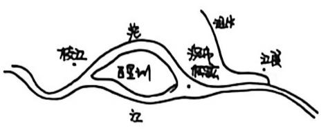

来源：历史地理复习资料（孙版）.docx p.1｜🟢 来自资料

### 历史地理复习资料（孙版）.docx · p.1

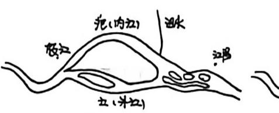

来源：历史地理复习资料（孙版）.docx p.1｜🟢 来自资料

### 历史地理复习资料（孙版）.docx · p.1

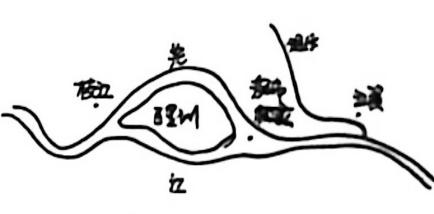

来源：历史地理复习资料（孙版）.docx p.1｜🟢 来自资料

### 历史地理复习资料（孙版）.docx · p.1

来源：历史地理复习资料（孙版）.docx p.1｜🟢 来自资料

### 历史地理复习资料（孙版）.docx · p.1

来源：历史地理复习资料（孙版）.docx p.1｜🟢 来自资料

### 历史地理复习资料（孙版）.docx · p.1

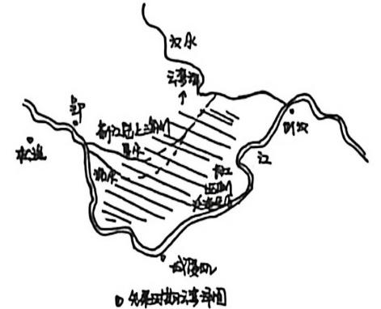

来源：历史地理复习资料（孙版）.docx p.1｜🟢 来自资料

### 历史地理复习资料（孙版）.docx · p.1

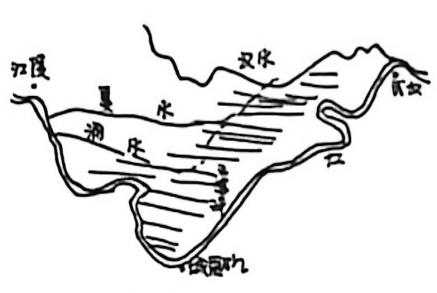

来源：历史地理复习资料（孙版）.docx p.1｜🟢 来自资料

### 历史地理复习资料（孙版）.docx · p.1

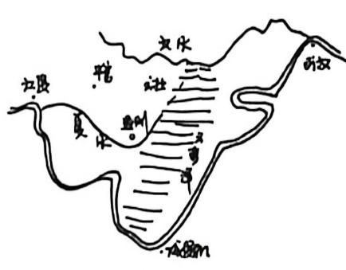

来源：历史地理复习资料（孙版）.docx p.1｜🟢 来自资料

### 历史地理复习资料（孙版）.docx · p.1

来源：历史地理复习资料（孙版）.docx p.1｜🟢 来自资料

### 历史地理复习资料（孙版）.docx · p.1

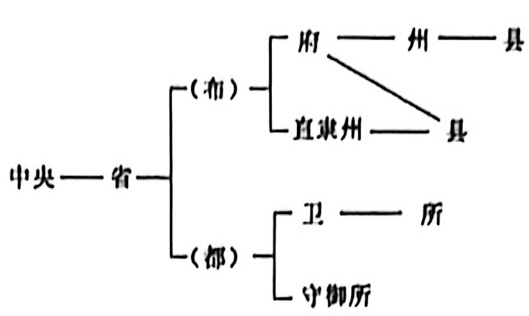

来源：历史地理复习资料（孙版）.docx p.1｜🟢 来自资料

### 历史地理复习资料（孙版）.docx · p.1

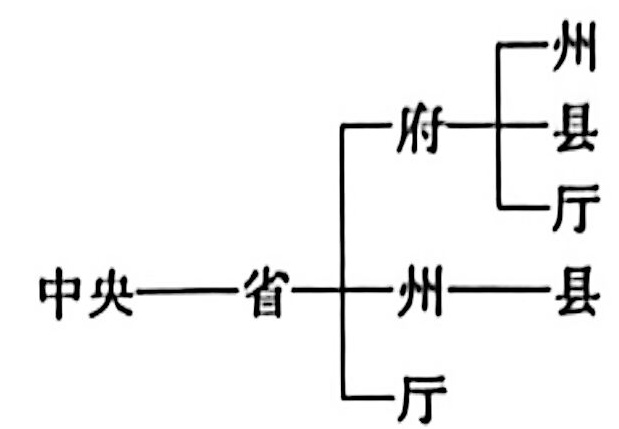

来源：历史地理复习资料（孙版）.docx p.1｜🟢 来自资料

### 历史地理复习资料（孙版）.docx · p.1

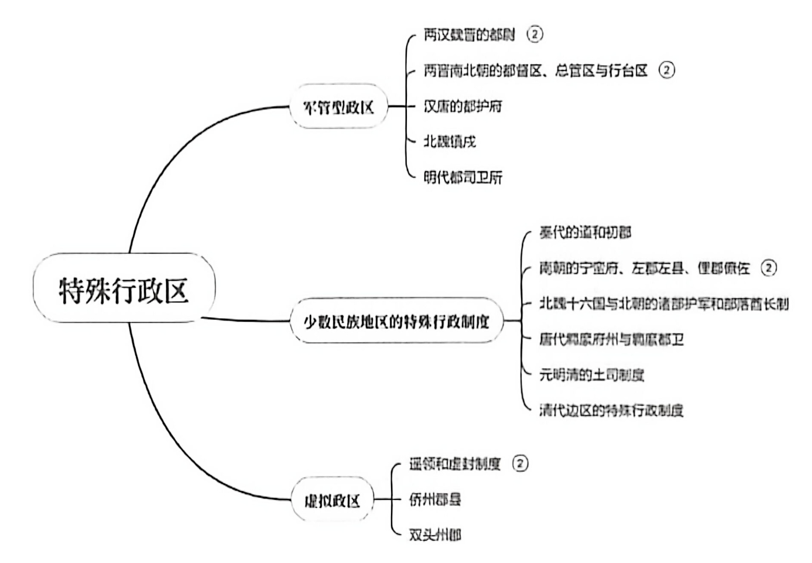

来源：历史地理复习资料（孙版）.docx p.1｜🟢 来自资料

### 历史地理复习资料（孙版）.docx · p.1

来源：历史地理复习资料（孙版）.docx p.1｜🟢 来自资料

### 历史地理复习资料（孙版）.docx · p.1

来源：历史地理复习资料（孙版）.docx p.1｜🟢 来自资料

### 历史地理复习资料（孙版）.docx · p.1

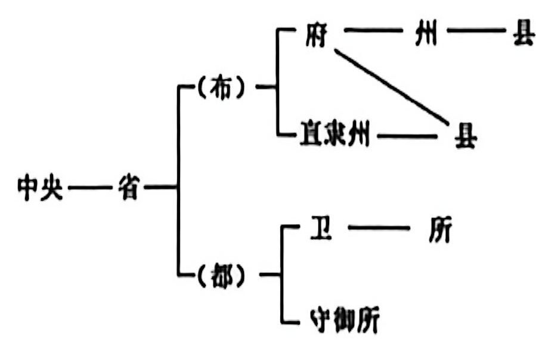

来源：历史地理复习资料（孙版）.docx p.1｜🟢 来自资料

### 历史地理复习资料（孙版）.docx · p.1

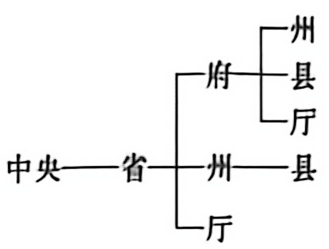

来源：历史地理复习资料（孙版）.docx p.1｜🟢 来自资料

### 历史地理复习资料（孙版）.docx · p.1

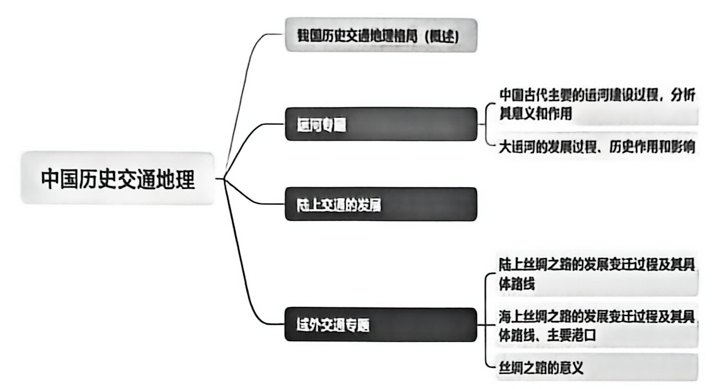

来源：历史地理复习资料（孙版）.docx p.1｜🟢 来自资料

### 历史地理复习资料（孙版）.docx · p.1

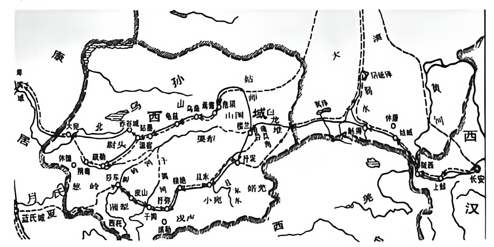

来源：历史地理复习资料（孙版）.docx p.1｜🟢 来自资料

### 历史地理复习资料（孙版）.docx · p.1

来源：历史地理复习资料（孙版）.docx p.1｜🟢 来自资料

### 新建 DOCX 文档.docx · p.1

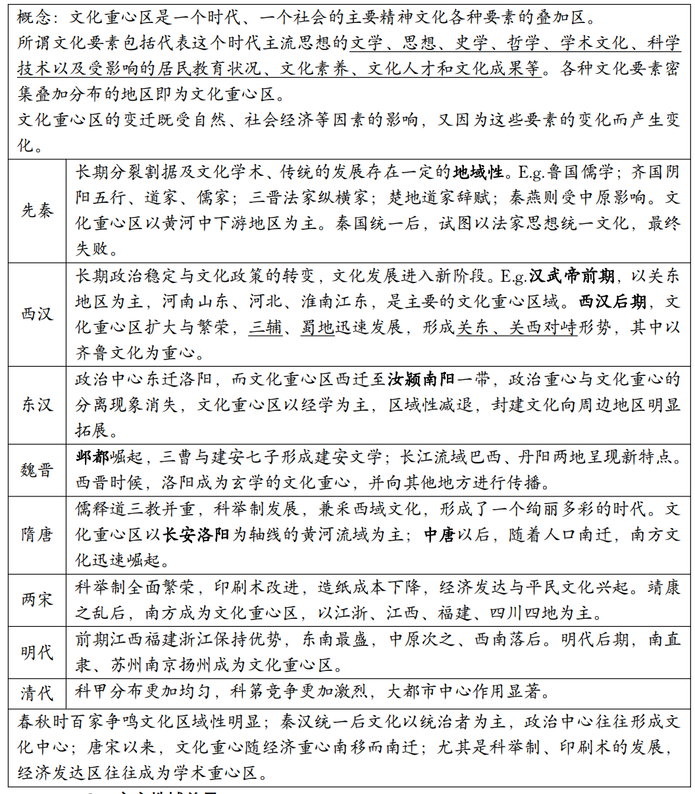

来源：新建 DOCX 文档.docx p.1｜🟢 来自资料
<!-- INGEST_STRUCTURED_VISUALS_END -->
